# SeaCMS远程代码执行漏洞分析(CVE-2025-25813)-先知社区

> **来源**: https://xz.aliyun.com/news/17072  
> **文章ID**: 17072

---

# 漏洞描述

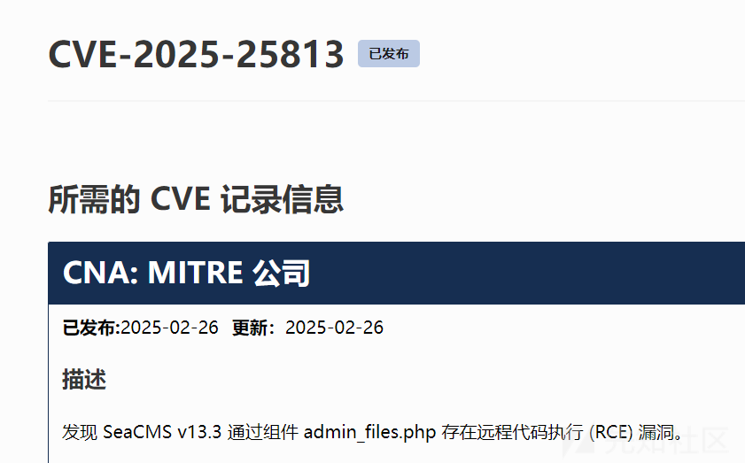

# 漏洞分析

根据漏洞描述定位漏洞代码

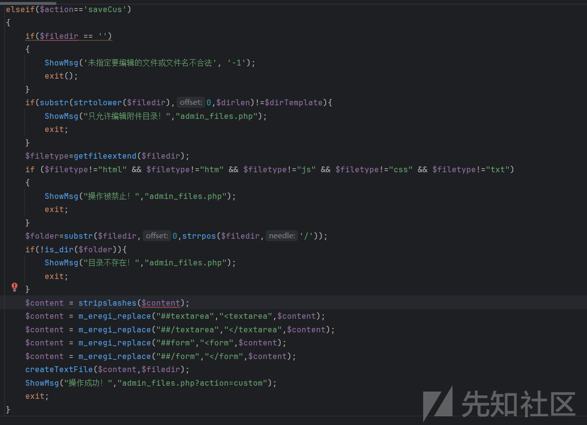

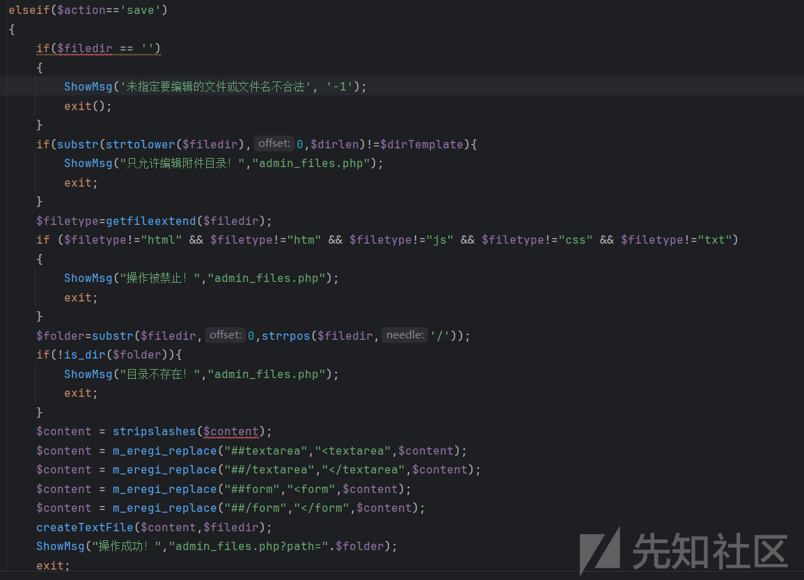

当action=saveCus或者save时，可以进行一个文件写入，不过文件类型被进行了限制，只有html,htm,js,txt,css

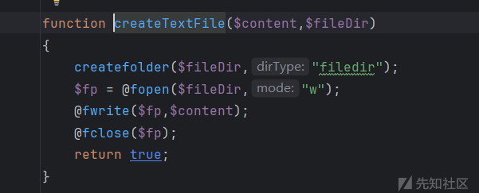

虽然这里并不能写入php文件，但是当action=add或者custom时，这里进行了一个文件包含，这样一来，我们如果把恶意代码写入admin\_files.htm里面，那么就可以执行我们的恶意代码了

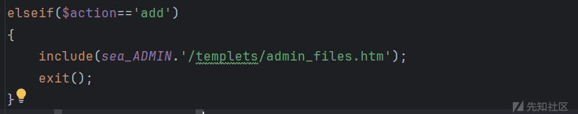

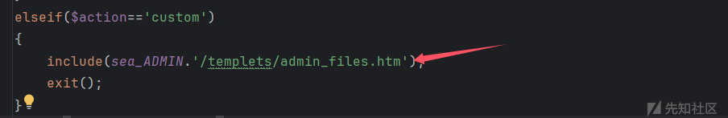

这里的action我们是可控的,

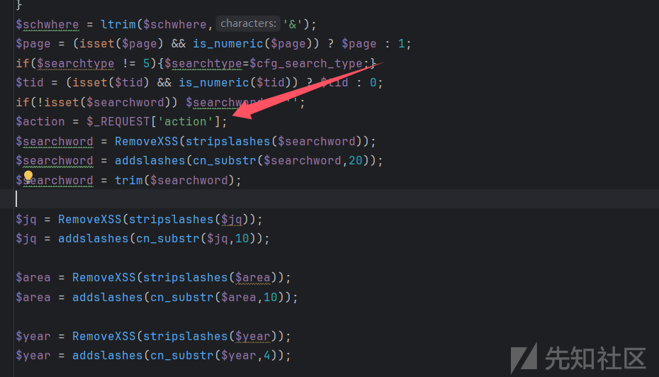

# 漏洞复现

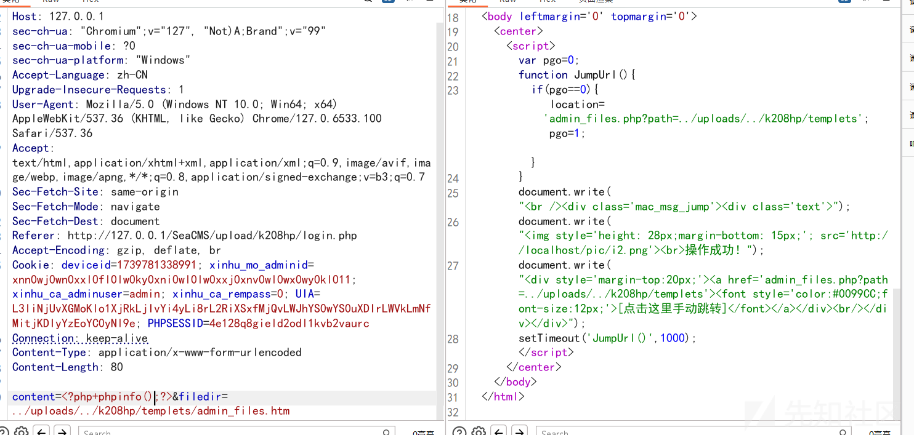

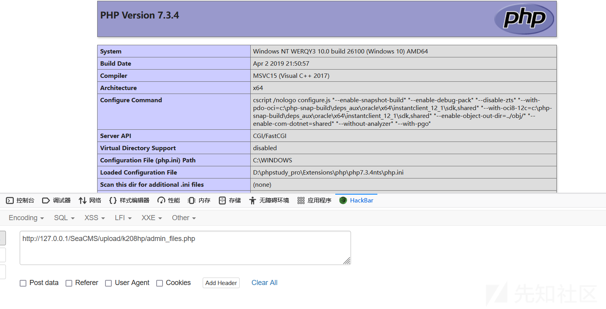

# 任意文件删除

同时发现其文件下还有个action=del时可以删除任意文件

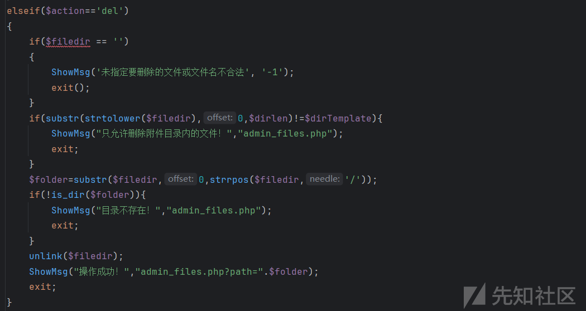

我在上级目录新建一个txt文件

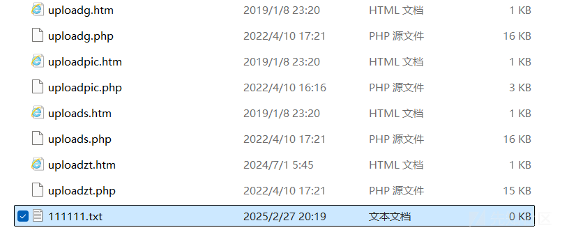

# 漏洞复现

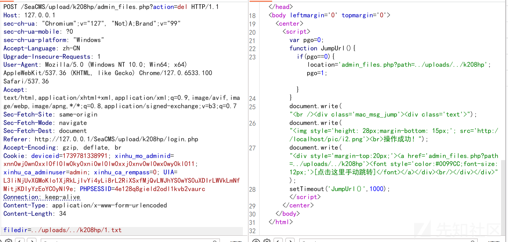

也是成功删除
