# API安全之接口测试&请求协议-先知社区

> **来源**: https://xz.aliyun.com/news/17073  
> **文章ID**: 17073

---

# 参考文档

<https://ltidi.medium.com/race-condition-leads-to-cache-poisoning-77bdfb9483fd>

# 利用Http方法与Api断点进行交互

## 识别API端点支持的http方法

HTTP 方法指定要对资源执行的操作。例如：

* GET- 从资源中获取数据。
* PATCH- 对资源应用部分更改。
* OPTIONS- 检索可在资源上使用的请求方法类型的信息。

利用不同的http方法可以扩大攻击面，比如：

* GET /api/tasks 获取任务列表
* POST /api/tasks 创建新任务
* DELETE /api/tasks/1 删除任务
* PATCH /api/tasks/1 对任务进行修改
* OPTIONS /api/tasks/1 检索资源上可以使用请求方法的类型信息。

## 识别API端点支持的内容类型

API端点通常需要特定格式的数据。更改内容类型可以触发响应的

* 触发错误以泄露有用的信息
* 绕过有缺陷的防御
* 利用处理逻辑的差异。例如，API在处理JSON数据时可能是安全的，但在处理XML时容易受到注入攻击。

在数据包中修改 Content-Type 请求头即可

```
Content-Type:application/json
Content-Type:x-www-form-urlencoded
Content-Type:
```

## 实战

比如我的目标是零元购，这个网站利用api的特性，我们可以考虑是否可以利用http方法利用API端点。比如我想将修改，那么对应的HTTP方法就是 PATCH方法。

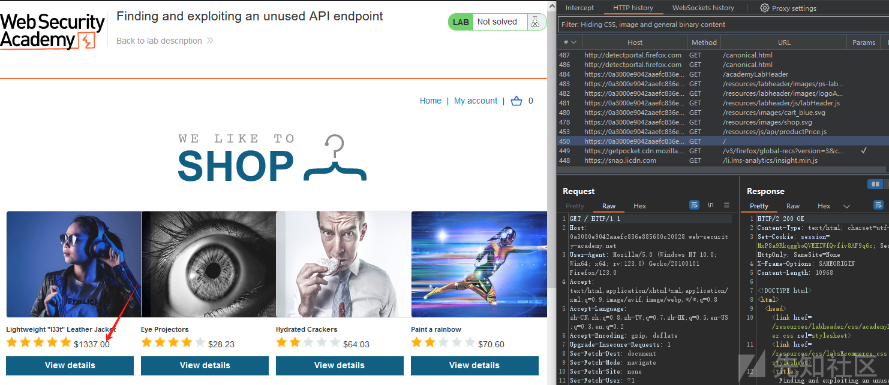

通过抓包，我们很明显可以看见这个是api的端点

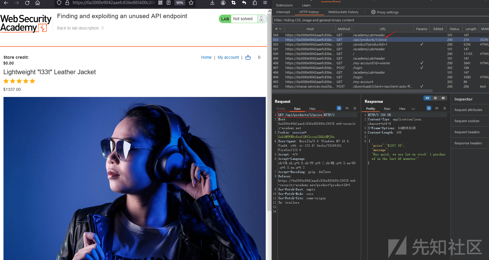

尝试利用，将GET请求方法修改为 OPTIONS ，可以看见返回包的结果为 不允许的使用方法，说明了这个网站不让我们检索可以用什么请求方法

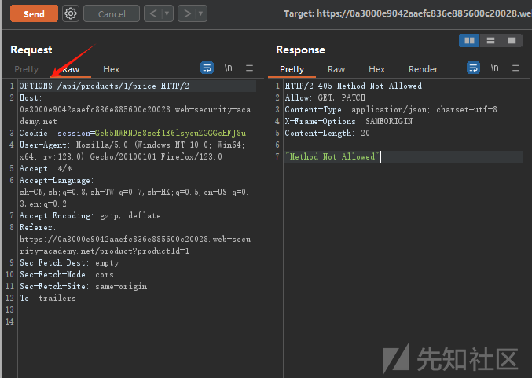

这个时候我们使用 PATCH 方法，看看能不能修改这个API端点的资源。

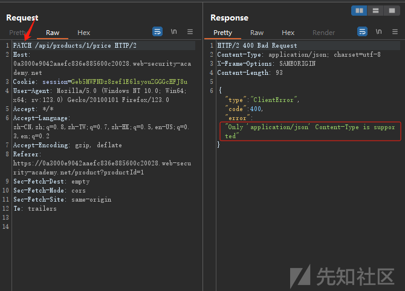

可以看见返回的结果不一样了 ，而且说明了请求的方法要 application/json 才可以，我们修改 Content-Type请求头

```
Content-Type:application/json
```

可以看见之前的参数构造是类似这个的

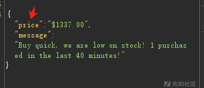

这个时候我们修改数据包，可以看见目标网站返回了200的请求成功！而且我们的价格也被成功修改了

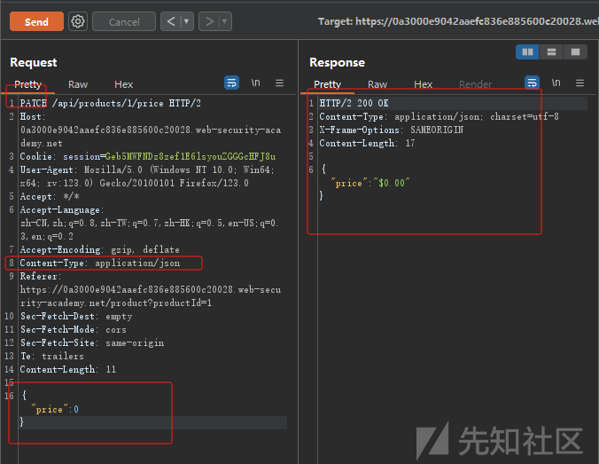


尝试下单


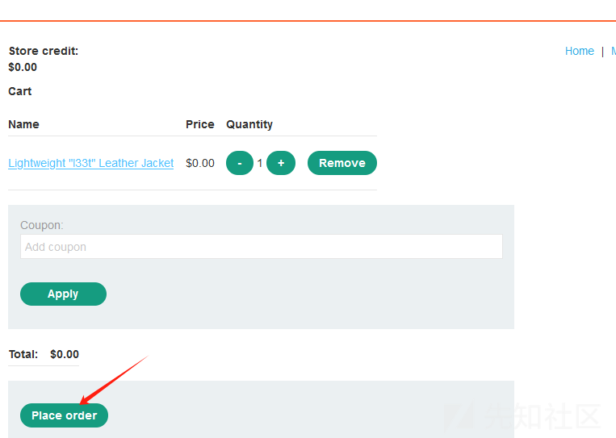

可以看见购买成功，说明了 API端点支持的http方法可能会造成漏洞的产生。

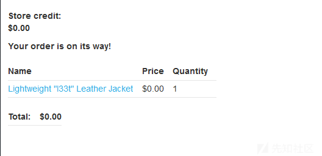

# 自动的绑定的隐藏参数

## 原理

批量分配（也称为自动绑定）可能会无意中创建隐藏的参数。当软件框架自动将请求参数绑定到内部对象的字段时，就会发生这种情况。因此批量分配可能会导致应用程序支持开发人员从未打算处理的参数。

## 识别隐藏参数

由于批量分配从对象字段创建参数，因此我们通常可以通过手动检查API返回的对象来识别这些隐藏参数。

比如，考虑一个

```
PATCH /api/users
```

的请求，他是用户能够更新他们的用户名和电子邮件，以下JSON：

```
{
    "username": "wiener",
    "email": "wiener@example.com",
}
```

请求

```
GET /api/users/123
```

返回了以下JSON:

```
{
    "id": 123,
    "name": "John Doe",
    "email": "john@example.com",
    "isAdmin": "false"
}
```

这个返回的JSON数据表明了 id 和 isAdmin 参数与更新的用户名和电子邮件参数一起绑定到内部用户对象。

## 测试批量分配漏洞

为了测试是否可以修改枚举的 isAdmin参数值，可以将它添加到 PATCH 请求中

```
PATCH /api/users
```

请求的内容：

```
{
    "username": "wiener",
    "email": "wiener@example.com",
    "isAdmin": false,
}
```

发送一个无效的请求 isAdmin ：

```
{
  "username": "wiener",
  "email": "wiener@example.com",
  "isAdmin": "foo",
}
```

如果应用程序的返回不太一样，说明了无效值会影响查询逻辑，但有效值不会。这可能表明用户可以成功更新该参数，这个时候我们可以发送一个参数值设置为 PATCH 的请求，尝试利用以下漏洞：isAdmin:true

```
{
    "username": "wiener",
    "email": "wiener@example.com",
    "isAdmin": true,
}
```

如果isAdmin请求中的值在未经过充分验证和清理的情况下绑定到用户对象，则用户wiener可能会被错误地授予管理员权限。

## 实战

我们这里的目标是零元购，这个夹克衫


添加到购物车


这个时候来到购物车准备买单


这个时候发现出来了一个API端点

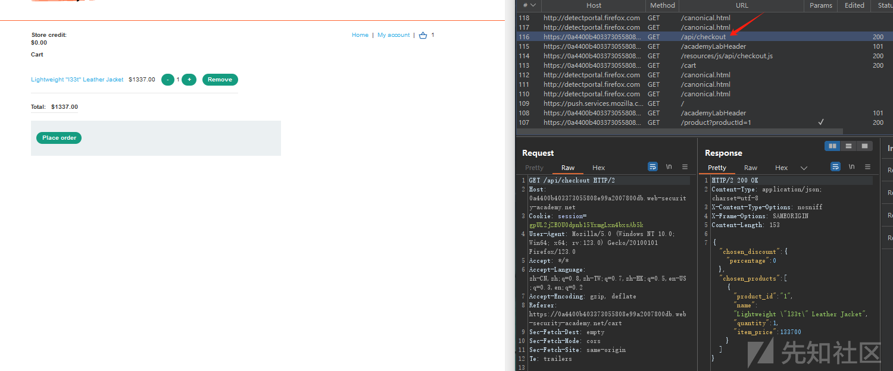

并且返回了以下JSON数据：

```
{
    "chosen_discount": {
        "percentage": 0
    }, 
    "chosen_products": [
        {
            "product_id": "1", 
            "name": "Lightweight "l33t" Leather Jacket", 
            "quantity": 1, 
            "item_price": 133700
        }
    ]
}
```

这个时候点击买单

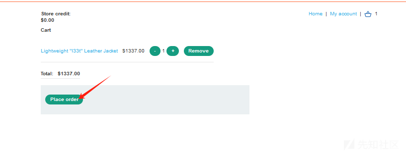

返回burpsuite可以看见，多了一个 POST 请求的API端点，我们知道http支持的POST方法一般都是创建的意思，说明了我们可以利用这个数据包进行修改

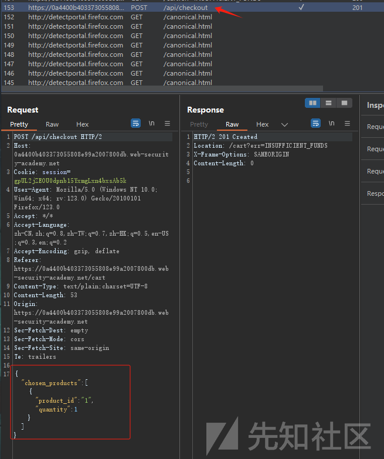

```
{
    "chosen_products": [
        {
            "product_id": "1", 
            "quantity": 1
        }
    ]
}
```

chosen\_discount的意思是折扣，percentage的意思是百分比

```
    "chosen_discount": {
        "percentage": 0
    }, 
```

如果我们将百分比改为100，然后再添加到这个POSTAPI端点的数据包中，那么理论上就是可以零元购了：

```
{
    "chosen_discount": {
        "percentage": 100
    }, 
    "chosen_products": [
        {
            "product_id": "1", 
            "quantity": 1
        }
    ]
}
```

可以看见我们的折扣率创建成功了

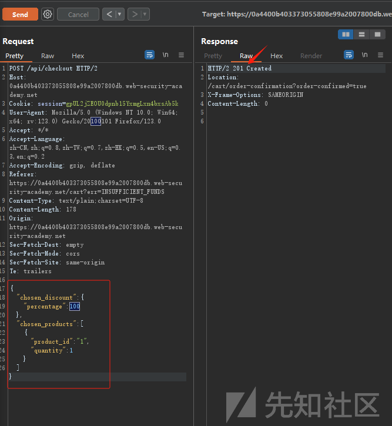

直接买空了

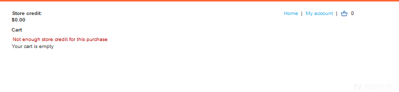

# 预防API漏洞

在设计API时，请确保从一开始就考虑安全性，比如：

* 禁止API公开访问，保护好API文档
* 确保API文档保持最新，以便合法测试人员能够完全了解API的攻击面
* 应用允许的HTTP方法的运行列表
* 验证每个请求或响应是否符合预期的内容类型
* 使用通用错误消息以避免泄露可能对攻击者有用的信息
* 对API的所有版本的采取保护措施，而不是当前版本

为了防止批量分配漏洞的产生，请将用户可以更新的属性列于允许名单，并将用户不应更行的敏感属性列入黑名单。

# 服务端参数污染

## 什么是服务端参数污染

某些系统包含无法通过互联网直接访问的内部API。当网站将用户输入嵌入到对内部API的服务器端请求中而未进行充分编码时，就会发生服务器参数污染。这意味着攻击者可能能够操纵或注入参数， 从而使他们能够实现以下目的：

* 覆盖现有参数
* 修改应用程序行为
* 访问未经授权的数据

我们可以测试任何用户输入是否存在任何类型的参数污染。例如，查询参数、表单字段、标头和 URL 路径参数都可能存在漏洞。

## 测试查询字符串中的服务器端参数污染

* 要测试查询字符串中的服务器端参数污染，请在输入中放置查询语法字符（如#、&、=）

假设有可能存在漏洞一个应用程序，它运行根据用户名搜索其他用户。当我们搜索其他用户的时候，浏览器会发出以下请求：

```
GET /userSearch?name=peter&back=/home
```

为了检索用户信息，服务器使用以下请求查询内部API：

```
GET /users/search?name=peter&publicProfile=true
```

## 截断查询字符串

我们可以使用URL编码 # 字符串来尝试截断服务器端请求。为了方便我们解释响应，可以在 # 字符后添加一个字符串。

例如，您可以将查询字符串修改为以下内容：

```
GET /userSearch?name=peter%23foo&back=/home
```

前端会尝试访问一下URL:

```
GET /users/search?name=peter#foo&publicProfile=true
```

> 必须对字符进行URL 编码 #。否则，前端应用程序会将其解释为片段标识符，并且不会将其传递到内部API。

查看响应以查找有关查询是否被截断的线索。例如，如果响应返回 user peter,则服务器查询可能已被截断。如果 Invalid name返回错误消息。这表明服务器端可能未被截断。

如果能截断服务器端请求，则无需将该字段 publicprofile 设置为 true，我们可以利用这一点返回非公开用户的个人资料。

## 注入无效参数

我们可以使用URL编码 & 字符尝试向服务器端请求添加第二个参数。

例如，我们可以将查询字符串修改为以下内容：

```
GET /userSearch?name=peter%26foo=xyz&back=/home
```

这会导致服务器端向内部API发出以下请求：

```
GET /users/search?name=peter&foo=xyz&publicProfile=true
```

查看响应以获取有关如何解析附加参数的线索。例如，如果响应没有变化，这可能表明该参数已成功注入但被应用程序忽略。

## 注入有效参数

如果我们能够修改查询字符串，则可以尝试向服务器端请求添加第二个有效参数。

> 可以参考前面的寻找隐藏参数

例如，如果我们已经确定了email参数，则可以将其添加到查询字符串中，如下所示：

```
GET /userSearch?name=peter%26email=foo&back=/home
```

这会导致服务端向内部API发出以下请求：

```
GET /users/search?name=peter&email=foo&publicProfile=true
```

## 覆盖现有参数

要确认应用程序是否容易受i到服务器端参数污染，我们可以尝试覆盖原始参数。通过注入具有相同名称的第二个参数来执行操作。

例如，将查询字符串修改为以下内容：

```
GET /userSearch?name=peter%26name=carlos&back=/home
```

这会导致服务端向内部API发出以下请求：

```
GET /users/search?name=peter&name=carlos&publicProfile=true
```

内部API解释两个 name 参数。其影响取决于应用程序如何处理第二个参数。这在不同的网络技术中有所不同。例如：

* PHP 仅仅解析最后一个参数。这将导致用户搜索 carlos
* ASP.NET结合这两个参数。这将导致用户搜索 peter,carlos，从而可能导致Invalid username错误消息。
* Node.js /express 仅解析第一个参数。这会导致用户搜索peter，结果不变。

如果我们能够覆盖原始参数，则可能进行漏洞利用。例如，我们可以添加 name=administrator到请求中。这可能让我们以管理员用户身份登陆。

## 实战-利用查询字符串中的服务器端参数污染

### 信息收集

点击忘记密码

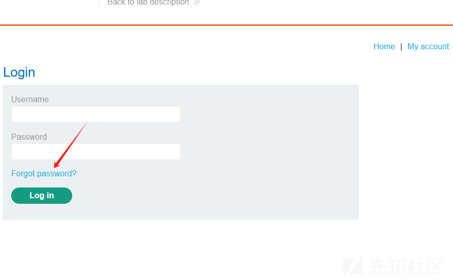

通过数据包可以看见之后网站加载了这个 forgotPassword.js 文件

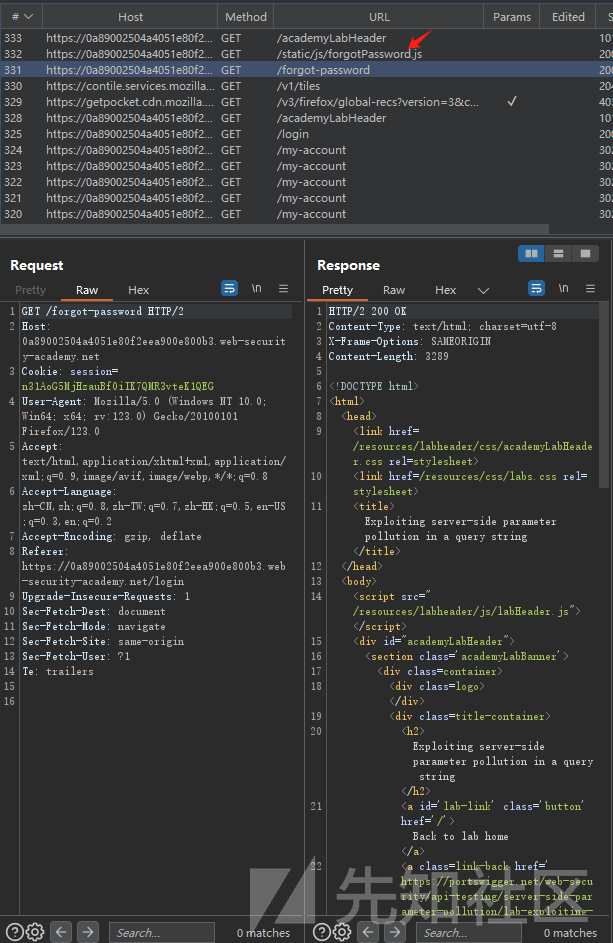

我们可以在当前页面点击 F12，然后如图点击，也可以查看 forgotPassword.js

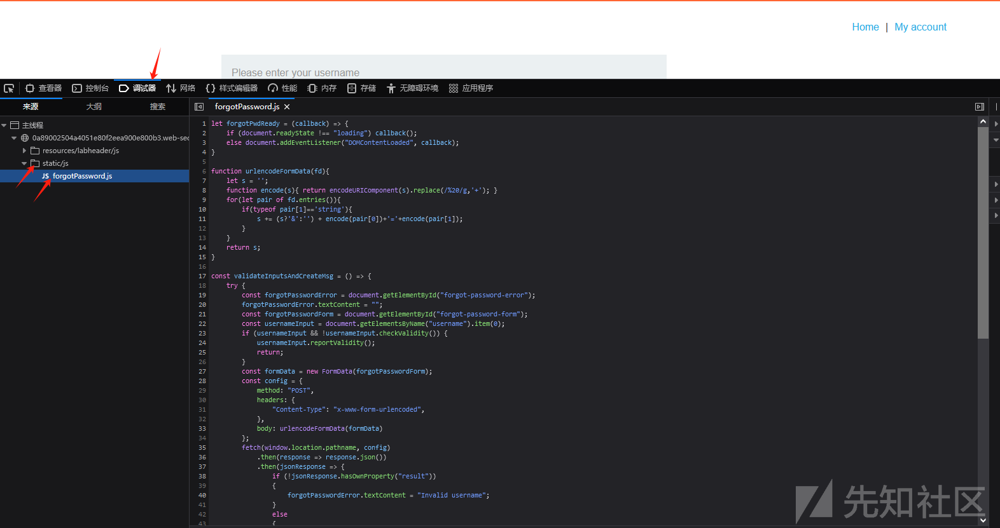

其中在这里可以看见一个很可疑的参数端点，意思是最后我们需要通过这个令牌，然后就可以重置密码了，这里我们的目标是 administrator 用户

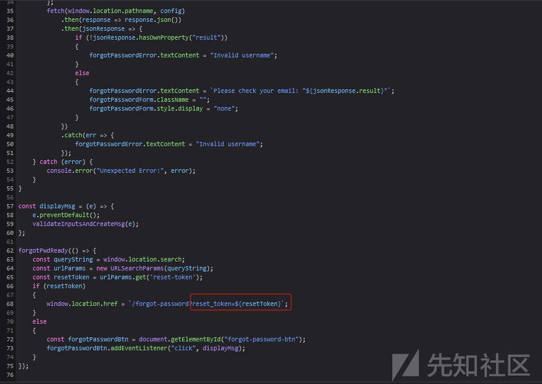

```
resst_token
```

如果直接拼接访问，任意构造的令牌，可以看见令牌无效

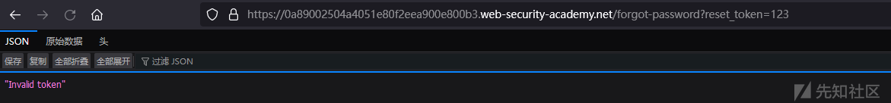

在这里我们找到服务端中可以查询的字符串参数

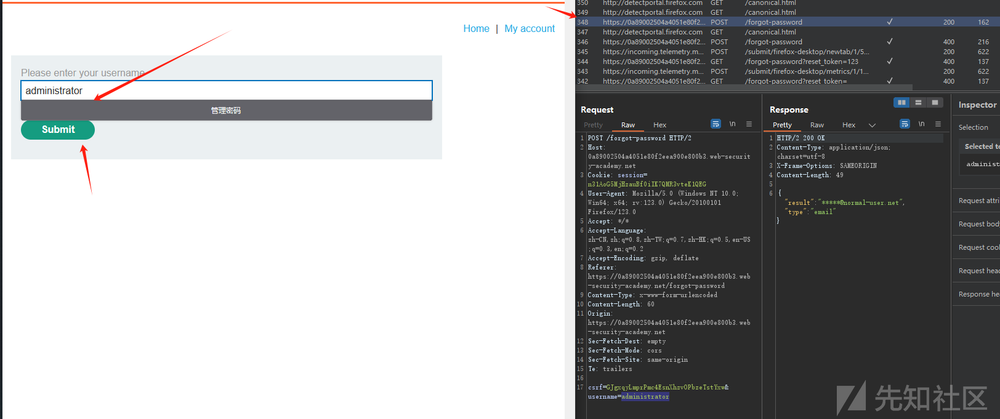

### 尝试注入无效参数

尝试注入一个无效参数

```
username=administrator%26x=a
```

可以看见响应了参数不支持，说明了内部API把 &x=a 为单独的参数，而不是用户名的一部分。

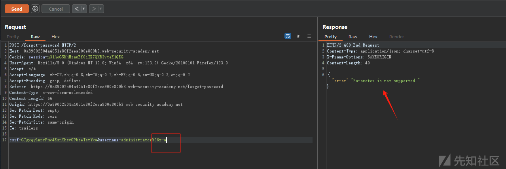

### 尝试覆盖现有参数

尝试覆盖现有参数，可以看见API内部对第一个参数进行处理

```
username=administratora%26username=colors
```

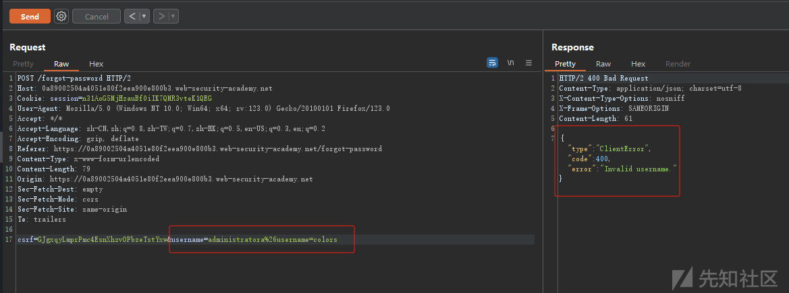

### 截断查询字符串

这个时候截断查询字符串

```
username=administratora%23a
```

可以看见服务端响应返回了报错信息：字段未指定

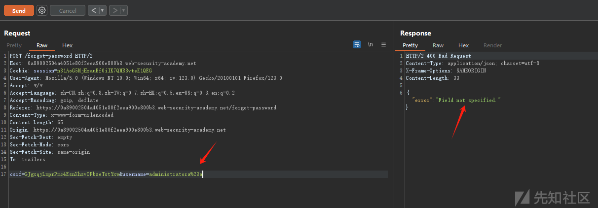

这表明了查询字符串可能截断成功了

### 注入有效参数

我们利用响应给的 field作为参数

```
username=administrator%26field=
```

可以看见服务端响应体返回了未知的字段，说明了这个参数我们是可以利用的

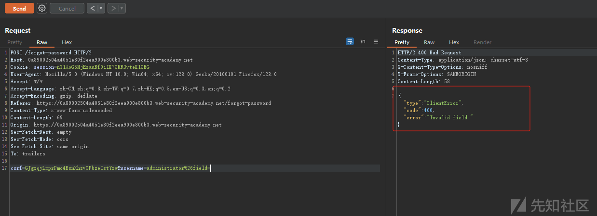

发送到爆破模块

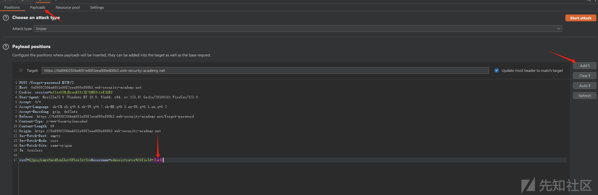

可以选择自带的字典，服务端参数

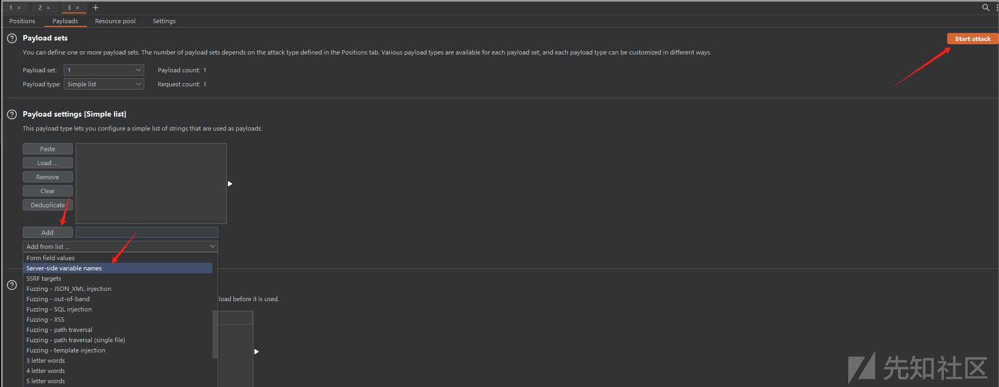

最后爆破出来了以下：

```
username
email
```

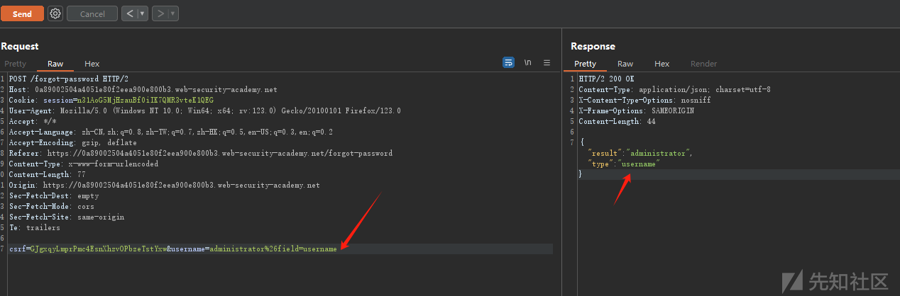

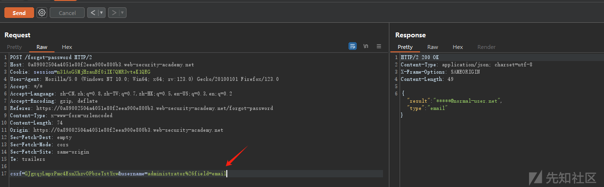

我们的目标是重置administrator账户，这个时候考虑到之前一开始js看到的一个参数 reset\_token，放入field参数里面

```
username=administrator%26field=reset_token
```

可以看见成功获取到了重置administrator 用户的令牌

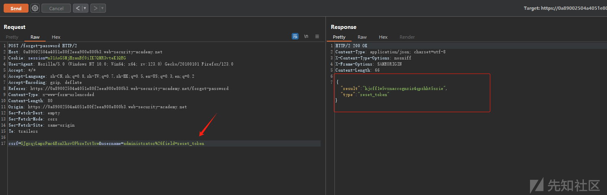

加上截断符号也是可以的，表明了截断是成功的

```
username=administrator%26field=reset_token%23
```

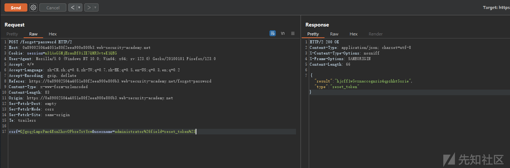

这个时候拼接url和令牌可以看见来到了 administraotr 用户的重置密码的页面

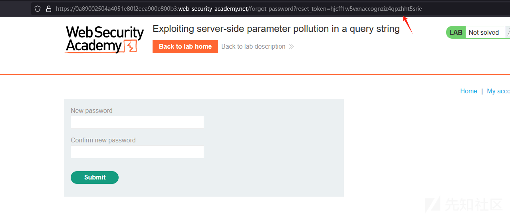

最后成功登入到了 administrator 用户，具有管理员权限

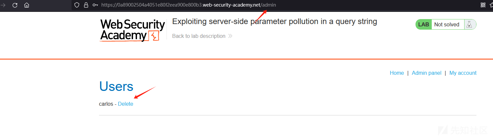

# 测试REST 路径中的服务器端参数污染

RESTful API可能会将参数名称和值放在URL路径中，而不是查询字符串中。例如，考虑一下路径：

```
/api/users/123
```

URL路径可能分解如下：

* /api 是根API端点
* /users 代表一种资源，在本例中是 users
* /123 表示一个参数，这里是特定用户的标识符

假设有一个应用程序，它运行您根据用户名编辑用户个人资料。请求将发送以下端点：

```
GET /edit_profile.php?name=petter
```

这会导致以下服务器端请求：

```
GET /api/private/users/peter
```

攻击者可能能够操控服务器端 URL 路径参数来利用该API。测试是否存在漏洞，我们可以添加路径便利序列来修改参数并观察应用程序的响应情况。

我们可以提交 URL 编码 peter/../admin 作为参数的值name：

```
GET /edite_prifle.php?name=pteter%2f..%2fadmin
```

这可能会导致以下服务器端请求：

```
GET /api/private/users/peter/../admin
```

如果服务器端客户端或后端API规范化该路径，则可能解析为 /api/private/users/admin。

# 测试结构化数据格式中的服务器端参数污染

攻击者可能能够操控参数来利用服务器处理其他结构化数据格式（例如 JSON 或 XML）时的漏洞。要测试这一点，请将以外的结构化数据注入用户输入，然后查看服务器如何响应。

假设有一款应用，它允许用户编辑个人资料，然后通过向服务器端API发出请求来应用更改。当您编辑姓名时，浏览器会发出以下请求：

```
POST /myaccount
name=peter
```

这会导致以下服务器端请求：

```
PATCH /users/7312/update
{"name":"peter"}
```

我们可以尝试access\_level 按如下方式将参数添加到请求中：

```
POST /myaccount
name=peter","access_level":"administrator
```

如果用户输入在没有经过充分验证或清理的情况下被添加到服务器端JSON数据中，则会导致以下服务器端请求：

```
PATCH /users/7312/update
{name="peter","access_level":"administrator"}
```

这可能会导致用户 peter 被授予管理员访问权限。

## 例子2

考虑一个类似的例子，但客户端用户输入的时 JSON 数据。

当我们编辑姓名时，浏览器会发出以下请求：

```
POST /myaccount
{"name""peter"}
```

这会导致以下服务器端请求：

```
PATCH /users/7312/update
{"name":"peter"}
```

我们可以尝试 access\_level 按如下方式将参数添加到请求中：

```
POST /myaccount
{"name":"peter","access_level":"administrator"}
```

如果对用户输入进行解码，然后在没有进行充分编码的情况下将其添加到服务器端 JSON 数据中，则会导致服务器端请求：

```
PATCH /users/7312/update
{"name":"peter","access_level","administrator"}
```

同样，这可能会导致用户 peter 被授予管理员访问权限。

结构化格式注入也可能发生在响应中。例如，如果用户输入安全地存储在数据库中，然后嵌入来自后端 API 的 JSON 响应中没有进行充分编码，则可能会发生这种情况。我们通常可以像在请求中一样响应中检测和利用结构式化格式注入

# 防止服务器端参数污染

为了防止服务器端参数污染，使用允许列表定义不需要编码的字符，并确保所有其他用户输入在包含在服务端请求中值前都经过编码。我们可以确保所有输入符合预期的格式和结构。
