# 某某行逆向分析-先知社区

> **来源**: https://xz.aliyun.com/news/17090  
> **文章ID**: 17090

---

## 前言

设备: pixel2 android10

app: 6IuPZeih{beihai}jDMuM{beihai}jMuMQ==

​

## 正文

### 抓包

抓登录包，下面分析signature，random，password字段的编码加密算法

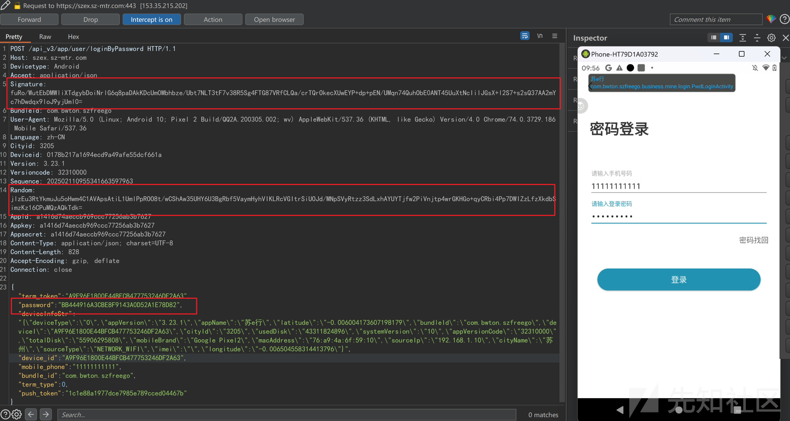

### 脱壳

使用开发者助手查看app信息，发现存在网易加固

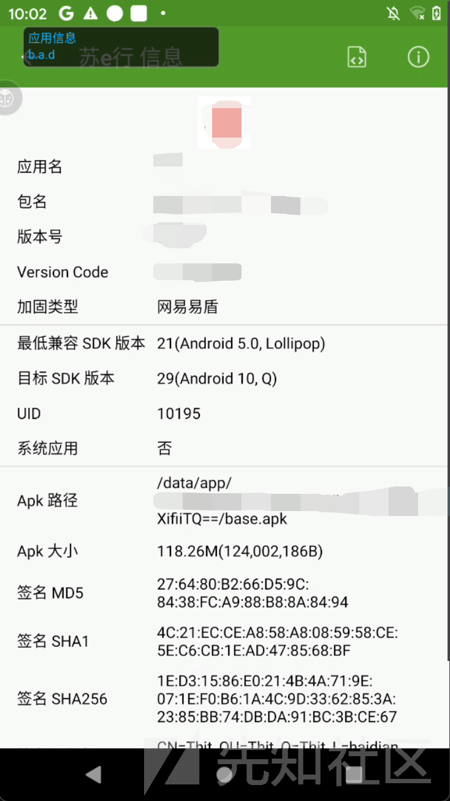

这个app里面没有运行frida检测机制，所以直接运行脱壳脚本就好了

```
(function() {
  function klog(data) {
    var message = {};
    message["jsname"] = "dump_dex";
    message["data"] = data;
    send(message);
  }

  function klogData(data, key, value) {
    var message = {};
    message["jsname"] = "dump_dex";
    message["data"] = data;
    message[key] = value;
    send(message);
  }

  function get_self_process_name() {
    var openPtr = Module.getExportByName('libc.so', 'open');
    var open = new NativeFunction(openPtr, 'int', ['pointer', 'int']);

    var readPtr = Module.getExportByName("libc.so", "read");
    var read = new NativeFunction(readPtr, "int", ["int", "pointer", "int"]);

    var closePtr = Module.getExportByName('libc.so', 'close');
    var close = new NativeFunction(closePtr, 'int', ['int']);

    var path = Memory.allocUtf8String("/proc/self/cmdline");
    var fd = open(path, 0);
    if (fd != -1) {
      var buffer = Memory.alloc(0x1000);

      var result = read(fd, buffer, 0x1000);
      close(fd);
      result = ptr(buffer).readCString();
      return result;
    }

    return "-1";
  }


  function mkdir(path) {
    var mkdirPtr = Module.getExportByName('libc.so', 'mkdir');
    var mkdir = new NativeFunction(mkdirPtr, 'int', ['pointer', 'int']);


    var opendirPtr = Module.getExportByName('libc.so', 'opendir');
    var opendir = new NativeFunction(opendirPtr, 'pointer', ['pointer']);

    var closedirPtr = Module.getExportByName('libc.so', 'closedir');
    var closedir = new NativeFunction(closedirPtr, 'int', ['pointer']);

    var cPath = Memory.allocUtf8String(path);
    var dir = opendir(cPath);
    if (dir != 0) {
      closedir(dir);
      return 0;
    }
    mkdir(cPath, 755);
    chmod(path);
  }

  function chmod(path) {
    var chmodPtr = Module.getExportByName('libc.so', 'chmod');
    var chmod = new NativeFunction(chmodPtr, 'int', ['pointer', 'int']);
    var cPath = Memory.allocUtf8String(path);
    chmod(cPath, 755);
  }

  function dump_dex() {
    var libart = Process.findModuleByName("libart.so");
    var addr_DefineClass = null;
    var symbols = libart.enumerateSymbols();
    for (var index = 0; index < symbols.length; index++) {
      var symbol = symbols[index];
      var symbol_name = symbol.name;
      //这个DefineClass的函数签名是Android9的
      //_ZN3art11ClassLinker11DefineClassEPNS_6ThreadEPKcmNS_6HandleINS_6mirror11ClassLoaderEEERKNS_7DexFileERKNS9_8ClassDefE
      if (symbol_name.indexOf("ClassLinker") >= 0 &&
          symbol_name.indexOf("DefineClass") >= 0 &&
          symbol_name.indexOf("Thread") >= 0 &&
          symbol_name.indexOf("DexFile") >= 0) {
        console.log(symbol_name, symbol.address);
        addr_DefineClass = symbol.address;
      }
    }
    var dex_maps = {};
        var dex_count = 1;

        console.log("[DefineClass:]", addr_DefineClass);
        if (addr_DefineClass) {
            Interceptor.attach(addr_DefineClass, {
                onEnter: function(args) {
                    var dex_file = args[5];
                    //ptr(dex_file).add(Process.pointerSize) is "const uint8_t* const begin_;"
                    //ptr(dex_file).add(Process.pointerSize + Process.pointerSize) is "const size_t size_;"
                    var base = ptr(dex_file).add(Process.pointerSize).readPointer();
                    var size = ptr(dex_file).add(Process.pointerSize + Process.pointerSize).readUInt();

                    if (dex_maps[base] == undefined) {
                        dex_maps[base] = size;
                        var magic = ptr(base).readCString();
                        if (magic.indexOf("dex") == 0) {

                            var process_name = get_self_process_name();
                            if (process_name != "-1") {
                                var dex_dir_path = "/data/data/" + process_name + "/files/dump_dex_" + process_name;
                                mkdir(dex_dir_path);
                                var dex_path = dex_dir_path + "/class" + (dex_count == 1 ? "" : dex_count) + ".dex";
                                console.log("[find dex]:", dex_path);
                                var fd = new File(dex_path, "wb");
                                if (fd && fd != null) {
                                    dex_count++;
                                    var dex_buffer = ptr(base).readByteArray(size);
                                    fd.write(dex_buffer);
                                    fd.flush();
                                    fd.close();
                                    console.log("[dump dex]:", dex_path);

                                }
                            }
                        }
                    }
                },
                onLeave: function(retval) {}
            });
        }
    }

    function main() {
        klogData("", "init", "dump_dex.js init hook success")
        dump_dex();
    }
    setImmediate(main);
})();
```

运行后到处点点，dump出尽可能多的dex

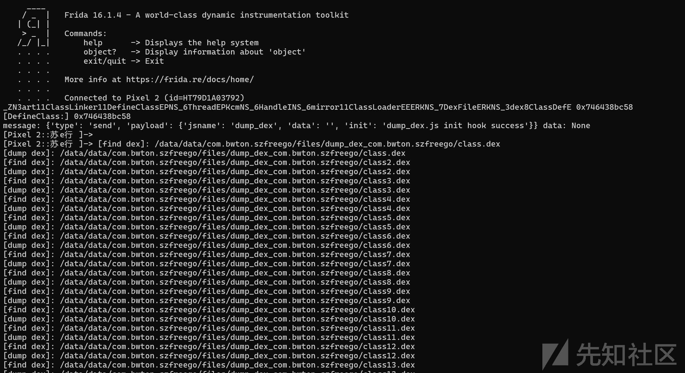

### signature和random字段分析

把结果用jadx反编译。直接祭出一手字符串的大法搜索关键字"signature"，看到不少可疑位置，但是hook了一圈之后好像没找到真正有关的。

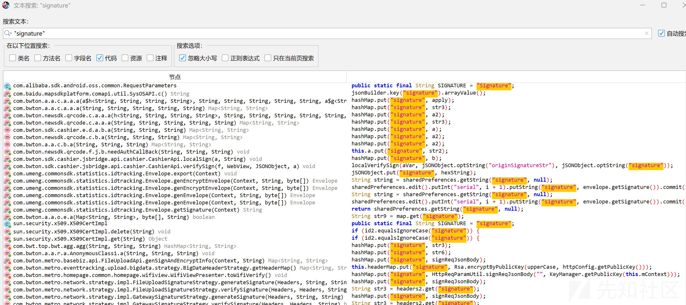

于是换一种方法，直接hook原生库HashMap和JsonObject，代码如下：

```
Java.perform(function () {
  // JSONObject的定位
  var jSONObject = Java.use("org.json.JSONObject");
  jSONObject.put.overload('java.lang.String', 'java.lang.Object').implementation = function (a, b) {
    console.log("jSONObject.put: ", a, b);
    console.log(Java.use("android.util.Log").getStackTraceString(Java.use("java.lang.Exception").$new()));
    return this.put(a, b);
  };
  jSONObject.getString.implementation = function (a) {
    console.log("jSONObject.getString: ", a);
    var result = this.getString(a);
    console.log("jSONObject.getString result: ", result);
    console.log(Java.use("android.util.Log").getStackTraceString(Java.use("java.lang.Exception").$new()));
    return result;
  };

  // HashMap的定位
  var hashMap = Java.use("java.util.HashMap");
  hashMap.put.implementation = function (a, b) {
    console.log("hashMap.put: ", a, b);
    console.log(Java.use("android.util.Log").getStackTraceString(Java.use("java.lang.Exception").$new()));
    return this.put(a, b);
  };
})
```

attach模式运行并把结果保存到txt文件中便于搜索。在结果中搜索signature。

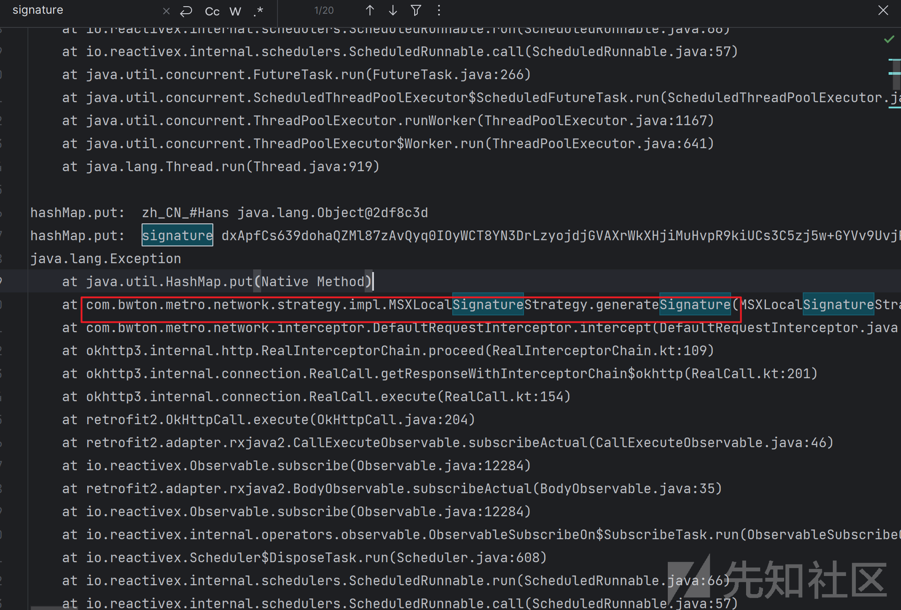

这不就有了嘛，直接在反编译代码中搜索函数com.bwton.metro.network.strategy.impl.MSXLocalSignatureStrategy.generateSignature

可以看到sign是函数signReqJsonBody用公钥加密str得到的

random是函数encryptByPublicKey用公钥加密str2得到的

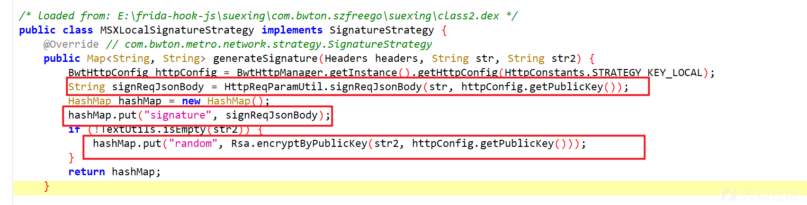

进入函数signReqJsonBody，发现这个只是在encryptByPublicKey前对字符串取了md5哈希而已

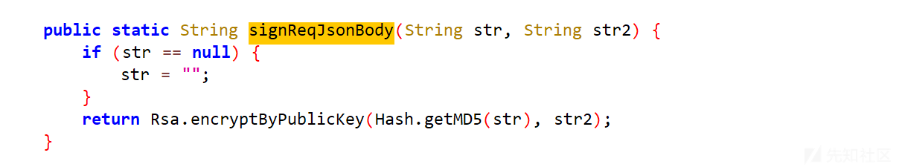

那进入encryptByPublicKey，可以看到这就是ecb模式的rsa算法

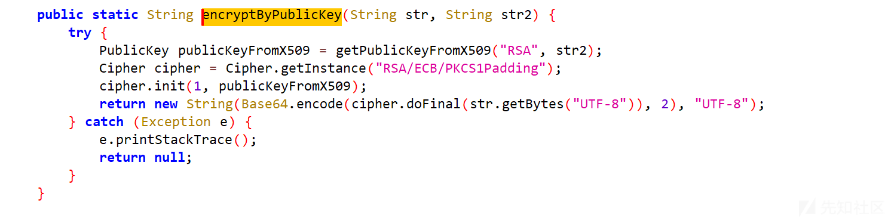

至此signature和random字段的算法明确了，接着就要看公钥和加密的参数是什么了，先hook函数generateSignature

代码如下：

```
function dump_hashMap(map){
  var result = "";
  if (map!== null) {
    var keyset = map.keySet();
    var it = keyset.iterator();
    var first = true; // 用于判断是否是第一个键值对
    while (it.hasNext()) {
      var keystr = it.next().toString();
      var valuestr = map.get(keystr).toString();
      if (!first) {
        result += "&"; // 如果不是第一个键值对，添加 & 分隔符
      }
      result += keystr + "=" + valuestr; // 拼接键值对，用 = 连接键和值
      first = false; // 标记已经不是第一个键值对了
    }
  }
  return result;
}
function hook_generateSignature(){
  Java.perform(
    function () {
      var aClass = Java.use("com.bwton.metro.network.strategy.impl.MSXLocalSignatureStrategy");
      aClass.generateSignature.implementation = function (a,b,c) {
        console.log("headers========>", a);
        console.log("str========>", b);
        console.log("str2========>", c);
        var ret = this.generateSignature(a,b,c);
        console.log("ret========>", dump_hashMap(ret));
        return ret;
      }
    }
  )
}
```

​

attach模式运行，可以看到这个headers跟str2其实是一个东西，每次都不一样。str则是固定的json数据，而且包含了password

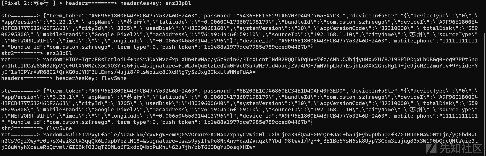

接着要搞清楚str2和公钥是什么

hook函数getPublicKey，打印结果，公钥好像不变

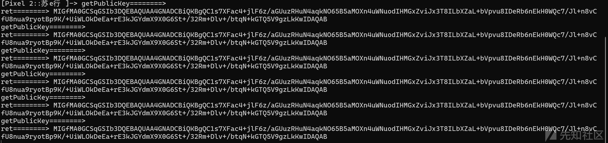

那么就剩下str2了，根据前面的调用栈向上追溯

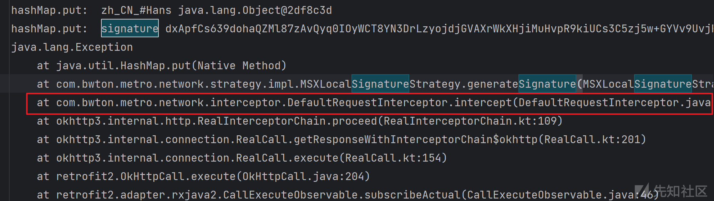

可以看到这个str2是在headers中HEADER\_AES\_KEY字段，点击查看到HEADER\_AES\_KEY的值是headerAesKey。

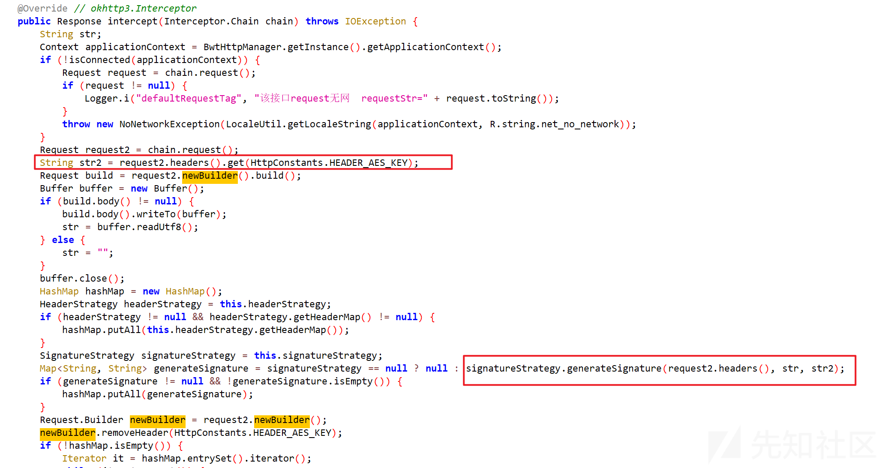

显然这个headers是在之前就初始化过的，如果要顺着okhttp realcall对象的chain一路找过去根据会比较复杂。于是这里想到了个取巧的方法。想着既然str2是从header里获取headerAesKey对应的值，可能还是会涉及hashmap类，于是又在前面hook得到的调用栈结果中搜索headerAesKey。结果真的找到了

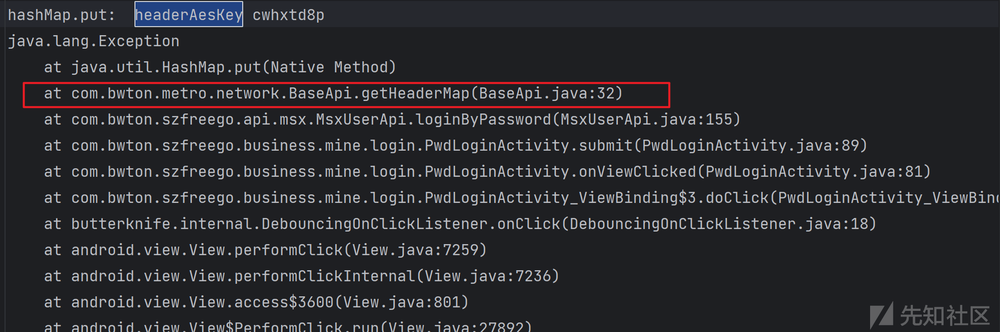

这里确实是添加了headerAesKey键值对，继续往前追溯查看键对应的值是什么

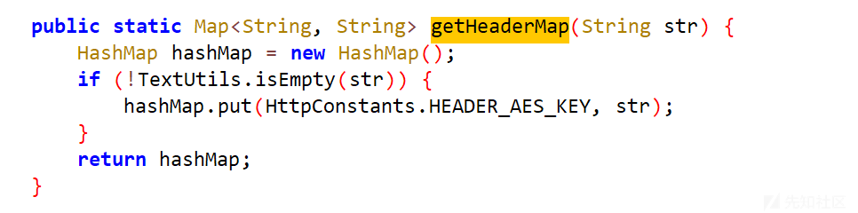

好家伙，好像连password字段都找到了，不过先继续看headerAesKey键对应的值。这个值是genAesKey，它是由函数genAesKey生成的

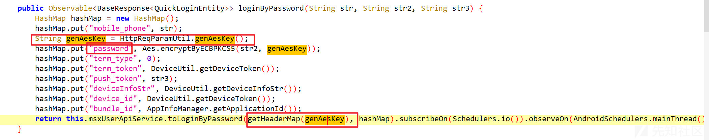

查看函数genAesKey，逻辑相当简单，就是从自定的字符表中随机挑出8个字符

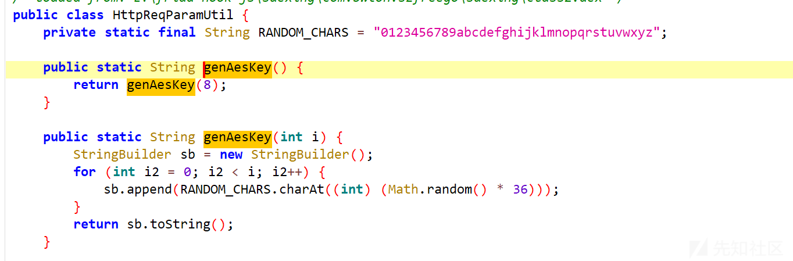

那么用生成random的参数str2也知道了。于是signature和random就都解决了

### password字段分析

password字段同样可以在前面的调用栈结果搜到，正是前面碰到的函数

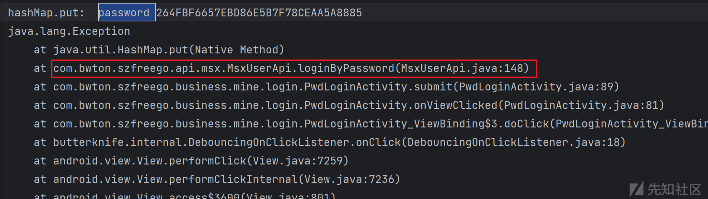

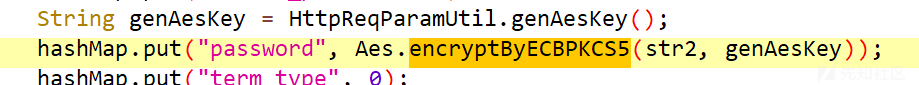

进入Aes.encryptByECBPKCS5，这里使用AES算法的ECB 模式和PKCS5填充方式对字符串进行加密。str是明文，str2是key，这个key就是前面分析过的genAesKey

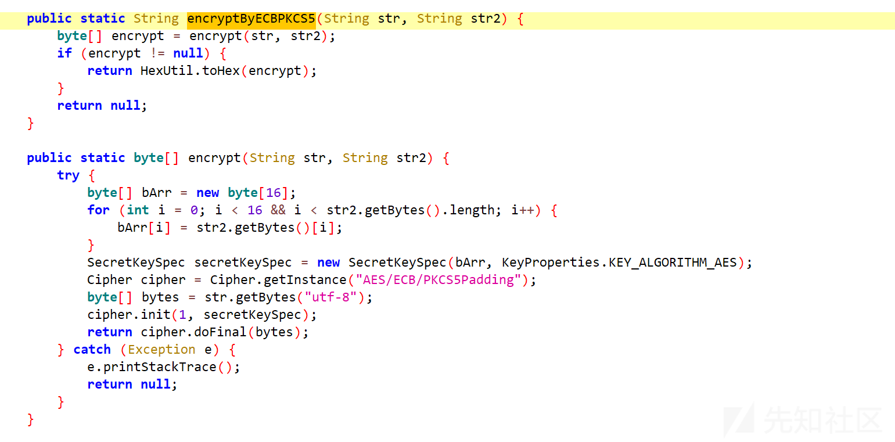

​

hook一下，打印参数和返回值，发现前面的分析没毛病

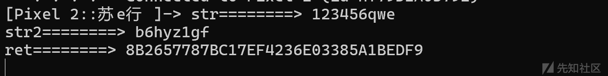

于是password的加密也解决了
