# LibFuzzer实战复现-先知社区

> **来源**: https://xz.aliyun.com/news/17095  
> **文章ID**: 17095

---

# LibFuzzer

LibFuzzer 是一个**in-process**（进程内的），**coverage-guided**（以覆盖率为引导的），**evolutionary**（进化的） 的 fuzz 引擎，是 LLVM 项目的一部分，主要用于对C/C++程序进行Fuzz测试。LibFuzzer三个特性的具体含义为：

* in-process：不会为每个测试用例启动一个进程，而是将所有的测试数据投放在同一个进程的内存空间中
* coverage-guided：对每一个测试输入都进行代码覆盖率计算，不断累积测试用例使得代码覆盖率最大化
* evolutionary：结合了变异和生成两种形势的Fuzz引擎
* 变异：基于已有的数据样本，通过一些变异规则，产生新的测试用例
* 生成：通过对目标协议或接口规范进行建模，从零开始产生测试用例

LibFuzzer与待测的library进行链接，通过向指定的fuzzing入口（即**target函数**）发送测试数据，并跟踪被触达的代码区域，然后对输入的数据进行变异，以达到代码覆盖率最大的目的，其中代码覆盖率的信息由LLVM的SanitizerCoverage工具提供。

## 使用环境

现在的 `libfuzzer` 已经被集成在 `Clang` 中，[Clang](https://link.zhihu.com/?target=https%3A//blog.csdn.net/momo0853/article/details/121040320)是一个类似GCC的C/C++语言编译工具。所以直接安装 `Clang` 即可。

```
sudo apt install clang
```

检查是否安装成功

```
clang --version 
```

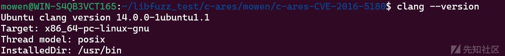

### [CVE-2016-5180](https://c-ares.haxx.se/adv_20160929.html)-fuzz复现

先来实战一下再来详细分析，`CVE-2016-5180` 漏洞为 `Heap overflow in c-ares` ，此错误是导致 ChromeOS 漏洞利用成为可能的两个错误链之一： [重新启动后以 guest 模式执行代码](https://googlechromereleases.blogspot.com/2016/09/stable-channel-updates-for-chrome-os.html)。

查找时间：< 1 秒。

GitHub地址 ： [google/fuzzer-test-suite：模糊测试引擎的测试集 --- google/fuzzer-test-suite: Set of tests for fuzzing engines](https://github.com/google/fuzzer-test-suite/tree/master)

**配置环境**

```
sudo apt install libtool automake -y  #需要使用到buildconf，不然会编译失败
```

**编写fuzz函数**

因为在上面的项目地址中已经有了`target.cc`文件所以这一步您可以选择跳过。

编写 `target.cc` 实现`LLVMFuzzerTestOneInput`函数，将LibFuzzer输入的字节流进行转换，并调用ares\_create\_query函数。

```
// Copyright 2016 Google Inc. All Rights Reserved.
// Licensed under the Apache License, Version 2.0 (the "License");
#include <stdint.h>
#include <stdlib.h>
#include <string>
#include <arpa/nameser.h>

#include <ares.h>

extern "C" int LLVMFuzzerTestOneInput(const uint8_t *Data, size_t Size) {
  unsigned char *buf;
  int buflen;
  std::string s(reinterpret_cast<const char *>(Data), Size);
  ares_create_query(s.c_str(), ns_c_in, ns_t_a, 0x1234, 0, &buf, &buflen, 0);
  free(buf);
  return 0;
}
```

**编译Fuzz target**

使用[fuzzer-test-suite](https://link.zhihu.com/?target=https%3A//github.com/google/fuzzer-test-suite/tree/master/c-ares-CVE-2016-5180)提供的编译脚本，执行 `build.sh` 脚本，会自动调用 `custom-build.sh` 和 `common.sh` 进行编译。

文件脚本布局如下，直接执行 `build.sh` 脚本会自动从 `github` 上面拉取下来项目，如果需要指定文件然后解压并进行编译需要修改脚本，后面会讲如果改造脚本，实现本地编译并进阶到 `promptfuzz` 。


执行 `build.sh` 脚本，需要注意的是不能在当前目录下直接执行 `build.sh`，这个目录管理很干净确实不错。

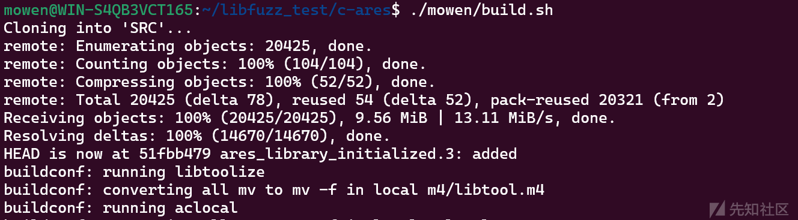

编译完成后会出现 SRC(源码地址)，BUILD(构建项目的文件夹)，可执行fuzz程序。

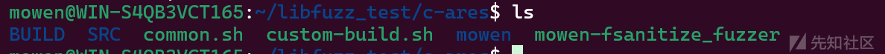

执行这个fuzz程序，因为样例简单没1秒就会出`crash`。

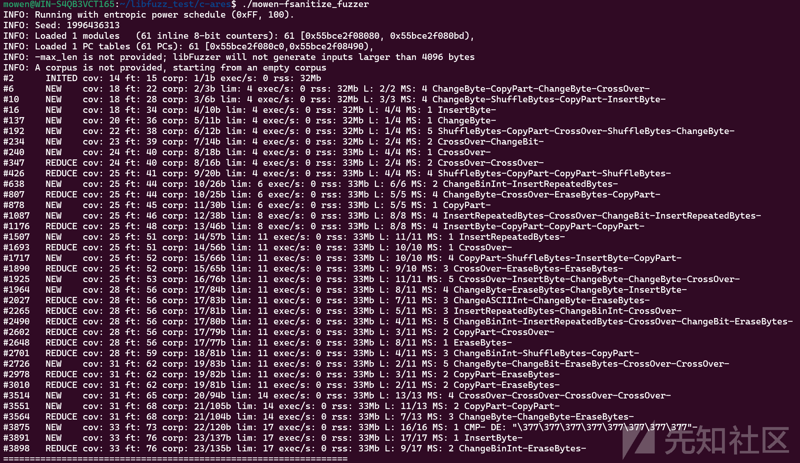

#### `libfuzzer` 输出参数详细介绍

|  |  |  |
| --- | --- | --- |
| **字段** | **含义** | **当前值分析** |
| `cov` | 代码覆盖率（覆盖的基本块数） | 初始值14，逐步增长至29 |
| `ft` | 模糊器跟踪的独特特征数（包含路径/条件分支等） | 从15增至45，表明发现新执行路径 |
| `corp` | 语料库状态（有效测试用例数/总字节数） | 9个用例，21字节总规模 |
| `exec/s` | 每秒执行次数 | 0值表明测试初期或资源受限 |
| `rss` | 内存占用（Resident Set Size） | 稳定在31MB，没有内存泄漏迹象 |
| `L` | 输入长度（实际长度/允许最大值） | 多数用例在4字节限制内 |
| `MS` | 变异策略组合（如 `ChangeBit-CrossOver`） | 显示输入变异的智能组合 |

```
#2 INITED cov:14 ft:15 corp:1/1b  
//完成初始化INITED，cov(发现14个基本块覆盖),ft(15个执行特征)
```

#### `asan`信息分析

第一个阶段为 libfuzzer输出的信息，下面是`asan`出现的信息。

**错误类型**：

* **heap-buffer-overflow**：表示程序尝试访问未分配的内存区域，通常是因为数组越界或访问已释放的内存。
* 报错堆地址 `0x603000032a25`

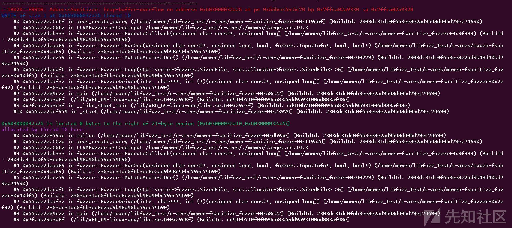

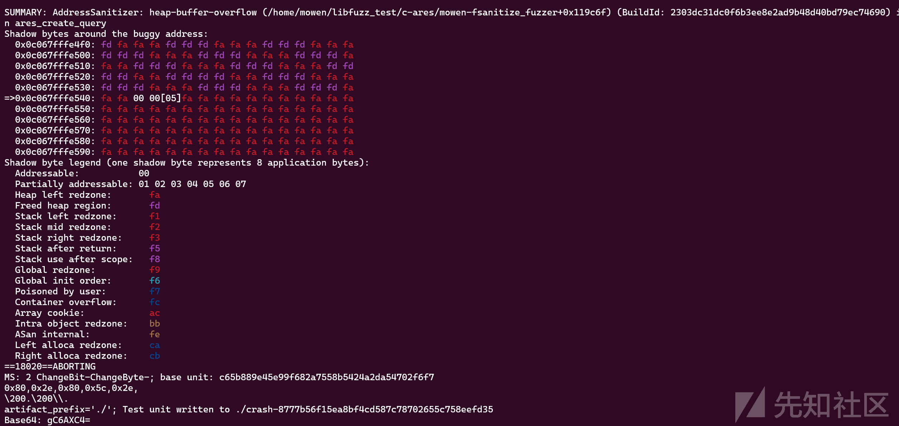

### 编译脚本

执行 `build.sh` 脚本，会自动调用 `custom-build.sh` 和 `common.sh` 进行编译。因为我使用的这三个脚本进行自动编译，当然也可以手动进行编译，可以跳过这一部分。

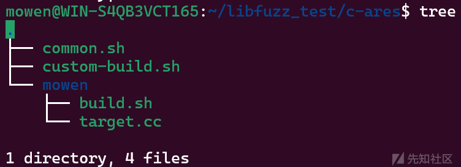

#### **build.sh脚本**

```
# 执行上级目录的custom-build.sh脚本 $1为构建模式 $2为自定义hook模式
. $(dirname $0)/../custom-build.sh $1 $2
# 执行上级的 common.sh脚本
. $(dirname $0)/../common.sh
#-------------
# dirname $0 获取当前脚本所在目录
# . 命令等价于 source，用于加载外部脚本中的函数和变量
#-------------
build_lib() {
  # 清理构建目录
  rm -rf BUILD
  # 复制源码SRC 到 BUILD 目录
  cp -rf SRC BUILD
  # 进入到构建目录中，执行构建流程，生成编译脚本，编译静态库
  # ./buildconf -> 生成 configure 脚本 --disable-shared -> 仅生成静态库（.a）
  (cd BUILD && ./buildconf && ./configure --disable-shared && make -j $JOBS)
}
# 从git 仓库拉取源码
get_git_revision https://github.com/c-ares/c-ares.git 51fbb479f7948fca2ace3ff34a15ff27e796afdd SRC
# 调用编译函数，编译 c-ares 静态库
build_lib
# 配置模糊测试环境
build_fuzzer
# 如果使用 hooks，强制使用asan
if [[ $FUZZING_ENGINE == "hooks" ]]; then
  # Link ASan runtime so we can hook memcmp et al.
  LIB_FUZZING_ENGINE="$LIB_FUZZING_ENGINE -fsanitize=address"
fi
# $CXX 和 $CXXFLAGS 编译模糊测试目标 
# -I BUILD	添加 c-ares 头文件搜索路径
# BUILD/.libs/libcares.a	链接静态库（避免动态依赖冲突）
$CXX $CXXFLAGS $SCRIPT_DIR/target.cc -I  BUILD BUILD/.libs/libcares.a $LIB_FUZZING_ENGINE -o $EXECUTABLE_NAME_BASE

```

#### **custom-build.sh编译选项解释**

注意需要将原始脚本中的-fsanitize-coverage=trace-pc-guard替换为-fsanitize=fuzzer，否则执行Fuzz时会出现错误：-fsanitize-coverage=trace-pc-guard is no longer supported by libFuzzer。

```
MODE=$1 
# 第一个参数为模式选择
HOOKS_FILE=$2
# 文件路径

if [[ -n "${MODE}" ]]; then
  case "${MODE}" in
   # ---------------------------
   # 模式1：（ASan）地址检测 (-fsanitize=address就是地址检测(内存越界、uaf等))
   # ---------------------------
    asan)
      # 使用 libfuzzer
      export FUZZING_ENGINE=libfuzzer
      # ---------------------------
      # C语言编译环境
      # -fno-omit-frame-pointer 强制保留堆栈指针
      # -gline-tables-only 精简版调试信息
      # -fsanitize=address 启用asan内存错误检测
      # -fsanitize-address-use-after-scope 使用asan检测作用域外内存
      #	int *ptr;  
      #  {  
      #      int local = 42;  
      #      ptr = &local;  // 作用域结束触发 ASan 报错  
      #  }  
      #  *ptr = 0;  
      # -fsanitize-coverage=trace-pc-guard(1),trace-cmp(2),trace-gep(3),trace-div(4)
      # 1、基本块覆盖率，2、比较指令，3、索引数组计算，4、整除运算
      # ---------------------------
      export CFLAGS="-O2 -fno-omit-frame-pointer -gline-tables-only -fsanitize=address -fsanitize-address-use-after-scope -fsanitize-coverage=trace-pc-guard,trace-cmp,trace-gep,trace-div"
      # C++ 使用相同配置
      export CXXFLAGS="${CFLAGS}"
      ;;
   # ---------------------------
   # 模式2：（ubsan）未定义行为检测
   # ---------------------------
    ubsan)
      export FUZZING_ENGINE=libfuzzer
      # --------------------------- 
      #  **fsanitize= undefined** # 启用未定义行为检测（除零、类型转换错误等）
      # ---------------------------
      export CFLAGS="-O2 -fno-omit-frame-pointer -gline-tables-only -fsanitize=undefined -fsanitize-coverage=trace-pc-guard,trace-cmp,trace-gep,trace-div"
      export CXXFLAGS="${CFLAGS}"
      ;;
   # ---------------------------
   # 模式3：(hooks)自定义插装
   # ---------------------------
    hooks)
      if [[ ! -f "${HOOKS_FILE}" ]]; then
        echo "Error: Missing hooks file"
        exit 1
      fi
      export FUZZING_ENGINE=hooks
      export CFLAGS="-O0 -fsanitize-coverage=trace-pc-guard,trace-cmp,trace-gep,trace-div"
      export CXXFLAGS="${CFLAGS}"
      export HOOKS_FILE
      ;;
   # ---------------------------
   #  错误处理
   # ---------------------------
    *)
      echo "Error: Unknown mode: ${MODE}"
      exit 1
      ;;
  esac
fi
```

#### common.sh脚本

```
#!/bin/bash
# Copyright 2017 Google Inc. All Rights Reserved.
# Licensed under the Apache License, Version 2.0 (the "License");

# Don't allow to call these scripts from their directories.
[ -e $(basename $0) ] && echo "PLEASE USE THIS SCRIPT FROM ANOTHER DIR" && exit 1

# Ensure that fuzzing engine, if defined, is valid
FUZZING_ENGINE=${FUZZING_ENGINE:-"fsanitize_fuzzer"}
POSSIBLE_FUZZING_ENGINE="libfuzzer afl honggfuzz coverage fsanitize_fuzzer hooks"
!(echo "$POSSIBLE_FUZZING_ENGINE" | grep -w "$FUZZING_ENGINE" > /dev/null) && \
  echo "USAGE: Error: If defined, FUZZING_ENGINE should be one of the following:
  $POSSIBLE_FUZZING_ENGINE. However, it was defined as $FUZZING_ENGINE" && exit 1

SCRIPT_DIR=$(dirname $0)
EXECUTABLE_NAME_BASE=$(basename $SCRIPT_DIR)-${FUZZING_ENGINE}
LIBFUZZER_SRC=${LIBFUZZER_SRC:-$(dirname $(dirname $SCRIPT_DIR))/Fuzzer}
STANDALONE_TARGET=0
AFL_SRC=${AFL_SRC:-$(dirname $(dirname $SCRIPT_DIR))/AFL}
HONGGFUZZ_SRC=${HONGGFUZZ_SRC:-$(dirname $(dirname $SCRIPT_DIR))/honggfuzz}
COVERAGE_FLAGS="-O0 -fsanitize-coverage=fuzzer"
FUZZ_CXXFLAGS="-O2 -fno-omit-frame-pointer -gline-tables-only -fsanitize=address -fsanitize-address-use-after-scope -fsanitize-coverage=fuzzer,trace-cmp,trace-gep,trace-div"
CORPUS=CORPUS-$EXECUTABLE_NAME_BASE
JOBS=${JOBS:-"8"}


export CC=${CC:-"clang"}
export CXX=${CXX:-"clang++"}
export CPPFLAGS=${CPPFLAGS:-"-DFUZZING_BUILD_MODE_UNSAFE_FOR_PRODUCTION"}
export LIB_FUZZING_ENGINE="libFuzzingEngine-${FUZZING_ENGINE}.a"

if [[ $FUZZING_ENGINE == "fsanitize_fuzzer" ]]; then
  FSANITIZE_FUZZER_FLAGS="-O2 -fno-omit-frame-pointer -gline-tables-only -fsanitize=address,fuzzer-no-link -fsanitize-address-use-after-scope"
  export CFLAGS=${CFLAGS:-$FSANITIZE_FUZZER_FLAGS}
  export CXXFLAGS=${CXXFLAGS:-$FSANITIZE_FUZZER_FLAGS}
elif [[ $FUZZING_ENGINE == "honggfuzz" ]]; then
  export CC=$(realpath -s "$HONGGFUZZ_SRC/hfuzz_cc/hfuzz-clang")
  export CXX=$(realpath -s "$HONGGFUZZ_SRC/hfuzz_cc/hfuzz-clang++")
elif [[ $FUZZING_ENGINE == "coverage" ]]; then
  export CFLAGS=${CFLAGS:-$COVERAGE_FLAGS}
  export CXXFLAGS=${CXXFLAGS:-$COVERAGE_FLAGS}
else
  export CFLAGS=${CFLAGS:-"$FUZZ_CXXFLAGS"}
  export CXXFLAGS=${CXXFLAGS:-"$FUZZ_CXXFLAGS"}
fi

get_git_revision() {
  GIT_REPO="$1"
  GIT_REVISION="$2"
  TO_DIR="$3"
  [ ! -e $TO_DIR ] && git clone $GIT_REPO $TO_DIR && (cd $TO_DIR && git reset --hard $GIT_REVISION)
}

get_git_tag() {
  GIT_REPO="$1"
  GIT_TAG="$2"
  TO_DIR="$3"
  [ ! -e $TO_DIR ] && git clone $GIT_REPO $TO_DIR && (cd $TO_DIR && git checkout $GIT_TAG)
}

get_svn_revision() {
  SVN_REPO="$1"
  SVN_REVISION="$2"
  TO_DIR="$3"
  [ ! -e $TO_DIR ] && svn co -r$SVN_REVISION $SVN_REPO $TO_DIR
}

build_afl() {
  $CC $CFLAGS -c -w $AFL_SRC/llvm_mode/afl-llvm-rt.o.c
  $CXX $CXXFLAGS -std=c++11 -O2 -c ${LIBFUZZER_SRC}/afl/afl_driver.cpp -I$LIBFUZZER_SRC
  ar r $LIB_FUZZING_ENGINE afl_driver.o afl-llvm-rt.o.o
  rm *.o
}

build_libfuzzer() {
  $LIBFUZZER_SRC/build.sh
  mv libFuzzer.a $LIB_FUZZING_ENGINE
}

build_honggfuzz() {
  cp "$HONGGFUZZ_SRC/libhfuzz/persistent.o" $LIB_FUZZING_ENGINE
}

# Uses the capability for "fsanitize=fuzzer" in the current clang
build_fsanitize_fuzzer() {
  LIB_FUZZING_ENGINE="-fsanitize=fuzzer"
}

# This provides a build with no fuzzing engine, just to measure coverage
build_coverage () {
  STANDALONE_TARGET=1
  $CC -O2 -c $LIBFUZZER_SRC/standalone/StandaloneFuzzTargetMain.c
  ar rc $LIB_FUZZING_ENGINE StandaloneFuzzTargetMain.o
  rm *.o
}

# Build with user-defined main and hooks.
build_hooks() {
  LIB_FUZZING_ENGINE=libFuzzingEngine-hooks.o
  $CXX -c $HOOKS_FILE -o $LIB_FUZZING_ENGINE
}

build_fuzzer() {
  echo "Building with $FUZZING_ENGINE"
  build_${FUZZING_ENGINE}
}
```

#### 构建 `target.cc`

大致了解了三个 `.sh` 脚本所作的事之后，开始构造 `target.cc` 这个 `cpp` 用来测试`fuzz`库的一个接口。

在使用 `LibFuzzer` 时，第一步就是要实现 `target` 函数(`LLVMFuzzerTestOneInput`)，该函数传参使用两个参数`@Data`,`@size`,即以`byte` 数组作为函数输入，然后在函数内部调用你想要 `fuzz` 的库函数并传入 `Data`。

```
// fuzz_target.cc
extern "C" int LLVMFuzzerTestOneInput(const uint8_t *Data, size_t Size) {
  libAPI(Data, Size);
  return 0;  // Values other than 0 and -1 are reserved for future use.
}
```

`target` 的**函数名称**、**参数类型**、**返回值类型**都不能改变是定死的。

#### 编译 `target`

编写好 `target` 之后就需要进行编译，如果看过上面的sh脚本那肯定对编译选项就不太陌生，下面还是详细介绍一下常见的编译选项。

```
clang  -fsanitize=fuzzer  fuzz_target.cc #简单样例
```

|  |  |  |
| --- | --- | --- |
| 编译选项 | 附件参数 | 作用 |
| -g |  | 保留符号 |
| -O （uppercase o） | -O0 -O1 -O2 -O3 | 优化等级，越大优化越多 |
| -o （lowercase o） | file\_name | 指定编译后的文件名称 |
| -I （uppercase i） | header\_file\_path | 添加头文件路径 |
| -fsanitize |  | 启用libfuzzer进行插装 |
|  | =fuzzer | 链接libFuzzer库文件,使用libFuzzer的main |
|  | =fuzzer-no-link | 不链接libFuzzer，适用于有main函数的源码 |
|  | =address | 堆栈溢出、UAF（悬垂指针） |
|  | =undefined | 未定义行为检测（除零、类型转换错误等） |
|  | =memory | 检测未初始化的内存访问 |
| -fsanitize-coverage |  | 启动覆盖率统计 |
|  | ~~trace-pc-guard~~ | ~~记录每个基本块的执行~~ 现在-fsanitize=fuzzer代替 |
|  | trace-cmp | 为每个比较操作插入调用，追踪比较。 |
|  | trace-div | 为除法和取模操作插入调用，追踪除法。 |

#### 执行 `fuzz`

编译完成后会出现一个可执行的 `fuzz` 文件，最简单的启动方式是直接启动，但是有许多附件参数稍后详细列出。

```
./fuzz-target #最简单样例
```

在启动 `fuzz-target` 后，程序会一直进行 `fuzz` 并输出相关信息，直到出现 `crash` 才会停止。

|  |  |  |
| --- | --- | --- |
| flag | 默认值 | 作用 |
| verbosity | 1 | 运行时输出详细日志 |
| seed | 0 | 随机种子。如果为0，则自动生成随机种子 |
| runs | -1 | 测试运行的次数（-1表示无限） |
| max\_len | 0 | 测试输入的最大长度。若为0，libFuzzer会自行猜测 |
| shuffle | 1 | 为1表示启动时打乱初始语料库 |
| prefer\_small | 1 | 为1表示打乱语料库时，较小输入更优先 |
| timeout | 1200 | 超时时长，单位为秒。如果单次运行超过时长，Fuzz将被终止 |
| max\_total\_time | 0 | 最大运行时长，单位为秒。若为正，表示Fuzz最长运行时间 |
| help | 0 | 为1表示打印帮助信息 |
| merge | 0 | 为1表示在不损失代码覆盖率的情况下，进行语料库合并 |
| merge\_control\_file | 0 | 指定合并进程的控制文件，用于恢复合并状态 |
| minimize\_crash | 0 | 为1表示将提供的崩溃输入进行最小化。与-runs = N或-max\_total\_time = N一起使用以限制尝试次数 |
| jobs | 0 | job的数量，多个job将被分配到workers上执行，每个job的stdout/stderr被重定向到fuzz-<JOB>.log |
| workers | 0 | worker的数量，为0将使用min(jobs, number\_of\_cpu\_cores/2) |
| reload | 1 | 设置重新加载主语料库的间隔秒数。在并行模式下，在多个job中同步语料集。为0表示禁止 |
| reduce\_inputs | 1 | 为1表示尝试减少输入数据的大小，同时保留其完整的特征集 |
| rss\_limit\_mb | 2048 | RSS内存用量限制，单位为Mb。为0表示无限制 |
| purge\_allocator\_interval | 1 | 清理缓存的建个时长，单位为秒。当指定rss\_limit\_mb且rss使用率超过50%时，开始清理。为-1表示禁止 |
| malloc\_limit\_mb | 0 | 单次malloc申请内存的大小限制，单位为Mb。为0则采用rss\_limit\_mb进行限制 |
| detect\_leaks | 1 | 为1，且启用LeakSanitizer消毒器时，将在Fuzz过程中检测内存泄漏，而不仅是在Fuzz结束时才检测 |
| print\_coverage | 0 | 退出时打印覆盖率信息 |
| print\_corpus\_stats | 0 | 退出时打印语料信息 |
| print\_final\_stats | 0 | 退出时打印统计信息 |
| only\_ascii | 0 | 为1表示只生成ASCII（isprint + isspace）字符作为输入 |
| artifact\_prefix | 0 | 将fuzzing artifacts（crash、timeout等file）保存为文件时所使用的前缀，即文件将保存为$(artifact\_prefix)file |
| exact\_artifact\_path | 0 | 将单个fuzz artfifact保存为文件时所使用的前缀。将覆盖-artifact\_prefix，并行任务中不要使用相同取值 |

例如使用 `-print_coverage=1` 开启退出时打印覆盖率信息

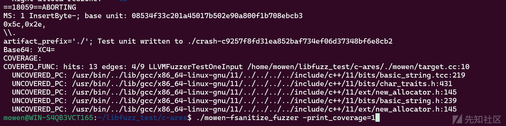

自定义使用 `seed`这里执行步骤比第一次`fuzz`要少了很多，可见种子的重要性。

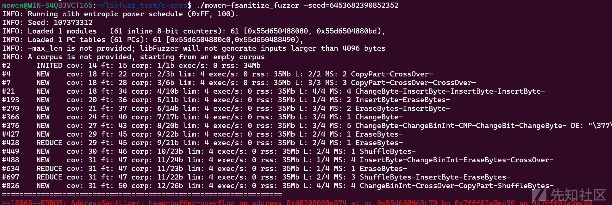

#### 语料库的使用

在 `fuzz` 中语料库是最重要的一部分，提供一个好的语料库可以节省很多资源。模糊测试的核心原理是通过动态生成或改造输入数据来探测系统漏洞。与完全随机生成测试用例不同，该方法采用种子语料库作为基础模板进行智能变异，特别在处理结构化输入时展现显著优势。接下来介绍语料库的使用。

使用 `corpus` 来提供 `fuzz` 最初的一个或多个存放种子语料。

```
 ./mowen-fsanitize_fuzzer -max_len=1024 corpus/
```

可见当我提供好的种子的时候，执行步骤显而易见的减少了。

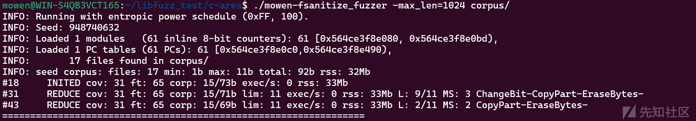

当种子很多的时候，那有些种子其实就没必要去测试了，可以使用 `merge` 来进行种子合并。这点 AFL 中也有相对的工具tmin,cmin。

```
./mowen-fsanitize_fuzzer -merge=1 tmin_corpus/ corpus/
```

`tmin_corpus` 为存放精简后的种子,`corpus` 为原始输入种子库。第五行显示`MERGE-OUTER: 19 files`这是输入了19个种子，最后一行 `MERGE-OUTER: 15 new files with 65 new features added; 31 new coverage edges`，从19个种子优化到了15个种子。

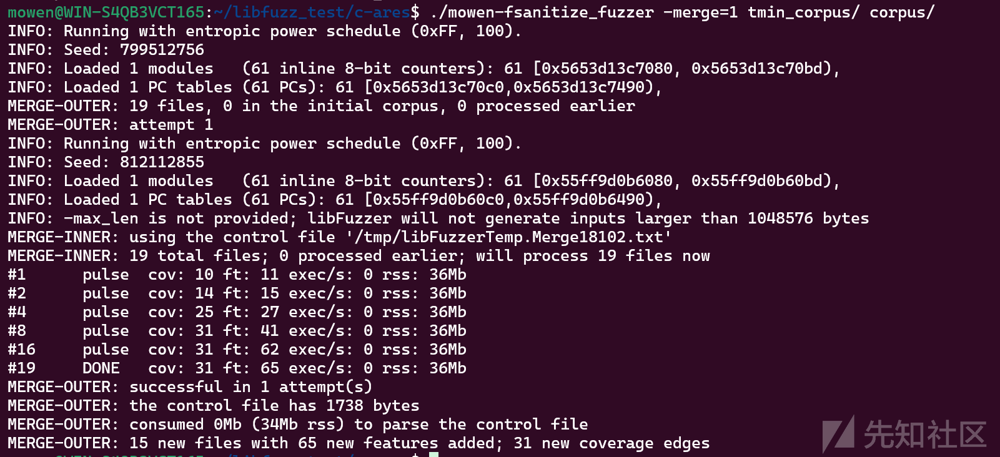

**提取语料库**

在测试的时候，可以把 `fuzz` 产生的种子保存下来，以后继续 `fuzz` 可能会参考这些种子。

```
./mowen-fsanitize_fuzzer corpus
```

传入一个空文件夹，`libfuzzer` 就会把过程中产生的种子保存到这个文件夹中。

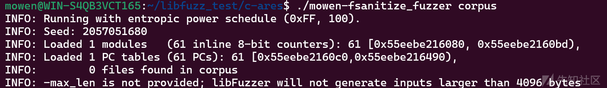

字典使用

当然为了演示这里的字典是乱写的，真实fuzz的时候就需要针对程序写fuzz，比如在某个程序中有一个 strcmp("mowen",buf);那通过随机变异来生产"mowen"是很困难的，就需要导入字典来增加fuzz速度。

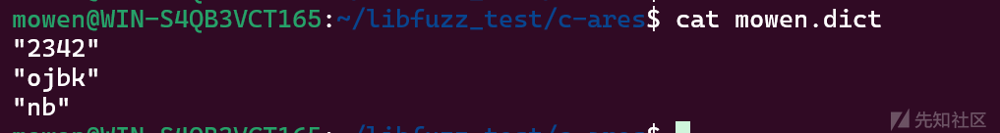

```
./mowen-fsanitize_fuzzer -dict=mowen.dict
```

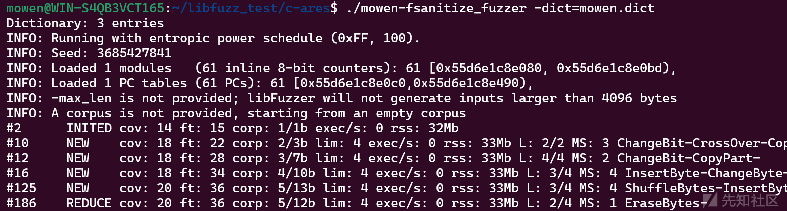

### CVE-2014-0160

CVE-2014-0160（Heartbleed，心脏出血漏洞）是OpenSSL库中的一个严重漏洞，允许攻击者通过恶意构造的TLS心跳请求（Heartbeat Request）读取服务器内存中的敏感信息（如私钥、用户会话数据）。

之前fuzz复现使用的自动脚本进行编译，现在我们使用手动编译，然后下节我们修改自动脚本完成本地文件的自动编译。

复现环境 GitHub地址：[libfuzzer-workshop/lessons/05/README.md at master · Dor1s/libfuzzer-workshop](https://github.com/Dor1s/libfuzzer-workshop/blob/master/lessons/05/README.md)

[google/fuzzer-test-suite：模糊测试引擎的测试集 --- google/fuzzer-test-suite: Set of tests for fuzzing engines](https://github.com/google/fuzzer-test-suite/tree/master)

查找时间：< 3 秒。

**编译openssl库**

```
tar xzf openssl1.0.1f.tgz && cd openssl1.0.1f/

export CC="clang -O0 -fno-omit-frame-pointer -g -fsanitize=address,fuzzer-no-link -fsanitize-coverage=trace-cmp,trace-gep,trace-div"
./config
make  -j$(nproc)
```

编译完成之后头文件就会出现在`./include`下。

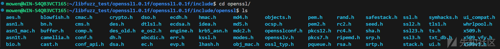

编写**target.cc**，脚本都来自于GitHub，目前暂时不详细讲如何编写target.cc，目的就是调用要fuzz的库函数就行。

```
// Copyright 2016 Google Inc. All Rights Reserved.
// Licensed under the Apache License, Version 2.0 (the "License");
#include <openssl/ssl.h>
#include <openssl/err.h>
#include <assert.h>
#include <stdint.h>
#include <stddef.h>

#ifndef CERT_PATH
# define CERT_PATH
#endif

SSL_CTX *Init() {
  SSL_library_init();
  SSL_load_error_strings();
  ERR_load_BIO_strings();
  OpenSSL_add_all_algorithms();
  SSL_CTX *sctx;
  assert (sctx = SSL_CTX_new(TLSv1_method()));
  /* These two file were created with this command:
      openssl req -x509 -newkey rsa:512 -keyout server.key \
     -out server.pem -days 9999 -nodes -subj /CN=a/
  */
  assert(SSL_CTX_use_certificate_file(sctx, CERT_PATH "server.pem",
                                      SSL_FILETYPE_PEM));
  assert(SSL_CTX_use_PrivateKey_file(sctx, CERT_PATH "server.key",
                                     SSL_FILETYPE_PEM));
  return sctx;
}

extern "C" int LLVMFuzzerTestOneInput(const uint8_t *Data, size_t Size) {
  static SSL_CTX *sctx = Init();
  SSL *server = SSL_new(sctx);
  BIO *sinbio = BIO_new(BIO_s_mem());
  BIO *soutbio = BIO_new(BIO_s_mem());
  SSL_set_bio(server, sinbio, soutbio);
  SSL_set_accept_state(server);
  BIO_write(sinbio, Data, Size);
  SSL_do_handshake(server);
  SSL_free(server);
  return 0;
}
```

然后需要先创建两文件 `server.key` 和 `server.pem`

```
openssl req -x509 -newkey rsa:512 -keyout server.key \
     -out server.pem -days 9999 -nodes -subj /CN=a/
```

编译 `target.cc`

```
clang++ -g target.cc -O2 -fno-omit-frame-pointer \
    -fsanitize=address,fuzzer \
    -fsanitize-coverage=trace-cmp,trace-gep,trace-div \
    -Iopenssl1.0.1f/include openssl1.0.1f/libssl.a openssl1.0.1f/libcrypto.a \
    -o target
```

然后执行 `target` 等一会就会报出 `crash`。显示 heap-buffer-overflow ，是一个堆溢出 。

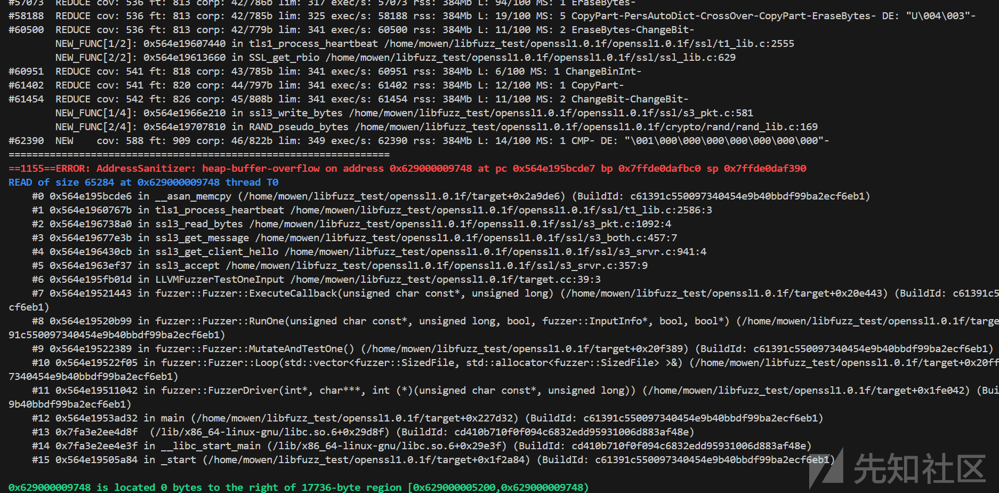

tls1\_process\_heartbeat

### VScode调试

对于大型大型开源项目，单纯使用gdb调式会稍微复杂一点(其实也是很方便的)。个人还是喜欢gdb调试，vscode调试虽然可以在源码上直接断点，但也就这一个优点了。

前置条件需要自行安装，然后通过ssh或wsl连接到linux中。然后安装 `Native Debug`。

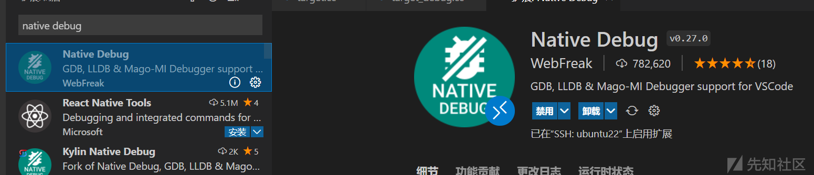

在运行和调试窗口中点击创建 `launch.json` 文件 。

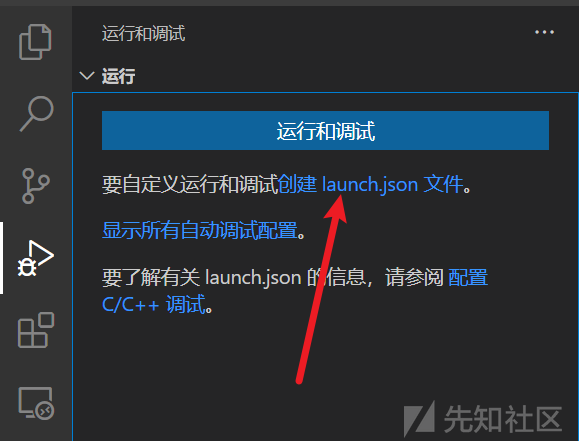

环境选择 GDB

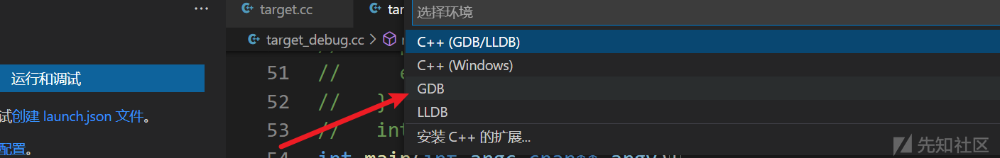

默认配置为这样，什么都不用改就需要改一个 target 为你要fuzz的程序就可以。

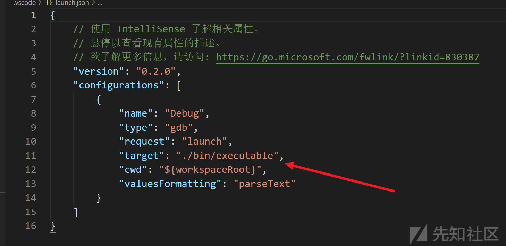

那对于我来说的配置为这样。

```
{
    "version": "0.2.0",
    "configurations": [
        {
            "name": "Debug",
            "type": "gdb",
            "request": "launch",
            "target": "target_debug",
            "cwd": "${workspaceRoot}",
            "valuesFormatting": "parseText"
        }
    ]
}
```

调试的时候显然不太能用 `fuzz` 生成的程序，所以要清理之前编译的文件。

```
make clean
export CC="clang -O0 -g "
./config
make  -j$(nproc)
```

重新编译 target.cc

```
clang++ -g target_debug.cc -O0  \
    -Iopenssl1.0.1f/include openssl1.0.1f/libssl.a openssl1.0.1f/libcrypto.a \
    -o target_debug
```

还需要篡改 target.cc 文件，因为不用 fuzz了，所以需要有main函数来引导执行。先把crash 传进来，这里使用手动赋值的方式，你也可以写一个文件的接口。手动赋值需要注意一下16进制的转换。

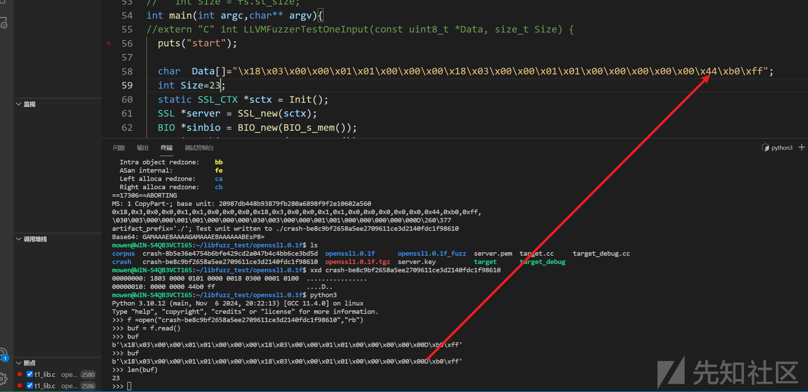

```
// Copyright 2016 Google Inc. All Rights Reserved.
// Licensed under the Apache License, Version 2.0 (the "License");
#include <openssl/ssl.h>
#include <openssl/err.h>
#include <assert.h>
#include <stdint.h>
#include <stddef.h>
#include <stdlib.h>
#include<sys/stat.h>
#include<sys/mman.h>
#include<stdio.h>
#include<fcntl.h>
#include<unistd.h>

#ifndef CERT_PATH
# define CERT_PATH
#endif

SSL_CTX *Init() {
  SSL_library_init();
  SSL_load_error_strings();
  ERR_load_BIO_strings();
  OpenSSL_add_all_algorithms();
  SSL_CTX *sctx;
  assert (sctx = SSL_CTX_new(TLSv1_method()));
  /* These two file were created with this command:
      openssl req -x509 -newkey rsa:512 -keyout server.key \
     -out server.pem -days 9999 -nodes -subj /CN=a/
  */
  assert(SSL_CTX_use_certificate_file(sctx, CERT_PATH "server.pem",
                                      SSL_FILETYPE_PEM));
  assert(SSL_CTX_use_PrivateKey_file(sctx, CERT_PATH "server.key",
                                     SSL_FILETYPE_PEM));
  return sctx;
}

int main(int argc,char** argv){
//extern "C" int LLVMFuzzerTestOneInput(const uint8_t *Data, size_t Size) {
  puts("start");
  
  char  Data[]="\x18\x03\x00\x00\x01\x01\x00\x00\x00\x18\x03\x00\x00\x01\x01\x00\x00\x00\x00\x00\x44\xb0\xff";
  int Size=23;
  static SSL_CTX *sctx = Init();
  SSL *server = SSL_new(sctx);
  BIO *sinbio = BIO_new(BIO_s_mem());
  BIO *soutbio = BIO_new(BIO_s_mem());
  SSL_set_bio(server, sinbio, soutbio);
  SSL_set_accept_state(server);
  BIO_write(sinbio, Data, Size);
  SSL_do_handshake(server);
  SSL_free(server);

  puts("end");
  return 0;
}
```

使用全局搜索找到函数的定位处，然后右边下断点就行。

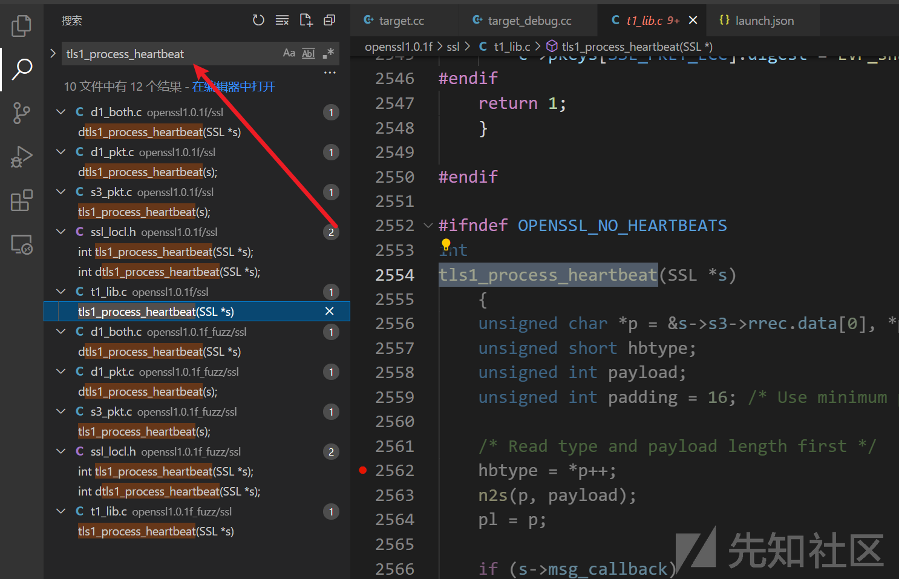

调试进来在tls1\_process\_heartbeat处确实是payload未检测长度，可以完成堆溢出，这里继续分析漏洞如果利用，如果有感兴趣的师傅可以自行复现。

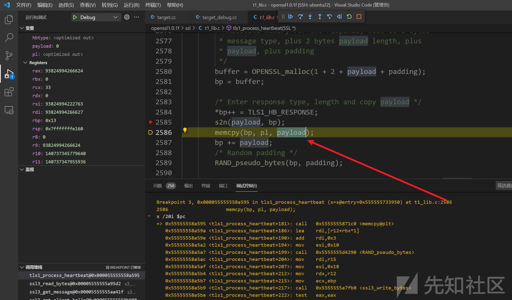
