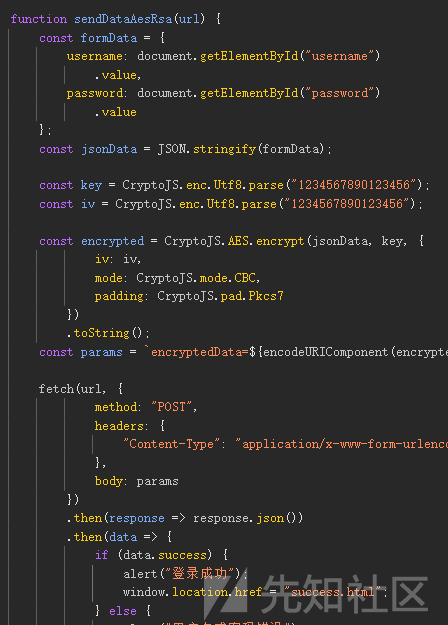
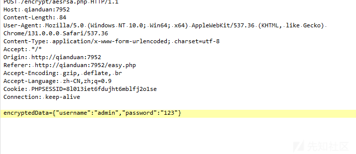
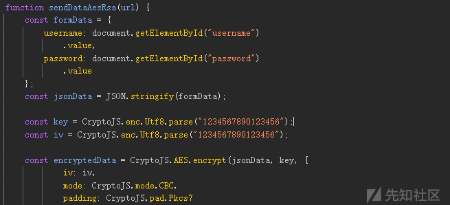
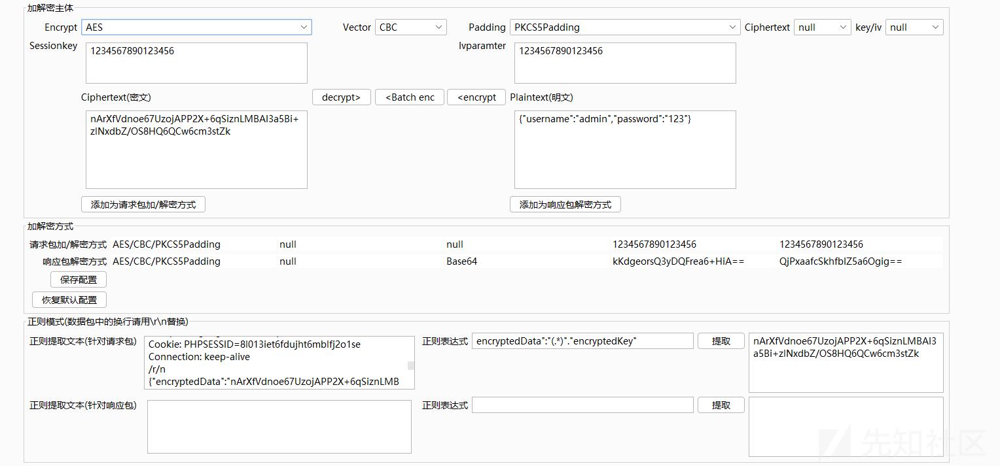
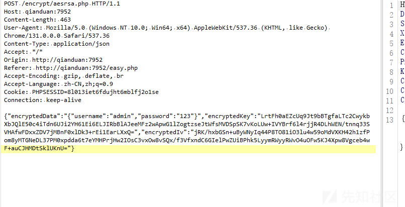
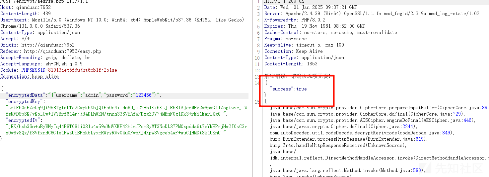
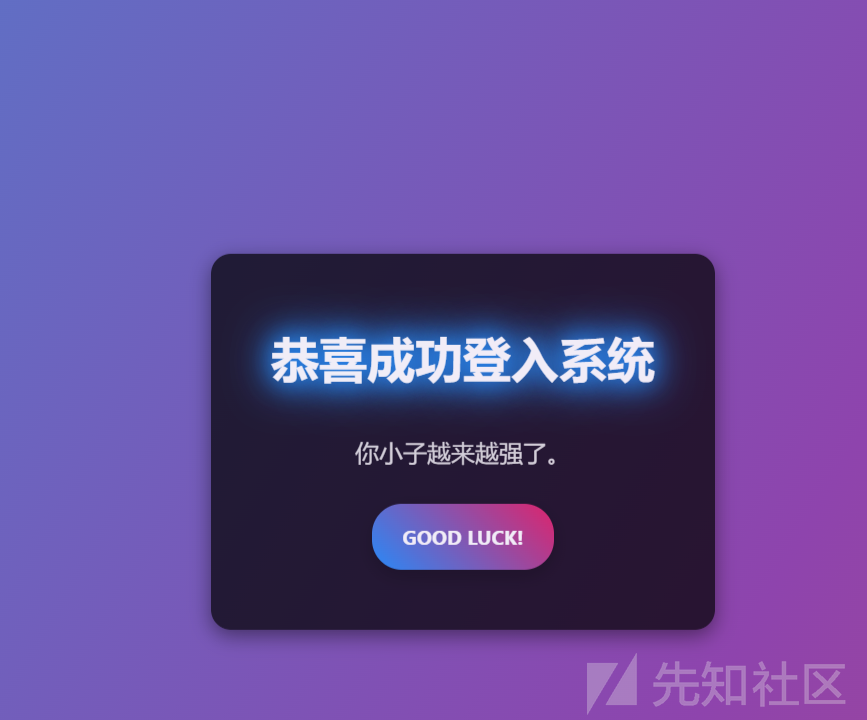
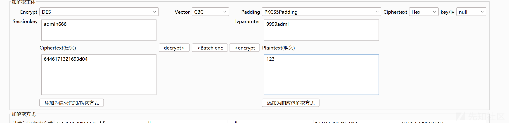
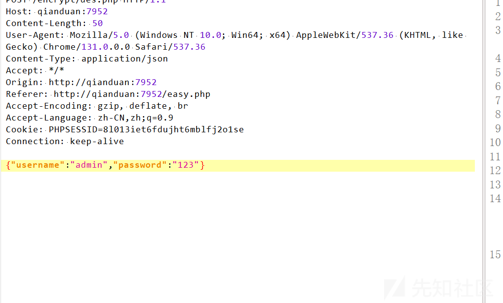
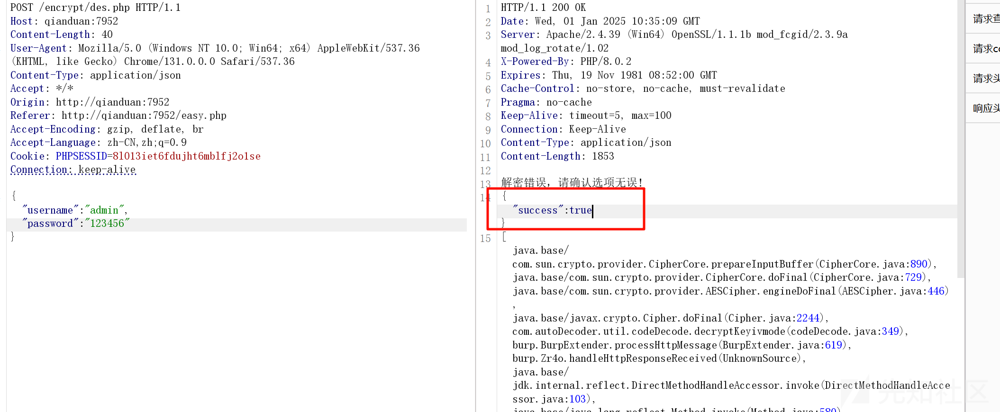

# 前端加密对抗常见场景突破之进阶-先知社区

> **来源**: https://xz.aliyun.com/news/17099  
> **文章ID**: 17099

---

# 前端加密对抗常见场景突破之进阶

## 前言

前面分析了几种最基础的，但是现在的前端加密往往都比较复杂，下面是几种更复杂的场景如何破局

## AES+RSA 加密

这种加密方法说实话很难破局，所以我们的思路就得更换了

首先看前端的代码

```
function sendDataAesRsa(url) {
    const formData = {
        username: document.getElementById("username")
            .value,
        password: document.getElementById("password")
            .value
    };
    const jsonData = JSON.stringify(formData);

    const key = CryptoJS.lib.WordArray.random(16);
    const iv = CryptoJS.lib.WordArray.random(16);

    const encryptedData = CryptoJS.AES.encrypt(jsonData, key, {
            iv: iv,
            mode: CryptoJS.mode.CBC,
            padding: CryptoJS.pad.Pkcs7
        })
        .toString();

    const rsa = new JSEncrypt();
    rsa.setPublicKey(`-----BEGIN PUBLIC KEY-----
MIGfMA0GCSqGSIb3DQEBAQUAA4GNADCBiQKBgQDRvA7giwinEkaTYllDYCkzujvi
NH+up0XAKXQot8RixKGpB7nr8AdidEvuo+wVCxZwDK3hlcRGrrqt0Gxqwc11btlM
DSj92Mr3xSaJcshZU8kfj325L8DRh9jpruphHBfh955ihvbednGAvOHOrz3Qy3Cb
ocDbsNeCwNpRxwjIdQIDAQAB
-----END PUBLIC KEY-----`);

    const encryptedKey = rsa.encrypt(key.toString(CryptoJS.enc.Base64));
    const encryptedIv = rsa.encrypt(iv.toString(CryptoJS.enc.Base64));

    fetch(url, {
            method: "POST",
            headers: {
                "Content-Type": "application/json"
            },
            body: JSON.stringify({
                encryptedData: encryptedData,
                encryptedKey: encryptedKey,
                encryptedIv: encryptedIv
            })
        })
        .then(response => response.json())
        .then(data => {
            if (data.success) {
                alert("登录成功");
                window.location.href = "success.html";
            } else {
                alert("用户名或密码错误");
            }
        })
        .catch(error => console.error("请求错误:", error));

    closeModal();
}
```

首先一大难点就是

```
const key = CryptoJS.lib.WordArray.random(16);
const iv = CryptoJS.lib.WordArray.random(16);
```

我们的 key 和 iv 是随机数了

而且更重量级的是

```
const rsa = new JSEncrypt();
rsa.setPublicKey(`-----BEGIN PUBLIC KEY-----...-----END PUBLIC KEY-----`);

const encryptedKey = rsa.encrypt(key.toString(CryptoJS.enc.Base64));
const encryptedIv = rsa.encrypt(iv.toString(CryptoJS.enc.Base64));
```

还会 RSA 去加密 AES 密钥和 IV

我们看看包

```
POST /encrypt/aesrsa.php HTTP/1.1
Host: qianduan:7952
Content-Length: 463
User-Agent: Mozilla/5.0 (Windows NT 10.0; Win64; x64) AppleWebKit/537.36 (KHTML, like Gecko) Chrome/131.0.0.0 Safari/537.36
Content-Type: application/json
Accept: */*
Origin: http://qianduan:7952
Referer: http://qianduan:7952/easy.php
Accept-Encoding: gzip, deflate, br
Accept-Language: zh-CN,zh;q=0.9
Cookie: PHPSESSID=8l013iet6fdujht6mblfj2o1se
Connection: keep-alive

{"encryptedData":"+JIRH8zG7tyYWeEsIKXgMhqIZbGlXDjkdSU6fxvy+01BKXW1iSddu4MFKkGGN8El","encryptedKey":"Tc5a9SAX0t3xqEkRaW+JW+XaVIwDg7OAjRGV15wetu604albcLMBdXhvC6QGNsceAwVJ41eFm8Hout+feHoDJcZ8Q4A3JknNu+ugi81G+KRgNHCbMIXEWpiuOYdfD6Dm9a1HsO3nhT3KhU/fRyEqnYdDNmsQR1yxHWpEejoN28A=","encryptedIv":"QMB7/xRAxtdlhdQZUK4HcqleVpSuf8cZCuW84NWa+/CqgtpiZv8QHOtze5FL67YKbvIthiGKr0AQMJ95e+/hnuY8zGVLACcZ+LniQt7cJ5QNBex8tx+8GIYy1VNIh3+cKNyW7pXHsxZvN80WCtOZDg0hs5JCMh2qmXDtOEICHjE="}
```

可以看见很复杂  
这里有两个思路，直接改之后的逻辑，和修改加密的逻辑

### 修改加密逻辑

我们直接把 key 和 iv 固定，或者更容易的是直接把第一关的代码直接覆盖掉

把这串代码

```
{
    const formData = {
        username: document.getElementById("username")
            .value,
        password: document.getElementById("password")
            .value
    };
    const jsonData = JSON.stringify(formData);

    const key = CryptoJS.enc.Utf8.parse("1234567890123456");
    const iv = CryptoJS.enc.Utf8.parse("1234567890123456");

    const encrypted = CryptoJS.AES.encrypt(jsonData, key, {
            iv: iv,
            mode: CryptoJS.mode.CBC,
            padding: CryptoJS.pad.Pkcs7
        })
        .toString();
    const params = `encryptedData=${encodeURIComponent(encrypted)}`;

    fetch(url, {
            method: "POST",
            headers: {
                "Content-Type": "application/x-www-form-urlencoded; charset=utf-8"
            },
            body: params
        })
        .then(response => response.json())
        .then(data => {
            if (data.success) {
                alert("登录成功");
                window.location.href = "success.html";
            } else {
                alert("用户名或密码错误");
            }
        })
        .catch(error => {
            console.error("请求错误:", error);
        });

    closeModal();
}
```

直接覆盖  


然后我们再抓一个包

```
POST /encrypt/aesrsa.php HTTP/1.1
Host: qianduan:7952
Content-Length: 84
User-Agent: Mozilla/5.0 (Windows NT 10.0; Win64; x64) AppleWebKit/537.36 (KHTML, like Gecko) Chrome/131.0.0.0 Safari/537.36
Content-Type: application/x-www-form-urlencoded; charset=utf-8
Accept: */*
Origin: http://qianduan:7952
Referer: http://qianduan:7952/easy.php
Accept-Encoding: gzip, deflate, br
Accept-Language: zh-CN,zh;q=0.9
Cookie: PHPSESSID=8l013iet6fdujht6mblfj2o1se
Connection: keep-alive

encryptedData=nArXfVdnoe67UzojAPP2X%2B6qSiznLMBAI3a5Bi%2BzlNxdbZ%2FOS8HQ6QCw6cm3stZk
```

可以看到就和第一关一模一样了

  
一样可以解码成功

但是后来发现不行

```
HTTP/1.1 200 OK
Date: Wed, 01 Jan 2025 09:28:51 GMT
Server: Apache/2.4.39 (Win64) OpenSSL/1.1.1b mod_fcgid/2.3.9a mod_log_rotate/1.02
X-Powered-By: PHP/8.0.2
Expires: Thu, 19 Nov 1981 08:52:00 GMT
Cache-Control: no-store, no-cache, must-revalidate
Pragma: no-cache
Keep-Alive: timeout=5, max=100
Connection: Keep-Alive
Content-Type: application/json
Content-Length: 40

{"success":false,"error":"Missing data"}
```

似乎后端会校验我们的参数，这里我再该了一下

尝试只修改 key 和 iv



然后  
需要改一下正则

  
任然可以解码成功

  
成功

### 修改返回逻辑

经过前些管卡的尝试，我们自动了成功返回的是  
{"success":true}  
失败的并不重要

我们尝试直接修改前端的返回逻辑

拦截响应改为

```
HTTP/1.1 200 OK
Date: Wed, 01 Jan 2025 09:38:35 GMT
Server: Apache/2.4.39 (Win64) OpenSSL/1.1.1b mod_fcgid/2.3.9a mod_log_rotate/1.02
X-Powered-By: PHP/8.0.2
Expires: Thu, 19 Nov 1981 08:52:00 GMT
Cache-Control: no-store, no-cache, must-revalidate
Pragma: no-cache
Keep-Alive: timeout=5, max=100
Connection: Keep-Alive
Content-Type: application/json
Content-Length: 56

{"success":true}
```

发送就登录成功



## DES 规律 key

DES 加密，这个可以说是 AES 的前人吧  
DES（Data Encryption Standard） 是一种对称加密算法，用于加密和解密数据。它被广泛用于商业和政府领域，但由于其密钥长度较短（56 位），如今已经被认为是不够安全的，并逐渐被更强大的加密算法（如 AES）所取代。

前端逻辑

```
function encryptAndSendDataDES(url) {
    const username = document.getElementById("username")
        .value;
    const password = document.getElementById("password")
        .value;

    const key = CryptoJS.enc.Utf8.parse(username.slice(0, 8)
        .padEnd(8, '6'));

    const iv = CryptoJS.enc.Utf8.parse('9999' + username.slice(0, 4)
        .padEnd(4, '9'));

    const encryptedPassword = CryptoJS.DES.encrypt(password, key, {
        iv: iv,
        mode: CryptoJS.mode.CBC,
        padding: CryptoJS.pad.Pkcs7
    });

    const encryptedHex = encryptedPassword.ciphertext.toString(CryptoJS.enc.Hex);

    fetch(url, {
            method: "POST",
            headers: {
                "Content-Type": "application/json"
            },
            body: JSON.stringify({
                username: username,
                password: encryptedHex
            })
        })
        .then(response => response.json())
        .then(data => {
            if (data.success) {
                alert("登录成功");
                window.location.href = "success.html";
            } else {
                alert("用户名或密码错误");
            }
        })
        .catch(error => console.error("请求错误:", error));

    closeModal();
}
```

这里的 key 和 iv 生成是有规律的

**密钥（key）生成规律**

```
const key = CryptoJS.enc.Utf8.parse(username.slice(0, 8).padEnd(8, '6'));
```

从用户名中提取前 8 个字符（username.slice(0, 8)）。  
如果用户名长度不足 8 个字符，使用 '6' 填充直到达到 8 字节。

假设用户输入的用户名是 "admin123"：

slice(0, 8) 提取的是 "admin123"（这个用户名恰好是 8 个字符，所以不需要填充）。  
因此，key 就是 "admin123"。  
如果用户名是 "alice"（只有 5 个字符），则：

slice(0, 8) 提取的是 "alice"。  
使用 padEnd(8, '6') 填充，得到 "alice666"，因此密钥是 "alice666"。

**初始化向量（IV）生成规律**

```
const iv = CryptoJS.enc.Utf8.parse('9999' + username.slice(0, 4).padEnd(4, '9'));
```

使用 "9999" 开头。  
从用户名中提取前 4 个字符（username.slice(0, 4)）。  
如果用户名的长度不足 4 个字符，使用 '9' 填充。

```
假设用户名是 "admin123"：

"9999" 与 slice(0, 4) 的结果 "admi" 组合，生成 IV 为 "9999admi"。
因此，iv 就是 "9999admi"。
如果用户名是 "alice"（长度为 5 个字符）：

"9999" 与 slice(0, 4) 的结果 "alic" 组合，生成 IV 为 "9999alic"。
因此，iv 就是 "9999alic"。
如果用户名是 "cat"（长度为 3 个字符）：

"9999" 与 slice(0, 4) 的结果 "cat"，然后用 padEnd(4, '9') 填充，生成 IV 为 "9999cat9"。
因此，iv 就是 "9999cat9"。
```

首先 admin 是固定的

```
POST /encrypt/des.php HTTP/1.1
Host: qianduan:7952
Content-Length: 50
User-Agent: Mozilla/5.0 (Windows NT 10.0; Win64; x64) AppleWebKit/537.36 (KHTML, like Gecko) Chrome/131.0.0.0 Safari/537.36
Content-Type: application/json
Accept: */*
Origin: http://qianduan:7952
Referer: http://qianduan:7952/easy.php
Accept-Encoding: gzip, deflate, br
Accept-Language: zh-CN,zh;q=0.9
Cookie: PHPSESSID=8l013iet6fdujht6mblfj2o1se
Connection: keep-alive

{"username":"admin","password":"6446171321693d04"}
```

而且 admin 是明文传输的，我们只需要关注 password

而且 key 和 iv 都是根据 admin 来的

按照这个规律

key 就是  
admin666

iv 是  
9999admi



  
也是可以成功解码的



成功

## 明文加签

首先需要了解 HMAC

HMAC（Hash-based Message Authentication Code）是一种基于哈希算法的消息认证码，用于验证数据的完整性和身份验证。它结合了一个密钥和消息的哈希值，使得即便消息被篡改，也无法计算出正确的签名。

原理

消息和密钥：HMAC 使用一个密钥（secret\_key）和消息（data\_to\_sign）来生成签名。消息通常包含请求的参数或内容（如用户名、密码等），而密钥通常由服务器保管，不公开。

哈希算法：HMAC 使用一种哈希算法（通常是 SHA256）对消息和密钥进行加密运算。生成的签名确保了消息的完整性和不可篡改性。

签名校验：客户端将请求和生成的签名一起发送给服务器，服务器会根据相同的密钥和数据重新计算签名，如果计算出的签名与传递过来的签名一致，说明数据未被篡改。

抓一个包

```
POST /encrypt/signdata.php HTTP/1.1
Host: qianduan:7952
Content-Length: 161
User-Agent: Mozilla/5.0 (Windows NT 10.0; Win64; x64) AppleWebKit/537.36 (KHTML, like Gecko) Chrome/131.0.0.0 Safari/537.36
Content-Type: application/json
Accept: */*
Origin: http://qianduan:7952
Referer: http://qianduan:7952/easy.php
Accept-Encoding: gzip, deflate, br
Accept-Language: zh-CN,zh;q=0.9
Cookie: PHPSESSID=8l013iet6fdujht6mblfj2o1se
Connection: keep-alive

{"username":"admin","password":"123","nonce":"vu9dot4yxef","timestamp":1735727921,"signature":"c756b9fde51748fe2a243464fde981b504e60537e64443c0860067c027ec4dfa"}
```

这次的特点很明显，有签名，然后传输的是明文

我们看看 js 代码

```
function sendDataWithNonce(url) {
    const username = document.getElementById("username")
        .value;
    const password = document.getElementById("password")
        .value;

    const nonce = Math.random()
        .toString(36)
        .substring(2);
    const timestamp = Math.floor(Date.now() / 1000);

    const secretKey = "be56e057f20f883e";

    const dataToSign = username + password + nonce + timestamp;
    const signature = CryptoJS.HmacSHA256(dataToSign, secretKey)
        .toString(CryptoJS.enc.Hex);

    fetch(url, {
            method: "POST",
            headers: {
                "Content-Type": "application/json"
            },
            body: JSON.stringify({
                username: username,
                password: password,
                nonce: nonce,
                timestamp: timestamp,
                signature: signature
            })
        })
        .then(response => response.json())
        .then(data => {
            if (data.success) {
                alert("登录成功");
                window.location.href = "success.html";
            } else {
                alert(data.error || "用户名或密码错误");
            }
        })
        .catch(error => console.error("请求错误:", error));

    closeModal();
}
```

首先生成了 nonce

nonce 是一个随机数，用于防止重放攻击。重放攻击是指攻击者截取有效的请求，并在之后重新发送该请求。使用 nonce 可以确保每次请求都有一个独一无二的标识，从而防止重放攻击。

然后生成时间戳

timestamp 是当前时间的秒级时间戳，它可以确保请求在一定的时间窗口内有效，防止因请求过期而被重放

然后就是签名的生成了

**漏洞产生点**

假设后台并没有对 timestamp 做有效的超时校验。这意味着服务器并不会检查 timestamp 是否过期。

我们就攻击思路如下

首先修改我们需要修改的数据，比如 password 字段等，然后保留原 nonce 和 timestamp：可以将原来的 nonce 和 timestamp 保持不变。这是关键，nonce 是唯一的标识，而 timestamp 如果没有有效的时间限制，就可以被一直使用

两个关键点

nonce 是唯一的，但没有时间限制：nonce 是为了防止重放攻击而设计的，理论上每个 nonce 都只能使用一次。如果服务器保存已经使用的 nonce 并拒绝重复的 nonce，攻击者就无法利用这个 nonce 再发送请求。

timestamp 没有超时限制：如果服务器没有对 timestamp 做超时校验（比如，时间戳与当前时间差超过了 30 秒就会被拒绝），那么攻击者就可以绕过这个机制。攻击者只需要在修改密码后，保持原始的 timestamp，并重新计算签名，就能伪造一个有效的请求。

参考<https://mp.weixin.qq.com/s/ZgD7qAQAsNlZgLtdZVCoFw>

由于插件没有对应的解密算法，我们可以使用本地的算法

```
from flask import Flask, request
import json
import re
import base64
from Crypto.Cipher import AES
from Crypto.Util.Padding import pad
from Crypto.Util.Padding import unpad
from urllib.parse import quote
from urllib.parse import unquote
from Crypto.Cipher import DES
import hashlib
import hmac
from binascii import hexlify
from binascii import unhexlify

app = Flask(__name__)
username = "admin"
nonce = "q3az51nhwqq"
timestamp = 1700000000
secret_key = "be56e057f20f883e"

@app.route('/encode',methods=["POST"])  # base64加密
def encrypt():
    param = request.form.get('dataBody')
    
    re_pass = r'"password":"(.*?)",'
    re_sign = r'"signature":"(.*?)"'
    re_nonce = r'"nonce":"(.*?)",'
    re_timestamp = r'"timestamp":(.*?),'
    
    password = re.search(re_pass, param).group(1)
    new_nonce = re.search(re_nonce, param).group(1)
    new_timestamp = re.search(re_timestamp, param).group(1)
    
    data_to_sign = f"{username}{password}{nonce}{timestamp}"
    new_signature = hmac.new(secret_key.encode('utf-8'), data_to_sign.encode('utf-8'), hashlib.sha256).hexdigest()
    
    new_param = re.sub(re_sign, f'"signature":"{new_signature}"', param)
    new_param = re.sub(re_nonce, f'"nonce":"{nonce}",', new_param)
    new_param = re.sub(re_timestamp, f'"timestamp":"{timestamp}",', new_param)
    return new_param
    
@app.route('/decode',methods=["POST"])
def decrypt():
    param = request.form.get('dataBody')
    
    return param
if __name__ == '__main__':  
    app.run(host="0.0.0.0",port="5000")
```

参考<https://github.com/SwagXz/encrypt-labs>
