# 从任意文件下载到服务器权限获取-先知社区

> **来源**: https://xz.aliyun.com/news/17105  
> **文章ID**: 17105

---

# 声明

本文章所分享内容仅用于网络安全技术讨论，切勿用于违法途径，所有渗透都需获取授权，违者后果自行承担，与本号及作者无关，请谨记守法.

# 前言

大多数时候，任意文件下载在不知道网站根路径，或者网站具体有那些文件的时候其实相对来说利用起来比较复杂和困难的，因此这篇文章和大家分享一下通过接口发现任意文件下载漏洞从而利用该漏洞拿下服务器权限

# 漏洞利用

这里首先是拿到一个网站，通过查看小熊猫插件发现一个zipDownload的接口，一般遇到这种名字很有争议的基本上都值得访问一试

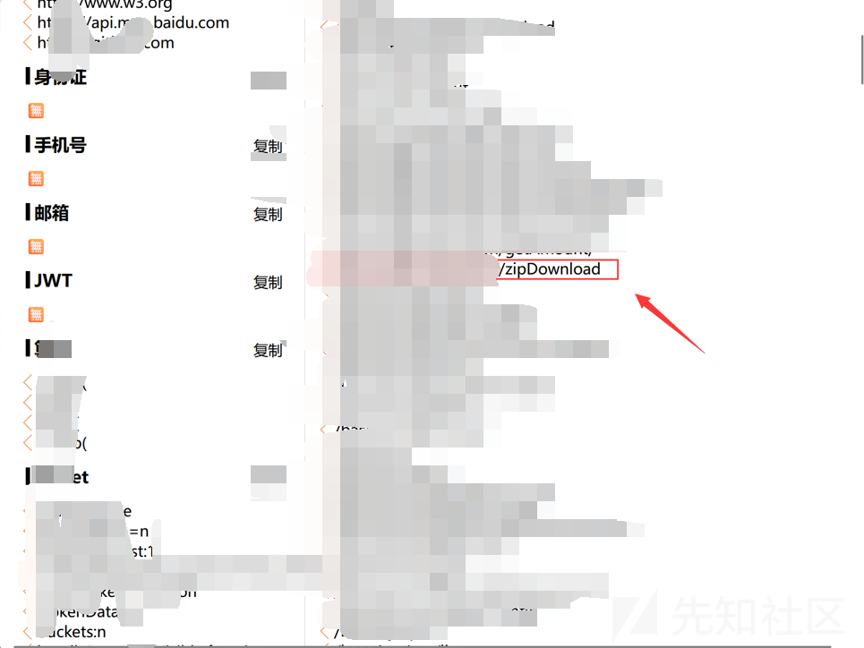

直接访问，发现提示path参数不存在，当加上path参数后又提示type参数不存在，

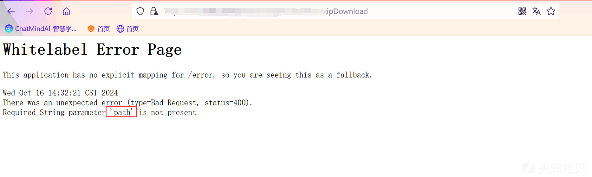

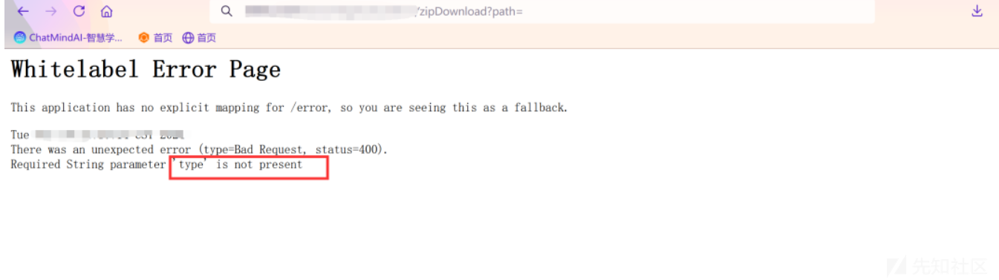

这里直接目录遍历下载文件<https://ip/xxx/xxx/zipDownload?type=1&path=/../../../../../../..//etc/passwd>

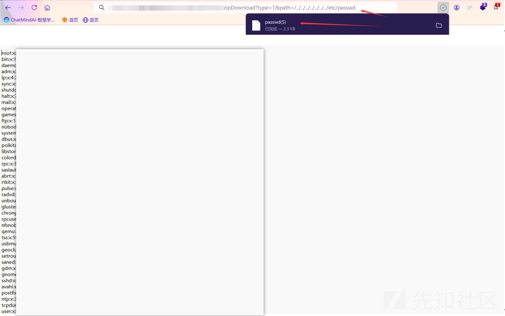

当到这一步说明存在文件下载漏洞，利用该漏洞下载一些linux中特殊文件，看看有没有线索，这里最先下载.bash\_history文件，发现里面的历史命令没有什么利用价值

随后又下载了.mysql\_history、.ssh/、corn、maps等文件，这里下载了ssh的配置文件下来进行查看，发现端口为xxx0并且是允许root用户远程登录的

再去搜索了一下该网站是否开放了SSH端口，发现开放并且mysql端口也开放了

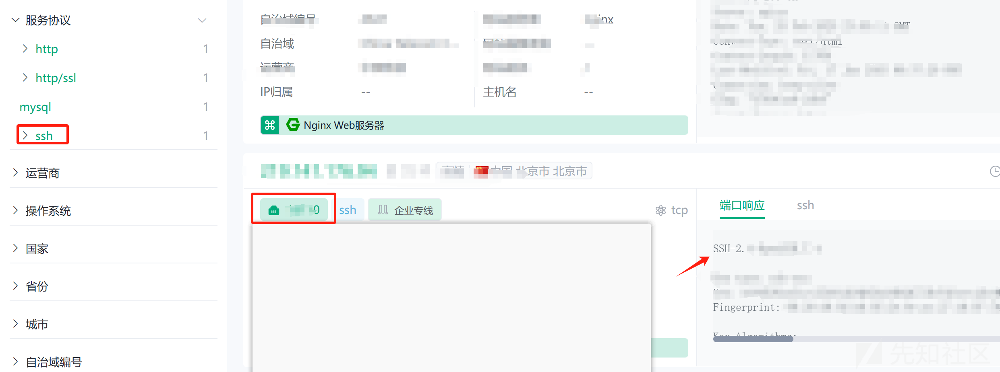

这里直接把shadow文件下载下来，使用john工具爆破一下root用户密码，但是爆破了几十分钟都没有出来结果，到这里基本有一点卡住了

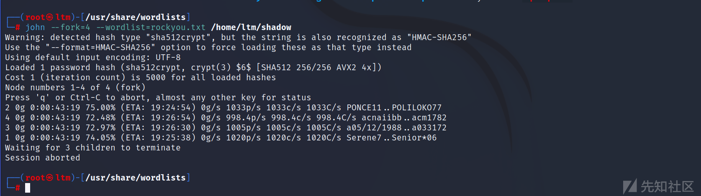

不过这里试着下载了cmdline文件，这个文件包含了内核启动时的所有参数，这些参数定义了内核的行为和配置。例如，启动参数可以指定根文件系统的位置、启动模式（如单用户模式）、硬件参数等

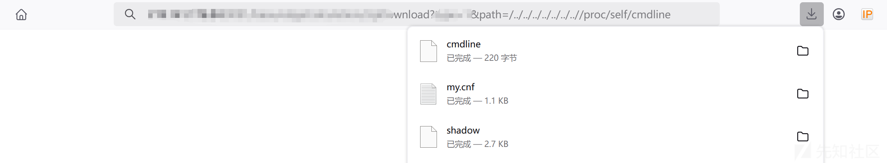

下载成功后发现存在一个yml文件，这种配置文件一般都会存在一下配置信息，而且一般都是数据库的账号密码在里面居多

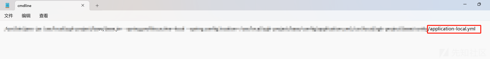

上述cmdline文件中该yml文件是绝对路径，因此可以直接下载该文件下来看看

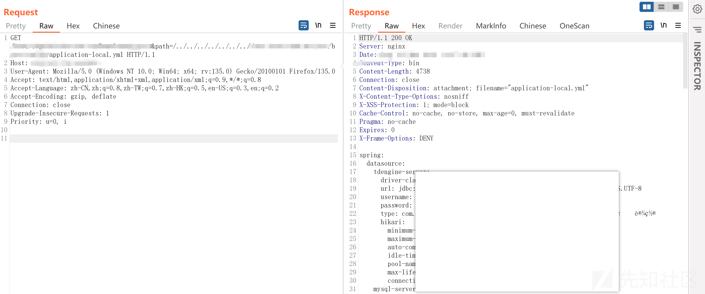

好家伙，发现大量数据库文件信息，mysql、redis、mangodb还有mqtt的账号密码

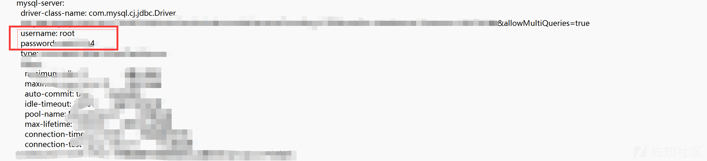

从上述我们可以知道mysql数据库是公网开放的，因此我们可以尝试连接一下，这里连接了好几个密码都是失败的

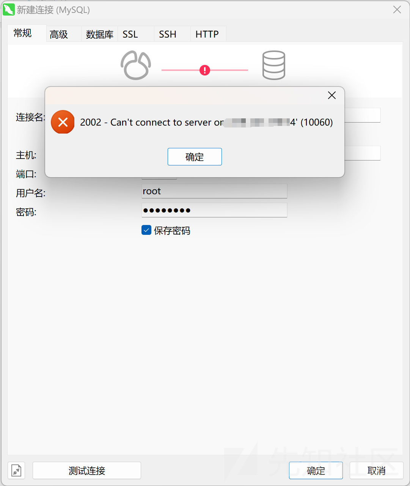

索性就试试这些数据库密码能不能成功登录SSH连上去，这里试到最后一个密码mangodb的密码成功登录root账号，hhh，成功拿下服务器权限，下机下机

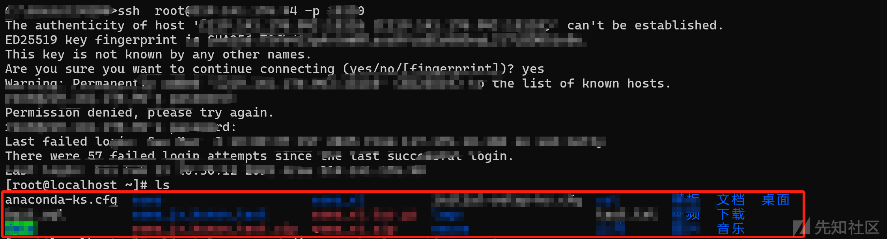
