# 免杀基础-peloader-先知社区

> **来源**: https://xz.aliyun.com/news/17114  
> **文章ID**: 17114

---

之前介绍了一些技术都是基于shellcode的 PE文件不同于shellcode 不能直接执行

要想加载PE文件 需要以下步骤

1. 内存映射PE文件
2. 修复重定位表
3. 修复导入表
4. 修正内存权限
5. 执行OEP

# 实现

## 读取PE文件载入内存并拉伸PE

```
BOOLEAN ReadFileAndExpandPE(LPCSTR filePath, LPVOID* pExpandedPE, PDWORD pExpandedPESize){
     
     HANDLE hFile = CreateFileA(filePath, GENERIC_READ, FILE_SHARE_READ, NULL, OPEN_EXISTING, FILE_ATTRIBUTE_NORMAL, NULL);
     if(hFile == INVALID_HANDLE_VALUE){
         return FALSE;
     }
 
     DWORD fileSize = GetFileSize(hFile, NULL);
     LPVOID pFileBuffer = VirtualAlloc(NULL, fileSize, MEM_COMMIT | MEM_RESERVE, PAGE_READWRITE);
     DWORD bytesRead = 0;
     if(!ReadFile(hFile, pFileBuffer, fileSize, &bytesRead, NULL)){
         CloseHandle(hFile);
         free(pFileBuffer);
         return FALSE;
     }
     CloseHandle(hFile);
 
     PIMAGE_DOS_HEADER pDosHeader = (PIMAGE_DOS_HEADER)pFileBuffer;
     PIMAGE_NT_HEADERS pNtHeaders = (PIMAGE_NT_HEADERS)((DWORD_PTR)pFileBuffer + pDosHeader->e_lfanew);
 
     DWORD expandedPESize = pNtHeaders->OptionalHeader.SizeOfImage;
     DWORD sectionNum = pNtHeaders->FileHeader.NumberOfSections;
 
     LPVOID pExpandedPEBuffer = VirtualAlloc(NULL, expandedPESize, MEM_COMMIT | MEM_RESERVE, PAGE_READWRITE);
     memset(pExpandedPEBuffer, 0, expandedPESize);
 
     memcpy(pExpandedPEBuffer, pFileBuffer, pNtHeaders->OptionalHeader.SizeOfHeaders);
     PIMAGE_SECTION_HEADER pSectionHeader = IMAGE_FIRST_SECTION(pNtHeaders);
 
     for(int i = 0 ; i<sectionNum; i++){
         memcpy((PBYTE)pExpandedPEBuffer + pSectionHeader[i].VirtualAddress, (PBYTE)pFileBuffer + pSectionHeader[i].PointerToRawData, pSectionHeader[i].SizeOfRawData);
     }
     
 
     *pExpandedPE = pExpandedPEBuffer;
     *pExpandedPESize = expandedPESize;
 
     return TRUE;
 }
```

## 修复重定位表

拉伸完pe后需要修复重定位表

因为加载内存到基址不同于ImageBase的时候需要修复

重定位表中的每一项都会包含一个原始地址和需要修正的偏移量

结构BASE\_RELOCATION\_ENTRY的后4位Type表示重定位类型 前12位则是偏移

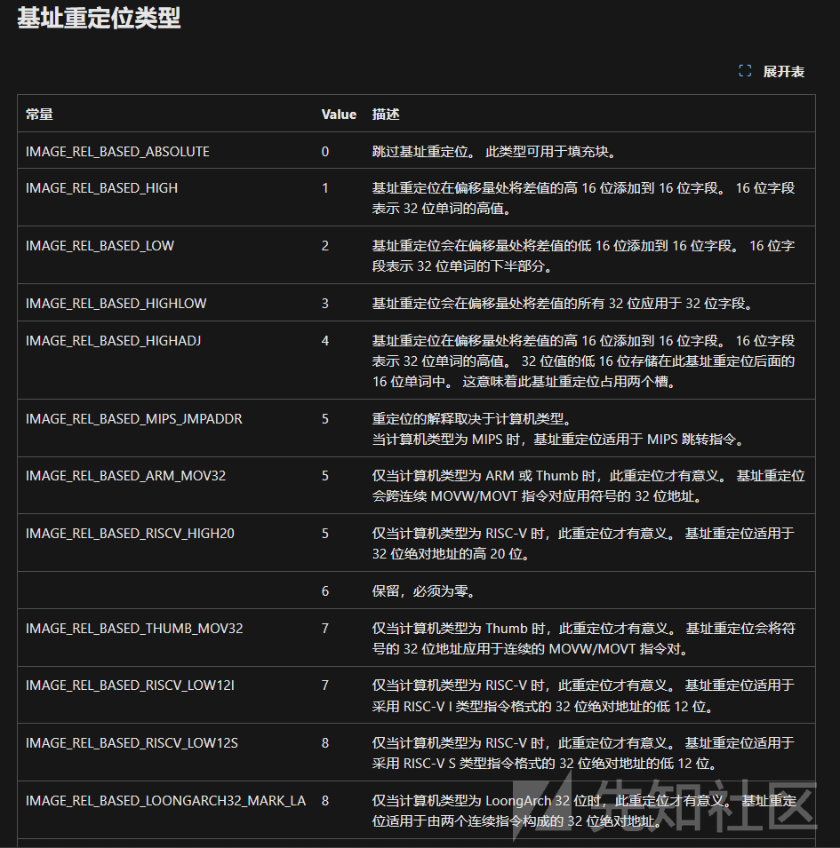

```
BOOLEAN fixReloction(LPVOID pExpandedPE){
     PIMAGE_DOS_HEADER pDosHeader = (PIMAGE_DOS_HEADER)pExpandedPE;
     PIMAGE_NT_HEADERS pNtHeaders = (PIMAGE_NT_HEADERS)((DWORD_PTR)pExpandedPE + pDosHeader->e_lfanew);
 
     if (pNtHeaders->OptionalHeader.DataDirectory[IMAGE_DIRECTORY_ENTRY_BASERELOC].VirtualAddress == 0 ||
         pNtHeaders->OptionalHeader.DataDirectory[IMAGE_DIRECTORY_ENTRY_BASERELOC].Size == 0) {
         return TRUE;
     }
 
     PIMAGE_BASE_RELOCATION pBaseRelocation = (PIMAGE_BASE_RELOCATION)((DWORD_PTR)pExpandedPE + pNtHeaders->OptionalHeader.DataDirectory[IMAGE_DIRECTORY_ENTRY_BASERELOC].VirtualAddress);
     DWORD_PTR offset = (DWORD_PTR)pExpandedPE - pNtHeaders->OptionalHeader.ImageBase;
 
     while(pBaseRelocation->VirtualAddress){
         DWORD relocationCount = (pBaseRelocation->SizeOfBlock - sizeof(IMAGE_BASE_RELOCATION)) / sizeof(WORD);
         PWORD pRelocation = (PWORD)((DWORD_PTR)pBaseRelocation + sizeof(IMAGE_BASE_RELOCATION));
         
         for(int i = 0; i < relocationCount; i++){
             DWORD type = (*pRelocation >> 12);
             DWORD offset_in_block = (*pRelocation & 0x0FFF);
             
             if(type == IMAGE_REL_BASED_HIGHLOW){
                 // 32bit
                 PDWORD pPatch = (PDWORD)((DWORD_PTR)pExpandedPE + pBaseRelocation->VirtualAddress + offset_in_block);
                 *pPatch += (DWORD)offset;
             }
             else if (type == IMAGE_REL_BASED_DIR64) {
                 // 64bit
                 PULONGLONG pPatch = (PULONGLONG)((DWORD_PTR)pExpandedPE + pBaseRelocation->VirtualAddress + offset_in_block);
                 *pPatch += offset;
             }
             pRelocation++;
         }
         pBaseRelocation = (PIMAGE_BASE_RELOCATION)((DWORD_PTR)pBaseRelocation + pBaseRelocation->SizeOfBlock);
     }
 
     return TRUE;
 }
```

## 修复IAT

和重定位表一样 IAT中的地址也是基于imageBase的 所以要修复

```
BOOLEAN fixIAT(LPVOID pExpandedPE) {
     PIMAGE_DOS_HEADER pDosHeader = (PIMAGE_DOS_HEADER)pExpandedPE;
     PIMAGE_NT_HEADERS pNtHeaders = (PIMAGE_NT_HEADERS)((DWORD_PTR)pExpandedPE + pDosHeader->e_lfanew);
 
     PIMAGE_DATA_DIRECTORY pImportDir = &pNtHeaders->OptionalHeader.DataDirectory[IMAGE_DIRECTORY_ENTRY_IMPORT];
     PIMAGE_IMPORT_DESCRIPTOR pImport = (PIMAGE_IMPORT_DESCRIPTOR)((DWORD_PTR)pExpandedPE + pImportDir->VirtualAddress);
 
     while (pImport->Name) {
         LPCSTR dllName = (LPCSTR)((DWORD_PTR)pExpandedPE + pImport->Name);
 
         std::cout << "Loading DLL: " << dllName << std::endl;
         HMODULE hModule = LoadLibraryA(dllName);
         if (hModule == NULL) {
             std::cout << "Failed to load DLL: " << dllName << ", Error: " << GetLastError() << std::endl;
             pImport++;
             continue;
         }
 
         PIMAGE_THUNK_DATA pThunkName = (PIMAGE_THUNK_DATA)((DWORD_PTR)pExpandedPE + pImport->OriginalFirstThunk);
         PIMAGE_THUNK_DATA pThunkFunc = (PIMAGE_THUNK_DATA)((DWORD_PTR)pExpandedPE + pImport->FirstThunk);
 
         while (pThunkName->u1.AddressOfData != 0) {
             FARPROC functionAddress = NULL;
 
             if (pThunkName->u1.Ordinal & IMAGE_ORDINAL_FLAG) {
                 WORD ordinal = (WORD)(pThunkName->u1.Ordinal & 0xFFFF);
                 functionAddress = GetProcAddress(hModule, (LPCSTR)(DWORD_PTR)ordinal);
                 if (functionAddress == NULL) {
                     std::cout << "Failed to load function by ordinal: " << dllName << " #" << ordinal
                         << ", Error: " << GetLastError() << std::endl;
                 }
             }
             else {
                 PIMAGE_IMPORT_BY_NAME pFuncName = (PIMAGE_IMPORT_BY_NAME)((DWORD_PTR)pExpandedPE + pThunkName->u1.AddressOfData);
                 functionAddress = GetProcAddress(hModule, (LPCSTR)pFuncName->Name);
                 if (functionAddress == NULL) {
                     std::cout << "Failed to load function by name: " << dllName << "::" << pFuncName->Name
                         << ", Error: " << GetLastError() << std::endl;
                 }
             }
 
             if (functionAddress != NULL) {
                 pThunkFunc->u1.Function = (DWORD_PTR)functionAddress;
             }
 
             pThunkName++;
             pThunkFunc++;
         }
 
         pImport++;
     }
 
     return TRUE;
 }
```

## 修正内存权限

我们最开始拉伸PE用的RW权限的内存 但是有些段是需要执行的 所以我们要修正内存权限

IMAGE\_SECTION\_HEADER.Characteristics

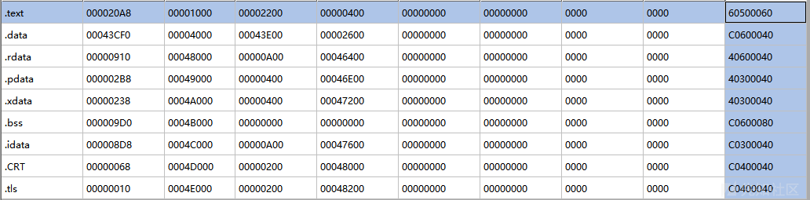

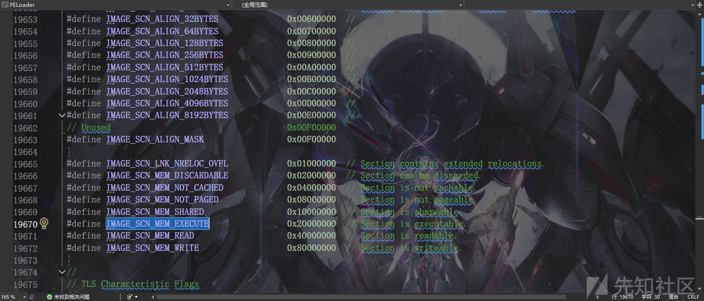

```
BOOLEAN fixSectionPrivilege(LPVOID pExpandedPE) {
     PIMAGE_DOS_HEADER pDosHeader = (PIMAGE_DOS_HEADER)pExpandedPE;
     PIMAGE_NT_HEADERS pNtHeaders = (PIMAGE_NT_HEADERS)((DWORD_PTR)pExpandedPE + pDosHeader->e_lfanew);
     PIMAGE_SECTION_HEADER pSectionHeader = IMAGE_FIRST_SECTION(pNtHeaders);
     DWORD sectionNum = pNtHeaders->FileHeader.NumberOfSections;
     DWORD dwProtection = 0;
     DWORD dwOldProtection = 0;
 
     for (int i = 0; i < sectionNum; i++) {
         dwProtection = PAGE_NOACCESS; 
 
         DWORD characteristics = pSectionHeader[i].Characteristics;
         BOOL hasRead = (characteristics & IMAGE_SCN_MEM_READ) != 0;
         BOOL hasWrite = (characteristics & IMAGE_SCN_MEM_WRITE) != 0;
         BOOL hasExecute = (characteristics & IMAGE_SCN_MEM_EXECUTE) != 0;
 
         if (hasRead && !hasWrite && !hasExecute) {
             dwProtection = PAGE_READONLY;
         }
         else if (hasRead && hasWrite && !hasExecute) {
             dwProtection = PAGE_READWRITE;
         }
         else if (hasRead && !hasWrite && hasExecute) {
             dwProtection = PAGE_EXECUTE_READ;
         }
         else if (hasRead && hasWrite && hasExecute) {
             dwProtection = PAGE_EXECUTE_READWRITE;
         }
         else if (!hasRead && hasWrite && !hasExecute) {
             dwProtection = PAGE_WRITECOPY;
         }
         else if (!hasRead && !hasWrite && hasExecute) {
             dwProtection = PAGE_EXECUTE;
         }
         else if (!hasRead && hasWrite && hasExecute) {
             dwProtection = PAGE_EXECUTE_WRITECOPY;
         }
 
         if (!VirtualProtect((LPVOID)((DWORD_PTR)pExpandedPE + pSectionHeader[i].VirtualAddress),pSectionHeader[i].Misc.VirtualSize,dwProtection,&dwOldProtection)) {
             return FALSE;
         }
     }
 
     return TRUE;
 }
```

## 执行OEP

```
typedef int (WINAPI* pMain)();
 
     pMain Main = (pMain)((DWORD_PTR)lpMem + ((PIMAGE_NT_HEADERS)((DWORD_PTR)lpMem + ((PIMAGE_DOS_HEADER)lpMem)->e_lfanew))->OptionalHeader.AddressOfEntryPoint);
     Main();
```

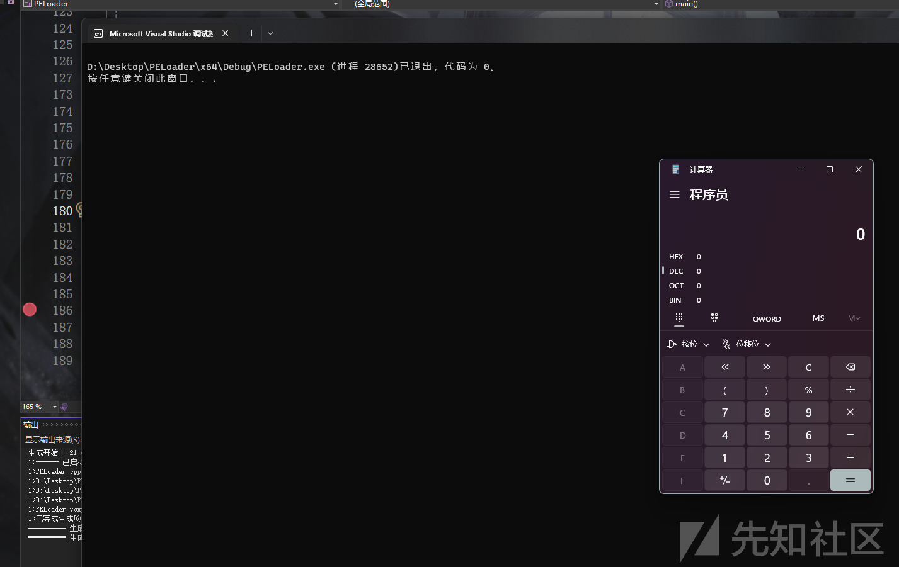

# 修复异常表

64位下 如果PE文件中涉及到了SEH 就需要修复异常表

IMAGE\_DIRECTORY\_ENTRY\_EXCEPTION包含多个RUNTIME\_FUNCTION结构

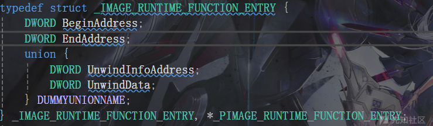

使用RtlAddFunctionTable函数添加到动态函数表列表即可

```
BOOLEAN fixException(LPVOID pExpandedPE) {
 
     PIMAGE_DOS_HEADER pDosHeader = (PIMAGE_DOS_HEADER)pExpandedPE;
     PIMAGE_NT_HEADERS pNtHeaders = (PIMAGE_NT_HEADERS)((DWORD_PTR)pExpandedPE + pDosHeader->e_lfanew);
     PIMAGE_DATA_DIRECTORY pExceptionDir = &pNtHeaders->OptionalHeader.DataDirectory[IMAGE_DIRECTORY_ENTRY_EXCEPTION];
     if (pExceptionDir->Size) {
         PIMAGE_RUNTIME_FUNCTION_ENTRY pException = (PIMAGE_RUNTIME_FUNCTION_ENTRY)((DWORD_PTR)pExpandedPE + pExceptionDir->VirtualAddress);
     
         RtlAddFunctionTable(pException, pExceptionDir->Size / sizeof(IMAGE_RUNTIME_FUNCTION_ENTRY), (DWORD_PTR)pExpandedPE);
     }
     return TRUE;
 
 }
```

# 修复TLS

TLS回调运行在PE入口点之前 因此如果加载需要TLS的程序 得修复TLS表

```
typedef struct _IMAGE_TLS_DIRECTORY64 {
     ULONGLONG StartAddressOfRawData;
     ULONGLONG EndAddressOfRawData;
     ULONGLONG AddressOfIndex;         // PDWORD
     ULONGLONG AddressOfCallBacks;     // PIMAGE_TLS_CALLBACK *;
     DWORD SizeOfZeroFill;
     union {
         DWORD Characteristics;
         struct {
             DWORD Reserved0 : 20;
             DWORD Alignment : 4;
             DWORD Reserved1 : 8;
         } DUMMYSTRUCTNAME;
     } DUMMYUNIONNAME;
 
 } IMAGE_TLS_DIRECTORY64;
```

```
BOOLEAN fixTLS(LPVOID pExpandedPE) {
     PIMAGE_DOS_HEADER pDosHeader = (PIMAGE_DOS_HEADER)pExpandedPE;
     PIMAGE_NT_HEADERS pNtHeaders = (PIMAGE_NT_HEADERS)((DWORD_PTR)pExpandedPE + pDosHeader->e_lfanew);
 
     if(pNtHeaders->OptionalHeader.DataDirectory[IMAGE_DIRECTORY_ENTRY_TLS].Size){
         PIMAGE_TLS_DIRECTORY pTlsDir = (PIMAGE_TLS_DIRECTORY)((DWORD_PTR)pExpandedPE + pNtHeaders->OptionalHeader.DataDirectory[IMAGE_DIRECTORY_ENTRY_TLS].VirtualAddress);
 
         typedef VOID(NTAPI* PIMAGE_TLS_CALLBACK) (PVOID hModule,DWORD dwReason,PVOID pContext);
     
         PIMAGE_TLS_CALLBACK* pCallback = (PIMAGE_TLS_CALLBACK*)pTlsDir->AddressOfCallBacks;
 
         for(int i =0; pCallback[i] != NULL; i++){
             pCallback[i]((PVOID)pExpandedPE, DLL_PROCESS_ATTACH, NULL);
         }
     }
     
     return TRUE;
 
 
 }
```

# 参数处理

跟进invoke\_main 一路往下跟 可以看见\_\_p\_\_\_argv 和 \_\_p\_\_\_argv

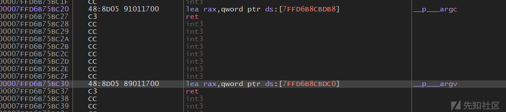

这两个函数都来自ucrtbase.dll

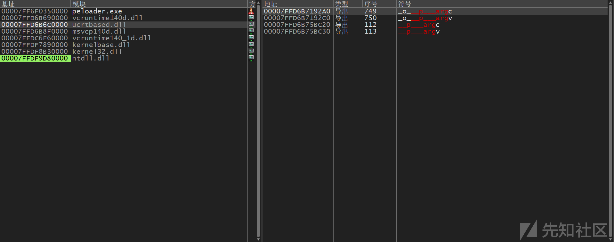

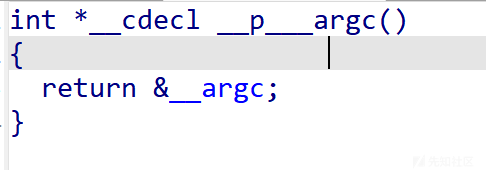

交叉引用找到common\_configure\_argv\_char\_

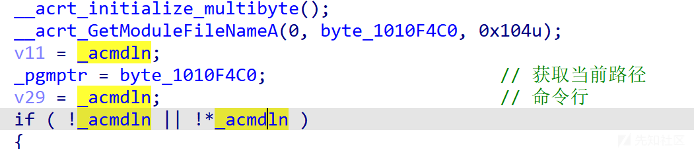

交叉引用找到

\_\_acrt\_initialize\_command\_line

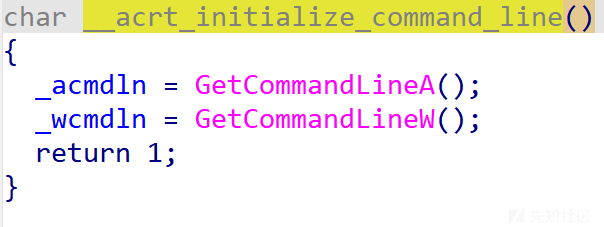

跟入Kernelbase.dll

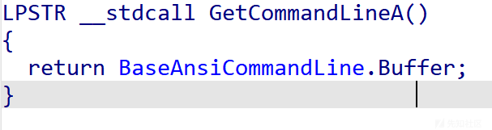

跟入KernelBaseBaseDllInitialize

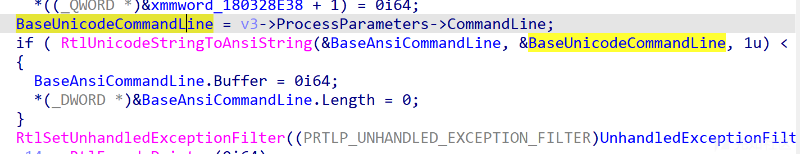

而v3是PEB


于是我们只需要直接直接修改PEB->ProcessParameters.CommandLine即可

```
typedef VOID (NTAPI* pRtlInitUnicodeString)(
     _Out_ PUNICODE_STRING DestinationString,
     _In_opt_z_ PCWSTR SourceString
 );
 
 BOOLEAN handleParameters(char* param) {
     pRtlInitUnicodeString RtlInitUnicodeString = (pRtlInitUnicodeString)GetProcAddress(GetModuleHandleA("ntdll.dll"), "RtlInitUnicodeString");
     if (!RtlInitUnicodeString) {
         return FALSE;
     }
 
     WCHAR wideParam[0x100] = { 0 };
     MultiByteToWideChar(CP_ACP, 0, param, -1, wideParam, 0x100);
 
     UNICODE_STRING uParam = { 0 };
     RtlInitUnicodeString(&uParam, wideParam);
 
 #ifdef _WIN64
     PPEB peb = (PPEB)__readgsqword(0x60);
 #else
     PPEB peb = (PPEB)__readfsdword(0x30);
 #endif
 
     PWSTR newBuffer = (PWSTR)VirtualAlloc(NULL, uParam.MaximumLength, MEM_COMMIT | MEM_RESERVE, PAGE_READWRITE);
 
     memcpy(newBuffer, uParam.Buffer, uParam.Length);
 
     peb->ProcessParameters->CommandLine.Length = uParam.Length;
     peb->ProcessParameters->CommandLine.MaximumLength = uParam.MaximumLength;
     peb->ProcessParameters->CommandLine.Buffer = newBuffer;
 
     return TRUE;
 }
```


# dll加载

如果要执行dllMain的话 和main类似

```
typedef BOOL (APIENTRY* pDllMain)(HMODULE,DWORD,LPVOID);
 
 pDllMain dllMain = (pDllMain)((DWORD_PTR)lpMem + ((PIMAGE_NT_HEADERS)((DWORD_PTR)lpMem + ((PIMAGE_DOS_HEADER)lpMem)->e_lfanew))->OptionalHeader.AddressOfEntryPoint);
     dllMain((HMODULE)lpMem, DLL_PROCESS_ATTACH, NULL);
```


如果需要执行导出函数则首先需要解析导出表 获取到对应函数地址后创建线程执行

```
LPVOID parseDllExport(LPVOID pExpandedPE,char* funcName) {
     PIMAGE_DOS_HEADER pDosHeader = (PIMAGE_DOS_HEADER)pExpandedPE;
     PIMAGE_NT_HEADERS pNtHeaders = (PIMAGE_NT_HEADERS)((DWORD_PTR)pExpandedPE + pDosHeader->e_lfanew);
     PIMAGE_EXPORT_DIRECTORY pExportDir = (PIMAGE_EXPORT_DIRECTORY)((DWORD_PTR)pExpandedPE + pNtHeaders->OptionalHeader.DataDirectory[IMAGE_DIRECTORY_ENTRY_EXPORT].VirtualAddress);
 
     PDWORD pFunctionAddresses = (PDWORD)((DWORD_PTR)pExpandedPE + pExportDir->AddressOfFunctions);
     PDWORD pFunctionNameAddresses = (PDWORD)((DWORD_PTR)pExpandedPE + pExportDir->AddressOfNames);
     PWORD pFunctionNameOrdinals = (PWORD)((DWORD_PTR)pExpandedPE + pExportDir->AddressOfNameOrdinals);
 
 
     for (int i = 0; i < pExportDir->NumberOfFunctions; i++) {
         char* name = (char*)((DWORD_PTR)pExpandedPE + pFunctionNameAddresses[i]);
 
         if (_stricmp(funcName,name) == 0) {
             DWORD funOrdinal = pFunctionNameOrdinals[i];
             return (LPVOID)((DWORD_PTR)pExpandedPE + pFunctionAddresses[funOrdinal]);
         }
     }
     return NULL;
 }
```
