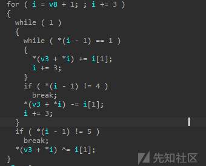
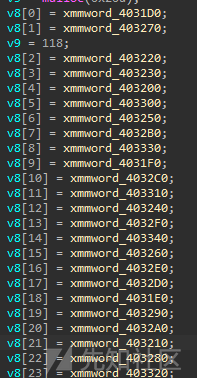
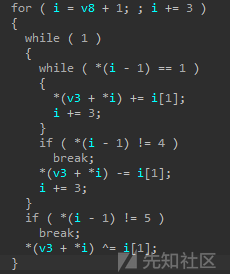
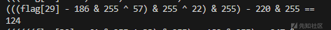

# [原创]CTF 逆向：基础 VM 的三大解法剖析-先知社区

> **来源**: https://xz.aliyun.com/news/17125  
> **文章ID**: 17125

---

前几天,一位学弟发了道很基础的vm题目给我,我自己想用多种思路来解,中间碰壁多次,于是想着写一篇博客分享下碰壁过程以及关于vm题型我自己的一些解法

# 一、VM 核心原理速览

## vm题型简介

程序大多会有自己一套循环的执行程序流  
大致长相为

```
while(i<len(opcode)):
    if(opcode[i]==0x00):
        i+=1
    elif(opcode[i]==0x01):
        i+=2
    elif(opcode[i]==0x02):
        i+=3
```

这样的

其中opcode一般情况是由操作数和操作组成的一大串数据(通常由成百上千个byte组成)  
说白了就是其中的加密过程很多,我们需要模拟执行流

## 破局思路

关键定位：虚拟指令分发器（opcode）  
加密逻辑:找到他的循环加密  
模拟重建：模拟执行流进行爆破或者解密

# 二、三种解法

## 解法一：传统手撕

将整个执行流程保存下来,倒着用enc去回到flag

## 解法二：正向Z3

模拟加密过程,使用Z3约束求解来得到flag

## 解法三：通过gbd或者frida插桩爆破

因为单字节或者双字节的缘故,所有可能也不过那么几样,我们通过一些手段可以实现爆破程序得到flag

## 高难度vm

2024年强网杯就有一道vm,对我来说很难  
找不到opcode和中间的执行流  
这种题我目前的想法也只会无脑的爆破程序,不出也不会了,硬看经常大脑卡死  
(大佬轻松手撕)

# 三、解题

## 前言

解题前放两位大佬关于vm的博客,我也是跟着学的~  
[upsw1ng佬关于vm的博客](https://bbs.kanxue.com/elink@6afK9s2c8@1M7s2y4Q4x3@1q4Q4x3V1k6Q4x3V1k6E0M7q4)9J5k6i4N6W2K9i4S2A6L8W2)9J5k6i4q4I4i4K6u0W2j5$3!0E0i4K6u0r3M7#2)9J5c8Y4b7I4e0h3g2k6b7@1y4J5b7X3N6D9z5g2g2Q4x3X3c8$3h3X3W2r3z5g2u0K9f1b7%60.%60.)  
[swdd佬关于利用frida去插桩爆破的博客](https://bbs.kanxue.com/thread-281796.htm)

## 前面两种方法

因为前面两种方法都要去提取opcode,所以放一起了  
我们以isctf2022年的一道很基础的vm来进行讲解  
(题目已经上传了)

  
很纯粹的vm,不带任何杂质  
一眼看见了程序加密逻辑  


同时可以看见i是我们的opcode,i是由v8赋值而来,我们再看一眼v8



双击进去


基本上是opcode无疑  
这里我们可以选择第一个变量,shift+8提取opcode  
一共24个变量,一个变量16 byte  


这里多提取一点以防万一  
当然这里也可以使用idapython来提取,我就不过多赘述了  
贴个脚本

```
import idaapi
import idc
start_address = 0x7A31D0
data_length = 16 * 25  # 略微多提取，一定要提取正确，不然后面很痛苦
# 将字节对象转换为十六进制字符串
with open("E:\CTF\code\python\CTF\dumpopcode.txt", "a") as f:
    for i in range(0,data_length):
        f.write(hex(idc.get_wide_byte(start_address+i)))
        f.write("
")
```

提取了opcode我们再去复现执行流  
这里有个坑了,我贴上最后的代码片段大家可以对比下  


```
def encode(flag, opcode):
    encoded_flag = flag.copy() 
    i = 1
    while i < len(opcode):
        op_type = opcode[i - 1]
        target = opcode[i]
        value = opcode[i + 1]
        if op_type == 1:
            writefile(f"flag[{target}] = flag[{target}] + {hex(value)};")
            i += 3
        elif op_type == 4:
            writefile(f"flag[{target}] = flag[{target}] - {hex(value)};")
            i += 3
        elif op_type == 5:
            writefile(f"flag[{target}] = flag[{target}] ^ {hex(value)};")
            i += 3
        else:
            break 
    return encoded_flag
```

可以看见很多地方不一样,至于原理我就不是很懂了,有佬知道可以解答下吗~  
具体解密流程建议大家去看汇编代码  
比如这里写的[1]


其实是[i-1]

现在opcode和执行流程有了,就是我们的求解方法了  
这里衍生出了两张,一种是直接手撕逆回去,因为+-^都是可以逆的

## 解法一逆向手撕

先贴exp

```
import z3
def getfile(file_path):
    opcode = []
    with open(file_path, 'r') as file:
        for line in file:
            opcode.append(int(line.strip(), 16))
    return opcode
def enopcode(opcode):
    read_opcode=[]
    i = 1
    while i<len(opcode):
        while True:
            while opcode[i - 1] == 1:
                read_opcode.append(opcode[i])
                read_opcode.append(1)
                read_opcode.append(opcode[i+1])
                i += 3
            if opcode[i - 1] != 4:
                break
            read_opcode.append(opcode[i])
            read_opcode.append(2)
            read_opcode.append(opcode[i+1])
            i += 3
        if opcode[i - 1] == 5:
            read_opcode.append(opcode[i])
            read_opcode.append(3)
            read_opcode.append(opcode[i+1])
            i += 3
        else:
            break
    return read_opcode
def deopcode(value,opcode,number):
    for i in range(len(opcode)-3,-1,-3):
        if opcode[i]==number:
            if opcode[i+1]==1:
                value-=opcode[i+2]
                print(f'flag[{number}]-={hex(opcode[i+2])}')
            elif opcode[i+1]==2:
                value+=opcode[i+2]
                print(f'flag[{number}]+={hex(opcode[i+2])}')
            elif opcode[i+1]==3:
                value^=opcode[i+2]
                print(f'flag[{number}]^={hex(opcode[i+2])}')
    return value&0xff
if __name__ == '__main__':
    oriopcode = getfile("E:\CTF\code\python\CTF\dumpopcode.txt")
    flag_enc = [
        0x65, 0xE2, 0x57, 0x60, 0xCE, 0x1E, 0xE1, 0x5C, 0x4B, 0x4B,
        0x23, 0x6D, 0x8C, 0xC2, 0xBC, 0x58, 0x84, 0x92, 0x7E, 0x8C,
        0x43, 0xDB, 0x15, 0x71, 0x97, 0x4A, 0xE3, 0xC4, 0x1F, 0x7C,
        0xC2, 0xFD
    ]
    opcode=enopcode(oriopcode)
    flag=[]
    for i in range(0,len(flag_enc)):
        flag.append(deopcode(flag_enc[i],opcode,i))
    print(''.join(chr(flag[i]) for i in range(len(flag))))
```

这里因为异或优先级的原因,所以我选择把opcode存起来,然后从后往前进行解密  
中间打印的那些,只是为了我当时方便去调试

## 解法二 Z3约束

这里有两个异曲同工的解法  
首先推荐的是第一种

```
import z3

def getfile(file_path):
    opcode = []
    with open(file_path, 'r') as file:
        for line in file:
            opcode.append(int(line.strip(), 16))
    return opcode

def encode(flag, opcode):
    encoded_flag = flag.copy() 
    i = 1
    while i < len(opcode):
        op_type = opcode[i - 1]
        target = opcode[i]
        value = opcode[i + 1]

        if op_type == 1:
            # 加法操作后截断为 8 位
            encoded_flag[target] = (encoded_flag[target] + value) & 0xFF
            print(f"flag[{target}] += {hex(value)}")
            i += 3
        elif op_type == 4:
            # 减法操作后截断为 8 位
            encoded_flag[target] = (encoded_flag[target] - value) & 0xFF
            print(f"flag[{target}] -= {hex(value)}")
            i += 3
        elif op_type == 5:
            # 异或操作后截断为 8 位
            encoded_flag[target] = (encoded_flag[target] ^ value) & 0xFF
            print(f"flag[{target}] ^= {hex(value)}")
            i += 3
        else:
            break  # 未知操作类型退出循环
    return encoded_flag

if __name__ == '__main__':
    opcode = getfile("E:\CTF\code\python\CTF\dumpopcode.txt")
    flag_size = 32
    flag = [z3.BitVec(f'flag[{i}]', 8) for i in range(flag_size)]  # 使用 8 位 BitVec
    flag_enc = [
        0x65, 0xE2, 0x57, 0x60, 0xCE, 0x1E, 0xE1, 0x5C, 0x4B, 0x4B,
        0x23, 0x6D, 0x8C, 0xC2, 0xBC, 0x58, 0x84, 0x92, 0x7E, 0x8C,
        0x43, 0xDB, 0x15, 0x71, 0x97, 0x4A, 0xE3, 0xC4, 0x1F, 0x7C,
        0xC2, 0xFD
    ]

    solver = z3.Solver()
    encoded_flag = encode(flag, opcode)

    # 添加约束：每个字节最终等于 flag_enc
    for j in range(len(flag_enc)):
        solver.add(encoded_flag[j] == flag_enc[j])
    for i in solver.assertions():
        print(i)
    if solver.check() == z3.sat:
        model = solver.model()
        result_flag = [model.evaluate(flag[i]).as_long() for i in range(flag_size)]
        print(result_flag)
    else:
        print("No solution found.")
        # a=[98, 48, 98, 51, 101, 97, 97, 57, 55, 56, 51, 102, 54, 49, 57, 101, 49, 49, 98, 48, 97, 52, 48, 54, 52, 48, 50, 53, 48, 49, 56, 97]
        # for i in a:
#     print(chr(i),end='')
```

这里有个巨大的坑,卡了我十个小时,因为约束求解多项式的原因,优先级问题,我们在用flag去进行encode的时候,必须要创建一个副本,不然会因为符号变量原因什么的,导致中间那个&0xff和^的优先级会混乱  
像下面这样  


所以一定要encoded\_flag = encode(flag, opcode)  
flag副本去solver

当然你也可以一个一个去打印出来,这样方便你去调试,这道题的wp就是这样做的,我也不水字数了,大家可以自己去看看

## 解法三frida插桩爆破

这里不会的师傅一定去看看上面给大家推荐的swdd的博客,我就直接贴脚本了

```
var number = 22;
function main() {
  var base = Module.findBaseAddress("vm.exe");
  if (base) {
  // console.log(base);
  Interceptor.attach(base.add(0x197F), {//循环的地方
  //opcode
  onEnter: function(args) {
  number += 1;
}
});
Interceptor.attach(base.add(0x19A2), {  //最好放在retn
  // Interceptor.attach(0x7FF755321965, {  直接给地址这样好像不行
  onEnter: function(args) {

  //console.log(number)
  send(number);
  var a = 0;
  for (var i = 0; i < 10000; i++) {
  a += 1;
}
var f = new NativeFunction(base.add(0x274A), 'void', ['int']); //exit函数地址,不是特别特别重要
f(0);
}
});
}
}

setImmediate(main);
```

frida代码

```
import subprocess
import frida
import sys
import win32api
import win32con
import time

# 已知的 flag 部分
known_flag = b''

# 总 flag 长度
flaglen = 40
filename = r"E:\CTF\problem\match\2025二进制第一次测试\二进制测试\re\vm.exe"
exename = 'vm.exe'

# 根据已知部分创建初始 flag
flag = bytearray(known_flag + b' ' * (flaglen - len(known_flag)))

jscode = open("frida/hook.js", "rb").read().decode()
new_number = 0
result = 0

def brute(F):
    def on_message(message, data):
        global result
        if message['type'] == 'send':
            result = message['payload']
    # print(result)
    # else:
    # print(message)

    process = subprocess.Popen(filename, stdin=subprocess.PIPE,
                               stdout=subprocess.PIPE,
                               stderr=subprocess.PIPE,
                               universal_newlines=True)

    session = frida.attach(exename)
    script = session.create_script(jscode)
    script.on('message', on_message)
    script.load()
    print(f"\r{F.decode()}", end='')
    process.stdin.write(F.decode())
    output, error = process.communicate()

    # time.sleep(20)

    # print(output)

    # print(f"number:{result}")
    process.terminate()
    return result

count = len(known_flag)
new_number = brute(flag)
t = time.time()
st = t
while count < flaglen:
    number = brute(flag)
    print(number)
    if number!= new_number:
        new_number = number
        count += 1
    else:
        flag[count] += 1
        if flag[count] > 127:
            flag[count] = ord('?')
            count += 1
print(f"总耗时{time.time() - st}")
print(flag.decode())


```

报告大帅!解题完毕!  

