# k8s环境下的DNS应急响应-先知社区

> **来源**: https://xz.aliyun.com/news/17134  
> **文章ID**: 17134

---

本篇文章将以Docker作为基础，逐步过渡到Kubernetes业务环境下的应急响应

# Background

* 容器化架构的普及使得攻击面增大
* 传统安全方法在K8s动态环境中的局限性
* 某年某活动中的一次k8s机器请求恶意域名的应急响应

# 0.Docker

## Docker Network

Docker有Bridge、None、Host、Container四种网络模式，这四种网络模式可以通过启动容器的时候指定，其命令和参数如下：

|  |  |  |
| --- | --- | --- |
| 网络模式 | 参数 | 说明 |
| Bridge | --net=bridge | 默认为该模式，通过-p指定端口映射 |
| None | --net=none | 容器有独立的Network namespace，但并没有对其进行任何网络设置 |
| Host | --net=host | 容器和宿主机共享Network namespace |
| Container | --net={id} | 容器和另一个容器共享Network namespace kubernetes中的pod就是多个容器共享一个Network namespace |

这四种模式可以理解成Docker怎么虚拟化容器的网络、隔离程度和共享程度

### Network Namespace

\*\*Network namespace（网络命名空间）**是Linux内核提供的一种**网络隔离机制\*8，它允许在同一台主机上创建多个独立的网络栈，使每个命名空间中的网络资源（IP地址、路由表、网络接口等）彼此隔离

#### Network Namespace的关键特性

* 独立的网络栈

* 每个Network Namespace都有自己独立的网络接口、IP地址、路由表、防火墙规则等
* 不同Network Namespace之间默认不能直接通信，除非使用**veth**设备或**桥接**进行连接

* 进程级隔离

* 进程只能访问它所在的Network Namespace所提供的网络资源
* 这样保证了容器、虚拟机等环境之间的网络流量互不干扰

* 轻量级实现

* 不需要虚拟化，仅依赖Linux内核特性，比传统的虚拟机更加轻量级
* 结合Cgroups进行资源控制，可以为容器提供更加安全的运行环境**Cgroups（Control Groups）是Linux内核提供的一种资源管理机制**，它允许限制、隔离和监控一组进程对系统资源（CPU、内存、I/O、网络等）的使用。Cgroups是Docker容器、Kubernetes资源管理的核心技术之一，确保不同的容器或进程不会过度消耗主机资源

### Bridge

使用Docker创建一个bridge模式的容器命令格式如下：

```
docker run -itd -p 8080:80 nginx:latest
```

bridge称为网桥模式，首先Docker会在主机上创建一个名为docker0的虚拟网桥，这个虚拟网络处于七层网络模型的数据链路层，每当创建一个新容器时，容器都会通过docker0与主机的网络连接，docker0相当于网桥。

使用bridge模式创建的容器，其内部都有一个虚拟网卡，名为eth0，容器之间可以通过172.17.x.x相互通信。

一般情况下，网桥默认IP范围是172.17.x.x，可以在宿主机执行ifconfig命令查看所有网卡，里面会包含Docker容器的虚拟网卡，可以查看某个容器的ip地址。

使用了bridge创建的容器，其网络与主机以及其他容器隔离，以太网接口、路由表以及DNS配置都是独立的。

每个容器都是一个独立的主机，这便是bridge的作用。

但是由于docker0的存在，对于容器来说，可以通过ip访问别的容器

其逻辑上与Vmware Workstaion的桥接模式很像，不过vm桥接的是物理网卡，docker bridge桥接的是docker0虚拟网卡

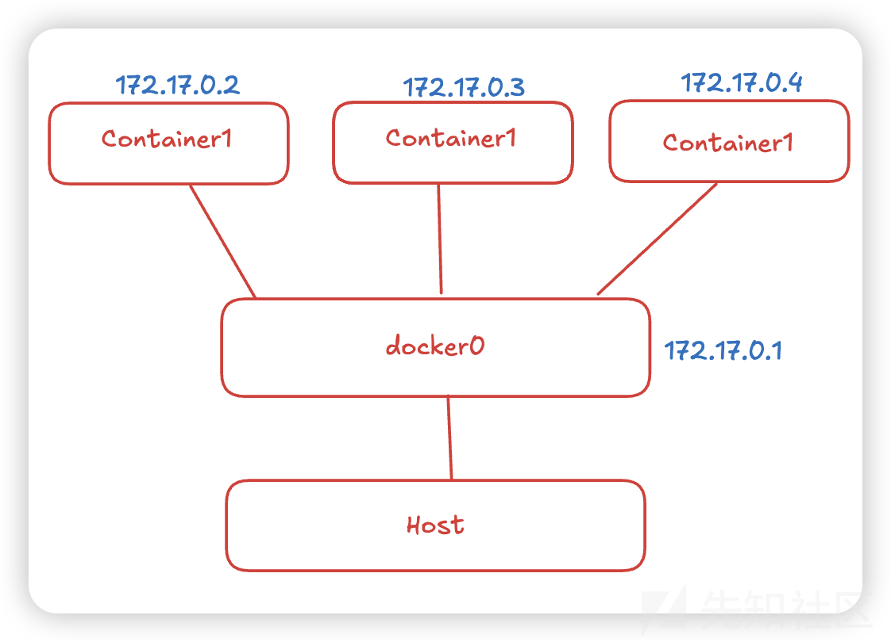

### None

这种网络模式下容器只有lo回环网络，没有其他网卡，这种类型的网络没有办法联网，外接也无法访问它，封闭的网络能很好的保证容器的安全性

```
docker run -itd --net=none nginx:latest
```

```
root@5a67da130f62:/var# ./ifconfig 
lo: flags=73<UP,LOOPBACK,RUNNING>  mtu 65536
        inet 127.0.0.1  netmask 255.0.0.0
        loop  txqueuelen 1000  (Local Loopback)
        RX packets 0  bytes 0 (0.0 B)
        RX errors 0  dropped 0  overruns 0  frame 0
        TX packets 0  bytes 0 (0.0 B)
        TX errors 0  dropped 0 overruns 0  carrier 0  collisions 0
```

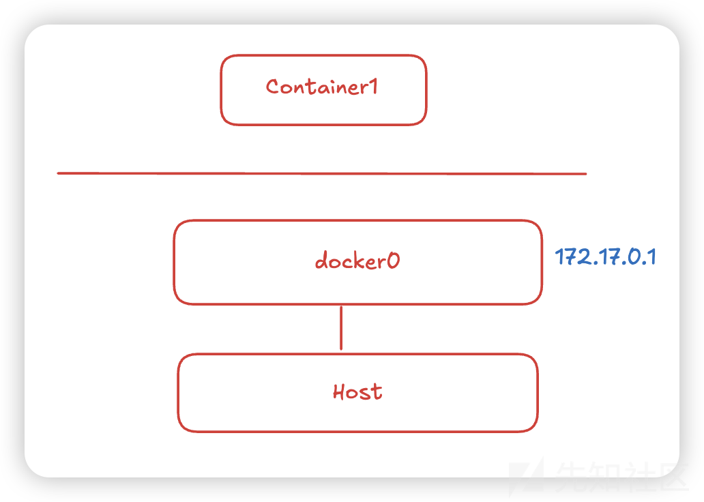

### Host

host模式会让容器与主机共享网络，此时映射的端口可能会产生冲突，但是容器的其余部分（文件系统、进程等）依然是隔离的，此时容器与宿主机共享网络

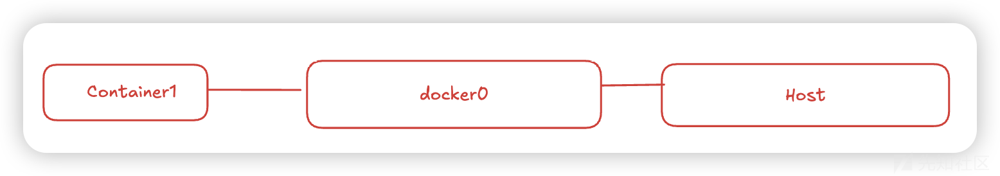

### Container

container模式可以让多个容器之间相互通讯，即容器之间共享网络

首先启动一个A容器，A一般为`bridge`网络，接着B使用`--net={id}`连接到A中，使用A的虚拟网卡，此时A、B共享网络，可以接着加入B、C、D容器

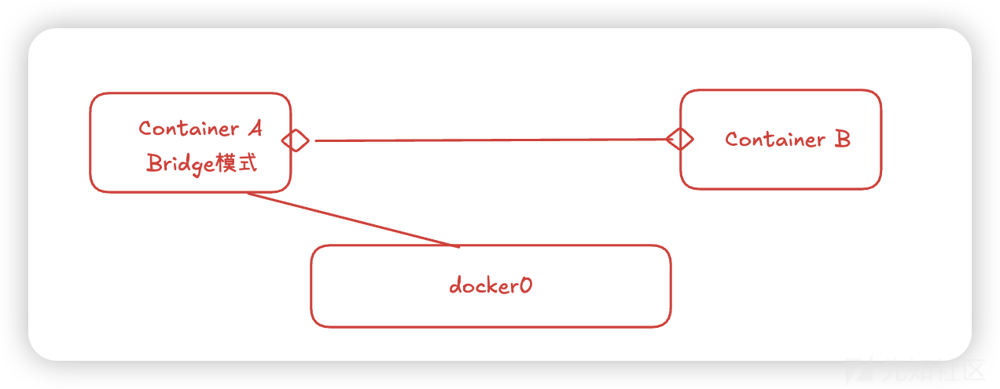

# 1.Pod

将多个容器打包起来一起运行，这个整体就被称作Pod

> Pod正是通过Docker Network中所说的container模式来让Pod中的容器共享网络

Pod是Kubernetes集群中最小的执行单位。在Kubernetes中，容器不直接在集群节点上运行，而是将一个或多个容器封装在一个Pod中，接着将Pod调度到节点上运行，这些容器会一起被运行、停止，它们是一个整体。

Pod中的所有容器共享相同的资源和本地网络，从而简化了Pod中应用程序之间的通讯。

Pod启动时会启动一个容器，K8s给这个容器分配虚拟IP，接着其他容器使用container网络模式连接到这个容器中

一个简单的Pod，其结构如下：

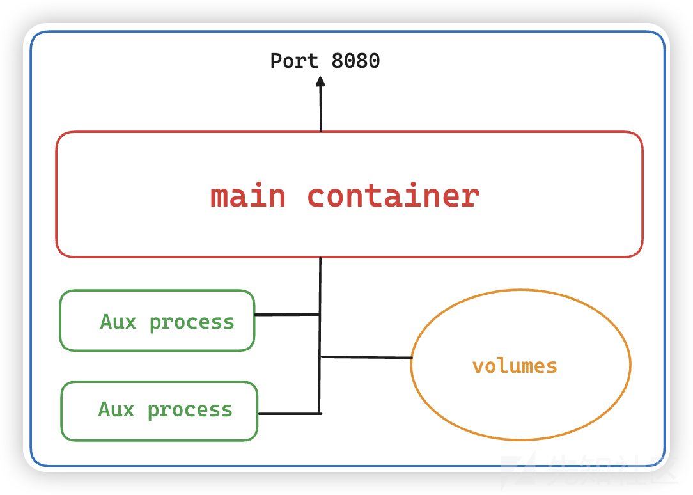

可以将其具象化的理解成一个docker-compose.yml

```
version: '3.8'

services:
  main-container:
    image: nginx:latest
    ports:
      - "8080:8080"
    volumes:
      - data-volume:/app/data
    networks:
      - app-network
  aux-process-1:
    image: fluentd:latest  # 假设它用于日志处理
    volumes:
      - data-volume:/app/data
    networks:
      - app-network
  aux-process-2:
    image: busybox
    command: sleep 3600  # 模拟后台任务进程
    volumes:
      - data-volume:/app/data
    networks:
      - app-network
volumes:
  data-volume:  # 定义存储卷，供多个容器共享

networks:
  app-network:  # 定义容器通信的网络
```

`docker-compose.yml`生成的容器化应用就可以理解为一个`Kubernetes Pod` 但其概念上又有一些异同

## Difference between contianer and pod

### Similarities

* Pod和docker-compose定义的多个容器都可以在同一主机或网络环境下运行，并且容器之间可以通过共享存储卷和内部通信协作。
* 共享存储卷（Volumes in docker-compose.yml或PersistentVolume in Kubernetes）
* 同一网络（networks in docker-compose.yml）

### Differences

|  |  |  |
| --- | --- | --- |
| 特性 | docker-compose | Kubernetes Pod |
| 作用范围 | 一组独立容器组成一个应用（多个服务） | Pod是一个最小单位，内部多个容器紧密协作 |
| 网络 | 通过networks实现连接 | Pod内部容器共享同一IP，用localhost直接通信 |
| 存储 | volumes由docker-compose定义 | emptyDir、PersistentVolume进行存储管理 |
| 运行环境 | docker-compose up启动后，容器各自运行 | Pod由Kubernetes管理，可能有ReplicaSet、Deployment等 |
| 扩展 | 需要手动docker-compose scale | Kubernetes可以自动扩展（HPA、Replicas） |

# 2.Node

Pod是Kubernetes中最小的执行单元，而Node是Kubernetes中最小的计算硬件单元，节点可以是物理的本地服务器，也可以是虚拟机，节点即是宿主服务器，可以运行Docker的机器

与容器一样，Node提供了一个抽象层。多个Node一起工作形成了Kubernetes集群，它可以根据需求的变化自动分配工作负载，增加或减少在节点上的Pod数量。如果A节点和B节点的硬件资源是一致的，那么A、B两个节点是等价的，如果A节点失败，它将自动从集群中移除，由B节点接管，不会出现问题。

每个阶段都运行这一个名为kubelet的组件，它是节点的主要组件，Kubernetes与集群控制平面组件（API Server）通信，所有对节点有影响的操作都会通过kubectl控制此节点。kubelet也是master节点跟worker节点之间直接通讯的唯一组件。

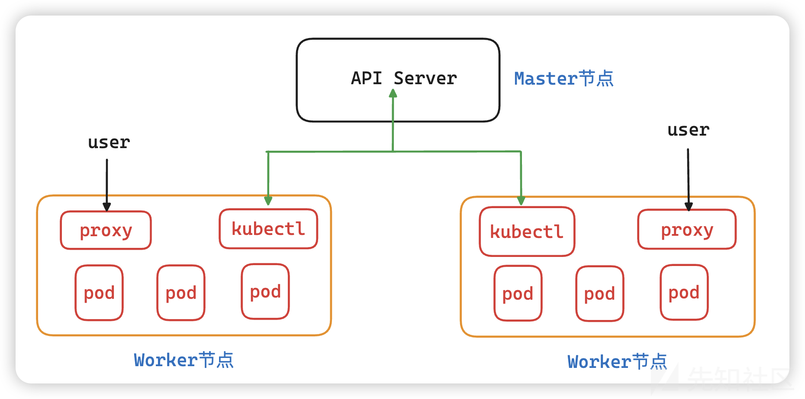

* API Server是集群的核心，所有操作都必须经过它
* Workder节点运行Pod，并使用kube-proxy处理网络通信
* kubectl允许用户通过命令行工具管理Kubernetes
* proxy组件确保集群内部的服务流量正常转发

> 小节

至此我们梳理了Kubernetes的运作框架：

​ 在一个k8s集群中（Cluster），运行着N台服务器，即N个Node（节点）。

这些节点有两种，一种是master节点，一种是worker节点。master节点运行着Kubernetes系统组件，而worker节点负责运行用户的程序。所有节点都归master管，我们通过命令、API都方式管理Kubernetes集群时，是通过发送命令或请求到master节点上的系统组件，然后控制整个集群

# 3.Environment deploy

## minikube

Minikube是Kubernetes的一种轻量级实现，旨在提供本地开发和测试环境，使开发者能够在单一节点上运行完整的Kubernetes集群。

本文应急响应的集群环境将通过minikube完成部署

### create cluster

```
> minikube start
😄  Darwin 15.3.1 (arm64) 上的 minikube v1.35.0
✨  根据现有的配置文件使用 docker 驱动程序
👍  在集群中 "minikube" 启动节点 "minikube" primary control-plane
🚜  正在拉取基础镜像 v0.0.46 ...
🏃  正在更新运行中的 docker "minikube" container ...
🌐  找到的网络选项：
📘  请参阅 https://minikube.sigs.k8s.io/docs/handbook/vpn_and_proxy/ 了解更多详情
💡  要获取新的外部镜像，可能需要配置代理：https://minikube.sigs.k8s.io/docs/reference/networking/proxy/
🐳  正在 Docker 27.4.1 中准备 Kubernetes v1.32.0…
🔎  正在验证 Kubernetes 组件...
    ▪ 正在使用镜像 gcr.io/k8s-minikube/storage-provisioner:v5
🌟  启用插件： default-storageclass, storage-provisioner
🏄  完成！kubectl 现在已配置，默认使用"minikube"集群和"default"命名空间
```

启动minikube后我们通过kubectl获取nodes，发现已经正确部署节点

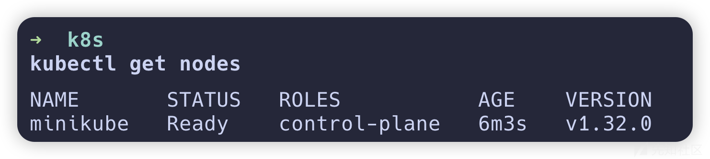

### deploy pods

编写用于管理Pod生命周期并处理滚动更新和回滚工作的deployment.yaml

```
[deployment.yaml]
apiVersion: apps/v1
kind: Deployment
metadata:
  name: web-service
spec:
  replicas: 3
  selector:
    matchLabels:
      app: web   
  template:
    metadata:
      labels:
        app: web  
    spec:
      containers:
        - name: nginx
          image: nginx:latest
          ports:
            - containerPort: 80
```

编写用于提供访问入口的service.yaml

```
[service.yaml]
apiVersion: v1
kind: Service
metadata:
  name: web-service
spec:
  selector:
    app: web  
  ports:
    - protocol: TCP
      port: 80
      targetPort: 80
  type: NodePort
```

接下来创建Deployment和Service

```
> kubectl apply -f service.yaml 
service/web-service created
> kubectl apply -f deployment.yaml 
deployment.apps/web-service created
```

查看Pod和Service状态

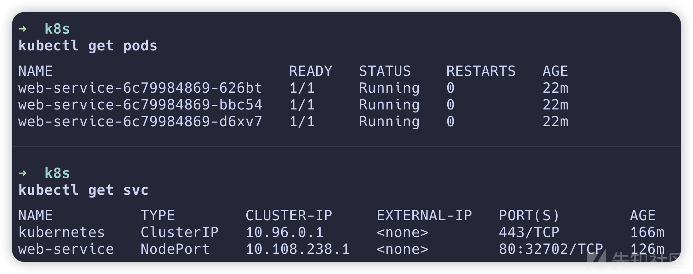

返回用于连接到service的URL

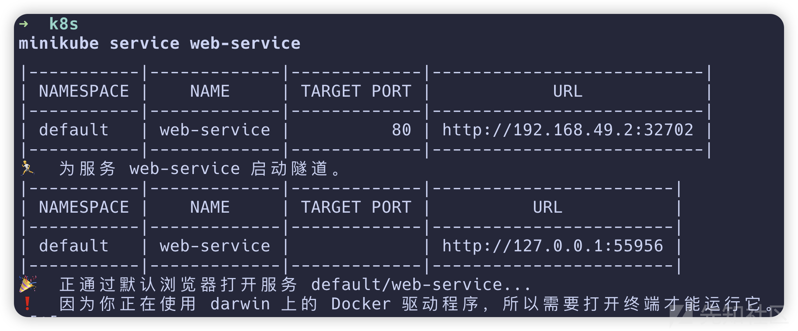

部署成功

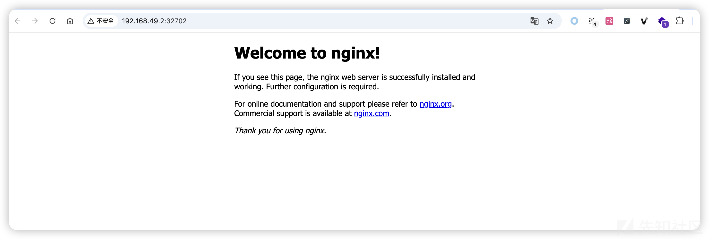

# 4.Emergency Response

> Kubernetes 集群触发了一条主机安全告警，显示某台主机尝试解析并访问已知的恶意域名。然而，进一步排查后发现，被标记为可疑请求来源的主机实际承担了集群 DNS 解析的功能，而非恶意流量的真正发起者。

* 在k8s中，CoreDns负责各pod的dns解析
* 如何快速定位恶意请求来自哪个pod？

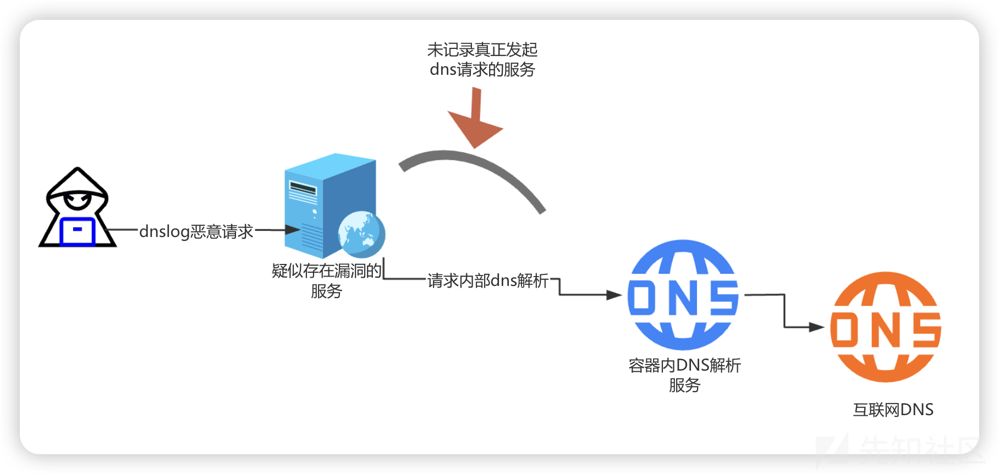

## **Approach** 1

第一种思路是开启CoreDNS解析日志，在这之前先学习一下什么是coreDNS

### CoreDNS

#### Introduction of CoreDNS

CoreDNS是k8s集群默认的DNS解析组件，主要用于解析k8s服务和pod的域名，并提供集群内的DNS解析能力。它在Kube-DNS之后称为官方默认的DNS解决方案，能够处理Kubernetes内部的服务发现、DNS解析以及外部域名解析。

#### The role of CoreDNS in Kubernetes

在k8s及群众，Pod之间通常通过DNS域名相互通信，而不是直接使用IP地址。这是因为Pod的iP地址会因调度和扩缩容而变化，而DNS提供了一种稳定的方式来引用服务，它主要有以下作用

* 解析Kubernetes Service和Pod的域名

* Service解析：例如my-service.default.svc.cluster.local解析到Service的ClusterIP
* Pod解析：如10-244-1-2.default.pod.cluster.local解析到具体的Pod IP

* 代理集群外部DNS请求

* Kubernetes内部的Pod可能需要访问外网，CoreDNS充当代理将这些查询转发至集群外部的DNS服务器，如114.114.114.114、8.8.8.8或云厂商的DNS
* 由于CoreDNS充当所有外部域名解析的出口，任何Pod访问外部域名都会通过其进行DNS查询

* 负载均衡和缓存

* 在Kubernetes内部，多个Pod可能会通过Service进行负载均衡，CoreDNS负责提供正确的解析结果
* CoreDNS还会缓存解析记录，以减少重复查询，提高解析效率

#### The operational arch of CoreDNS

在kubernetes集群中，CoreDNS以Deployment形式运行，并通过Service（kube-dns）供集群内的Pod使用：

* Pod DNS解析流程1.Pod内部的resolv.conf配置指向kube-dns service2.当Pod需要解析域名时，DNS查询请求被发送到CoreDNS3.CoreDNS判断查询的是内部域名还是外部域名4.返回解析结果至请求的Pod

#### Configured of CoreDNS

CoreDNS的行为由ConfigMap配置，默认情况下位于kube-system命名空间，可通过以下命令查看`kubectl -n kube-system get cm coredns -o yaml`

```
apiVersion: v1
data:
  Corefile: |
    .:53 {
        errors
        health {
           lameduck 5s
        }
        ready
        kubernetes cluster.local in-addr.arpa ip6.arpa {
           pods insecure
           fallthrough in-addr.arpa ip6.arpa
           ttl 30
        }
        prometheus :9153
        hosts {
           0.250.250.254 host.minikube.internal
           fallthrough
        }
        forward . /etc/resolv.conf {
           max_concurrent 1000
        }
        cache 30 {
           disable success cluster.local
           disable denial cluster.local
        }
        loop
        reload
        loadbalance
    }
kind: ConfigMap
metadata:
  creationTimestamp: "2025-02-20T06:55:20Z"
  name: coredns
  namespace: kube-system
  resourceVersion: "66113"
  uid: 58ef53df-f7b5-468c-97a3-579c9c6b5621
```

CoreDNS默认未开启日志，执行logs命令没有解析日志

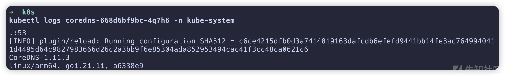

#### Enable CoreDNS log configuration

`kubectl edit configmap coredns -n kube-system`

只需要添加log就可以打开日志记录，编辑完后k8s会自动重启CoreDNS

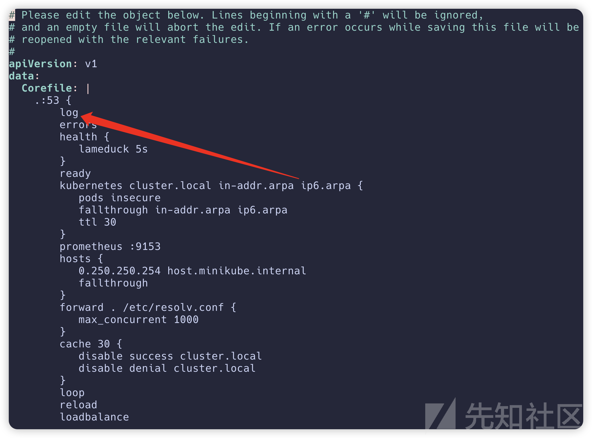

尝试在pod中发起对恶意域名的请求

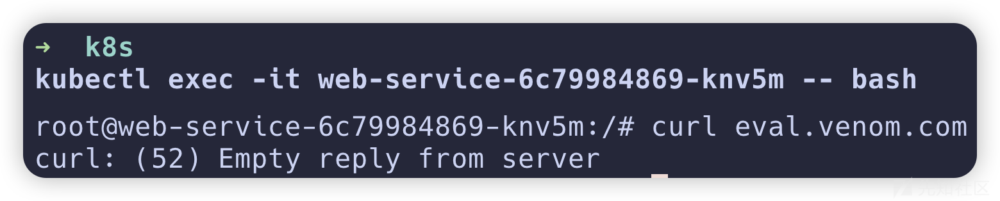

查看CoreDNS日志 就能定位到pod ip为10.233.0.50

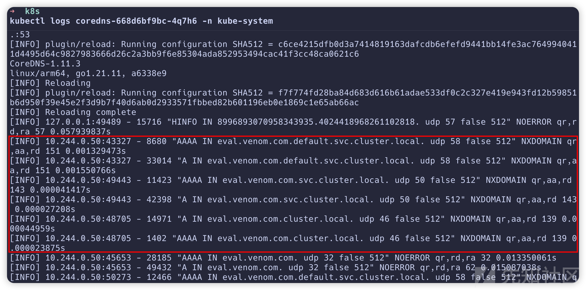

得到ip后 我们就可以通过过滤迅速定位到对应的pod

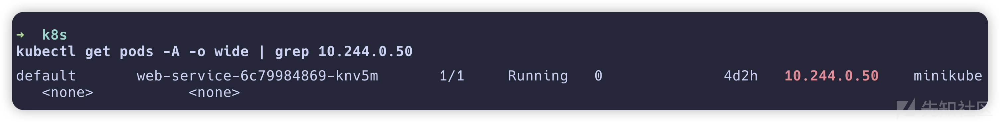

## Approach 2

第一种思路适用于业务流量不那么庞大的场景，在域名解析量大的业务场景，开启日志可能会影响到服务的性能，并且修改CoreDNS配置造成的重启可能短暂影响集群的域名解析

在k8s此类的云场景下，通常容器为了轻量级，会使用Alpine之类的base image，这类镜像大多都不包含常见的网络调试工具，比如curl、wget、ping、traceroute、ss、ifconfig...这给容器内分析和调试网络带来相当大的困扰

如何在不开启CoreDns log并且不为pod安装网络调试工具的场景下便捷的抓取53端口流量，就是本思路要讨论的问题

### nsenter

nsenter是linux中的一个命令行工具，用于进入到另一个Namespace里，这里的Namespcae不仅仅指的是上文中提及的Network Namespace，nsenter可以进入任何类型的Linux Namespace

在Linux中，Namespace有多个类型，nsenter参数和对应的Namespace类型如下

|  |  |
| --- | --- |
| 参数 | 解释 |
| -n | 网络（Network Namespace） |
| -p | 进程（PID Namespace） |
| -m | 挂载（Mount Namespace） |
| -u | UTS（主机名和域名Namespace） |
| -i | IPC（进程间通信Namespace） |
| -c | Cgroup(控制组Namespace) |
| -U | 用户（User Namespace） |

nsenter位于util-linux中，常用的Linux发型本基本都已经默认安装

### Enter the container's network namespace

通过nsenter，可以在宿主机的环境下进入容器的Network Namespace，它的命令结构如下

`nsenter -t <PID> -n bash`

这条命令会进入指定进程的Network Namespace，并启动一个新的bash shell，这能帮助我们在目标进程的网络空间下执行命令

在pod宿主机（node）上进入coredns的namespace

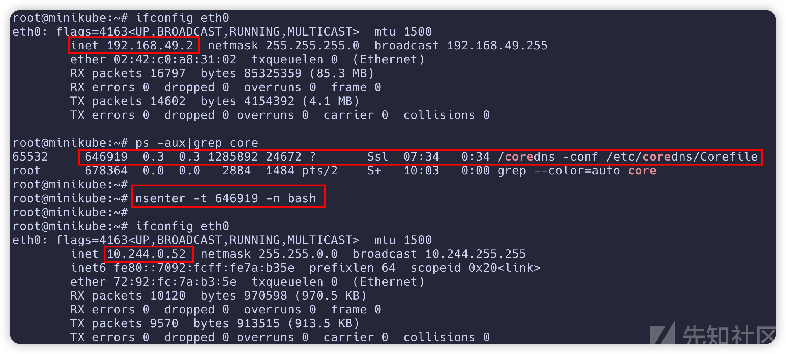

然后通沟tcpdump抓取53流量，同时在pod向恶意域名发起请求，就可以通过流量迅速定位到IP然后定位到Pod

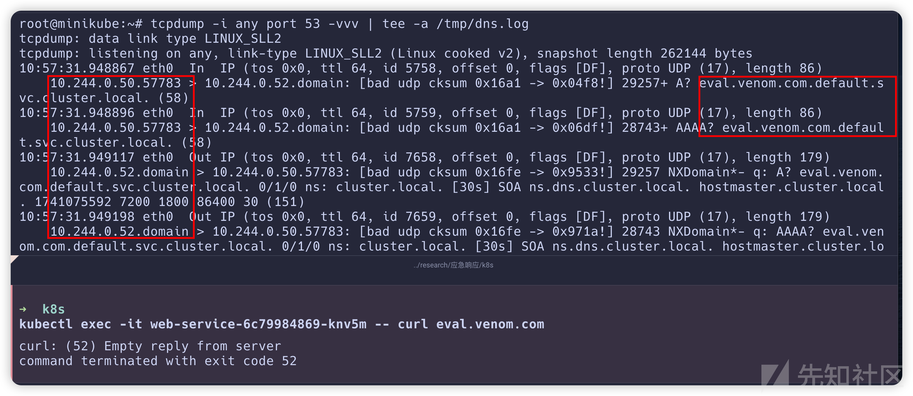

# 5.Referer

* <https://zgao.top/>
* <https://asphaltt.github.io/>
