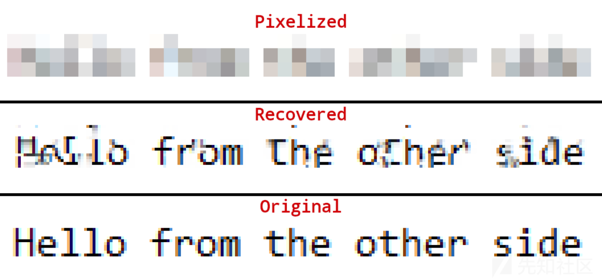
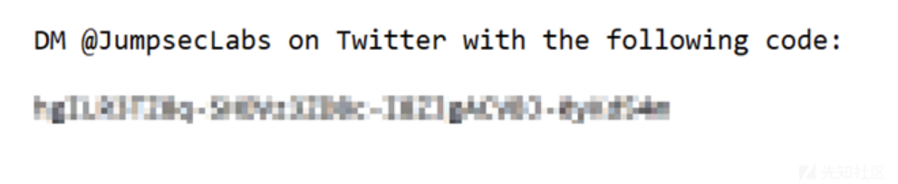
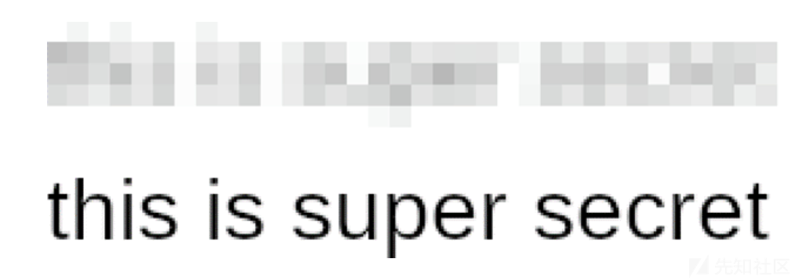
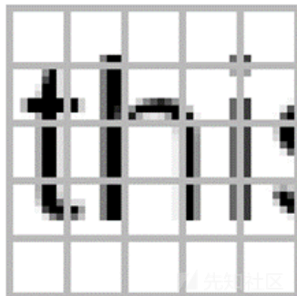
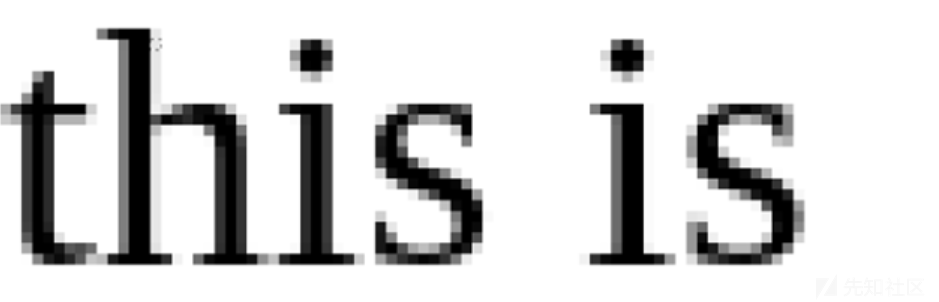
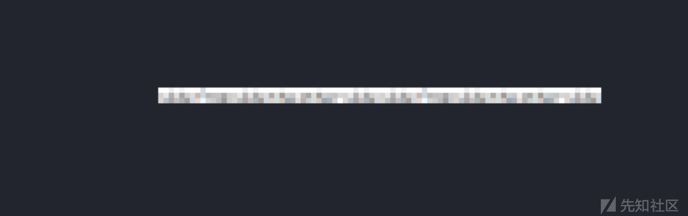
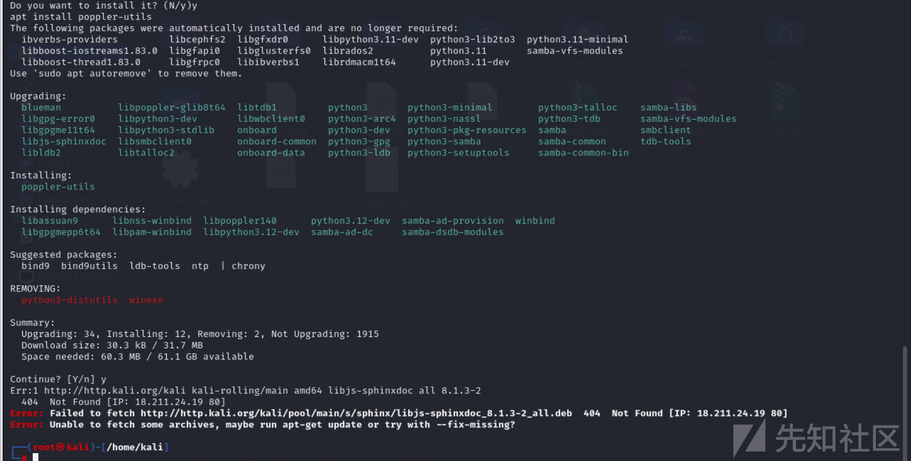
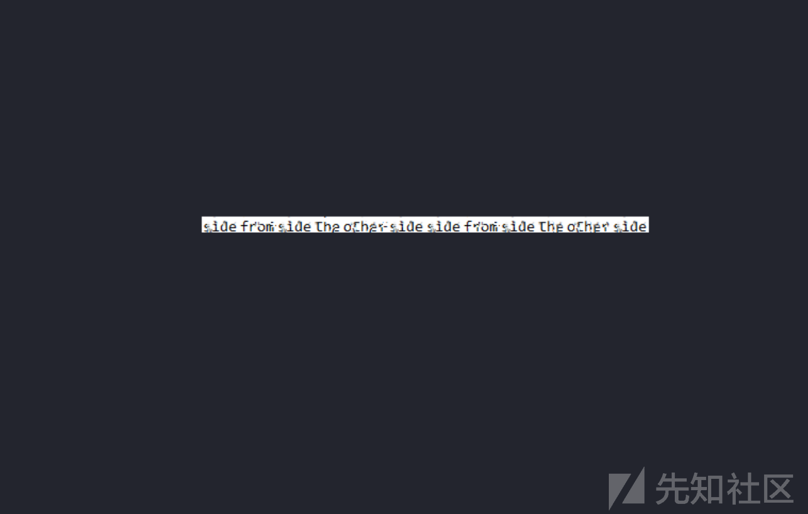

# 取证工具：Depix的分析与研究-先知社区

> **来源**: https://xz.aliyun.com/news/17143  
> **文章ID**: 17143

---

Depix 是一款值得关注的工具。它主要用于从像素化截图中恢复明文信息，是一种概念验证（PoC）性质的应用。



## 一、安装步骤

* 安装依赖项
* 运行 Depix：

```
python3 depix.py \
    -p /path/to/your/input/image.png \
    -s images/searchimages/debruinseq_notepad_Windows10_closeAndSpaced.png \
    -o /path/to/your/output.png
```

## 二、使用方法

* 对使用 Notepad 创建并使用 Greenshot 像素化的示例图像进行去像素化。Greenshot 通过平均伽马编码的 0-255 值来取平均值，这是 Depix 的默认模式。

```
python3 depix.py \
    -p images/testimages/testimage3_pixels.png \
    -s images/searchimages/debruinseq_notepad_Windows10_closeAndSpaced.png
```

结果：

* 对使用 Sublime 创建并使用 Gimp 像素化的示例图像进行去像素化，其中以线性 sRGB 进行平均。backgroundcolor 选项会过滤掉编辑器的背景颜色。

```
python3 depix.py \
    -p images/testimages/sublime_screenshot_pixels_gimp.png \
    -s images/searchimages/debruin_sublime_Linux_small.png \
    --backgroundcolor 40,41,35 \
    --averagetype linear
```

结果：

* （可选）您可以使用 查看盒子检测器是否找到了您的像素`tool_show_boxes.py`。如果看起来全是乱七八糟的，请考虑使用较小的像素批次。好看的盒子示例：

```
python3 tool_show_boxes.py \ 
    -p images/testimages/testimage3_pixels.png \
    -s images/searchimages/debruinseq_notepad_Windows10_closeAndSpaced.png
```

* （可选）您可以使用 创建像素化图像`tool_gen_pixelated.py`。

python3 tool\_gen\_pixelated.py -i /path/to/image.png -o pixed\_output.png

* 如需详细说明，请尝试运行`$ python3 depix.py -h`和`tool_gen_pixelated.py`。

## 三、原理分析

### 3.1 制作搜索图像

* 将屏幕截图中的像素块剪切成单个矩形。
* 将包含预期字符的De Bruijn 序列粘贴到编辑器中，并使用与输入图像相同的字体设置（相同的文本大小、相似的字体、相同的颜色）。
* 对该序列进行截图。
* 将该屏幕截图移动到类似文件夹中`images/searchimages/`。
* 运行 Depix，并将`-s`标志设置为此屏幕截图的位置。

### 3.2 制作像素化图像

* 准确剪切出像素化块。参见`testimages`示例。
* 它尝试检测方块，但效果并不好。`tool_show_boxes.py`如果方块没有被正确检测到，请使用脚本和不同的剪切图进行操作。

### 3.3 算法

该算法利用了线性盒式过滤器单独处理每个块的事实。对于每个块，它会对搜索图像中的所有块进行像素化，以检查直接匹配。

对于某些像素化图像，Depix 设法找到单匹配结果。它假设这些结果是正确的。然后将周围的多匹配块的匹配与像素化图像中的几何距离进行比较。匹配也被视为正确的。这个过程重复几次。

当正确块不再有几何匹配时，它将直接输出所有正确块。对于多匹配块，它将输出所有匹配的平均值。

### 3.4 已知限制

* 该算法通过整数块边界进行匹配。因此，它有一个基本假设，即对于渲染的所有字符（无论是在 de Brujin 序列中还是在像素化图像中），文本定位都是在像素级别完成的。然而，一些现代文本光栅化器[以亚像素精度](http://agg.sourceforge.net/antigrain.com/research/font_rasterization/)定位文本。
* 您需要了解字体规格，有时还需要了解截屏时的屏幕设置。但是，如果原始图片中有足够的纯文本，您可能能够将原始图片用作搜索图片。
* 如果执行了额外的图像压缩，这种方法就不起作用，因为它会弄乱块的颜色。

### 3.5 工作原理

其工作原理基于线性框滤波器的特性。在处理过程中，针对像素化图像的每个块，会在特定的搜索图像中进行匹配操作。例如，对于一些经过常见软件（如 Greenshot、Gimp 等）像素化处理的文本截图，Depix 尝试通过对搜索图像中的块进行像素化并与目标图像对比来寻找匹配。

打码是一种不安全的方式，会导致敏感数据泄露。



像素化的工作原理是将图像分割成给定块大小的网格，然后对于每个块，将编辑后图像的颜色设置为原始图像在该区域的平均颜色。



这种效果有点像是“涂抹”了图像中每个块的信息。但是，虽然在这个过程中会丢失一些信息，但绝对会泄露大量信息。而这些泄露的信息正是我们的优势。

值得注意的是，由于该算法非常简单，因此被广泛标准化。因此，无论您是在 GiMP、Photoshop 还是其他任何工具中进行编辑，编辑结果都是一样的。

我们进行假设，假如攻击者知道：

1. 编辑文本的字体类型
2. 编辑文本的字体大小
3. 首先要删除的是文本



在破解编辑过程中存在多个问题，如字符溢出问题（ Character Bleed-Over Problem ），即文本字符与编辑块并非 1:1 对应，可能导致正确猜测的字符在最右边的块出现错误；空白问题（ Whitespace Problem ），当猜测的字符是空白时，像素化的块会被下一个字符完全占据；可变宽度字体问题（ Variable-Width Font Problem ），不同字母占用的水平空间不同，会产生级联效应；字体不一致问题（ Font Inconsistency Problem ），不同的渲染引擎会产生略有不同的图像；像素化偏移问题（ Pixelation Offset Problem ），攻击者难以得知使用的偏移坐标。



* 裁剪图像到仅包含像素化区域，没有边框或其他文本，建议在 GIMP 中进行操作。
* 注意块大小（每个像素化块的大小），并在代码中替换。
* 正确设置 CSS，这是最难且最耗时的部分。将其输入到 test.html 中并在 Chrome 中查看，调整直到能够尽可能准确地复制一些示例文本，特别注意字间距和字母间距，以及字体粗细。
* 确定要尝试的字符集，它位于 preload.ts 的顶部。
* 按下 “开始” 按钮查看是否有效。

然而，Depix 存在一定限制。它按照整数块边界进行匹配，这与部分现代文本光栅化器的亚像素精度定位方式不兼容，可能导致恢复结果不准确。而且，使用时通常需要了解截图时的字体规格和屏幕设置等信息，若对图像进行了额外压缩也会影响其恢复效果。

## 四、简单利用分析

首先我们打开主要的脚本文件depix.py。从代码上看，函数需要三个参数：待解码图片、德布鲁因序列图片和输出图片，并把待解码图片、德布鲁因序列图片的路径分别赋给pixelatedImagePath、searchImagePath 两个变量：

```
parser = argparse.ArgumentParser(description = usage)
parser.add_argument('-p', '--pixelimage', help = 'Path to image with pixelated rectangle', required=True) #待解码图片，必须
parser.add_argument('-s', '--searchimage', help = 'Path to image with patterns to search', required=True) #德布鲁因序列图片，必须
parser.add_argument('-o', '--outputimage', help = 'Path to output image', nargs='?', default='output.png') #输出图片，非必须，默认为output.png
args = parser.parse_args()
pixelatedImagePath = args.pixelimage
searchImagePath = args.searchimage
————————————————
                        
```

由于已经知道了该方法的原理是通过将德布鲁因序列图片用相同的形式打码，之后再和原图进行比对，找出相同的图块，那么只要我们跟踪这个序列图片做了什么操作，就可以知道这个算法的适用范围。

跟踪searchImagePath这个变量，发现其在下文中作为LoadedImage函数的参数，将图片载入给了变量searchImage，而searchImage这个变量的首次调用是在findRectangleMatches函数中：

```
logging.info("Loading search image from %s" % searchImagePath)
searchImage = LoadedImage(searchImagePath) # 载入德布鲁因序列图像
# 省略
logging.info("Finding matches in search image") 
rectangleMatches = findRectangleMatches(rectangeSizeOccurences, pixelatedSubRectange
```

这个调用它的函数在depixlib文件夹下的functions.py，定义如下：

```
def findRectangleMatches(rectangeSizeOccurences, pixelatedSubRectanges, searchImage):
	rectangleMatches = {}
	for rectangeSizeOccurence in rectangeSizeOccurences:
		rectangleSize = rectangeSizeOccurence
		rectangleWidth = rectangleSize[0]
		rectangleHeight = rectangleSize[1]
		pixelsInRectangle = rectangleWidth*rectangleHeight
		# logging.info('For rectangle size {}x{}'.format(rectangleWidth, rectangleHeight))
		# filter out the desired rectangle size
		matchingRectangles = []
		for colorRectange in pixelatedSubRectanges:
			if (colorRectange.width, colorRectange.height) == rectangleSize:
				matchingRectangles.append(colorRectange)
		for x in range(searchImage.width - rectangleWidth):
			for y in range(searchImage.height - rectangleHeight):
				r = g = b = 0
				matchData = []
				for xx in range(rectangleWidth):
					for yy in range(rectangleHeight):
						newPixel = searchImage.imageData[x+xx][y+yy]
						rr,gg,bb = newPixel
						matchData.append(newPixel)
						r += rr
						g += gg
						b += bb
				averageColor = (int(r / pixelsInRectangle), int(g / pixelsInRectangle), int(b / pixelsInRectangle))
				for matchingRectangle in matchingRectangles:
					if (matchingRectangle.x,matchingRectangle.y) not in rectangleMatches:
						rectangleMatches[(matchingRectangle.x,matchingRectangle.y)] = []
					if matchingRectangle.color == averageColor:
						newRectangleMatch = RectangleMatch(x, y, matchData)
						rectangleMatches[(matchingRectangle.x,matchingRectangle.y)].append(newRectangleMatch)
			# if x % 64 == 0:
			# 	logging.info('Scanning in searchImage: {}/{}'.format(x, searchImage.width - rectangleWidth))
	return rectangleMatches

```

从代码中的xy循环中，我们可以看出该函数将德布鲁因序列图像划分成了rectangleWidth \* rectangleHeight 大小的小方块，并对小方块中的颜色取平均值。这就是项目中提到的linear box filter马赛克。

简单说明一下，linear box filter马赛克的打码方式是：

将待打码的图像按照像素分割成一系列的正方形小区域

将每块区域的所有像素点的颜色取平均值，得出每个区域的平均颜色

使用每块区域的平均颜色填充这个区域，实现马赛克效果

因此，如果每一块区域的面积越大，图像就越模糊，反之则越清晰

接下来我们来看这个rectangleWidth \* rectangleHeight是怎么得出的。

取消下面代码的注释。

```
logging.info('For rectangle size {}x{}'.format(rectangleWidth, rectangleHeight))

```

再次运行后，发现这里输出了待解码图片中的每一个马赛克方格的大小，说明在解马赛克的过程中，该脚本会计算出待解码图片中每个马赛克方格的大小，再根据这个大小对德布鲁因序列图片进行马赛克处理。

至于这个像素大小的计算方式，需要向上追溯到对待解码图片的处理逻辑。



脚本读取了待解码图片后，首先会先查找所有的相同颜色的矩形方块，并将找到的同色矩形方块存入list：

```
pixelatedImage = LoadedImage(pixelatedImagePath) # 待解码图片读取
#...
pixelatedSubRectanges = findSameColorSubRectangles(pixelatedImage, pixelatedRectange) #同色矩形区域寻找
# ...
def findSameColorSubRectangles(pixelatedImage, rectangle):  #函数定义，在functions.py中
	sameColorRectanges = []
	x = rectangle.x
	maxx = rectangle.x + rectangle.width + 1
	maxy = rectangle.y + rectangle.height + 1
	while x < maxx:
		y = rectangle.y
		while y < maxy:
			sameColorRectange = findSameColorRectangle(pixelatedImage, (x, y), (maxx, maxy))
			if sameColorRectange == False:
				continue
			# logging.info("Found rectangle at (%s, %s) with size (%s,%s) and color %s" % (x, y, sameColorRectange.width,sameColorRectange.height,sameColorRectange.color))
			sameColorRectanges.append(sameColorRectange)
			y += sameColorRectange.height
		x += sameColorRectange.width
	return sameColorRectanges

```

接下来，程序会移除掉待解码图片里的无用色块：

```
pixelatedSubRectanges = removeMootColorRectangles(pixelatedSubRectanges)  #移除无用色块

def removeMootColorRectangles(colorRectanges):   #函数定义
	pixelatedSubRectanges = []
	for colorRectange in colorRectanges:
			if colorRectange.color in [(0,0,0),(255,255,255)]:  #如果颜色是纯白/纯黑，跳过该色块
				continue
			pixelatedSubRectanges.append(colorRectange)   #将色块附加到pixelatedSubRectanges这个list中
	return pixelatedSubRectanges

```

从这里看出，程序对无用色块（背景色）的判断逻辑是，只要是纯白/纯黑，就会跳过。这里得出两个推论：

1. 该算法在纯色的背景下表现较好
2. 如果需要在其他背景色下解马赛克，需要在这里修改对应背景色的RGB值

接下来，从色块中找出每个方块的大小的出现次数：

```
def findRectangleSizeOccurences(colorRectanges):
	rectangeSizeOccurences = {}
	for colorRectange in colorRectanges:
		size = (colorRectange.width, colorRectange.height)
		if size in rectangeSizeOccurences:
			rectangeSizeOccurences[size] += 1
		else:
			rectangeSizeOccurences[size] = 1
	return rectangeSizeOccurences

```

## 五、案例测试

首先保存马赛克图像并安装工具。



然后实验工具进行恢复密码。

实验脚本进行尝试。

```
python depix.py -p ../download.png -s images/searchimages/debruinseq_notepad_Windows10_closeAndSpaced.png -o ../download-notepad_Windows10_closeAndSpaced.png 
```




成功获取马赛克的内容。

sidefromsidetheothersidesidefromsidetheothersid

​
