# 跟着黑客学习fake captcha-先知社区

> **来源**: https://xz.aliyun.com/news/17162  
> **文章ID**: 17162

---

## 1.引言

在一次溯源过程中，通过对日志的分析，我们发现用户触发了LummStealer警报。进一步的日志审查揭示，此次攻击采用了一种名为“**Fake CAPTCHA**”的技术。鉴于此，本文将深入探讨并研究这种特定的攻击手段——**Fake CAPTCHA**。

## 2.攻击分析

### 2.1.攻击流程

相关项目：https://github.com/JohnHammond/recaptcha-phish

1.下载项目至本地，点击index.html。并且修改index.html第423行，加上项目路径。

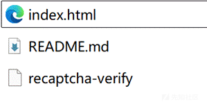

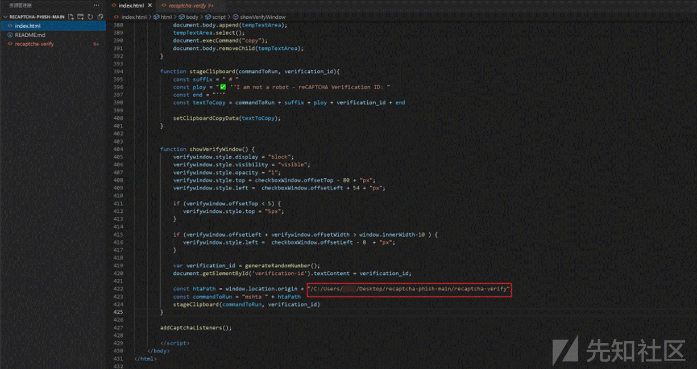

2.index.html即为攻击页面。

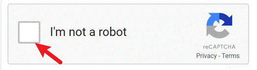

3.用户点击方框，此时粘贴板已复制了攻击命令（可自定义）：

**mshta file://C:\Users\用户名\Desktop
ecaptcha-phish-main
ecaptcha-verify #** **✅** **''I am not a robot - reCAPTCHA Verification ID: 3495''**

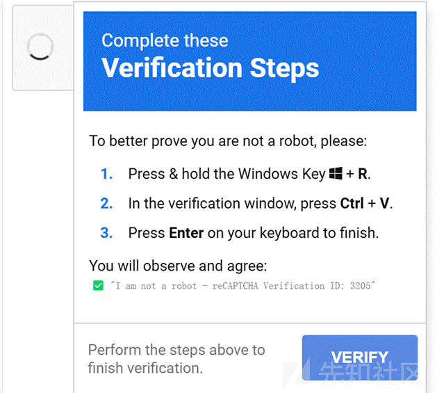

4.如果此时用户被诱导，打开**windows+R**,并且输入命令,则此时用户将会执行恶意payload。并且在用户视角看上去，仅看到✅ ''I am not a robot - reCAPTCHA Verification ID: 3205''。

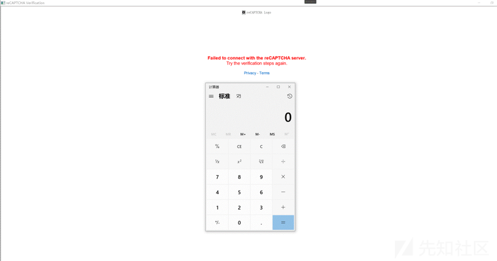

### 2.2.脚本分析

1.分析项目结构，经过分析得知结构如下

**index.html:钓鱼页面，该页面为攻击者诱导用户点击人机识别，复制攻击命令。**

**recaptcha-verify:hta页面，用于结合mshta执行命令。**

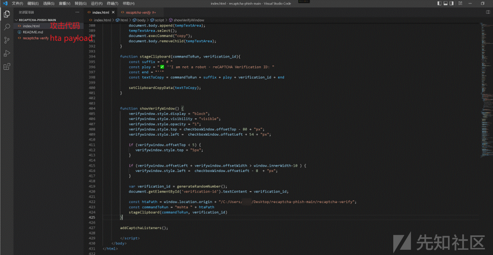

**index.html**

1.首先分析index.html，攻击命令为commandToRun，payload路径为htaPath。

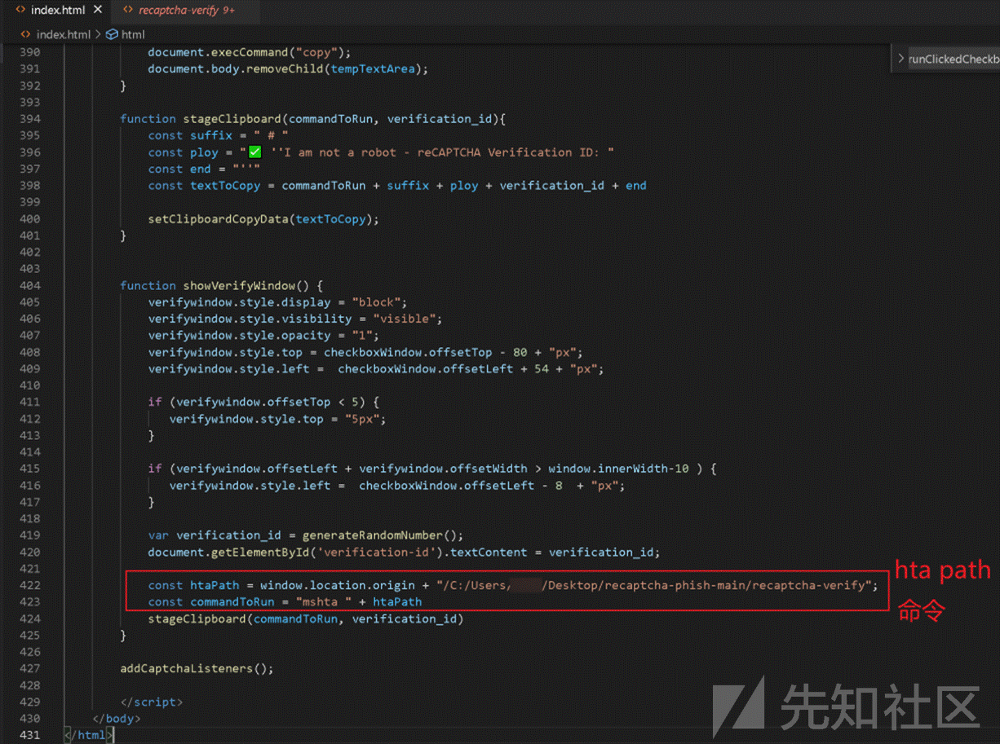

2.代码中setClipboardCopyData为核心函数，复制**textToCopy**至粘贴板。

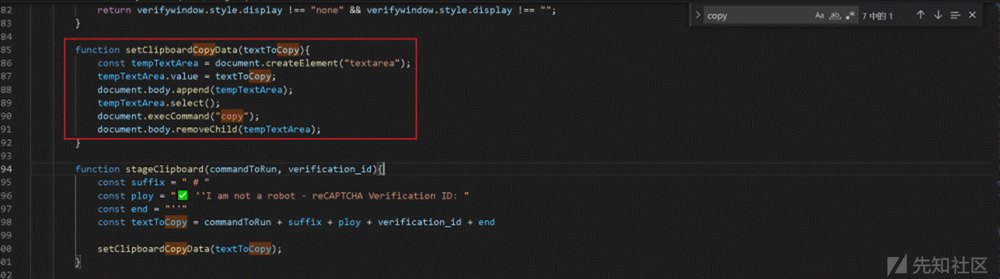

**recaptcha-verify**

1.分析该文件，可以看到其为hta文件。在执行命令的同时，可以触发html页面

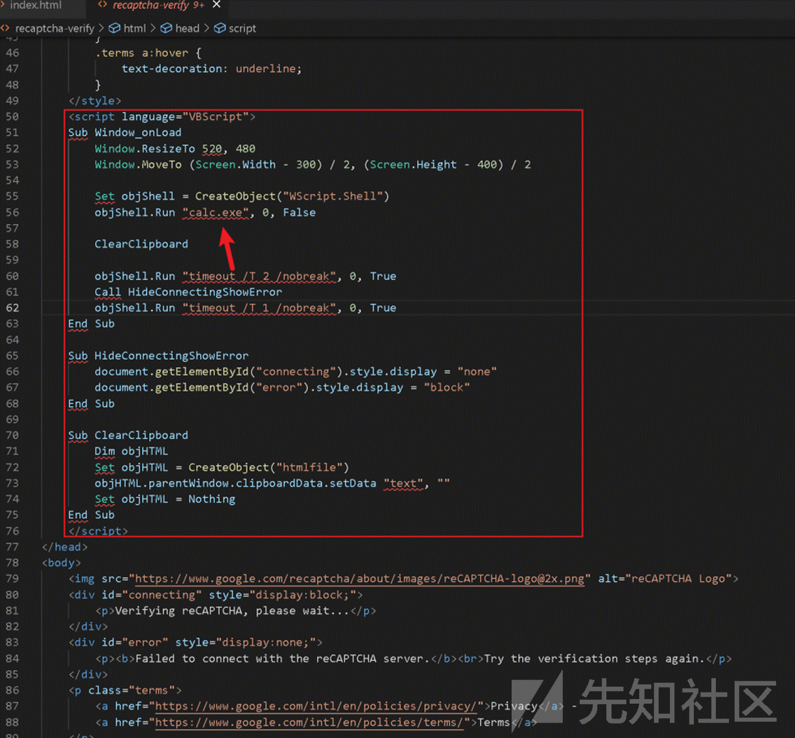

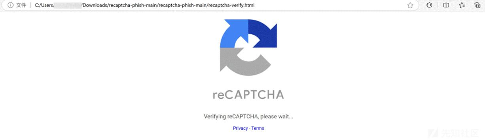

## 3.脚本修改

### 3.1.修改执行命令

1.经过对脚本进行分析，实际上攻击者只需要使用html文件即可，核心是修改执行命令。

**eg：cmd命令**

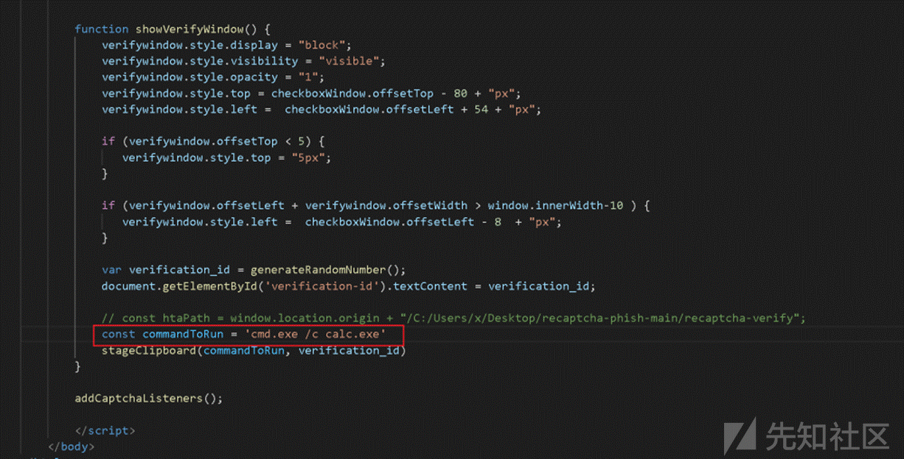

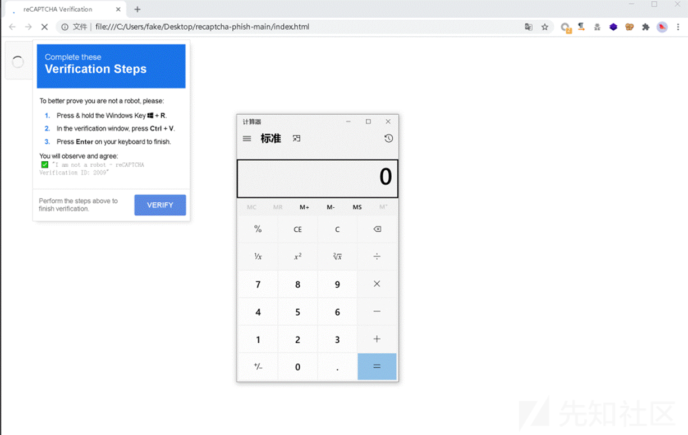

**eg：powershell命令**

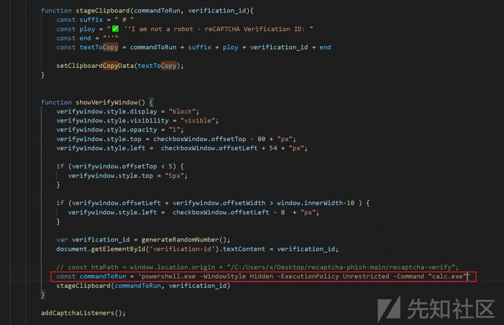

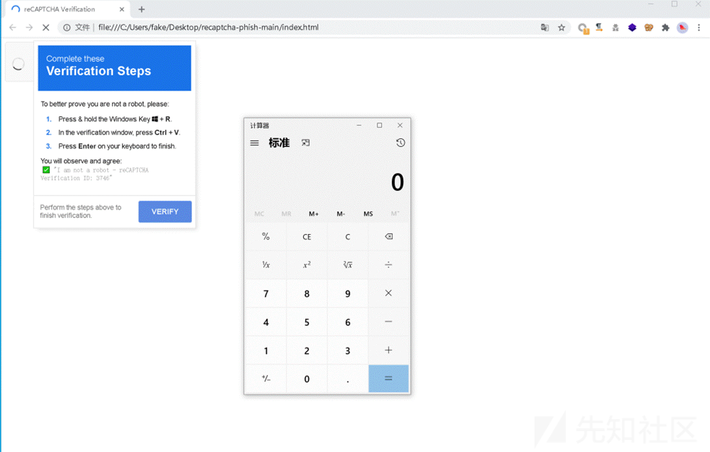

### 3.2.命令免杀

该部分结合命令混淆执行，可以参考powershell混淆以及mshta混淆。

powershell混淆：<https://github.com/danielbohannon/Invoke-Obfuscation>

mshta混淆：<https://github.com/felamos/weirdhta>

## 4.攻击特征

### 4.1.特征

1. 通过对攻击过程的分析，可以发现，整个攻击流程实际上仅包含两个步骤：诱导复制和诱导粘贴。因此，使用 Procmon 进行监控时，发现当用户通过 Win+R 打开运行窗口并输入命令时，系统会在注册表路径 **HKCU\Software\Microsoft\Windows\CurrentVersion\Explorer\RunMRU** 下创建新的键值，并将命令写入。

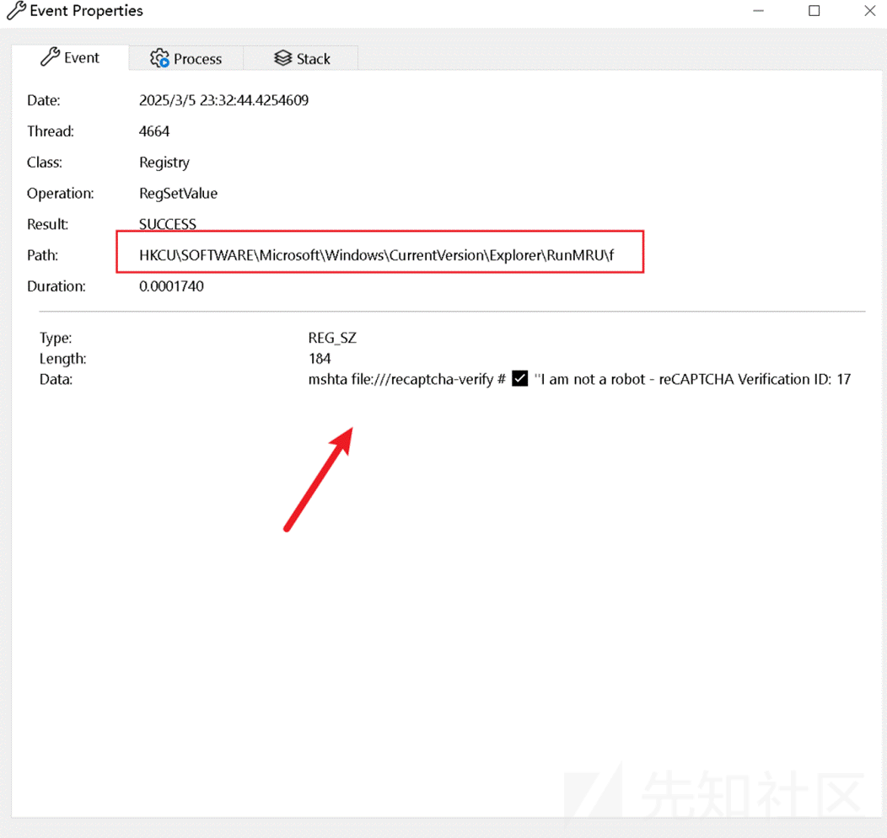

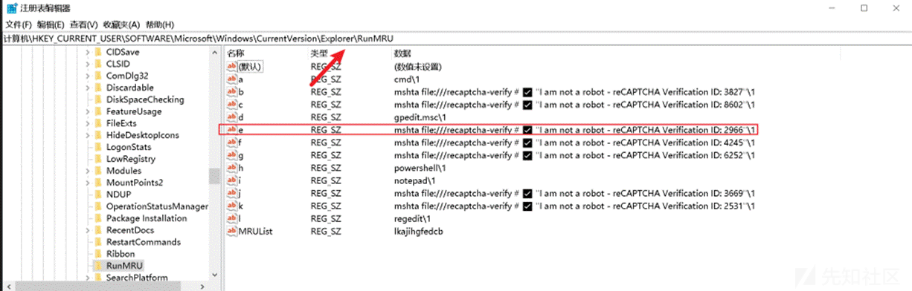

### 4.2.告警规则

1.监管HKCU\Software\Microsoft\Windows\CurrentVersion\Explorer\RunMRU注册表内容，避免用户执行恶意命令

2.结合剪切板API进行组合规则，生成**fake captcha**告警规则。

## 5.参考链接

<https://github.com/fucklinux/fakeCAPTCHA>**fakeCAPTCHA项目**
