# SmartAdmin-3.13.0-”假”权限绕过分析-先知社区

> **来源**: https://xz.aliyun.com/news/17175  
> **文章ID**: 17175

---

为什么说是假呢？因为这个”权限绕过“只是方便开发测试，毕竟应该没人会把开发环境直接放到公网吧

## 项目地址

[Releases · 1024-lab/smart-admin](https://github.com/1024-lab/smart-admin)

<https://gitee.com/lab1024/smart-admin/>

## 漏洞分析（权限绕过）

首先看了看项目的依赖，基本上没得搞，fastjson为2，看一下拦截器在`MvcConfig` 下注册添加了  
`AdminInterceptor` 为拦截器

```
    @Override
    public void addInterceptors(InterceptorRegistry registry) {
        registry.addInterceptor(adminInterceptor)
                .excludePathPatterns(SwaggerConfig.SWAGGER_WHITELIST)
                .addPathPatterns("/**");
    }
```

`excludePathPatterns` 方法为不需要拦截的路径，即SWAGGER\_WHITELIST中的内容

```
    public static final String[] SWAGGER_WHITELIST = {
            "/swagger-ui/**",
            "/swagger-ui/index.html",
            "/swagger-ui.html",
            "/swagger-ui.html/**",
            "/v3/api-docs",
            "/v3/api-docs/**",
            "/doc.html",
    };
```

这样一来表示这些路径不需要登录即可访问，`addPathPatterns` 为需要拦截的，这里用的通配符表示除上面所有的接口都需要经过拦截器，那么如果拦截器中权限校验写的有问题就会出现权限绕过的问题，下面来看看拦截器`AdminInterceptor`

```
            // --------------- 第一步： 根据token 获取用户 ---------------

            String tokenValue = StpUtil.getTokenValue();
            boolean debugNumberTokenFlag = isDevDebugNumberToken(tokenValue);

            String loginId = null;
            if (debugNumberTokenFlag) {
                //开发、测试环境，且为数字的话，则表明为 调试临时用户，即需要调用 sa-token switch
                loginId = UserTypeEnum.ADMIN_EMPLOYEE.getValue() + StringConst.COLON + tokenValue;
                StpUtil.switchTo(loginId);
            } else {
                loginId = (String) StpUtil.getLoginIdByToken(tokenValue);
            }

            RequestEmployee requestEmployee = loginService.getLoginEmployee(loginId, request);

```

首先是获取token，`StpUtil.getTokenValue()` 为sa-token依赖的原生方法

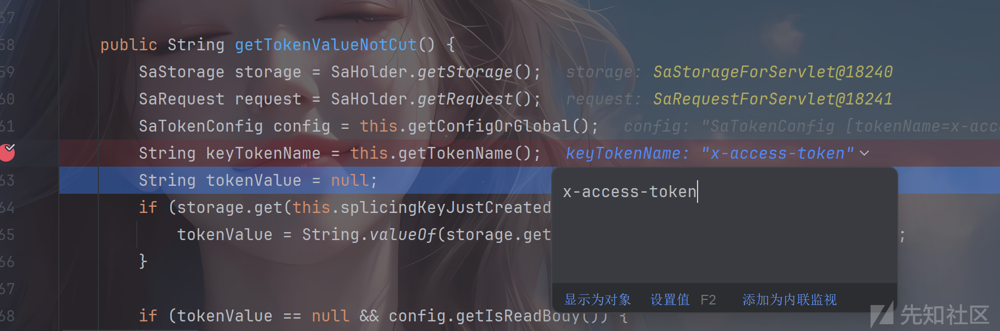

可以看到这里获取的tokenname为x-access-token，即从配置文件中获取定义的token名

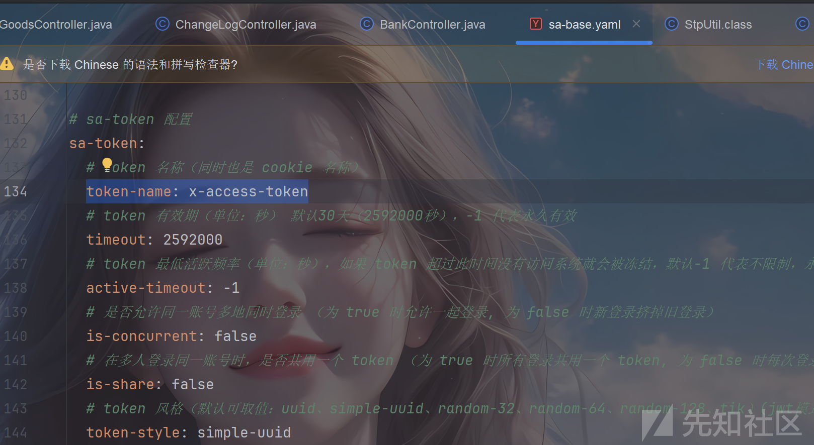

获取完之后经过`isDevDebugNumberToken` 方法

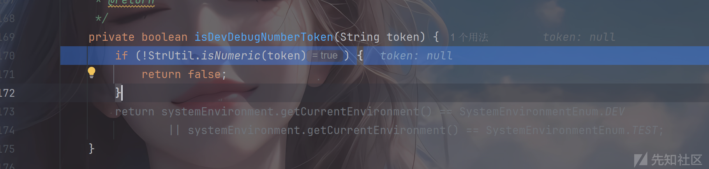

检查是否是数字或者为null，这里主要关注为数字的情况

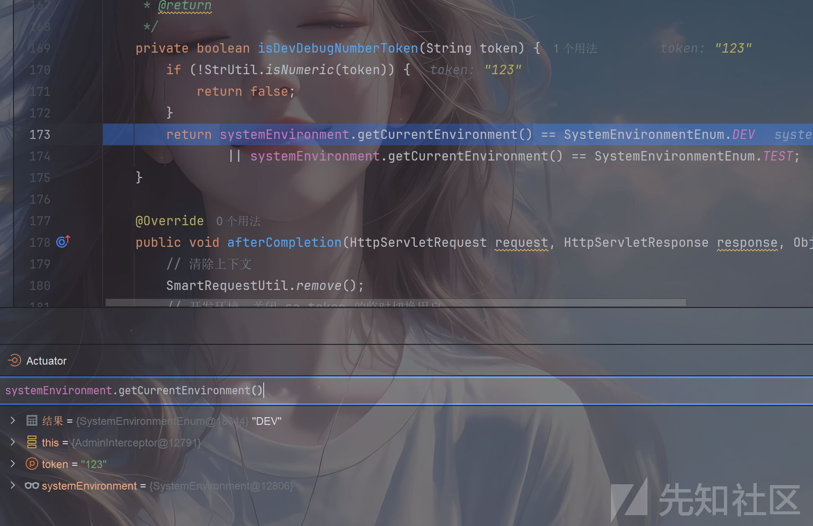

是数字就会检测是开发环境还是测试环境，任意一个都会返回true，这样即进入后面的if中

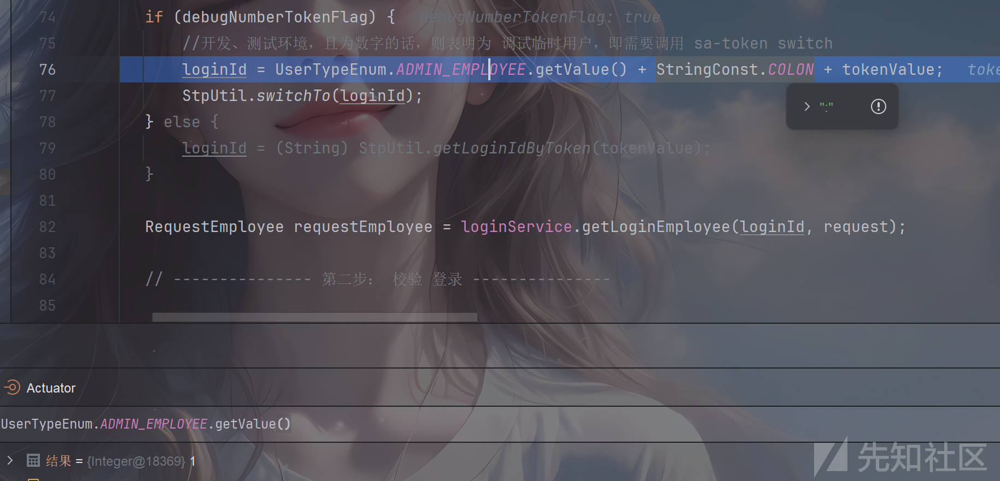

此时`loginId`就会变为`1:123` 的形式，123即我们传入的token，1即admin权限id

```
            Method method = ((HandlerMethod) handler).getMethod();
            NoNeedLogin noNeedLogin = ((HandlerMethod) handler).getMethodAnnotation(NoNeedLogin.class);
            if (noNeedLogin != null) {
                checkActiveTimeout(requestEmployee, debugNumberTokenFlag);
                return true;
            }
```

后续就是判断你所访问的controller是否有无需登录的注解，这里有关键的一行

```
RequestEmployee requestEmployee = loginService.getLoginEmployee(loginId, request);

```

这里`requestEmployee` 最终的结果必须不为null否则就会出现未登录

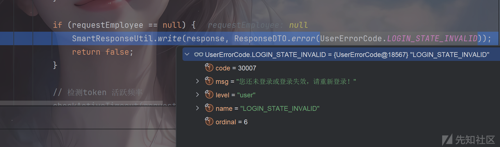

那么就跟进看看处理逻辑

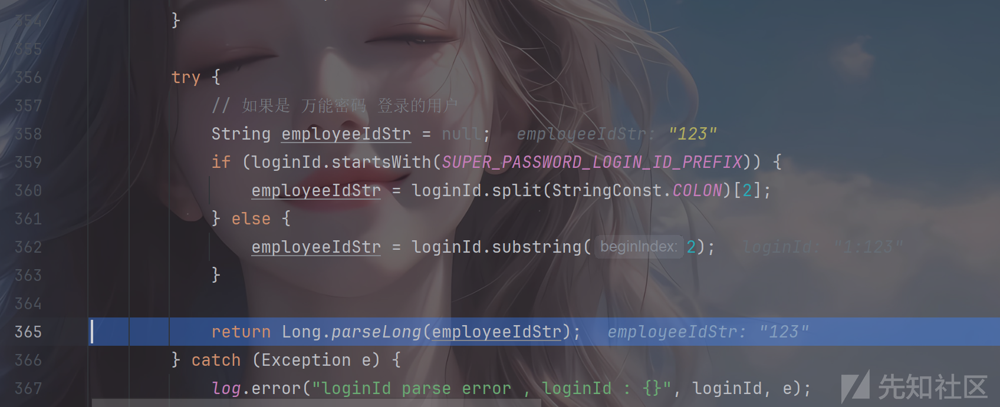

可以看到这里必须为存在的用户，而且后面还有权限校验，先看一下本地数据库，直接能得到管理员id就是1

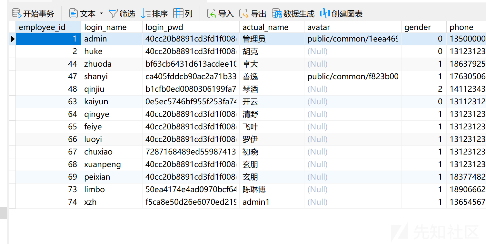

后面从代码可以看到超管无需权限校验

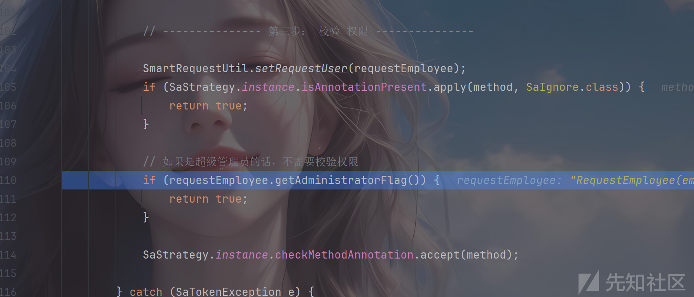

而这个admin即为超管，id为1即可绕过

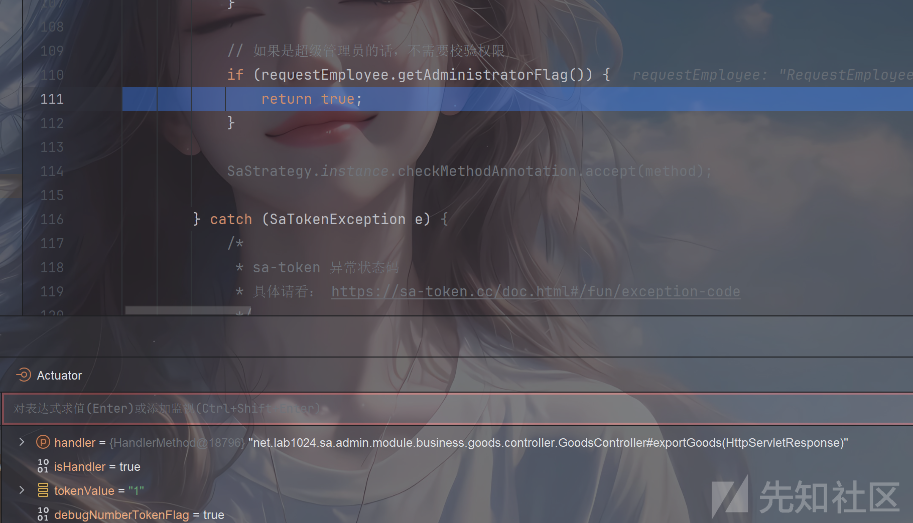

## 漏洞验证

随便拿个接口验证即可`/goods/exportGoods`

当`x-access-token`无值的情况

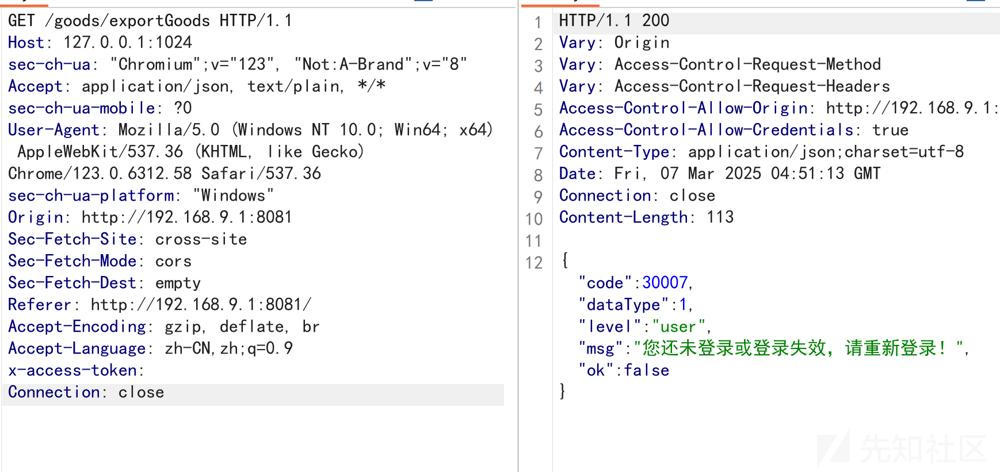

当不为超管的情况

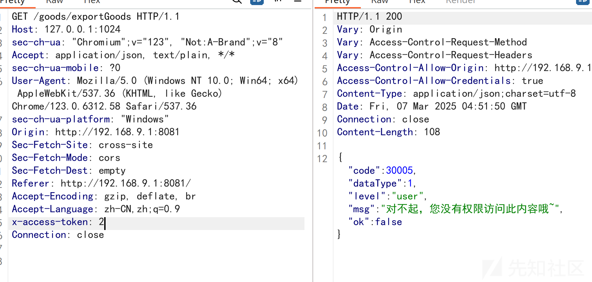

为超管的情况

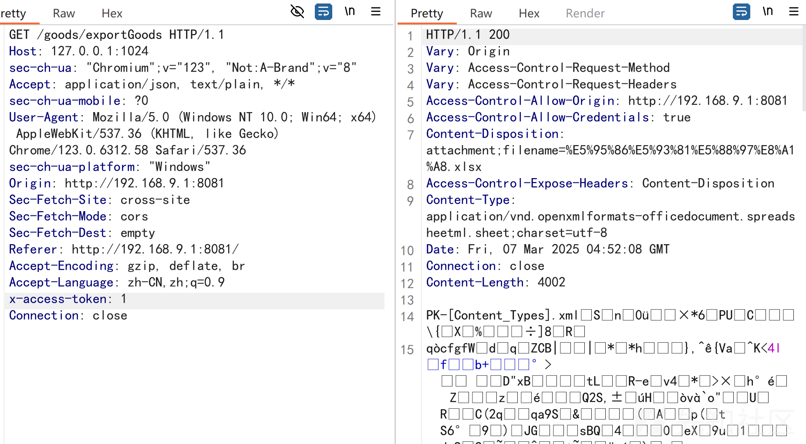

分析完其实这个只能算方便开发环境测试，生产环境`debugNumberTokenFlag` 返回的也是false

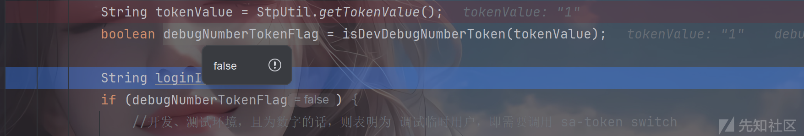

所以只能算是学习吧

## 参考

<https://mp.weixin.qq.com/s/5FFh9-4pIzIXh9OJNz_blg>

深情哥还是牛的，一开始没仔细看都没发现这个权限绕过
