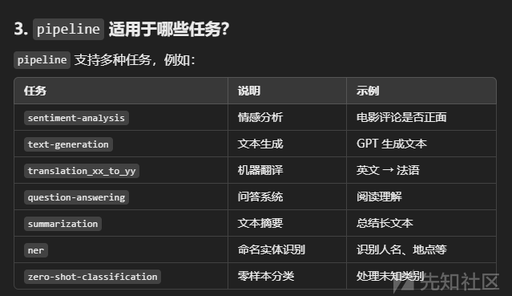
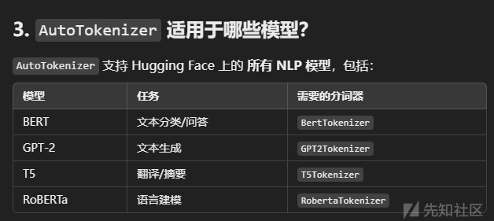
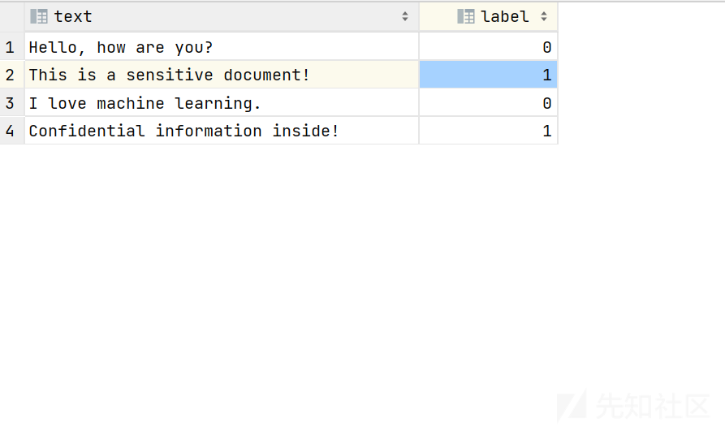
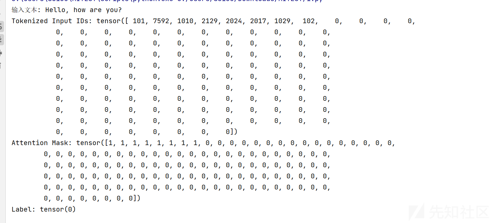
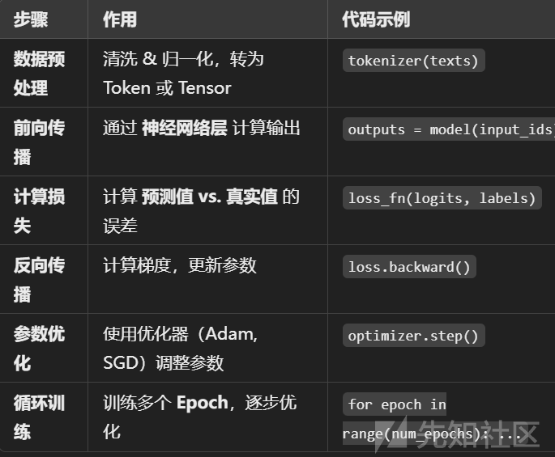
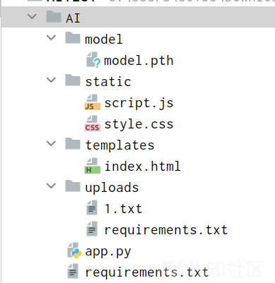
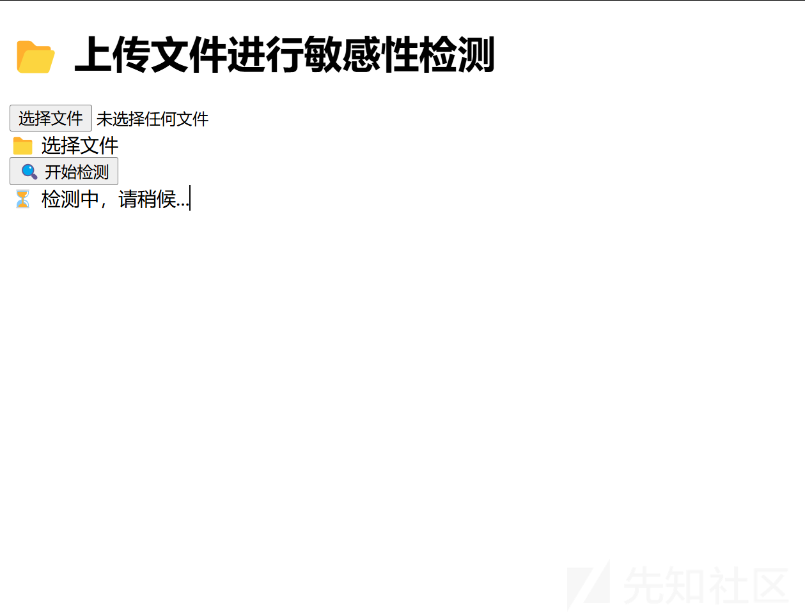
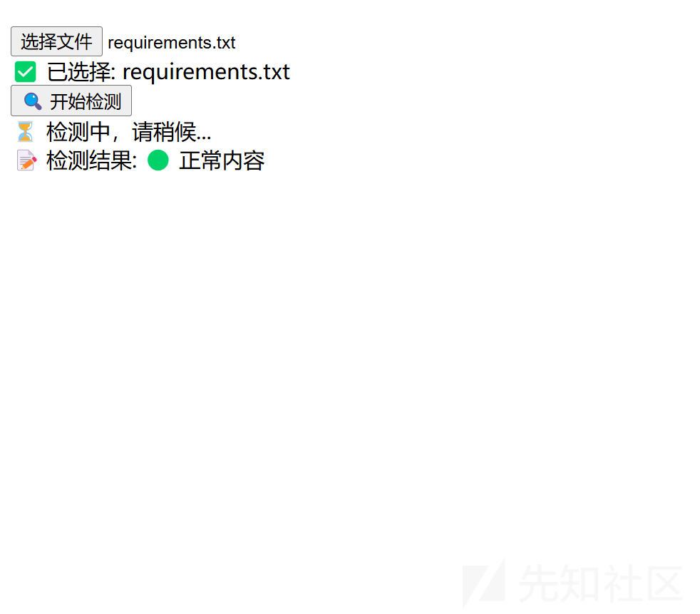

# AI-Sense  AI 对敏感文件自动识别-先知社区

> **来源**: https://xz.aliyun.com/news/17177  
> **文章ID**: 17177

---

# AI-Sense AI 对敏感文件自动识别

## 大体思路

用户上传文件，提取文件内容，训练敏感信息的 AI 来进行识别，识别后输出是否敏感

详细可分为下面的步骤

|-- 前期准备  
| |-- 上传文件模块  
| | |-- 支持多种文件格式（PDF、Word、Txt 等）  
| | |-- 稳定的文件传输接口  
| |-- 环境搭建  
| | |-- 选择合适的 AI 框架（如 TensorFlow、PyTorch）  
| | |-- 配置硬件资源（GPU 加速等，若需要）  
|-- 数据处理  
| |-- 文件内容提取  
| | |-- 文本解析算法（按格式特点提取文字）  
| | |-- 图片转文字（OCR 技术，若文件含图片）  
| |-- 数据清洗  
| | |-- 去除乱码、特殊符号干扰  
| | |-- 标准化文本格式（大小写、换行等）  
|-- 模型训练  
| |-- 敏感信息标注  
| | |-- 人工标注样本集（初始少量精准标注）  
| | |-- 半自动化标注工具（基于规则拓展标注）  
| |-- 选择算法  
| | |-- 深度学习算法（如卷积神经网络 CNN 用于特征提取、循环神经网络 RNN 处理序列文本）  
| | |-- 传统机器学习算法对比（决策树、朴素贝叶斯等适用性分析）  
| |-- 训练流程  
| | |-- 划分训练集、验证集、测试集  
| | |-- 多次迭代训练优化模型参数  
|-- 模型评估  
| |-- 评估指标设定  
| | |-- 准确率、召回率、F1 值计算  
| | |-- 混淆矩阵分析误判情况  
| |-- 优化调整  
| | |-- 根据评估结果调整模型结构  
| | |-- 超参数调优（学习率、批大小等）  
|-- 识别应用  
| |-- 输入新文件  
| | |-- 重复数据处理步骤  
| |-- 模型预测  
| | |-- 输出敏感与否判断结果  
| |-- 结果反馈  
| | |-- 可视化展示结果（界面提示、报表输出）  
| | |-- 记录误判案例用于后续改进

当然因为我是一个人做，而且也是刚刚入门，所以实现会比较粗糙，主要的目的是结合人工智能来实现敏感信息的发现

## AI 敏感训练

这个我应该是作为刚入门，会记录得非常的详细

### 训练流程

简单总结了一下就是

✅ 加载大规模数据集（torch.utils.data.Dataset）  
✅ 使用深度神经网络（Transformer, CNN, RNN）  
✅ 使用更强的优化器（AdamW, LAMB）和调度器（lr\_scheduler）  
✅ 利用 GPU/TPU 加速训练（model.to("cuda")）

举一个简单的例子,来理解一下总的流程，后面细分讲讲

我们的模型目的是判断豆瓣评论的情感的积极还是消极

代码部分

```
import torch
import torch.nn as nn
import torch.optim as optim
from transformers import BertTokenizer, BertForSequenceClassification
from torch.utils.data import DataLoader, Dataset
from datasets import load_dataset
import os

# 设置环境变量，避免 Hugging Face 缓存警告
os.environ["HF_HUB_DISABLE_SYMLINKS_WARNING"] = "1"

# 1. 选择 GPU 或 CPU
device = torch.device("cuda" if torch.cuda.is_available() else "cpu")

# 2. 加载 IMDb 数据集
dataset = load_dataset("imdb")
train_data = dataset["train"].shuffle(seed=42).select(range(1000))  # 训练集 1000 条
test_data = dataset["test"].shuffle(seed=42).select(range(200))  # 测试集 200 条

# 3. 加载 BERT 分词器
tokenizer = BertTokenizer.from_pretrained("bert-base-uncased")

# 4. 定义 IMDb 数据集类
class IMDbDataset(Dataset):
    def __init__(self, data, tokenizer, max_len=128):
        self.data = data
        self.tokenizer = tokenizer
        self.max_len = max_len

    def __len__(self):
        return len(self.data)

    def __getitem__(self, idx):
        text = self.data[idx]["text"]
        label = self.data[idx]["label"]
        encoding = self.tokenizer(text, padding="max_length", truncation=True, max_length=self.max_len, return_tensors="pt")
        return {key: val.squeeze(0) for key, val in encoding.items()}, torch.tensor(label)

# 5. 创建数据加载器
train_dataset = IMDbDataset(train_data, tokenizer)
test_dataset = IMDbDataset(test_data, tokenizer)

train_loader = DataLoader(train_dataset, batch_size=16, shuffle=True)  
test_loader = DataLoader(test_dataset, batch_size=16)

# 6. 加载 BERT 预训练模型（如果已有训练好的模型，则加载）
model_path = "bert_imdb.pth"

model = BertForSequenceClassification.from_pretrained("bert-base-uncased", num_labels=2)

if os.path.exists(model_path):
    print("加载已有模型，继续训练...")
    model.load_state_dict(torch.load(model_path, map_location=device))

model.to(device)

# 7. 定义损失函数和优化器
criterion = nn.CrossEntropyLoss()
optimizer = optim.AdamW(model.parameters(), lr=5e-5)

# 8. 训练模型
def train(model, train_loader, optimizer, criterion, device, epochs=3):
    model.train()
    for epoch in range(epochs):
        total_loss, total_correct = 0, 0
        for batch in train_loader:
            inputs, labels = batch
            inputs = {key: val.to(device) for key, val in inputs.items()}
            labels = labels.to(device)
            optimizer.zero_grad()
            outputs = model(**inputs)
            loss = criterion(outputs.logits, labels)
            loss.backward()
            optimizer.step()

            total_loss += loss.item()
            total_correct += (outputs.logits.argmax(dim=1) == labels).sum().item()

        accuracy = total_correct / len(train_loader.dataset)
        print(f"Epoch {epoch+1}: Loss = {total_loss:.4f}, Accuracy = {accuracy:.4f}")

    # 训练完成后保存模型
    torch.save(model.state_dict(), model_path)
    print(f"模型已保存到 {model_path}")

# 9. 评估模型
def evaluate(model, test_loader, device):
    model.eval()
    total_correct = 0
    with torch.no_grad():
        for batch in test_loader:
            inputs, labels = batch
            inputs = {key: val.to(device) for key, val in inputs.items()}
            labels = labels.to(device)

            outputs = model(**inputs)
            total_correct += (outputs.logits.argmax(dim=1) == labels).sum().item()

    accuracy = total_correct / len(test_loader.dataset)
    print(f"Test Accuracy: {accuracy:.4f}")

# 10. 运行训练和评估
train(model, train_loader, optimizer, criterion, device, epochs=3)
evaluate(model, test_loader, device)

```

### pipeline

pipeline 是 Hugging Face Transformers 库中的一个高级 API，它用于简化常见的 NLP 任务，如文本分类、文本生成、翻译等。它封装了模型的加载、推理等流程，让你可以快速调用预训练模型完成任务，而无需手动处理模型、分词、推理等步骤。

简单的代码例子

```
from transformers import pipeline
import os
# 设置环境变量，避免 Hugging Face 缓存警告
os.environ["HF_HUB_DISABLE_SYMLINKS_WARNING"] = "1"
# 创建 pipeline（指定任务为 sentiment-analysis）
classifier = pipeline("sentiment-analysis")
# 进行推理
result = classifier("I love this movie!")
print(result)
# 输出示例: [{'label': 'POSITIVE', 'score': 0.99}]

```



这个适用于我们已经有训练好的模型了

### AutoTokenizer

在了解 AutoTokenizer 之前需要了解  
Tokenizer

分词器（Tokenizer）是 NLP 任务中的核心组件，负责将文本转换成模型可以理解的格式（通常是 token ID）。它的主要作用包括：

文本标准化（清理 & 处理大小写）  
分割文本（将句子拆成单词或子词）  
将 token 转换为 ID（映射到预训练词表）  
填充（Padding） 和截断（Truncation）（处理不同长度的文本）  
恢复文本（从 token ID 还原文本）

目前常见的有三种分词器

基于空格和标点的分词

```
text = "Hello, how are you?"
tokens = text.split()  
print(tokens)  
# ['Hello,', 'how', 'are', 'you?']

```

基于词典的分词

```
import jieba
text = "我喜欢深度学习"
tokens = jieba.lcut(text)
print(tokens)  
# ['我', '喜欢', '深度学习']

```

**基于子词的分词**  
这个是目前最常用的分词器  
目前主流的大模型（如 BERT、GPT、T5）都使用子词级别的分词方式

高频词保持完整（如 hello）。  
低频词拆分为子词（如 unhappiness → un + happi + ness）。  
减少 OOV（未登录词） 问题，提高数据压缩率。

```
from transformers import BertTokenizer

tokenizer = BertTokenizer.from_pretrained("bert-base-uncased")
tokens = tokenizer.tokenize("unhappiness")
print(tokens)  
# ['un', '##happiness']

```

AutoTokenizer 是 Hugging Face Transformers 库中的一个类，它可以自动加载适用于特定预训练模型的分词器（Tokenizer）。

自动匹配合适的分词器，不用手动查找对应的 Tokenizer 类（比如 BertTokenizer、GPT2Tokenizer）。  
适用于多种模型（BERT、GPT、T5、RoBERTa 等）。  
统一接口，代码更通用，方便切换不同模型。



```
from transformers import AutoTokenizer

# 指定模型名称，AutoTokenizer 会自动选择对应的分词器
tokenizer = AutoTokenizer.from_pretrained("bert-base-uncased")

# 对文本进行分词
text = "Hello, how are you?"
tokens = tokenizer(text)
print(tokens)

```

### Dataset

Dataset 是数据加载的核心组件，它用于定义数据的组织方式，然后结合 DataLoader 进行批量加载和训练

我们使用它的目的主要是为了读取我们的数据集，我这里使用的是 csv 文件

而且一般我们可以自定义我们的 Dataset

```
import torch
from torch.utils.data import Dataset

class TextDataset(Dataset):
    def __init__(self, texts, labels, tokenizer, max_length=128):
        """
        :param texts: 一个包含文本的列表
        :param labels: 一个对应的标签列表
        :param tokenizer: 预训练模型的 Tokenizer
        :param max_length: 句子最大长度
        """
        self.texts = texts
        self.labels = labels
        self.tokenizer = tokenizer
        self.max_length = max_length

    def __len__(self):
        """返回数据集大小"""
        return len(self.texts)

    def __getitem__(self, idx):
        """根据索引返回一个数据样本"""
        text = self.texts[idx]
        label = self.labels[idx]
        
        # Tokenize 文本
        encoding = self.tokenizer(
            text, 
            truncation=True, 
            padding="max_length", 
            max_length=self.max_length, 
            return_tensors="pt"
        )

        return {
            "input_ids": encoding["input_ids"].squeeze(0),  # (max_length,)
            "attention_mask": encoding["attention_mask"].squeeze(0),  # (max_length,)
            "label": torch.tensor(label, dtype=torch.long)
        }

```

这个相当于定义我们数据的格式，而处理数据还得是我们的 DataLoader

```
from torch.utils.data import DataLoader
from transformers import BertTokenizer

# 假设有以下文本数据
texts = ["Hello, how are you?", "I am fine.", "Good morning!"]
labels = [0, 1, 0]  # 0 表示正常，1 表示敏感

# 加载 BERT 预训练的 Tokenizer
tokenizer = BertTokenizer.from_pretrained("bert-base-uncased")

# 创建数据集对象
dataset = TextDataset(texts, labels, tokenizer)

# 使用 DataLoader 进行批量加载
dataloader = DataLoader(dataset, batch_size=2, shuffle=True)

# 取出一个 batch 试试看
for batch in dataloader:
    print("Input IDs:", batch["input_ids"])
    print("Attention Mask:", batch["attention_mask"])
    print("Labels:", batch["label"])
    break
```

但是使用 csv 文件的话还需要我们多处理

这时候可以加入我们的 pandas 来辅助处理了

```
import pandas as pd

# 读取数据
df = pd.read_csv("data.csv")

# 获取文本和标签
texts = df["text"].tolist()
labels = df["label"].tolist()

# 创建 Dataset
dataset = TextDataset(texts, labels, tokenizer)
```

比如我们的文件一般都是

```
text,label
"Hello, how are you?",0
"This is a sensitive document!",1
"I love machine learning.",0
"Confidential information inside!",1

```

我们就可以使用 pandas 来处理数据了

我们有一个 csv 文件



```
import pandas as pd
import torch
from torch.utils.data import Dataset
from transformers import BertTokenizer


# 自定义 Dataset 类
class TextClassificationDataset(Dataset):
    def __init__(self, texts, labels, tokenizer, max_length=128):
        self.texts = texts
        self.labels = labels
        self.tokenizer = tokenizer
        self.max_length = max_length

    def __len__(self):
        return len(self.texts)

    def __getitem__(self, idx):
        text = self.texts[idx]
        label = self.labels[idx]

        # 使用 Tokenizer 进行编码
        encoding = self.tokenizer(
            text,
            truncation=True,
            padding="max_length",
            max_length=self.max_length,
            return_tensors="pt"
        )

        return {
            "input_ids": encoding["input_ids"].squeeze(0),  # 去掉 batch 维度
            "attention_mask": encoding["attention_mask"].squeeze(0),
            "label": torch.tensor(label, dtype=torch.long)
        }


# 读取数据
df = pd.read_csv("1.csv")

# 获取文本和标签
texts = df["text"].tolist()
labels = df["label"].tolist()

# 加载 BERT 预训练 Tokenizer
tokenizer = BertTokenizer.from_pretrained("bert-base-uncased")

# 创建自定义 Dataset
dataset = TextClassificationDataset(texts, labels, tokenizer)

# 取出第一个样本看看
sample = dataset[0]

print("输入文本:", texts[0])
print("Tokenized Input IDs:", sample["input_ids"])
print("Attention Mask:", sample["attention_mask"])
print("Label:", sample["label"])

```

得到如下的结果



### Transformer

数据预处理

读取数据（文本、图像、音频等）  
进行清洗、归一化、标注等  
将数据转换为模型可处理的格式（如 Tokenization）  
前向传播（Forward Pass）

输入数据通过神经网络层，生成预测结果  
例如：  
CNN 提取图像特征  
RNN 处理时间序列或文本  
Transformer 通过自注意力机制（Self-Attention） 计算全局关系  
计算损失（Loss Calculation）

计算预测值与真实标签之间的误差  
常见损失函数：  
交叉熵（CrossEntropy Loss，分类任务）  
均方误差（MSE Loss，回归任务）  
反向传播（Backward Pass）

通过链式法则（Chain Rule） 计算每个参数对损失的贡献（梯度）  
参数更新（Optimization）

使用优化器（如 Adam、SGD）调整模型参数，使损失降低  
循环迭代（Epochs）

训练多个 Epoch，不断优化模型  
可能会用 Dropout、Batch Normalization 等技术防止过拟合

  
 优化和 GPU 的就不说了

后续会详细说训练的

## 上传文件处理+提取内容

首先是对上传的文件做限制，因为目前是处于验证思路阶段，所以并没有做很多处理内容，以后可以进行优化

```
@app.route("/upload", methods=["POST"])
def upload_file():
    if "file" not in request.files:
        return jsonify({"result": "❌ 未检测到文件"}), 400

    file = request.files["file"]

    if file.filename == "":
        return jsonify({"result": "❌ 文件名不能为空"}), 400

    if file and allowed_file(file.filename):
        filename = secure_filename(file.filename)
        filepath = os.path.join(app.config["UPLOAD_FOLDER"], filename)
        file.save(filepath)

        # 读取文件内容
        with open(filepath, "r", encoding="utf-8") as f:
            text = f.read()

        # 确保输入数据为 LongTensor（整数类型）
        inputs = torch.tensor([ord(c) for c in text]).long().unsqueeze(0).to(device)

        # 进行模型推理
        outputs = model(inputs)

        # ✅ 提取 logits 并计算 softmax
        logits = outputs.logits
        prediction = torch.nn.functional.softmax(logits, dim=1)

        sensitive_score = prediction[0][1].item()

        # 设定阈值
        threshold = 0.5
        result = "🔴 敏感内容" if sensitive_score > threshold else "🟢 正常内容"

        return jsonify({"result": result})

    return jsonify({"result": "❌ 不支持的文件类型"}), 400

```

这里通过模型的正确率判断，然后返回我们的文件是否敏感

## 最后实现

```
import os
import torch
from flask import Flask, render_template, request, jsonify
from werkzeug.utils import secure_filename

# Flask 应用初始化
app = Flask(__name__)

# 目录设置
UPLOAD_FOLDER = "uploads"
MODEL_PATH = "model/model.pth"
ALLOWED_EXTENSIONS = {"txt", "pdf", "docx"}

app.config["UPLOAD_FOLDER"] = UPLOAD_FOLDER

# 确保上传目录存在
os.makedirs(UPLOAD_FOLDER, exist_ok=True)

# 加载 PyTorch 模型
device = torch.device("cuda" if torch.cuda.is_available() else "cpu")
model = torch.load(MODEL_PATH, map_location=device, weights_only=False)
model.eval()  # 进入推理模式


# 允许的文件类型
def allowed_file(filename):
    return "." in filename and filename.rsplit(".", 1)[1].lower() in ALLOWED_EXTENSIONS


# 处理上传文件
@app.route("/upload", methods=["POST"])
def upload_file():
    if "file" not in request.files:
        return jsonify({"result": "❌ 未检测到文件"}), 400

    file = request.files["file"]

    if file.filename == "":
        return jsonify({"result": "❌ 文件名不能为空"}), 400

    if file and allowed_file(file.filename):
        filename = secure_filename(file.filename)
        filepath = os.path.join(app.config["UPLOAD_FOLDER"], filename)
        file.save(filepath)

        # 读取文件内容
        with open(filepath, "r", encoding="utf-8") as f:
            text = f.read()

        # 确保输入数据为 LongTensor（整数类型）
        inputs = torch.tensor([ord(c) for c in text]).long().unsqueeze(0).to(device)

        # 进行模型推理
        outputs = model(inputs)

        # ✅ 提取 logits 并计算 softmax
        logits = outputs.logits
        prediction = torch.nn.functional.softmax(logits, dim=1)

        sensitive_score = prediction[0][1].item()

        # 设定阈值
        threshold = 0.5
        result = "🔴 敏感内容" if sensitive_score > threshold else "🟢 正常内容"

        return jsonify({"result": result})

    return jsonify({"result": "❌ 不支持的文件类型"}), 400


# 主页
@app.route("/")
def index():
    return render_template("index.html")


if __name__ == "__main__":
    app.run(debug=True)

```

index.html

```
<!DOCTYPE html>
<html lang="zh-CN">
<head>
    <meta charset="UTF-8">
    <meta name="viewport" content="width=device-width, initial-scale=1.0">
    <title>文件敏感性检测</title>
    <script src="https://code.jquery.com/jquery-3.6.0.min.js"></script>
    <script src="https://cdn.tailwindcss.com"></script>
</head>
<body class="bg-gray-100 flex items-center justify-center min-h-screen">

    <div class="bg-white p-8 rounded-lg shadow-lg w-full max-w-md text-center">
        <h1 class="text-2xl font-bold text-gray-700 mb-4">📂 上传文件进行敏感性检测</h1>
        <form id="uploadForm" enctype="multipart/form-data" class="space-y-4">
            <label class="block">
                <input type="file" name="file" id="fileInput" class="hidden">
                <div class="cursor-pointer px-4 py-2 border-2 border-dashed border-gray-400 rounded-lg text-gray-600 hover:border-blue-500 hover:text-blue-500 transition duration-200">
                    📁 选择文件
                </div>
            </label>
            <button type="submit" class="w-full bg-blue-500 text-white py-2 rounded-lg hover:bg-blue-600 transition duration-200">🔍 开始检测</button>
        </form>
        <div id="loading" class="hidden mt-4 text-gray-500">⏳ 检测中，请稍候...</div>
        <div id="result" class="mt-4 text-lg font-semibold"></div>
    </div>
    <script>
        $(document).ready(function () {
            $(".cursor-pointer").click(function () {
                $("#fileInput").click();
            });

            $("#fileInput").change(function () {
                $(".cursor-pointer").text("✅ 已选择: " + this.files[0].name);
            });

            $("#uploadForm").submit(function (event) {
                event.preventDefault();
                var formData = new FormData(this);
                $("#loading").removeClass("hidden");
                $("#result").text("");

                $.ajax({
                    url: "/upload",
                    type: "POST",
                    data: formData,
                    contentType: false,
                    processData: false,
                    success: function (response) {
                        $("#loading").addClass("hidden");
                        $("#result").html("📝 检测结果: <span class='text-blue-600'>" + response.result + "</span>");
                    },
                    error: function () {
                        $("#loading").addClass("hidden");
                        $("#result").html("❌ 检测失败，请重试！");
                    }
                });
            });
        });
    </script>
</body>
</html>

```

目录结构  


## 效果展示

我们看一下效果，首先模型的正确率完全取决于我们的训练，这个需要大量的数据集，之后会好好讲讲训练过程

只是目前初步展示想法和简单框架实现，优化后续有时间会去尝试

访问页面如下



上传后



## 最后

第一次接触，当初只是一个想法，尝试去实现了，不足之处还有很多，不过后续会继续学习优化的
