# 记某系统漏洞分析-先知社区

> **来源**: https://xz.aliyun.com/news/17184  
> **文章ID**: 17184

---

# 文件上传

我们发现system\_upgrade文件可以对系统进行更新，但是需要输入升级口令并且伴随着一个文件上传接口

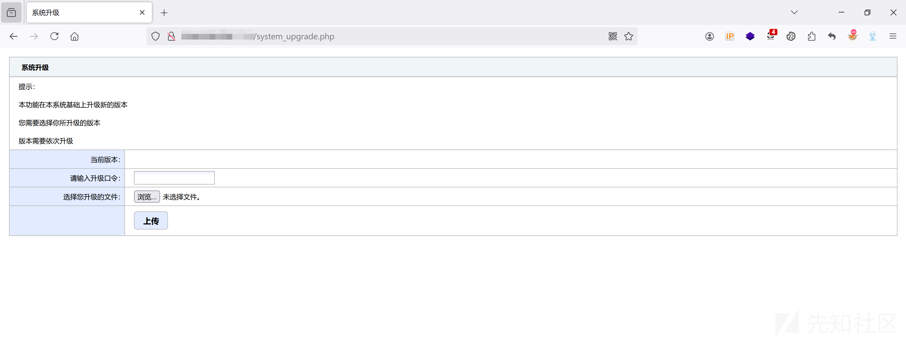

我们通过查看源代码审计一下

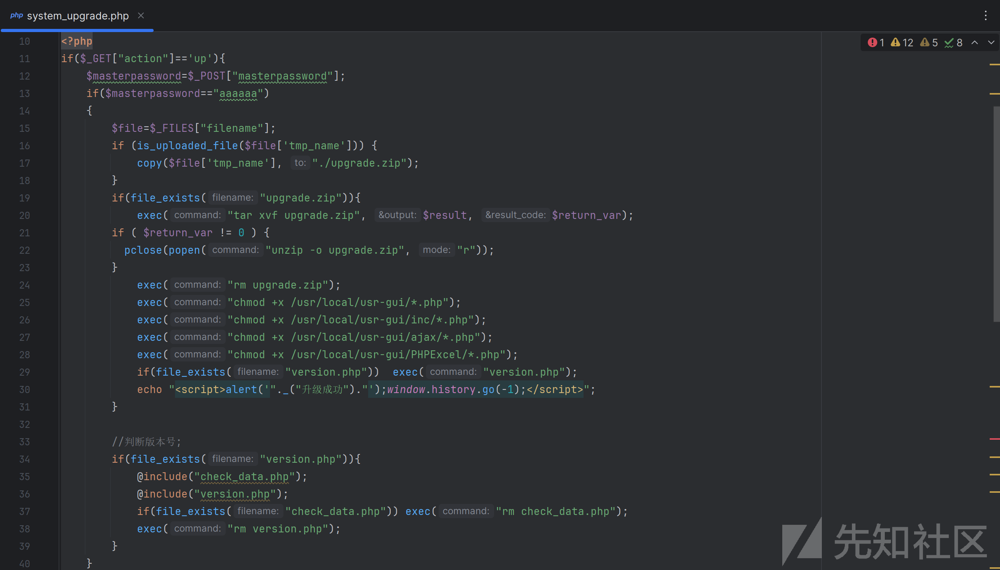

通过上述代码，我们可以发现口令由POST传参masterpassword进行控制，且口令密码为aaaaaa

```
	$masterpassword=$_POST["masterpassword"];
	if($masterpassword=="aaaaaa")
```

我们再进行查看文件上传处，发现我们上传的文件会复制在当前目录为upgrade.zip文件，然后使用tar命令进行解压在当前路径下后删除zip文件并且对所有解压的php后缀都加上执行权限

```
if(file_exists("upgrade.zip")){
exec("tar xvf upgrade.zip", $result, $return_var);
```

因此这里可以直接创建一个1.php的打印phpinfo，然后压缩为zip进行上传，当自动解压访问网站根目录处的1.php即可

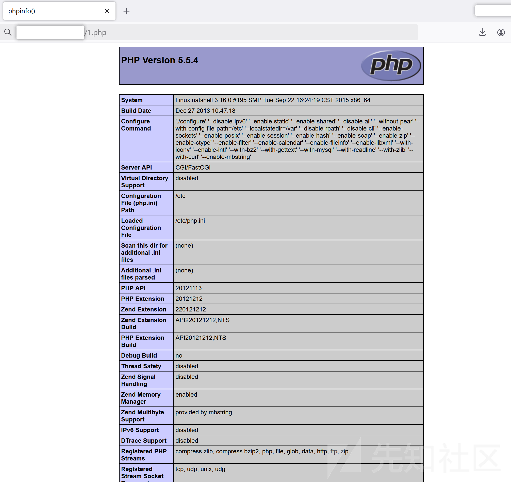

​

# SQL注入

我们发现repair\_show\_print文件处存在SQL语句，并且该文件可以进行未授权访问

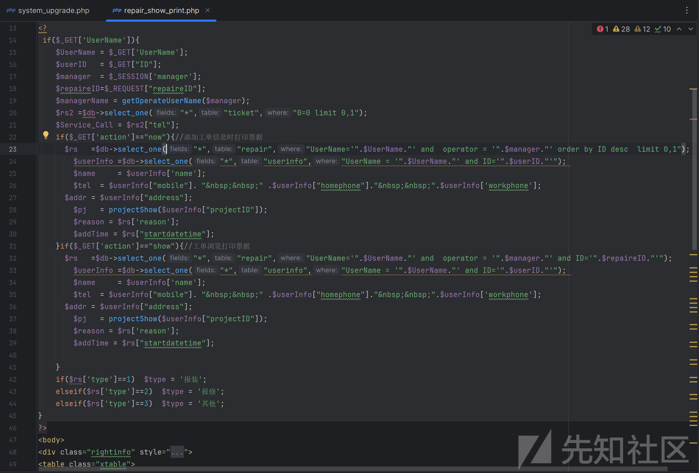

通过上述代码其实很简单的就可以发现$UserName处可进行SQL注入，浏览器访问该文件，UserName参数输入任何值都可以在用户账号回显

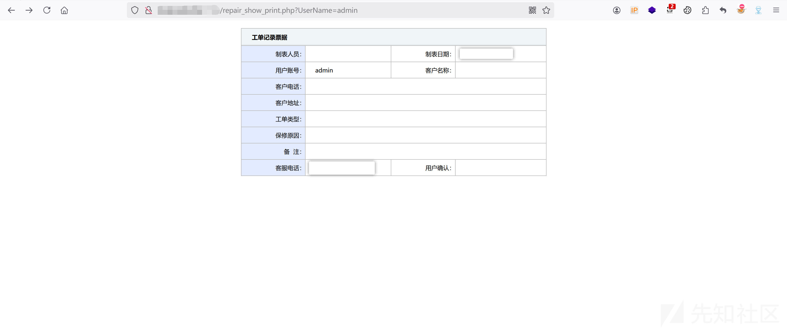

我们可以直接使用SQL注入一键梭哈

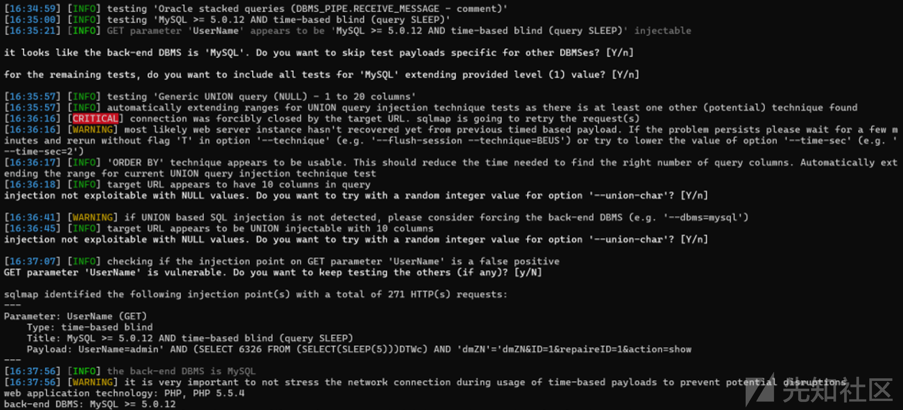

# XSS

上述SQL注入还可以进行XSS

这里还可以进行XSS，遇见输入的地方就想试一下，手忍不住，hhh

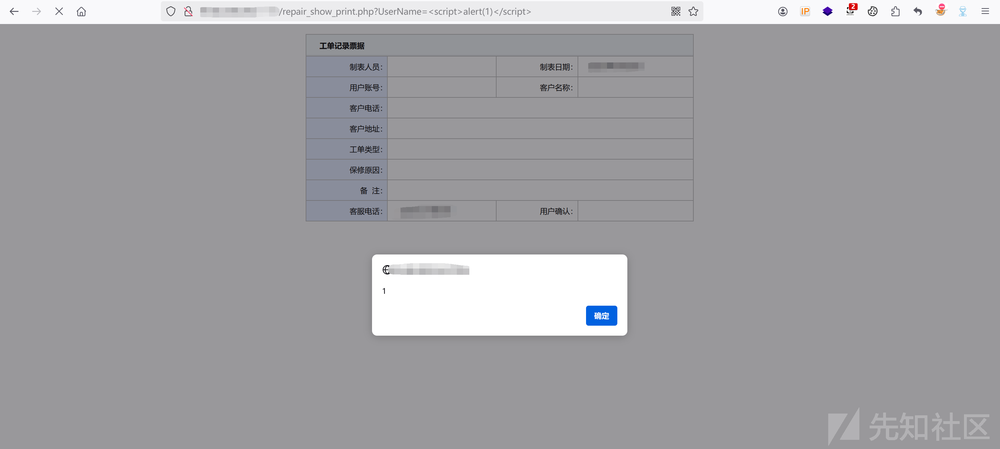

查看ajax\_chech文件，这种一看也存在XSS

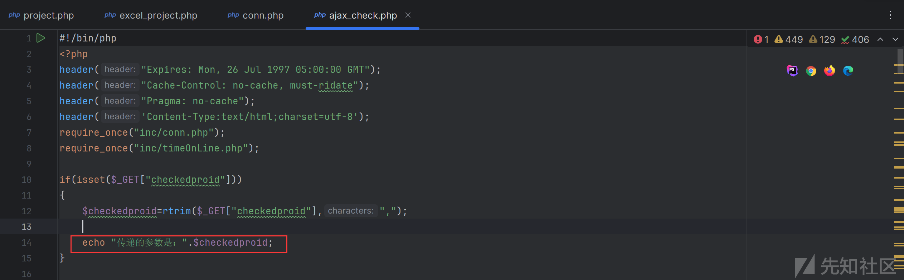

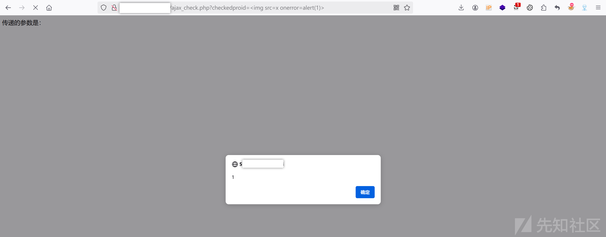

# SQL注入

我继续代码审计，发现loaduser文件与上述SQL注入存在同样的问题，同样由UserName参数进行控制

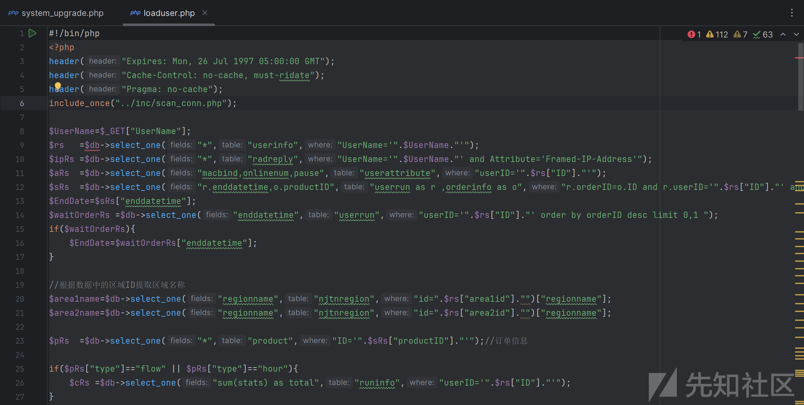

直接浏览器访问接口，任意输入admin，发现直接回显SQL语句，这直接就有了哇

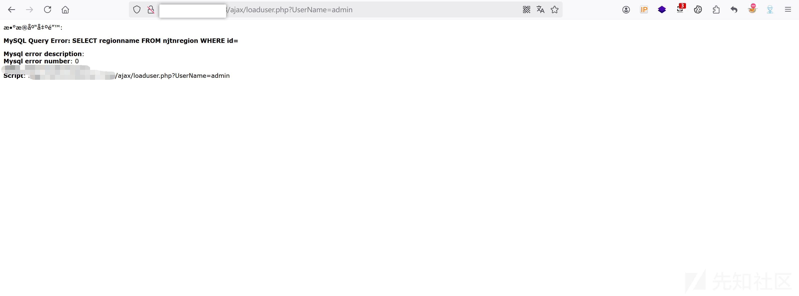

使用SQLmap进行一键梭

确定注入类型

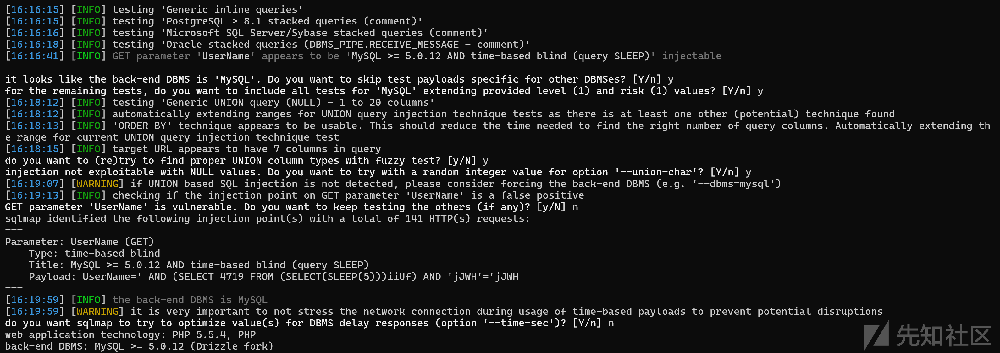

获取所有数据库

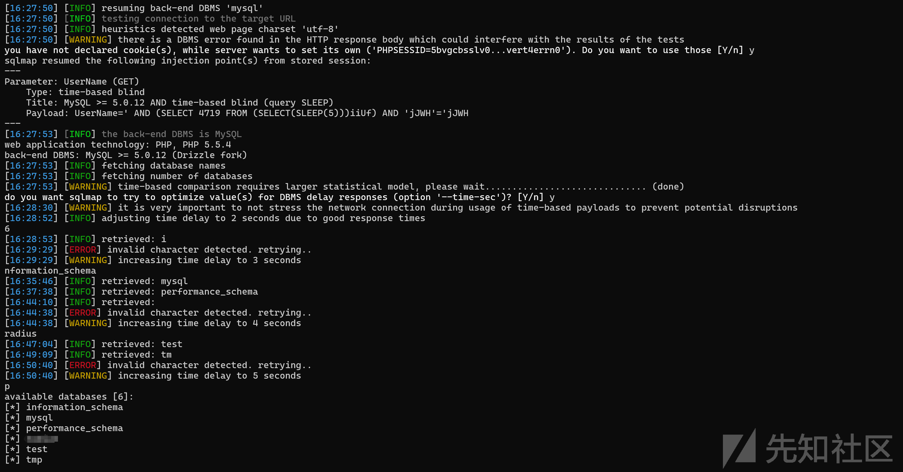

# SQL注入

查看excel\_project文件，一看就有

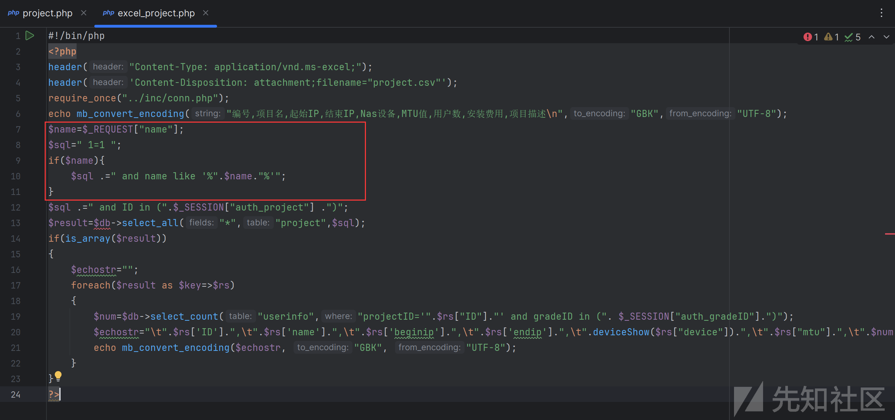

但是访问上述文件发现会自动跳转至login登录界面，猜测做了校验，我们发现在第五行require\_once("../inc/conn.php");包含了conn.php文件，我们查看该文件，很明显做了校验，所以我们从这里可以得出一个信息那就是包含conn.php文件那就是存在鉴权

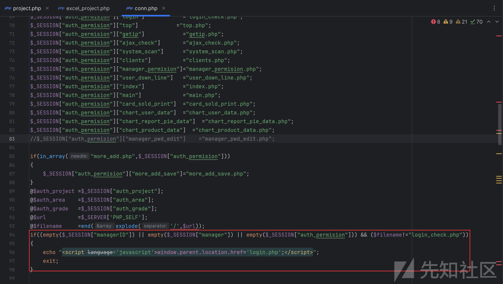

登录系统，访问excel\_project文件

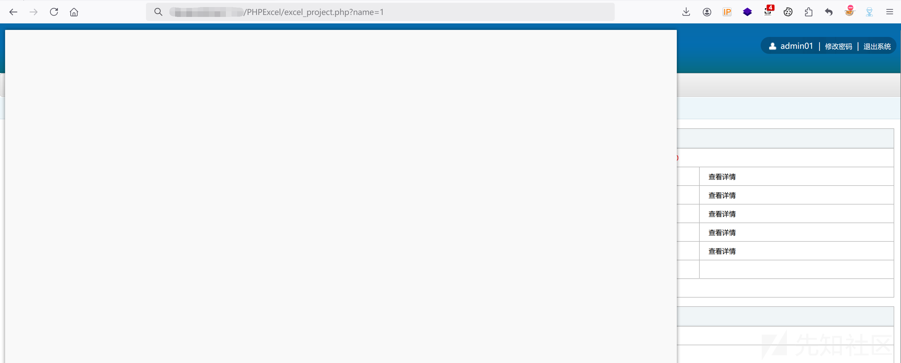

直接把请求包进行注入

sqlmap -r 1.txt

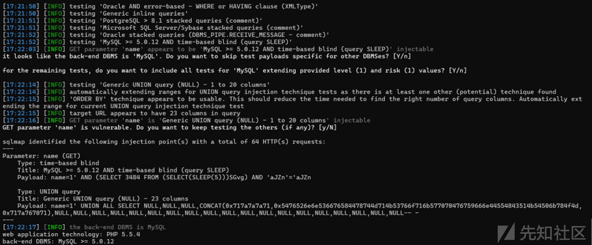
