# JsRpc联动burp实现自动加解密（详细版）-先知社区

> **来源**: https://xz.aliyun.com/news/17198  
> **文章ID**: 17198

---

练手地址：<https://github.com/0ctDay/encrypt-decrypt-vuls>

JsRpc：<https://github.com/jxhczhl/JsRpc>

## JsRpc基本使用

首先观察一下原始的数据包

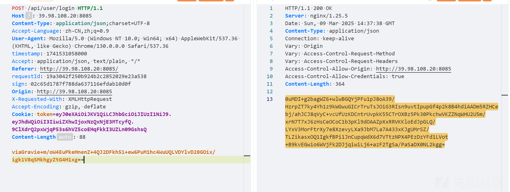

可以看到除了请求体需要解密，还有请求头中的`timestamp、requestId、sign` 需要实时更新，所以请求包中总共有四个地方需要处理，由于是直接只用JsRpc，那么就只需要找到对应的处理位置然后调用即可，不需要弄清楚具体的处理逻辑

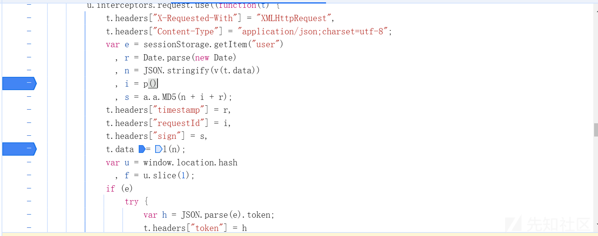

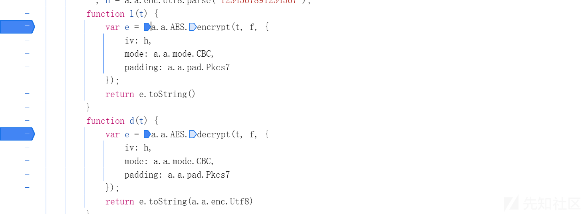

可以看到就是图中的几个地方处理的，具体逻辑就不分析了，主要是学会使用jsrpc

首先把这几个函数先提升到全局，需要先断点让其加载到作用域

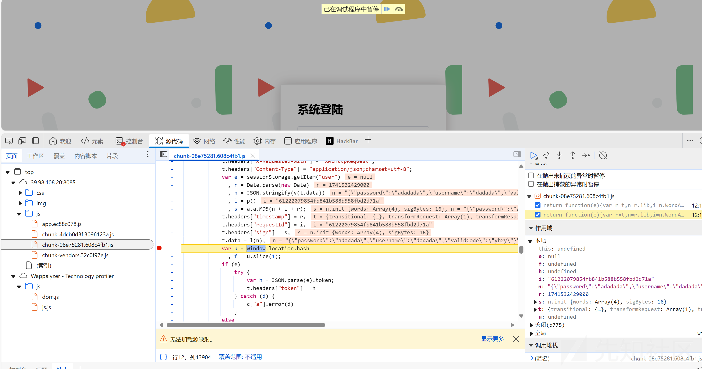

然后在控制台执行下面语句提升至全局作用域

```
window.requestId=p
//requestId
window.v1 = v
//函数v
window.sign=a.a.MD5
//签名sign
window.l=l
window.d=d
```

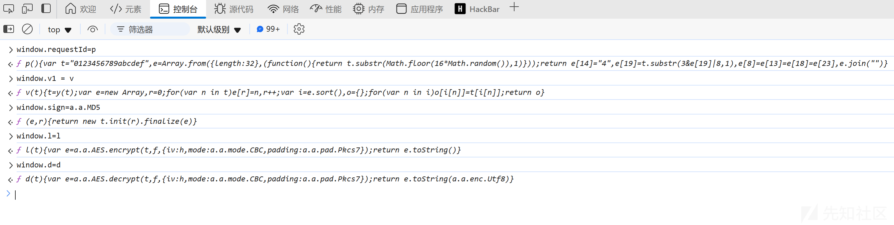

然后注入jsrpc中的js文件`JsEnv_Dev.js` ，注意注js的时候断点就得停止了

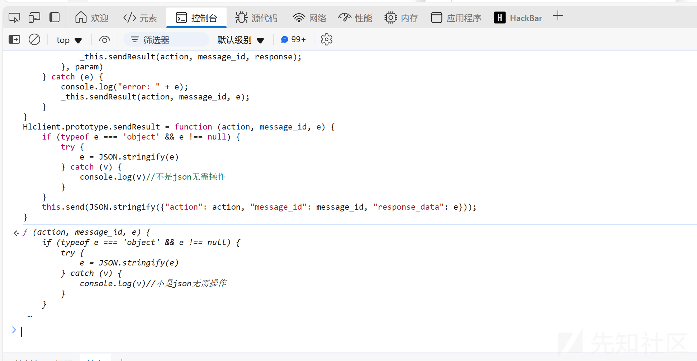

然后启动jsrpc服务端

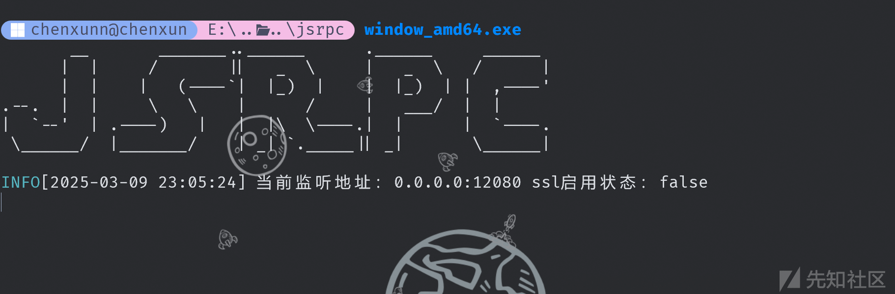

再客户端连接

```
var demo = new Hlclient("ws://127.0.0.1:12080/ws?group=zzz");
```

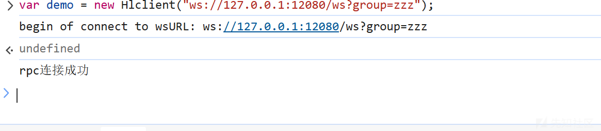

连接成功后服务端会提示新上线….然后就是将函数注册进去，即我们要怎么处理值

```
demo.regAction("encode",function (resolve,param) {
    n=JSON.stringify(v1(param))
    var request = l(n)
    var time = Date.parse(new Date);
    var id=requestId()
    var sg = sign(n+id+time).toString()
    var data={"time":"","id":"","sign":"","request":""}
    data["time"]=time.toString()
    data["id"]=id
    data["sign"]=sg
    data["request"] = request
    resolve(data);
})
```

上面是加密，下面是解密

```
demo.regAction("decode", function (resolve,param) {
    //这样添加了一个param参数，http接口带上它，这里就能获得
    var response = d(param)
    resolve(response);
})
```

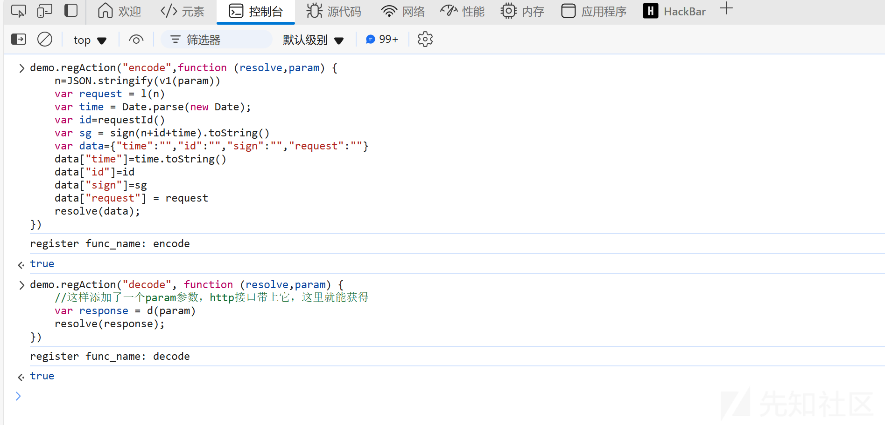

此时就可以测试一下jsrpc处理是否能成功

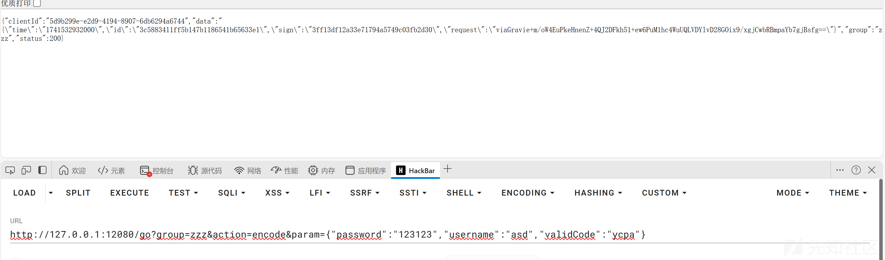

```
http://127.0.0.1:12080/go?group=zzz&action=encode&param={"password":"123123","username":"asd","validCode":"ycpa"}
```

可以看到加密是没有任何问题的，`zzz`就是加入的组和你一开始连接的时候相同即可，`action` 即你注册的加密函数，`param` 就是你要处理的参数，看看解密

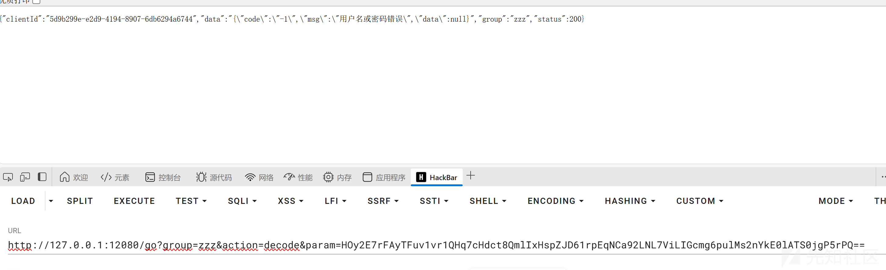

也是能够正常处理的

## JsRpc联动burp

联动burp需要借助mitmproxy写脚本，或者借助其它一些burp插件也行，这里就用mitmproxy了，脚本借助gpt弄几下即可

```
import requests
import json
from mitmproxy import ctx

def get_rpc(param):
    url = "http://127.0.0.1:12080/go"
    params = {
        "group": "zzz",
        "action": "encode",
        "param": param.decode('utf-8', errors='ignore')
    }
    try:
        result = requests.get(url, params=params, timeout=5)
        # ctx.log.info(f"RPC Response: {result.text}")
        # 第一次解析 JSON，获取外层结构
        outer_data = result.json()
        # 第二次解析 data 字段（字符串 -> 字典）
        inner_data = json.loads(outer_data['data'])
        return inner_data  # 直接返回解析后的内层数据
    except Exception as e:
        ctx.log.error(f"Error in get_rpc: {str(e)}")
        return None

def get_responseRpc(param):
    url = "http://127.0.0.1:12080/go"
    params = {
        "group": "zzz",
        "action": "decode",
        "param": param.decode('utf-8', errors='ignore')
    }
    try:
        result = requests.get(url, params=params, timeout=5)

        outer_data = result.json()
        # 第二次解析 data 字段（字符串 -> 字典）
        inner_data = json.loads(outer_data['data'])
        return inner_data  # 直接返回解析后的内层数据
    except Exception as e:
        ctx.log.error(f"Error in get_rpc: {str(e)}")
        return None

def request(flow):
    original_body = flow.request.content
    ctx.log.info(f"原始请求体: {original_body}")

    result = get_rpc(original_body)
    if result is None:
        ctx.log.error("RPC failed, skipping request modification")
        return

    try:
        # 直接使用内层数据
        flow.request.headers['timestamp'] = result['time']
        flow.request.headers['requestId'] = result['id']
        flow.request.headers['sign'] = result['sign']
        flow.request.content = result['request'].encode('utf-8')
        flow.request.headers['Content-Length'] = str(len(flow.request.content))
        ctx.log.info(f"加密后的请求体: {flow.request.content}")

    except Exception as e:
        ctx.log.error(f"Error in request: {str(e)}")

def response(flow):
    response_body = flow.response.content
    ctx.log.info(f"响应体: {response_body}")

    result = get_responseRpc(response_body)
    if result is None:
        ctx.log.error("Response RPC failed, keeping original response")
        return

    try:
        # 将解码后的字典转为 JSON 字符串并编码为字节
        decoded_json = json.dumps(result, ensure_ascii=False).encode('utf-8')
        flow.response.content = decoded_json
        flow.response.headers['Content-Length'] = str(len(flow.response.content))
        # 可选：设置 Content-Type 为 JSON
        flow.response.headers['Content-Type'] = 'application/json; charset=utf-8'
        ctx.log.info(f"解码后的响应体: {flow.response.content}")
    except Exception as e:
        ctx.log.error(f"Error in response: {str(e)}")

```

然后设置burp的上游代理

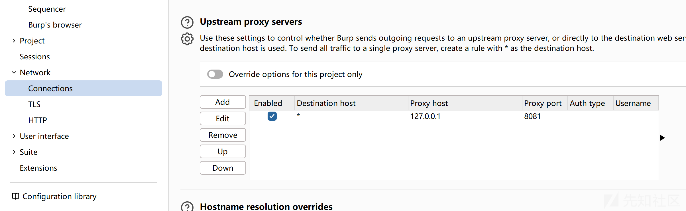

运行脚本

```
mitmdump -p 8081 -s .\JsPython.py 
```

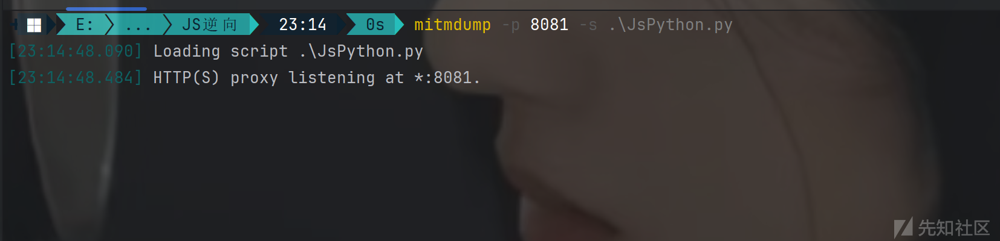

这样即可实现自动化加解密

当密码不正确时

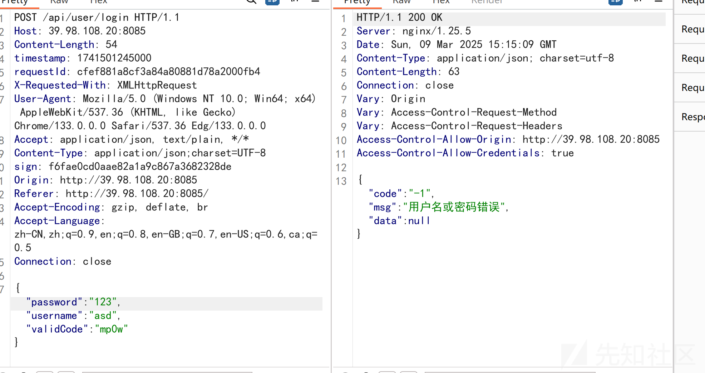

当密码正确时，这里请求头中的三个值在burp虽然没变但实际上是已经改变了的，因为是在脚本中做的处理

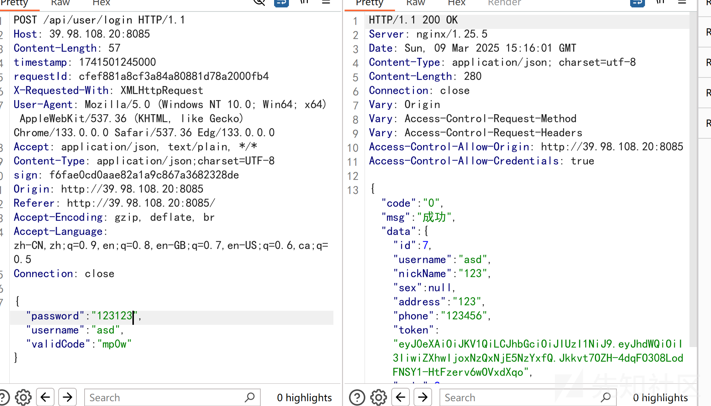

还是非常方便滴，因为不需要去逆js了

## 参考

<https://xz.aliyun.com/news/14689>

<https://xz.aliyun.com/news/12678>
