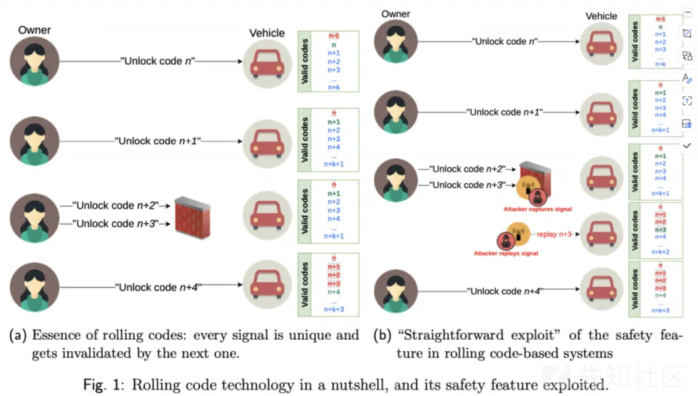
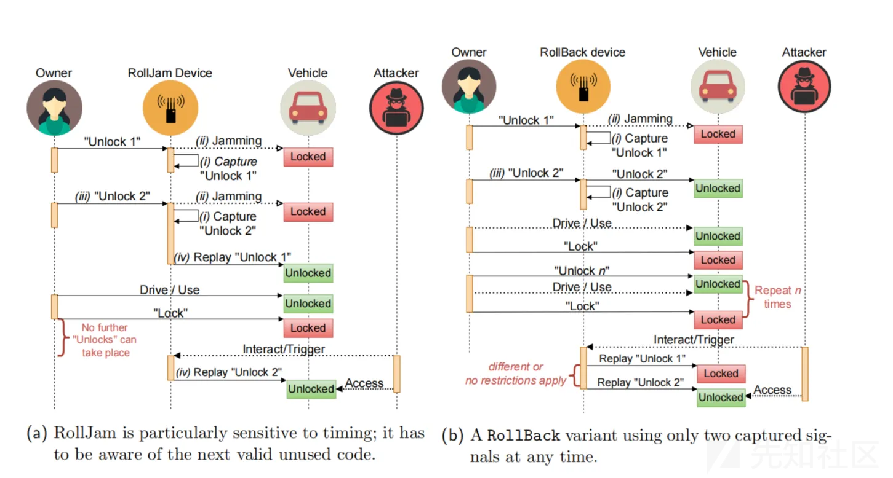

# 车联网安全之滚动码系统研究-先知社区

> **来源**: https://xz.aliyun.com/news/17201  
> **文章ID**: 17201

---

# 一.研究背景

## 浅析汽车钥匙系统

### 前言

从无线遥控无钥匙进入 (RKE) 系统开始，到功能更强大的被动式进入系统 (PEK)和被动进入/被动启动(PEPS)，再到被动式安全进入系统 (PASE)。无钥匙进入系统在过去 40 年里得到了迅猛发展。它从一种技术跳到另一种技术，从简单的 ASK、FSK 调制到蓝牙低功耗（BLE）系统中的编码跳频扩频，再到超宽带（UWB）调制。同样，在安全领域，从简单的无编码数字技术到编码数字技术、滚动编码和高级加密标准（AES）的实施，使这项技术达到了更高的安全水平。

### 遥控钥匙（RKE，Remote Keyless Entry）

**工作原理**：

1. **发送信号**：当用户按下遥控钥匙上的按钮时，遥控器会发送一个无线电频率（RF）信号。这个信号包含了特定的识别码，用于与车辆进行匹配。
2. **接收信号**：车辆上的接收器接收到这个RF信号，并解析其中的识别码。
3. **验证信号**：如果识别码与车辆预先存储的识别码匹配，接收器会发送信号到车载控制单元（ECU）。
4. **执行指令**：ECU执行相应的动作，比如解锁车门、锁定车门或打开行李箱。

**技术**：

* 使用RF信号，一般工作在315 MHz或433 MHz频段。
* 采用滚动码技术防止信号被拦截和复制

作为 PEPS 的前身，RKE 通过钥匙扣向与汽车 BCM（车身控制模块）相连的射频接收器发射 UHF（超高频）信号，以验证用户身份。一旦身份得到验证，系统将执行由 BCM 驱动的开门/关门动作。如图所示，这种单向验证机制可以验证预设密码。如果密码正确，他或她就会被允许进入。

​

### 被动进入系统（PKE，Passive Keyless Entry）

**工作原理**：

1. **信号发送**：车辆会周期性地发送低频（LF）信号，这个信号的范围一般在1-3米以内。
2. **钥匙响应**：当携带钥匙的用户进入这个范围时，钥匙会接收到车辆的LF信号并响应，发送一个高频（HF）信号回给车辆。
3. **验证信号**：车辆接收到钥匙的HF信号，并解析其中的识别码。
4. **执行指令**：如果识别码匹配，车辆会自动解锁车门。

**技术**：

* 使用LF信号进行近距离通信（125 kHz）。
* HF信号用于远距离通信（通常是RF信号，315 MHz或433 MHz）。
* 使用双向认证和加密技术提高安全性。

到 21 世纪初，人们将 RKE 的单向验证机制升级为称为 PKE（被动式无钥匙进入）系统的双向机制，验证不再由钥匙持有者（即驾驶员）启动，而是由车上连接到 BCM 的低频发射器启动。车门关闭并上锁后，车内的无线模块将持续发射低频（125KHz）信号，寻找一定范围内的应答器（内置在钥匙扣中）。当模块找到应答器时，其代码将唤醒应答器。如果模块的低频部分长时间没有收到反馈信号，它就会进入睡眠模式，以降低功耗。每当钥匙扣中的应答器接收到唤醒信号时，它就会通过高频（即 433MHz）信号发送滚动编码数据报。内置模块解码并理解数据报后，将指示汽车执行某些操作。由此可见，与 RKE 相比，PKE 采用的验证机制是双向的。

### 被动进入和启动系统（PEPS，Passive Entry Passive Start）

**工作原理**：

1. **进入车辆**：

* 工作原理与PKE 相同，车辆会发送LF信号，钥匙响应并发送HF信号，车辆验证并解锁车门。

2. **启动车辆**：

* 当用户进入车内并按下启动按钮时，车辆会再次发送LF信号以确认钥匙是否在车内。
* 钥匙响应并发送HF信号，车辆验证识别码。
* 如果识别码匹配，车辆的ECU允许启动引擎。

**技术**：

* 结合PEK的所有技术。
* 通过车辆内的多个天线阵列实现更精确的钥匙定位，确保钥匙在车内时才能启动引擎。

PEPS 是一种安全的无线通信系统，可使驾驶员在不使用钥匙的情况下进入汽车，解锁汽车并启动发动机。该系统使用射频信号，通过在汽车和钥匙之间发送信号来验证钥匙。PEPS 系统使用低频无线电波（通常为 125 千赫或 134 千赫）和超高频（UHF）无线电波（通常为 1 千兆赫以下的信号）进行双向通信，在钥匙和汽车之间交换唯一的钥匙访问代码。一旦交换的代码符合预期值，且钥匙在汽车附近，汽车就会允许驾驶员进入。系统还会测量汽车与钥匙之间的距离，以确定钥匙是在车内还是车外。这一信息可用于为驾驶员提供不同类型的访问权限。例如，如果钥匙在车外，则只允许进入车内，但发动机启动功能将不起作用。基本上，目前主流的 PEPS 都已集成了 NFC 和蓝牙功能。驾驶员可将 NFC 手机放在汽车 B 柱附近，然后进入车内。这消除了将钥匙扣和智能手机都放进口袋的麻烦。但将蓝牙引入 PEPS 则更具革命性。蓝牙的高频率、跳频机制和强化的安全机制与 UHF/LF 的保证机制相比，提供了更多的安全保证。此外，蓝牙的测距和定位功能对掌握开关门的时机大有帮助。蓝牙测距和定位的精度可达半米或一米。它包括 RSSI 方法和 AoA 方法。前者精度较低，可达到 1 至 5 米的精度水平。后者精度更高，精度可达半米。

### 

# 二.滚动码机制

虽然汽车无钥匙进入系统已经发展了很多年，但是采用 RKE 依然大量存在。并且，由于滚动码机制的特殊性。在现如今依然存在大量使用滚动码的地方。因此，研究滚动码机制依然是非常有价值和意义的。

应用滚动码技术意味着每一个键的fob信号传输都是唯一的，即它随着每按一个按钮而变化。唯一性是通过在钥匙中心（以及在接收时的车辆中）增加一个16位宽计数器来实现的。如果两边的计数器都同步，则按下按钮有效。然后，每个方增加其计数器以同步按下以下按钮。因此，如果攻击者捕获了从钥匙中心发送的有效信号，并由车辆用计数器Ck = n接收并重放它，它将被车辆中的接收器丢弃，作为其计数器Cv > Ck，即Cv=（n+=）：k>0。

另一方面，当钥匙扣超出车辆范围时，需要按下按钮，即使用钥匙扣来锁定/解锁汽车和Ck > Cv。这些情况被进一步分为两个不同的操作窗口

### 单一窗口

**单一窗口**是指计数器差值 *Cdif f* = *Ck − Cv* 较小的情况。具体来说，当差值小于16时（即 *Cdif f <* 16），系统可以在第一次按键按下时立即进行同步。这意味着当车辆接收到钥匙扣的信号后，它会立即更新自己的计数器，与钥匙扣的计数器保持一致，不需要额外的步骤。

**主要特点：**

* **同步快速**：只需一次按键操作。
* **差值较小**：差值在16以内，车辆可以轻松同步。
* **即时更新**：车辆会立即更新其计数器，丢弃在这之前所有未接收到的代码。

​

### 重新同步/双窗口

**重新同步/双窗口**是指计数器差值较大的情况。具体来说，当差值在16 *< Cdif f <* 2 15时，系统需要进行重新同步。

**主要特点：**

* **同步需要两次按键操作**：当车辆接收到一次信号时，暂时存储这个信号并等待下一次信号。如果下一次信号的计数器值比上次大1，则系统进行同步。
* **差值较大**：差值在16到2 15之间，车辆需要额外的验证步骤来确保安全。
* **双步验证**：车辆需要接收到两次连续的信号才能完成同步，从而提高了安全性，防止信号被重放攻击。

如果上述任何一个失败，则车辆接收到的钥匙焦点信号被丢弃。此外，请注意，由于底层的加密机制即使是一位信息的变化（例如，计数器增量）也会导致最终传输信号的显著变化。因此，攻击者通过捕获上一个信号来推断下一个有效的解锁信号，这在计算上是不可行的。

注意当钥匙 fob 已经发出信号时，已发送的代码也可以被认为未使用，但车辆没有收到它。例如，当解锁按钮被意外按下时。（由图1a中的“解锁代码n+2”和“n+3”描述）。**为了避免不同步，从而在这种情况下将我们自己锁在我们的车辆之外，基于滚动代码的系统提供了一个安全功能，允许钥匙fob的计数器比车辆的计数器领先一步。**这是通过在车辆上维护的不是一组，而是一组有效的“未来代码”来实现的 。如果从钥匙fob接收到的代码与这些未来的代码匹配，车辆将重新同步到最后一个钥匙fob信号中的代码，并使该集合中所有以前（但未使用的）代码失效（参见图中的“解锁代码n+4”）。**显然，如果攻击者可以获得这些未使用的未来代码之一（即，捕获汽车附近的意外按钮按下的信号），并且她可以在车主再次使用钥匙fob之前重播它，攻击者可以访问车辆**。

​

​

​

# 三.rollback 与 rolljam 工作机制探讨

虽然理论上滚动码机制是一项安全的技术。但是在 2015 年一种名为 rolljam 的技术证明了基于滚动码的密钥系统是极易破坏的。简而言之，根据 rolljam 的原理破解滚动码系统只需要三个步骤：干扰，捕捉，重放.

如上图 rolljam 部分的流程图所示，它分为四个步骤

1. 时刻捕捉信号
2. 采用特定设备干扰车辆与钥匙的正常通信
3. 因为干扰，从而引诱车主第二次发送解锁信号
4. 重放先前捕获的第一次信号

回顾一下这整个过程是怎么实现的。首先我们拥有一个可以实现干扰，捕捉，重放的设备。在攻击模型当中，受害者由于步骤三会按下两次解锁按钮。同时我们会得到两个滚动码，此时我们再重放第一次接收到的滚动码就可以攻击成功。为什么这个滚动码是有效的？还记得在上面的滚动码原理吗。由于滚动码是一次性的且必须按顺序使用，拦截并阻止一个滚动码后，合法用户的遥控器会发送下一个滚动码。这导致接收设备并没有意识到有一个滚动码已经被阻塞并存储下来。钥匙发送的信号并没有被车辆所接收到，这在滚动码设计当中是被允许的。因此，这个接收到的滚动码被判定为有效。攻击成功。

但是这样的作法存在很大的缺点：

1. 首先在这个攻击模型当中阻塞的作用非常关键。倘若阻塞装置不能很好的阻塞合法信息的通信，我们所收集到的滚动码会因此作废。这就导致了对阻塞装置的放置有很高的要求
2. 与条件一类似。必须在收集信号完成后及时的使用它。否则它会随着滚动的信号更新而失效，整个攻击流程必须从头开始

​

针对 rolljam 的以上缺点另外一种名为 rollback 的机制被提出。顾名思义它叫做回滚，利用的便是滚动码当中的回滚机制。在不同的 RKE 系统当中回滚系统都不同。但是存在回滚机制的系统原理都是当**多个已经连续被发送过的滚动码被重新发送**，这个时候滚动码系统认为自身出现了错误，从而回滚到之前的已经被使用过的滚动码。这个过程如上图中右图所示。与 rolljam 的工作步骤类似：

1. 时刻捕捉信号
2. 采用特定设备干扰车辆与钥匙的正常通信
3. 因为干扰，从而引诱车主第二次发送解锁信号

然而我们并不需要第四个步骤，因为回滚机制的存在。我们可以在任意时间重放这个滚动码,这个滚动码都有效。

​

​

# 四.基于 esp32 的 rollback 与 rolljam 攻击原理的 CTF 题目

#### 硬件部分

esp32+cc1101 x2

一个 SDR(RTL-SDR 即可

rolljam 和 rollback 设备，这里使用的是自制的 EvilcrowRF

#### 软件部分

<https://github.com/ch0en3/rollback-rolljam_ctf>

感兴趣的师傅可以玩一下
