# 驱动通信挖掘-先知社区

> **来源**: https://xz.aliyun.com/news/17212  
> **文章ID**: 17212

---

本文简要介绍了UM-KM通信的一类方式 .data ptr swap的挖掘与利用

# 驱动通信挖掘

具体流程如下

1. 去ida全局搜qword\_ offset\_指针 一个个看过去

搜stub\_ 或搜\_guard\_\*的交叉引用一个个看

优先去找NT ZW开头的函数 要做通信 那么必须三环能够发起调用 不是说一定要NT ZW 只是NT ZW的比较方便 不用往上追 其它的函数需要下断点 追一追堆栈能否从三环发起调用

1. 分析函数 寻找.data指针

大体浏览函数 找有可控的回调函数 或其它模块引入的函数 该函数的参数能一路从三环传过来

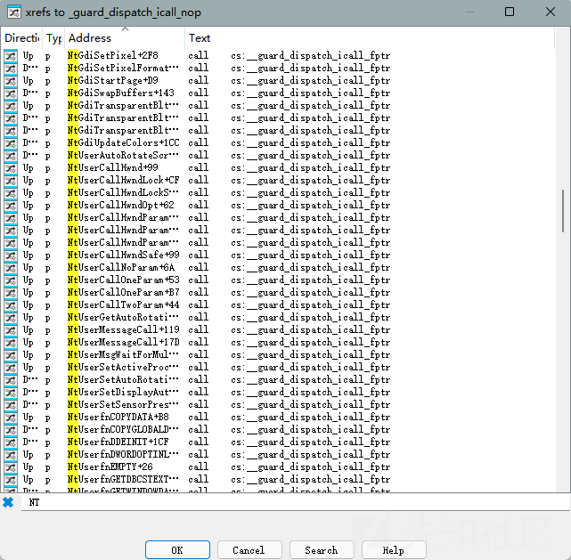

1. 根据需要挂钩的函数定义相应的通信结构 函数原型
2. 通信

这里举几个例子

比如去hook **HalDispatchTable** 表中的函数

### 基于 NtConvertBetweenAuxiliaryCounterAndPerformanceCounter

```
__int64 __fastcall NtConvertBetweenAuxiliaryCounterAndPerformanceCounter(
         char a1,
         unsigned __int64 a2,
         _QWORD *a3,
         _QWORD *a4)
 {
   __int64 v7; // r14
   __int64 (__fastcall *v8)(); // rax
   int v9; // ecx
   __int64 (__fastcall *v10)(); // rax
   __int64 v12; // [rsp+20h] [rbp-28h] BYREF
   _QWORD v13[4]; // [rsp+28h] [rbp-20h] BYREF
 
   if ( KeGetCurrentThread()->PreviousMode )
   {
     if ( (a2 & 3) != 0 )
       ExRaiseDatatypeMisalignment();
     if ( a2 + 8 > 0x7FFFFFFF0000LL || a2 + 8 < a2 )
       MEMORY[0x7FFFFFFF0000] = 0;
     v7 = *(_QWORD *)a2;
     v13[1] = *(_QWORD *)a2;
     ProbeForWrite(a3, 8uLL, 4u);
     if ( a4 )
       ProbeForWrite(a4, 8uLL, 4u);
     v8 = off_140424078[0];
     if ( !a1 )
       v8 = off_140424070[0];
     v9 = ((__int64 (__fastcall *)(__int64, __int64 *, _QWORD *))v8)(v7, &v12, v13);
     if ( v9 >= 0 )
     {
       *a3 = v12;
       if ( a4 )
         *a4 = v13[0];
     }
   }
   else
   {
     v10 = off_140424078[0];
     if ( !a1 )
       v10 = off_140424070[0];
     return ((unsigned int (__fastcall *)(_QWORD, _QWORD *, _QWORD *))v10)(*(_QWORD *)a2, a3, a4);
   }
   return (unsigned int)v9;
 }
```

无论从三环发起来是零环发起 都会注册一个回调函数并调用 三环多了一些参数检测

函数来自HalPrivateDispatchTable

当我们hook了off\_140424078[0]或off\_140424070[0]后 通过三环调用NtConvertBetweenAuxiliaryCounterAndPerformanceCounter即可实现通信 这里a3会写回 传个指针过来 a4可选

首先搜特征码获取off\_140424078[0]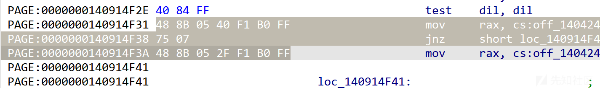

```
ULONG_PTR addr = searchCode("ntoskrnl.exe", "PAGE", "488B05****75*488B05****E8", 0);
 if (addr) {
     ULONG64 offset = *(PLONG)(addr + 3);
     PULONG64 hookedFunc = (PULONG64)(addr + 0x7 + offset);
 }
```

定义通信结构 hook

```
typedef NTSTATUS(*oldxKdEnumerateDebuggingDevicesRoutine) (PVOID info, PVOID un1, PVOID un2);
 
 oldxKdEnumerateDebuggingDevicesRoutine g_oldxKdEnumerateDebuggingDevices;
 PULONG64 g_communicateRoutine;
 PULONG64 g_Callback;
 
 typedef struct _CommStruct{
     ULONG64 ID;
     ULONG64 Cmd;
     ULONG64 Data;
     ULONG64 Size;
     ULONG64 StatusCode;
 }CommStruct, * PCommStruct;
 
 typedef struct _testStruct {
     ULONG64 num;
 }testStruct,*PtestStruct;
 
 typedef NTSTATUS(NTAPI* commCallbackRoutine)(PCommStruct CommStruct);
 NTSTATUS testCommRoutine(PCommStruct CommStruct, PVOID un1, PVOID un2) {
     if (CommStruct->ID != 0x114514) {
         g_oldxKdEnumerateDebuggingDevices(CommStruct,un1,un2);
     }
     else{
         PVOID data = (PVOID)(CommStruct->Data);
         if (CommStruct->Cmd == 0) {
             PtestStruct info = (PtestStruct)data;
             DbgPrintEx(77, 0, "Test!
");
             info->num = 0x654321;
         }
         CommStruct->StatusCode = STATUS_SUCCESS;
         return STATUS_SUCCESS;
     }
 
     
 }
 NTSTATUS RegisterDriverCommRoutine(commCallbackRoutine routine) {
     ULONG_PTR addr = searchCode("ntoskrnl.exe", "PAGE", "488B05****75*488B05****E8", 0);
     if (addr) {
         ULONG64 offset = *(PLONG)(addr + 3);
         PULONG64 hookedFunc = (PULONG64)(addr + 0x7 + offset);
 
         if (MmIsAddressValid(hookedFunc)) {
             g_Callback = hookedFunc;
             g_oldxKdEnumerateDebuggingDevices = (oldxKdEnumerateDebuggingDevicesRoutine)hookedFunc[0];
             g_communicateRoutine = routine;
             hookedFunc[0] = routine;
             return STATUS_SUCCESS;
         }
 
     }
     return STATUS_UNSUCCESSFUL;
 
 }
```

三环测试程序如下

```
#include <Windows.h>
 #include <iostream>
 
 #define NT_SUCCESS(Status) (((NTSTATUS)(Status)) >= 0)
 
 typedef struct _testStruct {
     ULONG64 num;
 }testStruct, * PtestStruct;
 
 typedef struct _CommStruct {
     ULONG64 ID;
     ULONG64 Cmd;
     ULONG64 Data;
     ULONG64 Size;
     ULONG64 StatusCode;
 }CommStruct, * PCommStruct;
 
 typedef NTSTATUS
 (NTAPI* pNtConvertBetweenAuxiliaryCounterAndPerformanceCounter)(
     _In_ BOOLEAN ConvertAuxiliaryToPerformanceCounter,
     _In_ PULONG64 PerformanceOrAuxiliaryCounterValue,
     _Out_ PULONG64 ConvertedValue,
     _Out_opt_ PULONG64 ConversionError
 );
 
 
 BOOLEAN LoadDriver(LPCWSTR driverName, LPCWSTR driverPath) {
 
     SC_HANDLE ScMgr = OpenSCManager(NULL, NULL, SC_MANAGER_CREATE_SERVICE);
     if (!ScMgr) {
         std::cerr << "OpenSCManager failed: " << GetLastError() << std::endl;
         return FALSE;
     }
     SC_HANDLE hService;
     hService = CreateService(ScMgr, driverName, driverName, SERVICE_START | SERVICE_STOP | DELETE, SERVICE_KERNEL_DRIVER, SERVICE_DEMAND_START, SERVICE_ERROR_IGNORE, driverPath, NULL, NULL, NULL, NULL, NULL);
 
     if (!hService) {
         if (GetLastError() == ERROR_SERVICE_EXISTS) {
             hService = OpenService(ScMgr, driverName, SERVICE_START | SERVICE_STOP | DELETE);
         }
         else {
             std::cerr << "CreateService failed: " << GetLastError() << std::endl;
             CloseServiceHandle(ScMgr);
             return FALSE;
         }
     }
 
     BOOLEAN bSuccess = StartService(hService, NULL, NULL);
     if (!bSuccess) {
         std::cerr << "StartService failed: " << GetLastError() << std::endl;
 
     }
     CloseServiceHandle(hService);
     CloseServiceHandle(ScMgr);
 
     return TRUE;
 }
 BOOLEAN UnLoadDriver(LPCWSTR driverName) {
     SC_HANDLE ScMgr = OpenSCManager(NULL, NULL, SC_MANAGER_CREATE_SERVICE);
     if (!ScMgr) {
         std::cerr << "OpenSCManager failed: " << GetLastError() << std::endl;
         return false;
     }
     SC_HANDLE hService = OpenService(ScMgr, driverName, SERVICE_START | SERVICE_STOP | DELETE);
     SERVICE_STATUS serviceStatus = {};
     if (ControlService(hService, SERVICE_CONTROL_STOP, &serviceStatus)) {
         std::cout << "Service stopped successfully." << std::endl;
     }
     else if (GetLastError() != ERROR_SERVICE_NOT_ACTIVE) {
         std::cerr << "ControlService failed: " << GetLastError() << std::endl;
         CloseServiceHandle(hService);
         CloseServiceHandle(ScMgr);
         return false;
     }
 
     if (!DeleteService(hService)) {
         std::cerr << "DeleteService failed: " << GetLastError() << std::endl;
         CloseServiceHandle(hService);
         CloseServiceHandle(ScMgr);
         return false;
     }
 
     CloseServiceHandle(hService);
     CloseServiceHandle(ScMgr);
     return true;
 
 
 }
 int main(){
 
     LoadDriver(L"testComm", L"C:\DriverCommunicate.sys");
 
     // Start Communicate
     HMODULE ntdll = LoadLibrary(L"ntdll.dll");
     pNtConvertBetweenAuxiliaryCounterAndPerformanceCounter NtConvertBetweenAuxiliaryCounterAndPerformanceCounter = (pNtConvertBetweenAuxiliaryCounterAndPerformanceCounter)GetProcAddress(ntdll, "NtConvertBetweenAuxiliaryCounterAndPerformanceCounter");
     ULONG64 unUse = 0;
     CommStruct package = { 0 };
     package.ID = 0x114514;
     package.Cmd = 0;
     LPVOID mem = (LPVOID)malloc(sizeof(ULONG64));
     memset(mem, 0, sizeof(mem));
     package.Data = (ULONG64)&mem;
 
 
     PCommStruct data = &package;
     NtConvertBetweenAuxiliaryCounterAndPerformanceCounter(TRUE, (PULONG64) &data, &unUse, NULL);
     if (NT_SUCCESS(data->StatusCode)) {
         PtestStruct testInfo = (PtestStruct)data->Data;
         printf("num [+]: %llx
", testInfo->num);
     }
     
     system("pause");
     UnLoadDriver(L"testComm");
 }
```

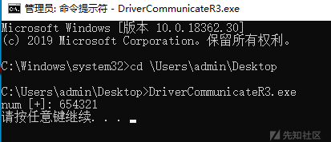

### 基于 NtQueryAuxiliaryCounterFrequency

```
__int64 __fastcall NtQueryAuxiliaryCounterFrequency(_QWORD *a1)
 {
   __int64 result; // rax
   __int64 v3; // [rsp+38h] [rbp+10h] BYREF
 
   if ( !KeGetCurrentThread()->PreviousMode )
     return off_140424080[0]();
   ProbeForWrite(a1, 8uLL, 4u);
   result = ((__int64 (__fastcall *)(__int64 *))off_140424080[0])(&v3);
   if ( (int)result >= 0 )
     *a1 = v3;
   return result;
 }
```

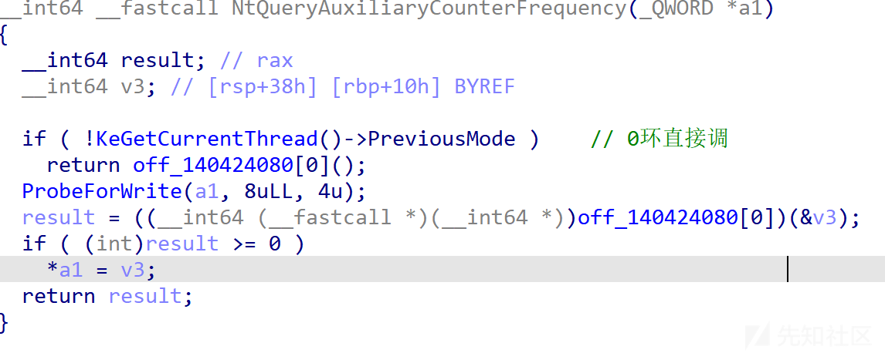

同样是HalDispatchTable表中的函数

比上面那个简单点 0环直接调用 但是a1是OUT的参数 所以不能用作通信(这里不考虑共享内存之类的操作)

### 基于 NtQueryIntervalProfile

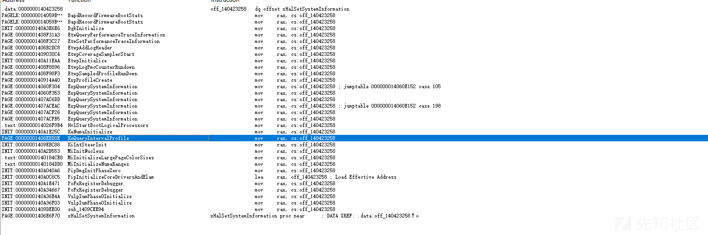

NtQueryIntervalProfile可以调到KeQueryIntervalProfile

我们再看看参数传递v2来自a1 来自NtQueryIntervalProfile的ProfileSource 即可控

那么这个可以用来通信吗

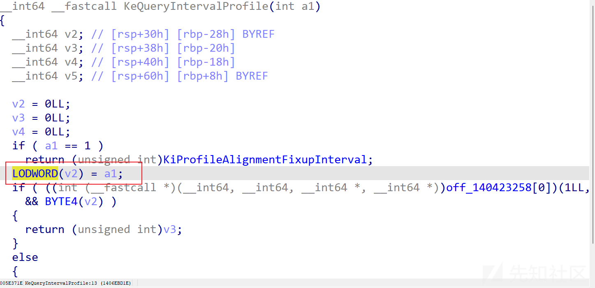

注意这里取的是我们传入参数的低位 那么传地址就不可行了 也就是通过通信外带数据不可行了

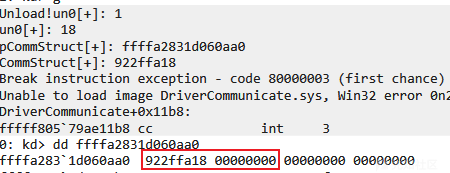

但是如果只是传低位 当控制码来用 还是没问题的

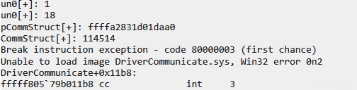

R3

```
typedef NTSTATUS (NTAPI* pNtQueryIntervalProfile)(
     _In_ PULONG32 ProfileSource,
     _Out_ PULONG Interval
 );
 
 HMODULE ntdll = LoadLibrary(L"ntdll.dll");
 
 pNtQueryIntervalProfile NtQueryIntervalProfile = (pNtQueryIntervalProfile)GetProcAddress(ntdll, "NtQueryIntervalProfile");
 
 ULONG unUse = 0;
 // CommStruct package = { 0 };
 // package.ID = 0x114514;
 // package.Cmd = 0;
 // LPVOID mem = (LPVOID)malloc(sizeof(ULONG64));
 // memset(mem, 0, sizeof(mem));
 // package.Data = (ULONG64)&mem;
 // PCommStruct data = &package;
 
 NtQueryIntervalProfile((PULONG32)0x114514, &unUse);
```

R0

```
typedef NTSTATUS(*oldxHalSetSystemInformation) (PVOID un0, PVOID info, PVOID un1, PVOID un2);
 oldxHalSetSystemInformation g_oldxHalSetSystemInformation;
 NTSTATUS testCommRoutine(ULONG64 un0, ULONG64 un1, PULONG32 pCommStruct, PVOID un2) {
     PCommStruct CommStruct = *pCommStruct;
     DbgPrintEx(77, 0, "un0[+]: %llx
", un0);
     DbgPrintEx(77, 0, "un0[+]: %llx
", un1);
     DbgPrintEx(77, 0, "pCommStruct[+]: %llx
", pCommStruct);
     DbgPrintEx(77, 0, "CommStruct[+]: %llx
", CommStruct);
 }
```

### 基于 NtSetCompositionSurfaceAnalogExclusive

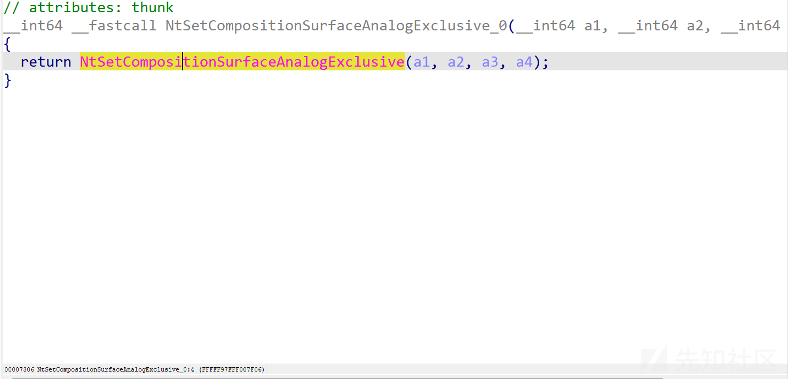

可以看见这里的NtSetCompositionSurfaceAnalogExclusive是导入的

这里特征码比较难拿 意思一下就完了 不同版本看着偏移调

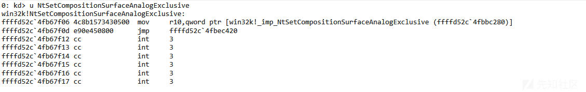

targetAddr = searchCode("win32k.sys", ".text", "4c8b15\*\*\*\*e9\*\*\*\*", 0,0x6F00);

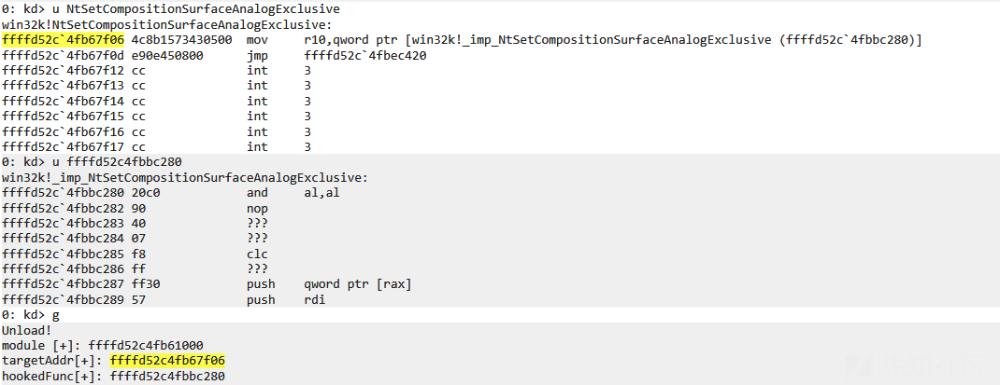

这里四个参数都行

由于NtSetCompositionSurfaceAnalogExclusive是win32k.sys的 win32k是基于session的 所以这里要挂靠一下winlogon.exe 之类的窗口程序

```
typedef NTSTATUS(*oldNtSetCompositionSurfaceAnalogExclusive) (PVOID info, PVOID un1, PVOID un2, PVOID un3);
 
 NTSTATUS testCommRoutine(PCommStruct CommStruct, ULONG64 un0, ULONG64 un1, PVOID un2) {
     DbgPrintEx(77, 0, "CommStruct[+]: %llx
", CommStruct);
     DbgPrintEx(77, 0, "un0[+]: %llx
", un0);
     DbgPrintEx(77, 0, "un1[+]: %llx
", un1);
     DbgPrintEx(77, 0, "un2[+]: %llx
", un2);
 
 
     if (CommStruct->ID != 0x114514) {
         g_oldNtSetCompositionSurfaceAnalogExclusive(CommStruct,un0,un1,un2);
     }
     else{
     
         PVOID data = (PVOID)(CommStruct->Data);
         DbgPrintEx(77, 0, "data[+]: %llx
", data);
     
         if (CommStruct->Cmd == 0) {
             PtestStruct info = (PtestStruct)data;
             DbgPrintEx(77, 0, "Test!
");
             info->num = 0x654321;
         }
         CommStruct->StatusCode = STATUS_SUCCESS;
         return STATUS_SUCCESS;
     }
 
     return STATUS_SUCCESS;
 }
 
 NTSTATUS RegisterDriverCommRoutine(commCallbackRoutine routine) {
 
     KAPC_STATE apc_state = { 0 };
     PEPROCESS pEprocess = NULL;
     ULONG_PTR targetAddr = NULL;
     NTSTATUS status = PsLookupProcessByProcessId(644, &pEprocess); // winlogon.exe
     PULONG64 hookedFunc = NULL;
 
     if (NT_SUCCESS(status)) {
         KeStackAttachProcess(pEprocess, &apc_state);
         targetAddr = searchCode("win32k.sys", ".text", "4c8b15****e9****", 0, 0x6F00);
         if (targetAddr) {
             ULONG64 offset = *(PLONG)(targetAddr + 3);
             hookedFunc = (PULONG64)(targetAddr + 0x7 + offset);
         }
         NTSTATUS status = STATUS_UNSUCCESSFUL;
         DbgPrintEx(77, 0, "hookedFunc[+]: %llx
",hookedFunc);
 
         if (MmIsAddressValid(hookedFunc)) {
             g_Callback = hookedFunc;
             g_oldNtSetCompositionSurfaceAnalogExclusive = (oldNtSetCompositionSurfaceAnalogExclusive)hookedFunc[0];
             g_communicateRoutine = (PULONG64)routine;
 
             PHYSICAL_ADDRESS phyAddr = MmGetPhysicalAddress(hookedFunc);
             PULONG64 mem = (PULONG64)MmMapIoSpace(phyAddr, 0x40, MmCached);
             if (!mem) return status;
 
             mem[0] = routine;
             KeUnstackDetachProcess(&apc_state);
             MmUnmapIoSpace(mem, 0x40);
             DbgPrintEx(77, 0, "Done!
");
             status = STATUS_SUCCESS;
         }
 
     }
     return status;
 
 }
 NTSTATUS unRegisterDriverCommRoutine() {
     if (g_Callback) {
         KAPC_STATE apc_state = { 0 };
         PEPROCESS pEprocess = NULL;
         PsLookupProcessByProcessId(644, &pEprocess);
 
         KeStackAttachProcess(pEprocess, &apc_state);
 
         PHYSICAL_ADDRESS phyAddress = MmGetPhysicalAddress(g_Callback);
         PULONG64 mem = (PULONG64)MmMapIoSpace(phyAddress, 0x40, MmCached);
         
         if (!mem) return STATUS_UNSUCCESSFUL;
         
         mem[0] = g_oldNtSetCompositionSurfaceAnalogExclusive;
         
         KeUnstackDetachProcess(&apc_state);
         MmUnmapIoSpace(mem, 0x40);
 
         g_Callback = NULL;
         return STATUS_SUCCESS;
     }
     return STATUS_UNSUCCESSFUL;
 }
```

R3

```
typedef NTSTATUS
(NTAPI* pNtSetCompositionSurfaceAnalogExclusive)(
    PCommStruct CommStruct,
    ULONG64 un0,
    ULONG64 un1,
    ULONG64 un2
    );

......
    
	LoadLibrary(L"user32.dll");
    LoadDriver(L"testComm", L"C:\DriverCommunicate.sys");

    // Start Communicate
    HMODULE ntdll = LoadLibrary(L"ntdll.dll");
    HMODULE win32u = LoadLibrary(L"win32u.dll");

    pNtSetCompositionSurfaceAnalogExclusive NtSetCompositionSurfaceAnalogExclusive = (pNtSetCompositionSurfaceAnalogExclusive)GetProcAddress(win32u, "NtSetCompositionSurfaceAnalogExclusive");
    printf("%llx
", NtSetCompositionSurfaceAnalogExclusive);
    system("pause");

    ULONG64 un0 = 0;
    ULONG64 un1 = 0;
    ULONG64 un2 = 0;
    CommStruct package = { 0 };
    package.ID = 0x114514;
    package.Cmd = 0;
    LPVOID mem = (LPVOID)malloc(sizeof(ULONG64));
    memset(mem, 0, sizeof(mem));
    package.Data = (ULONG64)&mem;


    NtSetCompositionSurfaceAnalogExclusive(&package, un0, un1, un2);

    printf("package [+]: %llx
", package);

    if (NT_SUCCESS(package.StatusCode)) {
        PtestStruct testInfo = (PtestStruct)package.Data;
        printf("num [+]: %llx
", testInfo->num);
    }


   system("pause");
   UnLoadDriver(L"testComm");
```

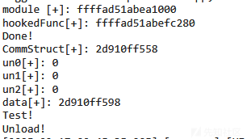

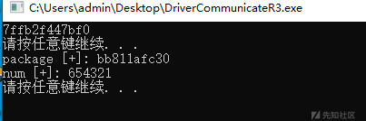
