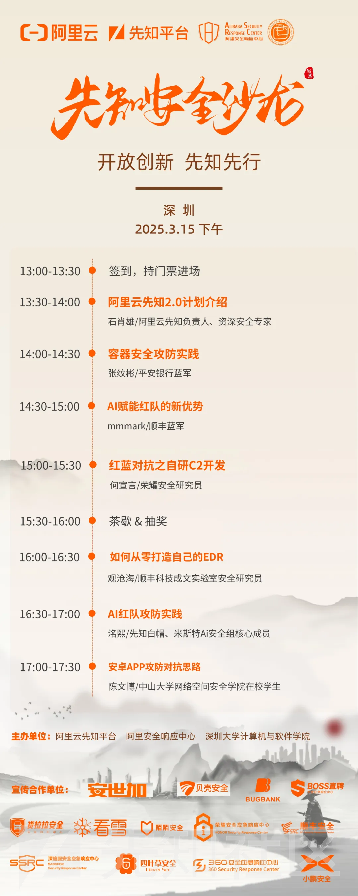

# 先知安全沙龙 - 深圳站 3月15日开启！-先知社区

> **来源**: https://xz.aliyun.com/news/17213  
> **文章ID**: 17213

---

**阿里云先知灯塔系列城市安全沙龙第八场-深圳站**将于3月15日在深圳大学粤海校区南区致腾楼一楼报告厅举办。

本次沙龙由**阿里云先知、阿里安全响应中心、深圳大学计算机与软件学院**联合举办，邀请深圳10余所高校网络安全相关专业师生和多名网络安全行业大咖、社会精英白帽子，旨在为学生和网络安全从业者提供面对面交流的机会，是一次纯粹的技术交流和分享！  

除了干货满满的议题分享，我们还为每一位到场的、热爱安全技术的同学和白帽们准备了一份惊喜好礼。**以礼会友，共享技术盛宴，**在思维碰撞与灵感交流中深化对网络安全的理解与实践。期待大家在沙龙轻松愉快的氛围中收获知识、友好交流！如有意向参加可加入钉钉群了解活动详情，“先知安全沙龙 深圳场”群的钉钉群号：96015025645。

活动报名表链接：https://survey.taobao.com/apps/zhiliao/v0vBsppAu

**外校人员进入深圳大学需持有身份证原件，并提前填写学校入校报备申请，具体申请流程在钉钉群内（群号： 96015025645）发布，活动当天请务必携带好身份证前往。**为保障学生出行安全，报名人数较多的学校我们可以**安排巴士往返免费接送**，具体接驳地址会在钉钉群内发布，欢迎同学们组队报名。3月15日，我们深圳见～
