# 渗透测试利器 FalconToolbox开发从0到1(含各种问题解决过程)-先知社区

> **来源**: https://xz.aliyun.com/news/17214  
> **文章ID**: 17214

---

# 渗透测试利器 FalconToolbox

## 前言

最近为什么想开发一个这个工具呢？原因就是看了一下渗透，发现其实目前很多工具的数据处理起来可能很麻烦，需要不同的 python 脚本去处理我们工具的数据，而且每次打开工具也非常的复杂，想着能不能自己简单开发一个工具呢，集成一些功能和一些工具

目前还在初期

## 功能结构

```
FalconToolbox/
│── myapp/
│   ├── cache/           # 可能用于存储缓存数据
│   ├── routes/          # Flask 路由文件
│   ├── templates/       # HTML 模板文件
│   ├── utils/           # 工具函数
│── input.txt            # 输入数据文件
│── result.txt           # 结果输出文件
│── run.py               # Flask 入口文件

```

首先初步的想法是，因为需要写不同的功能，但是不想把功能都写到一个文件里面，这样不好维护代码，然后路由是路由，功能是功能，到时候看路由就可以看出我们的结构了

## 集成数据处理

我们一般得到的数据都是需要处理的，比如加入 https 或者 http，或者删除 http，https 这些

这些逻辑实现其实是非常简单的

开始的设想是获取我们的数据，然后一行一行的分开，然后加上再输出

首先是我们的逻辑

```
import re

def add_http(url):
    """如果 URL 没有 http:// 或 https://，则添加 http://"""
    if not url.startswith(("http://", "https://")):
        return "http://" + url
    return url

def remove_http(url):
    """去掉 URL 的 http:// 或 https://"""
    return re.sub(r"^https?://", "", url)

```

其实这个是不难实现的，然后就是获取我们的输入了

**run.py**

```
from flask import Flask, render_template
from myapp.routes.url_tools import url_bp

app = Flask(__name__, template_folder="myapp/templates")

# 注册蓝图
app.register_blueprint(url_bp)

@app.route("/")
def home():
    return render_template("index.html")

if __name__ == "__main__":
    app.run(debug=True)

```

处理 URL 的逻辑

```
from flask import Blueprint, request, render_template
from myapp.utils.url_utils import add_http, remove_http

url_bp = Blueprint("url_tools", __name__)

@url_bp.route("/tools", methods=["GET", "POST"])
def url_tools():
    selected_tool = request.form.get("tool", "")  # 选择的功能
    original = request.form.get("url", "")        # 输入的 URL
    modified = ""

    # 处理 URL
    if request.method == "POST" and original:
        if selected_tool == "add_http":
            modified = add_http(original)
        elif selected_tool == "remove_http":
            modified = remove_http(original)

    return render_template("index.html", selected_tool=selected_tool, original=original, modified=modified)

```

这里尽量记录当时一步一步的过程，因为有些忘了，代码可能不一致

然后是我们的模板

```
<!DOCTYPE html>
<html lang="zh">
<head>
    <meta charset="UTF-8">
    <meta name="viewport" content="width=device-width, initial-scale=1.0">
    <title>URL 处理工具</title>
</head>
<body>
    <h2>URL 处理工具</h2>
    
    <form action="/url/add_http" method="post">
        <input type="text" name="url" placeholder="请输入 URL" required>
        <button type="submit">添加 http</button>
    </form>
    <form action="/url/remove_http" method="post">
        <input type="text" name="url" placeholder="请输入 URL" required>
        <button type="submit">去除 http</button>
    </form>
    
        <p>原始 URL: {{ original }}</p>
        <p>处理后 URL: {{ modified }}</p>
    
</body>
</html>

```

### 解决模板问题

出师不利

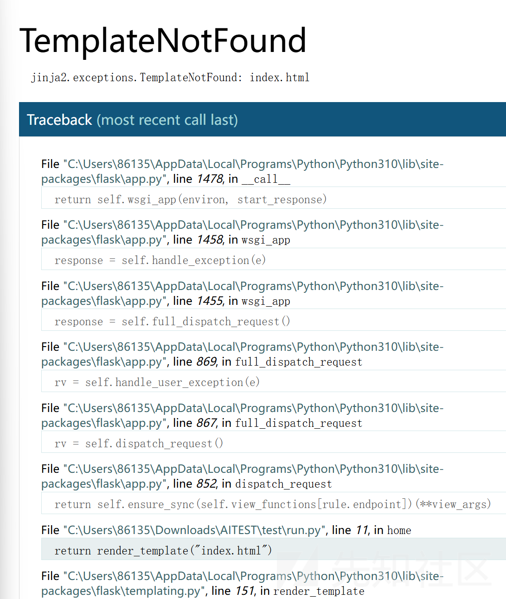

不过好在这个问题非常好解决

直接指定模板目录

```
from flask import Flask, render_template
from myapp.routes.url_tools import url_bp

app = Flask(__name__, template_folder="myapp/templates")  # ✅ 显式指定模板目录

app.register_blueprint(url_bp, url_prefix="/url")

@app.route("/")
def home():
    return render_template("index.html")  # ✅ 确保可以找到模板

if __name__ == "__main__":
    app.run(debug=True)

```

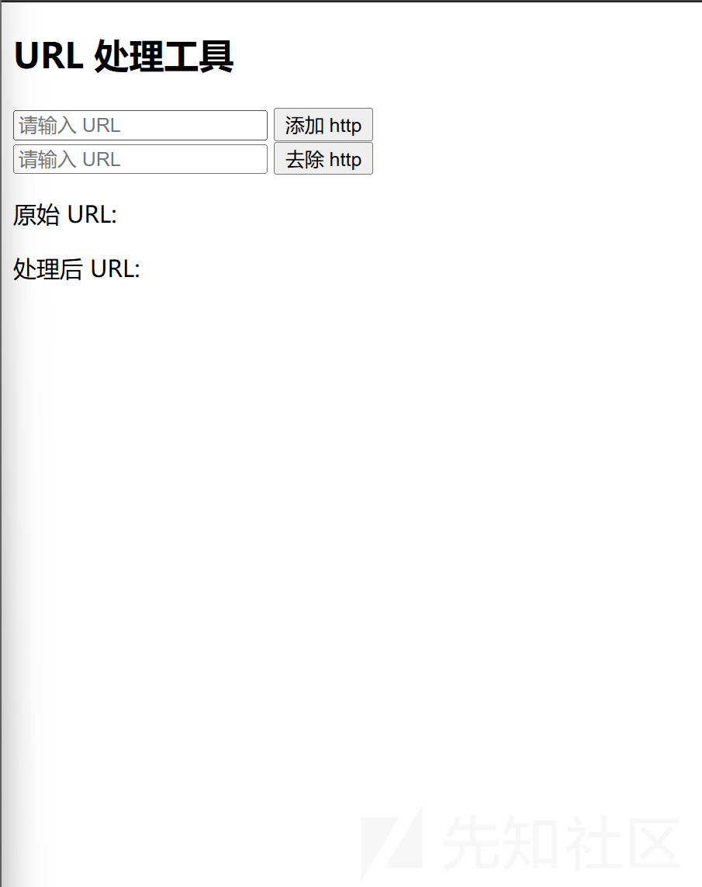

不得不说粗糙了一些

目前问题如下

### 解决批量处理 url 和数据框问题

数据框我感觉构造太丑了

然后就分开写代码了  
作为选择的主逻辑

```
<!DOCTYPE html>
<html lang="zh">
<head>
    <meta charset="UTF-8">
    <meta name="viewport" content="width=device-width, initial-scale=1.0">
    <title>工具箱</title>
</head>
<body>
    <nav>
        <a href="/">首页</a> |
        <a href="/url/add_http">添加 HTTP</a> |
        <a href="/url/remove_http">去除 HTTP</a>
    </nav>
    <hr>
    
</body>
</html>

```

每个方法单独有我们的逻辑  
add

```


添加 HTTP


    <h2>添加 HTTP</h2>
    <form action="/url/add_http" method="post">
        <div style="display: flex; border: 1px solid black; padding: 10px; width: 600px;">
            <div style="width: 50%;">
                <h3>输入</h3>
                <input type="text" name="url" value="{{ original }}" style="width: 90%;" required>
                <button type="submit">提交</button>
            </div>
            <div style="width: 50%; border-left: 1px solid black; padding-left: 10px;">
                <h3>处理结果</h3>
                <p>{{ modified }}</p>
            </div>
        </div>
    </form>


```

remove

```


去除 HTTP


    <h2>去除 HTTP</h2>
    <form action="/url/remove_http" method="post">
        <div style="display: flex; border: 1px solid black; padding: 10px; width: 600px;">
            <div style="width: 50%;">
                <h3>输入</h3>
                <input type="text" name="url" value="{{ original }}" style="width: 90%;" required>
                <button type="submit">提交</button>
            </div>
            <div style="width: 50%; border-left: 1px solid black; padding-left: 10px;">
                <h3>处理结果</h3>
                <p>{{ modified }}</p>
            </div>
        </div>
    </form>


```

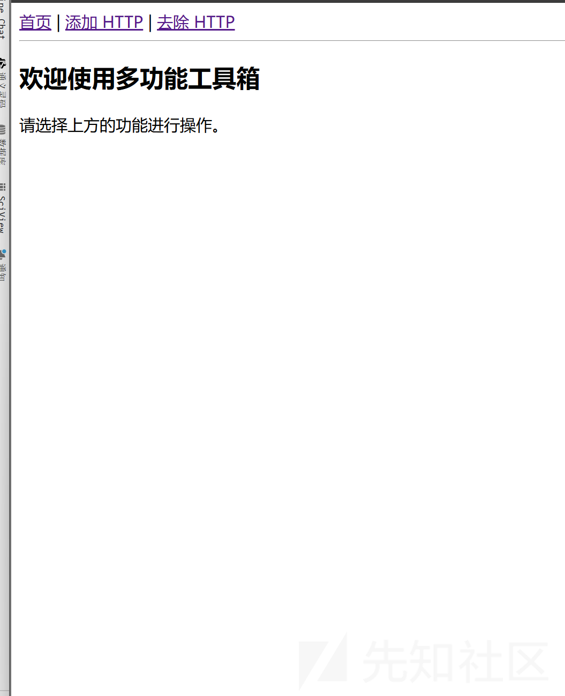

然后再次修改一下我们的处理多请求功能

```
from flask import Blueprint, request, render_template
from ..utils.url_utils import add_http_or_https, remove_http_https

url_bp = Blueprint("url_tools", __name__)

@url_bp.route("/add_http", methods=["GET", "POST"])
def add_http_route():
    original = request.form.get("url", "")
    scheme = request.form.get("scheme", "http")  # 选择 http 或 https，默认 http
    modified = "
".join([add_http_or_https(url.strip(), scheme) for url in original.split("
") if url.strip()]) if original else ""
    return render_template("add_http.html", original=original, modified=modified, scheme=scheme)

@url_bp.route("/remove_http", methods=["GET", "POST"])
def remove_http_route():
    original = request.form.get("url", "")
    modified = "
".join([remove_http_https(url.strip()) for url in original.split("
") if url.strip()]) if original else ""
    return render_template("remove_http.html", original=original, modified=modified)

```

```
def add_http_or_https(url, scheme="http"):
    """根据用户选择添加 http 或 https"""
    if not url.startswith("http://") and not url.startswith("https://"):
        return f"{scheme}://{url}"
    return url

def remove_http_https(url):
    """去除 http:// 或 https://"""
    return url.replace("http://", "").replace("https://", "")

```

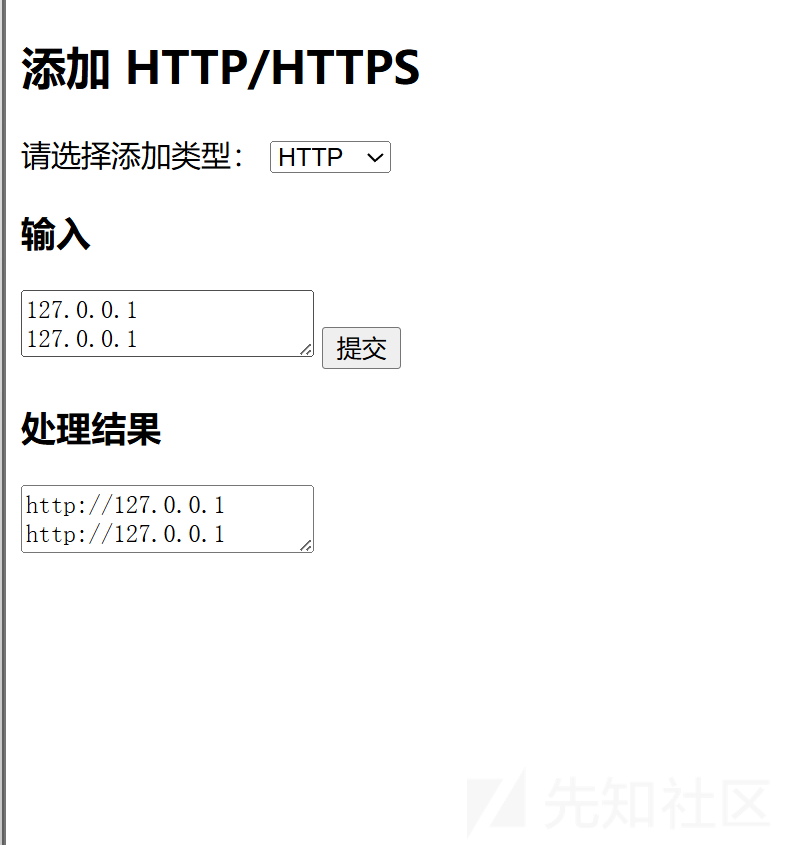

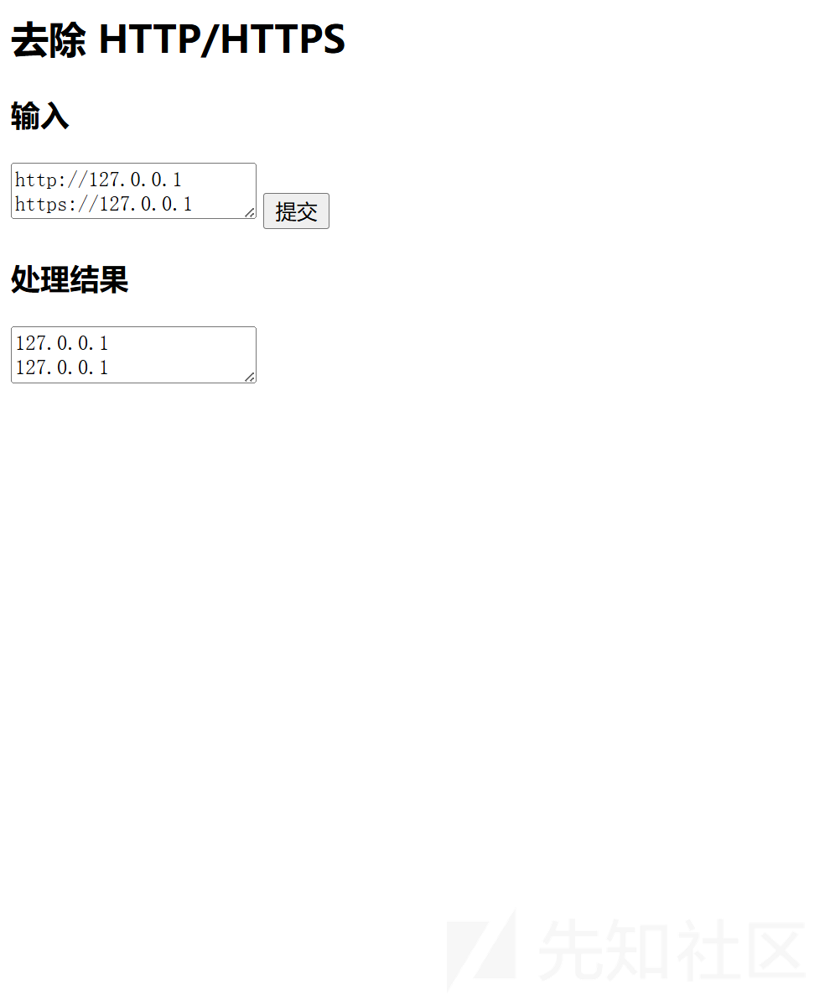

发现 bug 就是我跳到其他页面，我当前页面的内容就没有了

这样是非常难受的，不能记录数据，所以思考了一下，一开始想着使用缓存的，但是算了，直接简单点，写文件读取文件

### 解决缓存问题

修改路由

```
@url_bp.route("/add_http", methods=["GET", "POST"])
def add_http_route():
    if request.method == "POST":
        original = request.form.get("url", "")
        scheme = request.form.get("scheme", "http")

        # 处理数据
        modified = "
".join(
            [add_http_or_https(url.strip(), scheme) for url in original.split("
") if url.strip()]) if original else ""

        # 保存输入和输出到缓存
        save_to_cache("add_http.json", {"original": original, "modified": modified, "scheme": scheme})

        return render_template("add_http.html", original=original, modified=modified, scheme=scheme)

    # 加载缓存数据
    cached_data = load_from_cache("add_http.json")
    original = cached_data.get("original", "")
    modified = cached_data.get("modified", "")
    scheme = cached_data.get("scheme", "http")

    return render_template("add_http.html", original=original, modified=modified, scheme=scheme)


@url_bp.route("/remove_http", methods=["GET", "POST"])
def remove_http_route():
    if request.method == "POST":
        original = request.form.get("url", "")

        # 处理数据
        modified = "
".join(
            [remove_http_https(url.strip()) for url in original.split("
") if url.strip()]) if original else ""

        # 保存输入和输出到缓存
        save_to_cache("remove_http.json", {"original": original, "modified": modified})

        return render_template("remove_http.html", original=original, modified=modified)

    # 加载缓存数据
    cached_data = load_from_cache("remove_http.json")
    original = cached_data.get("original", "")
    modified = cached_data.get("modified", "")

    return render_template("remove_http.html", original=original, modified=modified)
```

utils

```
def add_http_or_https(url, scheme="http"):
    """添加 HTTP 或 HTTPS 前缀"""
    if not url.startswith("http://") and not url.startswith("https://"):
        return f"{scheme}://{url}"
    return url

def remove_http_https(url):
    """去除 HTTP 或 HTTPS 前缀"""
    if url.startswith("http://"):
        return url[7:]
    elif url.startswith("https://"):
        return url[8:]
    return url

```

```


添加 HTTP/HTTPS


    <h2>添加 HTTP/HTTPS</h2>
    <form action="/url/add_http" method="post">
        <label>请选择添加类型：</label>
        <select name="scheme">
            <option value="http" selected>HTTP</option>
            <option value="https" selected>HTTPS</option>
        </select>
        <div class="box">
            <div>
                <h3>输入</h3>
                <textarea name="url" placeholder="输入多个 URL 或 IP 地址，每行一个" required>{{ original }}</textarea>
                <button type="submit">提交</button>
            </div>
            <div>
                <h3>处理结果</h3>
                <textarea readonly>{{ modified }}</textarea>
            </div>
        </div>
    </form>


```

```


去除 HTTP/HTTPS


    <h2>去除 HTTP/HTTPS</h2>
    <form action="/url/remove_http" method="post">
        <div class="box">
            <div>
                <h3>输入</h3>
                <textarea name="url" placeholder="输入多个 URL 或 IP 地址，每行一个" required>{{ original }}</textarea>
                <button type="submit">提交</button>
            </div>
            <div>
                <h3>处理结果</h3>
                <textarea readonly>{{ modified }}</textarea>
            </div>
        </div>
    </form>


```

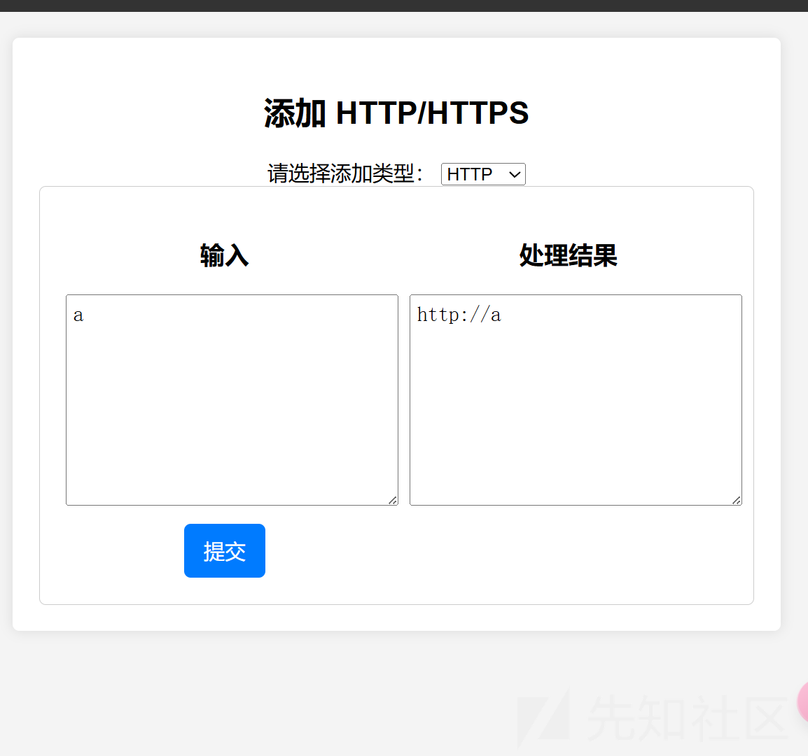

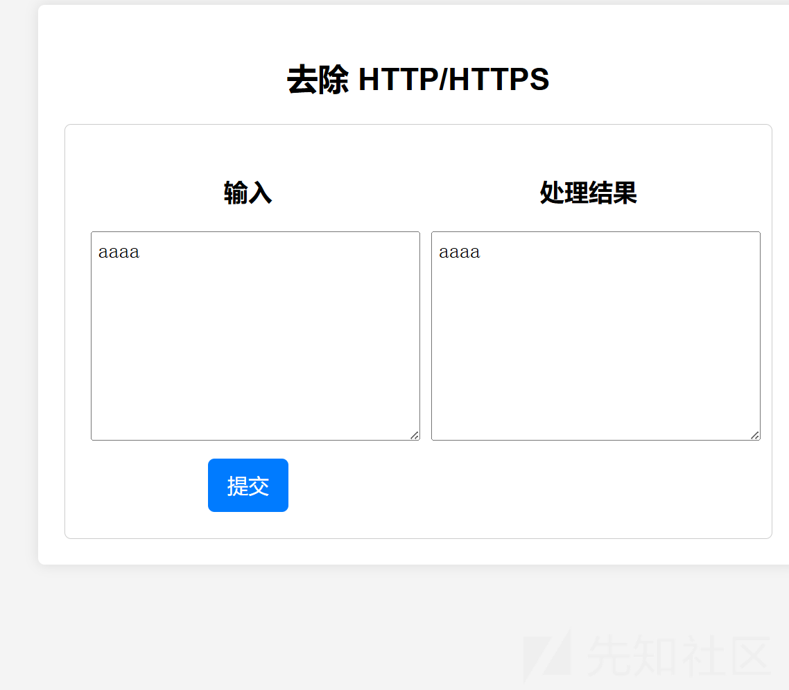

优化了界面，并且增加了保存我们缓存的功能

## 集成 ICP 一键查询功能(企业渗透)

我们一般企业渗透的时候都是根据公司的名称来查询一些别的信息，这里直接集成<https://github.com/A10ha/ICPSearch>

我们首先看到使用说明

通过域名、URL 或者企业名（全称）查找 ICP 备案信息。你可以输入指定的域名或者企业名（全程），然后获取相应的备案信息。

```
ICPSearch.exe -d yourdomain.com
```

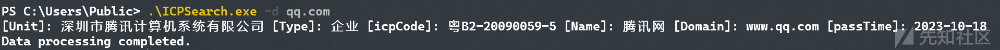

批量处理多个域名、URL 和企业名（全称）。你可以在文本文件中列出需要查找的多个域名或者企业名（全称），然后通过该工具一次性处理这些域名和企业名（全称），并获取相应的备案信息。

```
ICPSearch.exe -f domains.txt
```

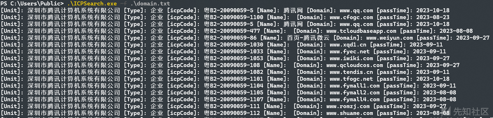  
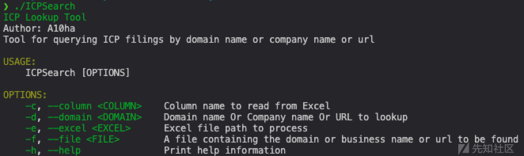

其实集成思路就已经出来了

首先是寻找到我们的 exe 文件，然后因为这个工具默认会生成一个文件，所以我们读取这个文件的内容就好了

首先是逻辑处理部分

```
import subprocess
import os

def run_icp_search(input_data):
    # 将用户输入的数据保存到临时文件
    input_file = 'input.txt'
    with open(input_file, 'w') as f:
        f.write(input_data)

    # 定义 ICPSearch.exe 的路径
    exe_path = r'F:\gj\ICP一键查询\ICPSearch.exe'

    # 确保可执行文件存在
    if not os.path.exists(exe_path):
        return "ICPSearch.exe 不存在，请检查路径。"

    # 构建命令
    cmd = [exe_path, '-f', input_file]

    try:
        # 调用 ICPSearch.exe，并捕获输出
        result = subprocess.run(cmd, capture_output=True, text=True, check=True)
        output_data = result.stdout
    except subprocess.CalledProcessError as e:
        output_data = f"执行出错：{e}"

    # 返回输出结果
    return output_data

```

然后是路由部分

```
from flask import Blueprint, request, render_template
from myapp.utils.icp_search import run_icp_search

url_bp = Blueprint("url_tools", __name__)

@url_bp.route("/icp_search", methods=["GET", "POST"])
def icp_search():
    if request.method == "POST":
        # 获取用户输入的数据
        input_data = request.form.get("input_data", "")

        # 调用 ICPSearch 工具
        output_data = run_icp_search(input_data)

        # 渲染模板并显示结果
        return render_template("icp_search.html", input_data=input_data, output_data=output_data)

    # GET 请求时仅渲染输入表单
    return render_template("icp_search.html")
****
```

模板文件

```


ICP 备案查询


    <h2>ICP 备案查询</h2>
    <form action="{{ url_for('url_tools.icp_search') }}" method="post">
        <div class="box">
            <div>
                <h3>输入</h3>
                <textarea name="input_data" placeholder="输入多个域名或企业名，每行一个" required>{{ input_data }}</textarea>
                <button type="submit">提交</button>
            </div>
            
            <div>
                <h3>查询结果</h3>
                <textarea readonly>{{ output_data }}</textarea>
            </div>
            
        </div>
    </form>


```

我们看看效果

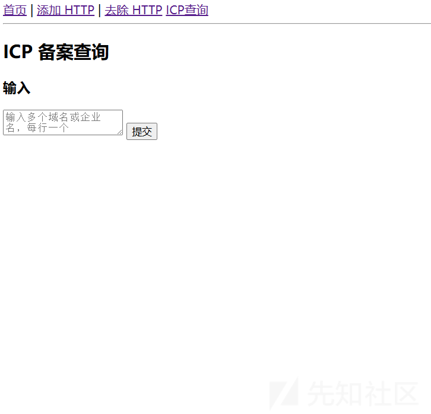

以华为为例子

然后发现老是查询不到数据

### 查询数据排查

首先我想着可能是数据太大了，然后写入文件的时间不够，想着 sleep 一下，但是结果还是一样的

```
import subprocess
import os
import time


def run_icp_search(input_data):
    # 将用户输入的数据保存到临时文件
    input_file = 'input.txt'
    with open(input_file, 'w') as f:
        f.write(input_data)

    # 定义 ICPSearch.exe 的路径
    exe_path = r'F:\gj\ICP一键查询\ICP.exe'
    if not os.path.exists(exe_path):
        return "ICPSearch.exe 不存在，请检查路径。"
    try:
        # 调用 ICPSearch.exe，并捕获输出
        cmd = rf'F:\gj\ICP一键查询\ICP.exe -f input.txt'  # 使用原始字符串防止路径问题
        try:
            # 执行命令并捕获输出
            result = subprocess.check_output(cmd, shell=True, stderr=subprocess.STDOUT, encoding='utf-8')
            sleep(2)
            return result
        except subprocess.CalledProcessError as e:
            # 处理错误输出
            return f"执行失败: {e.output}"
    except subprocess.CalledProcessError as e:
        output_data = f"执行出错：{e}"
    return output_data
我是指这里的写入问题
```

然后对比了很久很久

发现 python 脚本运行的文件大小和自己直接打字写进去的文件大小不一样

我的怀疑变成了写入文件了，估计应该是需要编码吧，然后加入了一个 utf-8

然后一切都好起来了

卡了半天就是这个问题

### 数据处理问题

我们看到我们得到的数据

```
[Unit]: 华为技术有限公司 [Type]: 企业 [icpCode]: 粤A2-20044005号-283 [Domain]: www.openinula.net [passTime]: 2024-08-27
[Unit]: 华为技术有限公司 [Type]: 企业 [icpCode]: 粤A2-20044005号-253 [Domain]: 魔乐社区 [passTime]: 2024-04-19
[Unit]: 华为技术有限公司 [Type]: 企业 [icpCode]: 粤A2-20044005号-141 [Domain]: www.huaweiirad.com [passTime]: 2023-06-09
[Unit]: 华为技术有限公司 [Type]: 企业 [icpCode]: 粤A2-20044005号-136 [Domain]: www.bescloud.com.cn [passTime]: 2022-12-21
[Unit]: 华为技术有限公司 [Type]: 企业 [icpCode]: 粤A2-20044005号-140 [Domain]: www.bescloud.cn [passTime]: 2022-12-21
[Unit]: 华为技术有限公司 [Type]: 企业 [icpCode]: 粤A2-20044005号-137 [Domain]: www.gneec3.cn [passTime]: 2022-12-21
[Unit]: 华为技术有限公司 [Type]: 企业 [icpCode]: 粤A2-20044005号-139 [Domain]: www.gneec5.cn [passTime]: 2023-11-06
[Unit]: 华为技术有限公司 [Type]: 企业 [icpCode]: 粤A2-20044005号-138 [Domain]: www.gneec4.cn [passTime]: 2022-12-21
[Unit]: 华为技术有限公司 [Type]: 企业 [icpCode]: 粤A2-20044005号-133 [Domain]: www.appcubecloud.com.cn [passTime]: 2022-12-07
[Unit]: 华为技术有限公司 [Type]: 企业 [icpCode]: 粤A2-20044005号-134 [Domain]: www.besclouds.com.cn [passTime]: 2023-10-23
[Unit]: 华为技术有限公司 [Type]: 企业 [icpCode]: 粤A2-20044005号-131 [Domain]: www.besclouds.cn [passTime]: 2022-12-07
[Unit]: 华为技术有限公司 [Type]: 企业 [icpCode]: 粤A2-20044005号-135 [Domain]: www.gtscsm.com [passTime]: 2022-12-07
[Unit]: 华为技术有限公司 [Type]: 企业 [icpCode]: 粤A2-20044005号-132 [Domain]: www.appcubecloud.cn [passTime]: 2023-11-10
[Unit]: 华为技术有限公司 [Type]: 企业 [icpCode]: 粤A2-20044005号-129 [Domain]: www.vrbtcloud.cn [passTime]: 2023-11-10
[Unit]: 华为技术有限公司 [Type]: 企业 [icpCode]: 粤A2-20044005号-128 [Domain]: www.aicccloud.com [passTime]: 2022-11-03
[Unit]: 华为技术有限公司 [Type]: 企业 [icpCode]: 粤A2-20044005号-126 [Domain]: www.apifabric.com.cn [passTime]: 2023-10-23
[Unit]: 华为技术有限公司 [Type]: 企业 [icpCode]: 粤A2-20044005号-130 [Domain]: www.apifabric.cn [passTime]: 2022-11-03
[Unit]: 华为技术有限公司 [Type]: 企业 [icpCode]: 粤A2-20044005号-127 [Domain]: www.hwad.net [passTime]: 2022-11-03
[Unit]: 华为技术有限公司 [Type]: 企业 [icpCode]: 粤A2-20044005号-124 [Domain]: www.appcubecloud.com [passTime]: 2023-11-06
[Unit]: 华为技术有限公司 [Type]: 企业 [icpCode]: 粤A2-20044005号-122 [Domain]: www.huaweiita.com [passTime]: 2023-11-10
[Unit]: 华为技术有限公司 [Type]: 企业 [icpCode]: 粤A2-20044005号-121 [Domain]: www.huaweiita.cn [passTime]: 2023-11-06
[Unit]: 华为技术有限公司 [Type]: 企业 [icpCode]: 粤A2-20044005号-123 [Domain]: www.bcdcloud.cn [passTime]: 2022-10-24
[Unit]: 华为技术有限公司 [Type]: 企业 [icpCode]: 粤A2-20044005号-125 [Domain]: www.bescloud.com [passTime]: 2023-10-23
[Unit]: 华为技术有限公司 [Type]: 企业 [icpCode]: 粤A2-20044005号-119 [Domain]: www.icvcs.cn [passTime]: 2022-10-12
[Unit]: 华为技术有限公司 [Type]: 企业 [icpCode]: 粤A2-20044005号-114 [Domain]: www.huaweirtc.cn [passTime]: 2022-09-27
[Unit]: 华为技术有限公司 [Type]: 企业 [icpCode]: 粤A2-20044005号-120 [Domain]: www.arkui-x.net [passTime]: 2022-10-12
[Unit]: 华为技术有限公司 [Type]: 企业 [icpCode]: 粤A2-20044005号-118 [Domain]: www.icvcs.com [passTime]: 2022-10-12
[Unit]: 华为技术有限公司 [Type]: 企业 [icpCode]: 粤A2-20044005号-117 [Domain]: www.attendee.cn [passTime]: 2023-11-06
[Unit]: 华为技术有限公司 [Type]: 企业 [icpCode]: 粤A2-20044005号-113 [Domain]: www.shanhaitujian.com [passTime]: 2022-09-13
[Unit]: 华为技术有限公司 [Type]: 企业 [icpCode]: 粤A2-20044005号-116 [Domain]: www.arkui-x.cn [passTime]: 2023-11-10
[Unit]: 华为技术有限公司 [Type]: 企业 [icpCode]: 粤A2-20044005号-115 [Domain]: www.huaweirtc.com [passTime]: 2023-11-06
[Unit]: 华为技术有限公司 [Type]: 企业 [icpCode]: 粤A2-20044005号-110 [Domain]: www.hikunpeng.cn [passTime]: 2023-10-23
[Unit]: 华为技术有限公司 [Type]: 企业 [icpCode]: 粤A2-20044005号-111 [Domain]: www.hikunpeng.com.cn [passTime]: 2023-11-10
[Unit]: 华为技术有限公司 [Type]: 企业 [icpCode]: 粤A2-20044005号-112 [Domain]: www.hikunpeng.net [passTime]: 2023-11-10
[Unit]: 华为技术有限公司 [Type]: 企业 [icpCode]: 粤A2-20044005号-109 [Domain]: www.shanhaitujian.net [passTime]: 2022-08-10
[Unit]: 华为技术有限公司 [Type]: 企业 [icpCode]: 粤A2-20044005号-106 [Domain]: www.hiascend.net [passTime]: 2023-11-06
[Unit]: 华为技术有限公司 [Type]: 企业 [icpCode]: 粤A2-20044005号-107 [Domain]: www.hiascend.com [passTime]: 2022-07-01
[Unit]: 华为技术有限公司 [Type]: 企业 [icpCode]: 粤A2-20044005号-105 [Domain]: www.hiascend.cn [passTime]: 2022-06-07
[Unit]: 华为技术有限公司 [Type]: 企业 [icpCode]: 粤A2-20044005号-102 [Domain]: www.imcapptest.com [passTime]: 2022-07-01
[Unit]: 华为技术有限公司 [Type]: 企业 [icpCode]: 粤A2-20044005号-99 [Domain]: www.msg5.cn [passTime]: 2022-07-01
[Unit]: 华为技术有限公司 [Type]: 企业 [icpCode]: 粤A2-20044005号-86 [Domain]: www.huaweicloudapis.cn [passTime]: 2023-11-06
[Unit]: 华为技术有限公司 [Type]: 企业 [icpCode]: 粤A2-20044005号-73 [Domain]: www.huaweiief.cn [passTime]: 2019-12-04
[Unit]: 华为技术有限公司 [Type]: 企业 [icpCode]: 粤A2-20044005号-70 [Domain]: www.huaweicloud.cn [passTime]: 2022-07-01
[Unit]: 华为技术有限公司 [Type]: 企业 [icpCode]: 粤A2-20044005号-30 [Domain]: www.huawei.com.cn [passTime]: 2022-11-15
[Unit]: 华为技术有限公司 [Type]: 企业 [icpCode]: 粤A2-20044005号-82 [Domain]: www.cdnhwc7.com [passTime]: 2023-11-06
[Unit]: 华为技术有限公司 [Type]: 企业 [icpCode]: 粤A2-20044005号-19 [Domain]: www.hwht.cn [passTime]: 2022-07-01
[Unit]: 华为技术有限公司 [Type]: 企业 [icpCode]: 粤A2-20044005号-58 [Domain]: www.gneec5.com [passTime]: 2022-07-01
[Unit]: 华为技术有限公司 [Type]: 企业 [icpCode]: 粤A2-20044005号-52 [Domain]: www.mindspore.cn [passTime]: 2023-11-10
[Unit]: 华为技术有限公司 [Type]: 企业 [icpCode]: 粤A2-20044005号-42 [Domain]: www.hwocloud.com [passTime]: 2023-11-06
[Unit]: 华为技术有限公司 [Type]: 企业 [icpCode]: 粤A2-20044005号-81 [Domain]: www.cdnhwc6.com [passTime]: 2023-11-10
[Unit]: 华为技术有限公司 [Type]: 企业 [icpCode]: 粤A2-20044005号-76 [Domain]: www.livehwc3.cn [passTime]: 2023-11-10
[Unit]: 华为技术有限公司 [Type]: 企业 [icpCode]: 粤A2-20044005号-57 [Domain]: www.gneec4.com [passTime]: 2023-11-06
[Unit]: 华为技术有限公司 [Type]: 企业 [icpCode]: 粤A2-20044005号-53 [Domain]: www.gneec.com [passTime]: 2022-07-01
[Unit]: 华为技术有限公司 [Type]: 企业 [icpCode]: 粤A2-20044005号-24 [Domain]: www.hisilicon.com.cn [passTime]: 2018-06-08
[Unit]: 华为技术有限公司 [Type]: 企业 [icpCode]: 粤A2-20044005号-7 [Domain]: www.hisilicon.com [passTime]: 2023-10-23
[Unit]: 华为技术有限公司 [Type]: 企业 [icpCode]: 粤A2-20044005号-83 [Domain]: www.cdnhwc5.com [passTime]: 2022-07-01
[Unit]: 华为技术有限公司 [Type]: 企业 [icpCode]: 粤A2-20044005号-72 [Domain]: www.huaweisre.cn [passTime]: 2022-07-01
[Unit]: 华为技术有限公司 [Type]: 企业 [icpCode]: 粤A2-20044005号-23 [Domain]: www.huaweils.com [passTime]: 2023-11-10
[Unit]: 华为技术有限公司 [Type]: 企业 [icpCode]: 粤A2-20044005号-68 [Domain]: www.cdnhwc5.cn [passTime]: 2023-11-10
[Unit]: 华为技术有限公司 [Type]: 企业 [icpCode]: 粤A2-20044005号-40 [Domain]: www.hwlchain.com [passTime]: 2019-01-18
[Unit]: 华为技术有限公司 [Type]: 企业 [icpCode]: 粤A2-20044005号-31 [Domain]: www.huaweistatic.com [passTime]: 2022-11-29
[Unit]: 华为技术有限公司 [Type]: 企业 [icpCode]: 粤A2-20044005号-28 [Domain]: www.abhouses.com [passTime]: 2018-09-07
[Unit]: 华为技术有限公司 [Type]: 企业 [icpCode]: 粤A2-20044005号-101 [Domain]: www.huawei.cn [passTime]: 2023-11-21
[Unit]: 华为技术有限公司 [Type]: 企业 [icpCode]: 粤A2-20044005号-98 [Domain]: www.bishengcompiler.cn [passTime]: 2021-09-30
[Unit]: 华为技术有限公司 [Type]: 企业 [icpCode]: 粤A2-20044005号-97 [Domain]: www.gneec7.com [passTime]: 2022-07-01
[Unit]: 华为技术有限公司 [Type]: 企业 [icpCode]: 粤A2-20044005号-89 [Domain]: www.cdnhwc7.cn [passTime]: 2022-07-01
[Unit]: 华为技术有限公司 [Type]: 企业 [icpCode]: 粤A2-20044005号-88 [Domain]: www.dcia.org.cn [passTime]: 2023-11-06
[Unit]: 华为技术有限公司 [Type]: 企业 [icpCode]: 粤A2-20044005号-85 [Domain]: www.huaweisafehub.cn [passTime]: 2022-07-01
[Unit]: 华为技术有限公司 [Type]: 企业 [icpCode]: 粤A2-20044005号-71 [Domain]: www.hc-cdn.cn [passTime]: 2023-11-06
[Unit]: 华为技术有限公司 [Type]: 企业 [icpCode]: 粤A2-20044005号-49 [Domain]: www.devui.design [passTime]: 2019-07-01
[Unit]: 华为技术有限公司 [Type]: 企业 [icpCode]: 粤A2-20044005号-47 [Domain]: www.saasops.tech [passTime]: 2022-07-01
[Unit]: 华为技术有限公司 [Type]: 企业 [icpCode]: 粤A2-20044005号-61 [Domain]: www.hwccpc.cn [passTime]: 2022-07-01
[Unit]: 华为技术有限公司 [Type]: 企业 [icpCode]: 粤A2-20044005号-38 [Domain]: www.hwccpc.com [passTime]: 2022-07-01
[Unit]: 华为技术有限公司 [Type]: 企业 [icpCode]: 粤A2-20044005号-26 [Domain]: www.huaweiacad.com [passTime]: 2018-09-07
[Unit]: 华为技术有限公司 [Type]: 企业 [icpCode]: 粤A2-20044005号-22 [Domain]: www.hwtrip.com [passTime]: 2023-11-06
[Unit]: 华为技术有限公司 [Type]: 企业 [icpCode]: 粤A2-20044005号-84 [Domain]: www.huaweisafedns.cn [passTime]: 2020-07-02
[Unit]: 华为技术有限公司 [Type]: 企业 [icpCode]: 粤A2-20044005号-74 [Domain]: www.183.220.4.21 [passTime]: 2023-11-06
[Unit]: 华为技术有限公司 [Type]: 企业 [icpCode]: 粤A2-20044005号-32 [Domain]: www.huaweidevice.com [passTime]: 2023-11-10
[Unit]: 华为技术有限公司 [Type]: 企业 [icpCode]: 粤A2-20044005号-62 [Domain]: www.teleows.com [passTime]: 2023-11-21
[Unit]: 华为技术有限公司 [Type]: 企业 [icpCode]: 粤A2-20044005号-60 [Domain]: www.huaweiief.com [passTime]: 2023-11-21
[Unit]: 华为技术有限公司 [Type]: 企业 [icpCode]: 粤A2-20044005号-51 [Domain]: www.183.220.4.146 [passTime]: 2023-10-23
[Unit]: 华为技术有限公司 [Type]: 企业 [icpCode]: 粤A2-20044005号-100 [Domain]: www.bisheng.cn [passTime]: 2022-07-01
[Unit]: 华为技术有限公司 [Type]: 企业 [icpCode]: 粤A2-20044005号-96 [Domain]: www.imc-oneaccess.cn [passTime]: 2021-07-16
[Unit]: 华为技术有限公司 [Type]: 企业 [icpCode]: 粤A2-20044005号-92 [Domain]: www.myhwcloudlive.com [passTime]: 2023-11-10
[Unit]: 华为技术有限公司 [Type]: 企业 [icpCode]: 粤A2-20044005号-93 [Domain]: www.huaweicloudlive.com [passTime]: 2023-11-10
[Unit]: 华为技术有限公司 [Type]: 企业 [icpCode]: 粤A2-20044005号-94 [Domain]: www.hwcloudvis.com [passTime]: 2022-07-01
[Unit]: 华为技术有限公司 [Type]: 企业 [icpCode]: 粤A2-20044005号-91 [Domain]: www.hwcloudvis.cn [passTime]: 2022-07-01
[Unit]: 华为技术有限公司 [Type]: 企业 [icpCode]: 粤A2-20044005号-90 [Domain]: www.cdnhwc6.cn [passTime]: 2023-10-23
[Unit]: 华为技术有限公司 [Type]: 企业 [icpCode]: 粤A2-20044005号-78 [Domain]: www.myhwcdn.com [passTime]: 2022-07-01
[Unit]: 华为技术有限公司 [Type]: 企业 [icpCode]: 粤A2-20044005号-64 [Domain]: www.120.86.117.209 [passTime]: 2022-07-01
[Unit]: 华为技术有限公司 [Type]: 企业 [icpCode]: 粤A2-20044005号-56 [Domain]: www.gneec3.com [passTime]: 2023-11-10
[Unit]: 华为技术有限公司 [Type]: 企业 [icpCode]: 粤A2-20044005号-39 [Domain]: www.hwcloudlive.com [passTime]: 2022-07-01
[Unit]: 华为技术有限公司 [Type]: 企业 [icpCode]: 粤A2-20044005号-67 [Domain]: www.cdnhwc2.cn [passTime]: 2023-11-06
[Unit]: 华为技术有限公司 [Type]: 企业 [icpCode]: 粤A2-20044005号-55 [Domain]: www.gneec.com.cn [passTime]: 2022-07-01
[Unit]: 华为技术有限公司 [Type]: 企业 [icpCode]: 粤A2-20044005号-43 [Domain]: www.hiclc.com [passTime]: 2022-09-01
[Unit]: 华为技术有限公司 [Type]: 企业 [icpCode]: 粤A2-20044005号-77 [Domain]: www.myhwcdn.cn [passTime]: 2022-07-01
[Unit]: 华为技术有限公司 [Type]: 企业 [icpCode]: 粤A2-20044005号-63 [Domain]: www.owsgo.com [passTime]: 2022-07-01
[Unit]: 华为技术有限公司 [Type]: 企业 [icpCode]: 粤A2-20044005号-65 [Domain]: www.cdnhwc1.cn [passTime]: 2023-11-10
[Unit]: 华为技术有限公司 [Type]: 企业 [icpCode]: 粤A2-20044005号-66 [Domain]: www.cdnhwc3.cn [passTime]: 2022-07-01
[Unit]: 华为技术有限公司 [Type]: 企业 [icpCode]: 粤A2-20044005号-59 [Domain]: www.huaweiyun.com [passTime]: 2022-07-01
[Unit]: 华为技术有限公司 [Type]: 企业 [icpCode]: 粤A2-20044005号-8 [Domain]: www.huawei.com [passTime]: 2022-11-29
[Unit]: 华为技术有限公司 [Type]: 企业 [icpCode]: 粤A2-20044005号-108 [Domain]: www.hikunpeng.com [passTime]: 2023-11-21

```

有一个特点就是特别的混乱，当时自己也是对这个数据进行了处理的

思路是单独和备案号和主域名提取出来

只需要集成脚本

```
import re

# 备案号匹配规则
record_pattern = r'\[icpCode\]: ([京津沪渝黑吉辽蒙冀晋陕宁甘青新藏川贵云粤桂琼苏浙皖鲁闽赣湘鄂豫][A-Z]?\d?-?[ICP备]*\d{4,10}号)-'
# 网址匹配规则
url_pattern = r'www\.((?:\d{1,3}\.){3}\d{1,3}|[a-zA-Z0-9-]+\.[a-zA-Z]{2,})'

# 读取文件内容
with open('result.txt', 'r', encoding='utf-8') as file:
    content = file.read()

# 提取备案号和网址
records = re.findall(record_pattern, content)
urls = re.findall(url_pattern, content)

# 过滤掉 IP 地址
filtered_urls = [url for url in urls if not re.match(r'^\d+\.\d+\.\d+\.\d+$', url)]

# 保存备案号到 bah.txt
with open('bah.txt', 'w', encoding='utf-8') as file:
    file.write("
".join(records))

# 保存网站地址（去除 IP 后）到 wzdz.txt
with open('wzdz.txt', 'w', encoding='utf-8') as file:
    file.write("
".join(filtered_urls))

print("备案号已保存到 bah.txt，网站地址（已去除 IP）已保存到 wzdz.txt。")

```

最后修改的逻辑如下

```
import re
import subprocess
import os


def run_icp_search(input_data):
    # 将用户输入的数据保存到临时文件
    input_file = 'input.txt'
    with open(input_file, 'w',encoding='utf-8') as f:
        f.write(input_data)

    # 定义 ICPSearch.exe 的路径
    exe_path = r'F:\gj\ICP一键查询\ICP.exe'

    # 确保可执行文件存在
    if not os.path.exists(exe_path):
        return "ICPSearch.exe 不存在，请检查路径。"

    # 构建命令

    try:
        cmd = r'F:\gj\ICP一键查询\ICP.exe -f input.txt'
        result = subprocess.check_output(cmd, shell=True, stderr=subprocess.STDOUT, encoding='utf-8')

        record_pattern = r'\[icpCode\]: ([京津沪渝黑吉辽蒙冀晋陕宁甘青新藏川贵云粤桂琼苏浙皖鲁闽赣湘鄂豫][A-Z]?\d?-?[ICP备]*\d{4,10}号)-'
        url_pattern = r'www\.((?:\d{1,3}\.){3}\d{1,3}|[a-zA-Z0-9-]+\.[a-zA-Z]{2,})'

        records = re.findall(record_pattern, result)
        urls = re.findall(url_pattern, result)
        filtered_urls = [url for url in urls if not re.match(r'^\d+\.\d+\.\d+\.\d+$', url)]

        return {"备案号": records, "网站地址": filtered_urls}
    except Exception as e:
        print("执行错误:", e)
        return {"备案号": [], "网站地址": []}


```

模板文件

```
<!DOCTYPE html>
<html lang="zh">
<head>
    <meta charset="UTF-8">
    <title>ICP 备案查询</title>
    <style>
        body { font-family: Arial, sans-serif; text-align: center; margin: 20px; }
        textarea { width: 80%; height: 100px; font-size: 16px; }
        button { padding: 10px 20px; margin-top: 10px; font-size: 16px; }
        .result-box { display: flex; justify-content: center; margin-top: 20px; }
        .box { width: 40%; padding: 10px; border: 1px solid #ccc; margin: 0 10px; text-align: left; }
        h3 { margin-bottom: 10px; }
    </style>
</head>
<body>

    <h2>ICP 备案查询</h2>
    <form action="/url/icp_search" method="post">
        <textarea name="input_data" placeholder="输入多个 URL 或 IP，每行一个"></textarea><br>
        <button type="submit">查询</button>
    </form>
    
    <div class="result-box">
        <div class="box">
            <h3>备案号</h3>
            
                <ul>
                    
                        <li>{{ record }}</li>
                    
                </ul>
            
                <p>未找到备案号</p>
            
        </div>
        <div class="box">
            <h3>网站地址</h3>
            
                <ul>
                    
                        <li>{{ url }}</li>
                    
                </ul>
            
                <p>未找到网站地址</p>
            
        </div>
    </div>
    

</body>
</html>

```

路由

```
@url_bp.route("/icp_search", methods=["GET", "POST"])
def icp_search():
    if request.method == 'POST':
        input_data = request.form.get('input_data', '')
        result = run_icp_search(input_data)
        return render_template('icp_search.html', records=result["备案号"], urls=result["网站地址"])
    return render_template('icp_search.html', records=[], urls=[])
```

看看效果

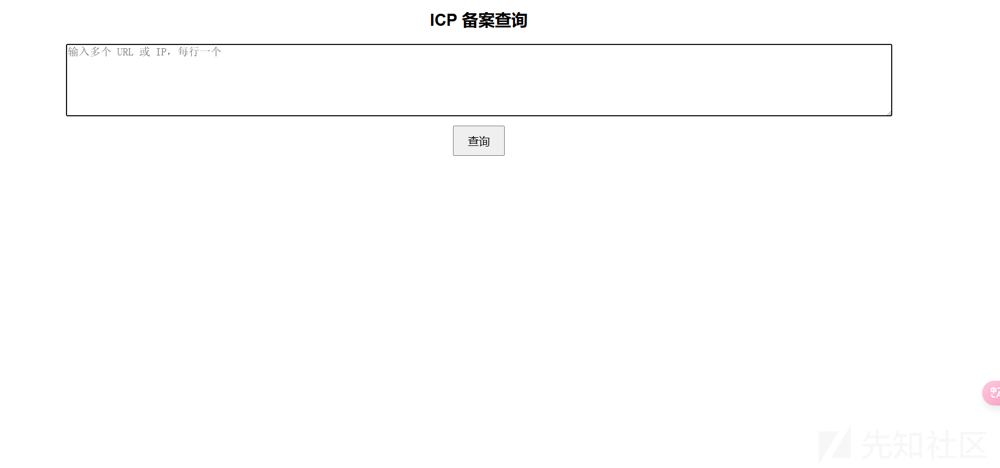

查询后的结果

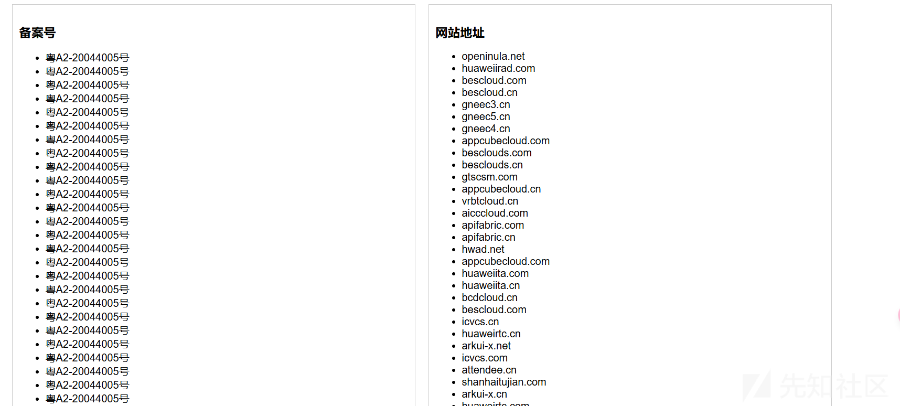

但是发现还是有需要优化的地方

### 工具栏和缓存问题

因为发现点击这个页面后工具栏消失了，而且我输入也会消失，估计需要改一下前端和缓存的问题

如下

首先缓存需要加上

```
@url_bp.route("/icp_search", methods=["GET", "POST"])
def icp_search():
    input_data = ""
    records, urls = [], []

    if request.method == 'POST':
        input_data = request.form.get('input_data', '')
        result = run_icp_search(input_data)
        records, urls = result["备案号"], result["网站地址"]

    return render_template('icp_search.html', input_data=input_data, records=records, urls=urls)

```

然后模板我修改了一下

```


ICP 备案查询


    <h2>ICP 备案查询</h2>
    <form action="/url/icp_search" method="post">
        <textarea name="input_data" placeholder="输入多个 URL 或 IP，每行一个">{{ input_data }}</textarea><br>
        <button type="submit">查询</button>
    </form>
    
    <div class="result-container">
        <div class="box">
            <h3>备案号</h3>
            <textarea readonly>{{ record }}&#10;</textarea>
        </div>
        <div class="box">
            <h3>网站地址</h3>
            <textarea readonly>{{ url }}&#10;</textarea>
        </div>
    </div>
    


```

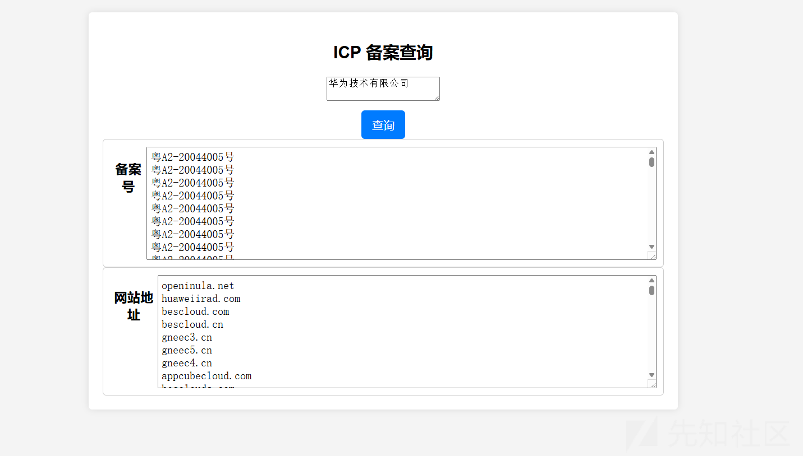

最终效果如下，感觉很简洁了

### ICP 查询优化

我思考了一下   
icp 查询是三个要素，备案号，域名，公司名称，三者知道一个就能够查询两个

所以我们还需要修改代码逻辑，然后修改匹配规则  
当时考虑的实现逻辑如下

第一就是判断我们输入的是什么，然后把对应的结果分类输出，但是感觉太麻烦了，结合数据，发现三个结果都有，所以我们不管输入的是什么，只需要把输出分类就 ok 了

逻辑部分

```
import re
import subprocess
import os


def run_icp_search(input_data):
    input_file = 'input.txt'
    with open(input_file, 'w', encoding='utf-8') as f:
        f.write(input_data)

    exe_path = r'F:\gj\ICP一键查询\ICP.exe'
    if not os.path.exists(exe_path):
        return {"备案号": ["ICP.exe 不存在"], "域名": [], "公司名称": []}

    try:
        cmd = r'F:\gj\ICP一键查询\ICP.exe -f input.txt'
        result = subprocess.check_output(cmd, shell=True, stderr=subprocess.STDOUT, encoding='utf-8')

        # 调试信息
        print("调试信息：ICP.exe 输出结果:")
        print(result)

        # **优化后的正则表达式**
        record_pattern = r'\[icpCode\]:\s*([^\s\[\]]+)'  # 备案号
        domain_pattern = r'\[Domain\]:\s*([\w.-]+)'  # 域名
        company_pattern = r'\[Unit\]:\s*([^
\[\]]+)'  # 公司名称

        records = re.findall(record_pattern, result)
        domains = re.findall(domain_pattern, result)
        companies = re.findall(company_pattern, result)


        if not (records and domains and companies):
            return {"备案号": ["未找到匹配项"], "域名": ["未找到匹配项"], "公司名称": ["未找到匹配项"]}

        return {"备案号": records, "域名": domains, "公司名称": companies}

    except subprocess.CalledProcessError as e:
        print("执行错误:", e.output)
        return {"备案号": ["执行错误"], "域名": [], "公司名称": []}
    except Exception as e:
        print("未知错误:", str(e))
        return {"备案号": ["未知错误"], "域名": [], "公司名称": []}

```

前端

```


ICP 备案查询


    <h2>ICP 备案查询</h2>
    <form action="/url/icp_search" method="post">
        <input type="text" name="input_data" placeholder="输入备案号、域名或公司名称" value="{{ input_data }}"><br>
        <button type="submit">查询</button>
    </form>
    
    <div class="result-container">
        <div class="box">
            <h3>备案号</h3>
            <textarea readonly>{{ record }}&#10;</textarea>
        </div>
        <div class="box">
            <h3>域名</h3>
            <textarea readonly>{{ domain }}&#10;</textarea>
        </div>
        <div class="box">
            <h3>公司名称</h3>
            <textarea readonly>{{ company }}&#10;</textarea>
        </div>
    </div>
    


```

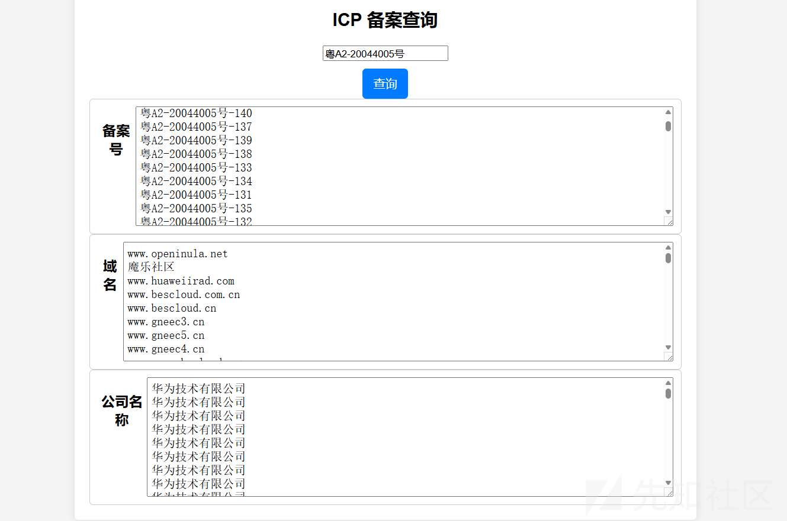

这下是真舒服了

但是自己又发现了问题，就是我需要批量输入数据的时候不行

### 解决批量输入数据问题

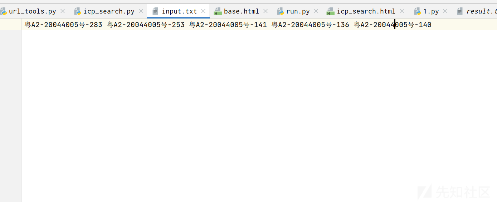

输入是这样的，当然不能识别

修改下前端就 ok 了

```


ICP 备案查询


    <h2>ICP 备案查询</h2>
    <form action="/url/icp_search" method="post">
        <label for="input_data">请输入数据（每行一条）：</label><br>
        <textarea id="input_data" name="input_data" rows="8" cols="80" placeholder="输入备案号、域名或公司名称，每行一条">{{ input_data }}</textarea><br>
        <button type="submit">查询</button>
    </form>
    
    <div class="result-container">
        <div class="box">
            <h3>备案号</h3>
            <textarea readonly rows="8" cols="40">{{ record }}&#10;</textarea>
        </div>
        <div class="box">
            <h3>域名</h3>
            <textarea readonly rows="8" cols="40">{{ domain }}&#10;</textarea>
        </div>
        <div class="box">
            <h3>公司名称</h3>
            <textarea readonly rows="8" cols="40">{{ company }}&#10;</textarea>
        </div>
    </div>
    


```

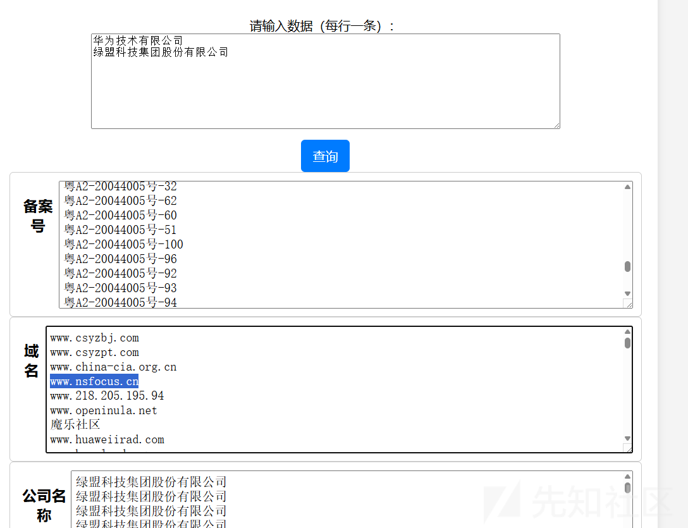

这下真完美了吧

但是还有问题

### 解决纯 ip 问题

我发现数据中有很多奇怪的数据

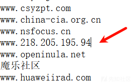

可能工具的问题吧，但是这种纯 ip 我直接不要吗，又害怕错过资产，所以我思考单独放一个

这个会非常的快

后端匹配逻辑简单修改一下就 ok 了

```
import re
import subprocess
import os


def run_icp_search(input_data):
    input_file = 'input.txt'
    with open(input_file, 'w', encoding='utf-8') as f:
        f.write(input_data)

    exe_path = r'F:\gj\ICP一键查询\ICP.exe'
    if not os.path.exists(exe_path):
        return {"备案号": ["ICP.exe 不存在"], "域名": [], "无效域名": [], "公司名称": []}

    try:
        cmd = r'F:\gj\ICP一键查询\ICP.exe -f input.txt'
        result = subprocess.check_output(cmd, shell=True, stderr=subprocess.STDOUT, encoding='utf-8')

        # 调试信息
        print("调试信息：ICP.exe 输出结果:")
        print(result)

        # **优化后的正则表达式**
        record_pattern = r'\[icpCode\]:\s*([^\s\[\]]+)'  # 备案号
        domain_pattern = r'\[Domain\]:\s*([\w.-]+)'  # 域名
        company_pattern = r'\[Unit\]:\s*([^
\[\]]+)'  # 公司名称

        records = re.findall(record_pattern, result)
        domains = re.findall(domain_pattern, result)
        companies = re.findall(company_pattern, result)

        valid_domains = []  # 存放正常域名
        invalid_domains = []  # 存放 IP 地址（无效域名）

        # 识别 IP 并分离
        ip_pattern = re.compile(r'^(?:www\.)?(\d{1,3}\.\d{1,3}\.\d{1,3}\.\d{1,3})$')  # 匹配 www. 开头的 IP

        for domain in domains:
            match = ip_pattern.match(domain)
            if match:
                invalid_domains.append(match.group(1))  # 只保留 IP 地址
            else:
                valid_domains.append(domain)  # 其他正常域名保留

        if not (records or valid_domains or invalid_domains or companies):
            return {"备案号": ["未找到匹配项"], "域名": ["未找到匹配项"], "无效域名": ["未找到匹配项"], "公司名称": ["未找到匹配项"]}

        return {
            "备案号": records,
            "域名": valid_domains,
            "无效域名": invalid_domains,
            "公司名称": companies
        }

    except subprocess.CalledProcessError as e:
        print("执行错误:", e.output)
        return {"备案号": ["执行错误"], "域名": [], "无效域名": [], "公司名称": []}
    except Exception as e:
        print("未知错误:", str(e))
        return {"备案号": ["未知错误"], "域名": [], "无效域名": [], "公司名称": []}

```

路由缓存数据

```
@url_bp.route("/icp_search", methods=["GET", "POST"])
def icp_search():
    input_data = ""
    records, valid_domains, invalid_domains, companies = [], [], [], []

    if request.method == 'POST':
        input_data = request.form.get('input_data', '').strip()
        result = run_icp_search(input_data)

        records = result["备案号"]
        valid_domains = result["域名"]
        invalid_domains = result["无效域名"]
        companies = result["公司名称"]

    return render_template('icp_search.html', input_data=input_data, records=records, domains=valid_domains,
                           invalid_domains=invalid_domains, companies=companies)
```

前端加入我们单独的 ip

```


ICP 备案查询


    <h2>ICP 备案查询</h2>
    <form action="/url/icp_search" method="post">
        <label for="input_data">请输入数据（每行一条）：</label><br>
        <textarea id="input_data" name="input_data" rows="8" cols="80" placeholder="输入备案号、域名或公司名称，每行一条">{{ input_data }}</textarea><br>
        <button type="submit">查询</button>
    </form>
    
    <div class="result-container">
        <div class="box">
            <h3>备案号</h3>
            <textarea readonly rows="8" cols="40">{{ record }}&#10;</textarea>
        </div>
        <div class="box">
            <h3>正常域名</h3>
            <textarea readonly rows="8" cols="40">{{ domain }}&#10;</textarea>
        </div>
        <div class="box">
            <h3>无效域名（纯 IP）</h3>
            <textarea readonly rows="8" cols="40" style="background-color: #ffdddd;">{{ invalid_domain }}&#10;</textarea>
        </div>
        <div class="box">
            <h3>公司名称</h3>
            <textarea readonly rows="8" cols="40">{{ company }}&#10;</textarea>
        </div>
    </div>
    


```

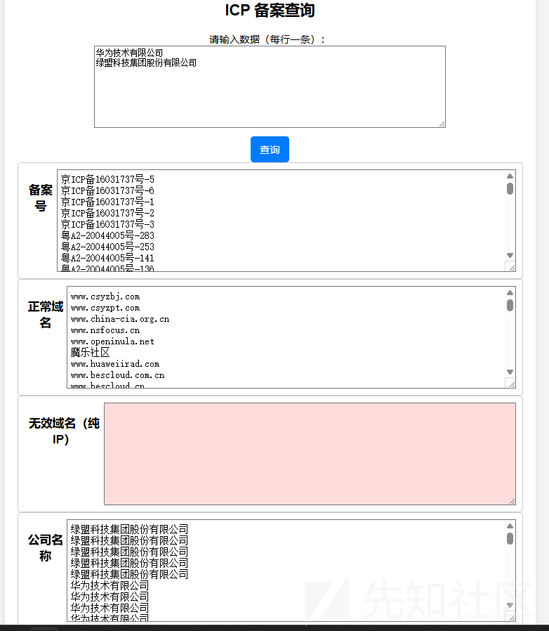

这下是真完美了，完美了，累死了
