# 记一次EDU供应链渗透源码获取之路-先知社区

> **来源**: https://xz.aliyun.com/news/17216  
> **文章ID**: 17216

---

# 声明

本文章中所有内容仅供学习交流，严禁用于商业用途和非法用途，否则由此产生的一切后果均与文章作者无关。

# 前言

供应链exe安装包到源码审计至大量AKSK，TOKEN泄露之旅

# 源码获取

这里直接找到学校使用该系统的官网然后直接把exe安装包下载下来

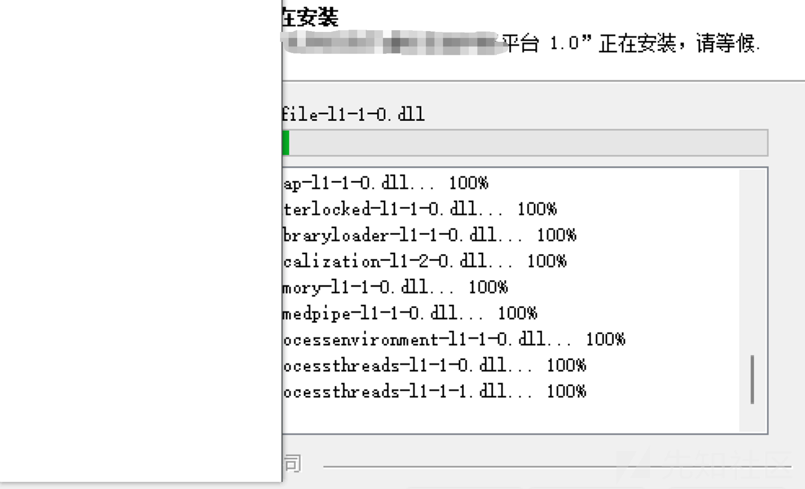

安装成果后会在D盘存储网站源码，配置文件等信息

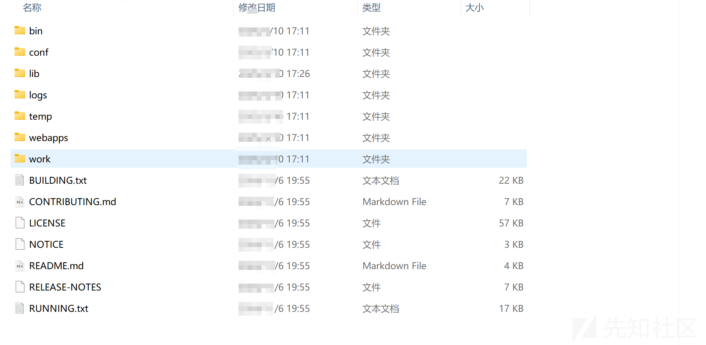

先简单看下是否存在db,sql文件，有的话可以直接看看是否存在初始化用户密码信息，这里发现某sql文件存在用户信息，但是没有密码

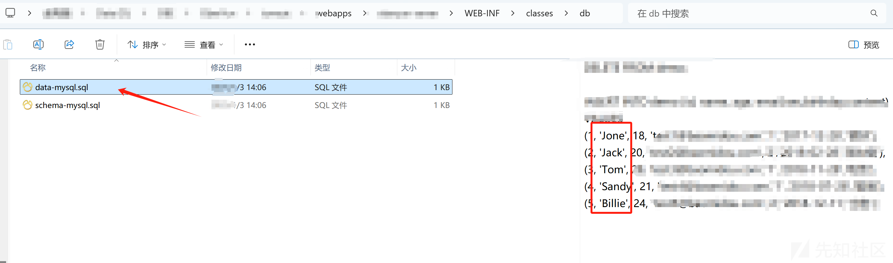

这里简单去网站进行登录发现用户名确实，但是没有弱口令所以这条路没办法走了

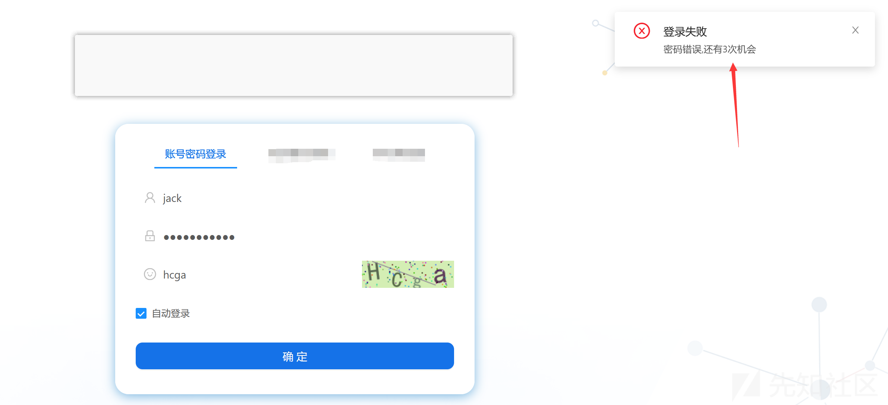

# AKSK泄露

Java代码搭建的网站，直接看源码，先看配置文件，好家伙，找到三个aksk

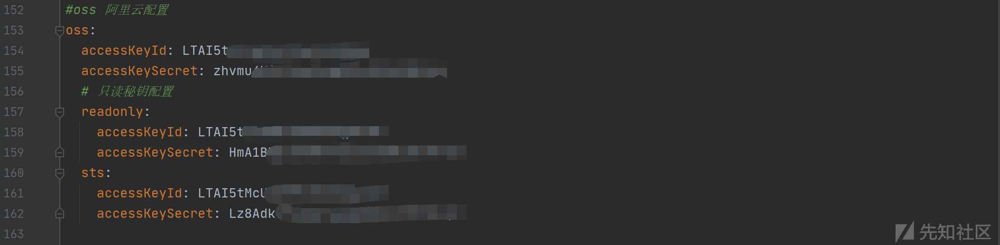

其中两个是可以登录进去的，有一个无法登录

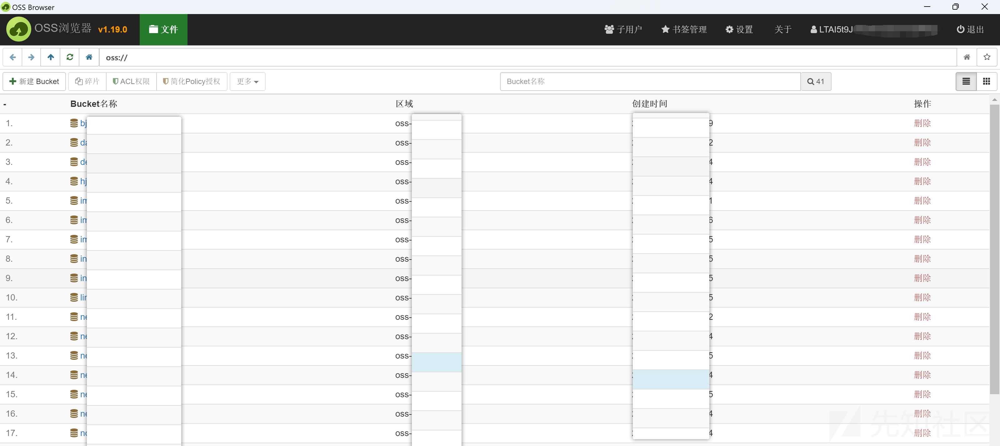

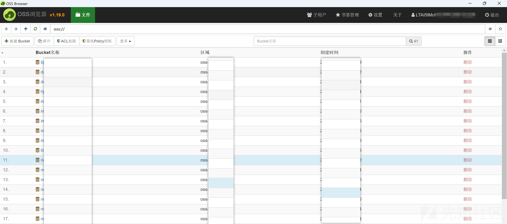

# druid弱口令

这里配置文件发现druid账号密码泄露

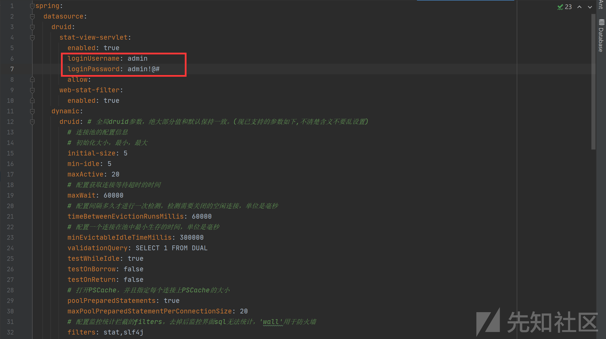

这里还比较难搞的一点就是网站是一个二级目录，没有源码的情况下你目录扫描其实挺难搞得

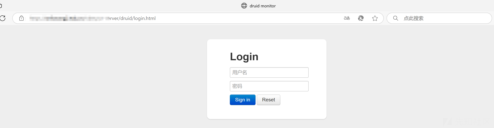

好在运气不错，这里也是直接登进去了

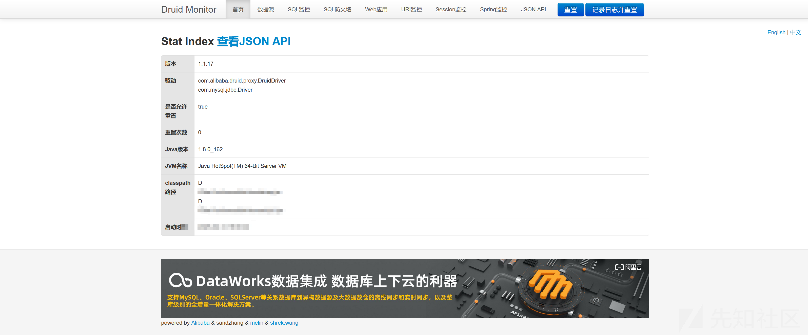

# secret泄露

配置文件查看关闭后审了一会代码，发现很多接口但是全部都是鉴权的，所以也不好搞，好在这里泄露了一个企业微信的id和secret值

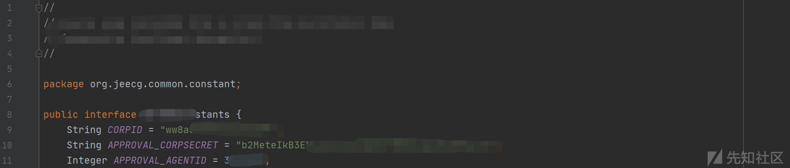

直接使用企业微信接口生成token，好消息，有用

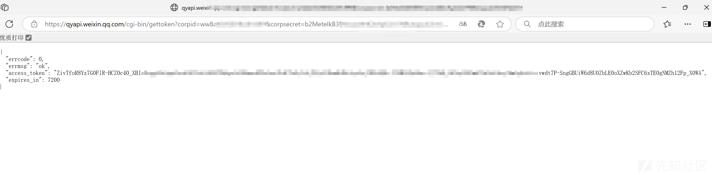

获取企业微信API域名IP段

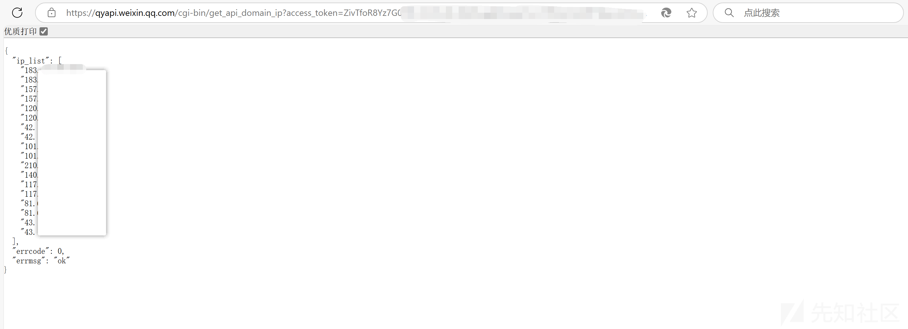

获取部门列表，也没有问题，说明此token可用，权限应该还不小

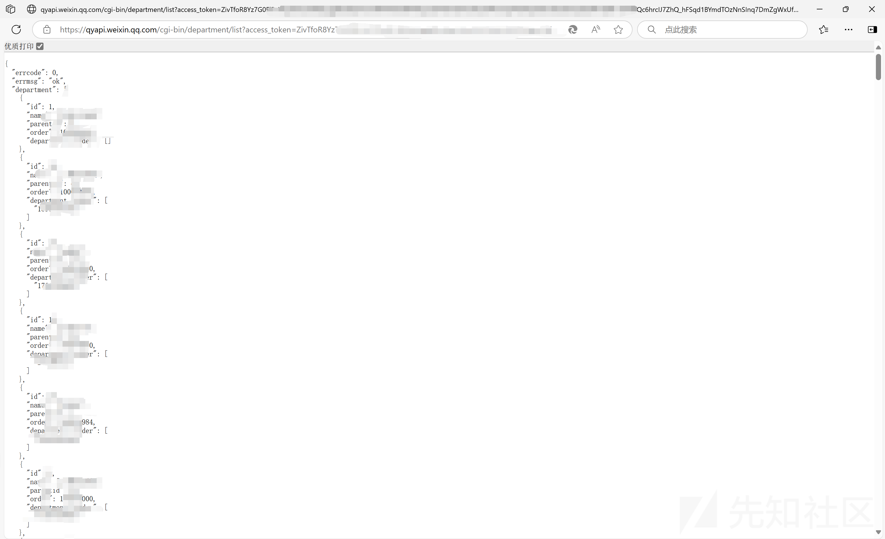

这里还发现了公众号的id和secret泄露，也可以使用，这里也就不截图了

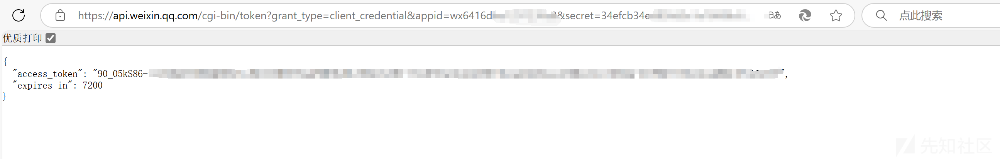

# 供应链

通过代码审计还找到了某个IP相关的信息，猜测是供应链系统，直接使用代码中的弱口令可以登录后台和rediss服务器，这里直接扩大危害到最大

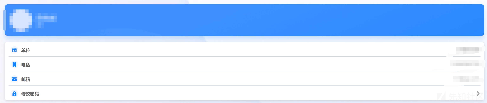

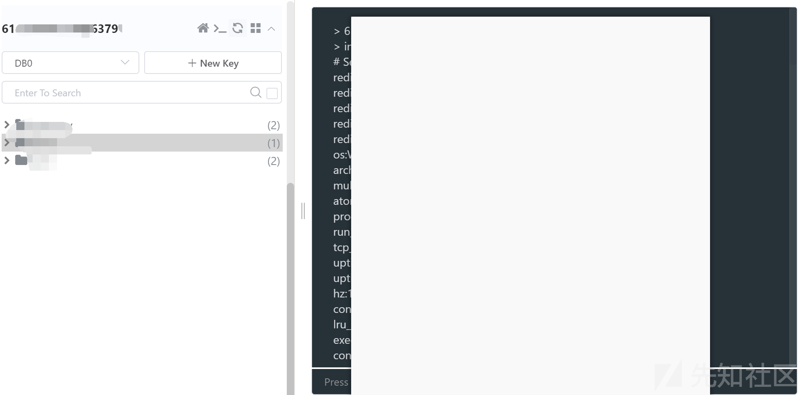
